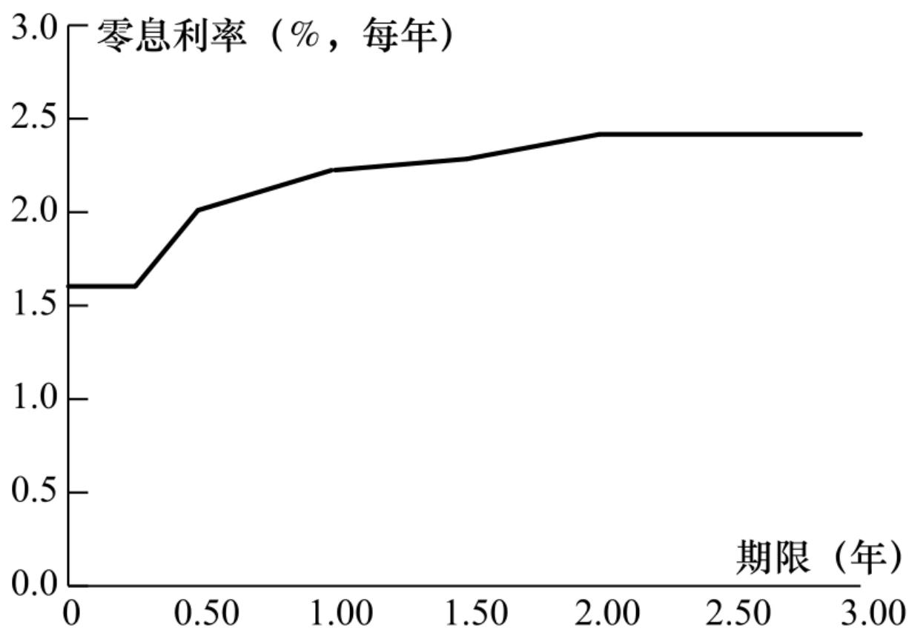
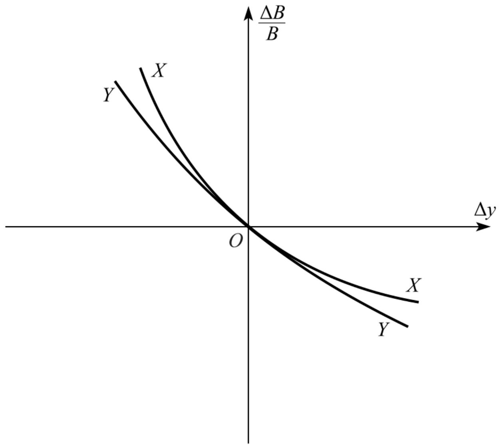

# 第4章 利率

利率是决定几乎所有衍生产品价格的因素之一。在本书今后的内容中，有关利率的内容将会占据非常显著的位置。在这一章中我们将介绍一些不同类型的利率，以及有关度量和分析利率的一些基本问题。我们将解释定义利率所用的复利频率，以及在衍生产品分析中有着广泛应用的连续复利利率的含义。本章包括零息利率、平价收益率、收益率曲线以及债券定价分析方面的内容，而且还将描述衍生产品交易员经常采用的计算零息国债利率的方法。本章还将讨论远期利率、远期利率合约以及关于利率期限结构的不同理论。最后，我们将讨论如何利用久期与凸性来确定债券价格对利率的敏感度。

在第6章中我们将讨论利率期货，并说明当对冲利率风险敞口时如何利用久期测度。为了便于解释问题，在本章中我们将忽略天数计算惯例，在第6章和第7章中将会讨论这些惯例的性质以及对于计算的影响。

## 4.1 利率的种类

利率定义了在指定情况下借入方承诺支付给借出方的资金数量。在任何货币中都会经常引用许多种类型的利率，其中包括住房抵押贷款利率、存款利率、最优客户利率(prime borrowing rate)等。特定情形下所用的利率与信用风险有关，信用风险是因为借入方对偿还本金和利息的承诺违约时而造成的风险，信用风险越大，借入方承诺的利率也应越高。附加在无风险利率之上、反应信用风险的额外量称为信用溢差(credit spread)。

我们经常会用基点来表示利率，一个基点代表每年0.01%。

## 4.1.1 国债利率

国债收益率是投资者将资金投资于国库券或国债时所挣得的收益率。国库券和国债是政府借入自身货币而发行的金融产品。日元国债收益率是指日本政府借入日元资金的利率，美国国债收益率是指美国政府借入美元的利率，等等。我们通常认为一个政府不会对自己发行并以自己货币为单位的债务违约，因此国债利率为无风险利率，即买入短期和中长期国债的投资者肯定会收到国债所承诺的本金和利息。

## 4.1.2 隔夜利率

在美国，金融机构都要在美联储存入一定数量的现金（称为存款准备金）。在任何时刻，银行需要存入的存款准备金数量与银行的资产负债状态有关。在一天结束时，有些金融机构在美联储设定账户中会有资金盈余，有些金融机构会有资金缺口，这就导致了隔夜拆借。在美国，隔夜利率被称为联邦基金利率(federal funds rate)。借入和借出资金交易往往是通过经纪商来达成的，所有经纪商所达成交易的利率加权平均（权重与交易规模有关）称为实际联邦基金利率(effective federal funds rate)，该利率由中央银行监控。在必要时，央行可以通过自身交易来对利率的水平进行调整。其他国家也有与美国相似的机制。例如，在英国，经纪商达成的平均利率称为英镑隔夜指数平均利率(sterling overnight index average, SONIA)；在欧元区，相应的利率称为欧元短期利率(euro short-term rate,ESTER)； ㊟ 【ESTER取代了欧元隔夜指数平均值(EONIA)。】 在瑞士，相应的利率是瑞士隔夜平均利率(Swiss average rateovernight, SARON)；在日本，相应的利率是东京隔夜平均利率(Tokyoovernight average rate, TONAR)。

## 4.1.3 回购利率

与隔夜联邦基金利率不同，回购利率是有抵押的借贷利率。在再回购合约中，拥有证券的金融机构同意将证券出售给合约的另一方，并在将来以稍高的价格将证券买回。金融机构由此得到的是贷款，所支付的利息等于证券卖出与买入之间的差价，相应的利率称为回购利率(repo rate)。

如果仔细地设计回购合约，这种交易几乎没有信用风险。如果借款人不履行合约，那么借出方可以保留证券。如果资金借出方不履行合约，那么证券的原拥有人可以保留现金。最流行的回购合约是隔夜回购(overnight repo)，这种回购合约每天都要重新设定。但有时从业者也使用期限较长的合约，即所谓的期限回购(term repo)。因为回购利率对应于有抵押的借贷，所以回购利率比相应的联邦基金利率在理论上稍低一些。

有担保隔夜融资利率(secured overnight financing rate,SOFR)是关于美国短期隔夜回购交易利率以重要交易量为权重的中值平均。

## 4.2 参考利率

金融市场的参考利率十分重要，交易商在签订合约时，其收到或支出的利率具有不定性，一般会设定为等于某个参考利率的值。

## 4.2.1 LIBOR

LIBOR是伦敦银行同业拆借利率(London interbank offeredrate)的简称。在历史上LI-BOR一直是一个非常重要的参考利率，它是由若干全球银行参与的一个小组来提供的。这个小组通过询问其成员银行在上午11点（英国时间）之前可以向其他银行借款的无息利率来计算LIBOR。LIBOR包括几种不同的货币和若干不同的期限（从1天到1年不等），提交报价的银行通常具有良好的信用评级。因此，LIBOR被认为是对信誉良好的银行提供的无担保借款利率的估计值。

LIBOR一直是被当成全球数万亿美元交易的参考利率。例如，在特定情况下，一个5年期贷款的借款利率可以指定为3个月LIBOR加30个基点（即3个月LIBOR+0.3%），3个月的LIBOR利率的取值在每3个月的期初锁定，借款人将在期末支付基于该利率得出的利息。

LIBOR的一个问题是由于银行之间没有足够的借款业务，银行对于利率的估值无法由市场交易来确定。因此，银行给LIBOR估值需要进行主观判断，可能会受到操纵。银行监管机构对此感到十分不安，并制订了逐步取消LIBOR的计划。在监管给出的最初计划中，终止LIBOR的最后期限是2021年年底，但LIBOR报价可能会在之后延续一段时间，以便于市场处理依赖LIBOR的现存合同。

## 4.2.2 新的参考利率

取代LIBOR的计划由以上提及的隔夜利率为基准来制定参考利率。例如，美国的新参考利率为SOFR；英国将使用SONIA；欧元区将使用ESTER；瑞士将使用SARON；日本将使用TONAR。（注意，美国的隔夜利率将是有担保的隔夜利率，因为它是回购利率；其他国家的隔夜利率将是无担保的。如前所述，隔夜利率是由银行管理自身资金时产生的隔夜交易来决定的。）

对于较长期限的利率，如3个月利率、6个月利率或1年期利率，我们可以根据隔夜利率、并通过每日复利的方式来确定。对于SOFR利率，假设每年有360天。（关于日计数惯例，见第6章）假设某个时段的第i个交易日的（年化）SOFR隔夜利率为 $\operatorname{\Pi} _{\operatorname{\Pi}} \operatorname{\Pi} _{1} \left( 1 {\leqslant} \operatorname{i} {\leqslant} \operatorname{n} \right)$ ，假设该利率适用时段包括di天，整个时段的（年化）利率为

$$
\left[ \left(1 + r_{1} \hat{d} _{1}\right) \left(1 + r_{2} \hat{d} _{2}\right) \dots \left(1 + r_{n} \hat{d} _{n}\right) - 1 \right] \times \frac{360}{D}
$$

$$
\hat{d} _{i} = \frac{d_{i}}{360}
$$

其中 ，D=∑idi,di为第i个利率适用的天数，在大多数情况下，di等于1，对于周末和节假日，di会大于1。（例如，对于大多数周五，di等于3。）

新的参考利率被当成是无风险利率，因为它们来自对信誉良好的金融机构的一天期贷款。相比之下，LIBOR包含了信用利差。新旧参考利率之间还有一个重要区别：LIBOR具有前瞻性，而新的参考利率是向后看的。也就是说，直到观察所有相关的隔夜利率后，我们才知道适用于特定时期的利率。

我们将在第7章中讨论互换产品运用的一种利用短期利率来确定相对较长时段的等价利率的方法。

## 4.2.3 参考利率和信用风险

银行面临的一个问题是，在压力市场条件下，经济环境中的信用溢差会增加。例如，3个月LIBOR与基于隔夜利率的3个月利率之间的溢差通常约为10个基点(0.1%)，但在压力较大的市场条件下，该溢差可能会高很多。例如，2008年10月金融危机期间，该信用溢差飙升至364个基点(3.64%)的历史高点。如果一家银行以某个参考利率加上x%来提供贷款，其中x是一个常数，它希望利率反映平均信用溢差的波动。当我们将LIBOR用作参考利率时，它做到了这一点，但新的参考利率（因为它们基本上是无风险的）却起不到这个作用。这导致银行要求在新的参考利率基础上增加信用溢差，从而创造出一种有风险的参考利率。市场上已经有了许多提议，未来新的无风险参考利率可能会附加一定的信用溢差。

## 4.3 无风险利率

我们将会看到，对衍生产品的定价一般是通过建立一个无风险投资组合，然后使投资组合的回报等于无风险利率，因此无风险利率在衍生产品定价过程中起着关键作用。人们也许会认为衍生产品交易员会使用国库券利率或国债利率作为无风险利率，但事实并非如此。原因是税收与监管的因素，这些利率人为地定得很低。例如：

(1)当投资于国债证券时，银行不需要保留资金，但投资于其他风险很低的证券时却需要。

(2)在美国，与其他风险很低的证券相比，对国债投资的税收政策要好很多，因为国债投资所得利息不用交州税。

由隔夜利率（见第4.2节）派生出的无风险参考利率是用于对于衍生产品定价的利率。

## 4.4 利率的度量

银行注明一年的储蓄利率为10%，这句话听起来虽然非常直接并且含义清楚，但事实上这句话的精确含义依赖于利率的计算方式。

如果利率计算方式是一年复利一次，银行所说的10%利率是指100美元在年终会增长为

100×1.1=110（美元）

如果利率的计算方式为每半年复利一次，这表示每6个月会赚取5%的利息，而且利息也被用于再投资，这时100美元在一年后将会增长为100×1.05×1.05=110.25（美元）

如果利率计算方式为每季度复利一次，银行所说的利率是指每3个月会赚取2.5%的利息收入，而且所得利息均用于再投资，这样100美元在一年后将会增长为

100×1.0254=110.38（美元）

表4-1列出了复利频率增长的影响。

表4-1 利率为每年10%，复利频率的增加对于100美元在一年后价值的影响

<table><tr><td>复利频率</td><td>100 美元投资在年底的价值(美元)</td><td>复利频率</td><td>100 美元投资在年底的价值(美元)</td></tr><tr><td>每年 1 次( $m = 1$ )</td><td>110.00</td><td>每月 1 次( $m = 12$ )</td><td>110.47</td></tr><tr><td>每半年 1 次( $m = 2$ )</td><td>110.25</td><td>每周 1 次( $m = 52$ )</td><td>110.51</td></tr><tr><td>每季度 1 次( $m = 4$ )</td><td>110.38</td><td>每日 1 次( $m = 365$ )</td><td>110.52</td></tr></table>

复利频率定义了在计算利率时的时间单位。一年复利一次的利率可以被转换成按不同频率复利的等价利率。例如，由表4-1我们可以看到一年复利一次10.25%利率与一年复利两次10%利率等价，利率在不同计息频率下的关系可以与英里同千米之间的关系相比，它们代表的是不同的计量单位。

为了推广以上结果，我们假设将数量为A的资金投资n年。如果利率是按年复利，那么投资的终值为

$$
\mathrm{A} (1 + \mathrm{R}) \mathrm{n}
$$

如果利率是一年复利m次，投资终值为

$$
A \left(1 + \frac{R}{m}\right) ^{m n}\tag{4-1}
$$

当m=1时所对应的利率有时称为等值年利率(equivalent annualinterest rate)。

假设R1是每年复利m1次的利率，R2是与其等价但每年复利m2次的利率，由式(4-1)可知，如果

$$
A \left(1 + \frac{R_{1}}{m_{1}}\right) ^{m_{1} n} = A \left(1 + \frac{R_{2}}{m_{2}}\right) ^{m_{2} n}
$$

价值为A的投资在n年后相同。因此

$$
R_{2} = m_{2} \left[ \left(1 + \frac{R_{1}}{m_{1}}\right) ^{\frac{m_{1}}{m_{2}}} - 1 \right]
$$

作为应用这个公式的例子，假设按半年复利的利率是6%，令m1=2,R1=0.06,m2=4就可以得出与此等价的按季度复利利率：

$$
R_{2} = 4 \left[ \left(1 + \frac{0 . 06}{2}\right) ^{\frac{2}{4}} - 1 \right] = 0. 0596
$$

即5.96%。

连续复利

复利频率m趋于无穷大时所对应的利率叫连续复利(continuouscompounding)利率。 ㊟ 【在精算领域，连续复利利率也被称为利率强度(force of interest)。】 在连续复利情况下，可以证明数量为A的资金投资n年时，投资的终值为

$$
A \mathbf{e} ^{R n}\tag{4-2}
$$

其中e=2.71828。大多数计算器中都有计算指数函数ex的功能，所以计算表达式(4-2)时不会产生任何麻烦。在表4-1的例子中，$\mathtt{A = 100 , n = 1}$ ，R=0.1，按连续复利时数量为A的资金在投资一年后将增长到

$$
100 \mathrm{e} 0. 1 = 110. 52 (\text{美元})
$$

这个精确到小数点后两位的数值与用每天复利所得的结果一样。在大多数的实际情况下，我们可以认为连续复利与每天复利等价。对一笔资金以利率R连续复利n年相当于乘上eRn项。而对一笔在第n年后的资金以利率R按连续复利进行贴现，其效果相当于乘上e-Rn。

在本书中，除非特别指明，利率将按连续复利来计算。习惯于按每年、每半年、每季度或其他复利频率的读者可能在开始时会感到别扭。但是，在衍生产品定价中，连续复利利率的应用非常广泛，所以应当习惯它的使用。

假设Rc是连续复利利率，Rm是与之等价的每年m次复利利率。由表达式(4-1)与式(4-2)，我们得出

$$
A \mathrm{e} ^{R_{c} n} = A \left(1 + \frac{R_{m}}{m}\right) ^{m n}
$$

和

$$
\mathrm{e} ^{R_{c}} = \left(1 + \frac{R_{m}}{m}\right) ^{m}
$$

这就是说

$$
R_{c} = m \ln \left(1 + \frac{R_{m}}{m}\right)\tag{4-3}
$$

和

$$
R_{m} = m \left(\mathrm{e} ^{R_{c} / m} - 1\right)\tag{4-4}
$$

这些式子可以将每年m次复利的利率转换为连续复利的利率，反之亦然。自然对数函数lnx是指数函数的反函数：如果 $\operatorname{\mathrm{: y = l n x}}$ ，那么$\mathtt{X} ^{=} \mathrm{e y}$ 。大多数计算器都有计算这个函数的功能。

【例4-1】 假设利率报价为每年10%按半年复利。因此$\mathrm{m} {=} 2$ ,Rm=0.1，由式(4-3)得出，与之等价的连续复利利率为

$$
2 \ln \left(1 + \frac{0 . 1}{2}\right) = 0. 09758
$$

即每年9.758%。

【例4-2】 假设某贷款人对贷款利率的报价为每年8%，连续复利，利息每季度支付一次，因此m=4，Rc=0.08。由式(4-4)得出，与之等价的按季度复利的利率为

$$
4 \times (\mathrm{e} 0. 08 / 4 - 1) = 0. 0808
$$

即每年8.08%。这意味着，对于1000美元的贷款，每季度支付利息为20.20美元。

## 4.5 零息利率

n年的零息利率是指在今天投入资金并连续保持n年后所得的收益率。所有的利息以及本金都在第n年年末支付给投资者，在n年期满之前，不支付任何利息收益。n年期的零息利率有时也叫作n年期的即息利率(spot rate)，或者n年期零息率(zero rate)，或者n年期的零率(zero)。假如5年期连续复利的零息利率是每年5%，这意味着今天的100美元在投资5年后会增长到

$$
100 \times \mathrm{e} 0. 05 \times 5 = 128. 40 (\text{美元})
$$

许多可以在市场上直接观察到的利率并不是纯零息利率。考虑一个券息为6%的5年期政府债券，这个债券本身的价格并不能决定5年期的零息利率，这是因为债券的一些券息发生在5年后的到期日之前。在本章以后的内容中我们将讨论如何由带券息的债券市场价格计算零息利率。

## 4.6 债券定价

大多数债券提供周期性的券息，债券发行人在债券满期时将债券的本金（有时也称为面值）偿还给投资者。债券的理论价格等于对债券持有人在将来所收取的现金流贴现后的总和。有时债券交易者用单一贴现率对债券的所有现金流进行贴现，但更精确的办法是对不同现金流采用不同的零息贴现率。

为了说明这一点，假设零息利率由表4-2给出（在后面我们将说明如何计算这些值），表中的利率是按连续复利。假设一个两年期债券的本金为100美元，券息为6%，每半年付息一次。为了计算第1个3美元券息的现值，我们用5.0%的6个月贴现率贴现；为了计算第2个3美元券息的现值，我们用5.8%的1年贴现率，依此类推。因此债券的理论价格为

表4-2 零息利率

<table><tr><td>期限(年)</td><td>零息利率(%,连续复利)</td></tr><tr><td>0.5</td><td>5.0</td></tr><tr><td>1.0</td><td>5.8</td></tr><tr><td>1.5</td><td>6.4</td></tr><tr><td>2.0</td><td>6.8</td></tr></table>

3e-0.05×0.5+3e-0.058×1.0+3e-0.064×1.5+103e-0.068×2=98.39（美元）

## 4.6.1 债券收益率

债券收益率是指将此收益率用于对债券所有的现金流进行贴现后，所得现值等于债券的市场价格。假设我们上面考虑的债券理论价格也是其市场价格，即98.39美元（这里的债券市场价格与表4-2中的数据完全一致）。如果y表示按连续复利的债券收益率，我们有

$$
\mathrm{3e- y\times 0.5 + 3e- y\times 1.0 + 3e- y\times 1.5 + 103e- y\times 2 = 98.39}
$$

这一方程式的解可以通过迭代的方式（“反复试验”）得出，其解为y=6.76%。 [1]

## 4.6.2 平价收益率

对应于具有某一期限的债券平价收益率(par yield)是使债券价格等于面值的券息率。债券通常每半年支付一次券息。假定债券每年支付的券息为c（或每6个月c/2）。采用表4-2中的零息利率，当以下方程成立时债券价格等于其面值，即100

$$
\frac{c}{2} \mathrm{e} ^{- 0. 05 \times 0. 5} + \frac{c}{2} \mathrm{e} ^{- 0. 058 \times 1. 0} + \frac{c}{2} \mathrm{e} ^{- 0. 064 \times 1. 5} + (100 + \frac{c}{2}) \mathrm{e} ^{- 0. 068 \times 2. 0} = 100
$$

我们可以直接计算这一方程的解：c=6.87。两年期的平价收益率为6.87%每年。

一般地讲，如果d为债券到期时收到1美元的贴现值，A为一个年金（annuity，即在每个券息日支付1美元）现金流的现值，m为每年券息支付的次数，那么平价收益率满足

$$
100 = A \frac{c}{m} + 100 d
$$

因此

$$
c = \frac{(100 - 100 d) m}{A}
$$

在我们的例子中， $\mathrm{m} {=} 2 , \mathrm{d} {=} \mathrm{e} {\mathrm{-}} 0 . 068 \times 2 {=} 0 . 87284$ ，以及

$$
\mathrm{A} = \mathrm{e} - 0. 05 \times 0. 5 + \mathrm{e} - 0. 058 \times 1. 0 + \mathrm{e} - 0. 064 \times 1. 5 + \mathrm{e} - 0. 068 \times 2. 0 = 3. 70027
$$

这个公式证实了平价收益率为每年6.87%，以此作为券息率并且每半年支付一次的债券价格等于其面值。

## 4.7 确定零息利率

本节将描述一种称为券息剥离法(bootstrap method)的步骤来确定零息利率。

考虑表4-3中有关5个债券价格的数据。因为前3个债券不支付券息，所以很容易计算对应于这些债券期限的零息利率。第1个债券的结果是将99.6的投资在第3个月后变成100，因此3个月的连续复利利率R满足

100=99.6eR×0.25

即每年1.603%。类似地，6个月的连续复利利率R满足100=99.0eR×0.5

即每年2.010%，类似地，1年的连续复利利率R满足100=97.8eR×1.0

即每年2.225%。

表4-3 券息剥离法数据

<table><tr><td>债券本金(美元)</td><td>期限(年)</td><td>息票①(美元)</td><td>债券价格(美元)</td><td>债券收益率②(%)</td></tr><tr><td>100</td><td>0.25</td><td>0</td><td>99.6</td><td>1.6064 (Q)</td></tr><tr><td>100</td><td>0.50</td><td>0</td><td>99.0</td><td>2.0202 (SA)</td></tr><tr><td>100</td><td>1.00</td><td>0</td><td>97.8</td><td>2.2495 (A)</td></tr><tr><td>100</td><td>1.50</td><td>4</td><td>102.5</td><td>2.2949 (SA)</td></tr><tr><td>100</td><td>2.00</td><td>5</td><td>105.0</td><td>2.4238 (SA)</td></tr></table>

①券息的一半每6个月支付一次。

②复利频率对应于支付频率：Q=按3个月复利，SA=按半年复利，A=按年复利。

第4个债券的期限为1.5年，券息和本金支付如下：

6个月时：2美元

1年时：2美元

1.5年时：102美元

由前面的计算，对于在6个月后支付的利息应采用贴现率2.010%，对于在1年后支付的利息应采用贴现率2.225%。我们知道债券价格为102.5，它必须等于债券持有人所有收入现值的总和。假定在1.5年所对应的零息利率为R，那么

$$
\mathrm{2e- 0.02010\times 0.5 + 2e - 0.02225\times 1.0 + 102e- R\times 1.5 = 102.5}
$$

以上方程可被简化为

e-1.5R=0.96631

即

$$
R = - \frac{\ln (0 . 96631)}{1 . 5} = 0. 02284
$$

因此1.5年所对应的零息利率为2.284%。这是唯一与6个月期限、1年期限以及表4-3数据一致的零息利率。

2年期的零息利率也可以通过类似的方法由6个月、1年以及1.5年的零息利率来求得：假定R为2年期的零息利率，我们有

$$
\begin{array}{l} 2. 5 \mathrm{e} - 0. 02010 \times 0. 5 + 2. 5 \mathrm{e} - 0. 02225 \times 1. 0 + 2. 5 \mathrm{e} - 0. 02284 \times 1. 5 + 102. 5 \mathrm{e} - \\ R \times 2. 0 = 105 \end{array}
$$

由此得出R=0.02416，即2.416%。

表4-4总结了计算的结果，表示零息利率与期限关系的图形叫零息利率曲线(zero curve)。在由券息剥离法所得数值节点之间，一般假定零息利率曲线为线性（这意味着在我们的例子中1.25年的零息利率等于0.5×2.225+0.5×2.284=2.255%）。通常还假定在零息利率曲线上第1个节点之前的利率和超出最后一个节点的利率为水平。图4-1就是建立在这些假设下的零息利率曲线。采用期限更长的债券，我们可以将零息利率曲线更精确地确定到2年以上。

表4-4 由表4-3数据所得出的连续复利零息利率

<table><tr><td>期限(年)</td><td>零息利率(%,连续复利)</td></tr><tr><td>0.25</td><td>1.603</td></tr><tr><td>0.05</td><td>2.010</td></tr><tr><td>1.00</td><td>2.225</td></tr><tr><td>1.50</td><td>2.284</td></tr><tr><td>2.00</td><td>2.416</td></tr></table>

在实际中，一般在市场上并没有期限正好等于1.5年、2年、2.5年等的债券。分析员通常的做法是在计算零息利率曲线之前首先对债券价格数据进行插值。例如，如果已知在2.3年到期、券息为6%的债券的价格为108，以及在2.7年到期、券息为6.5%的债券的价格为109，分析员可能会假定在2.5年到期的、券息率为6.25%的债券价格为108.5。还有一种更一般的方法（在下面OIS利率的例子中将使用这种方法）如下。定义t1，t2,…,tn为用来计算利率的债券价格，首先假定一个在这些时间之间为线性的曲线。利用“反复试验”的迭代方法确定在时间t1与第1个债券价格相匹配的利率，然后通过类似的步骤确定在时间t2与第2个债券相匹配的利率，依此类推。对任何试验利率，通过插值确定作为券息的利率。

  
图4-1 由券息剥离法得出的零息利率

更复杂的方式是对所有i在ti和ti+1之间的利率使用多项式或指数函数（而非线性函数）。选取函数时使所有债券的价格都能正确地确定，并且零息利率曲线的每个ti的坡度都不变。这种方法称为以样条函数表示零息利率曲线。

## 4.8 远期利率

远期利率(forward interest rate)是由当前零息利率所隐含的对应于将来时间段的利率。为了说明远期利率的计算方式，我们假设如表4-5中第2列所示的一组零息利率。假设这些利率是按连续复利，因此，1年期、3%年利率意味着今天投资100美元，在一年后投资者将得到100e0.03×1=103.05美元；2年期、4%年利率意味着今天投资100美元，在2年后投资者会得到100e0.04×2=108.33美元，等等。

表4-5中第2年的远期利率为每年5%。这是由第1年年末与第2年年末的零息利率隐含在第2年之间的利率，即由1年期、每年3%的零息利率与2年期、每年4%的零息利率计算得出的。这个用于第2年内的利率与第1年的利率结合将会得出2年期的利率4%。为了说明正确答案为每年5%，假定你投资100美元。第1年利率是3%和第2年利率是5%将意味着在第2年年末的收益是

表4-5 计算远期利率

<table><tr><td>年(n)</td><td>n年投资的零息利率(%,每年)</td><td>第n年的远期利率(%,每年)</td></tr><tr><td>1</td><td>3.0</td><td></td></tr><tr><td>2</td><td>4.0</td><td>5.0</td></tr><tr><td>3</td><td>4.6</td><td>5.8</td></tr><tr><td>4</td><td>5.0</td><td>6.2</td></tr><tr><td>5</td><td>5.3</td><td>6.5</td></tr></table>

100e0.03×1e0.05×1=108.33

将投资连续以4%利率投资两年得出的收益为$100 \mathrm{e} 0 . 04 \times 2$

也是108.33美元。这个例子说明了一个一般的结论：当按连续复利表达利率时，将相互衔接的时间段上的利率结合在一起，整个时间区间上的等价利率为各个时段利率的平均值。在我们的例子中，把第1年利率3%和第2年利率5%平均将会得到2年的利率4%。对于非连续复利的利率，这一结论只是近似地成立。

第3年的远期利率是由2年期的零息利率4%与3年期的零息利率4.6%隐含而出的，结果为每年5.8%。这是因为以4%利率投资两年以后再以5.8%利率投资1年将得出3年期平均利率为每年4.6%。用类似的方法可以计算其他远期利率，结果如表4-5中第3列所示。一般来讲，如果R1和R2分别对应期限为T1和T2的零息利率，RF为T1与T2之间的远期利率，那么

$$
R_{F} = \frac{R_{2} T_{2} - R_{1} T_{1}}{T_{2} - T_{1}}\tag{4-5}
$$

为了说明这一公式，考虑表4-5中第4年的远期利率：T1=3，T2=4，R1=0.046，R2=0.05，公式给出RF=0.062。

式(4-5)可以写成

$$
R_{F} = R_{2} + \left(R_{2} - R_{1}\right) \frac{T_{1}}{T_{2} - T_{1}}\tag{4-6}
$$

这一公式说明如果零息利率曲线在T1与T2之间呈上升趋势，即R2＞R1，那么RF＞R2（在T2结束的时间段上远期利率大于期限为T2的零息利率）。类似地，如果零息利率曲线呈下降趋势，即R2＜R1，那么RF＜R2（远期利率小于期限为T2的零息利率）。在式(4-6)中令T2接近于T1，并将共同值记为T，我们得到

$$
R_{F} = R + T \frac{\partial R}{\partial T}
$$

其中R是期限为T的零息利率，以这种方式得到的RF称为T的瞬时远期利率(instantaneous forward rate)。这是用于在T开始的一段很短的时间里的远期利率。定义P(0,T)为在时刻T到期的零息债券的价格，因为P $( 0 , \mathrm{T} ) {=} \mathrm{e {-} R T}$ ，瞬时远期利率的方程也可以写成

$$
R_{F} = - \frac{\partial}{\partial T} \ln P (0, T)
$$

假如表4-5给出了大型金融机构借入与借出资金的利率，这时金融机构可以锁定远期利率。例如，假设金融机构借入100美元，利率是3%，期限为1年，然后以4%的利率将资金投资两年。结果现金流是在第1年年末流出 $100 \mathrm{e 0 . 03} \times 1 \mathrm{= 103 . 05}$ 美元，在第2年年末收入$100 \mathrm{e} 0 . 04 \times 2 \mathrm{=} 108 . 33$ 美元。因为 $108 . 33 {\mathrm{=}} 103 . 05 {\mathrm{e}} 0 . 05$ ，所以在第2年的收益等于远期利率为5%时的收益。也可以按5%的利率借入100美元，期限为4年，并同时以4.6%利率投资3年。在第3年年末收入$100 \mathrm{{e 0} . 046 \times 3 = 114 . 80}$ 美元，在第4年年末流出 $100 \mathrm{e} 0 . 05 \times 4 = 122 .$ .14美元。因为122. $14 {=} 114 . 80 \mathrm{e} 0 . 062$ ，所以资金在第4年的借款利率为远期利率6.2%。

如果投资者认为将来的利率会与今天的远期利率不同，那么投资者就会发现市场上有许多交易策略非常具有吸引力（见业界事例4-1）。其中一种做法是利用远期利率合约(forward rate agreement)，我们接下来会讨论这种合约的运作机制和定价方式。

业界事例4-1

## 奥兰治县对收益曲线的赌博

假设一个大型投资者可以按表4-5所示的利率借出或借入资金，并认为在今后5年内1年期的利率不会有太大的变化。这个投资者可以借入1年期的资金并将资金投资5年。1年期借款可以在第1年年末、第2年年末、第3年年末和第4年年末向前滚动一年。如果利率确实保持不变，这种投资策略会大约每年盈利2.3%，这是因为收入的利率为5.3%而支出的利率为3%。这种投资方式叫作收益曲线赌博(yield curveplay)。投资者认为将来的利率会与今天所观察到的远期利率很不相

同，并对此观点进行投机（在我们的例子中，今天观察到的4个1年期远期利率分别为5%、5.8%、6.2%和6.5%）。

1992年和1993年，美国奥兰治县资金部主管罗伯特·希特伦非常成功地利用了以上的投机方式。希特伦所做交易的盈利对奥兰治县的财政预算做出了巨大贡献，而他本人也因此得以连任（在选举中有人指出这一投资方式风险太大，但没有人听取这一反对意见）。

在1994年希特伦进一步扩大了这种方式的投机，他选用了大量反向浮息债券(inverse floaters)，这种债券的券息为某一固定利率同某一浮动利率之间的利差，他通过在再回购市场上借入短期资金的方式进一步加大了杠杆效应。假如短期利率保持不变或下降的话，他依然会保持很好的收益。但在1994年利率急剧上涨，在1994年12月1日奥兰治县宣布其投资组合损失了15亿美元。在几天之后，奥兰治县宣布寻求破产保护。

## 4.9 远期利率合约

远期利率合约(forward rate agreement, FRA)是将未来所观察到的某个参考利率与一个提前约定的固定利率进行交换的合约，两个利率都用于同一约定本金，但本金不进行交换。在过去，远期利率合约的参考利率一般是LIBOR。我们考虑一个远期利率合约，合约约定在两年后双方以3%与LIBOR进行交换，两个利率对应的本金均为1亿美元，合约的一方（A方）将支付LIBOR，收入固定利息3%的金额；另外一方（B方）将收入LIBOR，支付固定利息3%的金额。假设这里利率为每季度复利（实际往往也是这样），假设在两年后，3个月期限的LIBOR为3.5%，A方将收入

$$
100000000 \times (0. 035 - 0. 030) \times 0. 25 = 125000 (\text{美元})
$$

B方将支付以上数量，支付的日期为2.25年后。 ㊟ 【实际上，由于一段时间的LIBOR是提前确定的，因此支付日期为两年后，金额相当于以3个月期限的LI-BOR(3.5%)贴现的125000美元的现值。】

目前LIBOR利率被逐渐取代，我们预计更多的远期利率合约的浮动利率将会基于3个月期限的SOFR利率和3个月期限的SONIA利率。远期利率合约目的是锁定在将来一段时间借入或借出资金的利率。例如，假设某交易员在将来某个时刻将收取一定本金上基于3个月SOFR的利息，该交易员可以通过远期利率合约来锁定利率，在远期利率合约中支付SOFR利率，同时收入固定利率；类似地，假设某交易员在将来某个时刻将支付基于3个月SOFR的利息，该交易员可以通过远期利率合约来锁定利率，在远期利率合约中收入SOFR利率，同时支付固定利率。

当远期利率合约的固定利率等于相关远期利率时，远期利率合约的价值为0。例如，假设一个远期利率合约的参考利率为SOFR，当固定利率等于3个月的远期SOFR利率时，该远期利率合约的价值为0 ㊟【在第5章和第7章中将会讨论LIBOR远期利率的计算方法。】 。在签订FRA合约时，所指定的利率通常等于远期利率，所以合约的价值为0。随着时间变化，远期利率会有所变化。假设在某个特定时刻，我们定义：

RK：FRA中的约定利率；

RF：当前参考利率的远期利率；

τ：参考利率适应的区间（在以上例子中为3个月）；

L：合约的本金。

我们可以比较：

(1)以上讨论的FRA；

(2)一个类似的FRA，其中固定利率等于远期利率RF。

对于收入固定利率方而言，以上两个FRA的差别仅仅在于在合约到期时收到的现金流，第1个FRA的现金流比第2个FRA要多τ(RK-RF)L。（该量可正可负）。我们知道第2个FRA的价值为0，以此得出，第1个FRA的价值等于τ(RK-RF)L的现值。类似，对于FRA中支付固定利率一方而言，其价值等于τ(RF-RK)L的现值。

从以上结果，我们可以得出一个重要结论：在确定FRA的价值时，可以假设参考利率的远期利率就是决定交易的参考利率。

【例4-3】 假定第1.5年与第2年之间的远期SOFR为5%（每半年复利一次），某公司在此之前买入了一个FRA合约，约定该公司将收入5.8%（每半年复利一次），同时将支付SOFR，面值为1亿美元。2年期限的无风险利率为4%（连续复利）。FRA的价值为

100000000×(0.058-0.050)×0.5e-0.04×2=369200（美元）

## 4.10 久期

顾名思义，债券的久期(duration)是指投资者收到所有现金流所要等待的平均时间。一个n年期零息债券的久期为n年，而一个n年带券息(coupon-bearing)债券的久期小于n年，这是因为持有人在n年之前就已经收到一些现金付款。

假定债券在ti时刻给持有人提供的现金流为ci，1≤i≤n。债券价格B与收益率y（连续复利）之间的关系式为

$$
B = \sum_{i = 1} ^{n} c_{i} \mathrm{e} ^{- y t_{i}}\tag{4-7}
$$

债券久期D的定义是

$$
D = \frac{\sum_{i = 1} ^{n} t_{i} c_{i} \mathrm{e} ^{- y t_{i}}}{B}\tag{4-8}
$$

也可以写为

$$
D = \sum_{i = 1} ^{n} t_{i} \left[ \frac{c_{i} \mathrm{e} ^{- y t_{i}}}{B} \right]
$$

以上方括号中的项为ti时刻债券支付的现金流现值与债券价格的比率，而债券价格等于所有将来支付的现值总和，因此久期是付款时间ti的加权平均，其中对应于ti的权重等于ti时刻的支付现值与债券总值的比率，这里的所有权重相加等于1。注意为了定义久期，所有的贴现均采用债券收益率y（我们没有像在第4.6节描述的那样对于不同的现金流采用不同的零息利率）。

当收益率有微小变化时，以下公式近似成立

$$
\Delta B = \frac{\mathrm{d} B}{\mathrm{d} y} \Delta y\tag{4-9}
$$

由式(4-7)，上式可以写成

$$
\Delta B = - \Delta y \sum_{i = 1} ^{n} c_{i} t_{i} \mathrm{e} ^{- y t_{i}}\tag{4-10}
$$

（注意B与y之间呈反向关系：当收益率增加时，债券价格降低；当收益率减小时，债券价格增加。）由式(4-8)和式(4-10)，我们可以得出下面关于久期的重要公式

$$
\Delta B = - B D \Delta y\tag{4-11}
$$

或写成

$$
\frac{\Delta B}{B} = - D \Delta y\tag{4-12}
$$

式(4-12)是关于债券价格百分比变化同收益率之间的一个近似关系式，这个公式非常易于使用，这也是麦考利(Macaulay)最初在1938年提出久期概念以后被广泛采用的原因。

考虑一个面值为100美元、券息为10%的3年期债券。该债券按连续复利的年收益率为12%，即y=0.12。债券每6个月付息一次，券息值为5美元。表4-6显示了有关债券久期的计算步骤，在计算中将收益率作为贴现率，计算出的现值列在表中的第3列（例如第1次付息的现值为5e-$0 . 12 \times 0 . 5 {=} 4 . 709 \rangle$ ），第3列数字之和等于债券价格94.213。将第3列中的数字除以94.213即可得到久期的权重，第5列数字之和等于久期，即2.653年。

表4-6 久期的计算

<table><tr><td>期限(年)</td><td>现金流(美元)</td><td>现值(美元)</td><td>权重</td><td>年份×权重</td></tr><tr><td>0.5</td><td>5</td><td>4.709</td><td>0.050</td><td>0.025</td></tr><tr><td>1.0</td><td>5</td><td>4.435</td><td>0.047</td><td>0.047</td></tr><tr><td>1.5</td><td>5</td><td>4.176</td><td>0.044</td><td>0.066</td></tr><tr><td>2.0</td><td>5</td><td>3.933</td><td>0.042</td><td>0.083</td></tr><tr><td>2.5</td><td>5</td><td>3.704</td><td>0.039</td><td>0.098</td></tr><tr><td>3.0</td><td>105</td><td>73.256</td><td>0.778</td><td>2.333</td></tr><tr><td>合计</td><td>130</td><td>94.213</td><td>1.000</td><td>2.653</td></tr></table>

DV01对应于当所有利率都变化一个基点时，价格的变化。gamma对应于利率变化一个基点时，DV01的变化。以下例子验证了久期关系式(4-11)的精确性。

【例4-4】 由表4-6所描述的债券价格为94.213，久期为2.653，根据式(4-11)

$$
\Delta \mathrm{B} = - 94. 213 \times 2. 653 \times \Delta \mathrm{y}
$$

即

$$
\Delta \mathrm{B} = - 249. 95 \times \Delta \mathrm{y}
$$

当收益率增加10个基点(=0.1%)，即 $\Delta ~ \mathrm{y} {=} {+} 0 . 001$ 后，久期公式给出ΔB的近似结果为

$$
\Delta \mathrm{B} = - 249. 95 \times 0. 001 = - 0. 25
$$

由久期公式所预计的债券价格会下降到94.213-0.25=93.963，为了检验这个结果的准确性，我们计算当收益率增加10个基点到12.1%时的债券价格

$$
\begin{array}{l} 5 \mathrm{e} - 0. 121 \times 0. 5 + 5 \mathrm{e} - 0. 121 \times 1. 0 + 5 \mathrm{e} - 0. 121 \times 1. 5 + 5 \mathrm{e} - 0. 121 \times 2. 0 + 5 \mathrm{e} - \\ 0. 121 \times 2. 5 + 105 \mathrm{e} - 0. 121 \times 3. 0 = 93. 963 \end{array}
$$

这一数值同我们用久期公式预计的变化相同（精确到小数点后第3位）。

## 4.10.1 修正久期

以上的分析建立在收益率y为连续复利的前提之下。如果y为一年复利一次的利率，可以证明这时的相应近似公式(4-11)为

$$
\Delta B = - \frac{B D \Delta y}{1 + y}
$$

在y为一年m次复利的一般情形下

$$
\Delta B = - \frac{B D \Delta y}{1 + y / m}
$$

由

$$
D^{*} = - \frac{D}{1 + y / m}
$$

定义的变量D\*称为债券的修正久期(modified duration)。久期关系式可以简化为

$$
\Delta B = - B D^{*} \Delta y\tag{4-13}
$$

其中y是以每年复利m次所表示的收益率，以下的例子验证了修正久期的精确性。

【例4-5】 由表4-6描述的债券价格为94.213，久期为2.653。按每年复利两次的收益率为12.3673%，修正久期为

$$
D^{*} = \frac{2 . 653}{1 + 0 . 123673 / 2} = 2. 4985
$$

由式(4-13)我们得出

$$
\Delta \mathrm{B} = - 94. 213 \times 2. 4985 \times \Delta \mathrm{y}
$$

或

$$
\Delta \mathrm{B} = - 235. 39 \times \Delta \mathrm{y}
$$

当收益率（一年复利两次）增加10个基点(0.1%)，即 $\Delta ~ \mathrm{y} {=} {+} 0 . 001$ 时，由久期关系式估计的债券价格变化为ΔB

为 $- 235 . 39 \times 0 . 001 {=} - 0 . 235$ ，因此债券价格下降到94.213-

$0 . 235 {=} 93 . 978$ 。这个结果的精确度有多高呢？通过与前面例子相同的计算，我们可以得出当收益率增加10个基点到12.4673%时，债券的价格为93.978。这说明当债券收益率变化很小时，修正久期的计算公式是非常精确的。

另外一个常用的名词为绝对额久期(dollar duration)，这一变量为修正久期与债券价格的乘积，因此 $\Delta \mathrm{B} \mathrm{=} \mathrm{-} \mathrm{D} \mathfrak{P} \ \Delta \mathrm{~ y ~}$ ，其中D\$为绝对额久期。

## 4.10.2 债券组合

债券组合的久期D可以定义为构成债券组合中每一个债券久期的加权平均，其权重与相应债券价格成正比。式(4-11)～式(4-13)在这里仍然适用，其中B为债券组合的价值。这些方程可以用来估计当所有债券收益率都有一个微小变化Δy时，对债券组合价值的影响。

当将久期的概念用于债券组合时，我们隐含地假设了所有债券的收益率变化都大致相同，认识到这一点是很重要的。当债券有不同的期限时，只有当零息利率曲线的变化是平行移动时，情形才会是这样。因此我们应将式(4-11)～式(4-13)理解为当零息利率曲线有微小的平行移动Δy时，对于债券组合价值的估计。

通过确保资产久期等于负债久期来对冲所面临的利率风险（即净久期为0），金融机构可以消除由于收益率曲线微小平行移动所带来的风险，尽管这样，大的平行移动与非平行移动仍然存在风险敞口。

## 4.11 凸性

久期仅适用于收益率变化很小的情形。图4-2显示了两个具有相同久期的交易组合价值百分比变化与收益率变化之间的不同形式。这两条曲线在原点的斜率相同，这意味着，当收益率的变化很小时，两个交易组合价值变化的百分比相同，这与式(4-12)一致。但当利率变化较大时，两个组合价值变化不同。组合X与收益率之间关系的凸性比组合Y要大。一种叫作凸性(convexity)的变量可以用来衡量曲线的弯曲(curvature)程度，它可以用来改善式(4-12)的精确性。

图4-2 两个具备同样久期的交易组合

测量凸性的一种方式是

$$
C = \frac{1}{B} \frac{\mathrm{d} ^{2} B}{\mathrm{d} y^{2}} = \frac{\sum_{i = 1} ^{n} c_{i} t_{i} ^{2} \mathrm{e} ^{- y t_{i}}}{B}
$$

利用泰勒阶数展开，我们可以得到一个比式(4-9)更精确的表达式

$$
\Delta B = \frac{\mathrm{d} B}{\mathrm{d} y} \Delta y + \frac{1}{2} \frac{\mathrm{d} ^{2} B}{\mathrm{d} y^{2}} \Delta y^{2}\tag{4-14}
$$

由此可以得出

$$
\frac{\Delta B}{B} = - D \Delta y + \frac{1}{2} C (\Delta y) ^{2}
$$

对于给定的久期，当债券组合提供的收入均匀地分布在很长时间的区间上时，组合的凸性一般是最大的；当收入都集中在某一个时间附近时，凸性会最小。通过选择使净久期与净凸性为0的资产与负债组合，金融机构可以使自身对零息利率曲线相对较大的平行移动所引起的风险得到免疫，然而组合仍含有零息利率曲线非平行移动所带来的风险。

## 4.12 利率期限结构理论

我们很自然地会问是什么因素决定了零息利率曲线的形状。为什么有时曲线呈上升形状，有时呈下降形状，而有时会部分呈上升形状部分呈下降形状？关于这种现象有几种理论，其中最简单的是预期理论(expectations theory)，这个理论假设长期利率应该反映所预期的将来的短期利率。更精确地讲，这一理论认为对应于将来某一段时间的远期利率等于这一段时间在未来的预期即期利率。另外一种理论是市场分割理论(market segmentation theory)，这个理论认为短期、中期以及长期利率之间没有任何关系。在这个理论中，类似于大型退休金等投资者只投资于某些期限的债券，并不会改变期限。短期利率由短期债券市场的供需关系来决定，中期利率由中期市场的供需关系来决定，依此类推。

最有说服力的是流动性偏好理论(liquidity preferencetheory)，这个理论的基本假设是投资者喜欢保持资金的流动性，并因此将资金投资于较短的期限。此外，借款人一般喜欢借入较长期限的固定利率。流动性偏好理论造成了远期利率高于预期将来零息利率的情形，这与所观察到的收益率曲线常常是向上升形状（而不是下降形状）的实证结果是一致的。

## 4.12.1 净利息收入管理

为了理解流动性偏好理论，我们考虑银行吸收存款和发放贷款时所面临的利率风险。净利息收入(net interest income)是指利息收入与利息支出的差，银行必须对净利息收入进行妥善管理。

为了展示利息收入的不同变化，我们假定某银行给客户提供1年与5年的存款利率，同时又给客户提供1年与5年的住房贷款利率，这些利率如表4-7所示。为了简化分析，我们假设将来的预期1年期利率同今天市场上的1年利率相同。不严格地讲，这意味着市场认为利率上涨与利率下降有相同的可能性，由此我们可以说由表4-7显示的利率是“公平”的，因为它们正确地反映了市场的期望（也就是对应于预期理论）。将资金投放1年然后再投资4年会同一个5年的投资带来相同的回报。类似地，以1年期借入资金然后在接下来的4年每年都再进行融资，这样同一个5年期的贷款会带来一样的融资费用。

表4-7 银行给客户提供各种利率

<table><tr><td>期限(年)</td><td>存款利率</td><td>住房贷款利率</td></tr><tr><td>1</td><td>3%</td><td>6%</td></tr><tr><td>5</td><td>3%</td><td>6%</td></tr></table>

假定你将资金存入银行，并且你认为利率上涨与利率下降有相同的可能性，你此时是会将资金以3%的利率存入1年期还是会以3%的利率存入5年期？你此时往往会将资金存入1年期，因为将资金锁定在较短期限里会给你带来许多方便，而且只在较短的时间内锁定你的资金。

现在假定你需要住房贷款，你仍然认为利率上涨与下降的可能性相同，你此时是会选一个1年期、6%的住房贷款还是会选一个5年期、6%的住房贷款？这时你往往会选择一个5年期的住房贷款。因为这样做会将你的借款利率锁定在今后5年，从而你会面临较低的再融资风险。

当银行提供如表4-8所示的利率时，大多数存款客户会选择1年期存款，同时大多数住房贷款客户会选择5年期贷款。这样一来，银行的资产与负债就会产生不匹配的现象，从而对净利息收入产生风险敞口。利息降低时不会产生问题，银行的贷款收入仍为6%，而支撑贷款的存款利息低于3%，因此利息收入会增加。但当利率上涨时，银行贷款收入仍为6%，存款费用高于3%，由此使银行净利息收入降低，当1年利率上涨幅度达到3%时，净利息收入会变为0。

表4-8 提高5年期利率以达到资产负债的匹配

<table><tr><td>期限(年)</td><td>存款利率</td><td>住房贷款利率</td></tr><tr><td>1</td><td>3%</td><td>6%</td></tr><tr><td>5</td><td>4%</td><td>7%</td></tr></table>

资产负债管理部门的职责就是将带来收入的资产期限与带来利息费用的负债期限进行匹配。一种手段是提高5年的存款与住房贷款利率。例如，我们可以将利率调节为表4-8的形式，这时5年期的存款利率为4%，5年期的贷款利率为7%。这样做会将5年期存款与1年期住房贷款变得相对来讲更有吸引力，一些选择表4-7中1年期存款的投资者会将自己的资金转入到表4-8中所示的5年期存款；一些选择表4-7中5年期住房贷款的投资者会选择1年期住房贷款。这样所带来的效果可以使资产和负债得以匹配。如果投资者仍然过多地选择1年期存款和5年期住房贷款而造成资产负债的不平衡，我们可以进一步提高5年期存款和贷款利率，这样会逐渐消除资产负债的失衡。

如果所有银行均按以上所描述的方式进行资产负债管理，其效果是长期利率比预期的将来短期利率要高，这一现象就是所谓的流动性偏好理论。在大多时候收益率曲线都是呈上升形状，只有当市场预期短期利率会剧烈下跌时才会出现下降形状。

许多银行都已经建立了一套用来检测客户业务决策行为的完善系统，当看到资产与负债有不匹配现象时，他们可以对利率稍微调整。有时利率互换（在第7章中将会讨论）等衍生产品也会被用来管理利率风险敞口，这样能使银行保证利息收入的稳定并达到降低风险的目的。但并不是所有的银行都能做到这一点。在美国，20世纪80年代一些信贷公司和1984年大陆伊利诺伊国民银行破产的原因在很大程度上是由资产和负债的不匹配所引起的，这些失败都给美国的纳税人造成了巨大的损失。

## 4.12.2 流动性

除了以上描述的问题外，投资组合期限的不匹配还会造成流动性困难。考虑一家金融机构，其5年期的固定利率贷款由3个月的批发存款来支撑。金融机构认识到自身对利率上升的风险敞口，因此对利率风险进行了对冲（一种做法是利用前面提到过的利率互换）。这样做以后，金融机构仍然会有流动性风险。批发存款人有可能会对金融机构失去信心，因此不愿意再将资金借给金融机构，即使有足够多的股权资本的金融机构仍会深陷流动性的泥潭，甚至遭遇破产。如业界事例4-2所示，这一类流动性问题是在2007年开始的金融危机中一些金融机构破产的主要原因。

业界事例4-2

流动性和2007～2009年金融危机

在2007年7月开始的信用危机中，有一种安全投资转移(flight toquality)现象，这是指金融机构和投资者不愿承担信用风险，只进行安全投资。依赖于短期融资的金融机构遭遇流动性困难。英国的北岩(Northern Rock)银行就是一个例子。北岩银行的按揭贷款资金依赖于批发存款，这些存款的期限只有3个月。2007年9月，忧心忡忡的贷款人不愿意再将贷款续借给北岩银行，即在3个月后不愿将资金继续存在北岩银行。这造成了北岩银行对自身资产失去了资金支持。英国政府在2008年年初接手了北岩银行。在美国，一些像贝尔斯登(BearStearns)和雷曼兄弟(Lehman Brothers)这样的银行也遭遇了类似的流动性困难，这些金融机构同样利用短期批发存款作为融资来源支撑机构的部分运作。

## 小结

利率的复利频率定义了度量利率的单位。一年复利1次的利率与一年复利4次的利率差别可以类比为英里与千米的差别。在分析衍生产品时，分析员常常采用连续复利的形式。

在金融市场中的报价采用许多不同类型的利率，而且分析员也常常计算这些利率。n年零息（或n年即期市场）利率对应于一个n年期并且所有投资收益均发生在到期日的一种投资的收益率，债券的平价收益率是使得其价格等于面值的券息率。远期利率是从今天零息收益曲线计算而应用于将来一段时间的利率。

一种计算零息利率曲线的常用方法是所谓的券息剥离法，这一方法从短期产品出发，循序渐进地利用长期限产品来计算利率。在计算过程中要保证在每一阶段计算的零息利率都使输入的产品价格与计算得出的产品价格一致。交易平台常常采用这种方法来计算国债零息利率曲线。

远期利率合约(FRA)是一种场外交易。在此交易中，交易双方将一种浮动利率与另一种指定的利率进行交换，FRA合约中的两个利率都对应某一提前设定的时段和本金。

在利率市场中，久期是一个重要概念。久期衡量了投资组合价格对零息利率曲线平行移动变化的敏感度。准确地讲

$$
\Delta \mathrm{B} = - \mathrm{BD} \Delta \mathrm{y}
$$

其中B为投资组合价值，D为组合价值的久期，Δy为零息利率曲线平行移动的微小变量，ΔB是由Δy引起的组合价值变化。

流动性偏好理论可以用于解释现实中的利率期限结构。这一理论指出：大多数个人以及公司喜欢借长放短。为了保证借入资金与借出资金期限的匹配，金融机构有必要提高长期利率以使得远期利率高于将来即期利率的期望值。

## 推荐阅读

Berndt, A., D. Duffie, and Y. Zhu, "Across-the-Curve Credit Spread Indices," Working Paper, July 2020. See: www.darrellduffie.com/uploads/pubs/BerndtDuffieZhuJuly2020.pdf.

Fabozzi, F. J. Bond Markets, Analysis, and Strategies, 8th edn. Upper Saddle River, NJ: Pearson, 2012.

Grinblatt, M., and F. A. Longstaff. "Financial Innovation and the Role of Derivatives Securities: An Empirical Analysis of the Treasury Strips Program,"Journal of Finance,55,3 (2000): 1415-1436.

Jorion, P. Big Bets Gone Bad: Derivatives and Bankruptcy in Orange County. New York: Academic Press, 1995.

Schrimpf, A., and V. Sushko, "Beyond LIBOR: A Primer on the New Benchmark Rates," BIS Quarterly, March 2019: 29–52.

Stigum, M., and A. Crescenzi. Money Markets, 4th edn. New York: McGraw Hill, 2007.

## 概念思考题

4.1 解释LIBOR的确定过程，为什么该利率被停用了？

4.2 什么样的隔夜利率将取代LIBOR？

4.3 什么是再回购利率？

4.4 给出两个原因来说明为什么美国国债收益率会远低于其他几乎无风险的投资收益率。

4.5 对于资金借出方而言，哪一个利率更好：5%每年复利，5%每季度复利？

4.6 当利率R的复利频率为每年m次，如何计算资金A的将来价值？

4.7 当利率R为连续复利，如何计算资金A的现值？

4.8 平价收益率是如何定义的？

4.9 什么是远期利率合约？应该如何定价？

4.10 对于远期利率和预期的未来即期利率而言，流动偏好理论和预期理论意味着什么？

## 练习题

4.11 一家银行的利率报价为每年7%，每季度复利1次。在以下不同的复利频率下等价的利率是多少？(a)连续复利；(b)一年复利1次。

4.126个月期与1年期的零息利率均为每年5%。一个剩余期限还有18个月、券息率为4%（刚刚付过半年一次的券息）、收益率为5.2%的债券价格为多少？18个月期的零息利率为多少？这里的所有利率均为每半年复利1次。

4.13 一个投资者在年初投入1000美元，年末收入1100美元。计算投资在不同复利频率下的收益率：(a)一年复利1次；(b)一年复利2次；(c)每月复利1次；(d)连续复利。

4.14 假设连续复利的零息利率如下表所示。

<table><tr><td>期限(以月计)</td><td>利率(每年的利率,%)</td></tr><tr><td>3</td><td>3.0</td></tr><tr><td>6</td><td>3.2</td></tr><tr><td>9</td><td>3.4</td></tr><tr><td>12</td><td>3.5</td></tr><tr><td>15</td><td>3.6</td></tr><tr><td>18</td><td>3.7</td></tr></table>

计算第2季度、第3季度、第4季度、第5季度和第6季度的远期利率。

4.15 假定SOFR如练习题4.14所示，一个收入3个月期、4.5%固定利率并支付SOFR的FRA价值为多少？这里FRA的面值为100万美元，起始日期为1年以后，利率复利为每季度1次。

4.16 利率期限结构呈上升形状，将以下变量按大小排列：

(a)5年期零息利率；

(b)5年期带息债券的收益率；

(c)从第4.75年到第5年的远期利率。当利率期限结构呈下降形状时结果会如何变化？

4.17 从久期你能知道债券组合对于利率有什么样的敏感度？久期有什么局限性？

4.18 与每年8%、按月复利等价的按连续复利的年利率是多少？

4.19 一个存款账户以每年4%的连续复利利率来计算利息，但利息每个季度支付一次，对应于10000美元存款在每季度的利息为多少？

4.20 假设6个月期、12个月期、18个月期、24个月期和30个月期的零息利率分别为每年4%、4.2%、4.4%、4.6%和4.8%，按连续复利。估计一个面值为100美元的债券价格，假定债券在第30个月后到期，债券券息率为每年4%，每半年付息一次。

4.21 假设一个3年期债券的券息率为8%，每半年付息一次，债券的现金价格为104，债券的收益率为多少？

4.22 假设6个月期、12个月期、18个月期和24个月期的零息利率分别为每年5%、6%、6.5%和7%。2年期债券的平价收益率为多少？

4.23 假设连续复利的无风险零息利率如下表所示。

<table><tr><td>期限(年)</td><td>利率(每年的利率,%)</td></tr><tr><td>1</td><td>2.0</td></tr><tr><td>2</td><td>3.0</td></tr><tr><td>3</td><td>3.7</td></tr><tr><td>4</td><td>4.2</td></tr><tr><td>5</td><td>4.5</td></tr></table>

计算2～5年的远期利率。

4.2410年期券息为8%的债券的价格为90美元，10年期券息为4%的债券的价格为80美元，10年期的零息利率为多少？（提示：考虑2份券息为4%的债券的多头和1份券息为8%的债券的空头。）

4.25 仔细解释为什么流动性偏好理论与市场上所观察到的利率期限结构向上倾斜多于向下倾斜这一现象一致。

4.26 “当零息利率曲线呈上升形状时，对应于某一期限的零息利率比相应期限的平值收益率要高。当零息利率呈下降形状时，对应于某一期限的零息利率要比相应同一期限的平值收益率要低。”解释这是为什么。

## 4.27 为什么再回购市场贷款的信用风险很低？

4.28 一个收益率为7%（连续复利）的5年期债券在每年年底支付8%的券息：(a)此债券价格为多少？(b)债券久期为多少？(c)运用久期公式来说明当收益率下降幅度为0.2%时对债券价格的影响。(d)重新计算年收益率为6.8%时债券的价格，并验证计算结果同(c)是一致的。

4.29 假设6个月期和1年期国库券（零息）的价格分别为94.0和89.0。每半年付券息4美元的1.5年期债券的价格为94.84美元。每半年付券息5美元的2年期债券的价格为97.12美元。计算6个月期、1年期、1.5年期以及2年期的零息利率。

4.30 “一个5年期利率互换中的浮动利率为6个月期的LIBOR，固定利率为5%，面值为1亿美元。这样的互换合约包含一个确定的现金流和9个FRA的组合。”解释这一说法。

4.31 假设一个按年复利的利率为11%，当利率按以下复利计算时，数量分别为多少？(a)每半年复利一次；(b)每季度复利一次；(c)每月复利一次；(d)每周复利一次；(e)每天复利一次。

4.32 下表给出了零息国债利率与一个国债的现金流，零息利率为连续复利：

(a)债券的理论价格为多少？

(b)债券的收益率为多少？

<table><tr><td>期限(年)</td><td>零息利率(%)</td><td>券息(美元)</td><td>面值(美元)</td></tr><tr><td>0.5</td><td>2.0</td><td>20</td><td></td></tr><tr><td>1.0</td><td>2.3</td><td>20</td><td></td></tr><tr><td>1.5</td><td>2.7</td><td>20</td><td></td></tr><tr><td>2.0</td><td>3.2</td><td>20</td><td>1000</td></tr></table>

4.33 假设一个5年期的债券提供每年5%的券息，每半年支付一次，它的价格为104美元。债券的收益率为多少？

4.34 对一个年息5%、按半年复利的利率，在以下复利形式下所对应的利率为多少？(a)一年复利一次；(b)每月复利一次；(c)连续复利。

4.35 假设组合A由一个本金为2000美元的1年期零息债券和一个面值为6000美元的10年期零息债券组成，组合B由一个面值为5000美元的5.95年期的零息债券组成。每个债券目前的收益率均是10%。

(a)证明两个组合具有相同的久期。

(b)证明当两个组合的收益率每年都增长0.1%时，两个组合价值变化的百分比是一样的。

(c)当收益率每年增长5%时，两个组合价值变化的百分比是多少？

4.36 通过DerivaGem来验证第4.6节中的债券价格，并检验当收益率变化一个基点时，由DV01预测的价格变化的精确度。由DV01来估计债券的久期。当收益率变化200个基点时，利用DV01和gamma预测变化对于债券价格的影响。利用gamma来估计债券的凸性（提示：在DerivaGem软件中，DV01等于dB/dy，其中B为债券价格，y是以基点计量的收益率，gamma等于d2B/dy2，其中y是以百分比为计量的收益率）。

[1] 解非线性方程f(y)=0的一种方法是利用牛顿-拉夫逊(Newton-Raphson)方法。我们从方程解的一个估计值开始，并利用公式yi+1=yi-f(yi)/f′(yi)逐步得到更好的估计y1，y2，y3,…,其中f(y)为f(y)关于y的一阶导数。

