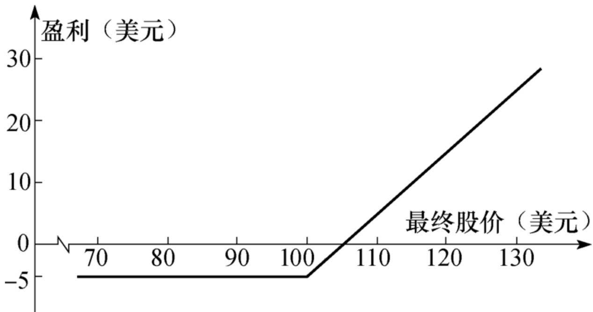
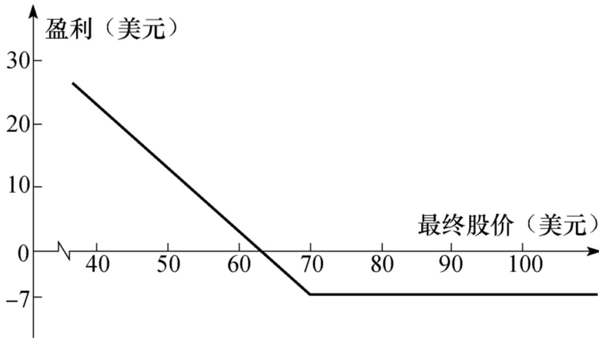
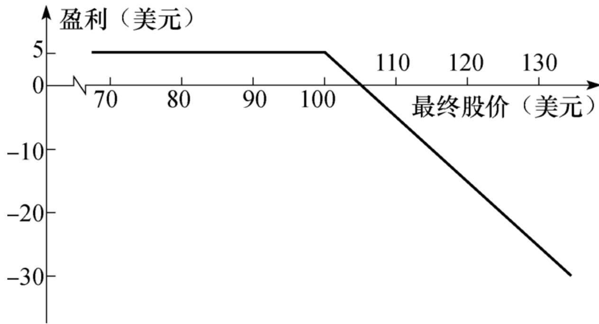
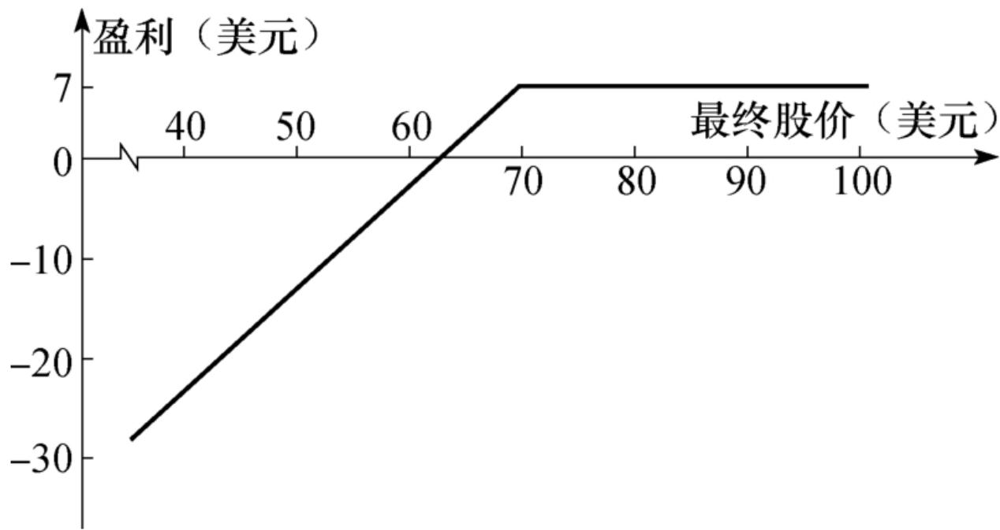
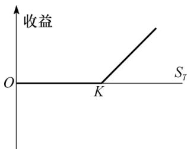
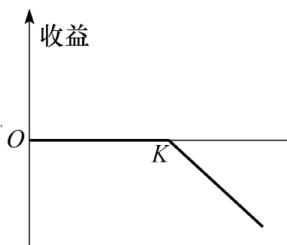
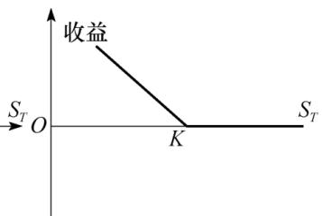
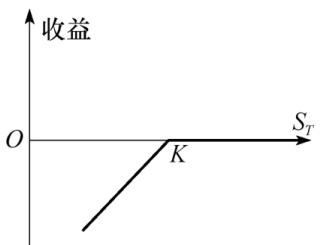

# 第10章 期权市场机制

我们曾经在第1章中引入了期权的概念，在这一章里我们将要解释期权市场的组织结构、专用术语、交易过程以及担保金的设定等。在后面的章节里我们将考虑期权的交易策略、期权价格的确定以及期权组合对冲方面的内容。这一章将主要讨论股票期权，同时也涉及货币期权、股指期权和期货期权合约的简单内容。第17章和第18章将对这些产品进行更详细的讨论。

期权与远期合约和期货产品有着本质的不同：期权给持有者某种权利去做什么事情，但期权持有者不一定必须行使权利。与之相反，在远期与期货合约中，合约的双方有义务执行合约。承约远期与期货合约时，交易者不用付费（保证金的要求除外），而对于期权产品，持有者需要在最初时支付费用。

当我们利用图形来展示期权的盈亏时，一般都忽略货币的时间价值，因此盈亏为期权最终的收益减去最初的费用，在这一章里我们将采用这种做法。

## 10.1 期权类型

如第1章所述，期权有两种基本类型：看涨期权(call option)给期权持有者在将来某个日期以一定价格买入某资产的权利，看跌期权(put option)给期权持有者在将来某个日期以一定价格卖出某资产的权利。期权合约中注明的日期叫到期日(expiration date)或满期日(maturity date)，合约中所注明的价格叫执行价格(exercise price)或敲定价格(strike price)。

期权可以是美式期权(American option)或欧式期权(Europeanoption)，这些名称与期权交易的地理位置毫无关系。美式期权可以在到期日之前的任何时刻行使，而欧式期权只能在到期日才能行使。大多数交易所交易的期权为美式期权，但一般来讲，欧式期权比美式期权更容易分析，一些美式期权的性质常常从相应欧式期权的性质中类推而来。

## 10.1.1 看涨期权

考虑以下情形：一个投资者买入执行价格为100美元、购买100股股票的看涨期权。假定股票的当前市场价格为98美元，期权到期日为4个月，购买1股股票的期权价格为5美元。持有者的最初投资为500美元。由于期权为欧式期权，因此持有者只能在到期日才能行使期权。如果在到期日，股票价格小于100美元，很明显投资者不会行使期权（没有必要以100美元的价格买入市场价格低于100美元的股票）。因此，投资者会损失全部500美元的最初投资。如果在到期日，股票价格大于100美元，期权将会被行使。假定在到期日股票价格为115美元。通过行使期权，期权持有人可以按每股100美元的价格买入100股股票，如果投资者马上将股票卖掉，则每股可以赚15美元。忽略交易费用，投资者可以挣得1500美元。将最初的期权费用考虑在内，投资者的盈利为1000美元。

图10-1展示了本例中投资者买入1股股票的看涨期权的净盈利与最终股票价格之间的关系。例如，假定在到期日的股票价格为120美元时，购买1股股票的期权盈利为15美元。需要注意的是，有时投资者在行使期权后在整体上仍有亏损。假定在本例中期权到期时股票价格为

102美元，投资者会行使期权，这时收益为102-100=2美元，将最初的期权费用考虑在内，投资者的损失为300美元。可能有人会认为此时投资者不应该行使期权，但那样一来会亏损5美元，这比行使期权时3美元的亏损还要高。一般来讲，当在到期日股票价格高于执行价格时，欧式看涨期权的投资者就应该行使期权。

  
图10-1 买入1股股票上欧式看涨期权的盈亏（期权价格=5美元，执行价格=100美元）

## 10.1.2 看跌期权

看涨期权持有者希望股票价格上涨，而看跌期权持有者则希望股票价格下跌。考虑一个能以70美元执行价格出售100股股票的看跌期权。假定股票的当前价格为65美元，期权到期日为3个月，卖出1股股票上期权的价格为7美元，投资者的最初投资为700美元。因为期权为欧式期权，因此这一期权只能在到期日股票价格低于70美元时才会被行使。假定在到期日股票价格为55美元，投资者能够以55美元的价格买入100股股票，而按照期权的约定，期权持有人可以按每股70美元的价格卖出股票，因此每股收益为15美元，总收益为1500美元（仍然忽略交易费用）。将最初的期权费用700美元考虑在内，投资者的净盈利为800美元。这里并不能保证投资者一定会盈利。如果在到期日股票价格高于70美元，看跌期权在到期时会一文不值，投资者会损失700美元。图10-2显示了该例中投资者买入看跌期权的净盈利与最终股票价格之间的关系。

  
图10-2 买入1股股票上看跌期权的盈亏（期权价格=7美元，执行价格=70美元）

## 10.1.3 提前行使期权

如上所述，交易所里交易的期权通常为美式期权而不是欧式期权。这意味着前面所述的投资者并不一定要等到到期日才行使期权，在后面我们将看到有时在到期日之前行使美式期权为最优。

## 10.2 期权头寸

任何一个期权合约都有两方：一方为期权的多头（即买入期权方），另一方为期权的空头［即卖出期权或期权承约方(written theoption)］。卖出期权的一方在最初收入期权费，但这一方在今后有潜在的义务，承约方的盈亏与买入期权一方的盈亏刚好相反。图10-3和图10-4分别是图10-1和图10-2的变形，它们显示了期权承约人的盈亏与最终股票价格之间的关系。

  
图10-3 卖出看涨期权的盈亏图（期权价格=5美元，执行价格=100美元）

  
图10-4 卖出看跌期权的盈亏图（期权价格=7美元，执行价格=70美元）

期权交易共有4种头寸形式：

(1)看涨期权多头；

(2)看跌期权多头；

(3)看涨期权空头；

(4)看跌期权空头。

一般来讲，以期权收益来理解欧式期权常常十分有用。这时期权的最初费用不包括在计算之中。如果K为执行价格，ST为标的资产的最终价格，欧式看涨期权多头的收益为

max(ST-K,0)

这反映了在ST＞K时期权会被行使，而在ST≤K时期权将不会被行使。欧式看涨期权空头的收益为

$$
- \max (S T - K, 0) = \min (K - S T, 0)
$$

欧式看跌期权多头的收益为 max(K-ST,0)

欧式看跌期权空头的收益为 -max(K-ST,0)=min(ST-K,0)

图10-5展示了期权的收益。

  
a）看涨期权多头  
图10-5 欧式期权收益

  
b）看涨期权空头

  
c）看跌期权多头

  
d）看跌期权空头

## 10.3 标的资产

在这一节里我们将简单介绍标的资产为股票、货币、股指和期货的期权是如何在交易所中交易的。

## 10.3.1 股票期权

大部分股票期权的交易是在交易所进行的。在美国，这些交易所包括芝加哥期权交易所(www.cboe.com)；NYSE Euronext（www.euronext.com，在2008年收购了美国股票交易所）；国际证券交易所(www.ise.com)和波士顿期权交易所(www.bostonoptions.com)。投资者在数千种股票上均可以进行期权交易。在一份期权合约中，持有者能够以执行价格买入或卖出100股股票，因为股票本身通常是以100股为单位进行交易的，所以这一规定对投资者而言非常方便。

## 10.3.2 交易所产品(ETP)期权

在CBOE可以交易许多场内交易产品(exchange-traded product,ETP)。有许多ETP在交易所上市，而且像公司股票一样交易。这些ETP的设计是为了复制某些市场的表现，所用方式往往是跟踪一个基准指数。场内交易产品有时也称为交易所载体(exchange-traded vehicle,ETV)。最常见的ETP是交易所基金(exchang-traded fund, ETF)，这通常是为了跟踪某个股权指数或债券指数。例如，SPDR S&P 500 ETF信托的设计是为了让投资者所得回报就像他们投资于构成S&P 500的500种股票一样。其他ETP的设计是为了跟踪商品或外汇的表现。

## 10.3.3 货币期权

大部分货币期权交易是在场外市场进行的，但在交易所也有一些交易。美国交易货币期权的交易所包括NASDAQ OMX

（www.nasdaqtrader.com，该交易所在2008年收购了费城股票交易所），它提供关于多种货币的欧式期权合约。期权合约的规模是以美元买入或卖出1万单位的外币（日元合约规模为100万日元）。第17章将进一步讨论货币期权。

## 10.3.4 指数期权

许多种不同的指数期权都在世界各地的场外市场与场内市场进行交易。在美国，交易所里最流行的合约为S&P 500股指(SPX)期权、S&P100股指(OEX)期权、纳斯达克100股指(The Nasdaq 100 Index, NDX)期权和道琼斯工业指数(Dow Jones Industrial Index, DJX)期权。所有这些期权的交易都在芝加哥期权交易所进行，大多数合约为欧式期权。其中S&P 100股指期权是个例外，该期权为美式期权：每一份合约可以购买或出售指数的100倍。合约总是以现金形式（而不是指数交易组合）结算。例如，一份S&P 100看涨期权的执行价格为980。当指数价格为992时，期权会被行使，承约者需向期权持有者支付(992-980)×100=1200美元。我们将在第17章中讨论股指期权。

## 10.3.5 期货期权

当交易所交易一种期货时，该交易所也往往交易这一期货上的期权。期货期权一般是在期货交割日之前的一小段时间到期。当行使看涨期权时，期权持有者的收益等价于期货价格超出执行价格的现金额。当行使看跌期权时，期权持有者的收益等价于执行价格超出期货价格的现金额。我们在第18章里将进一步讨论期货期权。

## 10.4 股票期权的细节

在本章的以下内容里我们将着重讨论股票期权。前面讲过，美国交易所内的股票期权为可以购买或出售100股股票的美式期权。关于合约的细节，例如，到期日、执行价格、股息处理方式、投资者的头寸限额等均由交易所来确定。

## 10.4.1 到期日

用于描述股票期权的参数之一是到期日所在的月份。因此1月IBM看涨期权的到期日为1月的某一天。精确地讲，到期日为到期月份的第3个星期五，在到期日前的每一个营业日（芝加哥时间上午8:30到下午3:00）都可以对期权进行交易。

美国的股票期权是在1月、2月或3月的循环期上进行交易。1月循环期包括1月、4月、7月和10月；2月循环期包括2月、5月、8月和11月；3月循环期包括3月、6月、9月和12月。如果本月份的到期日尚未来到，交易的期权包括在当月到期的期权、下个月到期的期权和当前月循环期中下两个到期月的期权；如果当月的到期日已过，交易期权包括下个月到期的期权，再下一个月到期的期权以及这一个月循环期中下两个到期月的期权。例如，假定IBM股票期权处在1月循环期中。在1月初，该股票期权的到期月份为1月、2月、4月和7月；在1月末，该股票期权的到期月份为2月、3月、4月和7月；在5月初，该股票期权的到期月份为5月、6月、7月和10月等。当一个期权到期后，另一个期权交易随即开始。如果市场对一家公司有很大兴趣，这家公司的期权也可能会在其他月交易。另外，有些期权在每个星期五到期，而不是1个月的第3个星期五，这种期权有时称为单周期权(weekly)。

美国的交易所交易许多家股票上的长期限的期权，这类期权叫作LEAPS（长期资产预期证券，long-term equity anticipationsecurity）。这些期权的期限可能会长达39个月，LEAPS的到期日总是在1月的第3个星期五。

## 10.4.2 执行价格

交易所在选择能够交易的期权的执行价格时，一般会使价格的间隔为2.5美元、5美元、10美元。通常的做法是当股票价格介于5美元与25美元之间时，执行价格的间隔为2.5美元；当股票价格介于25美元与200美元之间时，执行价格的间隔为5美元；当股票价格高于200美元时，执行价格的间隔为10美元。在下面我们将会解释股票分股和股息均会造成非标准的执行价格。

## 10.4.3 术语

对于任何资产，在任何给定的时刻，市场上都可能有许多不同的期权在进行交易。考虑某只股票，其上有4个到期日和5个不同执行价格的期权。如果对于每个到期日与执行价格均有相应的看涨期权与看跌期权交易，这样就会有40种不同的期权合约。所有类型相同的期权（看涨或看跌）都可以归为一个期权类(option class)。例如，IBM的看涨期权为一类，IBM的看跌期权为另一类。一个期权系列(optionseries)是具有相同到期日与不同执行价格的某个给定类型的所有期权。换句话讲，期权系列是指市场交易中某个特定的合约。例如，IBM1602021年10月看涨期权是一个期权系列。

期权可分为实值期权(in-the-money option)、平值期权(at-the-money option)、虚值期权(out-of-the-money option)。如果S为股票价格，K为执行价格，对于看涨期权，当S＞K时为实值期权，当S=K时为平值期权，而当S＜K时为虚值期权。对于看跌期权，当S＜K时为实值期权，当S=K时为平值期权，而当S＞K时为虚值期权。显然，只有在期权为实值期权时才会被行使。没有交易费用的前提下，没有被提前行使的实值期权在到期时肯定会被行使。 ㊟ 【关于实值期权、平值期权、虚值期权，交易员有另外一种定义，见第20.4节。】

期权的内含价值(intrinsic value)定义为如果期权立即被行使时所具有的价值。看涨期权的内含价值为max(S-K,0)，看跌期权的内含价值为max(K-S,0)。实值美式期权的价值至少等于其内含价值，因为该期权持有者可以通过马上行使期权来实现其内含价值。通常一个实值美式期权的持有者最优的做法是等待而不是立即执行期权，这时期权称为具有时间价值(time value)。期权的总价值等于内含价值与时间价值之和。

## 10.4.4 灵活期权

芝加哥期权交易所提供股票和股指的灵活期权(FLEX option)，这种期权具有交易员之间认可的一些非标准条款。这种期权的非标准条款里的到期日或执行价格和场内交易的期权有所不同，结算方式（美式或欧式）也可以灵活定制。灵活期权是期权交易所试图从场外市场争夺客户的一种尝试。交易所会注明灵活期权交易的最小规模（比如100份合约）。

## 10.4.5 股息和股票分股

早期的场外期权受到股息保护。如果一家公司发放现金股息，公司股票期权的执行价格会在除息日减去股息金额。而交易所交易的期权不受股息保护。换句话讲，当公司发放现金股息时，期权中的条款不做任何调整。大额现金股息是例外。当公司宣布股息高于股票价格10%时，CBOE的期权清算公司将决定如何对看涨期权与看跌期权进行调整。通常的做法是按股息量下调执行价格。

当股票分股时，交易所交易的期权要进行调整。股票进行分股时，现存的股票被分割成更多的股票。例如，在股票3对1(3-for-1)分股时，3股新发行的股票将代替原来的1股股票。因为股票分股不改变公司的资产与盈利能力，因此我们不应该期望分股会影响公司股东的财富。在其他条件不变的情况下，3对1股票分股会使得分股后的股票价格等于分股前价格的1/3。一般来讲，n对m股票分股会使得股票价格下跌为分股前价格的m/n。期权中的条款会有所调整以便反映因分股而造成的价格变化。在n对m股票分股时，期权的执行价格也变为分股前执行价格的m/n倍，每一份期权合约所涉及的股票数量为初始期权所涉及股票数量的n/m倍。如果股票价格按所预料的那样下跌，期权承约方与买入方的头寸都保持不变。

【例10-1】 考虑可以让持有者以每股30美元的价格买入100股股票的看涨期权。假定公司进行了2对1股票分股，期权合约的条款将变为持有者有权以每股15美元的价格买入200股股票。

股票期权也对股票股息进行调整。股票股息可以是公司向其股东分发更多的股票。例如，20%的股票股息是指股东每拥有5股原公司股票就会收到1股新股票。同股票分股类似，发放股票股息对公司的资产与盈利均无影响。在公司发放股票股息后，可以预计公司的股票价格会有所下降。20%的股票股息基本上等价于6对5股票分股。在其他条件不变的情况下，这一股票股息会造成股价下跌到发放股票股息前价格的5/6。与股票分股类似，这时期权合约中的条款会有所调整，以便反映股票股息所带来的股票价格变化。

【例10-2】 考虑可以让持有者以每股15美元的价格出售100股股票的看跌期权。假定公司发放25%股票股息，这等价于5对4的股票分股。期权合约的条款将会变成持有者有权以12美元的价格出售125股股票。

对于优先权证(rights issues)，期权条款也会加以调整。基本的调整方法是首先计算权证的理论价格，然后从执行价格中减去这一数量。

## 10.4.6 头寸限额与行使限额

芝加哥期权交易所常常指定期权合同的头寸限额(positionlimit)。这些限额是一个投资者在市场的一方中可持有期权合约的最大数量，这时看涨期权的多头和看跌期权的空头被认为是市场的同一方。同样，看涨期权的空头与看跌期权的多头也被看作市场的同一方。行使限额(exercise limit)通常与头寸限额相同，它规定了任何投资个人（或者投资群体）在5个连续交易日中可以行使期权合约的最大额度。对于市场上最大与交易最频繁的股票期权头寸限额为250000份合约。市场规模较小的股票期权头寸限额可以是200000、75000、50000与25000份合约不等。

虽然头寸限额与行使限额的设定是为了防止某些个人或群体操纵市场，但是人们对于这些额度的设定是否有必要仍有争议。

## 10.5 交易

传统上，交易所必须给投资者提供一个见面并进行期权交易的空间。但这种情况有所变化。大多数衍生产品交易所已完全电子化，交易员之间并不需要见面。国际证券交易公司在2000年5月推出了第一个将股票期权交易完全电子化的市场。芝加哥期权交易所95%的交易由电子系统完成，余下的一般是数额巨大或结构复杂的机构性交易，需要由交易员来完成。

## 10.5.1 做市商

大多数交易所都采用做市商制度来促成交易的进行。期权的做市商是当需要时会报出买入价与卖出价的人。买入价是做市商准备买入期权的价格，卖出价是做市商准备卖出期权的价格。在报出买入价与卖出价时，做市商并不知道问询价格一方是要买入还是要卖出期权。卖出价一定会高出买入价，高出买入价的差额就是买卖差价(bid-offer spread)。交易所设定买卖差价的上限。例如，当期权价格小于0.5美元时，交易所可以设定买卖差价不超过0.25美元；当期权价格介于0.5美元与10美元之间时，不超过0.5美元；当期权价格介于10美元与20美元之间时，不超过0.75美元；当期权价格高于20美元时，不超过1美元。

做市商的存在保证了买卖指令在没有延迟的情况下，交易总是可以在某一价格上立即执行，因此，做市商的存在增加了市场的流动性。做市商本身可以从买卖差价中盈利，他们可以利用像第19章中所讨论的一些方法来对冲风险。

## 10.5.2 冲销指令

购买期权的投资者可以发出出售相同数量期权的冲销指令(offsetting order)来结清他的头寸。类似地，某期权的承约者也可以发出一个购买相同数量期权的冲销指令来结清其头寸（从这一点上来看，期权市场的运作和期货市场类似）。当交易一个期权时，如果交易的任何一方都没有冲销其现存交易，则持仓量(open interest)加

1；如果某一方冲销某现存头寸而另一方没有冲销其头寸，则持仓量保持不变；如果双方都冲销头寸，这时持仓量减1。

## 10.6 交易费用

投资者向经纪人发出的期权交易指令形式同期货交易（见第2.8节）类似。市场指令可以马上执行，限价指令是当市场出现合适价格才被执行的指令，等等。

当期权在网上交易时，经纪人通常会收取固定费用外加每份合约的费用。例如，交易的基本费用可能为2.50美元，每份合同费用为0.50美元。行使期权通常也要收取费用，当交易员持有期权空头并被指派为行使期权方的对手时，还要收取指派费。有时出售期权比支付行使期权的费用还要更划算。（参见www.stockbrokers.com/guides/features-fees，其中比较了16家美国券商收取的费用。）

期权交易（以及许多其他金融交易）中的一个隐藏成本是做市商的买卖价差。假设在上一段的例子中，购买期权时的买入价是4.00美元，而卖出价是4.50美元。我们可以合理地假设期权的“公允”价格介于买入价和卖出价之间，或者是4.25美元。做市商制度中买方和卖方的成本是公允价格和支付价格差额，每个期权费用为0.25美元，或每份合同为25美元。

## 10.7 保证金

在第2章里我们曾讨论过有关期货合约的保证金的要求，保证金的目的是确保提供保证金的一方能够履行自己的契约。当交易员用现金购买像股票或期权这样的资产时，没有提供保证金的必要，原因是这些交易不会在将来成为债务。如在第5.2节里所述，当交易员卖空股票时，因为交易员必须在将来通过买进股票来对头寸平仓，因此需要提供保证金。类似地，如果交易员卖出（即承约）期权，由于在将来当期权被行使时交易员会有债务，因此需要提供保证金。

资产的购买方式不一定是现金形式。例如，在美国购买股票时，投资者可以向经纪人借入不超过50%的资金来买入股票［这种做法叫保证金购买(buying on margin)］。当股票价格下跌速度很快，并使贷款远远高于当前股票价值的50%时，将会触发保证金催付。保证金催付要求投资者在经纪人处存入现金。如果投资者不能满足保证金催付的要求，那么经纪人会变卖股票。

当购买期限小于9个月的看涨与看跌期权时，投资者必须付清全部费用，这时投资者不能用保证金方式购买期权，因为这些期权中已经具有很高的杠杆效应。以保证金方式买入期权会将杠杆效应提高到不可接受的水平。对于期限长于9个月的期权，投资者可以保证金购买，但借入的资金最多不超过期权价格的25%。

## 10.7.1 承约裸露期权

如前面所述，当投资者对期权承约时必须在保证金账户中保持一定的资金。投资者的经纪人和交易所需要确保当期权被行使时，期权的承约人不会违约。担保金的数额与投资者的头寸有关。

裸露期权(naked option)是指期权不与对冲该期权头寸风险的标的资产并存。在芝加哥期权交易所，卖出裸露看涨期权时的初始保证金和维持保证金是以下两个数量中的最大值：

(1)卖出期权所得金额的100%，加上20%的标的股票价值，减去（如果存在）期权的虚值。

(2)卖出期权所得金额的100%，加上10%的标的股票价值。

卖出裸露看跌期权时，初始保证金为以下两个数量的最大值：

(1)卖出期权所得金额的100%，加上20%的标的股票价值，减去（如果存在）期权的虚值。

(2)卖出期权所得金额的100%，加上10%的执行价格。

由于包含广泛股票的股指通常比单个股票的波动性要小，所以在以上的计算中，对于股指期权，算法中的20%以15%代替。

【例10-3】 投资者卖出了4份裸露看涨期权，期权价格为5美元，期权执行价格为40美元，股票当前价格为38美元，因为期权的虚值数量为2美元，计算保证金的第1种形式为

$400 \times (5 + 0.2 \times 38 - 2) = 4240$ （美元）

第2种形式为

$400 \times (5 + 0.1 \times 38) = 3520$ （美元）

因此，最初保证金要求为4240美元。假定这里的期权为看跌期权，期权的实值数量为2美元，因此最初保证金数量为

$400 \times (5 + 0.2 \times 38) = 5040$ （美元）

在两种情形下，最初卖出期权所得均可作为保证金的一部分。

与初始保证金计算类似（但由目前市价代替卖出价值）的计算会在每天重复一遍。当计算表明所需保证金比保证金账户中的数量低时，可以从账户中提取资金，当计算表明需要更高保证金数量时，将会有追加保证金的通知。

## 10.7.2 其他规则

在第12章里我们将讨论期权交易策略，例如，备保看涨期权、保护性看跌期权、溢差、组合、跨式期权和异价跨式期权。CBOE对这些交易保证金要求有特殊的规则，在CBOE保证金手册（CBOE MarginManual，可以从CBOE的网站www.cboe.com上下载）中有对这些规则的详细描述。

假如一个投资者承约了一个备保看涨期权，他可能是在已经拥有股票后才对期权进行承约，拥有的股票可以用于交割。备保看涨期权比裸露看涨期权风险要小得多，这是因为最差情形莫过于投资者以低于市场价格卖出自己已拥有的股票。对于承约备保看涨期权的投资者，交易所不需要任何保证金。但投资者对于股票头寸最多可以借入资金的数量为0.5min(S,K)，而非0.5S。

## 10.8 期权结算公司

在期权市场中，期权清算公司(OCC)的职能与期货市场中清算中心的职能相似（见第2章），它确保出售期权的一方按照期权合约的规定来履行义务，同时清算公司也要记录多头方和空头方的状况。期权清算中心拥有一些会员，所有的期权交易必须通过其会员来结清。不是期权清算公司的经纪人必须通过期权清算公司的会员来清算交易。会员必须满足资本金的最低限额要求，而且需要为一个特殊基金提供资金。当有会员没有履行其义务约定时，这一特殊资金基金会被启用。

购买期权时的资金必须在交易发生时间的第二个业务日存入期权清算公司。如上所述，期权的出售方必须在经纪人那里开设保证金账户，而同时经纪人在负责清算其交易的清算公司会员那里维持一个保证金账户。清算公司会员也要在清算公司维持一个保证金账户。

## 期权的行使

当投资者通知经纪人要行使期权时，经纪人随后通知在期权清算公司负责清算交易的会员，该会员随后向期权清算公司发出执行期权指令。之后，期权清算公司会随机地选择某个持有相同期权空头的会员。这个会员按事先约定的程序，选择出售该期权的投资者。如果期权是看涨期权，那么出售期权的投资者必须按执行价格出售股票；如果期权是看跌期权，那么出售期权的投资者必须按执行价格购买股票。这时我们称投资者被指定(assigned)，该笔交易于执行指令被发出后的第3个工作日结清，当一个期权被行使后，期权的未平仓数量减1。

在期权的到期日，除非交易成本太高以至于抵消收益的情况下，所有的实值期权都应该被行使。当在到期日行使期权对客户有利时，一些经纪人会替客户自动行使期权。许多交易所也制定了在到期日，当期权为实值状态时行使期权的规则。

## 10.9 监管制度

交易所期权市场受到多种形式的监管。交易所与期权清算公司都制定了监管其交易员行为的制度。另外，对于期权市场还存在州与联邦监管机构。一般来讲，期权市场还表现出自律倾向。到目前为止，期权清算公司还没有出现大的丑闻或成员违约事件。投资者对于期权市场的运作应当有很强的信心。

美国证券交易委员会(SEC)是在联邦层次上负责监管股票、股指、外汇和债券期权市场的组织。美国商品期货交易委员会(CFTC)负责监管期货期权市场。美国最大的期权市场在伊利诺伊州和纽约州，这些州也积极地制定法律来遏制违规交易行为。

## 10.10 税收

关于期权策略的税收规定比较复杂，因此对于税收规则有疑问的投资者应当尽量去咨询税务专家。在美国，一般规则是（除非纳税人为专业交易员）：为了征税的目的，股票期权的收益被当作资本损益。在第2.10节中，我们讨论了资本损益在美国的征税方式。对于股票期权持有方和承约方而言，损益发生的时间是当①期权到期而没有执行；②期权已经被出售平仓。对于已经行使的期权，损益会被计入股票之中，盈亏会在股票平仓时被确定。例如，当一个看涨期权被行使时，期权多头方购买股票的费用为执行价格加上期权价格。因此，这些费用会被作为出售股票这一方计算盈亏的基础。类似地，看涨期权空头被认为是按执行价格加上最初看跌期权的价格卖出了股票。当一个看跌期权被行使时，期权卖出方被认为是以执行价格减去最初的期权价格买入了股票，同时期权的买入方被认为是以执行价格减去最初看跌期权的价格卖出了股票。

## 10.10.1 虚售规则

在美国期权交易中，一条税务规则是虚售规则(wash salerule)。为了理解这一规则，想象一个投资者在股票价格为60美元时买入股票并同时打算长期持有这只股票。如果股票下跌到40美元，该投资者也许会出售股票，然后马上将股票购回。从税务角度而言，投资者有了20美元的损失。为了防止这一情况的发生，税务当局规定如果在售出股票的30天内（即介于售出股票的前30天和售出股票后的30天）将股票重新买入，那么出售股票产生的损失不能在税中扣除。这种规定对投资者买入期权或以其他形式获取股票的情形也适用，而且这时限定时间长度为61天。因此，当卖出股票后30天内买入看涨期权时，亏损是不允许扣税的。

## 10.10.2 推定出售

在1997年之前，美国的纳税人如果要卖空某证券，并同时持有一个基本与卖空证券一样的其他证券，这时在卖空交易平仓之前的盈亏是不被承认的。这意味着卖空交易可以被用来延迟税务的缴纳。以上情形在1997年《税务减轻法案》(Tax Relief Act)通过后有所改变。一个增值的财产在当财产拥有人做出以下任何一种投资行为时，其投资即可被当成“推定出售”(constructively sold)：

(1)承约相同或几乎相同的财产卖空交易。

(2)承约期货或远期合约，在合约中投资者会交付相同或几乎相同的财产。

(3)承约一个或多个交易，这些交易几乎消除所有损失与盈利机会。

应该指出，只是减轻损失风险或只是减少盈利机会的交易不能被划分为推定出售。因此，一个持有某股票的投资者可以买入实值看跌期权而不触发推定出售的情况。

税务人有时可以利用期权来对税务费用进行最小化或对税务收益进行最大化（见业界事例10-1）。许多地区的税务部门纷纷遏制那些只是为了避税而使用衍生产品的行为。在进行一个以税务为动机的交易之前，企业资金部主管或个人投资者应该仔细考虑当税法变动时，交易结构将如何平仓，以及平仓交易会带来什么样的费用。

业界事例10-1

使用期权的税务计划

作为一个如何利用期权进行纳税规划的例子，我们假定国家A的税务制度对利息和股息征税较低，但对资本增值征税较高；国家B的税务制度对利息和股息征税较高，但对资本增值征税较低。对于公司来讲，在国家A得到利息收入，而在国家B得到资本增值（如果增值存在的话）会比较合算。公司会将资本的亏损尽量保留在国家A，因为这些损失可以用于抵消在国家A的资本增值。以上计划可以通过以下形式实现：在国家A成立分公司并同时以合法形式拥有证券，并且在国家B成立分公司并且买入在国家A分公司承约的本公司看涨期权，期权的执行价格等于证券的当前价格。在期权有效期内，证券的收入由在国家A的公司获得，如果证券价格迅速上涨，期权会被行使，而资本增值在国家B实现；如果证券价格迅速下降，期权不会被行使，资本损失会在国家A实现。

## 10.11 认股权证、雇员股票期权和可转换债券

认股权证(warrant)是由金融机构或非金融机构发行的期权。例如，一家金融机构可以发行关于100万盎司黄金的看跌认股权证，每个认股权证给持有人按每盎司1000美元卖出10盎司黄金的权利，然后建立关于这些权证的市场。为了行使权证，投资者需要同金融机构取得联系。非金融机构一般在发行债券时才会使用权证产品：一家公司可以发行自身股票上的看涨权证，并将这些权证附加在债券上，以使债券更能吸引投资者。

雇员股票期权(employee stock option)是公司发给雇员的看涨期权，这样做的目的是促使公司雇员与公司股东的利益一致（见第16章）。在发行时，期权通常为平值。目前的会计条例都要求将这些期权按市场价格包括在公司利润表中。

可转换债券(convertible bond)常常简称为可转换产品(convertibles)，这是由公司发行的一种债券，持有者在将来可以按某个预定的比例将这种债券转换为股票。这些产品是含有公司股票上看涨期权的债券。

认股权证、雇员股票期权和可转换债券的一个共同特性是事先已经确定期权的发行数量。与这一特性相反，CBOE交易所或其他交易所交易的期权数量并不能事先确定［当有更多的人交易某个期权系列时，市场上的期权数量（即未平仓数量）也会随之增加。当人们将期权平仓时，市场上的期权数量则随之减少］。公司发行的股票认股权证、雇员股票期权以及可转换债券与交易所交易期权之间还有一个很重要的区别：当这些期权被行使时，公司需要发行更多的股票并以执行价格卖给期权的持有人，行使这些期权会导致公司股票数量增加。与这一点相反，当交易所看涨期权被行使时，期权的空头方从市场上买入已经发行的股票并以执行价格卖给期权的多头方。发行股票的公司不需要介入交易过程。

## 10.12 场外期权市场

本章的大部分内容是关于交易所交易的期权市场。自20世纪80年代初，场外期权市场已经变得十分重要，现在这一市场的规模已经超过了交易所交易市场。如第1章所述，场外市场的主要参与者包括金融机构、企业资金部主管与基金经理。期权交易的标的产品范围很广，场外市场上的外汇和利率期权十分流行。场外市场的一个主要缺点是期权的承约方可能会违约，这意味着期权买入方会承担信用风险。为了克服这些缺点，市场参与者与监管者常常采取提交抵押保证金的方式来降低这一风险。在第2.5节中曾对此有所讨论。

场外市场上交易的产品常常是金融机构为了满足客户的具体需要而设计的。这些产品的到期日、执行价格、合约规模一般与交易所交易的产品不同。在某些情形下，期权的结构与标准看涨和看跌期权不同，这些产品称为特种期权(exotic option)。在第26章里我们将描述一些不同类型的特种期权。

## 小结

期权可分为两类：看涨期权和看跌期权。看涨期权持有者有权在将来某时刻以指定价格买入标的资产，看跌期权持有者有权在将来某时刻以指定价格卖出标的资产。期权市场上有四种可能的交易头寸：看涨期权多头、看涨期权空头、看跌期权多头、看跌期权空头。承约期权的空头也称为对期权承约。期权市场的标的资产包括股票、股指、外汇、期货以及其他资产。

交易所必须阐明交易期权合约的条款，特别是期权的规模、到期日的准确时间与执行价格等。在美国，一份股票期权合约给持有人买入或卖出100股股票的权利，股票期权的到期日为到期月的第3个星期五。在任意时刻都会有几个具有不同到期月的期权在进行交易。执行价格的间隔为2.5美元、5美元和10美元，具体的选择与股票价格有关。

股票期权合约的条款对现金股息一般不做调整，但是这些条款对于股票股息、股票分股和优先权证要进行调整。调整的目的是使承约方与买入方的头寸保持不变。

大多数期权交易所采用做市商机制。做市商同时报出买入价（即做市商以此价买入资产）和卖出价（即做市商以此价卖出资产）。做市商的存在提高了市场的流动性，并同时确保市场订单不会被延迟执行。做市商从买入-卖出价格差（称为买卖差价）中盈利。交易所会指明买卖差价的上限。

期权的承约方有潜在的责任，因此要求他们在经纪人那里存放一定的保证金。如果经纪人不是期权清算公司的成员，经纪人必须在期权清算公司的某个成员那里开设一个保证金账户，而后者需要在期权清算公司开设一个保证金账户。期权清算公司负责记录所有尚未平仓的期权合约，并处理行使指令等。

并不是所有的期权都在交易所交易。许多期权是在场外市场进行交易的。场外市场的一个优点是金融公司可以按企业资金部主管或基金经理的具体要求来设计产品。

## 推荐阅读

Chicago Board Options Exchange.Margin Manual.可以从芝加哥期权交易所网站www.cboe.com下载。

## 概念思考题

10.1 欧式期权和美式期权的差别是什么？

10.2 四种期权交易头寸形式都是什么？

10.3 给出CBOE交易的3种指数期权的例子。

10.4 什么是灵活期权？

10.5 以下哪种情况会造成场内期权条款的改变？(a)股票分股；(b)股票股息；(c)现金股息。

10.6 什么是头寸限额？其目的是什么？

10.7 对企业而言，交易场外期权比交易场内期权的潜在优势是什么？

10.8 解释经纪人为什么向期权的卖方收取保证金，而对于期权的买方却不需要这么做？

10.9 一种股票期权的循环周期为2月、5月、8月和11月，在以下日期有哪种期权在进行交易：(a)4月1日；(b)5月30日。

10.10 详细解释卖出看跌期权与买入看涨期权之间的区别。

## 练习题

10.11 某投资者以3美元的价格买入一份欧式看跌期权，股票价格为42美元，执行价格为40美元，在什么情况下投资者会盈利？在什么情况下期权会被行使？画出在到期时投资者盈利与股票价格之间的关系图。

10.12 某投资者以4美元的价格卖出一份欧式看涨期权，股票价格为47美元，执行价格为50美元，在什么情况下投资者会盈利？在什么情况下期权会被行使？画出在到期时投资者盈利与股票价格之间的关系图。

10.13 某投资者卖出一份欧式看涨期权并同时买入一份欧式看跌期权，看涨及看跌期权的执行价格均为K，到期日均为T，描述投资者的头寸。

10.14 一家公司宣布2对1的股票分股，解释执行价格为60美元的看涨期权条款会如何变化。

10.15 “雇员股票期权与普通的场内交易的公司期权是不同的，这是因为雇员股票期权可以影响公司的资本结构。”解释这个结论。

10.16 假定某欧式看涨期权的价格为5美元，该期权拥有人有权以100美元的价格买入股票，假定这个期权一直被持有到到期日。在什么情形下期权持有人会盈利？在什么情形下期权会被行使？画出在期权到期时期权多头的盈利与股票价格之间的关系。

10.17 假定某欧式看跌期权的价格为8美元，该期权拥有人有权以60美元的价格卖出股票，假定这个期权一直被持有到到期日。在什么情况下期权承约人会盈利？在什么情形下期权会被行使？画出在期权到期时期权空头的盈利与股票价格之间的关系。

10.18 描述以下交易组合：一个刚刚承约的某资产远期合约多头和对于同一资产的欧式看跌期权的空头。看跌期权的期限与远期合约的期限相同，期权的执行价格等于交易组合刚刚设定时资产的远期价格。证明欧式看跌期权的价格与具有相同期限和相同执行价格的欧式看涨期权的价格相等。

10.19 某交易员买入一份看涨期权与看跌期权，看涨期权的执行价格为45美元，看跌期权的执行价格为40美元，两个期权具有相同的期限，看涨期权价格为3美元，看跌期权价格为4美元，画出交易员的盈利与资产价格之间的关系图。

10.20 解释为什么一个美式期权的价值不会小于一个具有同样期限和执行价格的欧式期权价格。

10.21 解释为什么一个美式期权的价值不会小于其内含价值。

10.22 一家企业的资金部主管试图采用期权或远期合约来对公司的外汇风险进行对冲，说明两种办法的优缺点。

10.23 考虑场内交易的一个看涨期权：期权期限为4个月，执行价格为40美元，这个期权给期权拥有人买入500股股票的权利。说明在以下情况下期权合约条款的变化：

(a)10%的股票股息；

(b)10%的现金股息；

(c)4对1股票分股。

10.24 “如果一种股票上的看涨期权大多为实值，这说明股票价格在最近几个月内上涨了很多。”讨论这句话的意义。

10.25 一笔意外的现金股息对以下期权的影响是什么？

(a)看涨期权；

(b)看跌期权。

10.26 某股票期权的循环期为3月、6月、9月和12月。在以下日期都有什么样的期权在进行交易？

(a)3月1日；(b)6月30日；(c)8月5日。

10.27 解释为什么做市商的买卖差价代表了期权投资者的实际费用。

10.28 在美国一个投资者出售了5份裸露看涨期权合约，期权价格为3.5美元，执行价格为60美元，股票价格为57美元，最初的保证金为多少？

10.29 计算表1-2中的9月看涨期权中间价格（买入卖出价格的平均）的内含价值和时间价值，对于表1-3中的9月看跌期权进行同样的计算。在计算中假定标的资产当前价格的中间价为316.00美元。

10.30 某交易员承约5份看跌期权合约，每份合约是关于100股股票，期权价格为10美元，期限为6个月，执行价格为64美元。

(a)股票价格为58美元时，保证金为多少？

(b)如果实施股指期权规则，(a)会有什么变化？

(c)如果股票价格变为70美元，(a)的答案会有什么变化？

(d)如果交易员不是卖出期权，而是买入期权，(a)的答案又会有什么变化？

10.31 “一家公司的经营不比其竞争对手好，但整个股票市场正在上涨，公司的高管在雇员股票期权中会得到很多好处，这种现象实在是不合理。”讨论这个观点。为了解决这个问题，你如何对常规的雇员股票期权进行修改？

10.322004年7月20日，微软公司意外地宣布了3美元股息的消息，股票的除息日为2004年11月17日，股息的付款日为2004年12月2日，当时微软股票价格为28美元，有关雇员股票期权的条款也进行了调整，每一份期权的执行价格下调到

收盘价-3.0股息前执行价格×收盘价

$$
\mathrm{股息前购买数量} \times \frac{\mathrm{收盘价}}{\mathrm{收盘价} - 3 . 0}
$$

这里的收盘价是指微软普通股在除息日之前的最后一个交易日的NASDAQ收盘价。评价这些调整，并将这些调整与交易所对于大额现金股息的调整系统进行比较。

