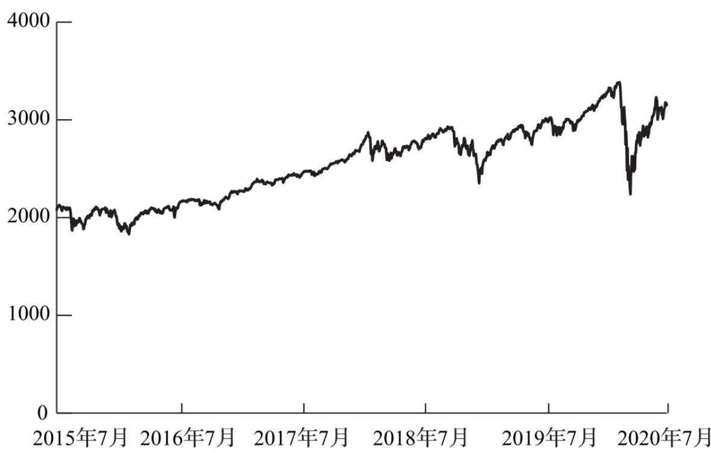
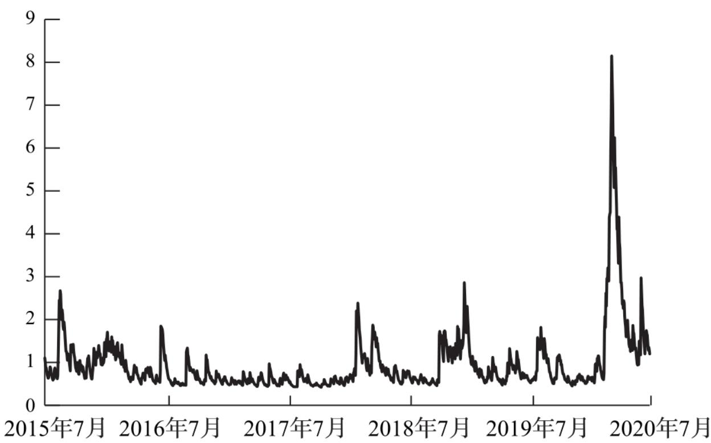
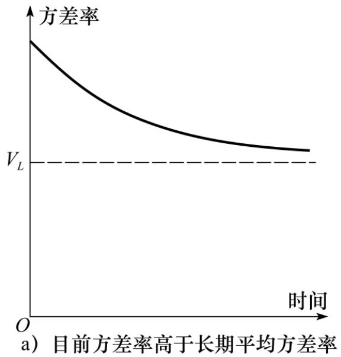
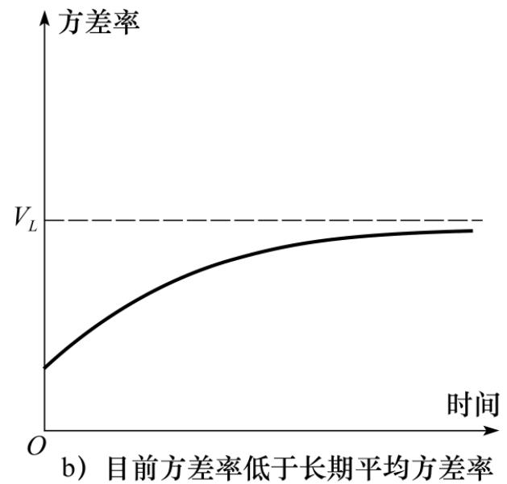

# 第23章 估计波动率和相关系数

在本章中，我们将解释如何利用历史数据估计当前和未来的波动率与相关系数。这一章的内容与利用模型构建法计算在险价值以及对衍生产品定价有密切的关系：在计算在险价值时，我们对当前波动率和相关系数最感兴趣，这是因为我们要对交易组合在一个较短时间内的价值变化进行估计；在对衍生产品定价时，我们往往需要对衍生产品整个期限内的波动率和相关系数进行预测。

这一章将介绍一些名称令人印象深刻的波动率估计方法，包括指数加权移动平均(exponentially weighted moving average, EWMA)、自回归条件异方差(auto-regressive conditional

## 23.1 估计波动率

定义σn为第n-1天末所估计的市场变量在第n天的波动率，第n天

$$
\sigma_{n} ^{2}
$$

波动率的平方 为方差率(variance rate)。在第15.4节中，我们曾描述了如何从历史数据估计σn的标准处理方法。假定市场变量在i天末的值为Si，变量ui定义为在第i天（第i-1天末至第i天末）连续复利收益率

$$
u_{i} = \ln \frac{S_{i}}{S_{i - 1}}
$$

利用ui在最近m天的观察数据，日方差率 $\boldsymbol{\sigma} _{n} ^{2}$ 的无偏估计为

$$
\sigma_{n} ^{2} = \frac{1}{m - 1} \sum_{i = 1} ^{m} \left(u_{n - i} - \bar{u}\right) ^{2}\tag{23-1}
$$

其中 $\overset{-} {u}$ 为这些ui的平均值

$$
\overline{{u}} = \frac{1}{m} \sum_{i = 1} ^{m} u_{n - i}
$$

为了监视日方差率的变化，式(23-1)中的公式通常会有一些变动：

(1)ui定义为市场变量值在第i-1天末到第i天末的百分比变化 ㊟【这与第22.3节计算VaR时所定义的波动率一致。】

$$
u_{i} = \frac{S_{i} - S_{i - 1}}{S_{i - 1}}\tag{23-2}
$$

(2)假设 u 为0。 ㊟ 【如第22.3节解释的那样，这种假设对于方差估计的影响不大，这是因为市场变量在1天内变化的期望值远远小于市场变量变化的标准差。】

(3)用m代替m-1。 ㊟ 【用m来代替m-1将波动率从无偏差估计变成了极大似然估计。本章后面的部分将讨论极大似然估计。】

以上三个变化对计算结果影响不大，但这些变化会使方差公式简化成

$$
\sigma_{n} ^{2} = \frac{1}{m} \sum_{i = 1} ^{m} u_{n - i} ^{2}\tag{23-3}
$$

其中ui由式(23-2)给出 [1] 。

选择权重的方式

$$
u_{n - 1} ^{2}, u_{n - 2} ^{2}, \dots , u_{n - m} ^{2}
$$

在式(23-3)中，

中的所有项都有相同的权重。我们的目标是估计当前波动率σn的水平，因此将较大的权重用在最近的数据更有意义。这样模型的一种形式为

$$
\sigma_{n} ^{2} = \sum_{i = 1} ^{m} \alpha_{i} u_{n - i} ^{2}\tag{23-4}
$$

变量αi为之前i天观察值所对应的权重（这些α都取正值）。当选择这些变量时，如果对i＞j选择 $\mathrm{~ a ~ i < a ~}$ j，也就是对于较旧的数据我们设定较小的权重。权重之和必须为1，即

$$
\sum_{i = 1} ^{m} \alpha_{i} = 1
$$

对于式(23-4)可以做以下推广。假定存在某一长期平均方差，并且应当给予该方差一定权重，这将导致以下形式的模型

$$
\sigma_{n} ^{2} = \gamma V_{L} + \sum_{i = 1} ^{m} \alpha_{i} u_{n - i} ^{2}\tag{23-5}
$$

其中VL为长期方差率， $\gamma$ 为VL所对应的权重。因为权重之和仍为1，我们有

$$
\gamma + \sum_{i = 1} ^{m} \alpha_{i} = 1
$$

这一模型就是最先由Engle提出的ARCH(m)模型。 ㊟ 【See R.Engle “Autoregressive Conditional Heteroscedasticity withEstimates of the Variance of U. K. Inflation,” Econometrica,50(1982): 987-1008.】 方差的估计值是基于长期平均方差以及m个观察值，观察数据越陈旧所对应的权重就越小。令ω=γVL，我们可以将式(23-5)写为

$$
\sigma_{n} ^{2} = \omega + \sum_{i = 1} ^{m} \alpha_{i} u_{n - i} ^{2}\tag{23-6}
$$

在接下的两节中，我们将讨论两种观察波动率的重要方法，这两种方法均采用了式(23-4)及式(23-5)中的想法。

## 23.2 指数加权移动平均模型

指数加权移动平均模型(EWMA)是式(23-4)的一个特殊形式，其中权重αi随着时间以指数速度递减。具体地讲，在这里 $\mathrm{~ a ~ i + 1 = \lambda ~ a ~ i ~}$ 其中λ是介于0于1之间的常数。

在以上假设下可以发现更新波动率公式具有非常简单的形式

$$
\sigma_{n} ^{2} = \lambda \sigma_{n - 1} ^{2} + (1 - \lambda) u_{n - 1} ^{2}\tag{23-7}
$$

变量在第n天的波动率估计值（在第n-1天末估计）σn由第n-1天的波动率估计值 $\sigma{} \mathrm{n - 1}$ （在第 $\mathrm{n - 2}$ 天末估计）和变量在最近一天内变化的百分比un-1决定。

$$
\sigma_{n - 1} ^{2}
$$

为了说明式(23-7)中的权重以指数速度下降，我们将代入公式之中

$$
\sigma_{n} ^{2} = \lambda \left[ \lambda \sigma_{n - 2} ^{2} + (1 - \lambda) u_{n - 2} ^{2} \right] + (1 - \lambda) u_{n - 1} ^{2}
$$

即

$$
\sigma_{n} ^{2} = (1 - \lambda) \left(u_{n - 1} ^{2} + \lambda u_{n - 2} ^{2}\right) + \lambda^{2} \sigma_{n - 2} ^{2}
$$

$$
\sigma_{n - 2} ^{2} \text{代入} \quad \text{项，我们进一步得出}
$$

$$
\sigma_{n} ^{2} = (1 - \lambda) \left(u_{n - 1} ^{2} + \lambda u_{n - 2} ^{2} + \lambda^{2} u_{n - 3} ^{2}\right) + \lambda^{3} \sigma_{n - 3} ^{2}
$$

依此类推，我们得出

$$
\sigma_{n} ^{2} = (1 - \lambda) \sum_{i = 1} ^{m} \lambda^{i - 1} u_{n - i} ^{2} + \lambda^{m} \sigma_{n - m} ^{2}
$$

当m很大时， $ {\lambda} ^{m}  {\sigma_{n - m}} ^{2}$ 项小到可以忽略，所以当 ${\mathrm{~ a ~ i =}} ( 1 -$ λ)λi-1时，式(23-7)与式(23-4)相同。对应于ui的权重以λ的速度随时间推移而递减，每一项的权重是前一项权重与λ的乘积。

【例23-1】 假如λ为0.90，市场变量的波动率在第n-1天的估计值为每天1%。在第n-1天，市场变量增长了2%，这意味着 $\sigma_{n - 1} ^{2}$ $= 0 . \ 012 {=} 0 . \ 0001$ 以及 $u_{n - 1} ^{2} {} _{\ = 0 . \ 022 = 0 . \ 0004}$ ，由式(23-7)我们得出$\sigma_{n} ^{2} = 0 . 9 \times 0 . 0001 + 0 . 1 \times 0 . 0004 = 0 . 00013$

因此，第n天波动率σn的估计为 $\sqrt{0 . 00013}$ ，即每天1.14%。注意， $\boldsymbol u_{n - 1} ^{2}$ 的期望值为 $\sigma_{n - 1} ^{2}$ ，也就是0.0001。在本例中，变量 $\boldsymbol u_{n - 1} ^{2}$ 的实际值比期望值要大，因此我们对波动率的估计也会增加。当 $\boldsymbol u_{n - 1} ^{2}$ 的实际数值小于期望值时，我们对波动率的估计值将会减小。

EWMA模型的优点是这一方法仅需要存储相对较少的数据。在任何时刻，我们只需要记忆对当前波动率的估计值以及市场变量的最新观察值。当得到市场变量的最新观察值后，我们可以计算当天价格变化的百分比，然后利用式(23-7)更新对方差的估计。旧的方差估计值与旧的市场变量值可以被丢掉。

EWMA模型的目的是对波动率变化进行跟踪监测。假定市场变量在

$$
u_{n - 1} ^{2}
$$

n-1天有一个较大的变化，即 很大，由式(23-7)可以看出，这时对当前变化率的估计将会增加。数值λ决定了日波动率估计对于最新市场变量百分比变化的反应。在计算σn时，较低的λ将会给

$$
u_{n - 1} ^{2}
$$

un − 1 较大的权重，这时每天所估计的日波动率本身的变化也会很大。较大的λ（接近于1.0）将会使日波动率的估计对市场变量每天百分比变化所提供的信息有较慢的反应。

最初由J.P.摩根建立并于1994年公开的RiskMetrics数据库中采用了λ=0.94的EWMA模型更新对日波动率的估计。摩根大通发现对应于许多市场变量，这样选定的λ所对应的方差预测与方差最接近， ㊟【See J.P.Morgan，RiskMetrics Monitor，Fourth Quarter，1995。在这一章后面，我们将介绍另一种方法（极大似然估计）估计参

数。】 这里的实际方差是在随后25天内所观察的 数值的等权平均值（见练习题23.19）。

$$
u_{i} ^{2}
$$

## 23.3 GARCH(1，1)模型

我们现在讨论由Bollerslev在1986年提出的GARCH(1，1)模型。㊟ 【See T. Bollerslev, “Generalized AutoregressiveConditional Heteroscedasticity,” Journal of Econometrics,31(1986): 307-327.】 GARCH(1，1)模型和EWMA模型之间的区别与式(23-4)和式(23-5)之间的区别类似。在GARCH(1，1)中， $\boldsymbol{\sigma} _{n} ^{2}$ 是由长期平均方差VL、un-1和σn-1计算得出的。GARCH(1，1)表达式为

$$
\sigma_{n} ^{2} = \gamma V_{L} + \alpha u_{n - 1} ^{2} + \beta \sigma_{n - 1} ^{2}\tag{23-8}
$$

其中γ为对应于VL的权重，α为对应于 $\boldsymbol u_{n - 1} ^{2}$ 的权重，β为对应于 $\sigma_{n - 1} ^{2}$ 的权重。因为权重之和为1，我们有$\gamma + \alpha + \beta = 1$

EWMA模型是GARCH(1，1)模型对应于γ=0,α=1-λ及β=λ的特例。

GARCH(1，1)模型的(1，1)表示 $\boldsymbol{\sigma} _{n} ^{2}$ 是由最新的u2观察值和最

$$
\sigma_{n} ^{2}
$$

新的方差率估计而得出的。在更广义的GARCH(p,q)模型中，是由最新的p个u2观察值和最新的q个方差率估计而得出的。 [2]GARCH(1，1)是迄今最流行的GARCH模型。

令 $\omega = \gamma \mathrm{V L}$ ，我们也可以将GARCH(1，1)模型写成

$$
\sigma_{n} ^{2} = \omega + \alpha u_{n - 1} ^{2} + \beta \sigma_{n - 1} ^{2}\tag{23-9}
$$

在估计模型的参数时，通常会采用这种形式。一旦估计出ω、α和β后，我们可由 $\gamma = 1 \textrm{a} - \beta$ 计算 $\gamma$ ，而长期方差 $\mathrm{V L} {=} \omega / \gamma_{\mathrm{~ \circ ~}}$ 为了保证GARCH(1，1)模型的稳定，我们需要 $\mathrm{~ a ~} + \mathrm{~ \AA ~} < 1$ ，否则对应于长期方差的权重会为负值。

【例23-2】 假设一个通过日观测数据估计出的GARCH(1，1)模型为

$$
\sigma_{n} ^{2} = 0. 000002 + 0. 13 u_{n - 1} ^{2} + 0. 86 \sigma_{n - 1} ^{2}
$$

这对应于α=0.13，β=0.86和ω=0.000002。这时 $\gamma = 1 - \mathrm{~ a ~} -$ $\beta = 0 . 01$ 。由 $\omega = \gamma \mathrm{V L}$ ，我们得出VL=0.0002。换句话讲，由模型隐含的

√0.0002

长期日方差平均值为0.0002，对应的波动率为=0.014，即每天1.4%。

2假设对于第n-1天的日波动率估计为1.6%，因此 σn − 1$= 0 . \ 0162 {=} 0 . \ 000256$ ，又假设在第n-1天内市场变量降低了1%，即

2u n −1 =0.012=0.0001，因此

$$
\sigma_{n} ^{2} = 0. 000002 + 0. 13 \times 0. 0001 + 0. 86 \times 0. 000256 = 0. 00023516
$$

√0.00023516

对于波动率的最新估计为$= 0 . 0153$ ，即每天1.53%。

## 23.3.1 权重

将 $\sigma_{n - 1} ^{2}$ 的表达式代入式(23-9)中，我们可得

$$
\sigma_{n} ^{2} = \omega + \alpha u_{n - 1} ^{2} + \beta (\omega + \alpha u_{n - 2} ^{2} + \beta \sigma_{n - 2} ^{2})
$$

即

$$
\sigma_{n} ^{2} = \omega + \beta \omega + \alpha u_{n - 1} ^{2} + \alpha \beta u_{n - 2} ^{2} + \beta^{2} \sigma_{n - 2} ^{2}
$$

$$
\sigma_{n - 2} ^{2} \text{代入}
$$

$$
\sigma_{n} ^{2} = \omega + \beta \omega + \beta^{2} \omega + \alpha u_{n - 1} ^{2} + \alpha \beta u_{n - 2} ^{2} + \alpha \beta^{2} u_{n - 3} ^{2} + \beta^{3} \sigma_{n - 3} ^{2}
$$

以这种形式继续下去，我们可以看到对应于 $\boldsymbol{u} _{n - i} ^{2}$ 的权重为αβi-1。权重以β指数速度下降：参数β可解释为衰减率(decayrate)，这与EWMA模型中的λ系数近似。在决定最新方差时，此系数决定了u观察值的相对重要性。例如， $\beta = 0 . 9$ 说明 $\boldsymbol u_{n - 2} ^{2}$ 的重要性只是 $\boldsymbol u_{n - 1} ^{2}$ 的90%； $\boldsymbol u_{n - 3} ^{2}$ 的重要性只是 $\boldsymbol u_{n - 1} ^{2}$ 的81%，等等。GARCH(1，1)模型与EWMA模型类似，其不同之处是除了对过去的u2权重按指数下降外，GARCH(1，1)模型对于长期平均波动率赋予了一定的权重。

## 23.3.2 均值回归

随着时间的变化，GARCH(1，1)模型中的方差率会被拉回到其长期平均水平VL。对应于VL的权重为 $\gamma = 1 - \alpha - \beta$ 。GARCH(1，1)模型与以下关于V的随机过程等价

$$
\mathrm{dV} = \mathrm{a(VL-V)} \mathrm{dt+} \xi \mathrm{Vdz}
$$

$$
\xi = \alpha \sqrt{2}
$$

其中时间是以天数为计量， $\mathrm{a = 1 - a - \beta}$ ，以及 α√2（见练习题23.14）。以上模型具有均值回归的特性：方差以a的速度被拉回到VL。当V＞VL时，方差的漂移项为负；当V＜VL时，方差的漂移项为正。模型在漂移项上附加了波动率ξ。第27章进一步讨论了这种模型。

## 23.4 模型选择

在实际中，方差值确实常常会具有均值回归的性质。GARCH(1，1)模型具有均值回归的特性，而EWMA模型却没有这种特性，因此从理论上讲，GARCH(1，1)模型比EWMA模型更吸引人。

在下一节里，我们将讨论如何估计GARCH(1，1)模型中参数ω、α、β的最佳匹配(best fit)。当参数ω为零时，GARCH(1，1)模型退化为EWMA模型。在某些情况下，最佳匹配参数ω为负，这时对应的GARCH(1，1)模型不稳定。在这种情况下采用EWMA模型更为合理。

## 23.5 极大似然估计法

我们现在讨论如何由历史数据估计以上所讨论模型中的参数。这里将要讨论的是极大似然估计法(maximum likelihood method)。在参数估计过程中，这一方法会涉及选择使数据发生的概率达到最大的参数。

我们用一个很简单的例子说明这种方法。在某一天我们随机地抽取10个股票的价格，发现其中一个股票价格在这一天下跌了，而其他9个股票的价格没有变化或有所上涨。这时，对随机选取的一个股票，其价格在今天下跌的概率的最好估计是什么？很自然的答案是0.1。让我们看一下这一结果是否就是极大似然估计所给出的结果。

将股票价格下降的概率计为p，对应只有一种股票价格下降，而其他股票价格不下降的概率为p(1-p)9。应用极大似然估计方法，最好的估计值p会使得p(1-p)9取得最大值。将以上表达式对p求导，并令导数为0，我们得出p=0.1时会使得表达式取得最大值，这说明极大似然估计值为0.1，正是所期望的结果。

## 23.5.1 估计常数方差

在下一个有关极大似然方法的例子中，我们考虑如何由服从正态分布并且期望值为0的变量X的m个观察值估计这一变量的方差。我们假定观察值为u1，u2,…,um，将方差记为v，将观察值出现在X=ui的概率定义成X的概率密度函数在ui的取值，即

$$
\frac{1}{\sqrt{2 \pi v}} \exp \left(\frac{- u_{i} ^{2}}{2 v}\right)
$$

m个观察值按u1，u2,…,um顺序出现的概率为

$$
\prod_{i = 1} ^{m} \left[ \frac{1}{\sqrt{2 \pi v}} \exp \left(\frac{- u_{i} ^{2}}{2 v}\right) \right]\tag{23-10}
$$

应用最大似然方法，v的最好估计是使得以上表达式达到最大值。

以上表达式的最大化与其对应的对数最大化等价，对式(23-10)取对数并且忽略常数项后可以得出我们想最大化的目标函数

$$
\sum_{i = 1} ^{m} \left[ - \ln (v) - \frac{u_{i} ^{2}}{v} \right]\tag{23-11}
$$

或

$$
- m \ln (v) - \sum_{i = 1} ^{m} \frac{u_{i} ^{2}}{v}
$$

将以上表达式对v求导，并令导数为0，我们可以得到v的极大似然估计 ㊟ 【这一点证实了第23.1节第3个脚注的结论。】

$$
\frac{1}{m} \sum_{i = 1} ^{m} u_{i} ^{2}
$$

23.5.2 估计EWMA或GARCH(1，1)模型中的参数

我们现在考虑如何用极大似然方法估计EWMA模型，GARCH(1，1)模

型或其他更新波动率方法中的参数，定义 $v_{i} = \sigma_{i} ^{2}$ 为第i天方差的估计值。假设在给定方差的条件下，ui的概率分布为正态。与上面类似，我们得出的最佳参数应使得以下表达式达到最大

$$
\prod_{i = 1} ^{m} \left[ \frac{1}{\sqrt{2 \pi v_{i}}} \mathrm{exp} \left(\frac{- u_{i} ^{2}}{2 v_{i}}\right) \right]
$$

取对数后，我们可以看到这与对下面表达式求最大值是等价的

$$
\sum_{i = 1} ^{m} \left[ - \ln (v_{i}) - \frac{u_{i} ^{2}}{v_{i}} \right]\tag{23-12}
$$

除了v被代替为vi，这一表达式与式(23-11)相同。我们可以采用迭代法求取使得式(23-12)达到最大的解。

表23-1中所示的计算表给出了估计GARCH(1，1)模型中参数的过程。这个表格分析了2015年7月10日～2020年7月19日标准普尔500指数的数据。 ㊟ 【数据与计算过程可从www-2.rotman.utoronto.ca/～hull/OFOD/GarchExample上找到。】 表中第1列对应日期；第2列对应天数；第3列显示了标准普尔500指数在第i天结束时的值Si；第4列显示了由第i-1天结束时至第i天结束时标准普尔500指数的百分比变化，即 $\mathrm{\ u i = \left( S i {-} S i {-} 1 \right) / S i {-} 1}$ 。我们首先将初始值记录在表中，然后利用迭代的方式使这些值逐渐趋于最优。第5列显示了第i-1天结束时对第i天方

$$
\boldsymbol{v} _{i} = \sigma_{i} ^{2}
$$

$$
u_{i} ^{2}
$$

差率的估计， l 。从第3天开始，我们将方差设为，在接下去的每一天，应用式(23-9)时使用参数ω、α和β的最新

$$
- \ln (v_{i}) - u_{i} ^{2} / v_{i}
$$

值。第6列记录的是似然性测度

。通

过迭代搜索， ㊟ 【就像在今后会讨论的那样，像微软软件Excel中的Solver程序可以用来对问题求解。其他像诸如Leven-berg-Marguardt的特殊算法也可以用来对问题求解。关于求解算法参考W. H. Press，B. P. Flannery，S. A. Teukolsky, and W. T. Vetterling，Numerical Recipes in C：The Art of Scientific Computing，Cambridge Uni-versity Press, 1988。】 可以选取使第6列中数值的和达到最大值的ω、α和β。在我们的例子中，参数的最优解为

ω=0.0000039818,α=0.223793,β=0.747577

式(23-12)的最大值为10837.4227。在表23-1中所显示的数字对应于参数ω、α及β的最终迭代解。

表23-1 估计标准普尔500指数在2015年7月10日到2020年7月9日之间GARCH(1，1)模型中的参数

<table><tr><td>日期</td><td>Day i</td><td> $S_i$ </td><td> $u_i$ </td><td> $v_i = \sigma_i^2$ </td><td> $-\ln(v_i) - u_i^2 / v_i$ </td></tr><tr><td>2015年7月10日</td><td>1</td><td>2076.62</td><td></td><td></td><td></td></tr><tr><td>2015年7月13日</td><td>2</td><td>2099.60</td><td>0.011066</td><td></td><td></td></tr><tr><td>2015年7月14日</td><td>3</td><td>2108.95</td><td>0.004453</td><td>0.00012246</td><td>8.8458</td></tr><tr><td>2015年7月15日</td><td>4</td><td>2107.40</td><td>-0.000735</td><td>0.00009997</td><td>9.2053</td></tr><tr><td>2015年7月16日</td><td>5</td><td>2124.29</td><td>0.008015</td><td>0.00007884</td><td>8.6333</td></tr><tr><td>2015年7月17日</td><td>6</td><td>2126.64</td><td>0.001106</td><td>0.00007729</td><td>9.4521</td></tr><tr><td>⋮</td><td>⋮</td><td>⋮</td><td>⋮</td><td>⋮</td><td>⋮</td></tr><tr><td>2020年7月8日</td><td>1258</td><td>3169.94</td><td>0.007827</td><td>0.00016729</td><td>8.3295</td></tr><tr><td>2020年7月9日</td><td>1259</td><td>3152.05</td><td>-0.005644</td><td>0.00014276</td><td>8.6313</td></tr></table>

在我们的例子中，长期方差VL为

$$
\frac{\omega}{1 - \alpha - \beta} = \frac{0 . 0000039818}{0 . 02863} = 0. 0001391
$$

长期波动率为 √0.0001391 ，也就是每天1.179%。

图23-1和图23-2展示了标准普尔500指数与它的GARCH(1，1)波动率在数据所覆盖的5年内的变化。在大多数时间里波动率小于2%，但在2020年3月波动率经历了高达每天8%的情形。

  
图23-1 标准普尔500指数：2015年7月10日～2020年7月9日

  
图23-2 标准普尔500指数的日波动率：2015年7月10日\~2020年7月9日

另一种有时会更可靠的估计GARCH(1，1)参数的做法是所谓的方差目标法(variance targeting)。 ㊟ 【See R. Engle and J. Mezrich“GARCH for Groups”, Risk, August 1996:36-40.】 这种方法将长期平均方差VL设定为由数据计算出的样本方差（或其他合理的估计），因为ω等于VL(1-α-β)，因此在模型中只需要估计两个参数，表23-1中的数据所对应的样本方差为0.0001490，对应的日波动率为1.2208%，令VL等于样本方差，我们可以找出使得目标函数式(23-12)达到最大化的α和β分别为0.22636和0.74704，相应的目标函数值为10837.4047，这一数字只是稍稍低于前面计算的极值10837.4227。

当使用EWMA模型时，参数的估计过程就相对简单一些。因为ω=0、α=1-λ和β=λ，因此我们只需要估计一个参数，使用表23-1中的数据，我们可以求得使目标函数式(23-12)取得极大值的λ为0.9182，对应的目标函数取值为10692.6213。

对GARCH(1，1)模型和EWMA模型，我们都可以通过Excel软件中的Solver程序找到使得似然函数达到最大的参数值。当计算表格的结构使得寻求的参数值大体在同一级别时，Solver程序的表现会令人满意。例如，在GARCH(1，1)模型中，我们可以将计算表中的单元A1、A2、A3与数据ω×105、10α和β相对应。然后我们可以使单元B1=A1/100000、B2=A2/10以及B3=A3，我们通过B1、B2、B3计算似然函数。我们可以让Solver计算A1、A2、A3上使似然函数得到最大的值。因为有时Solver会给出一个局部解，所以我们应当对于参数设定一些不同的初始值。

## 23.5.3 模型表现如何

在GARCH模型中所做的假设是波动率随时间变化：在某些时间里波动率会相对较高，而在其他时间里会相对较低。换一种形式讲，当${u_{i} ^{2}}$ 较高时， $u_{i + 1} ^{2} \ , u_{i + 2} ^{2}$ ,…,会有增大的趋势；当$u_{i} ^{2}$ $u_{i + 1} ^{2} \ , u_{i + 2} ^{2}$ 较低时， ,…,会有降低的趋势，我们可以通过检验自相关结构(auto-correlation structure)来检验这些结论的正确性。

我们假定 $u_{i} ^{2}$ 确实具有自相关性，如果GARCH模型是有效的，自相关性就会被清除。我们可以通过计算变量 $u_{i} ^{2} / \sigma_{i} ^{2}$ 的自相关系数验证这一结论。如果它们的自相关系数很小，那么我们可以说σi模型确实解释了 $u_{i} ^{2}$ 中的自相关性。

表23-2给出的是关于上面所用的标准普尔500指数的数据结果。第1列显示了计算自相关系数所用的时滞(time lag)；第2列对应于$u_{i} ^{2}$ 自相关系数；第3列展示了 $u_{i} ^{2} / \sigma_{i} ^{2}$ 的自相关系数。 [3]表中结果显示对应于1与15之间的所有时滞， $u_{i} ^{2}$ 的自相关系数均为正值。而对于 $u_{i} ^{2} / \sigma_{i} ^{2}$ ，有些自相关系数为正，有些为负，而且它们的幅度比原来 $u_{i} ^{2}$ 的自相关系数要小得多。

表23-2 标准普尔500指数数据采用GARCH模型之前与之后的自相关系数

<table><tr><td>时滞</td><td> $u_i^2$  自相关</td><td> $u_i^2 / \sigma_i^2$  自相关</td><td>时滞</td><td> $u_i^2$  自相关</td><td> $u_i^2 / \sigma_i^2$  自相关</td></tr><tr><td>1</td><td>0.537</td><td>0.022</td><td>9</td><td>0.295</td><td>0.000</td></tr><tr><td>2</td><td>0.556</td><td>-0.014</td><td>10</td><td>0.259</td><td>0.064</td></tr><tr><td>3</td><td>0.352</td><td>-0.001</td><td>11</td><td>0.233</td><td>-0.012</td></tr><tr><td>4</td><td>0.351</td><td>0.046</td><td>12</td><td>0.168</td><td>-0.024</td></tr><tr><td>5</td><td>0.334</td><td>-0.025</td><td>13</td><td>0.169</td><td>-0.009</td></tr><tr><td>6</td><td>0.413</td><td>-0.005</td><td>14</td><td>0.168</td><td>0.010</td></tr><tr><td>7</td><td>0.326</td><td>-0.035</td><td>15</td><td>0.200</td><td>-0.005</td></tr><tr><td>8</td><td>0.353</td><td>-0.023</td><td></td><td></td><td></td></tr></table>

看来GARCH模型对于解释这些数据确实很有效。我们可以采用所谓的Ljung-Box统计量做更为科学的检验。 ㊟ 【See G. M. Ljung andG. E. P. Box, “On a Measure of Lack of Fit in Time SeriesModels,” Biometrica, 65(1978): 297-303.】 如果一个数列中有m个观察值，Ljung-Box统计量定义为

$$
m \sum_{k = 1} ^{K} w_{k} \eta_{k} ^{2}
$$

其中ηk对应于时滞为k的自相关系数，K为所考虑时滞的数量，以及

$$
w_{k} = \frac{m + 2}{m - k}
$$

对于K=15，当Ljung-Box统计量大于25时，我们可以有95%的把握拒绝自相关系数为0这一假设。

在表23-2中，关于 $u_{i} ^{2}$ 数列的Ljung-Box统计值大约为2170，

这说明确实存在很强的自相关性。关于数列 $u_{i} ^{2} / \sigma_{i} ^{2}$ 的Ljung-Box统计值为13.2，这说明GARCH模型确实清除了数据中的大部分自相关性。

## 23.6 利用GARCH(1，1)模型预测波动率

当使用GARCH(1，1)模型时，在n-1天末所估计的第n天方差率为

$$
\sigma_{n} ^{2} = (1 - \alpha - \beta) V_{L} + \alpha u_{n - 1} ^{2} + \beta \sigma_{n - 1} ^{2}
$$

因此

$$
\sigma_{n} ^{2} - V_{L} = \alpha \left(u_{n - 1} ^{2} - V_{L}\right) + \beta \left(\sigma_{n - 1} ^{2} - V_{L}\right)
$$

在将来第n+t天，我们有

$$
\sigma_{n + t} ^{2} - V_{L} = \alpha (u_{n + t - 1} ^{2} - V_{L}) + \beta (\sigma_{n + t - 1} ^{2} - V_{L})
$$

$$
u_{n + t - 1} ^{2} \text{的期望值为} \sigma_{n + t - 1} ^{2}, \text{因此}
$$

$$
E \left[ \sigma_{n + t} ^{2} - V_{L} \right] = (\alpha + \beta) E \left[ \sigma_{n + t - 1} ^{2} - V_{L} \right]
$$

其中E表示期望值。重复应用这一方程，我们得出

$$
E \left[ \sigma_{n + t} ^{2} - V_{L} \right] = (\alpha + \beta) ^{t} \left(\sigma_{n} ^{2} - V_{L}\right)
$$

或

$$
E \left[ \sigma_{n + t} ^{2} \right] = V_{L} + (\alpha + \beta) ^{t} \left(\sigma_{n} ^{2} - V_{L}\right)\tag{23-13}
$$

以上方程采用了在n-1天末所有可以利用的数据以预测第n+t天的波动率。在EWMA模型中，α+β=1，式(23-13)说明将来方差率的期望值与目前方差率相等。当α+β＜1时，方程中的最后一项随时间的推移而逐渐减小。图23-3展示了当目前方差率与VL不同时，方差率在将来的预期路径。如前面所述，方差率具有均值回归的性质：均值回归水平为VL，回归速度为1-α-β。我们对将来方差率的预测会随着持有时间的延长而逐渐趋向于VL。这一分析强调了为保证GARCH(1，1)模型的稳定性，我们必须有α+β＜1这一条件。当 $\mathrm{\Omega} \mathrm{\Omega} \mathrm{\Omega} \mathrm{\Omega} \mathrm{\Omega} \mathrm{\Omega} \mathrm{\Omega} \mathrm{\Omega} \mathrm{\Omega} \mathrm{\Omega} \mathrm{\Omega} \mathrm{\Omega} \mathrm{\Omega} \mathrm{\Omega} \mathrm{\Omega} \mathrm{\Omega} \mathrm{\Omega} \mathrm{\Omega} \mathrm{\Omega} \mathrm{\Omega} \mathrm{\Omega} \mathrm{\Omega} \mathrm{\Omega} \mathrm{\Omega} \mathrm{\Omega} \mathrm{\Omega} \mathrm{\Omega} \mathrm{\Omega} \mathrm{\Omega} \mathrm{\Omega} \mathrm{\Omega} \mathrm{\Omega} \mathrm{\Omega} \mathrm{\Omega} \mathrm{\Omega} \mathrm{\Omega} \mathrm{\Omega} \mathrm{\Omega} \mathrm{\Omega} \mathrm{\Omega} \mathrm{\Omega} \mathrm{\Omega} \mathrm{\Omega} \mathrm{\Omega} \mathrm{\Omega} \mathrm{\Omega} \mathrm{\Omega} \mathrm{\Omega} \mathrm{\Omega} \mathrm{\Omega} \mathrm{\Omega} \mathrm  \mathrm{\Omega} \mathrm{\Omega} \mathrm{\Omega} \mathrm{\Omega} \mathrm{\mathrm \Omega} \mathrm  \mathrm{\Omega} \mathrm{\Omega} \mathrm \mathrm{\Omega} \mathrm \mathrm  \Omega \mathrm{\Omega} \mathrm \mathrm{\Omega} \mathrm \mathrm{\Omega \Omega} \mathrm \mathrm \mathrm  \Omega \mathrm \mathrm \Omega \mathrm{\Omega} \mathrm \mathrm \mathrm  \Omega \Omega \mathrm \Omega \mathrm \Omega \mathrm \mathrm \mathrm \mathrm  \Omega \Omega \Omega \Omega \mathrm \Omega \mathrm \mathrm \Omega \mathrm \Omega \mathrm \mathrm \Omega \mathrm \mathrm \mathrm \mathrm \Omega \mathrm \mathrm \Omega \mathrm \mathrm \mathrm \mathrm \mathrm \Omega \mathrm \mathrm \mathrm \mathrm \mathrm \Omega \mathrm \mathrm \mathrm \mathrm \Omega \mathrm \mathrm \mathrm \mathrm \mathrm \mathrm \mathrm \mathrm \mathrm \mathrm \mathrm \Omega \mathrm \mathrm \mathrm \mathrm \mathrm \mathrm \mathrm \mathrm \mathrm \mathrm \mathrm \mathrm \mathrm \mathrm \mathrm \mathrm \mathrm \Omega \mathrm \mathrm \mathrm \mathrm \mathrm \mathrm \mathrm \mathrm \mathrm \mathrm \mathrm \mathrm \mathrm \mathrm \mathrm \mathrm \mathrm \mathrm \mathrm \mathrm \mathrm \mathrm \mathrm \mathrm \mathrm \mathrm \mathrm \mathrm \mathrm \mathrm \mathrm \mathrm \mathrm \mathrm \mathrm \mathrm \mathrm \mathrm \mathrm \mathrm \mathrm \mathrm \mathrm \mathrm \mathrm \mathrm \mathrm \mathrm \mathrm \mathrm \mathrm \mathrm \mathrm \mathrm \mathrm \mathrm \mathrm \mathrm \mathrm \mathrm \mathrm \mathrm \mathrm \mathrm \mathrm \mathrm \mathrm \mathrm \mathrm \mathrm \mathrm$ 时，对应于长期平均方差的权重为负，这时方差不具备均值回归性质，事实上此时的模型是“均值逃离”(mean fleeing)的。



  
图23-3 对应于两种情形下预期方差率的曲线

在我们之前考虑的标准普尔500指数数据中， $\mathrm{~ a ~} + \beta = 0 . 9714$ $\mathrm{V L} {=} 0 . \ 0001391$ 。假定我们对于当前方差率的估计为每天0.0003（这对应于每天1.732%的波动率），10天之后的方差率期望值为

$$
0. 0001391 + 0. 971410 (0. 0003 - 0. 0001391) = 0. 0002594
$$

波动率的期望值为每天1.61%，这仍然远远高于长期波动率(1.18%)，但是100天后的预期方差

$$
0. 0001391 + 0. 9714100 (0. 0003 - 0. 0001391) = 0. 0001479
$$

波动率的期望值为每天1.22%，这同长期波动率已经非常接近。

## 23.6.1 波动率期限结构

假定今天为第n天，定义

$$
\begin{array}{r l} {V (t)} & {= E (\sigma_{n + t} ^{2})} \\ & {\text{与}} \end{array}
$$

$$
a = \ln \frac{1}{\alpha + \beta}
$$

式(23-13)变为

$$
\mathrm{V(t)=VL+e-at[V(0)-VL]}
$$

这里的V(t)为第t天瞬时方差率(instantaneous variance rate)的估计值。介于今天与时间T之间的方差率平均值为

$$
\frac{1}{T} \int_{0} ^{\mathrm{T}} V (t) \mathrm{d} t = V_{L} + \frac{1 - \mathrm{e} ^{- a T}}{a T} [ V (0) - V_{L} ]
$$

T越大，这个数值越接近VL。定义σ(T)为利用GARCH(1，1)模型对一个期限为T天的期权定价时所采用的年波动率，假定每年中有252天，σ(T)2是每天方差平均值的252倍，因此

$$
\sigma (T) ^{2} = 252 \left(V_{L} + \frac{1 - \mathrm{e} ^{- a T}}{a T} [ V (0) - V_{L} ]\right)\tag{23-14}
$$

如在第20章中的讨论，对于同一标的资产，我们常常采用不同期权的市场价格计算波动率期限结构(volatility term structure)，这一期限结构就是期权隐含波动率与期限之间的关系。式(23-14)可以用来估计基于GARCH(1，1)模型的波动率期限结构。由此所估计的期限结构同实际的期限结构往往是有区别的。但这种方法确实常常用来预测隐含波动率期限结构随波动率变化的形式。

当目前波动率高于长期波动率时，GARCH(1，1)模型预测的波动率结构为下降形式，而当目前波动率低于长期波动率时，GARCH(1，1)模型预测的波动率期限为上升形式。对于前面的标准普尔500指数数据，a=ln(1/0.97137)=0.02905和VL=0.0001391。假定目前的每天方差率估计为V(0)=0.0003，由式(23-14)得出

$$
\sigma (T) ^{2} = 252 \left[ 0. 0001391 + \frac{1 - \mathrm{e} ^{- 0 . 02905 T}}{0 . 02905 T} (0. 0003 - 0. 0001391) \right]
$$

其中时间T以天计算，表23-3给出了对应于不同时间T的年波动率。

表23-3 由GARCH(1，1)模型预测的标准普尔500指数波动率期限结构

<table><tr><td>期权期限(天数)</td><td>10</td><td>30</td><td>50</td><td>100</td><td>500</td></tr><tr><td>期权波动率(%,每年)</td><td>26.5</td><td>24.9</td><td>23.8</td><td>22.0</td><td>19.5</td></tr></table>

## 23.6.2 波动率变化的影响

式(23-14)可以写为

$$
\sigma (T) ^{2} = 252 \left[ V_{L} + \frac{1 - \mathrm{e} ^{- a T}}{a T} \left(\frac{\sigma (0) ^{2}}{252} - V_{L}\right) \right]
$$

当σ(0)的变化量为 $\Delta \texttt{O} ( 0 )$ 时，σ(T)的变化量大约为

$$
\frac{1 - \mathrm{e} ^{- a T}}{a T} \frac{\sigma (0)}{\sigma (T)} \Delta \sigma (0)\tag{23-15}
$$

对于上面所考虑的标准普尔500指数数据，表23-4显示了波动率的变化对于不同期限期权的影响。与前面一样，我们假设V(0)=0.0003，

$$
\sigma (0) = \sqrt{252} \times \sqrt{0 . 0003}
$$

=27.50%。表中考虑的情形为瞬时波动率由每年27.50%变为每年28.50%，即100个基点的变化，这意味着Δσ(0)=0.01，即1%。

表23-4 当瞬时波动率增加1%时由GARCH(1，1)模型预测的效应

<table><tr><td>期权期限(天数)</td><td>10</td><td>30</td><td>50</td><td>100</td><td>500</td></tr><tr><td>波动率增长(%)</td><td>0.90</td><td>0.74</td><td>0.61</td><td>0.41</td><td>0.10</td></tr></table>

当确定交易组合对波动率变化的风险敞口时，许多金融机构采用与此类似的分析方法。在计算vega时，与其考虑将所有期限的隐含波动率都增加1%，不如将波动率的变化量与期限联系起来。在表23-4中，10天期权的波动率增加量为0.90%，30天期权的波动率增加量为0.74%，50天期权的波动率增加量为0.61%，等等。

## 23.7 相关系数

迄今为止，我们是围绕对波动率的估计与预测进行讨论。如第22章所示，在计算VaR时，相关性也起着很重要的作用。在这一节里，我们将说明如何采用一种类似于对波动率进行更新的方法估计相关系数。

两个变量X和Y之间的相关系数可以定义为

$$
\frac{\operatorname{cov} (X , Y)}{\sigma_{X} \sigma_{Y}}
$$

其中σX和σY分别为X和Y的标准差， $\operatorname{c o v} \left( \mathrm{\mathrm{X} , \mathrm{Y}} \right)$ 为X和Y之间的协方差。X和Y之间协方差的定义为

$$
\operatorname{E} \left[ (X - \mu X) (Y - \mu Y) \right]
$$

其中μX和μY分别为X和Y的均值，E代表期望值。虽然直观上我们更容易理解相关系数，但协方差才真正是我们需要分析的基本变量。㊟ 【这就像在EWMA及GARCH模型中，虽然波动率更容易被人理解，但方差才是真正的基础变量。】

定义xi和yi分别为变量X与Y在第i-1天与第i天之间的百分比变化

$$
x_{i} = \frac{X_{i} - X_{i - 1}}{X_{i - 1}}, \quad y_{i} = \frac{Y_{i} - Y_{i - 1}}{Y_{i - 1}}
$$

Xi和Yi分别为变量X和Y在第i天结束时的值。我们同时定义以下变量

σx,n：在第n天对变量X日波动率的估计值；

σy,n：在第n天对变量Y日波动率的估计值；

covn：在第n天对变量X日变化量与变量Y日变化量之间协方差的估计值。

在第n天，变量X与变量Y之间相关系数的估计值为

$$
\frac{\mathbf{c o v} _{n}}{\sigma_{x , n} \sigma_{y , n}}
$$

采用同样的权重，并假定xi和yi的均值都为0，从式(23-3)我们可以得出由最近m个观察值计算出的变量X和Y之间的方差分别为

$$
\sigma_{x, n} ^{2} = \frac{1}{m} \sum_{i = 1} ^{m} x_{n - i} ^{2}, \quad \sigma_{y, n} ^{2} = \frac{1}{m} \sum_{i = 1} ^{m} y_{n - i} ^{2}
$$

类似地，变量X和Y之间协方差的估计式为

$$
\operatorname{cov} _{n} = \frac{1}{m} \sum_{i = 1} ^{m} x_{n - i} y_{n - i}\tag{23-16}
$$

另外一种更新协方差的方法是类似于式(23-7)中的EWMA模型，这时对协方差估计的更新公式为

$$
\operatorname{covn} = \lambda \operatorname{covn} - 1 + (1 - \lambda) x n - 1 y n - 1
$$

与EWMA模型中的分析相似，我们可以证明对应于数据xiyi的权重随着时间向后推移而逐渐降低。λ的值越小，给予近期数据的权重越大。

【例23-3】 假设λ=0.95，在n-1天变量X与Y之间相关系数的估计值为0.6，同时我们假设变量X与Y在n-1天的波动率估计分别为1%和2%。由协方差和相关系数的关系式可以得出在第n-1天X与Y之间协方差的估计为

$$
0. 6 \times 0. 01 \times 0. 02 = 0. 00012
$$

假设变量X和Y在n-1天的百分比变化分别为0.5%与2.5%，在第n天方差与协方差的估计应当被更新为

$$
\sigma_{x, n} ^{2} = 0. 95 \times 0. 01^{2} + 0. 05 \times 0. 005^{2} = 0. 00009625
$$

$$
\sigma_{y, n} ^{2} = 0. 95 \times 0. 02^{2} + 0. 05 \times 0. 025^{2} = 0. 00041125
$$

$$
\mathrm{cov} _{n} = 0. 95 \times 0. 00012 + 0. 05 \times 0. 005 \times 0. 025 = 0. 00012025
$$

变量X的最新波动率估计为

√0.00009625

√0.00041125=0.981%，变量Y的最新波动率估计为=2.028%，X及Y之间的最新相关系数为

$$
\frac{0 . 00012025}{0 . 00981 \times 0 . 02028} = 0. 6044
$$

GARCH模型可用于对协方差进行更新，以及对未来协方差进行预测。例如，对协方差更新的GARCH(1，1)模型为

$$
\operatorname{covn} = \omega + \alpha x n - 1 y n - 1 + \beta \operatorname{covn} - 1
$$

其中长期协方差平均值为 $\omega / \left( 1 - \alpha - \beta \right)$ 。我们可以推导出与式(23-13)和式(23-14)类似的方程以预测未来的协方差以及计算期权期限内的平均方差。 ㊟ 【本章的想法可以推广到多元变量GARCH模型的情形，其中整个方差-协方差矩阵被一致地加以更新。关于其他的方法，见R. Engle and J. Mezrich，“GARCH for Groups，”Risk，August 1996，36-40。】

## 协方差的一致性条件

当计算出所有的方差和协方差之后，我们可以生成一个方差-协方差矩阵。当i≠j时，矩阵的(i,j)个元素对应于变量i与变量j之间的协方差；当i=j时，(i,j)个元素对应于变量i的方差。

并不是所有的方差-协方差矩阵都是内部一致的。一个N×N方差-协方差矩阵Ω满足内部一致性的条件是：对于所有的N×1向量w

$$
w^{\mathrm{T}} \Omega w \geqslant 0\tag{23-17}
$$

其中wT是w的转置。满足以上条件的矩阵称为半正定(positive-semidefinite)矩阵。

为了理解为什么不等式(23-17)必须成立，我们假定wT=[w1，w2,…,wn]，表达式wTΩw为变量w1x1+w2x2+…+wnxn的方差（其中xi代表变量i的值），因此自然不能为负。

为了保证矩阵的半正定性，我们在计算方差及协方差时必须保持一致性。例如，如果我们采用最新的m个历史数据并以均等的权重计算方差，那么我们在计算协方差时也应当采用同样的数据与权重。如果在更新方差时采用了λ=0.94的EWMA模型，那么在更新协方差时也应该采用同样的方式。

以下方差-协方差矩阵是不满足内部一致性条件的例子

$$
\left[ \begin{array}{c c c} 1. 0 & 0. 0 & 0. 9 \\ 0. 0 & 1. 0 & 0. 9 \\ 0. 9 & 0. 9 & 1. 0 \end{array} \right]
$$

这时每个变量的标准差均为1.0，协方差与相关系数相等。第1变量同第3变量高度相关，第2变量同第3变量也高度相关，但是第1变量同第2变量之间没有相关性。这看起来有些奇怪。令 $\cdot \mathrm{w} = \left( 1 , \ 1 , \ - 1 \right)$ ，我们可以验证式(23-17)不成立，从而证明了矩阵不满足半正定条件。[4]## 小结

大多数流行的期权定价模型里（例如布莱克-斯科尔斯-默顿模型）都假定标的资产的波动率为常数。这一假定绝非完美。在实际中，波动率就如同标的资产本身一样，也是一个随机变量。但是与标的资产不同，这一变量并不能在市场上直接观测到。本章里描述的方法就是关于如何跟踪目前的波动率大小。

我们定义ui为第i-1天末到第i天末市场变量的百分比变化，市场变量的方差率（即波动率的平方）为 $\begin{array} {c} {{u_{i} ^{2}}} \\ {{u_{i} ^{2}}} \end{array}$ 的加权平均。这里所讨论模型的一个关键特征是对应于不同的 ，模型赋予不同的权重：数据越新，所对应的权重越大。在EWMA模型和GARCH(1，1)模型中，权重随着数据变旧而以指数比例下降。GARCH(1，1)模型与EWMA模型的不同之处在于GARCH(1，1)模型给长期平均方差也赋予了一定的权重。EWMA模型与GARCH(1，1)模型的结构都使我们能够比较容易地预测将来方差的水平。

极大似然法通常利用历史数据估计EWMA模型、GARCH(1，1)模型以及其他类似模型中的参数。这些方法采用数值迭代找到使历史数据得以重现的可能性达到最大的参数。当参数确定之后，我们可以通过检

验模型是否可以清除 $u_{i} ^{2}$ 的自相关性判断GARCH(1，1)的效果。

对应于每个跟踪方差的模型都会有一个相应的模型跟踪协方差。本章所描述的方法可用于更新计算风险价值度的完整方差-协方差矩阵。

## 推荐阅读

Bollerslev, T. “Generalized Autoregressive Conditional Heteroscedasticity," Journal of Econometrics, 31 (1986): 307–327.

Cumby, R., S. Figlewski, and J. Hasbrook. “Forecasting Volatilities and Correlations with EGARCH Models," Journal of Derivatives, 1, 2 (Winter 1993): 51–63.

Engle, R. F. “Autoregressive Conditional Heteroscedasticity with Estimates of the Variance of U.K. Inflation," Econometrica 50 (1982): 987–1008

Engle R. F., and J. Mezrich. “Grappling with GARCH,"Risk, September 1995: 112–117.

Engle, R. F., and J. Mezrich, "GARCH for Groups," Risk, August 1996: 36–40.

Engle, R. F., and V. Ng, "Measuring and Testing the Impact of News on Volatility," Journal of Finance, 48 (1993): 1749–1778.

Noh, J., R. F. Engle, and A. Kane. “"Forecasting Volatility and Option Prices of the S&P 500 Index," Journal of Derivatives, 2 (1994): 17–30.

## 练习题

23.1 解释如何用指数加权移动平均(EWMA)模型和历史数据估算波动率。

23.2 采用EWMA模型及GARCH(1，1)模型对波动率进行更新的不同之处是什么？

23.3 某一资产波动率的最新估计值为1.5%，资产在昨天交易结束时的价格为30.00美元。EWMA模型中的参数λ为0.94，假定在今天交易结束时资产价格为30.50美元，如何使用EWMA模型对波动率更新？

23.4 某一公司采用EWMA模型预测波动率，公司决定将参数λ由0.95变为0.85，解释这一变化的影响。

23.5 某市场变量的波动率为每年30%，计算该变量在一天内的百分比变化大小对应的99%的置信区间。

23.6 一个公司采用GARCH(1，1)模型更新波动率，模型中的参数为ω、α及β。描述稍稍增加某一参数（并同时保持其他参数不变）所产生的影响。

23.7 美元/英镑汇率波动率的最新估计为每天0.6%，在昨天下午4点，汇率为1.5000，在EWMA模型中参数λ为0.9，假定在今天下午4点汇率为1.4950，这时应该如何更新对汇率日波动率的估计？

23.8 假定标准普尔500指数在昨天交易结束时为3040，在昨天，指数的日波动率估计值为每天1%。GARCH(1，1)模型中的参数ω=0.000002，α=0.06和β=0.92，如果指数在今天交易结束时的取值为3060，今天新的波动率估计为多少？

23.9 假定在昨天交易日末所估计的资产A和B的日波动率分别为1.6%和2.5%，资产A和B在昨天交易日末的价格分别为20美元和40美元，资产收益相关系数的估计值为0.25，EWMA模型中的λ参数为0.95：

(a)计算目前资产之间的协方差；

(b)假定在今天交易结束时，资产价格分别为20.50美元和40.50美元，更新相关系数的估计。

23.10 某GARCH(1，1)模型的参数为 $\mathrm{\omega \omega^{\mathrm{\omega \omega}} \omega^{\mathrm{=}} 0 . \ 000004}$ ，α=0.05以及$\beta = 0 . 92$ ，长期平均波动率为多少？描述波动率会收敛到长期平均值的方程是什么？如果目前波动率为20%，20天后波动率的期望值为多少？

23.11 假定目前资产X和Y每天的波动率分别为1.0%及1.2%，昨天在交易日结束时资产价格分别为30美元及50美元，资产收益的相关系数为0.5，在这里我们采用GARCH(1，1)模型更新相关系数与波动率，GARCH(1，1)模型中的参数估计为α=0.04及β=0.94，在相关系数估计中采用ω=0.000001，在波动率估计中采用ω=0.000003，假如在今天休市时资产的价格分别为31美元及51美元，相关系数的最新估计为多少？

23.12 假设富时100股指（以英镑计）的日波动率为1.8%，美元/英镑汇率的日波动率为0.9%，我们进一步假定富时100与美元/英镑汇率的相关系数为0.4，富时100被转换成美元后的波动率为多少？这里假定美元/英镑汇率被表达为1英镑所对应的美元数量（提示：当Z=X·Y时，Z所对应的百分比价格变化大约等于X的百分比价格变化加上Y的百分比价格变化。）

23.13 假定在练习题23.12中，标准普尔500指数（以美元计）与富时100指数（以英镑计）的相关系数为0.7，标准普尔500指数（以美元计）与美元/英镑的汇率的相关系数为0.3，标准普尔500指数的日波动率为1.6%，将富时100指数转换为美元后与标准普尔500指数（以美元计）的相关系数为多少？（提示：对于3个变量X、Y及Z，X+Y同Z的协方差等于X与Z的协方差加上Y与Z的协方差。）

23.14 证明由式(23-9)所表达的GARCH(1，1)模型

σ2 = ω + αu2−1 + βσ2 -1 与随机波动率模型$\mathrm{{d} V = \boldsymbol{a} \left( V L - V \right) d t + \xi V d z}$ 等价，其中时间以天计算，V为资产价格波动率的平方，以及

$$
a = 1 - \alpha - \beta , V_{L} = \frac{\omega}{1 - \alpha - \beta}, \xi = \alpha \sqrt{2}
$$

当时间以年计算时，随机波动率模型是什么？（提示：变量un-1为资产价格在Δt时间内的收益，假定其分布为正态，均值为0，标准差为 $\sigma \textrm{n - l}$ 。可以证明，从正态分布的矩可以得出变量 $\boldsymbol u_{n - 1} ^{2}$ 的均值和方差分别为 $\sigma_{n - 1_{\mathrm{~ \tiny ~ ering |}}} ^{2} 2 \sigma_{n - 1} ^{4}$ 。）

23.15 与EWMA模型结合，使用建模法计算当时第22章里4个指数例子中的 $\mathrm{{W a R}} .$ 与ES，其中λ=0.94。

23.16 当λ从0.94改为0.97时，对练习题23.15的计算有什么影响？

23.17 假定黄金价格在昨天收盘时为600美元，估计的波动率为每天1.3%，今天黄金的收盘价为596美元。采用以下模型更新波动率

(a)EWMA模型，其中λ=0.94；

(b)GARCH(1，1)模型，其中参数选择为 $\mathrm{\omega \omega^{\mathrm{\omega \omega}} \omega^{\mathrm{=}} 0 . \ 000002}$ ，α=0.04和$\beta = 0 . 94$ o

23.18 假定在练习题23.17中，昨天交易结束时的银价为16美元，价格波动率为每天1.5%，银价与黄金价格的相关系数为0.8，今天在交易结束时银价同昨天相同，即16美元。采用练习题23.17中的两个模型更新黄金价格与白银价格的波动率以及它们之间的相关系数。在实际中，对于黄金价格及白银价格采用的ω参数是否会相同？

23.19 读者可以从网页www-2.rotman.utoronto.ca/\~hull/data上下载一个计算表，其中含有至少900天的不同汇率与股指数据。选择一个汇率与一个股指，估计EWMA模型中的λ，以使得

$$
\sum_{i} \left(v_{i} - \beta_{i}\right) ^{2}
$$

达到最小。其中vi为在第i-1天末所做的方差预测，βi是由第i天至第i+25天数据所计算出的方差，在计算中采用Excel中的Solver功能，在开始EWMA模型计算时，令第1天的方差预测值等于第1天收益的平方。

23.20 根据作者网站(www-2.rotman.utoronto.ca/\~hull/data)欧元对美元汇率的数据估计EWMA和GARCH(1，1)的参数。

[1] 注意，这一章中的变量u所起的作用与第22章中的Δx作用一样，它们均为市场变量在1天内的百分比变化。对于u来讲，其下标代表关于同一市场变量在不同天里的观察值；对于Δx来讲，其下标代表在同一天内不同变量的取值。在这两章中，σn下标的区别与此类似，在本章下标代表天数，在第22章里下标代表不同的市场变量。

[2] 有人已经提出有关公司非对称信息的GARCH模型，在这些模型设计中σn与un-1的符号有关。对应于股票价格而言，也许这种模型比GARCH(1，1)更合适。如第20章所述，股票的波动率常常与价格有反向关系，因此一个符号为负的un-1比一个符号为正的un-1对于σn的影响更大。关于处理非对称信息的模型，读者可参考

```txt
D. Nelson, “Conditional Heteroscedasticity and Asset Returns: A New Approach,” Econ-ometrica, 59(1990): 347-370以及R.F. Engle and V.Ng, “Measuring and Testing the Impact of News on Vol-utility,” Journal of Finance, 48(1993): 1749-1778。
```

[3] 数列x1对应于时滞k的自相关系数等于xi与xi+k的相关系数。

[4] 可以证明一个3×3矩阵满足内部一致性的条件为

$$
\rho_{12} ^{2} + \rho_{13} ^{2} + \rho_{23} ^{2} - 2 \rho_{12} \rho_{13} \rho_{23} \leqslant 1
$$

，其中ρij为变量i

与j之间的相关系数。

