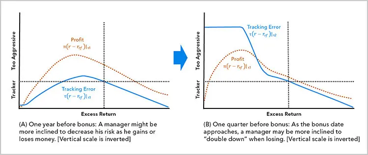
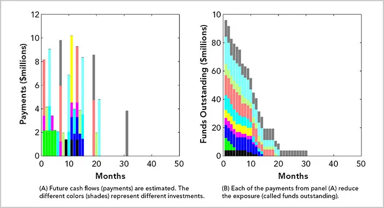
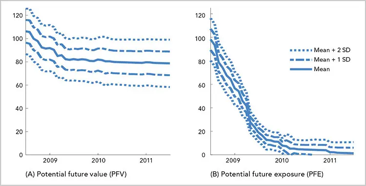
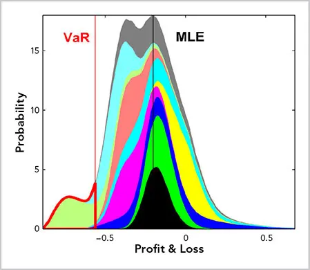
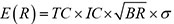

# 选择我们的产品

*因用而设*

人们通常认为，投资的技术能力——预测有利可图的投资和管理资金——是可以迁移的。在没有经验的人看来，用自有资金投资、为对冲基金（hedge fund）工作、为投资顾问工作，或管理财务金库，本质上似乎是同一件事。其实不然。商业目标、可用资源、客户需求、约束条件和激励机制各不相同，有时甚至比良好的业绩更为重要。投资者需要理解自身处境并善加利用。

本章将考察若干典型的业务形态，以及如何在这些业务中有效地管理投资。为了让我们的计划有一个正确的开端，我们需要评估一些关键概念：

   **公司类型（Firm type）。** 公司的最终目标可能不仅仅是收益。我们的投资努力必须支持公司的商业目标，这一点至关重要。这些目标常常通过公司类型来识别。令人意外的是，许多投资公司远比关注业绩更在意叙事、销售或费用最大化。公司的资金来源可能有特定的需求或偏好。我们未必能决定收益的特征，而可能不得不按照出资人的偏好来投资。

   **技能（Skill）。** 我们的资源可能有限。我们也许指挥的是一支由极有能力专家组成的海豹突击队，也可能是一支被训练成销售员的顾问大军。我们的目标必须反映我们的能力。我们必须选择一场我们能够打赢的仗。

   **基金结构（Fund structure）。** 我们可能继承一个现成的基金结构，也可能设计一只新基金。无论哪种情况，了解不同司法管辖区的各种优劣都很重要。法律和税务上的技术细节往往决定了投资风格。

   **激励（Incentives）。** 激励机制定义了周围人对成功的理解。收益可能并非公司或上级的首要目标。同样，你提供给员工的激励也应当与你的目标保持一致，以避免出现意料之外的结果。

本章将讨论上述这些为我们的工作奠定框架的概念。我们将在[第2章](ch02.md)构建策略，并在[第3章](ch03.md)制定计划。

## 公司类型
公司的商业模式决定了其资源、客户基础和动机。投资努力的目标和目的应当与这些需求和能力相一致。以下是一些公司类型及其如何回报投资管理者的例子：

**自营交易公司（proprietary trading firms）。** 这类公司通常被视为最具资本主义色彩的投资公司形态，公司、员工和客户之间的利益高度一致。自营交易公司有"切身利益在其中"（skin in the game），因为它们提供杠杆。为了让交易者与这种风险对齐，自营交易公司，或称*prop houses*，常常要求一种对称的报酬方案，管理者既参与亏损也参与收益。扭曲的激励也很常见，比如鼓励过度交易，使佣金从投资团队流向公司。投资团队常常需要自行支付资源成本。

**对冲基金（hedge fund）和私募股权（private equity）。** 表面上看，这些基金的*激励费（incentive fee）*^1^似乎与投资目标高度一致。随着基金规模增长，收入中更大份额往往来自与管理规模成正比的*管理费（management fee）*，而较少来自业绩或风险管理。对管理费的重视可能使公司更关注营销而非业绩。有时基金会突破容量约束，接受超出策略所能容纳的客户数量。对冲基金的资源可能较为充裕。

**财富管理顾问（wealth management advisories）。** 顾问同样无法避免利益冲突，可能被引诱去推荐能产生更高佣金的产品，或优先考虑资本积累（即*管理资产规模（assets under management）*，简称 AUM）。为此，他们可能强调诸如人生规划或税务管理、客户体验、差异化、上市速度、"民主化"或其他非投资特征，而以牺牲稳健的投资收益为代价。

客户的目标可能彼此冲突，例如一个信托可能以收入奖励某位受益人，而以增值奖励另一位。又或者在世客户可能希望耗尽基金，从而损害后代利益或违背原始出资人的意愿。强调非投资目标的商业模式可能将投资资源视为负担，而投资团队可能缺乏应对挑战性任务所需的技能。

**家族办公室（family office）。** 家族办公室形形色色，其目标和投资也各不相同。其目的和运作方式在很大程度上取决于办公室的规模和管理方式。家族办公室的行为可能像顾问公司、自营交易公司或捐赠基金。它们可能更具机构化特征，接受小众投资策略、联合投资（co-investment）和俱乐部交易（club deal）。冲突可能包括对家族的迎合，或不同成员、不同世代之间目标的不相容。

**投资银行、私人银行和保险公司（investment banks, private banks, and insurance companies）。** 这些公司通常提供复杂的产品和服务，包括定制化结构。金融工程常被用于设计和量身定制满足客户需求的解决方案。这些公司通常在数据、技术和技能方面资源充足。

**养老金、政府、捐赠基金、慈善机构、主权财富基金（sovereign wealth funds）和企业年金计划。** 这些机构通常高度机构化。其中一些资源充足、极其精深；另一些则在财务上受到约束，由代表受益人或发起机构的非专业人士组成的董事会管理。一些大型公共机构不愿支付高薪，却为外部顾问和服务预留了丰厚的预算。将关键的管理技能外包所带来的冲突问题十分棘手。

## 投资技能
一位基于低成本被动投资建立起令人艳羡的投资公司的人士曾问我，如何调和他对主动管理的尊重与自身的成功。相互冲突的风格与理念可以在不同的条件和约束下并存。一家较少获得人才和机会的公司应当追求更被动、更低成本、更分散化的策略，而一家更易获得人才的公司则应当更加主动，为获取信息和速度付费，并集中于高确信度的想法。

被动投资者可以尽量减少许多决策的影响，但有些选择是不可避免的，比如交易和再平衡的时机。即便机械、任意的时机规则也是带有后果的选择。有技能的投资者把风险当作一种宝贵而有效的资源加以运用，而不是像对待危险物那样去减少和回避它。^2^
## 基金结构
一些只专注于管理投资的读者可能尚未接触过基金结构。他们可能管理的是自有资金或聚合账户，如财务金库或养老金。当这些读者在更复杂的安排中工作，比如在注册投资顾问（Registered Investment Advisor，RIA）中，或开始设立一只新基金时，选择合适的法律和税务结构将至关重要。

一些客户要求单独管理账户（separately managed accounts，SMA）、委托账户、独立账户（"segs"）或侧袋账户（side pockets）。这些账户为客户提供定制化处理，并包含实际证券，而非混合基金中的份额。账户可以根据需要添加或剔除投资。一旦如此，这些账户从建立之初就开始从模型组合或基金中"分叉"，并随时间推移愈发偏离。由于这些账户不与他人共享，它们不受所模仿基金所遵循的相同法规约束。

基金将投资组合在由多名投资者共享的结构中。基金享有规模经济、流动性和更低的成本。在基金中较为简便或昂贵的处理方式，在独立账户中可能无法实现。税务包装、衍生品使用和其他特性在基金中可能得到更好的运用。

几乎每个司法管辖区都有自己形式的基金，并伴有相应的法律和税务待遇以及相应的限制。基金种类繁多、细节各异，名称包括管理基金（managed funds）、资金池（investment pools）和集合投资计划（collective investment schemes，CIS）。它们可以公开交易，例如交易所交易基金（exchange-traded funds，ETF）、共同基金（mutual funds）、单位投资信托（unit investment trusts，UIT）、房地产投资信托（real estate investment trusts，REIT）以及其他封闭式基金，或特殊目的收购公司（special-purpose acquisition companies，SPAC）。它们也可以是私下的，例如在对冲基金或私募股权中流行的有限合伙制。

细微的差异可能至关重要。例如，共同基金在应对大额赎回时受激励出售其流动性最强的资产，从而把较不具吸引力的资产留在基金中，而 ETF 则可以剔除流动性最差的资产，保留更好的持仓。


投资于证券的美国基金需要注册为 RIA。即使是外国管理者也可以注册为美国 RIA。所有进行证券交易的管理者，无论其母国法规如何，都必须在某处注册才能与美国公民开展业务。美国基金通常会设立一只离岸阻断基金（offshore blocker fund），以使免税投资者（如基金会和捐赠基金）免于承担无关业务应税收入（unrelated business taxable income，UBTI）的责任。主从结构（master-feeder structures）很流行，投资者通常由在岸或离岸的*联接*（feeder）基金提供服务，而这些联接基金投资于一只主基金（master fund）。一个显著的缺点是，离岸基金中的美国股息要按 30%征税。

公司销售的产品通常要么是*开放式架构（open architecture）*，允许客户选择公司外部管理的产品，要么是*受限（fettered）*架构，将客户限制在公司内部产品中。开放型公司提供更多样化选择，可能看起来更公正。但它们可能受到偏好和安排的困扰，这些偏好和安排激励它们提供劣质或昂贵的产品，并使客户承担多层费用。

公司内部产品使公司能够施加更多控制和影响，有可能提供更好、更对齐的结果。它们可能享有更高的透明度，便于更好的业绩归因和风险分析，并能适应更灵活的转移方式，如*实物支付（payment-in-kind，PIK）*和独立账户。

*次级顾问（subadvisors）*代表另一家资产管理人管理基金，可能包括*白标（white-labeling）*（以资产管理人的名义重新命名基金），以更广泛地接触客户。有时，当次级顾问服务于机构客户时，一款零售产品会被包装成"机构品质"来销售。


ETF 通常费用更低，比共同基金更具税收效率，相对于 UIT 等工具具有更具吸引力的特征（包括有利于下跌趋势的股息再投资计划）。ETF 数量众多，便于表达各种观点。例如，等权 ETF 比市值加权基金持有更多小盘股，并减少对业绩的追逐。

许多这类专门的 ETF 并未兑现其"包装上的承诺"——尤其是商品 ETF、杠杆基金和反向基金。对立的风格因子基金，如价值基金和成长基金，常常共享持仓。地域受限的基金可能从宣传地区以外的地方获得收入和发生费用。固定收益 ETF 通常具有稳定的久期，而固定收益资产通常久期递减。房地产 ETF 通常不含住宅物业敞口，尽管住宅抵押贷款产品是该市场的重要组成部分。商品 ETF 通常投资于期货组合而非现货资产。它们可能具有复杂的税务结构，可能就未实现收益或作为收藏品被征税，甚至可能需要提交不便的 K-1 申报表。^3^
## 激励
激励机制在产品设计、投资流程和有效的团队管理中都至关重要。它们是业绩和风险（包括运营、法律和监管风险）的主要驱动因素，也是本书第一部分和[第15章](ch15.md)的重要内容。

基金经理最迫切的任务是保住自己的工作并获得报酬。我们必须细致地分析和施加激励，以激发我们自己和我们所雇佣人员的理想行为。我们可以运用博弈论（game theory）、蒙特卡洛模拟（Monte Carlo simulation）和随机微积分（stochastic calculus），来理解和协商更公平的费用结构，减少道德风险（moral hazard）和代理问题（agency problem），并鼓励健康的风险承担。

通过对我们的产品建模，我们可以模拟一位理性的投资管理者会如何行事。我们将基金业绩与各种费用和成本计划、理性行为以及启发式偏差相结合，帮助我们评估产品配置，为管理者提供收入，并为投资者提供经风险调整的业绩。激励不当的管理者可能会最大化费用、承担过度风险，或过于谨慎（例如，等待薪酬重置日、跟踪、抱团或"衣柜指数化"）。

结构和参数有许多变体。大多数基金提取定期管理费和激励费。随着基金聚集资产，管理者可能倾向于专注于营销以筹集资本并赚取可观的管理费，而非提供出色的业绩。门槛收益率（hurdle）、高水位线（high-water mark）和追回条款（clawback）可能限制业绩费，但重置可能使这些限制形同虚设。^4^

在与基金经理谈判或设计产品以使激励与期望结果对齐时，对激励效应进行建模是很有帮助的。薪酬日期（例如一个奖金期的结束）是激励模型中的一个重要特征。图1-1A 展示了管理者在盈亏时如何倾向于降低风险。随着奖金日的临近，他在亏损时可能更倾向于"加倍下注"（图1-1B）。管理者对赎回或失业的恐惧抑制了他的风险承担，这反映在图1-1B 最左侧的平台区。薪酬激励可能加剧而非改善糟糕的业绩，因为它鼓励贪婪的风险厌恶。当奖金临近、亏损累积时，利润曲线（虚线）会向左偏斜。

**图1-1** 投资者行为对激励响应的模拟结果。贪婪、厌恶风险的投资管理者在投资期初过于保守（A）；而当业绩不佳、收益兑现时点临近时，管理者寄希望于奖励而孤注一掷，可能过于激进（B）。垂直虚线代表盈亏平衡点。

诸如频率、*通知期（notice periods）*、*门槛（gates）*、*锁定期（lock-ups）*和罚金等限制^5^，旨在阻止投资者收回资产。它们的存在是为了延缓或缓和被迫清算非流动性持仓的交易，保护那些留下的"黏性"投资者免受"快钱"或"热钱"的冲击，并为管理者提供恢复业绩的喘息空间。这些限制的弊端在于，投资者可能被困在一只不断贬值的基金中而几乎无计可施。一种最小化或消除这种负担的方法是使用补充协议（side letters）。


一家大型家族办公室请我们量化其基金经理激励的影响，以便对各基金进行比较并谈判条款。我们发现，限制可能使业绩每年降低多达 7%。我们通过回答"在我们决定赎回之后，基金还能损失多少？"来计算*流动性价值调整（liquidity value adjustment，LVA）*。

我们考察了一个由 10 只基金组成的投资组合，其赎回请求产生了 21 个分批。每一批代表对一只基金的一次单独投资。现金流的回收根据每只基金的限制在时间上分散开来。图1-2 的左图展示了由于这些众多的门槛、锁定期和结算期，一个投资组合的赎回款项如何被错开。每种颜色代表一只不同的基金。图1-2 的右图说明了基金如何在数年期间返还给投资者，从而降低敞口。

**图1-2** 未来现金流与尚未收回的基金

我们对每一批和每一次赎回模拟了许多可能的结果，并确定了由于这些限制而会获得或损失多少。最初，我们对投资者的负债进行建模，以确定基金在何时可能因业绩以外的理由被赎回。这种分析的益处有两方面。首先，必须区分*正向风险（right-way risk）*（一种可容忍的意外）和*反向风险（wrong-way risk）*（在最糟糕的时机显现的问题，例如养老金支付增加时）。其次，了解公司何时需要为支付筹集资本，以及这种需要如何与亏损同时发生，是很有帮助的。

基金的估值使用前瞻性因子分析、业绩历史（如有）或代理组合进行建模。情景测试和压力测试生成了诸如*最大缺口（maximum shortfall）*和*风险价值（value-at-risk，VaR）*等统计量的收益分布。

赎回规则和流动性限制被施加在负债模型所确定的日期上，以计算投资者将在何时、以何种金额在一段时间内收到投资现金流。

然后，我们将赎回规则与模拟路径相结合，并对结果取平均，从而计算出*潜在未来价值（potential future value，PFV）*和*潜在未来敞口（potential future exposure，PFE）*，如图1-3所示。

**图1-3** 潜在未来价值（PFV）与潜在未来敞口（PFE）

然后我们计算了损失分布、*极大似然估计（maximum likelihood estimator，MLE）*和 VaR（图1-4）。我们通过将施加限制后的模拟盈亏与未施加限制的模拟进行比较，确定了这些限制的货币影响。

**图1-4** 所有组合、批次和模拟的损失分布

通过将预期损失、VaR 或其他风险统计量乘以事件发生的概率，我们确定了为补偿赎回限制所致损失风险所必需的费用或门槛收益率。我们对不同的情景和配置进行了分析。

我们将资产和负债动态地组合在一个单一投资组合中，以管理资产负债比的波动率，并应用概率和精算模型来估算客户各相关方的需求与期望。

通过进行这项工作，我们能够为这些风险定价，并将其纳入基金估值。这使估值更加公平，并使我们能够比较不同结构的基金。

投资管理者很少有在真空中工作的奢侈。他们必须考虑自己所处的环境，包括公司、资源和文化，以及将收益传递给投资者的产品。

1. 激励费（incentive fee，又称*业绩费（performance fee）*）由投资者支付，与管理者创造的利润成正比，并受条件约束。管理费（management fee）与投资金额成正比，且可能不会因业绩不佳而减少。经典的"二八开（two-and-twenty）"指的是每年 2%的资产管理费和 20%的利润业绩费。

2. 投资技能既与投资者的能力有关，也与技能影响投资结果的可能性有关。许多人偏好被动投资，因为他们认为任何水平的技能都无法在扣除费用后产生经风险调整的业绩。Grinold 和 Kahn 的主动管理基本定律（Fundamental Law of Active Management）， 大致可译为"预期收益与效率、技能以及彼此相关性低的机会数量成正比"。如果投资者认为自己没有足够的技能，他仍然可以通过勤勉、技术和获取机会来提升效率并扩大机会范围。

3. 美国国家税务局（Internal Revenue Service）1065 表附表 K-1 用于报告合伙企业的财务信息。

4. 管理者必须先赚取一个最低的*门槛收益率（hurdle rate）*才能计提业绩费。该门槛可以是一个绝对数值，也可以相对于某个*参考利率（reference rate）*来衡量。*高水位线（high-water marks）*防止管理者在基金表现不佳时计提业绩费。*追回条款（clawback）*允许投资者收回费用。高水位线会定期重置为当前组合价值，此前的损失被排除在未来计算之外。

5. 保护基金免受*资金流出（outflows）*的条款繁多且各异。赎回可能被限制在某些期间，例如每季度 20%，并可能需要事先通知，例如 30 天。赎回可能受限或被*设门槛（gated）*，例如每个赎回期 20%。赎回可能在某段时间内被排除（*硬*锁定期）或受赎回罚金约束（*软*锁定期）。
