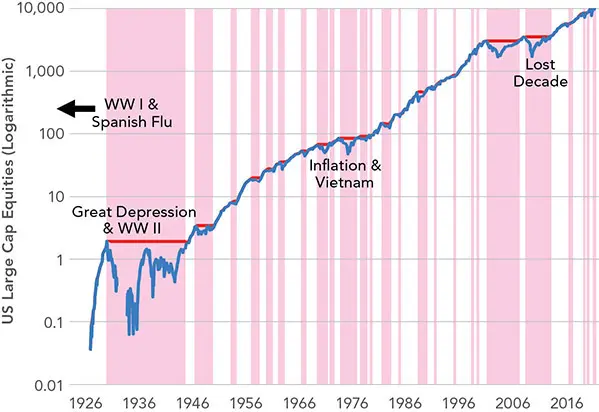
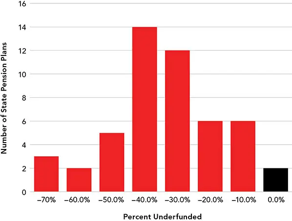
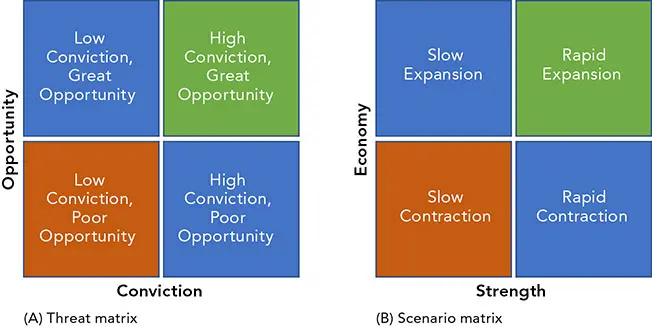
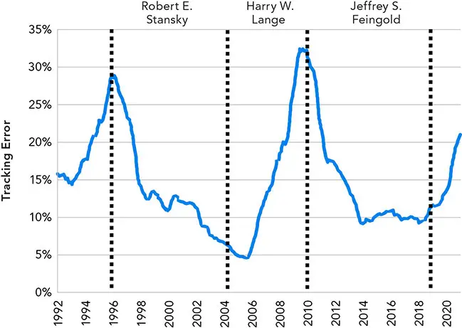
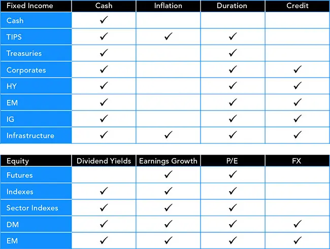
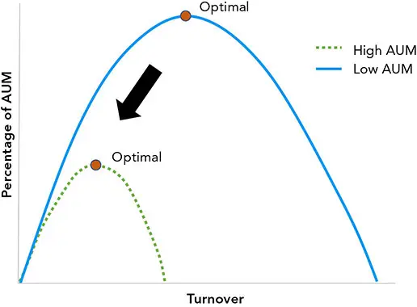

# 投资流程

*如何投资*

既然我们已在 [第1章](ch01.md) 中确定了自身在业务中的使命，并阐明了如何推进其目标，我们便可将目光转向如何规划实现这些目标的路径。一旦制定了计划，我们将在 [第3章](ch03.md) 中将其凝练并加以沟通。一套深思熟虑的流程能为我们提供结构、可靠性与指引，使我们在充满不确定的时期亦能有所依托。

## 战略资产配置（Strategic Asset Allocation, SAA）
部分读者或许并不需要本章所呈现的那般全面的计划。那些专精于某项更窄技能（如选股）的人，仍可从理解自身努力如何融入更宏大的议程之中获益，从而更好地满足公司、管理人和客户的需求与目标。

**因子暴露（Factor exposures）。** 战略性或长期配置，又称*政策组合（policy portfolio）*，通常被定义为对各类投资设定目标配置，并附带一个区间或范围，使管理人得以灵活地根据当前形势调整风险。尽管多数机构仍通过指定资产类别和货币权重来界定其大部分配置，但两种做法都已陈旧且有误导之嫌。风险是跨资产分布的，而不同类别的风险往往差异悬殊。以因子与数量、并以*风险预算（risk budget）*^1^ 的方式界定投资类型，要远为有效与实用。

**分散化的收益（The benefits of diversification）。** 一些投资者抗拒资产配置策略，并超配（overweight）高风险资产。这种短视观点忽视了几乎所有投资类型都会经历漫长的*回撤（drawdown）* 时期。虽说"风险调整后的收益不能当饭吃"，但回撤对那些需要用资产偿付负债的投资者，以及临近退休的人来说，是毁灭性的打击。

作为最常见的高风险资产类别之一，美国大盘股在大萧条（1930 年代）之后及此后的若干时期都经历了漫长的回撤。可以公允地说，大幅回撤并非异常现象，而大萧条之后的 49 年误导了众多人士，使他们以为股票会稳健升值。^2^ 若读者将注意力集中在图 2-1 的阴影回撤部分而非长期趋势，并设想自己在退休前"潜水"（处于亏损状态）5 年乃至 10 年之久，那么高风险资产便会显得不那么诱人。倘若图中纳入第一次世界大战和西班牙流感，情形将显得更加严峻。


**图 2-1** 股票在大部分时间里都处于回撤之中。别被困住！


机构持有约 80% 的美国股票。其中不少机构（如资金不足的州养老金）会发现，难以在没有收入的漫长时期里撑持下去。即便一个组合能够产生更高的*终值财富（terminal wealth）*，确保更多时间"浮出水面"或许也是值得付出的努力。图 2-2 显示，大多数州养老金系统资金不足，其中许多资金缺口相当严重。


**图 2-2** 美国州养老金：资金覆盖率减去 100%


数据：Pew Charitable Trust，《州养老金资金缺口：2016 年——投资亏损、缴费不足降低了公共雇员退休计划的资金水平》（"The State Pension Funding Gap: 2016: Investment shortfalls, insufficient contributions reduced funded levels for public worker retirement plans"），2018 年 4 月 12 日。

**资产配置 vs. 证券选择（Asset allocation vs. security selection）。** 相较于证券选择，资产配置从技巧中获益较少，却更可能是多资产类别投资者业绩的主要驱动因素。许多机构在选择管理人和单项投资上耗费了不相称的精力，而忽视了向因子的配置。正如 Paul Samuelson 所指出的，^3^ 证券选择往往更需要技巧，因为市场在选择证券方面往往比在选择资产类别方面更有效率。大类的资产类别之所以比更窄的证券类别更缺乏效率，原因之一在于：资产类别可能糅合了更为多样的参与者、时间跨度和动机，使得错误定价更难被套利。

战略政策天然享有较长的投资期限。然而，较短的时期可能对投资选择与管理决策形成压力。

侵蚀性的成本与费用会削弱提高交易频率所带来的好处，并在艰难时期重新点燃关于主动与被动投资之争的讨论。维持分散化和风险溢价（risk premia）需要交易。直面艰难抉择至关重要，而非退避到一个不那么相关、却更便利的目标上去。

## 战术资产配置（Tactical Asset Allocation, TAA）
战术性机会存在于趋势与错位（dislocations）之中。由经济数据所隐含的预期，可以与由*资本市场假设（capital markets assumptions）* 所隐含的预期相比较。在期限结构、波动率曲面（volatility surfaces）及其他框架中，都存在着不一致与错误定价。诸如风险与协方差的时变特性、外生冲击与时点观点、周期性季节性以及供需扰动，均可加以利用。

若我们将自身对资产估值、因子演化与市场力量（情绪）的预测——亦即*观点（views）*——与市场所隐含或*已定价（priced into the market）* 的情形相比较，便可确定*超配（overweights）*、*低配（underweights）* 或称*倾斜（tilts）*。这些倾斜会暂时令投资组合偏离战略目标。

许多公司会定期（如每月或每季度）召开投资会议，讨论宏大而缓慢的全球宏观经济趋势，并更频繁地（如每周）讨论跨资产策略与持仓。可执行的决策要求管理人明确：需交易的确切资产及其比例。一笔交易的*最佳表达（best expression）*，可能是一次直截了当的买入，也可能是某种由众多衍生品交易构造而成、并横跨避税天堂的复杂合成资产。

进出场位、交易期限、风险限额、信念程度（conviction）及其他细节，同样必须加以评估和估算。一个*机会矩阵（opportunity matrix）* 或*威胁矩阵（threat matrix）*（图 2-3A）可以用每单位风险回报与信念程度的不同象限来呈现这一讨论。另一种典型产出是战术性的*情景矩阵（scenario matrix）*（图 2-3B），它展示在各种经济实现情形下的机会。除了四个象限，还可纳入众多单元格，以容纳更为详尽的威胁与情景集合。


**图 2-3** 威胁/情景的矩阵表示


对组合"动手"几乎是难以抗拒的诱惑。过度交易的危害虽是老生常谈，但同样值得注意的是：除非短期判断精准无误，否则战术性配置会削弱一个已优化组合的长期分散化。减少分散化所带来的机会成本，应当用于折现倾斜所带来那期望中却不确定的收益。部分投资者通过维持组合或投资类别的目标风险水平来进行风险配置的倾斜。

## 因子投资（Factor Investing）
定义与运用因子的方式多种多样。量化方法——包括*风险溢价*归因（risk premia attribution）与优化——的一项关键产出，是揭示隐含假设与心理偏见的反向过程，例如短视主义、本土偏见（home bias）以及顺周期性（procyclicality，即羊群效应与动量）。Antti Ilmanen 将投资划分为资产类别（股票、主权债、信用债、另类投资）、策略风格（价值、趋势、波动率、套利携带 carry）以及风险因子（增长、通胀、非流动性、尾部风险 tail risk）。^4^

识别与量化因子的一种常见策略，是对市场已定价的主流假设进行逆向工程（reverse engineering），以确定*公允价值（fair values）*。更具洞见的是：对自身投资决策或所雇用管理人的决策进行逆向工程。许多投资者并未客观地分析自身的业绩与行为，所投资的组合并不支持其观点与逻辑。叙事、说服与自信，往往会压倒审视、业绩与技巧。

**风险溢价（Risk premia）。** 风险溢价不过是某项资产相对于更低风险投资而言的边际回报，尤其是当风险呈顺周期或"方向相反（wrong way）"之时。

*行为启发式（Behavioral heuristics）* 表明，投资者并非完全理性，而认知偏差能够维持持久的或称*结构性（structural）* 的溢价。供需同样可以创造出一种永远"不会清理干净"的溢价——例如某只因对冲目的而广受欢迎的特定到期期限债券。随着*聪明贝塔（smart beta）*^5^ 产品的演进，部分投资专长被从 alpha 重新归类为溢价——"并不存在 alpha，只有尚未被发现的 beta"。

*预测溢价水平（Predicting premium levels）* 是出了名的棘手。一项预测的最高使命并不在于预测本身，而在于从过程中获得的视角与洞见。即便预测准确，溢价也具有时变性并受制于尾部风险，难以捕捉。

结构性风险溢价可以通过多种方式估算，包括运用社会、供需数据的理论模型。前瞻性估计——如收益率曲线形态、拔靴法（bootstrapping）以及调查——可能因相互冲突的预测期限以及过度关注近期细节的倾向而变得复杂。这些预测在较长期限上往往呈现渐近形态。分离溢价的两种标准方法包括堆叠法（stacking）与基于需求的正交分解（orthogonal decomposition）。

**溢价堆叠（Stacking premia）。** 在堆叠溢价时，会增添或叠合不同的类别，如同资本结构的分配瀑布（distribution waterfall）。例如，股票溢价可被分解为无风险利率、通胀、债券溢价与股票溢价。每一项可单独估算；加总起来便构成股票风险溢价。债券风险溢价复用了其中部分溢价，由无风险利率、通胀与债券期限溢价构成。

**多因子与正交溢价（Multifactor and orthogonal premia）** 有时会以数学方式估算，而较少顾及经济学直觉。此法有诸多优势，如灵活性、易于自动化、可扩展性以及数学上的严谨。然而，正交溢价缺乏可解释性，可能成为一个严重的短板。

**经典因子（Classic factors）**，如 Fama-French 因子，^6^ 通常是堆叠（次可加）且符合直觉的。它们经过了充分研究，在推进这些方法方面也存在激烈竞争。较短期的结构性溢价以及更为局部化的溢价，更可能被加以利用。各异的目标、时间跨度及其他目的会催生低效率，但并不持久。有些可以预期，如现金—期货基差（cash-futures basis）；另一些则可能过于短暂，或需要过多数据才能从经济模型中推导得出，如某些交易特征。包括谱方法（spectral methods）在内的更自动化方法倾向于后者。新颖而前景广阔的结构因果模型（structural causal models）有望实现可解释经济模型的设计与运行的自动化。

**"量化基本面（Quantamental）"技术** 将经济学直觉与更为量化的方法相结合，通常是将人与计算机模型相配合，而非偏废其一。这些方法往往涉及那些兼具有效性、可解释性与叙事吸引力的主题因子——而叙事吸引力对产品营销颇为重要。这种吸引力并非虚饰；它远比仅仅让策略易于解释和销售来得有用。

主题也能更好地协调多资产策略的各组成部分。若整体组合采用了风险预算，那么配置给一只使用相同方法论的资金，便能产生一个更为连贯的过程。同样地，一位具有经济思维的首席投资官（Chief Investment Officer, CIO）可能更青睐以国内生产总值（Gross Domestic Product, GDP）而非市值加权的基金。高度专业化的基金——例如大量使用另类数据的基金——可以运用这些方法。例如，一些基金专精于分析监管文件或法律文书，它们能够从语言中发现规律，从而帮助识别机会。

计算机的运作方式不同于人类，迫使它去模仿投资风格——哪怕是量化的风格——未必是设计算法最有效的途径。然而，有效性相对于可解释性与可理解性往往是一种奢侈，而后者对于建立信任、募集资金，以及在艰难时期留住资金，都至关重要。

**细节（Details）。** 微末的细节会累积成严重的障碍，可能玷污因子或使其失效。诸如费用、过度分散化、抽样误差与现金拖累（cash drag）等大量隐患，会放大那些始终存在且迫在眉睫的担忧——如拥挤（crowding）、传染（contagion）与风格漂移（style drift）。一个关于风格漂移的好例子，可以从一只看似单一的资金 Fidelity Magellan 看出：在不同的管理时期，其跟踪误差（tracking error）此消彼长（图 2-4）。Magellan 曾以 Peter Lynch 的"买你所了解的"策略而闻名，但随着管理人更替，其策略也随之变化，其中包括"暗箱指数化者（closet indexer）"Bob Stansky。


**图 2-4** Fidelity Magellan 基金两年滚动跟踪误差


数据：Bloomberg, LP。

傲慢与过度简化是不明智投资者的塞壬之歌（siren song，致命诱惑）。在选择因子、构建流程或设计算法时，从"裸金属（bare metal）"出发，以充分理解该流程的假设与细节，往往优于对既有技术进行修修补补。

   **清晰与控制（Clarity and control）。** 在量化方案复杂的开发过程中，几乎每一步都涉及专家的*定性（qualitative）* 判断。我们对许多软件设计决策并不认同，哪怕只是因为有太多武断的决定被做出。例如，Bloomberg 的 PORT 功能会对仅提供季度 13F^7^ 报告的基金报告日收益率，它（错误地）假设这些组合在报告期间不进行交易，仅仅在两次申报之间随波漂移。这一方法虽不完全准确，却是个合理的解决方案，但如果它诱使我们误以为 PORT 所报告的日收益率代表了真实收益，那便会产生误导。

   **差异化（Differentiation）。** 若竞争对手使用了相同的第三方工具与数据，则很难以有意义的方式将自己的量化流程与竞争对手区分开来。

那些看似简单的因子，在执行层面却鲜有直截了当可言。例如，一个高层级的决策树可能以选择超配股票还是债券为起点——运用流动性、货币供应、先行经济指标等因子——随后可能变得更具体，去审视个别股票的债务与现金流之比等细节。因子常常相互作用、彼此复合，最终形成如"前瞻性企业价值与销售额之比的 5 年 Z-score"这类复杂构造。

## 理论的角色（The Role of Theory）
在许多领域，研究者都在寻求一个无需任何领域知识的通用"黑箱"。许多天真或稚嫩的金融研究者会落入这一陷阱。我们应始终警惕虚假关系与过拟合（overfitting）。在这样做时，在统计（高方差模型）之前转向理论（高偏差模型）以寻求理性、可解释且可理解的基础，是顺理成章的。

**经济模型（Economic models）。** 存在许多精妙的经济模型，用于研究供需、商业周期、货币与财政政策、贸易与流动，以及其他更多方面。从这些模型入手、并让资本市场假设从中推导出来，颇具诱惑。其中相当部分是成立的，例如在识别商业周期阶段之时。经济学所服务的目的与量化交易模型不同。经济模型并非用于预测资产价值，而是用于理解经济复杂而动态的相互作用。就此而言，经济模型可能比那些更贴合数据的量化交易模型更为重要。经济模型做出艰巨而不现实的简化，以图确定根本性的关系。简单的政策规则，胜过用可疑的细节去模糊那脆弱的直觉。

*理论之严谨与精确，很容易让我们安枕于对其结果的信任，将其视为主要信号，但世界远比这复杂得多；在能够依据这些理论进行交易之前，经济学还有很长的路要走。* 最好运用经济理论来*调节*我们的观点，而非去*驱动*它们。在当前经济理论发展的阶段，关于复杂数学之价值的争论相当活跃。经济模型可能因条件状态变量与多重相互冲突的周期而难以处理。供给模型可以描述资产价格，而需求模型可以通过信贷增长及利用信贷的意愿来估算个人与公司的消费。尽管付出这么多努力，资产价格与商业周期之间相关性并不强，最多只能解释三分之二的变动。

计量经济模型（Econometric models）远没有那么雄心勃勃，且相较于理论，它们更具统计色彩。它们通常施加一种高偏差的学术关系，并有助于预测资本市场假设。当"大致正确胜过精确错误"（better to be roughly right than precisely wrong）之时，^8^ 它们可用于生成情景矩阵的各个象限。

**量化模型与市场模型（Quantitative and market models）** 用于描述资产价格与市场参与者的行为。它们包括机械模型（如期货套利）、统计模型（如配对交易 pairs trades）以及代理模型（如市场冲击模型 market impact models）。这些模型的独特之处在于：它们并不试图识别资产价值，而是试图确定某一确定性事件的最优瞬态或终态——例如期货到期时的收敛，或简洁时间尺度上的市场均衡。这些模型往往更接近工程方法，而非科学或统计的表述。

经济、计量经济、因子与量化的研究竞争极为激烈。运用另类数据与前沿技术，去发掘相对未经开发的信息源，是颇有回报的。我们正身处一个黄金时代——这些数据与技术既可获得又十分强大，且仍在快速进步。较老的统计方法容易产生虚假结果，但包括机器学习方法在内的较新技术，则积极且明确地处理过拟合及其他风险。诸如结构因果模型等技术，或能在不久的将来克服现代复杂的金融机器学习方法所面临的最严峻异议，产出动态、稳健、可解释、自愈且容错的预测。

## 证券选择（Security Selection）
证券选择是投资流程中领域性最强、最为多样的一步。部分投资者完全专注于资产配置，投资于高效的 ETF；另一些人则在不为人知的工具中发现独特而微妙的机会。每一种方法都值得一整本书加以阐述。图 2-5 给出了一个关于因子如何转化为投资选择的简单高层示例，但这仅是管中窥豹。


**图 2-5** 因子如何转化为投资选择


大多数基金出于多种原因而专注于证券选择，包括各类工具和表达方式——如资本结构、衍生品及风险代理——所提供的机会广度。*plain vanilla*（普通香草式）期权组合提供了多种获取特定投资敞口的方法，包括转换（conversions）、反转（reversals）、盒式（boxes）以及看跌-看涨平价（put-call parity）。合成构造与套利司空见惯。诸如税务处理之类的细节，可能比原始论点带来更多利润，且可能更具结构性与可靠性。

## 组合构建（Portfolio Construction）
组合构建决定了投资的比例、时机，以及买卖投资所涉及的策略，还有这些比例的持续维护（*再平衡 rebalancing*）与对冲技术。工程式的组合构建方法早已成为主流。然而，*科学配置的真正承诺从未被完全兑现。* 多数管理人是在这些量化方法的语境下描述其组合构建的，尽管实际执行有时并不那么严谨，取决于管理人的性情。

在多数情况下，现代的加权技术会隐式或显式地涉及某种优化方法。目标与约束千差万别，可以通过参数化、历史或蒙特卡洛模拟（Monte Carlo simulation）来预测或计算。诸如多臂老虎机（multi-armed bandits）与凯利准则（Kelly criterion）等特定实现可能颇为引人入胜，但没有任何一种特定体系占据主导，且各有其缺陷。随机优化以及动态、稳健与多期方法都已展现出前景。

**择时（Timing）。** 许多投资者痛斥择时之徒劳，但择时不可避免。每一项投资决策都涉及择时，因消极回避而产生的过失并非解决之道。正如对待过拟合与可解释性一样，直面这一不完美而艰巨的任务，胜过对其视而不见。即便像机会主义再平衡（opportunistic rebalancing）这类系统化方案，也是对择时的隐性下注。进出目标固然重要，但它们的价值更多体现在所培养的纪律，而非所强制的具体水平。一位优秀的投资者或许能从一笔糟糕的交易中获利，而一位缺乏纪律的投资者却常常纵有良策依然亏损。在许多投资业务中（并购（mergers and acquisitions）等高利润营生除外），过渡管理（transition management）、缺口管理（shortfall management）以及对其他效率的把控，可以构成结构性利润的主体。

**再平衡（Rebalancing）** 技术是组合管理的一个重要方面，但因技巧、成本与路径依赖之间的权衡而变得复杂。在两端，情形显而易见：拥有强信息系数（information coefficients）的高频交易者从极快的再平衡中获益，而低技巧的指数化者则从更被动的方式中受益。

一般而言，随着基金规模增大，换手率会受到约束，如图 2-6 所示。当基金规模尚小时，鲜有人关注其交易；但当它在所交易的资产中累积了相当份额时，便会推动市场，使再平衡变得昂贵。审慎地运用资金流（flows），可使组合更接近目标配置，从而降低跟踪误差与 alpha 衰减（alpha decay）。


**图 2-6** 最优换手率随公司规模增大而下降。


**自适应资产配置（Adaptive asset allocation）** 绕开了再平衡中的择时层面。它通过相对于漂移中的市场组合进行再平衡，避免了频繁且大幅的逆向调整（高卖低买）。其逻辑在于：市场组合在其漂移过程中反映了预期收益的变化。这些预期可以通过反向优化（reverse optimization）加以揭示。

对再平衡的一项批评是：它会因反应过慢或错过趋势的倾向，而对收益造成结构性的"拖累（drag on returns）"。这其中或许有几分道理，但一个伴随波动率上升而下跌的市场，往往会*均值回归（mean-reverting）*，股市的突发运动也是如此。多资产组合不太容易带来懊悔，而趋势跟踪与均值回归策略都能派上用场。关注横截面收益（cross-sectional returns）或许比状态（regime）利用更为*有效*（fruitful）。

**系统化对冲策略（Systematic hedging strategies）**，如止损（stop-losses）与覆盖策略（overlays），也可被设计用以提供充分的风险管理。风险控制对大多数策略的长期存续至关重要。大多数投资者在大多数时候都是错的，但他们从正确决策中获益的程度，远大于从错误决策中遭受的损失。持续的管理至关重要，而系统化对冲则是一股顺风。

正如许多涉及抵押贷款（mortgages）的策略一样，某些对冲会在一种不利的对冲中遭受系统性损失，而另一些则面临显著的尾部损失（"在推土机前捡硬币（picking up dimes in front of bulldozers）"）。许多业务建立在辛勤工作与运营风险（"血汗股权（sweat equity）"）之上，而非技巧与运气之上。它们因接受并管理诸如负凸性（negative convexity）这类结构性的不便利而获得补偿。

负面的偏差或许是策略中不受欢迎的特征，但通常可以付出代价获得保护。一般而言，保险的便利性所带来的成本，会超过保护的经济价值。当损失的成本难以承受时，即便自保（self-insure）更为廉价，购买保护也是明智之举。一张定价过高的"彩票（lottery ticket）"，只要价格微不足道且收益可观，便具有价值。交易商通过撮合交易来分散风险，并通过提供保险赚取近乎无风险的收入——尽管这并不意味着他们会廉价地提供它。

## 持续管理（Ongoing Management）
对业绩与风险的持续监控与管理，以及一只基金的整体现金管理，在许多方面比其论点本身更为重要。管理涉及对有缺陷或已被证伪的假设、新关系与敏感性的探查与检验，包括外生风险、尾部事件、运营问题，以及无数看似无害却足以毁掉一只基金的细枝末节。对政策与治理的恪守可作为抵御这些风险的护栏，而失败往往聚集在某些微小的偏离之处——它们可能演变为阿喀琉斯之踵（Achilles' heel），引发一连串的损失。

我们探讨分解风险与收益、归因其驱动因素与来源的多种方法，并从不同视角审视这些指标，以便在威胁仍可应对时加以识别。扰动分析（perturbation）、压力测试（stress testing）、情景分析（scenario analysis）、反事实（counterfactuals）及其他方法，都是风险管理工具箱中的要素。尽管拥有这一切工具，许多人仍认为风险度量是一门科学或一种报告形式。风险管理实则是一门艺术，它需要丰富的经验与洞见，去解读众多相互矛盾的线索，以及为使分析变得可行所必需的那些危险假设。

我们已经勾勒了一套通用的投资流程，作为在第 II、III、IV 部分深入探讨的概览。当专注于错综复杂的细节时，很容易迷失对流程的把握，而本章正是为了勾勒这一切如何契合而设计。从长期视角——战略目标——出发，我们战术性地偏离以把握机遇。我们采用因子投资而非资产类别分类，采用风险预算而非货币权重，因为它们与我们的目的更为契合、更为真实。我们探讨多种能够增进洞见的模型与量化策略。证券选择与组合构建将我们的想法转化为买卖，并以审慎之心加以执行。

最后，投资很少是一项"一劳永逸（set it and forget it）"的活动。它需要持续的管理与勤勉——而这往往与我们的本能和偏见背道而驰。

1. 风险预算以风险而非*资产管理规模（assets under management, AUM）* 的百分比来度量配置。

2. Edward F. McQuarrie，《你从未见过的股市图表（Stock Market Charts You Never Saw）》，2017 年 9 月。

3. Paul Samuelson，《商业周期总结：开幕致辞（Summing up on Business Cycles: Opening Address）》，载于 Jeffrey C. Fuhrer 与 Scott Schuh 编，《超越冲击：商业周期的成因（Beyond Shocks: What Causes Business Cycles）》（波士顿联邦储备银行（Federal Reserve Bank of Boston），1998 年）。

4. Antti Ilmanen，《主要资产类别的预期收益（Expected Returns on Major Asset Classes）》，John Wiley & Sons，2011 年。

5. Willis Towers Watson，《聪明贝塔：时而聪明，时而不然（Smart beta: sometimes smart, sometimes not）》，2006 年。

6. Eugene F. Fama 与 Kenneth R. French，《股票与债券收益中的常见风险因子（Common Risk Factors in the Returns on Stocks and Bonds）》，《金融经济学期刊（Journal of Financial Economics）》第 33 期（1993 年）第 3--56 页；Eugene F. Fama 与 Kenneth R. French，《五因子资产定价模型（A Five-Factor Asset Pricing Model）》，《金融经济学期刊（Journal of Financial Economics）》第 116 卷第 1 期（2015 年 4 月）：第 1--22 页。

7. 美国证券交易委员会（United States Securities and Exchange Commission）13F 表格，《机构投资管理人提交的报告（Reports Filed by Institutional Investment Managers）》。

8. 此说常被归于 John Maynard Keynes，但更可能源自 Carveth Read，《逻辑：演绎与归纳（Logic: Deductive and Inductive）》，1898 年，或更早。
