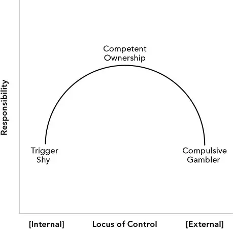
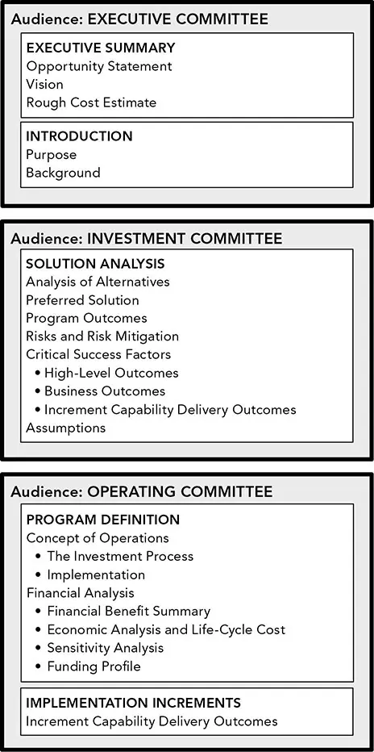

# 领导力与治理

*恪守责任*

[T]三种常见的致命投资错误是傲慢、无知以及道德的随意（flexible morals）。在我所督导的数以千计的专业和学术投资方案中，几乎都曾因这些失误而濒临失败——若非我及时介入的话。

这些同样的恶习也是一条通往所谓"成功"的熟路，而其代价往往由客户与债权人承担。每一个戏剧性的幸运成功背后，都有许多无声的失败。因此，*可得性偏差（availability bias）*会引发*确认偏差（confirmation bias）*。我所倡导的美德是纪律、概率与技艺，而非冲动、投机与运气——是苦功而非炫技。这些美德能提升成功的概率，并使成功更具针对性与刻意性。

守护良好行为、与投资者保持一致、应对无处不在的道德风险（moral hazard）、遵守法律合规，这些并不是审慎治理（governance）与有效领导的全部理由。即便是出于最良好意愿的计划，也常常缺乏通向可持续成功的路径，或者在不经意间制造出难以补救的组织困境。

本章我们将首先讨论良好的投资*文化（culture）*。这些特质对于个人投资者、小型基金和大型机构都至关重要。它们常常被虚伪地宣称为核心信条，而其缺失则从内部侵蚀投资流程。

我曾目睹许多人因缺乏规划而不必要地挣扎与失败。一份*商业论证（business case）*有助于提升认知，并为建立投资业务这一充满不确定与挑战的过程做好准备。撰写论证的收益在于它所赋予的洞见——不在于计划本身，不在于把它当作神谕，而在于它赋予撰写者以知情、自信、果断而明智地应对挑战的能力。作为给他人阅读的文档，其价值远远次之。当论证中的要素被用于其他文档时，应针对特定受众调整表达。

大多数企业并不需要一份正式而详尽的*投资政策声明（Investment Policy Statement，IPS）*来界定投资经理与其投资者之间的关系。对这类文档不熟悉的读者，或许能从文档所考虑的诸多细节中受益。正如商业论证一样，IPS 能帮助我们更好地理解目标，从而直奔主题，而非在中途痛苦地调整。

*投资尽职调查（Investment Due Diligence，IDD）*和*运营尽职调查（Operational Due Diligence，OOD）*文档确保业务被妥善搭建、正常运行、相互契合，并被认真且不偏离地执行。这些文档通常由较大的投资者所要求，能迫使我们向那些有意无知的投资者负责。问责（accountability）是一件好事，它让我们始终走在正轨上。

最后，我们讨论一些考量与约束，包括组织的规模、文化及其投资偏好。

## 文化

良好的治理意味着——培训员工去感受、知晓并理解正确的行动方式——这看似负担沉重，尤其是在那些为绕开困扰众多大公司的层层摩擦而成立的小公司中。

在小团队里，人们很容易忘记：治理与执行的分离是问责、绩效与风险管理的基础。在一个充斥着情绪、不确定、压力与诱惑的行业中，领导者要对其团队的投资决策负责。良好的治理在培育并支持责任与问责的环境中最为有效。领导者可以外包任务，但领导与治理的责任无法外包。

矛盾的是，鼓励试错的文化往往在最需要审慎时导致决策草率。拥有失败与学习的信任，意味着承担起更重的责任——明智地运用风险，并审慎考虑其后果。

责任、品格、怀疑精神、延迟满足、自我效能与自我诚实，在量化投资中至关重要。我们每个人对自身能在多大程度上掌控处境可能有不同看法，这一概念被称为"控制点（locus of control）"。^1^ 在一个需要力量与行动的环境中，许多人因任务之艰巨或对犯错的恐惧而回避行动，进而放弃责任。另一些人则甩开责任，单纯依赖运气——"这不是我的错"或"命中注定"。参见图 3-1。


**图 3-1** 责任之弧（The Arc of Responsibility）

可靠的成就需要担当与韧性。没有人能时刻百分之百地投入、坚韧且高效。良好的文化迫使我们至少走完一个审慎决策的流程，从而抵御不可避免的软弱以及我们人人都具有的诸多心理弱点与偏差。所需要的是：在机会窗口内坚持磨砺问题、执行一个不完美的解决方案，并对结果负责。


多数人并不会以科学方式审视自己的信念，而是以"相信的感觉"作为真理的替代。当被告知其观点未经应有的怀疑态度审视时，他们往往做出反应而非分析。投资这项任务太过艰难，容不得这种奢侈。行为偏差对关键决策可能极具危害。在诱使我们走捷径、让噪声扭曲信号的关头，正确的流程能帮助贯彻科学方法以及必要的制衡。

虚无主义（图 3-1 弧线左侧的"扳机迟疑者"）作为一种组织力量，与过度自信（右侧的"强迫性赌徒"）同样强大且具破坏性。撰写专业投资者与分析师表现糟糕的文章颇为流行。诚然，在收取并提取了高昂的复合费用之后，专业投资者的平均水平确实跑不赢基准。然而，尽管投资困难，业绩不佳往往很大程度上源于自我掌控与纪律的不足。

如果我们认为自己无法击败竞争对手，就不应参与竞争。即便我们的策略是一场"比拼归零费用（race to zero [fees）"的竞赛，^2^ 我们仍可以比对手更优秀、更具创新。目标感与效能感至关重要，需要被传达与强化。

跑赢市场的方式有很多，其中许多依赖于微小的优势——低成本、稳固的基础设施或信息获取。销售说辞自然会回避弱点、模糊对手的长处，但自我欺骗却是危险的。科学审视与心理韧性在量化资产管理中不可或缺，而文化上的自我欺骗却十分常见。

与其追逐某个目标，更关键的是规划并遵循一套流程，为良好治理分离职能以管理利益错配与权力分散，并勤勉地坚守最良好的初衷。撰写这些文档是迈向良好规划与管理的第一步。

## 商业论证

一项新的投资举措常常会引发利益相关者的疑问：

- 这一举措为何对业务重要？
- 执行将是怎样的？
- 这是否是达成结果的最佳路径？有哪些替代方案？
- 你需要我做什么？我在其中承担多少？

商业论证（business case）不同于商业计划。它不包含对竞争对手或竞争环境的分析，也不旨在提供收入、支出、业务战略等的远期预测。

实例可以让抽象的讨论变得清晰。我强烈建议访问 [www.QuantitativeAssetManagement.com](http://www.QuantitativeAssetManagement.com)，查看一份投资业务的商业论证示例。

**准备论据。** 商业论证是与董事会、委员会及掌管拨款的经理们会面前的极佳准备。无论是否被要求提交正式论证，撰写一份都会带来深思熟虑、令人信服的理由和具体的计划。依据组织与文化，论证最终可能是一份简短的演示、备忘，或一份详尽报告，配有计划评审技术（PERT）图、甘特图（Gantt chart）以及 PRINCE2（受控环境中的项目，PRojects IN Controlled Environments）或关键路径法（critical path method）等经典规划技术。文档可以略去公司内人所共知的内容。该论证旨在内部使用，尽管外部专家可能参与评审。

**解决问题。** 商业论证的目标始终是解决问题。一般原则是：关注成果，而非交付物。从愿景与目标出发，绘制流程图，界定范围，确定所需能力与功能，绘制路线图，并组建团队。

**刻意而周全。** 以下高度结构化的指南只是撰写商业论证的诸多方式之一。该结构确保所有要素被系统地覆盖。根本目标是借助一种格式帮助我们透彻思考计划，以应对尖锐的提问。

**为冲突加固。** 关于论证的提问往往不仅尖锐，还带有对抗性。资金很可能要从其他项目中被抽走，而另一位项目负责人会为他的目标与你的目标针锋相对。构建坚实论证的关键，在于避免那些扰乱我们思维的投机与偏差。如果在没有反驳机会的情况下遭到批评，文档本身应能独立成立。

**面向受众。** 一些组织偏好自由形式的建议，而另一些机构则要求严格、刻板而详尽的格式，例如军工项目。图 3-2 展示了本论证的主要部分：执行摘要、引言、机会陈述、方案分析、项目定义与实施增量。


**图 3-2** 高度结构化商业论证的构成要素


在准备计划时，始终要考虑受众。毕竟，若无人看到或听到，我们的工作影响力便有限。信息过多比过少更糟，可能让读者无所适从，从而完全回避讨论。让他们意犹未尽地想要更多细节，胜过用过多信息淹没他们。

**准备可防遗憾。** 一旦我们分享了计划，就可以通过准备补充材料来避免被问得措手不及。这体现了能力与勤勉，也能防止演讲者在紧张或施压下张口结舌。过度准备可以建立信心，但也可能削弱临场的创造力。

### *面向执行委员会*

以下文档对执行委员会具有价值：

**执行摘要。** 执行摘要描述机会、愿景以及整个项目或业务预期发生成本的粗略估计。执行摘要不过是面向潜在赞助者或支持者的一段"电梯演讲"。

**引言。** 引言应清晰陈述该努力的目的，以及理解背景所需的必要信息。尽管目标读者可能完全知晓并理解我们计划的必要性与演进，他们仍可能将文档分享给咨询公司等第三方，以获取对计划的外部评估。

**机会陈述。** 机会陈述由两种情景构成。第一部分"现状分析（as-is analysis）"解释在当前环境中繁荣所面临的困难与局限。第二部分"目标分析（to-be analysis）"则解释如何释放公司的全部潜能以达成目标。

***"现状分析"。*** 现状分析解释公司当前的能力、若利用这些资源与资产可获得的机遇，以及阻碍公司实现潜能的约束。请记住：对我们而言显而易见的因素与流程，对读者——甚至公司内部的读者——可能并不知晓。这些障碍背后的原因可能比我们所意识到的更为微妙和敏感。要体察入微，撰文应以帮助与提升为目的，而非推倒重来。

***"目标分析"。*** 目标分析应描述计划的若干关键方面：

- 因新举措而可新增的服务与产品；
- 预期成果的高层描述，包括衡量与监控进展的标准；
- 当前业务流程需要如何再造、新方法的有利与不利后果，以及结果将如何衡量；
- 推荐的行动方案以及所涉成本的粗略估计。

### *面向投资委员会*

以下分析面向投资委员会：

**方案分析。** 从对替代方案的务实分析入手展开计划。详述优选方案，包括项目成果、风险及缓释措施。纳入关键成功因素、高层成果、业务成果以及增量能力交付成果。务必以一份假设清单收尾。假设与替代方案能增强可信度，并提高你已充分考虑批评的概率。

### *面向运营委员会*

以下文档面向运营委员会及其他人员：

**项目定义。** 向运营委员会描述计划如何运作。他们关心所涉成本及其演变。项目定义包含两部分：运营理念与财务分析。

**运营理念。** 概述流程与实施的功能性描述，说明如何从当前能力建设到成熟。

***投资流程。*** 投资流程可能包括：

- 通过建模与研究创建*投资论点（thesis）*，包括对市场、宏观经济与基本面数据的分析，以及外部研究；
- 验证论点中所识别方法的*预测力与可重复性*；
- 将未来条件以概率分布的形式进行*预测*；
- 通过将预测的期望与置信度与这些结果相关的风险与收益相结合，构造一个*模型组合（model portfolio）*，体现为多维概率分布。结合压力测试等模拟，这些估计为资产配置选择与证券选择提供依据。可增强现有产品或创建新产品；
- 通过高效且具成本效益地从当前投资过渡到目标投资来*实施*组合；
- *管理投资风险*，开展压力测试，分析风险与收益潜力，并监控与改进研究流程。

***实施。*** 用一段话向高层决策者（而非运营委员会）说明实施要点。随后是更详尽的实施讨论。

**财务分析。** 项目建设与未来维护的财务分析应当全面而保守。读者不应因评估的不完整或不准确而遭遇任何意外。

由于制定精确预算的困难，我们应通过*参照类预测（reference class forecasting）*将我们的预测与类似项目进行对比。^3^ 不要忘记考虑幸存者偏差。财务分析可分为四部分：

- **财务收益摘要。** 使计划的财务收益摘要清晰而有说服力。本文档不是用来推销项目，而是要展示在各种情景下的成果。
- **经济分析与全生命周期成本。** 本节应包含整个*事业*（endeavor）生命周期内的初始成本与持续成本。
- **敏感性分析。** 评估并量化经济分析的输入及其变化的影响。例如，若为项目融资的资本借款成本上升 2%，会对融资结构与费用日程产生何种影响？是否有办法缓释这种影响？融资利率可能在短期内剧烈变动，从而改变项目的可行性。
- **融资结构。** 融资结构按时序铺陈项目的财务需求，并常常与或有里程碑挂钩。我们在下一节详细讨论里程碑，并提供日期及相关费用。若预计有多种融资来源（如贷款与增资），或可能出现货币或日期错配，也应在此讨论。

**实施增量。** 有时项目组件可并行建设，但通常项目分阶段实施。本节阐明每个增量如何提升项目与公司的能力。

***增量能力交付选项。*** 每个里程碑都在一条*能力路线（capability roadway）*上产生一项重要的新能力。这种基于能力的方法评估每个增量的需求，使确定与分配所需资源、准确监控进展、并以可预测且可靠的方式实现成果更为容易。

## 投资政策声明

投资政策声明（Investment Policy Statement，IPS）是投资者与投资管理团队之间的契约，描述管理组合所采用的目标、限制与方法。它是一份带护栏的路线图，并在人员变动时提供连续性。IPS 通常很短，尤其在咨询业务中——有时甚至不足一页打字纸。对于社会性组合（social portfolios），限制可能十分详尽，并涵盖多类资产池（经营性与永久性、受限与不受限、捐赠意图等）。

研究一份比大多数都更完整的机构 IPS 框架颇具启发意义（专栏 3-1）。我们可以从这份详尽示例中选取所需，舍弃不必要的部分。与商业论证一样，框架帮助我们思考那些即便不必传达也至关重要的细节。



一份构思周全的机构计划，其关键要素包括以下内容：

**执行摘要。** 从概述与执行摘要开始。很少有人像读小说那样读 IPS。它是一份参考，也是组合管理者与组合受益人之间的协议。

首先给出文档的高层概述，描述其主要章节。接下来是执行摘要，应包含：

- 引言与背景；
- 目标；
- 权限与关键限制；
- 资产配置；
- 衡量与报告；
- 跟踪误差。

每一项应限制在一两句话以内。资产配置应包含主要投资类别及其权重与区间的汇总表。目标往往复杂且相互冲突。

目标可大致写作如下：

> 本基金的目标是（a）控制风险，以及（b）实现超过（i）投资委员会（IC）所采纳的假定收益率、（ii）每个投资组合各自所需的通货膨胀加特定百分比、以及（iii）本基金政策基准（Policy Benchmark）的长期收益率。本基金受适用法律的约束，包括当地法律与主权法律。

**基金与组合设计。** 基金与组合设计随后展开，包含引言、目的与设计、投资委员会的角色、员工、顾问与咨询顾问，以及对各投资委员会的简要描述。

在多数情况下，受托人（trustees）保留责任，并可委托特定职能。本节旨在介绍治理结构。有时，多个相关基金被纳入同一份 IPS。较大的机构可能为每只基金的投资、治理、管理、风险与实施分别设立委员会。对于特殊基金，如需要专家顾问的伊斯兰金融基金，还可能设有咨询委员会。投资委员会描述的文字示例如下：

> *投资委员会（IC）依本政策要求，审阅、审议并授权拟议的投资与外部管理人聘任。此外，IC 管理货币对冲比率并视需要进行复审。若 IC 意图在所述限制之外进行买卖，或意图首次向某外部管理人进行配置，须出具函件……*

**目标与投资标准。** 投资标准规定了注意义务水平，目标则详述风险与收益目标及限制。目标常常与组织的支出率（含或不含通胀与费用）、相对基准的收益、现金加成或通胀加成的标杆（bogey）、^4^ 同业排名，或上述各项的组合相关。

依据文档所受重视的精细程度与关注程度，诸如风险调整收益、不相关收益、不对称收益等细节可能会被讨论，但这并不常见。风险限制可能包括本金保全、最大损失或回撤、波动率与流动性等。

**资产配置与基准。** 资产配置与基准是一页被频繁阅读和引用的内容，其上展示战略资产配置与区间，并按需更新。它还可能包括在不修订文档的情况下临时突破区间的权限与程序。非流动性投资、衍生品、杠杆与货币调整等项目的计算方法也可能被详述。基准的设计、权重与修改的灵活性也应讨论。这包括再平衡频率，以及基准是否反映可投资的目标。定制基准并不罕见。可在战略权重与战术权重之间作出区分。

**衡量与报告标准。** 衡量与报告标准可在各团队间推行最佳实践与一致性，并为流程分配责任与时间表。在边缘地带，细节更为有趣，例如：统计上显著的样本、可接受的数据来源与可靠性、分布假设、混合周期性、估值、流动性、杠杆等。我们不必精确，但提及这些可确保它们不被遗漏于分析之外。

高度系统化的基金或合同可能需要对数据馈送延迟与故障、交易所停盘与涨跌停等精确而详尽的细节作出特定的应急安排。

**私募投资与覆盖层。** 私募投资与覆盖层不同于交易所交易的工具。应明确讨论，包括组合如何构造、目标、授权（发起、追加、承诺、终止等的权限）、如何看待分散化、限制以及利益冲突。

**衍生品的授权使用。** 若基金获准使用衍生品，应描述该项目的政策与范围、哪些是被允许的、哪些不被允许、谁被授权使用衍生品、外部管理人与私募基金的授权使用、文档与控制，以及限制（对手方风险、全局风险、头寸限制、风险管理、合规等）。

**风险管理与监督。** 风险管理与监督应当详尽，覆盖市场风险、外汇、信用、流动性、外部融资及其限制、运营（包括透支、托管与结算）、法律、合规（包括被动与主动违规、补救期与救济），以及杠杆等领域。

进而，市场风险可讨论配置与风险限制、代理证券与指数、私募持仓与主动风险限制。信用可针对场外（OTC）衍生品、回购协议与证券借贷的对手方敞口。

**流动性。** 本节可详述何时可自愿分发资金、衍生品的使用、外部管理人与未出资的资本承诺。杠杆章节则可为卖空、外汇对冲、风险平价、内嵌杠杆、抵押融资及一般性杠杆提供指引。

**附录。** 一份详尽的附录可能包括如下组件：限制员工投资的投资诚信项目（investments integrity program，这非常重要！）、外部管理人选择框架、技术细节（如对冲比率）、一般授权决议（谁可以做什么）、定义与数据来源。

**复审。** 文档还应建议政策被复审的频率以及由谁复审。


### *公司特定考量*

**机构。** 一些机构有显性的负债。在美国，确定收益型（Defined Benefit，DB）^5^ 养老金计划必须为精算师所计算的养老金给付义务（Pension Benefit Obligation，PBO）提供资金。精算估计受可被操纵的假设影响。例如，过高的预期收益率会高估满足资金要求的概率，过高的利率假设会低估义务的现值，而人口结构估计（死亡率与发病率）会因高估缴费参与者人数、低估领取给付参与者人数而延长融资期限。资不抵债的发起人、重组或风险转移都可能大幅缩短投资期限。

**捐赠基金与基金会。** 捐赠基金与基金会十分相似，可能使用依赖于移动平均值与通胀的复杂公式来确定支出率。在美国，私人基金会必须至少支出其资产的 5%。类似实体通常将其作为支出指引——即便它们并无此义务。捐赠人的约束可能十分严苛而复杂。税收通常不是主要关切，这大大扩展了可考虑投资的范围。

**保险。** 人寿保险公司受到高度监管，必须维持充足的资本以支付其义务，尤其是死亡给付。可通过*负债驱动投资（liability-driven investment，LDI）*方案设定最低要求收益率以确保充足资本，并将超额资本投资于更激进的资产。这些不同的目标可在 IPS 中分别描述以求清晰。

信用风险、再投资风险以及意外支付或贷款的流动性，是现金流管理的关切所在。它们可在文档本节明确讨论，或更恰当地放在关于约束的讨论中。

**私人客户。** 机构拥有明确（且常常受监管）的目标，而私人客户的目标通常通过咨询来确定。个人投资者的目标与偏好千差万别，但他们都必须考虑*长寿风险（longevity risk）*与*死亡风险（mortality risk）*（即活得比收入更久或消费不足的风险），这可通过确定收益型养老金计划或年金来解决（但需付出代价）。私人客户常常高估自身对流动性的需求（从而产生现金拖累），并倾向于过度关注税收，使客户在追求最小化成本的过程中错失收益机会。*心理账户（mental accounting）*是私人客户中常见的行为偏差，会导致*分账户化（compartmentalization）*（即"用赌场的钱玩"），并可能被*目标导向投资（goal-based investing）*所加剧。^6^ 所有这些关切都属于 IPS 本节的内容。

**顾问** 在为最小化或规避税收、大型非流动性头寸等负担以及其他约束而调整模型组合时，常常偏离原模型。缺乏有纪律的科学流程时，大多数偏离都会产生无补偿的跟踪误差。常见问题包括：

- 因对自身能力 misplaced perception 的错觉而过于频繁地交易；
- 因对税收或费用的恐惧而交易过少；
- 持有过多的资产或层层基金；
- 承担比预期更高的风险，例如在投资于更高风险的股票与债券时仍保持股票/债券配置不变；
- 为筹资购买而不顾出售时点地卖出资产。^7^

本书配套网站（[www.QuantitativeAssetManagement.com](http://www.QuantitativeAssetManagement.com)）提供数千篇参考文献，详细讨论这些问题及其他议题。

## 投资尽职调查

*投资尽职调查（Investment Due Diligence，IDD）*由外部机构进行，以核实某项业务是否值得投资安全，以及投资收益是否能在包括管理层变动在内的各种情形下持续。管理人应准备好填写*尽职调查问卷（Due Diligence Questionnaire，DDQ）*并回答一系列尖锐的提问。可接受的回答可能需要数年的准备——例如管理层共事的历史——或者代价高昂且难以重述——例如全球投资业绩标准（Global Investment Performance Standards，GIPS）合规。此外，这些问题能识别最佳实践，并可能引导你构建更优秀的业务。以下描述并非全面，而是执行 IDD 的一种示例方式。

以下是 IDD 若干关键要素的分解：

**业务结构。** 尽职调查可能在采访管理人之前便以深入的背景调查开始。若采访者知道某些管理人自以为私密的本办公室细节，管理人不应感到意外。同样重要的是要理解，分析师需要理解细节才能评估业务。他们频繁地采访管理人，对各种投资风格都有深入知识。他们不必知道管理人的"秘方"，但需要了解其日常及危机中的运作方式。

**概述。** 概述是对 IDD 若干要素的粗略提纲。

**初始描述。** 基金分析师应从基金的简要描述开始，包括其风格、风险与收益目标、资产类别敞口与分散化等属性。基于基金的目标与风险特征，指出哪类投资者应对此类基金感兴趣。分析师应讨论他对基金的喜好与不满之处，当然还包括基金的业绩、流程与团队。基金的收益基础、理念、结构、利益一致性、流动性与报告实践，若合适也可能相关。

**策略与投资流程。** 在基础信息之后，分析师可能希望深入策略与投资流程。提供概述，描述组合、投资机会与研究流程，并讨论交易如何来源、决策如何做出。

**管理层与团队。** 管理层与团队往往决定一家公司的成败。*关键人风险（key man risk）*与动荡的职场固然是引人入胜的故事，但对投资并无吸引力。讨论管理层与团队时，应包括经验、人员的增减、薪酬水平与结构，以及团队在基金中的投资额（"自有资金投入，skin in the game"），包括归属期、追回条款（clawback）与摊薄。

**组合特征。** 组合特征可能频繁变化，因此在任何特定时点跟踪其具体持仓都可能颇具挑战。描述组合的 alpha、beta 与风险特征，包括系统性风险与特异性风险、风险流程与缓释、杠杆与流动性、估值方法与可靠性，以及历史业绩。

**条款。** 投资条款因份额类别而异，有时可协商。这些条款可能复杂，需要专门的法律专长来解读。份额类别的条款可能成为一项投资好坏的分水岭。概述应讨论结构、货币、各类别与替代载体。结构应包括普通合伙人（GP）与有限合伙人（LP）的条款与承诺、基金的计划期限、展期选项、投资期、承诺、费用、配售费、最终封闭、延迟进入的罚则以及附函（side letters）。

持续成本包括提取通知、启动费、尾随下降费、交易费与运营费用。瀑布（waterfall）可能包括分配类型、流程、门槛收益率（hurdle）、追赶（catch-up）、业绩分成（carried interest）分配与追回。法律要素可能繁复而微妙。条款的真正意图可能并不明显，并在触发时引发争议。一些法律关注的要素包括关键人、过错分手（for-fault divorce）、咨询委员会、有限合伙人转让、实物分配、跟投、报告、会议、募资与容量限制、后继基金、再投资以及各类契约。可能还有其他关注点，包括杠杆与不同的分散化限制。

**募资。** 募资值得讨论，包括如何处理容量约束以及大股东对流动性的影响。

**附录。** 附录应包括管理人简历、投资样本、季度通讯与更新，包括对基金负责人与运营者的定期访谈。

## 特殊考量

构建投资流程涉及许多细节与考量。一些公司拥有元流程，另一些则依赖律师等服务提供专家。管理团队对主动管理与分散化等基本理念的观点应清晰，尤其是在环境、社会与治理（Environmental, Social, and Governance，ESG）投资等较为棘手的应用中。管理组合的公司类型是一项首要考量。

### *ESG 委托*

ESG 与影响力投资委托（mandates）日益流行。然而，如同许多好事一样，ESG 策略会产生意外后果，例如：在利益相关者资本主义（stakeholder capitalism）的双重委托相对于对股东价值的较为简单的责任而言更为模糊时，公司管理层的问责可能被削弱。排名、筛选、剔除、参与以及全面整合均未被证明具有决定性效果。^8^ 大多数成功难以从可投资宇宙中所固有的行业与资产类别偏差中剥离出来。

### *公司类型*

如同产品决策一样，投资计划需要依据公司类型、客户基础与产品做出诸多调整。对冲基金与自营交易公司相对直接，且以策略为核心；而财富管理则更为微妙。

**顾问** 的目标、理念与叙事多种多样。许多顾问——甚至是大型顾问——推荐一份简短的股票精选清单，另一些则倾向于低成本的指数基金与交易所交易基金（Exchange-Traded Fund，ETF），或是复杂的结构与私募投资。许多顾问专注于目标导向投资。财富客户更关心基准，尤其是媒体所呈现的那些。规避税收、厌恶换手以及其他目标（如 ESG 投资）可能具有超出其财务收益的过大重要性，并可能施加不理性且有害的约束。过度强调再平衡频率与交易成本会压低收益。

在财富光谱的高端，客户可能要求高度定制的解决方案。有限的组合规模与对流动性的过度强调，常常限制客户向冷门与私募投资分散的能力。客户还可能要求独立管理账户（Separately Managed Account，SMA），从而限制其产品选择、分散化与流动性。较富裕的客户常常支付打包费用或*包裹费（wrap fees）*或类似费用，可能涵盖广泛的服务，包括总费用、交易费、本金与交易费、价差、管理与业绩费、嵌套费用（费用的费用与基金的基金）等。

**投资银行与保险公司** 通常提供一系列工具、技能、渠道、解决方案与定制化。作为其高昂费用的回报，它们必须维持监管资本储备。它们可以方便地调整风险、收益、缺口、流动性收入、增值、税收效率、期限、偏好与成本。

成本是谦逊消费者所面临困难的一个绝佳例证。成本（cost）不同于价格（price）；一件昂贵的产品可能前期不收费，但仍会在长期侵蚀消费者的收益；隐性成本可能"无成本"，却并非免费。这些产品的生产与使用，在如何撰写深思熟虑的治理文档方面可以发挥重要作用。

**养老金、政府、主权财富基金、慈善机构与公司计划** 从资产类别角度看大体不受约束，但可能面临来自复杂的法律、监管、捐赠人指定或其他领域的约束。它们可能限制流动性或信用质量、最高收入或最低分配或支出率、社会约束，并可能无法投资于房地产或大宗商品等类别（对于 UCITS——可转让证券集合投资计划，Undertakings for the Collective Investment in Transferable Securities——基金而言）。它们可能需要复杂的程序、限制与结构以维持其免税或非营利待遇。一些实体是永续的，而另一些需要维持收入与增值的分别流动、为精算确定的资金比率融资，或维持资产/负债平衡。较大的机构通常能够负担来自咨询顾问的昂贵专家帮助，并常常能够获得大多数投资者所无法企及的投资。

良好的治理与规划常常被忽视，并经常导致原本大有前景的投资公司与项目走向失败。撰写一份周详的商业论证与投资政策声明，并为全面的投资尽职调查与运营尽职调查做准备，远非一项文书工作。深入思考并撰写这些文档，能确保我们的计划构思周全、坚实有力。

---

1. Julian B. Rotter, "Generalized Expectancies for Internal Versus External Control of Reinforcement," *Psychological Monographs: General and Applied* 80, no. 1 (1966):1--28.

2. 一些金融公司营销低成本投资策略颇为常见。尽管这对某些公司而言可能是合适的商业模式，但削减成本以提供低收费服务会"缩小蛋糕"，可能导致全行业利润率下降，直至较弱的公司被迫并购或破产。

3. 在 *How (In)accurate Are Demand Forecasts in Public Works Projects? The Case of Transportation*（2005）中，Flyvbjerg、Holm 与 Buhl 描述了如何通过"外部视角（outside view）"与分布信息来避免 Kahneman 与 Tversky 的*计划谬误（planning fallacy）*。

4. 这些固定收益风格的目标有时被应用于股票或*平衡组合（balanced portfolios）*，因为它们对寻求抵消诸如*生活成本调整（Cost of Living Adjustment，COLA）*等负债的投资者颇具吸引力。它们对所使用的资产组合而言常常是不恰当且不切实际的目标，并导致频繁而持久的业绩不佳。

5. 确定收益型（DB）计划承诺向受益人支付预定金额（可按设定公式变化），而*确定缴费型（Defined Contribution，DC）*计划承诺投资约定金额，但不承诺任何特定结果。

6. 目标导向投资旨在为某项未来支出或目标提供资金，而非追求高风险调整收益。

7. 一部尤为有趣的作品描述了顾问倾向于忽视退出决策的价值、转而追逐光鲜新机会的倾向。这一点已由作者在经验上加以证实。参见 Klakow Akepanidtaworn、Rick Di Mascio、Alex Imas 与 Lawrence Schmidt, "Selling Fast and Buying Slow: Heuristics and Trading Performance of Institutional Investors," 2018 年 12 月。

8. Vitaly Orlov、Stefano Ramelli 与 Alexander F. Wagner, "Revealed Beliefs About Responsible Investing: Evidence from Mutual Fund Managers," Swiss Finance Institute Research Paper No. 22-98, 2023 年 2 月 6 日。
