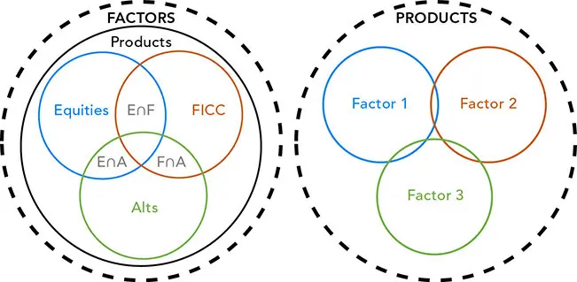
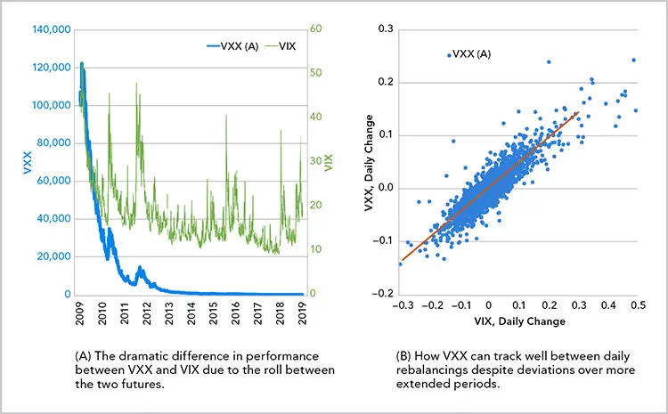
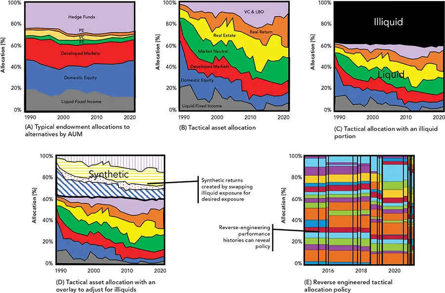
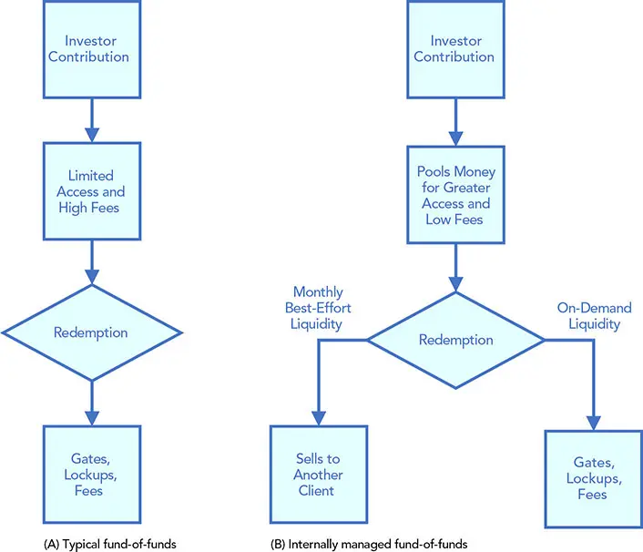

# 资产类型

*一段（并不那么）简短的概览*

本章中，我们将考察可用于决策的一些数据；然而，数据可能是抽象的。投资的实际表现并不总是与我们的数据完全一致。我们可能分析的是纯粹的利率，但实际购买的却是债券、贷款、信用债或其它充斥着各种不一致属性的金融工具，而这些属性可能带来原始分析中未予考虑的机遇或风险。

本章对用于构建产品的各类投资进行概述。许多投资者偏好最常见的主流投资工具，因而可能错失成熟市场的多样性与深度。通过全面考量各种可能性，投资者能够更精准地表达其对风险和收益的观点，也更有可能发现错误定价与市场错位、识别竞争力较弱的交易对手，或发掘其它能够为原有投资逻辑增添价值（或减少在实际投资执行中固有的摩擦、挑战与复杂性）的优势。

*因子（factors）*，或称*解释变量（explanatory variables）*，是我们用以理解某种*预期效应（expected effect）*或*响应（response）*的数据。尽管因子可以是量化资产管理的核心要素，但若忽视了实际可用于执行计划的金融工具，它也可能成为一种抽象之物，从而制约我们落实投资逻辑的能力。

评估潜在投资的合理时机包括：定义因子以使其与响应变量相关时；选择证券时（[第13章](ch13.md)）；以及确定目标和计算成本时（[第14章](ch14.md)和[第15章](ch15.md)）。构造因子的方法众多，也存在一些"纯粹"投资于因子而不引入污染的方式，例如使用总收益互换（TRS, total return swaps）。但这些投资可能效率低下、成本高昂且结构复杂。

**一般而言，我们通过股票和债券等基础资产来构建投资组合。** 我们的投资指令（mandate）可能通过规定资产类别目标、区间及其它约束条件，迫使我们专注于特定资产。通过选择最恰当的投资组合，我们可以为自己的理念选择最高效的表达方式，并可在低效被过滤和分散之前加以利用。

"选对一只股票，等于卖掉了一半"——这句俗语强调的是：工具、价格和时机的恰当选择，与促成交易的动机同等重要（费用、成本和税收亦是如此）。可以买卖以创造相同因子敞口的金融工具数不胜数，但要精通所有这些工具却颇具挑战。

**将投资归入各类资产类别（asset classes）** 可能充满复杂性。例如，许多主动管理的资产彼此相关性很低，却常常出于需要而被归为一类。即便新兴市场（emerging markets）的股票或债券也难以形成良好的归类，因为它们通常涵盖多种可能彼此截然不同的地理区域。

**资产类别之间的传染（contagion）效应很常见，**^1^ 且它们之间的关联不断变化。投资分类因所用载体（如普通股、交易所交易基金（ETFs, exchange-traded funds）、互换或期权）而进一步复杂化。产品发行的结构往往难以与资产本身剥离。两只相同公司发行的债券，若票息结构不同（如固定利率与浮动利率），即使它们主要的敞口（如公司风险）相同，所承担的风险也各异。例如，即使是两只浮动利率票据（floating-rate notes），一只采用典型的、激励再融资的重置周期，另一只频繁重置（在澳大利亚较为常见），它们对利率的敞口也大相径庭。其提前还款风险（prepayment risk）也差异显著。由于及时重置，澳大利亚抵押贷款对利率相对不敏感；而在世界其它地区，利率却是更传统抵押贷款的主要驱动因素。

**因子。** 尽管因子与产品可能相互混淆，但当我们严格聚焦于因子时，可以更精确地把握，因为因子敞口之间的重叠往往较少。图 4-1 的左面板展示了可转债或*优先股（preferreds）*等投资如何跨越多个类别。在此示例中，优先股兼具股票、固定收益、货币和大宗商品（FICC）敞口。一些产品（如期权）则横跨所有类别。

**图 4-1**　资产类别之间存在重叠；因子则更为正交。

**产品常常难以达到其初衷；** 其构造方式常产生意料之外的结果。这些工具背后的机制往往比表面看来更为复杂。例如，国债期货常被用作*固定期限国债（CMT, constant maturity Treasury）*的替代。大多数期货追踪的是*可交割券篮子（basket of deliverables）*之一，即基于转换公式选出的*最便宜可交割券（CTD, cheapest to deliver）*。除标的 CTD 及其持有收益外，国债期货合约中还嵌入了五个必须考量的期权。诸如此类的细微之处，可能使一项投资的表现出人意料，并导致投资业绩偏离因子表现（专栏 4-1）。

## 公司敞口
得益于过去一个世纪的优异回报，股票（equities）一直是广受欢迎的投资。股票包括在纽约证券交易所（NYSE, New York Stock Exchange）等交易所上市的二级市场交易、另类交易系统（ATSs, alternative trading systems）如电子通讯网络（ECNs, electronic communications networks）和撮合网络（包括明池和暗池）、首次公开募股（IPOs, initial public offerings）以及未注册证券。

### *融资*
几乎任何交易都需考虑放贷、借贷和持有成本（carry），股票也不例外。不同的载体涉及不同的风险；忽视这些细微之处可能带来灾难性后果，例如在逼空中被套牢做空。股票借贷、回购协议（repos，正回购与逆回购）、买入-卖出回购（buy-sellbacks）及其它安排在目的上相似，尽管其机制、风险和税务处理各有不同。远期、待公布（TBA, to-be-announced）、发行时（WI, when-issued）及延迟交收（delayed delivery）涉及在未来某日支付或收取证券，可能受条件和事件约束。


一个绝佳的例子是广受欢迎的 iPath S&P 500 VIX Short-Term Futures ETN（VXX）——它提供对一个纯因子（波动率）的敞口，却可能带来截然不同的结果。尽管波动率是个相对简单的概念，VXX 的机制却十分复杂。VXX 并不如许多人设想的那样模仿 VIX，而是以动态比例组合前两份 CBOE 波动率指数（VIX）期货合约。图 4-2A 显示了由于两份期货之间的滚动，VXX 与 VIX 的业绩存在巨大差异。图 4-2B 显示 VXX 在日内（每日再平衡之间）跟踪良好，尽管在更长周期内存在偏离。

**图 4-2**　VXX 并非 VIX。


交易对手风险（counterparty risk）通常以*信用估值调整（CVA, credit value adjustment）*表示，其存在是因为卖方可能未能在约定日期交付已升值的证券。操作风险同样令人担忧；*流氓交易员（rogue traders）*常常购买延迟结算的证券而不报告这些交易（"把单据塞进抽屉里"）。与回购不同，买入-卖出回购涉及法律所有权的转移，且不要求书面文件，这使收入支付和盯市调整在法律上无法强制执行。出借人可能难以找到或替换，也可能召回证券，使借款人面临被迫平仓的危险。借款人可能不得不支付意外的高价来归还证券，或承担"强制买入（buy-in）"成本。

### *合成与集合敞口*
以合成方式（而非直接购买股票）获取公司敞口往往更为高效。总收益互换或总回报率互换（TRORS, total return swaps / total rate of return swaps）可能成本更低，且不包含隐性费用、成本、托管费、市场冲击、预扣税、跟踪误差或基差风险。由于它们*表外（off balance sheet）*，双方负担减轻，可能进一步降低实施成本。资产没有法律所有权。支付按净额结算，因此交易对收款方而言天然带有杠杆。期限可能短于资产寿命，从而为付款方提供融资。优势往往也是劣势。表外特性可能掩盖敞口。若交易对手风险未知，将交易对手风险分散到多家伙伴可能降低违约的预期严重程度，却会提高违约概率。差价合约（CFD, contract for difference）是另一种合成净支付合约，杠杆很高，常面向中小投资者推销。它不产生买卖价差、市场冲击、对标的物的法律所有权或股东权利。规避税收的投资者（例如一家由私人公司上市后、*成本基础（cost basis）*极低的创始人）^2^，可以使用 TRORS 等合成资产对冲敞口，而不产生应税事件。

股票敞口常常通过投资公司证券购买，包括开放式和封闭式投资公司、单位投资信托（UITs, unit investment trusts）以及交易所交易基金（ETFs）。尽管投资这些工具会产生费用，但也存在潜在效率，例如可以投资于对某些注册地受限的国际证券。这些投资可能受到交易所交易中断的影响，且基金未必持有参考篮子中的所有工具。

专注于证券选择的投资经理可以通过许多其它更冷门的形式获取公司敞口，如业务发展公司（BDCs, business development companies）、特殊目的收购公司（SPACs, special-purpose acquisition companies，又称"空白支票"公司）、认股权证（warrants）、业主有限责任合伙（MLPs, master limited partnerships）以及被动外国投资公司（PFICs, passive foreign investment companies）。每一种都带有特定风险。本书的在线参考文献包含了本章所讨论投资的许多参考资料，请访问
[www.QuantitativeAssetManagement.com](http://www.QuantitativeAssetManagement.com)。

### *类别与地理*
划分股票类别的典型方式包括地理、市值、风格等。即使对最常见的类别，定义也各有不同，且随时间变化。会计准则和*计日基准（day-count bases）*^3^ 差异显著，许多其它特征也是如此。国际证券可以通过存托凭证（美国存托凭证 ADRs、欧洲存托凭证 EDRs、全球存托凭证 GDRs 等，统称国际存托凭证 IDRs）以及无投票权存托凭证（NVDRs）进入。国际股票具有一些国内股票不具备的特征，包括货币与资本管制、政治风险和税务处理。其它顾虑还包括流动性不足、信息稀缺以及会计准则的差异。

**指数是动态的，历史关系充满细微差别。** 由于指数成分股、权重及其它特征的频繁变化，对标或归类股票可能十分复杂。由于指数和基准的构成频繁变化，基于它们的分析可能不可预测且不可靠。主要指数中的地理比例经常变化。即使是按公式（如市值）加权设计的指数，其加权和纳入也并非完全机械化。Tesla 被纳入标普 500（S&P 500）就是一例，说明指数构造的技术性和有时任意性，可能给依赖这些基准的分析带来不确定性和不精确性。在 Tesla 一案中，许多投资者以为由于其高市值，Tesla 会很快被纳入指数。更细致的规则和人为判断推迟了它的纳入，直到其规模超过以往任何一次新增。

**通胀调整会显著影响业绩，** 尤其在新兴市场。上世纪 70 年代的高通胀可以解释该时期的负实际回报。尽管原始回报并不明显，VIX 十分位与标普 500 十分位之间存在强烈的负相关。指数常以不理想的方式纳入或剔除成分股；日本股票和债券市场就是通胀影响的良好示例。彭博美国综合债券指数（"Agg", Bloomberg US Aggregate Bond Index）含有大量日本成分，而日本表现不佳，使得主动管理的固定收益经理只要低配日本就能轻松跑赢 Agg。日本股票与其它发达市场不相关，压低了其在股票中的表现。新兴市场（EM, emerging markets）和前沿市场股票也连续十多年跑输发达市场。

**新兴市场国家各具特性，将它们归为一类的价值存疑。** 当按大宗商品属性（如进口国与出口国、涉及的大宗商品种类）、经常账户等对新兴市场投资进行细分时，会发现一些相似之处。一些国家通胀可能很高，税务处理也参差不齐。一些国家有税收协定，另一些则预扣税款，导致双重征税，使得扣除非居民税后的净总回报成为衡量这些国家的恰当指标。

## 固定收益、货币与大宗商品（FICC）
FICC（Fixed Income, Currencies, and Commodities）是用于泛指非股票、非另类投资的一个宽泛总称。许多以股票为核心的投资者可能把股票，尤其是美国大盘股，视为"市场"，而其它一切都不那么重要。与股票相比，FICC 投资往往更受宏观经济影响、更量化、更精确，并在技术上更多维（如信用、期限结构和波动率）。尽管 FICC 投资像股票一样存在不确定性和波动性，但其许多关系方面都比许多其它资产类别计算得更精细。值得注意的是，FICC 投资常常面向成熟的机构客户推销，因此享有比保护散户而施加于股票更少的交易限制。与面向零售客户推销的普通股不同，FICC 产品通常含有显著杠杆、不对称和非线性风险，以及各种市场和地区的复杂惯例等细微之处。由于杠杆，微小的技术错误可能造成巨大损失。FICC 的非线性常常无法外推，并使多资产组合分析复杂化。

### *现金、政府债与市政债*
固定收益（FI, fixed-income）市场比股票市场更广泛、更多样，名称某种程度上带有误导性——它暗示的是支付无条件义务的投资，不同于股权证券的股息和升值。固定收益投资未必按指定金额支付；支付可以按公式定义，也可能在投资期末仅有一次性支付（*子弹式（bullets）*、*气球式（balloons）*或*零息（zeros）*）。

**浮动利率票据**（FRNs, floating-rate notes，或*floaters*）按高于参考指数的差额进行定期支付，由一整套支付公式时间表规定。票息可以是固定与浮动的组合（混合型），借款人也可能可以选择在固定与浮动之间定期切换（如 Option ARMs）。

**摊销型和偿债基金型（sinking-fund）工具**可能在投资期限内逐步减少本金，且可能带有提前还款、转换、回售、赎回等期权。尽管这些工具在场外交易，但部分交易数据可通过交易报告与合规引擎（TRACE, Trade Reporting and Compliance Engine）和互换数据存储库（SDRs, swap data repositories）等数据库获取。

**现金或货币市场（money markets）**通常指期限在三个月及以下的义务，可包含多种投资。货币市场没有交易所，交易商以*委托人*（principal）身份进行交易。

**美国政府国库券、中期国债和长期国债（"govies"）**被认为具有最高信用质量，尽管政治事件曾引发担忧，包括 2011 年 8 月 5 日的信用评级下调。政府债还包括联邦机构义务（agencies），如美国联邦国民抵押贷款协会票据（FNMA，即 Fannie-Mae），尽管联邦政府既不担保机构票据，也没有义务偿还其债务。

**全球发达市场主权债**，如德国 Bundesobligationen（Bunds）和英国 Gilts，可能比美国国债风险更高。汇率波动可能主导回报，而回报相比之下可能很小。通常建议使用远期、期货等进行低成本的货币对冲。如前所述，Agg 含有大量低收益的日本政府债券（JGBs, Japanese government bonds）和欧洲债券，使许多组合经理乐于偏离指数。非主权主体（包括欧洲）会以非本地区域货币发行债券并在该区域之外销售。世界银行和欧洲投资银行（EIB, European Investment Bank）等超国家机构发行债券并依赖其成员国的支持，而此种支持并无保证。

**新兴市场（EM）主权债**可以以硬通货（hard currency, 美元或欧元）或软通货（soft currency, 本币）发行，有时会被证券化。尽管此类债务与国债相关性低、夏普比率（Sharpe ratio）高，但可能周期性遭受巨大损失。投资新兴市场债券存在机遇，但需要经验、技巧、谨慎和研究。新兴市场债券并非同质，投资者必须精挑细选才能脱颖而出。

**税收**对许多投资者而言是关键考量，市场上存在种类繁多的税收优惠产品。在美国，非联邦地方政府发行债务义务和收益债券、私人活动债券、剩余权益债券、工业发展债券以及建设美国债券（Build America Bonds）（统称 AMT 债券）。它们通常收益率较低，但在税后基础上相比其它义务更具优势。

一般责任债券（GOs, general obligation bonds）可能没有明确的资金来源或用途，但通常是所有市政债券（municipal bonds，或*munis*）中风险最低的。市政债带有违约风险，一些（如住房收益债券）还带有提前还款风险。债券可能以资产或收益（而非发行人）作为担保。此外还存在税收待遇因立法而改变的风险。

### *公司信用*
信用（credit）贯穿所有类别，但在贷款和债券的语境下讨论最为明确。即使是美国国债也含有一些信用风险要素，通常与延迟支付或违约相关；许多形式的债务还有其它风险维度，如提前还款。公司固定收益包括贷款、债券、优先股和可转换证券。

**银行贷款**通常为优先级（senior），用于撬动资产负债表，往往在参考利率（伦敦银行间同业拆借利率 \[LIBOR\]、担保隔夜融资利率 \[SOFR\] 等）之上定期（例如按季度，配合月度或季度重置）支付 3% 或更高的利差。它们通常位于资本结构顶端（在税款、养老金等受保护债权之下）。银行贷款通常由资产或现金流（如应收账款、固定资产物资及设备 PP&E、存货或知识产权）作为支持。

延迟融资贷款和循环信用额度（"revolvers"）允许按需借款，通常收取变动或浮动利率。循环额度允许反复借款和还款。除信用风险外，利率和提前还款风险往往是"逆向的（wrong way）"，因为由于系统性压力，借款往往发生在对贷款人不利的时点。二级市场交易可能受限且流动性差，对估值产生不利影响。

优先贷款的份额可用于杠杆收购（LBOs, leveraged buyouts）、并购（M&A, mergers and acquisitions）、资本重组及其它用途。*参与（participations）*投资者必须依赖卖方与发行人打交道，而*转让（assignments）*则允许直接接触发行人。份额还面临各种其它问题，损失可能超过贷款金额，并可能在贷款偿还后持续。追偿损失的尝试可能成本高昂。如果通过衍生品（如互换）获得贷款敞口，交易对手风险也是一项因素。次级、第二留置权、过桥贷款及其它次级优先权贷款可能对质押给更优先贷款的抵押物享有次级留置权，或拥有不同抵押物，也可能无抵押。*轻契约（Covenant lite）*贷款的条件少于传统贷款。

**公司债务**剩余期限不足一年的被称为*商业票据（commercial paper）*。期限更长的债务发行被称为债券、信用债、票据及其它名称，如"利差产品（spread product）"，因为它们以收益率与参考利率（如 LIBOR、SOFR 或最优惠利率）之差（"利差"）来衡量。估值取决于偿债能力，因而取决于发行人的信用质量，并随利率波动。公司债券指数通常按市值加权，偏向于高杠杆、低质量公司。生存者偏差（survivorship bias）很常见，因为"堕落天使（fallen angels）"（被降级至高收益的投资级 IG 债务）会被剔除出指数。^4^*重组（Reconstitution）*是大多数指数都面临的问题，因为持仓会被加入和摘牌。

公司信用评级将市场划分为投资级（IG, investment grade）和高收益（HY, high-yield），或称"垃圾债（junk）"，这些标签隐含违约概率。高收益债券估值困难，可能含有赎回、追回（clawbacks）等特性。评级变化可能滞后于触发事件，而堕落天使——与*原始发行（original issue）*债券（自发行日起即为高收益的债券）相反——往往在两年内恢复。这种恢复带来一种风险溢价，可以通过买入并持有堕落天使来收获，因为许多投资者不被允许这样做。这种分割的市场创造了低效和机遇。一个相关的错位发生在 2007–2008 年全球金融危机（GFC, Great Financial Crisis）期间，当时 HY 债务的恢复速度远慢于 IG 债务。压力、困境和破产投资可能需要漫长且昂贵的诉讼，恢复可能不完整甚至不存在。

**优先股（preferred stocks）**与可转换债券类似，兼具股权和债权特征。它们有*面值（par amount）*，并按面值的固定比率支付股息。在公司资本结构中，无论是股息支付还是破产清算，优先股都位于股票和债券之间。债券的偿付先于优先股，但大多数优先股的"累积（cumulative）"未付股息（如被跳过）必须先于普通股股息得到支付。

虽然契约债券必须支付票息，但公司董事会可以推迟优先股股息（例如公司不盈利时），使优先股在下行时对公司风险敏感。非参与型优先股有固定票息，限制了上行空间；而参与型优先股可能按招募说明书中的公式增加股息。可调整利率优先股（ARPS, adjustable-rate preferred stock）随利率参考变化。与可转债类似，部分可转换为普通股。优先股还可能设有偿债基金和赎回条款，使其在利率大幅下降时难以大幅获利。部分优先股股息被视为合格股息收入，税率低于利息。

**可转换债券（"converts"，convertible bonds）**可以零散购买，也可通过基金购买，可按指定比例转换为股权，从而稀释持股。这一特征使其能够提供低于普通债券的票息，通常也劣后于普通债券。当股价远低于转股价时，可转债表现为债券；当股价接近转股价时，则表现为股票。发行人往往可以强制转换，限制了意外获利的空间。强制转换的可能性，使合成可转债（股票与认股权证的组合）与真正的可转债之间存在显著差异。如果公司诱导转换，可转债只有在迅速转换的情况下才能比传统债券增加价值。基于资产配置的组合必须管理可转债分类的不断变化，以及随着它们变得更债券化或更股票化而产生的非线性。

或有可转换债券（*CoCos*, contingent convertible bonds）只有在触发事件（如政府救助或发行人的一级资本储备跌破阈值）之后才能转换（或本金减记）。转换为普通股（带或不带股息）将有助于弥补监管储备的不足。虽然传统可转债会摊薄每股收益，但未触发的 CoCos 不会。与常规可转债不同，未能支付预定票息的 CoCos 不一定会引发信用事件。如果转换日公司股价低于指定水平，本金可能被减记。在这种情况下，CoCos 的价值可能低于面值，甚至变得一文不值且无追索权，即使公司并未破产。

### *证券化产品与衍生品（derivatives）*
抵押贷款和其它贷款（如*全额贷款（whole loans）*）可以被证券化为产品和衍生品，构成一个庞大而复杂的固定收益资产类别，吸引了巨量投资。这些产品包括机构（agencies）或非机构住房抵押贷款支持证券（RMBS, residential mortgage-backed securities）、抵押担保债券（CMOs, collateralized mortgage obligations 及其分券）、商业地产抵押贷款支持证券（CMBS, commercial mortgage-backed securities）、覆盖债券（covered bonds）、资产支持证券（ABS, asset-backed securities），包括担保债券（抵押贷款义务 \[CLOs, collateralized loan obligations\]、抵押债券义务 \[CBOs, collateralized bond obligations\] 和担保债务凭证 \[CDOs, collateralized debt obligations\]）等。

除了对标的贷款池（成熟度、提前还款、违约、凸性等）的复杂评估外，结构本身也很复杂，通常有多个类别（*tranches, 分券*），各自有自己的现金流规则（*瀑布, waterfall*）和优先级。它们可能包含复杂的担保（*契约, covenants*）和触发机制。各种假设（如地理分散的多样化收益，甚至善意的法律技术）可能并不如预期那样运作——全球金融危机期间就曾经历过。

本书的网站 [www.QuantitativeAssetManagement.com](http://www.QuantitativeAssetManagement.com) 包含一个大型抵押贷款模型的流程图，其复杂性是通过对再融资、周转、提前还款与缩短、违约和隐含提前还款等更小模型进行分层来实现的。它展示了这些模型多么精巧，以及分层如何使其在智识和计算上变得可处理。

### *杠杆贷款*
对借款人而言，杠杆贷款（leveraged loans）提供了债券之外的实质性替代。尽管与许多高收益债券不同，它们往往有担保，并在违约时优先于债券，但大多数贷款并不寻求信用评级，也无需提供同样多的公开信息。贷款的回收率通常超过其价值的一半，而高收益债券的回收可能不足一半。私募股权公司可能利用这些贷款来为杠杆收购（LBO）的大部分提供融资。这些贷款随后成为被收购公司的负担。即使在 LBO 之外的情境中，欧洲公司也更偏爱贷款而非债券，而美国公司则常发行高收益债务。

### *结构化票据与挂钩债*
结构化投资（包括混合工具）是灵活的、有时是定制化的投资，其偿付与一个或多个参考物（如指数、利率、回报等）相关，并通过将其作为支付公式中的变量，对这些参考值进行实质性修改。结构化投资包括与多种参考挂钩的证券，涵盖信用、指数、大宗商品、天气、灾难和通胀（挂钩债, linkers）。这些投资可以像互换一样简单，也可以是复杂的*分券（tranched）*^5^工具，如担保债券（CBOs、CLOs 和 CDOs）以及其它具有信用增级（如特殊目的载体 SPVs, special-purpose vehicles）等复杂特征的安排。某些工具的复杂性甚至可能令其创造者困惑，并导致重大估值错误。一些设计的定制化和复杂性可能使投资难以退出——被称为"蟑螂汽车旅馆（roach motels）"，源于上世纪 80 年代的捕蟑品牌 Roach Motel（"蟑螂进得来，却出不去"）。挂钩证券如果其持仓（如一组互换组合）不付款，也可能不付款，使投资者暴露于信用、违约和交易对手风险。

通胀挂钩债通常以某种非平凡方式与城市消费者价格指数（CPI）或零售价格指数（RPI）挂钩，例如设有保护本金的通缩下限，并通常提供"正向风险（right-way risk）"，即当股票下跌时升值。一个常被关注的指标是远期*盈亏平衡通胀率（breakeven inflation）*，即从某一未来日期开始一段时间的预期通胀，由两种相似的利率工具（一种挂钩、一种不挂钩）推导得出。一些挂钩债，如美国通胀保值债券（TIPS, Treasury Inflation Protected Securities），会产生幻影收入，每年被征税，尽管其好处以本金调整的形式被保留至到期。

这些未实现的调整可能导致一项*原始发行折价（original issue discount）*，影响基金的毛收入并迫使其进行分配。由未实现收入引发的分配可能使基金现金匮乏，并诱发经济上反常的被迫清算。通胀可能影响实际利率并削弱挂钩债的隔离作用。通缩导致的向下调整可能将收入分配重新归类为资本利得。除利率风险外，挂钩债还面临汇率波动和基差风险。挂钩债对零售投资者具有坚实的吸引力，一些人因它们的流行而认为其带有负的风险溢价。在某个时点，英国和加拿大的养老基金中有一半的固定收益资产持有通胀保值债券。

事件挂钩投资的回报取决于某个特定的*触发（trigger）*事件是否发生，例如巨灾债券。触发型投资可能损失本金。风险包括信用、交易对手、监管以及与税务相关的复杂性。触发器通常被设计为仅在极端情况下激活，难以建模和预测，使这些工具难以估值和退出。我们将在[第19章](ch19.md)讨论对冲和风险转移时继续讨论票据触发器。

### *互换（swaps）*
互换是一种低成本、便捷且高效的工具，可用于合成复制一个收益流，或按所需规格制造一个。本质上，互换双方同意按照他们在协议中任意书写的公式相互支付。互换的典型形式包括总收益互换（复制某项投资的回报）、信用违约互换（CDSs, credit default swaps）、通胀挂钩互换（ILS, inflation-linked swaps）和波动率互换，以及其它众多形式。一些互换在交易所交易，另一些则在场外交易。场外（OTC）互换涉及交易对手风险，其估值需进行信用估值调整。互换常被用于克服法律和监管限制，如税收、地理禁令或监管资本要求。

由于互换仅仅是资金转移，它们是"账外（off the books）"或"表外（off balance sheet）"的，法律所有权不在双方之间转移。这种安排可以消除许多障碍；例如，若投资者想对冲一个低成本基础的资产，他可以将 TRS 的合成收益流与资产的自然收益对冲，从而实现净市场中性，而无需出售资产并产生应税事件。被禁止投资于特定地理区域的投资者可以购买跟踪该地区市场指数的收益流。持有资产收益流不承担持有资产的监管资本负担。此外，交易效率得到提高，因为所有价差和成本都只是"纸面上"的（或通过对冲敞口产生，而不实现应税事件）。互换可以通过国际互换与衍生工具协会（ISDA, International Swaps and Derivatives Association）主协议、信用支持附件（CSA, credit support annex）、其它标准形式进行标准化和记录，也可以是定制构造。互换可能涉及本金或不动本金、涉及货币、*重置（resets）*、*折扣（haircuts）*、计日惯例及其它许多特征。

信用违约互换的买方定期支付保费，直到信用事件（如违约、重组、破产、拒付、延期偿付或加速到期）由*参考实体（reference entity）*或一组基础参考物中的某个参考实体触发。CDS 通常为 5 年期，但常见范围在 1 到 10 年之间，合成地模拟杠杆贷款但无需支付这些贷款的利息。CDS 可用于*资本结构套利（capital structure arbitrage）*和*合成债券复制（synthetic bond replication）*。

### *可交易房地产*
直接投资房地产将在本章稍后与另类投资和流动性差的资产（illiquids）一起讨论，但房地产 TRS 和公开*房地产投资信托基金（REITs, real estate investment trusts）*现在就加以讨论。私人或私募 REITs 因未上市而受益于较低的感知波动率。尽管直接投资有其用处，使用其它工具也有充分理由。例如，UCITS 组合被禁止持有房地产，因为它们必须每日估值，而房地产估值间隔较长。尽管间接投资具有便利性和良好的长期跟踪，但其伴随诸多警示，包括 TRS 的基差风险。

即使是间接工具也存在多样化收益，尤其是在美国之外，但敞口可能集中于人口中心（商业地产尤为如此）。不频繁的报告和估值会低估波动率（蓄意为之则称为*波动率洗白, volatility laundering*），^6^ 以及流动性、杠杆、直接成本和隐性成本等非市场风险。隐性成本（如管理不善）在与其它可交易投资的回报进行比较时，需要进行艰难且富有艺术性的调整。例如，对流行的 FTSE Nareit US Real Estate Index 应用反平滑方法会大大增加回报的波动率。

股权型、抵押型和混合型（股权和抵押）REITs 通常以每日交易的交易所普通股形式存在。与直接投资一样，REITs 受益于租金——租金比盈利更具粘性，并被分配以提供投资者大部分收益；REIT 投资者通常不像普通股投资者那样关心创新。因此，公开房地产投资的长期收益特征不同于股票。REITs 的公开股权性质使其背负与股票市场的短期相关性（应作为长期投资使用）及相关的波动率，以及相对于其净资产价值（NAV）的基差风险。

作为封闭式投资，REITs 可以溢价或折价交易。REITs 投资于房地产相关业务（包括物业和贷款），但不直接投资于物业——除非它们通过例如违约等方式间接获得物业。REITs 在许多方面受到限制，包括股东主导地位、杠杆、被要求至少 75% 的收入来自利息，以及至少分配 90% 的收入（利息及其它资本利得）。作为补偿，它们不缴所得税，而把税收转嫁给按普通收入税率纳税的股东（因此，投资者应将其 REITs 置于递延或免税账户中）。

由美国投资者持有的国际 REITs 可能被视为被动外国投资公司（PFICs），其*盯市（mark-to-market）*（按*公允市场价值, fair market value, FMV*）可能按普通收入征税。房地产运营公司（REOCs, real estate operating companies）也公开交易，但通常专注于商业地产，并将利润再投资，不享受 REITs 所享有的税务待遇。法律挑战、监管和税务地位的困难也是房地产（以及 REOCs 尤其如此）的风险。

### *货币*
货币（currency，又称外汇, foreign exchange, 或 FX）工具相对流动且不复杂（如外汇远期和互换），强调即期和远期汇率（带或不带实际兑换，如无本金交割远期, non-deliverable forwards, 或 NDFs）。远期合约可能有流行的日期，若其现金流与匹配的负债不对齐，可能产生*缺口风险（gap risk）*，也可以是定制的。奇异货币产品也很流行。

与某些资产不同，外汇市场的信息流动迅速高效。社会效应（包括启发式偏差和市场心理）主导短期交易。技术分析司空见惯，并可能对股票产生正向风险。财政（汇率和贸易余额）与货币（利率）政策及其它经济和政治状况是外汇回报的驱动因素，但持续预测它们颇具挑战。汇率与股票和债券的相关性较差，尽管一些著名货币对（如 AUD/JPY 和 AUD/CHF）常被用作"风险开启、风险关闭（risk-on, risk-off）"的代理，类似股债比率。发达市场指令通常限于 G10 的 11 个国家，加上一些代理，如用南非兰特（ZAR）代表新兴市场国家，或用高度协整的货币作为流动性较差货币的代理（假设存在基差风险）。10 倍或更高的杠杆是常态。对冲选项众多，50% 的对冲常被用作对冲经理的近似基准。

关于对冲，以及货币敞口究竟是国家回报的基本组成部分，还是一个不受欢迎的、没有可靠补偿性回报增强预期的波动率来源，存在各种观点。一些投资者寻求对其预测的纯粹表达，尽可能多地消除噪音；另一些人则强调这种舒适感的成本，更愿意接受方差作为更可容忍的替代方案。

### *大宗商品（commodities）*
正如新兴市场是异质的，大宗商品（*hard assets, 硬资产*）也是如此——它们被归为一类更多是因为与其它资产不同，而非彼此相关；黄金和猪腩并不是一回事。大宗商品常暴露于冲击（干旱、洪水、劳工中断等），但其中大多数对股票及其它资产是正向风险。用于投资农业、能源和金属的工具往往标准化、流动性强、市场深厚，并常被分解为即期、期货、远期、持有收益和质量成分（使用转换因子以等同不同等级）。

一些投资者使用开采、生产、分销、使用或从事大宗商品业务的公司作为大宗商品本身的代理，但认为这些投资表现得像其意在替代的大宗商品的假设可能站不住脚。业务严重依赖大宗商品的公司通常有积极的套保和交易计划，其盈利能力可能并不跟踪其生产或消费的商品。事实上，已对冲的商品生产者和使用者产生的回报，可能表现得与人们对未对冲公司的预期相反。S&P 高盛商品指数（GSCI, Goldman Sachs Commodity Index）和道琼斯-UBS 商品指数（DJ-UBSCI, Dow Jones-UBS Commodity Index）等指数可能与通胀相关，但可能被能源等高度波动的成分所主导，并可能因其所代表的期货合约的特性而被扭曲。

尽管 ETF 方便且通常买卖价差紧凑，但它们并不像表面看起来那么简单。在专栏 4-1 中，我们讨论了 VXX 在长持有期内如何成为 VIX 的拙劣替代品。类似地，各种原油 ETF 跑输即期价格，最著名的是 USO。ETF 对大宗商品的敞口最常通过授予人信托（grantor trusts）、有限合伙（LPs）或 ETN 实现。授予人信托通常持有实物大宗商品，短期收益按普通收入、长期收益按最高税率征税。在美国，LP 的期货利润的 40% 按普通收入征税，60% 按长期资本利得税率征税。LP 是流行的大宗能源商品工具，尤其用于石油和天然气投资。ETN 是无担保的非次级债务，按期货征税——但货币敞口可按普通收入征税。杠杆和反向 ETF 通常通过互换跟踪参考物，并可能不得不清算以满足赎回。即使长期持有，它们也可能按短期收益征税。这可能十分繁重；2008 年，REC 将其 NAV 的 74% 作为短期收益分配。

更直接的参与可能回报丰厚；有形的石油和天然气钻井成本可完全抵扣（在七年内折旧），无形钻井成本可在发生当年完全抵扣。租赁运营成本和费用也可抵扣。参与可通过共同基金、MLPs、特许权使用费或经营权益进行。

另一种流行的硬资产是木材，其可靠的生物学增长与转售价格和土地价值一起构成超过 50% 的利润。如同能源生产中的上游和中游业务，木材资产的管理可带来超越产品本身销售的收益。

## 另类投资与流动性差的资产
另类投资（alternatives, "alts"）是一个总称类别，其成员定义并不明确（图 4-3A 和 B）。许多人只把流动的股票和债券视为主流投资，但另类投资长期以来一直是投资的中流砥柱。大多数大型机构都配置于不寻常的收入流（包括税收留置权、仓储权、水资源等）、直接的私人投资、牲畜、收入流（特许权使用费和其它剩余权益）、临终结算（viatical settlements）以及其它风险转移工具。

**图 4-3**　流动性差的资产会约束其它配置。

颇具讽刺意味的是，最稳健和最古老的投资（如房地产或黄金）却被视为另类。另类投资的共同点往往是流动性差、监管宽松、缺乏透明度、费用高昂、准入有限、进入壁垒高，以及缺乏风险和业绩数据。流动性差的配置如果处理不当，可能造成扰动。一个更动态的组合（如战术配置, 图 4-3B）难以轻易降低流动性差的敞口，迫使动态配置在更窄的范围内运作（图 4-3C）。当投资者承诺较大比例的流动性差配置（如核心业务）时，也会出现类似困难。

存在一些技术可以在保留法律所有权并避免应税事件的同时降低对另类投资的敞口。这些技术包括使用总收益互换（图 4-3D）。图 4-4E 展示了一个组合配置，显示在再平衡日期之间被逆向工程为恒定配置（无漂移）。或者，权重可以在再平衡日期之间允许漂移，如图中其它四个面板所示。这些方案有用且常见。例如，企业主可能希望降低对其集中收入的敞口；或者创始投资者可能希望分散持仓，但其股份的低税基使直接出售变得不可行。

流动性差引发的另一个常见问题是由估值产生的自相关。常见做法是借助历史或截面（矩阵化定价）估计来填补缺失数据。

### *对冲基金与管理期货*
关于主动管理存在大量争论，主要集中于基金业绩和风险的分布与均值。我们在第一部分（Part I）中已讨论过此问题。基于分布和均值的结论对大多数投资者而言是合理的。

投资主动基金时，应进行并维持严格的投资与运营尽职调查（IDD 和 ODD），并尽可能密切地监控业绩和风险（[第18章](ch18.md)），在可能范围内加以管理（[第19章](ch19.md)）。准确及时的数据（直接或通过聚合器）以及定制的份额类别、独立管理账户、侧袋账户和激励条款，可以为受优待的投资者谈判获得。

正如另类投资是异质的，*商品交易顾问（CTAs, commodity trading advisors）*也是如此。CTA 仅在最一般的特征（如法律结构）上相似。Knightian 不确定性和头条新闻风险是严重关切，即使是那些以低日常风险（如以风险价值, value at risk, 或 VaR 衡量）推销的基金，也可能无法幸免于灾难性的左尾回报分布或位于零以下的均值回报。

策略多种多样，包括（但不限于）：

   **股票对冲（equity hedge）**，包括偏多头、偏空头、多空、新兴市场、市场中性和统计套利（*stat arb, statistical arbitrage*）

   **宏观经济（macroeconomic）**或*宏观（macro）*，包括自主或主题型、系统性、系统化且分散、以及分散型

   **事件驱动（event-driven）**，包括并购或风险套利、激进主义、特殊情况以及事件驱动

   **固定收益（fixed income）**，包括分散型、新兴市场、抵押贷款和资产支持

   **固定收益相对价值（fixed-income relative value）**，包括套利、抵押贷款套利、可转债套利、资本结构套利和信用套利

   **多策略（multi-strategy）**，或"multi-strat"

随着技术进步，曾经被视为 alpha 的部分正越来越多地被压缩为*智能贝塔（smart beta）*甚至仅是贝塔。人们尝试过许多指数和复制策略，包括一些使用 13F 文件中过时持仓的。仍有许多尚未被捕获的东西，特别是在高波动资产、模糊的因果关系、高速/高复杂性决策以及某些套利形式中。至关重要的是，良好的销售技巧和卓越的沟通对成功至关重要。"软技能"在起步阶段和克服障碍时很重要。这些技能能建立善意，往往能弥补暂时令人失望的业绩。

### *智能贝塔（Smart Beta）*
根据贝塔"智能"程度的不同，它可以表现为一个指数或一种复杂的主动策略。即使是简单的指数也饱受不完美折中和偏差之苦。通常，智能贝塔产品易于解释和理解、非自主裁量、容量大、低成本、低拖累且分散。

一些最受欢迎的指数是*市值（capitalization, "cap"）*加权的，这偏向于规模，并可能在板块甚至个股上呈现显著扭曲。市值加权易受泡沫影响，如 2001 年的互联网泡沫和其它时间特异性。

与股票指数不同，市值加权的固定收益指数倾向于超配债务沉重的公司，可能对压力更敏感。在这些指数中，负的系统性偏差更容易被识别和避免。用一个深思熟虑的配置跑输一个天真的等权配置，令人尴尬地容易。证券偏差是大多数智能贝塔的命脉，最著名的是 Fama 和 French 的因子以及难以捉摸的基本面加权指数这一圣杯。这些关系的短暂性和相互依存性使选择和分析令人困惑。以一种奥卡姆剃刀（Occam's razor）的形式，许多投资者声称，一组简约的通用因子可以解释万物。从实践角度看，手中的快速套利胜过林中的许多普遍真理。

### *私募股权（Private Equity）*
许多机构投资者已拥抱私募股权（PE, private equity）。私募投资可能带来可观的好处，但伴随许多警示，包括流动性溢价、杠杆利息的税务收益、引人入胜的叙事，以及大股东主动管理的潜力。影响力可以通过强制重组（包括人事变动和剥离资产）来增加价值，比公开资产更直接。

配置各不相同；通常，这些投资分为收购/买入（成熟公司，美国之外常称*风险投资（VC, venture capital）*）和创投（无控制权的初创公司）投资。第三大流行的直接房地产投资是成长型（如 pre-IPO 或上市公司私募投资 \[PIPEs\]）以及债务资本或直接贷款。其余投资于实物资产（不可再生）、基金的基金（secondaries, 二级市场）和联合投资（predominantly minority investors，以少数股东为主）。风险投资常按投资成熟度描述：天使、扩张、成长等。投资者常专注于子类，如困境投资或*夹层资本（mezzanine capital）*（劣后于除普通股外所有债权）。在美国，杠杆收购是一种常见专长，其收购融资常常超过一半是债务，并可抵扣利息。

**年份（Vintage）。** 交易，如同贷款，常以*群组（cohort）*或*年份（vintage）*来称呼，因为其业绩受交易达成时经济状况的影响。这些投资通常采用*有限合伙（LP, limited partnership）*形式，通过封闭式基金募集资本。基金经理担任普通合伙人（GP），投资者为有限合伙人。基金通常花最多五年投资资本，再花五年返还资本（即*J 曲线, J-curve*）。将基金期限从 10 年延长至 13 年甚至 20 年以退出投资（通常通过 IPO 或破产程序）是常见做法。

**度量。** 私募股权投资难以与可交易证券比较，因为它们以美元加权的*内部收益率（IRR, internal rate of return）*报价，受基金资金流入流出影响，而非时间加权收益率（即"总回报"）。私募股权计算还因未投资资本、估值时间表（在没有公开市场多样化好处的情况下严重低估波动率）和费用——尤其是未催缴资本的费用——而复杂化。*二级市场（secondaries）*虽然常被视为私募股权，但由于流动性改善，具有不同特征。依赖自愿报告的统计被生存者偏差搅浑。大量研究质疑私募股权回报的主导地位，并指控其收益主要流向费用而非投资者。^7^ 增强的风险（杠杆、波动率、贝塔、不透明报告、流动性差）要求溢价，有人论证需要可观回报来补偿。像私募股权这样的流动性差投资提供逆向风险，迫使投资者在需要时（例如在危机中追加保证金）清算理想的投资，并可能同时因资本调用进一步加重负担。

**准入。** 与所有主动管理投资一样，最优秀、最成功的经理人可能产生令人艳羡的回报，但这些投资的准入可能仅限于大型且粘性强的投资者，将更多可疑投资留给其余回报追求者。少数杰出的经理人可能汇集巨额资本并产生高回报；多数可能业绩欠佳。与使用股票作为大宗商品*代理（proxies）*类似，上市的私募股权（以及 Cambridge Associates 和 Standard & Poor's 等提供的私募股权指数）是拙劣的替代品，提供与公开股票相似的回报。

### *内部基金的基金*
基金的基金（FoFs, funds-of-funds）为缺乏资源和规模来建立团队、购买必要数据和技术的实体提供有价值的服务。FoFs 带有额外一层费用，使对主动管理的配置变得昂贵。一位经理可能希望将 FoF 作为其客户包装费（wrap fee）的一部分。

汇集资产可在购买更好资源、雇用更好人才方面创造规模经济。更多资产使 FoF 投资者能够进行比许多 LP 自身所能承担的更多样化。卓越的流动性可以来自允许客户在"最大努力（best-efforts）"基础上将其份额出售给其它客户，并在正常情况下可能带来月度流动性。由于赎回仅作为最后手段，投资连续性降低了成本，并可提供对软锁甚至硬锁基金的准入——这是接触最佳基金、跑赢普通投资者的关键要素（图 4-4）。

**图 4-4**　内部基金的基金可为寻求主动管理的客户提供许多优势。

### *房地产*
本节聚焦于直接、分散化的房地产投资，而非 REITs 或类似投资。集中的投资（如主要居所）不应归入此类。

与私募股权投资类似，房地产种类繁多：住宅、商业、开发（绿地 green、棕地 brown、灰地 grey）等。此外，与私募股权一样，直接投资房地产需要为法律、环境、财务、研究与营销、管理等方面制定计划并组建团队。这通常需要市场与可销售性研究、土地、规划、批文、财务分析与融资，以及可能的施工和租赁——每个阶段都要有退出计划。与任何其它生命周期投资一样，它必须被管理。有许多所有权选项，具有不同程度的税收、控制和责任。

房地产有许多维度，包括残余权（如空间权、地表权和地下权）。购买可由机构、金融实体、公司、REITs 和外国实体的债务和股权投资提供融资。虽然其它投资可能受全球趋势强烈影响，国际房地产投资（尤其是在新兴或前沿市场）可以提供多样化以及对当地市场的敞口。这种专注也可能遭受极端的汇率波动和高通胀，可能淹没投资本身的收益。

### *基础设施*
上市和非上市的基础设施投资都具有稳定性特征（类似固定收益），通常竞争较少，但启动成本高、监管负担重。这些包括公私合营（PPP, private-public partnerships）、上市公司私募投资（PIPEs）、公私投资计划（PPIP, Public-Private Investment Program）以及用于交通、能源和社会目的的私人融资倡议（PFIs, private finance initiatives）。

资产可能由政府拥有并由私人运营和融资（PPP），或由私人拥有运营、由公共融资（PFI）。大型项目往往是长期投资，收入稳定可靠，并随通胀或经济增长。政府常施加监管监督。前沿和新兴市场可能涉及监管和腐败纠葛。违约罕见，但在漫长复杂的项目中可能发生重新谈判，若被认为管理不善，可能存在头条新闻风险。

例如，石油和天然气基础设施投资因其与传统资产相关性低且在通胀下通常表现良好而受欢迎。中游投资（运输、加工、储存）——而非上游（生产）和下游（消费）——在某种程度上与大宗商品价格隔绝。环境政治问题可能是结构性逆风，因为它们面临一团税务或有事项，可能对投资者回报产生重大影响。

### *艺术品与其它收藏品*
证券化已使艺术品以及葡萄酒、绘画、邮票等收藏品成为一类恰当而成熟的资产类别。向严肃收藏家提供的服务包括咨询、借贷与剩余权益捕获、保险和税务结构设计。一些注册地对遗产提供宽松的税务待遇。与许多私人投资一样，艺术品可能流动性差、交易成本高、估值不确定，但与主要居所一样，即使未变现也能产生价值。其与房地产的相关性高于与可交易市场的相关性，但按财富等级分层。除最高层级外，需求随经济活动下降而下降。*凡勃伦（Veblen）*收藏品^8^ 表现出反常的正弹性，因为价格上涨提升地位并创造需求。

### *加密货币*
加密货币（cryptocurrencies, "crypto"，以及其它形式的去中心化金融, decentralized finance, 或"DeFi"）继续是广泛争论的话题。"比特币不是资产，而是货币；正因如此，我们无法对它估值或投资，只能给它定价并交易它。"纽约大学金融学教授 Aswath Damodaran 如是说。^9^ 他论证说，金融工具要么产生现金流（如股票和债券），要么具有基本用途（如某些大宗商品），要么可交换其它物品并可能储藏价值（如许多货币），要么主要基于情绪和稀缺性定价（如收藏品）。他的框架把加密货币归为无价值、仅有价格的货币。加密货币的效用似乎最相关于促成抵抗政府等机构篡改的去中心化应用，但在许多其它方面逊于更中心化的应用。政治和监管风险是加密货币交易的关切，创新强劲而活跃。

作为金融工具，它们高度投机、社会驱动，并由波动率和情绪主导。成熟参与者的采用正在增加，但许多倡导者基于零售、不熟悉更传统复杂的策略和衍生品，使成熟而迅捷的专业人士能够运用在更发达金融市场已失效或不合法的技术。专栏 4-2 给出了一个加密货币套利的示例。


一个简单的加密货币衍生品交易示例是灰度比特币信托（GBTC, Grayscale Bitcoin Trust）的溢价（GBTC 市价与 NAV——即 GBTC 所持资产价值——之差）。GBTC 信托的价格可能高于其资产价值，因为它比购买比特币更流动、更便利。GBTC 的便利性带来了需求，并体现为巨额溢价，直至 2020 年转折点达到峰值。由于竞争（包括一只加拿大 ETF）以及能够使用比特币向 PayPal 等公司支付，过高的溢价迅速逆转为同样大的折价。其底层（比特币）比 GBTC 更难出售，压力加剧了下跌；同时六个月锁定期结束，使以私募方式购买份额的投资者能够卖出持仓。Three Arrows Capital 的 Kyle Davies 认为，easy money 促成了溢价的崩塌。^10^ 他将溢价套利交易描述为过于拥挤，从而导致了崩塌。


### *波动率（volatility）*
波动率并不是最有用的风险度量；存在许多更好的危险与痛苦估计。然而，其使用无处不在且标准化，使人们可以用共同语言讨论衍生品和结构的定价。波动率（尤其是 VIX 复制）作为因子备受追捧，即使最易获得的零售产品并不适合投资，它也可以以一定价格购买。方差互换及其它工具（包括定制奇异工具）提供纯敞口，尽管成本可能超过收益。

### *风险转移*
与 CDS 和信用风险转移（CRTs, credit risk transfers）等更常见的信用风险转移证券类似，风险转移工具包括保险衍生品、保险连接证券和或有资本。利基产品可能看似奇异冷僻，但如同大宗商品一样，在保险公司和再保险公司之间存在一个庞大而自然的风险转移工具市场。有了这些产品，就没有理由被左尾事件惊吓。

### *ESG 投资*
*环境、社会与治理（ESG, environmental, social, and governance）*、*可持续投资（sustainable investing）*以及*社会责任投资（SRI, socially responsible investing）*产品已演变为主流产品。各种度量仍在不断被发明；例如，欧洲各国的可持续投资论坛（Eurosif）考虑了排除（负面筛选）、价值观（规范筛选）、选择（正面筛选）、主题、整合、参与（投票和激进主义）以及影响。^11^ 大多数评分基于层级树，按板块归一化以避免严重错配，然后映射到高斯曲线上。

虽然这看似与信用评级相似，但信用评级基于一个特定的绝对结果——如一年违约概率——而 ESG 评级则不那么聚焦且是相对的，导致广泛差异和不稳定。

模糊性被*漂绿者（greenwashers）*利用、终极投资价值难以达成共识，并不令人意外。许多人认为这些投资具有*双重底线（double bottom line）*目标，购买者所承受的任何负经济价值被视为一种为额外的非经济利益值得牺牲的*绿色溢价（greenium）*。另一些人则争辩说，赚取利润并将其捐给慈善机构会带来税收抵扣的额外好处。

各种策略正在蓬勃发展，例如由低 ESG 评级公司用于融资更可持续商业实践的转型债券，以及用于融资对 ESG 友好业务的绿色债券和社会债券。ESG 对企业利润和投资估值的影响仍在被理解。对这一讨论至关重要的是惩罚不良行为或做法的立法影响、*声誉风险（reputational risk）*、投票、股东激进主义、参与以及社会和政府施加的后果。ESG 投资的一些要素被普遍接受为审慎投资，包括偏好具有保守会计实践的"高质量"公司（尤其在腐败盛行的新兴市场）。我们将在[第13章](ch13.md)讨论证券选择时，探讨一些用于评分、气候风险、碳信用额和其它因素的 ESG 模型。

本章提供了一次对可用于提供信息和表达观点的众多投资工具和资产类别的巡礼。被略去的产品比所涵盖的更多；许多人整个职业生涯都在探索某个利基。本章的意图是传达市场超越普通股和债券的广度与丰富性。

1. 理想情况下，因子和类别（如资产类别）相互独立，但在实践中这很少成立。当因子或类别之间的界限模糊、且分组相互影响时——例如美国股市暴跌影响其它市场的股价——就称为传染（contagion）。因子和类别之间的关系往往是*有条件的（conditional）*。例如，世界各地的股价在正常情况下可能相关性较低，但在崩盘期间可能高度相关。

2. 成本基础（cost basis）、*调整后基础（adjusted basis）*和*计税基础（tax basis）*是用来描述投资在税务计算中初始价值的术语。早期投资者可以以接近零的估值获得资产。若不加以妥善管理，资产几乎全部价值在出售或其它处置时都可能被征税。

3. 为不同市场和地区使用正确的计日惯例（day-count conventions），可能决定一笔交易是盈利还是亏损。忽视细节可能招致雇主或客户的严厉处罚。为一个未奏效的决策辩护，比为一个粗心的错误或理解不足辩护要容易。

4. 作为股票指数中生存者偏差（survivorship bias）的例子，10 年后，Russell 3000 原始股票中只有约 40% 仍留在指数中。20 年后，原始成分中约剩 25%。

5. 现金流可以被分券（tranched，源自法语 *tranche*，意为切片）成复杂的部分并分别交易。分券和其它形式的*金融工程（financial engineering）*可以使投资产品对各类投资者具有吸引力——总体大于部分之和。

6. Clifford Asness，Twitter 帖子，2022 年。

7. 感兴趣的读者可在本书网站找到此研究的链接，尤其是 Ludovic Phalippou 在该主题上多产的研究以及 Robinson and Sensoy (2013)。

8. 凡勃伦商品（Veblen goods）是高地位收藏品，其价格不遵循正常的供求规律。

9. Aswath Damodaran, "The Bitcoin Boom: Asset, Currency, Commodity or Collectible?," *Musings on Markets*（博客）, 2017 年 10 月 24 日,
<https://aswathdamodaran.blogspot.com/2017/10/the-bitcoin-boom-asset-currency.html>.

10. Jen Wieczner, "The Crypto Geniuses Who Vaporized a Trillion Dollars," *New York Magazine*, 2022 年 8 月 15 日。

11. Eurosif, *European SRI Study 2016*.
