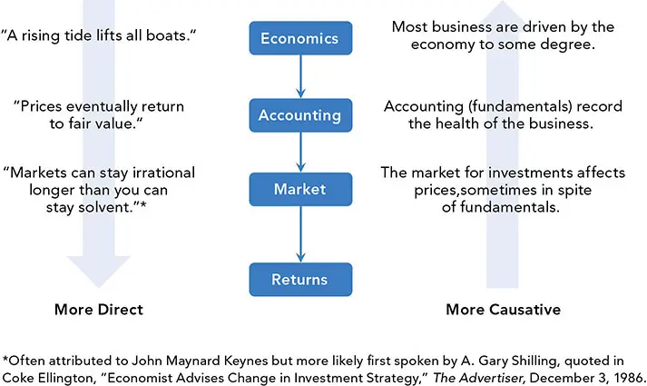
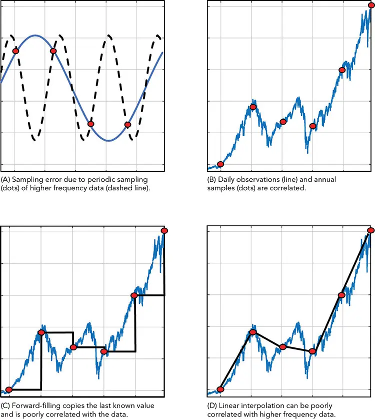
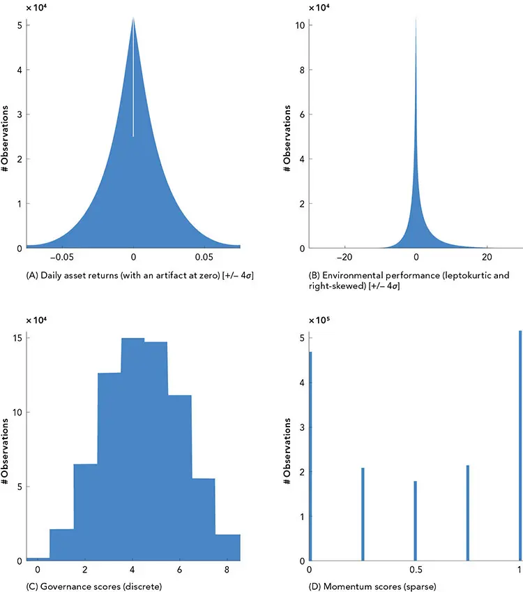
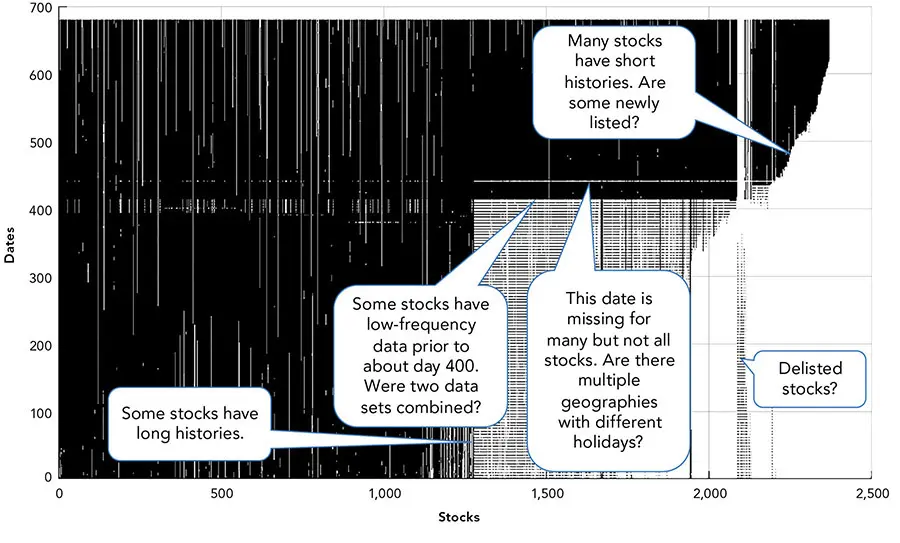

# 金融数据

*看似无害实则暗藏陷阱*

传统的统计和时间序列分析方法在处理金融数据（financial data）的细微之处以及世代积累的实践知识时，往往力不从心。经验之所以至关重要，原因有很多；而且，金融分析的受众即便对量化方法一无所知，也可能对金融本身极为精通。

许多量化从业者不愿攀爬陡峭的学习曲线，转而专注于数学，但这却是一个巨大的错误。我们曾看到许多才华横溢的人在徒劳中挣扎，并因缺乏对问题关键却又常识性的理解而显得愚笨。

华尔街（Wall Street）使用行话和圈子文化来排斥外人、维护自身利益，这一点并非独一无二。许多从业者在谈论金融时，几乎无法用日常英语表达。然而，这些概念一旦被理解，鲜有难以掌握的；而要在分析数据之前——更遑论做出预测之前——理解这些概念，乃是必不可少的。

在本章中，我们将讨论：

- 组织金融数据的一般方式

- 作为模型训练工具的*归档数据（archival data）*，即*时点数据（point-in-time data）*

- 调整数据的方法，包括重采样（resampling）、重述（restating）和去趋势（detrending）

我们将专注于清洗数据并使其保持一致。在投身于用于预测的经济学、金融学和数学之前，必须彻底理解并调整原始数据。在使用金融数据时避免陷阱，需要投入大量精力和领域知识（domain knowledge）。各种专门而又晦涩的调整是标准做法；即便是来自金融界同一角落的数据，也可能存在许多令外行人困惑的不同约定。

## 组织金融数据

在开始分析之前，我们需要组织我们的金融数据。数据组织的方法有很多。我们将专注于层次法（hierarchy method）。

层次树的第一层大致遵循彭博专业版 API（Bloomberg Professional API）的约定，它将数据请求划分为历史（historical）、实时（real-time）、当前（current）、批量（bulk）和字段（fields）。不同的历史数据以不同的频率记录，一些数据仅按日或更低频率提供。分箱（binned）或分时（bar）数据则可按各种频率获取。某些工具还提供组合（portfolio）、实时（real-time）、技术（technical）和逐笔（tick）数据。（本示例不包括另类数据（alternative data）或高频数据（high frequency data）。）

- **历史（Historical）**请求产生时间序列（特定日期的历史数据和描述性数据）。

- **实时（Real-time）**数据不是静态的，会不断更新。

- **当前（Current）**请求产生描述性数据（以及最近的时间序列数据）。

- **批量（Bulk）**请求以不方便的格式返回数据。

- **字段信息（Field information）**请求返回描述其他方法所用字段的元数据（metadata）。

还存在许多其他的数据服务和约定。

**时间序列数据（time series data）** 是想到金融数据时第一个浮现的类别。尽管时间序列数据通常以时间—值对（time-value pairs）^1^ 的形式存储，例如日期与价格，但它常常被转换为横截面（cross-sectional）和面板（panel）格式。时间序列通常指单一工具或指数，例如单一名称（single name）在不同日期的股价。如果我们把某个特定时点上其他名称的数据合并起来，所得到的表就称为一个*横截面（cross-section）*，例如若干股票在某一日期的财务比率。如果我们把不同时点的横截面合并起来，就称之为一个*面板（panel）*。

**横截面模型（cross-sectional models）** 不太可能出现欠定（underdetermined）的情形。预测变量的数量通常远大于需要估计的数值的数量。横截面数据在一些固定收益模型（fixed-income models）中很受欢迎。

**描述性数据（descriptive data）** 或多或少是静态的，用于描述或标注时间序列，例如统一证券标识程序委员会（Committee on Uniform Securities Identification Procedures，CUSIP）号码^2^ 或证券的资产类别。描述性数据适合用关系型数据库（relational databases）存储，因为少量描述性数据可以与大量时间序列数据相关联。

**"批量"数据（"Bulk" data）**，例如地理分布或信用评级分布，在表格中不易存储。批量数据可以是时间序列，但通常是描述性的。批量数据可以是结构化、非结构化或半结构化的。即使是像以可扩展商业报告语言（eXtensible Business Reporting Language，XBRL）记录的监管申报文件（regulatory filings）这种高度结构化的数据，也可能十分复杂。许多设计良好的工具可用于解析 XBRL 等常见数据结构。

大多数金融数据是未标注的，意思是它不包含标记。批量数据可能是廉价标签的良好来源，例如国家经济研究局（National Bureau of Economic Research，NBER）发布的商业周期日期。标注通常需要领域专家参与，因此获取成本高昂，且可能包含错误。

**时间序列数据。** 作为我们分析过程的一部分，我们将时间序列数据分为三类：

- **经济数据（Economic data）**，包括诸如通货膨胀等经济因素

- **市场数据（Market data）**，涉及如价格等资本市场交易

- **基本面数据（Fundamental data）**，描述公司或其他底层实体，如销售统计

量化分析的批评者倾向于认为，基本面投资（fundamental investing）比技术投资（technical investing）更为合理，因为其中存在某种涉及因果关系的叙事，无论这个故事是否属实。虽然自上而下（top-down）的模型可能更直观，但经济对个股价格的影响并不精确。相反，市场数据可能直接影响价格，但作为业绩的一致预测变量（predictor），它可能并不那么有说服力（见图 5-1）。

**图 5-1** 推导可以沿不同方向流动。

## 经济数据

经济数据可用于为许多类型的分析预测输入，例如自上而下的资产配置模型。所用数据的类型及其使用方式取决于所建模的现象。例如，一个信用模型可能需要考察*跨周期（through-the-cycle）*数据来确定一个周期的全部影响，而一个战术资产配置（tactical asset allocation，TAA）模型则可能试图识别周期内的衰退。

经济数据可以通过许多方式分类，例如：

- **雇主驱动（Employer-driven）：** 招聘、薪酬、职位空缺

- **利用率（Utilization）：** 兼职、边缘附着劳动力（marginally attached workers）、就业—人口比、失业率

- **流量（Flow）：** 求职成功率、初次申请失业金人数

- **信心（Confidence）：** 招聘意向、离职率、可得性、职位空缺无法填补程度

- **工资（Wages）：** 小时收入、成本指数

经济数据也可以按识别商业周期（GDP、产能利用率、招聘广告、新屋开工、新订单、营建许可、货币供应量）和通货膨胀（利率、通胀预期）等领域进行归类。

经济数据通常是多维的。例如，除了某一特定事件发生的具体日期之外，经济数据记录中还涉及多种日期。例如，1 月份的通货膨胀数据可能在该事件发生很久之后才向媒体公布。其他相关日期可能包括最近一次修订的日期，以及调查或预测的日期。

每一次估计和修订都可能引发市场反应。如果一项公告或修订与分析师的预测不符（例如业绩"未达预期（miss）"），就可能引发市场反应。

**收益率曲线（the yield curve）** 常被用作识别即将到来衰退的预测指标。衡量收益率曲线斜率的一种方法是用 10 年期美国国债收益率减去 2 年期美国国债收益率。这个*期限溢价（term premium）*通常为正；当它为负时，该曲线被称为*倒挂的（inverted）*。这一期限溢价往往领先衰退约一年。

企业债信用利差是另一个预示衰退临近的指标。以高收益（high-yield）的*期权调整利差（option-adjusted spreads，OAS）*衡量的企业债信用利差，严格来说不是经济指标，而是市场指标。它估计的是，与期限相似的美国国债收益率相比，投资者会为承担一家可能无法偿付债券的公司的风险溢价而要求多少额外收益率。

另一个例子是圣路易斯联储金融压力指数（St. Louis Fed Financial Stress Index），它结合了 18 个数据序列，试图识别金融事件。该指标的尖峰往往能识别重大的市场事件。

### 归档数据的重要性

为了避免*前视偏差（lookahead bias）*，至关重要的是只使用在观测时点可用的数据。尽管这看起来微不足道，但它却是一个常见的错误来源。在许多情况下，数据会被定期修订，尤其是经济统计数据，如 GDP 和就业数据。大多数时间序列数据库仅保留最新的修订。数据常常随着更多信息的发布或在收集、报告和交易中的错误被发现而被修订。大多数数据源会覆盖之前的数据版本（vintages），使原始报告无法访问。

相比之下，归档数据库保留了数据的所有版本，因此分析师既可访问在发布日可获得的初步数据，也可访问随后发布的修订数据。这使分析师能够根据研究重点选择使用任一数据集——或两者兼用。

例如，如果使用修订数据而不是时点数据，算法可能会被赋予一个含有未来信息的信号（前视偏差（look-ahead bias）），或者会错过一个在数据最终版本中被编辑掉的信号（第二类错误（Type II error））。当我们稍后在本章讨论调整时，我们会看到未调整数据可能与已调整数据存在巨大差异。

将这些差异映射出来，可以洞察经济、市场或投资者在任一情景下——或在两种后果的组合下——可能如何反应。这一概念被称为*智能体（agent）*——一个关于一个人如何决策的简单表示，无论是理性地还是带有偏见地。智能体可用于设计有趣而复杂的响应函数。

下面是一个例子：在对响应变量建模时，我们可能会考虑一个智能体在亏损巨大时卖出股票，否则会一直持有，直到他持有一段较长时间之后才考虑卖出（如果 Δπ \< --10% \| Δt \> 60 天 → 卖出）。一些数据提供商仅提供实际发布、最新修订以及最新预测。

### 归档数据的工作原理

归档（时点）数据的概念直截了当，但也可能令人困惑。我们区分版本（vintages）与修订（revisions）：

- **版本（Vintages）** 是一系列被认为自某一特定日期起有效的数据。

- **修订（Revisions）** 是将先前认为准确的数据（*先前值 prior*）更正为现在被认为正确的数据（*更新值 update*）的更新。

*莱克西斯图（Lexis diagrams）* 是处理归档数据的有用工具。虽然它们最初是为人口学研究而发明的，但对于研究贷款、私募股权以及其他随版本（出生日期）和期限（年龄）变化的数据，这些图很有用。

### 归档数据的挑战

使用归档数据的一个缺点是，它比传统的时间序列分析更复杂，而且有时很难将机器学习应用于这类数据。例如，每个时间序列必须用一个矩阵来表示，而不是一个简单的向量，以便每个评估日期都有它自己的历史。每个观测值也有它自己的时间序列。两者都是资产业绩的有价值的驱动因素。

尽管归档数据很复杂，但它提供了一个丰富的数据集，有助于弥补经济时间序列中数据相对匮乏的不足。经济序列通常按月发布，而定义我们响应的资产价格数据则是细颗粒度的，使经济数据相对稀疏得多。

**现测（Nowcasts）。** 由于经济数据通常频率较低，而资产定价数据几乎是连续的，经济学家们一直在发明提高经济预测频率的技术。其中一种技术被称为*现测（nowcasting）*。^3^

## 批量数据与描述性数据

描述性数据通常是不变的，或者至少是持久的，例如描述投资身份的数据，如它的 CUSIP 号码或国际证券识别码（International Securities Identification Number，ISIN）。描述性数据通常以多维批量格式访问。它可以用作正向或负向过滤器，例如固定收益数据的*定价来源（pricing source）*可能表明它是*矩阵定价（matrix priced）*（通过插值或自助法（bootstrapping）等方法估计），而非由市场参与者实际*报价（quoted）*。

API 可能不会返回单一数据点，而是返回一个数据结构，这通常需要创造性的方法来存储和访问数据。在许多情况下，数据可以被展平为更标准的格式，这需要关系表或重复。为复杂存储而设计的数据库（如 MongoDB）可以更轻松地存储这类数据，或者展平后的数据可以存储在传统数据库中。

描述性数据通常以批量格式提供。例如，彭博（Bloomberg）以一个尴尬的结构提供地理持仓数据表。每一个数据点都以一个尺寸和构成不确定的表提供，嵌套在更大的数据集中。

## 市场数据

价格是主要的市场数据，但受到若干缺陷的困扰。差分会引发尺度错误：100 美元价格的 1 美元变动，影响小于 10 美元价格的 1 美元差异。市场数据需要进行许多调整。

更高频率的数据可以按*逐笔（ticks）*报告，代表离散的交易，但通常交易会被聚合为*分时（bars）*。标准的分时格式指定一个区间，例如一分钟，数据包中包含该分时内交易的摘要统计量，例如该时段内的首笔（开盘 open）、最高（high）、最低（low）和末笔（收盘 close）价格。其他统计量也是标准的，如成交量、tick 数量和该时段的总成交额。

大多数市场价格隐含地假设，*订单簿（order book）*或*堆栈（stack）*^4^ 存在于每一笔出价（bid）、报价（offer）和交易之后。它假设许多买家和卖家会在相同或不同的价格上交易。这些出价和报价以堆叠的形式排列，称为订单簿。

大多数定价是分散的，必须经过收集、清洗和组织，但交易所和其他数据蓄水池中也存在一些有组织的数据宝库。例如，根据《多德—弗兰克法案（Dodd-Frank Act）》以及商品期货交易委员会（Commodity Futures Trading Commission，CFTC）的实时报告规则，所有在信用和利率交易中活跃的注册互换交易商都要向互换数据存储库（Swap Data Repositories，SDR）报送数据。根据这些规则，数据会根据对手方类型、清算资格和执行场所而延迟。即便如此，SDR 数据中仍存在许多差异和特例。例如，配对交易常常被分开并在不同时间报送，以模糊其目的，有时可以通过注意套期保值比率和相对价格将它们合并。许多公司策划、维护并出售广泛的数据集，包括归档（时点）数据。

可用数据的数量是另一个常见问题。分析师通常希望拥有更多历史数据，但可能无法获得。较长的数据集可能涵盖多个周期，通过对不同状态（regimes）求平均而模糊了趋势。长期趋势可能掩盖回归倾向。选择样本期的艺术在于识别一个具有代表性的区间。如果对数据结构的足够了解已知，许多方法可以用来制造数据，但用无监督方法有效识别那些特征却十分困难。

## 基本面数据

公司分析通常分为基本面（fundamental）和技术面（technical）。基本面数据描述公司的运营，或者任何金融工具所指向的对象（例如大宗商品）的行为。

基本面股权数据中的大部分来自利润表（income statement）、资产负债表（balance sheet）或现金流量表（cash flows）。基本面数据（公司和经济两方面）有许多维度，例如分析师预测。与预测相关的日期有两种：估计日期（estimation date），即分析师做出预测的日期；以及公告日期（announcement date），即被预测事件发生的日期。用于基本面分析的数据通常取自几张会计报表：*综合收益表（comprehensive income statement）*、*资产负债表（balance sheet）*、*现金流量表（cash flow statement）*、*股东权益表（shareholders' equity statement）*和*审计报告（the auditor's report）*（专栏 5-1）。



许多监管申报文件（regulatory filings）可在美国证券交易委员会（US Securities and Exchange Commission，SEC）维护的电子数据收集、分析与检索系统（Electronic Data Gathering, Analysis, and Retrieval system，EDGAR）上获取。一些最受欢迎的文件包括：

- 当期报告（8-K）

- 年度报告（10-K）

- 季度报告（10-Q）

- 季度持仓（13F）

- 未注册发行（D）

较新的申报文件以 XBRL 格式报告，尽管旧文件可能采用不太方便的格式。^5^

从 EDGAR 申报文件中可以提炼出的一些关键数据包括：

- **财务报表（Financial statements）**，可在年度报告和 10-K 中找到（可能更早地在 8-K 表中报告）。

- **利润表（The income statement）**，也称为损益表（profit and loss statement）、运营报表（statement of operations）或收益表（statement of earnings）。它通常按季度发布。

- **每股收益的分子（The numerator of earnings per share）**，来自利润表的最后一行。关于收入确认的复杂规则可能使利润表的分析变得棘手。

- **综合收益表（The statement of comprehensive income）**，每年编制，在利润表的基础上扩展，纳入更多收入和费用来源。

- **财务状况表（The statement of financial condition）**，即资产负债表，通常按季度发布。它由资产和融资构成，后者包括负债和股权。

- **现金流量表（The statement of cash flows）**，描述来自经营、融资和投资的现金收支。

- **股东权益表（The statement of shareholder's equity）**，解释股份数量的变化，例如股票或期权的发行、配售或回购。

- **审计报告（The auditor's report）**，有助于判断良好治理的程度或这些数据被操纵的程度。



**另类数据（Alternative data）。** 另类数据中也提供大量的基本面信息。这类数据的广度难以穷尽，其中许多仍未被关注，这可以成为 alpha 的丰富来源。另类数据的例子包括媒体公告和公司指引、新闻报道（包括会计违规和监管调查的公告）、产品公告和专利申请、诉讼、广告、人事变动等等。

## 调查数据

调查数据可用于一些有趣的分析，例如对经济数据的预测、资本市场假设、盈利估计等。受访者通常具备资格，问题设计也较好。这些调查可能缺乏社交数据的及时性和频率，但从理论上说，其结果会更可靠、更具前瞻性。

头条数据（headline data）有广泛可用的经济调查数据，如实际国内生产总值年度变化百分比（Real GDP YOY%），以及更细颗粒度的数据，如消费支出、政府支出、私人投资等。预测值和修订通常可以获得。预测者及其公司的名称往往被提供，因此可以对预测的准确性和精度进行评估，并据此加权。很容易计算诸如共识和离散度等总体统计量，并将"意外"与市场反应进行比较。

**确信度（Conviction）** 数据较为少见，但关于及时性、方差、盈亏比、信息比率（information ratios）以及其他统计量的信息可能有助于形成确信度。确信度也可以在公司数据（如每股盈利（earnings per share，EPS））、其证券（如市净率（price to book，P/B））以及指数（如加权平均期限（weighted average maturity，WAM））的估计调查中找到。对于资本市场汇总和比率（如利差——收益率曲线、EMBI+ 等），也有相应的预测。

## 抽样与合成数据

**抽样数据分析（Sampling data analysis）** 用于从更大的数据库中选择并分析具有代表性的样本数据，以识别模式和趋势（见专栏 5-2）。

**合成数据分析（Synthetic data analysis）** 在真实数据不足、无法准确度量时使用。为使有效，合成模型必须复制与真实数据集相同的统计性质，并以类似方式表现。



应对低频数据的一种解决方案是使用吉布斯采样器（Gibbs sampler）。吉布斯采样器可以使用许多更高频率的序列（*同步指标 coincident indicators*），如工业生产、商业气候、经济景气、采购经理指数（Purchasing Managers' Index，PMI）等，在 GDP 公告等实际报告之间的日期上估计一个较低频率的预测变量。

该采样器使用贝叶斯概率（Bayesian probability，基于期望而非频率）将同步指标与预测变量在预测变量可用日期上联系起来，并使用这种关系来预测当预测变量不可用时它本应取的值。关键的是，它并不进行插值（interpolation）。它使用同步指标与响应变量之间的关系。

使用吉布斯采样器预测 GDP 和其他数据的计算机代码可在本书配套网站 [www.QuantitativeAssetManagement.com](http://www.QuantitativeAssetManagement.com) 上获取。



**缺失数据与频率。** 填补缺失数据不仅困难，而且*降采样（downsampling）*到更低频率也同样困难。当比较两个不同频率的数据流时，情况甚至更具挑战性。

仅仅从一个详细的时间序列中选择数值以与一个较低频率的序列对齐，通常不是一个合适的解决方案。金融数据充斥着这一问题。通常，像房地产或私募股权这类估值型（appraised）投资由于抽样误差而被认为风险低于流动性资产。如果这些投资以更高频率估值，它们通常会与其流动性对应物一样波动。

图 5-2A 展示了错误的采样频率（点）如何暗示错误的信号频率（线）。当然，*升采样（upsampling）*更加棘手。我们将在[第 6 章](ch06.md)中讨论降采样和升采样的方法。

**图 5-2** 采样与缺失数据填补错误

其他学科中用于填补缺失数据的方法（如插值）对许多类型的金融数据并不适用。考虑图 5-2B 中两个完全相关的序列，一个为年度观测（点），另一个为每日观测（线）。

**前向填充（Forward filling）**（图 5-2C）会造成巨大估计误差的可能性，并混淆与相关序列的比较。它还在观测点处造成不连续。*后向填充（Backfilling）*和插值（interpolation）虽然常用，但由于它们纳入了未来值，反而会因引入前视偏差而不恰当地加剧这些问题。

**线性插值（Linear interpolation）**（图 5-2D）在观测值之间（分段线性线）是一个糟糕的选择。隐含的时间序列不仅远不那么波动，而且估计值有时远离真实值，并存在前视偏差。

**混淆。** 由于错误的日内插值数量是实际年度值的 249 倍，错误会淹没正确数据，相关性因此被混淆。在观测值之间评估数据有更好的方法，例如专栏 5-2 中讨论的方法。

**平滑（Smoothing）。** 重采样的另一个问题是人为的低方差。平滑制造了低风险的错觉。私募股权指数（Private Equity Index）回报类似于美国小盘股（US Small Cap）的回报，但平滑得多。这主要是人为的，归因于较低的频率以及评估私募股权回报所用的估值方法（appraisal method）。

**监管申报文件（Regulatory filings）。** 报告频率不足是一个长期问题的一个领域，就是组合管理人提交的 13F 数据。一些公司（共同基金、对冲基金以及许多其他类型的金融公司）每季度报告其部分投资（多头头寸、普通期权、ADR 和可转换债券，但不包括债券、外国股票或空头），滞后最多 45 天。除了缺失的投资之外，季度的频率在估计管理人的持仓时构成重大问题，因为在报告日期之间没有透明度。

加剧频率不足的是，组合可能在季度末被"粉饰（dressed up）"以隐藏信息。去趋势（detrending）也会产生类似的问题，既会破坏与其他数据的关系和交互，又会注入前视偏差。

**展期与连续合约（Rolls and continuation contracts）** 出现在将由多个定价来源构造的数据合并时，例如定期到期的期货合约。在每个到期日或其附近，每个旧合约都被一个更新的合约取代，这一过程称为*展期（rolling）*。

由于这些工具的组合，会出现几个问题，最明显的是不连续性，称为*展期收益（roll yield）*。展期收益可能产生意想不到的效应。例如，负的展期收益可能导致一份连续合约在标的商品升值时价值下降。

即使是标的商品和等级相同的两个合约，价格也可能大相径庭。当期限结构处于*期货升水（contango）*状态时，未来交割的价格高于当前价格，反映的是储存和保险该商品的成本。当处于*现货升水（backwardation）*状态时，未来交割的价格更低，暗示着对需求减少或供应增加的预期。

期限结构的斜率可能产生重大影响，而缺乏经验的投资者可能并未预料到。iPath S&P 500 VIX 短期期货 ETN（VXX）会随时间衰减，确保投资者即便在标的资产——CBOE 波动率指数（CBOE Volatility Index，VIX）——并未变化的情况下也会亏钱。这是由于 VIX 期限结构的形状以及维持 VXX 合约所需的套期保值。有趣的是，做空 VXX 也不容易赚钱；我们在[第 4 章](ch04.md)中探讨过这一点。

如果需要合并不同的工具，连续缺口可能会更加复杂。例如，通过自助法（bootstrapping）构建一条收益率曲线可能需要许多种利率工具来为其他期限收集数据，例如联邦基金利率、伦敦银行同业拆借利率（LIBOR）、国库券、中期国债、长期国债、期货和互换。无论是展期还是期限结构的斜率都不容易处理，正如专栏 5-3 所示。



为了说明即使计算一个简单的展期也会变得复杂，让我们看看一只次新美国中期国债（"旧的"或"已发行的"，off-the-run）与新的当期国债（"当期的"、"新发行的"、"发行时"或 WI，on-the-run）之间的展期。我们考虑曲线（curve）、持有（carry）、流动性（liquidity，包括供应和剥离以及需求），以及对周末和节假日（"坏日子 bad days"）的会计处理。高需求的利率工具，其收益率明显低于具有类似期限的工具，正如在新发行工具的到期日附近出现的收益率下凹（更高的价格）所示。

通常，收益率曲线向上倾斜。由于期限溢价，期限更长的利率工具将具有更高的收益率（除了因对某一特定到期日的高需求等局部扭曲之外）。这种差异被称为"曲线（the curve）"。曲线可能是负的或*倒挂的（inverted）*，例如，如果预计经济将恶化。

非新发行曲线通常使用互换以及其他比带息投资更少特异性的工具来推算。流动性调整主要是由于对到期日更接近*原始*或既定到期日的最新工具的需求。例如，一只剩余期限为 10 年的 10 年期国债，可能是套期保值一笔 10 年期抵押贷款的紧密匹配。剩余期限略多于 9 年的上一只 10 年期国债，可能就不那么适合这一目的。

供应（由于发行量和因剥离导致的流通量减少）也可能纳入计算。流动性效应可以通过观察原始到期日（2、3、5、7、10 和 30 年）处收益率的下降而显现。最新的发行享有最慷慨的流动性溢价，而该溢价随之前的每一次发行递减，直到只剩一个平滑的曲线效应。持有（Carry）考虑的是借出或借入的成本，等于票息减去融资（*回购 repo*）。如果计算的是远期利率（例如对于一只发行时证券），就必须考虑持有。最后，由于计日方法或"坏日子"导致的计算错误可能需要被剔除，以计算曲线的形状。

通胀保值债券（Treasury Inflation Protected Securities，TIPS）增加了另一个维度，需要对通胀季节性和通货紧缩下限（deflation floor）进行调整。如果我们调整 TIPS，就必须考虑新旧发行到期日之间消费价格指数（Consumer Price Index，CPI）的季节性调整，因为通胀计算并未经过季节性调整。此外，由于一只 TIPS 的最终支付不能低于面值（对持有者而言是在到期日嵌入的看跌期权），这一点也必须考虑在内。

股权展期也可能变得复杂。在计算股权期货的展期时，我们必须考虑未来市场事件，例如联邦公开市场委员会（Federal Open Market Committee，FOMC）会议、借贷成本、股息预期以及需求，例如使用 CFTC 的交易者持仓报告（Commitments of Traders report）。



## 公司行为

公司行为（corporate actions），如*股息（dividends）*和*股票拆分（stock splits）*很常见，也容易调整。通过在我们的数据集中移除或调整这些不连续性，我们可以解决回测（backtest）中策略收益计算的一些问题。但请注意，不要把调整后的价格用作我们因子的原始信号，因为实盘价格是未调整的。基于调整后数据训练的模型在使用原始数据流时可能表现不佳，因为它不会适应未调整数据的错位。

公司行为的数据收集面临归档（时点）方法所面临的一些相同类型的挑战。在两种情况下，数据收集都可能困难，机器学习可能不可靠，结果可能因数据收集中微小的不一致而被扭曲。如果算法不知道如何调整传入的数据，它可能被公司行为欺骗。

有许多种反复出现的公司行为。例如，仅 2015 年就有 20,000 多次股息分配，这还不包括所有其他事件。

这类调整会追溯修订过去的数据，使数据序列的当前价格与今天市场上交易的价格相匹配。例如，当发放现金股息时，股价在*除息日（ex-dividend date）*会下跌该金额，这意味着必须进行调整以重置该股票的历史价格数据，以反映股息的价值。

类似地，当一家公司发放股票股息时，股份数量会增加，因此发行前的股价必须按为股息所创建的额外股份的百分比向上调整。股票拆分的处理方式与股票股息类似，不同之处在于先前的价格必须降低。可用股份的数量被称为*流通股（float）*。因此，如果是 1 拆 2 的股票拆分，股价必须减半，因为该公司现在由两倍数量的股份组成。*反向股票拆分（Reverse stock splits）*的工作方式相同，只是股份数量减少而价格上升。

*剥离（Spinoffs）* 从母公司中移除一部分公司，留下更少的价值，因此股价必须减去剥离部分占原公司价值的百分比。*并购（Mergers and acquisitions）* 不需要调整，因为收购方正在为收购付款。同样，*回购（buybacks）*和股份*回购（repurchases）*也不需要调整，因为它们是被付钱购买的。

## 其他实际问题

我们收集的数据以及我们计算的隐含值只是估计值，并受噪声影响。市场预期可能是无偏的预测，但它们并不是市场参与者的"最佳猜测"。一些投资者认为"群体智慧（wisdom of crowds）"是一个合理的预测，但各种市场力量共同作用产生一个隐含值，而没有任何单个参与者可能认为该值是一个好的预测。^6^

**分布而非估计（Distributions, not estimates）。** 最好使用分布而不是点估计和汇总统计量（如均值和标准差）。同样重要的是要关注数值之间的关系，而不仅仅是孤立地考虑它们。必须小心设计对不可避免的数据问题不敏感的模型。类似地，即便是技术问题也必须有所规划。在下载大型数据集时，要为网络故障、数据限制违规以及其他中断做好准备（专栏 5-4）。



在电子战中，一个看似无关紧要的特征可能被利用而产生巨大效果。数据科学家通常不受生死决策的驱动，但同样的令人印象深刻的工作可以在金融数据上完成。始终保留原始下载数据，以便重新审视。

一位套利者（arbitrageur）通常通过"拷问"数据来赚取其价值，以暴露那些不断变化且短暂的嵌入模式。在高频交易（high-frequency trading）中，这类工作可能更具挑战性也更盈利，尽管高频技术的复杂程度常常受制于对快速执行的需求。

这种现象的表现有许多例子，这里是一个。当一位交易员发布一个出价或报价时，它传递了信息——它显示供求，并可能被对手利用。为了掩盖其意图，交易员可能希望提交一个隐藏的暗订单或钉扎指令（pegging interest，PI）。PI 是一个尾随最佳出价或报价（best bid or offer，BBO）并带有上限的订单。如果最佳出价或报价移动到超过该上限，钉扎订单将不会停留在该价格；它会在被限制的范围内以最佳价格报告，位于 BBO 之外，并埋藏在订单簿中。由于纽约证券交易所（New York Stock Exchange，NYSE）在订单停留之处显示订单（包括 PI 订单），它们会在 BBO 移离上限时出现。由于这一微小细节未被 NYSE 披露，并可能允许信息泄露，它在一定程度上导致了 SEC 于 2020 年 7 月处以 1400 万美元的罚款。

高频交易的优势有时依赖于晦涩或微妙的信息片段。而且，这通常不是直接可操作的信息，例如，显示的水平并不是上限，而是被限制范围内最接近的价格。如果 PI 上限位于 BBO 之外，没有人会在那里成交。它只是一块拼图，是一个马赛克的一部分，是在构建订单簿模型中的微小优势。但那正是被数据科学增强的独创力的力量。

每一位数据都包含信息，包括其顺序。保留数据价值的另一个例子与一个有规律的定期下载有关。一位数据库管理员可能按时间对一个时间序列数据库进行例行排序。如果数据库很大并且不需要频繁进行时间查询，这种排序可能是有害的。如果为了保留日内收盘价而在数天内更新日内数据，那么部分数据（当日尚未收盘的数据）将被赋予午间价格而不是收盘价，从而使它们无效。第二天的更新将为该日期提供第二个价格，那将是正确的收盘价。如果只记录日期（而不记录一天中的时间或更新时间），并且数据库按观测日期排序，那么确定哪些数据正确就很困难。

随后的下载将产生一个冗余的日期，但具有正确的收盘价。如果数据库保持未排序，可能可以判断哪些重复元素是正确的，因为最近的价格最可能是真实的收盘价。如果排序，下载顺序可能被破坏，使得难以确定哪个收盘价是正确的。



**存储、清洗和转换**数据可能是量化建模中最耗时的部分。即使是格式良好的逗号分隔值（comma separated value，CSV）文件也可能充满困难。图 5-3 展示了一家对冲基金提供的某些因子数据的分布。这些分布彼此差异很大，并包含对因子特征的丰富洞察。

**图 5-3** 单个数据集可以提供种类繁多的分布。

通过在图 5-4 中将股票回报值相对于其观测日期作图，可以明显看出两个不同的数据集被合并在一起。股票 1 到大约 1,250 之间有较长的历史。高于大约 1,250 的股票具有较短的历史，约为 425 天。在使用数据之前，需要考虑一些有问题的调整。专栏 5-5 展示了一个现实世界数据中有问题的案例研究。

**图 5-4** 一些股票为整个集合报告每日数据，另一些则包含每日和较低频率数据的组合，还有一些似乎是新发行或已被退市的。



这个注册投资顾问（registered investment advisor，RIA）数据案例研究基于一项分配给哥伦比亚大学（Columbia University）硕士生作为量化资产管理（Quantitative Asset Management）课程一部分的项目。我们获取了 101 只机器人顾问基金（robo-advisor funds）的交易和业绩历史，包括费用和成本。^7^

我们使用这些数据来分析机器人顾问的业绩归因（performance attribution）、其税损收割（tax-loss harvesting）和主题基金（thematic funds）的有效性，以及它们采用的再平衡（rebalancing）方法。通过使用业绩归因、仿真和回测的组合，学生们能够分析各项投资的过往业绩，并将成功归因于配置、择时、部门和其他因素；分析税损收割和主题策略的过往业绩及其对授权的遵循，包括税损收割策略的税收 alpha 衰减（tax-alpha decay）；并执行"如果……会怎样？（what-if?）"分析以查看策略可以在哪些方面改进，例如机会主义再平衡（opportunistic rebalancing）、再平衡频率的改变等。

利用这些信息，公司可以告知客户其投资的优缺点，并提出新的投资；为公司现有的业绩通讯和评论增添细节；提出对机器人顾问的改进；并开发他们自己的策略，用研究加以支持。

对基金进行分类是有问题的，因为我们无法访问基金的持仓——只有顾问持有的 ETF 和共同基金的名称。这些分类需要使用两个 API 和一个分类模型。

我们能够确定某些基金的基金分类和基准。对于其他基金，我们使用其持仓的资产类别、地理、行业、部门和评级，并使用一种层次方法构建了一棵分类树（taxonomy tree），对每一项投资进行分类。

确定投资组合的托管人、税务状态（合格或非合格 qualified or non-qualified）以及主题（税损收割、社会责任投资等）也是有问题的。人工输入的标签不一致，因此我们使用了自然语言处理（natural language processing）分析和分类器。

我们用持仓和交易数据交叉引用并补充了这一分析。例如，持有市政债券（municipal bonds）的投资组合不太可能是合格的（递延税款 tax-deferred）。交易数据也有助于对投资组合进行分类，例如高交易量可能表明是税损收割策略。

**政策（Policy）。** 由于我们无法访问组合管理人，我们需要逆向工程出政策组合（policy portfolios）和再平衡频率。本质上，再平衡涉及低买高卖，以将组合管理人的组合与其意图重新对齐。对于税损收割而言则相反——是低卖。

我们不知道目标配置。我们使用几个指标来估计目标配置。交易数据为我们提供了一组可能的再平衡日期（发生交易的日期），但并非所有这些日期都是真正的再平衡日期。通常，投资被买卖以管理现金流（如股息或费用），或者它们在一段时间内被执行而不是一次性执行。

确定投资组合加权有许多方法。估计方法可以简单到返回一个固定的资产百分比，也可以复杂到采用一个优化函数或机器学习算法。通过目测，这一集合的方案似乎很简单，因此我们测试了几种方法。触发条件（triggers）和新的加权（new weightings）定义了这些方法。

我们假设预定的再平衡可能由几种方式触发，最简单的包括：

- **日历（Calendar）。** 在预定日期。

- **区间（Bands）。** 当与基准的偏离超过一个缓冲（buffer，称为*区间 band*）时。

- **触发器（Triggers）。** 当风险指标被突破时。

新的加权可能是：

- **基准化（Benchmarked）。** 返回到与之前相同的百分比权重配置。

- **区间（Band）。** 返回到触发再平衡的区间，这将是一笔小额且不频繁的交易，因此比基准再平衡成本更低。

- **容忍度（Tolerance）。** 返回到一个介于基准和区间之间的容忍度水平。这将产生更不频繁的交易。

区间和容忍度再平衡也被称为*机会主义的（opportunistic）*，因为它们只在偏离较大时才进行再平衡。它们也是"懒惰的（lazy）"，因为由于缓冲的存在，在变化与再平衡之间存在滞后。



在使用金融数据时避免陷阱，需要投入大量精力和领域知识。各种专门而又晦涩的调整是标准做法；即便是来自金融界同一角落的数据，也可能存在许多令外行人困惑、却对从业者如此显而易见以至于在闲谈中根本不值一提的不同约定，例如在收益率曲线的不同部分使用截然不同的计日约定（day-count conventions）。在投身于用于预测的经济学、金融学和数学之前，必须彻底理解并调整原始数据。

1. 在一个时间—值对中，表中的每一行包含一个时间（time）和一个值（value）。例如，一列可能包含日期，第二列包含相应的价格。

2. 许多标识符根本不是静态的。如果一家公司不再需要某个代码（ticker）、CUSIP 或其他键（例如，如果它与另一家公司合并或停止运营），这些标识符可能被重新使用，并且一些公司拥有多个标识符。

3. 你可以在本书的在线资源 [www.QuantitativeAssetManagement.com](http://www.QuantitativeAssetManagement.com) 中找到经济现测模型的代码。GDPNow 是亚特兰大联邦储备银行（Atlanta Federal Reserve）使用卡尔曼滤波（Kalman-filtering）技术和动态因子模型（dynamic factor model）生成的现测值。它并非传统的现测，而是对尚未官方报告的本季度 GDP 的频繁估计。

4. 一个出价或报价可能代表当时的最佳出价或报价，并且对于指定数量的股份或金额是可靠的。较差的出价和报价可能位于最佳出价和报价"之下"，赋予报价"深度"，并可以以更差的平均价格容纳更大的交易。

5. 一位经验丰富的数据分析师可能会欢迎不方便的数据，因为他的竞争者可能不愿意或无法将其纳入他们的分析。

6. James Surowiecki，《群体的智慧》（*The Wisdom of Crowds*），（Doubleday; Anchor, 2004）。

7. 本研究所用数据由 Backend Benchmarking 提供。
