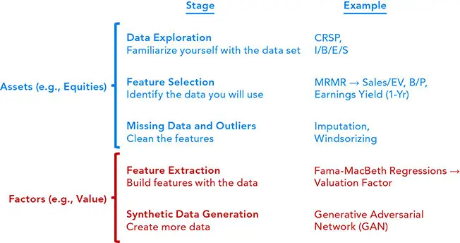
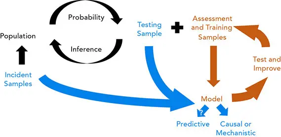
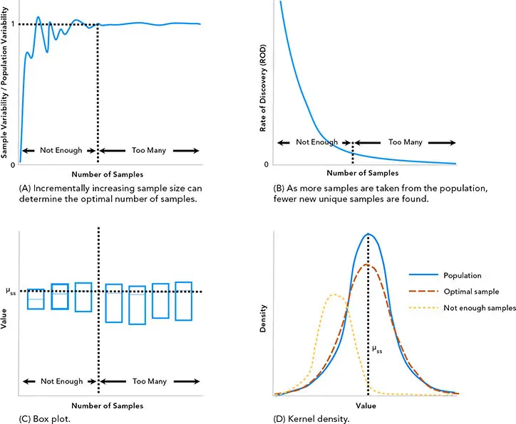
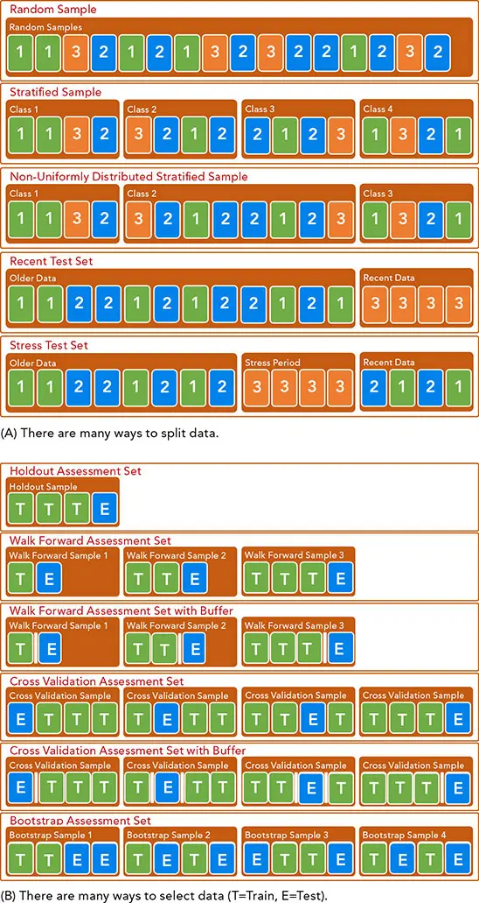
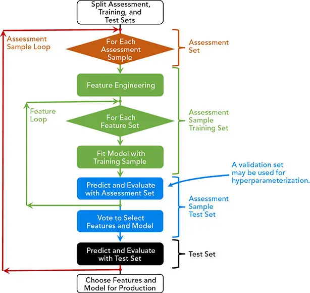
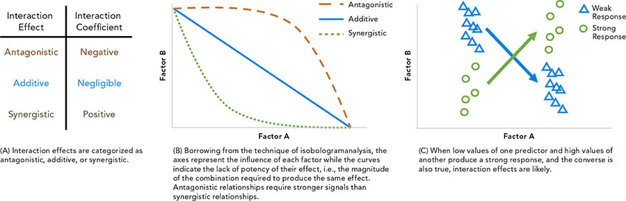
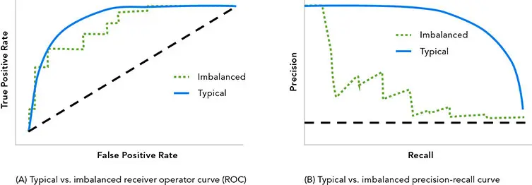
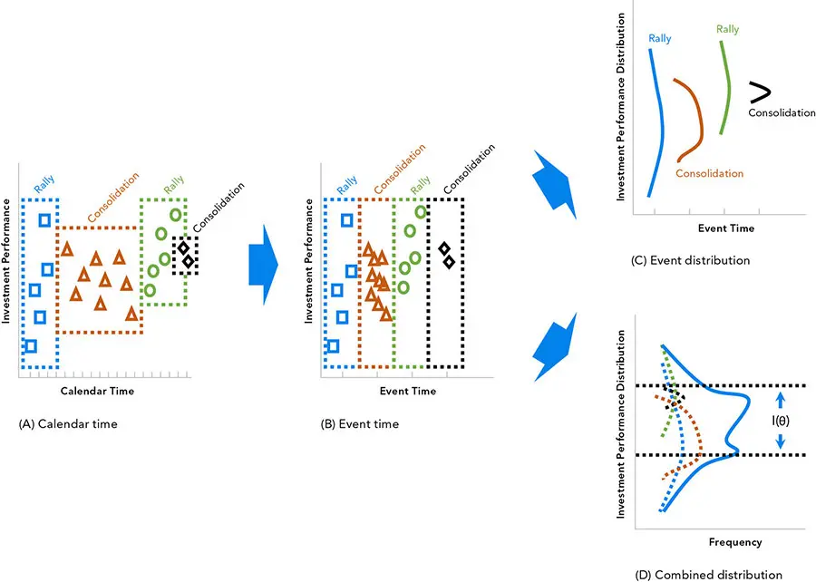
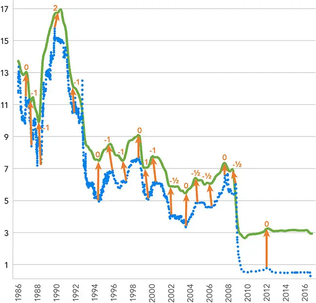
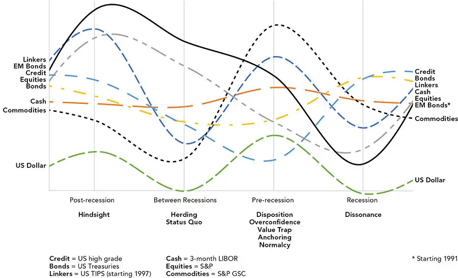

# 特征

*去芜存菁*

尽管人们普遍认为建模阶段（modeling phase）占据任何项目预测过程的主要份额，但恰当地选择合适的特征（feature）往往对最终结果更为关键。特征为算法提供检测模式所需的数据，从而为训练模型、预测结果提供必要的信息。通常，特征越是精确、精炼，整个过程的预测潜力就越可靠。

与数据类型类似，特征可包括：

   **基数型（Cardinal）**：顺序可能重要的量，如收益率或信用评级。

   **数量型（Quantities）**：没有有意义顺序的量，如付息频率。

   **序数型（Ordinals）**：量级不重要但顺序重要的特征，如排名。

   **类别型（Categories）**：既无数量也无顺序的特征，如行业名称。

本章将考察数据探索（data exploration）、抽样（sampling）、可视化（visualization）、为模型进行特征（feature）的选择（selection）、处理（processing）与整理（curation），以及为分析准备数据的相关技术。现代模型可能极其精巧、复杂得难以驾驭，但与人类认知相比仍显初级。控制力与易用性之间存在权衡；分析师影响模型结果的能力越强，在使用时就越必须知情和谨慎。由于大多数实现都倾向于控制，预测变量格式上的微小变化都可能显著影响模型性能，并扰乱本应稳健的模型。

大多数模型必须被喂入经过高度加工的数据——这些数据被精心地选择、组织并调理，以便清晰而明确地呈现给算法。*多重共线性（Multicollinearity）*（相关的预测变量，也称*替代效应（substitution effect）*）和*自相关（Autocorrelation）*（某一预测变量的观测值与自身相关，例如动量与均值回归）会扰乱许多模型，尤其是依赖严格假设的*高偏差模型（high-bias models）*。

缺失值在 Scikit-Learn 等常用软件中可能导致有价值数据被大规模删除。即便对缺失数据进行了处理，所用方法也必须考虑到从其缺失模式中可以挖掘出的模式和信息。无关或极端的数据会严重扭曲结果，但要消除它们并不总是容易或明智的——正如投资中的意外横财或保险承保中的灾难性损失。

通常，数据和模型的选择涉及准确度（accuracy）与精确度（precision）（偏差 bias 与方差 variance）、简洁性、可处理性与可解释性之间的微妙权衡。所需的细致程度往往难以通过自动化方案实现，而需要"人在回路（in the loop）"的数据科学家。*高偏差模型（High-bias models）*，如经济学和统计学中常用的许多模型，由于施加了关系或分布假设，对不完美的数据具有稳健性和容忍度。*低偏差（Low-bias）*模型由于其数据驱动的本质，常常过拟合，产生高精确度但低准确度的常见问题，尤其是在观测数相对于预测变量数较少时（*欠定 underdetermined*）。

在此我们将聚焦于特征工程（feature engineering）过程，讨论为分析准备数据的方法。所需的技术可能与用于分析的技术（如聚类 clustering）相似，但目的不同。本章将专注于用机器学习填补缺失数据，而非预测。我们将把对其他统计与机器学习技术的讨论推迟到[第 10 章](ch10.md)和[第 17 章](ch17.md)，以便将最技术性、最易过时的讨论与正文其余部分隔离开来。

**特征工程（Feature engineering）**将数据转化为有效的特征。领域知识在预测建模的这一阶段占据主导地位，尤其是与投资组合管理相关的部分。金融信息常常复杂而微妙，没有任何明确的度量或解读方法，并且容易受到操纵——这可能误导或欺骗。许多管理人对领域知识极为推崇，而对无视它的分析缺乏信任。优秀的分析包已广泛可得，并日益专业化。

由于竞争激烈，开创性的应用金融研究在学术界之外很少公开，一些最先进的创新、发现和工具都被严密守护。因此，大多数从业者"自卷（roll their own）"软件，局外人只能看到其他领域更为通用的进展，这使一些人误以为算法能承担繁重的工作。在特征工程中，人工介入比在其他分析阶段更为有益，因为领域知识、直觉，以及人类视觉处理和模式识别的敏锐度，都远胜于人工模拟。

机器学习是多学科交叉的，因此同一或相似的概念有各种不同的术语。许多术语来自数学（如拓扑学 topology）或计算机科学，还有大量工作专门为生物学（生物信息学 bioinformatics）、神经科学、图像分类和文本分析（自然语言处理，natural language processing 或 NLP）而发展。

如图 6-1 所示，我们从对数据集的描述与探索开始，这一阶段以可视化工具为主，随后选择那些看似重要的元素。几乎总是需要对数据进行一些耗时但必不可少的清洗与组织，而这往往涉及艰难的选择与权衡。


**图 6-1** 特征工程流程


一旦熟悉了数据集，我们便会更深入地检视信息的组合以及它们之间的交互。大多数金融分析（除高频交易、投资者分析和票据处理等少数任务外）都缺乏足够的相关数据；对此有若干不完善的解决方案，包括生成合成数据。

在特征工程完成之后，我们会将该数据喂给一个*机制性（mechanistic）*（寻找过程中的步骤）、*推断性（inferential）*（理解总体）、*预测性（predictive）*（预测某个特定值）或*因果性（causal）*（确定因变化而导致的结果）的模型。使用因果语言来描述推断性或预测性分析很常见，却具有误导性（图 6-2）。


**图 6-2** 在创建和调优模型以获得良好的样本外表现时，划分数据至关重要。


## 数据探索
即便是小公司也可能收集到远超其处理能力的数据。在特征工程之前，数据可以原始、非结构化的格式存储于*数据湖（data lake）*中，或存储于更有组织的*数据仓库（data warehouse）*。通常会有一个*数据字典（dictionary）*随数据一起描述其内容，另有一本*编码手册（codebook）*说明收集数据所用的方法。

对数据执行的每一项操作都会移除一些日后可能需要的信息，因此保留原始格式、保留审计追踪和*证据链（chain of custody）*以跟踪所做的工作十分重要。最好将所有操作纳入训练、测试和生产阶段，以确保样本内与样本外结果尽可能相似，并使过程一致且可复现。

即便样本是随机抽取的，抽样偏差仍是一个隐忧。原始数据让我们得以参照数据最纯净的形式——*唯一真相源（single source of truth，SSOT）*或*唯一真相点（single point of truth，SPOT）*。审计数据有助于确定研究的参数，例如有效样本量。例如，可以增量地添加数据，以观察样本分布在何时收敛到总体分布。

理想情况下，相对变异性和*发现速率（rate of discovery，ROD）*会渐近收敛，如图 6-3 所示。在图 6-3A 中，当样本数增加到具有代表性的数量时，样本方差趋于平缓。在图 6-3B 中，随着更大样本涵盖总体中大多数独特实例，发现速率（ROD）下降。在图 6-3C 中，随着新样本与其他样本相似，样本的分布变得相似。最后，在图 6-3D 中，随着数据被充分纳入，样本分布变得更加接近总体分布。


**图 6-3** （A）相对变异性和（B）发现速率（ROD）会随着样本量接近最优而收敛，这同样体现在（C）箱线图与（D）核密度图中。


在浪费大量时间之前，进行一次审计或许有助于判断是否需要更多或不同的数据。务必只添加有信息量的数据；添加无信息量的数据反而会使模型的预测能力下降。回想我们在[第 5 章](ch05.md)中关于插值或填充如何用错误和混乱的信息淹没分析的讨论。即便是仓库化数据也反映了创建者的偏见。例如，某些数据相对易于收集，可能使数据管理员在抽样时产生偏差。一个经典例子是电话调查，它排除了那些买不起电话的潜在受访者。一位目标是整理具有代表性数据的研究者，可能会通过系统性剔除混淆信息而以有益的方式给样本带来偏差。审计的目的是对数据进行普查，以发现原始数据集的特征。这与特征工程的其他部分不同，后者改动原始数据以使激发模型的问题更易于回答。

## 抽样
研究的总体必须被划分为若干子集，以促进稳健的建模与预测结果。可用数据应至少分为两个集合：用于训练模型的*评估集（assessment set）*，以及用于最终评估的*测试集（test set）*。评估集随后可进一步划分为多个样本，每个样本都应预留一部分用于训练和测试。如果数据足够多，可以再留出第三个分区——*验证集（validation set）*——用于参数调优，从而使模型性能评估与参数调优不致混淆。

基于对总体的普查和数据的性质，可以通过多种抽样方式来实现划分。在最简单的情况下，随机抽样可以为构建模型（评估）和测试模型提供有效的集合。评估数据可以通过重采样（resampling）或自助法（bootstrapping）等方法进一步划分为一系列评估样本。

**分层（Stratification）**（例如在抽样前按类别或五分位数分隔）是一种产生与所抽自总体相似的样本的常用方法。主题型模型，如环境、社会和治理（environmental, social, and governance，ESG）投资技术，往往偏好某些行业胜过其他行业，例如偏好科技胜过工业。注意避免偏见；例如，按规模对债券发行人分桶可能导致*逆向选择（adverse selection）*，出现大量来自大型、多产发行人（及高负债率）的债券，而小发行人的债券寥寥无几。

**按行业、信用质量或其他因子分桶（bucketing）**，然后在每个桶内抽样，将保持相对于基准的暴露。通常，各桶规模并不相等，而是按照与基准组合相似的比例来选择，以保持规模配比。对样本稀少的类别进行过采样（oversampling），是一种诱使模型注意否则会被忽略的类别的方法。根据研究目标的不同，非随机划分——如在时间序列中保留最近的数据，或保留对应于压力情景的数据——可能更为合适。

**缺失数据与少数类数据（Missing and minority data）。** 大多数金融时间序列都有大量*多数类数据（majority data）*，如小幅价格变动，以及少量重要数据，如大幅上涨和暴跌。最稀有、最有价值的数据往往是那些看似多数类的*少数类数据（minority data）*——例如预示着后续大幅波动的小幅价格变动。一个相关的概念叫做*过度指数化（overindexing）*，即总体中某一群体的信号强于总体。*低指数化（Underindexed）*群体的信号则较弱。例如，人们可能会说"千禧一代在 ESG 投资上过度指数化 20%"，意思是他们比总体更偏好 ESG 投资 20%。

**过采样（oversampling）、欠采样（undersampling）**以及两者的组合，是处理不平衡数据的常用方法。过采样可包括随机过采样、支持向量机（support vector machines，SVM）、合成少数类过采样技术（synthetic minority oversampling technique，SMOTE）、*边界（borderline）*方法和自适应合成采样（adaptive synthetic sampling，ADASYN，使用一种密度度量）。许多其他技术也常被采用，包括随机欠采样和最近邻的多种变体（压缩 nearest neighbors、near-miss、编辑、邻域清洗、Tomek links 等）。专门的技术，如收益率曲线拟合和自助法，旨在利用领域知识在高阶空间中工作。过采样的计算机代码可在本书配套网站 [www.QuantitativeAssetManagement.com](http://www.QuantitativeAssetManagement.com) 获取。

关键在于过采样高信息量数据而不引入人为模式，同时对噪声和冗余进行欠采样。这有助于强调多数类边界上的少数类分类示例。如果数据被变换得使空间尽可能简单，这些通用方法的效果最佳。^8^ 对于实际应用，*代价矩阵（cost matrix）*可以成为优先排序填补目标的直观且有针对性的工具。代价矩阵对不同类别的误分类成本进行加权，类似于混淆矩阵报告它们的方式。这些成本可通过方法本身的重新采样（例如更改不纯度评分，通常是基尼指数或熵，以偏向少数类）作为训练期间的惩罚来实现，或在未修改方法组合的封装器中实现，如集成（ensembles）、*装袋（bagging）*（overbagging、underbagging 或 overunderbagging）、*提升（boosting）*和*堆叠（stacking）*。

每个评估样本也可按照所选的验证方法进行划分：*留出（holdout）*、*交叉验证（cross-validation）*、*自助（bootstrap）*（也称袋外采样 out-of-bag sampling）等。针对时间序列数据已经开发出专门技术，例如在测试集周围引入缓冲区以限制前视偏差（look-ahead bias）。缓冲区必须足够大以避免标签之间的重叠——例如，五日收益率在测试集之前至少需要五天的间隔。然而，缓冲区应包含该间隔加上测试集与下一个训练集之间的额外误差裕度，以避免渗透（bleed-through）。图 6-4 说明了抽样数据（图 6-4A）与为训练和验证选择数据（图 6-4B）之间的区别。图 6-4B 中若干示意图使用了缓冲区。


**图 6-4** 划分和选择数据有许多方法。


理想情况下，从原始数据划分为集合到预测之后的所有步骤，都应位于评估循环之内，以尽可能多地捕捉潜在误差与偏差的来源。划分本身往往会产生偏差，但在生产中数据并不会被划分，因此划分分析在评估循环之前完成。图 6-5 说明了评估的各个阶段以及如何使用数据分区。评估集被划分为评估样本测试集与评估样本训练集。该划分用于评估模型，随后对偏好进行聚合（例如投票）。之后，特征与模型的最终选择用测试集进行检验，整个过程再用评估集中的新样本重复进行。


**图 6-5** 要妥善防范过拟合，需要三个数据分区分别用于评估、训练和测试。


## 可视化
对一个数据集的首次检视，很可能涉及对特征进行劳动密集型的探索性剖析，以及可视化、表格和汇总统计。对潜在伪影和模式等兴趣领域的深入挖掘，通常会导致使用工具或脚本进行操作与清洗。更复杂的回归和聚类技术可用来揭示关系和交互。Python、MATLAB、R、OpenRefine、Tableau 和 Excel 等软件常被用于这一任务。

可视化是这一阶段的重要工具。在最初探索数据时，目标是尽快测试尽可能多的具有经济直觉或因果关系的变量。为他人准备图表时务必小心。确保格式能直接展示现象，无需进一步解释即可传达信息。为每张图表保留可复现代码和数据快照，记录参数、软件版本、伪随机种子和其他细节。征求意见以发现意料之外的问题，例如色盲者无法辨识的调色板。

**通用工具**，例如用于观测的散点图、箱线图、小提琴图、用于分布的直方图，以及比较多种分布的核密度图，常在这一阶段使用。这些可视化能够清晰无误地揭示错误，无需进一步解释。例如，总体统计的局限性著名地由 Anscombe 四重奏（Anscombe's Quartet）数据集^9^ 揭示，最近（且颇具趣味地）由 Matejka 和 Fitzmaurice 的"数据之龙十二重奏（Datasaurus Dozen）"数据集^10^ 进一步展示。它们展示了具有相同均值、标准差和相关性却截然不同的总体。

**更专门的可视化格式**能够有效地传达精确的叙事而无需冗长的解释，但要求观者熟悉其专门的设计。一些例子包括：用于比较多种分布的概率图（probplot）；用于比较预测变量的成对相关图；用于检验降维的扁平化投影；热力图、树状图和其他聚类可视化；以及用于类别的马赛克图。简单的变换和条件化有助于为数据建立直觉，包括平滑方法和用于时间序列和分面的各种时滞。借助须状图、置信区间、在箱线图之上叠加抖动散点图等，或 Bland-Altman（即 Tukey 均值-差异）图，可以获得对样本变异和噪声的洞察。针对时间序列和金融数据的高度专门化图表也很常见，例如用于比较数据的网格图（trellis plots）、滚动（或移动）窗口图，以及市场轮廓（Market Profile）^11^ 图表。

与其依赖卡方检验（chi-squared test）等汇总统计，对类别数据和表格数据进行更深入的检验（如列联表和对应分析）可以通过主成分揭示关系、关联和冗余。偏回归图（partial regression plots，也称添加变量图）、调整变量图和单个系数图，显示来自两次或多次线性回归的残差，以揭示非线性和异方差性等。OpenRefine 和 TensorBoard 等自动化工具在这一领域也很有帮助。

## 特征选择
机器学习算法往往连浅层关系也难以识别，更不用说那些既不冗余也不虚假的隐藏关系。模型还会困于局部解，而初始条件（如种子）可能极大地改变结果。为在有益结果与可解释性之间取得平衡，必须针对不同方法做出不同的妥协。无信息量的特征会扰乱 SVM 和最近邻，而即便是不同尺度和中心的特征也可能妨碍许多模型。共线性会使广义线性模型（generalized linear models，GLM）等高偏差技术陷入困惑。一些更稳健的模型所依赖的方法则难以解释。

*过滤器（Filters）*是一类快速简便的减少特征数量的技术，但它们可能不考虑交互或应用于特征的学习类型。特征之间常常相互交互，或与条件变量（如经济状态）交互，这证明了在更复杂的特征选择方法上投入时间的合理性。可能需要进行*推断检验（Inference tests）*以更好地确定哪些特征比其他特征更有价值。*封装器（Wrappers）*在模型之外评估特征的有效性。*嵌入式（Embedded）*方法更为全面但也更繁重；它们可能使用一个复杂的模型，并将嵌入式方法与模型本身集成，以便针对模型的特定需求进行定制。

特征可以*逐步地（stepwise）*、以向后方式（有时称为*递归特征选择 recursive feature selection*，逐步剔除特征）进行评估，或以向前方式迭代地添加特征。逐步方法有许多注意事项；Type I 错误更容易由相关预测变量和多重检验引发。

使用过滤器从大集合中选择最优特征有时代价高昂，而使用封装器或嵌入式选择则更为耗时。最敏感的机器学习技术可能需要大量时间。如果评估所有组合是不可行的，随机选择也许是更好的选择，并在多次试验中保留每个特征的一致性评分。

分支定界搜索、嵌套和递归可以巧妙地加以运用。已经开发了许多复杂的优化方法，包括遗传算法、贝叶斯优化、梯度下降（gradient descent）、随机优化和模拟退火（simulated annealing）。优化方法通常有首选的停止准则。当需要一个阈值时，一种选择是使用由伪随机数组成的特征，或另一个特征的随机化版本（要么打乱顺序，要么从相似分布中抽取）的显著性。

## 交互与条件化
交互使关系变得复杂，但在金融中几乎无法避免。实验设计（design of experiments，DOE）被用于通过随机试验等方法厘清这些关系。DOE 教导我们，交互只有在以下条件下才具有预测性：

   因素在孤立情况下具有预测性（*遗传性 heredity*）。

   交互只能解释响应（response）的一部分（*稀疏性 sparsity*）。

   交互越强，该交互的预测性越弱（*层级性 hierarchy*）。

当一个以上的因素影响一个响应（response）时，这些因素可能在两个因素之间存在或不存在相关性的情况下相互交互。当因素驱动响应但相互对抗时，称为*拮抗的（antagonistic）*；交互不多时归为*可加的（additive）*；当它们共同作用放大响应时，称为*协同的（synergistic）*。（见图 6-6。）^12^


**图 6-6** 识别交互效应


如果我们的模型是简洁而直观的（例如经典的经济模型），我们的交互就会少而清晰。但如果我们采取自动化或漫无目标的方式，可能产生过多难以评估的项。使任务更为复杂的是，交互对预处理过程很敏感，并可能随着特征工程的过程而被创造（作为伪影）或被破坏（导致信息损失）。如果在原始数据中识别出交互，可以将它们作为额外特征加入，以增强预处理后的数据。

剔除作为弱预测变量的项或产生少量可识别观测值的交互可能很容易。在使用标准方法时，应注意考虑自由度以及 Type I 和 Type II 错误。例如，考虑使用 Bonferroni、Benjamini-Hochberg 或 Benjamini-Yekutieli 方法调整 p 值，或使用更有力的技术以避免 p-hacking 和其他缺陷。

许多机器学习方法很适合含交互的数据集，包括基于树的方法、最近邻、支持向量机、神经网络等。一些灵活性较低的方法采用各种*惩罚（penalization）*技术，在保留预测能力的同时削减庞大的特征集。这些技术将在[第 10 章](ch10.md)和[第 17 章](ch17.md)讨论。

构建一个次级模型来分析主模型的残差，以识别被排除的特征和交互也很常见。特征重要性技术，包括部分依赖（partial dependence）、个体条件期望（Individual Conditional Expectation）和"H 统计量"，在此阶段很有帮助，尤其是当交互众多时。

## 预处理、缺失数据与异常值
缺失和不平衡的数据是金融中令人困扰的问题。我们将讨论它在预处理中的应用，随后不久讨论用机器学习进行填补。

## 缺失数据
解决缺失数据的方法与异常值相关，例如修剪（trimming）、缩尾（Winsorization）、置零或封顶（capping）。标准的替换、回填或平均方法因许多原因而不合适，其中包括前视偏差（look-ahead bias）这一挥之不去的幽灵。即便是前向填充（carrying forward）、替换训练集的均值、中位数、起始或结束数据，或从分布中抽样的随机数据，也都是依赖脆弱假设的选择。这些方法必须纳入*训练-测试循环（training-testing loop）*，并在每次迭代以及"生产环境"中重复执行。在使用*交叉验证（cross-validation）*及类似技术时，应考虑*分层抽样（stratified sampling）*以确保少数类数据的代表性。

更重要的关注点是弄清数据为什么缺失。数据的非随机缺失可能是一个关键的预测变量和选择偏差的来源。如果缺失数据被替换，应当记录这一点，并检验其结果是否含有预测信息。

例如，可以增加一个类别型特征来记录数据是否已被填充、平滑、替换、填补或以其他方式改动，并使用该指标来判断这些被改动的值是否比样本的其余部分更具或更不具预测性。结构性或其他系统性原因可能是*严重的*（debilitating）偏差的来源。

热力图等可视化可以揭示缺失数据的模式和频率。共现分析（co-occurrence analysis）有助于识别导致缺失数据的预测变量组合。一些模型（如神经网络）以及 Scikit-Learn 中使用的许多模型，当某一行中的某个单元格缺失数据时，会有效地删除整行。

其他方法，如分类与回归树（classification and regression trees，CART）和朴素贝叶斯分类（naive Bayes classification），直接处理缺失数据，例如使用替代分裂（surrogate splits）。并非所有这些方法都同样有效；有些忽略缺失元素，有些创建一个"缺失"类别，对所有缺失元素一视同仁，而本可能更好地从总体中抽取一个随机数赋值。最后，还有一些方法赋予一个数值，可能带有某种与任何真实关系或顺序无关的人为序数影响。

在后续的若干过程中分别修改数据，往往比将某些或所有过程卷入一个精巧而折磨人的函数——委婉地称为编码"高尔夫（golf）"（用最少的\[按键\]击键次数编写）或"WORN"（write once, read never，写一次永不再读）代码——要容易得多。常常会用到一些精巧的技术，例如用机器学习填补缺失值。

## 异常值
新观测中（位于训练集之外）的异常值（outliers，也称为*偏差 deviations*、*例外 exceptions*或*新异 novelties*），可能是数据录入错误、精度或设备限制、抽样误差、操纵（截断和审查 censoring）乃至故意虚假信息的结果。虚假信息常发生在要求销售点员工填写冗长申请表或问卷时，如 2010 年止赎危机中的机器人签字（robo-signing）丑闻。

极端值可能是值得关注的对象，例如意外横财或灾难性损失。这些值使金融中的许多分布呈非正态或*肥尾（fat tailed）*，并常常违反统计技术的假设。*国王效应（king effect）*描述了一些合法值压倒一个分布的情形。当这些有价值的洞见更应被视为不平衡数据集中的少数类时，很容易无意中将其排除。

例如，如果我们把日收益率在 −2% 到 2% 之间归类为"中性"，那么一个把所有日收益率都归类为"中性"的模型在 93% 的时间中是正确的（针对 1927 至 2021 年间标普 500 的调整后收益率）。尽管对于一个股票预测模型而言这是一个出色的准确度水平，但它几乎不提供任何信息。

一些机器学习技术允许按类别对错误进行可定制的惩罚，但在使用马尔可夫链（Markov chains）、自编码器（autoencoders）等方法对少数类进行上采样或过采样，以及通过移除值对多数类进行下采样或欠采样时，问题可能愈发严重。在观测数极少时，这两种方法都不太可能有效；请小心尽量减少抽样偏差，尤其是在类别边界附近。用相关性或偏差替换特征等技术是可能的解决方案。

检测异常值比处理它们要容易。通常，使用核密度或极值理论检验一个类别的分布就足够了，但有时需要更复杂的技术，例如使用自编码器或决策树的重构误差。与统计和机器学习分析的其他要素一样，已经为时间序列专门开发了异常值检测工具。

常用度量在分类不平衡数据时可能具有误导性：

   **阈值度量（Threshold metrics）**，如准确度（accuracy）、错误率（error）、灵敏度（sensitivity）、特异度（specificity）、g-mean、精确度（precision）、召回率（recall）和 F-measure。

   **排序度量（Ranking metrics）**，如真正例率（true positive rate）、假正例率（false-positive rate）、ROC、AUC 和 Kappa。

   **概率度量（Probabilistic metrics）**，如 RMS、对数损失（log loss）和用于逻辑回归算法的交叉熵（cross-entropy），以及 Brier 分数（Brier score）。

这些方法的一个值得注意的差异在于它们度量的是多数类还是少数类，这会影响它们在分析严重不平衡时的有效性。受试者工作特征曲线（receiver operator curve，ROC；基于两类）、精确率-召回率曲线（precision-recall，使用少数类）以及曲线下面积（area under curve，AUC）都相对无偏（图 6-7）。


**图 6-7** 典型与不平衡的受试者工作特征曲线（ROC）及精确率-召回率曲线


即便无偏的度量在数据严重不平衡或偏斜时也可能具有欺骗性。如果不平衡数据被用于一个不校准其概率的模型（如支持向量机\[SVM\]、树和最近邻），请务必显式校准概率。其他模型（如逻辑回归、LDA、朴素贝叶斯和神经网络）会自动校准。确保为校准概率预留数据，且不要重复使用这些数据。分层抽样在校准不平衡数据时可能是审慎之举。保序回归（isotonic regression）常用于对表现良好的概率进行缩放，而 Platt 缩放（Platt scaling）使用逻辑回归处理更极端的值。

无监督的异常值、新异性和异常检测（分别也称单类分类 one-class classification、一元分类 unary classification 和类建模 class modeling）仅使用单个类来识别异常值，并可能删除被视为异常值的数据。SVM 和正未标注（positive-unlabeled，PU）学习方法是单类分类中最受欢迎的，但也存在其他方法。

## 特征提取
特征提取（feature extraction）涉及变换以使特征更为突出、其效应更为切题，降维（dimension reduction）以削弱噪声和冗余，以及特征扩展（feature expansion）以使关系更清晰。扩展还降低了发现它们所需的计算负担，以及它们不被发现的可能性。特征与观测之比应当最小化，以避免过拟合并减少处理时间。诸如归一化和正则化这样简单的变换也可能产生巨大影响。类似于数据挖掘，由不加区分的变换所造成的"特征爆炸（feature explosion）"很常见；若干软件包可免费获得——尤其是用于 MATLAB 的"高度可比的时间序列分析（highly comparative time-series analysis，hctsa）"和用于 Python 的"基于可扩展假设检验的时间序列特征抽取（Time Series FeatuRe Extraction on basis of Scalable Hypothesis tests，tsfresh）"。

特征交叉（feature crosses，以多种方式组合多个特征），可使高偏差模型学习到它们原本不会尝试的组合。它也能缩短训练时间，即便是在低偏差模型中，但有发生特征爆炸和虚假组合的风险。将债务股本比与全球行业分类标准（Global Industry Classification Standard，GICS）行业相结合，可区分不同业务固有的杠杆，但将星期几与债务相结合则可能毫无用处。

在提取特征时，可能会发现应当从其他来源（可能在数据湖之外）追加额外的数据集。扩展可以像从日期中提取月份和星期几那样简单而相关，使模型更易发现月度和周度的季节性模式。然而，考虑到时区和半球之间的季节性差异，时间是棘手的。

由于天数基准（day-count bases）和其他技术细节繁多，在金融中将时间作为变量使用比在大多数其他学科中更为复杂。特征模板（feature templates）、特征存储（feature stores）和自动化特征变换工具可以帮助建议并执行提取，但它们会产生虚假或不可解释的解以及特征爆炸的风险。火山图（volcano plots，统计显著性 vs. 变化幅度）等工具可以有所帮助。

交叉可能需要量化或其他变换来比较不同的预测变量类型，但这样做时编码可能存在问题。在某些情况下，建议采用细致的分桶（例如对于信用评级），而在其他情况下，更粗的划分可能更具预测性（例如投资级\[IG\]对比投机级\[HY\]）。

## 序数变换
特征提取通常涉及单变量和多变量变换。变换可能减少或扩展预测变量集。一个变量可能被修改，多个变量可能被组合，或者变量可能以多种方式被拆分或组合，从而产生比原始集合更多的变量。

虽然许多分析技术不需要简单的变换，但这些修改几乎总能让分析更快，并帮助算法在正确的方向上起步，类似于在全局最小值或最大值附近启动优化。许多这类变换看似微不足道，但算法设计者将它们留给分析师，便增添了控制工作流的额外能力。例如，常见做法是对预测变量进行缩放，使它们都具有相似的范围（例如 −1 到 1，或 0 到 1）。在某些情况下，分析师可以通过扩大某个预测变量的范围来强调它，实际上是给它更高的权重。这种灵活性的风险在于可能无意中强调了预测变量并对数据造成偏差。

几乎所有建模都需要清洗和重新缩放。线性关系可从这些调整中受益，尽管它们可能使交互更难识别。计量经济学技术通常涉及单变量变换，其工具（如去趋势和去季节性）无处不在。在金融中，严重依赖单变量变换的人常被称为*图表分析师（chartists）*、*技术分析师（technical analysts）*或*市场技师（market technicians）*。简单的多变量变换，如市净率（price to book，P/B）或净资产收益率（return on equity，ROE），是基本面分析师的标准做法。

变换的例子包括：

   **通用类**，如缩放、归一化、正则化、平滑、加权、差分、滤波、幂变换（如 Box-Cox、pgot）。

   **类别与聚类类**，如编码、层次聚类、k-means 与 k-medoids、基于密度的空间聚类、谱聚类、高斯混合、最近邻、隐马尔可夫模型。

   **降维类**，如主成分分析（principal component analysis，PCA）、t-分布随机邻域嵌入（t-distributed stochastic neighbor embedding，t-SNE）、因子分析、非负矩阵分解、经典与非经典多维标度、Procrustes。

   **特征选择类**，如最小冗余最大相关（minimum redundancy maximum relevance，MRMR）、邻域成分分析（neighborhood component analysis，NCA）、拉普拉斯分数（Laplacian score）、RelieF、序列方法。

   **时间序列与计量经济类**，如领先/滞后（lead/lag）、频率（如傅里叶 Fourier、谱 spectrum）、去季节性、去趋势、分解、滞后算子多项式、专门滤波器（Hodrick-Prescott、稳定季节性、S\[n,m\] 季节性）。

   **技术类**，如振荡器（accumulation/distribution、Chaikin、移动平均收敛/发散 moving average convergence/divergence 或 MACD、随机、加速度、动量）、波动率（Chaikin、Williams %R）、成交量（负/正成交量指数、相对强弱指数\[relative strength index，RSI\]）、变化率（布林带 Bollinger、移动平均、能量潮 on-balance volume、价量趋势、Williams Accumulation Distribution Line\[ADL\]）。

仅涉及单个特征而不考虑与其他特征交互的序数变换，对线性模型可能有效。这些变换可以揭示或简化特征与响应（response）之间的关系，使少数观测更突出，增强信息（例如用概率替换排名），或减少偏差（例如用排名替换概率）。

所有这些方法都应作为评估循环的一部分来执行，以帮助发现并最小化偏差与过拟合。拆分特征可以提供算法难以发现的上下文和领域知识。将复杂特征分解（例如把日期转换为星期几、节假日和季节），可以提供算法难以发现的洞察。即便算法能够成功，花在拆分数据上的时间也会分散对其他学习的投入。

**排名、分箱、离散化（Ranking, binning, discretization）。** 排名可以缓解异常值对分布的影响，并帮助树等模型胜过 SVM 等更敏感的模型。

离散化（discretization，量化）可以更有效地划分数据，例如按密度（如交易量或报价数 tick counts）而非固定时间段（如五分钟或每日"K 线 bars"）来分箱，从而强调活跃时期，即便它们发生频率较低。其他方法包括聚类、基于熵的分箱，以及期望最大化（expectation maximization）。

一些模型（如线性回归、逻辑回归和神经网络）不能很好地处理相关性，而另一些（如偏最小二乘 partial least squares）则可以。转换坐标系和尺度（名义、序数、比率、区间）可使特征更有意义。优化器可以高效地组合尺度，例如同时限制一种资产的上限并限制两种资产的比率。

单位变化（例如用每股收益 earnings per share，EPS 而非简单的收益）在金融分析中很常见。归一化和标准化有助于以更少的偏差比较尺度。概率平滑（包括 Lagrangian、ELE、Add-Tiny 和 Good-Turing）有助于重新加权特征以反映直觉或领域知识。

**归一化与标准化（Normalization and standardization）。** 归一化调整特征值的范围，使其更为均匀或强调某些特征。标准化可以通过缩放或对数据中心化来改变预测变量分布的形状。由于大多数分类器针对稀疏数据进行了优化，请注意不要通过将中心质量从零移到非零值，而把一个稀疏数据集变为稠密数据集。由于因子的分布随时间变化，在滚动推进的横截面分析中定期重新缩放其分布是有益的。Sigmoid 函数、Box-Cox 和 Yeo-Johnson 变换可以将极端值拉向均值。缩尾（Winsorization）和其他阈值技术可以最小化异常值的影响。

对数、倒数、幂函数、超越函数以及大量其他相对简单的运算，可以使特征变得极为有效。基于核的函数、带铰链的函数（用于修正线性单元 rectified linear unit，ReLU 激活函数）和多项式（尤其是样条 splines），可以降低关系的复杂性。多项式和分段线性近似在交易成本建模中很常见。

去季节性、去趋势和其他计量经济方法有助于修改分布，使数据对方法的假设更少冒犯。像对一个预测变量的值做差分这样简单的操作，可以消除随时间变化的均值，并有助于使特征更加平稳。

## 类别编码
当数据需要被转换为一种新格式以被理解时，*编码（Encoding）*在编程中很常见。许多模型（树和朴素贝叶斯是显著的例外）无法接受类别输入，需要将类别预测变量转换为数值型。

编码可能将一个类别转换为序数，这可能错误地暗示一种关系（例如医疗保健与采矿业之间）。为避免这一点，已经设计出许多方法，如将类别转换为二进制数、使用频率或其他分布统计量、准随机数或哈希。

二进制编码可以通过为类别预测变量的每个类别创建新的二进制预测变量（或设计矩阵中的"哑变量 dummy"列）来描述无序的类别。例如，红、绿、蓝可以表示为 100、010、001。该解称为*独热（one-hot）*编码，因为每个类别的所有二进制预测变量组合都只包含一个 1（*热 hot* 状态），而该行的所有其他预测变量必须为 0（*冷 cold* 状态）。

二进制编码是过定的，因为如果将一个类别指定为默认类别（在所有二进制预测变量中为 0），则可以少用一列，例如 10、01 和 00。*哑变量编码（Dummy coding）*可能更高效，但也会使结果不那么明确，因为预测变量列不再与类别一一对应。这可能使某些模型（如带 softmax 层的神经网络）的学习变得复杂。*效应编码（Effect coding）*类似于独热编码，但对参考值使用 −1 而非 0，这使某些模型能够捕捉交互效应。

当类别稀疏时编码会变得繁重，在设计矩阵中产生过多的列。可以合并类别以减少预测变量的数量。对于存在许多稠密预测变量且顺序不合适的情形，可以使用特征哈希（即*哈希技巧 hash trick*）为每个类别分配一个准随机值。哈希有可能为多个类别分配相同的数字，从而产生合并类别的*碰撞（collision）*（*别名 aliasing*）。

由于一个常见类别可能与一个异常值发生碰撞，多数类可能压倒少数类。有许多方法可以控制碰撞，例如在哈希之前合并相似类别（即别名化，而非密码学方法），使用局部敏感哈希（locally sensitive hash，LSH），或使用保局部性哈希（locality preserving hashing，LPH）。

对于以流式方式累积数据的事件型模型，在训练模型时，所有类别值的完整清单可能并不明显。一种解决方案是编码额外的占位类别名，或将新类别分配给一个默认类别，如"其他"。也可以使用对数变换来映射类别，使得随着预测变量数量增加，分箱变得更大。

*目标率（Target rate）*编码（类似于*留一法 leave-one-out*）用一个总体变量（如某数值变量的均值，或通过对每个类别的观测计数所得的概率）替换独热指标。某些度量（如优势比 odds ratio）可以纳入联合概率和条件概率。该数值必须取自一个不用于训练或测试的留出（hold-out）或袋外（out-of-fold）样本。

诸如对数等变换以及收缩方法（shrinkage methods）可能有助于使目标值的分布更接近正态。许多编码方法（如独热编码和哑变量编码）暗示预测变量是独立的。这通常不是问题，因为许多模型使用正则化和缺失数据的默认值。相似性矩阵（填充某种距离度量，如相关性）被用于嵌入（embeddings，隐藏层）——例如，通过梯度下降学习。

可以将多种不一致的编码组合起来，以便在同一元模型中容纳不同类型的数据。例如，我们可以将使用数值数据的模型与使用视觉数据的模型组合。

## 时间变换
金融时间序列是一种特殊形式的数据（而金融机器学习本身就是一门专门的学科），因为金融数据是行为性的且随时间变化。时间序列产生了大多数其他类型数据中所没有的复杂问题。

自变量——时间，也称为*位移变量或索引变量（displacement or index variable）*——对数据施加了依赖性和顺序（*自相关 autocorrelation*和*多重共线性 multicollinearity*），由于所需的时间和精力，使得许多便捷的抽样技术难以适用。每个时间序列特征通常需要自己的模型，这*要求*（necessitates）在评估每个特征上花费过多时间。

时间序列的其他常见特征（如噪声、趋势、季节性、自相关和非平稳性）违反了许多模型的假设。例如，许多时间序列以一种使它们彼此不正交的方式相关联。

识别并将这些特征从时间序列中剥离，资源消耗大、耗时且因参考系而复杂化。对一位分析师而言是结构性（趋势性）的，对另一位而言可能是周期性（回归性）的。季节与单纯的周期不同，因为存在一个机制性的原因。例如，周期性的*粉饰（window dressing）*效应被归因于为监管申报而对资产负债表去杠杆。

虽然季节性因公司而异，但原因是直接而明确的。在金融建模中，多个不相关的特征常常具有相同的自相关函数，从而产生虚假的关系。

数据通常不需要严格平稳，二阶平稳或宽平稳（wide sense）即足够。无论如何，在分析结束时把趋势、周期性和季节性加回来以预测信号是很重要的。

假设先前值相互独立（缺乏历史记忆——称为马尔可夫条件、性质或假设 Markov condition/property/assumption）可以极大地简化问题。由于时间是连续的而大多数分析并非如此，通常将数据按"K 线（bars）"分箱，并以与 K 线分布相关的统计量（如开盘价、最高价、最低价和收盘价，或成交量加权平均价）来描述。

还有许多其他划分 K 线的方式，包括：

   **事件时间（Event time）**，由 J. Peter Steidlmayer 的市场轮廓（Market Profile）所推广。

   **按成交量确定的分箱（Bins）**。

   **报价（Ticks）**，用以区分平静时段与活跃时段。

即便位移变量保留在时间域中，由于周末、节假日和时区差异，间距也可能不均匀。天数基准缓解了其中一些问题，但也带来了其他问题。许多时间序列技术假设位移均匀，量化金融中的许多数学也是如此。实际的解决方案常常因循环和例外而错综复杂。

图 6-8A 显示了一个时间序列如何因某些状态（regimes）分布在更大的区间上，而可能被赋予比其他状态更高的重要性。将时间轴转换为按状态对观测分桶（图 6-8B），可能促使分析对各个状态赋予同等重要性。类似地，可以按状态对值的分布进行分解（图 6-8C）并评估，或加以组合（图 6-8D）。如果各状态分布的众数彼此接近（I(θ)），则很难将它们分解开来。


**图 6-8** 日历时间到事件时间


动态时间规整（dynamic time warping，图 6-9）用于比较多个位移变量不对齐的序列。不同序列的位移变量之间对于同一事件的距离，已在分类中成功使用。


**图 6-9** 动态时间规整


金融之外的许多研究领域一直在研究时间序列的推断与预测，一些金融分析师借鉴了这些领域。像差分这样简单的运算可以消除随机噪声。差分和比率是广泛使用且实用的变换。谱分析，尤其是傅里叶分解（Fourier decompositions，将函数近似为一系列正弦和余弦之和），可以识别季节性和其他周期。

辅助这些技术的工具和可视化包括相关图（correlograms）^13^——绘制相关性随滞后变化的图（包括自相关 \[autocorrelation，ACF\] 和偏自相关 \[partial autocorrelations，PACF\]）、互相关图（cross-correlograms）、交叉滞后图（cross-lagged diagrams）和单位根检验（unit root tests，检验是否多于一个趋势）。像差分这样的简单操作可以使相关图更有用，例如用于识别季节性。

相比之下，并非专门为时间序列定制的方法可能有害。例如，平滑数据以填充缺失元素可能引入前视偏差，并导致模式被人为重复，随后被当作真实模式识别出来。一种补救方法是在生成合成数据时添加噪声（有色噪声或白噪声）。然而，噪声的适当质量、频率和振幅难以确定。

与频率相关的时间序列分析在历史上使用滤波器（低通滤波器去除高频趋势、高通滤波器去除低频、陷波滤波器 notch 保留中频）。滤波器可以使用大量函数，包括移动平均和其他平滑滤波器、指数增长、逻辑、对数和幂律。滤波器常使用滞后和移动窗口（也称滚动期 rolling periods）。

为防止"渗透（bleeding）"（前视偏差），请注意这些周期之间的重叠，可能需要跳过其间的数据，以及非均匀分布样本的影响。当心因 Slutzky-Yule 效应而引起人为振荡的平均值。类似操作也很常见，例如在滚动变化超过阈值（如每周 5%）时予以强调，或在某个滚动变化超过另一个滚动变化时（例如 7 日移动平均"穿越"30 日移动平均）予以强调。

## 条件因子
经济直觉常常用状态来描述，这些状态可以作为因子的条件。这些条件可以表示为类别、概率或布尔（哑变量）评分，可以施加于模型（高偏差），也可以被推导出来。例如，条件的取值可以通过评估某因子在决策树结构中的重要性，从决策树结构中填补得到。

经济学家和历史学家常写到基于商业周期的条件化，但套用 Max Beerbohm 的话来说，市场并不会重复自身；是经济学家们在彼此重复。^14^ 随着商业周期的演进，不同资产被假设表现出周期性。图 6-10 显示了过去五个商业周期中不同资产类别的平均估值（由美国国家经济研究局 National Bureau of Economic Research，NBER 的衰退日期定义，不包括 2020 年 COVID-19 衰退）。围绕均值的变异可能极为剧烈，从未经筛选的经济数据中揭示关系可能很困难。即便用增长、通胀、盈利、货币与财政政策、头寸和资金流动等因子来识别当前经济状态也令人望而生畏，而且周期只有在事后才会被命名。


**图 6-10** 自 1975 年以来各类资产的平均收益，按 NBER 衰退日期对齐并缩放


没有两个周期是相同的，特异性因素强烈地影响所有周期。存在一种普遍的社会化叙事和智慧——在经济扩张时买入金融股、工业股和基本金属——但一个经过验证的系统性宏观投资策略远比看起来复杂得多。

正如我们在后续章节中将讨论的，商业周期只是众多条件化特征之一。澳元/瑞郎交叉汇率早在澳大利亚元成为商品市场重要影响力之前很久，就被普遍用作风险偏好（risk appetite）的指示。波动率指数（Volatility Index，VIX）、周期调整市盈率（Cyclically Adjusted Price/Earnings Ratio，CAPE）、波罗的海干散货（航运）指数（Baltic Dry Index）、股息收益率、国库券-欧洲美元利差（Treasury-to-Eurodollar，TED spread）、收益率曲线的形状、"医生"铜（"Doctor" copper）以及原油/黄金，是为此目的常用的众多因子中的几个，每个因子都可以置于一个周期状态：峰值、下降、谷底或上升。

一个条件化模型可以结合每个因子的状态来预测每种资产的表现。股息收益率上升、市净率和市盈率下降，是市场下跌时被充分研究的因子（反之亦然）。

以足够的预见性识别预测性因子及其状态以便采取行动，只是挑战的一部分。训练样本中的变化常常模糊了"为时过早"与"为时已晚"之间的界限，而间歇性相互冲突的指标可能扰乱模型。

## 统计与机器学习
统计与机器学习渗透到许多主题中。虽然这些方法将特征作为输入，但它们也用于识别相关特征和特征组合，并填补缺失数据。组织这些方法有许多方式：影响单个特征的方法与考虑交互的方法、扩展特征集的方法与减少特征集的方法、简单方法与复杂方法、高偏差方法与低偏差方法、方法与度量、训练与测试。

## 偏差/方差权衡
虽然抽样方法可能引入不想要的偏差（如自助法 bootstrap）和方差（如 k 折交叉验证 k-fold cross-validation），但模型本身所引起的偏差和方差可能相当可观。模型对这些缺陷的敏感度可以帮助分析师选择最合适的模型。扰动实验（perturbation experiments）是确定敏感度的一种方法。

灵活性较低、偏差较高的模型（如线性回归、逻辑回归和偏最小二乘）倾向于较少受方差影响，并在理论可以指导模型结构时使用；而神经网络、最近邻和树可能被异常值误导。

## 线性与核变换
线性模型的简洁性允许对那些更复杂模型难以处理的理论和功能方面进行透彻理解。一些人偏好通过变换非线性特征以使其能用于线性模型（堆叠 stacking）、聚合简单模型（如装袋 bagging 或投票 voting），以及将一个模型的结果作为后续模型的输入（如提升 boosting）来组合模型。

堆叠类似于带权重的提升，并可促进特征的预处理，降低更复杂学习器的计算开销。有时可以对最复杂的学习进行预处理，并创建一个敏捷（或线性）的过程，以在昂贵的校准之间适应在线数据。元标注（meta-labeling）类似于提升，但使用后续层来条件化先前的模型，例如按置信度对其进行加权。

一个简单的变换可能涉及多项式和超越函数等运算，或使用核技巧（kernel trick）在更低维度中表示一个关系。Sigmoid 函数以及其他分离或浓缩数据的方法很常见，坐标变换（如距离计算）也是如此。

增加信息（如从二进制到概率）或简化关系（如独热编码）的编码，可以在适度的计算需求下显著增强模型的准确性和可靠性。组合方式不胜枚举，包括分箱、频率编码、证据权重（weight-of-evidence）和信息值（information value）、标准化、Z 分数（Z-scores）、到质心的距离，以及阈值。

自动化特征变换器（如 MATLAB 的 transform 函数）可以生成并对许多组合进行排名，但它们可能不直观，其预测能力相较于专家知识可能是虚假的。当说服投资者信任一个模型时，经济直觉和理论至高无上。

## 降维与特征重要性
如果领域知识（如 GICS）不足以有效地减少特征集，那么重叠和非重叠的聚类技术（如简单的 k-means 或使用期望最大化的 canopy 聚类）或偏最小二乘（partial least squares，PLS）是降维的明显选择。需要注意的是，无监督方法对响应变量一无所知，可能没有预测能力；而那些知晓响应的方法（如 PLS）则必须谨慎监控以避免过拟合。

通常，这些技术减少了特征空间和训练时间，但损害了所训练模型的准确性。准确性的损失可能因更高的效率而合理。监督式离散化（supervised discretization）和自适应量化（adaptive quantization）也是选择，但请注意在训练和测试模型之前丢弃用于此分析的数据。

使用 PCA（包括径向基函数\[radial basis function，RBF\]，即高斯核，以及多项式核 PCA）、ICA、非负矩阵分解（nonnegative matrix factorization，NMF）或聚类等降维技术很诱人，但以牺牲可解释性为代价。它们常常降低而非增强分析的有效性。一些方法，如低秩矩阵因子近似、非负低秩或最小扭转（minimum torsion）技术，试图在降维与可解释性之间取得平衡。

主成分分析（principal component analysis，PCA）和奇异值分解（singular value decomposition，SVD）常用于通过选择按方差解释量递减顺序排列的因子，来正交化（去相关）线性因子。这些技术仅限于二阶依赖，并会边缘化那些不具波动性的重要因子。它们通常不能很好地处理非线性因子，且代价高昂（约为 O(nd² + d³)），通常需要足够内存以容纳整个数据集以便求逆（尽管有分布式、map-reduce 等实现可用）。

所得因子不太可能易于解释，或得到任何经济直觉的支持，但因子数量的减少应能加快训练时间。虽然 PCA 因子是正交的，但只有当它们联合正态分布时才是独立的。由于相关性会随时间显著变化，PCA 可能频繁且剧烈地改变因子的选择和顺序，这让人联想到不稳定的组合优化器。

通过对数或其他变换与滤波器减少异常值，可以减轻该技术的反复无常性。独立成分分析（independent component analysis，ICA）与 PCA 不同之处在于，它除相关性之外还去除高阶依赖，并产生同等重要（虽然不正交）的因子。因此，它不提供因子重要性的排序。

ICA 也只适用于线性关系，通常与"鸡尾酒会现象（cocktail party phenomenon）"^15^——在嘈杂房间中隔离一段对话——相关联。白化（whitening）和零相位成分分析（zero-phase component analysis，ZCA）将标准化（与某特征单位相关）与去相关（与其他特征零相关）结合起来，以消除线性关系，常在 ICA 分析之前使用以减轻计算负担。它们并不减少特征数量，因为 PCA 和 SVD 对任何先验知识一无所知。概率潜在语义分析（probabilistic latent semantic analysis，pLSA）——潜在狄利克雷分配（latent Dirichlet allocation）的一种情形，也称潜在狄利克雷索引（latent Dirichlet indexing）——在贝叶斯分析中使用狄利克雷先验。

当特征是非线性时，有时可以通过使用非线性嵌入或流形学习（manifold learning），对流形的局部邻域进行线性近似来降维。为此存在许多方法，包括：

   **线性方法**，如各种 PCA 方法和线性判别分析。

   **投影方法**，包括 Sammon 映射和核 PCA。

   **流形、多维标度（multidimensional scaling，MDS）和嵌入方法**，包括局部线性嵌入（locally linear embedding，LLE）、最大方差展开（maximum variance unfolding）、拉普拉斯特征映射（Laplacian eigenmaps）、等距映射（isomaps）和局部切空间对齐（local tangent space alignment，LTSA）。

   **神经网络**，包括具有适度隐藏层和正则化或 dropout 的自编码器。

   **随机与概率方法**，如 t-分布随机邻域嵌入（t-SNE）和高斯过程潜变量模型（Gaussian process latent variable models，GPLVMs）。

特征重要性也有许多工具，如卡方检验、最小绝对收缩与选择算子（least absolute shrinkage and selection operator，LASSO）、MRMR、邻域成分分析、袋外随机森林（out-of-bag random forests）和分类树、序列特征选择，以及 ReliefF 和 RreliefF。PCA 对成分进行排名。其中一些方法可以对特征排名。

对方法的修改（如用于最近邻的 Gower 距离度量，或计算 p 值）允许比较多种特征类型。一些看似排名的方法并非相关地排名；例如，神经元权重并不独立地提供排名，而只是作为网络的一部分，尽管已取得一些进展，如独立显著性分析（independent significance analysis）。

## 降维度量
无论采用何种技术，都需要一个确定重要性的目标，而在偏差与方差之间取得平衡是一项挑战，不平衡与稀疏数据也是如此。当数据不平衡时，混淆矩阵容易产生偏差，这一点在将其表示为马赛克图时变得明显。

有时需要以牺牲其他类别为代价来聚焦于某一类别，从而加剧不平衡。作为度量，准确度容易被一个主导类别所混淆。同样，精确度（precision，正预测值 positive predictive value）和召回率（recall）也有局限性，不幸的是，它们解决的是问题的反面；召回率描述的是模型能否在给定同时期和过去数据的条件下判断事件是否发生，而我们所关心的是在给定模型结果的条件下事件是否发生。这些模型只有在患病率（prevalence）真实地代表总体时才是正确的。

Fleiss' kappa 为随机分类添加了一个阈值。一些模型（如神经网络）在目标函数不可连续微分时表现不佳。

勤勉地跟踪实验以识别结果是如何获得的，并避免袋外估计（前视偏差）或过度检验，十分重要。过度检验可以通过族系误差（family-wise error）和错误发现率（false discovery rate）来管理，并可用 Bonferroni 调整（或校正）或类似方法加以处理。消融研究（ablation studies）通过减去并评估模型退化的数量与质量来工作。赤池信息准则（Akaike information criterion，AIC）、偏差信息准则（deviance information criterion，DIC）、贝叶斯信息准则（Bayesian information criterion，BIC）、最小描述长度（minimum description length，MDL）、Watanabe-Akaike 信息准则（Watanabe-Akaike information criterion，WAIC）以及留一交叉验证消融（leave-one-out cross-validation ablation，LOO-CV）研究，可用似然来比较特征重要性与模型结果。

卡方检验可以帮助判断预测变量和响应是否是随机选取的。方差分析（analysis of variance，ANOVA）可以帮助判断类别的独立性。相关系数和互信息（mutual information）也用于识别变量之间的差异性。基尼系数（Gini）和熵（entropy，包括 Kullback-Leibler 散度）在评估特征时很受欢迎，但不适用于不平衡数据。截断值（cutoffs）常常是个问题，因此有了 ROC 和精确率-召回率曲线，以及相关的 AUC。如果所有模型使用相同的评估样本和相同的超参数度量，那么在模型之间可以进行许多比较，前提是比较经过相关性和过度检验的调整。

## 封装器与嵌入式选择
前述方法可用于大型特征集；封装器也可用于此目的。封装器使用模型性能来评估特征。虽然在模型之外比较特征可能高效，但封装器可以确定它们在模型中如何交互。

**封装器（Wrappers）**可能代价高昂，通常有必要在特征子集上使用封装器。最有效的做法可能是用更简单的方法减少集合，然后在最有希望的子集上使用封装器。

金融特征常常以非线性和上下文相关的方式相关联。非线性可以用低偏差封装器来解决，但如果将特征集减少以使探索变得可处理，特征之间的交互可能仍然未被发现，尤其是当条件化需要哑变量时。

**嵌入式（Embedded）**特征选择（也称隐式或最小描述长度，minimum description length，MDL）是通过在交叉验证期间的惩罚而非排除来实现的。与前面的方法不同，嵌入式特征选择在建模阶段使用。或者，嵌入式选择可以在建模之前应用，被惩罚的特征可以在最终模型使用之前被移除。在使用嵌入式方法选择特征之后，所选集合可以用于完全不同类型的模型。

一种标准的嵌入式方法是结合回归使用 *Lp 范数（Lp norm）*（Σ|α|^p^）^-1/p^ 的正则化，它对中心化和标准化敏感。当 p 为 1 时，称为 *L1 范数（L1 norm）*，用于 LASSO，可以对特征施加零权重。当 p 为 2 时，*L2 范数（L2 norm）*（欧几里得范数 Euclidean norm、最小二乘 least squares 或*岭回归 ridge regression*）可能给特征分配极小的权重，但不会完全排除它们。

与 LASSO 不同，岭回归可用于管理大量特征和相关特征。*ElasticNet* 是 L1 和 L2 的加权平均，对相关特征效果良好，会给它们分配相同的权重。变体包括桥回归（bridge regression）。

其他模型，如决策树（尤其是随机森林），可通过嵌入来选择特征以供后续使用。使用某些模型（如神经网络）进行特征选择很诱人，但它们的偏好特定于该模型实例。因此，它们的偏好只在那精确的组合中才有意义。它们不能轻易地被孤立地解释，以在嵌入式方法之外选择特征供后续使用。

## 填补
对缺失值、*截断值（truncated，被剪裁 clipped）*和*审查值（censored，缺失但有界）*的填补（imputation）是一项具有挑战性的任务，常常被误用而损害模型。最常见的方法是完全移除值，通常也移除其他预测变量中的对应数据。通常，设计矩阵的整行会因为一个缺失值而被删除，正如 Scikit-Learn 所做的那样。

其他实现（如 Weka）显式处理缺失值，但所用的方法可能并不合适。当缺失值被替换时，请注意替换的值既不会以不适当的方式使模型产生偏差，也不会忽略本应存在的实际值；"缺失性（missingness）"可能是结构性的。

例如，在为资产指定证券类型时，所有现金类工具可能没有取值，其他资产的一个随机子集也可能如此。常见做法是用一个常数替换所有这些缺失值：

   用均值、中位数、众数、频率，或从预测变量分布中随机抽样的数字以匹配总体；

   一个哑变量指标，如 NaN、随机数；或

   一个特殊类别、起始值或结束值。

这些替换常常使模型困惑，不仅对数据产生偏差，还向算法发送强烈的混淆信号。替换缺失值也可能通过移动均值（例如从零均值到某个非零值）将稀疏数据变为稠密数据。

如果缺失值中有相当一部分是现金类，那么哑变量指标或特殊类别会促使算法将大多数或所有缺失值归类为现金类。如果大多数值是随机缺失的，某些其他方法可能提供一个弱信号，使模型以最小的偏差忽略这些值。向这些值添加噪声也可能削弱它们。

如果因为缺失值是结构性的而希望产生偏差，那么一个额外的哑变量来标识它可能有所帮助。哑变量值将是关于该信息唯一真正已知的东西，因此作为信号具有相关性。

如果不希望产生偏差，比较包含与不包含缺失值的预测可以表明它们是否引入了偏差。这需要思考、规划和测试——而非随意的替换或填充。共线性、自相关和前视偏差的风险使时间序列难以处理。

填补应在重采样阶段执行，并在标准化等其他变换之前进行，因为它可能影响预测变量的分布。不幸的是，将学习从一个样本转移到下一个样本颇具挑战。由于响应变量是特征本身，且不得包含最终模型的响应，因此数据分析不需要在袋外进行。

为用符合线性模型的值替换缺失值，链式方程多重填补（multiple imputation by chained equations，MICE）试图以逐步方式训练若干模型，每个缺失类别一个。可以使用许多模型，逻辑回归是类别的常用选择。封装器和嵌入式模型可高效地用于缺失值填补；最近邻是常见选择，树（主要是随机森林，对于大型特征集则用装袋树 bagged trees）也是如此，尽管树可能不如某些其他技术那样善于外推。

## 合成数据生成
合成数据可用于解决许多问题。在机制上，金融数据常常必须被修改或组合才能用于模型。[第 4 章](ch04.md)"金融数据"讨论了期货合约和其他可被组合以产生单一回报流的投资。在调整数据以保持连续性时（这很常见），计算现金流简化了过程并使其直观——"跟着钱走（follow the money）"。在本章前面，我们讨论了过采样和填补缺失数据；这些都是对现有数据的合成表示。

量化投资中的一些基本问题包括缺乏数据，尤其是针对特定*压力期（stress period）*情景以及罕见或假设性事件。真实数据使进行可重复的科学实验（如随机对照实验）成为不可能，因为市场是行为性的且不断变化。

**合成数据生成为此提供了一种解决方案。** 它提供了对数据假设的控制，包括其分布，以及在真实数据中大量知识缺失时的概率和其他特征。但其优势也是其弱点：所做的假设值得质疑，这加剧了对回测方法本已令人不安的不信任。

虽然这些数据可用于科学实验，并可以根据质询者的异议来生成，^16^ 但依赖合成数据的模型在原则上可能不被接受。出资人或客户可能不会提供反驳的机会，而只是拒绝该模型并拒绝进一步讨论。使用历史数据对未来事件未必更具预测性，但好处是它是一种被普遍接受的折中。

一种常用的合成数据形式——用代理组合回填——可以用于将数据集扩展到更早的起始日期。有许多不完善的方法可以做到这一点，包括在起始之前替换为另一种投资、在假设性组合中使用一篮子相似投资，或用模型近似表现。例如，Gibbs 采样器可以使用同时期指标来近似一个时间序列。另一种方法是使用时间序列本身的模型来生成蒙特卡洛试验（Monte Carlo trials）。存在一些简单的、生成与恒定漂移和波动率相关的随机回报的方法，如 MATLAB 的 Portsim 函数，它使用 Cholesky 分解，简单到可以在 Excel 中编码。若干有前景的尝试使用生成对抗网络（generative adversarial networks，GANs）专门用于时间序列估计，但其复杂性加剧了对于在数量上不熟练的受众而言的可解释性和解释力问题。

在本章中，我们回顾了为模型整理特征这一关键任务，并探讨了通用技术，包括一些专为时间序列设计的技术。

接下来，我们将综述一些专用于金融建模的特征。金融有着悠久的定量分析历史，并对至少部分自我实现的特征发展出了直觉。这些特征和技术中有许多是在计算能力有限的情况下设计的。机器使新技术变得可处理，使新数据源变得可访问、可管理。以这样的理解来研究过去是审慎的：我们并非在多大程度上演化金融分析，而更多是在不断重新发明它，并得益于持续的、颠覆性新技术的创造。

8. 在使用合成数据时，常常会不准确地生成交互效应。经典的 Cholesky 方法是尝试纳入交互（协方差）的一个简单例子。更复杂的方法（如生成对抗网络 generative adversarial networks，GANs）可以做得更好。模型通常只在其预期的"用例（use cases）"内有效。将模型扩展到其"包络（envelope）"之外可能不起作用，例如，在多变量模型中使用单变量合成数据可能忽略交互，从而产生不准确的结果。

9. Francis, J. Anscombe，"Graphs in Statistical Analysis"，《American Statistician》第 27 卷第 1 期（1973 年）：第 17--21 页。

10. Justin Matejka 与 George Fitzmaurice，"Same Stats, Different Graphs: Generating Datasets with Varied Appearance and Identical Statistics Through Simulated Annealing"，ACM SIGCHI 计算系统人为因素会议（Conference on Human Factors in Computing Systems），2017 年。

11. J. Peter Steidlmayer 与 Steven B. Hawkins，《Steidlmayer on Markets: Trading with Market Profile》第 2 版（Wiley，2007 年）。

12. 更详细的讨论，参见 Max Kuhn 与 Kjell Johnson，《Feature Engineering and Selection》（CRC Press，2020 年）。

13. 如果在傅里叶分析中绘制功率谱密度随振荡频率变化的图，相关图也称为周期图（periodograms）。

14. "历史不会重演，历史学家们相互重复。" 出自 Max Beerbohm，"1880"，1896 年。

15. Adelbert W. Bronkhorst，"The Cocktail Party Phenomenon: A Review on Speech Intelligibility in Multiple-Talker Conditions"，《Acta Acustica United with Acustica》，2000 年。

16. 生成符合听众假设和预测的情景可能很有说服力。这样一来，批评者即使不完全同意整个实现，也会同意模拟的前提。
