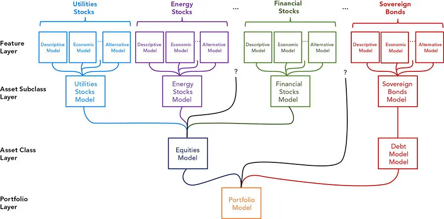
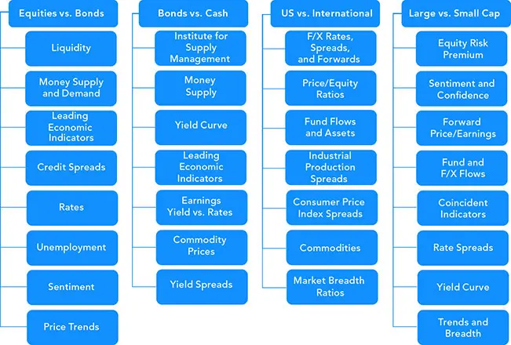
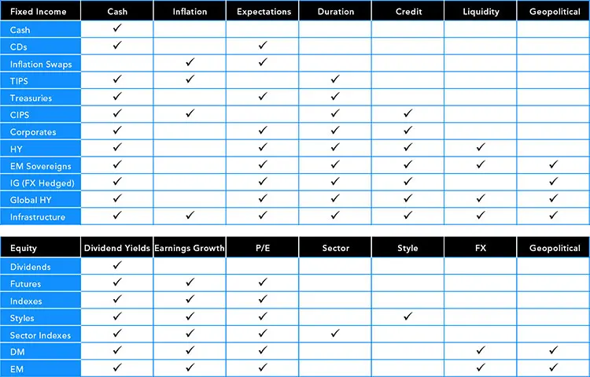
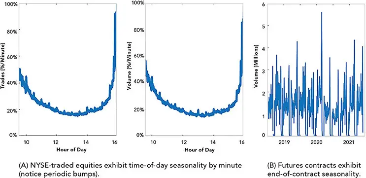
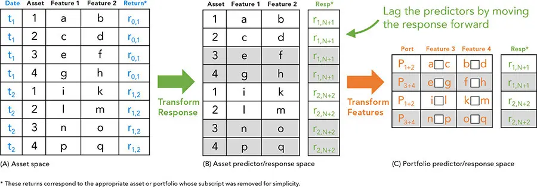

# 金融因子与经济因子

*剥离风险与收益的驱动因素*

在特征选择过程中，分析师通常会最大化预测变量的重要性（importance）与差异性（dissimilarity）^1^。一个精挑细选、规模适中的预测变量集合最为理想，但许多人会挖掘大量预测变量^2^及其各种变体。当大多数特征之间存在交互作用时，识别最有效的预测变量是一项困难的任务。审慎的态度和领域知识对于模型识别显著关系至关重要。

需要特别指出的是，金融时间序列的特征比许多其他类型的时间序列需要更多的谨慎。经济、档案、市场、基本面以及调查数据都需要格外关注，尤其是在为特征提取而对变量进行变换和组合时。例如，机器常常会犯人类本可以轻易避免的错误，而这些错误可能会被算法的规模和速度放大。

实用的代码是丑陋的，实用的因子也是如此。能够盈利的特征往往是小众的、短暂的、技术性的，且通常很复杂。如果策略的优势不是结构性的（例如，专有的客户委托流可能是一种结构性优势），那么优势很可能源自经验、技能、汗水，以及常常包括速度和基础设施。许多优势的来源既耗时又难以获得。如果回报过于丰厚或获取渠道过于宽泛，任何潜在的优势都可能被套利消除，或损耗于摩擦之中。

通过收窄模型的关注范围，并瞄准一个进入壁垒较高、回报适中的市场，就有可能建立起竞争对手不愿轻易触及的优势。大多数交易员都专注于某一特定的投资类别，因为在狭窄领域成为专家更容易。专业化通过增加细致预测变量的数量而使特征维度急剧膨胀，并因维度的增加而阻碍了一般性的、综合性的建模——例如，一位全资产管理者可能对管理基金和衍生品这类非线性资产采取线性外推，而专业投资者则可能使用诸如希腊字母（Greeks）等更精确的因子。

## 特征的复杂性与层级化
金融特征是多维的，难以组织成一个完备的层级或分类体系。量化分析师和策略师必须选择一种适合自身研究的不完美结构。

风格因子（style factor），例如价值（value），其含义可能因经济周期、地理、行业部门或投资类型等特征而异。为管理这些定义之间的条件依赖关系，我们可以把这些因子组织成一棵树，并构建一个对每个维度都设置一层的模型。层级化（layering）比装袋法（bagging）更容易过拟合，但其设计背后的直觉^3^要优于那些不基于理论、虽技术上更严谨的模型。

将特征细分为经济上直观、易于消化且内部同质的子空间，可以通过剔除混杂因素来促进机器学习。模型输出可以被分层叠加，以产生可执行、可解释的建议。尽管将直观的层级化因子类别分层只是众多方法论中的一种，但它的优势在于既能简化复杂性，又能轻松地向门外汉解释。

层级化映射了许多非量化的流程，因此很容易被证明是合理且有效的。通过对许多不同的特征空间应用许多不同的模型，分析师可以聚焦于在每种情形下最有效的做法。这方面的例子包括：用支持向量机（SVMs）处理公司债券，用随机森林（random forest）处理美国大盘医药股，用纵向模型（longitudinal models）刻画市场状态（regimes），用横截面模型（cross-sectional models）进行证券选择。在评估一个庞大而多元的投资工具集合时，没有切实可行的方法可以回避繁复的设计，因此最好拥抱复杂性，并保持一套有组织、系统化的方法来管理它。复杂的模型并不一定难以构建或理解。

即使在图 7-1 这样相对简单的表示中，模型也可以通过多种方式构建，例如对每个资产类别（股票、固定收益、信用等）以及每个类别下的子类（公用事业、能源、金融等）分别建立多因子模型。每个类别和子类模型都可以有自己的响应变量。通常一个因子在每个特征子空间中会被作不同的解释；例如，"价值"对于股票可解释为市净率（price-to-book），对于利率可解释为收益率变动，对于货币则可基于购买力平价（purchasing power parity）。甚至连响应变量也可能随子空间而异。


**图 7-1** 将模型按经济直观的层级进行分层的一种方式


这些模型并不需要多么精巧；它们可以只是信号的简单平均。例如，股票相对债券的决策可以由消费者情绪、原油、美国国债基准、国内生产总值（GDP）和前瞻性盈利预测的平均值构成。

构成指标充满了细微差别和特异性。任何一位经济学家都能如数家珍地谈论季节性、平减指数、链式连接（chain-linking），以及他们日常处理数据时惯用的一大堆其他调整方法。深思熟虑的管理者会在求平均之前施加许多变换，例如 Z 分数（Z-scores）、滑动窗口技术、滞后、阈值、离散化、权重和百分比变化计算。

一个直截了当的预测变量被各种变换反复"拷打"，这是常有的事。在一种相对简单的情形下，分析师可能会用一个 18 个月的年同比百分比变化滑动平均加上 3 个月的滞后来增强某个指标，然后她可能把结果划分为高于 3% 和低于 -5% 两类。这听起来已经够复杂了，但变换流程往往远比这更精细，对金融分析师而言却可能是直觉性的。这种因子规格上的复杂性会在多次常识性的打磨迭代中不断累积。当以最终形态审视它们时，它们可能显得任意而做作。

管理者们常常对成千上万的指标进行数据挖掘，然后对它们进行调优或校准，从而招致过拟合。只有在这之后，这些管理者才用直觉来为实证结果辩护。相反，如果我们从一个具有经济动因的论点出发，再设计处理方法使指标更加显著，那么我们更有可能得到可预测、可复现的结果。

尽管响应变量可以有多种形式，但通常每个模型只会选择一个响应（例如对冲基金用 Sharpe 比率，公司债券用久期乘利差 duration times spread）。在[第 6 章](ch06.md)"特征（Features）"中，我们讨论了如何把目标各异、甚至类型不同的模型组合起来。一个模型的输出可以用作每种资产下一层级分层模型的输入，然后再作为整个组合的输入。许多分析方法都可以应用于这些输出，并在计算回测结果时使用。

正如我们在图 7-1 中所讨论的，一个用于全球宏观战术资产配置（Global Macro Tactical Asset Allocation, GTAA）的、更简单的自上而下决策树结构可以从粗粒度的决策开始，例如股票相对固定收益、货币、商品（FICC）。随着树的展开，每一层中的每个节点都会评估越来越细粒度的分层决策，预测某一资产类别或子类将占优。

当某个建议无法确定、不稳定或不确定时，一个分支便终止。终止节点之上的一层决定了证券选择。例如，如果模型在 EM（emerging markets，新兴市场）节点上无法判断更偏好哪个新兴市场国家，它就终止并把一个 EM 指数作为其选定的证券，从而回避国家选择^4^。响应变量的形式（业绩预测、分类、风险预测等）会极大地影响特征工程的方式。预测普通股方向的指标可能并不适合预测高级债务的违约概率，即便两者涉及同一家发行人。

在单个模型中为响应变量量身定制预测变量很容易，但在管理一个庞大而复杂的模型系统时，人们往往忍不住要尽可能地泛化和简化。分析师可能忍不住对普通股模型和高级债务模型都用同一个 GDP 输入，而实际上可能需要一种更深思熟虑、更量身定制的做法。或者，对收益预测而言，更细粒度的信用评分分类和阈值可能比对违约的预测更有效。例如，在纳入评级数据和信用评分时，转移矩阵（transition matrix）或有向图（directed graph，状态转移图）是常用的工具，在分析零售贷款时尤其如此。

许多看似容易量化的指标其实具有欺骗性的行为属性，比如风险和收益的度量。行为效应可能很微妙；例如，预测动量（momentum）往往由羊群效应（herding）和职业风险（career risk）驱动，并可能以经济状态为条件。预测的自满在扩张期可能更突出，而损失厌恶（loss aversion，即处置效应 disposition effect）在收缩期可能更常见。行为的度量，如趋势和离散度，有助于识别和预测行为。基于代理人的模型（agent-based models），例如那些刻画激励的模型，可以有效地用于建模行为。

## 描述性特征
描述性特征（descriptive features）通过以下方式识别和分类预测变量：

   **类别、注册地及类似类别**，例如资产、类别、数据频率或报告频率

   **地理**（注册地、收入来源、风险来源、供应链暴露等）

   **业务类型**（板块、行业、暴露等）

   **相对指标**（资产、企业价值、市场份额等）

描述性数据可以成为强有力的预测变量，因为它基于领域知识。即便某些标签并不精确，其背后也存在直觉，且他人倾向于据此决策，从而通过羊群效应提升了它们的预测价值。通常，描述性数据变动不频繁，扮演着与统计学中"虚拟变量（dummy variables）"相同的角色。虽然描述性数据可能长期保持静态，但这种数据偶尔会变化或产生误导。例如，行业分类或配置比例看似静态，但通常会随时间变化。这类数据有时只能以"当前值"（最新数据点）的形式获得，而不是点对点（point-in-time）数据，甚至历史时间序列。分析师有时为了方便会让这种描述性数据保持静态。例如，投资顾问在试图从竞争对手那里赢得客户（这被称为*接盘 takeover*）时，客户往往只提供当前组合的持仓，而不是持仓历史^5^。另一个例子是基于持仓数据分析对冲基金的风险和业绩，而这些持仓数据在 13F 申报^6^之间并不变化。许多看似静态的字段（如地理）其实尤为微妙。一个实体的来源可以基于法律注册地，也可以基于与风险、收入或升值最相关的地理区域，甚至可以从公司的供应链中推导。分析的目的和响应变量应当决定预测变量如何定义。与收益方差最相关的地理可能适合某些风险归因，而与销售额最相关的地理可能更适合收入预测。描述性数据常常被简化为单一取值（例如唯一最相关的地理），而实际上按地理配置给出一份更完整的分配清单会更为合适。

## 经济特征
经济特征（economic features）是强调领域知识和直觉的基本面投资者最钟爱的分类。这些特征包括以下类别：

   财政与货币

   政治与贸易

   失业

   生产、产能利用率

   情绪

   通胀

我们曾强调这些统计数据的档案性（点对点 point-in-time）属性的重要性，以及处理后续数据修订（revisions）的迫切需要——应当把修订视为引发了自身响应的后续数据，而不是对先前数据的更正。像商业周期（business cycle）这样的经济统计常常被误认为是易于解释的、资产估值和定价的首要驱动因素。它们既非易于解释，也非显然是收益的驱动因素。经济因子固然重要，但其他更可得、更频繁、更直接的因子在不含其诸多缺点的情况下，已涵盖了它们的大部分效果。大多数经济统计数据频率低、滞后，这使它们只适用于最长的投资期限。而这些长期限往往只是海市蜃楼，因为短得多的评估期就能让长期计划脱轨。

由于经济指标常在交谈和媒体中被描述为收益的驱动因素，它们非常适合用于有说服力的叙事和可解释的模型（图 7-2）。它们可用于分层模型，用以推荐投资工具（图 7-3）。通常需要进行大量的特征工程，例如去趋势（detrending）、波动率调整（volatility adjustment）和 Z 分数。


**图 7-2** 将经济驱动因素与二元投资决策相配对



**图 7-3** 因子转化为投资工具


我们讨论过如何通过简化类别来改进违约风险模型。将投资划分为高收益（high-yield）和投资级（investment grade），而不是众多信用评级，可以突出评级中最显著的特征，使模型更容易预测重要结果。类似地，经济数据用于识别市场状态（regimes）时往往比用作预测变量更有效。

人们已发明了大量流行的去趋势、去季节性（deseasoning）等处理技术，许多经济统计本身就包含需要理解的细微差别和调整。用"一套算法统治一切（an algo to rule them all）"^7^的诱惑十分强烈，但无视世代积累的智慧将是愚蠢的。现代方法能够分析比传统计量经济学方法更复杂的关系。计量方法高度依赖理论，这有助于避免过拟合和伪结果。此外，与基本面会计数据一样，许多经济数字颇具微妙之处，需要广泛的领域知识才能正确分析。

机器学习通过放宽传统模型所要求的一些不恰当假设，能够发现意料之外的关系，但那并不是其最大的价值所在。当前，将机器学习用于经济特征的最大价值，在于用新方法对那些处理起来不方便的数据做出革命性的应用，而不仅仅是用陈旧数据做出渐进式改进。

计算机能够处理并从另类、海量数据中推断结论。它们现在可以弥补传统经济方法的缺点，包括时滞、低频和不准确。此外，手机元数据、卫星图像和其他侵入性数据集都可用来追踪行为。实时预测（nowcasting）技术试图利用在线购买等数据实时预测经济统计。诸如 Gibbs 抽样（Gibbs sampler）^8^等技术可以使用同源指标（coincident indicators，影响该统计的变量）来构造经济时间序列中缺失的数据点。

机器学习的另一个有趣应用领域是因果模型（causal models），由 Judea Pearl^9^及其同行推广。这些模型预测的是因果关系，而不仅仅是趋势。我们将在[第 10 章](ch10.md)中讨论因果模型。

## 跨资产特征
资产之间相互影响深远。这些交互违反了许多简单模型的假设，也是考虑更复杂技术的重要原因。几乎所有资产类别和金融因子都彼此相关，并对以下因素敏感：

   **经济**特征，如发布、调查、预测和修订

   **商品**，包括金属、谷物和能源

   **股票**价格，包括全球指数、板块和地理

   **FICC**价格和关系，如借款利率、期限结构、期权调整利差（OAS）、信用利差和货币

使用最小方差（minimum variance）或互信息（mutual information）等距离测度的生成树（spanning trees），是试图界定影响的众多工具之一。跨类别的特征常被用于择时和轮动（rotation）技术。

## 风格特征
尽管因子通常被精确地定义，风格（styles）有时却更含糊。风格特征的常见例子包括：

   价值（value）与质量（quality）

   期限结构（term structure）与套利（carry）

   动量（momentum）与均值回归（mean-reversion）

   成长（growth）

   波动率（volatility）

   规模（size）

像 Fama 和 French 这样的研究者为其风格给出了精确定义，但不太正式的实践者常常错误地描述他们的工作。例如，"小盘"或"规模"因子通常指 Fama 和 French 的"小盘减大盘（small minus big）"因子（SMB），这远比简单地偏好小盘股要精确得多。在他们 1993 年的论文^10^中，他们描述了一个程序：基于 NYSE 公司 6 月的中位数对股票排序，取三个小盘组合（小盘价值、小盘中性、小盘成长）的平均收益，减去三个大盘组合（大盘价值、大盘中性、大盘成长）的平均收益。

实现细节至关重要，对关系掉以轻心会使模型不稳定且不可靠。复杂性可能妨碍流畅的叙事，但精确性对量化建模和预测是必不可少的。风格因子往往只在特定条件下，或当其取值极端、与横截面度量相背离时才有效。复杂的关系可能扰乱简单模型。

像识别相对价值或趋势这类变换，往往会扭曲或破坏信息。相对、趋势或横截面分析可能抹去那些定义拐点的重要绝对水平。"堕落天使（fallen angel）"^11^效应就是一个很好的例子：同等幅度的一些信用迁移，由于所处的水平不同，其影响可能大相径庭。例子包括从投资级转向高收益"垃圾（junk）"级，或从逾期晚期变为违约。

成长与价值、动量与回归这类迥异的风格常被配对在一起。这些配对旨在扩大机会集合，使管理者能在"开"和"关"两种状态下都产生收益。然而，管理者往往只在其中一种风格上投资才有效。例如，他们可能擅长做多股票却不擅长做空。应在所有模式下测试模型的效力，并在各种条件下归因管理者的业绩。不过，重要的是不要假设没有正向信号就是负向信号，也不要以为做空和做多一样容易^12^。

风格的定义随资产类型而变。普通股和高收益债务的价值度量方式不同。动量在许多资产类别中显著，但均值回归在商品中更为普遍。实践者之所以成功，往往是因为他们找到了一个策略奏效的小众领域，而不是试图寻找一个通用因子或模型。许多成功的交易员专注于某一特定资产类别的某一特定子行业。

一个策略的局限性恰恰可能是它的强项。例如，某一特定小众领域可能为一个中层级的专业管理者提供足够的收入，但又没多到足以吸引顶级专业高手的强力竞争。八九十年代的"SOES 强盗（SOES bandits）"^13^正是基于这一概念构建了他们的策略。

### 股票的价值与质量因子
普通股的价值与质量是最容易识别的风格因子之一。它们通常被视为基本面分析的类比，以及成长的对立面。有多种定义可用来识别低价和良好会计比率（如账面价值、盈利和现金流），但没有统一的标准定义。质量与价值类似，强调强劲可靠的盈利、保守的会计和低负债，但不强调对价格的关注。

识别质量型股票有助于投资者避开那些可能存在严重缺陷的低价股。低价往往事出有因，许多*深度价值（deep-value）*股票因此获得了*价值陷阱（value traps）*的绰号。

尽管对大多数人而言能唤起引人入胜的叙事，但美国价值股可能在长期内表现不及质量股，并伴随令人痛苦的回撤。虽然价值的平均收益可能高于质量，但它更不可靠，具有肥尾（fat tails），尤其是左尾的大额损失。由于业绩的不一致，Morningstar（晨星）等机构已用更完整的因子菜单取代了其更传统的因子（如价值和成长）。

以下是分析师在尝试建立有效模型时所面临的一些关键问题：

**标准。** 会计准则，如通用会计准则（Generally Accepted Accounting Principles, GAAP）或国际财务报告准则（International Financial Reporting Standards, IFRS），可能彼此不可比，并可能给横截面分析带来重大挑战。关于在何处、如何记录会计数据的决策，可能改变价值、收入确认、减值损失等度量，进而影响价值和质量因子。虽然流动的发达市场可以提供更可靠、更易得的数据，但新兴市场和前沿市场的质量溢价（quality premium）却最为丰厚。

**新兴市场。** 在发达市场之外，会计和其他治理丑闻要常见得多，这使得质量因子在提升业绩之外还能降低风险。鉴于治理的重要性，忽略 ESG 投资中的"E"和"S"有时被称为标准的价值和质量投资。对于美国和全球指数，质量指数会同时提升风险和收益，但对于 EM 则在提升收益的同时降低风险。劣质的 EM 股票往往破坏性极大，以至于风险溢价（risk premium）无法补偿其额外风险。关于 EM 和前沿市场机会的未经证实的叙事，可能在这些市场制造不当需求，诱使投资者以负的风险溢价进行投资。低效可能阻碍原本能消除不当激励的市场力量。

**代理冲突。** 在使公司管理层与股东利益一致方面，良好的治理至关重要，包括审查可能被操纵的盈利公告。然而，当公司对回购、借款等某些操作发出令人困惑的信号时，分析可能被扭曲。更令人困惑的是，分析师的推荐有时会受到潜在投行业务交易的影响。当评级机构由其评级的公司支付报酬时，其评级可能被打折扣。错误的预测与那些恰好蒙对的预测一样会被遗忘，而如同神谕般的预言却会被称颂，并成就一番事业。这些代理冲突制造了扭曲的价格。

**不可比性。** 会计比率在跨地理或跨行业之间比较效果不佳。公司、银行和公用事业对竞争（市场份额、创新、生产率）、运营挑战、债务负担和其他约束的反应各不相同。比率的相关性各异，难以比较。资产比率可能对必需消费品、工业和能源更相关，而收入比率可能对公用事业更具预测力。公司的成熟度也会影响比率的相关性和含义，使情境与市场状态同样重要。因子可能并非有序的；例如，成本可能过高也可能过于吝啬，并往往根据发展阶段、板块、行业或地理而大相径庭。

**组合**因子可能引发纠缠问题，可能需要正交归一化（orthonormalization，构造一组既统计无关又归一化的向量）等程序。常见的做法是把投资*分桶（bucket）*到诸如板块这样的类别中，然后用模型从该桶中选出一个子集。通过这种分层，模型可以确保组合中每个桶都有代表。与所有因子一样，组合排序（portfolio sorts）、交易成本、alpha 衰减（alpha decay）、再平衡以及其他实现细节都会影响一个因子是否具有预测力。

### 动量、波动率与成长
动量、波动率和成长很大程度上是行为现象，倾向于或聚集于极端值（肥尾 fat tails 或尖峰厚尾 leptokurtosis）。动量存在于行为预测和其他羊群活动中，包括价格模式、盈利预测、供求等。某些活动（如技术分析）可以创造自我实现的预言和周期——既有良性循环也有恶性循环——从而助长动量和波动率。其他一些机制，如做空规则、熔断器和保证金限制，旨在抑制这些反馈回路，但它们也可能加剧那些无法通过集中积聚需求来稳定的大幅波动（即系统处于亚稳态 metastable）。

波动率也存在于其他风格和因子中，有时被不精确地表述为不确定性。该因子的常见特征包括序列相关（serial correlation）和聚集（clustering）。

均值回归有时被称为"在推土机前捡硬币"，同样可能是行为性的。当一项观测是某一先验分布（prior distribution）的一部分时，也会出现均值回归。当押注均值回归时，可以积累一连串小额利润（卖出保险），但随后可能在一次崩盘或爆炸性上涨中迅速亏损。

Gary Shilling 曾有句名言："市场维持非理性的时间，可以远远长过你我维持偿付能力的时间。"^14^。如果没有恰当的择时，正确就毫无意义；包括市场轮廓（Market Profile）分析在内的许多技术，都试图识别价格模式究竟是某一先验分布的一部分，还是属于一个新的分布——这与瑞利判据（Raleigh's criterion）试图判断两个光点究竟是同一模糊斑的一部分还是两个独立物体颇为相似。

### 套利（Carry）
利率的*期限溢价（term premium）*是最流行的套利交易之一。期限溢价是长期资产与短期资产之间的收益率之差。当长期资产的收益率高于短期资产时，该组合处于期货升水（contango）状态，反之则处于现货升水（backwardation）状态。

结构性力量（如仓储成本和保险）使得大多数资产持有成本高昂，并使大多数期限结构的自然状态为期货升水。简单的工具（如期货合约）可能包含会影响套利收益的复杂嵌入式特征。市场具有适应性，可能会预先反映这些结果，因此常常把未来投资定价得低于更近的投资，以补偿套利成本。对未来事件的预期可能促使投资者和交易员把未来交割定价得低于现货（当前）。货币套利是另一种流行交易，被认为存在持续的套利异常（carry anomaly）。

"通往地狱的道路由正套利铺就。"^15^ 与均值回归一样，套利交易面临的爆炸性反转风险十分显著。当市场恐慌时，很难优雅地退出一笔糟糕的套利交易。

商品套利既有自然目的，也有投机目的。它们可能因操纵性原因（如逼空 short squeezes）而处于现货升水，也可能因结构性原因（如石油需求低迷，导致生产商把油轮停泊在海上等待价格上涨）而处于现货升水。商品生产商是该市场中有影响力的参与者，可能拥有关于其运营的内幕信息。信用套利可以用信用违约互换（CDS）^16^来交易。虽然普通股的股息是一种收入形式，但它们通常不被视为套利。波动率套利通常不被视为独立于波动率因子。

## 资产与市场特征
没有简单的方法能把金融特征彼此拆解开来。归根结底，投资者和交易员必须买卖的是工具，而不是因子。资产与市场特征跨越多种因子，包括：

   **单序列**数据，如收益、价格动量、回归和估值

   **成交量、流动性与杠杆度量**，如买卖价差、信用利差和市场冲击

   **协方差、自相关和多重共线性**

   **关系与交互**，如期限结构和套利

   **行为指标**，如调查和预测、订单流、头寸承诺（投机者 vs. 套保者）和广度

即使是同一类别内的投资，也可能对不同的主要驱动因素作出反应。以固定收益信用为例。提前还款（prepayments）对抵押贷款支持证券（MBS）可能至关重要，而养老金覆盖比（pension funded ratio）和信用利差对公司债券可能更为重要。供给和期权调整利差（OAS）则可能对两者都通用（跨资产因子）。

**领域特定**特征也和其他特征一样存在同样的通病：

   **平稳性（Stationarity）。** 使特征平稳化，例如把货币计价的因子转换为百分比变化。

   **归一化（Normalization）。** 对特征进行归一化，例如把以股数计的数值转换为货币，再计算百分比变化。

   **幸存性（Survivorship）。** 注意幸存者偏差（survivorship bias），例如被重新分配的股票代码。唯一标识符可以解决这一问题，但可能是专有的。

   **保真度（Fidelity）。** 注意大多数变换都会减少因子中的信息，应当作为额外的特征提供。例如，货币归一化会抹去规模信息，因此应当显式地把一个规模特征加入预测变量集。

**假设。** 许多这类类别违反了标准假设。例如，众所周知波动率会聚集。这可以让使用广义自回归条件异方差（Generalized Autoregressive Conditional Heteroskedasticity, GARCH）等特殊模型的预测从中受益，但也会扰乱更标准的模型和联合分布。

**修订。** 使用点对点（point-in-time）数据来分离因子所隐含的经济价值与公告意外（announcement surprise，如盈利反应系数）十分重要。长期的经济价值与短期的公告意外，在效果上类似于市场冲击^17^的持久成分与临时成分。

## 另类特征
*对另类数据（alternative data）的分析是量化研究最具前景的机会。* 传统数据结构良好，常常适用于旧技术。与其与那些把同一数据集折磨了几代的聪明大脑竞争，研究者不如把更灵活、更强大的工具应用于具有非线性或潜在关系的多维数据。

最终，机器或许能在正面交锋中胜过才华横溢的人。与其直接竞争，机器目前可以管理复杂而庞大的数据集。一些另类数据包括：

   **拥挤（Crowding）：** 持仓、看跌/看涨期权比率

   **内部人与公司行为（Insider and corporate actions）：** 注册地、收入来源、风险来源、供应链

   **情绪（Sentiment）：** 预测偏度、修订、文本分析

   **ESG：** 薪酬、董事会年龄和更替

   **另类数据：** 社交媒体、卫星照片

ESG 投资集中体现了另类数据常见的诸多挑战。从这些数据中提取信号很困难，而且社会性投资与正向收益之间是否存在短期因果关系也不明朗。尽管研究表明 ESG 导向的股票具有较好的相对收益，但许多鼓吹"被冷落股票（spurned stocks）"回报潜力的论文，与那些赞颂社会投资益处的论文形成了对照。撇开经济和科学上的争论不谈，ESG 收益的强有力驱动因素是监管惩罚，以及运用财政政策对企业征税或加以刺激。

为了组织和量化社会性度量，人们已经创建了相互竞争的框架，包括全球报告倡议组织（Global Reporting Initiative）、可持续会计准则委员会（Sustainability Accounting Standards Board）和气候相关财务披露工作组（Taskforce on Climate-Related Financial Disclosures）。ESG 数据稀疏、低频、不一致，且历史不长。然而，ESG 主题投资需求旺盛，投资者对业绩不佳也表现出一定的容忍——直至某个限度^18^。

其他形式的另类数据没那么晦涩，已被深入研究，但它们常常使用不便，难以用于预测模型。非结构化数据在许多行业都构成重大挑战。研究者正在创新，既在于如何组织和消费数据，也在于如何评估复杂关系，从而使新型数据变得可用，并以直到最近还难以想象的方式应用数据。

## 执行特征
用于评估和预测执行业绩的许多特征也与其他模型通用，例如周五收盘时间的季节性，或期货合约的换月（rolls）（图 7-4）。其他特征则更与确定最优执行相关，例如*成交量百分比（percent of volume, POV）*或*成交量加权平均价格（volume weighted average price, VWAP）*。


**图 7-4** 执行特征中的季节性


执行特征往往频率更高，需要对大型数据集进行操作。高效地编程和使用专门的工具可能是必要的，以便对那些数量较小时并不繁琐的数据进行透视、分组、连接和其他管理。古老的 UNIX 命令行工具（如 Aho, Weinberger & Kernighan 编写的 AWK、全局正则表达式打印 GREP 和流编辑器 SED）可以出奇地有效，而像 Pandas 这样的较新工具却可能表现不佳。

对于单机无法容纳的海量数据，常采用 MapReduce 等管理技术以及 parquet 等压缩格式进行快速处理。针对大型时间序列优化的数据库（如 kdb+）也很常见。

## 特征条件化与择时
在选择和构造特征时，有诸多要素需要权衡。以下是一些关键的考量。

**择时（Timing）。** 所有决策都或明或暗地涉及择时。投资者被迫对其投资过程的许多方面进行择时。一些投资者不相信可以有效择时；他们把注意力放在投资于某因子的时间长度上，并尽量减小进出场决策的影响。然而，择时效应不可避免。隐性择时者有时否认自己在做择时决策，因为他们的买卖决策往往是不作为或反应的结果。他们可能会声称："我只是买入并持有。"

投资者必须对研究周期、资产配置、证券选择和再平衡频率进行择时。技艺欠佳的投资者应当分散其交易时机并优化成本。这并不是对时间分散化（time diversification）的背书；更高明的择时者会需要更高的速度，并希望最小化 alpha 衰减。机会主义择时（例如让投资决策与资金流或再平衡触发事件相吻合）可能降低成本。仓位规模与择时相关，两者应当一起管理。

择时与技艺之间的关系，以及择时的必要性（即便它很难），是本书的一个主题。使用市场状态来择时的特征择时者，有时把自己视为基本面派而非择时派。即便是认为择时不可能的人，也很可能会说出诸如"经济疲软时，现在显然适合投资必需消费品"这样的话。这些人可能把这类决策视为"常识"，但它们当然是择时选择。

**可解释性（Interpretability）。** 当他人理解并支持我们的方法、信任我们的流程（即"认同 buy-in"）时，投资要容易得多。反对择时的论调很时髦，也难以反驳。

预测市场状态（regime）很困难，但在做实际投资决策时又很难回避。预测天气可能很难，但在出门前瞥一眼窗外或看一下温度计，没有人会因此被嘲笑。不考虑当前状况与历史周期的关系，是不明智的。

基本面派有时会以反直觉的方式偏爱常识胜过科学研究。这是个错误；诸如可得性偏差（availability bias）或赌徒谬误（gambler's bias）等偏差，可能导致人们误判事件的概率。一项基于条件变量（conditioning variables）的、有理有据的科学研究，是反对无视市场状态或凭直觉猜测的有力论据。

**状态择时（Regime timing）。** 状态择时通常采取的形式是：根据某个预测变量自身或另一预测变量的状态对其进行条件化。经济学家为此在回归模型中使用"虚拟"指标；在机器学习中，类别变量可以达到同样的效果。状态可以是结构性的或季节性的。它们可以用于预测收益或风险（回归），也可以用于分类和描述（classification）。

**风险因子（Risk factors）。** 对风险因子进行择时通常比对收益因子择时更容易。风险因子往往不呈现趋势，且方差比收益因子更大。套利它们的方式也更少。通常，一个风险性事件是预先安排好的，例如一次重大决策节点（如选举或美联储会议）。决策的方向可能难以预测，但价格波动的风险可能更可预测。完全可以用一个风险因子来产生收益预测。

**因子择时（Factor timing）。** 投资者常常使用市场周期、波动率或某种类似的直觉性驱动因素来对因子择时。这些投资者根据所感知的驱动因素状态，判定某些因子或资产类别更为可取或不可取。

因子择时可能是有目的、值得做的，但并不容易。"尽管有人把因子择时称作简单的常识，但究竟是否应当对因子做价值择时，[鉴于低频数据和反向投资者，]这点完全不清楚。"^19^。评估择时十分复杂，涉及与成本和衰减的权衡，以及分散化程度的降低。单个因子的表现可能随时间变化（例如随经济周期变化），而这种时间依赖性可能会降低对因子进行择时的收益。

**少数类数据（Minority data）。** 把重大变化与大幅异常值区分开来，尤其常见且尤为困难。状态转换检测模型（regime shift detection models）就试图做这件事，例如使用滑动平均交叉来识别趋势的开始或结束。如果一次重大转换被识别出来，它可能是一个投资机会或一个对冲警示。然而，太晚才识别的转换——或根本不存在的转换——会诱发最糟糕的投资选择。在极端价格波动之后去杠杆或对冲，如果市场"急剧反弹（snaps back）"，可能造成巨额损失。

**稳定性、及时性与准确性之间的权衡。** 不同的投资者可能偏好稳定性和准确性（零售客户），或偏好及时性（高 alpha 交易员）。如果稳定性和准确性不可靠，那么识别*可信状态（trust regimes）*可能更为重要。例如，我们可能更愿意在因子可靠时使用相关条件（一个"目标丰富 target rich"的环境），而不是去找机会本身。在实施风格轮动或投资于多位管理者时，识别何时偏爱某一方胜过另一方是至关重要的。

可信状态可以通过多种方式识别，包括使用置信度度量（显著性检验）或信号（强度和持续性）。一旦识别出来，这些状态就可以用来调整投资的频率和规模。在这样做时，重要的是要折算偶然性的影响。人们已发明了许多方法，包括 Michaud 的重采样技术（resampling technique），用以管理估计误差中的不确定性。Fama-MacBeth 回归可以通过对每个因子的收益与风险溢价 beta 进行回归，提供考虑横截面相关性的标准误。与许多线性技术一样，Fama-MacBeth 回归不适用于自相关数据或相关因子；聚焦于残差是一种变通办法。

**反向主义（Contrarianism）。** 反向择时是回撤控制（drawdown control）的反面。它涉及选择一个要回避的机会，或者对某个异常值下反向的赌注。这可以通过把某个因子与近期历史作比较，并预期其回归某种趋势来完成。简单的反向方法可能对同一因子使用 Z 分数（单变量 univariate）。其他方法包括构建平价收益率曲线（par yield curve）并将价格与一项无套利投资作比较，但这些方法并非万无一失。Z 分数可能因结构性转变而偏宽，而平价曲线本身可能漂移，使一只定价糟糕的债券失去其错误定价。

### 商业周期
商业周期（business cycle，参见[第 6 章](ch06.md)图 6-10）是条件化因子（conditioning factor）的典范范例，却也声名狼藉。它既难以度量，又难以用作预测变量。尽管如此，它几乎被普遍视为一种直觉且可解释的预测变量。实时预测（nowcasting）已几乎消除了低频经济发布这一障碍。剩下的问题可以拆成两步——预测商业周期，以及预测它的影响。

经济学家在预测商业周期的当前状态及其近期走向上投入了大量心血。他们的预测可以替代预测模型，或者替代一个使用失业率、工资、利润、情绪和住房等特征的自建模型。有些指标比其他指标更及时、更具前瞻性、对大幅修订更具韧性，但所有指标都有各自的告诫与微妙之处。预测商业周期是一个艰难且已被反复研究的问题。

通过把周期阶段和它的影响这两者分离开，研究者就可以专注于在已知商业周期条件下预测资产的反应。根据在商业周期中所处的位置，可以选择资产类别、板块，甚至具体的资产本身。根据商业周期阶段调整投资，常常被称为*轮动（rotation）*，如因子轮动、资产轮动、板块轮动等。决策树和分层模型（见图 7-1）可以把许多子模型（既有简单的也有精巧的）组合起来，产生一个综合的轮动方案。

### 长期状态
与周期和季节性一样，长期（secular）或结构性状态与趋势，是分析过程中重要的条件。在 1997 年亚洲金融危机之前，国际股票曾分散美国股票组合的风险，但此后分散作用减弱。新兴市场股票的系统性因子影响力曾显著下降，却没有出现清晰的状态转换，这表明识别从一种状态到另一种状态的过渡有多么困难。

### 组合排序
深思熟虑地组合投资很重要。许多技术都行之有效；例如，常见的做法是用显著性检验（如 Student 的 t 检验）按其主要驱动因素对资产分组，然后基于业绩对每组内的资产进行排序。可以构建对每组中收益最高资产持正暴露、对收益最低资产持负暴露的组合。这种技术有许多变体，包括使用 Z 分数。

时间序列需要特殊技术，并涉及繁琐的限制。如果我们能认为时间序列是平稳的，就可以通过对响应变量作变换来移除时间依赖性（专栏 7-1）。


与其使用即期收益（图 7-5A），我们可以使用一个周期性收益（如三年期收益），并按图 7-5B 所示去掉时间特征。具体做法是：用从下一时点开始的多期收益替换每一行的单期收益，从而去掉 Date 列。要注意，响应样本期必须从收集预测变量之后开始，以避免前视偏差（look-ahead bias）。

把相似的资产组合起来可以抵消预测变量的方差，并通过把每个日期下资产 1 和 2 的行、资产 3 和 4 的行合并来改善预测结果（图 7-5C）。在该图中，资产指数被组合名称取代，用于合并预测变量的运算用一个空方框表示，不同的特征可能采用不同的运算。如果操作不当，排序可能用到样本内信息，从而产生前视偏差。



**图 7-5** 从资产空间到预测变量/响应空间的映射


## 因子效力
与大多数金融争论一样，学术论文对因子究竟是有效还是无效众说纷纭——无论是在孤立情形下、在被配置时、在被分散时，还是被择时时。众多的选择包括如何：

   **选择**因子（指数、合成、动态等）

   **实现**它们（因子倾斜 factor tilting、纯因子等）

   **组合**它们（朴素、优化等）

   **解释**和归因风险与业绩

所有这些选择都使得各研究之间难以比较，而且盈利的策略有很强的动机在基金的门后执行，而不是见诸论文。交易员利用那些稍纵即逝的微小机会，如资金流和合约细节。因子常常出于使其盈利的同样原因（例如低成交量抑制了竞争）而被排除在研究之外。

论文和博客常常通过忽略成本、费用和其他减损项的拖累，而高估其策略。唱反调者则通过不承认在支付这些费用、薪水、租金和其他成本之后仍能盈利所需的努力与技艺，来嘲讽主动管理。

## 机械式变换
几乎所有投资都可以部分地用某种确定性关系或因果模型来解释。这里我们指的是一组具有真实过程、使一个事件引起另一个事件的关系——而不是统计上的趋势。通常，这些结构性关系会被供求等技术性因素暂时打断，但随着时间的推移，可被纯粹套利（pure arbitrage）所强制执行。

一个简单的例子是美国国债的收益；如果债券被持有到期，收益可以实现，但如果在到期前出售，则不保证。还有更多复杂的例子，例如美国国债期货合约的收益，它需要评估许多关系，包括套利（carry）和五个嵌入式期权^20^。甚至连债券本身在到期前的当前定价，都可以用各种利率（联邦基金、互换、远期、国库券、期货、中期国债、长期国债）从一组复杂的关系中推导出来。这些利率可用于拔靴（bootstrap）出一条利率曲线，然后对债券分解后的现金流建模，以确定其公允价值（fair value）。虽然该债券可能永远不会"被清理干净"并定价于公允价值，但它可以被剥离并作为各部分出售，或者其现金流也可以从其他来源组合起来、合成地重建这只债券。这样，机械式的关系就可以通过套利被强制执行。当然，这些关系存在于大多数资产类别和大多数工具中。

对于非流动资产的因子以及重采样所需的方法，可能需要进行调整，以弥补缺失数据和少数类数据。有许多变换试图通过调整报告滞后、时间加权收益与流量加权收益、幸存者偏差、评估偏差（appraisal bias）以及低频对收益的影响等，使这些数据更具可比性。

金融和经济特征本身就是一个独特的类别，具有特异性（idiosyncratic）和动态性的细微差别，难以一概而论。领域知识既宝贵又昂贵，包括为机器训练对这些数据集进行标注。良好的量化资产管理需要对金融特征进行细致的研究、变换和条件化。

1. 正如现代投资组合理论（modern portfolio theory）和主动管理基本法则（fundamental law of active management）同时强调业绩和协方差一样，特征应当信息丰富，但又彼此不同。

2. 在某些学科中，特征的数据挖掘是受到鼓励的。投资者对过拟合和伪关系怀有健康的恐惧。一个简洁、可解释、可说明的特征集，能培养对金融模型的信心。

3. 许多嘲讽使用基本面因子的量化模型的投资者，其选择投资的方式与量化从业者几乎相同，却没有系统化的好处。以一种为基本面分析所熟悉的方式来设计和解释模型，可能提高量化方法的接受度和采纳率。

4. 本书网站 [www.QuantitativeAssetManagement.com](http://www.QuantitativeAssetManagement.com) 提供了一个案例研究。

5. 我们在[第 4 章](ch04.md)讨论过与 Russell 3000 相关的类似*幸存者偏差（survivorship bias）*问题。

6. 这在[第 2 章](ch02.md)中已有简要讨论。

7. "One Ring to rule them all"，出自 J.R.R. Tolkien，《魔戒：魔戒现身》（The Lord of the Rings, *The Fellowship of the Ring*），1954 年。

8. 本书网站 [www.QuantitativeAssetManagement.com](http://www.QuantitativeAssetManagement.com) 提供了一个案例研究。

9. bayes.cs.ucla.edu/jp_home.html。

10. Eugene F. Fama 与 Kenneth R. French，"Common Risk Factors in the Returns on Stocks and Bonds"，《Journal of Financial Economics》第 33 卷第 1 期（1993 年），3–56 页。

11. 堕落天使（fallen angels）已在[第 4 章](ch04.md)中讨论。

12. 做空将在[第 17 章](ch17.md)中讨论。

13. Harvey I. Houtkin 与 David Waldman，《Secrets of the Soes Bandit: Harvey Houtkin Reveals His Battle-Tested Electronic Trading Techniques》（McGraw-Hill，1998 年）。

14. 常被归于 John Maynard Keynes，但更可能最先由 A. Gary Shilling 说出，引自 Coke Ellington，"Economist Advises Change in Investment Strategy"，《The Advertiser》，1986 年 12 月 3 日。

15. 这条市场格言与这样一种收入的诱惑有关：它既短暂，又可能被贬值所吞没。

16. 与所有合成对冲和复制一样，应当十分小心地确保协议对其预期目的是有效的。例如，瑞信（Credit Suisse）的其他一级资本债券（即 AT1 债券、或有可转换债券 contingent convertible bonds，或 CoCos）在与 UBS 合并时被减记至一文不值，令许多投资者大为震惊。

17. 更多内容请参见本书网站上的盈利意外案例研究：[www.QuantitativeAssetManagement.com](http://www.QuantitativeAssetManagement.com)。

18. 其他人，尤其是那些在化石燃料和其他 ESG 评级较低的业务中具有经济利益的人，可能为非 ESG 产品支付溢价，或试图阻止 ESG 投资。

19. Cliff Asness，"Factor Timing Is Hard"，AQR，2017 年 3 月 15 日，<https://www.aqr.com/Insights/Perspectives/Factor-Timing-is-Hard>。

20. Galen Burghardt，《The Treasury Bond Basis: An In-Depth Analysis for Hedgers, Speculators, and Arbitrageurs》第 3 版（McGraw-Hill，2005 年）。
