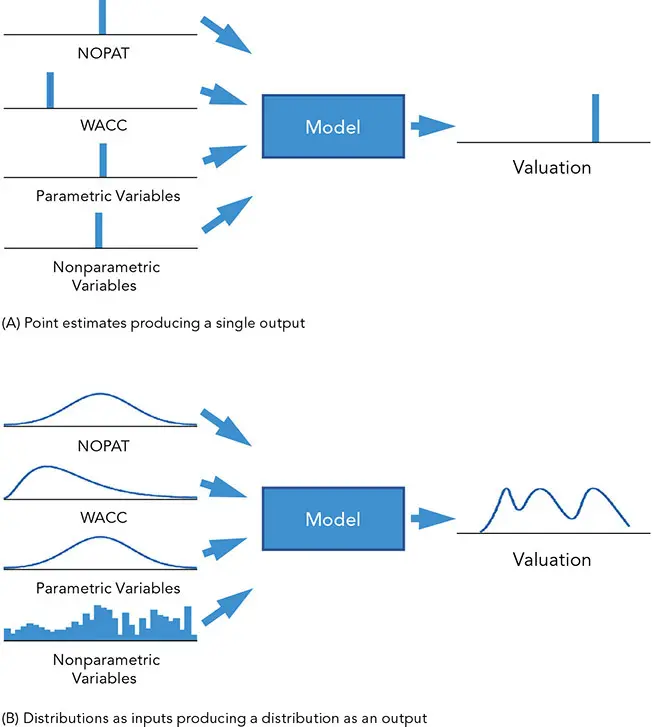
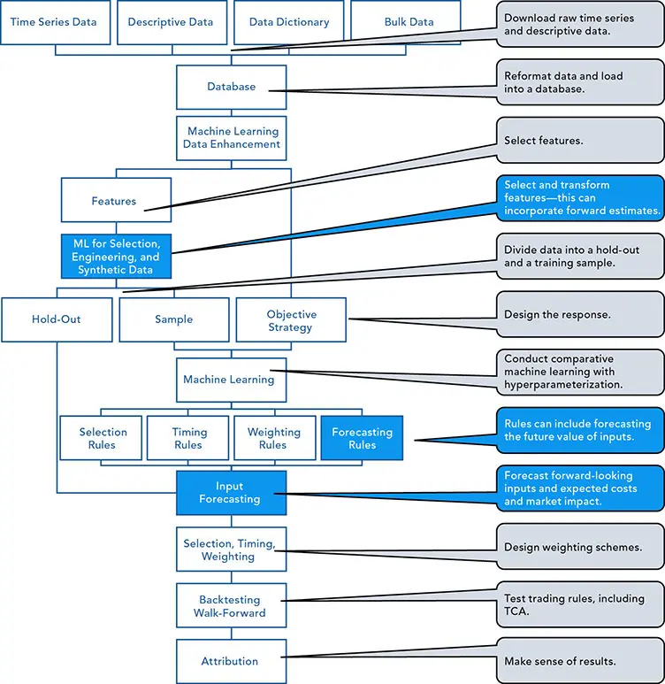
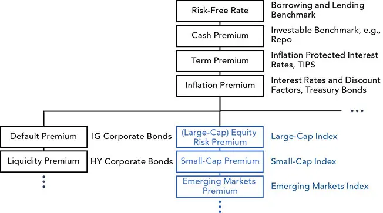

# 构建因子预测

*向前看，而非向后看*

投资价格具有适应性（adaptive）、动态性（dynamic），并且建立在人类行为之上。投资者会预期未来并调整价格以反映他们的预测，而当某位投资者的预测与市场预测之间存在可货币化的差异时，机会便随之产生。

我们都会承认预测是一件困难的事。然而，正如 George Cox 的名言所说："所有模型都是错的，但有些是有用的。"^1^ 我们的目标不在于正确，而在于有用。借助稳健的资金与风险管理（risk management），即便只是微弱的优势（edge），在被恰当利用时也能带来丰厚的回报。

过去以及近乎当前的因子值（factor values）有时可以以回溯（backward-looking）的方式加以使用，以确定最佳的投资方式。反推估值（backing out valuations）要求历史是未来值的合理估计。尽管市场隐含（market implied）的估计很少足够好，但它们可以作为一个良好的起点。^2^ 估计误差（estimation error）可能压倒复杂的方法，使得最有信心的结果可能是过拟合（overfitted）的。因此，尽管预测方法可以很先进，但在实践中它们往往并不复杂（尽管看起来很复杂），例如一个使用收缩（shrinkage）的滚动指数加权移动平均（exponentially weighted moving average），窗口视流动性而定取三年或五天。我们之前已经讨论过，简单直观的改进如何累积成上一句中那样复杂而晦涩的表达。

研究者在尝试让历史数据具备前瞻性（forward-looking）时可以发挥创造力。有时，这可能意味着将基于时间序列（time series）的单个因子风险溢价（risk premia）与横截面（cross-sectional）平均值相融合。在某些情况下，可能需要采用间接方法，例如通过模拟一个卖出 S&P 500 看跌期权（puts）的策略来近似波动率（volatility）。

尽管外推（extrapolation，在营销话语中有时被称为动量（momentum）或"领导力"）是在将过去数据应用于未来估计时最常见的假设，但有时结果却恰恰相反。均值回归（mean reverting）的市场（以及管理人未来业绩与过去业绩负相关的倾向）是动量的明显例外。好运与厄运的影响会随时间推移而减弱。高价格往往带来糟糕的业绩。

预测未来值优于依赖历史，而更优的是预测每个因子的未来值分布（distribution）。有了因子分布，分析师就可以推导出策略预期收益的前瞻性分布（[图 8-1](#figure-8-1)）。^3^ 这里有许多机会可以调整模型输入，使其更具前瞻性、纳入公司观点，或进行情景测试（test scenarios）。[图 8-2](#figure-8-2) 突出了其中的若干环节，并将它们置于一个投资框架之中。

**图 8-1** 输入的点估计（point estimates）所携带的信息很少；分布所含的信息要多得多。

**图 8-2** 因子预测（factor forecasts）可应用于投资过程的多个阶段。

系统化预测（systematic forecasting）可以作为特征工程（feature engineering）过程的一部分。如果是这样，务必将其同时纳入样本（sample）和保留集（hold-out）之中。^4^ 临时的、主观的、未预期到的或人工的预测，则只能由分析师、投资组合经理（portfolio manager）、经济学家和投资委员会在后期应用，以改进模型所使用的信息。许多流程需要难以预测的主观输入——即便是事后看来也如此——例如母公司投资委员会的公司观点（house view）。^5^ 如果某项输入是流程的一部分，并且可以以一定的准确度加以估计——借助某种远见或行为启发式（behavioral heuristics）——那么不完美地对这一临时输入建模，也胜过完全忽略它。尽管"偏离脚本"（off script）的诱惑难以抗拒，但人为干预已导致许多系统化基金失败，因此对带有偏离和不带偏离分别建模会很有启发。对主观输入（董事会授权）或下游修改（投资顾问调整）的敏感性，可以为执行团队设定护栏（guardrails）和预警信号。

有可能将先验观点（prior views）作为因子纳入（例如将历史资本市场假设（capital markets assumptions）作为一个数据序列使用），但可能无法知道未来观点将如何不同于系统化预测。一个令投资者意外的未预期主观观点的典型例子，是 Fidelity Magellan 更换管理团队一事（在[第 2 章](ch02.md)和图 2-4 中讨论过）。尽管预测和观点作为估值（valuation）、alpha 和风险预测的输入至关重要，它们也可以通过调整朴素模型的输入，或通过使用基于贝叶斯推断（Bayesian inference）等观点感知模型（view-aware models），来影响资产配置（asset allocation）的计算。

投资中一个有用的范式是简化分析。我们可以缩小可及机会的集合，然后分离出有趣且可操作的关系。如果审慎且可负担，我们可以对冲（hedge）或分散（diversify）不需要的风险。这些组成部分通常被视为投资决策的动因，但也可以通过对资产配置或投资业绩进行逆向工程（reverse engineering）来确定。实现这一目标的一种方法是计算隐含值（implied values）和逆向优化（reverse optimization），我们将在本书后续讨论。

在本部分中，我们讨论了：

- **资产（Assets）**——数据的细微之处，以及数据的来源。

- **特征（Features）**——如何让数据更加显著（salient）。

- **金融与经济因子（Financial and economic factors）**——如何识别风险与业绩的某些驱动因素。我们可以通过降维（dimension reduction）、分类（classification）和回归（regression）等统计方法来实现这一点。我们还运用经济学概念和类别，从结构上识别驱动因素。

在接下来的篇幅中，我们将讨论如何进一步发展我们的因子，使其具备前瞻性。

## 资本市场假设

在做出关于资本市场的假设时，有三个关键概念需要牢记：

- 善用资源

- 不要"重复造轮子"

- 关注竞争优势（competitive advantage）

经济学家会做出预测，并定期发布其资本市场假设（capital markets assumptions）、展望和调查。这些项目所需的技能和成本相当可观，而大多数投资者都能从资本更雄厚机构所制作的预测中受益。

与其他多数金融从业者一样，经济学家表面上可能优先追求准确性，但其实际激励往往是受欢迎度（popularity）。^6^ 准确性和精确度可以针对外部或内部预测进行排名。内部排名有时被称为 *alpha 捕获（alpha capture）*。

第三方预测可以避免"独自犯错"（alone and wrong）的窘境。^7^ 但依赖外部预测会使发现机会变得更加困难，因为竞争对手也能获得相同的信息。与众不同往往比更聪明更好，尤其是当销售比可重复、可靠的业绩更重要、而记忆又短暂的时候。

信息可能不足，或成本高昂得令人望而却步。无论是零售还是大型投资者，常常发现有必要自行开展研究。我们的经验是，一旦一家零售投资公司管理规模达到约十亿美元，其规模就足以将自己机构化，并聘请一位合格的首席投资官（chief investment officer）。机构通常有自己的公司观点（house view），有些还会将其强加于其管理人。在另一些情况下，管理人的观点和自营交易研究与国库、机构和零售研究是分开的。

出于商业原因，大多数以客户为中心的公司觉得有必要向客户提供自己的研究，以与竞争对手区分开来——即便这会损害研究的投资价值。那些拥有强大文化和严谨科学流程、以业绩为驱动的公司则不言自明，无需这种"装饰门面"（window dressing）。

经济学家的预测通常不频繁。人们已经设计出许多方法来在报告日之间更新预测。用新信息更新先验信念的贝叶斯方法（Bayesian methods）很有效，而因果模型（causal models）也正在崭露头角。

借助类似于引导收益率曲线（bootstrapping a yield curve）、求解联立方程、连接函数（copulas）或用于优化的相对约束等方法，可以从看似无关或不足的信息中创造出有价值的预测。简单地将预测关系按两两方式排序，以构建一个不完整的距离矩阵（distance matrix），就能产生令人瞩目的结果。^8^ 估计一个价差（spread）或变化量通常比估计一个绝对水平要容易。例如，回答"洛杉矶离纽约比芝加哥更远吗？"很容易。但回答"洛杉矶与纽约之间相距多少英里？"可能就更困难了。专家系统（expert systems）、alpha 捕获和元预测（meta-prediction）可用于评估并合并来自不同来源的众多预测。另类数据（alternative data），包括网络发帖、在线零售价格、船舶追踪、停车场的卫星图像以及储油罐的阴影，都是增强和更新预测的行之有效的方法。始于 2008 年的十亿价格项目（Billion Prices Project）就是一个绝佳的例子。

有效的预测方法需要勤勉的测量与评估。存在许多评估方法，如 Diebold-Mariano 检验。参数不确定性（parameter uncertainty）、离散度（dispersion）以及其他总体指标也能为预测技能和可靠性提供有价值的洞见。

## 战略预测

毫不意外，战略预测（strategic forecasts）会影响战略配置决策。它们遵循长期的世俗趋势（secular trends，或超级周期 supercycles），例如全球化、人口老龄化和技术的影响。这些主题不必是外生的（exogenous）；生活规划，例如购买房屋或教育等大额支出的需求，也能影响战略计划。

战略决策可能与资产的固有性质相关，例如结构协方差（structural covariance）、机制性关系（mechanistic relationships）、波动率或反周期趋势（countercyclical trends）。它们应当反映核心信念和跨周期估计（through-the-cycle estimates）。应强调在战略区间上平均后保持不变（invariant）的特征。区间内关系（如协方差）应当是战略预测的焦点。

较长的样本期可能会产生误导或不恰当。例如，体制转换（regime changes）和评估区间的评估常常被错误计算。尚不清楚在这一长时期内观测值的性质是否发生了变化。漫长的历史不可避免地包含许多令人质疑的缺陷，包括：

- **体制转换（Regime change）。** 一个例子是，当前发达市场是否在这一时期内的某个时点由新兴市场演变而来。

- **估计偏差（Estimation bias）。** 这是指数据质量的变化，例如部分使用估计或稀疏数据，而其他部分则使用高流动性数据。

- **幸存者偏差（Survivorship bias），或为控制它而做出的妥协。**

- **加权方案（Weighting scheme）。** 这可能意味着要么忽略不平衡，要么施加一种偏差，例如按时间进行指数加权，以尽量减少差异。

- **框架效应（Framing）。** 起始日期会对结论产生重大影响。

- **政府干预（Government intervention）。** 财政或货币政策可能影响结果。

- **主导趋势（The dominant trend）。** 它是线性的还是正在触底？尽管近期历史并非如此，但利率很少降至零以下。

- **相关趋势（The relevant trend）。** 700 年的趋势显然不适用于一个实际的投资组合，而即便是 60 年的平均值，对一个投资管理人的考核期而言也太长了。

对于较短的战略区间，长期的周期效应可以被纳入战略预测。诸如通胀等广义经济变量可能被视为周期性的，但其变化可能足够缓慢，以至于能够影响战略决策。以通胀为例，20 世纪 60 年代中期至 80 年代初期代表了一个体制，小时薪资增幅在 5½% 到 8½% 之间。80 年代中期至 2020 年则经历了大约 1½% 到 4½% 的区间。在这些较长的趋势之内，可以考察更小的周期以做出战术决策。微小的影响在长期内可能变得举足轻重。通胀、费用和税收等单边拖累因素（one-way drags）会对回报产生毁灭性的影响，并可能随时间大幅变化。

经济变量并非战略分析中使用的唯一特征。市场变量，如佣金和买卖价差（bid-ask spreads），以及通常被认为相对稳定的数据类别，如地理或信用评级，在战略期间也会发生变化。

某些关系可能很稳健，例如债券的自相关性（autocorrelation）；而另一些则难以预测，例如股票的自相关性。即便是那些被视为经验法则（rule of thumb）的关系，如违约回收率（default recovery rates），在战略预测中也需要被视为变量。

一些关系，如相关性（correlations），与其他变量（如波动率和流动性）相关联。这类指标往往对不可预测的事件做出反应。与其进行困难的预测，不如使用收缩（shrinkage）等变换，有时能让模型对估计误差和大的方差不那么敏感。

## 战术预测

预测当前事态的未来走向，对大多数投资者而言是一个无法抗拒的话题——即便是那些嘲笑量化预测和择时尝试的投资者也不例外。与交易不同，战术投资通常建立在外部周期和主题的预测之上。商业周期（business cycle）和利润周期（profit cycle）是鸡尾酒会上闲谈和战术决策中最显著的两个驱动因素。与大多数定性方法一样，基本面主义者（fundamentalists）典型的"证据分量"（weight of evidence）论证只不过是贝叶斯分析的一个不够精确的版本。这些预测（数量、方差和置信度）随后被用于在允许的区间或范围内轮动行业和资产类别、选择投资，或倾斜政策配置。

风险溢价（Risk premia）不过是投资者因承担某项投资特定风险贡献而预期要求的边际回报（溢价）。推动跨资产类别配置的风险溢价的一些例子包括：

- 经济增长对盈利和估值的可能影响。财政和货币政策以及其他经济指标可能促使管理人改变一家公司的风险敞口。通胀可能使实物资产（tangible assets）更具吸引力。

- 变动的利率对贴现因子（discount factor）估计的影响。收益率曲线（yield curve）的形状可能影响固定收益决策。

- 现金余额、信用价差（credit spreads）和持有收益（carry）在使信用投资更具或更不具吸引力方面的影响。

- 政治和自然事件对大宗商品供需的可能影响。

预测这些状态只是构建战术投资方法的第一步。投资市场为了预期未来事件而不断调整价格，这是应用特征预测之所以充满挑战的原因之一。仅仅预测一个事件是不够的；我们还必须预测对该事件的反应。^9^ 有时，目标配置会是一个战略目标，而区间允许为战术性押注或执行现实而偏离。政策组合及其区间大小通常通过正式流程确定，可能需要董事会批准；它们常常被写入投资政策声明（Investment Policy Statement，IPS）。

## 风险溢价

风险溢价利用了一个假设：理性的投资者不会在没有补偿性激励的情况下增加自己的风险。

**测算。** 多种力量可能决定风险溢价。广义而言，有五种方式来确定价值以抵消风险的边际增加：

- 对市场参与者、学者或公众进行的**调查（Surveys）**。

- **历史回报（Historical returns）**和经济指标，它们是现成的数据来源，例如公司债券收益率减去国债收益率。它们可以在没有结构性影响的统计模型中使用。文献往往将这些事后的（ex post）风险溢价与事前的（ex ante）风险溢价混为一谈。尽管这种简化的观点有其用处，但我们更感兴趣的是识别市场所隐含的前瞻性预期，而剔除市场力量的噪声和污染。

- 基于通胀、收入（股息）和增长（盈利）等变量的**供给侧模型（Supply-side models）**。

- 利用投资者偏好来确定所需回报的**需求侧模型（Demand-side models）**。

- 结合上述几种方法的**混合模型（Hybrids）**。

**挑战。** 这些方法可能存在重叠。回报和经济数据既被用于确定供给侧模型，也被用于需求侧模型。所有这些模型都面临金融与经济时间序列共有的挑战。关于这些激励具有可加性的理论和假设尚存争议，但这一近似是有用的。许多其他挑战仍未解决。例如，非平稳性（nonstationarity）会使漫长的历史变得令人困惑而非有所助益。常见的混淆因素（confounders）同样适用，例如：

- 季节性（Seasonality）

- 趋势（Trends）

- 发表偏差（Publication bias）

- 自回归（Autoregression）

- 多重共线性（Multicollinearity）

- 不规则分布（Irregular distributions）

- 非平稳性（Nonstationarity）

结果是，估计可能五花八门。学者们继续寻求一种统一理论，例如将*股权风险溢价*（equity risk premium，ERP）、债券价差和房地产 cap rate 联系起来，这试图整合所有可能的情况，使一个本就困难的问题变得更加困难。借助风险溢价的可加性，Ibbotson 和 Seigel^10^ 设计了一种便捷而直观的"积木式"（building block）方法。他们描述了大多数资产的预期回报；例如，现金投资的风险溢价由通胀和实际无风险回报率（real riskless rate of return）组成。股票和债券需要额外的"债券期限溢价"（bond horizon premium）。股票还享有"股权风险溢价"。

对于方向相反（wrong-way，如流动性不足）或特别令人不悦（如税收）的溢价，理性投资者会要求更多补偿。风险厌恶（risk aversion）、经济状况和投资者财富等行为影响加剧了重大的数据挑战。大多数数据来自幸存者群体（例如美国^11^）。漫长的历史包含截然不同的特征，例如美国在早期、幸存性尚未确立之前的新兴市场因子，以及在此转变之后展现的发达市场特征。

**风险溢价之谜（The risk premium puzzle）。** 当学术界接受了某种理论（如风险溢价），而现实并不配合时，它便被大胆地称为一个"谜"（puzzle）或"悖论"（paradox）。这些模型和估计的缺陷构成了这个谜，而并没有好的答案。然而，在思考风险溢价的变化时，这些模型提供了一个用于预测的框架和共同语言。

**溢价的类型。** 与行为启发式一样，几乎每一种回报变动的来源都有一个以之命名的风险溢价。为方便起见，我们将使用积木式框架讨论几个较为常见的溢价。与所有实用的事物一样，[图 8-3](#figure-8-3) 中所示的层级很快就会变得支离破碎，并与可转换债券（convertible bonds）等交叉产品以及交互效应（interaction effects）相互交织。这些溢价中很少有独立的，它们的影响很可能是非线性的。尽管如此，积木式方法仍是一种有用的组织工具和框架，可在对风险和回报做出不确定预测时用于估计影响。

**图 8-3** 风险溢价层级树（hierarchy tree）的开端

## 固定收益溢价

有几个因素决定固定收益溢价（fixed income premia）。以下是一些应当考虑的关键要素。

**无风险利率（Risk-free rate）。** 由于贴现（discounting）是所有估值的内在组成部分，所有估值的基础都包括高度可变的无风险利率。尽管它如此根本，无风险利率却是三场争议的源头：

- 一些人对它"无风险"假设的*有效性（validity）*提出争论，尤其是在政治边缘博弈（brinkmanship）威胁违约之时。

- 另一个争议是该利率的*期限（tenor）*（应与投资期限相匹配），因为无风险利率不应有再投资风险（reinvestment risk）。

- 对实际利率进行*平减（Deflating）*也会带来选择和困惑。

**期限溢价（Term premium，利率）。** 在为估值而贴现现金流时，我们需要知道不同借贷期限所对应的利率。^12^ 要将无风险利率扩展为一条无风险曲线，我们需要估计*期限溢价*。如果确定无风险利率的方法定义良好（例如使用美国主权债务并加以公式化调整），期限溢价可能就不那么具有争议性。但这并非易事，因为实际的投资工具受到大量特殊性的污染，例如：

- **供给（Supply）**（发行和剥离）

- **需求（Demand）**（on-the-run 与 off-the-run，季末等特殊日期）

- **计日基础（Day-count）**与节假日

- **特殊性（Specialness）**（独特的借贷利率）

其中一些问题以及其他问题在我们关于评估持有收益（valuing the roll）的讨论中（[第 5 章](ch05.md)）已经涉及。使用一种称为引导（bootstrapping）的方法，我们可以通过组合不同的投资工具、去除偏差并分解利率来生成期限溢价。^13^ 与股票不同，利率有明确的支付时间表。因此，它们的方差主要由三个期限结构（term structure）或收益率曲线（yield curve）参数来解释：

- **水平（Level）**、收益率或回报（PC1）

- **斜率（Slope）**或期限（PC2）

- **曲率（Curvature）**（PC3）

久期（Duration），与期限类似，是利率的一个主要风险因子。不同久期的票据在风险上可能差异巨大。投资顾问常常通过用股票百分比来描述组合风险度量，从而过度简化组合风险。

尽管大盘发达市场股票指数具有相似的因子类别，固定收益指数却并非如此。固定收益指数在久期和信用价差方面差异显著。这些属性也会随时间变化。一个百分比配置（如 60% 股票 / 40% 债券，即 60/40）无法充分解释一个组合的风险，而不知情或不够审慎的投资者可以在不告知客户的情况下调高或调低自己的风险，例如通过更换其固定收益基准。

久期是现金流的加权平均，可能包括收入和本金。当政策利率处于历史低位时，大多数利率产品支付的收入很少，也不具备这些工具过去所依赖的、应对利率上升的缓冲。

**信用溢价（Credit premium）。** 对利率的自上而下（top-down）分析是任何固定收益分析的有机组成部分，但信用影响也需要自下而上（bottom-up）的估值。宏观模型可能会避免考虑复杂的证券层面细节，但对发行人（通常还包括发行本身）的具体分析对于投资信用至关重要。信用投资的成功可能取决于对细微细节的法律解释，例如信用事件（credit event）的定义。^14^

**违约溢价（Default premium）。** 通常，信用由一系列技术性、有向的周期性信用事件所决定，这些事件可能最终演变为违约。违约是最确定的状态，也是建模和估值的主要目标。*预期损失（Expected loss，EL）*通常分为三个部分建模：

- **违约风险敞口（Exposure at default，EAD）**

- **违约概率（Probability of default，PD）**，常以转移矩阵（transition matrix）表示

- **违约损失率（Loss given default，LGD）**，即 1 减去*回收率（recovery rate，RR）*

**票据结构（Note structure）。** 票据结构可能涉及*信用增级（credit enhancement）*或其他或有的金融工程构造。这些结构可能突然且出乎意料地崩溃，造成*跳跃式违约（jump to default）*，这也必须被建模。

单项投资的业绩取决于其结构的特征。票息、嵌入式期权（embedded options）、契约强度（covenant strength）以及其他众多特征使得估值呈非线性，且往往有悖直觉。

人们已经设计出许多模型将违约强度（default intensity）与信用价差联系起来，包括专注于账面价值（因为它是欠债权人的）而非市场价值的*违约距离（distance-to-default）*模型、*基于市场的（market-based）*模型，以及将基于会计的方法与基于市场的模型相结合的*混合（hybrid）*模型。

无处不在的嵌入式期权使波动率成为评估信用的一个重要因子。*期权调整价差（Option-adjusted spread，OAS）*是事后溢价的一个常用度量。信用是一种方向相反的风险（wrong-way risk），因此在正常时期，具有信用风险的投资预期会跑赢已实现的违约，而在危机期间则承受痛苦的损失。尽管价差通常会高估违约所致的损失，但只有当价差收窄或债券被持有到期时，利润才能实现。市场分割（market segmentation，即堕落天使 fallen angels）赋予 BB 级信用最大的优势，而长久期的公司债可能力有不逮。

*久期乘以价差（Duration times spread，DTS）*是一种预测性度量。信用违约互换（Credit default swaps，CDS）可以作为信用价差的代理变量（proxy），不过将价差应用于特定发行以及评估非破产原因导致的违约存在一些问题，且没有专有数据难以处理。Moody's 等数据提供商以时点（point-in-time）格式提供此类数据。

*修改（Modifications）*也会使信用价差估值复杂化。即使可以通过修改来避免违约程序，贷款人仍可能因此承压。

一些投资者使用*风格因子（style factors）*来预测信用溢价：

- **价值（Value）**，如期权调整价差（OAS）、到期收益率（yield to maturity，YTM）、最差收益率（yield-to worst，YTW）和零波动率价差（zero-volatility spread，Z-spread）

- **质量（Quality）**，如杠杆、自由现金流（free cash flow，FCF）、信用评级、违约概率（PD）、违约损失率（LGD）

- **规模（Size）**，如某发行人或某次特定发行在外债务的规模

- **波动率（Volatility）**，如 OAS 波动率、DTS、收益率波动率、久期乘以收益率

- **动量（Momentum）**，如对价格或收益率变动的变换

## 股权溢价

股权风险溢价（equity risk premium，ERP）是投资者为承担买入股票市场组合（market portfolio）的边际风险而要求的边际回报。市场组合本身难以定义，构成普通股权风险的其他溢价也同样如此。

**ERP 的用途。** ERP 很重要，因为它可用于：

- **横截面（Cross-sectional）**分析，例如比较资产配置中风险所获得的补偿

- **时间序列（Time series）**分析，例如把握股权类投资进出场（入场与离场）的时机

- **商业决策与公司行动**，例如那些需要计算一家公司加权平均资本成本（weighted average cost of capital，WACC）以评估实际投资机会、股息和回购政策的决策

- **机构规划**，例如捐赠基金和养老金的资产/负债研究

- **生活规划**，例如评估 Roth 与传统个人退休安排（Individual Retirement Arrangements，IRA）^15^ 的相对有效性

- **政府政策**，例如公用事业的定价

**经济基础。** 人们普遍认为，经济增长——具体而言是国内生产总值（gross domestic product，GDP）——直接影响普通股权回报和 ERP，尽管 GDP 是一个滞后且不可靠的指标。通过一些调整，我们可以让这种关系更加清晰。

其他基本面影响包括流动性与资金流；政策与政策不确定性；行为与风险厌恶；通胀；日常风险、回撤风险（drawdown risk）和方向相反的风险（wrong-way risk）；以及信息流与可及性。

**混淆因素。** 尽管 ERP 重要且有用，它却难以捉摸。令人困惑的影响包括：

- **稀释（Dilution）。** 新发行的股份会增加盈利和股息的分母，从而在利润与 GDP 之间打入一个楔子。

- **留存（Retention）。** 用于支付劳动力、管理层和投资者（股息）的利润百分比改变了收入与 GDP 之间的关系。

- **无关性（Irrelevancy）。** 跨国公司往往是市值最大的公司，这可能削弱即便看起来高度分散的投资的特异性。

- **隐藏（Hidden）。** 私人公司对 GDP 有贡献，但不属于市场组合。从微不足道的努力成长为巨头的"独角兽"（Unicorns）具有显著影响。

- **适应性预期（Adaptive expectations）。** 尽管 GDP 是回顾性的，股权价格却预期增长，使它们成为一个移动的靶子。

- **体制转换（Regime change）。**^16^ 人们很容易忽视涵盖美国作为新兴体、1812 年战争、南北战争和大萧条的漫长历史。

- **幸存性（Survivorship）。** ERP 估计通常基于那些避免了最严重问题、最具流动性的市场。漫长的历史揭示了阿根廷、中国、埃及、德国和日本毁灭性的市场损失。

- **市盈率（Price/earnings，P/E）扩张。** 许多投资者在 20 世纪最后 20 年形成了他们的 ERP 假设，那是一段 P/E 比率上升（从 1979 年的约 7 倍升至 2002 年的 35 倍以上）和利率下降（从 1981 年的约 17% 降至 2003 年的约 2%）的不寻常时期。尽管（传统和金融领域的）技术创新常被用来解释 P/E 为何会自然上升，但值得回顾的是，尽管 20 世纪初的进步比末期更快、更具革命性，P/E 在那个世纪的大部分时间里却保持区间震荡。

- **代理问题与动量（Agency and momentum）。** 估计往往上升迅速而回落迟缓，即便它们超过了 GDP——在正常时期，GDP 可能是 ERP 的天花板。即便保持客观公正，^17^ 大多数估计也严重加权近期的过去值，而非均值回归——后者对长期市场组合可能更为合适。

- **临时调整（Ad hoc adjustments）。** 许多进展是临时性的。例如，Ibbotson 忽略了历史 P/E 的增长，因为他们不预期它会持续增长。

- **假象与细微之处（Artifacts and nuances）。** 对样本期（尤其是起始日期）的敏感性、调查设计和人群的影响、统计假象、样本频率对错误率的影响、寻求舒适感等行为怪癖，以及税率等复杂性，都只是使 ERP 估计变得困难的部分细节。

## 其他溢价

尽管许多研究者试图统一关于溢价的理论，另一些人则研究更细致、更微妙的溢价。小众机会（niche opportunities）是许多投资策略的支柱。学者们在寻找主要的或"真实的"因子时，有时会借用 Cochrane 教授的术语"因子动物园（zoo of factors）"^18^ 或更常见的"因子动物园（factor zoo）"来指代大量大多相互关联或复合的因子。

**断层（Disjoints）。** 贯穿多种风险类型的因子（如杠杆）对某些资产的影响不同于其他资产。私募股权（private equity）分析师关心融资是风险投资（venture capital，VC）还是杠杆收购（leveraged buyout，LBO）。房地产投资者可能关心施工风险、期限、商业/多户/独栋等。通常，尤其是在私募投资中，融资风险（funding risk）比流动性风险（liquidity risk）更重要，因为它无法被承受。

**交互（Interactions）。** 不可避免地，溢价份额是由一些驱动因素和其他影响所决定的，而这些影响根植于共同的经济和行为倾向。交互效应（interaction effects）在所难免，只有违背直觉的统计因子才能保证独立性。

在克服了金融数据的挑战、提炼出显著特征并分离出独立因子之后，必须对这些驱动因素进行预测，以纳入决定投资估值的市场参与者的预期。技艺精湛的经济学家会慷慨地提供许多估计，但要使估计适应投资政策的多个时间范围和目标却可能很困难。

诸如风险溢价概念之类的分析框架为探讨和分析提供了基础。遗憾的是，如果对其过于拘泥字面理解，它们也会带来重大障碍。无论是在理论上还是在实践中，风险溢价都难以达成共识。专家对其数值的估计在其离散度上近乎滑稽。预测者所表现出的过度自信^19^ 往往可归因于他们对关注度和信誉的职业需求，但其建议的消费者需要对过于信任它们保持警惕。一如既往，关键在于记住：首要任务是找到市场的一个有用近似，并在其局限之内有效地加以应用。

1. George Cox，《美国统计协会杂志》（*The Journal of the American Statistical Association*），1976 年。

2. "群体智慧（wisdom of crowds）"常被作为将隐含值视为预期结果的理由而引用。即便这种智慧具有预测性，它也并不总是反映在市场中。估值可能并非任何人的估计，而是众多不同市场参与者相互冲突的动机的混杂产物。

3. Oracle 的 Crystal Ball 是一款出色而简单的工具，它允许分析师将分布定义为普通电子表格的输入，对这些分布进行抽样以用于蒙特卡洛分析（Monte Carlo analysis），并收集结果以产生结果的分布。

4. 回顾我们在[第 5 章](ch05.md)中关于调整后价格与未调整价格的讨论。如果特征预测流程作为系统的一部分被纳入回测（backtest），而不是将预测的特征作为输入，那么模型就可以基于原始数据进行训练，所得到的业绩也将更具可复现性。

5. 添加有色噪声（colored noise）可以模拟临时的主观更改，使结果偏向有益或破坏性的一面。

6. 一家大型投行（bulge bracket bank）的首席经济学家曾告诉我们，他的薪酬公式明确地将他接到的主动来电数量纳入考量（作为衡量他受欢迎程度及对品牌资产贡献的指标）。

7. 在一个典型的委托代理问题（principal-agent problem）中，分析师和投资者往往宁愿冒与许多人一起犯错的风险，也不愿做出大胆选择并因此遭受批评。呼应这种情绪，"没有人会因为购买 IBM 而被解雇"这句俗话自 20 世纪 70 年代以来就为 IT 专业人士所熟知。有趣的是，对于某些预测者而言，情况恰恰相反——他们依赖于离奇而正确的预测的显著性和错误预测的易被遗忘性。一位正确预测了某重大事件的预测者可能会因此被人铭记，尽管他有许多错误的预测。

8. 一个典型的例子是使用成对距离表来生成一张惊人准确的地理地图，例如约公元 1200 年由*行程记（itineraria）*构建的*波伊廷格地图（Tabula Peutingeriana）*。更现代的例子包括使用多维标度（multidimensional scaling，MDS）将成对距离列表转换为地图。

9. Matt Levine，"Knowing the Future Isn't That Helpful," *Bloomberg Opinion*, 2019 年 11 月 26 日。

10. Roger G. Ibbotson 与 Laurence B. Siegel, "How to Forecast Long-Run Asset Returns," *Investment Management Review*, 1988 年 9/10 月。

11. 美国资本市场并非一直是发达的。一项忽略幸存者偏差的分析可能引导研究者高估风险溢价。

12. 实际上，借贷双方需要不同的曲线，信用不完美的借贷双方也需要不同的曲线。针对不同参考利率（如伦敦银行同业拆借利率 London Inter-Bank Offered Rate，LIBOR、隔夜指数掉期 overnight index swap，OIS 和有担保隔夜融资利率 Secured Overnight Financing Rate，SOFR）的多条曲线使问题更加复杂，信用估值调整（credit value adjustments，CVA）和债务估值调整（debt value adjustments，DVA）等各种调整也是如此——而这还只是美元利率！

13. 关于平价收益率曲线估值（valuing a par yield curve）的案例研究可在本书的网站 [www.QuantitativeAssetManagement.com](http://www.QuantitativeAssetManagement.com) 上获取。

14. 回顾我们之前关于 Credit Suisse 与 UBS 合并时 Credit Suisse 的 CoCos（或有可转换债券）受偿顺序的讨论。

15. 通常被称为个人退休账户（individual retirement accounts），但美国国税局（Internal Revenue Service，IRS）在技术上称其为个人退休安排（individual retirement arrangements）。

16. 我们指的是市场体制（market regimes），未必是政治体制。

17. 明确而审慎的过度加权也很常见，可以通过指数加权移动平均（exponentially weighted moving averages，EWMA）等方法来实现。

18. John H. Cochrane, "Presidential Address: Discount Rates," *Journal of Finance* 66, no. 4 (August 2011):1047–1108.

19. 一些人认为，专业预测者受到激励去预测轰动性的结果，因为他们的成功会赢得赞誉，而他们的失败会被遗忘。许多投资者阅读评论和展望是为了其中有趣的观察和想法，而非其预测准确性。谦逊而无趣的预测不会从这些投资者那里吸引到多少追随者。
