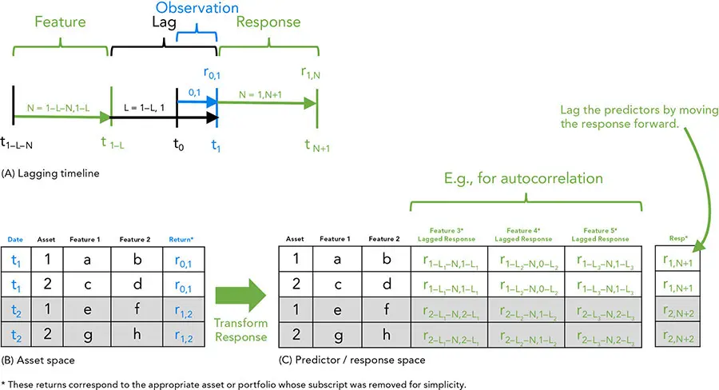
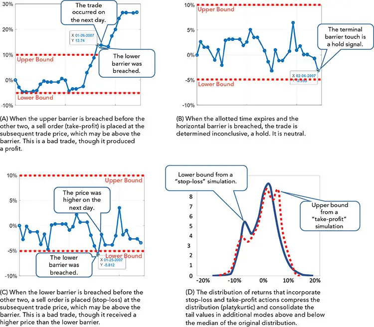

# 策略、目标与条件

*我们试图达成什么？*

因子（factors）及其变换（transformations）是构建我们分析预测变量（predictor variables）所必需的，但它们并不总能充分地为我们的模型提供信息。对策略建模可能要求我们对响应变量（response variable）施加复杂的变换和条件，并为我们的目标函数（objective function）增加结构。本章聚焦于预测策略的结果，而不是预测预测变量的未来值。

**预测预测变量与响应。** 分析包括表示（representation）、预测（prediction）、评估（evaluation）和优化（optimization）。机器学习（machine learning）在预测预测变量值（前瞻性自变量（forward-looking independent variables））方面可能至关重要，并且通常涉及阐明响应的复杂变换。对策略响应的调整旨在提高与实盘交易（live trading）相比的准确性，但可能会因过多噪声而遮蔽信号。重要的是不要用过于复杂的响应来混淆模型。预测变量用于模拟预测时点的世界状态，而响应（因变量（dependent variable））则用于描述用于训练的成功预测。因此，我们在构建预测变量时必须小心防范*前视偏差（lookahead bias）*，而在构建响应变量时则使用未来数据。

**响应。** 预测、评估和优化的一个关键要素是定义响应函数（response function），也称为*目标函数（objective）*或*评分函数（scoring）*函数。设计响应的目的在于向算法提供一个简洁而易于处理的目标，使其能够学习。目标函数将策略（其中可能包含描述羊群效应（herding）或恐慌（panics）等复杂社会学规则的条件）凝练为一个公式，并允许模型组合预测变量以产生结果。响应是监督模型（supervised models）所学习的范例。分析师必须管理现实性与可处理性（tractability）之间的权衡。如果响应过于细微，模型将变得困惑而无法学习。如果过于简单，响应将无法匹配实际交易的结果，模型就会拟合错误的函数。我们能够且应当使用回测（backtest）和向前行走（forward walk）来模拟那些在响应中难以实现的现实性。这使我们能够使用可处理的响应而不牺牲准确性。

**朴素性可能产生好结果。** 尽管模型使用各种技术——包括套利（arbitrage）、因子模型（factor models）、事件（events）和微观结构分析（microstructure analysis）——来预测结果，但响应只是以一种便利的形式（最好是一个单一统计量，如夏普比率（Sharpe ratio）或滚动收益率（rolling return））来计算结果。在考虑到众多选项之前，选择哪种表达式作为响应似乎无关紧要。例如，通常会选择 1 天、5 天或 30 天的回报作为响应；但如何选择呢？我们必须在计算和预测的快捷性、足够的现实性，以及足够简单不至于使学习算法困惑之间取得平衡。过度简化可能使模型失效，但由于所需的时间和精力，忠实的响应往往不切实际。

**现实性。** 识别一个在纸面上有效而在现实生活中无效的投资策略，是回测的典型问题。例如，如果我们的组合有基准（benchmarked），仅仅预测回报是不够的。如果响应中不纳入跟踪误差（tracking error）或与参考利率（reference rate）的某种其他关系，一次时机不佳的损失可能让我们"错误而孤立"，^1^ 在投资者眼中，这比与市场其他参与者一同经历回撤（drawdown）要糟糕得多。

**复杂性。** 构建同一响应有多种方式。例如，响应可以更具或更不具*连续性（continuous）*（用于回归的回报）；可以是*离散的（discrete）*（用于分类的类别，如盈亏）；^2^ 可以是*二元的（binary）*、带缓冲的（buffered）或多重的（manifold）；可以是*欧式（European）*（具有单一终值）、*美式（American）*（路径依赖）、*百慕大式（Bermudan）*，或涉及一系列决策日期的更奇异结构。

对一个受人工干预（human overrides）约束的实盘策略建模是一个复杂的过程，但对一个成功策略的简化可能导致预测能力下降。与许多建模工作不同，目标不是预测一个因子的强度，而是预测一个"有生命、会呼吸"的投资工具的业绩。跟踪误差、风险容忍度、反应时间以及许多其他要素都很重要。即便是抽样频率（一天中的某个时点或一年中的某个月份）也可能引入非平稳特征（nonstationary characteristics），如"粉饰橱窗"（window dressing）和其他季节性。然而，忽略高频业绩同样可能不切实际。数据中的尖峰（包括价格、波动率和方向相反的风险（wrong-way risk））可能因风险容忍度被突破、追加保证金（margin calls）以及其他现实而导致某些投资提前终结。

**整合因子。** 一些分析师会在建模阶段专注于因子，而将行为模拟和复杂策略推迟到因子的有效性由模型确定之后。当这是建模策略时，构建响应就是一个简单而干净得多的任务。将建模与回测分离增加了*科学严谨性（scientific rigor）*，并降低了过拟合（overfitting）的可能性。

尽管如此，将因子模型与响应模型分离并不理想。正如分开且独立的风险模型和 alpha 模型可能产生不一致且互不兼容的建议一样，将因子模型与其响应分离会训练出对于运营一个有效基金的最终目的而言次优的因子。分析师可能会感到不安，并迫使管理人偏离模型。最终，管理人可能面临"拔掉模型插头"的决策。这发生在情绪压力和不确定性最强烈的时期，Errol Morris 称之为"战争之雾（the fog of war）"。^3^ 设计一个将这些决策纳入其中的系统，并辅以尽可能多可预见情况下的行动计划，往往更为实际。

**可处理性。** 为了有效预测，响应应当是无偏且行为良好的（不锯齿状或不连续）。如果响应不违反太多假设，它可能允许应用更广泛的算法库。响应可以设计得更具趣味性、更精细、条件化，代价是存在使算法困惑的风险。一个设计良好的响应还能减少处理时间，从而实现更全面、更透彻的分析。

**实验。** 不同的模型对其响应的使用方式不同。用于产生响应的最佳因子组合可能并不直观；尝试几种表述看看哪种效果最好。有时，机器学习算法的简单性使其对相似的变换做出不同的反应。

**回测与向前行走。** 投资组合优化（portfolio optimization）通常采用效用曲线（utility curve）来帮助定义目标。在回测中，问题更为微妙。幸运的是，回测并不要求用一个简单的函数来表示目标。回测软件可以任意复杂；唯一的限制是建模技能、处理能力、执行时间和可解释性。建模者应当在回测中纳入多期执行（multiperiod execution）、交易成本（transaction costs）和复杂对冲策略等错综复杂的细节。^4^ 用于此分析的响应必须足够简单和光滑以便算法学习，但回测不受此限制。

**移动靶。** 机器学习响应与回测结果之间的脱节，正是量化资产管理（quantitative asset management）区别于许多其他机器学习任务之处。模型使用一个简化的响应进行预测，可能并未针对会产生有效回测业绩的结果进行训练。这就是为什么回测以及随后的归因分析（attribution analysis）是必要的；回测的作用类似于药物设计中的动物试验和人体试验。

理想情况下，我们将预测：

- **选择（Selection）**（做哪些投资）

- **方向（Direction）**（买入还是卖出）

- **规模（Size）**（每项投资买卖多少）

确定方向可能并不实际，而做空（shorting）可能难以识别和实施。做空还可能在最坏的时机变得昂贵。此外，纯多头（long-only）组合，或做空受限的组合，可能是施加于投资者或管理人、或由其施加的约束。规模确定可能因风险（日常风险和灾难性风险）、不确定性、对预测的信心、动量、流动性、交易成本以及其他细节（如明确的政策授权）而受到约束或混淆。[图 8-2](ch08.md)（见[第 8 章](ch08.md)）概述了策略建模的各个阶段。

## 消除时间依赖

时间序列（time series）对通用模型（包括大多数机器学习模型）构成了问题。金融时间序列之所以棘手，是因为它们通常违反平稳性（stationarity）和自相关性（autocorrelation）等假设。通过从我们的数据中剥离时间元素，我们可以拓宽模型的选择范围，并增加可用于训练它们的数据量。

在图 7-5 中，我们演示了如何通过让响应涵盖区间来从信号预测中剥离时间维度。我们针对单个资产和资产组（投资组合）展示了这一点。[图 9-1](#figure-9-1) 在此基础上进一步说明了一种避免前视偏差（look-ahead bias）的技术。实现这一点的一种方法是避免在特征集与响应集之间使用数据（禁运 embargo、保留 hold-out、间隔 gap 等）。这将有助于避免自相关数据影响预测（渗透 bleed、污染 contamination、扩散 diffusion 等）。

[图 9-1A](#figure-9-1) 以时间线的形式展示了如何使用一个滞后 L，将用于确定特征的数据与用于确定响应的数据隔离开来，其中包括一个观测期 t~0,1~。观测期代表朴素的响应，比如说一个单期回报 r~0,1~。

**图 9-1** 对响应进行变换以去除时间戳并避免前视偏差

图 9-1B 和 9-1C 以表格形式表示了这个例子，分别是变换前（B）和变换后（C）。在这种情况下，我们可以基于（比方说）从一个月前开始的三个月相关性 ρ(r~Sep-1\ to\ Nov-30~) 来构建一个特征集，用于预测从明天开始的一个月回报 r~Feb-1~/r~Jan-2~ -- 1。在这个例子中，我们不会在这一行使用从 12 月 1 日到 1 月 1 日的数据；滞后将是观测日期 t~0~ 之前一个月，并持续到观测日期之后一天。

## 固定期限与路径依赖

评估单一统计量的响应是不切实际的。常见的例子包括固定期限后的回报（例如三天回报），或某个区间内的高点或低点回报等点统计量。如果一项资产在预期持有期结束之前就遭受了大得多的损失，一只基金不太可能等待以实现一个较小的预期回报。即便该基金足够系统化以至于愿意等待收益兑现，它也可能失去其投资者，或遭受信用追讨（credit calls）或融通失败（lending failures）等外部性。

**三重障碍法（Triple barrier method）。** 如果可能，响应应当纳入一些基本的资金管理特征。设计一个良好且不依赖路径（path-dependent）的响应很困难，但它不必复杂。一个简单的例子就是*三重障碍（triple-barrier）*^5^ 方法。[图 9-2](#figure-9-2) 展示了如何使用三重障碍来创建一个连续的、离散的或分类的响应。首先设定三个障碍：最大利润、最大损失和最大时间。

这三个类别可用于分类：^6^

- **顶部障碍（Top barrier）。** 如果投资的回报在最大损失或时间段超时之前超过了最大利润，则响应为"买入"（[图 9-2A](#figure-9-2)）。

- **底部障碍（Bottom barrier）。** 如果回报先超过最小损失，则为损失或"卖出"（[图 9-2C](#figure-9-2)）。

- **右侧障碍（Right barrier）。** 如果在上下限被突破之前最大时间段已过，则该交易为中性或"持有"（[图 9-2B](#figure-9-2)）。

**图 9-2** 让响应同时具备路径依赖性和可处理性很容易。

**执行价格。** 如果回归需要一个连续响应，请使用突破（breech）发生之后的回报，以允许执行延迟并避免前视偏差。为了获得更现实的执行价格，我们可以使用交易加权平均价格（trade weighted average price，TWAP）或后续期间的类似统计量。^7^ 使用基于交易量占成交量百分比（percent of volume，POV）的执行价格很诱人。POV 方法很繁琐，因为计算累计成交量所需的日内数据可能过于庞大。在[第 15 章](ch15.md)中，我们将讨论一种简单的变换，它可以大大减少计算和使用 POV 所需的数据量和计算时间。无论采用何种方法，在连续响应中追求现实性可能会使算法困惑，因为响应中使用的最终回报值可能高于或低于触发交易的障碍。^8^

**回报分布。** 为了确定障碍水平，分析师可能会尝试几种组合，并将结果收集到一个分布中（[图 9-2D](#figure-9-2)）。三重屏障响应的分布通常是多峰的（multi-modal），因为止损和止盈障碍会抑制极端值，并将它们累积到上下两个众数之中。上下两个众数应当分别集中在上下障碍附近，而这些众数周围的方差则源于退出信号与随后执行之间的延迟。^9^

**复杂化。** 在响应中加入简单的交易成本看似是个好主意，但它可能削弱信号。响应可以做得任意复杂，但算法可能会变得困惑。即便是交易成本的纳入也可能使一个算法困惑，而大部分的现实性可能不得不留待回测阶段。

最好独立地以及组合地检查响应的若干特征。我们的模型的可预测性在使用某些复杂化时可能不可靠，但在使用另一些时却可能以其能力令我们惊喜，而预期会帮助模型的调整反而可能是有害的。

**不仅仅用于业绩。** 并非所有响应都基于价格表现。由于市场是由群体行为驱动的，价格会给投资的理论价值增添噪声。使用一个理论价值的主要驱动因素作为响应可能更容易，尤其是在估值方法基本确定性的情况下——许多固定收益工具即是如此。

机器学习模型在信用评分（credit scoring）方面很有效，尤其是在算法能够访问大量专有数据（如银行或保险公司数据）的情况下。先预测信用，然后——基于这些信用预测——再预测投资组合业绩，可能更为准确。波动率比价格变动更容易预测，并且是期权价格的主要驱动因素。预测可以从路径依赖中受益。信用转移概率（credit transition probabilities）和波动率聚集（volatility clustering）是信用模型和波动率模型的有机组成部分。因果模型（causal models）理解确定性关系，并可以从预测的驱动因素中确定价值。它们还能识别确定性关系何时失效，甚至如何识别可以取代失效关系的新关系（*自我修复 self-healing*）。

## 配置、选择、方向、择时与数量

执行模型需要五个参数：配置（allocation）、选择（selection）、方向（direction）、择时（timing）和数量（quantity）。通常的做法是使用一个策略模型仅处理前两者（配置和选择），并对其他参数使用朴素的默认值，例如 1/N 加权、风险平价（risk parity）或次日执行。任何任意的分配都是一个不知情的决策，其具有与深思熟虑的分析相同的风险（有意和无意的），却没有规划的好处（或意外后果）。如果做出知情决策所需的技能不可得，那么一个中性选择可能是最佳的。即便有可能做出明智的决策，所涉及的成本或过拟合也可能超过收益。策略可以直接确定这五个参数中的全部或不作任何确定；它可以与其他模型组合（分层 layered）；或在后期进行条件化（叠加 overlayed）。预测可疑业绩的策略（例如那些不能整洁地转化为投资选择的因子）必须随后映射到这些参数中的一个或全部，这涉及基差风险（basis risk）。

**配置。** 识别买入和卖出哪个因子或资产类别，可能是大多数投资者的策略响应最有用的目标，因为宏观因子比许多证券交易效率更低（因此，从不了解情况的竞争对手或具有不同目标和时间范围的竞争对手中获益的机会更多）。机构通常对其政策组合的偏离感兴趣，例如超配（overweights）和低配（underweights），而不是绝对配置，尽管通常存在常识性的绝对限制（如基数 cardinality），即使它们没有被明确定义。

**选择。** 一些投资团队专注于选择买卖哪些投资，而不是哪一类资产。选择模型可以与配置模型完全不同。在同时处理配置和选择时，一个分层模型（例如自上而下 top-down 或自下而上 bottom-up 模型）允许分析师为每个层面选择合适的因子，而不会让算法因相互冲突的指令和交互而不堪重负。更专注的投资者（如选股师 stock pickers 和套利者 arbitrageurs）只关心工具选择，要么将自己限制在单一资产类别，要么完全忽略类别。

**方向。** 基金可以是纯多头（long-only）、多空（long-short）或做空者（short sellers）。这一选择影响是买入、卖出还是持有。

建立或增加空头比减少多头更为复杂，因为它涉及寻找并借入工具以及支付额外成本。做空需要一个比购买更复杂的方向模型，而做空的细微之处往往在最坏的时机才显现出来。 moreover，当模型处于实盘运行时，理想的做空标的可能昂贵得令人望而却步或根本无法找到。使问题更加复杂的是，假设买入信号的缺失就是卖出信号，可能会向投资过程注入重大的方向相反的风险（wrong-way risk）。

识别空头可能需要不同的技能或不同的模型。许多选股师是糟糕的做空者。

杠杆有时会放大方向。一些模型（如朴素的投资组合优化）中的一个过度简化假设是，对最优组合进行上下杠杆化要优于微调其成分。这一假设忽略了许多现实，如资本的可获得性、集中度风险（concentration risk）和模型的敏感性。

**择时。** 投资通常在信号之后的期间内被买卖。更复杂的模型可以平衡 alpha 衰减（alpha decay）和交易成本（包括市场冲击 market impact）。配置和选择模型可以基于体制识别（regime identification，如隐马尔可夫模型 hidden Markov models）进行条件化，或通过另一层模型（如元标签 meta-labeling）予以偏好以改进择时。一些模型既不尝试配置也不尝试选择；它们忽略选择，只试图预测择时。这些模型适用于那些由传统基本面分析预先确定的投资，或以诸如 S&P 500 或 MSCI All Country World Index（ACWI）等指数为基准的投资。

风险控制叠加（risk control overlays）和投资组合保险策略将择时与数量和方向结合在一起，试图减轻投资组合的风险，或在投资选择上更加激进。其他现金管理策略，如凯利准则（Kelly criterion，财富最大化）的变体，也很受欢迎。

**数量。** 决定买卖多少可能是一个令人苦恼的决策。配置或选择选择的置信水平可用于确定数量。这具有将数量决策与配置和选择模型整合在一起的优势。像元标签这样的分层模型可以判断对模型本身的信心。通过将方向决策与规模决策分离，算法可能会受益于一个更简单的任务。此外，决策对齐（例如强信号和大规模）或不对齐（例如强信号和小规模）可能是具有信息量的。

投资过程中会使用许多模型。有些用于帮助清洗数据；另一些用于预测因子、组合因子、识别因子、预测因子、预测交易成本，或一系列其他目标。在对组合因子的投资策略建模时，响应必须被简化以帮助学习算法识别机会。向模型添加过多现实性会阻碍算法的学习能力。在选择将什么保留在响应中、将什么从中剔除时，部分是艺术、部分是运气，并可能对实现利润产生重大影响。

为了更好地评估策略并增加现实性，需要使用更复杂的模型进行回测，正如药物建模需要临床试验一样。回测不能确保策略会交易良好，但它们是增进我们对策略将如何表现的理解的重要一步。

1. 尽管在上一章中以贬义的方式讨论了避免原创性和创造性投资策略，但遭受重大损失的风险仍然是真实而危险的。这是一种*方向相反的风险（wrong-way risk）*，而错误且不原创可能是一种*方向正确的风险（right-way risk）*。

2. 对诸如"买入"、"持有"和"卖出"等离散类别的分类，往往比产生诸如回报等数值的回归效果更好。类别可以做得更细粒度，例如在"买入"、"卖出"和"持有"之外加上"溃败（rout）"和"暴利（windfall）"，但即便三个类别有时也太多了。

3. Sir Lonsdale Augustus Hale 1896 年的"The Fog of War"是正确的出处，尽管它常被归于 Carl von Clausewitz。在其 1832 年的著作*Vom Kriege*（即*战争论 On War*）中，Clausewitz 将军写道："战争是不确定性的领域；战争中行动所依据的因素，有四分之三包裹在或大或小的不确定性之雾中"；然而，Clausewitz 似乎并未使用"战争之雾"这一短语。

4. 关于我们在回测中用于管理这些细节的 EMSC 执行管理对象（execution management object），请参阅[第 14 章](ch14.md)的讨论。

5. Marcos Lopez De Prado，《金融机器学习进展》（*Advances in Financial Machine Learning*）（John Wiley & Sons, 2018）。

6. 以下对三个类别的描述并不完全正确。由于突破触发后所收到的价格发生在突破之后，顶部障碍的突破有可能产生损失，底部障碍的突破也有可能产生利润。例如，如果顶部障碍被突破，将生成一个卖出投资的指令，但交易无法瞬间完成，交易所收到的价格可能低于上障碍水平，从而在预期盈利时产生损失。

7. 如果该策略过去曾用于实际交易，我们可能会使用已实现的买卖价格。

8. 将响应与投资相匹配地进行缩放很重要。例如，对于一项低方差的投资，5% 的回报可能是"买入"，而对于一项高波动性的投资则是"持有"。

9. 尽管左右两个众数通常分别集中在下障碍和上障碍附近，但这些众数周围的离散度代表了障碍水平与已实现执行价格之间的差异。
