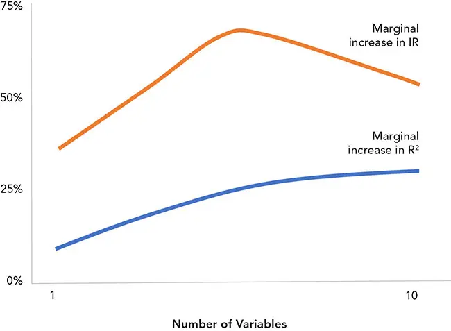

# Alpha 与风险模型

*大于其各部分之和*

第二部分的前几章关注数据与输入。随着我们进入第三部分，重点将转向模型设计。投资流程并不能整齐地分割为互不重叠的原子步骤，因此各章在任务与目的上有所重叠。例如，用于预测利率的模型也可能被用于生成因子，作为公司债券模型的输入，或者作为购买国债的最终收益预测。

**模型的类别。** 我们将构建三类基本模型。它们以复杂的方式相互影响。

- **数据模型（data model）** 负责组织数据，供评分模型使用。

- **评分模型（scoring model）** 处理因子，确定可供功能模型使用的排名与统计量。

- **功能模型（functional model）** 执行投资任务，例如将资产配置到各资产类别，以及挑选投资标的。

**评分模型。** 本章将讨论四种评分模型中的前三种：Alpha 模型（alpha model）、风险模型（risk model）和集成模型（integrated model）。

**功能模型。** 在第三部分的后续章节中，我们将讨论那些应用评分模型以影响结果的功能模型。功能模型涉及资产配置（asset allocation）、选股（security selection）、择时（timing）、加权（weighting）、执行（execution）与实施（implementation）。通常，集成模型可能复杂得令人望而却步。为使模型组合易于处理，人们常常分阶段评估模型，而不是将其集成在一起。多阶段计算与实施可能忽视各阶段之间的相互作用。

## Alpha 模型

*alpha model*（Alpha 模型）这个术语其实是个误称。Alpha 模型更准确的称谓是绩效模型（performance model）或收益模型（return model），因为这些特征不一定是 alpha^1^（例如主要与非系统性风险相关的投资相对吸引力），也不一定是 beta（例如指数或 *smart beta*（聪明贝塔）投资）。Alpha 模型对研究者和投资组合经理最为重要。

许多投资经理将自己 Alpha 模型的方法论视为"秘方"。投资经理常常与其方法论认同，无论其工作是建立在理论还是实验之上。

多数量化从业者接受的是科学、技术、工程或数学（STEM）教育，并且常常是物理学。许多科学发现在同一时期内出现，因为科学家们沉浸在相同的文化、科学发现体系与知识体系之中。Claerbout 原理指出，是整个环境，尤其是流程，使得 Alpha 模型得以奏效，而非某个卓越的原子概念。^2^ 量化从业者鼓吹系统化，但量化从业者本身才是产品。经理的整个流程正是造成聪明贝塔与对冲基金（以及其他 Alpha 载体）之间差距的原因。许多聪明贝塔基金在样本外表现糟糕，正是因为它们脱离了使其在样本内有效的流程。因此，*自主性*（autonomy）和*韧性*（resilience）是 Alpha 模型的重要特征，使其能够更独立于经理的流程与调试。

即使是完全自主系统的设计也需要做出许多自由裁量的决策，这些决策必须被理解，以便在系统表现不佳时建立信心并坚持下去，或者知道何时应当"悬崖勒马"。需要定义的微小细节数不胜数，其中任何一个都可能显著改变策略的运行条件和结果。

这些细节包括可用资产的范围、状态、投资表达方式、超参数（hyperparameter）及其重新评估频率、因子评估频率、模型再训练、再平衡触发条件、置信度限制以及交易期限。在有人坐下来开始编写策略代码之前，很难想象需要做出多少假设，而且很容易因疏忽而无意中施加一个假设。

因恐惧和不确定性而偏离一个良好的系统，是系统化经理常见的失败。许多量化从业者接受的数学训练多于自由裁量交易训练，而经验丰富的交易员多半会同意，市场会诱导参与者做出糟糕的决策（例如行为启发式）。这是市场的本质，也是行为金融学的精髓。管理层往往是负面影响，迫使量化从业者做错事。"规划你的工作，按规划工作，承担责任，果断决策"或许是好的建议，但除非系统的假设为人熟知且站得住脚，否则很难遵循。"完美是好的敌人"，直到基金表现不佳。当客户抱怨、情绪诱使管理层"偏离剧本"时，精心规划所带来的勤勉价值就会显现。

例如，分析师可能得出以下两种结论之一：

> 我们选择 12% 的三日跟踪止损。在数百次历史和模拟研究使我们确信，这比使用 15% 的止损或观望等待回升更为可靠。希望并不是可靠的过程。

或者：

> 这超出了我们的运行范围。我们没有足够的数据对自己的信号有信心。我们应当降杠杆至中性头寸，直到情况发生变化。我明白这意味着我们要实现亏损，但若非如此就是盲目赌博。我们只应在胜算对我们有利时才投资。

许多基金宣传基金的机械特性，作为其韧性的证据。独立性听起来或许诱人，但这种幻觉对经理的伤害可能超过其过拟合的倾向。它所产生的保密性往往妨碍经理在尽职调查期间分享必要的信息。投资者可能会被蒙蔽，但面试过数千名经理的配置者明白，僵化的、神秘的公式最终会失败，而流程、勤奋和决心可以克服困难。

以下是开发模型时需要考虑的关键事项清单：

**分类法。** 一般来说，模型依赖一种或多种框架：

- 历史数据，尤其是关于收益的统计量

- 前瞻性历史数据，如隐含利率

- 定性理论（金融、经济、行为）的量化近似

- 关于现实的定性理论

尽管表面上独一无二，Alpha 模型的多样性其实惊人地有限。给某事物贴上标签，是消除其特殊感、揭示经理真正价值的一种方式——他的能力、勤勉、假设、实施、纪律、运营与管理。考察 Alpha 策略的一种方式是将其归入四大类：

- **产品结构或统计**，例如机械式、错位、做市/做庄、剥头皮与偏度、保险分散或套利

- **体制识别（regime detection）**，例如事件驱动或全球宏观

- **基本面**，例如价值、收益率或质量（管理层、欺诈、治理、会计质量、报告语言、收入韧性与方差等）

- **技术**，例如动量、趋势、保险性买入、增长、逆向、保险性卖出、情绪或均值回归

基金常常将这些类别组合使用，或者不时偏好其中某些类别。

另外，模型也可以按经理的投资风格来分类。按风格分类有助于将量化经理与较少量化的策略组合。风格类别有很多，四种流行的类别是：

- **股票**（Equities），例如基本面增长/价值、市场中性/方向性、行业、做空

- **宏观**（Macro），例如主题型、大宗商品/货币、系统化

- **事件驱动**（Event driven），例如特殊情况、激进主义、并购（M&A）、困境/重组/信用、私募/首次公开募股（IPO）

- **相对价值**（Relative value），例如主权/公司/资产支持证券（ABS）、固定收益（FI）、可转换套利（convert arb）、波动率、基础设施/房地产

**定量与定性。** 一般而言，量化策略的好处在于下注的分散化（以及相应地降低对运气的依赖）；当然，分散化会稀释可用于每项分析的资源。分析师可以利用复杂度有限的技术分析大量机会，从而降低集中风险。将良好的判断力集中在一个严格的流程——甚至是一个由不同模型组成的多样化网络——往往会迫使量化从业者更多地依赖历史数据和算法预测，而非对具体情形的深思熟虑。Alpha 的系统化以及经验、直觉和判断是成功的量化模型所不可或缺的。尽管如此，强调优势和精耕细作的量化策略可能缺乏一个好故事的光鲜魅力，也缺少"有些人总是比机器更聪明"这种陈词滥调的吸引力。有些人或许确实更聪明。是的。但如果使用得当，机器并不试图胜过人类；它们以不同的方式思考，发挥人类所没有的优势。

**和某些定性策略一样，某些量化策略也是天真的。** 技术专家和业余爱好者宣称的量化策略层出不穷。单因子策略、对乏味的因子和投资选择的依赖司空见惯。这些策略之所以被宣传，是因为其设计易于解释，且能成为反量化和被动投资叙事的稻草人。

在极端情况下，量化策略与深思熟虑的定性策略一样复杂，包括为违反假设、执行失败、操作失误、意外的流动性事件、融资问题以及交易对手违约（非故意的，如 2008 年 Lehman Brothers 倒闭；以及故意的，如逼空）等常常在最糟糕时刻发生的事件所做的应急预案。量化策略具有分散这些问题风险的独特优势，但也有一个缺点，即除非事先识别并加以防范，否则难以聚焦于特定事件。^3^ 过度依赖理论结果的一个明显例子是天真地使用杠杆来放大投资组合的业绩和波动率，例如带有借贷的最优投资组合。杠杆会削弱分散化的好处，并放大投资组合设计中的错误。当过度拟合的风险控制叠加层（*回撤控制*（drawdown control））在样本外反应过慢，错失在崩盘前去风险的机会——但却在底部这样做，又错过了随后的反弹，从而加重损失，类似的陷阱就出现了。

**灵活性。** 自主性和韧性需要灵活性。灵活性正是使量化模型类似于自由裁量模型的部分原因。模型越广泛、越具包容性，就必须越灵活，因为即使是最具影响力的趋势也可能是不可预测的。策略越小众，基于规则的系统就可以越机械化、越可靠。

### *从一个原则出发*

由于需要做出如此多的小决策，存在累积的潜意识（或有意为之的*数据窥探*（data snooping））偏差的危险。指导理论的选择受历史影响，但它可以是审慎而有意识的。*锚定*（anchoring）、*框架*（framing）和*确认*（confirmation）偏差都可能产生强大的影响。模型选择也很多，包括：

- 自变量与因变量

- 它们的精确定义，包括其表达方式

- 如何获取、测量和清洗它们，以及缺失值和异常值的处理

- 处理抽样与估计误差

- 加权，例如用指数加权移动平均（EWMA）偏向较近的数值

- 鲁棒性，例如重抽样方法

- 测量周期与频率

- 季节性及其他调整

即使是基于信号强度的加权也可能放大信号中的偏差。为了避免使用信号强度进行加权，一些量化从业者等权重（1/N）加权，或基于"Alpha"信号以外的某物加权，例如风险平价（risk parity）。

通常建议简约，因为包含较少的变量能使大多数理论更易理解和求解。增加变量可能出于技术原因（例如过拟合）而提高 R^2^，但未必改善模型或其信息比率（Information Ratio, IR；见图 11-1），就像通过增加收益历史或频率来改善标准误一样。

**图 11-1** 变量数量与 IR、R^2^ 的关系。增加数值会提高 R^2^，但在 IR 的边际增加上可以看到收益递减。^4^

**当风险管理本身*就是* Alpha 时。** Alpha 模型旨在预测现金流和升值。这些数值的一个常见*锚*是零。如果现金流或升值为负，通常被称为损失，而预测损失的模型被视为风险模型。然而，这是任意的；它们仍然是用于确定相对吸引力的"Alpha"模型的一部分。对负现金流和升值的评估在信用工具、抵押贷款以及取决于二元结果（如药品审批、勘探、私募股权退出（如首次公开募股或 IPO））的投资中很常见。

## 风险模型

风险模型涉及收益的波动、投资运营受损的概率，或财务破产的可能性。风险模型由投资者使用，但也可能专门为监管和合规目的而设计。例如，全面资本分析与审查（CCAR）或巴塞尔协议 III（Basel III）模型所产生的输出可能并不最适合投资流程，但符合内部和外部法规与预算。风险是一个令人困惑的词；它无法与投资流程的其他方面分离，且往往不能用绝对术语定义。考虑流程中的四个阶段：

**1.** **Alpha 模型（选择）：** 寻找具有良好风险调整后收益的投资，包括那些通过最小化不良结果来确定收益的投资。该模型由投资团队管理，任何负责任的选择过程都自然会纳入风险度量。

**2.** **风险模型（配置与构建）：** 以使投资组合优于其各部分之和的方式组合投资。组合资产涉及使用具有不同关注点的不同风险度量。尽管 Alpha 模型与风险模型之间存在重叠，但风险模型更关注整个投资组合的收益质量（可靠性、一致性、方差）。平衡逆向风险（wrong-way risk）与正向风险（right-way risk）、相关性与协方差以及其他交互作用，可能比单个投资选择的属性更为重要。该模型最明显的应用在于投资组合内投资的择时与加权。

**3.** **风险模型（杠杆、再平衡与叠加）：** 作为系统化流程的一部分，控制和管理投资组合的风险。第 2 步中使用的相同模型可应用于投资组合的系统化管理。随着组合选择的基础发生变化，可能需要调整投资组合以改变总体风险，或调整持仓权重以反映不断变化的输入的新现实。视紧迫性、成本和政策而定，这些调整可能是侵入性的。例如，通过买入或卖空一个钝化的指数来快速、廉价地调整股票投资组合的 beta。这种方法的成本是实施缺口（implementation shortfall）。

**4.** **归因与监管模型（杠杆、再平衡与叠加）：** 分析和报告投资组合或策略的持续行为。归因是反馈循环的最后一步，可作为学习工具。该模型可能建议使用第 3 步中预定义的方法、对投资选择进行更具侵入性的反思，甚至重新思考总体投资政策。该模型也可用于评估监管或组织限制方面的"硬止损" breaches。为业务连续性或系统化韧性而构建的模型对投资人员来说可能过于"宏观"。在许多情况下，投资人员的激励侧重于业绩。短视或以自我为中心的关注可能使这些更广泛的风险问题显得武断且适得其反，并可能产生代理问题。我们将在本书本部分的后续章节讨论这一步骤。

**定义市场风险。** 组织、产品和模型目的将决定风险模型的目标。一些组织存在的目的仅仅是控制或最小化风险。投资者不应限制风险，而应将风险视为一种可花费的货币（*风险预算*（risk budget））。理解风险的来源、特征、规模和变化，有助于投资者高效地配置风险预算，以获得更大、更高质量的收益，并通过投资选择和仓位确定来满足其激励。常见的关注点包括：

**投资活动受损**或许是最不利的结果；即使是病态的赌徒也应希望避免资不抵债。*永久性资本损失*紧随其后；不可挽回的损失普遍令人不快。Kelly 仓位法（[第 12 章](ch12.md)）在管理"破产风险"的同时最大化收益，但由于该方法忽视其他风险，被许多投资者修改或弃用。

**择时、协方差与方向。** 对痛苦的刻画（如正向与逆向风险、上行与下行风险，以及回撤的幅度与长度）是天生直观的刻画，是任何实质性投资对话的一部分。内部度量（如盈利头寸与亏损头寸之比，以及协方差）也不可避免，因为它们易于理解且触及本能。纵向（择时）和横截面（协方差）模型都有使用。

**方差与离散度。** 各阶矩和其他周期性风险度量对于监管和业务原因很重要，理论上的风险承受能力和资产配置假设往往需要它们。它们被嵌入许多流程、模型、政策和法规中，但对大多数投资者而言，不如业绩重要和实用。恐惧（痛苦的度量）和贪婪（绝对或相对业绩的度量）是投资者关注的最相关标尺。

**可分散的、特殊的和对冲的。** 将投资的风险维度限制在可预测和可控的范围内是明智的。通过识别被错误定价（优势）的投资特征并最小化不可控因素（对冲），投资者可以更多地依靠技巧而非运气来对齐其结果。

**不确定性。** 风险度量的模糊但关键的本质往往导致仪表盘，甚至单一度量，来概括投资组合或组织的状态。必须有办法提炼复杂信息，以便高级决策者能够监控其职责范围，将不确定性和学习纳入最终输出（例如通过使用贝叶斯更新）。这可能涉及提供置信带或分布，而不仅仅是点估计或平滑的时间序列。不确定性可能令人不知所措；定义当"战争迷雾"使前进方向不确定时所依赖的方法、行动和政策。

若缺乏规划，在困难时期很容易屈服于虚无主义、瘫痪或赌博。在决策中明确纳入不确定性度量（如随机占优和博弈论），并组织潜在行动方案（如*风险触发器*（risk triggers）^5^），有助于形成一个框架。我们所制定的计划在需要时未必会被启用（例如，投资组合经理未预见所遇到的确切情形，或政治因素使精心设计的计划脱轨）（上述第 3 步），但计划的存在能为分析混乱和情绪化的情形提供一个必要的框架，并对由此产生的决策提供一定程度的信心（上述第 4 步）。"我们不会达到期望的水平；我们会跌落到准备和训练的水平。"（Archilocus）

与 Alpha 模型一样，高偏差的理论模型可以揭示力量，而更灵活的经验模型可能产生逃避怀疑的意外结果。例如，公司债券指数的"堕落天使"（fallen-angel）偏差就是有偏模型可能证实结构性风险的一个实例。明智地使用偏差是经济学和统计学的一项优势。

**语言很重要。** 风险模型的一个重要成果是构建投资对话的框架。如同风险溢价一样，风险度量聚焦于风险这种货币并赋予其意义。要注意恰当地使用行话，在增加含义的同时不使信息复杂化。言语有力量，松散的措辞，例如推断因果而非倾向，会造成损害——把创造性的语言留给销售人员和公关专家。在构思投资论点时，对风险的清晰理解可能与对收益驱动因素的透彻理解同等重要。

## 集成模型与因子对齐

集成模型（integrated model）结合 Alpha 模型和风险模型，以做出风险调整后的建议。^6^ 较少见的是，集成执行策略的模型可用于提前规划并预判执行模型的决策，以做出更具成本效益的决策。如果执行环境与预期不同，这可能是有害的。例如，集成模型可能选择一种资产而非另一种，因为所选资产在历史上比另一种资产的买卖价差更小，即使另一种资产的预期收益更高。如果在执行时另一种资产的买卖价差收窄，投资组合最终可能得到次优配置，却没有获得更低成本的好处。税损收割（tax-loss harvesting）就是一种可能需要具备执行意识的选股的策略示例。

**集成模型**有助于以兼容的方式估计数值。Alpha 模型和风险模型常常是分离的、在理论上不兼容的，往往由完全不同的研究团队或软件供应商生产，因为它们通常由两个不同的群体使用。Alpha 模型的最终目标是可靠的业绩，而风险模型可能是为不同目的设计的，并以非预期的方式使用。集成模型可以为投资流程（配置、选择、择时和加权）提供外生输入。在构建模型时，我们的成功可能被许多缺陷所绊倒。

**过度简化。** 许多金融方法涉及将极其复杂的关系分解为更易理解的组成部分，如风险溢价。通常，这些更孤立的组件本身难以处理。这种方法的另一个问题是需要考虑组件之间以及与其他影响（如约束和成本）的相互作用。市场动态的不对称性，例如卖空单只股票与买入的相对难度，或容量约束，排除了使用简单模型的可能性。为预测和衡量我们方法中的误差，我们应用回测分析（[第 14 章](ch14.md)）和归因分析（[第 18 章](ch18.md)）。

**模糊性。** 风险的不精确定义，以及投资公司各机构的不同需求，导致对风险模型的依赖可能与相应的 Alpha 模型不兼容。例如，半方差或在险价值（value-at-risk）对流动性管理者可能完全合适，但在真正关注永久性资本损失时，对资产配置模型却不合适。

**最优化。** 投资组合优化器（optimizer）呈现了 Alpha 模型与风险模型之间最明显的冲突，因为其目的是平衡业绩和风险。诸如不同的样本周期或错误设定的度量，或 Alpha 因子与风险因子之间的重叠等不兼容性，会产生次优的投资组合。优化器（有时被称为"误差最大化器"）倾向于放大误差，使其成为批评者的诱人目标。

不准确的最优化（转移系数，transfer coefficient）很容易通过投资者建议（风险调整后 Alpha 模型的信息系数）与投资组合业绩之间的脱节来衡量。这可能被归因于投资组合层面的风险控制（如杠杆、波动率或行业偏向），而真正的罪魁祸首是组件模型之间更隐蔽的错位。这些错位会影响投资流程的方方面面，而不仅仅是最优化。

**规避。** 处于艰难环境中的激进组织自然会偏爱那些对公司即时需求有更直接、可衡量影响的员工（最好"离钱近"）。高绩效的投资经理往往在 Alpha 模型上投入大量精力和资源，而忽视风险模型。投资人员中认为风险管理限制并阻碍了他们的机会集（和薪酬）的态度，常常加剧了这种差距。

购买一个精密且站得住脚的第三方风险模型（"同类最佳"）而不是构建一个与内部 Alpha 模型互补的模型，似乎很明智。这可能导致使用一个为不同目的构建的模型，例如使用资本充足率或业务连续性模型来为资产配置功能提供输入。

依赖学术研究的公司可能被引诱使用不合适的风险度量，优先考虑优雅且易处理的模型（例如闭式或随机表示）。能够广泛应用并用于预测有趣结果的理论洞见。如果不加修改，这些洞见可能无法充分描述当前的投资组合和情形，或在现实世界中进行交易所需要的微妙之处。

**缺乏可转移性。** 即使是最相关的风险模型也往往不够用。投资流程通常被设计为一系列模块或阶段，难以捕捉其功能之间的相互作用。例如，执行模型若能充分理解选择模型的标准将是有益的。如果它理解了，它就可能选择购买一个稍微不那么有吸引力但执行成本更低的资产（例如流动性更强、市场冲击更小的资产）。由于设计集成模型的复杂性和操作难度，人们使用各种手段来弥补投资阶段之间缺乏互动的问题。就像初级交易员一样，执行模型可以被选择模型给予指导方针（例如偏好排名），但这并不等同于一位能够考虑微妙互动或意外事件的投资组合经理所具备的细致理解。二阶误差有时会演变成大问题。

错位并不局限于流程。互动发生在投资的各个维度，包括投资组合的演变。多期实施是一个难以解决的问题，在实践中常常被近似或忽略。

> "分而治之"是一种有用的策略，但会产生复杂情况。将收益（Alpha）与风险分离的常见做法最小化了两者之间互动的重要性，并忽视了收益与投资风险往往是同一现象的两种解释这一现实。语言的模糊本质和思维的精度不足造成了进一步的混乱。持续地应用对微妙而重大缺陷的认识，可以随着时间的推移创造战略优势。

对投资风险的正确理解和尊重（"风险文化"）及其在可靠业绩中的作用——以及一个任人唯贤的管理结构和适当对齐的激励方案——将反映在公司的治理及其投资管理中。它将体现在对事件、机会和提案的深思熟虑和精确描述中。员工会感受到它，体现在他们对任务和结果的责任感上，并将在艰难时期贯穿到客户满意度和留存率上。业绩是波动的、短暂的，但流程和文化是韧性的。

1. Alpha 常被用来泛指投资流程的价值。Alpha 实际上是投资收益中无法通过与基准或其他参考的关系来解释的部分。在实践中，这意味着 alpha 不应包括收益流中可由廉价系统化策略（如被动指数或简单主动策略（也称为聪明贝塔））复制的那部分。投资者只应就那些没有经理的*特殊*（special）技能和优势就无法获得的收益部分支付高费用。

2. "这个理念是：科学出版物中的一篇文章……不是学术成果本身，它仅仅是学术成果的广告。真正的学术成果是完整的……环境。" D. Donoho and J. Buckheit, "WaveLab and Reproducible Research," Department of Statistics Technical Report 474, Stanford University, 1995.

3. 量化策略还有两个额外的严重逆向风险：人类无法想象的毫无意义的错误的可能性，以及自动化所能施加的规模，通过重复使一个小错误变得巨大。

4. K. C. Ma, *How Many Factors Do You Need?* KCM Asset Management, Inc., 2010.

5. 风险触发器只是一系列条件和响应，例如"如果投资组合的波动率上升 10%，就发邮件给投资组合经理"或"如果任何持仓在一天内亏损超过 20% 或一个月内超过 35%，就召开投资委员会会议"。风险触发器可以让利益相关者（如投资者或董事会成员）相信，所关切的问题会得到处理，而不会因拖延和混乱而加剧。

6. 交易成本模型将在 [第 15 章](ch15.md) 中讨论，归因模型将在[第 18 章](ch18.md)中讨论。
