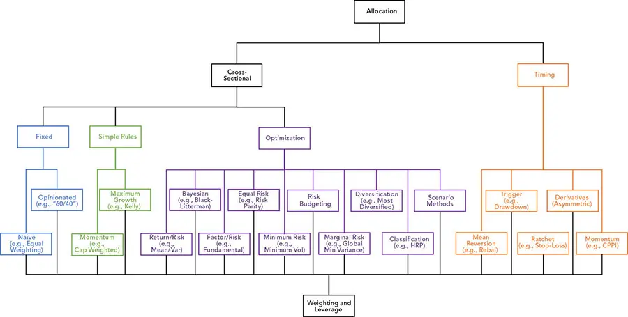
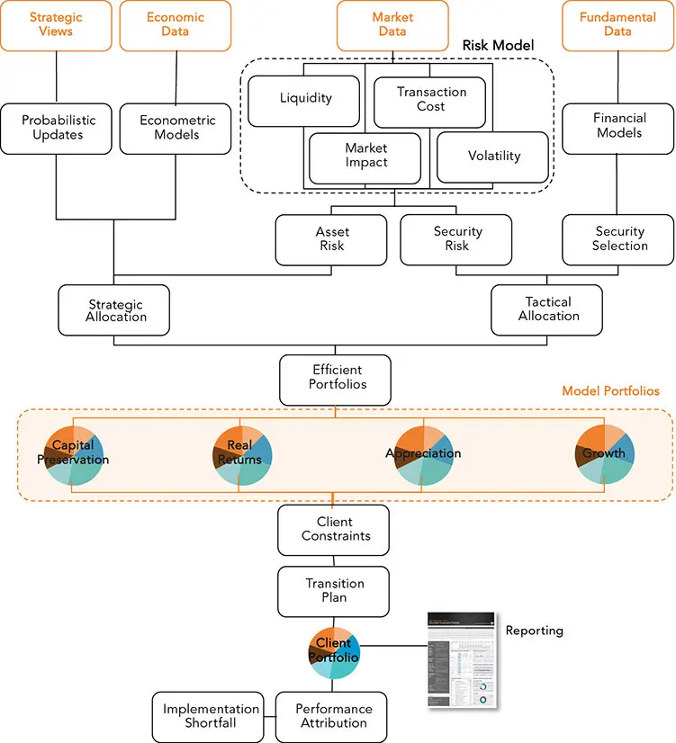

# 资产配置

*整体性地选择投资*

投资组合构建（portfolio construction）是投资策略的整体性组合，涵盖战略性资产配置（strategic asset allocation）与战术性资产配置（tactical asset allocation）以及选股（security selection），同时平衡风险与约束。它涉及选择、加权和择时，结果是构建出一个基于观点、偏好、条件、重大事件、更平凡的历史以及约束的资产组合。许多研究团队专注于 Alpha 模型，但 Alpha 模型仅仅最大化回报目标（其中可能包含风险惩罚），通常使用时间序列和横截面技术。平衡风险、收益和交互作用的投资组合构建可能更具影响力。

**主动与被动管理。** 被动管理者倾向于较少数、较宽泛的投资载体，如指数基金，以及不太频繁的再平衡。尽管被动管理者可能较少评估和再平衡其投资组合，但不激进的再平衡往往反映的是缺乏信心，而非被动性。

在众多经验丰富且资源雄厚的投资组合经理的竞争中，主动管理宽泛资产类别或因子具有挑战性。同样，择时是出了名的困难和危险。利用由不相容的投资目标所导致的低效和错位的小众策略更有可能成功。许多大盘股估值差异源于估计误差。

固定收益（Fixed Income, FI）选择众多，包括各种结构，如嵌入奇异期权的结构。固定收益结构和非线性具有特异性，固定收益市场往往低效，使错位得以持续。这些市场也是*分割的*（segmented），造成明显的套利机会可能无法"清理"。固定收益工具通常以大宗数量交易，或*整数手*（round lots）。这些投资中有许多可以主动管理，有时甚至可以机械化地管理，以产生可靠和可重复的利润。因此，约 85% 的固定收益基金是主动管理的，而股票基金为 70%（当然，估计有所不同）。专门化并不总能带来更好的结果。^1^ 有时不同的配置以不同程度的活动性来管理。诸如*核心-卫星*（core-satellite）和*便携式 alpha*（portable alpha）等技术可以将廉价管理的被动 beta 投资与专门化且昂贵的主动管理配置分离。通过这些方式，主动管理可以局限于其最有效应用的情境。一些投资者因管理的资产规模有限、流动性需求、费用限制、卖空约束或其他政策限制而受到约束。

无论是主动还是被动管理基金，都必须做出众多选择。这些选择的一个简明菜单见图 12-1。很容易假设被动策略不需要主动选择，或系统化策略不是任意的且不需要干预。例如，即使是被动策略也需要加权和再平衡规则，而这些规则常常可以被投资委员会推翻。

**图 12-1** 一些资产配置阶段的分类法

**横截面加权**（cross-sectional weighting）可以寻求最大化收益或其他因子。通常，加权用于通过组合投资来分散风险，以改善风险调整后收益。通常使用某种变体的 Markowitz 优化，但还有许多其他可应用的技术：

- **固定比例**技术可能源于无知（或虚无主义）的假设、缺乏复杂度^2^ 或缺乏信心，或不愿教育投资者。

- **简单规则**（启发式，heuristics）忽略交互效应。这些因子可能包括诸如 Sharpe 比率的变换或组合。它们可能涉及基于因子大小或排名的简单缩放。

- **最优化**（optimizations），包括基于情景的方法，涉及平衡多个相互竞争的因子，例如考虑交互作用的收益和风险。有时解决方案很简单。优化通常涉及假设和妥协。更现实的解决方案可能需要比实际可行更多的时间和计算能力。

**择时**也可用于平滑收益流以降低风险。这些择时方法常常涉及对单个持仓或更常见地对资产配置（如股票/债券/现金比率）应用某种形式的杠杆控制。这有时被称为*回撤控制*（drawdown control）。

这些技术包括风险开启/关闭（risk on/off）、止损和止盈、保险计划以及不对称投资（如期权）。时间序列方法通常作为*叠加*（overlay）应用，而不集成到横截面资产配置方法中——或者在其后，作为"附加"（bolt on）。这些技术的一个主要问题是触发方法可能是危险的，常常被骗到太晚才反应以保护投资组合，并持续过久而无法参与复苏。

## 横截面技术

**分散化。** 大多数横截面技术都建立在分散化能减轻风险的假设之上。分散化被广泛赞誉为"投资中唯一的免费午餐"，^3^ 但与投资中的大多数概念一样，它常被误用和误引。无论是过度分散化还是单纯的无能资产配置，重要的是要认识到单靠噪声不能正确分散；它可能将投资组合收益稀释至无风险利率。

具有正收益的不相关资产以建设性的方式分散。一个人对某项投资的价值越确定，她就越不感兴趣将其与一项前景较差的投资分散。^4^ 此外，将风险较高的投资加入投资组合通常会增大投资组合的风险，必须由该投资的收益潜力和分散化收益来证明其合理性。^5^ 虽然风险不可避免，就像成本和费用始终存在一样，分散化收益可能不可靠。股票和债券的经典分散化随时间变化很大。

*噪声是有偏的。* 增加复杂性和随机性不是中性的，因为不知情的决策偏向于错误的投资。竞争对手、摩擦和启发式合谋对付投资者。正如 Chris Brightman 所写，"我们观察到的噪声不是白噪声。"^6^

**时间不能分散**，在这个意义上它不增加投资组合的价值。增加时间周期数不会改善平均值，尽管它有时可能降低方差（如果方差不与均值相关）。多个投资周期允许随机性通过大数定律收敛，这类似于执行重复的随机试验。这与组合不相关投资不同。如果投资组合开始时"运气好"，时间很可能将其拉向均值。这有效地缩小了围绕均值复合收益的置信区间，但它不会消散风险。

当考虑人类行为和投资者效用，而不仅仅是最终财富时，这一点更为正确。业绩激励可能允许经理在好年份变现薪酬，诱使他们更频繁地"掷骰子"。同样，近视和行为启发式驱使投资者和经理根据年度投资周期而非适当的投资期限来评判业绩。通过将收益按周期划分，好年景往往归因于投资才智，而坏年景通过"坚持到底"来"分散"。糟糕的交易变成长期投资。

时间分散化的误解也可能源于风险的衡量方式，而非其感知方式。随着利润积累，短缺风险降低，但大额损失的潜力增加。^7^ 由于许多风险度量基于某种形式的标准差（它随时间的平方根而增加），风险计算在与几何级数复合的收益相比时显得有利。

**等权重**（equal weighting）规则需要的技巧最少。1/N 加权投资组合以相等的美元金额持有每项投资，并预期与相关性相对应的收益。即使使用技巧来选择资产，等权重也只需要方向而不需要幅度。等权重分散了预测并防止基于不准确信心的集中。投资令人尴尬的困难之处在于该投资组合的竞争力。一些投资者偏好等权重，因为它强调较小市值的投资，并且是一种简单的均值回归策略。

**固定比例**允许配置不相等，但在其他方面与等权重大致相同。这些配置方案包括流行的股票/债券比例概念，如 60/40 和 70/30，或 100 减去客户年龄。它们的使用通常以叙述的简单性以及以下信念来证明其合理性：规划（通过购买资产参与市场）比投资（选择购买哪些资产以及何时购买）更具影响力且更容易做对。正如我们在本章后面讨论的，这些比例并不是真正的风险度量。它们随成分的时间和组成（例如，股票投资组合中有哪些股票、债券投资组合的久期等）而变化。

**简单**规则可以用复杂的方程描述，但忽略交互作用。它们包括：

***信号（或预测）强度或置信度***以某种相对排名组合，是一种常见的天真构建方法。这可能像按基本面估值、Sharpe 比率或风险度量的倒数等因子加权一样简单。通常，此阶段忽略信号之间的交互以及交易成本等更微妙的影响。

使用信号排名的投资者必须依靠回测来评估复杂性，而优化的投资者也常常将一些复杂性、测试和调优外包到后续阶段。这种方法的一个障碍是，当信号强度或置信度被优化时，正信号可能产生负配置，给将激励分配给不同 Alpha 团队造成难题。

在构建响应函数以基于事件训练学习器的背景下，有一些重要的*交易规则*。市场技术分析师可能使用由信号控制的进入和退出规则。传统上，这些规则不与对交互的关注相结合。^24^ 当将规则与信号结合，或考虑交互时，规则可以转换为信号或嵌入到效用函数中。

*动量*（momentum）包括市值加权，或按价格比例加权。市值加权被许多指数采用，对经理有吸引力，但除非使用第三方基金，否则完全复制此类基金可能困难或昂贵。抽样技术，如*分层抽样*（stratified sampling），可以有效地实现部分复制。其他动量或均值回归方法通常涉及单个股时间序列，但可能很复杂。

***最大增长***（maximum growth）方法较少关注风险和相关性（破产风险除外），包括*Kelly 准则*（Kelly criterion，又称*增长最优投资组合*，growth optimal portfolio）及其变体。这些技术中有许多也可以作为优化来实施，但更常用于单项投资，而不关注除资本可用性之外的交互。认知地图和其他*不确定性降低技术*用于整理看似不相关的关系，以形成实施目标。像求解联立方程组这样简单的技术可以将模糊概念转化为可行动的投资决策。这些方法的系统化应用通常纳入量化方法中，包括那些处理优化器条件的方法。即使是简单的成对偏好排名也可以产生对关系的强有力解释性表示。诸如*问题空间矩阵*（problem space matrix）等概念可以将领域知识和模糊概念暴露和组织成强大的规则。它们还可以暴露偏差和管理不确定性。如果它们能被系统化，它们就可以成为将人类知识和认知飞跃与结构化、不懈的定量分析相结合的流程的一部分。

***排序。*** 一些较少倾向于量化的经理完全避免优化这个棘手话题。例如，他们可能根据因子暴露对投资组合组合进行排名排序并测试分位数。然后他们可能投资于前 10% 的投资组合并卖空后 10% 的投资组合。

**元学习。** 元学习（meta-learning）是一种通过对 Alpha 预测本身（而非其作为输入使用的预测变量）应用机器学习来组合信号的方法。其中的一个例子是横截面元学习，它可以帮助对同期信号进行加权或开启/关闭。时间序列元学习可以组合不同频率、期限、开始时间和持续时间的规则和预测。元学习带来一些挑战：例如，预测的修订会造成时间序列问题。虽然一些期限结构信号可以被评估，但并非所有周期对每个信号都具有同等价值。一天开始与结束之间的差异，以及会计周期，可能很重要。此外，市场冲击有时在交易后很久才能感受到，尽管它可能在缓慢的夜间时段减弱（或爆发）。这些问题中有一些可以通过使用多期优化来避免。

**最优化**技术寻求找到涉及交互的信号的"最佳"或*最优*组合。它们与预测技术不同。在此语境下，"最优"是一个技术性参考，表明结果应被视为指导，而不是一项硬性政策。只有当提供给优化器的数据是对未来的准确表示，且分析的条件和假设准确且完整时，最优投资组合才是最优的。这不太可能是这种情况。

现实的优化可能极其困难或不完美。^9^ 实用性需要大量简化假设或近似，由此产生许多类别的优化（如动态规划）和许多目标函数：

- **收益/风险**，包括*均值/方差优化*，几十年来一直是资产配置的不情愿的默认模型。

- **贝叶斯**（Bayesian），包括*Black-Litterman*模型，使用观点和更新以与前瞻性展望和变化条件保持一致。

- **因子/风险**，包括*基本面加权*配置。

- **等风险预算**（equal risk budget）技术，包括*风险平价*（risk parity），假设收益相等，包括等波动率和最大分散化技术。

- **最小风险**，包括*最小波动率*方法。

- **风险预算**（risk budgeting）按风险贡献而非市值比例投资。

- **边际风险**，包括*全局最小方差*，忽略收益。

- **分散化**，包括*最分散化*，假设所有 Sharpe 比率相等。

- **分类**，包括基于距离度量配置的*层次风险平价*（hierarchical risk parity）。^10^

- **基于情景**的方法，如压力测试，可使用历史数据或合成数据来检验过去或预测情境下的假设业绩。

- **随机模型预测控制**或*最优控制*（optimal control）是基于状态的方法。

上面列出的大多数优化方法相对简单，在投资者中广为人知，并且可以机械地执行。基于情景的解决方案更显著且不那么机械。这对量化研究可能是一个缺点，但对可解释性和可说明性却是一个福音。基于情景的方法可以纳入简单的瞬时冲击（例如 GDP 增长 3%）或复杂的（例如多期路径依赖冲击，如 GDP 在下一年从 2.5% 增长到 3.5%）。情景可以包括预期结果和压力测试，或基于易于解释的过去事件（如"如果再来一次全球金融危机（GFC）会怎样？"）。

情景可用于管理不确定性（使用范围和多个条件）和不稳定性（例如通过重抽样或自助法）。数据可以从观点或展望中估计、模拟，或从历史样本中提取。历史样本可以以多种方式修改，包括移动或压缩时间（例如将分钟 K 线当作日值使用）。历史数据可以从事件中提取或提取来模拟特定条件，如通胀快速上升或收益率曲线倒挂的时期。

基于状态的方法在工程中常见，但在投资者中不太为人所知。*随机模型预测控制*可以以*开环*或*闭环*（使用反馈或*追索*，recourse）方式解决问题。*确定性等价*（certainty-equivalent）变体使用确定性模型。Kalman 滤波器是一种简单且流行的预测控制方法。优化信号修正是这些技术的一个有用应用。它们通常可以用*动态规划*（dynamic programming）来求解。

**战略配置、战术配置与选股。** 在 [第 2 章](ch02.md) 中，我们讨论了战略和战术配置以及选股的目的和流程。但是，如果这些区别模糊，或者经理强调甚至排除某些阶段，可能会出现问题。

*战略性*投资组合根据高层管理或董事会设定的政策进行配置。它们以范围或区间的形式定义宽泛的资产类别，旨在长期持有，除非发生违反其假设的重大事件。通过减少选择集并延长投资期限，管理层可以专注于长期或机械特征、宽泛的主题和趋势以及长期的结构性考虑，如负债。这种简化的问题规范使得应用诸如优化之类的复杂方法相对容易。

养老基金、捐赠基金、基金会和主权财富基金等机构往往非常强调投资流程的这一阶段。由于这些基金的规模和漫长的时间期限，精细的主动管理可能具有挑战性且昂贵。对于除人员配备最充足的机构以外的所有机构，花在重大配置决策上的时间对长期结果的影响，远大于将有限资源耗散在更详尽的管理方法上。

*战术性*投资涉及择时和选择。战术性投资组合是大多数人讨论投资组合管理时所设想的。战术性配置更精细，对事件反应更快（月度、日度，甚至在有引人注目的经济数据发布时日内进行）。资产类别，如医疗保健等板块而不是国内股票等类别，仍然可以足够宽泛以允许大多数量化方法应用择时。即使是长周期的投资者也常常调整其投资组合，或许是因为行动的冲动或证明其费用合理的需要。

*选股*用于精确选择采用哪项投资来最好地表达投资论点。选择往往依赖于对资本结构和实施细节的极其详细的分析。

许多受约束的基金、市场中性投资者和套利者通过完全不考虑资产配置来选择投资，产生令人瞩目的收益。那些试图应用复杂优化的人可能会由于其投资集的规模和投资本身的非线性而发现分析难以处理。因此，经理常常偏好按资产类别或板块层面而不是个别投资层面优化的次优投资组合。

## 最优化

预测技术与优化之间存在区别。优化及相关方法可以微调预测方法（超参数化）并组合预测。反过来，预测方法可用于优化资产配置。区别在于预测方法努力增加信号的价值，而优化器组合信号，目标是尽可能保留价值。优化器可以通过组合组件来增加价值，使总和大于部分，但信号不会因该过程而改善。

在优化中，准确性和参数估计误差的缓解成本高得令人望而却步，因此需要假设和简化，将最全面和详细的分析留给回测和归因阶段。人们富有创造力，方法在快速演进；我们描述与量化资产管理最相关的挑战和解决方案。

实施是区分成功的专业投资流程与草率业余努力的最重要细节之一。随着第三部分的推进，我们将讨论建模实施、这些模型的细节，以及模型如何被执行。

自 20 世纪 50 年代投资组合优化问题最初被推广以来，它们变得更具挑战性。相关性更弱且更具条件性，使波动率和回撤更具"传染性"，市场更分割，风险通过证券化变得更加复杂和可及。本节将简要讨论为将技术，特别是优化，应用于投资组合构建而设计的一些挑战、部分解决方案和增强功能。

**妥协。** 投资组合构建的复杂数学解决方案充满了对技术方法最不利的那种妥协和缺陷——灾难性的、立即可观察到的^11^ 且直观明显的缺陷，如不稳定和对输入的极端敏感性。这一挑战因任务的复杂性以及认识到使用技术的许多好处在于解决方案是反直觉的但优于直觉而加剧。单独占优的投资在与其他投资组合时可能有害，反之亦然。这些效应往往是由于成本、风险、约束和其他细节之间复杂的相互作用。

由于选股和加权的许多原因是短暂的、难以用所有细微之处来解释，一些经理专注于 Alpha，并且必须做出业绩的独立性和顽固性这种常常错误的假设。对于这些经理（尤其是那些客户不成熟或采用高方差、高风险投资策略的经理），易于解释的流程的好处往往超过技术所能提供的精度和可扩展性。技术解决方案尽管有其缺陷，但直接且稳步地解决缺点。

同时，对于复杂投资组合，除了容易被复杂性和启发式混淆的"常识"之外，没有更好的解决方案。越来越多地，不智能的机器正在一分一分地击败深思熟虑的投资者，留给人们的只有成功和归因都不明确的风险和令人困惑的机会。此外，机器在演进；仍然有许多机会可以利用快速但天真的机器，但这些机会越来越短暂和危险。

**投资组合工厂**（portfolio factory）^12^（图 12-2）。优化器促进一个干净和程式化的投资流程，以根据经理的信念和展望量身定制投资组合。以下是该流程的关键步骤：

**图 12-2** 一个简单的投资组合工厂

**建立基线。** 每个理性的投资组合——无论是否有意——都表达了一种关于市场将如何表现的观点、信念或"看法"。^29^ 配置消耗资源（包括风险预算）以偏离由廉价、分散、无约束投资组合所隐含的看法。为确定经理的基线看法，经理可以使用 Black-Litterman 之类的模型迭代地反推（逆向工程）隐含的资本市场假设。

**创建模型。** 将投资政策和自由裁量看法应用于无约束投资组合，会产生一个主最优模型投资组合。有效前沿可用于为各种风险承受能力创建模型投资组合。经理可以通过选择相关性或多或少的投资来改变前沿的曲率。曲率决定了风险与收益之间的权衡，使风险偏好的选择相当理性。对于平坦的前沿，偏好是任意的，但对于陡峭的前沿，风险往往能得到良好回报（谨慎可能是昂贵的）。

**量身定制投资组合。** 优化器可以通过应用约束将模型投资组合转化为合适的产品。约束可以基于不同的基准，并且可以是主题性的，以提供一系列产品菜单，如 ESG、通胀保护和增长——所有这些都基于一致的机构看法。对于管理的财富，可以应用客户目标和约束以产生适合每个客户的投资组合权重。复杂的优化器可以管理税收，包括在各种合格和非合格账户之间定位交易（*账户聚合*，householding）。诺贝尔奖得主经济学家 Robert C. Merton 证明，当有效前沿被组合时，它们会产生一个有效的融合。这使得整个投资组合家族可以组合形成新的家族。

**优势与权衡。** 优化方法对一个机构或成长的咨询业务有许多优势。该流程清晰易循、易于解释且在理论上有吸引力。它公平、公正且站得住脚。没有客户可以声称由于自由裁量决策而被区别对待或缺乏专业性。模型投资组合可以抵御某个客户因其定制配置而处于不利地位的指控。模型投资组合是利用公司全部资源（利用共享资源和规模经济）的最有技巧意见（公司看法）的结晶。模型投资组合还允许面向客户的员工专注于建立他们的客户群。一致的制度化流程建立一个品牌，提升员工决策并最小化关键人物风险。技术解决方案的三个最显著权衡包括过拟合与不精确、偏差与方差、以及精度与计算时间。^14^

**假设**可用于减轻量化配置技术的计算负担。解析技术的一个好处是能够推广规则。大多数从业者认识到需要使用需要迭代的非参数技术。许多学者追求可以用解析方法求解的闭式解，但需要不切实际的假设。在追求优雅的过程中，税收或费用等复杂性常常被简化或忽略；常见假设包括正态性、理性和风险厌恶。

**过度简化**，尤其是单期限方法，几乎总是必要的。多期方法之所以重要，有许多原因：

- 实施和再平衡几乎总是从一个需要转型的现有投资组合开始，往往非常关注税收。

- 交易成本可能在多个时间期限上产生影响。

- 出于不同原因在不同时间框架内进行对冲。

- 风险、目标、目的、看法、信号、预测和约束通常跨越周期，并具有不同的频率、起点、期限和持续时间。

- 多期优化难以应用于复杂条件和约束，需要大量内存和计算能力。其要求随着投资组合组成和条件变得更复杂而呈几何级数增长。

- 反过来，在单一时间期限内形成精确准确的看法可能很困难。估计看法的期限结构可能通过用不知情的数据"填补空白"来创造一种精确的错觉。

**约束**，包括硬约束和软约束，常被用于试图将现实世界条件施加于技术解决方案，或驯服难以驾驭的技术使其更可靠，抵消其利用和放大微小误差的倾向。由于约束与这些技术的设计直接对立，其应用常常使技术变得难以处理。约束可用于创建"护栏"，帮助不守规矩的优化器收敛到稳定的全局解，圈养算法并迫使其提供由约束而非科学决定的解决方案。^15^

**目标**需要简化以允许统计或机器学习。现实的复杂性（如市场冲击）加上人类心理的影响（包括止损或驾驭盈亏的政治压力）使建模变得困难。研究人员和经理常常通过回测和过拟合来过度补偿错误设定的目标。

**风险**是一个基于心理学并用数学表达的模糊概念。没有一种方法可以用数值表达这些恐惧。像 Kelly 系统那样试图忽视心理学的尝试，在人类承担最终责任的真实生活情境中难以应用。我们将在第四部分讨论风险的衡量和管理。

**技术**需求趋向于更大的内存和更快的处理速度。一些风险限制和交易成本模型、基数约束和其他非线性约束可能使较简单的锥优化器失效。在这些情况下，可以使用 QP 松弛和二阶锥规划（SOCP）来解决这些复杂性，而无需诉诸全规模优化。

将零散的技术解决方案应用于解决困难的分析问题具有诱惑力。然而，这可能导致不完整、理解不充分、过拟合或过度约束的解决方案。在追求一个合理的、收敛的结果而非稳健和正确的结果的过程中，有越来越多的技术可供选择。一些巧妙的解决方案包括贝叶斯优化、模糊、粒子群、神经网络、基于主体的仿真以及其他形式的监督和无监督学习。

**集中与羊群效应**是量化投资中的问题，尽管其具有高度竞争和保密的性质。然而，与科学发现类似，大多数量化投资方法是在一个共享环境中开发的，具有不可避免的影响和依赖。尽管看似巧妙，量化方法共享风险敞口。共享的敞口也是量化策略暴涨和崩盘（"闪崩"）的根源。独立的收益流是理想的结果，但正交收益的局限性奖励了能够对资产配置进行分类和简化的分析师。

**反直觉、不稳定和敏感的解决方案**在投资组合优化中很常见。无法解释的输出（"角解"和无聊的交易）与决策者的意图相冲突。这可能是由于交互效应或估计误差，以及误差的传播和复合。金融数据常常缺乏平稳性。金融分析师很少考虑*有效数字*，他们的分析可能受到精度错觉的困扰，以及由于偏好的微小变化而替换配置的倾向。^16^ 理解这些挑战的来源和相对重要性有助于聚焦有限的资源和麻烦的假设。估计误差的重要性并不均等。优化通常对预期收益比对风险更敏感，对风险比对协方差更敏感。敏感性随效用和目标函数而变化。

**纳入不确定性**到估计过程中可以解决精度错觉。已设计了许多技术来解决不确定性，包括使用贝叶斯概率、模糊数学和自助法的技术。动态规划、随机规划和鲁棒优化（最坏情况效用）也被用于解决不确定性。基于分布的风险模型，包括在险价值（VaR）和相干度量，如条件 VaR（CVaR），可以纳入非正态分布和尾部风险。这些问题通常易于解决。

**组合多种看法、展望、信号和预测对复杂的投资管理至关重要。** 调和可能相互矛盾的看法的困难因数学障碍而加剧，如非线性、非可加性、非交换性、多重共线性和非平稳性。看法可能因以下因素而异：

- **时间**——期限、频率、战略与战术、长期与短期、换手率

- **计量**——包括摊销、税收实现和匹配（后进先出 LIFO、先进先出 FIFO 等）以及归因（包括激励分配）

- **周期性**——逐笔、按时间/货币/成交量的 K 线

- **粒度**——资产类别与板块与工具、整体与缩放与平铺

- **数量和关系**——分组与绝对与相对于其他看法、线性与非线性、等式与不等式

- **绝对或相对**于基准（差异与跟踪误差）

- **条件性**

- **基于收益或负债驱动**

有不同复杂度和有效性的解决方案，包括平均值、元学习和贝叶斯方法，如 Black-Litterman 模型和 Attilio Meucci 的熵池化。

**验证**结果是科学和量化投资的一个好处。对方法论有效性的检验被内置于投资流程中。这些包括样本外结果以及情景和敏感性测试。

**实施**难以在不妥协的情况下纳入优化器。权衡的例子包括：

- **相互冲突的目标和约束**，例如针对不同家庭成员、业务单元或账户的，包括不同的成本和风险厌恶

- **相互冲突的目标和负债**

- **延迟和跨期执行**，包括市场冲击缓解、投资的临时替代、洗售和募资交易

- **认购和赎回**

- **独立管理账户（SMA）**

- **税收批次和在合格和非合格账户中定位投资**，包括在不同的家庭或公司账户中定位，如持有待投资（HFI）账户与交易账户

### *约束与其他考虑事项*

约束对于投资者处理量化资产配置往往是无价的。*投资约束*（investment constraints）用于使解决方案适用于客户和法规。*技术约束*（technical constraints）用于使优化易于处理并使其解决方案合理。

投资约束也可用于强制执行产生适当（否则次优）解决方案的外生要求，例如*客户约束*（包括社会限制）、*监管约束*（如卖空限制）以及*自由裁量约束*（如投资组合经理（PM）决策）。投资约束试图识别人类偏好，因此种类繁多。*持仓约束*是限制投资组合的常见起点。*风险和收益约束*包括风险调整后收益、一致性、方差、回撤、周期性、灾难性、点位和综合风险、路径依赖风险以及尾部风险。风险偏好和承受能力常常被估计和过度简化，以试图编纂投资者行为。

投资者是复杂的，且不一致到矛盾的地步。即使是成熟的机构投资者，当其预算承压时，也会抱怨同行跑赢和绝对损失。聪明和通情达理的投资者会"宽容"，但仍然会因为经理无法维持多个相互矛盾的授权而解雇他们。^17^

**预算和分组约束**可以对单个资产以及成比例关系系统设定边界。有许多常见的分组，如全球行业分类标准（GICS）、地理和风格。非传统分组包括主成分和重要性。其他无监督和层次方法也很常见。资产和因子可以通过正面筛选纳入或通过负面筛选（禁止投资）排除。负面筛选是限制不想要的投资的简单方法，比青睐受欢迎的资产（如 ESG）更容易。然而，它们可能产生意想不到的后果，如青睐未被明确排除的不想要资产。

**相对约束**，如风险调整后收益（Sharpe 比率、Sortino 比率等）、*主动权重*（active weight）和*跟踪误差*（tracking error），常常是表达目标所必需的。很少有投资者有幸仅凭绝对收益被评判，尤其是当传统且廉价的基准可以在长期内（在经理提取费用之后）大幅跑胜薪酬丰厚的基金经理时。

可观察数据的*抽象*——包括*潜变量*（latent variable），如经济力量、分组和板块；以及抽象，如因子——允许更精确地表达意图，尽管会造成实施上的复杂化。通过聚焦于优化信号而非资产，我们可以大幅将可用选择的机会集减少到那些最有价值的，从而提高优化器的有效性。

*纯多头*（long-only）约束是最具限制性、最破坏业绩的约束之一，因为它阻止优化器将资产的低配降至零以下。一种变通方法是在特征工程阶段提供信号规范时处理低配。*卖空*（shorting）有许多缺点。进入和退出头寸更昂贵；它涉及负carry和机会成本；必须支付空头利息，并放弃股息和回购；逼空司空见惯。此外，空头头寸可能被交易对手召回或替换，其损失潜力是无限的。卖空者之间的竞争更成熟，通常资本充足且能获得低借贷利率。金融系统包含治愈困境公司的机制，包括救助、合并、收购和谈判和解，给卖空者造成风险。认知偏差和社会力量在卖空中更强，价格走势常常被突然的大幅跳升所打断。反弹往往比崩盘持续更久，限制了卖空机会。虽然多头头寸作为投资组合的百分比增长，并且多头投资的物价上涨对投资者有利，但空头配置在表现不佳时却会增长。^34^ 这造成了"加倍下注"的自然压力，需要一种在下跌和上涨过程中都会产生费用的动态对冲（*负凸性*，negative convexity）。

*杠杆*（leverage）成本，包括*受限多空*（constrained long-short）投资组合（如 120/20）的成本，不能相互抵消。与卖空类似，杠杆是混乱且不对称的。使用杠杆时必须格外小心。学术和理论假设往往在最糟糕的时候失效，并且常常被杠杆放大，有时是几何级数地或超过临界点（*亚稳态*，metastable）。

*风险调整后收益*并不总是孤立的目标。它们可能是管理负债或生活目标（如重大购买）计划的一部分。将负债和目标纳入计划的策略可以包括为这些目标指定的分段投资组合资产。一个常见的例子是投资于具有固定到期日的资产，或平衡特定义务或时间框架的现金流。同样，许多机构，如养老基金，优化*盈余*（surplus，其资产与负债之间的差额）。

负债和目标难以对冲，因为它们由常常无法使用可用投资选择复制的力量驱动。例如，虽然某些形式的通胀保护可用，但驱动投资组合负债的特定形式的通胀可能无法对冲，如工资通胀或受益人类别迁移（如从在职到退休或残疾）。

**追加、分配和提取**与负债和目标相关，因为它们从我们的投资组合中增加或减少价值，使我们更接近或远离目标。理想情况下，多阶段优化将包括系统化的现金流，并确定最佳配置和支出计划。

对于养老基金和捐赠基金，精算分析可以定义流出期限结构。对于私人财富，生活事件和合格账户支出的监管要求可能是驱动力。对于税损收割策略，通常需要流入来刷新税收批次（延迟*耗尽*，burnout）。税收通常被烘焙到支出计划中。

**税收和其他摩擦**可能很复杂，具有路径依赖的约束，如持有期和其他限制。例如，在美国，资本利得和股息根据资产是长期还是短期持有而以不同税率征税。反过来，资本损失结转无论持有期如何都以相同税率征税，这创造了一种被称为*税损收割*（tax-loss harvesting）的套利和对*洗售*（wash sale）的厌恶。税收和税损收割将在 [第 16 章](ch16.md) 中详细讨论。

当用总收益互换、市政债券和交易所交易基金（ETF）等税收高效投资替代普通股、公司债券和共同基金等不提供相同税收待遇的投资时，进一步的混淆随之而来。通常，等值的收益和配置难以计算。选择哪些投资定位于合格账户和非合格账户也是一个关键决策，因为投资者可用的合格账户容量通常有限，或由相关家庭成员或组织持有。

- **情绪和启发式**臭名昭著地合谋反对效用和风险厌恶。Daniel Kahneman 在其著作《思考，快与慢》（*Thinking, Fast and Slow*）中写了许多例子。^19^ 理论上，机构应该是理性的，但政治力量和短期压力在机构账户中往往比在私人投资组合中更大。

- **外部施加的约束**，如*止损*（stop loss）和*止盈*（take profit），可能是路径依赖的，难以在优化器中实施。^20^ 通常，它们的纳入需要过多的假设和简化。它们可以在特征工程阶段的响应函数中应用，或在优化之后次优地应用。

- **卫星和便携式 alpha**（Satellites and portable alpha）常用于分离资产配置决策及其相关约束。这类似于分离战略和战术决策或使用孤立的资产类别。所有这些方法的优势在于以牺牲最优性为代价来简化决策。虽然解决方案在数学上可能是次优的，但估计噪声可能使最优性变得无关紧要。卫星和便携式 alpha 技术的优势在于将高成本、高费用的策略与廉价的策略分离。这允许配置者补偿技巧并避免为跟踪付费。例如，可以要求一位纯多头经理管理一个多空 SMA，其中只包含偏离基准的部分。配置者可以将此 SMA 与一只廉价的指数基金组合，以一小部分费用产生与纯多头配置相同的收益。

**技术约束**旨在防止优化器选择对明智投资者来说明显不切实际的解决方案。有许多方法可以约束行为不当的算法。

*基数*（cardinality）约束，如指定投资的最大和最小数量，可能需要标准凸优化器无法求解的混合整数解。

关于买卖平均数量的*换手率*（turnover）约束是一种在不进行所需复杂计算精确衡量的情况下限制成本和税收的方法。换手率约束缺乏根据具体情况（如 alpha 衰减、资产类别、交易规模（市场冲击）、*平均日成交量*（ADV）比例和持有期）改变成本的能力。一些经理偏好按信号强度优先排序受换手率约束的优化，但这在某种程度上与分散化的理念背道而驰。有时，信号强度不是价值的预测因子。完全为税收和其他力量优化不一定减少换手率，反之亦然。分散化约束（如基数和纯多头/多空要求）可用于迫使敏感算法分散持仓（或限制"无关痛痒"的搅动和头寸）。如果信号强度足够有预测性，分散化将是有害的，因为它会稀释信号的好处。分散化用于平衡投资组合并将投资分散到许多信号中。有时使用显式的分散化奖励和惩罚，但实施更复杂。

*复杂度量*有时是必要的，以描述对人来说似乎显而易见但令人惊讶地难以精确定义的约束。风险度量（以及较小程度上的收益度量）出了名地难以表达，包括绝对值或相对度量（如跟踪误差）、点值（如均值和最大值）、概率度量、极端度量、高阶矩等等。

**技术复杂性**在应用现实约束时不可避免。这些复杂性常常以复杂和具有挑战性的方式表达：

- 约束之间的**交互**难以衡量。一种解决方案是在目标函数最优解的拉格朗日乘子中衡量影子成本。

- Alpha 和风险模型的**错位**可能使约束不精确甚至扭曲。

- **离散化**，与其他交易和头寸约束一样，反映了现实世界实施的现实和摩擦，特别是对于无法交易整数手的小型投资组合。它们包括交易规模（最小、最大、整数手、零头）成本和费用。

- **半连续、条件和软**约束可以表示为不等式而不是简单的水平。

- **因子模拟投资组合。** 因子到投资的转换常常是模糊的，并被投资者约束所污染。管理基于因子投资所需的抽象以及固有的*基差风险*（basis risk）是量化金融中的一个难题。

### *处理不确定性及其他增强功能*

没有任何优化器对大多数现实问题是完美的；几乎所有实际解决方案都需要妥协。选择专门的优化器或修改一个优化器可能超出许多投资者的能力。不仅购买一个复杂而强大的优化器昂贵，而且它需要掌握有许多配置的复杂软件，这些配置很容易在不知情的情况下被误用。^21^ 成熟的现代优化软件是用可能甚至未披露的细微编程决策构建的。分析师应警惕以下几点：

**不确定性**，包括*估计误差*（estimation error）、*预测不确定性*（forecast uncertainty）和*非平稳性*（non-stationarity）。目标估计中的误差可能比风险和协方差等其他参数中的误差影响大得多。理解不确定性对配置的影响可以指导优先事项，但不能免除分析师处理其他变量中的误差。一个例子是协方差随时间缓慢变化，然后在危机期间快速收敛到一的趋势（*压力相关性*，stress correlations）。自相关和非正交性不那么直观，但也很重要。

**改进的机会。** 鲁棒优化等方法使配置对估计误差的依赖性降低。层次风险平价和其他方法一直在被发明。已设计了许多技术来减轻不准确的假设。例如：

- 最大回撤可以避开某些其他风险度量的自相关敏感性。

- Cornish-Fisher 展开可以帮助参数方法中的正态性假设。

- 随机矩阵理论可以帮助使协方差矩阵更相关。

- 行为金融学可以帮助识别卖出流动性资产为下一笔交易筹集资本的愿望，而不是卖出失败或超过目标的交易。

- 准对角化重新组织协方差矩阵以获得更好的结果。

**鲁棒方法。** 优化常常被称为"误差最大化器"^22^，因为它们对输入参数（包括估计误差和预测不确定性）的微小变化极其敏感。超敏感性会使优化器的建议反直觉地不稳定，并使其配置建议集中，极大地强调一些具有微不足道数值优势的持仓。一种解决方案是评估优化参数的一系列值并观察结果的变化。这种参数搜索技术的一个缺点是建议集将不够简约。原始集合中的大多数（如果不是全部）投资将被分配一些权重，结果通常小于最优。

*不确定集*（uncertainty sets）可用于识别"最坏情况"而非平均（预期）解决方案。注意避免过于悲观而无法使用的结果。鲁棒方法可适应多阶段问题。

*自助法*（bootstrapping）可用于从分布中重复重抽样参数值，以生成大量考虑风险、收益和协方差变化的优化情景。这些与估计值的偏差产生了一系列结果，可用于评估模型的敏感性。通过理解模型行为，经理可能对结果更宽容，不太可能修改预测并承担新投资组合调整的相关成本。

重抽样通常在样本外产生更好的结果，即使重抽样的"有效"前沿不是最优的。重抽样噪声可能压倒估计值，导致不现实的结果。这有时通过在效用函数中纳入不确定性来解决。重抽样方法可能难以与某些常见约束（如换手率）一起实施。

重抽样不同于收缩和 Black-Litterman 等贝叶斯方法。这些方法倾向于将估计值移向平均值或规定的看法。虽然鲁棒方法在某些情况下可能相对有效，尽管有额外的计算时间，但鲁棒方法往往表现不如收缩。

**动态规划（随机控制）。** 鲁棒方法解决优化器的单期结果。但投资者常常希望随着时间的推移优化多个目标，原因很多，包括财富客户的生活目标、养老基金的预计成分组合或计划变更，以及投资组合大变化的多期实施。

动态方法使用*后向归纳*（backward induction），递归地使用 Bellman 原理从最终财富状态遍历多项式情景树到初始投资。该方法将所有过去信息简化为状态向量。用离散节点近似连续过程可能引入*离散化误差*（discretization error），因此必须在精度和计算时间之间取得平衡。由于这些模型可能需要许多情景，实际实施往往几乎不可能。动态规划可以解决复杂的多期问题，包括交易成本和跟踪误差的复杂情况。

**随机规划（包括追索模型）**明确地将*参数*视为不确定（非确定性）。虽然在某些应用中有效，但随机规划需要大量计算能力，可用于：

- **参数估计**，如风险和收益

- **概率约束**，如 VaR（通常涉及 SOCP 以避免混合整数解）

- **多期分析**，如动态规划

合成参数值可能不现实，但允许进行仅凭历史数据无法进行的实验。对于多期分析，将每个变量视为在一系列连续路径依赖情景中使用的概率分布。可以想象情景组织在树结构中——根节点是现在，终端叶子是投资期限的实现。

内部节点可以通过几种方式模拟：*并行*（in parallel），可以通过采用同时模拟来减少运行时间；或*顺序*（sequentially），可以通过仅选择最现实的分支并避免极端来减少运行时间，从而需要较少的模拟。如果对确定尾部风险的极端值感兴趣，可以强调它们。混合方法也是可能的。与在险价值模型一样，参数值可以通过*假设分布函数*、将分布参数拟合到历史数据或将分布自助法拟合到数据来生成，或*通过使用模型*，如向量自回归、PCA 或聚类。

参数可以是*前瞻性*（anticipative）的，纳入过去的不确定性，或*自适应*（adaptive）的，具有后续的确定或*实现*（realization）。没有前瞻性参数，模型将是确定性的；没有自适应参数，模型将是静态的。

*追索*（recourse）模型结合前瞻性和自适应参数，允许模型做出决策，如再平衡所需的决策。非前瞻性约束在每个阶段强制执行情景结构，以便相同路径产生相同决策。*模糊集*（fuzzy sets）通过将变量表示为分布来扩展随机参数估计的概念。

### *资产类别*

投资在很大程度上是一门社会科学。资产类别，由于其与当前事件的显著性和相关性，主导着配置，部分原因是投资委员会和客户互动常常退化为关于资产类别和资产类别风险溢价的讨论。

几乎每项投资都是使用金融工具实现（或用其对冲）的。美国的*财富投资组合*以资产来定义。金融产品常常用与其宣传用途无关的投资工具构建，并以意想不到和复杂的方式表现。金融工程常常涉及创建外观简单但"内在"复杂的产品，如 CDO、稳定币和波动率 ETF。

**拥抱细节和复杂性。** 量化投资者偏爱宽泛的笔触和大型数据集，以允许他们将规则应用于众多机会。理解资产类别对资产配置的特性和影响，可以避免重大的失误和假设。

**股票和固定收益**被视为以良好理解的方式行为的传统资产。然而，从历史角度看，它们既不传统，也不被良好理解。噪声、可变性、适应和复杂性使即使是这些基本资产类别也令人困惑。

*股票。* 股票敞口很常见，并被用作投资组合风险的天真度量。这种近似有多种原因，主要是因为它易于向客户解释（这主要是因为它是一个常被讲述的叙事，而不是因为它真实或特别容易理解）。在解释涉及风险的更复杂主题（如目标日期基金）时，将股票敞口作为风险代理对投资经理尤为重要。另一个令人信服的原因是，天真投资组合（如 60/40 或 1/N）在扣除成本和费用后，可能令人沮丧地难以跑胜。

"股票"可能意味着许多事情，并且可以在绝对意义上包括一系列风险，从高波动性的生物科技股到温和的公用事业股。许多其他维度使投资组合中投资于股票的比例成为风险的不良替代，包括*本土偏好*（home bias）和美国市场的主导地位。本土偏好在国外也很常见，尽管它通常不能由相对业绩预期或风险溢价来证明；客户的负债和目标常常需要以本币融资，这可能证明本土偏好的合理性。关键的是，股票与其他资产类别之间的关系作为战略假设是不稳定且不可靠的。

*利率。* 资产配置的粗略解释是：从股票中寻求收益，从固定收益中寻求分散。尽管在有记录的历史大部分时间里收益率一直呈下降趋势，但固定收益收益方差太大，因地理和子类而异，且久期对大多数投资者来说太大，无法从这一趋势中受益。

在实践上，利率与其他资产类别之间的相关性变化很大，常常改变符号。相关性对冲在大约二十年中表现良好，直到 2007-2008 年的 GFC，当时它们主要用于抵消"风险"资产，在 2011 年再次表现良好，但在 2013 年又降回对冲，并在接下来的十年中继续提供疲软的收益率。

与股票一样，固定收益资产的简单、同质模型远非现实。特别是，债券指数常常极其多样化，按国籍加权债务，按公司发行加权——青睐债务股本比高的国家和公司。许多经理将债券投资组合偏向承担信用风险以寻求收益，尤其是在"金融抑制"和*零利率政策*（Zero Interest Rate Policy, ZIRP）时代。当政府干预市场时，甚至发行了负隐含风险溢价甚至负利率债券。

*各种股票产品和其他固定收益工具*包括可转换债券和结构化信用产品等工具。这些工具可能很复杂，与投资者对它们的认知不同。可能需要对招股说明书或发售备忘录的彻底分析才能理解这些产品，这对大多数投资者来说是一个"高门槛"（回想瑞士信贷的 CoCos）。

**新兴市场和某些其他非流动性市场**是行为偏离更传统投资的常见资产。投资于这些资产类别的有效性时涨时落，主动管理的总体业绩也是如此。它们提供小众的机会和低效，可被精明的投资者利用，但也具有更高的成本和费用。

在 90 年代中期，新兴市场（Emerging Markets, EM）被宣传为分散器，但我们现在知道它们可能与更流动的市场变得相关。EM 在最需要时缺乏分散化收益（它们与发达市场的相关性在危机中上升）。此外，压力时期通过创造非流动性和波动性导致显著的逆向风险。

虽然它们不一定总是能很好地分散，但 EM 是多样化和特殊的。常见的简化假设是不可靠的；例如，将大宗商品驱动的 EM 归为一类很常见，但不同的地理可能由不同力量驱动，可能不会同步升值和贬值。

EM 经济体之间的另一个常见区别是硬通货与软通货。被动投资或按宽泛组别概括可能很有吸引力，因为直接投资于某些地理可能困难或不可能。即便如此，被动 EM 指数（相对于发达市场指数）的跟踪误差可能高出五到十倍，可能无法证明其风险的合理性。

**另类投资、货币和大宗商品**可以通过用更稳健的资产无法构建的收益为投资组合提供分散化。一些机构可能投资于另类投资（"alts"），但不投资于 alts 所采用的基础工具和技术，包括杠杆、衍生品和卖空。

Alts 常常表现出季节性、极端分布以及与"传统"资产的低相关性。它们也常常复杂且波动，需要专门化。天真的投资者可能会一概而论，特别是在构建历史数据序列时，这可能导致不良假设。将不同的投资组合在一起因为它们不能整齐地归入传统分类，会过度强调其分散化收益，并使其未来的风险和业绩难以预测。一些 alts，如房地产、对冲基金和私募股权，是评估的或不频繁报告的，需要去平滑或流动性调整。其他偏差源于自我报告或数据获取不佳。

*大宗商品*是异质的，组合时分散良好。与它们应得的季节性和波动性声誉不同，作为一组部署时，它们可以有相当正态的收益分布。大宗商品难以应用于更具体的投资需求，如负债匹配、通胀对冲和地理代理。

例如，铜对澳大利亚、中国和印度股票可能很重要，但对美国股票不重要，因为这些经济体处于供应链的不同位置。澳大利亚直接受铜价影响，因为它向加工和使用该金属的中国和印度出售原矿。美国购买使用铜的消费品和耐用品，这涉及许多其他成本，包括劳动力、运输和需求。

大宗商品的类似表示可能表现不同，可能不适合特定用途（如负债对冲的 CPI 与工资通胀）。可投资工具倾向于具有复杂结构并频繁变化。可交割篮子、持有成本和便利性使听起来简单的产品对投资者具有危险性。即使是可投资指数通常也包含发行实体的信用风险。

大宗商品常常被概括为其他市场力量的驱动因素，如 EM 股票和通胀。反之亦然：诸如矿业公司之类的代理常常被用来替代大宗商品，以避免监管障碍或改善流动性和可及性。通常，这些决策所基于的假设是不完美的；虽然金矿公司股票和公司债券有时被用作该金属的代理，但它们是不完美的匹配。

*房地产。* [第 4 章](ch04.md) 讨论了 alts（如房地产、对冲基金和私募股权）的许多细微之处。这些资产定价不频繁且不一致。它们常常依赖评估、可比资产或账面价值，特别是一些热门指数中的估值。一些房地产投资信托（REIT）可以根据涉及类似物业的交易（*可比资产*，comparables）来定价。房地产常常遭受过度概括，通过用 REIT 替代直接投资，以及通过将不同组别（住宅、商业等）和地理组合到同一类别。反过来，地理分散化的假设在 2007-2008 年 GFC 的相关性产品中灾难性地失败。目前对于房地产作为一个类别还没有完美的解决方案。

*对冲基金*同样复杂且异质。按风格分组很常见，但即使是类别内的经理也可能表现不同。虽然基金的基金会增加额外一层费用，并且仅包含可用经理的一个子集，但它们确实明确地解决了一些困扰对冲基金业绩数据的问题，包括幸存者偏差、业绩透明度和经过审计的估值。由于这些原因，如果配置者被迫将对冲基金风格视为一个同质群体，跟踪基金中基金（FoF）指数可能比跟踪对冲基金指数甚至单个基金更好。虽然这些都是有效和实质性的关切，但最相关的考虑因素是获得优质经理。很少有投资者能够识别并投资于顶级基金，而这些基金的表现与指数不同。除非你能像 Yale 一样投资，否则不要像 Yale 那样投资。

*私募股权*配置代理以类似于对冲基金的方式受损，但有额外的障碍，如以*内部收益率*（Internal Rate of Return, IRR）和*投入资本倍数*（Multiple on Invested Capital, MOIC）来衡量，这可能不是业绩和经济价值的合适度量。在创建解决频率、报告滞后和自相关的优化基准方面已经取得了一些进展。

私募股权（Private Equity, PE）投资组合更可能依赖一小部分投资来补偿许多其他投资的损失。目标更常常以最终财富而非与其他投资的相关性来定义。可以在许多维度上尝试分散化，包括*队列*（cohort）（例如，*J 曲线*，J-curve）。

有不同类型的 PE 基金，如收购基金，具有不同的 J 曲线特征、收益分布和相关性。随着投资的成熟，投资组合可能遭受风格漂移。随着承诺资本变为分配资本，分散清算时间表可能尤为重要。

**因子**由于在处理跨越可投资工具的力量时所涉及的抽象和错位而创造了特殊挑战。在没有强因果关系链的情况下将驱动因素映射到因子、将因子映射到可投资资产，可能导致过拟合和其他偏差。不当应用的因子技术可能产生与简单的最小波动率优化相同的输出。

近似集成因子方法的一种常见方法涉及对投资范围按因子进行筛选（并可能排名），然后对所选工具的子集进行优化。因子也可以在优化中显式用作约束。这甚至可以在不处理预期收益及其固有估计误差的情况下完成。

## 时间序列技术

一个基于因子和分散化构建良好的投资组合，将通过价格升值和收入创造缓冲，随着时间的推移提供保护。留在市场通常比择时更有效、更容易、更便宜（"在市场中的时间与择时市场"）。机会成本——复利力量的另一面——是一种强大的力量。避开最糟糕的日子不如参与最好的日子有益。市场择时具有负优势。风险管理并非徒劳：预测和避免风险比预测和赚取超额收益更容易。

通过时间的系统和集成投资组合管理应纳入一个复杂的投资组合。因此，最好采取分层方法，执行难度增加，效能递减。

**深思熟虑的投资组合构建**通常通过前面讨论的横截面技术来完成。投资组合的预期收益分布可以通过基于因子、风险预算、分散化的资产配置来重塑。管理激励（如回拨条款、高水位线和other fee structures）也在图式上将最佳努力与期望结果对齐，动员投资团队的全部潜力。

有一些专注于特定资产类别或技术的基金可能限制经理使用横截面方法的能力。一些基金，包括许多商品交易顾问（CTA），按设计完全避免这一层。最大增长策略，如 Kelly 准则，使用仓位确定技术，利用投资者的概率"优势"。它们在华尔街（例如对冲基金和自营交易台）很受欢迎，但常常被排除在学术课程之外并被财富经理回避。

财富最大化不是通过分散化来管理风险，而是通过管理已部署资本寻求财富的几何增长。然而，这种策略常常导致的高集中和大额损失可能让投资者难以承受。虽然大多数分散化策略偶尔遭受大额损失，但如果损失发生在足够财富积累之前，这些方法的巨大盈亏波动可能导致破产。从业者常常分配推荐金额的次优比例（如"分数 Kelly"方法），以避免在投资组合有机会获得动力之前对其造成伤害。与投资组合理论一样，大多数最大增长策略依赖几个简单的假设。这些策略对于杠杆化、非流动性和集中投资可能有效，但对于大型多资产投资组合（尤其是那些处于公众监督下的）则不那么实用。

**常规风险管理**用于在日复一日的预期风险失控之前主动监控和减轻。具有运营优势的低成本、短期策略可以在不对收益造成重大拖累的情况下平滑收益流。

许多这些策略在实践中可能极其昂贵，并且在最需要时可能无法执行。例如，空头在最有用时可能极其昂贵（或不可能）借入。

通过衍生品或动态对冲在长期内维持保护，如果持续使用，是出了名昂贵的策略。许多基金，包括套利者和保险公司管理的基金，已经能够通过站在这些交易的另一边（*自我保险*，self-insuring）并接受损失风险（"在推土机前捡硬币"）或管理*匹配账簿*（matched book，通过规模抵消头寸）来获利。

结构化票据和其他工具旨在随时间为投资银行赚钱，而以客户为代价。一般来说，只有当被对冲的事件是关乎存亡的，或者基差风险的减少很重要时，购买保险才值得花费。保护卖方，如保险公司或做市商，在分散存亡风险的同时获得巨额利润。保护买方，如房主或投资组合经理，可能没有这种能力或风险承受能力。

为了节俭地购买保护，必须采用某种程度的系统化择时。择时需要增强的风险管理，例如使用在规定规则被违反时保护投资组合的*风险触发器*。一个常见的触发器是滚动 VaR 增加到超过某个阈值。*棘轮*（ratcheting），如增加跟踪止损的执行价格，也是一种用于保护升值的简单常见触发器。

基于量化驱动因素系统地缩放杠杆可能很复杂。随着经理调整（并可能过拟合）其数据，它变得更加复杂。流动性和其他风险的主动管理是一种常见的诱惑。择时技术被用于管理整个投资组合杠杆化过程，通常作为叠加——而且常常损害核心系统化策略。许多好基金被样本外表现不佳的对冲叠加所毁。在一个方面的成功可能导致过度自信和悲剧。

**危机管理**是流程的最后一层。它被用于防止不可挽回的损失，从尾部风险对冲中获得意外利润，并识别机会主义投资。这些方法必须是可以解释和站得住脚的，这一点至关重要。当"战争迷雾"降临、痛苦累积时，怀疑和批评也会累积。临时解决方案和偏离计划的防御是纪律和决心的糟糕替代品。

反过来，理解我们策略的参数和局限性同样重要。如果假设或投资论点被违反，策略应被关闭。好的量化投资基于对优势的重复利用。依靠运气和希望是良好计划的糟糕替代品，是管理无能的有力证据。

**择时策略**像大多数计划一样，依赖于良好的问题规范。准确识别和定位风险度量（或度量的组合）至关重要。通常，法规要求的风险度量不足以解释投资者对损失的反应。波动率、偏度、最大回撤、预期短缺、跟踪误差、回撤深度和回撤长度是最重要的因素之一。即使是长期内的小额损失也可能导致大量资本外流。

广义地说，主动风险管理包括*加权*方案，如战术资产配置、风格轮动、再平衡以及由指标触发或通过缩放寻求特定度量目标的杠杆方案。一些杠杆策略可以卖空。

杠杆方案以及在较小程度上的加权方案，可以由*体制指标*（regime indicator，如经济数据和相关性）或*风险指标*（risk indicator，如回撤或波动率）触发。

这些指标可用于不同的对冲目的：*积分*（integral）对冲方法，如 delta 对冲和管理匹配账簿（做市）；*长期*周期性或长期对冲，如经济情绪；*预期性*（anticipatory）对冲，包括体制检测和预测、相关性变化和传染；*反应性*（reactive）对冲，如均值回归、趋势跟踪和回撤减少或控制；以及*恢复*，包括增加激进性和再投资于核心策略。*美元成本平均法*（Dollar cost averaging）是这些方法中最简单的一种。

杠杆方案的应用多种多样。*动量和均值回归*技术在择时不当时可能造成巨大的财务损失，因为它们依赖于识别反转，被描述为"接落下的刀"。这些方法常常是反应性的。它们不仅可能导致参与最大损失，以及在最大损失之后进行对冲或反转，而且同样具有破坏性的是，它们可能在市场开始反弹很久之后才重新承担风险。

*动态对冲*（dynamic hedging）包括波动率目标和其他 Greeks 的主动管理。*不对称*和*基于产品的解决方案*，如波动率上限和互换、看跌期权、价差和领型期权，往往昂贵。*投资组合保险方案*通过将均值左移来减少盈亏分布的尾部。它们包括固定比例组合保险（CPPI）、如时间不变投资组合保护（TIPP）等棘轮策略以及在险价值保险方法。例如，CPPI 是一种简单的动态资产配置方法，随着投资组合亏损自动去风险，并随着利润积累增加风险。安全资产的*缓冲*（cushion）保护投资组合不跌破关键的*下限*（floor）值。该程序创建一个合成看跌期权。尽管 CPPI 和其他保险方案很吸引人，但它们有弱点。例如，CPPI 可能卡在下限（*现金锁定*，cash lock）或在快速市场中跌破下限（*缺口风险*，gap risk）。

> 深思熟虑的资产配置可以主导投资组合业绩。量化方法对机构投资组合已变得几乎不可避免。这些方法有许多需要用复杂且有时矛盾的技术来管理的缺陷。分散化和最优化司空见惯，但常识和择时在投资组合管理中也有其位置。即使在最关键的时刻，自由裁量也常常被采用，即使它们未被宣传为策略的关键要素。良好的规划是抵御糟糕决策的最佳防御，系统化的设计和测试构成了应对我们将在第四部分讨论的不可避免的困难的良好基础。

1. 日本投资者对主动管理的热情较低，这就是为什么日本只有 40% 的股票基金是主动管理的，而在美国为 70%。

2. 等权重投资组合可用于相对于市值加权投资组合超配小盘股，但这只是超配小盘股的一种简单方法。

3. Harry Markowitz, "Portfolio Selection," *Journal of Finance* 7 (1952), 77–91.

4. 正如 Andrew Carnegie 在 1891 年于 Pierce School of Business and Shorthand 的演讲中所说，"把所有鸡蛋放在一个篮子里，然后看好那个篮子。"

5. 分散化常常涉及减少可容忍的风险（如收益的标准差），而可能忽视痛苦的风险（如最大回撤或 CVaR）。关键的是，添加分散化投资可能未考虑样本外风险——未知中的未知——而是通过使投资者暴露于更多未经审查的投资而非少数经过充分研究的投资，从而增加其可能性。

6. Chris Brightman, "Our Investment Beliefs," Research Affiliates, October 2014.

7. 短缺概率降低是因为已实现收益收敛于均值，但在持有期间发生大额损失的机会增加，因为试验次数增加。也就是说，不太可能事件发生的几率更大，但从其恢复的概率更高，前提是损失不是灾难性的。

8. 技术分析信号出了名地矛盾。市场技术分析师的艺术在于评估何时偏好一个信号而非另一个，并在信号完全确认之前解读它们。一些人认为技术分析师是人类行为的学生；参见 Martin Pring 的《技术分析精解》（*Technical Analysis Explained*），第 5 版（McGraw Hill, 2014）。

9. 所有这些优化方法都有技术和结构上的权衡，但也有实际的妥协。大多数只在某些体制下（如高波动、高增长或通胀）表现良好，而在其他体制下表现不佳。例如，最大 Sharpe 比率通常在增长时期表现良好，但在波动或通胀时期表现不佳。其他方法，如风险预算，适用于许多体制但总体上表现并不特别好。

10. 分组边界约束可以迫使传统优化器的行为类似于分类方法。分组约束可用于直接指数化和主题投资组合。您可以在 [www.QuantitativeAssetManagement.com](http://www.QuantitativeAssetManagement.com) 找到示例。

11. 微妙且难以发现的错误可以说比立即可观察到的错误更糟。明显的错误错过是令人尴尬的（或因为难以纠正而故意忽视）。批评者容易发现的错误可能比难以发现的错误产生更严重的后果。

12. K. Bayer, "Vom traditionellen Management zur Portfolio Factory," in Christoph Kutscher and Günter Schwarz, *Aktives Portfolio Management: Der Anlegeentscheidungsprozess von der Prognose bis zum Portfolio* (Verlag Neue Zilricher Zeitung, 1998).

13. F. Black and R. Litterman, "Asset Allocation Combining Investor Views with Market Equilibrium," *Journal of Fixed Income* 1, no. 2 (September 1991): 7–18.

14. 计算成本由收敛性、FLOPS（浮点运算）、Big O（增长阶数）和 NP 困难度（非确定性多项式时间困难度）等统计量来衡量。

15. 正如购买一项适当风险的投资比将波动性投资与跨式对冲相结合更有效一样，正确地指定优化比向设计不佳的优化添加约束更有效。

16. 定性投资者（如投资顾问）常常因不信任量化交易建议的有效性而对不稳定的解决方案以不合规（*实施误差*，implementation error）作为回应。这种不信任，加上对税收和费用的厌恶，使投资组合经理难以在需要时诱使他们采纳重要的投资组合调整。

17. 一个特别难以管理的授权是通胀调整的绝对收益授权，如 CPI 加 200 个基点。经理常常诉诸风险资产以实现超过通胀的利差，但该授权意味着低风险、稳定的收益。

18. 随着多头头寸价格下降，其配置也下降，从而随着多头亏损而降低风险。随着投资的价格上升，空头头寸的市值也上升，随着其亏损而增加其配置。

19. Daniel Kahneman, 《思考，快与慢》（*Thinking, Fast and Slow*）（New York: Farrar, Straus and Giroux, 2011）。

20. 三重屏障方法是止损和止盈的一种方便实现。

21. 一个简单的例子是 Bloomberg 的 Port 函数的穿透计算选项。

22. Richard O. Michaud, "The Markowitz Optimization Enigma: Is 'Optimized' Optimal?," *Financial Analysts Journal* 45, no. 1 (Jan.–Feb. 1989): 31–42.
