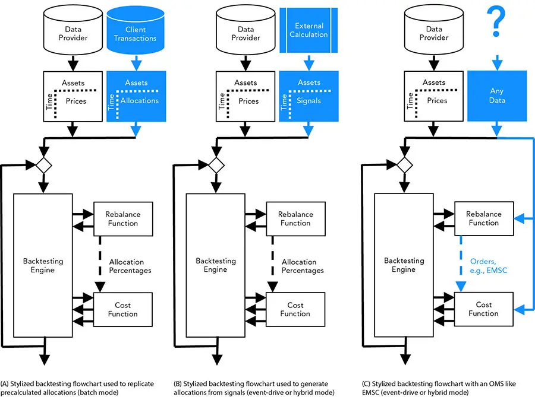
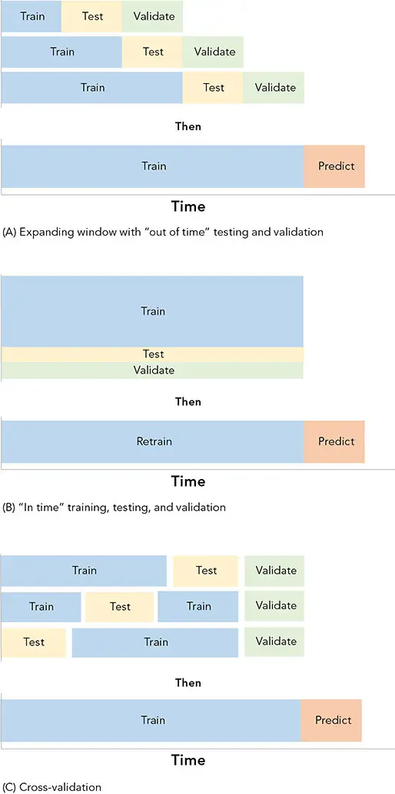

# 回测

*预测风险与业绩*

在过去的 13 章中，我们定义了产品、规划了流程、用治理加以武装、收集了数据、识别了关键特征、建模了风险与收益，并将模型组合为可投资的建议。这段旅程需要许多探索性的决策与近似，因此在比建模时更真实或更具预测性的条件下检验它们，将是明智之举。在量化金融分析中，回测（backtesting）的作用类似于药物的临床试验。我们希望在将这一虚拟创造物投放于现实世界之前，先在实验室环境中检验它。

回测对于为我们自己、投资者以及利益相关者建立对策略的信任和信心至关重要。它常因任何雄心勃勃的事业所固有的不确定性而遭受诟病。尽管如此，回测仍是值得的，其价值在于：

   **改进逻辑。** 我们可以用比建模时更严谨、更复杂、更细致的方式来检验模型。

   **建立创新流水线。** 一个稳健、可靠的研究流程依赖于策略的"装配线"（assembly line）以及相应的质量控制机制。

   **压力测试与敏感性分析。** 用人造数据集和历史数据集检验模型，可以暴露模型的缺陷和弱点，并让我们将*科学方法*（scientific method）^1^ 应用于实验。

   **提升交易效率。** 精简并从策略与流程中榨取每一分利润，可能是一家成功企业与一家仅止于纸上谈兵的企业之间的差别。

   **识别局限。** 通过这些测试，可以识别我们的运作包络（operating envelope）的边界，并建立对运作结果的预期（[第 18 章](ch18.md)）。

   **优化维护。** 通过执行、再平衡和过渡管理（transition management）等实践来规划投资组合的高效运作（[第 16 章](ch16.md)）。

   **制定应急预案。** 为在压力下管理投资组合制定应急预案——当市场动荡、客户不满、计划看似可疑时（[第 19 章](ch19.md)）。

   **便利执行与订单路由。** 构建并测试一个可应用于实盘交易的计算机程序。^2^
   **监控、报告与归因。** 回测分析的后端报告业绩与风险统计量，并将这些指标与历史数值和趋势进行比较；同样的逻辑可以创建一个仪表板，在语境中监控实盘执行。

## 回测器的特征

**自建还是外购？** 所有模拟都是不完美的，都依赖于假设。自建模拟的最佳理由是透彻理解其假设与后果。

能够针对特定问题定制模拟至关重要。尽管商业开发商花费大量精力使其软件灵活、统一、功能丰富，但对于一支称职的量化团队而言，这些努力大多是不必要的。购买昂贵的第三方软件还可能需要昂贵的运作流程，并常常因专有修改而产生无人支持的软件分支（fork）。^3^ 对于分析师在当下所需的功能而言，一套数量更少但更有价值的功能集加上一个略显笨拙的界面，远比一个为"满足所有人需求"而构建的用户界面更高效、更经济。定制化可以带来竞争优势、额外的 alpha 来源，或一项关键功能。

**模型误差与运作误差。** 商业软件有诸多缺点：它并非完全透明，常常具有限制性，且可能复杂到使运作误差成为重大风险。若建模者并非专家，模型误差便成为首要关切。

将专有模型的结果与商业产品进行对比，可以发现前者的疏漏细节以及后者的假设（与错误）。^4^ 构建模型以模仿现成产品，并在此基础上扩展，可以使开发立足于坚实的基础。

**集成、效率与经济直觉。** 一个良好、可复用的回测模拟必须与数据系统、研究工具、上下游交易、执行流程以及归因工具相集成。若代码旨在测试后用于交易，就必须高效。这些需求得益于一种研究人员和投资组合经理常常忽视的技术精深性。尽管技术很重要，建模者必须理解市场力量与执行动态。这种领域知识对非技术型交易员而言可能出于直觉，但在程序员中却很罕见——后者过于频繁地寻求"放之四海而皆准"的技术解决方案。花时间与数据和因果链亲密接触。从参与者（agents）而非流程的角度思考，从资金转移而非收益的角度思考，是有益的、有助的。若参与者视角不适用，次优选择是以现金流（cash flows）而非收益等更抽象的概念来思考。

**批处理与事件驱动。** 对回测器进行分类时，一个重要区别在于它们是被设计为在预处理的*批处理模式*（batch mode，图 14-1A）下运行，还是以在线的*事件驱动模式*（event-driven mode，图 14-1B 与 C）运行。批处理模式回测器常被视为粗糙的工具，而事件驱动模拟则更灵活、更真实。两种模式都有各自的绝佳理由；能够同时使用两者的模拟器将具有巨大优势。^5^

**图 14-1** 回测器的运作模式

**批处理模式**，又称*向量化*（vectorized）回测，有几项独特优势。它比事件驱动回测*更简单、更透明*。设计和构建一个能力有限的独立模拟器是一项相对直接的任务。粗糙的回测通常出于简洁而以批处理模式编写，许多甚至用 Microsoft Excel 这样的简单工具编写。批处理模式回测*易于扩展*（scalable），且易于适配到云端，以获得近乎无限的计算能力。设计良好的事件驱动模拟也可以使用这些资源。批处理模式回测也*高效*。批处理模拟可以被预处理，不必在分析时执行。它们可以在任何时间运行，通常分阶段进行。这既是优势也是劣势。正如我们将看到的，事件驱动模拟模拟"实盘"执行的能力可能是有用的（例如对 EMSC 对象）。向量化代码也更容易编译、并行化，通常比必须顺序执行的事件驱动代码更快。最后，回测*可复用并产生可累加的结果*。预处理的结果可以被复用和重组而无需重新运行。它们甚至可能包含*迁移学习*（transfer learning）。

**事件驱动模式**模仿人类（参与者）对价格变化、经济数据发布、由先前事件触发的交易或其他信号等事件作出反应的行为。事件驱动模拟可以*更复杂、更真实*。事件驱动技术能够纳入许多难以用向量化格式建模的或有细节和多期细节。资产之间以及跨时期的*相互作用*（interactions），以及路径依赖（path dependent）的计算，用事件驱动技术建模比向量化格式更直接。常见的操作，如多期执行、条件订单和对冲，用事件驱动模型易于实现。

对于自动化策略，事件驱动回测提供了*可复用、一致、可靠的代码*这一宝贵益处。事件驱动代码模仿顺序执行和条件订单执行，并纳入可被"抽取"（lifted out）用于执行的逻辑。通常，同一套代码可以服务于研究、测试、实盘执行与订单路由，以及业绩归因。复用最大限度地减少了在不同实现中复制投资逻辑时的翻译误差。高度优化的高频代码可能难以构建以供复用。由于事件驱动代码是*模块化的*（modular），不同的例程可以远程分布。它们可以与交易所同处一地（co-located），也可以驻留在云端，以获得可扩展的资源，并更稳健地抵御本地断电和断网等连续性问题。

**混合执行**（结合向量化与事件驱动模式的回测）可以减少模拟和开发时间。它可以降低当前开发的学习曲线，而在使用遗留代码时，可以让策略师将时间和精力集中于创新和研发盈利策略。混合执行提供：

   **预处理**用于耗时的分析。

   **集成**众多可复用的研究。

   **便利性。** 混合回测器可以组合涉及不易集成的技术的不相关分析。

   **工作流。** 混合回测器可以组合跨越多种技术、地理区域和时区的人员的努力。

   **两者之长。** 上述事件驱动模型的全部益处。

**可解释性**是回测的主要产物。由于大多数回测器是针对特定情形设计的，研究人员可能跳过对结果归因至关重要的功能。一些常见的过度简化包括：

   **记录保持**仅在账户层级而非每只证券。

   **使用周期**而非实际日期，可能导致不精确的时序规则。^6^
   **简单的杠杆与现金储备**，而非复杂的现金管理——包括用于现金拖累（cash drag）、保证金和杠杆的现金归集（cash sweep）和透支。^7^
   **专注于风险与收益的统计度量**，而非以决策为中心的归因分析，如 Brinson 业绩归因法。

**新手的错误。**
可避免的错误不胜枚举，但最严重的包括：

- 过拟合（overfitting）和"p 值操纵"（p-hacking）
- 前视偏差（look-ahead bias）和数据窥探（data snooping）
- 幸存者偏差（survivorship bias）
- 混淆收益分布与预测能力
- 成本、费用与容量限制（capacity limitations），尤其是在做空时

## 主要组件

回测器可以被视为对应于市场参与者的多个参与者（agents）的组合（图 14-1）。基于参与者（agent-based）的结构帮助我们可视化所模拟的对象。想象参与者的目标与挑战，有助于防止错误，正如估值得益于现金流建模一样。

由于模拟需要数据，建模*基金的IT（信息技术）部门*（the fund's information technology group）的行动通常是常见的起点。对于事件驱动系统，这些数据应以准确模拟实盘交易的数据流（feed）形式提供，包括未经拆股和股息调整的时间点（归档）数据——与算法在"实盘"运作时接收数据的方式一致。该数据流还可以包含订单簿（order book）信息和信号，包括来自向量化模拟的预处理输出。对于旨在创建可"上线"的可复用策略的回测器而言，准确模拟来自众多真实提供商的数据流可能是一项庞大的工程，包括纳入各种分歧和复杂的结构与字段。*数据处理器*（data handler）可以包含专有的清洗和聚合工具。*回测引擎*（backtesting engine）迭代并跟踪业绩，以模仿*托管机构（交易）、银行（借贷）和后台（会计）*的服务。它是模拟的骨干，不随策略而变化。最简单的版本可以跟踪盈亏，但更复杂的实现会跟踪*税收批次*（tax lots）和账户位置、成本和费用（包括涉及*门槛收益率*（hurdles）和*高水位线*（high-water marks）的路径依赖费用）、独立管理账户（separately managed accounts, SMAs）以及其他复杂性。

该模块还可以跟踪杠杆、现金拖累、透支费用以及借贷。简单版本可能收取无风险利率，而其他版本则考虑超额现金和杠杆的时变借贷利率。对于结合了高利率时期（如 20 世纪 80 年代初）和低利率时期（如 2008 年至 2015 年"金融抑制"（financial repression）和零利率政策\[ZIRP\]时期）的长期模拟，准确核算这些利率至关重要。这些机制应反映基金的情形，可能很复杂。例如，借款可能是自动的（达到某一上限），但偿还信贷额度可能需要基金明确决策，因此需要基金模块采取行动，因为杠杆的使用可能是有意的。

*基金*（fund，图 14-1 中的再平衡函数）通常由一个步骤表示，但它实际上由多个参与者组成。如果编写得当并经过充分测试，基金模块可以被"抽取"出来，复用于实盘交易。该模块可以在每一步迭代运行，也可以由事件管理器触发投资组合经理模块。

*投资组合经理*（portfolio manager）和*投资团队*传递策略响应。拥有一个访问执行结果的反馈回路非常重要。投资决策通常基于投资组合的构成和账户层级的盈亏作出，而不仅仅是市场水平。交易团队或经纪商可能选择不执行某项请求，或仅部分执行。在某些情况下，收到的价格可能与下单时可获得的定价信息不同（*执行差额*，implementation shortfall）。投资组合管理模块可能具有预测这些值的预测算法，包括*市场冲击*（market impact），并可能根据经纪商执行所提供的反馈（*市场模型*，market model）调整预测。该信息还可用于执行模块中具有成本效益的*路由*（routing）。

*交易团队*选择交易决策（*执行模型*，execution model），包括择时、分期、买入、卖出、撤销、杠杆和仓位。订单逻辑可能很复杂；幸运的是，交易所已经将订单编纂成典。不同交易所可能有不同的订单。^8^
这些细节对于精确模拟可能是必要的。*风险管理职能*可以包含在投资组合管理模块中，因为它基于风险管理策略生成决策。风险策略可能涉及路径依赖的回溯指标和前瞻性预测指标，如同投资策略一样。公司的风险逻辑应当被建模，包括触发器和监管要求。风险指标可能通过借贷利率以及杠杆和做空的可用性影响资本成本。

风险管理的成本或收益远不止于归因统计。风险还体现在用于通过风险调整后资本回报率（RAROC）等指标计算业绩的无风险利率中，或通过门槛收益率体现在业绩激励中。*经纪商*（broker，图 14-1 中的成本函数）模拟市场对投资组合管理模块所创建订单的反应。它应当是反应性的，不应纳入任何由投资或风险策略定义的行动。它基于数据流和模拟的市场反应（如市场冲击）"执行"订单，并且应当足够智能以提供对事件的真实模拟。例如，它可能对一笔超过某投资当日成交量很大比例的订单仅提供部分成交。一个能够进行多期行动的经纪商函数可以在下一次迭代中继续执行部分成交的订单，直到完成或撤销。由于订单的执行可能不同于意图，向下一次迭代的投资组合管理模块提供反馈很有价值。

经纪商计算可能繁琐且耗时，因为市场数据可能非常庞大。如果频繁重复，基于成交量百分比（percent of volume, POV）等统计量计算执行可能代价高昂，但精心设计可以解决许多问题。^9^
对于更准确、更真实的模拟，包括将投资组合管理模块"投入"生产的能力，经纪商模块必须被设计得像一个真实的经纪商通信。这使得订单可以"拨动开关"被路由到实际接口，而无需修改。每个经纪商和交易所可能有不同的方法，回测器应当将订单路由到不同的模拟目的地。类似地，每个经纪商和交易所可能以不同方式实现其各种输出和过程查询。诸如 Bloomberg 的 EMSX 之类的聚合模块用于统一各种方法。否则，与不同方通信可能需要不同的语法和协议。对这些接口的模拟使得代码在用于实盘交易时可以被测试和信任。

与经纪商或算法执行的交互应当在经纪商函数中模拟，包括查询诸如交易执行状态等信息。交易台和经纪商可以通过公式（如超过 VWAP 的价格改进）获得报酬，这也可以被建模并纳入回测模拟。正如经纪商的众多服务对于算法执行而言并非必需（尽管常常被要求），与交易订单管理系统（TOMS 或 OMS）或执行管理系统（EMS）的交互可能需要为"即插即用"（drop-in）代码复用而模拟。

**业绩度量与归因，以及交易成本分析（transaction cost analysis, TCA）。** 适当的"取证"分析是重要步骤，包括将结果分解并归因于具体的投资决策，而非笼统的统计量。虽然简单的 Brinson 归因可能有效且易于沟通，但也可以采用复杂的机器学习分类和预测。

深入的 TCA 可以在此阶段执行，并用于定期再训练模型的训练阶段。在这种情况下，重要的是采取通常的预防措施以防止偏差和敏感性，包括对 TCA 模型的敏感性和过拟合分析。

"实时"调整的较轻量 TCA 应当归入风险管理模块，并用于投资组合管理模块中的决策制定。"闭环"（in the loop）执行的 TCA 计算成本可能较低，因此在实盘执行中可以高效。复用预处理值的多遍回测可以允许进行多次模拟，同时在实盘系统中模拟复杂计算所产生的边际成本递减。分箱（binning）和 VWAP 技术就是其中的两个例子。

取证模块也可以被"抽取"出来，用于监控实盘业绩的仪表板。许多指标和框架可以组合形成一幅马赛克图景；监管的、公式化的和行为学的度量都可以纳入。

客户和董事会常常以不同甚至相互矛盾的方式看待风险和业绩。他们可能在好时光中以同业为基准衡量业绩，而在基金跑输指数时以其他参考投资组合为基准——似乎总有人比投资组合表现更好。滚动平均值（如三年和五年回报）以及更具时效性的业绩（"你最近为我做了什么？"）在不同时候被引用。痛苦指标，如回撤长度（drawdown length）和差额（shortfall），可能对留住投资者和保住饭碗至关重要（见[第 18 章](ch18.md)）。

事后分析应当面向众多受众，包括投资者、风险经理、监管者^10^和客户。可能需要各种（有时相互矛盾的）度量。例如，高频时间加权业绩可能对投资团队可用，但客户可能收到基于修正 Dietz 法（modified Dietz accounting）的、频率较低的业绩报告。模拟客户将看到的内容有助于预测资金流动，并可能是展示假设结果所必需的。

## 关于订单的一点说明

交易所、经纪商和其他参与者在下单时都使用各自的行话。这些行话的存在是为了速度和精确性，并且往往早于自动执行。它们是法律上健全、经过实战检验的投资决策沟通方式。它们易于研究且文档完善，但我们将快速概述一些更常见和更核心的命令。当我们回顾其中一些订单时，应当显而易见的是，模拟它们所需的回测技术可能复杂但确定。

这些简单订单的重要用途可能发展为新的策略或策略增强。例如，一个允许经纪商购买若干证券中任意一种的订单，可以在一组无差异资产中实现最优执行，而无需投资组合经理或交易员进行微观管理。它可以将一个过于敏感、优柔寡断的优化转化为一个能够在执行时选择最佳资产的优化。

**一般订单。** 最通用的订单类型是买入、卖出和撤销。它们通常需要澄清，包括数量、时间或价位（限价、价格或百分比）。订单可以是激进的（流动性获取者，liquidity takers）或被动的（流动性提供者，liquidity providers），如同做市商所使用的。被动订单可能导致更好的价格或错失机会，通常比激进订单成本更低。不同的交易所可能为提供流动性提供各种回扣；一些交易所为获取流动性提供回扣。

**有效期（time-in-force）**修饰符，如成交或撤销（fill or kill, FOK）、有效至日期（good till date, GTD）和立即或撤销（immediate or cancel, IOC），是最常见的修饰符之一。模拟这些订单需要成交量数据来确定市场是否能够支持订单规模。

**条件订单**（contingent orders）涉及一个条件，即"若此则彼"。订单可以以价位和百分比为条件，并可能包括一个"加成"以允许糟糕的执行或滑点。一对一撤销（one-cancels-the-other, OCO）订单是一种条件订单。OCO 的篮子版本也是标准的；^11^它们可能被称为竞争性报价征集（bids wanted in competition, BWICs）和竞争性询价征集（offers wanted in competition, OWICs）。BWICs 和 OWICs 可以净额化买卖价差，并消除大量交易（如再平衡投资组合时）的时序不确定性。其他条件订单包括跟踪止损（trailing stops）和跟踪限价（trailing limits）。

**保证订单（guaranteed orders）。**
正如保险公司为便利和安宁收费，经纪商提供保证订单以换取更高的佣金。订单可以在某个时间（如开盘或收盘）或某个特定价位（如 TWAP）得到保证。使用这些订单可以使回测器预测更准确，而便利的成本微乎其微。

**最优执行。** 当指定参数时，它们通常会导致机会成本。取决于经纪商是作为委托人（principal）还是代理人（agent），参数可能延迟执行，直到经纪商确信他能在不对其业务造成不当风险的情况下提供所需交易。如同几乎所有便利一样，附带条件的订单可能有隐性成本（包括延迟和更差的价格），这些成本可以通过交易员主动管理订单来避免。一个具有优势或意向（axe）（或带一点运气）的好经纪商可以提供更快的执行和价格改进——即使他自身也从中受益。其他结构性益处也存在，如*订单流付款*（pay for order flow）。

**订单簿（order book, LOB）和市场深度（depth of market, DOM）。** 市场是复杂的、低效的、割裂的。订单从各种来源（其中一些在实盘交易中可能无法访问）聚合，并按优先级堆叠在最优买卖报价（Best Bid and Offer, BBO）之后。这就是为什么许多回测器用历史交易数据的 VWAP 来近似执行价格，假设其订单会替代当日发生的实际交易，而被替代的订单则会消失。

访问经理可获得的买卖历史，可以让回测器在订单规模小于市场深度时准确确定执行价格。它还可以在订单大于订单簿或执行算法比*扫荡订单簿*（sweeping the book，扫单成交订单，"持续买入，我会告诉你何时停止！"）更复杂时估计价格。一些最精密的回测器模拟整个订单簿，但它们需要包含订单和交易的大型历史数据集。

**佣金与费用**也因参与者而异，可能基于复杂公式，包括为提供流动性和交易量而给予的回扣。一些交易员，包括高频交易员，可以基于套利费用结构建立整个商业模式。^12^
## 特殊信号

模拟可能笨拙而复杂。非流动性和私募资产、相互竞争的约束以及税收，可能易于解释但建模却令人困惑。将几个有效前沿（efficient frontiers）简单地组合在一起，而这些前沿涉及互斥选择（资产 A 和 B，*或* C 和 D，*或* E 和 F），往往足以产生一个奇怪且不直观的解（例如，一个有折角或断裂的有效前沿）。

复杂性倾向于使模拟复合化并使其难以处理，这就是为什么模拟常常被简化并针对特定考虑定制，而非运行"大杂烩"（everything but the kitchen sink）。复杂特征可能包括多期执行和交易成本预测。诸如换手率约束（turnover constraints）之类的捷径可能产生不精确且有害的结果，限制了机会集。

其他商业模式可能需要专门的工具，如微观结构模型、订单簿重构与模拟。衍生品、结构化产品和非主流债券（off-the-run bonds）都需要细致处理。

跟踪账户位置和税收批次的税收感知模型（tax-aware models）对于机构（*持有投资*（hold-for-investment）会计与*盯市*（mark-to-market）会计）和零售管理者（家庭化，householding）都可以是一项战略性优势。但税收效应可能难以建模或基准化，包括税收亏损结转（tax loss carryforwards）的有限益处（相对于因盈利而产生的无限税收）。

诸如将每个批次视为不同投资之类的捷径可能不尽如人意。更复杂的是，指向同一投资的税收批次之间的高相关性可能降低优化和其他分析的质量。更专业、更复杂的建模可以成为一项战略优势。^13^
通常，管理具有共同利益但不同风险承受能力、收益目标、负债和税收待遇的多个账户需要审慎处理。投资组合常常受困于分层费用和嵌套投资，导致巨大的低效，这些低效可以通过彻底的持仓层面分析来解开并加以利用。

## 数据

回测可以使用多种技术和数据库来提取数据。复杂的数据源是一种必要的现实，但可能有缺陷，例如前视偏差（look-ahead bias）、信息泄露（information bleed）和数据窥探（data snooping）。所有这些技术都需要将训练集、测试集和验证集分开（图 14-2）。

**图 14-2** 回测器的验证模式

在确定再训练频率时，在工作模型部署之前对其进行训练和测试（包括定期计划再训练）至关重要。由于职场心理或政治现实，一旦模型投入生产，可能会面临巨大的诱惑和压力对其进行临时再训练，尤其是在回撤期间。最好预先考虑触发的再训练和再平衡，并将这些事件纳入测试方法中，使其成为计划的一部分，而非计划之外未经验证的例外。

**历史数据抽样**（historical data sampling）是回测最常用的过程。*走步测试*（walk-forward，交叉验证）和*扩展窗口*（expanding window）方法如同重播历史般逐步遍历数据。走步测试可能更擅长捕捉市场状态（regimes），而扩展窗口方法可能更好地模拟演变和平均值。历史常常从头到尾播放，并将回测应用于尽可能多的数据，涵盖众多市场状态。

数据抽样有许多变体，包括重叠的滚动期间、将数据划分为不重叠的期间，以及挑选代表关注时期的期间，如情景测试。情景还可用于元训练，以确定模型何时最有效或最敏感。这些方法的一个常见局限是，它们产生的评估可能引人注目，但严格来说只是轶事。

历史模拟常常因选择参数或时段的无意偏差，以及剔除"异常"时期和离群值的诱惑而失败，这往往会注入前视偏差。另一个常见错误是倾向于使用尽可能多的历史，这会将结果与总体统计量（如平均值）相混淆。使用情景（包括商业周期的阶段）可能产生更聚焦的评估（"少即是多"）。一些模型，如高斯混合（Gaussian mixture）和隐马尔可夫（hidden Markov）等状态空间模型，能比其他模型更好地处理混合的市场状态。

**重抽样**（resampling），包括交叉验证，从历史中以*折*（folds）的形式提取数据，这些折可以是序列的，也可以是随机选择的（自助法，bootstrapping）。重复重抽样通过增加可用于回测的数据量并降低过拟合的可能性来改进历史抽样。然而，它引入了重叠集合的额外问题，并破坏了原始数据集中可能存在的自相关（autocorrelation）、聚类（clustering）和非平稳性（non-stationarity）等特征。

**基于因子**（factor-based）的回测采用更科学的方法，通过基于通胀和信用利差等驱动力来建模投资业绩。由于它们的输入是理论的、有针对性的、可解释的、可解释的、相关的、实用的且更独立的，分析师可以尝试与历史"押韵"或从未发生过的潜在情形。一个例子可能是：

考虑到当前条件以及自 2007–2008 年大金融危机（Great Financial Crisis, GFC）以来建立的加强保护，投资组合对另一场信用危机会作何反应？

基于因子的模型很诱人，因为它们允许直接、明确地指定复杂而精确的情景。除了分析师定义的情景外，这种方法还易于通过基于批评者和利益相关者的假设运行回测来回应他们的质疑。因子可以组合以模拟过去从未发生的事件，但合成事件的理论性质需要谨慎，例如，建模因子之间未被观察到的假设性相互作用可能不确定。

准确建模投资对其因子的复杂价格反应很困难。一些更具可解释性的基于因子模型版本依赖于统计模型，对简单投资使用协方差，对衍生品和结构化产品等非线性投资使用现金流模型。复杂模型可能包括因果关系和机器学习。

**合成数据生成**（synthetic data generation）试图通过生成具有"完美预见"（perfect foresight）而非模拟因子的人工历史来解决轶事式模拟的问题。使用合成数据类似于选择高方差模型而非高偏差的因子模型（尽管合成数据也可以用高偏差模型生成）。这种方法的高方差性质注入了随机性和概率，缓解了对因子模型可能被过于精确且不准确定义的担忧。由于对合成数据有完全控制，这种方法可以通过在保持方差不变的情况下增加抽样次数来提高准确性。

一种简单的合成价格数据可能使用布朗运动（Brownian motion），通过 Cholesky 分解（Cholesky decomposition）保留资产的相关性结构。Cholesky 分解解决了在生成合成数据时常被忽视的一个重要细节：相互作用（interactions）。^14^
另一种略为朴素但流行的方法使用从参数或非参数分布（如极值分布）的简单蒙特卡洛抽样。由于评估逆累积分布函数（CDFs）的困难，分析师常常求助于不太真实的参数分布和连接函数（copulas）。当使用如分位数-分位数（q-q）图这样不精确、不可靠的评估时，拟合优度常常被错误估计。

更精密的方法可能使用适配于生成时间序列数据的生成对抗网络（generative adversarial networks, GANs）。合成数据可以用非参数方法生成。^15^
此外，如果需要更多控制，参数方法可以施加偏差。

以这种方式可以产生近乎无限量的数据，从而解决数据不足或关键少数派数据集的问题。可以回答关键的查询，例如通过使用看似模拟情景的合成数据集来评估基于因子方法的有效性，尽管规范不那么直接。如有必要，可以通过生成众多演变并选择代表情景的那些来产生合适的数据集。如同基于因子的方法，生成数据的价值取决于其真实性。不真实的合成数据可能困扰一些为时间序列学习而设计的算法。

## 偏差、验证与超参数化

本书的很大一部分详细阐述了金融模型中的偏差。根据所尝试的试验次数调整统计量，并将结果与基于任意决策（而非模型预测）的模型结果进行比较，有助于管理偏差。常识、领域知识和实用性，如检验无套利条件，可能比受不当数据（如多重共线性、自回归或非平稳的数据）扭曲的理论测试更准确、更有效。

关于回测的正确使用及其与科学发现方法的比较，已著述颇多。适当地增加试验次数也提高了发现一个虚假盈利结果的几率。许多有价值的建议需要克制。研究应当对探索性试验吝啬（抵制试错研究的自然诱惑），以使回测仅限于测试，而非模型的迭代改进。在许多高压、结果导向的投资环境中，要求策略师出于害怕偶然发现一个幸运结果而限制其研究广度，可能要求过高。

即使面临处罚、虚假结果和糟糕的样本外（out-of-sample）业绩的威胁，期望人们违背自身利益行事可能是不合理的。他们可能有巨大的压力去走捷径，甚至欺骗以"争取时间"，尤其是在其激励鼓励不良行为时。没有什么能替代诚信、智识诚实和良好治理，以帮助参与者考虑审慎研究的长期影响。量化研究员和策略师是拥有独特洞见的专家，他们有责任向管理层、销售人员和客户解释其错综复杂、常常任意且难以理解的方案的可靠性与真实性。

## 评估策略

量化方法通常易于分类。它们常常依赖精确的实现来获取优势。量化从业者自然警惕泄露其"秘方"。强调量化策略的共性而非实现细节的探究性问题，有助于缓解偏执。访谈者的知识和尽职调查清单可以证明详细了解基金投资流程的必要性。投资者或配置者彻底理解策略至关重要，包括：

   策略如何诞生

   收益和风险的来源、可扩展性（scalability）和容量限制（capacity constraints），以及外部限制

   风险、仓位、持有期，以及杠杆控制与裁量

   基金的"优势"（edge）何在，包括结构性优势或小众能力

   竞争的影响，包括套利

   数据挖掘（data mining）的可能性

   在建模所涉及的众多复杂决策中的判断质量，包括数据策展和清洗

研究流程未来成功的稳健性和可靠性，常常通过审视创意生成、数据管线、特征生成、模型拟合、测试、验证和运作监督的严谨性和质量来揭示，包括执行模型的真实性、运作的稳健性和可扩展性，以及包括监控硬性和软性限额在内的许多细节。

回测是验证系统化投资流程的重要步骤，因为它结合了上游无法获得的量化严谨性与一定程度的复杂性。正确使用，回测可以帮助发展一个更坚实、更可靠的企业——尽管回测也有其复杂性限制和偏差。回测之所以名声不佳，是因为它依赖于有缺陷、有盲点、有诱惑的人，因此回测必须谨慎使用，并怀有良好意图。从回测中得出的结论可以帮助促进适当的纪律，但必须予以遵守，而非在没有充分证据的情况下被忽视，即使对系统的信心受到挑战。

1. 理想情况下，我们会使用合成数据来创建庞大的数据集和精确的情景，或干预（*do 演算*，do calculus）。即使是"普通香草式"（plain vanilla）回测也允许我们执行科学方法的精髓：观察、研究、假设、实验、分析、结论，最终实现改进和稳健性。

2. 你可以在本书网站 [www.QuantitativeAssetManagement.com](http://www.QuantitativeAssetManagement.com) 上找到用于 MATLAB 的 EMSX 模拟器（我们称之为 EMSC）。该模拟器可以被替换为真实的执行对象（如 EMSX），从而将你的回测代码无缝地转变为实盘系统化交易模型。"Bloomberg 的执行管理系统 EMSX 是一款精密的、经纪商中立的交易工具，允许你无缝路由到近 2,000 家经纪自营商目的地，包括超过 50 套算法套件。"来源：Bloomberg，"Execution Management System"，2008 年。

3. 许多"同类最佳"的软件包是"对大多数人而言能做大多数事"，但在使软件对大多数人可用的过程中，开发者往往使它几乎不可能做某些事。如果你想纳入不符合他们框架的想法（如本书中的那些），自建一套"按你的意愿有机生长"的内部系统（"自己动手"）可能比即兴发挥、试图让一个软件包做你需要的事（"另起一摊"）更容易。即使对软件执行良好的修改，也会迫使你使用该软件的不受支持版本（"脱离模型"），你的定制版本（"分支"，fork）最终也将与原始制造商的未来更新不兼容。

4. 尽管我们使用过许多优秀的金融工具，但我们发现它们的数据和分析中都存在错误。任何系统，即使是设计良好的系统，都建立在可能不适用于你"用例"的假设之上。能够访问这些假设并审视代码，是真正掌控你的流程所必需的。

5. 使用这两种模式、主要在我的哥伦比亚大学课程中开发的 MATLAB 回测框架的若干示例，可在本书网站 [www.QuantitativeAssetManagement.com](http://www.QuantitativeAssetManagement.com) 上获取。

6. 周期性规范（如月度再平衡）而非实际再平衡日期，可能因假日、周末、员工休假和其他技术性问题而偶有几天偏差。过早或过晚买入或卖出，可能意味着错过一次巨大的涨势或跌入一场暴跌，并产生不准确的回测结果。

7. 本书（以及我的课程中）使用的回测框架集成了许多有用的细致功能，包括灵活而复杂的路径依赖型基金费用计算（如高水位线）以及借款（杠杆）和贷款（超额现金）的记录。

8. 订单逻辑由执行模拟器（本例中为 EMSC）处理。执行可以用许多方式模拟。例如，可以使用高频数据为每一天创建价格和成交量的直方图（按价格分桶的成交量）。每个分桶的合成订单可以放入由模拟器管理的匹配账簿中。如果在某一天，市场为 100 股支付 10 美元，为 50 股支付 12 美元，为 25 股支付 13 美元，那么这三个买卖报价可以输入到一个合成订单簿中。我们可以规定我们能够交易*平均日成交量*（average daily volume, ADV）的 50%。当回测器试图在该日按市价购买 75 股时，它可能以 10 美元获得 50 股，以 12 美元获得 25 股，*成交量加权平均价格*（volume-weighted average price, VWAP）为 10⅔ 美元。

9. 在 POV 的情况下，预先为每一天的每个 bar 计算累计成交量，可以快速计算 VWAP。一种涉及分箱的方法已在上一条脚注中描述。

10. 管理策略的许多方面在业绩面前"退居次席"，直到它们成为唯一重要的事。合规和监管问题就属于这一类。时间管理是任何项目的关键技能。定期处理这些重要但不那么紧急的事务，可以帮助使令人痛苦的时期变得可控。等到它们变得紧急时再去处理，代价可能高昂，并可能使基金的运作脱轨，甚至导致其失败。

11. 篮子也可以是 OCO 的对立面；它们可以是全部或全不（all-or-none），或"想要多少拿多少"。

12. 在传统金融（TradFi）中非法或困难套利，在加密（DeFi）中可能容易得多。即使是 DeFi 套利，在某些情况下也可能被撤销和回滚。如同 TradFi 交易，DeFi 交易也受法律行动约束，并可能被追溯裁定为非法，即使在执行时该交易并未被明确知悉为非法。

13. 例如，一个外籍账户可能通过择时投资（及其股息）而受益，使应税事件发生在受益人身处外国时。

14. 如果不考虑相互作用，可能会生成独立看不错但与其他数据一起使用时却不然的合成数据。例如，如果两只高相关股票的收益分布是独立生成的，蒙特卡洛模拟可能反复为一只股票抽出上涨日，为另一只抽出下跌日，反之亦然。通过保留相关性，Cholesky 方法使两只股票的蒙特卡洛抽样在被一起抽出时更可能按预期行事。

15. 在本书网站 [www.QuantitativeAssetManagement.com](http://www.QuantitativeAssetManagement.com) 上查找使用 GANs 生成合成金融数据的示例。
