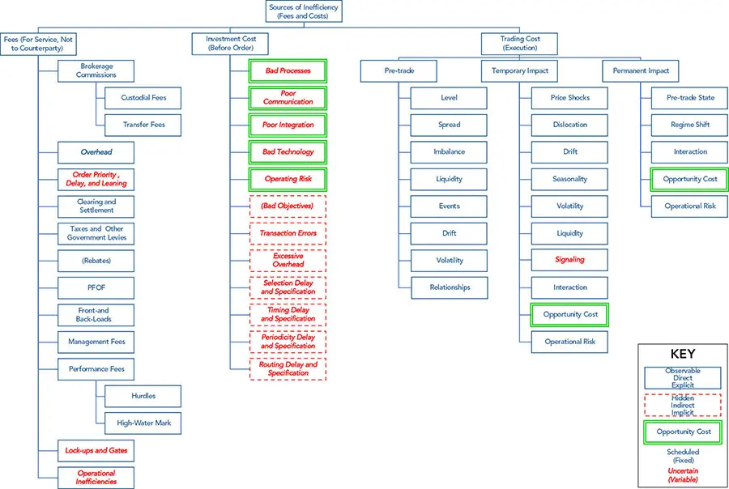

# 交易成本与费用

*不容忽视的细节*

交易成本（transaction cost）与费用（fees）是盈利能力的强大决定因素。它们复杂且难以建模。理想情况下，它们应当贯穿整个投资建模过程——从因子工程（factor engineering）到具体实施——但由于任务规模庞大且复杂，这一理想难以实现。

本章和下一章将深入探讨我们在[第14章](ch14.md)中介绍过的回测（backtesting）的种种细节。我们将更细致地考察代理范式（agent paradigm），讨论市场行为的建模方法，说明如何规划并对市场事件作出反应以确定合适的前进方向，并讨论当市场走向不利时的应急方案。

对于除最简单回测之外的所有回测而言，最重要的概念之一是*订单簿*（order book）。我们必须与*交易订单管理系统*（transaction order management system，TOMS 或 OMS）或*执行管理系统*（execution management system，EMS）接口或对其加以仿真。^1^ 此外，市场结构是一个庞大而独立的话题；我们将为讨论交易成本奠定基础。

*交易成本与费用*在多个层面影响我们的仿真。

**托管人、银行和后台（会计）**功能是回测器的核心。它们必须追踪各种费用，这些费用可能是路径依赖（path-dependent）的，包括*门槛收益率*（hurdles）、*高水位线*（high water marks）、*锁定期*（lock-ups）、*赎回门槛*（gates）以及其他复杂安排。它们还应当分离并追踪各项成本与业绩，以便对仿真进行取证分析。

**基金模块**（fund module）必须对经纪商模块执行的仿真交易作出反应，包括时机、选择、周期化（periodization）、买入、卖出、取消、杠杆和仓位规模。大额交易会改变市场（市场冲击，market impact），并可能反映在原始数据源的调整中。一个成熟的投资算法会尝试预测潜在交易的交易成本，并从以往的迭代中学习。该模块中的*预测*只能使用*过去的数据*，以避免前视偏差（look-ahead bias）。^2^ 成本仿真需要一个*市场模型*（market model）。一个非朴素（non-naive）的策略应当拥有一个*执行模型*（execution model），在考虑再平衡（rebalancing）策略、过渡管理（transition management）和退出策略等复杂性的前提下，制定应对成本的有效执行方案。

**风险管理功能**通常位于组合管理模块中，但也可以被独立出来并同时调用。由于缺口（shortfall）和市场冲击会影响风险，因此该模块同样关心成本。这些成本的影响包括流动性、做空能力、证券借贷费用以及市场冲击。一个全面的回测应当预见极端的风险管理情形，包括资金流动、"转向现金"（going to cash）、锁定期和赎回门槛。*执行策略*（execution strategies）应对成本，但不改变交易的意图。它们可以改变执行方式，并在成本使某一工具比另一工具更具吸引力时替换为相似工具（例如税损 harvesting，tax-loss harvesting），但前提是投资论点不受影响。*经纪商模块*使用的成本和费用模型与组合经理模块和风险经理模块不同。为简化起见，这种差异可以通过分析订单簿或仅仅是交易、报价和要价中的*未来值*所获得的历史值来推导。*业绩度量和归因*（performance measurement and attribution，例如 Brinson 归因）以及*交易成本分析*（transaction cost analysis，TCA）可以在仿真完成一次完整运行之后分解各项成本与费用。风险管理功能在循环中仿真此过程以及组合经理模块对此的反应。

## 订单与订单簿

简单的回测器受限于有限的市场数据格式。

   **高低开收成交量（HLOC）柱**（high, low, open, close, volume bars，即周期性汇总统计）是最容易获得的数据，但可能具有误导性，因为最高价和最低价可能来自冷门且难以访问的交易所，并可能报告无意义的离群值。

   **最优买卖价（BBO）**（best bid and offer）数据可以补充交易数据，但缺乏订单簿的深度以及来自暗池（dark pools）的信息。它可能由交易台无法访问的场所的报价组成。

   **时间柱、报价和成交**（time bars, ticks, and trades）更好，尤其是当它们包含买卖价时；然而，它们同样缺乏深度，并具有离散的频率。

   **原始逐笔数据**（raw ticks）可能提供足够的信息来形成更好的柱，例如*成交量柱*（volume bars）、*成交额柱*（money bars）或基于复杂域的柱，如*失衡柱*（imbalance bars）。

   **高频数据**（high-frequency data）可能包含所有的交易、买卖价，甚至订单簿信息。这些"大数据"，以及在较小程度上仅含交易的数据，可能非常笨重，以至于需要专门的工具，如 MATLAB 的 datastore（数据存储）函数或像 KDB 这样经过调优的数据库。稍加练习，使用这些工具就会变得得心应手。从更大的数据集中提取样本往往需要时间。保存中间表可以避免在查询未改变（例如不需要新的预测变量，或研究人员不需要更新的数据）时访问完整数据集。

**订单级数据**（order level data）对于除最粗略回测之外的所有回测都至关重要。其优势包括使用 OMS 或 EMS 对复杂订单进行*仿真执行*，例如使用 EMSC 仿真器。^3^ 恰当的订单设计与执行可以带来巨大价值，或厘清重要细节的后果。例如，大额订单必须恰当地把握时机以最小化市场冲击。

*订单簿重建*（order book reconstruction）和*交易还原*（trade reconstitution）自市场诞生以来就是宝贵的工具。重要的交易通常通过拆分腿（legs）并分散到不同时间、经纪商和交易所的方式来加以混淆。^4^ 在算法交易出现之前，观察公开喊价（open-outcry）参与者的行为并"读盘"（reading the tape）是常见的做法。

对相关但不直接相关的市场和产品进行三角测量（triangulation），例如从衍生品中蕴含标的（underlier）的价值，可以揭示有价值的见解。衍生品的复杂性和多样性提供了一座隐含数据的宝库，这些数据通常被忽视，正如 Henry J. Kaiser 所说的"穿着工作服的机会"。衍生品数据可以被利用以获得对标的资产行为的洞察，并被归类为另类数据（alternative data），不过如今这已很常见。理解订单簿历史是识别机会和仿真回测的宝贵一步。

*算法交易*（algorithmic trading）通过诸如*幌骗*（spoofing）、*隐藏订单*（hidden orders）、*暗池*（dark pools）、*流动性套利*（liquidity arbitrage）和*冰山订单*（iceberging）等战术彻底改变了这场对抗性博弈。这场军备竞赛中的强大武器包括*订单流付款*（payment for order flow，PFOF）以及将现代技术和计算机应用于剖析大型数据库以还原意图和行动。诸如*到达价*（arrival price）、时间加权平均价（TWAP）、成交量加权平均价（VWAP）和订单的*滑点*（slippage）等预处理统计量，可以通过加速重复仿真显著增强市场模型。

*订单簿仿真*（order book simulation）有助于得到更准确的样本内和样本外回测结果及模型训练。这在高频模型中至关重要，也能为低频仿真带来巨大价值。

## 费用与成本的来源

市场并非*无动于衷*（indifferent）；它密谋抽走利润，把企业榨干。许多策略被系统地设计成从这些费用和成本中获益，从订单流（flow）中产生优势，包括由银行、券商和自营交易业务所管理的策略。以预测收入和升值为业务重点的企业提供了这些订单流，并为此付费。专业投资者则通过工资、奖金、管理费和激励费受益。

**投资过程的阶段**（contracting services、策略决策、交易决策和执行）是划分费用和成本的自然方式，正如我们用基于代理的范式来描述回测一样。

*费用*（fees）和佣金是为诸如传达订单和保管投资持仓（例如托管服务）等服务收取的。它们代表在到达交易对手方（买方或卖方）之前被基础设施（包括经纪商、托管人、政府和交易所）吸收的资本转移。

*投资成本*（investment costs）发生在策略决策作出之后、订单传送给经纪商之前。这些成本源于将投资决策次优地转化为执行决策。一个彻底的回测器应当把这些摩擦作为*经纪商*模块的一部分进行仿真。在代码用于实际交易之前，移除摩擦仿真是至关重要的。把成本和费用放在经纪商模块中有助于确保它们从代码中被移除，因为经纪商模块在实盘交易中不被使用。这些额外成本可能由以下若干因素之一引起：

   **无知**（Ignorance）。投资团队在缺乏情境感知、与"一线人员"沟通不畅的情况下作出交易决策。

   **低效**（Inefficiency）。将策略决策传达给交易团队的运营低效。

   **约束**（Constraints）。对交易团队的约束可能导致次优订单。一些基金著名地将策略订单拆分为若干部分。这些基金在日内以随机的份额和随机的时间将订单传送给交易团队，而不是信任交易团队通过择时来增加价值。

   **延迟**（Delays）。临时性或无组织的流程可能比本章所推荐的系统化、有计划且预处理的方法耗费更多时间，并产生更多错误。

   **错误**（Errors）。操作风险无处不在，并以多种方式加以惩罚（包括时间和机会的损失、财务损失、监管麻烦、资金流出和声誉损害）。领导力、治理、系统化和自动化可以帮助缓解复杂性、限制损害并减轻操作风险的负担。^6^

*交易成本*（trading costs），如市场冲击，是在订单下达给经纪商之后由交易执行本身产生的。交易成本由*市场模型*使用过去数据（*回看*，lookback）进行预测，并由*经纪商模型*使用未来数据（*前看*，lookahead）进行仿真。

**模型**（Models）对于估计成本和费用是必需的。这些模型对回测至关重要，但理想情况下也应当与 alpha 模型和风险模型，以及配置和选择决策（包括优化）相集成。将交易成本仿真放在优化的目标函数中可能更可行，尽管不如将交易成本放在其他位置那样现实或精确。^7^ 在目标函数中的优雅实现可以促进高效计算，并培养强大的经济直觉。

*市场模型*旨在估计交易的费用和成本。它可用于计算潜在的*净*利润并识别有吸引力的替代。在回测中，市场模型由*基金模块*使用，但可在整个投资过程中指导投资（策略或 alpha）和风险决策。它涉及交易成本分析（TCA）以及使用历史信息的"循环内"（in the loop）预测。该模型可用于实盘交易。*执行模型*用于优化投资和风险决策的执行成本。它确定一些替代和订单细节，包括类型、时机、规模和路由。该模型可用于实盘交易进行预测和调整订单。

*经纪商模型*仿真执行，包括滑点。它是一个交易仿真器。它不限于从观察日期向后查看历史价格，可以使用未来信息（检查历史数据集中观察日期之后日期的数据）以提供更好的仿真值。*归因模型*（attribution model）分析风险和业绩，并将原因归因于具体决策和因子。该模型可用于分析实盘交易。^8^

**可见性**（Visibility）是费用和成本的另一个特征。一些费用和成本是列示的，而另一些可能被"打包"或隐藏，并以摩擦或滑点的形式出现。有些甚至是*潜在的*（latent）。

*可观察、直接和显性*的费用和成本，如税收和佣金，是明显的，且通常是按计划收取的。*隐藏、间接和隐性*的费用和成本不那么明显，因为它们没有被明确收取，但与一笔无负担的交易相比时却容易识别。由于它们必须被"反推"或估计，其大小（有时还有方向）可能存在争议，^9^ 但它们的存在是清晰的、有影响力的，有时甚至是压倒性的。

*机会成本*（opportunity costs）源于未能最优地*完成*订单，包括部分成交或错过的订单以及以更差价格执行的订单。机会成本的大小和归因通常不易量化。尽管它们是真实的成本，但量化其大小（甚至可能包括方向）取决于对未发生事件的假设；例如，alpha 衰减（alpha decay）假设订单本可以以某种理论程度的*滑点*被执行。

*硬通货*（hard currency）费用和成本是直接以货币转账支付的。这些费用是确定无疑的。*软通货和打包*（soft currency and wrap）费用和成本是缓冲和模糊全部开支的常见手段。例子包括*捆绑*（bundling）服务（例如"免费"提供数据和分析^10^）以及*专有架构*（proprietary architecture，一只持有另一只基金的基金，使两项费用复合）。

**可预测性**（predictability）可以将一个随机模型简化为确定性模型。*计划性（固定）*费用和成本通常是预先协商的。它们可能复杂、依赖于时间和路径，并且针对客户（如税收），但能以合理的精度和确定性获知。^11^ *不确定（可变）*费用则响应于必须以较低置信度估计的参数。

**影响**（effects）可以以多种方式感受到成本和费用。*有效前沿*（efficient frontier）是一个理论上界。*可达前沿*（accessible frontier）略低（盈利较少）且靠右（风险更大）。具体决策可以改变可达投资的位置；例如，保证价格、竞价征集（bids wanted in competition，BWIC）和报价征集（offers wanted in competition，OWIC）可能牺牲利润以降低风险。

*信息比率*（information ratio）和*跟踪误差*（tracking error）同样受到影响。信息比率受预期执行与实际执行之间关系的影响，并依赖于预测技能（包括择时）以及执行能力（一场"输家的游戏"）。*有限的套利机会*，包括*难以借券*（hard-to-borrow）的空头，使得低效得以持续，并使分散化的好处难以实现。与只做多约束类似，难以且昂贵地做空的股票限制了套利者获利，同时降低了分散化组合的能力。

### 费用（为服务付费）

*Fees (Pay for Service)*

费用这一话题——以及一般意义上的支付——令许多专注于技术的人感到困惑；那些缺乏"在一线"专业经验的问题解决者和流程构建者应当与精明的交易员验证其模型，这些交易员可能在技术上不那么胜任，但已被证明是"反脆弱"的（antifragile）。^12^ 技术人员应当小心，不要为了追求理论性（或试图过于"优雅"）而损害分析中那些平凡但关键的要素。^13^ 与之相反，一整套精明人和系统已经被设计出来，专门从投资决策中抽取费用。费用可以是显性或隐性、硬或软、固定或可变的。众多费用中的一部分包括佣金、托管费、过户费、清算、结算、税费、附加税、管理费和激励费。除了探索激励费的风险修正效应之外，我们将专注于影响回测业绩的费用的确定性计算。

**显性、硬通货、固定的佣金、费用和税收**构成了开支的主体。对它们建模可能是一项复杂的任务。执行费用（例如由交易所收取）涉及许多收费项。它们通常表示为一项单一费用，但可能需要评估众多组成部分。经纪佣金通常按股或按货币金额的一定比例收取，并可能取决于一个断点（breakpoint）计划，该计划根据成交量和服务的类型（如语音经纪或*直接市场接入*，direct market access，DMA）降低佣金。返佣（rebates）可能被经纪商吸收或转嫁给投资者。它们可以基于：

   **做市商-接受者**（Maker-taker）机制向做市商（被动交易者）返佣，作为提供流动性的补偿，并向市场接受者（主动方）收取使用流动性的费用。

   **接受者-做市商**（Taker-maker）机制与做市商-接受者机制相反，奖励流动性接受者，同时惩罚做市商。

   **佣金**（Commission）模型可能同时向做市商和市场接受者收费。

**隐性和软通货费用**更加模糊，需要更深入的领域知识，但通常用简单的假设和估计来建模。许多具有误导性的指标，如*总费用率*（total expense ratio，TER），会排除诸如业绩费等费用以及交易成本等成本。

重要的是要记住，金融结构——尤其是费用结构——往往在设计中毫不考虑估值和建模所需的数学。正如约束一样，它们常常是律师、客户和销售人员之间任意对话的结果，通常采取法律合同的形式。这些谈判的参与者既不考虑——也不关心——看似简单的想法在转化为公式时会多么具有挑战性。

为了理解这些结构的影响，像代理人那样思考往往很有帮助，特别关注管理现金流的条款（究竟谁向谁支付、支付什么、何时支付以及支付多少）。诸如*计日基础*（day-count bases）之类的微小细节可能产生压倒性的后果。过度简化对许多投资任务是不合适的。

可变费用可以是路径依赖的。它们通常包括门槛收益率和高水位线，并跨越多个周期。它们可能包括显性或"实物期权"（包括回拨条款，clawbacks），并可能以现金或价值不确定的工具（如未归属股票）支付。

深思熟虑和良好的设计可以克服大多数建模困难。事件驱动、基于代理的回测可以处理几乎所有的同期收费。与成本不同，建模费用的过程复杂但鲜有困难。

### 投资成本（订单之前）

*Investment Costs (Before the Order)*

在投资决策作出之后、订单向公司外部发出之前，内部产生的投资成本主要有哪些原因？有若干个。

投资成本大多由不可避免的延迟和摩擦，以及设计或执行不良的内部流程所造成。严格的关注和勤勉可以最小化投资成本，但它们可能普遍存在并具有欺骗性。它们包括不可避免的低效；投资委员会、投资团队和交易员之间沟通和整合不畅；以及笨重的技术及其相关的操作风险。这些成本的后果可能是目标形成不良或不准确、执行错误，以及在重复和无效的流程中产生过多的间接费用。

**延迟和规范问题。** 即便是高效且运转良好的组织，也会在将投资想法传递到最终的证券选择流程和订单生成上发生延迟（有时由于公司的规模和复杂性而更加严重）。无论公司是使用人工交易台还是预测性市场模型，市场择时决策和规范都必须作出，包括：

   **选择**（Selection）针对当前市场条件、费用和成本的最佳证券选择"表达"（expression）。^14^ 一项具有优越盈利潜力的投资，可能由于市场条件（如包含费用和成本的全包购买价格）而被另一项所取代。^15^

   **择时**（Timing）投资团队和交易台可能需要就最佳执行进行权衡。然而，这并不指基于对长期市场波动预测的有意择时决策。交易择时可能包括对短期供需失衡的考虑，并在最小化交易成本（包括冲击）与 alpha 衰减之间取得平衡。

   **周期性**（Periodicity）决策与择时决策相似，但超越了单一的投资或执行周期，通常涉及交易空档，如隔夜期间，从而削弱风险控制并使估计复杂化。

   **订单类型**（Order types）除市价订单外，可能导致执行延迟或更差的执行价格，但也可能改善对交易时机和价格的控制。

   **路由决策**（Routing decisions）可以降低成本和费用并改善执行，但如果它们是主观的或信息不充分的，可能向投资过程注入不确定性、延迟和错误。

### 交易成本（执行）

*Trading Costs (Execution)*

交易成本发生在订单向投资公司外部发出之后，不包括费用。交易成本是四个模型中最具推测性和挑战性的部分：

   **预测**（Predicting）交易成本是*市场模型*的主要功能。

   **优化**（Optimizing）成本和费用是*执行模型*的目的。

   **仿真**（Simulating）成本和费用发生在*经纪商模型*中。

   **分析**（Analyzing）成本和费用发生在*归因模型*中。

在这些模型中，市场模型和执行模型可以被提取出来用于实盘交易。归因模型也可以"在生产中"使用。所有四个模型中最困难的部分涉及预测交易成本。



描述风格化订单执行流程的标准术语和概念包括：

   **交易前**（pre-trade）均衡区域，延伸至决策时点

   **决策价**（decision price），即投资团队作出决策时的资产价格，可能在订单下达之前很久就发生

   **到达价**（arrival price），即订单可被执行时的价格

   **执行价**（execution price），即订单实现的价格，可能是分散在时间、场所和对手方之间的若干子订单的加权平均

   **实施缺口和滑点**（implementation shortfall and slippage），代表决策价与执行价之间的差异^16^

   **临时冲击**（temporary impact），即从到达时点到新的稳态达到之前所发生的价格变化，可能涉及许多级联的订单和效应，这些效应会衰减和扩张

   **永久冲击**（permanent impact），由订单所产生的扰动使市场平静下来之后，在理论稳态均衡处以价格度量

除了滑点的各种成因之外，滑点的大小和方向可能受订单类型以及生成订单的策略的影响。例如，遇到执行延迟的趋势跟踪策略仍更有可能享受价格改善，因为趋势具有正向动量，而遇到延迟的均值回归策略则更可能因同样的原因遭受不利的价格运动。



**特殊性和估计误差。**（Idiosyncrasy and estimation error.）为方便起见，市场冲击通常按资产类别而非具体投资来讨论。投资是特殊的，不仅需要不同的参数，而且往往需要完全不同的市场模型；由噪声和残余效应引起的估计误差往往超过其特殊性。

市场冲击过程不仅因资产类别、行业和规模而异，还因投资策略和因子而异。除了容易受到市场力量（如动量）的影响之外，投资策略可能需要更高的精度和换手率（如套利策略）。它们的因子（如股息收入）可能对市场冲击的效应或多或少敏感。单个算法和交易员有时可以通过其"足迹"（footprint）或"签名"（signature）被识别，这可能使市场预见到他们的行动。

**交易阶段**（transaction stages）跨越若干类别。由于阶段之间边界和定义的模糊性，很难估计如何将市场变化归因于这些阶段。*交易前*（pre-trade）条件存在于订单到达时，包括投资的水平（到达价）、方向、动量和失衡、买卖价差以及替代投资选择的相对价格。它包括订单簿及其动量。判断到达状态的性质可能很复杂。

*临时冲击*（temporary impact）是下达或执行订单超过未受扰动市场行为的短期效应以及订单的长期效应。拥挤和市场分割可使临时力量不对称；例如，与市场动量总体方向一致的拥挤买单通常比卖单更具破坏性，因为卖单为该趋势提供了流动性。在达到*稳态*之前，可能发生反复但通常递减的临时冲击事件，这可能是由于多笔交易或信息传播的延迟。

*永久冲击*（permanent impact）是订单相对于不存在该订单时市场行为所产生的持久效应。两个不确定的时间边界使永久冲击复杂化；永久冲击开始于临时冲击结束之处，并可能缓慢过渡或渐近衰减。它也可能被经济数据发布等市场冲击猛烈地截断，使得估计理论上未受扰动的永久冲击更加困难。

**交易前条件**（pre-trade conditions）包括：

   **水平的不确定性**（Uncertainty in the level）即投资的*挂单价*（resting price）。

   **买卖价差**（bid-ask spread），最常与合并价格源的最优买卖价（BBO）相关联。更准确地说，它应包括整个订单簿。^17^

   **失衡**（Imbalance）与买卖价差以及订单簿的深度和分布有关，类似于市场的势能，其中漂移和波动率就像动能。^18^

   **流动性**（Liquidity）受订单簿深度和相关失衡的影响。

   **特殊事件时机**（Special event timing）可在不存在订单时改变交易前状态；它包括经济公告、预定的政治事件以及重要的衍生品到期。

   **漂移**（drift，动量、趋势）在不存在订单时可能推动市场。

   **波动率**（Volatility）与漂移一样，影响在不存在订单时到达价的未来偏差。^19^

   **投资之间的关系**（Relationships）可能包括价差、相关性以及其他统计性和确定性协同运动。

**临时市场冲击**（temporary market impact）指订单的效应。驱动市场冲击的力量天然是造成损失的，尽管也有例外，例如涉及趋势有利的动量交易。知道某买家对某产品感兴趣可能诱使卖家提高价格，或知道某卖家有兴趣抛售某产品可能迫使买家降低其出价。此外，随着流动性的消耗，极端价格可能成为唯一可得的价格。

市场冲击主要由流动性和信号决定，但有许多组成部分：*价格冲击*（price shocks）是价格的瞬时变化（脉冲函数），通常由于流动性的消耗。如果一笔交易*横扫*订单簿并消耗掉该侧的所有流动性，或吓跑挂单，则最优买价或卖价将跳到另一个水平。*错位*（dislocations）发生在某些资产价格的移动违反了与其他工具的既有关系时。期限结构和*波动率曲面*（volatility surfaces，或立方体）是用于识别错位的常见结构。

订单可能使市场沿一条轨迹或*漂移*运动。与动量不同，漂移意味着一种不那么反复无常的趋势。*季节性*（seasonality）包括日内效应（例如主要交易城市的各交易所的开盘、收盘和午休）、星期几、月初和月末再平衡以及一年中的特定月份。*波动率*可能源于瞬时冲击的衰减震荡或信息传播的扩张效应。波动率已被广泛研究，其特性有充分的文献记录。

*流动性*可以是一个主导性特征。许多关系，包括所交易的资产类型和市场状态，都会调节流动性的效应。

**信号、信息论和博弈论**（signaling, information theory, and game theory）在市场分析中相互交织。执行，包括市场冲击的归因以及在存在适应性对手时最小化冲击的"国际象棋博弈"，涉及信号情报（signals intelligence，SIGINT）的原则。^20^ 冲击因子之间的*交互*（interaction）是复杂的。例如，较高的波动率可以加剧低流动性（通过恐惧增加成交量），并允许临时价格波动触发极端的买卖价。

*机会成本*源于订单的次优执行，可能由多种原因造成，包括在市场"逃离"决策价时为追求价格确定性（限价订单）而牺牲时机确定性（市价订单）。*操作风险*在高压、快节奏的环境中是可预期的。"胖手指"（fat fingers）、^21^ 行情代码规范错误、句柄错误以及许多其他原本可避免的错误既令人尴尬又司空见惯。

**永久市场冲击**（permanent market impact）以持久的方式影响市场，因为信息被吸收和分发：

   **新的交易前状态**（a new pre-trade state）在永久冲击创造了一个新的价格水平时建立，该水平在另一次冲击扰动之前保持稳定。

   **制度转换**（regime shifts）发生在交易前状态被改变时，使得错位和其他特征是持久的，并形成新的持久关系。

   **交互**（interactions）也可以影响永久冲击。

   **机会成本和操作风险**（opportunity cost and operational risk）可以是暂时的、可以"交易出去"的，或永久的、持久的。

### 权衡

*Trade-offs*

投资者最小化成本和费用的愿望要求在后果不明确的情况下作出复杂的选择。使这些困难更加复杂的是不确定性、压力和紧迫感，而积极主动且能力强大的对手（竞争者）会对投资者的努力进行误导并作出反应，使这一切都变得更加困难。它们也可能被被动对手（一个旨在生成、有时最大化成本和费用的金融生态系统）所加剧。

天下没有*免费午餐*（free lunch）。^22^ 确实存在一些纯套利，但它们罕见且转瞬即逝。没有进出壁垒的机会备受追捧，并需要承担风险，包括在某个人或算法"抢先"之前匆忙完成交易的操作风险。结构性优势，如获得成功的对冲基金和私募股权，常常被高估。准入是必要的，但选择有利可图的私人投资仍需要大量技能和努力。这些众多权衡中的一部分包括：

**信息含量。**（Information content.）几乎一切都具有信息含量；每个行动都向对手发出信号，而每一次理解信息的尝试都会破坏部分信息（偏差与方差）。

**可观察与隐藏。**（Observable versus hidden.）缓解措施往往将明显的、直接的费用、成本和风险转移到间接的、模糊的和捆绑的表现形式上。"无成本"交易并非免费；它们只是不需要前期费用。其不透明性往往增加了其成本。

**机会成本。**（Opportunity cost.）这可以带来缓解可观察费用的显著好处。我们讨论过使用限价订单如何可以降低价格不确定性，但会增加订单无法完成的机会——不仅因为市场可能不会达到指定水平，还因为经纪商可能"倚靠"该订单，这可能向对手发出信号。

**计划性（固定）与不确定（可变）。**（Scheduled (fixed) versus uncertain (variable).）*风险转移*，无论是固定的还是可变的，都是保险公司、做市商和博彩公司的基础。最小化不确定性（除通过分散化之外）可能代价高昂。购买保险的理性原因要么是分散化，要么是无法承受潜在损失。防止破产风险的价值超过了预期损失。

**便利与机会。**（Convenience versus opportunity.）确定性令人安心，并通过降低风险来提高风险调整后的回报。但对不适和痛苦的容忍、不懈的努力、警惕和强大往往是机会成本的一部分。交易、投资乃至生活的大部分都是"基础工作"或"汗水股权"（sweat equity）——做那些简单但具有挑战性的、不方便、不愉快和乏味的事情。已经发明了许多产品，让市场参与者付费以降低其风险和认知负担。然而，自动化和流程代表了比付费购买产品更好、更可持续的解决方案。

**有意与无意风险。**（Intentional versus unintentional risks.）这些是成功套利的本质。套利很少是纯粹的，涉及许多风险和因子。它们可能是横截面（cross-sectional）的、纵向（longitudinal）的或随时间变化的。它们可能涉及不同的行权价和高阶矩。它们可能涉及不同的地理区域，例如在一个交易所买入黄金并在另一个交易所卖出。它们不可避免地需要一些择时和操作风险。套利者应当分离出一组有限的、她有看法的风险和因子，并将其与她没有看法的风险和因子区分开来。前者是基于知情看法的套利集，是该交易的*存在理由*（raison d'être）。后者构成不合理和不受欢迎的风险，应当与消除它们的成本相权衡。

让我们看看主动管理基本定律（Fundamental Law of Active Management）和信息准则。Richard Grinold 和 Ronald Kahn 教导说，技能的益处，即*信息比率*（information ratio，IR），与技能本身（即*信息系数*，information coefficient，IC）以及*独立*机会数量（*广度*，breadth）的平方根成正比。*信息准则*衡量区分预测性因子和模型与虚假因子和模型的能力。利用这些基本概念，我们可以描述并预测择时对技能的影响。

**Alpha 衰减与交易成本。**（Alpha decay versus transaction costs.）在这种情况下，术语 *alpha* 被误用来描述信息系数。Alpha 衰减是 IR 随时间的耗散，类似于*theta*。^23^ 理想情况下，alpha 衰减衡量预测能力的自然下降，而不是不可预测的特殊波动。*信号半衰期*（signal half-life）指预测信号失去其一半预测能力所需的时间。

**信息视野。**（Information horizon.）*实施滞后*（implementation lag）之后的 IC，以及 IC 与有效 IC 之间的相关性，是交易成本分析和成本预测的宝贵概念。

技能在很大程度上是预测，尽管它可以涉及更多；因此，IC 的一部分是预测能力。信号半衰期有助于确定在追求最佳执行时的耐心与执行目标价值损失之间的权衡。这种平衡类似于方差与偏差之间的冲突。高偏差策略，如激进主义和深度价值，具有很大的持久性和较长的半衰期，而高频套利则是转瞬即逝的。

**Alpha 衰减与 alpha 模型。**（Alpha decay versus the alpha model.）理想但困难的是，整体上调整特征以反映其有效 IC，并在元选择过程和优化中纳入衰减。从实践角度来看，确定 alpha 衰减的不确定性、复杂性和路径依赖性往往将这项任务 *降级*（relegating）到回测阶段。"循环内"和事后归因可以提供经验反馈，至少以一种效率因子的粗略形式，来向下调整 IC，并防止在预测能力上过高估计的复发。Alpha 衰减与再平衡决策相关，不仅因为每笔交易的交易成本，还因为横截面上和随时间的净额化成本。再平衡、增加和退出事件的恰当择时也可以从市场动量和其他时间敏感的费用和成本（如税收）中受益。

### 度量费用和成本

*Measuring Fees and Costs*

度量费用和成本对于开发和校准高偏差模型以及创建可适应的高方差模型至关重要。指标对于归因投资才能和奖励参与者很有价值。交易员经常使用基于其以超过基准的平均价格水平填补订单的能力的公式获得奖励。

**费用**（fees），包括门槛收益率、高水位线、锁定期和赎回门槛，容易确定但建模可能复杂。由无知或"边缘效应"（edge effects）引起的冲击性费用与外生冲击影响市场的方式相同。不同之处在于，即使触发条件被激活的可能性不易预测，这些意外费用也可以以某种确定性建模。但这并不总是成立；触发条件的定义可能具有意想不到和未预期的后果。触发条件和参考利率是法律概念，有时存在争议或受到意外的力量和事件的影响。

**可得性。**（Availability.）度量成本远比度量费用困难。成本及其组成部分很少在数据集中可得。当这些细节可得时，数据由于其复杂性（例如包括每个客户的许多税号批次）而通常难以管理。对清算成本的粗略估计或基于 BBO 动量的市场方向估计是专有数据和订单簿历史的糟糕替代品。

成本组成部分的分解并不常见。订单的决策和目的（因子、论点、甚至择时和决策价）对于外部管理的投资可能不可得。即使数据是内部的，这些细节也可能不会传达给中后台分析师。如果不使用订单簿信息而仅使用市场数据源，则诸如规模和流动性之类的基本交易特征可能难以确定。分离和归因成本是归因（我们将在第四部分讨论）不可或缺的一部分。

**噪声**（noise）使度量成本（以及统计交易成本建模）变得极其不确定，尤其是在长视野和多个周期上，这些情形容易受到外生力量（例如其他方的其他交易）的污染。施加高偏差模型，即使是线性模型，也是常见的，因为估计误差使不准确的偏差相形见绌。

**度量的用途。**（Uses of measures.）隐性和不可观察的效应可以被有说服力地估计，但涉及重要的假设、解释和细微差别。例如，一位分析师可以估计锁定期延迟了一段时间的资金汇回，导致投资在该延迟期间出现可观下降。^24^ 在艰难决策和薪酬谈判期间情绪高涨时，考虑这些度量的消费者及其接受假设的意愿可能很有用。

对交易成本组成部分进行复杂而微妙的分解可以很有启发性，但对于需要清晰和确定性的目的而言，简单、可观察的度量很重要。不完美的度量可以被博弈，并可能引发利益不一致的代理问题（agency problem）。

三大类显性成本估计包括*基准*（benchmarks），它们是可观察且无歧义的参考价格或比率。具有最少参数的简单度量有其优势，实践中有许多被使用。^25^ 不加区分的度量的缺点是它们不适用于特定情况。例如，如果一笔交易主导其区间成交量，它可能扭曲业绩度量。*时间偏移*（time shifting）是缓解这种扭曲的一种方法。简单度量应当受到监控以防滥用，因为它们可以被对冲和倚靠以提高业绩统计量和薪酬。

相关性和可投资性是参考价格的关键特征。市场可以被分割，实施基准的成本可能很复杂，存在估计误差的风险。通常，这些细微之处被忽略，基准不可能在无风险的情况下复制。相反，执行往往涉及"席位价值"（seat value），^26^ 例如信息流和可以提供低风险或无风险价格改善的内部交叉网络。有时，交易员除业绩外还通过工资、福利和离职补偿获得报酬。针对具体情况——例如从投资决策传达到交易台到最大允许交易视野的允许执行区间——定制基准可以使它们更公平、更精确，但有偏差和较少普适性的风险。

*缺口*（shortfall）方法需要一个基准，但可以解释任意复杂的费用和成本，包括像机会成本这样的不可观察费用。缺口度量的好处包括更高的精度和对齐，并具有进行细颗粒度归因的潜力。精心设计的缺口激励可以通过恰当地调整执行效应对组合盈利能力以及公司健康和持续可行性的影响，使执行利益与投资利益对齐。缺口可以是特殊的，并因不同的执行合作伙伴（例如经纪商）而异。

模型试图在追求更高复杂性和现实性的愿望中超越基准。它们不确定且难以设计好，但可以在投资过程的许多阶段成为战略优势，包括特征选择和预测、alpha 和风险建模、组合构建、执行和归因。

### 市场模型（前瞻）

*The Market Model (Prospective)*

模型需要目标。正如我们在本书中讨论的所有模型一样，明确模型输出的预期用途将产生更务实、更合适的设计。用于"alpha"预测的市场模型很复杂，可以反映许多目标，包括风险、冲击和衰减。风险预测与收益预测有相当大的重叠，但强调不同的方面。激励预测更具体，需要平衡敏感性、一致性和可解释性的能力。

许多因子影响市场冲击。通常，它们被归为若干类别来考虑。市场的*静态状态*（resting state）包括投资类型和市值、波动率、日均波动率（average daily volatility，ADV）和"当时"成交量（delta AVAT）、成交量分布（如前重或后重）、价差、订单簿深度和失衡、漂移和趋势，以及接近技术水平和即将发生的事件的程度。例如，一天中的时间和执行制度影响典型日的成交量。我们在[第7章](ch07.md)中简要讨论过这一点，在那里我们展示了交易频率和成交量在开盘和收盘时都更高，并且期货合约在到期附近表现出季节性。大多数交易在收盘时执行，但这种情况并不总是如此，可能是算法交易的结果。从历史上看，做市商每天早晨以对订单簿的完整了解开盘的手工流程在日初以及收盘时产生了高成交量。

已经发生了许多这样的制度变化。例如，20 世纪 90 年代美国市场的十进制化改变了市场结构。^27^ 这些制度强调了基于相关数据和因子训练模型的重要性，而不是陷入使用尽可能多市场数据的常见陷阱。更相关的数据集可以使用仿真的前瞻数据，而不是跨越制度并混淆模型的过时历史记录。

*订单特征*（order features）包括流动性（例如订单规模占市值、成交量和订单簿的比例）、执行视野、应急（如替代）、方向和策略。例如，小盘股对流动性更敏感。流动性也存在权衡。非流动性资产可能产生更高的交易成本，但随着时间推移通过支付流动性溢价来奖励投资者。虽然对于像普通股这样易于理解的产品，很容易概念化其特征和响应，但当涉及具有非线性和非平滑响应的衍生品和结构化产品时，这种练习就变得复杂了。

*执行策略*（execution strategy）可以包括速度和激进程度、时间表和参与率。执行质量和环境影响信息扩散和市场反应时间。旨在掩盖意图的算法执行与出售订单流的零售经纪不同。暗池与公开喊价的交易池不同。

交互对于市场模型是相关的。一种资产的扰动和冲击感染其他资产（"传染"，contagion）是司空见惯的，其中一些可能并不明显相关，如原油和美国国债。这些交互可能是由于基本面、统计协同运动或临时替代。

**方差与偏差。**（Variance versus bias.）相互冲突和复杂的社会力量意味着市场模型应当是无法穿透的复杂行为模型，以及被外生冲击扰动的周期。现代优化器和其他量化投资技术可以有效地纳入非线性效应。例如，优化器可以通过二次规划（quadratic programming，QP）或二阶锥规划（second-order cone programming，SOCP）方法评估非线性风险和交易成本。当需要极低延迟和专门的计算机方法（如 FPGA）时，计算简便性可以增加速度。

压倒性的噪声和由此产生的估计误差可能使复杂的非线性市场模型难以拟合、校准和验证。一种以风格化方式考虑这些力量的朴素高偏差模型，其准确性和预测能力可能与更复杂的方法无法区分。更简单、更简约的模型具有可解释性、可说明性和易于执行（速度）的优势。在极端情况下，分段线性模型可以结合易于理解的线性模型，产生可以快速计算的准非线性响应，从而减少实施缺口。

### 执行模型（行动）

*The Execution Model (Action)*

执行模型根据市场模型的前瞻预测制定行动计划，包括流动性和 alpha 衰减等成本的轨迹。作为基金模块的一部分，它是可以在安全的回测"沙箱"中设计、训练和测试，然后"提取出来"用于实际交易的自动执行引擎。它可以与聚合器、订单路由算法、订单管理系统（OMS）和执行管理系统（EMS）接口。

在机构化或高度结构化的财富管理环境中，可允许的交易活动应当在交易政策中加以定义和记录：

   **最佳执行**（Best execution）应当使投资者利益与执行实践对齐。

   **最佳努力**（Best efforts）描述什么构成可接受的最佳执行尝试。

   **错误**（Errors）经常发生。纠正错误的责任和可接受的补救措施应当预先确定并记录。

   **对手方**（Counterparties）应当被列出，对于不由第三方（如交易所）担保的交易，应当处理信用风险。

   **治理和监督**（Governance and oversight）该政策应当被解释，包括利益冲突和个人交易的限制。

可以理解，这些算法的细节通常是专有的，是竞争优势的来源。即使它们很简单，掩盖意图和预期行动也可能是作为一种防御战术而进行的。在极端情况下，这些算法彼此进行高频电子战，包括预测反制措施（多周期预测）和反情报（幌骗）。执行模型不限于高度机密的算法交易对冲基金和投资银行。现成的执行模型和*应用程序编程接口*（application programming interfaces，APIs）也可通过经纪商等执行代理获得。

**执行方案**（execution schemes）通常结合这些大类：

   **基准感知**（benchmark aware）算法尝试击败或最小化与基准等指标的跟踪误差。

   **预定或触发**（scheduled or triggered）算法被预先设定或以事件为条件。

   **流动性或风险感知**（liquidity or risk-aware）方案平衡市场力量以优化执行。

   **路由、交叉、替代和套利**（routing, crossing, substitution, and arbitrage）技术涉及多个资产和场所，并可能允许风险转移和时间偏移。

在构建和选择执行模型时，需要考察许多技术考虑因素。微小的技术决策可能是关键的，包括时机、数量和风险厌恶等约束。例如，小订单的执行可以从快速执行（*前置加载*，front-loading）中受益，以最小化不确定性风险。基准的选择，如 VWAP、TWAP、到达价、收盘价或缺口，可以极大地影响盈利能力。Alpha 来源（例如预测性与无信息，或高衰减与低衰减）应当根据资源和目标进行选择。^28^ *工具和场所*（instrument and venue）的选择也可能是关键的，包括资产类别、对、篮子、替代、外部（交易所）或内部（交叉），以及需要订单路由的多场所与单一场所。*目标*，如低风险、低缺口或低冲击，应当与交易和投资策略对齐。目标可以涉及优化和约束。*交易调度或紧迫性*（trade scheduling or urgency）也可能很有影响力，包括开始或结束时间；前置、均匀或后置加载；分片或大宗；单独或篮子；参与率；流动性制造者与接受者；平衡与非平衡；以及主动与被动。

紧迫性平衡了执行成本与不利市场运动的可能性。紧迫性可以基于对订单余额未实现市场冲击的估计而自适应。调整紧迫性和自适应性可以改变预期成本分布。紧急执行可以最小化不确定性风险，适用于高 alpha 衰减、无信息市场模型或无法准确预测趋势的模型。更被动的模型对于低 alpha 决策或可以依赖市场模型预测趋势的情况可能有效。其他变体有时通过"基准拥抱"（benchmark hugging）来减少被批评的风险并最大化激励，从而创造代理风险。

*分片*（fragmentation，腿、对、大宗、篮子）可用于辅助执行。它也可以用于混淆，例如迷惑 TRACE（Trade Reporting and Compliance Engine）和 SDR（swap data repository）的解码。*流动性*可以通过使用单一或多个交易所、直接或智能订单路由（smart order routing，SOR）、交叉、暗池与明池，或场外交易（over-the-counter，OTC）来改善。一个智能引擎将根据流动性需求和可得性动态路由订单。*参与*，例如 POV 或动态缩放，可以影响业绩。*自适应性*（set and forget 或 dynamic），包括适应频率和再训练周期性，在竞争性市场中可能很重要。

### 经纪商模型（回顾）

*The Broker Model (Retrospective)*

如果回测被视为对策略"睁大眼睛"的评估，而不是需要验证的训练练习，则经纪商模块可以从验证过程中解放出来。与基金模块（包括市场模型和执行模型）不同，经纪商模型不必背负避免前视偏差的负担。相反，它可以充分利用完美的远见。经纪商模型可以尽可能准确地估计冲击，并充分利用描述分析日期之后事件的数据。例如，经纪商模型可以简单地使用到达时点*之后*的区间 POV 或 VWAP 来确定执行价格。

### 费用和成本归因

*Fee and Cost Attribution*

"循环内" TCA 对于预测和不断适应投资决策（包括在动态环境中选择合适的市场模型和执行模型）很重要且有用。归因模型可能包含与"循环内"模型相似的代码，但其目的不同，设计也可能不同。它可以像把基金模块记录的预测与经纪商模块的实现估计进行对比汇总一样简单。

信息被破坏比被重建容易。在执行期间保存的详细记录（包括输入、参数和置信度）在原始仿真很久之后的事后分析中可能具有意想不到的价值。存储便宜，而时间是无价的。

时间、资源和技术限制了建模和组合构建的科学过程。回测是用来增加更多现实性和复杂性的不完美技术。[第16章](ch16.md)将继续我们关于更多回测细节的讨论。

本书的每一章本身就是一个研究领域。图 15-1 旨在帮助概述和分类可能需要考虑的费用和成本，以及它们的可观察性。它可以作为交易模型的检查清单，帮助研究人员考虑那些可能把有前途的回测变成失败的基金、把纸面利润变成实际损失的细节。

图 15-1 交易成本与费用

---

1. EMSC 对象是 MATLAB 代码，用于仿真 Bloomberg EMSX（执行管理系统）API。它可在本书网站 [www.QuantitativeAssetManagement.com](http://www.QuantitativeAssetManagement.com) 上获得。

2. 成本函数和归因会前视，但用于创建订单的预测不能。

3. 例如，EMSC 对象是 MATLAB 代码，用于仿真 Bloomberg EMSX（执行管理系统）API。它可在本书网站 [www.QuantitativeAssetManagement.com](http://www.QuantitativeAssetManagement.com) 上获得。

4. 通过 TRACE（Trade Reporting and Compliance Engine）或互换数据存储库（SDR）进行的受监管报告允许交易员在提供有限透明度的同时隐藏其意图。

5. *United States of America Congressional Record: Proceedings and Debates of the 90th Congress, First Session, Volume 113, Part 18, August 22, 1967, to August 31, 1967*, pages 24155, 24714, and 24715.

6. 就像两个朋友被老虎追赶的故事（一个告诉另一个他不需要跑过老虎，只需要跑过朋友），适当的治理和监督可以在安抚忧虑的客户和监管者方面大有帮助。

7. 目标函数比研究过程的其他部分需要更易处理的计算。因此，在目标函数中使用的交易成本估计可能需要被过度简化。例如，一个复杂的计划可以用一条分段线性曲线来估计。

8. 归因模型只有在不打算用于实盘或向决策功能提供反馈时才能向前看；那将注入前视偏差并使仿真无效。

9. 人们可能会争论隐藏、间接或隐性费用和成本的细节，但客观分析应当使其存在变得明显。例如，人们可能会争论实施缺口中有多少归因于糟糕的择时或糟糕的执行，以及每一项可接受的大小，但数据应当揭示缺口确实发生了。

10. 从技术上讲，*costless* 描述的是在不明确交换金钱的情况下提供产品或服务的做法。与显性成本和费用相比，无成本交易和捆绑费用往往是昂贵的。如果捆绑的成本和费用被逐项列出并分别收费，它们可能被禁止或变得不具吸引力。例如，交易员可能支付更高的佣金或接受更宽的买卖价差，以换取更好的服务、办公空间的使用或研究或设备的订阅费。一些地区已经通过法律来限制或防止捆绑，例如研究必须单独收费。

11. 许多提供商提供费用和成本计划，可能很复杂但易于在函数中编码。

12. 参见 Nassim Nicholas Taleb, *Antifragile: Things That Gain from Disorder* (Random House, 2012)。

13. 经常地，创建封闭式解或"向量化"代码的*误入歧途的*（misguided）尝试会降低其实用性和可扩展性。使金融分析变得优雅是困难的。一个值得注意的例外是经济学家或统计学家对一种关系进行过度简化，目的是获得对系统的一般性见解，而不是作出精确的预测或估值。

14. 表达（expression）是为实施一个交易想法而进行的特定投资，例如收益率曲线上的哪个远期利率最能隔离利率前景或错位。

15. 证券选择的这种变化可能是永久的或暂时的。暂时性变化可能导致购买一个占位投资，以获得对相同或相似因子的有效敞口，直到原本指定的工具可以被高效地购买。

16. 有些人对缺口和滑点作出区分。

17. 价差取决于订单规模，并补偿被动的风险（提供流动性），包括漂移和知情（"有毒"）订单。价差应当从中性的半价差偏斜，以考虑预期的价格改善和其他力量。

18. 暗池和其他交叉网络中的"隐藏"流动性可以改变这种失衡。

19. 波动率（"vol"）随资产类型而变化。股票波动率具有聚集性，具有极端分布，并与收益相关。股票波动率对杠杆敏感，而主权债务波动率通常不敏感。

20. 竞争性市价订单在真正意义上可能涉及电子信息战。在存在混淆（幌骗）的情况下识别对手的意图在一般情况下具有挑战性，而在计算资源因速度需求和托管限制而受限的高频操作中则更加如此。

21. "胖手指"错误典型地是金融交易订单中的打字错误，但也可以由自动化交易系统产生。语音经纪商在取消糟糕交易方面可能比电子系统更宽容，但一旦交易被执行，由此产生的一系列对冲交易和市场反应可能很复杂且难以逆转。例如，伦敦金属交易所（LME）在 2022 年 3 月暂停了镍的交易，并撤销了部分交易。结果对一些方有利，对另一些方有害。许多基金起诉了该交易所，包括 AQR Capital Management，据称因该事件损失了 8000 万英镑。英国的金融行为监管局（FCA）对 LME 的决定也不满。

22. 参见 D. H. Wolpert and W. G. Macready, "No Free Lunch Theorems for Optimization," *IEEE Transactions on Evolutionary Computation* 1 (1997): 67.

23. theta 是期权价值随时间流逝并接近到期日而发生的变化。

24. 这个例子在[第1章](ch01.md)的专栏 1-4 中讨论过。

25. 常见的度量包括到达价、到达时点的价差中点、开盘、与开高低收（OHLC）价格的比较、成交量百分比（POV，包括"volume inline"）、TWAP（在时间上均匀分布、均匀或无信息）以及当天的 VWAP（集中在繁忙时段，包括前置加载或 L 形、后置加载或 J 形，或两者兼有，U 形）。

26. 在特定职业或公司工作的结构性优势可能为交易员提供不需要技能、只需"在座位上有一个暖和的身体"的好处。通常，大公司可能以较低的费率支付交易员，因为雇主的品牌和资源的好处使交易员的任务更容易。

27. 另一个制度变化涉及收盘价的重要性。不久前，根据前一日收盘价在夜间运行模型还是常见的。现在，模型能够管理更大的数据集并快速执行其分析，因此它们不再需要依赖每日价格数据。

28. 像 VWAP 这样的策略适用于无信息的执行。
