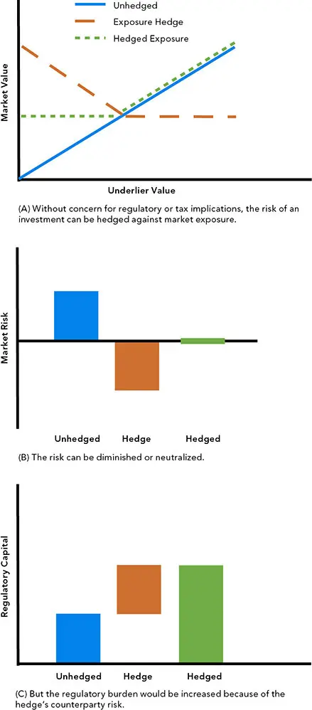
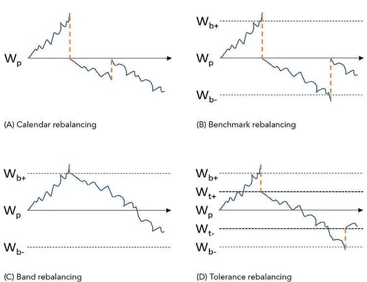
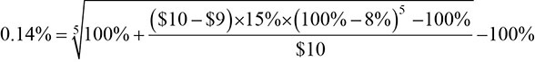

# 再平衡与税收

*经营的代价*

回测（backtesting）不仅仅是一项会计练习。它仿真我们的模型一旦"上线"后所能预期到的行动类型。我们通过尝试预测交易成本（transaction cost）和税收来仿真我们决策的影响。基于这些知识，我们设计投资、风险、执行、再平衡（rebalancing）、退出和税收策略，以预期并对影响它们的事件作出反应。

本章完成了我们关于构建回测的三个章节的讨论。我们已经讨论了预测风险和业绩，并探索了计入交易成本和费用的方法。在本章中，我们将专注于再平衡、退出以及一些税收策略。

与成本和费用一样，这些策略应当贯穿整个投资过程。在各建模阶段计入成本和费用的复杂性和难度令人望而却步，因此它们常常被*降级*到不科学的回测阶段。成本和费用影响信号的有用性以及配置、证券选择、执行、再平衡和退出的有效性。

*再平衡和退出策略*（rebalancing and withdrawal strategies）与执行策略相似。虽然执行策略可能通过适应执行环境而导致多周期事件，但再平衡和退出策略明确地为这些事件做计划并优化其执行。*税收策略*（tax strategies）可以是对执行战术的显著改进。与其他成本和费用一样，税收管理的效应可以盖过业绩，其复杂性可能给仿真带来重大挑战。

## 再平衡和退出策略 ^1^

对组合进行再平衡或执行定期退出，对于组合的长期成功是必要的，原因有若干。大多数投资组合包含按市价计价（marked to market）或定期估价的资产，其价值会发生变化（相对于组合中的其他投资按比例变化）。即使是市值加权的组合，也必须针对股息和回购等公司行动进行调整，并被*重构*（reconstituted）以针对新增和退市进行调整。大多数组合都有*约束*（constraints），例如某一特定持仓的最大集中度，或根据随时间变化的特征（如信用评级）限制资产比例的监管要求。一些组合具有负债和支出目标，这些目标的变化方式与为这些负债提供资金的资产组合不同。定期调整通常是必要的，以维持既定的投资政策，防止投资论点被不断演变的市场条件和其他外部性所扭曲，并使组合与可能随时间演变的目标和负债保持一致。如果政策或论点发生变化，也可能需要进行调整。即使是被动指数也需要为重构进行定期调整。

再平衡改善了主动管理基本定律（Fundamental Law of Active Management）的驱动因素。熟练的再平衡可以通过将投资重新对齐到投资论点来降低风险；然而，这可能是以减少对动量和复合的敞口为代价的。它还可能使组合背负与交易相关的摩擦。改善分散化可以降低风险并减少 alpha 衰减（alpha decay）。

再平衡调节趋势，包括对长期升值的信念，转而追求平衡和分散化。它还调节不确定性（即相对于投资视野而言回撤可能很长这一担忧），以及效用（即为投资组合外部目的而获取和使用资本的需要）。

### 负债感知、负债驱动和目标导向投资 ^2^

*Liability Aware, Liability Driven, and Goal-Based Investing*

银行、养老基金、捐赠基金、主权财富基金和基金会等机构经常有动态的支出计划和负债。这些计划和负债可能需要组合调整。私人财富组合可能被设计为适应未来的支出，例如教育、房地产购买、医疗保健和退休，这些通常随通货膨胀和其他外生力量而变化。

在本章后面，我们将讨论负债和目标如何被法规复杂化，最显著的是税收。负债有时通过被动*免疫*（immunization）和组合*保险*（insurance）方案等技术来管理（[第12章](ch12.md)）。例如，现金流匹配可以导致债务解除（defeasance），消除一些资产负债表负债。*盈余*（surplus，资产减负债）可以通过*或有免疫*（contingent immunization）积极管理，或更彻底地通过*负债驱动投资*（liability-driven investment，LDI）政策来管理。

一个粗心的观察者可能认为管理负债只是一项简单的久期匹配练习，但资产和负债可能是复杂和非线性的。固定收益资产经常包含拜占庭式的特征和嵌入式期权，使其价格响应在收益率上高度非线性。负债可能是令人生畏的精算结构，依赖于许多经济和人口趋势。

**国库及其他高度受监管的运营。** 市场、风险、监管和税收的汇合可能产生*不当激励*（perverse incentives）。^3^ 法规是繁重且不断变化的。它们影响资产、负债、对冲和减值如何被分类、计量和管理。分类和计量决定了这些资产如何被征税、报告和保护（例如通过计提监管资本）。^4^ 在国库层面，会计可以改变一家机构的投资决策（即使是小机构，在当前预期信用损失，即 CECL 的情况下也是如此）。会计还影响由交易产生的监管监督（包括计提监管资本）和税收负担。这些规则可能导致现金流在监管文件中被重新分类，例如被转移到（或移出）公司资产负债表。这种重新分类甚至可能导致国库的母公司的估值发生变化，由监控这些文件的分析师作出。^5^ 由于其监管和税收影响，许多非经济投资被作出，这也影响了激励。



通过第二位对手方对冲市场敞口可能使对手方风险加倍，从而降低经济利益。与另一位对手方对冲相比，取消原始交易（例如承担损失"撕毁合同"）可能更好。^6^ 在这个例子中，可能需要激励对手方违约，导致比一个对冲方案更差的价格。对冲的监管负担可能超过资本保护的好处（图 16-1）。例如，一只外国债券可能用货币远期进行对冲，后者需要每日抵押品调整。

图 16-1 对冲和再平衡方案意想不到的后果



## 再平衡

**最优的再平衡频率、选择和仓位规模**（optimal rebalancing frequency, selection, and sizing）是主要的再平衡决策。连续再平衡是不切实际的，而再平衡到最优权重有时是低效的（应改为部分再平衡，或再平衡到与最优权重不同的容忍度）。

评估再平衡方案是细致的，可能涉及复杂的成本和税收影响。许多分析可以评估不同方案和参数的相对好处，但需要回测来理解再平衡策略如何应用于具体情况。由于大多数再平衡方案对市场动量、趋势和反转敏感，回测将对方案的具体样本期和制度敏感。再平衡与*换手率*（turnover）相关，必须考虑许多细节。

对熟练的投资决策进行再平衡有助于保持实现与这些决策对齐。如果这些决策的信息价值低，或者潜在结果的离散程度大，再平衡可能效果较差甚至有害（例如在破产点固化损失）。避免对某些资产类别成分进行再平衡，可能解决一些麻烦的投资类别考量，例如估计误差。对于决策无信息的投资者，买入持有、免疫和组合保险等策略可能更合适。

再平衡的好处对于有效的预测可能是显著的，或者对于被动指数者可能不存在。我们专注于再平衡以限制 alpha 损失并维持分散化，而不是创造业绩。识别最优再平衡频率并产生超额回报所需的技能是一种择时技能，不是本讨论的目的。

风险管理是再平衡的主要目的。风险管理通常随技能和努力而变化，但分散化从再平衡中受益，几乎不需要技能。^7^ 通常，再平衡组合的风险低于从最优配置漂移的组合，并且具有更高的预期回报。再平衡组合的回报分布将具有更薄的尾部（包括让盈利头寸奔跑而受益的右尾），方式是将运气转化为期望。

降低再平衡频率会减少广度（breadth），并增加投资者技能的方差，或滞后的信息系数（information coefficient，IC）。决策的好处随时间消散。对于套利等策略，衰减可能很高，而对于激进主义等策略则较低。动态策略对再平衡比长期指数等策略更敏感。一个熟练投资者的复合 IC（*视野 IC*，horizon IC）会随着其想法的实现而初始增加，但在达到最优的*信息视野*（information horizon）之后会变得陈旧。

交易成本和费用包括实施的开支。较高的成本会通过用额外开支抵消潜在好处来降低再平衡的价值。开支与投资过程的类型和效率以及被再平衡资产的类型和效率相关。与使用证券选择决策所特有的资产相比，使用流动和高效的资产（如指数和期货）进行再平衡和*叠加*（overlay）对冲，可能降低成本，同时降低对类别（如资产类别、地理区域和行业）的广泛敞口。

大多数费用和成本很快实现，并在再平衡的长期好处之间造成时间错配。如果在单期分析中衡量开支，而好处出现在未来期间，则再平衡的好处可能被低估。在多期分析中，开支是复合的，因此它们随时间增加。

换手率可能导致搅动（churn），这往往适得其反。在没有技能的情况下，换手率通常只在极端事件和过度延长的下行漂移期间从再平衡中受益。无技能的再平衡应当依赖系统化，而不是择时。

再平衡是均值回归的；它卖出赢家并买入输家（或落后的资产）。短期动量效应在某些实施（风险目标和触发式再平衡）中比其他实施（如固定频率再平衡）更明显。风险和回撤往往会随时间趋于均衡，使各种再平衡目标的好处和缺点趋于均等。如果持仓的相关性低，再平衡还会增加分散化。

人们很容易忽视预期长期动量与短期收益波动率抑制之间的权衡（"你不能吃风险调整后的收益"），但当需要资金支付负债时，一个长期而深度的回撤可能令人痛苦。通过推迟再平衡而偏离目标配置，是一个需要技能的动量择时决策（有一些减少开支的顺风，如费用，也有增加成本的逆风，如机会成本），而不是一种被动策略。在确定策略的有效性时，将再平衡策略与理想化的连续再平衡（恒定配置或恒定风险预算）组合进行比较，可能比与买入持有（市值加权）组合进行比较更合适。每种都有其用途，尽管连续再平衡组合是不现实的。

*自相关*（autocorrelation）和"好的行情"（good runs）是反对及时再平衡（"低买高卖"）的常用论据，但持续多个周期（以及制度变化）的灾难是难以预测和把握时机的。回撤可能深得令人难以忍受且持续很长；对于系统性再平衡技术的不良择时，没有确凿的证据。

分散化可以重塑最终财富分布，使其表现出更低的风险。分散化可以减少尾部（坏运气和好运气），并增加实现预测（中位数回报）的可能性，而且它不需要技能或择时，只需要正的预期回报。

特定的非正态组合（例如许多抵押贷款支持证券，即 MBS，的负凸性）可能需要特别关注。非流动性会增加低效，这可能增加成本（或为精明的交易员提供价格改善的机会）。

与配置和风险目标再平衡不同，动态调整杠杆会在时间和横截面上进行再平衡。杠杆可以寻求一个特定比率，或更深思熟虑地缩放到特定的风险目标。杠杆从复合中受益，而复合反过来从再投资中受益并随退出而减少。再平衡杠杆依赖于预测赢家的能力。正如好的预测、再投资和重新注资会被杠杆放大一样，杠杆也会放大退出和糟糕投资选择的负面效应。

通常会有一个额外的再平衡逻辑专门用于治理杠杆（和去风险）。杠杆经常被用作*叠加*，以求简便。它经常投资于流动的基准或基于指数的工具（例如作为叠加），但最好在流程的核心（因子、配置、选择、实施和再平衡）被整合。杠杆可以是有效的，但可能受到用于杠杆化组合的代理工具与持仓之间的错配、以及额外的换手率、相关成本和潜在择时错误（包括实施缺口）的困扰。

缴款和退出可以提供以最小额外开支进行再平衡的被动机会。系统性再平衡可以从投资过程中去除一些情感和主观性。在极端情况下，诸如跨式期权、区间票据和波动率产品等衍生品可以用来强制执行再平衡纪律。主动决策，包括批准完全系统化的再平衡计划，当实施的组合表现不佳时，可能会导致充满怀疑的紧张时期。简单的方法如固定频率再平衡替代了深思熟虑的再平衡，是一种主动决策，尽管它比需要更多归属感的决策承担的职业风险更小。

**加权方案**（weighting schemes）包括战略性、战术性和趋势性（例如机会主义）再平衡。一些关心模型误差的策略只试图选择要进行哪些投资以及是买入还是卖出。更常见的是，投资成功的很大一部分依赖于分配给每个单独投资的*多少*以及持有多少储备。如果目标权重由一种静态方法描述——无论是使用固定数字还是触发方案——再平衡可以补偿市场运动。在类别（例如资产类别或行业）内启发式地分配，可以允许权重在一个更勤勉维护的元配置内漂移。战术性再平衡根据动态战术资产配置（tactical asset allocation，TAA）转移目标。配置可以纳入漂移、趋势或其他系统性变化，例如*目标日期基金*（target-date funds）的*滑行坡度*（glide slope）。^8^ 传统上，配置以资本百分比的形式定义。战略性配置及其相关区间通常被定期调整（"日历再平衡"，图 16-2A），而在这些边界内对目标配置的战术性变化则被更频繁地调整。

图 16-2 再平衡方案

风险预算百分比（*动态风险目标*，dynamic risk targeting）可能比配置目标更有效，因为它直接而明确地解决了再平衡的主要好处（风险缓解）。基于风险的比例引入了复杂性，包括风险的精确测量和计算。风险管理需要对流程及其后果的归属。风险度量可能剧烈、快速且频繁地变化，从而在配置建议中产生重大变化。虽然董事会或委员会可能为某一资产类别授权一个适度的配置区间，但即使是固定风险加权也可能需要大型交易来维持风险容忍度。

使用衍生品、指数和其他工具可以替代流动的（但通常是钝的）投资，这些投资可以在不买卖单个持仓的情况下维持容忍度。组合保险和风险转移等方案也是如此。这些调整可以降低成本、增加流动性并强制执行纪律。虽然它们可能导致偏离政策基准，但如果代理工具比证券选择更好地对齐，它们也可能增加与 alpha 和风险因子的对齐。其业绩可以与其风险对齐的产品例子包括一些"聪明贝塔"（smart beta）产品或精心设计的结构化产品。

精确再平衡的一个问题是它不可能维持。例如，到交易确认返回给投资团队时，权重将已经偏离了理想值。管理者通常被其政策基准明确地评判，并被外行的基准（例如新闻播音员宣布的那些基准）启发式地（有意识或无意识地）评判——一个不可能的*双重使命*（dual mandate）。

类似地，一个管理者的*受托责任*（stewardship） 通常通过事后质疑其再平衡活动来评判，用政治后果的错误方向风险来惩罚负责任的行为。由于宽区间导致的业绩不佳可能招致优柔寡断的批评，而紧区间可能招致过度交易、高成本和缺乏技能的指责。辩论这些令人沮丧的矛盾可能很诱人，但政治资本需要保留给最重要的讨论，例如持有非流动性投资或抵制偏离投资流程的压力。

最直接的加权方案是在资产偏离可接受范围或*区间*（band）后，将其再平衡到精确的政策基准权重（图 16-2B 中的"基准再平衡"）。仓位规模可能很重要，任何与政策不同的平衡都可能违反微妙的对冲，例如配对交易的对冲。

区间或范围加权方案（图 16-2C 中的"区间再平衡"）再平衡到距离政策基准权重某一水平的触发阈值（例如正负几个百分点）。如果一个组合被再平衡到其区间，如果它继续向同一方向漂移，将需要再次被再平衡。*容忍度*（tolerance）区间放宽了这一限制。波动率可能搅动组合并增加开支。区间可能会在瞬时事件周围扩大或缩小，以避免被噪声触发。布林带（Bollinger bands）是随尾部波动率调整的触发器的例子。

容忍度加权（图 16-2D 中的"容忍度再平衡"）由一个区间水平触发，但再平衡到一个不同的、更紧的容忍度区间。这减少了随着组合漂移而频繁将其调整回区间的搅动。

组合再平衡可以在每次再平衡时将所有类别重置回其指定的权重、区间或容忍度，即使只有一个类别触发再平衡。这可以通过只对齐违规类别并最小化调整其他类别以提供必要的*余地*（slack）来放宽。^9^ 组合不必作为整体被再平衡。需要再平衡的单个资产类别可以在其他类别中进行最少的交易，被带回其权重、区间或容忍度水平。

资产可以位于不同的账户或跨越不同的法律实体（*家庭化*，householding），但出于配置和再平衡的目的被视为一个单一组合。应税组合产生与税收相关的成本，并可能从较低或较高的再平衡频率中受益。（我们将在本章后面更详细地讨论税收影响。）将较高回报的资产放在合格账户中的效应，对客户而言可能更多是心理上的，而不是对税后回报有重大影响。试图在合格和非合格账户中分配资产可以让投资者感觉自己在产生影响。税损收割和类似技术可以使非合格账户中的交易在税收上高效；熟练的家庭化可能是相关且重要的。^10^

**再平衡触发器**（rebalancing triggers）包括固定时间间隔或"日历"再平衡（图 16-2A），可能在每月或每年的投资委员会会议或类似事件之后进行。统一（*无信息*，uninformed）的周期性再平衡，如果不频繁，可能错过重要的运动（*缺口风险*，gap risk），例如 2020 年初的买入机会，但也可以降低频繁交易的成本。

区间或范围由投资政策定义，以允许再平衡之间存在一些市场漂移。如果没有区间，配置或风险预算再平衡将需要是连续的。*匹配账簿*（matched book，即*做市*或*做市商*）和高频套利组合接近连续，但随*订单流*（flow，供需）和其他力量而偏离。

事件触发器比区间更精确，但透明度较低，可能显得更任意。触发器的自相关和交叉相关可能降低可解释性。与滞后的 IC 一样，触发器与行动之间的延迟可能是低效的来源。

订单流，如股息、基准的新增和退市、基金认购、赎回、流入和退出，提供了"免费的" ^11^ 机会，通过将资金分配给低配的持仓而不是*按比例*（pari passu），使组合更接近对齐。当订单流提前已知时，基金与经纪商之间的协议可以限制冲击。由于订单流难以预测，它们也难以建模，除了通过敏感性分析。

固定周期可以与区间结合，使得再平衡决策在再平衡日期（例如投资委员会会议）被考虑，并且只在这些日期（如果需要）执行，而不是在间隔期间（像一个*百慕大*期权）。紧急或特殊再平衡由于意外事件也是可能的。*机会主义*或*懒惰*再平衡 ^12^ 在资产类别超过区间阈值时单独重新分配资产类别，而不是整个组合。调整单个类别而不是整个组合可能导致调整为更适合压缩的*压力相关性*（stress correlations）的配置，而不是适合长期关系（包括冲击消散后触发之后的环境）的相关性。机会主义再平衡也可以利用订单流，并将交易限制在足够大以"动针"（move the needle）的调整上，从而进一步降低成本和费用。机会主义再平衡容忍偏差，在投资技能低时最合适，在 alpha 衰减高或需要精确对冲时最不合适。

**持仓约束**（holdings constraints）限制可能影响也可能不影响频率和触发器，但它们可能使过程复杂化。约束是解决代理问题和一般风险管理的"律师方法"。

约束可能创造不当情境。许多投资者在 2007-2008 年的全球金融危机（Great Financial Crisis，GFC）中措手不及，当时一些外部管理者卖出了他们最具流动性的投资，而不是他们最不希望持有的资产。这给没有在第一波赎回的投资者留下了一个次优组合，这是一个令人不快的后果。当组合处于困境时，赎回门槛和锁定期可能通过对投资者施加纪律并防止"快钱"迫使管理者作出损害组合并伤害剩余投资者的决策，从阻碍变为优势。

一些问题可能使约束复杂化。例如，政策、客户或可自由支配的限制（例如集中度上限，即最大仓位规模）可能约束决策。先前的（遗留的）或非流动性的持仓以及独立管理账户（separately managed accounts，SMA）（包括遗留组合或对私人投资（如公司的核心业务或家族企业）的敞口）可能迫使个别客户保留持仓，并导致其业绩偏离模型（"脱离模型"，off model）。通常，一些资产会被*托管在外*（held away），账户只持有*完成组合*（completion portfolio）。

资产的非流动性（例如为房地产寻找买家）可能需要为不同资产类型采用多种实施频率。管理特定资产的频率可能很麻烦，但投资团队也可以利用它。

总收益互换（total return swaps，TRS）等工具可以改变这些尴尬持仓的一部分的经济敞口，但不会降低其特征（例如风险、回报、估值和因子敞口）的估计风险。执行决策的外部择时约束可能被市场力量以外的外部性所延迟。这些延迟应当被纳入交易成本模型。*政策例外*可能需要董事会或客户批准。*外部基金*可能通过*硬关闭*或*软关闭*限制购买。它们可能通过锁定期、通知期和频率限制、赎回门槛、支付期、罚款以及其他常见或定制的条件来限制流出。

赎回的形式可能因 SMA、附函（side letters）和侧袋账户（side pockets）而复杂化。支付可以以现金或*实物支付*（payment-in-kind，PIK）进行。如果是 PIK，则作为支付收到的资产必须被纳入组合或处置。对冲和其他工程化交易可能需要精确的仓位规模，将相对配置固定为规定的关系。税号批次（tax lots）、资产位置和家庭化也可能约束决策。

### 退出

*Withdrawals*

专注于再平衡以维持我们决策的有效性，并利用订单流使组合更接近理想配置（政策组合），是很自然的。投资团队可能忽视负债规划和最优退出策略（除了专门专注于该任务的组织，例如养老基金和国库部门），超出对错误方向风险（wrong-way risk）、风险容忍度、投资视野和资产位置的考虑之外。

一个整体的、负债和目标感知的、多阶段的投资过程可以产生更好的结果。为此，应用我们讨论过的概念和工具（例如现金流建模和基于代理的模型）来适应目标和视野以优化退出。退出调度和规划中一个重要的、通常是主导的考虑是税收策略。

## 税收策略

*Tax Strategies*

税收是一个复杂且不断演变的话题，我们将只简要地、仅从美国的角度加以触及。然后，我们将探索税收感知投资的一个应用：*税损 harvesting*（tax-loss harvesting，TLH）。逃税（tax evasion）是非法的，^13^ 避税（tax avoidance）必须由投资决策而不是仅仅不缴税的愿望所驱动。^14^ 使用税收感知方法的税收*高效*投资是常见且有效的。补救措施涉及减少和递延。

**复杂性。**（Complexity.）税收是多方面的。它们通常是*累进的*（progressive）并分阶段应用，可能由联邦、州、地方和外国政府及市政机构征收。它们可能是一般性的（例如基于收入的）或使用基础的（例如道路通行费）。对于各种情况和实体（如信托）以及个人（如遗产和赠与），存在许多扣除和排除。税率和规则经常变化。会计师、税务律师和遗产规划师等专家对于理解和规划可能很有价值。

复杂性对于量化投资者代表一个机会，创造了竞争对手可能错过的探索和利用的细分市场。如果以可扩展的技术（不是电子表格！）分层建模，并按以下方式迭代解决，复杂性不必困难：

   现金流的聚合（例如*自下而上*，bottom-up）

   连续的细化（例如*自上而下*，top-down）

   最高的*影响*（impact）和最低的税收*效率*（efficiency）

### 设计投资过程

*Designing the Investment Process*

**识别**（Identify）投资努力的目的和目标、资产及其随时间产生的内容（例如升值和收入）、按账户或实体的位置（例如在合格和非合格账户之间分配以及跨实体的*家庭化*），以及它们的税收状态。识别退出和负债需求及其罚款和税收。*选择*（Choose）最有说服力的税收效应。在大多数情况下，全面的分析既不可行也不必要。*度量*（Measure）适当位置（账户或实体）的税后价值，包括*嵌入的未实现应税*价值，例如低*成本基础*（cost basis）。诸如多个税收情况不同的客户这样的不确定性，可能需要基于概率分布的分析，例如蒙特卡洛仿真。*建模*（Model）应税效应以允许参数和假设的变化。用于自动化和扩展主题定制解决方案的*组合工厂*（portfolio factory）方法（[第12章](ch12.md)）可以有效地应用于税收情况，并在管理操作风险的同时创建量身定制的组合，提高组织品牌价值，并利用基金员工的竞争优势。利用技术的"编写一次、修复一次"好处的缺点是，任何错误都会流经许多产品。

**限制**（Restrictions）针对资产和负债、时机和位置、住所和控制、增长和收入、以及保留和分配，可能需要某些实体维持税收状态，并且必须反映在仿真中。*分析*（Analyze）税后成本及其对盈利能力和风险的影响。*创建*（Create）策略，包括位置、高效工具和时机，以优化预计或潜在的税后效应。*计划*（Plan）并防范估计和模型误差，包括税率和市场回报不可避免的变化。

### 管理税收效应

*Managing Tax Effects*

管理税收效应有多种目的：

   **最大化**（Maximizing）经济价值（税后升值和收入）是最直接、最短期的目标。它也是最可扩展的，适用于最广泛的受众（例如对向外部投资者开放的基金）。

   **风险缓解。**（Risk mitigation.）

   用于长期税收计划的**目标和负债**（Goals and liabilities），包括教育和住房。

   **释放资本**（Freeing up capital）以及从笨拙敞口（例如受限或低成本基础的创始人股票、房地产等非流动性资产、或私人企业等集中风险）中实现股权变现。创造性的解决方案包括对资产进行对冲和借贷，以及合成地互换或复制所需的现金流和零成本领型期权。

   **退出**（Exit）策略，包括消费下降、遗产以及定期或终端赠与。

进行交易或持有投资的法律实体形式可以决定适用于它的监管利益和限制。如果机构按照法规的要求约束其活动，机构和公司可能免税。跨境活动和其他复杂的金融行动和关系迫使一些机构考虑税收效应。提供税收效率的产品包括 ETF、主权和市政债券、互换、穿透式投资、结构化税收交易、可变预付远期合约、换股基金和合格机会区基金。

专业投资者安排（基金和交易商）和合伙企业通常在其税务处理方面被设计。在岸对冲基金和私募股权基金采用合伙会计（*附表 K-1*，schedule K-1）。^15^ *无关业务应税收入*（unrelated business taxable income，UBTI）可能违反某些退休计划、信托、慈善机构和其他结构的免税地位。*实物支付*（PIK）可以帮助这些基金降低税收。如果基金能证明*交易商身份*（trader status），对冲基金费用可以被抵消。^16^ 否则，费用在 K-1 上作为杂项流过，将被浪费。一些客户可能无法参与某些扣除，例如那些有大量*替代最低税*（alternative minimum tax，AMT）负担的客户，或那些没有足够收入来扣除管理费用的客户。

管理者进行的税收感知投资可以包括一个合格股息津贴，用于至少持有 61 天多头和 46 天空头的多空基金，或者当一个合并的目标被持有至少 61 天时。对于在同一固定收益工具中持有空头和多头，可能适用豁免。

*离岸基金*可以是不受 UBTI 影响的公司。如果离岸基金触发*被动外国投资公司*（passive foreign investment company，PFIC）状态，^17^ 它们对美国公民的吸引力可能较低。

**共同基金、ETF、CTA**（commodity trading advisors）和其他实体有不同的税务处理。我们在[第4章](ch04.md)中对此进行了较详细的讨论。在确定使用哪种结构时，通常会考虑交易和公司事件的税收。

**财富和个人。**（Wealth and individuals.）对于非免税投资者而言，税收是一项重要的、有时是主导的成本。税收通常是不对称的负面的（尽管有例外，例如澳大利亚的*免税抵免*，franking credits）。虽然机构在理性上厌恶税收，但私人客户往往不理性地回避税收，从而减少其机会集，同时短视地专注于减少其税收负担。相反，复杂的税收情况可能难以解释、理解和报告。在解释好处（或缺乏好处）方面的困难有利于销售人员而不是量化人员。打包费用、退出壁垒（例如更换管理者的成本）和其他隐藏费用，以及高费用产品，可能给寻求"免费"服务（例如税收缓解）的*被套牢*（captive）客户带来负担。财富实体众多，包括：多代和永续家族办公室、单代家族办公室、个人投资和独立管理账户（SMA），包括合格和非合格账户以及信托，以及外部基金。

**税收效率的建模和度量**尚未标准化。需要选择"适用性"（fit-for-purpose）的公式，并且在除最简单情况外的所有情况下都需要妥协。虽然在此不可能讨论所有税收问题，但忽视任何一个都可能是灾难性的。

*收入、升值和收入再投资*可能是投资者施加的约束。这可能包括对未实现损益、利息、股息、摊销和嵌入负债（例如潜在资本利得敞口 [PCGE] 和资本利得实现率 [CGRR]）的处理。可能需要考虑*强制分配*和提前退出罚款。诸如*按市价计价*、*持有待投资*和摊销等会计处理可能相关。投资者可能对不同视野（短期、长期、遗产、慈善）和持有期（包括用于遗产规划的那些）的清算前或清算后有偏好。

*买卖*度量，可能是非对称的，可以决定业绩，而为税收效率服务收取的费用、佣金和成本通常被投资者视为重要。*特定批次*（lot specific）的税收基础和选择——例如后进先出（LIFO）、先进先出（FIFO）和最高先进先出（HIFO）——以及未来负债或缓解的潜力（例如通过遗产递增或慈善赠与），可能对税收效率有重大影响。诸如虚假销售（wash sales）、短期/长期、五年资本利得、第 1256 节（期货和期权）和第 998 节（货币）等*时机细节*，以及*工具特定细节*，例如原始发行折扣（OID）或溢价、合格或非合格股息，以及来自剥离零息债券的幻影收入，都可能扮演重要角色。

*等同合格和非合格投资*（例如，对于一个基金的多个客户，使用免税债券与应税债券的好处差异）比看起来更复杂。

许多考虑包括*累进且不断变化的税率表*（有效税率与法定税率）、避税天堂、当地征税的地理区域和全球征税人口的*地理特定*效应，包括外国预扣税和居民/非居民处理、未来税收法规的轨迹和形状，以及诸如 alpha 衰减和声誉风险（例如因避税被描绘为不爱国）等不可观察的效应。

### 税损收割

*Tax-Loss Harvesting*

税损收割（tax-loss harvesting，TLH）是一种有吸引力的动态套利策略，它是即使直接的税收策略也可能在建模和分析中微妙的一个例子。敏感性分析和压力测试对于任何受估计误差影响或依赖于不确定未来的复杂分析都是必不可少的。

在其最简单的形式中，TLH 是一种主动策略，涉及卖出投资以实现抵消性损失，并用相似投资替换它们以维持因子敞口。替代实现了抵消或递延收益税收的好处，同时维持组合的投资论点。递延税收从复合再投资中受益。收益不限于升值，还可能因重构和公司行动而产生。

以较高税率征税的短期损失，可以被收割来抵消以较低税率征税的长期收益。在高收入、高税率区间年份实现的损失可以被递延，并可能抵消较低收入、低税率区间年份（例如退休期间）的收益。它们也可以通过遗产税递增、赠与或其他方法无限期递延。

税损收割容易解释，可能看起来简单，但表面上的大部分好处是无效的。一个彻底的仿真不是一项简单的练习。税收分析的复杂性和具体情况需要简化或复杂的规则。

*市场条件*影响可供收割的损失的广度。将市场条件与跨家庭的税号批次结合起来，类似于使用*年份*（vintages）和*群组*（cohorts）来分析贷款池和结构。市场条件在遗留组合的利润被消耗之后创造机会。合作的市场并不常见，许多年份不提供实质性的 TLH 利润。

小心*市场方向*和交替方向趋势的序列。有限时期内的价格下跌从较高的*成本基础*提供更多损失。在极端不利的情况下，*组合锁定期*或*骨化*（ossification）可能阻止收割，如果一个组合升值太多以至于成本基础变得太低以至于无法允许损失（*耗竭*，burnout）。

*低短期相关性*通过允许在另一些升值时为收割提供损失，促进了趋势市场中的 TLH。*高长期相关性*可以是 TLH 机会广度的指标，因为它允许用相似投资替换被收割的投资。*低长期相关性*可以识别投资挑选制度，供那些寻求用更好的投资替换亏损投资而不是仅仅用相似投资替换的策略使用。

波动率可以提供 TLH 机会。与横截面变化一样，时间序列（time series）变化在更多短期损失的情况下提供更多机会。交易成本和技术影响最小批次规模（交易频率）和频繁交易的成本。对于任何主动策略，操作成本和风险都是重要的。*实现更多是关于递延而不是利润*。由于基准组合不被收割，TLH 组合在税后基础上似乎跑赢，因为 TLH 损失被实现，但这忽略了如果其资产后来被出售将会保留在组合中的*嵌入的*（未收割的）损失。

嵌入利润效应与结转（carryforwards）一样真实。*结转*创造了未来税收的可能性，这会侵蚀 TLH 的好处。例如，未来税率可能上升，使得结转不足以抵消未来税收。过去的税率要高得多，未来可能再次如此。税收损失的实现是*时间偏移*，并可能导致组合在未来被更高的税率区间所拖累。当预期未来税率更高时，收割*收益*而不是损失可能更好。

递延税收可以通过失去控制来实现，例如在被动投资、遗产（*递增*，step-up）或慈善赠与（避免*清算税*，liquidation tax）中。更复杂的方法可能涉及结构，包括将控制权*让渡*（surrender）给信托并以信托价值为抵押借款。

遗留组合的*成本基础*和流入（用于购买较高成本的投资）以及股息（61 天后合格）提供高购买价以抵消低成本基础，是盈利能力的主要决定因素。随着损失的收割，替代投资以低价（成本基础）被买入，并使未来的收割 不那么有利可图（*税收-alpha 衰减*，tax-alpha decay）。

IRS（美国国税局）允许将税收损失用于抵免类似收益（短期对短期，长期对长期）。不能以这种方式匹配的税收损失，然后被允许用于抵免其他收益（短期对长期）。仍然不匹配的税收损失可用于抵免少量普通收入。最后，其余的可以结转直到投资视野（例如死亡）。

损失结转可能在没有利润抵消它们的情况下累积，TLH 好处以非线性方式耗散到一个低的渐近线。如果没有显著的流入和有利的市场条件，组合在几年内就会失去 TLH 的好处（耗竭）。

Wealthfront ^18^ 的一份 TLH 营销论文估计，其 TLH 方法在从 2000 年互联网泡沫破灭前夕开始的 13 年期间（包括前四年和 2007-2008 年的 GFC）中，仅有 5 年产生了显著的*税收-alpha*，并在其中两年（GFC 前后）产生了负值。

TLH 的*时间价值和经济好处*远低于被收割的损失。两种相互矛盾的力量在起作用。已实现（嵌入的）好处被快速收割，并在几年后耗散。收割这些损失的经济好处只在长时期内随着*税收-alpha*被投资和复合而累积。递延的经济好处来自于收割资本的再投资，而不是收割本身。

考虑一只以 10 美元购买并在十年后以 20 美元卖出的股票。10 美元的资本利得将被征税。如果同一只股票以 9 美元买入并在五年内以 9 美元卖出，并以 9 美元买入一只替代品并在剩余五年内卖出，总共 10 美元仍将被征税，也许以更高的税率。然而，由基础减少 1 美元导致的税收损失将被累积。如果该交易的资本利得税为 15%，则这 1 美元可以用于*如果发生抵消交易*减少 15 美分的税收。TLH 的好处来自于这 15 美分在剩余五年内的再投资，而不是这 1 美元甚至这 15 美分本身。这个好处是税收 alpha 的一小部分。如果收割产生 15 美分的税收 alpha，并且再投资在接下来的五年内每年产生 8%，那么经济好处在五年内仅仅是微薄的 0.7% 总计——按年化计算在五年内略多于每年 0.125%：

此外，该分析忽略了未来税率对较低成本基础的影响。

由于替代导致的*基于技能的 alpha*损失（*跟踪误差*，tracking error），与投资论点对原始投资的特定程度有关。不那么精确的策略（例如指数复制或使用地理上广泛或主题性工具的组合）可以使用抽样来创建一个替代投资库，但其他策略不那么宽容。*虚假销售规则*（wash sale rule）^19^ 旨在防止完美替代（例如在 30 天内跨*所有家庭*账户买入或卖出实质上相同的投资），为高度熟练的证券选择创造基础风险。

由于复杂性，仿真很少达到完全的现实主义。需要考虑的关键项目包括国际预扣税和税收协定；联邦、州和地方税；基于收入的税率区间；短期和长期资本利得；普通收入；合格股息；替代最低税；其他交易成本和费用（包括买卖价差和不可观察成本）；市场准入；适用性和资产类型优惠待遇的变化；税法的变化，例如遗产递增的丧失。税率表随时间变化，需要反映在历史分析中，就像重构需要被纳入指数分析一样。税率表和独立变量（例如客户收入和住所）必须被预测。

TLH 的努力、费用和不确定性通常会产生一些积极的好处。TLH 必须与生活规划和风险管理的战略目标相平衡。它最好应用于被动、低 alpha 和次优组合。它对某些风格的好处多于其他风格，例如价值优于动量。根据投资者的技能、广度、风险容忍度和资源，追求其他解决方案可能是对时间和资源的更有效利用。

由于替代导致的 alpha 损失是不确定的，未来税率也是如此。与优化一样，限制杠杆和*只做多约束*（long-only constraint）消除了潜在 TLH 好处的很大一部分。空头头寸（例如 130/30 组合）提供的灵活性创造了更大的机会广度，可以用短期损失抵消短期收益。在上涨趋势市场中，空头可以提供多头可能无法提供的损失。如本书前面所讨论的，做空对现实仿真和实际投资都增加了重大挑战。

---

再平衡是许多组合的重要考虑因素，它不是一个简单的权衡，而是一个复杂的分析。理想情况下，它将贯穿整个投资过程，包括特征、alpha 和风险的选择，但常常被*降级*到回测以使解决方案变得可处理。

在某些组合中，税收可能是最重要的可控因素，并且可能具有超过其财务意义的心理影响。与成本和费用一样，这些复杂性常常被简化甚至忽视。更好的做法是，税收策略应当以合理的有效性进行建模，并随着时间的推移不断改进，使它们成为强大的竞争优势。

1. 部署缴款（incoming cash）的策略也很重要。与许多退出不同，额外的现金可能是未计划的。此外，虽然一些退出是小的，但从投资组合的退出通常可能是大的，因为它们可以用于资助生活目标或事件，例如为教育融资或购买房屋。

2. *组合免疫*（portfolio immunization）匹配投资组合中资产和负债的久期以管理利率敞口。*组合保险*（portfolio insurance）方案寻求对冲市场下跌的敞口，而不减少股票持仓，例如通过作为叠加的一部分卖出期货来减少组合中股票的百分比。*或有免疫*（contingent immunization）策略由例如预定的回报（大损失）或财富水平触发。*负债驱动投资*（liability-driven investing）将一些资产与特定的未来负债需求相匹配，并将剩余的一部分或全部投资于风险资产。与 LDI 类似，*目标导向投资*（goal-based investing）将资产与资助未来目标相匹配，并根据满足这些目标的能力来衡量业绩，而不是将结果与基准或绝对门槛进行比较。

3. *不当激励*（perverse incentives）是与预期目的相反的诱惑。规则和约束通常会鼓励它们旨在防止的相同行为，例如在回撤期间肆无忌惮地承担风险。

4. Aaron Brown，*Red Blooded Risk*、*The Poker Face of Wall Street* 和 *A World of Chance* 的作者，时任 AQR Capital Management 的首席风险官，告诉我类似这样的话："如果这笔交易在经济上没有意义，那很可能是一笔税收（或监管）交易。"

5. 在与一家财富 500 强公司的首席投资官的另一次对话中，他略带讽刺地将该公司描述为一家"有大量养老金负债的小……公司"。

6. 例如，一家公司可能创建一个"坏银行"以将不良资产从母公司的资产负债表中隔离出来，然后"注销"损失。负责"清盘"该组合的组合经理可能以注销估值为基准。由于注销水平可能由外部会计或咨询公司确定，它可能很低。顾问不希望通过高估资产的价值并使银行在处置资产时针对该估值遭受更大的损失而尴尬。这将使基准更容易被超越，因此组合经理可能更关心快速处置资产而不是为更好的价格而战。如果他将其与昂贵对冲所产生的*额外*对手方风险的负担结合起来，他可能更愿意以损失（与购买价格相比）简单地撤销交易，而与注销估值相比，这可能是公允价值或更好。

7. 像本书中描述的许多投资方法一样，有效的再平衡是一种结构性优势（一个"顺风"，tailwind）。

8. *目标日期*（target date）基金通常被设计为从风险组合（例如适合年轻人）逐渐过渡到风险较低的组合（例如适合退休人员），从购买日期到特定目标（退休）日期。*滑行坡度*（glide slope）或*滑行路径*（glide path）描述了随时间推移对基金配置进行的渐进式去风险调整，并以这种方式命名以唤起平稳着陆的意象。

9. 一旦一个持仓"突破区间"并被再平衡，交易员需要决定如何处理组合的其他持仓。再平衡违规持仓将改变基金的现金余额，甚至可能使其陷入赤字。改变其他头寸应当由最小化再平衡成本和减少后续再平衡机会的愿望来指导。这可能涉及改变其他持仓以使它们更接近政策。一个更深思熟虑的建议可能涉及分析其他头寸的预期回报和波动率，以确定哪一个最有可能导致未来的再平衡。交易员可以减少对风险头寸的敞口，以同时缓解另一次再平衡事件的机会并管理现金余额。

10. 如果某些客户的资产不可访问，则家庭化可能很困难。例如，一个客户的退休账户可能由其雇主在另一家公司管理（"托管在外"）。

11. 小的订单流可能比大的订单流更繁重，因此交易团队可能会对最小交易规模设置限制。成本、费用和操作风险可以使"免费"调整变得昂贵。

12. Gobind Daryanani, "Opportunistic Rebalancing: A New Paradigm for Wealth Managers," *FPA Journal*, 2008.

13. U.S. Supreme Court, *Gregory v. Helvering*, 293 U.S. 465, 1935.

14. Paul Kiel and Jeff Ernsthausen, "How the Wealthy Save Billions in Taxes by Skirting a Century-Old Law," *ProPublica*, February 9, 2023.

15. 附表 K-1（表格 1065）是用于报告合伙人收入、损益和股息的 IRS 税表（以及 S 公司股东的相应信息）。

16. Topic No. 429 Traders in Securities (Information for Form 1040 or 1040-SR Filers), United States Internal Revenue Service, October 22, 2022.

17. PFIC 测试是至少 75% 的总收入来自非业务经营，并且至少 50% 的资产产生被动收入。参见 IRS 表格 8621。

18. Wealthfront Tax-Loss Harvesting, <https://research.wealthfront.com/whitepapers/tax-loss-harvesting/>.

19. Internal Revenue Service, "Publication 550: Investment Income and Expenses," <https://www.irs.gov/pub/irs-prior/p550--2020.pdf>.
