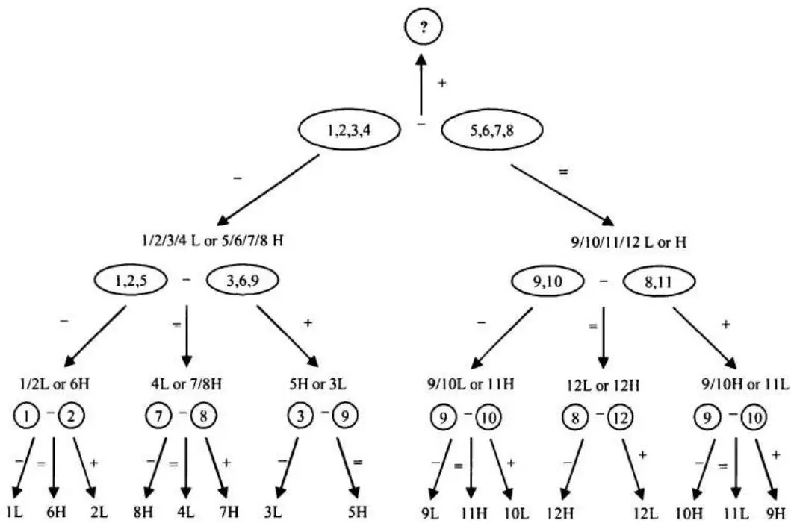
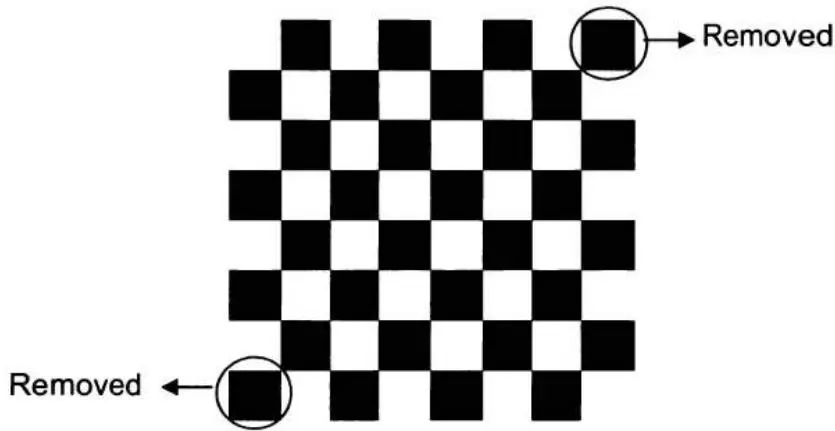
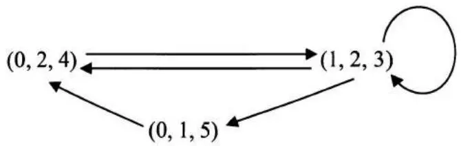
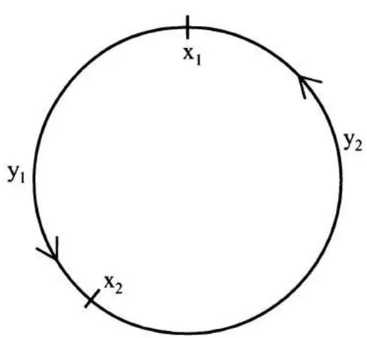
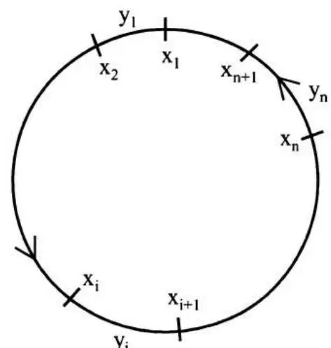

# [第2章](ch02.md) 脑筋急转弯

在本章中，我们涵盖了只需常识、逻辑推理和基础数学知识（不超过高中水平）即可解决的问题。从某种意义上说，它们是真正的脑筋急转弯，而非伪装成数学问题。虽然这些脑筋急转弯不需要特定的数学知识，但它们的难度并不亚于其他量化面试问题。其中一些问题测试你的分析和通用解题能力；有些需要你跳出框框思考；还有一些则要求你以创造性的方式使用基础数学技巧来解决问题。在本章中，我们回顾一些面试问题，以解释你在量化面试中可能遇到的脑筋急转弯的一般主题。

## 2.1 问题简化

如果原始问题过于复杂，你无法立即想出解决方案，请尝试找出问题的简化版本并从它入手。通常你可以从最简单的子问题开始，然后逐渐增加复杂度。你不需要在开始时有一个明确的计划。只需尝试解决最简单的情况并分析你的推理过程。通常情况下，你会发现一个模式，这个模式将引导你解决整个问题。

### 狡猾的海盗

五个海盗抢劫了一箱装满100枚金币的宝藏。作为一群民主的海盗，他们同意以下方法来分配战利品：

最资深的海盗将提出一种分配金币的方案。然后所有海盗，包括最资深的海盗，将进行投票。如果至少50%的海盗（在这种情况下是3个海盗）接受该方案，金币就按提议分配。如果不接受，最资深的海盗将被喂鲨鱼，然后由下一名最资深的海盗重新开始这个过程……这个过程一直重复，直到一个方案被批准。你可以假设所有海盗都是完全理性的：他们首先想活下来，其次是想得到尽可能多的金币。最后，作为嗜血的海盗，如果两个结果在其他方面相等，他们更希望船上的海盗数量更少。

最终金币将如何分配？



解答：如果你没有学习过博弈论或动态规划，这个策略问题可能看起来令人生畏。如果5个海盗的问题看起来复杂，我们总是可以通过减少海盗数量来从简化版本开始。由于1个海盗的情况是 trivial 的，让我们从2个海盗开始。资深海盗（标记为2）可以占有所有金币，因为他总能得到自己的一票（50%的选票），而海盗1则一无所获。

让我们再增加一个更资深的海盗，即海盗3。他知道如果他的计划被投票否决，海盗1将一无所获。但如果他给海盗1零枚金币，海盗1会很乐意杀了他。所以海盗3会提供给海盗1一枚金币，自己保留剩余的99枚金币。采用这个策略，他将获得海盗1和海盗3的两票。

如果增加海盗4，他知道如果他的计划被否决，海盗2将一无所获。因此，如果海盗4提供一枚金币，海盗2会接受一枚金币。所以海盗4应该提供给海盗2一枚金币，自己保留剩余的99枚金币，他的计划将获得海盗2和海盗4的$50\%$投票支持而通过。

现在我们终于来到了5个海盗的情况。他知道如果他的计划被否决，海盗3和海盗1都将一无所获。所以他只需要分别提供给海盗1和海盗3各一枚金币以获得他们的选票，自己保留剩余的98枚金币。如果他这样分配金币，他将获得五票中的三票：来自海盗1、海盗3以及他自己。

一旦我们从简化版本开始并逐渐增加复杂度，答案就变得显而易见了。实际上，在n=5的情况之后，一个清晰的模式已经出现，我们不必止步于5个海盗。对于任何$2n+1$个海盗的情况（n应小于99），最资深的海盗将分别提供给海盗1、3、……、2n-1各一枚金币，并将剩余的金币全部留给自己。



### 老虎与羊

一百只老虎和一只羊被放在一个只有草的魔法岛上。老虎可以吃草，但它们更愿意吃羊。假设：A. 每次只有一只老虎可以吃一只羊，而那只老虎在吃了羊之后会变成一只羊。B. 所有老虎都聪明且完全理性，它们想要生存。那么羊会被吃掉吗？



解答：100是一个大数字，所以让我们再次从问题的简化版本开始。如果只有1只老虎（n=1），它肯定会吃掉羊，因为它不需要担心被吃掉。如果是2只老虎呢？由于两只老虎都完全理性，每只老虎都会思考如果它吃了羊会发生什么。每只老虎大概都在想：如果我吃了羊，我会变成一只羊；然后我会被另一只老虎吃掉。所以为了确保最大的生存可能性，两只老虎都不会吃羊。

如果有3只老虎，羊会被吃掉，因为每只老虎都会意识到一旦它变成了羊，就剩下2只老虎，而它不会被吃掉。所以第一个想通这一点的老虎会吃掉羊。如果有4只老虎，每只老虎都会明白如果它吃了羊，它会变成一只羊。由于还有其他3只老虎，它会被吃掉。所以为了确保最大的生存可能性，没有老虎会吃羊。

按照同样的逻辑，我们可以自然地证明：如果老虎的数量是偶数，羊不会被吃掉。如果数量是奇数，羊会被吃掉。对于n=100的情况，羊不会被吃掉。



## 2.2 逻辑推理

### 过河问题

四个人A、B、C和D需要过河。过河的唯一方式是通过一座旧桥，这座桥一次最多只能承受两个人。天黑了，他们没有火炬就无法过桥，而他们只有一个火炬。因此，每对同行的人只能以较慢者的速度行走。他们需要让所有人都尽快到达对岸。A最慢，需要10分钟过河；B需要5分钟；C需要2分钟；D需要1分钟。

让所有人到达对岸的最短时间是多少？



解答：关键是要意识到10分钟的人应该和5分钟的人一起走，而且这不应发生在第一次过河，否则他们中的一个人必须返回。所以C和D应该先过去（2分钟）；然后让D返回（1分钟）；A和B过去（10分钟）；让C返回（2分钟）；C和D再次过去（2分钟）。

总共需要17分钟。或者，我们可以在第二轮先让C返回，再让D返回，同样需要17分钟。



### 生日问题

你和你的同事们知道你们的老板$A$的生日是以下10个日期之一：

3月4日，3月5日，3月8日

6月4日，6月7日

9月1日，9月5日

12月1日，12月2日，12月8日

$A$只告诉了你他生日的月份，而只告诉了你的同事C生日的那一天。之后，你首先说："我不知道A的生日；C也不知道。"听到你的话后，C回答说："我之前不知道A的生日，但现在我知道了。"你笑着说："现在我也知道了。"在看了这10个日期并听了你们的评论后，你的行政助理没有问任何问题就写下了A的生日。那么助理写了什么？



解答：不要让"他说、她说"的部分迷惑你。只需解读每个人评论背后的逻辑，并尽力从这些评论中推导出有用的信息。

设$D$为$A$生日的日期，我们有$D \in \{1, 2, 4, 5, 7, 8\}$。如果生日在一个唯一的日期上，$C$会立刻知道$A$的生日。在可能的$D$中，2和7是唯一的日期。考虑到你确信$C$不知道$A$的生日，你必须推断出$C$被告知的日期不是2或7。结论：月份不是6月或12月。（如果月份是6月，$C$被告知的日期可能是2；如果月份是12月，$C$被告知的日期可能是7。）

现在$C$知道月份必须是3月或9月。他立刻推断出$A$的生日，这意味着该日期在3月和9月的列表中必须是唯一的。这意味着$A$的生日不可能是3月5日或9月5日。结论：生日必须是3月4日、3月8日或9月1日。

在剩下的这三个可能性中，3月4日和3月8日有相同的月份。所以如果你掌握的月份是3月，你仍然无法确定$A$的生日。既然你能确定$A$的生日，$A$的生日一定是9月1日。因此，助理一定写了9月1日。



### 纸牌游戏

一家赌场提供一种使用一副普通的52张牌进行的纸牌游戏。规则是你每次翻开两张牌。对于每一对，如果两张都是黑色，它们归庄家堆；如果两张都是红色，它们归你的堆；如果一黑一红，它们被丢弃。这个过程一直重复，直到你们两人用完所有52张牌。如果你的堆中牌更多，你赢得100美元；否则（包括平局）你什么都得不到。赌场允许你协商你愿意为玩这个游戏支付的价格。你愿意花多少钱来玩这个游戏？



解答：这无疑是一个阴险的赌场。无论牌如何排列，你和庄家各自堆中的牌数总是相同的。为什么？因为每对被丢弃的牌都有一张黑牌和一张红牌，所以丢弃的红牌和黑牌数量相等。因此，留给你的红牌数和留给庄家的黑牌数总是相同的。庄家总是赢！所以我们不应该支付任何钱来玩这个游戏。



### 烧绳子

你有两根绳子，每根绳子需要1小时才能烧完。但每根绳子在不同位置的密度不同，因此不能保证绳子内部不同段落的燃烧时间是一致的。你如何用这两根绳子测量出45分钟？



解答：这是一个经典的脑筋急转弯问题。对于一根需要$x$分钟烧完的绳子，如果你同时点燃绳子的两端，它需要$x/2$分钟烧完。所以我们应该同时点燃第一根绳子的两端，并点燃第二根绳子的一端。30分钟后，第一根绳子将完全烧完，而第二根绳子变成了一根30分钟的绳子。此时，我们可以点燃第二根绳子的另一端（第一端仍在燃烧），当它烧完时，总时间正好是45分钟。



### 缺陷球

你有12个相同的球。其中一个球比其他球重或轻（你不知道是哪个）。使用一个只能显示哪边托盘更重的天平，你如何用3次测量确定哪个球是缺陷球？



解答：这个称重问题是另一个经典的脑筋急转弯，并且仍然被许多面试官问及。球的总数通常在8到100多个之间。这里我们使用$n = 12$来展示基本方法。关键是将原始组（以及任何中间子组）分成三组而不是两组。原因是前两组的比较总是给出关于第三组的信息。

考虑到解答用文字解释起来较冗长，我在图2.1中绘制了一个树状图来详细展示该方法。将球编号为1到12，并分成每组4个球的三组。称量球1、2、3、4对球5、6、7、8。然后我们继续探索两种可能的情况：两组平衡（用"="表示），或者1、2、3、4比5、6、7、8轻（用"<"表示）。没有必要解释1、2、3、4比5、6、7、8重的情况。（为什么？）

如果两组平衡，这立即告诉我们缺陷球在9、10、11和12中，并且它比其他球轻（L）或重（H）。然后我们从第3组取出9、10和11，比较球9、10与8、11。这里我们已经知道8是正常球。如果9、10更轻，那意味着要么9或10是L，要么11是H。在这种情况下，我们只需比较9和10。如果9更轻，9是缺陷球且为L；如果9和10平衡，那么11必须是缺陷球且为H；如果9更重，10是缺陷球且为L。如果9、10与8、11平衡，12是缺陷球。如果9、10更重，那么要么9或10是H，要么11是L。

你可以轻松地按照图2.1中的树进行进一步分析，从树中可以看出所有可能的情况都可以在3次测量中解决。

你可以轻松地按照图2.1中的树进行进一步分析，从树中可以看出所有可能的情况都可以在3次测量中解决。

图2.1 识别12个球中缺陷球的树状图

一般来说，如果你知道缺陷球是较重还是较轻，你可以在最多$n$次测量中从最多$3^{n}$个球中识别出缺陷球，因为每次称量都将问题规模减少2/3。如果你不知道缺陷球是较重还是较轻，你可以在最多$n$次测量中从最多$(3^{n} - 3)/2$个球中识别出缺陷球。



### 末尾零

100!（100的阶乘）末尾有多少个零？



解答：这是一个简单的问题。我们知道每对2和5会产生一个末尾零。如果我们对100!中的所有数进行质因数分解，显然2的频率将远远超过5的频率。所以5的频率决定了末尾零的个数。在1、2、……、99和100这些数中，20个数能被5整除（5、10、……、100）。在这20个数中，4个数能被$5^{2}$整除（25、50、75、100）。所以5的总频率是24，因此有24个末尾零。



### 赛马

有25匹马，每匹马以恒定的速度奔跑，且每匹马的速度各不相同。由于赛道只有5条跑道，每场比赛最多可以有5匹马。如果你需要找出最快的3匹马，至少需要多少场比赛才能确定它们？



解答：这个问题测试你的基本分析能力。要找出最快的3匹马，当然所有马都需要参赛。所以自然的第一个步骤是将马分成5组（每组有马1-5、6-10、11-15、16-20、21-25）。经过5场比赛后，我们将知道每组内的顺序，假设顺序遵循编号顺序（例如，在6-10组中，6是最快的，10是最慢的）。这意味着1、6、11、16和21分别是每组中最快的。

当然每组中的最后两匹马被淘汰。我们还能推断出什么？我们知道在每组中，如果最快的马在25匹马中排名第5或第4，那么该组中所有的马都不可能在top 3中；如果它排名第3，则该组中没有其他马可以进入top 3；如果它排名第2，则该组中可能还有一匹马能进top 3；如果它排名第一，则该组中还可能有两匹马能进top 3。

所以让我们让马1、6、11、16和21比赛。再次，不失一般性，假设顺序是1、6、11、16、21。那么我们立刻知道马4-5、8-10、12-15、16-20和21-25被淘汰。由于1是所有马中最快的，1入选。我们需要确定马2、3、6、7和11中哪两匹进入前三名，这只需要额外的一场比赛。

所以总共我们需要7场比赛（分3轮）来确定最快的3匹马。



### 无穷序列

如果 $x^{x}x^{x}x^{x}x^{x}x\cdots = 2$ ，其中 $x^{x}y = x^{y}$ ，那么 $x$ 是多少？

$$

$$

解答：这个问题看起来很难，但一个简单的分析将得出一个优雅的解答。从原始方程我们能得到什么？

$$
\lim_{n \rightarrow \infty} \frac{x^{x} x^{x} x^{x} x^{x} x \cdots}{n \text{项}} = 2 \Leftrightarrow \lim_{n \rightarrow \infty} \frac{x^{x} x^{x} x^{x} x^{x} x \cdots}{n - 1 \text{项}} = 2. \quad \text{换句话说，当} \quad n \rightarrow \infty ,
$$

增加或减少一个 $x^{x}$ 应该产生相同的结果。

$$
\text{所以} x^{x} x^{x} x^{x} x^{x} x \dots = x^{x} \left(x^{x} x^{x} x^{x} x \dots\right) = x^{x} 2 = 2 \Rightarrow x = \sqrt{2}.
$$



## 2.3 跳出框框思考

### 装箱问题

你能将53块尺寸为 $1 \times 1 \times 4$ 的砖块装入一个 $6 \times 6 \times 6$ 的盒子中吗？

$$

$$

解答：这是一个从流行棋盘问题延伸而来的好问题。在那个问题中，你有一个8×8的棋盘，两个对角角落的小方块被移除了。你有许多尺寸为1×2的砖块。你能将31块砖装入剩余62个方格中吗？（另一种问法是你能否用砖块覆盖所有62个方格，且砖块之间不重叠也不超出棋盘边界，这需要类似的分析。）

一个真实的棋盘图肯定有助于可视化。如图2.2所示，当棋盘被交替的黑白方格填充时，两个对角角落的方格具有相同的颜色。如果你在棋盘上放置一块 $1 \times 2$ 的砖块，它总是覆盖一个黑色方格和一个白色方格。假设两个黑色角落方格被移除了，那么棋盘剩下部分最多只能容纳30块砖，因为我们只剩下30个黑色方格（而每块砖需要一个黑色方格）。所以装入31块砖是不可能的。要覆盖所有62个方格而不重叠或超出，我们必须正好有31块砖。然而我们已经证明31块砖无法装入剩余的62个方格中，所以你无法找到一种不重叠不外延的方式来填满所有62个方格。

图2.2 具有交替黑白方格的棋盘

就像任何好的交易策略一样，如果越来越多的人知道并复制它，该策略的有效性就会消失。随着棋盘问题变得流行，许多面试者只是把它记住了（毕竟，答案很容易记）。所以一些富有创造力的面试官提出了这个新版本的问题来测试你的思维过程，或者至少测试你将知识扩展到新问题的能力。

如果我们看这个3D问题中的总体积，53块砖的体积为212，小于盒子的体积216。然而我们可以证明，使用类似于棋盘问题的方法，将所有砖块装入盒子是不可能的。让我们设想 $6 \times 6 \times 6$ 的盒子实际上是由小的 $2 \times 2 \times 2$ 立方体组成的。应该有27个小立方体。类似于棋盘（但在3D中），设想我们有交替的黑白立方体——这确实需要一点3D想象力。所以我们有14个黑色立方体和13个白色立方体，或者13个黑色立方体和14个白色立方体。对于任何装入盒子的 $1 \times 1 \times 4$ 砖块，它的一半（$1 \times 1 \times 2$）必须在一个黑色 $2 \times 2 \times 2$ 立方体中，另一半必须在一个白色 $2 \times 2 \times 2$ 立方体中。问题在于每个 $2 \times 2 \times 2$ 立方体只能被4块 $1 \times 1 \times 4$ 砖块使用。所以对于具有13个立方体的那种颜色（无论是黑还是白），我们只能用于52块 $1 \times 1 \times 4$ 的砖块。没有办法放置第53块砖。因此，我们不能将53块尺寸为 $1 \times 1 \times 4$ 的砖块装入一个 $6 \times 6 \times 6$ 的盒子中。

$$

$$

### 日历骰子

你刚刚定制了两个骰子。你不是在骰子的面上放置数字1-6，而是放置个位数字，这样每天早上你可以排列骰子，使两个正面显示当前月份的日期。你必须使用两个骰子（换句话说，第1天到第9天必须显示为01到09），但如果你愿意，可以调换骰子的顺序。你需要在两个骰子的六个面上分别放置什么数字才能实现这一点？



解答：一个月的日子包括11和22，所以两个骰子都必须有1和2。为了表示个位数的日子，我们至少需要一个骰子上有0。让我们先在骰子一上放一个0。考虑到我们需要表示所有个位数的日子，而骰子二不可能有从1到9的所有数字，因此为了表示所有个位数的日子，骰子二也必须有一个0。

截至目前，我们已经分配了以下数字：

<table><tr><td>骰子一</td><td>1</td><td>2</td><td>0</td><td>?</td><td>?</td><td>?</td></tr><tr><td>骰子二</td><td>1</td><td>2</td><td>0</td><td>?</td><td>?</td><td>?</td></tr></table>

如果我们可以将剩余的所有数字3、4、5、6、7、8和9分配到剩余的面上，问题就解决了。但还有7个数字。我们能做什么？这就是需要你跳出框框思考的地方。我们可以将6当作9来使用，因为它们永远不会同时被需要！所以，只需将3、4、5放在一个骰子上，将6、7、8放在另一个骰子上，两个骰子上的最终数字为：

<table><tr><td>骰子一</td><td>1</td><td>2</td><td>0</td><td>3</td><td>4</td><td>5</td></tr><tr><td>骰子二</td><td>1</td><td>2</td><td>0</td><td>6</td><td>7</td><td>8</td></tr></table>



### 通向录用之门

你面对着两扇门。一扇通往你的工作录用，另一扇通往出口。每扇门前各有一名守卫。一个守卫总是说谎，另一个总是说真话。你只能问一个守卫一个是/否问题。假设你确实想得到工作录用，你会问什么问题？



解答：这是另一个经典的脑筋急转弯（在我看来可能有点过时了）。一个流行的答案是问一个守卫："另一个守卫会说你在守卫通往录用之门吗？"如果他回答是，选择另一扇门；如果他回答否，选择这个守卫所站的门。

有两种可能的情景：

1. 说真话者守卫录用之门；说谎者守卫出口之门。
2. 说真话者守卫出口之门；说谎者守卫录用之门。

如果我们问一个守卫一个直接的问题，比如"你在守卫录用之门吗？"对于情景1，两个守卫都会回答是；对于情景2，两个守卫都会回答否。所以直接的问题无法帮助我们解决问题。关键是要像流行答案那样在问题中涉及两个守卫。对于情景1，如果我们恰好选择了说真话者，他会回答否，因为说谎者会说不；如果我们恰好选择了说谎者，他会回答是，因为说真话者会说不。对于情景2，如果我们恰好选择了说真话者，他会回答是，因为说谎者会说是；如果我们恰好选择了说谎者，他会回答否，因为说真话者会说是。所以在两种情景下，如果答案是否，我们选择那扇门；如果答案是是，我们选择另一扇门。



### 消息传递

你需要通过信使服务与你在格林威治的同事沟通。你的文件用挂锁盒发送。不幸的是，信使服务不安全，所以未锁定盒子内的任何东西（包括你放在盒子内的任何锁）在递送过程中都会丢失。你和你的同事各自使用的高安全性挂锁只有放置锁的人拥有钥匙。你如何安全地将文件寄给你的同事？



解答：如果你有文件要递送，显然你不能用未锁定的盒子递送。所以第一步是用锁定的盒子将其递送到格林威治。由于你拥有该锁的钥匙，你的同事无法打开盒子获取文件。不知何故，你需要在你的同事拿到文件之前移除锁，这意味着盒子必须在你同事拿到文件之前被送回你这里。

那么他在送回盒子之前能做什么？他可以在盒子上加第二把锁，他有这把锁的钥匙！一旦盒子回到你这里，你移除自己的锁，再将盒子送回给你的同事。他打开自己的锁，拿到文件。



### 最后一球

一个袋子里有20个蓝球和14个红球。每次你随机取出两个球（假设袋子中每个球被取出的概率相同）。你不会把这两个球放回去。相反，如果两个球颜色相同，你向袋子中添加一个蓝球；如果两个球颜色不同，你向袋子中添加一个红球。假设你有无限供应的蓝球和红球，如果你不断重复这个过程，最终留在袋子中的最后一个球是什么颜色？如果袋子中有20个蓝球和13个红球呢？



解答：一旦你理解了提示，这个问题应该很简单。用 $(B, R)$ 表示袋子中蓝球和红球的数量。我们来看看取出两个球后会发生什么。

两个球都是蓝色：$(B,R)\to (B - 1,R)$

两个球都是红色：$(B,R)\to (B + 1,R - 2)$

一红一蓝：$(B,R)\to (B - 1,R)$

注意 $R$ 要么保持不变，要么减少2，所以如果我们从14个红球开始，红球的数量永远不会变成奇数。我们还知道每次总数减少一个，直到只剩一个球。综合我们拥有的信息，最后一个球必须是蓝球。类似地，当我们从奇数个红球开始时，最后一个球必定是红球。



### 电灯开关

房间里有一个灯泡和四个外部开关。所有开关目前都处于关闭状态，只有一个开关控制灯泡。你可以任意多次打开或关闭任意数量的开关。你需要进入房间多少次才能确定哪个开关控制灯泡？



解答：你可能见过这个问题的经典版本，其中有3个灯泡在房间里和3个开关在外部。虽然这个问题略有改动，但方法是完全相同的。灯是开还是关是二元的，这只能让我们区分两个开关。如果我们有另一个二元因素，就有 $2 \times 2 = 4$ 种可能的情况组合，所以我们可以区分4个开关。除了光，灯泡在点亮一段时间后还会发热并变热。所以我们可以使用开/关和冷/热的组合来确定四个开关中哪一个控制灯泡。

打开开关1和2；先去解其他谜题或做任何你喜欢的事情一段时间；关闭开关2并打开开关3；快速进入房间，触摸灯泡并观察灯是亮还是灭。

灯泡亮且热 → 开关1控制灯泡；

灯泡灭且热 → 开关2控制灯泡；

灯泡亮且冷 → 开关3控制灯泡；

灯泡灭且冷 → 开关4控制灯泡。



### 量化分析师薪水

来自不同银行的八位量化分析师聚在一起喝酒。他们都有兴趣知道这个群体的平均薪水。然而，作为谨慎和谦逊的人，每个人都不希望向群体透露自己的薪水。你能想出一个策略让这些量化分析师计算出平均薪水而不知道其他人的薪水吗？



解答：这是一个轻松的问题，有不止一个答案。一种方法是第一位量化分析师选择一个随机数，将其加到他/她的薪水中，然后将结果交给第二位量化分析师。第二位量化分析师将他/她自己的薪水加到结果中，然后交给第三位量化分析师；……；第八位量化分析师将他/她自己的薪水加到结果中，然后交回给第一位量化分析师。然后第一位量化分析师从总数中减去"随机"数，将"真实"总数除以8，得到平均薪水。

你可能想知道这个策略除了作为测试面试者的好脑筋急转弯之外是否还有其他用途。它在实践中确实有应用。例如，第三方数据提供商从所有参与公司收集基金持仓数据（基金拥有的证券及其股份数量），然后将信息分发给参与者。当然，大多数参与者不希望其他人推断出他们持有什么。如果基金中的每个头寸每天都使用相同的基金ID，那么从持仓中反向工程出该基金并复制其策略就很容易。因此，在分发之前，对基金中每个头寸的基金ID添加不同的随机数（或更准确地说，是伪随机数，因为提供商知道向每个头寸的基金ID添加了什么数字，并且涉及复杂的算法以使映射是一对一的）。结果，同一基金中的头寸看起来具有不同的基金ID。这防止了参与者重建其他基金。使用这种方法，参与者可以共享市场信息，同时保持匿名。



## 2.4 对称性的应用

### 硬币堆

假设你被蒙住眼睛在一个房间里，被告知地板上有1000枚硬币。其中980枚硬币是反面朝上，另外20枚是正面朝上。你能将这些硬币分成两堆，使得两堆中正面朝上的硬币数量相等吗？假设你无法通过触摸来分辨硬币的朝向，但你可以翻转任意数量的硬币。



解答：假设我们将1000枚硬币分成两堆，一堆有$n$枚硬币，另一堆有$1000 - n$枚。如果第一堆中有$m$枚正面朝上的硬币，那么第二堆中必须有$20 - m$枚正面朝上的硬币。我们还知道第一堆中有$n - m$枚反面朝上的硬币。显然，我们无法仅仅通过调整$n$来保证$m = 10$。

我们还有什么其他选择？如果需要，我们可以翻转硬币。由于我们无法知道硬币的朝向，选择性翻转并不能保证什么。然而，如果我们翻转第一堆中的所有硬币，所有正面变成反面，所有反面变成正面。结果，它将有$n - m$个正面和$m$个反面（对称性）。所以，开始时，我们需要使原始第一堆中的反面数量等于第二堆中的正面数量；换句话说，使$n - m = 20 - m$。$n = 20$使等式成立。如果我们随机取20枚硬币并将它们全部翻转，那么这些翻转后的20枚硬币中正面的数量应该与其他980枚硬币中正面的数量相同。



### 贴错标签的袋子

你有三个水果袋子。一个装着苹果；一个装着橙子；一个装着苹果和橙子的混合。每个袋子上都有一个标签（苹果、橙子或混合）。不幸的是，你的经理告诉你所有的袋子标签都贴错了。设计一个策略，通过取出最少的水果数量来识别这些袋子？你可以从任何袋子中取出任意数量的水果。



解答：这里的关键是利用所有袋子都贴错标签这一事实。例如，标有"苹果"的袋子必须只含有橙子或橙子和苹果的混合。让我们看看标签：橙子、苹果、混合（橙子+苹果）。你是否意识到橙子标签和苹果标签是对称的？如果没有，让我详细解释：如果你从标有"橙子"的袋子中取出一个水果，发现是苹果（橙子→苹果），那么这个袋子要么全是苹果，要么是混合。如果你从标有"苹果"的袋子中取出一个水果，发现是橙子（苹果→橙子），那么这个袋子要么全是橙子，要么是混合。对称的标签并不令人兴奋，也不太可能是正确的方法。所以让我们试试标有"混合"的袋子，从里面取出一个水果。如果我们拿到的水果是橙子，那么我们就知道那袋实际上是橙子（不能是橙子和苹果的混合，因为我们知道袋子的标签是错的）。由于标有"苹果"的袋子不能只装苹果，它必须是混合袋。而标有"橙子"的袋子必须是苹果袋。类似地，如果标有"混合"的袋子中是苹果，我们可以通过一次取出来找出所有袋子。



### 智者

一个苏丹捕获了50位智者。他有一个玻璃杯，初始状态为底朝下。每分钟他召唤一位智者，这位智者可以选择将其翻转（倒置或底朝下）或什么都不做。智者被随机召唤，可能被无限次召唤。当被召唤到苏丹面前的人正确地说出所有智者都至少被召唤过一次时，所有人都获得自由。但如果他的说法是错误的，苏丹会将所有人处死。智者们在被关进单独的牢房（每人一间）之前只能交流一次。设计一个让智者获得自由的策略。



解答：为了使策略有效，一位智者，我们称他为发言人，将宣布每个人都已被召唤过。这告诉我们什么？1. 所有其他49位智者是等价的（对称）。2. 发言人不同于其他49人。所以自然地，那49位等价的智者应该以相同的方式行动，而发言人应该以不同的方式行动。

以下是其中一个策略：49位（等价的）智者中的每一位，在第一次看到玻璃杯底朝下时，应该将其倒置。如果玻璃杯已经倒置，或者他已经翻转过一次，他就不做任何事。发言人应该在每次看到玻璃杯倒置时将其翻转为底朝下，如果玻璃杯已经底朝下，他就不做任何事。在他完成第49次翻转后（这意味着其他49位智者都已被召唤过），他就可以宣布所有智者都已被召唤过。



## 2.5 级数求和

这里有一个关于传奇数学家/物理学家高斯的著名故事：当他还是个孩子时，他的老师给孩子们布置了一个无聊的任务，把1到100的数字加起来。令老师惊讶的是，高斯在不到一分钟的时间里就交出了答案。以下是他的方法：

$$
\begin{array}{l} \left. \sum_{n = 1} ^{100} n = 1 + 2 + \dots + 99 + 100 \right\} \\ \left. \sum_{n = 1} ^{100} n = 100 + 99 + \dots + 2 + 1 \right\} \\ 2 \sum_{n = 1} ^{100} n = 101 + 101 + \dots + 101 + 101 = 101 \times 100 \Rightarrow \sum_{n = 1} ^{100} n = \frac{100 \times 101}{2} \end{array}
$$

这种方法可以推广到任何整数 $N$ ： $\sum_{n=1}^{N} n = \frac{N(N+1)}{2}$

连续平方的求和公式可能不那么直观：

$$
\sum_{n = 1} ^{N} n^{2} = \frac{N (N + 1) (2 N + 1)}{6} = \frac{N^{3}}{3} + \frac{N^{2}}{2} + \frac{N}{6}.
$$

但如果我们正确猜测 $\sum_{n=1}^{N} n^2 = a N^3 + b N^2 + c N + d$ 并应用初始条件

N = 0 \Rightarrow 0 = d
$$

$$
N = 1 \Rightarrow 1 = a + b + c + d
$$

$$
N = 2 \Rightarrow 5 = 8 a + 4 b + 2 c + d
$$

$$
N = 3 \Rightarrow 14 = 27 a + 9 b + 3 c + d
$$

$$

我们将得到解 $a = 1/3$ ， $b = 1/2$ ， $c = 1/6$ ， $d = 0$ 。然后我们可以通过归纳法轻松证明相同的方程适用于所有 $N$ 。

### 钟表碎片

一个钟（顺时针编号1-12）从墙上掉下来，摔成了三块。你发现每块上的数字之和相等。每块上的数字各是什么？（不允许奇形怪状的碎片。）



解答：使用求和公式， $\sum_{n=1}^{12} n = \frac{12 \times 13}{2} = 78$ 。所以每块上的数字之和必须等于26。有些面试者错误地认为每块上的数字必须是连续的，因为不允许奇形怪状的碎片。很容易看出5、6、7和8加起来等于26。然后面试者的思路卡住了，因为他们找不到更多连续数字加起来等于26。

这种假设是不正确的，因为在钟面上12和1是连续的。一旦这个错误假设被移除，就变得清晰了：$12 + 1 = 13$ 且 $11 + 2 = 13$ 。所以第二块是11、12、1和2；第三块是3、4、9和10。



### 缺失的整数

假设我们有从1到100的98个不同的整数。找出两个缺失的整数（在[1, 100]内）的好方法是什么？



解答：将缺失的整数记为x和y，已有的整数记为 $z_{1}, \cdots, z_{98}$ 。应用求和方程，我们有

$$
\begin{array}{l} \sum_{n = 1} ^{100} n = x + y + \sum_{i = 1} ^{98} z_{i} \Rightarrow x + y = \frac{100 \times 101}{2} - \sum_{i = 1} ^{98} z_{i} \\ \sum_{n = 1} ^{100} n^{2} = x^{2} + y^{2} + \sum_{i = 1} ^{98} z_{i} ^{2} \Rightarrow x^{2} + y^{2} = \frac{100^{3}}{3} + \frac{100^{2}}{2} + \frac{100}{6} - \sum_{i = 1} ^{98} z_{i} ^{2} \\ \end{array}
$$

使用这两个方程，我们可以轻松求解 $x$ 和 $y$ 。如果你用计算机程序实现这个策略，显然该算法对于从1到 $n$ 中缺失两个整数的复杂度为 $O(n)$ 。



### 假币问题 I

有10个袋子，每个袋子里有100个相同的硬币。在所有袋子中，除一个袋子外，每个硬币重10克。然而，假币袋中的所有硬币重9克或11克。你能只称一次就找出假币袋吗？使用一种可以显示确切重量的数字秤。



解答：是的，我们可以通过一次测量找出假币袋。从第一个袋子中取出1枚硬币，从第二个袋子中取出2枚，从第三个袋子中取出3枚，……，从第十个袋子中取出10枚硬币。总共有 $\sum_{i=1}^{10} n = 55$ 枚硬币。如果没有假币，它们应该重550克。假设第i个袋子是假币袋，将有i枚假币，所以最终重量将为 $550 \pm i$ 。由于每个袋子的i是唯一的，我们可以通过 $550 \pm i$ 来识别假币袋，并知道假币比真币轻还是重。

这不是唯一的答案：我们可以从每个袋子中选择其他数量的硬币，只要它们都是不同的数字。



### 玻璃球

你在一个100层的建筑里拿着两个玻璃球。如果一个球从窗口扔出，如果楼层数小于X，它不会碎，如果楼层数等于或大于X，它一定会碎。你想确定X。在最坏情况下最小化掉落次数的策略是什么？



解答：假设我们有一个最多 $N$ 次投掷的策略。对于第一次投掷球一，我们可以尝试第 $N$ 层。如果球碎了，我们可以开始从第一层尝试球二，并逐层增加楼层数，直到球二碎裂。最多有 $N - 1$ 层需要测试。所以最多 $N$ 次投掷足以覆盖所有可能性。如果从 $N$ 层扔出的第一个球没有碎，我们还剩下 $N - 1$ 次投掷。这次我们只能将球一的楼层增加 $N - 1$ ，因为如果球一碎了，球二最多只能覆盖 $N - 2$ 层。如果从第(2N-1)层扔出的第一个球没有碎，我们还剩下 $N - 2$ 次投掷。所以这次我们只能将球一的楼层增加 $N - 2$ ，因为如果球一碎了，球二最多只能覆盖 $N - 3$ 层……

使用这种逻辑，我们可以看到这两个球在最多N次投掷中可以覆盖的楼层数为 $N + (N - 1) + \cdots + 1 = N(N + 1)/2$ 。为了覆盖100层，我们需要 $N(N + 1)/2 \geq 100$ 。取最小整数，我们得到N = 14。

基本上，我们从第14层开始扔第一个球，如果球碎了，我们可以用第二个球尝试第 $1,2,\cdots,13$ 层，最多投掷14次（当X是第13层或第14层时）。如果第一个球没有碎，我们将尝试在第 $14+(14-1)=27$ 层扔第一个球。如果它碎了，我们可以用第二个球覆盖第 $15,16,\cdots,26$ 层，同样最多总共投掷14次……

$$

$$

## 2.6 鸽巢原理

以下是鸽巢原理的基本版本：如果你的鸽子窝比鸽子少，并且你把每只鸽子都放进一个鸽子窝，那么至少有一个鸽子窝里有不止一只鸽子。基本上，它说的是如果你有 $n$ 个窝和多于 $n+1$ 只鸽子，那么至少有2只鸽子必须共享一个窝。推广的版本是：如果你有 $n$ 个窝和至少 $mn+1$ 只鸽子，那么至少有 $m+1$ 只鸽子必须共享一个窝。这些简单直观的思想在许多问题中惊人地有用。这里我们将使用一些例子来展示它们的应用。

### 配袜子

你的抽屉里有2只红袜子、20只黄袜子和31只蓝袜子。作为一个忙碌且心不在焉的麻省理工学院学生，你只是随机从抽屉里抓一些袜子，试图找到一双匹配的。假设每只袜子被选中的概率相同，你需要抓取至少多少只袜子才能保证有一双颜色相同的袜子？



解答：这个问题只是更简单的双色袜子问题的变体，后者只需3只。当你有3种颜色（3个鸽巢）时，根据鸽巢原理，你需要 $3 + 1 = 4$ 只袜子（4只鸽子）来保证至少有两只袜子颜色相同（2只鸽子共享一个窝）。



### 握手

你被邀请参加一个欢迎派对，有25名团队成员。每位成员与你握手以示欢迎。由于房间里许多人之前互不相识，其他人之间也发生了很多随机握手。如果你不知道握手的次数，你能肯定地说至少有两个在场的人与完全相同数量的人握过手吗？



解答：派对上有26个人，每个人与1到25个人握手（因为每个人都与你握手）。换句话说，有26只鸽子和25个窝。因此，至少有两个人与完全相同数量的人握过手。



### 我们以前见过吗？

证明：如果一个派对上有6个人，那么要么至少有3个人在派对之前互相认识，要么至少有3个人在派对之前互不相识。



解答：这个问题看起来很复杂，面试者常常对面试官究竟想要什么感到困惑。但一旦你开始分析可能的情景，答案就变得显而易见了。

假设你是派对上的第6个人。那么根据广义鸽巢原理（对于如此直观的结论我们还需要它吗？），在其他5个人中，我们得出结论：要么至少有3个人认识你，要么至少有3个人不认识你。现在让我们探讨这两种互斥且完备的情景：

情况1：假设至少有3个人之前认识你。

如果这一组中有两个人互相认识，那么你和这对（共3人）互相认识。如果这一组中没有一对互相认识，那么这些人（≥3人）互不相识。无论哪种子情况，结论都成立。

情况2：假设至少有3个人之前不认识你。

如果这一组中有两个人互不相识，那么你和这对（共3人）互不相识。如果这一组中所有对都互相认识，那么这些人（≥3人）互相认识。同样，无论哪种子情况，结论都成立。



### 正方形上的蚂蚁

边长为1的正方形上有51只蚂蚁。如果你有一个半径为1/7的玻璃杯，你能把玻璃杯放在正方形上的某个位置，以保证玻璃杯至少覆盖3只蚂蚁吗？



解答：为了保证玻璃杯至少覆盖3只蚂蚁，我们可以将正方形分成25个较小的区域。应用广义鸽巢原理，我们可以证明至少有一个区域必须至少有3只蚂蚁。所以我们只需要确保玻璃杯足够大，能够覆盖25个较小区域中的任何一个。只需将正方形分成 $5 \times 5$ 个边长为 $1/5$ 的小正方形即可，因为半径为 $1/7$ 的圆可以覆盖边长为 $1/5$ 的小正方形  。

$$

$$

### 假币问题 II

有5个袋子，每个袋子里有100枚硬币。一枚硬币可以重9克、10克或11克。每个袋子包含重量相同的硬币，但我们不知道一个袋子包含哪种类型的硬币。你有一个数字秤（可以显示确切重量）。你需要使用秤多少次才能确定每个袋子包含哪种类型的硬币？



解答：如果5个袋子的答案不明显，让我们从问题的最简单版本开始——1个袋子。我们只需要取出一枚硬币来称重。现在继续到2个袋子。我们需要从袋子2中取出多少枚硬币才能确定袋子1和袋子2的硬币类型？考虑到袋子1有3种可能的类型，我们需要从袋子2中取3枚硬币；两枚不行。为简化符号，让我们将三种类型的数量/重量改为-1、0和1（减去均值10）。如果我们只从袋子2中使用2枚硬币，那么从袋子1取1枚硬币和从袋子2取2枚硬币的最终总和范围从-3到3（7个鸽巢）。同时，袋子1和袋子2中硬币重量有9种（3×3）可能的组合（9只鸽子）。所以至少有两个组合会产生相同的最终总和（9>7，所以至少两只鸽子需要共享一个窝），我们无法区分它们。如果我们从袋子2中使用3枚硬币，那么总和范围为-4到4，这有可能覆盖所有9种组合。下表正好显示了所有可能的组合产生不同的和：

<table><tr><td>总和</td><td colspan="4">1枚硬币，袋子1</td></tr><tr><td rowspan="4">3枚硬币，袋子2</td><td>C1C2</td><td>-1</td><td>0</td><td>1</td></tr><tr><td>-1</td><td>-4</td><td>-3</td><td>-2</td></tr><tr><td>0</td><td>-1</td><td>0</td><td>1</td></tr><tr><td>1</td><td>2</td><td>3</td><td>4</td></tr></table>

C1和C2分别代表来自袋子1和袋子2的硬币重量。

那么3个袋子呢？我们将有 $3^3 = 27$ 种可能的组合。一个从-13到13的指标肯定可以覆盖它，我们将需要从袋子3中取9枚硬币。可能的组合如下表所示：

<table><tr><td>总和</td><td colspan="4">C2 = -1</td><td colspan="3">C2=0</td><td colspan="3">C2=1</td></tr><tr><td rowspan="4">9枚硬币，袋子3</td><td>C1C3</td><td>-1</td><td>0</td><td>1</td><td>-1</td><td>0</td><td>1</td><td>-1</td><td>0</td><td>1</td></tr><tr><td>-1</td><td>-13</td><td>-12</td><td>-11</td><td>-10</td><td>-9</td><td>-8</td><td>-7</td><td>-6</td><td>-5</td></tr><tr><td>0</td><td>-4</td><td>-3</td><td>-2</td><td>-1</td><td>0</td><td>1</td><td>2</td><td>3</td><td>4</td></tr><tr><td>1</td><td>5</td><td>6</td><td>7</td><td>8</td><td>9</td><td>10</td><td>11</td><td>12</td><td>13</td></tr></table>

C1、C2和C3分别代表来自袋子1、2和3的硬币重量。

按照这个逻辑，很容易看出我们需要从袋子4中取27枚硬币，从袋子5中取81枚硬币。所以答案是分别从袋子1、2、3、4和5中取1、3、9、27和81枚硬币，通过一次称重确定每个袋子包含哪种类型的硬币。



## 2.7 模运算

模运算——记作 $x\% y$ 或 $x \mod y$ ——求数 $x$ 除以另一个数 $y$ 的余数。为简单起见，我们只考虑 $y$ 是正整数的情况。例如， $5\% 3 = 2$ 。模运算的一个直观性质是，如果 $x_{1}\%y=x_{2}\%y$ ，那么 $(x_{1}-x_{2})\%y=0$ 。从这个性质我们还可以证明 $x\%y,\quad(x+1)\%y,\quad\cdots$ 和 $(x+y-1)\%y$ 都是不同的数字。

### 囚犯问题

一百名囚犯获得了明天被释放的机会。他们被告知每人将戴上一顶红色或蓝色的帽子。每个囚犯可以看到其他所有人的帽子，但看不到自己的。帽子颜色是随机分配的，一旦帽子戴在每个人的头上，他们就不能以任何形式互相交流，否则会被立即处决。囚犯将按随机顺序被叫出，被叫到的囚犯将猜测自己帽子的颜色。每个囚犯说出自己帽子的颜色，让其他人都能听到。如果囚犯正确猜出了自己帽子的颜色，他立即被释放；否则他被处决。

他们有一晚上的时间商量一个策略，以拯救尽可能多的囚犯。他们能采用的最佳策略是什么？他们能保证拯救多少囚犯？



解答：至少可以拯救99名囚犯。

关键在于第一个囚犯，他能看到其他所有人的帽子。如果他看到的红帽子数量是奇数，他就宣布自己的帽子是红色。否则他宣布自己的帽子是蓝色。他有1/2的概率猜对。其他每个人都能结合以下知识推断出自己的帽子颜色：了解除第一个囚犯外的99名囚犯中红帽子数量是否为奇数，以及除第一个囚犯和自己以外的其他98名囚犯的帽子颜色。例如，如果除第一个囚犯外的99人中红帽子数量为奇数。一个戴红帽子的囚犯会在其他98人（除第一个囚犯和自己外）中看到偶数个红帽子，并推断出自己戴的是红帽子。

两种颜色情况很简单，不是吗？如果有3种可能的帽子颜色：红、蓝和白呢？他们能采用的最佳策略是什么？他们能保证拯救多少囚犯？

解答：答案仍然是至少可以拯救99名囚犯。不同之处在于第一个囚犯现在只有1/3的生存概率。让我们使用以下评分系统：红色=0，绿色=1，蓝色=2。第一个囚犯计算其余99名囚犯的总分数，并计算 $s\%3$ 。如果余数为0，他宣布红色；如果余数为1，绿色；余数为2，蓝色。他有 $1/3$ 的生存机会，但所有其余囚犯都可以从余数中确定自己的分数（颜色）。考虑99名囚犯（不包括第一个囚犯）中的一名囚犯 $i$ 。他可以计算所有其他98名囚犯的总分数 $x$ 。由于 ( $x+0$ )%3、( $x+1$ )%3 和 ( $x+2$ )%3 都是不同的，所以从第一个囚犯给出的余数（针对包括 $i$ 在内的99名囚犯），他可以确定自己的分数（颜色）。例如，如果囚犯 $i$ 看到其他98名囚犯（不包括第一个囚犯和自己）中有32个红色、29个绿色和37个蓝色。这98名囚犯的总分数为103。如果第一个囚犯宣布余数为2（绿色），那么囚犯 $i$ 就知道自己的颜色是绿色（1），因为在103、104和105中只有 $104\%3 = 2$ 。

理论上，类似的策略可以扩展到任意数量的颜色。当然，这要求所有囚犯具有非凡的记忆和计算能力。



### 被9整除

给定任意一个整数，想出一条判断它是否能被9整除的规则，并证明它。



解答：希望你仍然记得高中数学课上的规则。将这个整数的所有数字相加。如果和能被9整除，那么这个整数就能被9整除；否则，这个整数不能被9整除。但我们如何证明呢？

将原始整数表示为 $a = a_{n}10^{n} + a_{n-1}10^{n-1} + \cdots + a_{1}10^{1} + a_{0}$ 。基本上，我们说如果 $a_{n} + a_{n-1} + \cdots + a_{1} + a_{0} = 9x$ （ $x$ 是整数），那么 $a$ 也能被9整除。证明很直接：

对于任何 $a=a_{n}10^{n}+a_{n-1}10^{n-1}+\cdots+a_{1}10^{1}+a_{0}$ ，设 $b=a-(a_{n}+a_{n-1}+\cdots+a_{1}+a_{0})$ 。我们有 $b=a_{n}(10^{n}-1)+a_{n-1}(10^{n-1}-1)+\cdots+a_{1}(10^{1}-1)=a-9x$ ，它能被9整除，因为所有 $(10^{k}-1)$ ， $k=1,\cdots,n$ 都能被9整除。由于b和9x都能被9整除， $a=b+9x$ 也一定能被9整除。

（类似地，你还可以证明 $a = (-1)^n a_n + (-1)^{n-1} a_{n-1} + \cdots + (-1)^1 a_1 + a_0 = 11x$ 是 $a$ 能被11整除的充要条件。）

$$

$$

### 变色龙颜色

一个偏远的岛屿上有三种类型的变色龙，其种群数量如下：13只红色变色龙、15只绿色变色龙和17只蓝色变色龙。每次两只不同颜色的变色龙相遇时，它们都会将颜色变为第三种颜色。例如，如果一只绿色变色龙遇到一只红色变色龙，它们都会变成蓝色。有没有可能让所有变色龙变成相同的颜色？为什么或为什么不？



解答：不可能让所有变色龙变成相同的颜色。有几种方法可以证明这个结论。这里我们讨论其中两种。

方法1. 由于数字13、15和17是"大"数字，我们可以将问题简化为三种颜色分别为0、2和4的情况。（要理解这一点，你需要意识到如果组合 $(m+1, n+1, p+1)$ 可以变为同一颜色，那么组合 $(m, n, p)$ 也可以变为同一颜色。）组合 $(0, 2, 4)$ 能否变为组合 $(0, 0, 6)$ ？答案是否定的，如图2.3所示：

图2.3 变色龙颜色组合从(0, 2, 4)的转变

实际上，组合 $(1,2,3)$ 等价于组合 $(0,1,2)$ ，它只能转变为另一个 $(0,1,2)$ ，但永远达不到 $(0,0,3)$ 。

方法2. 另一种更基本的方法是认识到，为了使所有变色龙变成相同的颜色，在某个中间阶段，两种颜色的数量必须相等。要理解这一点，只需想象最终阶段的前一个阶段。它必须是组合 $(1,1,x)$ 。要使两种不同颜色的变色龙数量相等，它们模3的余数也必须相等。我们开始时分别有 $15 = 3x$ 、 $13 = 3y + 1$ 和 $17 = 3z + 2$ 只变色龙。当两只不同颜色的变色龙相遇时，我们将有三种可能的情况：

$$
(3 x, 3 y + 1, 3 z + 2) \Rightarrow \left\{\begin{array}{l l} (3 x + 2, 3 y, 3 z + 1) = (3 x^{\prime}, 3 y^{\prime} + 1, 3 z^{\prime} + 2), & \text{一只} y \text{遇到一只} z \\ (3 (x - 1) + 2, 3 (y + 1), 3 z + 1) = (3 x^{\prime}, 3 y^{\prime} + 1, 3 z^{\prime} + 2), & \text{一只} x \text{遇到一只} z \\ (3 (x - 1) + 2, 3 y, 3 (z + 1) + 1) = (3 x^{\prime}, 3 y^{\prime} + 1, 3 z^{\prime} + 2), & \text{一只} x \text{遇到一只} y \end{array} \right.
$$

所以模式得以保留，我们永远不会使两种颜色的模3余数相同。换句话说，我们无法使两种颜色的数量相等。因此，变色龙不能变成相同的颜色。本质上，两只变色龙相遇后，任何一对颜色之间的相对变化要么是0，要么是3。为了使所有变色龙变成一种颜色，至少有一对颜色的差必须是3的倍数。



## 2.8 数学归纳法

归纳法是数学中（特别是离散数学中）最强大且最常用的证明技巧之一。许多涉及整数的问题都可以用归纳法解决。归纳法证明的一般步骤如下：

- 说明证明使用归纳法，并定义一个合适的谓词 $P(n)$ 。
- 证明基础情形 $P(1)$ ，或谓词成立的最小数 $n$ 。

- 证明对于每个整数 n，$P(n)$ 蕴含 $P(n+1)$。或者，在强归纳法论证中，你证明 $P(1)$、$P(2)$、$\cdots$ 和 $P(n)$ 共同蕴含 $P(n+1)$。

在大多数情况下，真正的困难不在于归纳步骤，而在于将问题表述为归纳问题并找到适当的谓词 $P(n)$。简化后的问题版本通常能帮助你识别 $P(n)$。

### 硬币分割问题

你将1000枚硬币分成两堆，并数出每堆的硬币数量。如果第一堆有 $x$ 枚硬币，第二堆有 $y$ 枚硬币，你将 $x$ 乘以 $y$ 得到 $xy$。然后你继续分堆，重复同样的计数和乘法过程，并将新的乘积结果加到之前的和中。例如，你将 $x$ 分成 $x_1$ 和 $x_2$，将 $y$ 分成 $y_1$ 和 $y_2$，则总和为 $xy + x_1x_2 + y_1y_2$。重复此过程，直到每堆只剩1枚硬币。最后的总和是多少？（最后的1不计入总和。）证明无论怎样分堆，你总是得到相同的结果。



解答：设 $n$ 为硬币数量，$f(n)$ 为最终总和。由于 $n = 1000$ 是一个大数，解答不太可能直接跳入我们的脑海。如果不确定如何解题，从最简单的情形入手寻找模式总是有益的。对于这个问题，基础情形是 $n = 2$。显然唯一的分法是 $1 + 1$，最终总和为1。当 $n = 3$ 时，第一次分堆为 $2 + 1$，我们有 $xy = 2$，而2枚硬币的堆将进一步产生额外的乘积结果1，所以最终总和为3。这个分析也给出了提示：当 $n$ 枚硬币被分成 $x$ 和 $n - x$ 两堆时，总和为 $f(n) = x(n - x) + f(x) + f(n - x)$。4枚硬币可以分成 $2 + 2$ 或 $3 + 1$。对于每种情况，我们都可以应用 $x(n - x) + f(x) + f(n - x)$，得到相同的最终总和6。

断言：对于 $n$ 枚硬币，无论中间如何分堆，最终总和为 $\frac{n(n - 1)}{2}$。

那么如何证明呢？答案对你来说应该是清楚的：用强归纳法。我们已经证明了基础情形 $n = 2,3,4$ 的断言成立。假设断言对 $n = 2,\dots ,N - 1$ 枚硬币成立，我们需要证明它对 $n = N$ 枚硬币也成立。再次应用方程 $f(n) = x(n - x) + f(x) + f(n - x)$。如果 $N$ 枚硬币被分成 $x$ 枚和 $N - x$ 枚硬币，我们有

$$
\begin{array}{l} f (N) = x (N - x) + f (x) + f (N - x) \\ = x (N - x) + \frac{N (N - 1)}{2} + \frac{(N - x) (N - x - 1)}{2} = \frac{N (N - 1)}{2} \\ \end{array}
$$

所以它确实对 $n = N$ 也成立，并且对于任意 $n \geq 2$，$f(n) = \frac{n(n - 1)}{2}$ 成立。将结论应用于 $n = 1000$，我们有 $f(n) = 1000 \times 999 / 2$。

$$

$$

### 巧克力棒问题

一块巧克力棒有6行8列（48个小 $1 \times 1$ 方块）。你通过若干次掰折将其掰成单个方块。每次掰折，你将一个矩形掰成两个较小的矩形。例如，第一步你可以将 $6 \times 8$ 的巧克力棒掰成 $6 \times 3$ 和 $6 \times 5$ 两块。要将巧克力棒掰成48个小方块，总共需要多少次掰折？

$$

$$

解答：设 $m$ 为巧克力棒的行数，$n$ 为列数。由于 $m = 6$ 和 $n = 8$ 的情况并无特殊之处，我们应该为所有 $m$ 和 $n$ 寻找通解。从基础情形开始：$m = 1$ 且 $n = 1$ 时，所需掰折次数显然为0。对于 $m > 1$ 且 $n = 1$，掰折次数为 $m - 1$；类似地，对于 $m = 1$ 且 $n > 1$，掰折次数为 $n - 1$。因此对于任意 $m$ 和 $n$，如果我们先将巧克力掰成 $m$ 行（需要 $m - 1$ 次掰折），然后将每行掰成 $n$ 个小块（需要 $m(n - 1)$ 次掰折），总掰折次数为 $(m - 1) + m(n - 1) = mn - 1$。如果我们先掰成 $n$ 列，然后将每列掰成 $m$ 个小块，总掰折次数也是 $mn - 1$。但是否对于其他掰折顺序，总次数也总是 $mn - 1$？当然是的。我们可以用强归纳法证明。

我们已经证明了基础情形 $m \geq 1$、$n = 1$ 和 $m = 1$、$n \geq 1$ 时掰折次数为 $mn - 1$。为了证明一般 $m \times n$ 情形，假设该结论对行数 < m、列数 ≤ n 以及行数 ≤ m、列数 < n 的情形成立。如果第一次掰折是沿着某一行进行的，将其掰成两块 $m \times n_1$ 和 $m \times (n - n_1)$，则总掰折次数为 $1 + (m \times n_1 - 1) + (m \times (n - n_1) - 1) = mn - 1$。这里我们使用了行数 ≤ m、列数 < n 的结果。类似地，如果掰成两块 $m_1 \times n$ 和 $(m - m_1) \times n$，总掰折次数为 $1 + (m_1 \times n - 1) + ((m - m_1) \times n - 1) = mn - 1$。因此，要将巧克力棒掰成 $m \times n$ 个小方块，总掰折次数总是 $mn - 1$。对于 $m = 6$ 和 $n = 8$ 的情况，掰折次数为47。

虽然归纳法是解决此问题的标准方法，但如果你注意到一个重要事实，实际上有一个更简单的解法：每次掰折总是将一块掰成两块，因此碎块数量每次增加1。开始时我们有一整块。最终我们将有 mn 块。所以掰折次数必定为 mn-1。



### 赛道问题

假设你在一段单向环形赛道上。赛道上随机放置了 N 个油桶，这些油桶中的油总量足以让你的车恰好跑完一整圈。假设你的车最初油箱里没有油，但你可以将车放在赛道上的任意位置，并沿途拾取油桶来加油。你是否总能选择一个起始位置，使你的车能完成整圈赛道？



解答：如果你对如何解题感到困惑，再次从最简单的情形开始（$N=1,2$）并考虑使用归纳法。不失一般性，假设赛道的周长为1。对于 N=1，问题很简单。只需从油桶所在位置出发。对于 N=2，问题仍然简单。让我们用图形来可视化这个方法。如图2.4A所示，油桶1和油桶2中的油量（表示为汽车可以行驶的距离）分别为 $x_{1}$ 和 $x_{2}$，因此 $x_{1}+x_{2}=1$。相应的路段为 $y_{1}$ 和 $y_{2}$，因此 $y_{1}+y_{2}=1$。由于 $x_{1}+x_{2}=1$ 且 $y_{1}+y_{2}=1$，我们必有 $x_{1}\geq y_{1}$ 或 $x_{2}\geq y_{2}$（$x_{1}<y_{1}$ 和 $x_{2}<y_{2}$ 不能同时成立）。如果 $x_{1}\geq y_{1}$，我们可以从油桶1出发，它有足够的油到达油桶2，然后从油桶2获取更多油来跑完全程。否则，我们从油桶2出发，沿途拾取油桶1的油来跑完全程。

$$
A
$$

$$
B
$$

图2.4 赛道上的油桶位置及油桶之间的路段

$N = 2$ 的论证也为我们提供了归纳步骤的提示。现在我们要证明，如果该结论对 $N = n$ 成立，那么它对 $N = n + 1$ 也成立。如图2.4B所示，对于 $N = n + 1$，我们有 $x_{1} + x_{2} + \cdots + x_{n+1} = 1$ 和 $y_{1} + y_{2} + \cdots + y_{n+1} = 1$。所以必定存在至少一个 $i, 1 \leq i \leq n + 1$，使得 $x_{i} \geq y_{i}$。这意味着当汽车到达 $x_{i}$ 时，它能以更多的油到达 $x_{i+1}$（对于 $i = n + 1$，则转到 $i = 1$）。换句话说，我们可以将 $x_{i}$ 和 $x_{i+1}$ "合并"到 $x_{i}$ 位置的一个油桶中，油量为 $x_{i} + x_{i+1}$（并移除第 $i+1$ 个油桶）。这样的合并将 $N = n + 1$ 问题简化为 $N = n$ 问题，而后者结论成立。所以该结论对 $N = n + 1$ 也成立。因此，对于任意 $N$，我们总能选择一个起始位置来完成整圈赛道。

还有一种替代方法可以给出起点的具体解。假设你有另一辆有足够汽油跑完全程的车。你把这辆车放在随机一个油桶的位置，开车跑一整圈。每当你到达一个油桶时（包括起始位置），你在添加油桶的油之前测量油箱中的油量。跑完整圈后，查看你的测量记录，找到最低测量值。如果汽车最初没有油，那么最低测量值对应的油桶位置就应该是你的起始位置。（可能需要一些思考才能完全理解这个论证。如果你觉得这个推理不够显然，我建议你画个图仔细思考一下。）



## 2.9 反证法

在反证法或间接证明中，你展示如果某个命题为假，则会推出某种逻辑矛盾或荒谬结论。因此，该命题必然为真。

### 无理数

你能证明 $\sqrt{2}$ 是无理数吗？有理数是可以表示为两个整数之比的数；否则为无理数。

$$

$$

解答：这是反证法的经典例子。如果 $\sqrt{2}$ 不是无理数，它可以表示为两个整数 $m$ 和 $n$ 之比。如果 $m$ 和 $n$ 有任何公因子，我们可以将其约去。最终我们得到一对没有公因子的 $m$ 和 $n$（称为既约分数）。由于 $m/n=\sqrt{2}$，我们有 $m^{2}=2n^{2}$。所以 $m^{2}$ 必为偶数，$m$ 也必为偶数。因为 $m$ 是偶数，将其表示为 $m = 2x$，其中 $x$ 是整数。那么 $m^{2}=4x^{2}$，我们也有 $n^{2}=2x^{2}$，这意味着 $n$ 也必为偶数。但 $m$ 和 $n$ 都是偶数与之前的 $m$ 和 $n$ 没有公因子相矛盾。所以 $\sqrt{2}$ 必定是无理数。

$$

$$

### 彩虹帽子

七名囚犯有机会在明天被释放。一名刽子手将在每名囚犯头上戴一顶帽子。每顶帽子可以是彩虹七种颜色中的任意一种，帽子颜色完全由刽子手自行决定。每名囚犯

可以看到其他六名囚犯的帽子颜色，但看不到自己的。他们不能以任何形式互相交流，否则立即处决。然后每名囚犯写下自己对自身帽子颜色的猜测。如果至少有一名囚犯正确猜出了自己帽子的颜色，他们将立即全部被释放；否则将被处决。

他们有一晚上的时间制定策略。是否存在一种策略可以保证他们被释放？



解答：这个问题通常被认为比模算术部分的囚犯问题更难。在之前的囚犯问题中，囚犯可以听到其他人的猜测。所以一名囚犯的声明提供了其他囚犯所需的所有信息。在这个问题中，囚犯不会知道其他人的猜测是什么。解决这个问题确实需要一个顿悟时刻。提示给了我们关键。一旦你意识到如果将颜色编码为0-6，$\left(\sum_{i=1}^{7} x_i\right)\% 7$ 必定也是0、1、2、3、4、5或6之一。那么每个囚犯 $i$——我们也将他们编号为0-6——应该给出一个猜测 $g_i$，使得 $g_i$ 与其他6名囚犯帽子颜色编码之和除以7的余数为 $i$，其中 $g_i$ 是0到6之间的唯一数字。例如，囚犯0的猜测应使得 $\left(g_0 + \sum_{k \neq 0} x_k\right)\% 7 = 0$。这样一来，我们可以保证至少有一个 $g_i = x_i$，其中 $i = 0, 1, 2, 3, 4, 5, 6$。

我们可以用反证法轻松证明这个结论。如果 $g_{i} \neq x_{i}$，则 $\left( \sum_{i=1}^{7} x_{i} \right) \% 7 \neq i$（因为 $\left( g_{i} + \sum_{k \neq i} x_{k} \right) \% 7 \neq i$ 且 $g_{i}$ 和 $x_{i}$ 都在0到6之间）。但如果对于所有 $i = 0, 1, 2, 3, 4, 5$ 和 6 都有 $g_{i} \neq x_{i}$，则 $\left( \sum_{i=1}^{7} x_{i} \right) \% 7 \neq 0, 1, 2, 3, 4, 5, 6$，这显然不可能。所以至少有一个 $g_{i}$ 必须等于 $x_{i}$。因此，使用这个策略，他们保证能被释放。

$$

$$