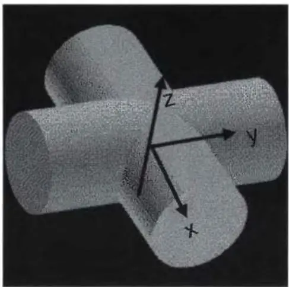
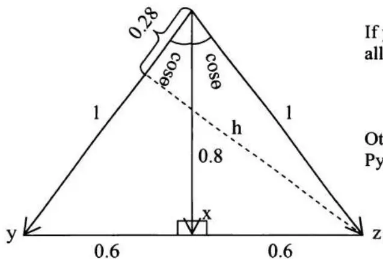

# [第3章](ch03.md) 微积分与线性代数

微积分和线性代数构成了量化金融中许多高级数学主题的基础。因此，在量化面试中准备好回答一些微积分或线性代数问题——其中许多可能融入更复杂的问题中。由于大多数被考察的微积分和线性代数知识相对容易掌握，其边际收益远远超过你花在复习关键主题上的时间。如果你对微积分或线性代数的记忆有些生疏，花些时间复习你的大学教材吧！

不用说，将任何微积分/线性代数教材压缩成一章是极其困难的，我的本意也非如此。本章只聚焦于微积分/线性代数中在量化面试中频繁出现的一些核心概念。除非必要，本章不涉及这些概念的证明、细节甚至注意事项。如果你对其中任何概念不熟悉，请参阅你喜欢的微积分/线性代数教材了解细节。

## 3.1 极限与导数

### 导数基础

让我们从极限和导数中使用的一些基本定义和公式开始。虽然符号可能有所不同，但你可以在任何微积分教材中找到这些内容。

导数：设 $y = f(x)$，则 $f'(x) = \frac{dy}{dx} = \lim_{\Delta x \to 0} \frac{\Delta y}{\Delta x} = \lim_{\Delta x \to 0} \frac{f(x + \Delta x) - f(x)}{\Delta x}$

乘法法则：如果 $u = u(x)$ 和 $v = v(x)$ 的导数存在，则 $\frac{d(uv)}{dx} = u\frac{dv}{dx} + v\frac{du}{dx}, (uv)' = u'v + uv'$

除法法则：$\frac{d}{dx}\left(\frac{u}{v}\right) = \left(v\frac{du}{dx} - u\frac{dv}{dx}\right) / v^2,\quad \left(\frac{u}{v}\right)' = \frac{u'v - uv'}{v^2}$

链式法则：如果 $y = f(u(x))$ 且 $u = u(x)$，则 $\frac{dy}{dx} = \frac{dy}{du}\frac{du}{dx}$。

广义幂法则：$\frac{dy^n}{dx} = ny^{n - 1}\frac{dy}{dx}$ 对于 $\forall n\neq 0$

一些有用的公式：

$$
a^{x} = e^{x \ln a} \quad \ln (a b) = \ln a + \ln b \quad e^{x} = \lim_{n \rightarrow \infty} \left(1 + \frac{x}{n}\right) ^{n}
$$

$$
\lim_{x \rightarrow 0} \frac{\sin x}{x} = 1 \quad \lim_{x \rightarrow 0} (1 + x) ^{k} = 1 + k x \text{对于任意} k
$$

$$
\lim_{x \rightarrow \infty} (\ln x / x^{r}) = 0 \text{对于任意} r > 0 \quad \lim_{x \rightarrow \infty} x^{r} e^{- x} = 0 \text{对于任意} r
$$

$$
\frac{d}{d x} e^{u} = e^{u} \frac{d u}{d x} \quad \frac{d a^{u}}{d x} = \left(a^{u} \ln a\right) \frac{d u}{d x} \quad \frac{d}{d x} \ln u = \frac{1}{u} \frac{d u}{d x} = \frac{u^{\prime}}{u}
$$

$$
\frac{d}{d x} \sin x = \cos x, \frac{d}{d x} \cos x = - \sin x, \frac{d}{d x} \tan x = \sec^{2} x
$$

求 $y = \ln x^{\ln x}$ 的导数？

$$

$$

解答：这是一个测试你对基本导数公式——特别是链式法则和乘法法则——掌握程度的好问题。

设 $u = \ln y = \ln (\ln x^{\ln x}) = \ln x \times \ln (\ln x)$。应用链式法则和乘法法则，我们有

$$
\frac{d u}{d x} = \frac{d (\ln y)}{d x} = \frac{1}{y} \frac{d y}{d x} = \frac{d (\ln x)}{d x} \times \ln (\ln x) + \ln x \times \frac{d (\ln (\ln x))}{d x} = \frac{\ln (\ln x)}{x} + \frac{\ln x}{x \ln x},
$$

为了求 $\frac{d(\ln(\ln x))}{dx}$，我们再次使用链式法则，设 $v = \ln x$：

$$
\frac{d (\ln (\ln x))}{d x} = \frac{d (\ln v)}{d v} \frac{d v}{d x} = \frac{1}{v} \times \frac{1}{x} = \frac{1}{x \ln x}.
$$

$$
\therefore \frac{1}{y} \frac{d y}{d x} = \frac{\ln (\ln x)}{x} + \frac{\ln x}{x \ln x} \Rightarrow \frac{d y}{d x} = \frac{y}{x} (\ln (\ln x) + 1) = \frac{\ln x^{\ln x}}{x} (\ln (\ln x) + 1).
$$



### 最大值与最小值

导数 $f'(x)$ 本质上是曲线 $y = f(x)$ 上切线的斜率，以及 $y$ 关于 $x$ 的瞬时变化率（速度）。在点 $x = c$ 处，如果

$f'(c) > 0$，则 $f(x)$ 在 $c$ 处是增函数；如果 $f'(c) < 0$，则 $f(x)$ 在 $c$ 处是减函数。

局部最大值或最小值：假设 $f(x)$ 在 $c$ 处可导，且定义在包含 $c$ 的开区间上。如果 $f(c)$ 是 $f(x)$ 的局部最大值或局部最小值，则 $f'(c) = 0$。

二阶导数检验：假设 $f(x)$ 的二阶导数 $f''(x)$ 在 $c$ 附近连续。如果 $f'(c) = 0$ 且 $f''(c) > 0$，则 $f(x)$ 在 $c$ 处有局部最小值；如果 $f'(c) = 0$ 且 $f''(c) < 0$，则 $f(x)$ 在 $c$ 处有局部最大值。

不计算数值结果，你能告诉我 $e^{\pi}$ 和 $\pi^{e}$ 哪个更大吗？

$$

$$

解答：取 $e^{\pi}$ 和 $\pi^{e}$ 的自然对数。左边是 $\pi \ln e$，右边是 $e \ln \pi$。如果 $e^{\pi} > \pi^{e}$，则 $e^{\pi} > \pi^{e} \Leftrightarrow \pi \times \ln e > e \times \ln \pi \Leftrightarrow \frac{\ln e}{e} > \frac{\ln \pi}{\pi}$。

这是真的吗？这取决于 $f(x)=\frac{\ln x}{x}$ 在从 e 到 $\pi$ 的区间上是增函数还是减函数。对 $f(x)$ 求导，我们有 $f'(x)=\frac{1/x\times x-\ln x}{x^{2}}=\frac{1-\ln x}{x^{2}}$，当 x>e 时小于0（$\ln x>1$）。事实上，对于所有 x>0，$f(x)$ 在 x=e 处取得全局最大值。所以 $\frac{\ln e}{e}>\frac{\ln \pi}{\pi}$，因此 $e^{\pi}>\pi^{e}$。

替代方法：如果你熟悉泰勒级数（我们将在3.4节讨论），可以对 $e^x$ 应用泰勒级数：$e^x = \sum_{n=0}^{\infty} \frac{1}{n!} = 1 + \frac{x}{1!} + \frac{x^2}{2!} + \frac{x^3}{3!} + \cdots$。所以对于 $\forall x > 0$，$e^x > 1 + x$。设 $x = \pi / e - 1$，则 $e^{\pi / e} / e > \pi / e \Leftrightarrow e^{\pi / e} > \pi \Leftrightarrow e^{\pi} > \pi^e$。

$$

$$

### 洛必达法则

假设函数 $f(x)$ 和 $g(x)$ 在 $x \to a$ 处可导，且 $\lim_{x \to a} g'(a) \neq 0$。进一步假设 $\lim_{x \to a} f(a) = 0$ 且 $\lim_{x \to a} g(a) = 0$，或 $\lim_{x \to a} f(a) \to \pm \infty$ 且

$\lim_{x \to a} g(a) \to \pm \infty$，则 $\lim_{x \to a} \frac{f(x)}{g(x)} = \lim_{x \to a} \frac{f'(x)}{g'(x)}$。洛必达法则将极限从不定式形式转化为确定形式。

当 $x \to \infty$ 时 $e^x / x^2$ 的极限是多少？当 $x \to 0^+$ 时 $x^2 \ln x$ 的极限是多少？

$$

$$

解答：$\lim_{x\to \infty}\frac{e^x}{x^2}$ 是洛必达法则的典型例子，因为 $\lim_{x\to \infty}e^{x} = \infty$ 且 $\lim_{x\to \infty}x^{2} = \infty$。应用洛必达法则，我们有

$$
\lim_{x \rightarrow a} \frac{f (x)}{g (x)} = \lim_{x \rightarrow \infty} \frac{e^{x}}{x^{2}} = \lim_{x \rightarrow \infty} \frac{f^{\prime} (x)}{g^{\prime} (x)} = \lim_{x \rightarrow \infty} \frac{e^{x}}{2 x}.
$$

结果仍然满足 $\lim_{x\to \infty}f(x) = \lim_{x\to \infty}e^x = \infty$ 且 $\lim_{x\to \infty}g(x) = \lim_{x\to \infty}2x = \infty$，所以我们可以再次应用洛必达法则：

$$
\lim_{x \rightarrow \infty} \frac{f (x)}{g (x)} = \lim_{x \rightarrow \infty} \frac{e^{x}}{x^{2}} = \lim_{x \rightarrow \infty} \frac{f^{\prime} (x)}{g^{\prime} (x)} = \lim_{x \rightarrow \infty} \frac{e^{x}}{2 x} = \lim_{x \rightarrow \infty} \frac{d \left(e^{x}\right) / d x}{d (2 x) / d x} = \lim_{x \rightarrow \infty} \frac{e^{x}}{2} = \infty .
$$

乍一看，洛必达法则似乎不适用于 $\lim_{x\to 0^{+}}x^{2}\ln x$，因为它不是 $\lim_{x\to a}\frac{f(x)}{g(x)}$ 的形式。然而，我们可以将原极限重写为 $\lim_{x\to 0^{+}}\frac{\ln x}{x^{-2}}$，此时显然 $\lim_{x\to 0^{+}}x^{-2} = \infty$ 且 $\lim_{x\to 0^{+}}\ln x = -\infty$。所以我们现在可以应用洛必达法则：

$$
\lim_{x \rightarrow 0^{+}} x^{2} \ln x = \lim_{x \rightarrow 0^{+}} \frac{\ln x}{x^{- 2}} = \lim_{x \rightarrow 0^{+}} \frac{d (\ln x) / d x}{d \left(x^{- 2}\right) / d x} = \lim_{x \rightarrow 0^{+}} \frac{1 / x}{- 2 / x^{3}} = \lim_{x \rightarrow 0^{+}} \frac{x^{2}}{- 2} = 0
$$



## 3.2 积分

### 积分基础

再次，让我们从积分中使用的一些基本定义和公式开始。

如果我们能找到函数 $F(x)$，其导数为 $f(x)$，则称 $F(x)$ 是 $f(x)$ 的一个原函数。

$$
\text{如果} f (x) = F^{\prime} (x), \int_{a} ^{b} f (x) = \int_{a} ^{b} F^{\prime} (x) d x = [ F (x) ] _{a} ^{b} = F (b) - F (a)
$$

$$
\frac{d F (x)}{d x} = f (x), \quad F (a) = y_{a} \Rightarrow F (x) = y_{a} + \int_{a} ^{x} f (t) d t
$$

反向广义幂法则：$\int u^{k}du = \frac{u^{k + 1}}{k + 1} +c$ $(k\neq 1)$，其中 $c$ 为任意常数。

换元积分法：

$$
\int f (g (x)) \cdot g^{\prime} (x) d x = \int f (u) d u \text{其中} u = g (x), \quad d u = g^{\prime} (x) d x
$$

定积分的换元法：$\int_{a}^{b}f(g(x))\cdot g'(x)dx = \int_{g(a)}^{g(b)}f(u)du$

分部积分法：$\int udv = uv - \int vdu$

A. $\ln (x)$ 的积分是多少？



解答：这是分部积分的一个例子。设 $u = \ln x$ 和 $v = x$，我们有 $d(uv) = vdu + udv = (x \times 1 / x)dx + \ln xdx$，

∴ $\int\ln xdx = x\ln x - \int dx = x\ln x - x + c,$ 其中 c 为任意常数。

B. 从 $x = 0$ 到 $x = \pi/6$，$\sec(x)$ 的积分是多少？

解答：显然这个问题与三角函数的微分/积分直接相关。虽然所有基本三角函数都有导数公式，但我们只需记住两个：$\frac{d}{dx}\sin x = \cos x$，$\frac{d}{dx}\cos x = -\sin x$。其余的可以用乘法法则或除法法则推导。例如，

$$
\frac{d \sec x}{d x} = \frac{d (1 / \cos x)}{d x} = \frac{\sin x}{\cos^{2} x} = \sec x \tan x,
$$

$$
\frac{d \tan x}{d x} = \frac{d (\sin x / \cos x)}{d x} = \frac{\cos^{2} x + \sin^{2} x}{\cos^{2} x} = \sec^{2} x.
$$

$$
\therefore \frac{d (\sec x + \tan x)}{d x} = \sec x (\sec x + \tan x).
$$

由于导数中出现了 $(\sec x + \tan x)$ 项，我们也有

$$
\begin{array}{l} \frac{d \ln | \sec x + \tan x |}{d x} = \frac{\sec x (\sec x + \tan x)}{(\sec x + \tan x)} = \sec x \\ \Rightarrow \int \sec x = \ln | \sec x + \tan x | + c \\ \end{array}
$$

$$
\text{且} \int_{0} ^{\pi / 6} \sec x = \ln (\sec (\pi / 6) + \tan (\pi / 6)) - \ln (\sec (0) + \tan (0)) = \ln (\sqrt{3})
$$



### 积分的应用

A. 假设两个半径为1的圆柱体以直角相交，且它们的中心也相交。交集的体积是多少？



解答：这个问题是积分在体积计算中的应用。对于这类应用问题，最困难的部分是正确建立积分表达式。计算三维体积的一般积分函数是 $V = \int_{z_1}^{z_2} A(z) dz$，其中 $A(z)$ 是在坐标 $z$ 处垂直于 $z$ 轴的平面切割该立体所得的横截面积。这里的关键是找到正确的横截面积 $A$ 关于 $z$ 的表达式。

图3.1给了我们线索。如果用水平平面切割交集，切割面将是一个边长为 $\sqrt{(2r)^2 - (2z)^2}$ 的正方形。利用对称性，我们可以计算总体积为

$$
2 \times \int_{0} ^{r} \left[ (2 r) ^{2} - (2 z) ^{2} \right] d z = 8 \times \left[ r^{2} z - z^{3} / 3 \right] _{0} ^{r} = 16 / 3 r^{3} = 16 / 3.
$$

另一种方法需要更好的三维想象力。想象一个内切于两个圆柱体的球体，因此它也内切于交集。该球体的半径应为 $r / 2$。在每个垂直于 $z$ 轴的切割面上，球体的圆也内切于交集的正方形。所以 $A_{circle} = \frac{\pi}{4} A_{square}$。由于这对所有 $z$ 值都成立，我们有

$$
V_{\text{sphere}} = \frac{4}{3} \pi \left(\frac{r}{2}\right) ^{3} = \frac{\pi}{4} V_{\text{intersection}} \Rightarrow V_{\text{intersection}} = 16 / 3 r^{3} = 16 / 3.
$$

图3.1 两个圆柱体的交



雪在中午前某个时间开始以恒定速率降落。剑桥市在中午派出一辆扫雪车清理从MIT到哈佛的麻省大道。扫雪车以每分钟恒定体积清除积雪。下午1点时，它已行驶了2英里；下午2点时，已行驶了3英里。雪是什么时候开始下的？



解答：将中午记为时间0，假设雪在中午前 $T$ 小时开始下。扫雪车行驶的速度与雪的垂直横截面积成反比：$v = c_{1} / A(t)$，其中 $v$ 是扫雪车的速度，$c_{1}$ 是扫雪车每小时可清除的积雪体积常数，$A(t)$ 是雪的横截面积。如果 $t$ 定义为中午之后的时间，我们还有 $A(t) = c_{2}(t + T)$，其中 $c_{2}$ 是每小时横截面积的增长率（因为雪以恒定速率降落）。所以 $v = \frac{c_{1}}{c_{2}(t + T)} = \frac{c}{t + T}$，其中 $c = \frac{c_{1}}{c_{2}}$。进行积分，我们有

$$
\int_{0} ^{1} \frac{c}{T + t} d t = c \ln (1 + T) - c \ln T = c \ln \left(\frac{1 + T}{T}\right) = 2,
$$

$$
\int_{0} ^{2} \frac{c}{T + t} d t = c \ln (2 + T) - c \ln T = c \ln \left(\frac{2 + T}{T}\right) = 3
$$

由这两个方程，我们得到

$$
\left(\frac{1 + T}{T}\right) ^{3} = \left(\frac{2 + T}{T}\right) ^{2} \Rightarrow T^{2} - T + 1 = 0 \Rightarrow T = (\sqrt{5} - 1) / 2.
$$

总的来说，这个问题虽然相当直接，但测试了分析能力、积分知识和代数知识。



### 利用积分求期望值

积分被广泛用于计算连续随机变量的无条件或条件期望值。在[第4章](ch04.md)中，我们将展示它在概率和统计中的价值。这里仅用一个例子来展示其应用：

如果 $X$ 是标准正态随机变量，$X \sim N(0,1)$，求 $E[X|X > 0]$？



解答：由于 $X \sim N(0,1)$，$x$ 的概率密度函数为 $f(x) = \frac{1}{\sqrt{2\pi}} e^{-1/2x^2}$，我们有 $E[X \mid X > 0] = \int_0^\infty xf(x)dx = \int_0^\infty x\frac{1}{\sqrt{2\pi}} e^{-1/2x^2}dx$。

因为 $d(-1/2x^2) = -x$ 且 $\int e^u dy = e^u + c$（其中 $c$ 为任意常数），显然我们可以用换元积分法，设 $u = -1/2x^2$。将 $e^{-1/2x^2}$ 替换为 $e^u$，$xdx$ 替换为 $-du$，我们有

$\int_0^\infty x\frac{1}{\sqrt{2\pi}} e^{-1 / 2x^2}dx = \int_0^\infty -\frac{1}{\sqrt{2\pi}} e^u du = -\frac{1}{\sqrt{2\pi}} [e^u ]_0^{-\infty} = -\frac{1}{\sqrt{2\pi}} (0 - 1) = \frac{1}{\sqrt{2\pi}},$ 其中 $[e^u ]_0^{-\infty}$ 由 $x = 0\Rightarrow u = 0$ 和 $x = \infty \Rightarrow u = -\infty$ 确定

$$
\therefore E [ X \mid X > 0 ] = 1 / \sqrt{2 \pi}
$$



## 3.3 偏导数与多重积分

偏导数：$w = f(x, y) \Rightarrow \frac{\partial f}{\partial x} (x_0, y_0) = \lim_{\Delta x \to 0} \frac{f(x_0 + \Delta x, y_0) - f(x_0, y_0)}{\Delta x} = f_x$

二阶偏导数：$\frac{\partial^{2}f}{\partial x^{2}}=\frac{\partial}{\partial x}\left(\frac{\partial f}{\partial x}\right)$，$\frac{\partial^{2}f}{\partial x\partial y}=\frac{\partial}{\partial x}\left(\frac{\partial f}{\partial y}\right)=\frac{\partial}{\partial y}\left(\frac{\partial f}{\partial x}\right)$

一般链式法则：假设 $w = f(x_{1}, x_{2}, \cdots, x_{m})$，且每个变量 $x_{1}, x_{2}, \cdots, x_{m}$ 都是变量 $t_{1}, t_{2}, \cdots, t_{n}$ 的函数。如果所有这些函数都有连续的一阶偏导数，则对于每个 $i, 1 \leq i \leq n$，$\frac{\partial w}{\partial t_{i}} = \frac{\partial w}{\partial x_{1}} \frac{\partial x_{1}}{\partial t_{i}} + \frac{\partial w}{\partial x_{2}} \frac{\partial x_{2}}{\partial t_{i}} + \cdots + \frac{\partial w}{\partial x_{m}} \frac{\partial x_{m}}{\partial t_{i}}$。

将笛卡尔积分转换为极坐标积分：二维平面上的变量可以映射为极坐标：$x = r \cos \theta$，$y = r \sin \theta$。连续极坐标区域R上的积分转换为

$$
\iint_{R} f (x, y) d x d y = \iint_{R} f (r \cos \theta , r \sin \theta) r d r d \theta .
$$

$$
计算 $\int_0^\infty e^{-x^2 /2}dx$
$$

$$

$$

解答：希望你能记得标准正态分布的概率密度函数（pdf）是 $f(x)=\frac{1}{\sqrt{2\pi}}e^{-x^{2}/2}$。根据定义，我们有

$$
\int_{- \infty} ^{\infty} f (x) d x = \int_{- \infty} ^{\infty} \frac{1}{\sqrt{2 \pi}} e^{- x^{2} / 2} d x = 2 \int_{0} ^{\infty} \frac{1}{\sqrt{2 \pi}} e^{- x^{2} / 2} d x = 1 \Rightarrow \int_{0} ^{\infty} e^{- x^{2} / 2} d x = \sqrt{\frac{\pi}{2}}.
$$

如果你忘记了标准正态分布的pdf，或者被特别要求证明 $\int_{-\infty}^{\infty}\frac{1}{\sqrt{2\pi}} e^{-x^2 /2}dx = 1$，你需要用极坐标积分来解决问题：

$$
\begin{array}{l} \int_{- \infty} ^{\infty} e^{- x^{2} / 2} d x \int_{- \infty} ^{\infty} e^{- y^{2} / 2} d y = \int_{- \infty} ^{\infty} \int_{- \infty} ^{\infty} e^{- (x^{2} + y^{2}) / 2} d x d y = \int_{0} ^{\infty} \int_{0} ^{2 \pi} e^{- (r^{2} \cos^{2} \theta + r^{2} \sin^{2} \theta) / 2} r d r d \theta \\ = \int_{0} ^{\infty} \int_{0} ^{2 \pi} e^{- r^{2} / 2} r d r d \theta = - \int_{0} ^{\infty} e^{- r^{2} / 2} d (- r^{2} / 2) \int_{0} ^{2 \pi} d \theta \\ = - \left[ e^{- r^{2} / 2} \right] _{0} ^{\infty} [ \theta ] _{0} ^{2 \pi} = 2 \pi \\ \end{array}
$$

由于 $\int_{-\infty}^{\infty} e^{-x^2/2} dx = \int_{-\infty}^{\infty} e^{-y^2/2} dy$，我们有 $\int_{-\infty}^{\infty} e^{-x^2/2} dx = \sqrt{2\pi} \Rightarrow \int_{0}^{\infty} e^{-x^2/2} dx = \sqrt{\frac{\pi}{2}}$。

$$

$$

## 3.4 重要计算方法

### 泰勒级数

一维泰勒级数将函数 $f(x)$ 展开为在点 $x = x_0$ 处的各阶导数之和：

$$
f (x) = f \left(x_{0}\right) + f^{\prime} \left(x_{0}\right) \left(x - x_{0}\right) + \frac{f^{\prime \prime} \left(x_{0}\right)}{2 !} \left(x - x_{0}\right) ^{2} + \dots + \frac{f^{(n)} \left(x_{0}\right)}{n !} \left(x - x_{0}\right) ^{n} + \dots
$$

$$
\text{如果} x_{0} = 0, f (x) = f (0) + f^{\prime} (0) x + \frac{f^{\prime \prime} (0)}{2 !} x^{2} + \dots + \frac{f^{(n)} (0)}{n !} x^{n} + \dots
$$

泰勒级数常用于将函数表示为幂级数形式。例如，三个常见超越函数 $e^x$、$\sin x$ 和 $\cos x$ 在 $x_0 = 0$ 处的泰勒级数为

$$
\begin{array}{l} e^{x} = \sum_{n = 0} ^{\infty} \frac{1}{n !} = 1 + \frac{x}{1 !} + \frac{x^{2}}{2 !} + \frac{x^{3}}{3 !} + \dots , \\ \sin x = \sum_{n = 0} ^{\infty} \frac{(- 1) ^{n} x^{2 n + 1}}{(2 n + 1) !} = x - \frac{x^{3}}{3 !} + \frac{x^{5}}{5 !} - \frac{x^{7}}{7 !} + \dots , \\ \cos x = \sum_{n = 0} ^{\infty} \frac{(- 1) ^{n} x^{2 n}}{(2 n) !} = 1 - \frac{x^{2}}{2 !} + \frac{x^{4}}{4 !} - \frac{x^{6}}{6 !} + \dots \\ \end{array}
$$

泰勒级数也可以表示为n阶泰勒多项式 $T_{n}(x) = f(x_{0}) + f'(x_{0})(x - x_{0}) + \frac{f''(x_{0})}{2!}(x - x_{0})^{2} + \cdots + \frac{f^{(n)}(x_{0})}{n!}(x - x_{0})^{n}$ 与余项 $R_{n}(x)$ 之和：$f(x) = T_{n}(x) + R_{n}(x)$。

对于介于 $x_0$ 和 $x$ 之间的某个 $\tilde{x}$，$R_{n}(x) = \frac{f^{(n + 1)}(\tilde{x})}{(n + 1)!} |x - x_0|^{n + 1}$。设 $M$ 为所有介于 $x_0$ 和 $x$ 之间的 $\tilde{x}$ 上 $\left|f^{(n + 1)}(\tilde{x})\right|$ 的最大值，我们得到约束 $\left|R_n(x)\right| \leq \frac{M \times |x - x_0|^{n + 1}}{(n + 1)!}$。

### $i^i$ 是多少？

$$

$$

解答：这个问题的解答使用欧拉公式 $e^{i\theta} = \cos \theta + i \sin \theta$，该公式可以用泰勒级数证明。让我们看看证明过程。将泰勒级数应用于 $e^{i\theta}$、$\cos \theta$ 和 $\sin \theta$，我们有

$$
\begin{array}{l} e^{i \theta} = 1 + \frac{i \theta}{1 !} + \frac{(i \theta) ^{2}}{2 !} + \frac{(i \theta) ^{3}}{3 !} + \frac{(i \theta) ^{4}}{4 !} + \dots = 1 + i \frac{\theta}{1 !} - \frac{\theta^{2}}{2 !} - i \frac{\theta^{3}}{3 !} + \frac{\theta^{4}}{4 !} + i \frac{\theta^{5}}{5 !} + \dots \\ \cos \theta = 1 - \frac{\theta^{2}}{2 !} + \frac{\theta^{4}}{4 !} - \frac{\theta^{6}}{6 !} + \dots \\ \sin \theta = \theta - \frac{\theta^{3}}{3 !} + \frac{\theta^{5}}{5 !} - \frac{\theta^{7}}{7 !} + \dots \Rightarrow i \sin \theta = i \frac{\theta}{1 !} - i \frac{\theta^{3}}{3 !} + i \frac{\theta^{5}}{5 !} - i \frac{\theta^{7}}{7 !} + \dots \\ \end{array}
$$

将这三个级数结合起来，显然有 $e^{i\theta} = \cos\theta + i\sin\theta$。

当 $\theta = \pi$ 时，方程变为 $e^{i\pi} = \cos \pi + i \sin \pi = -1$。当 $\theta = \pi / 2$ 时，方程变为 $e^{i\pi / 2} = \cos (\pi / 2) + i \sin (\pi / 2) = i$。所以 $\ln i = \ln (e^{i\pi / 2}) = i\pi / 2$。

因此，$\ln (i^i) = i\ln i = i(i\pi /2) = -\pi /2\Rightarrow i^i = e^{-\pi /2}$。

B. 证明对于所有 x>-1 和所有整数 $n\geq2$，$(1+x)^{n}\geq1+nx$。

解答：设 $f(x) = (1 + x)^n$。显然 $1 + nx$ 是 $f(x)$ 在 $x_0 = 0$ 处泰勒级数的前两项。所以我们可以考虑用泰勒级数来解这道题。

对于 $x_0 = 0$，对于 $\forall n \geq 2$ 有 $(1 + x)^n = 1$。$f(x)$ 的一阶和二阶导数为 $f'(x) = n(1 + x)^{n-1}$ 和 $f''(x) = n(n-1)(1 + x)^{n-2}$。应用泰勒级数，我们有

$$
\begin{array}{l} f (x) = f \left(x_{0}\right) + f^{\prime} \left(x_{0}\right) \left(x - x_{0}\right) + \frac{f^{\prime \prime} (\tilde{x})}{2 !} \left(x - x_{0}\right) ^{2} = f (0) + f^{\prime} (0) x + \frac{f^{\prime \prime} (\tilde{x})}{2 !} x^{2}, \\ = 1 + n x + n (n - 1) \left(1 + \tilde{x}\right) ^{n - 2} x^{2} \\ \end{array}
$$

其中如果 x < 0，则 $x \leq \tilde{x} \leq 0$；如果 x > 0，则 $x \geq \tilde{x} \geq 0$。

由于 $x > -1$ 且 $n \geq 2$，我们有 $n > 0$，$(n - 1) > 0$，$(1 + \tilde{x})^{n - 2} > 0$，$x^2 \geq 0$。

因此，$n(n - 1)(1 + \tilde{x})^{n - 2}x^2\geq 0$ 且 $f(x) = (1 + x)^{n} > 1 + nx$。

如果泰勒级数没有立刻浮现在你脑海中，n是整数这个条件可能会提示你尝试归纳法。我们可以重新表述问题：对于每个整数 $n \geq 2$，证明在 $x > -1$ 时 $(1 + x)^n \geq 1 + nx$。

基础情形：证明当 n=2 时，对于 $\forall x>-1$，$(1+x)^{n}\geq1+nx$，这很容易证明，因为对于 $\forall x>-1$，$(1+x)^{2}\geq1+2x+x^{2}\geq1+2x$。

归纳步骤：证明如果当 n=k 时对于 $\forall x>-1$ 有 $(1+x)^{n}\geq1+nx$，那么对于 n=k+1 同样成立：对于 $\forall x>-1$，$(1+x)^{k+1}\geq1+(k+1)x$。这一步也很直接。

$$
\begin{array}{l} (1 + x) ^{k + 1} = (1 + x) ^{k} (1 + x) \\ \geq (1 + k x) (1 + x) = 1 + (k + 1) x + k x^{2}, \quad \forall x > - 1 \\ \geq 1 + (k + 1) x \\ \end{array}
$$

所以该结论对于所有满足 $x > -1$ 的整数 $n \geq 2$ 成立。

$$

$$

### 牛顿法

牛顿法，也称为牛顿-拉夫逊法或牛顿-傅里叶法，是求解方程 $f(x) = 0$ 的一种迭代过程。它从初始值 $x_0$ 开始，应用迭代步骤 $x_{n+1} = x_n - \frac{f(x_n)}{f'(x_n)}$ 来求解 $f(x) = 0$，前提是 $x_1, x_2, \cdots$ 收敛。

牛顿法的收敛性不能保证，特别是当起始点远离正确解时。要使牛顿法收敛，初始点通常需要足够接近根；$f(x)$ 必须在根附近可导。当它收敛时，收敛速度是二次的，这意味着 $\frac{|x_{n+1} - x_f|}{(x_n - x_f)^2} \leq \delta < 1$，其中 $x_f$ 是 $f(x) = 0$ 的解。

A. 求解 $x^{2} = 37$，精确到小数点后第三位。

$$

$$

解答：设 $f(x) = x^{2} - 37$，原问题等价于求解 $f(x) = 0$。$x_{0} = 6$ 是自然的初始猜测。应用牛顿法，我们有

$$
x_{1} = x_{0} - \frac{f \left(x_{0}\right)}{f^{\prime} \left(x_{0}\right)} = x_{0} - \frac{x_{0} ^{2} - 37}{2 x_{0}} = 6 - \frac{36 - 37}{2 \times 6} = 6.083.
$$

（$6.083^{2} = 37.00289$，非常接近37。）

如果你不记得牛顿法，可以直接对函数 $f(x) = \sqrt{x}$ 应用泰勒级数，其中 $f'(x) = \frac{1}{2} x^{-1/2}$：

$$
f (37) \approx f (36) + f^{\prime} (36) (37 - 36) = 6 + 1 / 12 = 6.083.
$$

或者，我们可以用代数方法，因为解显然略大于6。我们有 $(6+y)^{2}=37\Rightarrow y^{2}+12y-1=0$。如果忽略较小的 $y^{2}$ 项，则 y=0.083 且 $x=6+y=6.083$。

B. 你能解释一些求解 $f(x)=0$ 的求根算法吗？假设 $f(x)$ 是可导函数。

解答：除了牛顿法，二分法和割线法是另外两种求根方法。

二分法是一种直观的求根算法。它从两个初始值 $a_0$ 和 $b_0$ 开始，使得 $f(a_0) < 0$ 且 $f(b_0) > 0$。由于 $f(x)$ 可导，在 $a_0$ 和 $b_0$ 之间必定存在某个 $x$ 使得 $f(x) = 0$。每一步，我们检查 $f((a_n + b_n) / 2)$ 的符号。如果 $f((a_n + b_n) / 2) < 0$，我们设 $b_{n+1} = b_n$ 和 $a_{n+1} = (a_n + b_n) / 2$；如果 $f((a_n + b_n) / 2) > 0$，我们设 $a_{n+1} = a_n$ 和 $b_{n+1} = (a_n + b_n) / 2$；如果 $f((a_n + b_n) / 2) = 0$，或其绝对值在允许误差范围内，迭代停止，$x = (a_n + b_n) / 2$。二分法线性收敛，$\frac{x_{n+1} - x_f}{x_n - x_f} \leq \delta < 1$，这意味着它比牛顿法慢。但一旦找到 $a_0 / b_0$ 对，收敛性就有保证。

割线法从两个初始值 $x_0$、$x_1$ 开始，应用迭代步骤 $x_{n+1} = x_n - \frac{x_n - x_{n-1}}{f(x_n) - f(x_{n-1})} f(x_n)$。它将牛顿法中的 $f'(x_n)$ 替换为线性逼近 $\frac{f(x_n) - f(x_{n-1})}{x_n - x_{n-1}}$。与牛顿法相比，它不需要计算导数 $f'(x_n)$，这在 $f'(x)$ 难以计算时很有价值。其收敛速度为 $(1 + \sqrt{5}) / 2$，比二分法快但比牛顿法慢。与牛顿法类似，如果初始值不接近根，则不能保证收敛。

$$

$$

### 拉格朗日乘数法

拉格朗日乘数法是用于寻找具有一个或多个约束的多变量函数的局部最大值/最小值的常用技术。

设 $f(x_{1}, x_{2}, \cdots, x_{n})$ 是 $n$ 个变量 $x = (x_{1}, x_{2}, \cdots, x_{n})$ 的函数，其梯度向量为 $\nabla f(x) = \left\langle \frac{\partial f}{\partial x_{1}}, \frac{\partial f}{\partial x_{2}}, \cdots, \frac{\partial f}{\partial x_{n}} \right\rangle$。在 $k$ 个约束条件下最大化或最小化 $f(x)$ 的必要条件

$$
g_{1} \left(x_{1}, x_{2}, \dots , x_{n}\right) = 0, \quad g_{2} \left(x_{1}, x_{2}, \dots , x_{n}\right) = 0, \dots , \quad g_{k} \left(x_{1}, x_{2}, \dots , x_{n}\right) = 0
$$

是 $\nabla f(x)+\lambda_{1}\nabla g_{1}(x)+\lambda_{2}\nabla g_{2}(x)+\cdots+\lambda_{k}\nabla g_{k}(x)=0$，其中 $\lambda_{1},\cdots,\lambda_{k}$ 称为拉格朗日乘数。

从原点到平面 $2x + 3y + 4z = 12$ 的距离是多少？



解答：从原点到平面的距离 $(D)$ 是原点到平面上各点的最小距离。数学上，问题可以表述为

$\min D^2 = f(x,y,z) = x^2 +y^2 +z^2$

s.t. $g(x,y,z) = 2x + 3y + 4z - 12 = 0$

应用拉格朗日乘数法，我们有

$$
\left. \begin{array}{l} \frac{\partial f}{\partial x} + \lambda \frac{\partial f}{\partial x} = 2 x + 2 \lambda = 0 \\ \frac{\partial f}{\partial y} + \lambda \frac{\partial f}{\partial y} = 2 y + 3 \lambda = 0 \\ \frac{\partial f}{\partial z} + \lambda \frac{\partial f}{\partial z} = 2 x + 4 \lambda = 0 \\ 2 x + 3 y + 4 z - 12 = 0 \end{array} \right\} \Rightarrow \left\{\begin{array}{l} \lambda = - 24 / 29 \\ x = 24 / 29 \\ y = 36 / 29 \\ z = 48 / 29 \end{array} \Rightarrow D = \sqrt{\left(\frac{24}{29}\right) ^{2} + \left(\frac{36}{29}\right) ^{2} + \left(\frac{48}{29}\right) ^{2}} = \frac{12}{\sqrt{29}} \right.
$$

一般来说，对于方程为 $ax + by + cz = d$ 的平面，到原点的距离为 $D = \frac{|d|}{\sqrt{a^2 + b^2 + c^2}}$。

$$

$$

## 3.5 常微分方程

在本节中，我们介绍面试中常见的四种典型微分方程模式。

### 可分离微分方程

可分离微分方程的形式为 $\frac{dy}{dx}=g(x)h(y)$。由于它是可分离的，我们可以将原方程表示为 $\frac{dy}{h(y)}=g(x)dx$。对两边积分，得到解 $\int\frac{dy}{h(y)}=\int g(x)dx$。

A. 求解常微分方程 $y' + 6xy = 0$，$y(0) = 1$



解答：设 $g(x) = -6x$ 和 $h(y) = y$，我们有 $\frac{dy}{y} = -6xdx$。对方程两边积分：$\int \frac{dy}{y} = \int -6xdx \Rightarrow \ln y = -3x^2 + c \Rightarrow y = e^{-3x^2 + c}$，其中 $c$ 是常数。代入初始条件 $y(0) = 1$，得到 $c = 0$ 和 $y = e^{-3x^2}$。

B. 求解常微分方程 $y'=\frac{x-y}{x+y}$。

解答：与上例不同，该方程在当前形式下不可分离。但我们可以通过变量代换将其转化为可分离微分方程。设 $z = x + y$，则原微分方程转化为

$$
\begin{array}{l} \frac{d (z - x)}{d x} = \frac{x - (z - x)}{z} \Rightarrow \frac{d z}{d x} - 1 = \frac{2 x}{z} - 1 \Rightarrow z d z = 2 x d x \Rightarrow \int z d z = \int 2 x d x + c \\ \Rightarrow (x + y) ^{2} = z^{2} = 2 x^{2} + c \Rightarrow y^{2} + 2 x y - x^{2} = c \\ \end{array}
$$



### 一阶线性微分方程

一阶线性微分方程的形式为 $\frac{dy}{dx} + P(x)y = Q(x)$。解一阶线性微分方程的标准方法是找到一个合适的函数 $I(x)$，称为积分因子，使得 $I(x)(y' + P(x)y) = I(x)y' + I(x)P(x)y$

$= (I(x)y)'$；然后我们有 $(I(x)y)' = I(x)Q(x)$，两边积分可解出 $y: I(x)y = \int I(x)Q(x)dx \Rightarrow y = \frac{\int I(x)Q(x)dx}{I(x)}$。

积分因子 $I(x)$ 必须满足 $\frac{dI(x)}{dx} = I(x)P(x)$，这意味着 $I(x)$ 是一个可分离微分方程，通解为 $I(x) = e^{\int P(x)dx}$。

求解常微分方程 $y' + \frac{y}{x} = \frac{1}{x^2}$，$y(1) = 1$，其中 $x > 0$。

$$

$$

解答：这是一阶线性方程的典型例子，其中 $P(x) = \frac{1}{x}$，$Q(x) = \frac{1}{x^2}$。所以 $I(x) = e^{\int P(x)dx} = e^{\int (1 / x)dx} = e^{\ln x} = x$，且 $I(x)Q(x) = \frac{1}{x}$。

$$
\therefore I (x) \left(y^{\prime} + P (x) y\right) = (x y) ^{\prime} = I (x) Q (x) = 1 / x
$$

两边积分，$xy = \int (1 / x)dx = \ln x + c \Rightarrow y = \frac{\ln x + c}{x}$。

代入 $y(1) = 1$，得到 $c = 1$ 和 $y = \frac{\ln x + 1}{x}$。

$$

$$

### 齐次线性方程

齐次线性方程是形式为 $a(x)\frac{d^2y}{dx^2} + b(x)\frac{dy}{dx} + c(x)y = 0$ 的二阶微分方程。

容易证明，如果 $y_{1}$ 和 $y_{2}$ 是齐次线性方程的线性无关解，则任意 $y(x) = c_{1}y_{1}(x) + c_{2}y_{2}(x)$（其中 $c_{1}$ 和 $c_{2}$ 为任意常数）也是齐次线性方程的解。

当 $a, b$ 和 $c (a \neq 0)$ 是常数（而非 $x$ 的函数）时，齐次线性方程有闭式解：

设 $r_1$ 和 $r_2$ 为特征方程 $ar^2 + br + c = 0$ 的根，

1. 如果 $r_{1}$ 和 $r_{2}$ 是实数且 $r_{1} \neq r_{2}$，则通解为 $y = c_{1} e^{r_{1} x} + c_{2} e^{r_{2} x}$；
2. 如果 $r_{1}$ 和 $r_{2}$ 是实数且 $r_{1}=r_{2}=r$，则通解为 $y=c_{1}e^{rx}+c_{2}xe^{rx}$；

3. 如果 $r_1$ 和 $r_2$ 是复数 $\alpha \pm i\beta$，则通解为 $y = e^{\alpha x}(c_1 \cos \beta x + c_2 \sin \beta x)$。

通过对通解求一阶和二阶导数，很容易验证这些通解确实满足齐次线性方程。

求常微分方程 $y'' + y' + y = 0$ 的解。



解答：具体来说，我们有 $a = b = c = 1$ 且 $b^{2} - 4ac = -3 < 0$，所以复数根为 $r = -1/2 \pm \sqrt{3}/2i$（$\alpha = -1/2$，$\beta = \sqrt{3}/2$），因此微分方程的通解为

$$
y = e^{\alpha x} \left(c_{1} \cos \beta x + c_{2} \sin \beta x\right) = e^{- 1 / 2 x} \left(c_{1} \cos (\sqrt{3} / 2 x) + c_{2} \sin (\sqrt{3} / 2 x)\right).
$$



### 非齐次线性方程

与齐次线性方程 $a\frac{d^{2}y}{dx^{2}} + b\frac{dy}{dx} + cy = 0$ 不同，非齐次线性方程 $a\frac{d^{2}y}{dx^{2}} + b\frac{dy}{dx} + cy = d(x)$ 没有闭式解。但如果我们能找到 $a\frac{d^{2}y}{dx^{2}} + b\frac{dy}{dx} + cy = d(x)$ 的一个特解 $y_{p}(x)$，则 $y = y_{p}(x) + y_{g}(x)$（其中 $y_{g}(x)$ 是齐次方程 $a\frac{d^{2}y}{dx^{2}} + b\frac{dy}{dx} + cy = 0$ 的通解）就是非齐次方程 $a\frac{d^{2}y}{dx^{2}} + b\frac{dy}{dx} + cy = d(x)$ 的通解。

虽然一般情况下找到特解 $y_{p}(x)$ 可能很困难，但在 $d(x)$ 是简单多项式的特殊情况下，特解通常是同次数的多项式。

求常微分方程 $y'' + y' + y = 1$ 和 $y'' + y' + y = x$ 的解。



解答：在这些常微分方程中，再次有 $a = b = c = 1$ 且 $b^2 - 4ac = -3 < 0$，所以复数解为 $r = -1/2 \pm \sqrt{3}/2i$（$\alpha = -1/2$，$\beta = \sqrt{3}/2$），通解为 $y = e^{-1/2x} \left( c_1 \cos(\sqrt{3}/2x) + c_2 \sin(\sqrt{3}/2x) \right)$。

$y'' + y' + y = 1$ 的特解是什么？显然 $y = 1$ 是一个特解。所以 $y'' + y' + y = 1$ 的解为

$$
y = y_{p} (x) + y_{g} (x) = e^{- 1 / 2 x} \left(c_{1} \cos (\sqrt{3} / 2 x) + c_{2} \sin (\sqrt{3} / 2 x)\right) + 1.
$$

为了找到 $y'' + y' + y = x$ 的特解，设 $y_p(x) = mx + n$，则

$y'' + y' + y = 0 + m + (mx + n) = x \Rightarrow m = 1, n = -1.$ 所以特解为 $x - 1$，$y'' + y' + y = x$ 的解为

$$
y = y_{p} (x) + y_{g} (x) = e^{- 1 / 2 x} \left(c_{1} \cos (\sqrt{3} / 2 x) + c_{2} \sin (\sqrt{3} / 2 x)\right) + (x - 1).
$$



## 3.6 线性代数

线性代数在应用量化金融中被广泛使用，因为它在统计学、优化、蒙特卡洛模拟、信号处理等领域发挥着重要作用。毫不奇怪，它也是一个涵盖众多主题的综合性数学领域。在本节中，我们讨论几个在统计和数值方法中有重要应用的主题。

### 向量

$n \times 1$（列）向量是一维数组。它可以表示 $R^n$（$n$维）欧几里得空间中一点的坐标。

内积/点积：两个 $R^{n}$ 向量 x 和 y 的内积（或点积）定义为 $\sum_{i=1}^{n}x_{i}y_{i}=x^{T}y$

欧几里得范数：$\| x\| = \sqrt{\sum_{i = 1}^{n}x_i^2} = \sqrt{x^Tx};\| x - y\| = \sqrt{(x - y)^T(x - y)}$

那么 $R^n$ 向量 $x$ 和 $y$ 之间的夹角 $\theta$ 满足 $\cos\theta = \frac{x^T y}{\|x\|\|y\|}$。如果 $x^T y = 0$，则 $x$ 和 $y$ 正交。两个随机变量的相关系数可以视为它们在欧几里得空间中夹角的余弦（$\rho = \cos\theta$）。

有3个随机变量 $x, y$ 和 $z$。$x$ 和 $y$ 的相关系数为0.8，$x$ 和 $z$ 的相关系数为0.8。$y$ 和 $z$ 之间的最大和最小相关系数是多少？



解答：我们可以将随机变量 $x, y$ 和 $z$ 视为向量。设 $\theta$ 为 $x$ 和 $y$ 之间的夹角，则 $\cos \theta = \rho_{x,y} = 0.8$。类似地，$x$ 和 $z$ 之间的夹角也是 $\theta$。为了使 $y$ 和 $z$ 具有最大相关性，它们之间的夹角需要最小。在这种情况下，最小夹角为0（当向量 $y$ 和 $z$ 方向相同时），相关系数为1。对于最小相关性，我们希望 $y$ 和 $z$ 之间的夹角最大，如图3.2所示。

如果你还记一些三角学知识，你只需要

$$
\begin{array}{l} \cos (2 \theta) = (\cos \theta) ^{2} - (\sin \theta) ^{2} \\ = 0.8^{2} - 0.6^{2} = 0.28 \\ \end{array}
$$

否则，你可以用勾股定理来解题：

$$
0.8 \times 1.2 = 1 \times h \Rightarrow h = 0.96
$$

$$
\cos 2 \theta = \sqrt{1^{2} - 0.96^{2}} = 0.28
$$

图3.2 向量 y 和 z 之间的最小相关性和最大夹角



### QR分解

QR分解：对于每个非奇异 $n \times n$ 矩阵 A，存在唯一的正交矩阵 Q 和上三角矩阵 R（对角线元素为正）使得 $A = QR$。

QR分解常用于在 A 为非奇异矩阵时求解线性系统 Ax=b。由于 Q 是正交矩阵，$Q^{-1}=Q^{T}$，且 $QRx=b\Rightarrow Rx=Q^{T}b$。因为 R 是上三角矩阵，我们可以从 $x_{n}$ 开始（方程即 $R_{n,n}x_{n}=(Q^{T}b)_{n}$），然后递推计算所有 $x_{i},\forall i=n,n-1,\cdots,1$。

如果使用的编程语言没有线性最小二乘回归的函数，你会如何设计算法来实现它？



解答：线性最小二乘回归可能是使用最广泛的统计分析方法。让我们回顾一下使用矩阵求解线性最小二乘回归的标准方法。具有 $n$ 个观测值的简单线性回归可以表示为

$y_{i}=\beta_{0}x_{i,0}+\beta_{1}x_{i,1}+\cdots+\beta_{p-1}x_{i,p-1}+\varepsilon_{i},\forall i=1,\cdots,n,\text{其中} x_{i0}\equiv1,\forall i,\text{是截距项，}x_{i,1},\cdots,x_{i,p-1}\text{是}p-1\text{个外生回归变量。}$

线性最小二乘回归的目标是找到一组 $\beta=[\beta_{0},\beta_{1},\cdots,\beta_{p-1}]^{T}$，使 $\sum_{i=1}^{n}\varepsilon_{i}^{2}$ 最小。用矩阵形式表示线性回归：$Y=X\beta+\varepsilon$，其中 $Y=[Y_{1},Y_{2},\cdots,Y_{n}]^{T}$ 和 $\varepsilon=[\varepsilon_{1},\varepsilon_{2},\cdots,\varepsilon_{n}]^{T}$ 都是 $n\times1$ 列向量；X 是 $n\times p$ 矩阵，每列代表一个回归变量（包括截距），每行代表一个观测值。那么问题变为

$$
\min_{\beta} f (\beta) = \min_{\beta} \sum_{i = 1} ^{n} \varepsilon_{i} ^{2} = \min_{\beta} (Y - X \beta) ^{T} (Y - X \beta)
$$

为了使函数 $f(\beta)$ 最小化，对 $\beta$ 求 $f(\beta)$ 的一阶导数 ，我们有 $f'(\beta) = 2X^T(Y - X\hat{\beta}) = 0 \Rightarrow (X^T X)\hat{\beta} = X^T Y$，其中 $(X^T X)$ 是 $p \times p$ 对称矩阵，$X^T Y$ 是 $p \times 1$ 列向量。

设 $A = (X^T X)$ 和 $b = X^T Y$，则问题变为 $A\hat{\beta} = b$，可以用我们描述的QR分解来求解。

或者，如果编程语言有矩阵求逆的函数，我们可以直接计算 $\hat{\beta}$ 为 $\hat{\beta}=(X^{T}X)^{-1}X^{T}Y。^{12}$

既然我们在讨论线性回归，有必要指出线性最小二乘回归背后的假设（面试中常见的统计问题）：

1. Y 和 X 之间的关系是线性的：$Y = X\beta + \varepsilon$。

$$
2. $E[\varepsilon_{i}]=0,\forall i=1,\cdots,n.$
$$

3. $\operatorname{var}(\varepsilon_{i})=\sigma^{2}, i=1,\cdots,n$（常数方差），且 $E[\varepsilon_{i}\varepsilon_{j}]=0, i\neq j$（误差不相关）。

4. 无完全多重共线性：$\rho(x_{i},x_{j})\neq\pm1, i\neq j$，其中 $\rho(x_{i},x_{j})$ 是回归变量 $x_{i}$ 和 $x_{j}$ 的相关系数。

5. $\varepsilon$ 与 $x_{i}$ 独立。

当然，在实践中，其中一些假设被违反，此时简单线性最小二乘回归不再是最佳线性无偏估计量（BLUE）。许多计量经济学教材用大量章节来讨论假设违反的影响及相应的补救措施。



### 行列式、特征值和特征向量

行列式：设 A 为 $n \times n$ 矩阵，元素为 $\{A_{i,j}\}$，其中 $i, j = 1, \cdots, n$。A 的行列式定义为一个标量：$\det(A) = \sum_{p} \psi(p)a_{1,p_1}a_{2,p_2} \cdots a_{n,p_n}$，其中 $p = (p_1, p_2, \cdots, p_n)$ 是 $(1, 2, \cdots, n)$ 的任意排列；求和取遍所有 $n!$ 种可能排列；且

$$
\psi (p) = \left\{ \begin{array}{l l} 1, & \text{如果} p \text{可以通过偶数次交换转化为自然顺序} \\ - 1, & \text{如果} p \text{可以通过奇数次交换转化为自然顺序} \end{array} \right..
$$

例如，$2 \times 2$ 和 $3 \times 3$ 矩阵的行列式可以计算为

$$
\det \left(\left[ \begin{array}{l l} a & b \\ c & d \end{array} \right]\right) = a d - b c, \det \left(\left[ \begin{array}{l l l} a & b & c \\ d & e & f \\ g & h & i \end{array} \right]\right) = a e i + b f g + c d h - c e g - a f h - b d i. ^{13}
$$

行列式性质：$\operatorname{det}(A^T) = \operatorname{det}(A)$，$\operatorname{det}(AB) = \operatorname{det}(A)\operatorname{det}(B)$，$\operatorname{det}(A^{-1}) = \frac{1}{\operatorname{det}(A)}$

特征值：设 A 为 $n \times n$ 矩阵。如果存在 $R^{n}$ 中的非零向量 x 使得 $Ax = \lambda x$，则实数 $\lambda$ 称为 A 的特征值。满足该方程的每个非零向量 x 称为与特征值 $\lambda$ 相关的特征向量。

特征值和特征向量是常微分方程、马尔可夫链、主成分分析（PCA）等各种主题中的关键概念。行列式的重要性在于它与特征值/特征向量的关系。

矩阵 $A - \lambda I$ 的行列式（其中 I 是 $n \times n$ 单位矩阵，主对角线为1，其余为0）称为 A 的特征多项式。方程 $\det(A - \lambda I) = 0$ 称为 A 的特征方程。A 的特征值是 A 的特征方程的实根。利用特征方程，

我们还可以证明 $\lambda_{1}\lambda_{2}\cdots\lambda_{n}=\det(A)$ 且 $\sum_{i=1}^{n}\lambda_{i}=trace(A)=\sum_{i=1}^{n}A_{i,i}$。

A 可对角化当且仅当它有线性无关的特征向量。 设 $\lambda_{1}, \lambda_{2}, \cdots, \lambda_{n}$ 为 A 的特征值，$x_{1}, x_{2}, \cdots, x_{n}$ 为相应的特征向量，且 $X = [x_{1} | x_{2} | \cdots | x_{n}]$，则

$$
X^{- 1} A X = \left[ \begin{array}{c c c c} \lambda_{1} & & & \\ & \lambda_{2} & & \\ & & \ddots & \\ & & & \lambda_{n} \end{array} \right] = D \Rightarrow A = X D X^{- 1} \Rightarrow A^{k} = X D^{k} X^{- 1}.
$$

如果矩阵 $A = \begin{bmatrix} 2 & 1 \\ 1 & 2 \end{bmatrix}$，$A$ 的特征值和特征向量是什么？

$$

$$

解答：这是特征值和特征向量的简单例子。可以用三种相关方法求解：

方法A：直接应用特征值和特征向量的定义。

设 $\lambda$ 为特征值，$x = \begin{bmatrix} x_1 \\ x_2 \end{bmatrix}$ 为其对应的特征向量。根据定义，我们有

$$
A x = \left[ \begin{array}{l l} 2 & 1 \\ 1 & 2 \end{array} \right] \left[ \begin{array}{l} x_{1} \\ x_{2} \end{array} \right] = \left[ \begin{array}{l} 2 x_{1} + x_{2} \\ x_{1} + 2 x_{2} \end{array} \right] = \lambda x = \left[ \begin{array}{l} \lambda x_{1} \\ \lambda x_{2} \end{array} \right] \Rightarrow \left\{\begin{array}{l} 2 x_{1} + x_{2} = \lambda x_{1} \\ x_{1} + 2 x_{2} = \lambda x_{2} \end{array} \right. \Rightarrow 3 (x_{1} + x_{2}) = \lambda (x_{1} + x_{2})
$$

所以要么 $\lambda = 3$，此时 $x_{1} = x_{2}$（将 $\lambda = 3$ 代入方程 $2x_{1} + x_{2} = \lambda x_{1}$），对应的归一化特征向量为 $\left[ \begin{array}{c} 1 / \sqrt{2} \\ 1 / \sqrt{2} \end{array} \right]$；要么 $x_{1} + x_{2} = 0$，此时归一化特征向量为 $\left[ \begin{array}{c} 1 / \sqrt{2} \\ -1 / \sqrt{2} \end{array} \right]$ 且 $\lambda = 1$（将 $x_{2} = -x_{1}$ 代入方程 $2x_{1} + x_{2} = \lambda x_{1}$）。

方法B：使用方程 $\det(A - \lambda I) = 0$。

$\operatorname{det}(A - \lambda I) = 0 \Rightarrow (2 - \lambda)(2 - \lambda) - 1 = 0$。解方程得 $\lambda_1 = 1$ 和 $\lambda_2 = 3$。将特征值应用于 $Ax = \lambda x$，即可得到相应的特征向量。

方法C：使用公式 $\lambda_{1}\cdot\lambda_{2}\cdots\lambda_{n}=\det(A)$ 和 $\sum_{i=1}^{n}\lambda_{i}=trace(A)=\sum_{i=1}^{n}A_{i,i}$。

$\operatorname{det}(A) = 2 \times 2 - 1 \times 1 = 3$ 且 trace(A) $= 2 \times 2 = 4$。

所以我们有 $\left.\begin{aligned}\lambda_{1}&\times\lambda_{2}=3\\ \lambda_{1}&+\lambda_{2}=4\end{aligned}\right\}\Rightarrow\left\{\begin{aligned}\lambda_{1}&=1\\ \lambda_{2}&=3\end{aligned}\right.$。再次将特征值应用于 Ax=λx，即可得到相应的特征向量。

$$

$$

### 半正定/正定矩阵

当 $A$ 是对称 $n \times n$ 矩阵时（如协方差矩阵和相关系数矩阵），$A$ 的所有特征值都是实数。此外，属于 $A$ 的不同特征值的所有特征向量都是正交的。

以下每个条件都是对称矩阵 $A$ 为半正定的充分必要条件：

1. 对于任意 $n \times 1$ 向量 x，$x^{T}Ax \geq 0$。

2. $A$ 的所有特征值非负。

3. 所有左上角（或右下角）子矩阵 $A_{K}, K = 1, \cdots, n$ 的行列式非负。

协方差/相关系数矩阵也必须是半正定的。如果随机变量之间没有完全线性依赖，协方差/相关系数矩阵也必须是正定的。以下每个条件都是对称矩阵 A 为正定的充分必要条件：

1. 对于任意非零 $n \times 1$ 向量 x，$x^{T}Ax > 0$。

2. $A$ 的所有特征值为正。

3. 所有左上角（或右下角）子矩阵 $A_{K}, K=1,\cdots,n$ 的行列式为正。

有3个随机变量 $x, y$ 和 $z$。$x$ 和 $y$ 的相关系数为0.8，$x$ 和 $z$ 的相关系数为0.8。$y$ 和 $z$ 之间的最大和最小相关系数是多少？



解答：这个问题可以利用相关系数矩阵的半正定性来求解。

设 $y$ 和 $z$ 之间的相关系数为 $\rho$，则 $x, y$ 和 $z$ 的相关系数矩阵为

$$
\mathbf{P} = \left[ \begin{array}{c c c} 1 & 0.8 & 0.8 \\ 0.8 & 1 & \rho \\ 0.8 & \rho & 1 \end{array} \right].
$$

$$
\begin{array}{l} \det (\mathrm{P}) = 1 \times \det \left(\left[ \begin{array}{l l} 1 & \rho \\ \rho & 1 \end{array} \right]\right) - 0.8 \times \det \left(\left[ \begin{array}{l l} 0.8 & 0.8 \\ \rho & 1 \end{array} \right]\right) + 0.8 \times \det \left(\left[ \begin{array}{l l} 0.8 & 0.8 \\ 1 & \rho \end{array} \right]\right) \\ = (1 - \rho^{2}) - 0.8 \times (0.8 - 0.8 \rho) + 0.8 \times (0.8 \rho - 0.8) = - 0.28 + 1.28 \rho - \rho^{2} \geq 0 \\ \Rightarrow (\rho - 1) (\rho - 0.28) \leq 0 \Rightarrow 0.28 \leq \rho \leq 1 \\ \end{array}
$$

所以 y 和 z 之间的最大相关系数为1，最小为0.28。



### LU分解与乔列斯基分解

设 A 为非奇异 $n \times n$ 矩阵。LU分解将 A 表示为下三角矩阵和上三角矩阵的乘积：$A = LU$。¹⁷

LU分解可用于求解 Ax=b 和计算 A 的行列式：

$$
L U x = b \Rightarrow U x = y, L y = b; \det (A) = \det (L) \det (U) = \prod_{i = 1} ^{n} L_{i, i} \prod_{j = 1} ^{n} U_{j, j}.
$$

当 A 是对称正定矩阵时，乔列斯基分解将 A 表示为 $A = R^{T}R$，其中 R 是具有正对角元素的唯一上三角矩阵。本质上，它是满足 $L = U^{T}$ 的LU分解。

乔列斯基分解在蒙特卡洛模拟中对生成相关随机变量很有用，如下面的问题所示：

如果你有一个标准正态分布的随机数生成器，如何生成两个相关系数为 $\rho$ 的 $N(0,1)$（标准正态分布）随机变量？



解答：两个相关系数为 $\rho$ 的 $N(0,1)$ 随机变量 $x_{1}$、$x_{2}$ 可以通过以下方程从独立的 $N(0,1)$ 随机变量 $z_{1}$、$z_{2}$ 生成：

$$
\begin{array}{l} x_{1} = z_{1} \\ x_{2} = \rho z_{1} + \sqrt{1 - \rho^{2}} z_{2} \\ \end{array}
$$

容易验证 $\operatorname{var}(x_{1})=\operatorname{var}(z_{1})=1$，$\operatorname{var}(x_{2})=\rho^{2}\operatorname{var}(z_{1})+(1-\rho^{2})\operatorname{var}(z_{2})=1$，且 $\operatorname{cov}(x_{1},x_{2})=\operatorname{cov}(z_{1},\rho z_{1}+\sqrt{1-\rho^{2}}z_{2})=\operatorname{cov}(z_{1},\rho z_{1})=\rho$。

这种方法是用乔列斯基分解生成相关随机数的基本示例。为了生成服从 n 维

多元正态分布 $X=[X_{1},X_{2},\cdots,X_{n}]^{T}\sim N(\mu,\Sigma)$（均值为 $\mu=[\mu_{1},\mu_{2},\cdots,\mu_{n}]^{T}$，协方差矩阵为 $\Sigma$（$n\times n$ 正定矩阵））的相关随机变量，我们可以将协方差矩阵 $\Sigma$ 分解为 $R^{T}R$，并生成 n 个独立的 $N(0,1)$ 随机变量 $z_{1},z_{2},\cdots,z_{n}$。设向量 $Z=[z_{1},z_{2},\cdots,z_{n}]^{T}$，则 X 可以生成为 $X=\mu+R^{T}Z$。

或者，X 也可以用另一种重要的矩阵分解——奇异值分解（SVD）来生成：对于任意 $n \times p$ 矩阵 X，存在形如 $X = UDV^{T}$ 的分解，其中 U 和 V 分别是 $n \times p$ 和 $p \times p$ 正交矩阵，U 的列张成 X 的列空间，V 的列张成 X 的行空间；D 是 $p \times p$ 对角矩阵，称为 X 的奇异值。对于正定协方差矩阵，有 V = U 且 $\Sigma = UDU^{T}$。此外，D 是由特征值 $\lambda_{1}, \lambda_{2}, \cdots, \lambda_{n}$ 组成的对角矩阵，U 是 n 个对应特征向量组成的矩阵。设 $D^{1/2}$ 是对角元素为 $\sqrt{\lambda_{1}}, \sqrt{\lambda_{2}}, \cdots, \sqrt{\lambda_{n}}$ 的对角矩阵，则显然 $D = (D^{1/2})^{2} = (D^{1/2})(D^{1/2})^{T}$ 且 $\Sigma = UD^{1/2}(UD^{1/2})^{T}$。同样，如果我们生成一个由 n 个独立 N(0,1) 随机变量组成的向量 $Z = [z_{1}, z_{2}, \cdots, z_{n}]^{T}$，则 X 可以生成为 $X = \mu + (UD^{1/2})Z$。

$$

$$