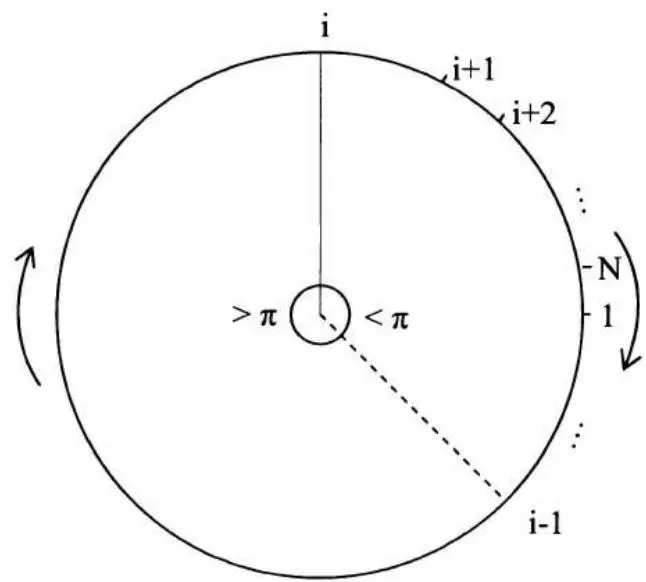
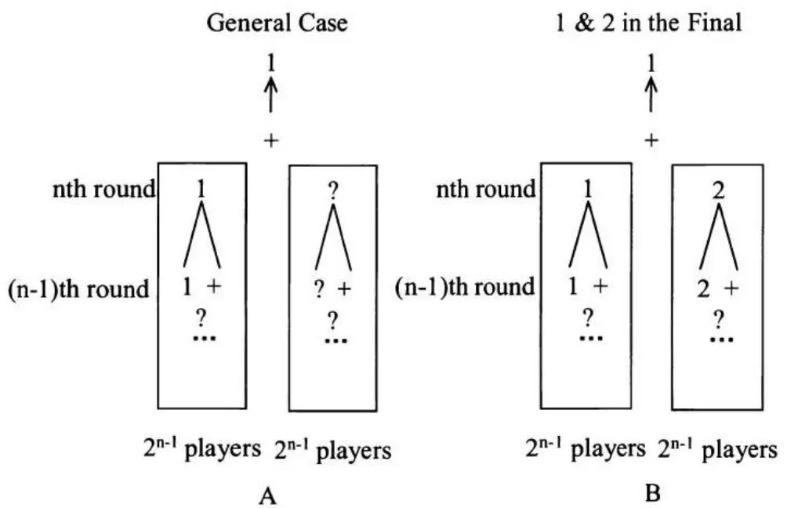
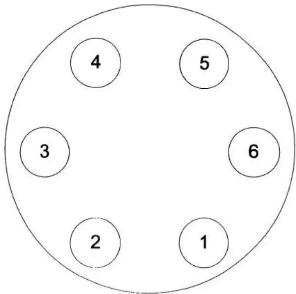
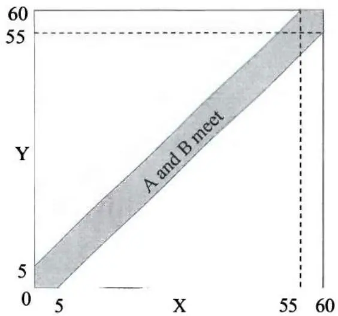
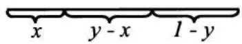
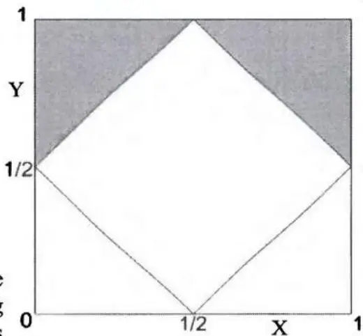
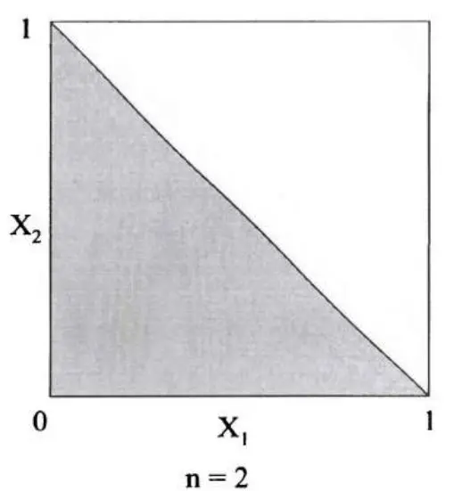
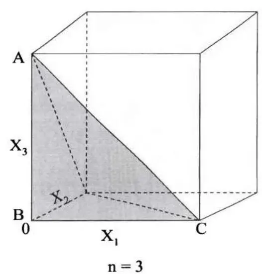
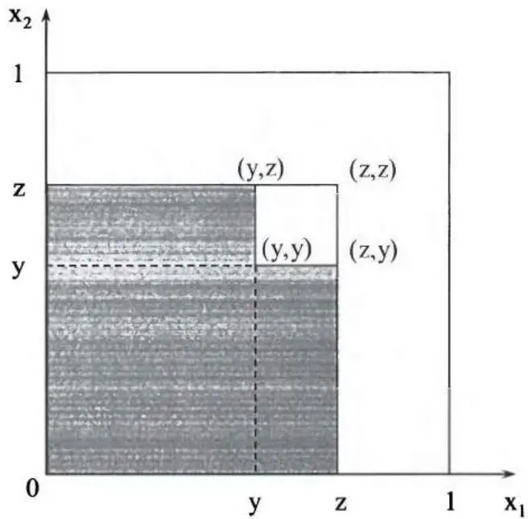

# [第4章](ch04.md) 概率论

在大多数量化面试中，你很可能会遇到至少几个概率问题。概率论是量化金融方方面面的基础。因此，它已成为量化面试中的热门话题。

虽然良好的直觉和逻辑可以帮助你解决许多概率问题，但对基本概率论的透彻理解将为你遇到的多数问题提供清晰简洁的解答。此外，概率论在解释一些看似反直觉的结果方面极具价值。掌握一点知识，你会发现许多面试题目不过是伪装过的教材习题。

因此，我们将本章用于回顾基本的概率论——这些知识不仅在面试中广泛被考察，而且对你未来的职业也可能有帮助。 我们将这些知识应用于真实的面试问题，以展示概率论的力量。然而，知识的重要性绝不应贬低直觉和逻辑的作用。恰恰相反，常识和正确的判断力对于分析和解决面试或实际问题始终至关重要。正如你将在以下各节中看到的，我们在[第2章](ch02.md)中讨论的所有技巧在解决许多概率问题时仍然发挥着重要作用。

让我们开始享受与概率博弈的乐趣。

## 4.1 基本概率定义与集合运算

首先从概率中的一些基本定义和符号开始。这些定义和符号没有例子可能会显得枯燥——我们马上就会举例——但它们对于理解概率论至关重要。此外，它们将为我们系统化地处理概率问题打下坚实基础。

结果（ω）：一次实验或试验的结果。

样本空间/概率空间 $(\Omega)$：一次实验所有可能结果的集合。

$P(\omega)$：一个结果的概率（$P(\omega) \geq 0, \forall \omega \in \Omega, \sum_{\omega \in \Omega} P(\omega) = 1$）。

事件：一组结果的集合，是样本空间的子集。

$P(A)$：事件 A 的概率，$P(A)=\sum_{\omega\in A}P(\omega)$。

$A \cup B : \text{并集} A \cup B \text{是事件} A \text{或事件} B \text{（或两者）中的结果集合。}$

$A \cap B$ 或 $AB:$ 交集 $A \cap B$（或 $AB$）是同时属于 $A$ 和 $B$ 的结果集合。

$A^{c}$：A 的补集，即事件"非 A"。

互斥：$A \cap B = \Phi$，其中 $\Phi$ 是空集。

对于任意互斥事件 $E_{1}, E_{2}, \cdots, E_{N}$，$P\left(\bigcup_{i=1}^{N}E_{i}\right)=\sum_{i=1}^{N}P(E_{i})$。

随机变量：将样本空间 $(\Omega)$ 中的每个结果 $(\omega)$ 映射到实数集的函数。

让我们用掷六面骰子来解释这些定义和符号。掷一次骰子有6个可能的结果（映射到随机变量）：1、2、3、4、5或6。因此样本空间 $\Omega$ 是 $\{1,2,3,4,5,6\}$，每个结果的概率为 $1/6$（假设骰子是均匀的）。我们可以定义事件 $A$ 表示结果为奇数的事件 $A = \{1,3,5\}$，则 $A$ 的补集是 $A^c = \{2,4,6\}$。显然 $P(A) = P(1) + P(3) + P(5) = 1/2$。设 $B$ 为结果大于3的事件：$B = \{4,5,6\}$。则并集为 $A \cup B = \{1,3,4,5,6\}$，交集为 $A \cap B = \{5\}$。一个称为指示变量（二元虚拟变量）的常用随机变量，用于事件 $A$，定义如下：

$I_{A} = \left\{\begin{array}{ll}1, & \text{如果} x \in \{1,3,5\} \\ 0, & \text{如果} x\notin \{1,3,5\} \end{array} \right.$。基本上，当 $A$ 发生时 $I_{A} = 1$，当 $A^{c}$ 发生时 $I_{A} = 0$。$I_{A}$ 的期望值为 $E[I_A] = P(A)$。

现在，来看一些例子。

### 抛硬币游戏

两名赌徒在玩抛硬币游戏。赌徒A有 $(n+1)$ 枚均匀硬币；B有 n 枚均匀硬币。如果两人都抛掷所有硬币，A 得到正面的数量多于 B 的概率是多少？



解答：我们还没有涵盖概率论提供的所有强大工具。我们现在有什么？结果、事件、事件概率，当然还有我们的推理能力！多出的一枚硬币使 A 与 B 不同。如果我们从 A 中移除一枚硬币，A 和 B 将变得对称。不出意外，对称性会给我们很多好的性质。所以我们移除 A 的最后一枚硬币，比较 A 的前 $n$ 枚硬币和 B 的 $n$ 枚硬币中正面的数量。有三种可能的结果：

$E_{1}$: A 的 $n$ 枚硬币中正面数量多于 B 的 $n$ 枚硬币；$E_{2}$: A 的 $n$ 枚硬币中正面数量等于 B 的 $n$ 枚硬币；$E_{3}$: A 的 $n$ 枚硬币中正面数量少于 B 的 $n$ 枚硬币。

由对称性，A 获得更多正面的概率等于 B 获得更多正面的概率。所以 $P(E_1) = P(E_3)$。记 $P(E_1) = P(E_3) = x$ 且 $P(E_2) = y$。由于 $\sum_{\omega \in \Omega} P(\omega) = 1$，我们有 $2x + y = 1$。对于事件 $E_1$，无论 A 的第 $(n+1)$ 枚硬币是哪一面，A 总是有更多正面；对于事件 $E_3$，无论 A 的第 $(n+1)$ 枚硬币是哪一面，A 都不会有更多正面。对于事件 $E_2$，A 的第 $(n+1)$ 枚硬币确实起作用。如果是正面（概率为0.5），则使 A 有更多正面。所以第 $(n+1)$ 枚硬币将 A 有更多正面的概率提高了0.5y，当 A 有 $(n+1)$ 枚硬币时，A 有更多正面的总概率为 $x + 0.5y = x + 0.5(1 - 2x) = 0.5$。



### 纸牌游戏

一家赌场提供一种简单的纸牌游戏。一副牌有52张，每个点数2、3、4、5、6、7、8、9、10、J、Q、K、A各有4张。每次牌被充分洗匀（每张牌被选中的概率相等）。你从牌堆中抽一张牌，庄家抽另一张牌（不放回）。如果你的点数更大，你赢；如果点数相等或你的点数更小，庄家赢——如同所有其他赌场一样，庄家总是有更好的胜率。你获胜的概率是多少？



解答：这个问题的一个答案是考虑你手中牌的所有13种不同结果。牌的点数可以是2、3、…、A，每种概率为1/13。点数为2时，获胜概率为0/51；点数为3时，获胜概率为4/51（当庄家抽到2时）；…；点数为A时，获胜概率为48/51（当庄家抽到2、3、…或K时）。所以你获胜的概率为

$$
\frac{1}{13} \times \left(\frac{0}{51} + \frac{4}{51} + \dots + \frac{48}{51}\right) = \frac{4}{13 \times 51} \times (0 + 1 + \dots + 12) = \frac{4}{13 \times 51} \times \frac{12 \times 13}{2} = \frac{8}{17}.
$$
虽然这是一个直接的解法，并且优雅地使用了整数序列求和，但它不是解决该问题最高效的方法。如果你领会了抛硬币问题的核心精神，你可以通过考虑三种不同的结果来解题：

$E_{1}$：你的牌的点数大于庄家的牌；

$E_{2}$：你的牌的点数等于庄家的牌；

$E_{3}$：你的牌的点数小于庄家的牌。

再次由对称性，$P(E_1) = P(E_3)$。所以我们只需要找出 $P(E_2)$，即两张牌点数相等的概率。假设你随机选了一张牌。在剩余的51张牌中，只有3张牌与你的牌点数相同。所以两张牌点数相等的概率为3/51。因此，你获胜的概率为 $P(E_1) = (1 - P(E_2)) / 2 = (1 - 3 / 51) / 2 = 8 / 17$。



### 醉汉乘客

100名航空乘客排队等待登机。他们每人持有一张该航班100个座位中的一张票。为方便起见，假设队伍中第 n 名乘客持有座位号 n 的票。由于醉酒，队伍中的第一个人随机选择一个座位（每个座位等可能）。其他所有乘客都是清醒的，如果自己的座位未被占用，他们会去坐自己的座位；如果已被占用，他们会随机选择一个空位。你是第100号乘客。你最终坐在自己座位上（即100号座位）的概率是多少？



解答：考虑1号座位和100号座位。有两种可能的结果：

$E_{1}$ : 座位 #1 在座位 #100 之前被占据；

$E_{2}$ : 座位 #100 在座位 #1 之前被占据。

如果任何乘客在座位 #1 被占据之前占据了座位 #100，那么你肯定无法坐到自己的座位上。但如果任何乘客在座位 #100 被占据之前占据了座位 #1，那么你最终一定能坐到自己的座位上。由对称性，两种结果的概率均为 0.5。因此你最终坐在自己座位上的概率为 50%。

如果这种过于简化的推理方式对你来说不够清晰，请考虑以下详细解释：如果醉汉乘客碰巧占据了座位 #1，那么显然其余所有乘客都将坐对座位。如果他占据了座位 #100，那么你将无法得到自己的座位。他占据座位 #1 或 #100 的概率相等。否则，假设他占据了第 n 个座位，其中 n 是介于 2 和 99 之间的数。2 到 (n-1) 之间的每个人都会得到自己的座位。这意味着第 n 位乘客本质上成为新的"醉汉"，其指定座位为 #1。如果他选择 #1，则其余所有乘客都将坐对座位。如果他选择 #100，那么你将无法得到自己的座位。（他选择 #1 或 #100 的概率再次相等。）否则，他只会让后面的另一位乘客成为新的"醉汉"，指定座位为 #1，而每位新的"醉汉"选择 #1 或 #100 的概率相等。由于在所有跳转点，"醉汉"选择座位 #1 或 #100 的概率相等，由对称性，你作为第 100 位乘客坐在 #100 的概率是 0.5。



### 圆上的 N 个点

在圆周上随机抽取 N 个点，这些点全部位于某个半圆内的概率是多少？



解答：从一个点开始，顺时针将点标记为 $1, 2, \cdots, N$ 。从点 1 开始的顺时针半圆内包含所有其余 N-1 个点（即，如果点 1 在 12 点方向，点 2 到 N 全部位于 12 点到 6 点之间）的概率为 $1/2^{N-1}$ 。类似地，从任意点 i 开始的顺时针半圆包含所有其他 N-1 个点的概率也是 $1/2^{N-1}$ ，其中 $i \in \{2, \cdots, N\}$ 。

论断：从点 i 出发的顺时针半圆包含所有其他 N-1 个点的事件，$i=1,2,\cdots,N$，是互斥的。换句话说，如果我们从点 i 出发沿圆顺时针行进，在半圆内依次遇到点 $i+1, i+2,\cdots,N, 1,\cdots,i-1$，那么从任何其他点 j 出发，我们无法在顺时针半圆内遇到所有

其他点。图 4.1 清晰地展示了这一结论。如果从点 i 出发沿圆顺时针行进，我们在半圆内依次遇到点 $i+1, i+2, \cdots, N, 1, \cdots, i-1$，则 i-1 与 i 之间的顺时针弧长必然不小于半圆。如果从任何其他点出发，为了顺时针到达所有其他点，i-1 与 i 之间的顺时针弧长总是被包含在内。因此我们从任何其他点出发都无法在顺时针半圆内到达所有点。因此所有这些事件是互斥的，我们有

$$
P \left(\bigcup_{i = 1} ^{N} E_{i}\right) = \sum_{i = 1} ^{N} P \left(E_{i}\right) \Rightarrow P \left(\bigcup_{i = 1} ^{N} E_{i}\right) = N \times 1 / 2^{N - 1} = N / 2^{N - 1}
$$

同样的论证可以推广到任何长度小于半圆的弧。如果弧长与圆周长的比值为 $x$（$x \leq 1/2$），则所有 $N$ 个点都落入该弧的概率为 $N \times x^{N-1}$ 。

图 4.1 从 $i$ 开始的顺时针半圆内包含 $N$ 个点



## 4.2 组合分析

概率论中的许多问题可以通过简单计数某个事件可能发生的不同方式来求解。计数的数学理论通常被称为组合分析（或组合数学）。本节我们将介绍组合分析的基础知识。

计数基本原理：设 $S$ 是长度为 $k$ 的序列的集合。如果有

- $n_{1}$ 种可能的第一个条目，
- $n_{2}$ 种对于每个第一个条目的第二个条目，
- $n_{3}$ 种对于每个第一和第二个条目组合的第三个条目，以此类推。

则总共有 $n_{1} \cdot n_{2} \cdots n_{k}$ 种可能的结果。

排列：将对象重新排列为不同顺序（即顺序重要）。

性质：n 个对象中，有 $n_{1}$ 个相同、$n_{2}$ 个相同、$\cdots$ 、$n_{r}$ 个相同时，不同的排列数为 $\frac{n!}{n_{1}!n_{2}!\ldots n_{r}!}$ 。

组合：对象的无序集合（即顺序不重要）。

性质：从 n 个不同对象中每次取 r 个，不同的组合数为 $\binom{n}{r}=\frac{n!}{(n-r)!r!}$ 。

二项式定理：$(x+y)^{n}=\sum_{k=0}^{n}\binom{n}{k}x^{k}y^{n-k}$

容斥原理：$P(E_{1} \cup E_{2}) = P(E_{1}) + P(E_{2}) - P(E_{1}E_{2})$

$$
P \left(E_{1} \cup E_{2} \cup E_{3}\right) = P \left(E_{1}\right) + P \left(E_{2}\right) + P \left(E_{3}\right) - P \left(E_{1} E_{2}\right) - P \left(E_{1} E_{3}\right) - P \left(E_{2} E_{3}\right) + P \left(E_{1} E_{2} E_{3}\right)
$$
以及更一般地，
$$
\begin{array}{l} P \left(E_{1} \cup E_{2} \cup \dots \cup E_{N}\right) = \sum_{i = 1} ^{N} P \left(E_{i}\right) - \sum_{i_{1} <   i_{2}} P \left(E_{i_{1}} E_{i_{2}}\right) + \dots + (- 1) ^{r + 1} \sum_{i_{1} <   i_{2} <   \dots i_{r}} P \left(E_{i_{1}} E_{i_{2}} \dots E_{i_{r}}\right) + \dots \\ + (- 1) ^{N + 1} P \left(E_{1} E_{2} \dots E_{N}\right) \\ \end{array}
$$

其中 $\sum_{i_{1}<i_{2}<\ldots,i_{r}}P(E_{i_{1}}E_{i_{2}}\cdots E_{i_{r}})$ 有 $\binom{N}{r}$ 项。

### 扑克手牌

扑克是一种纸牌游戏，每位玩家获得一手 5 张牌。一副牌有 52 张。每张牌有一个点数和一种花色。有 13 种点数，

2, 3, 4, 5, 6, 7, 8, 9, 10, J, Q, K, A，以及四种花色：黑桃、梅花、红心、方块。

获得四条（五张牌中有四张点数相同）手牌的概率是多少？获得满堂彩（三张相同点数加一对）手牌的概率是多少？获得两对手牌的概率是多少？



解答：五张抽牌的不同手牌数是 52 元素集合的 5 元素子集数，所以总手牌数 = $\begin{pmatrix}52\\5\end{pmatrix}=2,598,960$ 。

四条手牌：首先选择四张相同点数的点数，有 13 种选择。第 5 张牌可以是其余 48 张牌中的任意一张（点数有 12 种选择，花色有 4 种选择）。所以四条手牌数为 $13 \times 48 = 624$ 。

满堂彩手牌：依次需要选择三张同点数的点数，13 种选择；三张的花色组合，$\begin{pmatrix}4\\3\end{pmatrix}$ 种选择；对子的点数，12 种选择；对子的花色组合，$\begin{pmatrix}4\\2\end{pmatrix}$ 种选择。所以满堂彩手牌数为 $13\times\begin{pmatrix}4\\3\end{pmatrix}\times12\times\begin{pmatrix}4\\2\end{pmatrix}=13\times4\times12\times6=3,744$ 。

两对手牌：依次需要选择两对的点数，$\begin{pmatrix}13\\2\end{pmatrix}$ 种选择；第一对的花色组合，$\begin{pmatrix}4\\2\end{pmatrix}$ 种选择；第二对的花色组合，$\begin{pmatrix}4\\2\end{pmatrix}$ 种选择；以及剩余的一张牌，44 种选择（52-4×2，因为最后一张牌不能与任一对手牌点数相同）。所以两对手牌数为

$$
\binom{13} {2} \times \binom{4} {2} \times \binom{4} {2} \times 44 = 78 \times 6 \times 6 \times 44 = 123, 552.
$$
要计算各种手牌的概率，只需将每种手牌数除以总可能手牌数即可。



### 跳跳兔

一只兔子坐在有 n 级台阶的楼梯底部。兔子每次只能向上跳一级或两级台阶。兔子跳到楼梯顶部有多少种不同的方式？



解答：我们从最简单的情况开始，考虑用归纳法求解任意台阶数的问题。对于 $n = 1$ ，只有一种方式，$f(1) = 1$ 。对于 $n = 2$ ，可以一次跳 2 级，或者分两次各跳 1 级。所以 $f(2) = 2$ 。对于任意 $n > 2$ ，最后一次跳跃有两种可能：跳 1 级或跳 2 级。在前一种情况下，兔子到达 $n$ 之前位于 $(n - 1)$ ，它有 $f(n - 1)$ 种方式到达 $(n - 1)$ 。在后一种情况下，兔子到达 $n$ 之前位于 $(n - 2)$ ，它有 $f(n - 2)$ 种方式到达 $(n - 2)$ 。所以我们有 $f(n) = f(n - 2) + f(n - 1)$ 。利用这个函数我们可以计算 $n = 3, 4, \cdots$ 时的 $f(n)$ 。



### 狡猾的海盗 2

在和平分赃（[第 2 章](ch02.md)）之后，海盗团队继续劫掠并将队伍扩大到 11 人。为了保护来之不易的宝藏，他们聚在一起将所有战利品放入一个保险箱。由于仍然是一个民主群体，他们决定只有多数人——任何多数——（≥6 人）一起才能打开保险箱。因此他们请锁匠在保险箱上安装一定数量的锁。要获取宝藏，需要打开所有锁。每个锁可以有多个钥匙；但每把钥匙只能开一把锁。锁匠可以给每个海盗多把钥匙。

最少需要多少把锁？每个海盗必须携带多少把钥匙？



解答：这个问题是组合分析在信息共享和密码学中应用的一个很好的例子。该问题的一般版本在 Adi Shamir 1979 年的论文"如何分享秘密"中有所阐述。从 11 人小组中随机选择 5 个海盗；必须有一把锁是他们中没有人有钥匙的。然而其他 6 个海盗中的任何一位都必须有这把锁的钥匙，因为任何 6 个海盗都能打开所有锁。换句话说，我们必须有一把"特殊"锁，所选 5 个海盗中没有人有钥匙，而其他 6 个海盗都有钥匙。这样的 5 人小组是随机选取的。因此对于每种 5 人组合，都必须有这样一把"特殊"锁。最少需要的锁的数量是 $\binom{11}{5}=\frac{11!}{5!6!}=462$ 把。每把锁有 6 把钥匙，分配给一个独特的 6 人子组。所以每个海盗必须携带 $\frac{462\times6}{11}=252$ 把钥匙。这的确是相当多的锁要装在保险箱上，也是每个海盗要携带的大量钥匙。



### 国际象棋锦标赛

一场国际象棋锦标赛有 $2^{n}$ 名选手，技能水平为 $1 > 2 > \cdots > 2^{n}$ 。比赛采用淘汰制，每轮结束后只有胜者晋级下一轮。除决赛外，每轮的对手都是随机抽签决定。我们还假设当两名选手对局时，技能更好的选手总是获胜。选手 1 和 2 在决赛中相遇的概率是多少？



解答：解决这个问题至少有两条思路。标准方法是基于条件概率应用乘法规则，而计数方法则高效得多。（我们将在下一节详细讨论条件概率。）让我们从更容易理解的条件概率方法开始。因为有 $2^{n}$ 名选手，比赛将进行 $n$ 轮（包括决赛）。对于第 1 轮，选手 $2,3,\cdots,2^{n}$ 各自成为 1 的对手的概率为 $\frac{1}{2^{n}-1}$ ，因此 1 和 2 在第 1 轮不相遇的概率为 $\frac{2^{n}-2}{2^{n}-1}=\frac{2\times(2^{n-1}-1)}{2^{n}-1}$ 。条件于 1 和 2 在第 1 轮未相遇，$2^{n-1}$ 名选手进入第 2 轮，1 和 2 在第 2 轮不相遇的条件概率为 $\frac{2^{n-1}-2}{2^{n-1}-1}=\frac{2\times(2^{n-2}-1)}{2^{n-1}-1}$ 。我们重复同样的过程直到第 $(n-1)$ 轮，此时剩余 $2^{2}(=2^{n}/2^{n-2})$ 名选手，1 和 2 在第 $(n-1)$ 轮不相遇的条件概率为 $\frac{2^{2}-2}{2^{2}-1}=\frac{2\times(2^{2-1}-1)}{2^{2}-1}$ 。

设 $E_{1}$ 为 1 和 2 在第 1 轮不相遇的事件；

$E_{2}$ 为 1 和 2 在第 1 轮和第 2 轮都不相遇的事件；

$$
...
$$

$E_{n-1}$ 为 1 和 2 在第 $1,2,\cdots,n-1$ 轮都不相遇的事件。

应用乘法规则，我们有

$P(1\text{和}2\text{在第}n\text{轮相遇}) = P(E_1)\times P(E_2|E_1)\times \dots \times P(E_{n - 1}|E_1E_2\dots E_{n - 2})$
$$
= \frac{2 \times (2^{n - 1} - 1)}{2^{n} - 1} \times \frac{2 \times (2^{n - 2} - 1)}{2^{n - 1} - 1} \times \dots \times \frac{2 \times (2^{2 - 1} - 1)}{2^{2} - 1} = \frac{2^{n - 1}}{2^{n} - 1}
$$

现在我们来看计数方法。图 4.2A 是决赛中发生的情况的示意图。选手 1 总是获胜，所以他一定会进入决赛。从图中可以明显看出，$2^{n}$ 名选手被分为两个 $2^{n-1}$ 人的子组，每组将有一名选手进入决赛。如图 4.2B 所示，为了让选手 2 进入决赛，他/她必须与选手 1 分在不同子组。由于其余选手 $2,3,\cdots,2^{n}$ 中的任何一位，既可能是与选手 1 同组的 $(2^{n-1}-1)$ 名选手之一，也可能是与选手 1 不同组的 $2^{n-1}$ 名选手之一，因此选手 2 与选手 1 分在不同子组且他们将在决赛中相遇的概率就是 $\frac{2^{n-1}}{2^n - 1}$ 。显然，计数方法不仅提供了更简单的解法，也提供了对问题更深刻的理解。

图 4.2A 将 $2^{n}$ 名选手分为两个 $2^{n-1}$ 人子组的一般情况；4.2B 选手 1 和 2 在不同组的特殊情况



### 求职信

你向 5 家公司发送求职申请：摩根士丹利、雷曼兄弟、瑞银集团、高盛和美林。桌上有 5 个信封，上面工整地打印着这 5 家公司人员的姓名和地址。你还有 5 封分别针对每家公司的个性化求职信。你 3 岁的孩子想帮忙，却把每封求职信胡乱塞进了信封里。不幸的是，她随机地将信件

放入信封，没有意识到信件是分别定制的。所有 5 封求职信都被寄错公司的概率是多少？



解答：这个问题是容斥原理的经典应用。实际上，更一般的情况是 Ross 的教材《概率论基础》中的一个例子。
记 $E_{i}, i = 1, \dots, 5$ 为第 $i$ 封信装入正确信封的事件。则 $P\left(\bigcup_{i=1}^{5}E_{i}\right)$ 是至少有一封信装入正确信封的概率，而 $1 - P\left(\bigcup_{i=1}^{5}E_{i}\right)$ 是所有信件都装入错误信封的概率。$P\left(\bigcup_{i=1}^{5}E_{i}\right)$ 可以用容斥原理计算：

$$
P \left(\bigcup_{i = 1} ^{5} E_{i}\right) = \sum_{i = 1} ^{5} P \left(E_{i}\right) - \sum_{i_{1} <   i_{2}} P \left(E_{i_{1}} E_{i_{2}}\right) + \dots + (- 1) ^{6} P \left(E_{1} E_{2} \dots E_{5}\right)
$$

显然 $P(E_{i})=\frac{1}{5},\forall i=1,\cdots,5$ 。所以 $\sum_{i=1}^{5}P(E_{i})=1$ 。

$P(E_{i_1}E_{i_2})$ 是信件 $i_1$ 和信件 $i_2$ 都装入正确信封的事件。信件 $i_1$ 装入正确信封的概率为 1/5；条件于 $i_1$ 已装入正确信封，$i_2$ 装入正确信封的概率为 1/4（只剩下 4 个信封）。所以 $P(E_{i_1}E_{i_2}) = \frac{1}{5} \times \frac{1}{5-1} = \frac{(5-2)!}{5!}$ 。

$\sum_{i_{1}<i_{2}}P(E_{i_{1}}E_{i_{2}})$ 中有 $\begin{pmatrix}5\\2\end{pmatrix}=\frac{5!}{2!(5-2)!}$ 个 $P(E_{i_{1}}E_{i_{2}})$ 项，因此

$$
\sum_{i_{1} <   i_{2}} P \left(E_{i_{1}} E_{i_{2}}\right) = \frac{(5 - 2) !}{5 !} \times \frac{5 !}{2 ! (5 - 2) !} = \frac{1}{2 !}
$$

类似地，我们有 $\sum_{i_1 < i_2 < i_3} P(E_{i_1} E_{i_2} E_{i_3}) = \frac{1}{3!}, \sum_{i_1 < i_2 < i_3 < i_4} P(E_{i_1} E_{i_2} E_{i_3} E_{i_4}) = \frac{1}{4!}$ ，以及

$$
P (E_{1} E_{2} \dots E_{5}) = \frac{1}{5 !}
$$

$$
\therefore P \left(\bigcup_{i = 1} ^{5} E_{i}\right) = 1 - \frac{1}{2 !} + \frac{1}{3 !} - \frac{1}{4 !} + \frac{1}{5 !} = \frac{19}{30}
$$

因此所有 5 封信都被寄错公司的概率为 $1 - P\left(\bigcup_{i=1}^{5}E_{i}\right) = \frac{11}{30}$ 。



### 生日问题

一个班级需要有多少人，才能使至少两人同一天生日的概率超过 1/2？（为简单起见，假设一年有 365 天。）



解答：这个数目小得惊人：23 人。假设班上有 $n$ 个人。不加限制时，每个人的生日有 365 种可能。计数基本原理告诉我们共有 $365^n$ 种可能的序列。

我们想找到那些没有生日重复的序列数。对于第一个人，我们可以选择 365 天中的任意一天；但第二个人只剩下 364 种选择，……，第 r 个人有 $365 - r + 1$ 种选择。所以对于 n 个人，有 $365 \times 364 \times \cdots \times (365 - n + 1)$ 种可能序列，其中没有两人同一天生日。我们需要 $\frac{365 \times 364 \times \cdots \times (365 - n + 1)}{365^{n}} < 1/2$ 才能使概率偏向我们这边。满足条件的最小 n 是 23。



### 第 100 位数字

在 $(1 + \sqrt{2})^{3000}$ 的十进制表示中，小数点后第 100 位数字是多少？



解答：如果你还没有从提示中找出解法，这里再给一个提示：当 $n = 3000$ 时，$(1 + \sqrt{2})^n + (1 - \sqrt{2})^n$ 是一个整数。

对 $(x + y)^n$ 应用二项式定理，我们有

$$
(1 + \sqrt{2}) ^{n} = \sum_{k = 0} ^{n} \binom{n} {k} 1^{n - k} \sqrt{2} ^{k} = \sum_{k = 2 j, 0 \leq j \leq \frac{n}{2}} ^{n} \binom{n} {k} 1^{n - k} \sqrt{2} ^{k} + \sum_{k = 2 j + 1, 0 \leq j <   \frac{n}{2}} ^{n} \binom{n} {k} 1^{n - k} \sqrt{2} ^{k}
$$

$$
(1 - \sqrt{2}) ^{n} = \sum_{k = 0} ^{n} \binom{n} {k} 1^{n - k} (- \sqrt{2}) ^{k} = \sum_{k = 2 j, 0 \leq j \leq \frac{n}{2}} ^{n} \binom{n} {k} 1^{n - k} \sqrt{2} ^{k} - \sum_{k = 2 j + 1, 0 \leq j <   \frac{n}{2}} ^{n} \binom{n} {k} 1^{n - k} \sqrt{2} ^{k}
$$

所以 $(1 + \sqrt{2})^n +(1 - \sqrt{2})^n = 2\sum_{k = 2j,0\leq j\leq \frac{n}{2}}^{n}\binom{n}{k}1^{n - k}\sqrt{2}^k$ ，这始终是一个整数。容易

看出 $0 < (1 - \sqrt{2})^{3000} << 10^{-100}$ 。所以 $(1 + \sqrt{2})^n$ 的第 100 位数字必定是 9。



### 整数的立方

设 $x$ 是 1 到 $10^{12}$ 之间的整数，$x$ 的立方以 11 结尾的概率是多少？



解答：所有整数可以表示为 $x = a + 10b$ ，其中 $a$ 是 $x$ 的个位数字。应用二项式定理，我们有 $x^3 = (a + 10b)^3 = a^3 + 30a^2b + 300ab^2 + 1000b^3$ 。

$x^{3}$ 的个位数字仅取决于 $a^{3}$ 。因此 $a^{3}$ 的个位数字为 1。只有 a = 1 满足这一要求，且 $a^{3} = 1$ 。由于 $a^{3} = 1$ ，十位数字仅取决于 $30a^{2}b = 30b$ 。因此必须有 3b 以 1 结尾，这要求 b 的个位数字为 7。因此，x 的最后两位数字应为 71，在 1 到 $10^{12}$ 之间的整数中，这一概率为 1%。



## 4.3 条件概率与贝叶斯公式

许多金融交易是对基于新的——且很可能是不完整的——信息的概率调整做出的反应。条件概率无疑是量化面试中最常被测试的主题之一。因此在本节中，我们重点介绍基本的条件概率定义和定理。

条件概率 $P(A|B)$ ：如果 $P(B) > 0$ ，则 $P(A|B) = \frac{P(AB)}{P(B)}$ 是 $B$ 的结果中同时也是 $A$ 的结果所占的比例。

$\underline{\text{乘法规则}}：P(E_1 E_2 \cdots E_n) = P(E_1)P(E_2 | E_1)P(E_3 | E_1 E_2) \cdots P(E_n | E_1 \cdots E_{n-1})$ 。

全概率公式：对于任意互斥事件组 $\{F_{i}\}$ ，$i=1,2,\cdots,n$ ，其并集为整个样本空间（$F_{i}\cap F_{j}=\Phi,\forall i\neq j;\bigcup_{i=1}^{n}F_{i}=\Omega$），我们有

$$
\begin{array}{l} P (E) = P \left(E F_{1}\right) + P \left(E F_{2}\right) + \dots + P \left(E F_{n}\right) = \sum_{i = 1} ^{n} P \left(E \mid F_{i}\right) P \left(F_{i}\right) \\ = P \left(E \mid F_{1}\right) P \left(F_{1}\right) + P \left(E \mid F_{2}\right) P \left(F_{2}\right) + \dots + P \left(E \mid F_{n}\right) P \left(F_{n}\right) \\ \end{array}
$$
独立事件：$P(EF) = P(E)P(F) \Rightarrow P(EF^C) = P(E)P(F^C)$ 。

独立性是对称关系：X 与 Y 独立 $\Leftrightarrow$ Y 与 X 独立。

贝叶斯公式：$P(F_{j} \mid E) = \frac{P(E \mid F_{j})P(F_{j})}{\sum_{i=1}^{n} P(E \mid F_{i})P(F_{i})}$ ，其中 $F_{i}, i = 1, \cdots, n$ 是

互斥事件且其并集为整个样本空间。

正如以下例子所示，并非所有条件概率问题都有直观的解法。许多问题需要逻辑分析。

### 男孩与女孩

A 部分。一家公司正在为至少有一个儿子的在职母亲举办晚宴。杰克逊夫人是一位有两个孩子的母亲，她被邀请参加。两个都是男孩的概率是多少？



解答：两个孩子的样本空间为 $\Omega = \{(b, b), (b, g), (g, b), (g, g)\}$ （例如，$(g, b)$ 表示年长的孩子是女孩，年幼的孩子是男孩），每个结果概率相等。由于杰克逊夫人被邀请，她至少有一个儿子。设 $B$ 为至少有一个孩子是男孩的事件，$A$ 为两个孩子都是男孩的事件，我们有
$$
P (A \mid B) = \frac{P (A \cap B)}{P (B)} = \frac{P (\{(b , b) \})}{P (\{(b , b) , (b , g) , (g , b) \})} = \frac{1 / 4}{3 / 4} = \frac{1}{3}.
$$
B 部分。你的新同事帕克夫人已知有两个孩子。如果你看到她与其中一个孩子一起散步，且那个孩子是男孩，那么两个孩子都是男孩的概率是多少？

解答：另一个孩子是男孩或女孩的可能性相等（与你看到的那个男孩独立），所以两个孩子都是男孩的概率是 1/2。

注意 A 部分和 B 部分之间的细微差别。在 A 部分中，问题本质上是在已知两个孩子中至少有一个男孩的条件下，求两个孩子都是男孩的条件概率。B 部分是在已知一个孩子是男孩的条件下，求另一个孩子也是男孩的条件概率。对于两部分，我们都需要假设每个孩子是男孩或女孩的可能性相等。



### 全是女孩的世界？

在一个原始社会中，每对夫妇都偏好生女孩。每个孩子是女孩的概率为 50%，且孩子们的性别相互独立。如果每对夫妇坚持继续生育直到得到一个女孩，一旦有了女孩就停止生育，那么这个社会中女孩的比例最终会变成多少？



解答：令人惊讶的是，许多面试者——包括许多学过概率的人——都错误地认为女孩会更多。不要让"偏好"这个词和错误的直觉误导你。女婴的比例是由自然决定的，或者至少是由 X 和 Y 染色体决定的，而不是由夫妇的偏好决定的。你只需要看关键信息：50% 和独立性。每个新生婴儿是男孩或女孩的概率相等，无论其他孩子的性别如何。因此出生的女孩比例始终是 50%，社会中的女孩比例将稳定在 50%。



### 不公平的硬币

你有 1000 枚硬币。其中 1 枚是两面都是正面的硬币。其他 999 枚是公平硬币。你随机选择一枚硬币并抛掷 10 次。每次硬币都正面朝上。你选择的那枚硬币是不公平硬币的概率是多少？



解答：这是一个使用贝叶斯定理的经典条件概率问题。设 $A$ 为所选硬币是不公平硬币的事件，则 $A^c$ 为所选硬币是公平硬币的事件。设 $B$ 为所有十次抛掷都正面朝上的事件。应用贝叶斯

定理，我们有 $P(A \mid B) = \frac{P(B \mid A)P(A)}{P(B)} = \frac{P(B \mid A)P(A)}{P(B \mid A)P(A) + P(B \mid A^c)P(A^c)}$ 。

先验概率为 $P(A) = 1 / 1000$ 和 $P(A^c) = 999 / 1000$ 。如果硬币是不公平的，它总是正面朝上，所以 $P(B|A) = 1$ 。如果硬币是公平的，每次正面朝上的概率为 $1/2$ 。所以 $P(B \mid A^c) = (1/2)^{10} = 1/1024$ 。代入所有已知信息，我们得到答案：

$$
P (A \mid B) = \frac{P (B \mid A) P (A)}{P (B \mid A) P (A) + P (B \mid A^{c}) P (A^{c})} = \frac{1 / 1000 \times 1}{1 / 1000 \times 1 + 999 / 1000 \times 1 / 1024} \approx 0.5.
$$


### 从不公平的硬币得到公平的概率

如果你有一枚不公平的硬币，可能以未知概率偏向正面或反面，你能用这枚硬币产生均匀的赔率吗？



解答：与公平硬币不同，用不公平硬币抛掷一次显然无法产生均匀的赔率。用两次抛掷呢？设 $p_H$ 为硬币正面朝上的概率，$p_T$ 为硬币反面朝上的概率（$p_H + p_T = 1$）。考虑两次独立抛掷。我们有四种可能的结果 HH、HT、TH 和 TT，概率分别为 $P(HH) = p_H p_H$ 、$P(HT) = p_H p_T$ 、$P(TH) = p_T p_H$ 和 $P(TT) = p_T p_T$ 。

所以我们有 $P(HT)=P(TH)$ 。通过将 HT 指定为赢，TH 指定为输，我们可以产生均匀的赔率。



### 飞镖游戏

杰森向飞镖靶投掷两支飞镖，瞄准中心。第二支飞镖落点比第一支离中心更远。如果杰森投掷第三支飞镖瞄准中心，第三支飞镖比第一支离中心更远的概率是多少？假设杰森的技艺水平恒定。



解答：一种标准答案是直接通过枚举所有可能结果来应用条件概率。如果我们将三支飞镖的结果从最好（A）到最差（C）排序，有 6 种等可能的结果：

<table><tr><td>结果</td><td>1</td><td>2</td><td>3</td><td>4</td><td>5</td><td>6</td></tr><tr><td>第一次投掷</td><td>A</td><td>B</td><td>A</td><td>C</td><td>B</td><td>C</td></tr><tr><td>第二次投掷</td><td>B</td><td>A</td><td>C</td><td>A</td><td>C</td><td>B</td></tr><tr><td>第三次投掷</td><td>C</td><td>C</td><td>B</td><td>B</td><td>A</td><td>A</td></tr></table>

前两次投掷的信息排除了结果 2、4 和 6。在条件于结果 1、3 和 5 的情况下，第三次投掷比第一次更差的结果是结果 1 和 3。因此第三次投掷比第一次离中心更远的概率为 2/3。

这种方法当然是合理的。然而，它并不是一种高效的方法。当飞镖数量较少时，我们可以轻松枚举所有结果。但如果原问题有一个更复杂的版本呢：

杰森向飞镖靶投掷 $n (n \geq 5)$ 支飞镖，瞄准中心。每一支后续飞镖都比第一支离中心更远。如果杰森投掷第 $(n + 1)$ 支飞镖，它也比第一支离中心更远的概率是多少？

这个问题等价于一个简单的问题：第 $(n+1)$ 次投掷不是所有 $(n+1)$ 次投掷中最好的概率是多少？由于第一次投掷是前 n 次投掷中最好的，本质上我是在说第 $(n+1)$ 次投掷是所有 $(n+1)$ 次投掷中最好的事件（记为 $A_{n+1}$ ）与第一次投掷是前 n 次投掷中最好的事件（记为 $A_{1}$ ）是独立的。实际上，$A_{n+1}$ 与前 n 次投掷的顺序无关。这两个事件真的独立吗？答案是肯定的。如果 $A_{n+1}$ 与前 n 次投掷的顺序无关这一点对你来说不明显，让我们换个方式看：前 n 次投掷的顺序与 $A_{n+1}$ 无关。这个论断当然是显而易见的。但独立性是对称的！由于 $A_{n+1}$ 的概率为 $1/(n+1)$ ，第 $(n+1)$ 次投掷不是最好的概率为 $n/(n+1)$ 。

对于原始版本，三支飞镖是独立投掷的，每支飞镖有 1/3 的概率成为最好的投掷。只要第三支飞镖不是最好的投掷，它就会比第一支飞镖差。因此答案是 2/3。



### 生日排队

在一家电影院，一位异想天开的经理宣布，她将向排队中第一个与已购票者生日相同的人赠送一张免费票。你有机会选择排队中的任意位置。假设你不知道任何其他人的生日，且所有生日在一年中随机分布（假设一年有 365 天），哪个位置能让你获得免费票的概率最大？



解答：如果你已经解决过 n 人小组中没有两人同一天生日的问题，那么这个问题只是一个小小的扩展。假设你选择成为队伍中的第 n 个人。为了让你获得免费票，前 n-1 个人必须都有不同的生日，并且你的生日必须与那 n-1 个人中的某个人相同。
$$
\begin{array}{l} p (n) = p \left(\text{前} n - 1 \text{人没有相同生日}\right) \times p \left(\text{你的生日在那} n - 1 \text{个生日中}\right) \\ = \frac{365 \times 364 \times \cdots (365 - n + 2)}{365^{n - 1}} \times \frac{n - 1}{365} \\ \end{array}
$$
直观上可以论证，当 $n$ 较小时，增加 $n$ 会增加你获得免费票的机会，因为 $p$（你的生日在那 $n - 1$ 个生日中）的增加比 $p$（前 $n - 1$ 人没有相同生日）的减少更显著。所以当 $n$ 较小时，有 $P(n) > P(n - 1)$ 。随着 $n$ 增大，$p$（前 $n - 1$ 人没有相同生日）的负面影响逐渐赶上，在某一点之后我们将有 $P(n + 1) < P(n)$ 。因此我们需要找到一个满足 $P(n) > P(n - 1)$ 和 $P(n) > P(n + 1)$ 的 $n$ 。
$$
P (n - 1) = \frac{365}{365} \times \frac{364}{365} \times \dots \times \frac{365 - (n - 3)}{365} \times \frac{n - 2}{365}
$$

$$
P (n) = \frac{365}{365} \times \frac{364}{365} \times \dots \times \frac{365 - (n - 2)}{365} \times \frac{n - 1}{365}
$$

$$
P (n + 1) = \frac{365}{365} \times \frac{364}{365} \times \dots \times \frac{365 - (n - 2)}{365} \times \frac{365 - (n - 1)}{365} \times \frac{n}{365}
$$

$\left. \begin{array}{l} P(n) > P(n - 1) \Rightarrow \frac{365 - (n - 2)}{365} \times \frac{n - 1}{365} > \frac{n - 2}{365} \\ P(n) > P(n + 1) \Rightarrow \frac{n - 1}{365} > \frac{365 - (n - 1)}{365} \times \frac{n}{365} \end{array} \right\} \Rightarrow \left. \begin{array}{l} n^2 - 3n - 363 < 0 \\ n^2 - n - 365 > 0 \end{array} \right\} \Rightarrow n = 20$ 因此，

你应该成为队伍中的第 20 个人。



### 骰子顺序

我们依次投掷 3 颗骰子。得到三个点数严格递增的顺序的概率是多少？



解答：要得到三个点数严格递增的顺序，首先三个点数必须互不相同。在三个点数不同的条件下，严格递增顺序的概率就是 $1/3! = 1/6$（所有可能排列中的特定序列）。因此我们有

$\mathrm{P} = \mathrm{P}(三次投掷点数均不同) \times \mathrm{P}(递增顺序|3个不同点数)$

$$
= (1 \times \frac{5}{6} \times \frac{4}{6}) \times \frac{1}{6} = 5 / 54
$$


### 三门问题

三门问题是一个基于美国老牌节目《来做个交易》的概率谜题。问题以该节目主持人的名字命名。假设你现在参加这个节目，面前有三扇门可供选择。其中一扇门后面有一辆汽车；另外两扇门后面是山羊。你事先不知道每扇门后面是什么。

你选择其中一扇门并宣布你的选择。一旦你选定了门，蒙提会打开另外两扇门中他知道后面有山羊的一扇。然后他给你选择：坚持原来的选择，或者换到第三扇门。你应该换吗？如果换，赢得汽车的概率是多少？



解答：如果你不换，你是否获胜与蒙提向你展示山羊的行为无关，所以你获胜的概率是 1/3。如果你换呢？许多人会争辩说，既然蒙提展示了一扇有山羊的门后只剩下两扇门，获胜的概率是 1/2。但这个论点正确吗？

如果你从不同的角度看待这个问题，答案就变得清晰了。使用换门策略，当且仅当你最初选到一扇有山羊的门时，你才能赢得汽车，其概率为 2/3（你选到有山羊的门，蒙提展示另一扇有山羊的门，所以你换到的那扇门后面一定是汽车）。如果你最初选到了有汽车的门，概率为 1/3，那么换门就会输。因此通过换门获胜的概率实际上是 2/3。



### 阿米巴种群

池塘里有一只阿米巴。每分钟过后，阿米巴可能死亡、保持不变、分裂成两个或分裂成三个，每种情况概率相等。它的所有后代（如果有的话）将表现相同（且独立于其他阿米巴）。阿米巴种群最终灭绝的概率是多少？



解答：一旦我们意识到需要根据一分钟后天阿米巴发生的情况来推导概率，这只是一个标准的条件概率问题。设 $P(E)$ 为阿米巴种群灭绝的概率，并应用全概率公式，条件于一分钟后阿米巴发生的情况：
$$
P (E) = P \left(E \mid F_{1}\right) P \left(F_{1}\right) + P \left(E \mid F_{2}\right) P \left(F_{2}\right) + \dots + P \left(E \mid F_{n}\right) P \left(F_{n}\right).
$$

对于最初的阿米巴，如问题所述，有四种可能的互斥事件，每个概率为 1/4。记 $F_1$ 为阿米巴死亡的事件；$F_2$ 为它保持不变的事件；$F_3$ 为它分裂成两个的事件；$F_4$ 为它分裂成三个的事件。对于 $F_1$ ，$P(E|F_1) = 1$ ，因为没有阿米巴留下。$P(E|F_2) = P(E)$ ，因为状态与开始时相同。对于 $F_3$ ，有两个阿米巴，每个的行为与最初的阿米巴相同。总种群只有在两个阿米巴都灭绝时才会灭绝。由于它们是独立的，两者都灭绝的概率为 $P(E)^2$ 。类似地，$P(F_4) = P(E)^3$ 。代入所有数字，方程变为 $P(E) = 1/4 \times 1 + 1/4 \times P(E) + 1/4 \times P(E)^2 + 1/4 \times P(E)^3$ 。在约束 $0 < P(E) < 1$ 下解此方程，得到 $P(E) = \sqrt{2} - 1 \approx 0.414$（方程的其他两个根为 1 和 $-\sqrt{2} - 1$ ）。



### 罐中的糖果

你从一个装有 10 颗红色糖果、20 颗蓝色糖果和 30 颗绿色糖果的罐子中一颗接一颗地取出糖果。当你取出所有红色糖果时，罐中至少还剩 1 颗蓝色糖果和 1 颗绿色糖果的概率是多少？



解答：乍一看，这个问题似乎是组合问题。然而，条件概率方法给出了一个更直观的答案。设 $T_r$ 、$T_b$ 和 $T_g$

分别为最后一颗红色、蓝色和绿色糖果被取出的序号。要使取出所有红色糖果时至少还剩 1 颗蓝色糖果和 1 颗绿色糖果，我们需要 $T_r < T_b$ 和 $T_r < T_g$ 。换句话说，我们要求 $P(T_r < T_b \cap T_r < T_g)$ 。满足 $T_r < T_b$ 和 $T_r < T_g$ 的有两个互斥事件：$T_r < T_b < T_g$ 和 $T_r < T_g < T_b$ 。
$$
\therefore P \left(T_{r} <   T_{b} \cap T_{r} <   T_{g}\right) = P \left(T_{r} <   T_{b} <   T_{g}\right) + P \left(T_{r} <   T_{g} <   T_{b}\right)
$$
$T_{r} < T_{b} < T_{g}$ 意味着最后一颗糖果是绿色的（$T_{g} = 60$）。由于 60 颗糖果中的每一颗成为最后一颗的可能性相等，且其中有 30 颗是绿色的，我们有 $P(T_{g} = 60) = \frac{30}{60}$ 。条件于 $T_{g} = 60$ ，我们需要 $P(T_{r} < T_{b} \mid T_{g} = 60)$ 。在 30 颗红色和蓝色糖果中，每颗糖果再次等可能地成为最后一颗，且有 20 颗蓝色糖果，所以 $P(T_{r} < T_{b} \mid T_{g} = 60) = \frac{20}{30}$ 且 $P(T_{r} < T_{b} < T_{g}) = \frac{30}{60} \times \frac{20}{30}$ 。类似地，我们有 $P(T_{r} < T_{g} < T_{b}) = \frac{20}{60} \times \frac{30}{40}$ 。

因此，
$$
P \left(T_{r} <   T_{b} \cap T_{r} <   T_{g}\right) = P \left(T_{r} <   T_{b} <   T_{g}\right) + P \left(T_{r} <   T_{g} <   T_{b}\right) = \frac{30}{60} \times \frac{20}{30} + \frac{20}{60} \times \frac{30}{40} = \frac{7}{12}.
$$


### 抛硬币游戏

两名玩家 A 和 B 轮流抛一枚公平硬币（A 先抛，然后 B 抛，然后 A，然后 B……）。记录正反面序列。如果出现正面后跟反面（HT 子序列），游戏结束，抛到反面的玩家获胜。A 获胜的概率是多少？



解答：设 $P(A)$ 为 $A$ 获胜的概率；则 $B$ 获胜的概率为 $P(B) = 1 - P(A)$ 。我们条件于 $A$ 的第一次抛掷，它有 $1/2$ 的概率为 $H$（正面）和 $1/2$ 的概率为 $T$（反面）。
$$
P (A) = 1 / 2 P (A \mid H) + 1 / 2 P (A \mid T)
$$
如果 $A$ 的第一次抛掷是 $T$ ，则 $B$ 本质上成为第一个抛掷者（需要 $H$ 才能形成 HT 子序列）。所以 $P(A|T) = P(B) = 1 - P(A)$ 。

如果 $A$ 的第一次抛掷结果是 $H$ ，我们进一步条件于 $B$ 的第一次抛掷。$B$ 有 1/2 的概率得到 $T$ ，此时 $A$ 输。对于 $B$ 得到 $H$ 的 1/2 概率，$B$ 本质上成为第一个抛到 $H$ 的人。此时，$A$ 有 $(1 - P(A|H))$ 的概率获胜。所以 $P(A|H) = 1/2 \times 0 + 1/2(1 - P(A|H)) \Rightarrow P(A|H) = 1/3$

综合所有已知信息，我们有
$$
P (A) = 1 / 2 \times 1 / 3 + 1 / 2 (1 - P (A)) \Rightarrow P (A) = 4 / 9.
$$
合理性检查：我们可以看到 $P(A) < 1/2$ ，这是合理的，因为 A 无法在第一次抛掷中获胜，而 B 有 $1/4$ 的概率在她的第一次抛掷中获胜。



### 俄罗斯轮盘系列

我们来玩传统版本的俄罗斯轮盘。一发子弹被装入一个 6 膛左轮手枪的弹巢中。弹巢随机旋转，使每个膛室位于击锤下方的概率相等。两名玩家轮流扣动扳机——不幸的是枪口指向自己的头部——不再旋转，直到枪响，中枪者输。如果你是一名玩家，可以选择先手或后手，你会如何选择？你输的概率是多少？



解答：许多人错误地认为先手的人输的概率更高。毕竟，第一名玩家在第二轮开始前第一轮就有 1/6 的概率中枪。不幸的是，这是少数直觉错误的情况之一。一旦弹巢旋转，子弹的位置就固定了。如果你先手，当且仅当子弹在膛室 1、3 或 5 时你会输。因此你输的概率与第二名玩家相同，为 1/2。从这个意义上说，先手还是后手并不重要。

现在，让我们稍微改变规则。每次扣动扳机后我们重新旋转弹巢。你会选择先手还是后手？你输的概率是多少？

解答：区别在于每次操作现在是独立的。假设第一名玩家输的概率为 $p$ ，则第二名玩家输的概率为 $1 - p$ 。我们条件于第一人第一次扣动扳机。他这次有 $1/6$ 的概率输。否则，他本质上成为游戏中的第二名玩家，新的（条件）输的概率为 $1 - p$ 。这种情况发生的概率为 $5/6$ 。这给出 $p = 1 \times 1/6 + (1 - p) \times 5/6 \Rightarrow p = 6/11$ 。因此你应该选择成为第二名玩家，输的概率为 $5/11$ 。

如果不是一发子弹，而是两发子弹随机放入弹巢。你的对手先手，第一次扣动扳机后他仍活着。你有选择是否旋转弹巢的选项。你应该旋转弹巢吗？

解答：如果你旋转弹巢，你这一轮输的概率为 2/6。如果你不旋转弹巢，只剩下 5 个膛室，你这一轮输的概率（条件于你的对手幸存）为 2/5。因此你应该旋转弹巢。

如果两发子弹随机放入两个连续的位置呢？如果你的对手在第一轮幸存，你应该旋转弹巢吗？

解答：现在我们必须条件于两个子弹位置是连续的这一事实。如图 4.3 所示，将空膛室标记为 1、2、3 和 4；将有子弹的标记为 5 和 6。由于你的对手在第一轮幸存，他可能遇到的位置是 1、2、3 或 4，概率相等。有 1/4 的概率下一个是子弹（位置是 4）。所以如果你不旋转，生存概率为 3/4。如果你旋转弹巢，每个位置被选中的概率相等，你的生存概率仅为 2/3。因此你不应该旋转弹巢。

图 4.3 两发连续子弹的俄罗斯轮盘。



### 王牌

52 张牌随机分给 4 名玩家，每人 13 张牌。每人得到一张 A 的概率是多少？


解答：该问题可以用标准计数方法解决。将 52 张牌分给 4 名玩家每人 13 张，共有 $\frac{52!}{13!13!13!13!}$ 种排列。如果每名玩家需要得到一张 A，我们可以先分配 A，有 4! 种方式。然后我们将剩余的 48 张牌分给 4 名玩家每人 12 张，有 $\frac{48!}{12!12!12!12!}$ 种排列。因此每人得到一张 A 的概率为

$$
4! \times \frac{48 !}{12 ! 12 ! 12 ! 12 !} \div \frac{52 !}{13 ! 13 ! 13 ! 13 !} = \frac{52}{52} \times \frac{39}{51} \times \frac{26}{50} \times \frac{13}{49}.
$$
如果使用条件概率方法，逻辑变得更加清晰。从四张 A 中的任意一张开始，它属于某一堆的概率为 $52 / 52 = 1$ 。第二张 A 可以是剩余 51 张牌中的任意一张，其中有 39 张属于与第一张 A 不同的堆。因此第二张 A 不在第一张 A 所在堆的概率为 39/51。现在剩下 50 张牌，其中 26 张属于其他两个堆。因此在前两张 A 已经在不同堆的条件下，第三张 A 在另外两个堆之一的概率为 26/50。类似地，在前三张 A 在不同堆的条件下，第四张 A 在与前三张 A 不同堆的概率为 13/49。因此每堆有一张 A 的概率为
$$
1 \times \frac{39}{51} \times \frac{26}{50} \times \frac{13}{49}.
$$



### 赌徒破产问题

一名赌徒初始有 i 美元。每进行一局游戏，赌徒以概率 p 赢 1 美元（0 < p < 1），或以概率 q = 1 - p 输 1 美元。如果他累积到 N 美元或输光所有钱，他将停止。他最终以 N 美元结束的概率是多少？



解答：这是一个经典的教科书概率问题，称为赌徒破产问题。有趣的是，它在量化面试中仍然被广泛使用。

从任意初始状态 $i$（赌徒拥有的美元数），$0 \leq i \leq N$ ，设 $P_{i}$ 为赌徒的财富达到 $N$ 而不是 0 的概率。下一状态要么以概率 $p$ 达到 $i + 1$ ，要么以概率 $q$ 达到 $i - 1$ 。因此我们有

$$
P_{i} = p P_{i + 1} + q P_{i - 1} \Rightarrow P_{i + 1} - P_{i} = \frac{q}{p} \left(P_{i} - P_{i - 1}\right) = \left(\frac{q}{p}\right) ^{2} \left(P_{i - 1} - P_{i - 2}\right) = \dots = \left(\frac{q}{p}\right) ^{i} \left(P_{1} - P_{0}\right)
$$
我们还有边界概率 $P_0 = 0$ 和 $P_N = 1$ 。

因此从 $P_{2}$ 开始，我们可以依次将 $P_{i}$ 表示为 $P_{1}$ 的表达式：
$$
P_{1} = p P_{2} + q P_{0} \Rightarrow P_{2} = \frac{1}{p} P_{1} = \left[ 1 + \frac{q}{p} \right] P_{1}
$$

$$
P_{3} = \left[ 1 + \frac{q}{p} + \left(\frac{q}{p}\right) ^{2} \right] P_{1}
$$
...
$$
P_{i} = \left[ 1 + \frac{q}{p} + \dots + \left(\frac{q}{p}\right) ^{i - 1} \right] P_{1}
$$
将此表达式推广到 $P_N$ ，我们有
$$
\begin{array}{l} P_{N} = 1 = \left[ 1 + \frac{q}{p} + \dots + \left(\frac{q}{p}\right) ^{N - 1} \right] P_{1} = \left\{\begin{array}{l l} \frac{1 - (q / p) ^{N}}{1 - q / p} P_{1}, & \text{if} q / p \neq 1 \\ N P_{1}, & \text{if} q / p = 1 \end{array} \right. \\ \Rightarrow P_{1} = \left\{\begin{array}{l l} \frac{1 - q / p}{1 - (q / p) ^{N}}, & \text{if} q / p \neq 1 \\ 1 / N, & \text{if} q / p = 1 \end{array} \Rightarrow P_{i} = \left\{\begin{array}{l l} \frac{1 - (q / p) ^{i}}{1 - (q / p) ^{N}} P_{1}, & \text{if} p \neq 1 / 2 \\ i / N, & \text{if} p = 1 / 2 \end{array} \right. \right. \\ \end{array}
$$



### 篮球得分

一名篮球运动员正在进行 100 次罚球。如果球穿过篮筐她得 1 分，如果投失得 0 分。她第一次投中，第二次投失。对于之后的每一次投球，她投中的概率等于她到目前为止的命中率。例如，如果她在第 40 次投球后得到 23 分，则她在第 41 次投球中投中的概率为 23/40。在 100 次投球后（包括第一次和第二次），她恰好投中 50 球的概率是多少？



解答：设 $(n,k)$ ，$1 \leq k \leq n$ ，为球员在 $n$ 次投球后投中 $k$ 球的事件，$P_{n,k} = P((n,k))$ 。如果我们从 $n=3$ 开始使用归纳法，答案会出奇地简单。第三次投球投中的概率为 $1/2$ 。所以有 $P_{3,1} = 1/2$ 和 $P_{3,2} = 1/2$ 。对于 $n=4$ 的情况，应用全概率公式

$$
\left\{\begin{array}{l} P_{4, 1} = P ((4, 1) | (3, 1)) \times P_{3, 1} + P ((4, 1) | (3, 2)) \times P_{3, 2} = \frac{2}{3} \times \frac{1}{2} + 0 \times \frac{1}{2} = \frac{1}{3} \\ P_{4, 2} = P ((4, 2) | (3, 1)) \times P_{3, 1} + P ((4, 2) | (3, 2)) \times P_{3, 2} = \frac{1}{3} \times \frac{1}{2} + \frac{1}{3} \times \frac{1}{2} = \frac{1}{3} \\ P_{4, 3} = P ((4, 3) | (3, 1)) \times P_{3, 1} + P ((4, 3) | (3, 2)) \times P_{3, 2} = 0 \times \frac{1}{2} + \frac{2}{3} \times \frac{1}{2} = \frac{1}{3} \end{array} \right.
$$

结果表明 $P_{n,k}=\frac{1}{n-1},\forall k=1,2,\cdots,n-1$ ，并提示全概率公式可以在归纳步骤中使用。

归纳步骤：假设 $P_{n,k} = \frac{1}{n-1}, \forall k = 1, 2, \cdots, n-1$ ，我们需要证明 $P_{n+1,k} = \frac{1}{(n+1)-1} = \frac{1}{n}, \forall k = 1, 2, \cdots, n$ 。为证明这一点，只需应用全概率公式：

$$
\begin{array}{l} P_{n + 1, k} = P (投失 \mid (n, k)) P_{n, k} + P (投中 \mid (n, k - 1)) P_{n, k - 1} \\ = \left(1 - \frac{k}{n}\right) \frac{1}{n - 1} + \frac{k - 1}{n} \frac{1}{n - 1} = \frac{1}{n} \\ \end{array}
$$

该公式也适用于 $P_{n+1,1}$ 和 $P_{n+1,n}$ ，尽管在这些情况下 $\frac{k-1}{n}=0$ 和 $\left(1-\frac{k}{n}\right)=0$ 。因此 $P_{n,k}=\frac{1}{n-1}$ ，$\forall k=1,2,\cdots,n-1$ 且 $\forall n\geq2$ 。因此 $P_{100,50}=1/99$ 。



### 路上的汽车

如果在任何 20 分钟的时间间隔内，在高速公路上观察到至少一辆汽车的概率为 609/625，那么在任何 5 分钟的时间间隔内观察到至少一辆汽车的概率是多少？假设在任何时刻看到汽车的概率在整个 20 分钟内是均匀的（常数）。



解答：我们可以将 20 分钟间隔分解为 4 个不重叠的 5 分钟间隔序列。由于默认概率（观察到汽车）是常数，在任何 5 分钟间隔内观察到汽车的概率是常数。记该概率为 p，则在任何 5 分钟间隔内观察不到汽车的概率为 1-p。

在所有四个这样的独立 5 分钟间隔内都观察不到汽车的概率为 $(1-p)^{4}=1-609/625=16/625$ ，得到 p=3/5。



## 4.4 离散分布与连续分布

在本节中，我们回顾在量化建模中广泛使用的各种随机变量分布函数。虽然可能没有必要记住这些分布的性质，但对分布有直观理解并能够快速推导重要性质是实践中的宝贵技能。像往常一样，让我们从理论开始：

### 随机变量的常用函数

表 4.1 总结了离散和连续随机变量的基本性质如何定义或计算。这些是你应该牢记的基础知识。

<table><tr><td>随机变量 (X)</td><td>离散</td><td>连续19</td></tr><tr><td>累积分布函数/cdf</td><td> $F(a) = P\{X \leq a\}$ </td><td> $F(a) = \int_{-\infty}^{a} f(x) dx$ </td></tr><tr><td>概率质量函数 /pmf概率密度函数 /pdf</td><td>pmf: $p(x) = P\{X = x\}$ </td><td>pdf:  $f(x) = \frac{d}{dx} F(x)$ </td></tr><tr><td>期望值/ E[X]</td><td> $\sum_{x:p(x)>0} xp(x)$ </td><td> $\int_{-\infty}^{\infty} xf(x) dx$ </td></tr><tr><td>g(X)的期望值/ E[g(X)]</td><td> $\sum_{x:p(x)>0} g(x) p(x)$ </td><td> $\int_{-\infty}^{\infty} g(x) f(x) dx$ </td></tr><tr><td>X的方差/ var(X)</td><td colspan="2"> $E[(X - E[X])^{2}] = E[X^{2}] - (E[X])^{2}$ </td></tr><tr><td>X的标准差/ std(X)</td><td colspan="2"> $\sqrt{var(X)}$ </td></tr></table>

表 4.1 离散和连续随机变量的基本性质

### 离散随机变量

表 4.2 包含了一些最广泛使用的离散分布。离散均匀分布表示集合 $\{a, a+1, \cdots, b\}$ 中所有值等可能出现的某个值。二项分布表示 $n$ 次独立试验中成功的次数，每次试验以概率 $p$ 成功。泊松分布表示在固定时间段内发生的事件数，已知平均发生率 $\lambda$，期望发生次数为 $\lambda t$，且事件与上一次事件以来的时间独立。几何分布表示获得第一次成功所需的试验次数（$n$），每次试验以概率 $p$ 独立成功。负二项分布表示获得第 $r$ 次成功所需的试验次数，每次试验以概率 $p$ 独立成功。

<table><tr><td>名称</td><td>概率质量函数 (pmf)</td><td>E[X]</td><td>var(X)</td></tr><tr><td>均匀</td><td> $P(x)=\frac{1}{b-a+1}, \quad x=a,a+1,\cdots,b$ </td><td> $\frac{b+a}{2}$ </td><td> $\frac{(b-a+1)^{2}-1}{12}$ </td></tr><tr><td>二项</td><td> $P(x)=\binom{n}{x}p^{x}(1-p)^{n-x}, \quad x=0,1,\cdots,n$ </td><td>np</td><td>np(1-p)</td></tr><tr><td>泊松</td><td> $P(x)=\frac{e^{-\lambda t}(\lambda t)^{x}}{x!}, \quad x=0,1,\cdots^{20}$ </td><td> $\lambda t$ </td><td> $\lambda t$ </td></tr><tr><td>几何</td><td> $P(x)=(1-p)^{x-1}p, \quad x=1,2,\cdots$ </td><td> $\frac{1}{p}$ </td><td> $\frac{1-p}{p^{2}}$ </td></tr><tr><td>负二项</td><td> $P(x)=\binom{x-1}{r-1}p^{r}(1-p)^{x-r}, \quad x=r,r+1,\cdots$ </td><td> $\frac{r}{p}$ </td><td> $\frac{r(1-p)}{p^{2}}$ </td></tr></table>

表 4.2 离散随机变量的概率质量函数、期望值和方差

### 连续随机变量

表 4.3 包含了一些常见的连续分布。均匀分布描述在区间 $[a, b]$ 上均匀分布的随机变量。由于中心极限定理，正态分布/高斯分布是迄今为止最流行的连续分布。指数分布用于建模事件到达时间，假设事件具有恒定的到达率 $\lambda$ 。具有参数 $(\alpha, \lambda)$ 的伽马分布在实践中常作为等待总共 $n$ 个事件发生所需时间的分布。贝塔分布用于建模

在有限区间内受约束的事件。通过调整形状参数 $\alpha$ 和 $\beta$ ，它可以建模不同形状的概率密度函数。

<table><tr><td>名称</td><td>概率密度函数 (pdf)</td><td> $E[X]$ </td><td> $\text{var}(X)$ </td></tr><tr><td>均匀</td><td> $\frac{1}{b-a}, a \leq x \leq b$ </td><td> $\frac{b+a}{2}$ </td><td> $\frac{(b-a)^2}{12}$ </td></tr><tr><td>正态</td><td> $\frac{1}{\sqrt{2\pi}\sigma}e^{\frac{-(x-\mu)^2}{2\sigma^2}}, x \in (-\infty, \infty)$ </td><td> $\mu$ </td><td> $\sigma^2$ </td></tr><tr><td>指数</td><td> $\lambda e^{-\lambda x}, x \geq 0$ </td><td> $1/\lambda$ </td><td> $1/\lambda^2$ </td></tr><tr><td>伽马</td><td> $\frac{\lambda e^{-\lambda x}(\lambda x)^{\alpha-1}}{\Gamma(\alpha)}, x \geq 0, \Gamma(a) = \int_0^\infty e^{-y} y^{a-1}$ </td><td> $\alpha/\lambda$ </td><td> $\alpha/\lambda^2$ </td></tr><tr><td>贝塔</td><td> $\frac{\Gamma(\alpha+\beta)}{\Gamma(\alpha)\Gamma(\beta)}x^{\alpha-1}(1-x)^{\beta-1}, 0 < x < 1$ </td><td> $\frac{\alpha}{\alpha+\beta}$ </td><td> $\frac{\alpha\beta}{(\alpha+\beta+1)(\alpha+\beta)^2}$ </td></tr></table>

表 4.3 连续随机变量的概率密度函数、期望值和方差

### 相遇概率

两位银行家各自在早上 5:00 到 6:00 之间的某个随机时间到达车站（任一银行家的到达时间均匀分布）。他们恰好停留五分钟然后离开。他们在某一天相遇的概率是多少？



解答：假设银行家 A 在 5:00 之后 X 分钟到达，B 在 5:00 之后 Y 分钟到达。X 和 Y 是独立的均匀分布，范围在 0 到 60 之间。由于两人都只停留恰好五分钟，如图 4.4 所示，A 和 B 相遇当且仅当 $|X - Y| \leq 5$ 。

因此 A 和 B 相遇的概率就是阴影区域的面积除以正方形的面积（其余区域可以合成为一个边长为 55 的正方形）：$\frac{60 \times 60 - 2 \times (1/2 \times 55 \times 55)}{60 \times 60} = \frac{(60 + 55) \times (60 - 55)}{60 \times 60} = \frac{23}{144}$ 。

图 4.4 银行家 A 和银行家 B 到达时间的分布



### 三角形的概率

一根棍子被随机切割两次（每个切割点在棍子上均匀分布），三段能构成一个三角形的概率是多少？



解答：不失一般性，假设棍子的长度为 1。将第一次切割点标记为 $x$ ，第二次切割点标记为 $y$ 。

如果 $x < y$ ，则三段为 $x, y - x$ 和 $1 - y$ 。构成三角形的条件为

$$
x + (y - x) > 1 - y \Rightarrow y > 1 / 2
$$

$$
x + (1 - y) > y - x \Rightarrow y <   1 / 2 + x
$$

$$
(y - x) + (1 - y) > x \Rightarrow x <   1 / 2
$$

可行区域如图 4.5 所示。x < y 的情况是左灰色三角形。由对称性，x > y 的情况是右灰色三角形。

图 4.5 切割点 X 和 Y 的分布

总阴影区域表示三段能构成三角形的区域，占正方形的 $1/4$ 。因此概率为 $1/4$ 。



### 泊松过程的性质

你在公交车站等车。公交车按照泊松过程到达车站，平均到达时间为 10 分钟（$\lambda = 0.1/\text{min}$）。如果公交车已经运行了很长时间，你在随机时间到达公交车站，你的期望等待时间是多少？平均而言，上一班公交车是几分钟前离开的？



解答：考虑到跳扩散过程在衍生品定价中的重要性以及泊松过程在研究跳跃过程中的作用，让我们进一步阐述指数随机变量和泊松过程。指数分布被广泛用于建模以恒定平均速率（到达率）$\lambda$ 发生的独立事件之间的时间间隔：$f(t)=\begin{cases}\lambda e^{-\lambda t}&(t\geq0)\\0&(t<0)\end{cases}$ 。期望到达时间为 $1/\lambda$ ，方差为 $1/\lambda^{2}$ 。通过积分，我们可以计算出指数分布的 cdf 为 $F(t)=P(\tau\leq t)=1-e^{-rt}$ 和 $P(\tau>t)=e^{-rt}$ ，其中 $\tau$ 是到达时间的随机变量。指数分布的一个独特性质是无记忆性：$P\{\tau>s+t|\tau>s\}=P(\tau>t\})$ 。 这意味着如果我们已经等待了 $s$ 个单位时间，额外等待时间的分布与从时间 0 开始等待的时间分布相同。

当一系列事件的到达各自独立地服从到达率为 $\lambda$ 的指数分布时，时间 0 到 t 之间的到达次数可以建模为泊松过程 $P(N(t)=x)=\frac{e^{-\lambda t}\lambda t^{x}}{x!}$ ，$x=0,1,\cdots^{24}$ 。期望到达次数为 $\lambda t$ ，方差也为 $\lambda t$ 。由于指数分布的无记忆性，时间 s 到 t 之间的到达次数也是一个泊松过程 $P(N(t-s)=x)=\frac{e^{-\lambda(t-s)}(\lambda(t-s))^{x}}{x!}$ 。

利用指数分布的无记忆性，我们知道期望等待时间为 $1/\lambda = 10$ 分钟。如果你回顾过去，无记忆性同样适用。因此平均而言，上一班公交车也是在 10 分钟前到达的。

这是另一个直觉可能误导你的例子。你可能想知道，如果上一班公交车平均在 10 分钟前到达，下一班公交车平均将在 10 分钟后到达，平均到达时间不应该是 20 分钟而不是 10 分钟吗？对这一明显矛盾的解释是，当你在随机时间到达时，你更可能落在两班公交车之间较长的时间间隔内，而不是较短的一个。例如，如果两班公交车之间的一个间隔是 30 分钟，另一个是 5 分钟，你更可能在那 30 分钟间隔内到达，而不是 5 分钟间隔内。实际上，如果你在随机时间到达，对于一般分布，期望剩余寿命（下一班公交车到达的时间）为 $\frac{E[X^2]}{2E[X]}$ 。



### 正态分布的矩

如果 $X$ 服从标准正态分布（$X \sim N(0,1)$），$E[X^n]$ 对 $n = 1, 2, 3$ 和 4 各是多少？



解答：标准正态分布的第一至第四矩本质上就是均值、方差、偏度和峰度。所以你可能已经记住了答案分别是 0、1、0（无偏度）和 3。

标准正态分布的 pdf 为 $f(x)=\frac{1}{\sqrt{2\pi}}e^{-x^{2}/2}$ 。由简单的对称性，当 n 为奇数时 $E[x^{n}]=\int_{-\infty}^{\infty}x^{n}\frac{1}{\sqrt{2\pi}}e^{-x^{2}/2}dx=0$ 。对于 n=2，通常使用分部积分。要解任意整数 n 的 $E[X^{n}]$ ，使用矩母函数的方法可能是更好的选择。矩母函数定义为

$$
M (t) = E \left[ e^{t X} \right] = \left\{\begin{array}{l l} \sum_{x} e^{t x} p (x), & \text{if} x \text{是离散的} \\ \int_{- \infty} ^{\infty} e^{t x} f (x) d x, & \text{if} x \text{是连续的} \end{array} \right.
$$
依次对 $M(t)$ 求导，我们得到 $M(t)$ 的一个常用性质：

$$
\begin{array}{l} M^{\prime} (t) = \frac{d}{d t} E [ e^{t X} ] = E [ X e^{t X} ] \Rightarrow M^{\prime} (0) = E [ X ], \\ M^{\prime \prime} (t) = \frac{d}{d t} E [ X e^{t X} ] = E [ X^{2} e^{t X} ] \Rightarrow M^{\prime \prime} (0) = E [ X^{2} ], \\ \end{array}
$$

且一般地 $M^n (0) = E[X^n ],\forall n\geq 1$ 。

我们可以用这个性质来解 $X \sim N(0,1)$ 的 $E[X^n]$ 。对于标准正态分布 $M(t) = E[e^{tX}] = \int_{-\infty}^{\infty} e^{tx} \frac{1}{\sqrt{2\pi}} e^{-x^2/2} dx = e^{t^2/2} \int_{-\infty}^{\infty} \frac{1}{\sqrt{2\pi}} e^{-(x-t)^2/2} dx = e^{t^2/2}$ 。

$\left(\frac{1}{\sqrt{2\pi}} e^{-(x-t)^{2}/2}\right.$ 是正态分布 $X \sim N(t, 1)$ 的 pdf，所以 $\int_{-\infty}^{\infty} f(x) dx = 1$ 。

求导，我们有
$$
M^{\prime} (t) = t e^{t^{2} / 2} \Rightarrow M^{\prime} (0) = 0, M^{\prime \prime} (t) = e^{t^{2} / 2} + t^{2} e^{t^{2} / 2} \Rightarrow M^{\prime \prime} (0) = e^{0} = 1,
$$

$$
M^{3} (t) = t e^{t^{2} / 2} + 2 t e^{t^{2} / 2} + t^{3} e^{t^{2} / 2} = 3 t e^{t^{2} / 2} + t^{3} e^{t^{2} / 2} \Rightarrow M^{3} (0) = 0,
$$
以及 $M^4 (t) = 3e^{t^2 /2} + 3t^2 e^{t^2 /2} + 3t^2 e^{t^2 /2} + 3t^4 e^{t^2 /2}\Rightarrow M^4 (0) = 3e^0 = 3.$



## 4.5 期望值、方差与协方差

期望值、方差和协方差在估计任何投资的回报和风险中都是不可或缺的。自然，它们在面试中也是受欢迎的测试主题。基础知识包括以下内容：

如果 $E[x_{i}]$ 对所有 $i=1,\cdots,n$ 有限，则 $E[X_{1}+\cdots+X_{n}]=E[X_{1}]+\cdots+E[X_{n}]$ 。无论 $x_{i}$ 之间是否独立，该关系都成立。

如果 $X$ 和 $Y$ 独立，则 $E[g(X)h(Y)] = E[g(x)]E[h(Y)]$ 。

协方差：$Cov(X,Y) = E[(X - E[X])(Y - E[Y])] = E[XY] - E[X]E[Y].$

相关性：$\rho (X,Y) = \frac{Cov(X,Y)}{\sqrt{Var(X)Var(Y)}}$

如果 X 和 Y 独立，则 $Cov(X,Y)=0$ 且 $\rho(X,Y)=0$ 。

方差和协方差的一般规则：
$$
\operatorname{Cov} \left(\sum_{i = 1} ^{n} a_{i} X_{i}, \sum_{j = 1} ^{m} b_{j} Y_{j}\right) = \sum_{i = 1} ^{n} \sum_{j = 1} ^{m} a_{i} b_{j} \operatorname{Cov} \left(X_{i}, Y_{j}\right)
$$

$$
\operatorname{Var} \left(\sum_{i = 1} ^{n} X_{i}\right) = \sum_{i = 1} ^{n} \operatorname{Var} \left(X_{i}\right) + 2 \sum_{i <   j} \operatorname{Cov} \left(X_{i}, X_{j}\right)
$$

### 条件期望与条件方差

对于离散分布：$E[g(X) | Y = y] = \sum_{x} g(x) p_{X|Y}(x | y) = \sum_{x} g(x) p(X = x | Y = y)$

对于连续分布：$E[g(X) \mid Y = y] = \int_{-\infty}^{\infty} g(x) f_{X|Y}(x \mid y) dx$

### 全期望公式：
$$
E [ X ] = E [ E [ X \mid Y ] ] = \left\{\begin{array}{l} \sum_{y} E [ X \mid Y = y ] p (Y = y), \text{for} Y \text{离散} \\ \int_{- \infty} ^{\infty} E [ X \mid Y = y ] f_{Y} (y) d y, \text{for} Y \text{连续} \end{array} \right.
$$

### 连接面条

你的汤碗里有 100 根面条。蒙上眼睛后，你被告知拿起碗中两根面条的末端（每根面条的任一端被选中的概率相同）并将它们连接起来。你继续这样做直到没有自由端为止。通过这种方式形成的面条圈数是随机的。计算圈的期望数量。



解答：再次不要被数字 100 吓倒。如果你不知道如何开始，让我们从最简单的情况 $n = 1$ 开始。当然你只有一种选择（将面条的两端连接起来），所以 $E[f(1)] = 1$ 。两根面条呢？现在你有 4 个端头（$2 \times 2$），你可以连接其中任意两个。有 $\begin{pmatrix} 4 \\ 2 \end{pmatrix} = \frac{4 \times 3}{2} = 6$ 种组合。其中，2 种组合会将同一根面条的两端连接起来，产生 1 个圈和 1 根面条。其他 4 种选择会产生 1 根面条。所以期望圈数为

$$
E [ f (2) ] = 2 / 6 \times (1 + E [ f (1) ]) + 4 / 6 \times E [ f (1) ] = 1 / 3 + E [ f (1) ] = 1 / 3 + 1.
$$

现在我们来看 3 根面条的情况，有 $\begin{pmatrix}6\\2\end{pmatrix}=\frac{6\times5}{2}=15$ 种选择。其中，3 种选择会产生 1 个圈和 2 根面条；其他 12 种选择只产生 2 根面条，所以

$$
E [ f (3) ] = 3 / 15 \times (1 + E [ f (2) ]) + 12 / 15 \times E [ f (2) ] = 1 / 5 + E [ f (2) ] = 1 / 5 + 1 / 3 + 1.
$$

看出规律了吗？对于任意 n 根面条，我们有 $E[f(n)] = 1 + 1/3 + 1/5 + \cdots + 1/(2n - 1)$ ，这可以通过归纳法轻松证明。代入 100，我们就得到了答案。

实际上在两根面条的情况之后，你很可能已经找到了这个问题的关键。如果你从 $n$ 根面条开始，在 $\binom{2n}{2} = n(2n - 1)$ 种可能组合中，有 $\frac{n}{n(2n - 1)} = \frac{1}{2n - 1}$ 的概率产生 1 个圈和 $n - 1$ 根面条，以及 $\frac{2n - 2}{2n - 1}$ 的概率只产生 $n - 1$ 根面条，所以 $E[f(n)] = E[f(n - 1)] + \frac{1}{2n - 1}$ 。倒推回去，你也可以得到最终解。



### 最优对冲比率

你刚买入一股股票 $A$ ，想通过做空股票 $B$ 来对冲。你应该做空多少股 $B$ 以使对冲头寸的方差最小？假设股票 $A$ 收益率的方差为 $\sigma_A^2$ ；股票 $B$ 收益率的方差为 $\sigma_B^2$ ；它们的相关系数为 $\rho$ 。



解答：假设我们做空 h 股 B，投资组合收益率的方差为 $\operatorname{var}(r_A - hr_B) = \sigma_A^2 - 2\rho h\sigma_A\sigma_B + h^2\sigma_B^2$

最佳对冲比率应最小化 $\operatorname{var}(r_A - hr_B)$ 。对 $h$ 求一阶偏导数并设为零：$\frac{\partial \operatorname{var}}{\partial h} = -2\rho \sigma_A\sigma_B + 2h\sigma_B^2 = 0 \Rightarrow h = \rho \frac{\sigma_A}{\sigma_B}$ 。

为了确认这是最小值，我们还可以检查二阶偏导数：

$\frac{\partial^2 \operatorname{var}}{\partial h^2} = 2\sigma_B^2 > 0$ 。因此确实当 $h = \rho \frac{\sigma_A}{\sigma_B}$ 时，对冲组合的方差最小。



### 骰子游戏

假设你掷一颗骰子。每次掷骰，你获得面值金额。如果掷出 4、5 或 6，你可以再次掷骰。一旦掷出 1、2 或 3，游戏结束。这个游戏的期望收益是多少？



解答：这是全期望公式的一个例子。显然你的收益会因第一次掷骰的结果而异。设 $E[X]$ 为你的期望收益，$Y$ 为第一次掷骰的结果。你有 1/2 的概率得到 $Y \in \{1,2,3\}$ ，此时期望值为期望面值 2，所以 $E[X|Y \in \{1,2,3\}] = 2$ ；你有

1/2 的概率得到 $Y \in \{4, 5, 6\}$ ，此时你获得期望面值 5 并额外再掷。额外再掷本质上意味着你重新开始游戏，并加上额外的期望值 $E[X]$ 。因此 $E[X \mid Y \in (4, 5, 6)] = 5 + E[X]$ 。应用全期望公式，我们有 $E[X] = E[E[X \mid Y]] = \frac{1}{2} \times 2 + \frac{1}{2} \times (5 + E[X]) \Rightarrow E[X] = 7$ 。



### 纸牌游戏

在一副标准 52 张牌中，需要翻开多少张牌的期望值才能看到第一张 A？



解答：有 4 张 A 和 48 张其他牌。将它们标记为牌 1,2,…,48。设
X_{i} = \left\{\begin{array}{l l} 1, & \text{如果牌} i \text{在} 4 \text{张 A 之前被翻开} \\ 0, & \text{否则} \end{array} \right.

需要翻开的牌数直到看到第一张 A 的总数为 $X = 1 + \sum_{i=1}^{48} X_i$ ，所以 $E[X] = 1 + \sum_{i=1}^{48} E[X_i]$ 。如下序列所示，每张牌 i 等可能地位于由 4 张 A 分隔的五个区域之一：

1 A 2 A 3 A 4 A 5
因此牌 $i$ 出现在所有 4 张 A 之前的概率为 1/5，且 $E[X_i] = 1/5$ 。因此，$E[X] = 1 + \sum_{i=1}^{48} E[X_i] = 1 + 48/5 = 10.6$ 。

这只是 m 张普通牌和 n 张特殊牌随机排序的特殊情况。第一张特殊牌的期望位置为 $1 + \sum_{i=1}^{m} E[X_i] = 1 + \frac{m}{n+1}$ 。



### 随机变量之和

假设 $X_{1}, X_{2}, \cdots$ 和 $X_{n}$ 是独立同分布（IID）的随机变量，在 0 和 1 之间均匀分布。$S_{n} = X_{1} + X_{2} + \cdots + X_{n} \leq 1$ 的概率是多少？



解答：这个问题相当困难。从最简单情况开始并寻找规律的一般原则再次有助于你解决这个问题；尽管它可能不会直接给出最终答案。当 $n = 1$ 时，$P(S_1 \leq 1)$ 为 1。如图 4.6 所示，当 $n = 2$ 时，$X_1 + X_2 \leq 1$ 的概率就是边长为 1 的正方形内 $X_1 + X_2 \leq 1$ 下方的面积（一个三角形）。所以 $P(S_2 \leq 1) = 1/2$ 。当 $n = 3$ 时，概率变为边长为 1 的立方体内平面 $X_1 + X_2 + X_3 \leq 1$ 下方的四面体 ABCD 的体积。四面体 ABCD 的体积为 $1/6$ 。 所以 $P(S_3 \leq 1) = 1/6$ 。现在我们可以猜测答案是 $1/n!$ 。为了证明，让我们再次使用归纳法。假设 $P(S_n \leq 1) = 1/n!$ 。我们需要证明 $P(S_{n+1} \leq 1) = 1/(n+1)!$ 。

图 4.6 $n = 2$ 或 $n = 3$ 时 $S_{n} \leq 1$ 的概率。

这里我们可以使用条件概率方法。条件于 $X_{n+1}$ 的值，我们有 $P(S_{n+1} \leq 1) = \int_{0}^{1} f(X_{n+1}) P(S_n \leq 1 - X_{n+1}) dX_{n+1}$ ，其中 $f(X_{n+1})$ 是 $X_{n+1}$ 的概率密度函数，所以 $f(X_{n+1}) = 1$ 。但我们如何计算 $P(S_n \leq 1 - X_{n+1})$ ？n = 2 和 n = 3 的情况为我们提供了一些线索。对于 $S_n \leq 1 - X_{n+1}$ 而非 $S_n \leq 1$ ，我们实质上需要将 n 维单纯形的每个维度从 1 缩小到

$1 - X_{n+1}$ 。因此其体积应为 $\frac{(1 - X_{n+1})^n}{n!}$ 而非 $\frac{1}{n!}$ 。代入这些结果，我们有 $P(S_{n+1} \leq 1) = \int_0^1 \frac{(1 - X_{n+1})^n}{n!} dX_{n+1} = \frac{1}{n!} \left[ -\frac{(1 - X_{n+1})^{n+1}}{n+1} \right]_0^1 = \frac{1}{n!} \times \frac{1}{n+1} = \frac{1}{(n+1)!}$ 。

因此一般结果对 $n+1$ 也成立，我们有 $P(S_{n} \leq 1) = 1/n!$ 。



### 优惠券收集

麦片盒中有 N 种不同类型的优惠券，每种类型独立于之前的选择，等可能地出现在盒中。

A. 如果一个孩子想要收集至少每种类型一张的完整优惠券集，平均需要多少张优惠券（盒）才能凑齐？

B. 如果孩子已经收集了 n 张优惠券，期望的不同优惠券类型数量是多少？



解答：对于 A 部分，设 $X_{i}, i=1,2,\cdots,N$ ，为收集到第 i 种类型（在已收集 $(i-1)$ 种不同类型之后）所需的额外优惠券数量。因此所需的总优惠券数为 $X=X_{1}+X_{2}+\cdots+X_{N}=\sum_{i=1}^{N}X_{i}$ 。

对于任意 $i$ ，已经收集了 $i-1$ 种不同类型的优惠券。因此一张新优惠券属于不同种类的概率为 $1-(i-1)/N=(N-i+1)/N$ 。实质上，要获得第 $i$ 种不同类型，随机变量 $X_{i}$ 服从参数为 $p=(N-i+1)/N$ 的几何分布，且 $E[X_{i}]=N/(N-i+1)$ 。例如，如果 $i=1$ ，我们直接有 $X_{i}=E[X_{i}]=1$ 。

\therefore E [ X ] = \sum_{i = 1} ^{N} E [ X_{i} ] = \sum_{i = 1} ^{N} \frac{N}{N - i + 1} = N \left(\frac{1}{N} + \frac{1}{N - 1} + \dots + \frac{1}{1}\right).
3676785
对于 B 部分，设 Y 为 n 张优惠券中不同优惠券类型的数量。我们引入指示随机变量 $I_{i}, i = 1, 2, \cdots, N$ ，其中

$\left\{\begin{aligned}I_{i}=1,\text{如果在} n \text{张优惠券中至少有一张第} i \text{种类型的优惠券}\\ I_{i}=0,\text{否则}\end{aligned}\right.$

$$
因此 $Y = I_{1} + I_{2} + \cdots + I_{N} = \sum_{i=1}^{N} I_{i}$
$$

对于收集到的每张优惠券，它不是第 $i$ 种优惠券类型的概率为 $\frac{N - 1}{N}$ 。由于所有 $n$ 张优惠券独立，$n$ 张优惠券中没有一张是第 $i$ 种类型的概率为 $P(I_i = 0) = \left(\frac{N - 1}{N}\right)^n$ ，且 $E[I_i] = P(I_i = 1) = 1 - \left(\frac{N - 1}{N}\right)^n$ 。

$$
\therefore E [ Y ] = \sum_{i = 1} ^{N} E \left[ I_{i} \right] = N - N \left(\frac{N - 1}{N}\right) ^{n}. ^{32}
$$


### 联合违约概率

如果债券 $A$ 明年违约的概率为 $50\%$ ，债券 $B$ 明年违约的概率为 $30\%$ 。至少有一只债券违约的概率范围是多少？它们的相关性范围是多少？



解答：至少有一只债券违约的概率范围很容易找到。要获得最大概率，我们可以假设当 $A$ 违约时，$B$ 不违约；当 $B$ 违约时，$A$ 不违约。因此至少有一只债券违约的最大概率为 $50\% + 30\% = 80\%$ 。（该结果仅适用于 $P(A) + P(B) \leq 1$ 的情况）。对于最小概率，我们可以假设当 $A$ 违约时，$B$ 也违约。因此至少有一只债券违约的最小概率为 $50\%$ 。

为了计算相应的相关性，设 $I_A$ 和 $I_B$ 为债券 A/B 明年违约事件的指示变量，$\rho_{AB}$ 为它们的相关性。则 $E[I_A] = 0.5$ ，$E[I_B] = 0.3$ ，$\text{var}(I_A) = p_A \times (1 - p_A) = 0.25$ ，$\text{var}(I_B) = 0.21$ 。

$$
\begin{array}{l} P (A \text{或} B \text{违约}) = E [ I_{A} ] + E [ I_{B} ] - E [ I_{A} I_{B} ] \\ = E \left[ I_{A} \right] + E \left[ I_{B} \right] - \left(E \left[ I_{A} \right] E \left[ I_{B} \right] - \operatorname{cov} \left(I_{A}, I_{B}\right)\right) \\ = 0.5 + 0.3 - \left(0.5 \times 0.3 - \rho_{A B} \sigma_{A} \sigma_{B}\right) \\ = 0.65 - \sqrt{0.21} / 2 \rho_{A B} \\ \end{array}
$$

对于最大概率，我们有 $0.65 - \sqrt{0.21} / 2\rho_{AB} = 0.8\Rightarrow \rho_{AB} = -\sqrt{3 / 7}$ 。

对于最小概率，我们有 $0.65 - \sqrt{0.21} / 2\rho_{AB} = 0.5\Rightarrow \rho_{AB} = \sqrt{3 / 7}$ 。

在这个问题中，不要从 $P(A \text{或} B \text{违约}) = 0.65 - \sqrt{0.21} / 2\rho_{AB}$ 出发，试图设 $\rho_{AB} = \pm 1$ 来计算最大和最小概率，因为相关性不能为 $\pm 1$ 。相关性范围被限制在 $\left[-\sqrt{3/7}, \sqrt{3/7}\right]$ 内。



## 4.6 次序统计量
设 $X$ 是具有累积分布函数 $F_{X}(x)$ 的随机变量。我们可以推导 $n$ 个 IID 随机变量的最小值 $Y_{n} = \min(X_{1}, X_{2}, \cdots, X_{n})$ 和最大值 $Z_{n} = \max(X_{1}, X_{2}, \cdots, X_{n})$ 的分布函数，其 cdf 为 $F_{X}(x)$：

$$
P \left(Y_{n} \geq x\right) = (P (X \geq x)) ^{n} \Rightarrow 1 - F_{Y_{n}} (x) = \left(1 - F_{X} (x)\right) ^{n} \Rightarrow f_{Y_{n}} (x) = n f_{X} (x) \left(1 - F_{X} (x)\right) ^{n - 1}
$$

$$
P \left(Z_{n} \leq x\right) = (P (X \leq x)) ^{n} \Rightarrow F_{Z_{n}} (x) = \left(F_{X} (x)\right) ^{n} \Rightarrow f_{Z_{n}} (x) = n f_{X} (x) \left(F_{X} (x)\right) ^{n - 1}
$$

### 最大值与最小值的期望

设 $X_{1}, X_{2}, \cdots, X_{n}$ 为独立同分布的随机变量，服从 0 到 1 之间的均匀分布。求 $Z_{n} = \max(X_{1}, X_{2}, \cdots, X_{n})$ 的累积分布函数、概率密度函数和期望值。求 $Y_{n} = \min(X_{1}, X_{2}, \cdots, X_{n})$ 的累积分布函数、概率密度函数和期望值。



解答：这是对教科书知识的直接考查。对于 [0,1] 上的均匀分布，有 $F_{X}(x)=x$ 和 $f_{X}(x)=1$ 。将 $F_{X}(x)$ 和 $f_{X}(x)$ 应用于 $Z_{n}=\max(X_{1},X_{2},\cdots,X_{n})$，可得

$$
\begin{array}{l} P \left(Z_{n} \leq x\right) = (P (X \leq x)) ^{n} \Rightarrow F_{Z_{n}} (x) = \left(F_{X} (x)\right) ^{n} = x^{n} \\ \Rightarrow f_{Z_{n}} (x) = n f_{X} (x) \left(F_{X} (x)\right) ^{n - 1} = n x^{n - 1} \\ \end{array}
$$

$$
\text{且} E [ Z_{n} ] = \int_{0} ^{1} x f_{Z_{n}} (x) d x = \int_{0} ^{1} n x^{n} d x = \frac{n}{n + 1} \left[ x^{n + 1} \right] _{0} ^{1} = \frac{n}{n + 1}.
$$

将 $F_{X}(x)$ 和 $f_{X}(x)$ 应用于 $Y_{n} = \min (X_{1}, X_{2}, \dots, X_{n})$，可得

$$
\begin{array}{l} P \left(Y_{n} \geq x\right) = (P (X \geq x)) ^{n} \Rightarrow F_{Y_{n}} (x) = 1 - \left(1 - F_{X} (x)\right) ^{n} = 1 - (1 - x) ^{n} \\ \Rightarrow f_{Y_{n}} (x) = n f_{X} (x) \left(1 - F_{X} (x)\right) ^{n - 1} = n (1 - x) ^{n - 1} \\ \end{array}
$$

$$
\text{且} E \left[ Y_{n} \right] = \int_{0} ^{1} n x (1 - x) ^{n - 1} d x = \int_{0} ^{1} n (1 - y) y^{n - 1} d x = \left[ y^{n} \right] _{0} ^{1} - \frac{n}{n + 1} \left[ y^{n + 1} \right] _{0} ^{1} = \frac{1}{n + 1}.
$$


### 最大值与最小值的相关性

设 $X_{1}$ 和 $X_{2}$ 为独立同分布的随机变量，服从 0 到 1 之间的均匀分布，$Y = \min(X_{1}, X_{2})$，$Z = \max(X_{1}, X_{2})$。对任意 $y, z \in [0, 1]$，求在给定 $Z \leq z$ 的条件下 $Y \geq y$ 的概率。$Y$ 和 $Z$ 的相关性是多少？



解答：这个问题再次说明了一图胜千言。如图 4.7 所示，$Z \leq z$ 的概率就是边长为 $z$ 的正方形面积。因此 $P(Z \leq z) = z^2$。由于 $Z = \max(X_1, X_2)$ 且 $Y = \min(X_1, X_2)$，对任意一对 $X_1$ 和 $X_2$ 必有 $Y \leq Z$。因此若 $y > z$，则 $P(Y \geq y | Z \leq z) = 0$。对于 $y \leq z$，满足 $Y \geq y$ 且 $Z \leq z$ 的 $X_1$ 和 $X_2$ 构成顶点为 $(y, y), (z, y), (z, z)$ 和 $(y, z)$ 的正方形，其面积为 $(z - y)^2$。因此 $P(Y \geq y \cap Z \leq z) = (z - y)^2$。于是

$$
P (Y \geq y \mid Z \leq z) = \left\{\begin{array}{l l} (z - y) ^{2} / z^{2}, & \text{若} 0 \leq z \leq 1 \text{且} 0 \leq y \leq z \\ 0, & \text{其他情况} \end{array} . \right.
$$

现在来计算 $Y$ 和 $Z$ 的相关性。

$$
\operatorname{corr} (Y, Z) = \frac{\operatorname{cov} (Y , Z)}{\operatorname{std} (Y) \times \operatorname{std} (Z)} = \frac{E [ Y Z ] - E [ Y ] E [ Z ]}{\sqrt{E \left[ Y^{2} \right] - E \left[ Y \right] ^{2}} \times \sqrt{E \left[ Z^{2} \right] - E \left[ Z \right] ^{2}}}
$$
图 4.7 $X_{1}, X_{2}$ 的分布及其最大值和最小值。

利用前一题的结论，我们有 $E[Y]=\frac{1}{2+1}=\frac{1}{3}$，$E[Z]=\frac{2}{2+1}=\frac{2}{3}$。由 Y 和 Z 的概率密度函数 $f_{Y_{n}}(x)=n(1-x)^{n-1}=2(1-x)$ 和 $f_{Z}(z)=nz^{n-1}=2z$，可得 $E[Y_{n}^{2}]=\int_{0}^{1}2(1-y)y^{2}dy=\frac{2}{3}-\frac{2}{4}=\frac{1}{6}$ 和 $E[Z_{n}^{2}]=\int_{0}^{1}2z^{3}dz=\frac{2}{4}$，由此得到方差：$\operatorname{var}(Y)=E[Y^{2}]-E[Y]^{2}=\frac{1}{6}-\left(\frac{1}{3}\right)^{2}=\frac{1}{18}$ 和 $\operatorname{var}(Z)=\frac{2}{4}-\left(\frac{2}{3}\right)^{2}=\frac{1}{18}$。

为了计算 $E[YZ]$，我们可以使用 $E[YZ] = \int_{0}^{1} \int_{0}^{z} yzf(y,z) dy dz$。解这个方程需要 $f(y,z)$。让我们再次回到图 4.7。从图中可以看出，当 $0 \leq z \leq 1$ 且 $0 \leq y \leq z$ 时，$F(y,z)$ 是阴影区域的概率

$$
F (y, z) = P (Y \leq y \cap Z \leq z) = P (Z \leq z) - P (Y \geq y \cap Z \leq z) = z^{2} - (z - y) ^{2} = 2 z y - y^{2}
$$

$$
\therefore f (y, z) = \frac{\partial}{\partial y \partial z} F (y, z) = 2 \text{且} E [ Y Z ] = \int_{0} ^{1} \int_{0} ^{z} 2 y z d y d z = \int_{0} ^{0} z [ y^{2} ] _{0} ^{z} d z = \int_{0} ^{1} z^{3} d z = \frac{1}{4}.
$$

另一种更简单的计算 $E[YZ]$ 的方法仍然是利用对称性。注意无论 $x_{1} \leq x_{2}$ 还是 $x_{1} > x_{2}$，总有 $yz = x_{1}x_{2}$（其中 $z = \max(x_{1}, x_{2})$，$y = \min(x_{1}, x_{2})$）。

$$
\therefore E [ Y Z ] = \int_{0} ^{1} \int_{0} ^{1} x_{1} x_{2} d x_{1} d x_{2} = E [ X_{1} ] E [ X_{2} ] = \frac{1}{2} \times \frac{1}{2} = \frac{1}{4}.
$$

因此 $\operatorname{cov}(Y,Z) = E[YZ] - E[Y]E[Z] = \frac{1}{36}$，$\operatorname{corr}(Y,Z) = \frac{\operatorname{cov}(Y,Z)}{\sqrt{\operatorname{var}(Y)}\times\sqrt{\operatorname{var}(Z)}} = \frac{1}{2}$。

合理性检验：$Y$ 和 $Z$ 具有正自相关性是合理的，因为当 $Y$ 变大时，$Z$ 也倾向于变大（$Z \geq Y$）。



### 随机蚂蚁

500 只蚂蚁被随机放在一根 1 英尺长的绳子上（每只蚂蚁独立均匀分布在 0 到 1 之间）。每只蚂蚁以 1 英尺/分钟的恒定速度随机朝向绳子的一端移动（向左或向右概率相等），直到从绳子的一端掉落。假设蚂蚁的尺寸无穷小。当两只蚂蚁迎面相遇时，它们会立即改变方向并以 1 英尺/分钟的速度继续移动。求所有蚂蚁从绳子上掉落的期望时间。



解答：这个问题通常被认为是一个难题。以下因素增加了问题的复杂性：蚂蚁随机分布；每只蚂蚁可以朝任意方向移动；蚂蚁在遇到另一只蚂蚁时需要改变方向。为了解决这个问题，让我们逐一处理这些因素。

当两只蚂蚁迎面相遇时，两者立即改变方向。这意味着什么？下图说明了关键点：

碰撞前：$\xrightarrow{A} \xleftarrow{B}$；碰撞后：$\xleftarrow{A} \xrightarrow{B}$；交换标签：$\xleftarrow{B} \xrightarrow{A}$

当蚂蚁 $A$ 与另一只蚂蚁 $B$ 碰撞时，两者都改变方向。但如果交换蚂蚁的标签，就好像碰撞从未发生过一样。$A$ 继续向右移动，$B$ 继续向左移动。由于标签本来就是随机分配的，碰撞对结果没有影响。因此我们可以假设当两只蚂蚁相遇时，每只蚂蚁只是继续沿原方向移动。那么每只蚂蚁选择的随机方向呢？一旦消除了碰撞，我们可以利用对称性论证蚂蚁朝哪个方向移动也没有区别。这意味着如果将蚂蚁放在第 $x$ 英尺处，它掉落的期望时间就是 $x$ 分钟。如果它朝另一个方向走，只需将 $x$ 设为 $1 - x$。因此原问题等价于：

500 个独立同分布服从 0 到 1 均匀分布的随机变量的最大值的期望是多少？

显然答案是 $\frac{499}{500}$ 分钟，这就是所有蚂蚁从绳子上掉落的期望时间。

