# [第5章](ch05.md) 随机过程与随机微积分

在本章中，我们涵盖几个主题——马尔可夫链、随机游走和鞅、动态规划——这些通常不在入门概率课程中讲授。与基础概率论不同，这些工具可能不被视为量化研究员/分析师的标准要求。但对这些主题的良好理解可以简化你在许多面试问题中的解答，并让你在面试过程中占据优势。此外，一旦你学会了基础知识，你会发现许多面试问题变成了有趣的数学谜题。

## 5.1 马尔可夫链

马尔可夫链是一个随机变量序列 $X_{0}, X_{1}, \cdots, X_{n}, \cdots$，具有马尔可夫性质，即给定当前状态，未来状态与过去状态独立：

$P\{X_{n+1}=j \mid X_n=i, X_{n-1}=i_{n-1}, \cdots, X_0=i_0\}=p_{ij}=P\{X_{n+1}=j \mid X_n=i\}$ 对所有 $n, i_0, \cdots, i_{n-1}, i,$ 和 j 成立，其中 $i, j \in \{1, 2, \cdots, M\}$ 表示 X 的状态空间 $S=\{s_1, s_2, ..., s_M\}$。

换句话说，一旦知道当前状态，过去的历史对将来没有影响。对于齐次马尔可夫链，从状态 $i$ 到状态 $j$ 的转移概率不依赖于 $n$。具有 $M$ 个状态的马尔可夫链可以由一个 $M \times M$ 转移矩阵 $P$ 和初始概率 $P(X_0)$ 完全描述。

转移矩阵：$P=\left\{p_{ij}\right\}=\begin{bmatrix}p_{11}&p_{12}&\cdots&p_{1M}\\ p_{21}&p_{22}&\cdots&p_{2M}\\ \vdots&\vdots&\vdots&\vdots\\ p_{M1}&p_{M2}&\cdots&p_{MM}\end{bmatrix}$，其中 $p_{ij}$ 是从状态 $i$ 到状态 $j$ 的转移

概率。

初始概率：$P(X_{0})=\left(P(X_{0}=1),P(X_{0}=2),\cdots,P(X_{0}=M)\right)$，$\sum_{i=1}^{M}P(X_{0}=i)=1$。

路径的概率：$P(X_{1}=i_{1},X_{2}=i_{2}\cdots,X_{n}=i_{n}\mid X_{0}=i_{0})=p_{i_{0}i_{1}}p_{i_{1}i_{2}}\cdots p_{i_{n-1}i_{n}}$

转移图：转移图通常用于图形化地表示转移矩阵。转移图比矩阵更直观，它突出了可能和不可能的转移。图 5.1 展示了一个具有四个状态的马尔可夫链的转移图和转移矩阵：

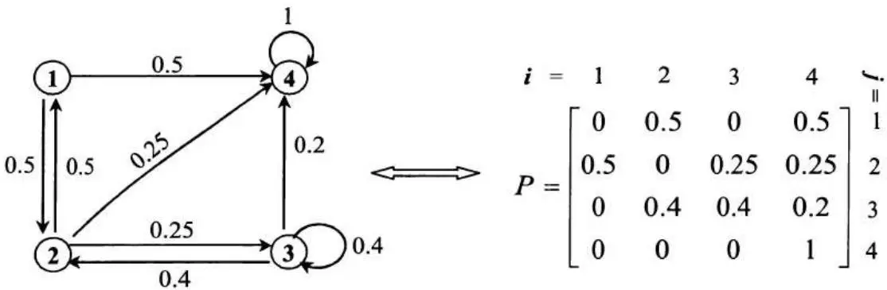

图 5.1 游戏的转移图和转移矩阵

### 状态的分类

如果在转移图中存在从状态 $i$ 到状态 $j$ 的有向路径（$\exists n$ 使得 $P_{ij}^{(n)} > 0$），则称状态 $j$ 可从状态 $i$ 到达。设 $T_{ij} = \min(n: X_n = j \mid X_0 = i)$，则 $P(T_{ij} < \infty) > 0$ 当且仅当状态 $j$ 可从状态 $i$ 到达。如果从 $j$ 可到达 $i$ 且从 $i$ 可到达 $j$，则状态 $i$ 和 $j$ 互通。在图 5.1 中，状态 3 和 1 互通。状态 4 可从状态 1 到达，但它们不互通，因为从状态 4 不能到达状态 1。

如果对每个从状态 $i$ 可到达的状态 $j$，从 $j$ 也可到达 $i$（$\forall j$，$P(T_{ij} < \infty) > 0 \Rightarrow P(T_{ij} < \infty) = 1$），则称状态 $i$ 是常返的。如果一个状态不是常返的，则称为暂态（$\exists j$，$P(T_{ij} < \infty) > 0$ 且 $P(T_{ij} < \infty) < 1$）。在图 5.1 中，只有状态 4 是常返的。状态 1、2 和 3 都是暂态，因为从 1/2/3 可到达 4，但从 4 不能到达 1/2/3。

吸收马尔可夫链：如果不可能离开某个状态 $i$（$p_{ii} = 1, p_{ij} = 0, \forall j \neq i$），则称该状态为吸收态。如果马尔可夫链至少有一个吸收态，并且从每个状态都有可能到达某个吸收态，则该马尔可夫链是吸收的。在图 5.1 中，状态 4 是一个吸收态。相应的马尔可夫链是一个吸收马尔可夫链。

吸收概率方程：到达特定吸收态 $s$ 的概率 $a_1, \cdots, a_M$ 是方程组 $a_s = 1$、对所有 $i \neq s$ 的吸收态有 $a_i = 0$、以及对所有暂态 $i$ 有 $a_i = \sum_{j=1}^{M} a_j p_{ij}$ 的唯一解。这些方程可以通过对下一状态应用全概率公式对吸收概率进行条件作用而轻松推导出来。

吸收期望时间方程：达到吸收的期望时间 $\mu_{1},\cdots,\mu_{M}$ 是对所有吸收态 i 有 $\mu_{i}=0$、对所有暂态 i 有 $\mu_{i}=1+\sum_{j=1}^{m}p_{ij}\mu_{j}$ 的唯一解。这些方程可以通过对下一状态应用全期望公式对吸收期望时间进行条件作用而轻松推导出来。加 1 是因为需要一步才能到达下一个状态。

### 赌徒破产问题

玩家 M 有 1 美元，玩家 N 有 2 美元。每局游戏胜者从对方获得 1 美元。由于技术更好，M 获胜的概率为 2/3。他们一直玩直到其中一人破产。M 获胜的概率是多少？



解答：马尔可夫链问题最困难的部分通常在于如何选择合适的状态空间并定义转移概率 $P_{ij}$（$\forall i, j$）。这个问题具有相当直观的状态。可以将状态空间定义为玩家 $M$ 拥有的金钱 $m$ 和玩家 $N$ 拥有的金钱 $n$ 的组合：$\{(m,n)\} = \{(3,0),(2,1),(1,2),(0,3)\}$。（$m$ 和 $n$ 都不能为负，因为当一方破产时游戏停止。）由于双方的总金额始终为 3 美元，我们可以简化状态空间，仅使用 $m$：$\{m\} = \{0,1,2,3\}$。

转移图和相应的转移矩阵如图 5.2 所示。

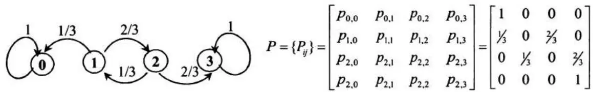

图 5.2 赌徒破产问题的转移矩阵和转移图

初始状态是 $X_0 = 1$（M 最初有 1 美元）。在状态 1，下一个状态以概率 1/3 变为 0（M 输一局），以概率 2/3 变为 2（M 赢一局）。因此 $p_{1,0} = 1/3$，$p_{1,2} = 2/3$。类似地，可得 $p_{2,1} = 1/3$，$p_{2,3} = 2/3$。状态 3（M 赢得整场游戏）和状态 0（M 输掉整场游戏）都是吸收态。

为了计算 M 到达吸收态 3 的概率，我们可以应用吸收概率方程：

$$
a_{3} = 1, a_{0} = 0, \text{且} a_{1} = \sum_{j = 0} ^{3} p_{1, j} a_{j}, a_{2} = \sum_{j = 0} ^{3} p_{2, j} a_{j}
$$
使用转移图或转移矩阵代入转移概率，
$$
得 $\left.\begin{aligned}a_{1}&=1/3\times0+2/3\times a_{2}\\ a_{2}&=1/3\times a_{1}+2/3\times1\end{aligned}\right\}\Rightarrow\left\{\begin{aligned}a_{1}&=4/7\\ a_{2}&=6/7\end{aligned}\right.$
$$

因此，从 1 美元开始，玩家 M 获胜的概率为 4/7。

### 骰子问题
两个玩家对两个标准六面骰子的总和进行投注。玩家 A 赌和为 12 将首先出现。玩家 B 赌两个连续的 7 将首先出现。玩家们不断掷骰子并记录总和，直到其中一人获胜。A 获胜的概率是多少？

解答：许多简单的马尔可夫链问题可以使用纯条件概率论证来解决。这并不奇怪，因为马尔可夫链本身就是以条件概率定义的：
$$
P \{X_{n + 1} = j \mid X_{n} = i, X_{n - 1} = i_{n - 1}, \dots , X_{0} = i_{0} \} = p_{i j} = P \{X_{n + 1} = j \mid X_{n} = i \}.
$$
让我们先用条件概率论证来解决这个问题。设 $P(A)$ 为 $A$ 获胜的概率。在第一次投掷的总和 $F$ 上对 $P(A)$ 取条件，$F$ 有三种可能结果 $F = 12$，$F = 7$ 和 $F \notin \{7, 12\}$，我们有

$$
P (A) = P (A \mid F = 12) P (F = 12) + P (A \mid F = 7) P (F = 7) + P (A \mid F \notin \{7, 12 \}) P (F \notin \{7, 12 \})
$$

然后处理右边的每一项。使用简单的排列组合，容易得到 $P(F = 12) = 1/36$，$P(F = 7) = 6/36$，$P(F \notin \{7,12\}) = 29/36$。同时显然 $P(A|F = 12) = 1$，$P(A|F \notin \{7,12\}) = P(A)$。（游戏本质上重新开始。）为了计算 $P(A|F = 7)$，我们需要进一步在第二次投掷的总和上取条件，它同样有三种可能结果：$E = 12$，$E = 7$，和 $E \notin \{7,12\}$。

$$
\begin{array}{l} P (A \mid F = 7) = P (A \mid F = 7, E = 12) P (E = 12 \mid F = 7) + P (A \mid F = 7, E = 7) P (E = 7 \mid F = 7) \\ + P (A \mid F = 7, E \notin \{7, 12 \}) P (E \notin \{7, 12 \} \mid F = 7) \\ = P (A \mid F = 7, E = 12) \times 1 / 36 + P (A \mid F = 7, E = 7) \times 6 / 36 \\ + P (A \mid F = 7, E \notin \{7, 12 \}) \times 29 / 36 \\ = 1 \times 1 / 36 + 0 \times 6 / 36 + P (A) \times 29 / 36 = 1 / 36 + 29 / 36 P (A) \\ \end{array}
$$
这里第二个等式依赖于第二次与第一次投掷之间的独立性。如果 $F = 7$ 且 $E = 12$，则 $A$ 获胜；如果 $F = 7$ 且 $E = 7$，则 $A$ 输；如果 $F = 7$ 且
$E \notin \{7,12\}$，游戏本质上重新开始。现在我们有了 $P(A)$ 所需的所有信息。将其代入原方程，得
$$
P (A) = P (A \mid F = 12) P (F = 12) + P (A \mid F = 7) P (F = 7) + P (A \mid F \notin \{7, 12 \}) P (F \notin \{7, 12 \})
$$

$$
= 1 \times 1 / 36 + 6 / 36 \times (1 / 36 + 29 / 36 P (A)) + 29 / 36 P (A)
$$
解方程，得 $P(A)=7/13$。
这种方法虽然逻辑严谨，但不够直观。现在让我们尝试马尔可夫链方法。同样关键在于选择合适的状态空间并定义转移概率。显然我们有两个吸收态，12（A 获胜）和 7-7（B 获胜），以及至少两个暂态，S（起始状态）和 7（出现了一个 7，但尚未出现 12 或 7-7）。我们还需要其他状态吗？理论上，可以有其他状态。实际上，你可以使用一次投掷和两次连续投掷的所有结果组合作为状态来构建转移矩阵，最终会得到相同的结果。但我们应该尽可能合并等价状态。正如我们在条件概率方法中刚刚讨论的，如果还没有出现 12 且最近一次投掷没有产生 7，我们本质上回到初始起始状态 S。因此我们只需要状态 S、7、7-7 和 12。转移图和到达状态 12 的概率如图 5.3 所示。
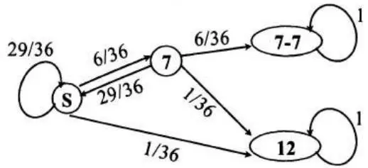

到达吸收态 12 的概率
图 5.3 骰子投掷的转移图和吸收概率
$$
\left. \begin{array}{c} a_{12} = 1,   a_{7 - 7} = 0 \\ a_{s} = 1 / 36 \times 1 + 6 / 36 \times a_{7} + 29 / 36 \times a_{s} \\ a_{7} = 1 / 36 \times 1 + 6 / 36 \times 0 + 29 / 36 \times a_{s} \end{array} \right\} \Rightarrow a_{s} = 7 / 13
$$
这里转移概率仍然由条件概率论证推导得出。但转移图使过程一目了然。

### 硬币三元组
部分 A. 如果你不断抛一枚公平硬币，期望需要抛多少次才能连续得到 HHH（正面正面正面）？期望需要抛多少次才能连续得到 THH（反面正面正面）？

解答：马尔可夫链最困难的部分仍然是选择合适的状态空间。对于 HHH 序列，状态空间很直接。我们只需要四个状态：S（起始状态，当还没有抛硬币或在 HHH 之前出现 T 时）、H、HH 和 HHH。转移图为
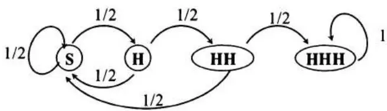

在状态 S，抛一次硬币后，如果得到 T 则状态保持为 S。如果得到 H，则状态变为 H。在状态 H，如果下一次抛掷是 T，则以 1/2 的概率回到状态 S；否则进入状态 HH。在状态 HH，如果下一次抛掷是 T，同样以 1/2 的概率回到状态 S；否则到达吸收态 HHH。

因此我们有以下转移概率：$P_{S,S} = \frac{1}{2}, \quad P_{S,H} = \frac{1}{2}, \quad P_{H,S} = \frac{1}{2}, \quad P_{H,HH} = \frac{1}{2}, \quad P_{HH,S} = \frac{1}{2}, \quad P_{HH,HHH} = \frac{1}{2}$，以及 $P_{HHH,HHH} = 1$。

我们关心的是从起始状态 S 开始，达到 HHH 的期望抛掷次数，即从状态 S 开始的期望吸收时间。应用标准的期望吸收时间方程，得
$$
\left. \begin{array}{l} \mu_{S} = 1 + \frac{1}{2} \mu_{S} + \frac{1}{2} \mu_{H} \\ \mu_{H} = 1 + \frac{1}{2} \mu_{S} + \frac{1}{2} \mu_{H H} \\ \mu_{H H} = 1 + \frac{1}{2} \mu_{S} + \frac{1}{2} \mu_{H H H} \\ \mu_{H H H} = 0 \end{array} \right\} \Rightarrow \left\{\begin{array}{l} \mu_{S} = 14 \\ \mu_{H} = 12 \\ \mu_{H H} = 8 \\ \mu_{H H H} = 0 \end{array} \right.
$$
因此从起始状态开始，得到 HHH 的期望抛掷次数为 14。
类似地，对于达到 THH 的期望时间，我们可以构建如下转移图并估计相应的期望吸收时间：
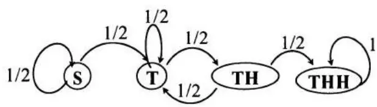

$$
\left. \begin{array}{l} \mu_{S} = 1 + \frac{1}{2} \mu_{S} + \frac{1}{2} \mu_{T} \\ \mu_{T} = 1 + \frac{1}{2} \mu_{T} + \frac{1}{2} \mu_{T H} \\ \mu_{T H} = 1 + \frac{1}{2} \mu_{T} + \frac{1}{2} \mu_{T H H} \\ \mu_{T H H} = 0 \end{array} \right\} \Rightarrow \left\{\begin{array}{l} \mu_{S} = 8 \\ \mu_{T} = 4 \\ \mu_{T H} = 2 \\ \mu_{T H H} = 0 \end{array} \right.
$$
因此从起始状态 S 开始，得到 THH 的期望抛掷次数为 8。
部分 B. 不断抛一枚公平硬币，直到序列中出现 HHH 或 THH。求在 THH 之前出现 HHH 子序列的概率。
解答：让我们尝试标准的马尔可夫链方法。重点仍然是选择合适的状态空间。在这种情况下，我们从起始状态 $S$ 开始。我们只需要 $HHH$ 或 $THH$ 的有序子序列。抛一次硬币后，有状态 $T$ 或 $H$。抛两次后，有状态 $TH$ 和 $HH$。我们不需要 $TT$（对此问题等价于 $T$）或 $HT$（也等价于 $T$）。对于三次抛掷序列，我们只需要 $THH$ 和 $HHH$ 状态，两者都是吸收态。使用这些状态，我们可以构建以下转移图：
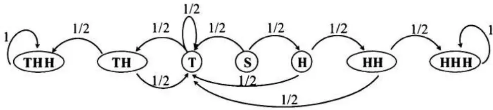

图 5.4 达到 HHH 或 THH 的硬币抛掷转移图
我们想得到从起始状态 S 到达吸收态 HHH 的概率。应用吸收概率方程，得
$$
\left. \begin{array}{l} a_{H H H} = 1, a_{T H H} = 0 \\ a_{S} = \frac{1}{2} a_{T} + \frac{1}{2} a_{H} \\ a_{T} = \frac{1}{2} a_{T} + \frac{1}{2} a_{T H}, a_{H} = \frac{1}{2} a_{T} + \frac{1}{2} a_{H H} \\ a_{T H} = \frac{1}{2} a_{T} + \frac{1}{2} a_{T H H}, a_{H H} = \frac{1}{2} a_{T} + \frac{1}{2} a_{H H H} \end{array} \right\} \Rightarrow \left\{\begin{array}{c} a_{T} = 0, a_{T H} = 0 \\ a_{S} = \frac{1}{8} \\ a_{H} = \frac{1}{4} \\ a_{H H} = \frac{1}{2} \end{array} \right.
$$
因此我们最终得到 $HHH$ 模式的概率为 1/8。
这个问题实际上有一个特殊性质使计算变得多余。你可能已经注意到 $a_{T} = 0$。一旦出现反面，我们总会先得到 THH 而不是 HHH。原因是 THH 的最后两个硬币是 HH，也就是 HHH 序列的前两个硬币。事实上，序列在 THH 之前到达 HHH 的唯一方式是开头连续出现三个 H。否则，在第一个 HH 序列之前总会出现一个 T，从而总是先以 THH 结束。因此，如果我们不以 HHH 开始抛硬币序列（概率为 1/8），则 THH 总是先于 HHH 出现。
部分 C.（困难）让我们为三元组游戏增加更多趣味。不再是两个玩家使用固定的三元组，新的游戏允许两人选择自己的三元组。玩家 1 先选择一个三元组并宣布；然后玩家 2 选择另一个不同的三元组。玩家们继续抛硬币，直到出现两个三元组序列之一。其选择的三元组首先出现的玩家获胜。
如果玩家 1 和玩家 2 都是完全理性的，都想最大化自己的获胜概率，你会选择先手（作为玩家 1）吗？如果你后手，你的获胜概率是多少？
解答：一个常见的误解是总存在一个最佳序列可以击败其他序列。这种误解通常基于一个错误的假设，即这些序列具有传递性：如果序列 $A$ 比序列 $B$ 更有可能先出现，且序列 $B$ 比序列 $C$ 更有可能先出现，那么序列 $A$ 比序列 $C$ 更有可能先出现。实际上，这种传递性在这个游戏中并不存在。无论玩家 1 选择什么序列，玩家 2 总能选择另一个获胜概率大于 $1/2$ 的序列。关键点，正如我们在部分 B 中指出的，是选择以玩家 1 序列的前两个硬币作为自己序列的最后两个硬币。我们可以为每对序列编制下表：
<table><tr><td rowspan="2" colspan="2">玩家 2 获胜概率</td><td colspan="8">玩家 1</td></tr><tr><td>HHH</td><td>THH</td><td>HTH</td><td>HHT</td><td>TTH</td><td>THT</td><td>HTT</td><td>TTT</td></tr><tr><td rowspan="8">玩家 2</td><td>HHH</td><td>/</td><td>1/8</td><td>2/5</td><td>1/2</td><td>3/10</td><td>5/12</td><td>2/5</td><td>1/2</td></tr><tr><td>THH</td><td>7/8</td><td>/</td><td>1/2</td><td>3/4</td><td>1/3</td><td>1/2</td><td>1/2</td><td>3/5</td></tr><tr><td>HTH</td><td>3/5</td><td>1/2</td><td>/</td><td>1/3</td><td>3/8</td><td>1/2</td><td>1/2</td><td>7/12</td></tr><tr><td>HHT</td><td>1/2</td><td>1/4</td><td>2/3</td><td>/</td><td>1/2</td><td>5/8</td><td>2/3</td><td>7/10</td></tr><tr><td>TTH</td><td>7/10</td><td>2/3</td><td>5/8</td><td>1/2</td><td>/</td><td>2/3</td><td>1/4</td><td>1/2</td></tr><tr><td>THT</td><td>7/12</td><td>1/2</td><td>1/2</td><td>3/8</td><td>1/3</td><td>/</td><td>1/2</td><td>3/5</td></tr><tr><td>HTT</td><td>3/5</td><td>1/2</td><td>1/2</td><td>1/3</td><td>3/4</td><td>1/2</td><td>/</td><td>7/8</td></tr><tr><td>TTT</td><td>1/2</td><td>2/5</td><td>5/12</td><td>3/10</td><td>1/2</td><td>2/5</td><td>1/8</td><td>/</td></tr></table>
表 5.1 不同硬币序列对下玩家 2 的获胜概率
如表 5.1 所示（你可以自己验证结果），无论玩家 1 的选择如何，玩家 2 总能选择一个胜率更高的序列。玩家 2 针对玩家 1 选择的最佳应对序列已用粗体标出。为了最大化自己的胜率，玩家 1 应该在 HTH、HTT、THH 和 THT 中选择。即使在这些情况下，玩家 2 仍有 2/3 的概率获胜。

### 彩球问题
一个盒子中有 n 个不同颜色的 n 个球。每次随机选择一对球，将第一个球重新涂成第二个球的颜色，然后将这对球放回盒子中。求所有球变为相同颜色的期望步数。（非常困难）


解答：设 $N_{n}$ 为所有球变为同一颜色所需的步数，设 $F_{i}, i=1,2,\cdots,n$ 为最终所有球都变为颜色 i 的事件。应用全期望公式，得

$$
E \left[ N_{n} \right] = E \left[ N_{n} \mid F_{1} \right] P \left[ F_{1} \right] + E \left[ N_{n} \mid F_{2} \right] P \left[ F_{2} \right] + \dots + E \left[ N_{n} \mid F_{n} \right] P \left[ F_{n} \right].
$$

由于所有颜色是对称的（即它们应具有等价的性质），我们有 $P[F_{1}]=P[F_{2}]=\cdots=P[F_{n}]=1/n$ 和 $E[N_{n}]=E[N_{n}\mid F_{1}]=E[N_{n}\mid F_{2}]=E[N_{n}\mid F_{n}]$。这意味着我们可以假设最终所有球都是颜色 1，并使用 $E[N_{n}\mid F_{1}]$ 来表示 $E[N_{n}]$。

那么如何计算 $E[N_{n} \mid F_{1}]$ 呢？毫不意外，使用马尔可夫链。由于我们只考虑事件 $F_{1}$，颜色 1 与其他颜色不同，而颜色 2, $\cdots$ , n 变成等价的。换句话说，任何不涉及颜色 1 球的对是等价的，任何包含一个颜色 1 球和一个其他颜色球的对（顺序相同）也是等价的。因此我们只需要使用颜色 1 球的数量作为状态。图 5.5 显示了转移图。

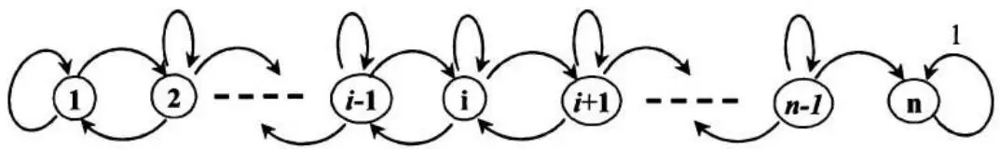

图 5.5 所有 n 个球变为颜色 1 的转移图
状态 $n$ 是唯一的吸收态。注意没有状态 0，否则永远不会到达 $F_{1}$。事实上，所有转移概率都以 $F_{1}$ 为条件，这使得转移概率 $p_{i,i+1}|F_{1}$ 大于无条件概率 $p_{i,i+1}$，而 $p_{i,i-1}|F_{1}$ 小于 $p_{i,i-1}$。例如，$p_{1,0}|F_{1}=0$ 而 $p_{1,0}=1/n$。（无条件时，每个球都可能成为第二个球，因此颜色 1 有 $1/n$ 的概率成为第二个球。）使用条件转移概率，问题本质上是期望吸收时间，系统方程为：
$$
E \left[ N_{i} \mid F_{1} \right] = 1 + E \left[ N_{i - 1} \mid F_{1} \right] \times P_{i, i - 1} \mid F_{1} + E \left[ N_{i} \mid F_{1} \right] \times P_{i, i} \mid F_{1} + E \left[ N_{i + 1} \mid F_{1} \right] \times P_{i, i + 1} \mid F_{1}.
$$
为了计算 $P_{i,i-1} \mid F_1$，让我们将概率重写为 $P(x_{k+1} = i - 1 \mid x_k = i, F_1)$（$\forall k = 0, 1, \ldots$）以使推导步骤更清晰：
$$
\begin{array}{l} P \left(x_{k + 1} = i - 1 \mid x_{k} = i, F_{1}\right) = \frac{P \left(x_{k} = i , x_{k + 1} = i - 1 , F_{1}\right)}{P \left(x_{k} = i , F_{1}\right)} \\ = \frac{P \left(F_{1} \mid x_{k + 1} = i - 1 , x_{k} = i\right) \times P \left(x_{k + 1} = i - 1 \mid x_{k} = i\right) \times P \left(x_{k} = i\right)}{P \left(F_{1} \mid x_{k} = i\right) \times P \left(x_{k} = i\right)} \\ = \frac{P \left(F_{1} \mid x_{k + 1} = i - 1\right) \times P \left(x_{k + 1} = i - 1 \mid x_{k} = i\right)}{P \left(F_{1} \mid x_{k} = i\right)} \\ = \frac{\frac{i - 1}{n} \times \frac{i (n - i)}{n (n - 1)}}{i / n} = \frac{(n - i) \times (i - 1)}{n (n - 1)} \\ \end{array}
$$

第一个等式只是条件概率的定义；第二个等式是贝叶斯定理的应用；第三个等式应用了马尔可夫性质。为了推导 $P(F_{1} \mid x_{k} = i) = i / n$，我们再次需要使用对称性。我们已经证明了如果所有球具有不同颜色，那么 $P[F_{1}] = P[F_{2}] = \cdots = P[F_{n}] = 1 / n$。如果 i 个球是颜色 c，那么最终全部变为给定颜色 c 的概率是多少？很简单，是 i / n。为了看清这一点，我们可以将 i 个颜色 c 的球中的每一个分别标记为 $c_{j}, j = 1, \cdots, i$（即使它们实际上是同一种颜色）。现在显然所有球最终都是颜色 $c_{j}$ 的概率为 1 / n。颜色 c 的概率就是 $c_{j}$ 的概率之和，得到结果 i / n。

类似地，我们有 $P(F_{1} \mid x_{k+1} = i-1) = (i-1)/n$。对于 $P(x_{k+1} = i-1 \mid x_{k} = i)$，我们使用基本的计数方法。从 n 个球中选择 2 个球共有 $n(n-1)$ 种可能的排列。为了使一个颜色 1 的球改变颜色，第二个球必须是颜色 1，有 i 种选择；第一个球需要是其他颜色，有 $(n-i)$ 种选择。

$$
\text{因此} P (x_{k + 1} = i - 1 \mid x_{k} = i) = \frac{i (n - i)}{n (n - 1)}.
$$
应用相同的原理，可得
$$
P \left(x_{k + 1} = i \mid x_{k} = i, F_{1}\right) = \frac{(n - i) \times 2 i}{n (n - 1)}, P \left(x_{k + 1} = i + 1 \mid x_{k} = i, F_{1}\right) = \frac{(n - i) \times (i + 1)}{n (n - 1)}.
$$
代入 $E[N_i \mid F_1]$ 并将 $E[N_i \mid F_1]$ 简记为 $Z_i$，得

$$
(n - i) \times 2 i \times Z_{i} = n (n - 1) + (n - i) (i + 1) Z_{i + 1} + (n - i) (i - 1) Z_{i - 1}.
$$

使用这些递推系统方程和边界条件 $Z_{n}=0$，可得 $Z_{1}=(n-1)^{2}$。



## 5.2 鞅与随机游走

随机游走：如果 $\{X_{i}; i \geq 1\}$ 是独立同分布随机变量，且 $S_{n} = X_{1} + \cdots + X_{n}$（其中 $n = 1, 2, \cdots$），则过程 $\{S_{n}; n \geq 1\}$ 称为随机游走。这个术语源于我们可以将 $S_{n}$ 视为行走者在时刻 n 的位置，他每次随机迈出一步 $X_{1}, X_{2}, \cdots$。

如果 $X_{i}$ 取值 1 和 -1 的概率分别为 $p$ 和 $1 - p$，则 $S_{n}$ 称为参数为 $p$ 的简单随机游走。此外，如果 $p = \frac{1}{2}$，则过程 $S_{n}$ 是对称随机游走。对于对称随机游走，容易证明 $E[S_{n}] = 0$ 且 $\operatorname{var}(S_{n}) = E[S_{n}^{2}] - E[S_{n}]^{2} = E[S_{n}^{2}] = n$。

对称随机游走是在量化面试中最常被测试的过程。关于随机游走的面试问题通常围绕寻找 $S_{n}$ 首次达到给定阈值 $\alpha$ 的 $n$，或 $S_{n}$ 在任意给定 $n$ 时达到 $\alpha$ 的概率。

鞅：鞅 $\{Z_{n}; n \geq 1\}$ 是一个随机过程，具有性质 $E\left[\left|Z_{n}\right|\right] < \infty$ 对所有 n 成立，且 $E\left[Z_{n+1} \mid Z_{n} = z_{n}, Z_{n-1} = z_{n-1}, \cdots, Z_{1} = z_{1}\right] = z_{n}$。鞅的性质可以推广到 $E\left[Z_{m}; m > n \mid Z_{n} = z_{n}, Z_{n-1} = z_{n-1}, \cdots, Z_{1} = z_{1}\right] = z_{n}$，这意味着未来 $Z_{m}$ 的条件期望等于当前值 $Z_{n}$。⁶

对称随机游走是一个鞅。由对称随机游走的定义，有 $S_{n+1}=\begin{cases}S_{n}+1\text{ 概率 }1/2\\S_{n}-1\text{ 概率 }1/2\end{cases}$，因此 $E[S_{n+1}\mid S_{n}=s_{n},\cdots,S_{1}=s_{1}]=s_{n}$。由于 $E[S_{n+1}^{2}-(n+1)]=\frac{1}{2}[(S_{n}+1)^{2}+(S_{n}-1)^{2}]-(n+1)=S_{n}^{2}-n$，所以 $S_{n}^{2}-n$ 也是一个鞅。

停时规则：对于一组独立同分布随机变量 $X_{1}, X_{2}, \cdots$ 的试验，$\{X_{i}; i \geq 1\}$ 的停时规则是一个取正整数值的随机变量 N（停时），使得对每个 n > 1，事件 $\{N \leq n\}$ 与 $X_{n+1}, X_{n+2}, \cdots$ 独立。基本上它说明是否在 n 时刻停止只依赖于 $X_{1}, X_{2}, \cdots, X_{n}$（即不能预测未来）。

瓦尔德等式：设 $N$ 是独立同分布随机变量 $X_{1}, X_{2}, \cdots$ 的停时，且 $S_{N} = X_{1} + X_{2} + \cdots + X_{N}$，则 $E[S_{N}] = E[X]E[N]$。

由于它是一个重要但相对少为人知的定理，让我们简要回顾其证明。设 $I_{n}$ 为事件 $\{N \geq n\}$ 的示性函数。则 $S_{N}$ 可写为

$$
S_{N} = \sum_{n = 1} ^{\infty} X_{n} I_{n}, \text{其中} I_{n} = 1 \text{若} N \geq n \text{且} I_{n} = 0 \text{若} N \leq n - 1.
$$

由停时规则的定义，我们知道 $I_{n}$ 与 $X_{n}, X_{n+1}, \cdots$ 独立（它只依赖于 $X_{1}, X_{2}, \cdots, X_{n-1}$）。因此 $E[X_{n}I_{n}] = E[X_{n}]E[I_{n}] = E[X]E[I_{n}]$，且

$$
E \left[ S_{N} \right] = E \left[ \sum_{n = 1} ^{\infty} X_{n} I_{n} \right] = \sum_{n = 1} ^{\infty} E \left[ X_{n} I_{n} \right] = \sum_{n = 1} ^{\infty} E [ X ] E [ I_{n} ] = E [ X ] \sum_{n = 1} ^{\infty} E [ I_{n} ] = E [ X ] E [ N ].
$$
在停时停止的鞅仍然是鞅。
### 醉汉问题
一个醉汉位于一座 100 米长的桥的第 17 米处。他每步有 $50\%$ 的概率向前或向后移动 1 米。求他在到达桥头（第 0 米）之前到达桥尾（第 100 米）的概率。求他到达桥头或桥尾所需步数的期望。

解答：问题的概率部分——通常以不同的伪装出现——是量化面试官最喜欢问的鞅问题之一。有趣的是，很少有人使用清晰的鞅论证。大多数候选人使用具有两个吸收态的马尔可夫链，或将其视为 $p = 1/2$ 的特例赌徒破产问题。这些方法最终都能得到正确结果，但鞅论证不仅更简单，而且揭示了问题背后的洞见。

将当前位置（第 17 米）设为 0；则问题变为在 83 或 -17 处停止的对称随机游走。我们还知道 $S_{n}$ 和 $S_{n}^{2} - n$ 都是鞅。由于在停时停止的鞅仍是鞅，$S_{N}$ 和 $S_{N}^{2} - N$（其中 $S_{N} = X_{1} + X_{2} + \dots + X_{N}$，$N$ 为停时）也都是鞅。设 $p_{\alpha}$ 为在 $\alpha = 83$ 处停止的概率，$p_{\beta}$ 为在 $-\beta = -17$ 处停止的概率（$p_{\beta} = 1 - p_{\alpha}$），$N$ 为停时。则有

$$
\left. \begin{array}{l} E [ S_{N} ] = p_{\alpha} \times 83 - (1 - p_{\alpha}) \times 17 = S_{0} = 0 \\ E [ S_{N} ^{2} - N ] = E [ p_{\alpha} \times 83^{2} + (1 - p_{\alpha}) \times 17^{2} ] - E [ N ] = S_{0} ^{2} - 0 = 0 \end{array} \right\} \Rightarrow \left\{\begin{array}{l} p_{\alpha} = 0. 17 \\ E [ N ] = 1441 \end{array} \right.
$$
因此，他在到达桥头之前到达桥尾（第 100 米）的概率为 0.17，他到达桥头或桥尾所需步数的期望为 1441。

我们可以轻松地将解答推广到一般情况：从 0 开始的对称随机游走，在 $\alpha (\alpha >0)$ 或 $-\beta (\beta >0)$ 处停止。在 $-\beta$ 之前到达 $\alpha$ 的概率为 $p_{\alpha} = \beta /(\alpha +\beta)$。到达 $\alpha$ 或 $-\beta$ 的期望停时为 $E[N] = \alpha \beta$。

$$

$$

### 骰子游戏
假设你掷一个骰子。每次掷骰，你获得面值对应的金额。如果掷出 4、5 或 6，你可以再掷一次。如果掷出 1、2 或 3，游戏停止。求这个游戏的期望收益。


解答：在[第 4 章](ch04.md)中，我们使用全期望公式解决了这个问题。一个更简单的方法——需要更多知识——是应用瓦尔德等式，因为该问题有明确的停时规则。每次掷骰，有 $1/2$ 的概率停止。因此停时 $N$ 服从参数 $p = 1/2$ 的几何分布，$E[N] = 1/p = 2$。每次掷骰的期望面值为 $E[X] = 7/2$。总期望收益为 $E[S_N] = E[X]E[N] = 7/2 \times 2 = 7$。

$$

$$

### 购票队列
在一个剧院售票处，有 2n 人排队买票。其中 n 人只有 5 美元钞票，另外 n 人只有 10 美元钞票。售票员开始时没有零钱。如果每人购买一张 5 美元的门票，求所有人都能在不交换位置的情况下买到票的概率。

解答：这个问题通常被认为是一个难题。虽然许多人能正确理解问题，但很少有人能使用反射原理解决它。 这个问题是广博知识能带来差异的众多案例之一。

将 n 个持有 5 美元钞票的人赋值为 +1，将 n 个持有 10 美元钞票的人赋值为 -1。将该过程视为一个游走。设 $(a,b)$ 表示经过 a 步后，游走结束于 b。因此我们从 $(0,0)$ 开始，经过 2n 步后到达 $(2n,0)$。对于这 2n 步，我们需要选择 n 步作为 +1，因此共有 $\binom{2n}{n} = \frac{2n!}{n!n!}$ 条可能路径。我们关心的是具有性质 $b \geq 0$（对所有 $0 < a < 2n$ 步）的路径。计算在某个 $0 < a < 2n$ 处达到 $b = -1$ 的补集路径数更容易。如图 5.6 所示，如果在一条路径首次达到 -1 之后，我们将其关于直线 y = -1 反射，那么对每一条在第 2n 步到达 $(2n,0)$ 的路径，我们有一条对应的反射路径在第 2n 步到达 $(2n,-2)$。要到达 $(2n,-2)$，需要 $(n-1)$ 步 +1 和 $(n+1)$ 步 -1。因此共有 $\binom{2n}{n-1} = \frac{2n!}{(n-1)!(n+1)!}$ 条这样的路径。在到达 $(2n,0)$ 的路径中，存在某个 $0 < a < 2n$ 使得 $b = -1$ 的路径数也是 $\binom{2n}{n-1}$，而对于所有 $0 < a < 2n$ 满足 $b \geq 0$ 的路径数为

$$
\binom{2 n} {n} - \binom{2 n} {n - 1} = \binom{2 n} {n} - \frac{n}{n + 1} \binom{2 n} {n} = \frac{1}{n + 1} \binom{2 n} {n}.
$$
因此，所有人在不交换位置的情况下买到票的概率为 $1 / (n + 1)$。
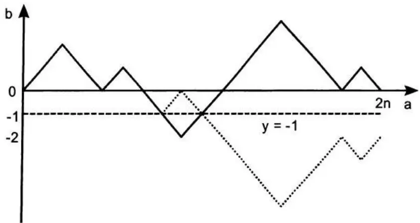

图 5.6 反射路径：虚线是实线在达到 -1 后的反射

### 硬币序列
假设你有一枚公平硬币。求连续得到 $n$ 个正面所需的期望抛掷次数。

解答：设 $E[f(n)]$ 为连续得到 $n$ 个正面所需的期望抛掷次数。在马尔可夫链部分，我们讨论了 $n = 3$ 的情况（得到模式 $HHH$）。对于任意整数 $n$，我们可以考虑归纳法。使用马尔可夫链方法，我们可以轻松得到 $E[f(1)] = 2$，$E[f(2)] = 6$ 和 $E[f(3)] = 14$。对一般公式的自然猜测是 $E[f(n)] = 2^{n+1} - 2$。像往常一样，让我们用归纳法证明该公式。我们已经证明公式对 $n = 1, 2, 3$ 成立。因此我们只需要证明如果 $E[f(n)] = 2^{n+1} - 2$，则 $E[f(n+1)] = 2^{n+2} - 2$。下图展示了如何证明等式对 $E[f(n+1)]$ 成立：
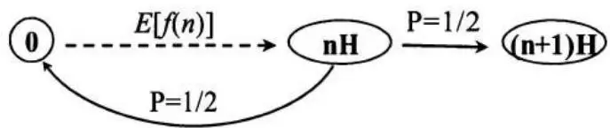

在连续 $(n+1)$ 次正面（记为 $(n+1)H$）之前的状态必须是连续 n 次正面（记为 nH）。需要期望 $E[f(n)] = 2^{n+1} - 2$ 次抛掷才能达到 nH。在状态 nH 的条件下，有 1/2 的概率进入 $(n+1)H$（新抛掷得到 H）且过程停止。也有 1/2 的概率回到起始状态 0（新抛掷得到 T），我们需要再花期望 $E[f(n+1)]$ 次抛掷才能达到 $(n+1)H$。因此我们有
$$
\begin{array}{l} E [ f (n + 1) ] = E [ F (n) ] + \frac{1}{2} \times 1 + \frac{1}{2} \times E [ f (n + 1) ] \\ \Rightarrow E [ f (n + 1) ] = 2 \times E [ F (n) ] + 2 = 2^{n + 2} - 2 \\ \end{array}
$$

一般鞅方法：让我们用 $HH \cdots H_n$ 来解释一种通过探索鞅的停时来获得任意硬币序列期望时间的一般方法。$^9$ 想象一个赌徒有 1 美元，在公平游戏中押注连续 n 次正面（$HH \cdots H_n$），规则如下：赌注放在最多连续 n 局游戏（抛掷）上，每次赌徒押上所有资金（除非破产）。例如，如果第一局出现 H，他会有 2 美元，并将全部 2 美元押在第二局。他要么在输掉一局时停止，要么在连续赢 n 局时停止，此时他获得 $2^n$（概率为 $1/2^n$）。现在想象，不是只有一个赌徒，而是在每次抛掷前有一个新赌徒加入游戏，也押注同样的连续 n 次正面序列，本金也是 1 美元。在第 i 局之后，有 i 个赌徒参与了游戏，他们投入游戏的总金额应为 i 美元。由于每局游戏是公平的，他们总本金的期望值也应为 i 美元。换句话说，如果记 $x_i$ 为所有参与赌徒在第 i 局后的资金总额，那么（$x_i - i$）是一个鞅。

现在，加入一个停时规则：如果有赌徒第一个连续得到 $n$ 次正面，整个游戏停止。在停时停止的鞅仍然是鞅。因此我们仍有 $E[(x_i - i)] = 0$。如果序列在第 $i$ 次抛掷后停止（$i \geq n$），则第 $(i - n + 1)$ 个玩家是第一个连续得到 $n$ 次正面的玩家，获得 $2^n$。因此他之前的所有 $(i - n)$ 个玩家都破产了；第 $(i - n + 2)$ 个玩家连续得到 $(n - 1)$ 次正面，获得 $2^{n-1}$；...；第 $i$ 个玩家得到一次正面，获得 2。因此总收益是固定的，$x_i = 2^n + 2^{n-1} + \cdots + 2^1 = 2^{n+1} - 2$。

因此，$E[(x_i - i)] = 2^{n+1} - 2 - E[i] = 0 \Rightarrow E[i] = 2^{n+1} - 2$。

这种方法可以应用于任何硬币序列——以及骰子序列或任何具有任意数量元素的序列。例如，考虑序列 HHTTHH。我们可以再次使用 HHTTHH 序列的停时鞅过程。赌徒在每次抛掷前逐一加入游戏，押注相同的序列 HHTTHH，直到某个赌徒第一个得到序列 HHTTHH。如果序列在第 i 次抛掷后停止，第 $(i-5)$ 个赌徒得到 HHTTHH，获得
$2^{6}$。他之前的所有 $(i-6)$ 个玩家都破产了；第 $(i-4)$ 个玩家在第二次抛掷时输掉（HT）；第 $(i-3)$ 个玩家和第 $(i-2)$ 个玩家在第一次抛掷时输掉（T）；第 $(i-1)$ 个玩家得到序列 $HH$，获得 $2^{2}$；第 $i$ 个玩家得到 $H$，获得 2。
因此，$E[(x_i - i)] = 2^6 + 2^2 + 2^1 - E[i] = 0 \Rightarrow E[i] = 70$。

## 5.3 动态规划
动态规划是指为解决序列或多阶段决策问题而开发的一系列通用方法。 它是一种极其通用的工具，在金融、供应链管理和航空调度等领域都有应用。虽然理论上简单，但掌握动态规划算法需要广泛的数学基础和严谨的逻辑推理。因此，它通常被视为最难的研究生课程之一。
幸运的是，你在面试中可能遇到的动态规划问题——尽管你常常可能意识不到它们属于这类——都是基础性的问题。因此在本节中，我们将聚焦于动态规划中使用的基本逻辑，并将其应用于几个面试问题。希望这些示例的解答能传达动态规划的要点和威力。
一个离散时间动态规划模型包含两个固有组成部分：
### 1. 底层离散时间动态系统
动态规划问题总是可以划分为多个阶段，每个阶段需要做出一个决策。每个阶段有若干与之相关的状态。一个阶段的决策将当前状态转化为下一阶段的状态（在某些阶段和状态下，如果只有一个选择，决策可能是平凡的）。

假设问题有 $N+1$ 个阶段（时间段）。按照惯例，我们将这些阶段标记为 $0, 1, \cdots, N-1$, N。在任何阶段 k（$0 \leq k \leq N-1$），状态转移可以表示为 $x_{k+1} = f(x_k, u_k, w_k)$，其中 $x_k$ 是阶段 k 的系统状态；$^{11}u_k$ 是在阶段 k 选择的决策；$w_k$ 是一个随机参数（也称为扰动）。

下一阶段的状态 $x_{k+1}$ 被确定为当前状态 $x_k$、当前决策 $u_k$（我们在阶段 $k$ 从可用选项中做出的选择）和随机变量 $w_k$（$w_k$ 的概率分布通常依赖于 $x_k$ 和 $u_k$）的函数。

### 2. 随时间可加的成本（或收益）函数

除了最后阶段（N）有一个仅依赖于 $x_{N}$ 的成本/收益 $g_{N}(x_{N})$ 外，所有其他阶段的成本 $g_{k}(x_{k}, u_{k}, w_{k})$ 可以依赖于 $x_{k}$、$u_{k}$ 和 $w_{k}$。因此总成本/收益为 $g_{N}(x_{N}) + \sum_{k=i}^{N-1} g_{k}(x_{k}, u_{k}, w_{k})\}$。

优化的目标是选择决策序列 $\pi^{*}=\{u_{0}^{*},\cdots,u_{N-1}^{*}\}$ 的策略/方案，使得期望成本最小化（或期望收益最大化）：

$$
J_{\pi^{*}} \left(x_{0}\right) = \min_{\pi} E \left\{g_{N} \left(x_{N}\right) + \sum_{k = 0} ^{N - 1} g_{k} \left(x_{k}, u_{k}, w_{k}\right) \right\}.
$$
### 动态规划（DP）算法

动态规划算法依赖于一个称为最优性原理的思想：如果 $\pi^{*}=\{u_{0}^{*},\cdots,u_{N-1}^{*}\}$ 是原始动态规划问题的最优策略，那么尾部策略 $\pi_{i}^{*}=\{u_{i}^{*},\cdots,u_{N-1}^{*}\}$ 必须是尾部子问题 $E\{g_{N}(x_{N})+\sum_{k-i}^{N-1}g_{k}(x_{k},u_{k},w_{k})\}$ 的最优策略。

DP 算法：为了解决基本问题 $J_{\pi^{*}}(x_{0})=\min_{\pi}E\{g_{N}(x_{N})+\sum_{k=0}^{N-1}g_{k}(x_{k},u_{k},w_{k})\}$，从 $J_{N}(x_{N})=g_{N}(x_{N})$ 开始，向后最小化待行成本函数 $J_{k}(x_{k})$：$J_{k}(x_{k})=\min_{u_{k}\subset U_{k}(x_{k})w_{k}}E\left\{g_{k}(x_{k},u_{k},w_{k})+J_{k+1}(f(x_{k},u_{k},w_{k}))\right\}, k=0,\cdots,N-1$。由此算法生成的 $J_{0}(x_{0})$ 就是期望最优成本。

虽然算法看起来复杂，但直觉很简单。对于动态规划问题，我们应该首先为最后阶段每个可能的状态（具有最多的信息和最少的不确定性）确定最优策略，然后向后递推到更早的阶段，应用尾部策略和待行成本函数，直到达到初始阶段。
现在让我们用几个例子展示 DP 算法如何应用。
### 骰子游戏
你可以掷一个六面骰子最多 3 次。在第一次或第二次掷骰后，如果你得到数字 $x$，你可以选择获得 $x$ 美元或继续掷骰。但一旦你决定继续，你就放弃刚掷出的数字。如果到了第三次掷骰，你只能获得第三次掷出的数字 $x$ 美元，游戏结束。这个游戏价值多少？你的策略是什么？

解答：这是一个简单的动态规划策略游戏。与所有动态规划问题一样，关键是从最后阶段开始向后推导。对于这个问题，最后阶段是你已经放弃前两次掷骰的时候。这变成一个只有一次掷骰的简单骰子游戏。面值 1、2、3、4、5 和 6 各有 1/6 的概率，你的期望收益为 3.5 美元。

现在让我们回退一步。想象你处于第二次掷骰之后的位置，你可以选择进行期望收益为 3.5 美元的第三次掷骰，或者保留当前的面值。显然，当面值大于 3.5 时你会保留面值；换句话说，当得到 4、5 或 6 时，你停止掷骰。当得到 1、2 或 3 时，你继续掷骰。因此第二次掷骰前的期望收益为 $3/6 \times 3.5 + 1/6 \times (4 + 5 + 6) = \$4.25$。

现在让我们再回退一步。想象你处于第一次掷骰之后的位置，你可以选择进行期望收益为 4.25 美元的第二次掷骰（当面值为 1、2、3 或 4 时），或者保留当前的面值。显然，当面值大于 4.25 时你会保留面值；换句话说，当得到 5 或 6 时，你停止掷骰。因此第一次掷骰前的期望收益为 $4/6 \times 4.25 + 1/6 \times (5 + 6) = \$14/3$。

这种逆向方法——在动态规划中称为尾部策略——给出了我们的策略以及游戏在初始阶段的期望值，即 14/3 美元。

### 世界大赛
波士顿红袜队和科罗拉多洛矶队正在参加世界大赛决赛。如果你不熟悉世界大赛，最多有 7 场比赛，先赢 4 场的球队获得冠军。你有 100 美元可以对红袜队进行双倍或归零的投注。
不幸的是，你只能对每场单独的比赛下注，而不是对整个系列赛。每场比赛你应该下注多少，使得如果红袜队赢得整个系列赛，你恰好赢 100 美元，如果红袜队输了，你恰好输 100 美元？

解答：设 $(i,j)$ 表示红袜队赢了 $i$ 场、洛矶队赢了 $j$ 场的状态，设 $f(i,j)$ 为我们在状态 $(i,j)$ 的净收益（可能为负，表示亏损）。根据游戏规则，系列赛总场次可能在 4 到 7 之间。我们需要制定一个策略，使得每当系列赛结束时，我们的最终净收益要么是 +100——红袜队赢得冠军时——要么是 -100——红袜队输掉冠军时。换句话说，最后阶段的状态空间包括 {(4,0), (4,1), (4,2), (4,3)}，收益 $f(i,j)=100$，以及 {(0,4), (1,4), (2,4), (3,4)}，收益 $f(i,j)=-100$。与所有动态规划问题一样，关键是从最后阶段开始向后推导——尽管在这种情况下阶段数不是固定的。对于每个状态 (i, j)，如果我们在下一场比赛中押注 y 美元在红袜队上，如果红袜队获胜，状态变为 (i+1, j)，我们有 $(f(i,j)+y)$；如果红袜队输掉，状态变为 (i, j+1)，我们有 $(f(i,j)-y)$。因此显然有
$$
\left. \begin{array}{l} f (i + 1, j) = f (i, j) + y \\ f (i, j + 1) = f (i, j) - y \end{array} \right\} \Rightarrow \left\{ \begin{array}{l} f (i, j) = \left(f (i + 1, j) + f (i, j + 1)\right) / 2 \\ y = \left(f (i + 1, j) - f (i, j + 1)\right) / 2 \end{array} . \right.
$$

例如，$f(3, 3) = \frac{f(4, 3) + f(3, 4)}{2} = \frac{100 - 100}{2} = 0$。让我们建立一个表格，列表示 $i$，行表示 $j$。现在我们有所有信息来填写 $f(4, 0)$、$f(4, 1)$、$f(4, 3)$、$f(4, 2)$、$f(0, 4)$、$f(1, 4)$、$f(2, 4)$、$f(3, 4)$ 以及 $f(3, 3)$。类似地，我们可以填写 $i = 3$ 或 $j = 3$ 的所有状态 $f(i, j)$，如图 5.7 所示。进一步向后推导，我们可以填写每个可能状态下的净收益。使用方程 $y = (f(i + 1, j) - f(i, j + 1)) / 2$，我们还可以计算在每个状态下需要下注的金额，这实质上就是我们的策略。

如果你不习惯表格格式，图 5.8 将其重新绘制为二叉树格式，你应该熟悉这种格式。考虑到边界条件是 $f(4,0)$、$f(4,1)$、$f(4,3)$、$f(4,2)$、$f(0,4)$、$f(1,4)$、$f(2,4)$ 和 $f(3,4)$，标的资产每步要么增加 1 要么减少 1，且没有利息，那么问题就变成了一个简单的二叉树问题，我们每次下注的金额就是动态对冲中的 delta。事实上，欧式期权和美式期权都可以使用动态规划方法进行数值求解。
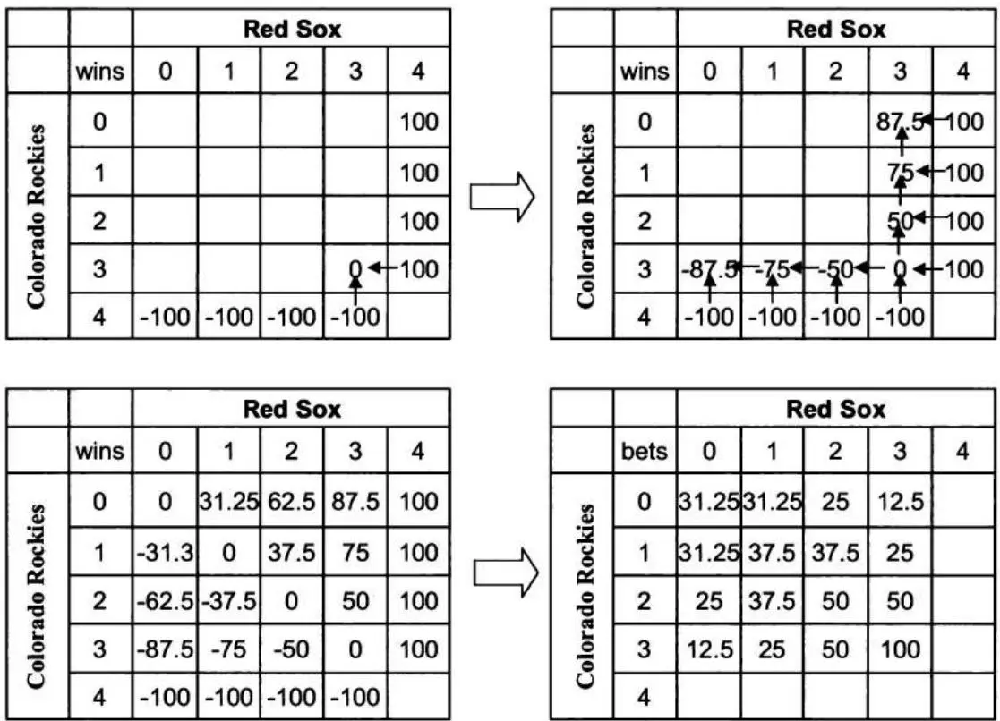

图 5.7 不同状态下的收益和下注金额
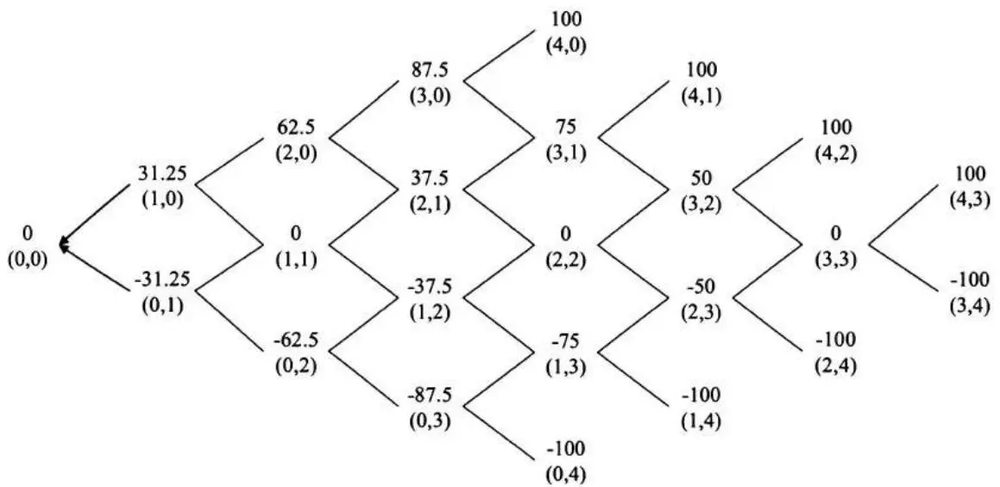

图 5.8 用二叉树表示的不同状态下的收益

### 动态骰子游戏
某赌场推出一个花哨的骰子游戏。它允许你尽可能多次掷骰，直到出现 6。每次掷骰后，如果出现 1，你将赢得 1 美元；如果出现 2，你将赢得 2 美元；...；如果出现 5，你将赢得 5 美元；但如果出现 6，你在游戏中赢得的全部资金将被没收，游戏结束。每次掷骰后，如果骰子数字是 1-5，你可以选择保留资金或继续掷骰。你愿意支付多少钱来玩这个游戏（如果你是风险中性的）？

解答：假设我们已经积累了 $n$ 美元，决定是否再掷一次取决于期望收益与期望损失的比较。如果我们决定再掷一次，期望收益变为
$$
\frac{1}{6} (n + 1) + \frac{1}{6} (n + 2) + \frac{1}{6} (n + 3) + \frac{1}{6} (n + 4) + \frac{1}{6} (n + 5) + \frac{1}{6} \times 0 = \frac{5}{6} n + 2. 5.
$$

如果期望收益 $\frac{5}{6}n+2.5>n$，我们就再掷一次，这意味着如果资金不超过 14，我们应该继续掷骰。考虑到当 $n\geq15$ 时我们将停止掷骰，游戏的最大收益为 19（在达到状态 n=14 后掷出 5）。于是有：$f(19)=19$，$f(18)=18$，$f(17)=17$，$f(16)=16$，$f(15)=15$。当 $n\leq14$ 时，我们将继续掷骰，因此 $E[f(n)|n\leq14]=\frac{1}{6}\sum_{i=1}^{5}E[f(n+i)]$。使用这个方程，我们可以递推计算所有 $n=14,13,\cdots,0$ 的 $E[f(n)]$ 值。结果汇总在表 5.2 中。由于 $E[f(0)]=6.15$，我们愿意为这个游戏最多支付 6.15。

<table><tr><td>n</td><td>19</td><td>18</td><td>17</td><td>16</td><td>15</td><td>14</td><td>13</td><td>12</td><td>11</td><td>10</td></tr><tr><td>E[f(n)]</td><td>19.00</td><td>18.00</td><td>17.00</td><td>16.00</td><td>15.00</td><td>14.17</td><td>13.36</td><td>12.59</td><td>11.85</td><td>11.16</td></tr><tr><td>n</td><td>9</td><td>8</td><td>7</td><td>6</td><td>5</td><td>4</td><td>3</td><td>2</td><td>1</td><td>0</td></tr><tr><td>E[f(n)]</td><td>10.52</td><td>9.91</td><td>9.34</td><td>8.80</td><td>8.29</td><td>7.81</td><td>7.36</td><td>6.93</td><td>6.53</td><td>6.15</td></tr></table>

表 5.2 玩家已积累 $n$ 美元时游戏的期望收益

### 动态扑克牌游戏
赌场提供另一个使用标准 52 张扑克牌（26 红，26 黑）的扑克牌游戏。牌被彻底洗匀，庄家一张一张地抽牌。（抽出的牌不返回牌堆。）你可以在任何时候要求庄家停止。每抽出一张红牌，你赢 1 美元；每抽出一张黑牌，你输 1 美元。求最大化期望收益的最优停止规则，以及你愿意为这个游戏支付多少钱？

解答：这是另一个被许多面试者认为困难的问题。但它是一个简单的动态规划问题。设 $(b, r)$ 分别表示牌堆中剩余的黑牌和红牌数量。由对称性，我们有
抽出的红牌数 - 抽出的黑牌数 = 剩余的黑牌数 - 剩余的红牌数 = b - r

在每个 $(b, r)$，我们面临是停止还是继续玩下去的决定。如果我们在 $(b, r)$ 要求庄家停止，收益为 $b - r$。如果继续，有 $\frac{b}{b + r}$ 的概率下一张牌是黑牌——此时状态变为 $(b - 1, r)$——以及 $\frac{r}{b + r}$ 的概率下一张牌是红牌——此时状态变为 $(b, r - 1)$。当且仅当再抽牌的期望收益小于 $b - r$ 时，我们将停止。这也给了我们系统方程：

$$
E [ f (b, r) ] = \max \left(b - r, \frac{b}{b + r} E [ f (b - 1, r) ] + \frac{r}{b + r} [ f (b, r - 1) ]\right). ^{13}
$$

如图 5.9（下一页）所示，使用边界条件 $f(0, r) = 0$，$f(b, 0) = b$（$\forall b, r = 0, 1, \cdots, 26$）和关于 $E[f(b, r)]$ 的系统方程，我们可以递推计算所有 $(b, r)$ 对的 $E[f(b, r)]$。

游戏开始时的期望收益为 $E[f(26, 26)] = \$2.62$。
<table><tr><td rowspan="2" colspan="2">f(b,r)</td><td colspan="28">剩余黑牌数</td></tr><tr><td>0</td><td>1</td><td>2</td><td>3</td><td>4</td><td>5</td><td>6</td><td>7</td><td>8</td><td>9</td><td>10</td><td>11</td><td>12</td><td>13</td><td>14</td><td>15</td><td>16</td><td>17</td><td>18</td><td>19</td><td>20</td><td>21</td><td>22</td><td>23</td><td>24</td><td>25</td><td>26</td><td></td></tr><tr><td rowspan="27">剩余红牌数</td><td>0</td><td>0</td><td>1</td><td>2</td><td>3</td><td>4</td><td>5</td><td>6</td><td>7</td><td>8</td><td>9</td><td>10</td><td>11</td><td>12</td><td>13</td><td>14</td><td>15</td><td>16</td><td>17</td><td>18</td><td>19</td><td>20</td><td>21</td><td>22</td><td>23</td><td>24</td><td>25</td><td>26</td><td></td></tr><tr><td>1</td><td>0</td><td>0.50</td><td>1</td><td>2</td><td>3</td><td>4</td><td>5</td><td>6</td><td>7</td><td>8</td><td>9</td><td>10</td><td>11</td><td>12</td><td>13</td><td>14</td><td>15</td><td>16</td><td>17</td><td>18</td><td>19</td><td>20</td><td>21</td><td>22</td><td>23</td><td>24</td><td>25</td><td></td></tr><tr><td>2</td><td>0</td><td>0.33</td><td>0.67</td><td>1.20</td><td>2</td><td>3</td><td>4</td><td>5</td><td>6</td><td>7</td><td>8</td><td>9</td><td>10</td><td>11</td><td>12</td><td>13</td><td>14</td><td>15</td><td>16</td><td>17</td><td>18</td><td>19</td><td>20</td><td>21</td><td>22</td><td>23</td><td>24</td><td></td></tr><tr><td>3</td><td>0</td><td>0.25</td><td>0.50</td><td>0.85</td><td>1.34</td><td>2</td><td>3</td><td>4</td><td>5</td><td>6</td><td>7</td><td>8</td><td>9</td><td>10</td><td>11</td><td>12</td><td>13</td><td>14</td><td>15</td><td>16</td><td>17</td><td>18</td><td>19</td><td>20</td><td>21</td><td>22</td><td>23</td><td></td></tr><tr><td>4</td><td>0</td><td>0.20</td><td>0.40</td><td>0.66</td><td>1.00</td><td>1.44</td><td>2.07</td><td>3</td><td>4</td><td>5</td><td>6</td><td>7</td><td>8</td><td>9</td><td>10</td><td>11</td><td>12</td><td>13</td><td>14</td><td>15</td><td>16</td><td>17</td><td>18</td><td>19</td><td>20</td><td>21</td><td>22</td><td></td></tr><tr><td>5</td><td>0</td><td>0.17</td><td>0.33</td><td>0.54</td><td>0.79</td><td>1.12</td><td>1.55</td><td>2.15</td><td>3</td><td>4</td><td>5</td><td>6</td><td>7</td><td>8</td><td>9</td><td>10</td><td>11</td><td>12</td><td>13</td><td>14</td><td>15</td><td>16</td><td>17</td><td>18</td><td>19</td><td>20</td><td>21</td><td></td></tr><tr><td>6</td><td>0</td><td>0.14</td><td>0.29</td><td>0.45</td><td>0.66</td><td>0.91</td><td>1.23</td><td>1.66</td><td>2.23</td><td>3</td><td>4</td><td>5</td><td>6</td><td>7</td><td>8</td><td>9</td><td>10</td><td>11</td><td>12</td><td>13</td><td>14</td><td>15</td><td>16</td><td>17</td><td>18</td><td>19</td><td>20</td><td></td></tr><tr><td>7</td><td>0</td><td>0.13</td><td>0.25</td><td>0.39</td><td>0.56</td><td>0.76</td><td>1.01</td><td>1.34</td><td>1.75</td><td>2.30</td><td>3</td><td>4</td><td>5</td><td>6</td><td>7</td><td>8</td><td>9</td><td>10</td><td>11</td><td>12</td><td>13</td><td>14</td><td>15</td><td>16</td><td>17</td><td>18</td><td>19</td><td></td></tr><tr><td>8</td><td>0</td><td>0.11</td><td>0.22</td><td>0.35</td><td>0.49</td><td>0.66</td><td>0.86</td><td>1.11</td><td>1.43</td><td>1.84</td><td>2.36</td><td>3.05</td><td>4</td><td>5</td><td>6</td><td>7</td><td>8</td><td>9</td><td>10</td><td>11</td><td>12</td><td>13</td><td>14</td><td>15</td><td>16</td><td>17</td><td>18</td><td></td></tr><tr><td>9</td><td>0</td><td>0.10</td><td>0.20</td><td>0.31</td><td>0.43</td><td>0.58</td><td>0.75</td><td>0.95</td><td>1.21</td><td>1.52</td><td>1.92</td><td>2.43</td><td>3.10</td><td>4</td><td>5</td><td>6</td><td>7</td><td>8</td><td>9</td><td>10</td><td>11</td><td>12</td><td>13</td><td>14</td><td>15</td><td>16</td><td>17</td><td></td></tr><tr><td>10</td><td>0</td><td>0.09</td><td>0.18</td><td>0.28</td><td>0.39</td><td>0.52</td><td>0.66</td><td>0.83</td><td>1.04</td><td>1.30</td><td>1.61</td><td>2.00</td><td>2.50</td><td>3.15</td><td>4</td><td>5</td><td>6</td><td>7</td><td>8</td><td>9</td><td>10</td><td>11</td><td>12</td><td>13</td><td>14</td><td>15</td><td>16</td><td></td></tr><tr><td>11</td><td>0</td><td>0.08</td><td>0.17</td><td>0.26</td><td>0.35</td><td>0.46</td><td>0.59</td><td>0.74</td><td>0.91</td><td>1.12</td><td>1.38</td><td>1.69</td><td>2.08</td><td>2.57</td><td>3.20</td><td>4</td><td>5</td><td>6</td><td>7</td><td>8</td><td>9</td><td>10</td><td>11</td><td>12</td><td>13</td><td>14</td><td>15</td><td></td></tr><tr><td>12</td><td>0</td><td>0.08</td><td>0.15</td><td>0.24</td><td>0.32</td><td>0.42</td><td>0.54</td><td>0.66</td><td>0.81</td><td>0.99</td><td>1.20</td><td>1.46</td><td>1.77</td><td>2.15</td><td>2.63</td><td>3.24</td><td>4</td><td>5</td><td>6</td><td>7</td><td>8</td><td>9</td><td>10</td><td>11</td><td>12</td><td>13</td><td>14</td><td></td></tr><tr><td>13</td><td>0</td><td>0.07</td><td>0.14</td><td>0.22</td><td>0.30</td><td>0.39</td><td>0.49</td><td>0.60</td><td>0.73</td><td>0.89</td><td>1.06</td><td>1.28</td><td>1.53</td><td>1.84</td><td>2.22</td><td>2.70</td><td>3.28</td><td>4.03</td><td>5</td><td>6</td><td>7</td><td>8</td><td>9</td><td>10</td><td>11</td><td>12</td><td>13</td><td></td></tr><tr><td>14</td><td>0</td><td>0.07</td><td>0.13</td><td>0.20</td><td>0.28</td><td>0.36</td><td>0.45</td><td>0.55</td><td>0.67</td><td>0.80</td><td>0.95</td><td>1.13</td><td>1.35</td><td>1.60</td><td>1.91</td><td>2.29</td><td>2.75</td><td>3.33</td><td>4.06</td><td>5</td><td>6</td><td>7</td><td>8</td><td>9</td><td>10</td><td>11</td><td>12</td><td></td></tr><tr><td>15</td><td>0</td><td>0.06</td><td>0.13</td><td>0.19</td><td>0.26</td><td>0.33</td><td>0.42</td><td>0.51</td><td>0.61</td><td>0.73</td><td>0.86</td><td>1.02</td><td>1.20</td><td>1.42</td><td>1.67</td><td>1.98</td><td>2.36</td><td>2.81</td><td>3.38</td><td>4.09</td><td>5</td><td>6</td><td>7</td><td>8</td><td>9</td><td>10</td><td>11</td><td></td></tr><tr><td>16</td><td>0</td><td>0.06</td><td>0.12</td><td>0.18</td><td>0.24</td><td>0.31</td><td>0.39</td><td>0.47</td><td>0.57</td><td>0.67</td><td>0.79</td><td>0.93</td><td>1.08</td><td>1.27</td><td>1.48</td><td>1.74</td><td>2.05</td><td>2.42</td><td>2.87</td><td>3.43</td><td>4.13</td><td>5</td><td>6</td><td>7</td><td>8</td><td>9</td><td>10</td><td></td></tr><tr><td>17</td><td>0</td><td>0.06</td><td>0.11</td><td>0.17</td><td>0.23</td><td>0.29</td><td>0.36</td><td>0.44</td><td>0.53</td><td>0.62</td><td>0.73</td><td>0.85</td><td>0.99</td><td>1.15</td><td>1.33</td><td>1.55</td><td>1.81</td><td>2.11</td><td>2.48</td><td>2.93</td><td>3.48</td><td>4.16</td><td>5</td><td>6</td><td>7</td><td>8</td><td>9</td><td></td></tr><tr><td>18</td><td>0</td><td>0.05</td><td>0.11</td><td>0.16</td><td>0.22</td><td>0.28</td><td>0.34</td><td>0.41</td><td>0.49</td><td>0.58</td><td>0.67</td><td>0.78</td><td>0.90</td><td>1.04</td><td>1.21</td><td>1.39</td><td>1.61</td><td>1.87</td><td>2.17</td><td>2.54</td><td>2.99</td><td>3.53</td><td>4.19</td><td>5</td><td>6</td><td>7</td><td>8</td><td></td></tr><tr><td>19</td><td>0</td><td>0.05</td><td>0.10</td><td>0.15</td><td>0.20</td><td>0.26</td><td>0.32</td><td>0.39</td><td>0.46</td><td>0.54</td><td>0.63</td><td>0.73</td><td>0.84</td><td>0.96</td><td>1.10</td><td>1.26</td><td>1.45</td><td>1.67</td><td>1.93</td><td>2.24</td><td>2.60</td><td>3.04</td><td>3.57</td><td>4.22</td><td>5.01</td><td>6</td><td>7</td><td></td></tr><tr><td>20</td><td>0</td><td>0.05</td><td>0.10</td><td>0.14</td><td>0.19</td><td>0.25</td><td>0.31</td><td>0.37</td><td>0.43</td><td>0.51</td><td>0.59</td><td>0.68</td><td>0.78</td><td>0.89</td><td>1.01</td><td>1.16</td><td>1.32</td><td>1.51</td><td>1.73</td><td>1.99</td><td>2.30</td><td>2.66</td><td>3.09</td><td>3.62</td><td>4.25</td><td>5.03</td><td>6</td><td></td></tr><tr><td>21</td><td>0</td><td>0.05</td><td>0.09</td><td>0.14</td><td>0.19</td><td>0.24</td><td>0.29</td><td>0.35</td><td>0.41</td><td>0.48</td><td>0.55</td><td>0.63</td><td>0.72</td><td>0.83</td><td>0.94</td><td>1.07</td><td>1.21</td><td>1.38</td><td>1.57</td><td>1.79</td><td>2.05</td><td>2.35</td><td>2.72</td><td>3.15</td><td>3.66</td><td>4.28</td><td>5.05</td><td></td></tr><tr><td>22</td><td>0</td><td>0.04</td><td>0.09</td><td>0.13</td><td>0.18</td><td>0.23</td><td>0.28</td><td>0.33</td><td>0.39</td><td>0.45</td><td>0.52</td><td>0.60</td><td>0.68</td><td>0.77</td><td>0.87</td><td>0.99</td><td>1.12</td><td>1.26</td><td>1.43</td><td>1.62</td><td>1.85</td><td>2.11</td><td>2.41</td><td>2.77</td><td>3.20</td><td>3.71</td><td>4.32</td><td></td></tr><tr><td>23</td><td>0</td><td>0.04</td><td>0.08</td><td>0.13</td><td>0.17</td><td>0.22</td><td>0.26</td><td>0.32</td><td>0.37</td><td>0.43</td><td>0.49</td><td>0.56</td><td>0.64</td><td>0.72</td><td>0.82</td><td>0.92</td><td>1.04</td><td>1.17</td><td>1.32</td><td>1.48</td><td>1.68</td><td>1.90</td><td>2.16</td><td>2.47</td><td>2.82</td><td>3.25</td><td>3.75</td><td></td></tr><tr><td>24</td><td>0</td><td>0.04</td><td>0.08</td><td>0.12</td><td>0.16</td><td>0.21</td><td>0.25</td><td>0.30</td><td>0.35</td><td>0.41</td><td>0.47</td><td>0.53</td><td>0.60</td><td>0.68</td><td>0.77</td><td>0.86</td><td>0.97</td><td>1.08</td><td>1.22</td><td>1.37</td><td>1.54</td><td>1.73</td><td>1.96</td><td>2.22</td><td>2.52</td><td>2.88</td><td>3.30</td><td></td></tr><tr><td>25</td><td>0</td><td>0.04</td><td>0.08</td><td>0.12</td><td>0.16</td><td>0.20</td><td>0.24</td><td>0.29</td><td>0.34</td><td>0.39</td><td>0.45</td><td>0.51</td><td>0.57</td><td>0.64</td><td>0.72</td><td>0.81</td><td>0.90</td><td>1.01</td><td>1.13</td><td>1.26</td><td>1.42</td><td>1.59</td><td>1.78</td><td>2.01</td><td>2.27</td><td>2.57</td><td>2.93</td><td></td></tr><tr><td>26</td><td>0</td><td>0.04</td><td>0.07</td><td>0.11</td><td>0.15</td><td>0.19</td><td>0.23</td><td>0.28</td><td>0.32</td><td>0.37</td><td>0.43</td><td>0.48</td><td>0.54</td><td>0.61</td><td>0.68</td><td>0.76</td><td>0.85</td><td>0.95</td><td>1.06</td><td>1.18</td><td>1.31</td><td>1.46</td><td>1.64</td><td>1.83</td><td>2.06</td><td>2.32</td><td>2.62</td><td></td></tr></table>
图 5.9 不同状态 (b, r) 下的期望收益

## 5.4 布朗运动与随机微积分
在本节中，我们简要介绍一些随机微积分的问题，这是随机过程在连续空间中的对应。由于布朗运动和随机微积分的基本定义和定理直接用作面试问题，我们将它们整合到问题中，而不是从定义和定理的概述开始。
### 布朗运动
A. 定义并列举布朗运动的一些性质？

解答：这是最基本的布朗运动问题。有趣的是，部分定义（如 $W(0) = 0$）和一些性质如此显然，以至于我们常常无法完整地复述所有细节。

一个连续随机过程 $W(t)$ ，$t \geq 0$ ，称为布朗运动，如果满足：

- $W(0)=0$;
- 过程 $W(t_1) - W(0), W(t_2) - W(t_1), \cdots, W(t_n) - W(t_{n-1}), \forall 0 \leq t_1 \leq t_2 \leq \cdots \leq t_n$ 的增量是独立的；
- 每个增量服从正态分布，分布为 $W(t_{i+1}) - W(t_i) \sim N(0, t_{i+1} - t_i)$ 。

布朗运动的一些重要性质包括：连续（无跳跃）；$E[W(t)] = 0$ ；$E[W(t)^{2}] = t$ ；$W(t) \sim N(0, t)$ ；鞅性质 $E[W(t + s) | W(t)] = W(t)$ ；$\text{cov}(W(s), W(t)) = s$ ，$\forall 0 < s < t$ ；以及马尔可夫性质（在连续空间中）。

还有两个与布朗运动相关的重要鞅，它们是许多应用中的有用工具。
- $Y(t)=W(t)^{2}-t$ 是一个鞅。

- $Z(t) = \exp \left\{\lambda W(t) - \frac{1}{2} \lambda^2 t \right\}$ ，其中 $\lambda$ 为任意常数，$W(t)$ 为布朗运动，是一个鞅。（指数鞅）。

我们将在下一节中使用伊藤引理给出第一个鞅的证明。指数鞅的简要证明如下：
$$
\begin{array}{l} E [ Z (t + s) ] = E \left[ \exp \left\{\lambda (W (t) + W (s)) - \frac{1}{2} \lambda^{2} (t + s) \right\} \right] \\ = \exp \left\{\lambda W (t) - \frac{1}{2} \lambda^{2} t \right\} \exp \left\{- \frac{1}{2} \lambda^{2} s \right\} E [ \exp \left\{\lambda W (s) \right\} ] \\ = Z_{t} \exp \left\{- \frac{1}{2} \lambda^{2} s \right\} \exp \left\{\frac{1}{2} \lambda^{2} s \right\} = Z_{t} \\ \end{array}
$$
B. 布朗运动与其平方的相关性是多少？
解答：这个问题的解法出奇地简单。在时刻 $t$ ，$B_{t} \sim N(0, t)$ ，由对称性，$E[B_{t}] = 0$ 且 $E[B_{t}^{3}] = 0$ 。应用协方差方程 $Cov(X, Y) = E[XY] - E[X]E[Y]$ ，我们得到 $Cov(B_{t}, B_{t}^{2}) = E[B_{t}^{3}] - E[B_{t}]E[B_{t}^{2}] = 0 - 0 = 0$ 。因此布朗运动与其平方的相关性也为0。
C. 设 $B_{t}$ 为布朗运动。求 $B_{1} > 0$ 且 $B_{2} < 0$ 的概率？
解答：一种标准解法利用了 $B_{1} \sim N(0,1)$ 的事实，且 $B_{2} - B_{1}$ 与 $B_{1}$ 独立，也服从正态分布：$B_{2} - B_{1} \sim N(0,1)$ 。如果 $B_{1} = x > 0$ ，那么对于 $B_{2} < 0$ ，必须有 $B_{2} - B_{1} < -x$ 。
$$
\begin{array}{l} P \left(B_{1} > 0, B_{2} <   0\right) = P \left(B_{1} > 0, B_{2} - B_{1} <   - B_{1}\right) \\ = \int_{0} ^{\infty} \frac{1}{\sqrt{2 \pi}} e^{- x^{2} / 2} d x \int_{- \infty} ^{- x} \frac{1}{\sqrt{2 \pi}} e^{- y^{2} / 2} d y = \int_{0} ^{\infty} \int_{- \infty} ^{- x} \frac{1}{2 \pi} e^{- (x^{2} + y^{2}) / 2} d x d y \\ = \int_{0} ^{\infty} \int_{3 / 2 \pi} ^{7 / 4 \pi} \frac{1}{2 \pi} e^{- r^{2} / 2} r d r d \theta = \frac{7 / 4 \pi - 3 / 2 \pi}{2 \pi} \left[ - e^{- r^{2} / 2} \right] _{0} ^{\infty} = \frac{1}{8} \\ \end{array}
$$
但我们真的需要积分步骤吗？如果充分利用 $B_{1}$ 和 $B_{2} - B_{1}$ 是两个独立同分布 $N(0,1)$ 这一事实，答案是不需要。利用条件概率和独立性，我们可以将方程重新表述为：
$$
\begin{array}{l} P \left(B_{1} > 0, B_{2} <   0\right) = P \left(B_{1} > 0\right) P \left(B_{2} - B_{1} <   0\right) P \left(\left| B_{2} - B_{1} \right| > \left| B_{1} \right|\right) \\ = 1 / 2 \times 1 / 2 \times 1 / 2 = 1 / 8 \\ \end{array}
$$

这种方法在图5.10中得到了更好的展示。当 $B_{1} > 0$ 且 $B_{2} - B_{1} < -B_{1}$ 时，这占密度体积的 $1/8$。（由 $x = 0$ 、$y = 0$ 、$y = x$ 和 $y = -x$ 分割的所有8个区域，由对称性具有相同的密度体积。）

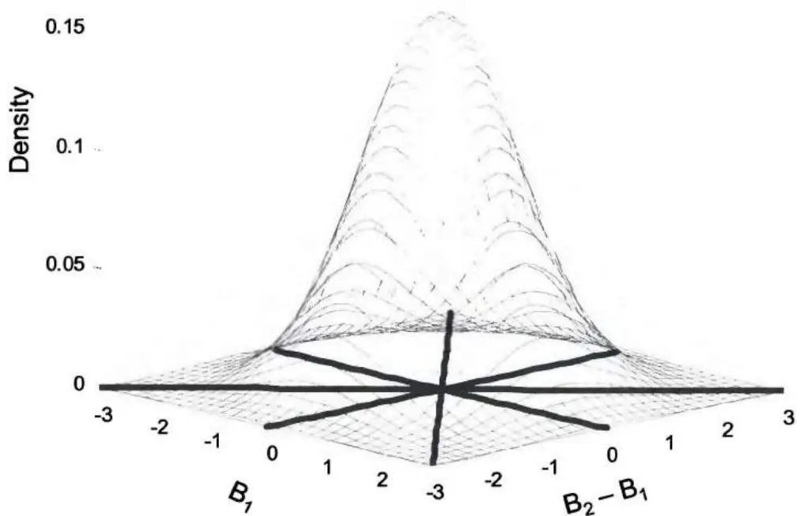

图5.10 $(\mathsf{B}_1, \mathsf{B}_2 - \mathsf{B}_1)$ 的概率密度图



### 停时/首达时间

A. 布朗运动到达-1或1的停时期望值是多少？



解答：正如我们讨论过的，$B_{t}^{2} - t$ 是一个鞅。可以通过应用伊藤引理来证明：

$$
d (B_{t} ^{2} - t) = \frac{\partial (B_{t} ^{2} - t)}{\partial B_{t}} d B_{t} + \frac{\partial (B_{t} ^{2} - t)}{\partial t} d t + \frac{1}{2} \frac{\partial^{2} (B_{t} ^{2} - t)}{\partial B_{t} ^{2}} d t = 2 B_{t} d B_{t} - d t + d t = 2 B_{t} d B_{t}.
$$
所以 $d(B_t^2 - t)$ 没有漂移项，是一个鞅。设 $T = \min \{t; B_t = 1 \text{或} -1\}$ 。在连续时间和空间中，以下性质仍然成立：一个鞅在
停时停止时仍然是鞅！因此 $B_T^2 - T$ 是一个鞅，且 $E[B_T^2 - T] = B_0^2 - 0 = 0$ 。$B_t$ 到达1或-1的概率为1，所以 $B_T^2 = 1 \Rightarrow E[T] = E[B_T^2] = 1$ 。
B. 设 $W(t)$ 为标准维纳过程，$\tau_x (x > 0)$ 为到达水平 $x$ 的首达时间（$\tau_x = \min \{t; W(t) = x\}$）。求 $\tau_x$ 的概率密度函数和 $\tau_x$ 的期望值？

解答：这是一个教科书式的问题，可以通过反射原理优雅地解决，因此我们仅简要解释。对于任何在时间 $t$ 之前到达 $x$ 的维纳过程路径（$\tau_x \leq t$），它们在时间 $t$ 结束时位于 $x$ 之上或之下的概率相等，即 $P(\tau_x \leq t, W(t) \geq x) = P(\tau_x \leq t, W(t) \leq x)$ 。解释在于反射原理。如图5.11所示，对于每条在时间 $t$ 之前到达 $x$ 且在时间 $t$ 时位于 $x$ 之上水平 $y$ 处的路径，我们可以反转从 $\tau_x$ 开始的任何移动的符号，反射后的路径将在时间 $t$ 结束时位于 $x$ 之下的 $2x - y$ 处。对于标准维纳过程（布朗运动），两条路径具有相等的概率。

$$
\begin{array}{l} P \left(\tau_{x} \leq t\right) = P \left(\tau_{x} \leq t, W (t) \geq x\right) + P \left(\tau_{x} \leq t, W (t) \leq x\right) = 2 P \left(\tau_{x} \leq t, W (t) \geq x\right) \\ = 2 P (W (t) \geq x) = 2 \int_{x} ^{\infty} \frac{1}{\sqrt{2 \pi t}} e^{- w^{2} / 2 t} d w \\ \end{array}
$$

令 $v = \frac{w}{\sqrt{t}}$ ，则有 $e^{-w^2 / 2t} = e^{-v^2 / 2}$ 且 $dv = \frac{dw}{\sqrt{t}}$ 。

$$
\therefore P \left(\tau_{x} \leq t\right) = 2 \int_{m} ^{\infty} \frac{1}{\sqrt{2 \pi t}} e^{- w^{2} / 2 t} d w = 2 \int_{x / \sqrt{t}} ^{\infty} \frac{1}{\sqrt{2 \pi}} e^{- v^{2} / 2} d v = 2 - 2 N (x / \sqrt{t}). ^{3}
$$

对 $t$ 求导，我们得到：

$$
f_{\tau_{x}} (t) = \frac{d P \left\{\tau_{x} \leq t \right\}}{d t} = \frac{d P \left\{\tau_{x} \leq t \right\}}{d (x / \sqrt{t})} \frac{d (x / \sqrt{t})}{d t} = 2 N^{\prime} (x / \sqrt{t}) \times \frac{x}{2} t^{- 3 / 2} \Rightarrow \frac{x e^{- x^{2} / 2 t}}{t \sqrt{2 \pi t}}, \forall x > 0.
$$

从A部分中，很容易证明到达 $\alpha$（$\alpha > 0$）或 $-\beta$（$\beta > 0$）的期望停时再次为 $E[N] = \alpha \beta$ 。到达水平 $x$ 的期望首达时间本质上就是到达 $x$ 或 $-\infty$ 的期望停时，且 $E[\tau_x] = x \times \infty = \infty$ 。虽然 $P(\tau_x \leq \infty) = 2 - 2N(x / \sqrt{\infty}) = 1$ ，但 $\tau_x$ 的期望值却是 $\infty$！

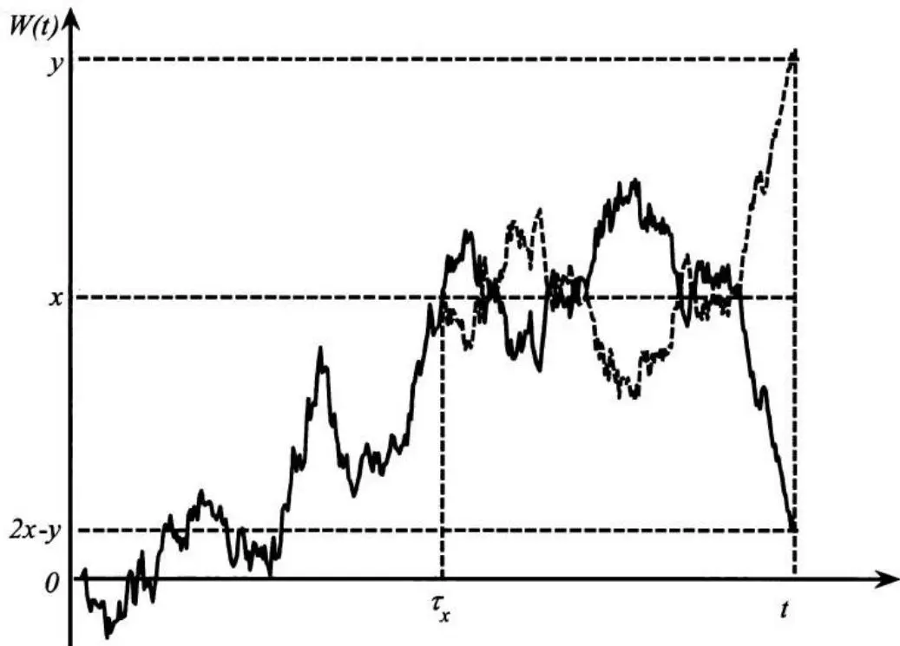

图5.11 标准维纳过程的样本路径及其反射路径
C. 假设 $X$ 是无漂移的布朗运动，即 $dX(t) = dW(t)$ 。如果 $X$ 从0出发，求 $X$ 在触及-5之前触及3的概率？如果 $X$ 有漂移 $m$ ，即 $dX(t) = mdt + dW(t)$ 呢？

解答：布朗运动是一个鞅。设 $p_3$ 为布朗运动在触及-5之前触及3的概率。由于在停时停止的鞅仍然是鞅，我们有 $3P_3 + (-5)(1 - P_3) = 0 \Rightarrow P_3 = 5/8$ 。与随机游走类似，如果我们有停止边界 $\alpha > 0$ 和 $-\beta (\beta > 0)$ ，则在 $-\beta$ 之前停止在 $\alpha$ 的概率为 $p_\alpha = \beta / (\alpha + \beta)$ 。到达 $\alpha$ 或 $-\beta$ 的期望停时再次为 $E[N] = \alpha \beta$ 。

当 $X$ 有漂移 $m$ 时，该过程不再是鞅。设 $P(t, x)$ 为当 $X = x$ 在时间 $t$ 时，过程在触及-5之前触及3的概率。虽然 $X$ 不再是
鞅过程，但它仍然是马尔可夫过程。因此 $P(t,x) = P(x)$ 实际上与 $t$ 无关。应用费曼-卡克方程  ，我们得到：
$$
m P_{x} (x) + 1 / 2 P_{x x} (x) = 0 \text{for} - 5 <   x <   3.
$$
边界条件为 $P(3) = 1$ 和 $P(-5) = 0$ 。
$mP_{x}(x)+1/2P_{xx}(x)=0$ 是一个齐次线性微分方程，有两个实根：$r_{1}=0$ 和 $r_{2}=-2m$ 。因此通解为 $P(x)=c_{1}e^{0x}+c_{2}e^{-2mx}=c_{1}+c_{2}e^{-2mx}$ 。应用边界条件，我们得到：
$$
\left\{\begin{array}{l} c_{1} + c_{2} e^{- 6 m} = 1 \\ c_{1} + c_{2} e^{10 m} = 0 \end{array} \Rightarrow \left\{\begin{array}{l} c_{1} = - e^{10 m} / (e^{- 6 m} - e^{10 m}) \\ c_{2} = 1 / (e^{- 6 m} - e^{10 m}) \end{array} \right. \Rightarrow P (0) = c_{1} + c_{2} = \frac{e^{10 m} - 1}{e^{10 m} - e^{- 6 m}} \right.
$$

另一种更简单的方法利用了指数鞅：$Z(t)=\exp\left\{\lambda W(t)-\frac{1}{2}\lambda^{2}t\right\}$ 。由于 $W(t)=X(t)-mt$ ，$X(t)-mt$ 也是布朗运动。应用指数鞅，对于任意常数 $\lambda$ ，有 $E\left[\exp\left(\lambda(X-mt)-\frac{1}{2}\lambda^{2}t\right)\right]=1$ 。为了消去包含时间 $t$ 的项，我们设 $\lambda=-2m$ ，方程变为 $E\left[\exp(-2mX)\right]=1$ 。由于在停时停止的鞅仍然是鞅，我们有 $P_{3}\exp(-2m\times3)+(1-P_{3})\exp(-2m\times-5)=1\Rightarrow\frac{e^{10m}-1}{e^{10m}-e^{-6m}}$ 。

D. 假设 $X$ 是一个广义维纳过程 $dX = dt + dW(t)$ ，其中 $W(t)$ 是布朗运动。求 $X$ 曾经到达-1的概率？

解答：要解决这个问题，我们可以再次使用上一题中 $m=1$ 的方程 $E[\exp(-2mX)]=1$ 。我们只有一个明显的边界-1，这可能不太明显。为了应用停时，我们还需要一个对应的正边界。为了解决这个问题，我们可以简单地将 $+\infty$ 作为正边界，方程变为：

$$
P_{- 1} \exp (- 2 \times - 1) + (1 - P_{- 1}) \exp (- 2 \times + \infty) = P_{- 1} e^{2} = 1 \Rightarrow P_{- 1} = e^{- 2}.
$$

### 伊藤引理

伊藤引理是普通微积分中链式法则的随机对应。设 $X(t)$ 是一个满足 $dX(t) = \beta (t,X)dt + \gamma (t,X)dW(t)$ 的伊藤过程，$f(X(t),t)$ 是 $X(t)$ 和 $t$ 的二次可微函数。则 $f(X(t),t)$ 是一个伊藤过程，满足：

$$
d f = \left(\frac{\partial f}{\partial t} + \beta (t, X) \frac{\partial f}{\partial x} + \frac{1}{2} \gamma^{2} (t, X) \frac{\partial^{2} f}{\partial x^{2}}\right) d t + \gamma (t, X) \frac{\partial f}{\partial x} d W (t).
$$

漂移率

A. 设 $B_{t}$ 为布朗运动，$Z_{t} = \sqrt{t} B_{t}$ 。求 $Z_{t}$ 的均值和方差？$Z_{t}$ 是鞅过程吗？

$$

$$

解答：作为布朗运动，$B_{t} \sim N(0, t)$ ，关于0对称。由于 $\sqrt{t}$ 在 $t$ 时刻是常数，$Z_{t} = \sqrt{t} B_{t}$ 关于0对称，均值为0，方差为 $t \times \operatorname{var}(B_{t}) = t^{2}$ 。更精确地，$Z_{t} \sim N(0, t^{2})$ 。

虽然 $Z_{t}$ 的无条件期望值为0，但它不是鞅。将伊藤引理应用于 $Z_{t} = \sqrt{t} B_{t}$ ，我们得到 $dZ_{t} = \frac{\partial Z_{t}}{\partial B_{t}} dB_{t} + \frac{\partial Z_{t}}{\partial t} dt + \frac{1}{2} \times \frac{\partial^{2}Z_{t}}{\partial B_{t}^{2}} dt = \frac{1}{2} t^{-1/2}B_{t}dt + \sqrt{t} dB_{t}$ 。对于所有 $B_{t} \neq 0$ 的情况（概率为1），漂移项 $\frac{1}{2} t^{-1/2}B_{t}dt$ 不为零。因此，过程 $Z_{t} = \sqrt{t} B_{t}$ 不是鞅过程。

B. 设 $W(t)$ 为布朗运动。$W(t)^3$ 是鞅过程吗？

解答：将伊藤引理应用于 $f(W(t), t) = W(t)^3$ ，我们有 $\frac{\partial f}{\partial W(t)} = 3W(t)^2$ ，$\frac{\partial f}{\partial t} = 0$ ，$\frac{\partial^2 f}{\partial W(t)^2} = 6W(t)$ ，且 $df(W(t), t) = 3W(t)dt + 3W(t)^2 dW(t)$ 。因此对于 $W(t) \neq 0$ 的情况（概率为1），漂移项不为零。因此，$W(t)^3$ 不是鞅过程。

$$

$$
