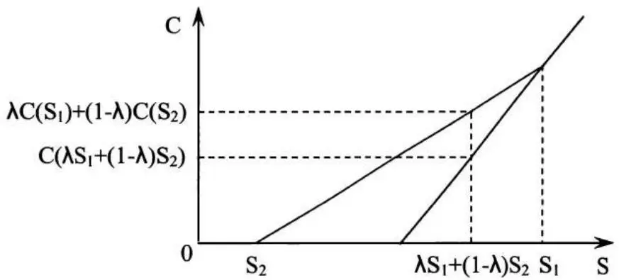
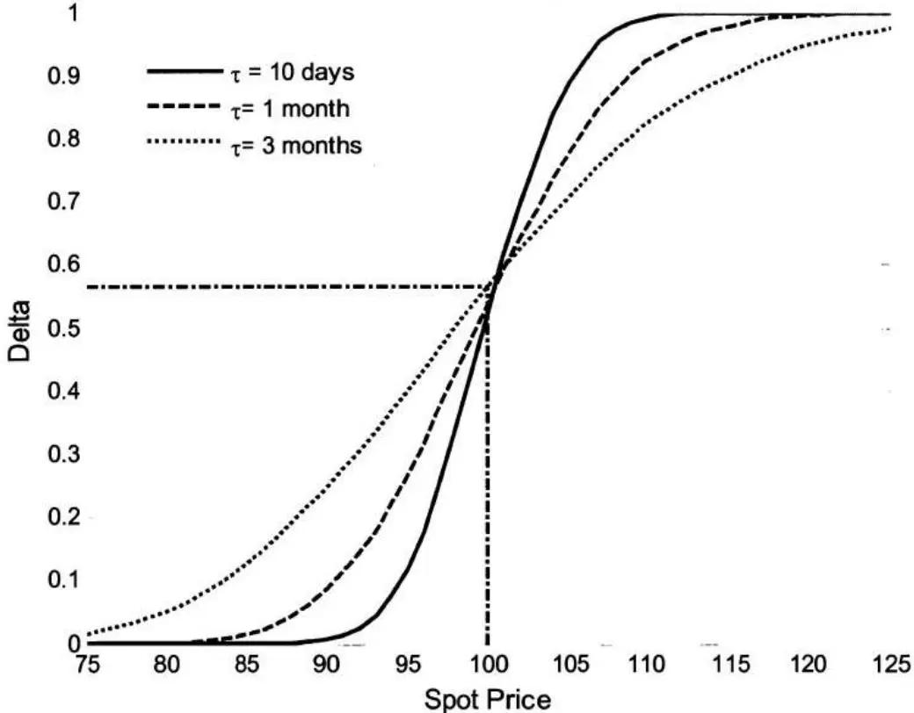
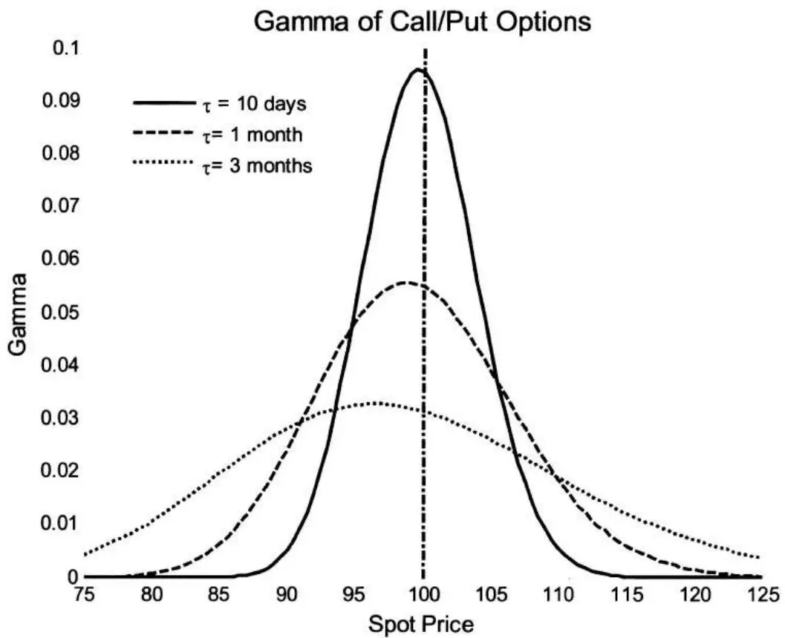
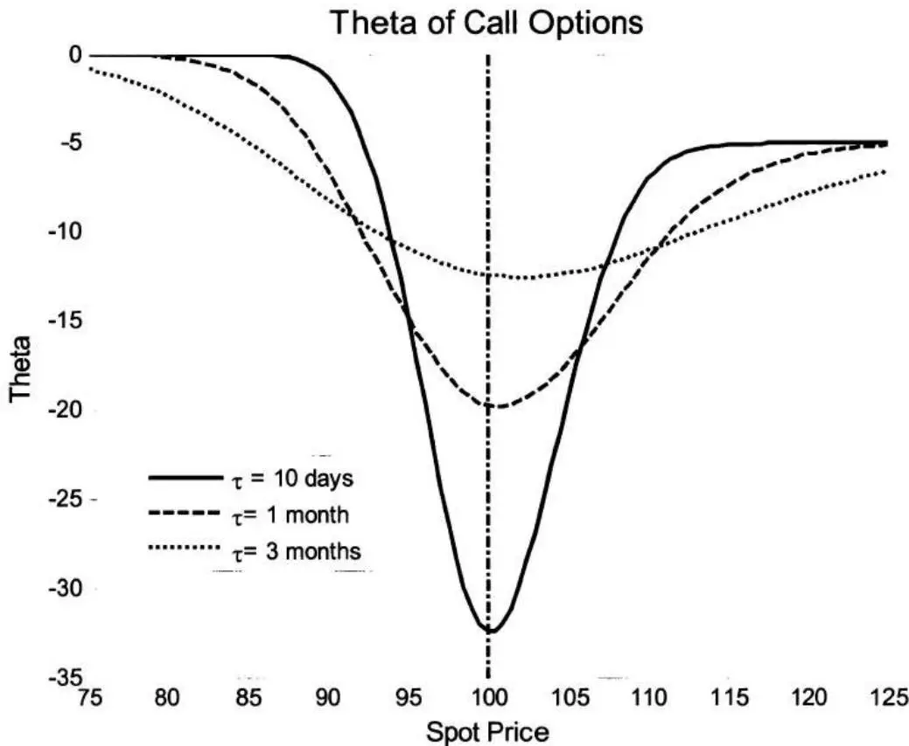

# [第6章](ch06.md) 金融

过去，没有金融知识的候选人进入量化金融职位是常见现象。虽然对于拥有紧缺专业知识的候选人来说，这种情况仍然存在，但更可能的是，你被要求——或者至少被期望——对金融话题有基本的掌握。因此，你应该准备好回答一些金融问题，并且你的回答将受到评判。

除了经典教科书之外， 市场上也有几本面试书籍可以帮助你准备金融面试。 如果你想要准备一般的金融问题，你可能需要阅读一本金融面试书，以了解通常会问哪些类型的问题。本章的重点更多在于衍生品定价背后的直觉和数学，而不是基础金融知识。衍生品问题是量化面试中的热门选择——即使是与衍生品市场没有直接关系的部门也是如此——因为这些问题足够复杂，可以测试你对量化金融的理解。

## 6.1 期权定价

首先，让我们介绍一些将在后续章节中使用的符号。

T：到期日；t：当前时间；$\tau = T - t$ ：剩余期限；S：t时刻的股票价格；r：连续无风险利率；y：连续股息收益率；$\sigma$ ：年化资产波动率；c：欧式看涨期权价格；p：欧式看跌期权价格；C：美式看涨期权价格；P：美式看跌期权价格；D：t时刻未来股息的现值；K：行权价格；PV：t时刻的现值。

### 期权的价格方向

当 $S, K, \tau, \sigma, r$ 或 $D$ 变化时，普通欧式/美式期权价格如何变化？

$$

$$

解答：看涨期权的收益为 $\max(S - K, 0)$ ，看跌期权的收益为 $\max(K - S, 0)$ 。欧式期权只能在到期时行权，而美式期权可以在到期前的任何时间行权。直观上，我们可以看出欧式/美式看涨期权的价格应随行权价格的上升而下降，

因为行权价较高的看涨期权的收益不会高于——有时会更低——行权价较低的看涨期权。通过类似的分析，我们在表6.1中总结了市场条件变化对期权价值的影响。

到期时间对欧式看涨/看跌期权价格的影响是不确定的。如果在两个不同到期日之间存在大额股息支付，则在除息日之前到期的较短期限欧式看涨期权可能比较长期限的看涨期权更有价值。对于深度价内的欧式看跌期权，期限较短者价值更高，因为它可以更早行权（货币的时间价值）。

<table><tr><td>Variable</td><td>European call</td><td>European put</td><td>American call</td><td>American Put</td></tr><tr><td>Stock price ↑</td><td>↑</td><td>↓</td><td>↑</td><td>↓</td></tr><tr><td>Strike price ↑</td><td>↓</td><td>↑</td><td>↓</td><td>↑</td></tr><tr><td>Time to maturity ↑</td><td>?</td><td>?</td><td>↑</td><td>↑</td></tr><tr><td>Volatility ↑</td><td>↑</td><td>↑</td><td>↑</td><td>↑</td></tr><tr><td>Risk-free rate ↑</td><td>↑</td><td>↓</td><td>↑</td><td>↓</td></tr><tr><td>Dividends ↑</td><td>↓</td><td>↑</td><td>↓</td><td>↑</td></tr></table>

表6.1 $S, K, \tau, \sigma, r$ 和 $D$ 对期权价格的影响

↑：增加；↓：减少；?：增加或减少

还值得注意的是，表6.1假设只有一个因素变化而其他所有因素保持不变，这在实践中可能不现实，因为其中一些因素是相关的。例如，利率的大幅下降常常引发股市反弹并推高股票价格，这对期权价值有相反的影响。



### 期权平价公式

期权平价公式：$c + K^{-r\tau} = p + S - D$ ，其中欧式看涨期权和欧式看跌期权具有相同的标的证券、相同的到期日 $T$ 和相同的行权价格 $K$ 。由于 $p \geq 0$ ，我们还可以从期权平价公式推导出 $c$ 的边界：$S - D - Ke^{-r\tau} \leq c \leq S$ 。

对于美式期权，等号不再成立，变为两个不等式：$S - D - K \leq C - P \leq S - K^{-r\tau}$ 。

你能写出无股息支付股票的欧式期权的期权平价公式并证明它吗？



解答：无股息支付股票的欧式期权的期权平价公式为 $c + K^{-r\tau} = p + S$ 。我们可以将方程左边视为投资组合A——一个看涨期权和一张面值为K的零息债券——右边视为投资组合B——一个看跌期权和标的股票，这是一个保护性看跌期权。投资组合A在到期日T的收益为 $\max(S_{T} - K, 0) + K = \max(S_{T}, K)$ ；投资组合B在T的收益为 $\max(K - S_{T}, 0) + S_{T} = \max(S_{T}, K)$ 。由于两个投资组合在T具有相同的收益，且在t和T之间没有收益，无套利论证  规定它们在t必须具有相同的价值。因此，$c + K^{-r\tau} = p + S$ 。

如果我们将期权平价公式重新排列为 $c - p = S - K^{-r\tau}$ ，这将给我们不同的洞察。方程左边的投资组合——做多看涨期权和做空看跌期权——的收益为 $\max(S_T - K, 0) - \max(K - S_T, 0) = S_T - K$ ，这是交割价格为 $K$ 的远期的收益。交割价格为 $K$ 的远期的现值为 $S - K^{-r\tau}$ 。因此我们再次得到期权平价公式 $c - p = S - K^{-r\tau}$ 。这个表达式表明，当行权价格 $K = S^{r\tau}$（远期价格）时，看涨期权与看跌期权价值相等；当 $K < S^{r\tau}$ 时，看涨期权价值更高；当 $K > S^{r\tau}$ 时，看跌期权价值更高。



### 美式期权与欧式期权

A. 由于美式期权可以在到期前的任何时间行权，它们通常比具有相同特征的欧式期权更有价值。但当股票不支付股息时，美式看涨期权和欧式看涨期权的理论价格应该相同，因为提前行权美式看涨期权从来不是最优的。为什么你不应该在到期前提前行权一只不支付股息股票的美式看涨期权？



解答：这个常见问题有多种解法。我们给出三个论证来支持这一结论。

论证1：如果你行权看涨期权，你只能获得期权的内在价值 $S - K$ 。美式/欧式看涨期权的价格还包含时间价值，对于不支付股息的股票的看涨期权而言，时间价值为正。因此，投资者在到期前卖出期权比行权更有利。

事实上，如果我们重新排列欧式期权的看跌-看涨期权平价公式，我们有 $c = S - K^{-r	au} + p = (S - K) + (K - K^{-r	au}) + p$ 。不支付股息股票的欧式看涨期权的价值包含三个部分：第一部分是内在价值 $S - K$；第二部分是行权价的时间价值（如果你现在行权，

你现在支付K而不是在到期日支付K，后者的现值更低）；第三部分是看跌期权的价值，通常被视为对股价下跌的保护。显然，第二部分和第三部分都为正。因此欧式看涨期权的价值应高于其内在价值。考虑到相应的美式看涨期权至少与欧式看涨期权价值相同，它的价值也高于其内在价值。因此，在到期前行权美式看涨期权不是最优选择。

论证2：让我们比较两种不同的策略。在策略1中，我们在时刻 $t$（$t < T$）行权看涨期权 ，获得现金 $S - K$ 。或者，我们可以持有看涨期权，做空标的股票并以利率 $r$ 借出 $K$ 美元（卖空所得现金 $S$ 大于 $K$）。在到期日 $T$，如果看涨期权价内则行权，平仓空头头寸并收回借款。表6.2显示了这种策略的现金流：

该表清楚地显示，在时刻 $t$，我们的现金流与行权看涨期权相同，为 $S - K$。但在时刻 $T$，我们同样始终有正的现金流。因此，该策略明显优于在时刻 $t$ 行权看涨期权。通过保持看涨期权存活，可以在到期时实现额外收益。

<table><tr><td rowspan="2">Cash flow</td><td rowspan="2">t</td><td colspan="2">T</td></tr><tr><td> $S_T \leq K$ </td><td> $S_T > K$ </td></tr><tr><td>Call option</td><td>0</td><td>0</td><td> $S_T - K$ </td></tr><tr><td>Short Stock</td><td>S</td><td> $-S_T$ </td><td> $-S_T$ </td></tr><tr><td>Lend K at t</td><td>-K</td><td> $Ke^{r\tau}$ </td><td> $Ke^{r\tau}$ </td></tr><tr><td>Total</td><td>S-K</td><td> $Ke^{r\tau} - S_T > 0$ </td><td> $Ke^{r\tau} - K > 0$ </td></tr></table>

表6.2 不行权看涨期权的替代策略的收益

论证3：让我们使用基于风险中性定价和詹森不等式的数学论证——如果 $f(X)$ 是凸函数 ，那么 $E[f(X)] \geq f(E[X])$。从图6.1可以明显看出，看涨期权 $C(S) = (S - K)^{+}$ 的收益（如果在 $S > K$ 时行权）是股价的凸函数，具有性质

$$
C \left(\lambda S_{1} + (1 - \lambda) S_{2}\right) \leq \lambda C \left(S_{1}\right) + (1 - \lambda) C \left(S_{2}\right), 0 <   \lambda <   1.
$$

令 $S_{1} = S$，$S_{2} = 0$，那么由于 $C(0) = 0$，有 $C(\lambda S) \leq \lambda C(S) + (1 - \lambda)C(0) = \lambda C(S)$。

图6.1 欧式看涨期权的收益
如果期权在时刻 t 行权，t 时刻的收益为 $C(S_{t}-K)$。如果持有至到期，风险中性测度下的折现期望收益（折现到 t）为 $	ilde{E}\left[e^{-r\tau}C(S_{T})\right]$。在风险中性概率下，我们还有 $\tilde{E}[S_{T}]=S_{t}e^{r\tau}$。

因此 $\tilde{E}\left[e^{-r\tau}C(S_T)\right] = e^{-r\tau}\tilde{E}\left[C(S_T)\right]\geq e^{-r\tau}C\left(\tilde{E}\left[S_T\right]\right) = e^{-r\tau}C\left(e^{r\tau}S_t\right),$

其中不等式来自詹森不等式。
令 $S = e^{r\tau}S_{t}$，$\lambda = e^{-r\tau}$，我们有 $C(\lambda S) = C(S_{t}) \leq e^{-r\tau}C\left(e^{r\tau}s_{t}\right) \leq e^{-r\tau}\tilde{E}\left[C(S_{T})\right]$。

由于在风险中性测度下，对于任何 $t \leq T$，折现收益 $e^{-r\tau}\tilde{E}[C(S_{T})]$ 都不小于 $C(S_{t})$，因此在到期前提前行权从来不是最优的。

需要指出的是，看跌期权的收益也是股价的凸函数。但提前行权不支付股息股票的美式看跌期权通常是最优的。区别在于 $P(0) = K$，因此它不具有 $P(\lambda S) \leq \lambda P(S)$ 的性质。实际上，$P(\lambda S) \geq \lambda P(S)$。所以美式看涨期权的论证不适用于美式看跌期权。

类似的分析也可以表明，对于支付股息的股票，提前行权美式看涨期权从来不是最优的，除非可能是在除息日之前的时刻。
B. 一只不支付股息的股票的欧式看跌期权，行权价格为80美元，当前定价为8美元；同一只股票的另一只看跌期权，行权价格为90美元，定价为9美元。这两个期权之间是否存在套利机会？
解答：在上一题中，我们提到看跌期权的收益是股价的凸函数。看跌期权的价格作为行权价格的函数也是凸函数。由于行权价为0的看跌期权毫无价值，我们总有 $P(0) + \lambda P(K) = \lambda P(K) > P(\lambda K)$。

对于这个具体问题，我们应该有 $8/9 \times P(90) = 8/9 \times 9 = 8 > P(80)$。由于行权价为80美元的看跌期权当前定价为8美元，它被高估了，我们应该做空它。整体套利组合是做空9单位行权价 $K = \$80$ 的看跌期权，做多8单位行权价 $K = 90$ 的看跌期权。在0时刻，初始现金流为0。在到期日，我们有三种可能的情景：

$$
S_{T} \geq 90, \text{payoff} = 0 (\text{No put is exercised.})
$$

$$
90 > S_{T} \geq 80, \text{payoff} = 8 \times (90 - S_{T}) > 0 (\text{Puts with} K = 90 \text{are exercised.})
$$

$$
S_{T} <   80, \text{payoff} = 8 \times (90 - S_{T}) - 9 \times (80 - S_{T}) = S_{T} > 0 (\text{All puts are exercised.})
$$

最终收益 $\geq 0$，且存在正概率使收益 $>0$。所以这显然是一个套利机会。

$$

$$

### Black-Scholes-Merton 微分方程
你能写出Black-Scholes-Merton微分方程并简要解释如何推导它吗？


解答：如果股票价格的演变是几何布朗运动 $dS = \mu S dt + \sigma S dW(t)$，且衍生品 $V = V(S, t)$ 是 $S$ 和 $t$ 的函数，那么应用伊藤引理得到：

$$
d V = \left(\frac{\partial V}{\partial t} + \mu S \frac{\partial V}{\partial S} + \frac{1}{2} \sigma^{2} S^{2} \frac{\partial^{2} V}{\partial S^{2}}\right) d t + \sigma S \frac{\partial V}{\partial S} d W (t), \text{where} W (t) \text{is a Brownian motion.}
$$

Black-Scholes-Merton微分方程是 $V$ 应满足的偏微分方程：$\frac{\partial V}{\partial t} + rS \frac{\partial V}{\partial S} + \frac{1}{2} \sigma^2 S^2 \frac{\partial^2 V}{\partial S^2} = rV$。

为了推导Black-Scholes-Merton微分方程，我们构建一个包含两个部分的投资组合：做多一单位衍生品，做空 $\frac{\partial V}{\partial S}$ 单位的标的股票。

那么投资组合的价值为 $\Pi = V - \frac{\partial V}{\partial S} S$，$\Pi$ 的变化满足方程

$$
\begin{array}{l} d \Pi = d V - \frac{\partial V}{\partial S} d S \\ = \left(\frac{\partial V}{\partial t} + \mu S \frac{\partial V}{\partial S} + \frac{1}{2} \sigma^{2} S^{2} \frac{\partial^{2} V}{\partial S^{2}}\right) d t + \sigma S \frac{\partial V}{\partial S} d W (t) - \frac{\partial V}{\partial S} (\mu S d t + \sigma S d W (t)) \\ = \left(\frac{\partial V}{\partial t} + \frac{1}{2} \sigma^{2} S^{2} \frac{\partial^{2} V}{\partial S^{2}}\right) d t \\ \end{array}
$$

显然，该投资组合是无风险的，因为它没有扩散项。它也应获得无风险收益率：$d\Pi = r(V - \frac{\partial V}{\partial S} S)dt$。结合这些结果，我们得到

$$
\left(\frac{\partial V}{\partial t} + \frac{1}{2} \sigma^{2} S^{2} \frac{\partial^{2} V}{\partial S^{2}}\right) d t = r (V - \frac{\partial V}{\partial S} S) d t \Rightarrow \frac{\partial V}{\partial t} + r S \frac{\partial V}{\partial S} + \frac{1}{2} \sigma^{2} S^{2} \frac{\partial^{2} V}{\partial S^{2}} = r V,
$$

这就是Black-Scholes-Merton微分方程。

Black-Scholes-Merton微分方程是折现Feynman-Kac定理的一个特例。折现Feynman-Kac定理建立了随机微分方程和偏微分方程之间的桥梁，并适用于一般的所有伊藤过程：

设 $X$ 是由方程 $dX(t) = \beta(t, X)dt + \gamma(t, X)dW(t)$ 给出的伊藤过程，$f(x)$ 是 $X$ 的函数。定义函数 $V(t, x) = E[e^{-r(T - t)}f(X_T)|X_t = x]$ ，则 $V(t, x)$ 是一个鞅过程，满足偏微分方程：

$$
\frac{\partial V}{\partial t} + \beta (t, x) \frac{\partial V}{\partial x} + \frac{1}{2} \gamma^{2} (t, x) \frac{\partial^{2} V}{\partial x^{2}} = r V (t, x)
$$
边界条件对所有 $x$ 有 $V(T,x) = f(x)$ 。
在风险中性测度下，$dS = rSdt + \sigma SdW(t)$。令 $S = X$，$\beta(t, X) = rS$，$\gamma(t, X) = \sigma S$，则折现Feynman-Kac方程变为Black-Scholes-

Merton微分方程 $\frac{\partial V}{\partial t} + rS\frac{\partial V}{\partial S} + \frac{1}{2}\sigma^2 S^2\frac{\partial^2V}{\partial S^2} = rV$。

$$

$$

$$
### Black-Scholes公式
$$

具有连续股息收益率 $y$ 的欧式看涨和看跌期权的Black-Scholes公式为：
$$
c = S e^{- y \tau} N \left(d_{1}\right) - K e^{- r \tau} N \left(d_{2}\right) \text{and} p = K e^{- r \tau} N \left(- d_{2}\right) - S e^{- y \tau} N \left(- d_{1}\right),
$$

$$
d_{1} = \frac{\ln (S e^{- y \tau} / K) + (r + \sigma^{2} / 2) \tau}{\sigma \sqrt{\tau}} = \frac{\ln (S / K) + (r - y + \sigma^{2} / 2) \tau}{\sigma \sqrt{\tau}}
$$
其中
$$
d_{2} = \frac{\ln (S / K) + (r - y - \sigma^{2} / 2) \tau}{\sigma \sqrt{\tau}} = d_{1} - \sigma \sqrt{\tau}
$$

$N(x)$ 是标准正态分布的累积分布函数，$N'(x)$ 是标准正态分布的概率密度函数：$N(x) = \int_{-\infty}^{x} \frac{1}{\sqrt{2\pi}} e^{-y^2/2} dy$ 且 $N'(x) = \frac{1}{\sqrt{2\pi}} e^{-x^2/2}$ 。

如果标的资产是期货合约，则收益率 $y = r$ 。如果标的资产是外币，则收益率 $y = r_f$ ，其中 $r_f$ 是外国无风险利率。

A. Black-Scholes公式背后有哪些假设条件？



解答：原始的Black-Scholes欧式看涨和看跌期权公式由方程 $c = SN(d_1) - Ke^{-r\tau}N(d_2)$ 和 $p = Ke^{-r\tau}N(-d_2) - SN(-d_1)$ 组成，需要以下假设条件：

1. 股票不支付股息。
2. 无风险利率是常数且已知。

3. 股票价格遵循几何布朗运动，具有常数漂移 $\mu$ 和波动率 $\sigma$ ：$dS = \mu S dt + \sigma S dW(t)$ 。

4. 无交易成本或税收；做空所得可以全额投资。
5. 所有证券完全可分。
6. 不存在无风险套利机会。

B. 如何使用风险中性概率测度推导不支付股息股票的欧式看涨期权的Black-Scholes公式？

解答：不支付股息股票的欧式看涨期权的Black-Scholes公式为

$$
c = S N \left(d_{1}\right) - K e^{- r \tau} N \left(d_{2}\right), \text{where} d_{1} = \frac{\ln (S / K) + (r + \sigma^{2} / 2) \tau}{\sigma \sqrt{\tau}} \text{and} d_{2} = d_{1} - \sigma \sqrt{\tau}.
$$

在风险中性概率测度下，股票价格的漂移率变为无风险利率 $r(t)$：$dS = r(t)Sdt + \sigma SdW(t)$。风险中性测度允许期权以其期望收益以无风险利率折现的价值来定价：

$$
V (t) = E \left[ e^{- \int_{t} ^{T} r (u) d u} V (T) \mid S (t) \right], 0 \leq t \leq T, \text{where} V (T) \text{is the payoff at maturity} T.
$$

当 $r$ 为常数时，公式可进一步简化为 $V(t) = e^{-r\tau}E\big[V(T)\big|S(t)\big]$。在风险中性概率下，$dS = rSdt + \sigma SdW(t)$。应用伊藤引理，我们得到

$$
d (\ln (S)) = (r - \sigma^{2} / 2) d t + \sigma d W (t) \Rightarrow \ln S_{T} \sim N (\ln S + (r - \sigma^{2} / 2) \tau , \sigma^{2} \tau).
$$

因此 $S_{T} = Se^{(r - \sigma^{2} / 2)\tau +\sigma \sqrt{\tau}\varepsilon}$，其中 $\varepsilon \sim N(0,1)$。对于欧式期权，我们有

$$
V (T) = \left\{\begin{array}{l l} S e^{(r - \sigma^{2} / 2) \tau + \sigma \sqrt{\tau} \varepsilon} - K, & \text{if} S e^{(r - \sigma^{2} / 2) \tau + \sigma \sqrt{\tau} \varepsilon} > K \\ 0, & \text{otherwise} \end{array} \right.
$$

$$
S e^{(r - \sigma^{2} / 2) \tau + \sigma \sqrt{\tau} \varepsilon} > K \Rightarrow \varepsilon > \frac{\ln (K / S) - (r - \sigma^{2} / 2) \tau}{\sigma \sqrt{\tau}} = - d_{2} \text{and}
$$

$$
\begin{array}{l} E [ V (T) \mid S ] = E [ \max (S_{T} - K, 0) \mid S ] = \int_{- d_{2}} ^{\infty} \left(S e^{(r - \sigma^{2} / 2) \tau + \sigma \sqrt{\tau} \varepsilon} - K\right) \frac{1}{\sqrt{2 \pi}} e^{- \varepsilon^{2} / 2} d \varepsilon \\ = S e^{r \tau} \int_{- d_{2}} ^{\infty} \frac{1}{\sqrt{2 \pi}} e^{- (\varepsilon - \sqrt{\tau} \sigma) ^{2} / 2} d \varepsilon - K \int_{- d_{2}} ^{\infty} \frac{1}{\sqrt{2 \pi}} e^{- \varepsilon^{2} / 2} d \varepsilon \\ \end{array}
$$

令 $\tilde{\varepsilon} = \varepsilon -\sigma \sqrt{\tau}$ ，则 $d\varepsilon = d\tilde{\varepsilon}$ ， $\varepsilon = -d_2\Rightarrow \tilde{\varepsilon} = -d_2 - \sigma \sqrt{\tau} = -d_1$ ，我们得到：

$$
S e^{r \tau} \int_{- d_{2}} ^{\infty} \frac{1}{\sqrt{2 \pi}} e^{- (\varepsilon - \sqrt{\tau} \sigma) ^{2} / 2} d \varepsilon = S e^{r \tau} \int_{- d_{1}} ^{\infty} \frac{1}{\sqrt{2 \pi}} e^{- \tilde{\varepsilon} ^{2} / 2} d \tilde{\varepsilon} = S e^{r \tau} N (d_{1}),
$$

$$
K \int_{- d_{2}} ^{\infty} \frac{1}{\sqrt{2 \pi}} e^{- \varepsilon^{2} / 2} d \varepsilon = K (1 - N (- d_{2})) = K N (d_{2})
$$

$$
\therefore E [ V (T) ] = S e^{r \tau} N \left(d_{1}\right) - K N \left(d_{2}\right) \text{and} V (t) = e^{- r \tau} E [ V (T) ] = S N \left(d_{1}\right) - K e^{- r \tau} N \left(d_{2}\right)
$$

从推导过程也可以看出，$1 - N(-d_{2}) = N(d_{2})$ 是看涨期权在到期时处于价内的风险中性概率。

C. 如何通过求解Black-Scholes-Merton微分方程来推导不支付股息股票的欧式看涨期权的Black-Scholes公式？

解答：如果你没有偏微分方程（PDE）的背景，可以跳过这个问题。解决该问题的一种方法是将Black-Scholes-Merton微分方程转化为热传导方程，然后将边界条件应用于热传导方程来推导Black-Scholes公式。

令 $y = \ln S (S = e^{y})$ 且 $\tilde{\tau} = T - t$ ，则 $\frac{\partial V}{\partial t} = -\frac{\partial V}{\partial \tilde{\tau}}$ ，$\frac{\partial V}{\partial S} = \frac{\partial V}{\partial y} \frac{dy}{dS} = \frac{1}{S} \frac{\partial V}{\partial y}$ 且

$$
\frac{\partial^{2} V}{\partial S^{2}} = \frac{\partial V}{\partial S} \left(\frac{\partial V}{\partial S}\right) = \frac{\partial V}{\partial S} \left(\frac{1}{S} \frac{\partial V}{\partial y}\right) = \frac{- 1}{S^{2}} \frac{\partial V}{\partial y} + \frac{1}{S} \frac{\partial V}{\partial S} \left(\frac{\partial V}{\partial y}\right) = \frac{- 1}{S^{2}} \frac{\partial V}{\partial y} + \frac{1}{S^{2}} \frac{\partial^{2} V}{\partial y^{2}}. ^{6}
$$

Black-Scholes-Merton微分方程 $\frac{\partial V}{\partial t} + rS\frac{\partial V}{\partial S} + \frac{1}{2}\sigma^2 S^2\frac{\partial^2V}{\partial S^2} - rV = 0$ 可以转换为 $ -\frac{\partial V}{\partial \tilde{\tau}} + \left(r - \frac{1}{2}\sigma^2\right)\frac{\partial V}{\partial y} + \frac{1}{2}\sigma^2\frac{\partial^2V}{\partial y^2} - rV = 0.$

令 $u = e^{r\bar{\tau}}V$ ，方程变为 $-\frac{\partial u}{\partial\bar{\tau}} + \left(r - \frac{1}{2}\sigma^2\right)\frac{\partial u}{\partial y} + \frac{1}{2}\sigma^2\frac{\partial^2u}{\partial y^2} = 0$ 。

最后，令 $x = y + \left(r - \frac{1}{2}\sigma^2\right)\tilde{\tau} = \ln S + \left(r - \frac{1}{2}\sigma^2\right)\tilde{\tau}$ 且 $\tau = \tilde{\tau}$ ，则 $\frac{\partial u}{\partial y} = \frac{\partial u}{\partial x}$ 且 $\frac{\partial u}{\partial \tilde{\tau}} = \frac{\partial u}{\partial \tau} + \left(r - \frac{1}{2}\sigma^2\right)\frac{\partial u}{\partial x}$ ，将方程转换为

$$
- \frac{\partial u}{\partial \tau} - \left(r - \frac{1}{2} \sigma^{2}\right) \frac{\partial u}{\partial x} + \left(r - \frac{1}{2} \sigma^{2}\right) \frac{\partial u}{\partial x} + \frac{1}{2} \sigma^{2} \frac{\partial^{2} u}{\partial x^{2}} = 0 \Rightarrow \frac{\partial u}{\partial \tau} = \frac{1}{2} \sigma^{2} \frac{\partial^{2} u}{\partial x^{2}}
$$

因此原方程变为热传导/扩散方程 $\frac{\partial u}{\partial \tau} = \frac{1}{2}\sigma^2\frac{\partial^2 u}{\partial x^2}$。对于热传导方程 $\frac{\partial u}{\partial \tau} = \frac{1}{2}\sigma^2\frac{\partial^2 u}{\partial x^2}$，其中 $u = u(x, \tau)$ 是时间 $\tau$ 和空间变量 $x$ 的函数，边界条件为 $u(x, 0) = u_0(x)$，其解为

$$
u (x, \tau) = \frac{1}{\sqrt{2 \pi \tau} \sigma} \int_{- \infty} ^{\infty} u_{0} (\psi) \exp \left(- \frac{(x - \psi) ^{2}}{2 \sigma^{2} \tau}\right) d \psi . ^{7}
$$

对于欧式看涨期权，边界条件为 $u_{0}(S_{T})=\max\left(S_{T}-K,0\right)$。

$$
S = \exp (x - (r - 0. 5 \sigma^{2}) \tau). \text{When} x = \psi \text{and} \tau = 0, S_{T} = e^{\psi}.
$$

$$
\begin{array}{l} u (S, \tau) = u (x, \tau) = \frac{1}{\sqrt{2 \pi \tau} \sigma} \int_{- \infty} ^{\infty} \max \left(e^{\psi} - K, 0\right) \exp \left(- \frac{(x - \psi) ^{2}}{2 \sigma^{2} \tau}\right) d \psi \\ = \frac{1}{\sqrt{2 \pi \tau} \sigma} \int_{\ln K} ^{\infty} (e^{\psi} - K) \exp \left(- \frac{(x - \psi) ^{2}}{2 \sigma^{2} \tau}\right) d \psi \\ \end{array}
$$

令 $\varepsilon = \frac{\psi - x}{\sigma\sqrt{\tau}}$ ，则 $d\varepsilon = \frac{d\psi}{\sigma\sqrt{\tau}}$ ，$e^{\psi} = e^{x + \varepsilon \sigma \sqrt{\tau}}$ ，$\exp \left(-\frac{(x - \psi)^2}{2\sigma^2\tau}\right) = e^{-\varepsilon^2 / 2}$ 且当

$$
\psi = \ln K, \varepsilon = \frac{\ln (K / S) - (r - \sigma^{2} / 2) \tau}{\sigma \sqrt{\tau}} = - d_{2}
$$

$$
\therefore u (S, \tau) = \int_{- d_{2}} ^{\infty} \left(S e^{(r - \sigma^{2} / 2) \tau + \sigma \sqrt{\tau} \varepsilon} - K\right) \frac{1}{\sqrt{2 \pi}} e^{- \varepsilon^{2} / 2} d \varepsilon
$$

现在很明显，$u(S, \tau)$ 的方程与问题B中 $E[V(T) | S]$ 的方程完全相同。因此，我们同样有 $V(S, t) = e^{-r\tau} u(S, \tau) = SN(d_1) - Ke^{-r\tau} N(d_2)$。

D. 假设利率为零，一只当前价格为1美元且不支付股息的股票。当价格首次触及水平 $H$（$H > 1$）时，你可以行权并获得1美元。今天这个期权值多少钱？

解答：首先我们使用暴力方法来解决问题，假设股票价格在风险中性测度下遵循几何布朗运动：$dS = rSdt + \sigma SdW(t)$。由于 $r = 0$，$dS = \sigma SdW(t) \Rightarrow d(\ln S) = -\frac{1}{2}\sigma^2 dt + \sigma dW(t)$。当 $t = 0$ 时，我们有 $S_0 = 1 \Rightarrow \ln(S_0) = 0$。

热传导方程 $\frac{\partial u}{\partial\tau}=\frac{1}{2}\frac{\partial^{2}u}{\partial x^{2}}$ 在初始条件 $u_{0}(\psi)=f(\psi)$ 下的基本解为 $u(x,t)=\int_{-\infty}^{\infty}p(x_{t}=x|x_{0}=\psi)f(\psi)d\psi$ ，其中 $p(x_{t}=x|x_{0}=\psi)=\frac{1}{\sqrt{2\pi t}}\exp\left\{-(x-\psi)^{2}/2t\right\}$ 。

关于热传导方程的详细讨论，请参阅Paul Wilmott、Sam Howison和Jeff Dewynne所著的《金融衍生品的数学》(The Mathematics of Financial Derivatives)。

因此，$\ln S = -\frac{1}{2}\sigma^2 t + \sigma W(t) \Rightarrow \frac{\ln S + \frac{1}{2}\sigma^2 t}{\sigma} = W(t)$ 是布朗运动。

每当S触及 $H$ 时，收益为 $1$。由于利率为0，风险中性测度下的折现收益也为 $1$。因此期权的价值是S曾触及 $H$ 的概率，等价于 $\ln S$ 曾触及 $\ln H$ 的概率。再次，我们可以应用指数鞅 $Z(t) = \exp \left\{\lambda W(t) - \frac{1}{2} \lambda^2 t \right\}$，正如我们在[第5章](ch05.md)中所做：$E[Z(t)] = E \left[ \exp \left\{\lambda \frac{\ln S + \frac{1}{2} \sigma^2 t}{\sigma} - \frac{1}{2} \lambda^2 t \right\} \right] = 1$。

为了消除包含时间 $t$ 的项，我们设 $\lambda = \sigma$，方程变为 $E[\exp (\ln S)] = 1$。令 $P$ 为 $\ln S$ 曾触及 $\ln H$ 的概率（使用 $-\infty$ 作为停时的负边界），我们有

$$
P \exp (\ln H) + (1 - P) \exp (- \infty) = P \times H = 1 \Rightarrow P = 1 / H.
$$

因此S曾触及 $H$ 的概率为 $1/H$，期权的价格应为 $1/H$。注意S在风险中性测度下是鞅 ；但ln S具有负漂移。原因是ln S遵循（对称的）正态分布，但S本身遵循对数正态分布，这是正偏的。随着 $T \to \infty$，虽然 $S_{T}$ 的期望值为1，但 $S_{T} \geq 1$ 的概率实际上趋近于0。

使用无套利论证来推导价格更为简单。为了在股票价格触及 $H$ 时支付1美元，我们需要买入 $1/H$ 股的股票（价格为 $1/H$）。因此期权的价值不应超过 $1/H$。但如果期权价格C小于 $1/H$（$C < 1/H \Rightarrow CH < 1$），我们可以通过借入C股股票来买入期权。初始投资为0。一旦股票价格触及 $H$，我们将行权期权，通过以价格 $H$ 买入C股股票来归还股票，得到收益 $1 - CH > 0$。这意味着我们没有初始投资，却可能有正的未来收益，这与无套利论证相矛盾。因此价格不能低于 $1/H$。因此，价格恰好为 $1/H$。
E. 假设一只不支付股息的股票遵循几何布朗运动。一个合约在到期日 $T$ 支付到期时股票价格的倒数，该合约的价值是多少？

解答：在风险中性测度下 $dS = rSdt + \sigma SdW(t)$。对下式应用伊藤引理

$$
\begin{array}{l} d V = \left(\frac{\partial V}{\partial S} r S + \frac{\partial V}{\partial t} + \frac{1}{2} \frac{\partial^{2} V}{\partial S^{2}} \sigma^{2} S^{2}\right) d t + \frac{\partial V}{\partial S} \sigma S d W (t) \\ V = \frac{1}{S}: \\ = \left(- \frac{1}{S^{2}} r S + 0 + \frac{1}{2} \frac{2}{S^{3}} \sigma^{2} S^{2}\right) d t - \frac{1}{S^{2}} \sigma S d W (t) = (- r + \sigma^{2}) V d t - \sigma V d W (t) \\ \end{array}
$$

因此 $V$ 也遵循几何布朗运动，我们可以对 $\ln V$ 应用伊藤引理：
$$
d (\ln V) = \left(\frac{V}{V} (- r + \sigma^{2}) + 0 - \frac{1}{2} \frac{V^{2}}{V^{2}} \sigma^{2}\right) d t + \frac{V}{V} \sigma d W (t) = \left(- r + \frac{1}{2} \sigma^{2}\right) d t - \sigma d W (t).
$$

因此，$\ln (V_T)\sim \ln (V_t) + N\left((-r + \frac{1}{2}\sigma^2)\tau,\sigma^2\tau\right)$ 且 $E[V_T] = E[e^{\ln V_T}] = \frac{1}{S_t} e^{-r\tau +\sigma^2\tau}.$

将收益按 $e^{-r\tau}$ 折现，我们得到 $V = e^{-r\tau}E[V_T] = \frac{1}{S_t} e^{-2r\tau + \sigma^2\tau}$。

$$

$$

## 6.2 希腊字母

所有希腊字母都是期权价格相对于不同基础因素的一阶或二阶偏导数，用于衡量金融衍生品的风险以及潜在回报。金融机极常使用衍生品 $f$ 的以下希腊字母：

$$
Delta: $\Delta = \frac{\partial f}{\partial S}$ ; Gamma: $\Gamma = \frac{\partial^2f}{\partial S^2}$ ; Theta: $\Theta = \frac{\partial f}{\partial t}$ ; Vega: $\upsilon = \frac{\partial f}{\partial \sigma}$ ; Rho: $\rho = \frac{\partial f}{\partial r}$
$$

$$
### Delta
$$

对于具有股息收益率 $y$ 的欧式看涨期权：$\Delta = e^{-y\tau}N(d_1)$

对于具有股息收益率 $y$ 的欧式看跌期权：$\Delta = -e^{-y\tau}[1 - N(d_1)]$

A. 不支付股息的股票的欧式看涨期权的delta是多少？如何推导delta？



解答：不支付股息股票的欧式看涨期权的delta具有简洁的表达式：$\Delta = N(d_{1})$。然而在推导时，许多人错误地将

$N(d_{1})$ 和 $N(d_{2})$ 视为看涨期权定价公式 $c = SN(d_{1}) - Ke^{-r\tau}N(d_{2})$ 中的常数，直接对S求偏导得到 $N(d_{1})$。实际上推导步骤比这更复杂，因为 $N(d_{1})$ 和 $N(d_{2})$ 都通过 $d_{1}$ 和 $d_{2}$ 是S的函数。所以正确的偏导数是 $\frac{\partial c}{\partial S} = N(d_{1}) + S \times \frac{\partial}{\partial S} N(d_{1}) - Ke^{-r\tau} \frac{\partial}{\partial S} N(d_{2})$。

对 $N(d_{1})$ 和 $N(d_{2})^{9}$ 求关于 $S$ 的偏导数：

$$
\frac{\partial}{\partial S} N \left(d_{1}\right) = N^{\prime} \left(d_{1}\right) \frac{\partial}{\partial S} d_{1} = \frac{1}{\sqrt{2 \pi}} e^{- d_{1} ^{2} / 2} \times \frac{1}{S \sigma \sqrt{\tau}} = \frac{1}{S \sigma \sqrt{2 \pi \tau}} e^{- d_{1} ^{2} / 2}
$$

$$
\begin{array}{l} \frac{\partial}{\partial S} N \left(d_{2}\right) = N^{\prime} \left(d_{2}\right) \frac{\partial}{\partial S} d_{2} = \frac{1}{\sqrt{2 \pi}} e^{- d_{2} ^{2} / 2} \times \frac{1}{S \sigma \sqrt{\tau}} = \frac{1}{S \sigma \sqrt{2 \pi \tau}} e^{- \left(d_{1} - \sigma \sqrt{\tau}\right) ^{2} / 2} \\ = \frac{1}{S \sigma \sqrt{2 \pi \tau}} e^{- d_{1} ^{2} / 2} e^{\sigma \sqrt{\tau} d_{1}} e^{- \sigma^{2} \tau / 2} = \frac{1}{S \sigma \sqrt{2 \pi \tau}} e^{- d_{1} ^{2} / 2} \times \frac{S}{K} e^{r \tau} \\ \end{array}
$$

因此我们有 $\frac{\partial}{\partial S} N(d_2) = \frac{S}{K} e^{r\tau}N(d_1)\Rightarrow S\times \frac{\partial}{\partial S} N(d_1) - Ke^{-r\tau}\frac{\partial}{\partial S} N(d_2) = 0.$ 因此，$\frac{\partial c}{\partial S}$ 的最后两项抵消，$\frac{\partial c}{\partial S} = N(d_1)$。

B. 你如何估计不支付股息股票的平值看涨期权的delta？随着平值期权接近到期日，delta会发生什么变化？

解答：对于平值欧式看涨期权，股票价格等于行权价格。$S = K \Rightarrow d_{1} = \frac{(r + \sigma^{2}/2)\tau}{\sigma\sqrt{\tau}} = (\frac{r}{\sigma} + \frac{\sigma}{2})\sqrt{\tau} > 0$ 且 $\Delta = N(d_{1}) > 0.5$。如图6.2所示，所有平值看涨期权确实有 $\Delta > 0.5$，且到期时间越长，$\Delta$ 越高。当 $T - t \to 0$ 时，$(\frac{r}{\sigma} + \frac{\sigma}{2})\sqrt{\tau} \to 0 \Rightarrow N(d_{1}) = N(0) = 0.5$，这也显示在图6.2中（T = 10天）。如果 $r > y$，同样的论证也适用于具有连续股息率 $y$ 的股票看涨期权。

图6.2还显示，当 $S$ 很大时（$S >> K$），$\Delta$ 接近1。此外，到期时间越短，delta越快地接近1。另一方面，如果 $S$ 很小（$S << K$），$\Delta$ 接近0，且到期时间越短，delta越快地接近0。

看涨期权的Delta

图6.2 欧式看涨期权delta随S和T的变化。K = 100, r = 0.05, $\sigma = 0.25$。

C. 你刚刚建立了一个通用汽车欧式看涨期权的多头头寸，并决定动态对冲该头寸以消除通用汽车股票价格波动的风险。你将如何对冲该看涨期权？如果在对冲之后，通用汽车的价格突然上涨，你将如何重新平衡你的对冲头寸？

解答：由于 $d_1 = \frac{\ln(S / K) + (r - y + \sigma^2 / 2)\tau}{\sigma\sqrt{\tau}}$ 且 $\Delta = e^{-y\tau}N(d_1)$ 是 $d_1$ 的单调递增函数，我们有 $S \uparrow \Rightarrow d_1 \uparrow \Rightarrow \Delta \uparrow$。

一种对冲方法是delta对冲，即对每单位看涨期权做空 $\Delta = e^{-y\tau} N(d_1)$ 股股票，使投资组合delta中性。由于 $\Delta$ 股通用汽车股票的成本超过一单位通用汽车期权，我们还需要在货币市场投资现金（如果期权价格严格遵循Black-Scholes公式，我们需要为每单位期权借出 $Ke^{-r\tau} N(d_2)$

）。如果 $S$ 突然上涨，$d_{1}$ 增加，$\Delta$ 也增加。这意味着我们需要做空更多股票并借出更多现金（$Ke^{-r\tau}N(d_{2})$ 也增加）。

Delta对冲只复制了期权的价值和斜率。为了对冲期权的曲率，我们还需要对冲Gamma。

D. 你能估计不支付股息股票的平值看涨期权的价值吗？假设利率较低且看涨期权期限较短。

解答：当 $S = K$ 时，我们有 $c = S\left(N(d_1) - e^{-r\tau}N(d_2)\right)$。在低利率环境中，$r \approx 0$ 且 $e^{-r\tau} \approx 1$，因此 $c \approx S\left(N(d_1) - N(d_2)\right)$。

$$
我们也有 $N(d_{1}) - N(d_{2}) = \int_{d_{2}}^{d_{1}}\frac{1}{\sqrt{2\pi}} e^{-1 / 2x^{2}}dx,$
$$

其中 $d_{2} = \left(\frac{r}{\sigma} -\frac{\sigma}{2}\right)\sqrt{\tau}$ 且 $d_{1} = \left(\frac{r}{\sigma} +\frac{\sigma}{2}\right)\sqrt{\tau}$ 。

对于较小的 $r$，典型的股票波动率（$< 40\%$ 每年）和短期限（$< 3$ 个月），$d_2$ 和 $d_1$ 都接近0。例如，如果 $r = 0.03$，$\sigma = 0.3$，$\tau = 1/6$ 年，那么 $d_2 = -0.02$ 且 $e^{-1/2d_2^2} = 0.98$。

$$
\therefore N (d_{1}) - N (d_{2}) \approx \frac{1}{\sqrt{2 \pi}} (d_{1} - d_{2}) = \frac{\sigma \sqrt{\tau}}{\sqrt{2 \pi}} \approx 0. 4 \sigma \sqrt{T - t} \Rightarrow c \approx 0. 4 \sigma S \sqrt{\tau}.
$$
在实践中，一些波动率交易者使用这个近似来估计平值期权的隐含波动率。
（近似 $e^{-1/2x^2} \approx 1$ 会导致轻微高估，因为 $e^{-1/2x^2} < 1$；但近似 $-e^{-r\tau}K \approx -K$ 会导致轻微低估。在某种程度上，这两个相反的效果相互抵消，整体近似相当准确。）

$$

$$

$$
### Gamma
$$

对于具有股息收益率 $y$ 的欧式看涨/看跌期权：$\Gamma = \frac{N'(d_1)e^{-y\tau}}{S_0\sigma\sqrt{\tau}}$

当平值欧式期权接近到期时，其gamma会发生什么变化？


解答：从看跌-看涨期权平价关系可以明显看出，具有相同特征看涨期权和看跌期权具有相同的gamma（因为现金头寸和标的股票的gamma均为0）。对看涨期权的 $\Delta$ 求关于
S，我们有 $\Gamma = \frac{N'(d_1)e^{-y\tau}}{S\sigma\sqrt{\tau}}$ ，其中 $N'(d_1) = \frac{1}{\sqrt{2\pi}} e^{-1/2d_1^2}$。

因此对于普通香草看涨和看跌期权，gamma始终为正。

图6.3显示，当期权为平值时gamma很高，这是 $\Delta$ 随 $S$ 快速变化的股票价格区域。如果 $S \ll K$ 或 $S >> K$（深度价内或价外），gamma趋近于0，因为 $\Delta$ 保持在1或0不变。

期限较短的期权的gamma随着S远离K而比期限较长的期权更快地趋近于0。因此对于深度价内或深度价外的期权，较长的期限意味着较高的gamma。相反，如果股票价格接近行权价格（平值）且到期日临近，平值看涨期权的delta斜率变得越来越陡。因此对于接近行权价格的期权，较短期限的期权具有较高的gamma。
随着 $\tau \to 0$，平值看涨/看跌期权有 $\Gamma \to \infty$ （$\Delta$ 变为阶梯函数）。这可以从无股息欧式看涨/看跌期权的gamma公式 $\Gamma = \frac{N'(d_1)}{S\sigma\sqrt{\tau}}$ 中看出：

当 $S = K$ 时，$d_{1} = \lim_{\tau \to 0} \left( \frac{r}{\sigma} + \frac{\sigma}{2} \right) \sqrt{\tau} \to 0 \Rightarrow \lim_{\tau \to 0} N'(d_{1}) \to \frac{1}{\sqrt{2\pi}}$。分子为 $1 / \sqrt{2\pi}$；但分母的极限 $\lim_{\tau \to 0} S \sigma \sqrt{\tau} \to 0$，因此 $\Gamma \to \infty$。换句话说，当 $t = T$ 时，delta变为阶梯函数。这一现象使得在 $t \to T$ 时对冲平值期权变得困难，因为delta对 $S$ 的变化极度敏感。

图6.3 欧式看涨期权gamma随S和T的变化。K = 100, r = 0.05, $\sigma = 0.25$。

$$

$$

$$
### Theta
$$

对于欧式看涨期权：$\Theta = -\frac{SN'(d_1)\sigma e^{-y\tau}}{2\sqrt{\tau}} + ySe^{-y\tau}N(d_1) - rKe^{-r\tau}N(d_2)$

对于欧式看跌期权：$\Theta = -\frac{SN'(d_1)\sigma e^{-y\tau}}{2\sqrt{\tau}} - ySe^{-y\tau}N(-d_1) + rKe^{-r\tau}N(-d_2)$

当没有股息时，欧式看涨期权的theta简化为 $\Theta = -\frac{SN'(d_1)}{2\sqrt{\tau}} - rKe^{-r\tau}N(d_2)$，始终为负。如图6.4所示，当 $S << K$ 时，$N(d_2) \approx 0$ 且 $N'(d_1) \approx 0$。因此，$\Theta \to 0$。当 $S >> K$ 时，$N(d_2) \approx 1$ 且

$N'(d_1) \approx 0$。因此，$\Theta \to -rKe^{-r\tau}$。当 $S \approx K$ 时，$\Theta$ 具有较大的负值，且 $\tau$ 越小，$\Theta$ 越负。

图6.4 欧式看涨期权theta随S和T的变化。K = 100, $\sigma = 0.25$, r = 0.05

A. 欧式期权何时具有正theta？

解答：对于美式期权以及不支付股息资产的欧式看涨期权，theta始终为负。但对于深度价内的欧式看跌期权，如果所有其他因素保持不变，其价值可能随t接近T而增加，因此它们可能有正theta。
不支付股息资产的看跌期权有 $\Theta = -\frac{SN'(d_1)\sigma}{2\sqrt{\tau}} + rKe^{-r\tau}N(-d_2)$。

$\Theta \approx rKe^{-r\tau} > 0$。这也是为什么在到期前提前行权深度价内的美式看跌期权可能最优的原因。

对于具有高股息收益率的深度价内欧式看涨期权，theta也可以为正。如果具有高股息收益率的看涨期权是深度价内的（S >> K），$N(d_{1}) \approx N(d_{2}) \approx 1$，$N'(d_{1}) \approx 0$，因此组成部分 $ySe^{-y\tau}N(d_{1})$ 可以使 $\Theta$ 为正。

B. 你刚刚建立了一个通用汽车看涨期权的多头头寸，并通过做空通用汽车股票使投资组合Delta中性来对冲该头寸。如果通用汽车股票价格立即上涨或下跌，你的投资组合价值会发生什么变化？这是套利机会吗？假设通用汽车不支付股息。
解答：标的资产头寸的gamma为零。因此该投资组合是delta中性的且做多gamma。因此，通用汽车股票价格的立即上涨或下跌都将增加投资组合的价值。凸性（正gamma）在股票价格朝任一方向大幅波动时增强收益。
然而，这不是一个套利机会。而是gamma和theta之间的权衡。从Black-Scholes-Merton微分方程，投资组合V满足方程 $\frac{\partial V}{\partial t} + rS \frac{\partial V}{\partial S} + \frac{1}{2} \sigma^{2} S^{2} \frac{\partial^{2} V}{\partial S^{2}} = \Theta + rS \Delta + \frac{1}{2} \sigma^{2} S^{2} \Gamma = rV$。对于delta中性投资组合，我们有 $\Theta + \frac{1}{2} \sigma^{2} S^{2} \Gamma = rV$。这表明gamma和theta通常符号相反。例如，当平值看涨期权接近到期时，gamma大且为正，因此theta大且为负。我们的delta中性投资组合具有正gamma和负theta。这意味着如果价格没有波动，时间的流逝将导致投资组合价值降低，除非我们重新平衡。因此该投资组合不提供套利机会。

$$

$$

$$
### Vega
$$

对于欧式期权：$\upsilon = \frac{\partial c}{\partial\sigma} = \frac{\partial p}{\partial\sigma} = Se^{-\nu\tau}\sqrt{\tau} N'(d_1)$

平值期权对波动率变化最敏感，因此它们比价内或价外的期权具有更高的vega。所有期权的vega随着到期时间变短而降低（$\sqrt{\tau} \to 0$），因为长期期权对波动率变化更敏感。

A. 解释隐含波动率和波动率微笑。波动率
smile对Black-Scholes定价模型的含义是什么？

解答：隐含波动率是使模型期权价格等于市场期权价格的波动率。波动率微笑描述了给定资产的期权隐含波动率与行权价格之间的关系。对于货币期权，价内和价外期权的隐含波动率往往高于平值期权。对于股票，波动率通常随着行权价格的增加而降低（也称为波动率偏斜）。Black-Scholes模型假设资产价格遵循具有常数波动率的对数正态分布。在现实中，波动率既不是常数也不是确定性的。事实上，波动率本身就是一个随机过程。此外，资产价格可能存在跳跃。
B. 你必须定价一个欧式看涨期权，要么使用常数波动率 $30\%$ ，要么从一个均值为 $30\%$ 的随机分布中抽取波动率。哪个期权会更贵？

解答：许多人会简单地认为随机波动率使股票价格更加波动，因此当波动率来自随机分布时，看涨期权的价格更高。从数学上讲，其基本论点是欧式看涨期权的价格是波动率的凸函数，因此 $c(E[\sigma]) \leq E[c(\sigma)]$，其中 $\sigma$ 是表示波动率的随机变量，$c$ 是看涨期权价格。这个基本论点正确吗？在大多数情况下是正确的，但并非所有情况。如果看涨期权价格 $c$ 始终是 $\sigma$ 的凸函数，那么 $\frac{\partial^2 c}{\partial \sigma^2} \geq 0$。$\frac{\partial c}{\partial \sigma}$ 是期权的Vega。对于欧式看涨期权，

$$
\upsilon = \frac{\partial c}{\partial \sigma} = S \sqrt{\tau} N^{\prime} (d_{1}) = \frac{S \sqrt{\tau}}{\sqrt{2 \pi}} \exp (- d_{1} ^{2} / 2).
$$

二阶偏导数 $\frac{\partial^2c}{\partial\sigma^2}$ 称为Volga。对于欧式看涨期权，

$$
\frac{\partial^{2} c}{\partial \sigma^{2}} = \frac{S \sqrt{\tau}}{\sqrt{2 \pi}} \exp \left(- d_{1} ^{2} / 2\right) \frac{d_{1} d_{2}}{\sigma} = \nu \frac{d_{1} d_{2}}{\sigma}.
$$

$\nu$ 始终为正。对于大多数价外看涨期权，$d_{1}$ 和 $d_{2}$ 均为负；对于大多数价内看涨期权，$d_{1}$ 和 $d_{2}$ 均为正。因此在大多数情况下 $d_{1}d_{2}>0$，$c$ 是 $\sigma$ 的凸函数。但理论上，当期权接近平值时，可能 $d_{1}>0$ 且 $d_{2}<0$，此时 $\frac{\partial^{2}c}{\partial\sigma^{2}}<0$。

因此该函数并非总是凸的。在这些情况下，具有常数波动率的期权可能具有更高的价值。

C. 不支付股息股票的Black-Scholes公式假设股票遵循几何布朗运动。现在假设你不知道股票价格的随机过程，但你有所有（连续）行权价格 $K$ 的欧式看涨期权价格。你能确定股票价格在时间 $T$ 的风险中性概率密度函数吗？

解答：欧式看涨期权在到期日的收益为 $Max(S_T - K, 0)$。因此在风险中性测度下，我们有 $c = e^{-r\tau} \int_K^\infty (s - K)f_{S_T}(s)ds$，其中 $f_{S_T}(s)$ 是 $S_T$ 在风险中性概率测度下的概率密度函数。对 $c$ 求关于 $K$ 的一阶和二阶导数 ，我们有

$$
\begin{array}{l} \frac{\partial c}{\partial K} = e^{- r \tau} \frac{\partial}{\partial K} \int_{K} ^{\infty} (s - K) f_{S_{T}} (s) d s \\ = e^{- r \tau} \int_{K} ^{\infty} \frac{\partial (s - K)}{\partial K} f_{s_{\tau}} (s) d s - e^{- r \tau} (K - K) \times 1 \\ = e^{- r \tau} \int_{K} ^{\infty} - f_{S_{T}} (s) d s \\ \end{array}
$$

$$
and $\frac{\partial^2c}{\partial K^2} = \frac{\partial}{\partial K}\left(\frac{\partial c}{\partial K}\right) = e^{-r\tau}\frac{\partial}{\partial K}\int_K^\infty -f_{S_T}(s)ds = e^{-r\tau}f_{S_T}(K).$
$$

因此风险中性概率密度函数为 $f_{S_T}(K) = e^{r\tau} \frac{\partial^2 c}{\partial K^2}$。

$$

$$

## 6.3 期权投资组合与奇异期权
除了普通欧式和美式期权的定价和性质之外，你可能还期望熟悉基于期权的基本交易策略的构建和收益——备兑看涨期权、保护性看跌期权、牛市/熊市价差、蝶式价差、跨式组合等。此外，如果你正在申请与衍生品相关的职位，你还应该对某些常见的奇异衍生品的定价和对冲有良好的理解——二元期权、障碍期权、亚式期权、选择者期权等。
### 牛市价差
牛市看涨价差的价格边界是什么？

解答：牛市看涨价差是一个包含两个期权的投资组合：做多行权价为 $K_{1}$ 的看涨期权 $c_{1}$ 和做空行权价为 $K_{2}$ 的看涨期权 $c_{2}$（$K_{1} < K_{2}$）。牛市价差的现金流总结在表6.3中。
<table><tr><td rowspan="2">Cash flow</td><td rowspan="2">Time 0</td><td colspan="3">Maturity  $T$ </td></tr><tr><td> $S_T \leq K_1$ </td><td> $K_1 < S_T < K_2$ </td><td> $S_T \geq K_2$ </td></tr><tr><td>Long  $c_1$ </td><td> $-c_1$ </td><td>0</td><td> $S_T - K_1$ </td><td> $S_T - K_1$ </td></tr><tr><td>Short  $c_2$ </td><td> $c_2$ </td><td>0</td><td>0</td><td> $-(S_T - K_2)$ </td></tr><tr><td>Total</td><td> $c_2 - c_1 < 0$ </td><td>0</td><td> $S_T - K_1$ </td><td> $K_2 - K_1$ </td></tr></table>

表6.3 牛市看涨价差的现金流。
由于 $K_{1} < K_{2}$ ，初始现金流为负。考虑到最终收益受限于 $K_{2} - K_{1}$ ，价差的价格 $c_{1} - c_{2}$ 受限于 $e^{-rT}(K_{2} - K_{1})$ 。此外，收益也受限于 $\frac{K_{2} - K_{1}}{K_{2}} S_{T}$ ，因此价格也受限于 $\frac{K_{2} - K_{1}}{K_{2}} S$ 。

$$

$$

### 跨式组合
解释什么是跨式组合，以及何时你想要购买跨式组合。

解答：跨式组合包括在同一股票上同时持有一个看涨期权和一个看跌期权的多头头寸，两者具有相同的行权价格 $K$ 和到期日 $T$ 。多头跨式组合的收益为 $|S_T - K|$ 。因此跨式组合可用于押注股票价格的大幅波动。在实践中，跨式组合也被用作押注波动率的交易策略。如果投资者认为未来的实际波动率应远高于看涨和看跌期权的隐含波动率，他/她将购买跨式组合。例如，
平值看涨或看跌期权的价值几乎是波动率的线性函数。如果投资者购买平值跨式组合，看涨和看跌期权的价格均为 $c \approx p \approx 0.4\sigma_{i}S\sqrt{\tau}$ ，其中 $\sigma_{i}$ 是隐含波动率。如果实际波动率 $\sigma_{r} > \sigma_{i}$ ，则两个期权都被低估。当市场价格收敛到实际波动率下的价格时，看涨和看跌期权都将变得更有价值。

虽然由平值看涨期权和平值看跌期权 $(K = S)$ 构成的跨式组合初始delta接近于0，但随着股票价格偏离行权价格，delta不再接近于0，投资者面临股票价格变动的风险。因此跨式组合并非纯粹的波动率押注。对于纯粹的波动率押注，最好使用波动率互换或方差互换。 例如，方差互换支付 $N \times (\sigma_{r}^{2} - K_{\mathrm{var}})$ ，其中N是名义本金，$\sigma_{r}^{2}$ 是实际方差，$K_{var}$ 是方差的行权价。

$$

$$

### 二元期权
如果股票价格遵循几何布朗运动，不支付股息的股票的二元（现金或零）欧式看涨期权的价格是多少？你将如何对冲现金或零看涨期权，以及对冲策略的局限性是什么？

解答：行权价为 $K$ 的现金或零看涨期权在到期日如果资产价格高于行权价格则支付1美元，否则不支付任何金额。如果标的资产是不支付股息的股票，期权的价格为 $c_B = e^{-rt} N(d_2)$ 。正如我们在布莱克-斯科尔斯公式推导中讨论的，$N(d_2)$ 是普通看涨期权在风险中性测度下到期时处于价内的概率。因此其折现值为 $e^{-rt} N(d_2)$ 。
理论上，现金或零看涨期权可以使用标准的Delta对冲策略进行对冲。由于 $\Delta = \frac{\partial c_B}{\partial S} = e^{-r\tau}N'(d_2)\frac{1}{S\sigma\sqrt{\tau}}$ ，现金或零看涨期权的多头头寸可以通过做空 $e^{-r\tau}N'(d_2)\frac{1}{S\sigma\sqrt{\tau}}$ 股股票（以及一个无风险货币市场头寸）来对冲。当 $S$ 与 $K$ 相差较大且 $\tau$ 不接近于0时，这种对冲效果良好。但当期权接近到期日 $T(\tau \to 0)$ 且股票价格S接近K时，$\Delta$ 极其波动  ，股票价格的微小变化会导致 $\Delta$ 的巨大变化。在这些情况下，通过Delta对冲来对冲现金或零看涨期权实际上是不可能的。

且股票价格S接近K时，$\Delta$ 极度波动 ，股票价格的微小变化会导致 $\Delta$ 的巨大变化。在这些情况下，通过delta对冲来对冲二元看涨期权实际上是不可能的。
我们也可以使用由两个看涨期权构成的牛市价差来近似数字期权。如果所有行权价格的看涨期权都可交易且无交易成本，我们可以做多1/2ε份行权价为K-ε的看涨期权和做空1/2ε份行权价为K+ε的看涨期权。如果S $_{T}$ ≤ K-ε（两者收益均为0）或S $_{T}$ ≥ K+ε（两者收益均为1美元），该牛市价差的收益与数字看涨期权相同。当K-ε < S $_{T}$ < K+ε时，它们的收益不同。然而，如果我们令 ε → 0，这种策略将精确复制数字看涨期权。因此它提供了另一种对冲数字看涨期权的方法。这种对冲策略有其自身的缺点。在实践中，并非所有行权价格都在市场上交易。即使所有行权价格都在市场上交易，为了保持ε较小，对冲所需的期权数量1/2ε也会很大。


### 交换期权
你将如何定价一个在到期时支付 $\max\left(S_{T,1}-S_{T,2},0\right)$ 的交换看涨期权？假设 $S_{1}$ 和 $S_{2}$ 是不支付股息的股票，且都遵循具有相关性 $\rho$ 的几何布朗运动。

$$

$$

解答：这个问题的解法使用了计价单位变换。计价单位意味着一种计量单位。当我们表达资产的价格时，我们通常使用当地货币作为计价单位。但出于建模目的，使用不同的资产作为计价单位通常更容易。计价单位的唯一要求是它必须始终为正。
交换期权的收益取决于 $S_{T,1}$（$S_1$ 在到期日 $T$ 的价格）和 $S_{T,2}$（$S_2$ 在 $T$ 的价格），因此看起来我们需要两个几何布朗运动：
$$
d S_{1} = \mu_{1} S_{1} d t + \sigma_{1} S_{1} d W_{t, 1}
$$

$$
d S_{2} = \mu_{2} S_{2} d t + \sigma_{2} S_{2} d W_{t, 2}
$$

然而，如果我们使用 $S_{1}$ 作为计价单位，我们可以将问题转换为只有一个几何布朗运动。最终收益为 $\max \left(S_{T,2} - S_{T,1}, 0\right) = S_{T,1} \max \left(\frac{S_{T,2}}{S_{T,1}} - 1, 0\right)$ 。当

$$
^{12} S \rightarrow K \text{and} \tau \rightarrow 0 \Rightarrow \ln (S / K) \rightarrow 0 \Rightarrow d_{2} \rightarrow (r / \sigma + 0. 5 \sigma) \sqrt{\tau} \rightarrow 0 \Rightarrow \Delta \rightarrow \frac{1}{\sqrt{2 \pi}} \frac{e^{- r \tau}}{S \sigma \sqrt{\tau}} \rightarrow \infty .
$$

$S_{1}$ 和 $S_{2}$ 是几何布朗运动时，$f=\frac{S_{2}}{S_{1}}$ 也是几何布朗运动。一个直观的解释是 $\ln S_{1}$ 和 $\ln S_{2}$ 都服从正态分布，因此 $\ln f=\ln S_{2}-\ln S_{1}$ 也服从正态分布，f服从对数正态分布。更严格地，我们可以将伊藤引理应用于 $f=\frac{S_{2}}{S_{1}}$ ：

$$
\frac{\partial f}{\partial S_{1}} = \frac{- S_{2}}{S_{1} ^{2}}, \frac{\partial f}{\partial S_{2}} = \frac{1}{S_{1}}, \frac{\partial^{2} f}{\partial S_{1} ^{2}} = \frac{2 S_{2}}{S_{1} ^{3}}, \frac{\partial^{2} f}{\partial S_{2} ^{2}} = 0, \frac{\partial^{2} f}{\partial S_{1} \partial S_{2}} = \frac{- 1}{S_{1} ^{2}}
$$

$$
\begin{array}{l} d f = \frac{\partial f}{\partial S_{1}} d S_{1} + \frac{\partial f}{\partial S_{2}} d S_{2} + \frac{1}{2} \frac{\partial^{2} f}{\partial S_{1} ^{2}} (d S_{1}) ^{2} + \frac{1}{2} \frac{\partial^{2} f}{\partial S_{2} ^{2}} (d S_{2}) ^{2} + \frac{\partial^{2} f}{\partial S_{1} \partial S_{2}} d S_{1} d S_{2} \\ = - \mu_{1} \frac{S_{2}}{S_{1}} d t - \sigma_{1} \frac{S_{2}}{S_{1}} d W_{t, 1} + \mu_{2} \frac{S_{2}}{S_{1}} d t + \sigma_{2} \frac{S_{2}}{S_{1}} d W_{t, 2} + \sigma_{1} ^{2} \frac{S_{2}}{S_{1}} d t - \rho \sigma_{1} \sigma_{2} \frac{S_{2}}{S_{1}} d t \\ = \left(\mu_{2} - \mu_{1} + \sigma_{1} ^{2} - \rho \sigma_{1} \sigma_{2}\right) f d t - \sigma_{1} f d W_{t, 1} + \sigma_{2} f d W_{t, 2} \\ = \left(\mu_{2} - \mu_{1} + \sigma_{1} ^{2} - \rho \sigma_{1} \sigma_{2}\right) f d t + \sqrt{\sigma_{1} ^{2} - 2 \rho \sigma_{1} \sigma_{2} + \sigma_{2} ^{2}} \times f d W_{t, 3} \\ \end{array}
$$

为了使 $f = \frac{S_2}{S_1}$ 成为鞅，设 $\mu_2 - \mu_1 + \sigma_1^2 - \rho \sigma_1 \sigma_2 = 0$ ，则有 $\tilde{E} \left[ \frac{S_{T,2}}{S_{T,1}} \right] = \frac{S_2}{S_1}$ ，且 $\frac{S_{t,2}}{S_{t,1}}$ 在新测度下是鞅。使用 $S_1$ 作为计价单位的交换期权价值为 $C_s = \tilde{E} \left[ \max \left( \frac{S_{T,2}}{S_{T,1}} - 1, 0 \right) \right]$ ，这正是一个标的资产价格为 $S = \frac{S_2}{S_1}$ 、行权价格 $K = 1$ 、利率 $r = 0$ 、波动率 $\sigma_S = \sqrt{\sigma_1^2 - 2\rho\sigma_1\sigma_2 + \sigma_2^2}$ 的看涨期权的价值。因此其价值为 $C_S = \frac{S_2}{S_1} N(d_1) - N(d_2)$ ，其中 $d_1 = \frac{\ln(S_2 / S_1) + 0.5\sigma_S^2\tau}{\sigma_S\sqrt{\tau}}$ 且 $d_2 = d_1 - \sigma\sqrt{\tau}$ 。以当地货币表示的交换期权收益为 $S_1C_S = S_2N(d_1) - S_1N(d_2)$ 。

$$

$$

## 6.4 其他金融问题

除了期权定价问题之外，其他各种量化金融问题也在量化面试中被测试。许多这些问题往往是职位特定的。例如，如果你申请风险管理职位，准备好回答有关VaR的问题；对于固定收益职位，准备好回答有关利率模型的问题。正如我在[第1章](ch01.md)中解释的，如果在面试前掌握基本知识总是有帮助的。在本节中，我们使用几个例子来展示一些典型的面试问题。

### 投资组合优化

你正在构建一个由两只股票 $A$ 和 $B$ 组成的简单投资组合。两者都具有相同的12%预期收益率。A的收益率标准差为20%，B的收益率标准差为30%；它们的收益率相关性为50%。你将如何在两只股票之间分配投资以最小化投资组合的风险？



解答：投资组合优化一直是投资管理公司的关键话题。哈里·马科维茨的均值-方差投资组合理论是迄今为止最著名且研究最深入的投资组合优化模型。均值-方差投资组合理论的本质假设投资者偏好（1）在给定标准差/方差水平下更高的预期收益率，以及（2）在给定预期收益率水平下更低的标准差/方差。对于给定预期收益率提供最小标准差的投资组合被称为有效投资组合。具有N个资产的投资组合的预期收益率和方差可以表示为：

$$
\mu_{p} = w_{1} \mu_{1} + w_{2} \mu_{2} + \dots + w_{N} \mu_{N} = w^{T} \mu
$$

$$
\operatorname{var} \left(r_{p}\right) = \sum_{i = 1} ^{N} \sigma_{i} ^{2} w_{i} ^{2} + \sum_{i \neq j} \sigma_{i j} w_{i} w_{j} = w^{T} \sum w
$$

其中 $w_{i}, \forall i = 1, \cdots, N$ ，是投资组合中第i个资产的权重；$\mu_{i}, \forall i = 1, \cdots, N$ ，是第i个资产的预期收益率；$\sigma_{i}^{2}$ 是第i个资产收益率的方差；$\sigma_{ij} = \rho_{ij} \sigma_{i} \sigma_{j}$ 是第i个和第j个资产收益率的协方差，$\rho_{ij}$ 是它们的相关性；w是 $w_{i}$ 的 $N \times 1$ 列向量；$\mu$ 是 $\mu_{i}$ 的 $N \times 1$ 列向量；$\Sigma$ 是N个资产收益率的协方差矩阵，是一个 $N \times N$ 矩阵。

由于最优投资组合在给定预期收益率水平下最小化收益率的方差，有效投资组合可以表述为以下优化问题：

$$
\begin{array}{l} \min_{w} w^{T} \Sigma w \\ s. t. w^{T} \mu = \mu_{p}, w^{T} e = 1 \end{array} , \text{where} e \text{is an} N \times 1 \text{vector with all elements equal to} 1. ^{13}
$$

对于这个具体问题，两只股票的预期收益率都是12%。因此无论 $w_{A}$ 和 $w_{B}$（$w_{A} + w_{B} = 1$）如何，$\mu_{p}$ 始终是12%。投资组合的方差为：

$$
\begin{array}{l} \operatorname{var} \left(r_{p}\right) = \sigma_{A} ^{2} w_{A} ^{2} + \sigma_{B} ^{2} w_{B} ^{2} + 2 \rho_{A, B} \sigma_{A} \sigma_{B} w_{A} w_{B} \\ = \sigma_{A} ^{2} w_{A} ^{2} + \sigma_{B} ^{2} (1 - w_{A}) ^{2} + 2 \rho_{A, B} \sigma_{A} \sigma_{B} w_{A} (1 - w_{A}) \\ \end{array}
$$

对 $\operatorname{var}(r_p)$ 求关于 $w_A$ 的导数并设为零，我们得到：

$$
\frac{\partial \operatorname{var} \left(r_{p}\right)}{\partial w_{A}} = 2 \sigma_{A} ^{2} w_{A} - 2 \sigma_{B} ^{2} \left(1 - w_{A}\right) + 2 \rho_{A, B} \sigma_{A} \sigma_{B} \left(1 - w_{A}\right) - 2 \rho_{A, B} \sigma_{A} \sigma_{B} w_{A} = 0
$$

$$
\Rightarrow w_{A} = \frac{\sigma_{B} ^{2} - \rho_{A , B} \sigma_{A} \sigma_{B}}{\sigma_{A} ^{2} - 2 \rho_{A , B} \sigma_{A} \sigma_{B} + \sigma_{B} ^{2}} = \frac{0 . 09 - 0 . 5 \times 0 . 2 \times 0 . 3}{0 . 04 - 2 \times 0 . 5 \times 0 . 2 \times 0 . 3 + 0 . 09} = \frac{6}{7}.
$$

因此我们应将6/7的资金投资于股票A，1/7投资于股票B。



### 风险价值

简要解释什么是VaR。使用VaR衡量衍生品风险的潜在缺陷是什么？



解答：风险价值（VaR）和压力测试——或者更一般的情景分析——是风险管理的两个重要方面。在《金融风险管理师手册》中， VaR定义如下：VaR是在目标期限内，存在一个较低的预先指定的概率使得实际损失更大时的最大损失。

给定置信水平 $\alpha \in (0,1)$ ，VaR可以隐式定义为 $\alpha = \int_{VaR}^{\infty} xf(x) dx$ ，其中 $x$ 是美元利润（损失），$f(x)$ 是其概率密度函数。在实践中，$\alpha$ 通常设置为 $95\%$ 或 $99\%$ 。VaR在金融风险管理中非常流行，因为它将风险概括为一个单一的美元数字。

从数学上讲，它只是利润分布的第（负）一或第五百分位数。

作为一种基于利润分布的百分位数度量，VaR并不依赖于概率 $1-\alpha$ 之前（和之后）的尾部形状，因此它不描述左尾的损失。当利润/损失分布远离正态分布时，如同许多衍生品的情况，尾部部分对风险有重大影响，而VaR通常不能反映真实风险。 例如，考虑一个信用违约互换的空头头寸。标的资产是名义本金为100万美元的债券A。进一步假设A有3%的违约概率且违约损失为100%（无回收）。显然我们面临债券A的信用风险。然而，如果我们使用95%置信水平，$VaR(A)=0$ ，因为违约概率小于5%。

此外，VaR不是次可加性的，不是一致风险度量，这意味着当我们合并两个头寸A和B形成投资组合C时，我们并不总是有 $VaR(C) \leq VaR(A) + VaR(B)$ 。例如，如果我们添加一个名义本金为100万美元的债券B的信用违约互换空头头寸。B也有3%的违约概率，与A独立，且违约损失为100%。同样我们有 $VaR(B) = 0$ 。当A和B构成投资组合C时，至少一只债券违约的概率变为 $1 - (1 - 3\%) (1 - 3\%) \approx 5.9\%$ 。因此 $VaR(C) = 1M > VaR(A) + VaR(B)$ 。缺乏次可加性直接与分散化降低风险的直觉观点相矛盾。因此这是VaR的一个理论缺陷。

（次可加性是一致风险度量的一个性质。如果以下条件成立，风险度量 $\rho(X)$ 被认为是一致的：$\rho(X + Y) \leq \rho(X) + \rho(Y)$ ；$\rho(aX) = a\rho(X)$ ，$\forall a > 0$ ；如果 $X \leq Y$ ，则 $\rho(X) \leq \rho(Y)$ ；以及对于任意常数 $k$ ，$\rho(X + k) = \rho(X) - k$ 。该定义来自Artzner, P. 等人的《一致风险度量》，Mathematical Finance, 9 (3):203-228。条件VaR是一种一致风险度量。）

$$

$$

### 久期与凸性

债券的久期定义为 $D = -\frac{1}{P} \frac{dP}{dy}$ ，其中P是债券价格，y是到期收益率。债券的凸性定义为 $C = \frac{1}{P} \frac{d^{2} P}{dy^{2}}$ 。应用泰勒展开，$\frac{\Delta P}{P} \approx -D \Delta y + \frac{1}{2} C \Delta y^{2}$ 。当 $\Delta y$ 较小时，$\frac{\Delta P}{P} \approx -D \Delta y$ 。

对于票面利率为 $c$、剩余期限为 $T$ 的固定利率债券：

$$
T \uparrow \Rightarrow D \uparrow c \uparrow \Rightarrow D \downarrow y \uparrow \Rightarrow D \downarrow T \uparrow \Rightarrow C \uparrow c \uparrow \Rightarrow C \downarrow y \uparrow \Rightarrow C \downarrow .
$$

另一个重要概念是美元久期：$D = -\frac{dP}{dy} = P \times D$ 。许多市场参与者使用一个称为DV01的概念：$DV01 = -\frac{dP}{10,000 \times dy}$ ，它衡量当收益率变化一个基点时的价格变化。对于某些债券衍生品，如互换，美元久期尤其重要。互换的价值可能为 $P = 0$ ，在这种情况下美元久期比久期更有意义。

当n个债券——价值分别为 $P_{i}, i=1,\cdots,n$ ，久期分别为 $D_{i}$（凸性 $C_{i}$）——构成一个投资组合时，投资组合的久期是各组成部分久期的价值加权平均值：$D=\sum_{i=1}^{n}\frac{P_{i}}{P}D_{i}$（$C=\sum_{i=1}^{n}\frac{P_{i}}{P}C_{i}$），其中 $P=\sum_{i=1}^{n}P_{i}$ 。投资组合的美元久期只是各组成部分美元久期的和：$D=\sum_{i=1}^{n}D_{i}$ 。

一个面值为100美元、年票面利率为30%–3r、5年到期的反向浮动利率债券的价格和久期是多少？假设每半年付息一次，当前收益率曲线平坦于7.5%。

解答：解决基本固定收益问题的关键在于现金流复制。要对具有奇异结构的固定收益证券进行定价，如果我们能用基本债券类型的组合（如固定利率付息债券（包括零息债券）和浮动利率债券）来复制其现金流，无套利论证给出以下结论：
奇异证券的价格 = 复制组合的价格
奇异证券的美元久期 = 复制组合的美元久期
为了复制所描述的逆浮动利率债券，我们可以使用一个组合：做空3只浮动利率债券（每只价值100美元），并做多4只票面年利率为7.5%的固定利率债券（每只也价值100美元）。浮动利率债券的票面利率每0.5年调整一次，期末支付：在$t + 0.5y$时支付的票面利率在$t$时确定。两个头寸以及整个组合的现金流总结在下表中。显然，组合的总现金流与所描述的逆浮动利率债券相同。因此逆浮动利率债券的价格等于复制组合的价格：$P_{inverse} = \$100$。
<table><tr><td>现金流</td><td>第0年</td><td>第0.5年</td><td>...</td><td>第4.5年</td><td>第5年</td></tr><tr><td>做空3只浮动利率债券</td><td>300</td><td> $-150r_0$ </td><td>...</td><td> $-150r_4$ </td><td> $-300-150r_{4.5}$ </td></tr><tr><td>做多4只票面利率7.5%的债券</td><td>-400</td><td>15</td><td>...</td><td>15</td><td>400+15</td></tr><tr><td>合计</td><td>-100</td><td> $15-150r_0$ </td><td>...</td><td> $30-300r_0$ </td><td> $115-150r_{4.5}$ </td></tr></table>

逆浮动利率债券的美元久期与组合的美元久期也相同：$D_{inverse}=4\times D_{fixed}-3\times D_{floating}$。由于收益率曲线平坦，$r_0=7.5\%$，浮动利率债券在第0.5年时始终价值103.75美元（支付3.75美元后，浮动利率债券价格为100美元），美元久期为

$$
D_{浮动} = - \frac{d (103.75 / (1 + y / 2))}{d y} = 0.5 \times \frac{103.75}{(1 + y / 2) ^{2}} = 100 \times \frac{0.5}{1 + y / 2} = 48.19.
$$

固定利率债券的价格为 $P = \sum_{t=1}^{2T} \frac{c/2}{(1 + y/2)^t} + \frac{100}{(1 + y/2)^{2T}}$，其中T是债券的期限。因此固定利率债券的美元久期为

$$
D_{固定} = - \frac{d P}{d y} = \frac{1}{1 + y / 2} \left(\sum_{t = 1} ^{2 T} \frac{t}{2} \frac{c / 2}{(1 + y / 2) ^{t}} + \frac{100 T}{(1 + y / 2) ^{2 T}}\right) = 410.64.
$$

所以 $D_{inverse}=4\times D_{fixed}-3\times D_{floating}=1498$，逆浮动利率债券的久期为

$$
D_{\text{逆浮动}} = D_{\text{逆浮动}} / P_{\text{逆浮动}} = 14.98.
$$



### 远期与期货

期货和远期的区别是什么？如果标的资产价格与利率强正相关，且利率是随机的，期货和远期哪个价格更高？为什么？



解答：期货合约是交易所交易的标准化合約；远期合约是场外交易协议，因此更灵活。期货合约每日盯市结算；远期合约在合约期末结算。

如果利率是确定性的，期货和远期具有相同的理论价格：$F = Se^{(r + u - y)\tau}$，其中$u$表示所有存储成本，$y$表示投资资产的股息收益率、大宗商品的便利收益率以及外币的无风险利率。

期货的盯市特性使其价值在利率不可预测（如现实世界中那样）时与远期不同。随着期货合约期限的增加，期货与远期合约之间的差异可能变得显著。如果期货价格与利率正相关，期货价格的上涨往往发生在利率较高的时候。由于盯市特性，做多期货的投资者可以获得即时利润，并以更高的利率进行再投资。亏损往往发生在利率较低时，从而可以以低利率融资。因此，当期货价值与利率正相关时，期货合约比远期更有价值，期货价格应该更高。



### 利率模型

解释一些基本利率模型及其差异。



解答：一般来说，利率模型可以分为两类：短期利率模型和远期利率模型。短期利率模型将瞬时利率$R(t)$的演变描述为随机过程，而远期利率模型（例如单因子或双因子Heath-Jarrow-Morton模型）捕捉整个远期利率曲线的动态。另一种分类将利率模型分为无套利模型和均衡模型。无套利模型以当前期限结构（由流动性最强的债券构建）为基础，并且相对于当前债券市场价格是无套利的。另一方面，均衡模型不一定匹配当前的期限结构。

一些最简单的短期利率模型包括Vasicek模型、Cox-Ingersoll-Ross模型、Ho-Lee模型和Hull-White模型。



### 均衡短期利率模型

Vasicek模型：$dR(t) = a(b - R(t))dt + \sigma dW(t)$

当 $R(t) > b$ 时，漂移率为负；当 $R(t) < b$ 时，漂移率为正。因此Vasicek模型具有向长期均值$b$均值回复的良好性质。但由于波动率为常数，利率有正概率变为负值，这是不理想的。

Cox-Ingersoll-Ross模型：$dR(t) = a(b - R(t))dt + \sigma \sqrt{R(u)} dW(t)$

Cox-Ingersoll-Ross模型保留了Vasicek模型的均值回复性质。但扩散项 $\sigma \sqrt{R(u)}$ 通过保证短期利率为正，解决了Vasicek模型的缺陷。

### 无套利短期利率模型

Ho-Lee模型：$dr = \theta (t)dt + \sigma dz$

Ho-Lee模型是最简单的无套利短期利率模型，其中 $\theta(t)$ 是依赖于时间的漂移项。调整 $\theta(t)$ 使模型与当前利率曲线匹配。

Hull-White模型：$dR(t) = a(b(t) - R(t))dt + \sigma dW(t)$

Hull-White模型具有与Vasicek模型类似的结构。区别在于，Hull-White模型中的 $b(t)$ 是一个时变变量，使其能够拟合当前的期限结构。

