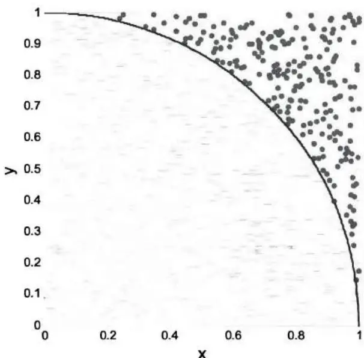
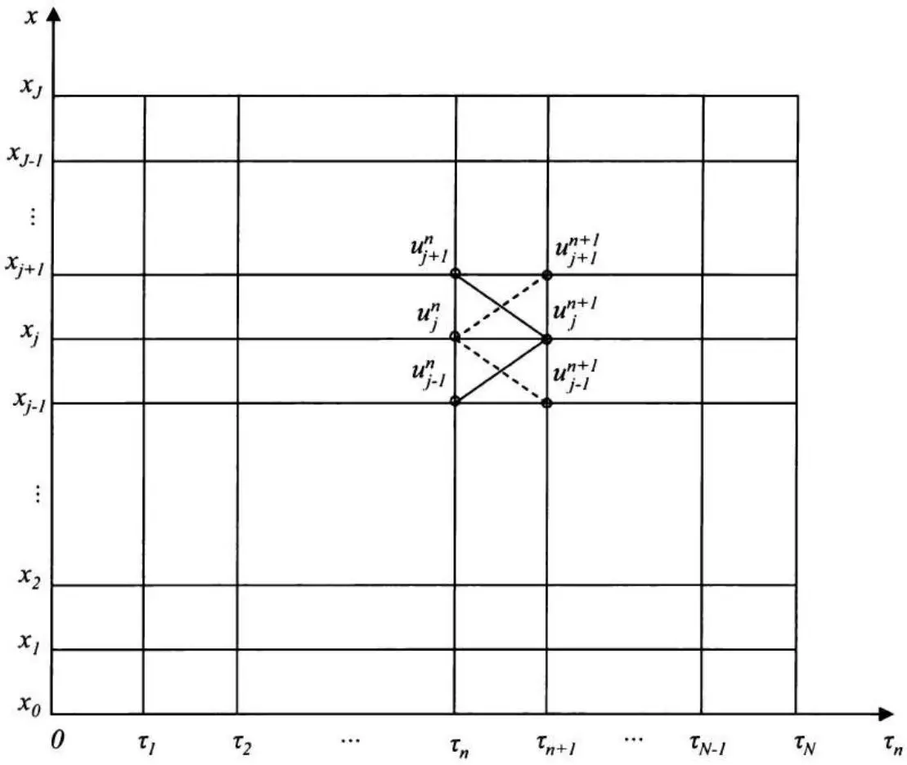

# [第7章](ch07.md) 算法与数值方法

尽管量化分析师花在编程上的时间比例因工作职能（例如量化分析师/研究员与量化开发人员）和公司文化而异，但典型的量化分析师通常会将部分时间用于通过编程实现模型。因此，编程技能测试通常是量化面试中固有的一部分。

在很大程度上，量化面试中问到的编程问题与技术面试中的问题相似。毫不奇怪，其中许多问题是平台相关或语言相关的。尽管C++和Java仍然主导市场，但我们看到编程语言日益多样化，如Matlab、SAS、S-Plus和R。由于已有许多专门针对技术面试的书籍和网站，本章不打算全面回顾编程问题。相反，它讨论一些算法问题和数值方法，这些是量化面试中偏爱的主题。

## 7.1 算法


在编程中，算法复杂度的分析通常使用渐近分析，忽略机器相关的常数，研究运行时间 $T(n)$ ——即基本操作（如加法、乘法和比较）的数量——当输入数量 $n \rightarrow \infty$ 时。¹


算法复杂度中三个最重要的符号是大O记号、$\Omega$ 记号和 $\Theta$ 记号：

$O(g(n)) = \{f(n): \text{存在正常数} c \text{和} n_0 \text{使得对所有} n \geq n_0 \text{有} 0 \leq f(n) \leq cg(n)\}$。它是 $f(n)$ 的渐近上界。

$\Omega(g(n)) = \{f(n):$ 存在正常数 $c$ 和 $n_0$ 使得对所有 $n \geq n_0$ 有 $0 \leq cg(n) \leq f(n)\}$。它是 $f(n)$ 的渐近下界。

$\Theta(g(n)) = \{f(n): \text{存在正常数} c_1, c_2, \text{和} n_0 \text{使得对所有} n \geq n_0 \text{有} c_1g(n) \leq f(n) \leq c_2g(n)\}$。它是 $f(n)$ 的渐近紧界。

$$

$$

除了记号之外，解释算法复杂度中的两个概念也很重要：

最坏情况运行时间 $W(n)$ ：对于任意 $n$ 个输入，运行时间的一个上界。

平均情况运行时间 $A(n)$ ：当 $n$ 个输入随机选择时的期望运行时间。

对于许多算法，$W(n)$ 和 $A(n)$ 具有相同的 $O(g(n))$。但正如我们将在某些问题中讨论的那样，它们可能大不相同，其相对重要性通常取决于具体问题。


一个具有 $n$ 个输入的问题通常可以分割成 $a$ 个子问题，每个子问题有 $n / b$ 个输入。这种范式通常称为分治法。如果将问题分割成子问题以及合并子问题的解需要 $f(n)$ 次基本操作，则运行时间可以表示为递归方程 $T(n) = aT(n / b) + f(n)$ ，其中 $a \geq 1, b > 1$ ，且 $f(n) \geq 0$ 。


主定理是求解递归方程 $T(n) = aT(n / b) + f(n)$ 紧界的重要工具：如果存在常数 $\varepsilon > 0$ 使得 $f(n) = O\left(n^{\log_b a - \varepsilon}\right)$ ，则 $T(n) = \Theta\left(n^{\log_b a}\right)$ ，因为 $f(n)$ 增长慢于 $n^{\log_b a}$ 。如果存在 $k \geq 0$ 使得 $f(n) = \Theta\left(n^{\log_b a} \log^k n\right)$ ，则 $T(n) = \Theta\left(n^{\log_b a} \log^{k+1} n\right)$ ，因为 $f(n)$ 与 $n^{\log_b a}$ 增长速度相近。如果存在常数 $\varepsilon > 0$ 使得 $f(n) = \Omega\left(n^{\log_b a + \varepsilon}\right)$ ，且存在常数 $c < 1$ 使得 $af(n / b) \leq cf(n)$ ，则 $T(n) = \Theta(f(n))$ ，因为 $f(n)$ 增长快于 $n^{\log_b a}$ 。


让我们用二分搜索来展示主定理的应用。要在数组中查找一个元素，如果数组中的数字已排序（ $a_1 \leq a_2 \leq \cdots \leq a_n$ ），我们可以使用二分搜索：算法从 $a_{\lfloor n/2 \rfloor}$ 开始。如果 $a_{\lfloor n/2 \rfloor} = x$ ，搜索停止。如果 $a_{\lfloor n/2 \rfloor} > x$ ，我们只需要搜索 $a_1, \cdots, a_{\lfloor n/2-1 \rfloor}$ 。如果 $a_{\lfloor n/2 \rfloor} < x$ ，我们只需要搜索 $a_{\lfloor n/2+1 \rfloor}, \cdots, a_n$ 。每次进行一次比较后，我们可以将待搜索的元素数量减半。因此我们有 $a = 1$ ， $b = 2$ ，且 $f(n) = 1$ 。因此，$f(n) = \Theta\left(n^{\log_21} \log^0 n\right)$ ，二分搜索的复杂度为 $\Theta(\log n)$ 。


### 数字交换

如何在不使用额外存储空间的情况下交换两个整数 $i$ 和 $j$ ？



解答：比较和交换是许多算法的基本操作。最常用的交换技术使用临时变量，但本题中不幸被禁止，因为临时变量需要额外的存储空间。一个简单的数学方法是先存储i和j的和，然后提取i的值赋给j，最后将j的值赋给i。实现代码如下所示：

```txt
void swap(int &i, int &j) {
i = i + j; // 存储i和j的和
j = i - j; // 将j变为i的值
i = i - j; // 将i变为j的值
}
```

另一种解决方案利用按位异或(^)函数，利用 $x \wedge x = 0$ 和 $0 \wedge x = x$ 的性质：

```txt
void swap(int &i, int &j) {
i = i ^ j;
j = j ^ i; // j = i ^ (j ^ i) = i
i = i ^ j; // i = (i ^ j) ^ i = j
}
```



### 唯一元素

如果给定一个已排序数组，你能编写代码提取数组中的唯一元素吗？例如，如果数组是[1, 1, 3, 3, 3, 5, 5, 5, 9, 9, 9, 9]，唯一元素应为[1, 3, 5, 9]。




解答：设a为一个包含n个元素的已排序数组，元素为 $a_{0} \leq a_{1} \leq \cdots \leq a_{n-1}$ 。每当我们在已排序数组中遇到一个新元素 $a_{i}$ 时，它的值与前一个元素不同（ $a_{i} \neq a_{i-1}$ ）。利用这个性质，我们可以轻松提取唯一元素。C++的一种实现如下函数所示：


```cpp
template <class T> vector<T> unique(T a[], int n) {

vector<T> vec; // 使用vector避免大小调整问题
vec.reserve(n); // 预分配以避免重新分配
vec.push_back(a[0]);
for(int i=1; i<n; ++i) {
```

```c
if(a[i] != a[i-1])
vec.push_back(a[i]);
}
return vec;
}
```



### 霍纳算法


编写一个算法计算 $y = A_{0} + A_{1}x + A_{2}x^{2} + A_{3}x^{3} + \cdots + A_{n}x^{n}$ 。


$$

$$


解答：朴素方法计算多项式的每一项并相加，需要 $O(n^{2})$ 次乘法。我们可以使用霍纳算法将乘法次数减少到 $O(n)$ 。该算法将原多项式表示为 $y = \left( \left( (A_{n}x + A_{n-1})x + A_{n-2} \right)x + \cdots + A_{2} \right)x + A_{1} \bigg)x + A_{0}$ 并顺序计算 $B_{n} = A_{n}$ ， $B_{n-1} = B_{n}x + A_{n-1}$ ， $\cdots$ ， $B_{0} = B_{1}x + A_{0}$ 。我们有 $y = B_{0}$ ，最多需要n次乘法。


$$

$$

### 移动平均


给定一个长度为m的大数组A，你能开发一个高效的算法来构建另一个数组，其中包含原数组的n元素移动平均 $(B_{1},\cdots,B_{n-1}=NA, B_{i}=(A_{i-n+1}+A_{i-n+2}+\cdots+A_{i})/n, \forall i=n,\cdots,m)$ ？


$$

$$

解答：在计算接下来n个连续数字的移动平均时，我们可以复用之前计算的移动平均。只需将该平均值乘以 $n$ ，减去该移动平均中的第一个数字，然后加上新数字，就得到了新的和。将新和除以 $n$ 即得到新的移动平均。以下是计算移动平均的伪代码：

$$
\begin{array}{l} \mathrm{S} = \mathrm{A} [ 1 ] + \dots + \mathrm{A} [ \mathrm{n} ]; \mathrm{B} [ \mathrm{n} ] = \mathrm{S} / \mathrm{n}; \\ \text{ for } (i = n + 1 \text{ to } m) \{S = S - A [ i - n ] + A [ i ]; B [ i ] = S / n; \} \\ \end{array}
$$



### 排序算法


你能解释三种对n个不同值 $A_{1},\cdots,A_{n}$ 进行排序的算法，并分析每种算法的复杂度吗？


$$

$$

解答：排序是许多程序中直接或间接实现的基本过程。因此，针对不同目的开发了多种排序算法。这里我们来讨论三种这样的算法：插入排序、归并排序和快速排序。

插入排序：插入排序使用增量方法。假设我们已经排序了子数组A[1, ..., i-1]。我们将元素 $A_i$ 插入到A[1, ..., i-1]中的适当位置，得到排序后的子数组A[1, ..., i]。从 $i = 1$ 开始，逐步增加到 $n$ ，我们将得到一个完全排序的数组。每一步的期望比较次数为 $i/2$ ，最坏情况比较次数为 $i$ 。因此我们有

$$
A (n) = \Theta \left(\sum_{i = 1} ^{n} i / 2\right) = \Theta (n^{2}) \text{且} W (n) = \Theta \left(\sum_{i = 1} ^{n} i\right) = \Theta (n^{2}).
$$

归并排序：归并排序使用分治范式。它将数组分成两个子数组，每个包含n/2个元素，并对每个子数组排序。除非子数组足够小（不超过几个元素），否则子数组会再次被分割排序。最后，排序后的子数组合并形成一个排序后的数组。

该算法可以用以下伪代码表示：

mergesort(A, beginindex, endindex)

if beginindex $<$ endindex

$$
then centerindex $\leftarrow$ (beginindex + endindex)/2
$$

$$
merge1 <- mergesort(A, beginindex, centerindex)
$$

$$
merge2 <- mergesort(A, centerindex + 1, endindex)
$$

$$
merge(merge1, merge2)
$$

将两个各含 $n / 2$ 个元素的已排序数组合并为一个数组需要 $\Theta(n)$ 次基本操作。运行时间 $T(n)$ 满足以下递归函数：


$$
T (n) = \left\{ \begin{array}{l l} 2 T (n / 2) + \Theta (n), & \text{如果} n > 1 \\ 1, & \text{如果} n = 1 \end{array} . \right.
$$


将主定理应用于 $T(n)$ ，其中 $a = 2, b = 2$ ， $f(n) = \Theta(n)$ ，我们有 $f(n) = \Theta\left(n^{\log_b a} \log^0 n\right)$ 。所以 $T(n) = \Theta(n \log n)$ 。对于归并排序，$A(n)$ 和 $W(n)$ 与 $T(n)$ 相同。


快速排序：快速排序是另一种递归排序方法。它从序列中选择一个元素 $A_{i}$ ，并将所有其他值与它比较。小于 $A_{i}$ 的元素放在 $A_{i}$ 左侧的子数组中；大于 $A_{i}$ 的元素放在 $A_{i}$ 右侧的子数组中。然后在两个子数组（以及它们的任何子数组）上重复该算法，直到所有值都被排序。


在最坏情况下，快速排序所需的比较次数与插入排序相同。例如，如果我们总是选择数组（子数组）中的第一个元素，并将所有其他元素与之比较，最坏情况发生在 $A_{1},\cdots,A_{n}$ 已经排序时。在这种情况下，其中一个子数组为空，另一个有n-1个元素。每一步只将子数组大小减少一。因此，$W(n)=\Theta\left(\sum_{i=1}^{n}i\right)=\Theta(n^{2})$ 。


为了估计平均情况运行时间，假设初始顺序是随机的，使得每次比较都等可能地发生在从 $A_1, \cdots, A_n$ 中选取的任意一对元素之间。如果我们怀疑原始元素序列具有某种模式，我们可以首先随机排列该序列，复杂度为 $\Theta(n)$ ，如下一个问题所述。设 $\widetilde{A}_p$ 和 $\widetilde{A}_q$ 分别为最终排序数组中的第p个和第q个元素（ $1 \leq p < q \leq n$ ）。在 $\widetilde{A}_p$ 和 $\widetilde{A}_q$ 之间有 $q - p + 1$ 个数字。$\widetilde{A}_p$ 和 $\widetilde{A}_q$ 被比较的概率，等于 $\widetilde{A}_q$ 在 $\widetilde{A}_{p+1}, \cdots,$ 或 $\widetilde{A}_{q-1}$ 与 $\widetilde{A}_p$ 或 $\widetilde{A}_q$ 比较之前与 $\widetilde{A}_p$ 比较的概率（否则，$\widetilde{A}_p$ 和 $\widetilde{A}_q$ 会被分到不同的子数组中而不会被比较），该概率为 $P(p, q) = \frac{2}{q - p + 1}$（你同样可以利用对称论证推导出这个概率）。


总的期望比较次数为 $A(n)=\sum_{q=2}^{n}\sum_{p=1}^{q-1}P(p,q)=\sum_{q=2}^{n}\sum_{p=1}^{q-1}\left(\frac{2}{q-p+1}\right)$ $=\Theta(n\lg n).$


尽管理论上快速排序在最坏情况下可能比归并排序慢，但在实践中它通常与归并排序一样快，甚至更快。



### 随机排列

A. 如果你有一个随机数生成器，可以生成离散或连续均匀分布的随机数，你如何洗一副52张牌，使得每种排列等可能？




解答：一个简单的排列n个元素的算法是通过排序进行随机排列。它给每张牌分配一个随机数，然后按照分配的随机数对牌进行排序。 由对称性，每种可能的顺序（总共n!种可能的有序序列）是等可能的。复杂度由排序步骤决定，因此运行时间为 $\Theta(n \log n)$ 。对于较小的 $n$ ，例如一副牌中的 $n=52$ ，复杂度 $\Theta(n \log n)$ 是可接受的。对于较大的 $n$ ，我们可能希望使用更快的算法，称为Knuth洗牌。对于 $n$ 个元素 $A[1], \cdots, A[n]$ ，Knuth洗牌使用以下循环生成随机排列：


for $(i = 1$ to $n)$ swap $(A[i], A[\text{Random}(i, n)])$ ，


其中 $\operatorname{Random}(i, n)$ 是 $i$ 和 $n$ 之间离散均匀分布的随机数。

Knuth洗牌的复杂度为 $\Theta(n)$ ，并且有一个直观的解释。在第一步中，由于牌号是从1到n之间的离散均匀分布中选取的，n张牌中的每一张被选为第一张牌的概率相等；在第二步中，剩余的 $n-1$ 张牌中的每一张被选为第二张牌的概率相等；以此类推。因此，每个有序序列自然具有 $1/n!$ 的概率。

$$

$$

B. 你有一个由字符组成的文件。文件中的字符可以顺序读取，但文件长度未知。你如何选择一个字符，使得文件中的每个字符被选中的概率相等？

解答：我们从选择第一个字符开始。如果有第二个字符，我们以1/2的概率保留第一个字符，以1/2的概率将选择替换为第二个字符。如果有第三个字符，我们以2/3的概率保留当前选择（从前两个字符中选出的），以1/3的概率将选择替换为第三个字符。同样的过程持续到最后一个字符。换句话说，设 $C_n$ 为我们扫描了n个字符后选中的字符，且第

$(n+1)$ 个字符存在，则保留当前选择的概率为 $\frac{n}{n+1}$ ，切换到第 $(n+1)$ 个字符的概率为 $\frac{1}{n+1}$ 。使用简单的归纳法，我们可以轻松证明，如果有m个字符，每个字符被选中的概率为 $1/m$ 。



### 搜索算法

A. 开发一种算法，用不超过 $3n / 2$ 次比较找到 $n$ 个数中的最小值和最大值。



解答：对于包含 $n$ 个数的未排序数组，找到最小值或最大值需要 $n - 1$ 次比较。然而，同时找到最小值和最大值最多需要 $3n / 2$ 次比较。如果我们将元素分成 $n / 2$ 对，比较每对中的元素，将较小的放入

A组，较大的放入B组。这一步需要n/2次比较。由于整个数组的最小值一定在A组中，最大值一定在B组中，我们只需要找到A组中的最小值和B组中的最大值，每项各需要n/2-1次比较。所以比较总数最多为3n/2。

B. 给定一个数字数组。从数组开头到某个位置，所有元素都是零；在该位置之后，所有元素都是非零的。如果你不知道数组的大小，你如何找到第一个非零元素的位置？


解答：我们可以从第1个元素开始；如果是零，检查第2个元素；如果第2个元素是零，检查第4个元素……重复该过程，直到第i步时第 $2^{i}$ 个元素非零。然后检查第 $\frac{2^{i}+2^{i-1}}{2}$ 个元素。如果它是零，搜索范围限制在第 $\frac{2^{i}+2^{i-1}}{2}$ 个元素到第 $2^{i}$ 个元素之间；否则搜索范围限制在第 $2^{i-1}$ 个元素到第 $\frac{2^{i}+2^{i-1}}{2}$ 个元素之间……每次我们将范围减半。这种方法本质上是二分搜索。如果第一个非零元素在第n个位置，算法复杂度为 $\Theta(\log n)$ 。


C. 你有一个数字的方形网格。每行的数字从左到右递增。每列的数字从上到下递增。设计一个算法从网格中查找给定数字。你算法的复杂度是多少？


解答：设A为 $n \times n$ 矩阵，表示数字网格，x为我们要在网格中查找的数字。从最后一列自上而下开始搜索：$A_{1,n}, \cdots, A_{n,n}$ 。如果找到数字，则停止搜索。如果 $A_{n,n} < x$ ，则x不在网格中，搜索也停止。如果 $A_{i,n} < x < A_{i+1,n}$ ，那么行 $1, \cdots, i$ 中的所有数字都小于x，也被排除。 然后我们自右向左搜索第 $(i+1)$ 行。如果在第 $(i+1)$ 行找到数字，搜索停止。如果 $A_{1,i+1} > x$ ，则x不在网格中，因为第 $i+1$ 行及以上的所有数字都大于x。如果 $A_{i+1,j+1} > x > A_{i+1,j}$ ，我们排除列 $j+1, \cdots, n$ 中的所有数字。然后我们可以从 $A_{i+1,j}$ 开始沿列向下搜索到 $A_{n,j}$ ，直到找到x（或x不在网格中）或找到使 $A_{k,j} < x < A_{k+1,j}$ 的k，然后从 $A_{k+1,j}$ 向左沿第 $k+1$ 行搜索到 $A_{k+1,1}$ 。使用该算法，搜索最多需要2n步。因此其复杂度为 $O(n)$ 。


$$

$$

### 斐波那契数

考虑以下用于生成斐波那契数的C++程序：

```c
int Fibonacci(int n)
{
if (n <= 0)
return 0;
else if (n == 1)
return 1;
else
return Fibonacci(n - 1) + Fibonacci(n - 2);
}
```

如果对于某个较大的n，计算Fibonacci(n)需要100秒，计算Fibonacci(n+1)大约需要多少秒（精确到秒）？这个算法高效吗？你会如何计算斐波那契数？



解答：这个C++函数使用了一种相当低效的递归方法来计算斐波那契数。斐波那契数定义为以下递推关系：

$$
F_{0} = 0, F_{1} = 1, F_{n} = F_{n - 1} + F_{n - 2}, \forall n \geq 2
$$

$F_{n}$ 的闭式解为 $F_{n} = \frac{\left(1 + \sqrt{5}\right)^{n} - \left(1 - \sqrt{5}\right)^{n}}{2^{n}\sqrt{5}}$ ，这可以用归纳法轻松证明。从函数可以看出，显然

$$
T (0) = 1, T (1) = 1, T (n) = T (n - 1) + T (n - 2) + 1.
$$


所以运行时间也正比于一个斐波那契数序列。对于较大的 $n$ ， $(1-\sqrt{5})^{n} \to 0$ ，所以 $\frac{T(n+1)}{T(n)} \approx \frac{\sqrt{5} + 1}{2}$ 。如果计算Fibonacci(n)需要100秒，计算Fibonacci(n+1)的时间为 $T(n+1) \approx \frac{\sqrt{5} + 1}{2} T(n) \approx 162$ 秒。


递归算法的复杂度为指数级 $\Theta\left(\left(\frac{\sqrt{5}+1}{2}\right)^{n}\right)$ ，这显然效率低下。原因在于它未能有效利用斐波那契数列中较小n的斐波那契数的信息。如果我们使用定义顺序计算 $F_{0}, F_{1}, \cdots, F_{n}$ ，运行时间的复杂度为 $\Theta(n)$ 。


一种称为递归平方的算法可以进一步将复杂度降低到 $\Theta (\log n)$ 。由于 $\left[ \begin{array}{cc}F_{n + 1} & F_n\\ F_n & F_{n - 1} \end{array} \right] = \left[ \begin{array}{ll}1 & 1\\ 1 & 0 \end{array} \right]\times \left[ \begin{array}{cc}F_n & F_{n - 1}\\ F_{n - 1} & F_{n - 2} \end{array} \right]$ 且 $\left[ \begin{array}{cc}F_2 & F_1\\ F_1 & F_0 \end{array} \right] = \left[ \begin{array}{ll}1 & 1\\ 1 & 0 \end{array} \right]$ ，我们可以用归纳法证明 $\left[ \begin{array}{cc}F_{n + 1} & F_n\\ F_n & F_{n - 1} \end{array} \right] = \left[ \begin{array}{ll}1 & 1\\ 1 & 0 \end{array} \right]^n$ 。设 $A = \left[ \begin{array}{ll}1 & 1\\ 1 & 0 \end{array} \right]$ ，我们可以再次应用分治范式来计算 $A^n$ ： $A^n = \left\{\begin{array}{ll}A^{n / 2}\times A^{n / 2}, & \text{如果} n \text{为偶数}\\ A^{(n - 1) / 2}\times A^{(n - 1) / 2}\times A, & \text{如果} n \text{为奇数} \end{array} \right.$ 。两个 $2\times 2$ 矩阵相乘的复杂度为 $\Theta (1)$ 。所以 $T(n) = T(n / 2) + \Theta (1)$ 。应用主定理，我们得到 $T(n) = \Theta (\log n)$ 。


$$

$$

### 最大连续子数组


假设你有一个长度为 $n$ 的一维数组 $A$ ，其中包含正数和负数。设计一个算法，找出 $A$ 的任何连续子数组 $A[i, j]$ 的最大和：$V(i, j) = \sum_{x=i}^{j} A[x], 1 \leq i \leq j \leq n$ 。


$$

$$

解答：几乎所有的交易系统都需要这样的算法来计算实际交易组合或模拟策略的最大涨幅或最大回撤。因此，这是面试官最喜欢的算法问题，尤其是对冲基金和交易台的面试官。

最显而易见的算法是 $O(n^2)$ 算法，它使用以下方程从头开始顺序计算 $V(i,j)$：

$$
V (i, i) = A [ i ] \text{当} j = i \text{且} V (i, j) = \sum_{x - i} ^{j} A [ x ] = V (i, j - 1) + A [ j ] \text{当} j > i.
$$

在计算 $V(i,j)$ 的同时，我们还跟踪 $V(i,j)$ 的最大值以及相应的子数组索引 $i$ 和 $j$ 。


一种更高效的方法使用分治范式。定义 $T(i)=\sum_{x=1}^{i}A[x]$ 且 $T(0)=0$ ，则 $V(i,j)=T(j)-T(i-1)$ ， $\forall1\leq i\leq j\leq n$ 。显然，对于任何固定的j，当 $T(i-1)$ 最小时，$V(i,j)$ 最大。因此以j结尾的最大子数组为 $V_{\max}=T(j)-T_{\min}$ ，其中 $T_{\min}=\min(T(1),\cdots,T(j-1))$ 。如果我们随着j的增加跟踪并更新 $V_{max}$ 和 $T_{min}$ ，可以开发出以下 $O(n)$ 算法：

T = A [ 1 ]; V_{\max} = A [ 1 ]; T_{\min} = \min (0, T)
$$

$$

对于 $j = 2$ 到 $n$

{ $T = T + A[j]$ ;
如果 $T - T_{\min} > V_{\max}$ 则 $V_{\max} = T - T_{\min}$ ;
如果 $T < T_{\min}$ ，则 $T_{\min} = T$ ;
}
返回 $V_{max}$ ;

以下是对应的C++函数，给定数组及其长度后返回 $V_{max}$ 和索引i、j：

```awk
double maxSubarray(double A[], int len, int &i, int &j)
{
double T=A[0], Vmax=A[0];
double Tmin = min(0.0, T);
for (int k=1; k<len; ++k)
{
T+=A[k];
if (T-Tmin > Vmax) {Vmax=T-Tmin; j=k;}
if (T<Tmin) {Tmin = T; i = (k+1<j)? (k+1):j;}
}
return Vmax;
}
```

$$

$$

将其应用于以下数组A，

```matlab
double A[] = {1.0, 2.0, -5.0, 4.0, -3.0, 2.0, 6.0, -5.0, -1.0};
int i = 0, j = 0;
```

double Vmax = maxSubarray(A, sizeof(a) / sizeof(A[1]), i, j);

将得到 $V_{\max} = 9$ ， $i = 3$ 且 $j = 6$ 。因此子数组为[4.0, -3.0, 2.0, 6.0]。



## 7.2 2的幂

世界上只有10种人——懂二进制的和不懂的。如果你恰好懂这个笑话，你可能知道计算机使用二进制（基数为2）数字系统运行。与十进制数字0-9不同，每个比特（二进制数字）只有两个可能的值：0和1。数字的二进制表示具有一些有趣的特性，在实践中被广泛探索，使其成为面试中测试的一个有趣话题。

### 2的幂

如何判断一个整数是否为2的幂？




解答：任何整数 $x = 2^n$ （ $n \geq 0$ ）都有一个比特（从右边数第 $(n+1)$ 位）被设置为1。例如，8（ $= 2^3$ ）表示为 $0 \cdots 01000$ 。同样容易看出 $2^n - 1$ 从右边开始的n个比特全部设置为1。例如，7表示为 $0 \cdots 00111$ 。因此 $2^n$ 和 $2^n - 1$ 没有共同的比特位。因此，$x \& (x-1) == 0$ ，其中&是按位与运算符，是判断整数 $x$ 是否为2的幂的一种简单方法。


$$

$$

$$
### 乘以7
$$

给出一个不用乘法(*)运算符将整数乘以7的快速方法。



解答：(x << 3) - x，其中<<是按位左移运算符。x << 3 等价于 x*8。因此 (x << 3) - x 等于 x*7。



### 概率模拟

给定一枚公平硬币。你能设计一个使用该公平硬币的简单游戏，使得你获胜的概率为 $p$ ， $0 < p < 1$ 吗？



解答：这个问题的关键在于认识到 $p \in (0,1)$ 也可以表示为二进制数，并且二进制数的每一位可以用公平硬币模拟。首先，我们将概率 $p$ 表示为二进制数：

$$
p = 0. p_{1} p_{2} \dots p_{n} = p_{1} 2^{- 1} + p_{2} 2^{- 2} + \dots + p_{n} 2^{- n}, p_{i} \in \{0, 1 \}, \forall i = 1, 2, \dots , n.
$$


然后，我们开始掷公平硬币，记正面为1，反面为0。设 $s_i \in \{0,1\}$ 为从 $i = 1$ 开始的第 $i$ 次投掷的结果。每次投掷后，我们比较 $p_i$ 与 $s_i$ 。如果 $s_i < p_i$ ，我们赢，投掷停止。如果 $s_i > p_i$ ，我们输，投掷停止。如果 $s_i = p_i$ ，我们继续投掷更多硬币。某些 $p$ 值（例如1/3）表示为二进制数时是无穷级数（ $n \to \infty$ ）。在这些情况下，随着 $i$ 增加，出现 $s_i \neq p_i$ 的概率为1。如果序列是有限的（例如1/4=0.01）并且我们到达了 $s_n = p_n$ 的最终阶段，我们就输了（例如对于1/4，只有序列00被归类为赢；所有其他三个序列01、10和11被归类为输）。这样的模拟将给出我们获胜概率 $p$ 。


$$

$$

### 毒酒问题

你为生日聚会准备了1000瓶葡萄酒。聚会开始前20小时，酒庄紧急通知你有一瓶葡萄酒被下了毒。你恰好有10只实验室老鼠可用于检测一瓶葡萄酒是否有毒。这种毒药非常强，任何剂量都会在恰好18小时内杀死一只老鼠。但在第18小时死亡之前，没有任何其他症状。你能在聚会前用这10只老鼠找到有毒的那瓶酒吗？



解答：如果老鼠可以顺序测试，每轮排除一半的瓶子，问题就变成了一个简单的二分搜索问题。10只老鼠最多可以从1024瓶酒中找出有毒的那瓶。不幸的是，由于症状在18小时后才会出现，而我们只有20小时，无法顺序测试老鼠。尽管如此，二分搜索的思想仍然适用。1到1000之间的所有整数都可以表示为10位二进制格式。例如，编号1000的瓶子可以标记为1111101000，因为 $1000 = 2^{9} + 2^{8} + 2^{7} + 2^{6} + 2^{5} + 2^{3}$ 。

现在让老鼠1从第一位（右边最低位）为1的每瓶酒中喝一口；让老鼠2从第二位为1的每瓶酒中喝一口；……；最后，让老鼠10从第10位（最高位）为1的每瓶酒中喝一口。18小时后，如果我们把老鼠从最高位到最低位排成一排，将存活的老鼠记为0，死亡的老鼠记为1，我们就可以轻松反推出有毒瓶子的标签。例如，如果第6、7和9只老鼠死亡，其他存活，排列顺序为0101100000，有毒瓶子的标签为 $2^{8} + 2^{6} + 2^{5} = 352$ 。



## 7.3 数值方法

许多金融工具的价格没有闭式解析解。这些金融工具的估值依赖于多种数值方法。在本节中，我们讨论蒙特卡洛模拟和有限差分方法的应用。

### 蒙特卡洛模拟

蒙特卡洛模拟是一种使用具有适当概率的随机数作为输入，迭代评估确定性模型的方法。对于衍生品定价，它模拟大量标的资产的价格路径，概率对应于标的随机过程（通常是在风险中性测度下），计算每条路径下衍生品的贴现收益，并对贴现收益取平均得到衍生品价格。蒙特卡洛模拟的有效性依赖于大数定律。

如果收益仅依赖于标的资产的最终价值，蒙特卡洛模拟可用于估计衍生品价格；如果收益也是路径依赖的，也可以进行改编。然而，它不能直接应用于美式期权或任何其他具有提前行权权的衍生品。

A. 解释如何使用蒙特卡洛模拟为欧式看涨期权定价？




解答：如果我们假设股票价格遵循几何布朗运动，我们可以模拟可能的股票价格路径。我们可以将t到T之间的时间分成N个等距的时间步长。 因此 $\Delta t = \frac{T - t}{N}$ 且 $t_{i} = t + \Delta t \times i$ ，对于 $i = 0, 1, 2, \cdots, N$ 。然后我们使用方程 $S_{i} = S_{i-1} e^{(r - \sigma^{2}/2)(\Delta t) + \sigma \sqrt{\Delta t} \varepsilon_{i}}$ 在风险中性概率下模拟股票价格路径，其中 $\varepsilon_{i}$ 是来自标准正态分布的独立同分布随机变量。假设我们模拟M条路径，每条路径在到期日T产生一个股票价格 $S_{T,k}$ ，其中 $k = 1, 2, \cdots, M$ 。欧式看涨期权的估计价格是期望收益的现值，


可以计算为 $C = e^{-r(T - t)}\frac{\sum_{k=1}^{M}\max(S_{T,k} - K,0)}{M}$ 。


B. 如果你的计算机只能生成服从0到1之间连续均匀分布的随机变量，你如何生成服从 $N(\mu, \sigma^{2})$ （均值为 $\mu$ 、方差为 $\sigma^{2}$ 的正态分布）的随机变量？


解答：这是一个很好的问题，用于测试随机数生成的基础知识——蒙特卡洛模拟的基础。这个问题的解决方案可以分为两个步骤：

1. 使用逆变换法和接受-拒绝法从均匀随机数生成器生成 $x \sim N(0,1)$ 的随机变量。

2. 将x缩放为 $\mu + \sigma x$ ，生成最终服从 $N(\mu, \sigma^{2})$ 的随机变量。


第二步很直接；第一步需要一些解释。一种流行的随机变量生成方法是逆变换法：对于任何具有累积分布函数 $F(U = F(X))$ 的连续随机变量 $X$ ，随机变量 $X$ 可以定义为U的逆函数：$X = F^{-1}(U)$ ， $0 \leq U \leq 1$ 。显然，$X = F^{-1}(U)$ 是一个一一对应函数，其中 $0 \leq U \leq 1$ 。因此任何连续随机变量都可以使用以下过程生成：


- 从标准均匀分布生成一个随机数 $u$ 。
- 计算使得 $u = F(x)$ 的x值，作为来自分布F描述的分布的随机数。


要使该模型工作，$F^{-1}(U)$ 必须可计算。对于标准正态分布，$U = F(X) = \int_{-\infty}^{X} \frac{1}{\sqrt{2\pi}} e^{-x^2/2} dx$ 。该逆函数没有解析解。理论上，我们可以将 $X$ 到 $U$ 的一一对应作为常微分方程 $F'(x) = f(x) = \frac{1}{\sqrt{2\pi}} e^{-x^2/2}$ 的数值解，使用诸如欧拉方法之类的数值积分方法。 然而，这种方法效率低于接受-拒绝法：


某些随机变量的概率密度函数为 $f(x)$ ，但 $F^{-1}(U)$ 没有解析解。在这些情况下，我们可以使用具有概率密度函数 $g(y)$ 且 $Y = G^{-1}(U)$ 的随机变量来帮助生成具有概率密度函数 $f(x)$ 的随机变量。假设 $M$ 是一个常数，使得对所有 $y$ 有 $\frac{f(y)}{g(y)} \leq M$ 。我们可以实现以下接受-拒绝方法：


- 采样步骤：从 $g(y)$ 生成随机变量 $y$ ，从标准均匀分布[0,1]生成随机变量 $v$ 。

- 接受/拒绝步骤：如果 $v \leq \frac{f(y)}{Mg(y)}$ ，接受 $x = y$ ；否则，重复采样步骤。


参数 $\lambda=1$ 的指数随机变量 $(g(x)=\lambda e^{-\lambda x})$ 的累积分布函数为 $u=G(x)=1-e^{-x}$ 。因此逆函数有解析解 $x=-\log(1-u)$ ，可以方便地模拟服从指数分布的随机变量。对于标准正态分布，$f(x)=\frac{1}{\sqrt{2\pi}}e^{-x^{2}/2}$ ，


$$
\frac{f (x)}{g (x)} = \sqrt{\frac{2}{\pi}} e^{x - x^{2} / 2} < \sqrt{\frac{2}{\pi}} e^{- (x - 1) ^{2} / 2 + 1 / 2} \leq \sqrt{\frac{2}{\pi}} e^{1 / 2} \approx 1.32, \forall 0 < x < \infty
$$


因此我们可以选择 $M = 1.32$ ，使用接受-拒绝方法生成 $x \sim N(0,1)$ 随机变量，并将其缩放为 $N(\mu, \sigma^2)$ 随机变量。


C. 你能解释几种提高蒙特卡洛模拟效率的方差缩减技术吗？


解答：蒙特卡洛模拟的基本形式是独立同分布随机变量 $Y_{1}, Y_{2}, \cdots, Y_{M}$ 的均值：$\overline{Y} = \frac{1}{M} \sum_{i=1}^{M} Y_{i}$ 。由于每个 $Y_{i}$ 的期望值是无偏的，估计量 $\overline{Y}$ 也是无偏的。如果 $Var(Y) = \sigma$ 并且我们生成独立同分布的 $Y_{i}$ ，则 $Var(\overline{Y}) = \sigma / \sqrt{M}$ ，其中M是模拟次数。毫不奇怪，如果 $\sigma$ 很大，蒙特卡洛模拟的计算量非常大。通常需要数千甚至数百万次模拟才能达到所需的精度。根据具体问题，已经应用了多种方法来减少方差。


对偶变量：对于每个 $\varepsilon_{i}$ 序列，计算其对应的收益 $Y(\varepsilon_{1},\cdots,\varepsilon_{N})$ 。然后反转所有 $\varepsilon_{i}$ 的符号，计算对应的收益 $Y(-\varepsilon_{1},\cdots,-\varepsilon_{N})$ 。当 $Y(\varepsilon_{1},\cdots,\varepsilon_{N})$ 和 $Y(-\varepsilon_{1},\cdots,-\varepsilon_{N})$ 负相关时，方差得以降低。


矩匹配：随机变量的特定样本可能无法很好地匹配总体分布。我们可以先抽取一大组样本，然后重新缩放样本，使样本的矩（最常用的是均值和方差）匹配所需的总体矩。


控制变量：如果我们要对衍生品 $X$ 定价，并且存在一个密切相关的衍生品 $Y$ 具有解析解，我们可以生成一系列随机数，使用相同的随机序列对 $X$ 和 $Y$ 定价，得到 $\hat{X}$ 和 $\hat{Y}$ 。然后 $X$ 可以估计为 $\hat{X} + (Y - \hat{Y})$ 。本质上，我们使用 $(Y - \hat{Y})$ 来修正 $\hat{X}$ 的估计误差。


重要性采样：为了估计来自分布 $f(x)$ 的 $h(x)$ 的期望值，我们可以不从分布 $f(x)$ 抽取x，而是从分布 $g(x)$ 抽取x，并使用蒙特卡洛模拟估计 $\frac{h(x)f(x)}{g(x)}$ 的期望值：


$$
E_{f (x)} [ h (x) ] = \int h (x) f (x) d x = \int \frac{h (x) f (x)}{g (x)} g (x) d x = E_{g (x)} \left[ \frac{h (x) f (x)}{g (x)} \right]. ^{13}
$$


如果 $\frac{h(x)f(x)}{g(x)}$ 的方差小于 $h(x)$ 的方差，那么重要性采样可以得到更高效的估计量。以一个深度虚值期权为例可以更好地解释这种方法。如果我们直接使用风险中性 $f(S_T)$ 作为分布，大多数模拟路径将产生 $h(S_T) = 0$ ，因此估计方差会很大。如果我们引入一个具有更宽范围（$S_T$ 的尾部更肥）的分布 $g(S_T)$ ，更多模拟路径将具有正的 $h(S_T)$ 。缩放因子 $\frac{f(x)}{g(x)}$ 将保持估计量无偏，但该方法将具有更低的方差。


低差异序列：不使用随机样本，我们可以生成确定性序列的"随机变量"来表示分布。这种低差异序列可以使收敛速度达到1/M。

D. 如果某个期权没有闭式定价公式，你如何估计其delta和gamma？


解答：正如我们在问题 $A$ 中讨论的，具有或不具有闭式定价公式的期权价格都可以使用蒙特卡洛模拟推导出来。同样的方法也可用于估计delta和gamma，只需将当前标的资产价格从 $S$ 小幅变动到 $S \pm \delta S$ ，其中 $\delta S$ 是一个小的正值。对三种起始价格 $S - \delta S$ 、 $S$ 和 $S + \delta S$ 运行蒙特卡洛模拟，我们将得到它们对应的期权价格 $f(S - \delta S)$ 、 $f(S)$ 和 $f(S + \delta S)$ 。


估计的delta：$\Delta = \frac{\delta f}{\delta S} = \frac{f(S + \delta S) - f(S - \delta S)}{2\delta S}$


估计的gamma：$\Gamma = \frac{(f(S + \delta S) - f(S)) - (f(S) - f(S - \delta S))}{\delta S^2}$


为了减少方差，通常最好使用相同的随机数序列来估计 $f(S-\delta S)$ 、 $f(S)$ 和 $f(S+\delta S)$ 。


E. 如何使用蒙特卡洛模拟估计 $\pi$ ？


解答：估计 $\pi$ 是蒙特卡洛模拟的经典例子。一种估计 $\pi$ 的标准方法是在单位正方形内随机选取点（ $x$ 和 $y$ 是0到1之间的独立均匀随机变量），并确定落在圆 $x^{2} + y^{2} \leq 1$ 内的点的比例。为简单起见，我们关注第一象限。如图7.1所示，圆内的任何点都满足方程 $x_{i}^{2} + y_{i}^{2} \leq 1$ 。圆内点的百分比与其面积成正比：


$$
\hat{p} = \frac{\text{满足} x_{i} ^{2} + y_{i} ^{2} \leq 1 \text{的} (x_{i} , y_{i}) \text{数量}}{\text{正方形内} (x_{i} , y_{i}) \text{的数量}} = \frac{1 / 4 \pi}{1 \times 1} = \frac{1}{4} \pi \Rightarrow \hat{\pi} = 4 \hat{p}.
$$


因此我们生成大量独立的 $(x, y)$ 点，估计圆内点与正方形内点的比例，并将该比例乘以4得到 $\pi$ 的估计值。图7.1仅使用1000个点进行说明。以今天的计算能力，我们可以轻松生成数百万个 $(x, y)$ 对来精确估计 $\pi$ 。在笔记本电脑上使用Matlab进行1,000次模拟，每次使用1,000,000个 $(x, y)$ 点，耗时不到1分钟，给出的 $\pi$ 平均估计值为3.1416，标准差为0.0015。





图7.1 一种估计 $\pi$ 的蒙特卡洛模拟方法


$$

$$

### 有限差分法

有限差分法是另一种流行的衍生品定价数值技术。它通过离散化时间和标的资产价格，数值求解微分方程来估计衍生品价格。我们可以将Black-Scholes-Merton方程（一个二阶非线性偏微分方程）转换为热扩散方程（如我们在[第6章](ch06.md)中所做的那样）。这个新方程，表示为 $\tau$ （到期时间）和 $x$ （标的资产价格的函数）的函数，是衍生品的一般微分方程。各种衍生品之间的区别在于边界条件。通过构建 $x$ 和 $\tau$ 的网格并使用边界条件，我们可以使用有限差分方法递归计算每个 $x$ 和 $\tau$ 处的 $u$ 。

### 你能简要解释有限差分法吗？



解答：实践中使用几种版本的有限差分法。让我们简要介绍显式差分法、隐式差分法和


Crank-Nicolson方法。如图7.2所示，如果我们将 $\tau$ 的范围 $[0, T]$ 以增量 $\Delta\tau = T/N$ 划分为N个离散区间，将 $x$ 的范围 $[x_0, x_J]$ 以增量 $\Delta x = (x_J - x_0)/J$ 划分为J个离散区间，则时间 $\tau$ 和空间 $x$ 可以表示为 $\tau_n$ （ $n = 1, \cdots, N$ ）和 $x_j$ （ $j = 1, \cdots, J$ ）的网格。




图7.2 有限差分法的 $\tau$ 和 $x$ 网格


显式差分法在时间 $\tau_{n}$ 处使用前向差分，在 $x_{j}$ 处使用二阶中心差分：$\frac{\partial u}{\partial\tau} \approx \frac{u_{j}^{n+1} - u_{j}^{n}}{\Delta\tau} = \frac{u_{j+1}^{n} - 2u_{j}^{n} + u_{j-1}^{n}}{(\Delta x)^{2}} \approx \frac{\partial^{2}u}{\partial x^{2}}$ 。


整理各项，我们可以将 $u_{j}^{n+1}$ 表示为 $u_{j+1}^{n}$ 、 $u_{j}^{n}$ 和 $u_{j-1}^{n}$ 的线性组合：$u_{j}^{n+1} = \alpha u_{j-1}^{n} + (1 - 2\alpha)u_{j}^{n} + \alpha u_{j+1}^{n}$ ，其中 $\alpha = \Delta t / (\Delta x)^{2}$ 。此外，我们通常有边界条件 $u_{j}^{0}$ 、 $u_{0}^{n}$ 和 $u_{J}^{n}$ ，对于所有 $n = 1, \cdots, N$ ； $j = 0, \cdots, J$ 。结合边界条件和方程 $u_{j}^{n + 1} = \alpha u_{j - 1}^{n} + (1 - 2\alpha)u_{j}^{n} + \alpha u_{j + 1}^{n}$ ，我们可以估计网格上的所有 $u_{j}^{n}$ 。


隐式差分法在时间 $t_{n+1}$ 处使用后向差分，在 $x_{j}$ 处使用二阶中心差分：$\frac{\partial u}{\partial\tau}\approx\frac{u_{j}^{n+1}-u_{j}^{n}}{\Delta\tau}=\frac{u_{j+1}^{n+1}-2u_{j}^{n+1}+u_{j-1}^{n+1}}{(\Delta x)^{2}}\approx\frac{\partial^{2}u}{\partial x^{2}}$ 。


Crank-Nicolson方法在时间 $(t_n + t_{n+1}) / 2$ 处使用中心差分，在 $x_j$ 处使用二阶中心差分：


$$
\frac{\partial u}{\partial \tau} \approx \frac{u_{j} ^{n + 1} - u_{j} ^{n}}{\Delta \tau} = \frac{1}{2} \left(\frac{u_{j + 1} ^{n} - 2 u_{j} ^{n} + u_{j - 1} ^{n}}{(\Delta x) ^{2}} + \frac{u_{j + 1} ^{n + 1} - 2 u_{j} ^{n + 1} + u_{j - 1} ^{n + 1}}{(\Delta x) ^{2}}\right) \approx \frac{\partial^{2} u}{\partial x^{2}}.
$$

B. 如果使用显式有限差分法求解抛物型偏微分方程，时间维度过多的步数还是空间维度过多的步数更糟糕？


解答：显式有限差分法中 $u_{j}^{n+1}$ 的方程为 $u_{j}^{n+1} = \alpha u_{j-1}^{n} + (1 - 2\alpha)u_{j}^{n} + \alpha u_{j+1}^{n}$ ，其中 $\alpha = \Delta t / (\Delta x)^{2}$ 。为了使显式有限差分法稳定，我们需要 $1 - 2\alpha > 0 \Rightarrow \Delta t / (\Delta x)^{2} < 1/2$ 。因此小的 $\Delta t$ （即多时间步长）是理想的，但小的 $\Delta x$ （过多空间步长）可能导致 $\Delta t / (\Delta x)^{2} > 1/2$ ，使结果不稳定。从这个意义上说，空间维度过多的步数更糟糕。相比之下，隐式差分法始终稳定且收敛。


$$

$$