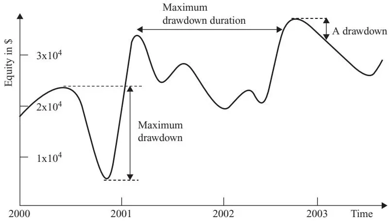
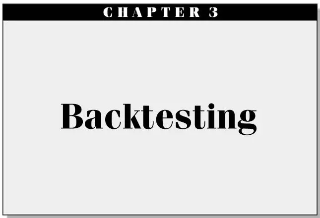

我们能从哪里找到好策略？

令人意外的是：寻找交易创意实际上并不是建立量化交易（Quantitative Trading）业务最难的部分。任何时候都有成百上千个交易创意在公共领域流通，任何人都可以几乎零成本获取。许多交易创意的作者会公开他们的完整方法论和回测（Backtest）结果。获取渠道包括金融投资类书籍、报刊杂志、主流媒体网站、线上或就近公共图书馆可获取的学术论文、交易者论坛、博客等等。我在表2.1中列出了一些我认为有价值的来源，但这只是冰山一角。

过去，出于学术偏好，我经常翻阅商学院教授发布的各类预印本，或下载最新的线上金融期刊文章来筛选潜在的好策略。事实上，我独立交易后的第一个策略就源自此类学术研究。（它是[第7章](ch06.md)中提到的PEAD策略的一个版本。）但后来我越来越发现，学术界描述的许多策略要么过于复杂，要么已经过时（曾经盈利的策略可能因竞争而失效），要么需要昂贵的数据来回测（如历史基本面数据）。此外，许多学术策略仅适用于小盘股（Small-Cap Stocks），而小盘股的流动性不足可能导致实际交易利润远不及回测所示。

表2.1 交易创意来源

| 类型 | 网址 |
|------|------|
| **学术类** | |
| 商学院金融教授个人网站 | www.hbs.edu/research/research.html |
| 社会科学研究网络 | www.ssrn.com |
| 国家经济研究局 | www.nber.org |
| 商学院量化金融研讨会 | www.ieor.columbia.edu/seminars/financialengineering |
| Mark Hulbert 在《纽约时报》周日商业版的专栏 | www.nytimes.com |
| 《经济学人》杂志金融版 Buttonwood 专栏 | www.economist.com |
| **金融网站与博客** | |
| Yahoo! Finance | finance.yahoo.com |
| TradingMarkets | www.TradingMarkets.com |
| Seeking Alpha | www.SeekingAlpha.com |
| TheStreet.com | www.TheStreet.com |
| The Kirk Report | www.TheKirkReport.com |
| Alea Blog | www.aleablog.com |
| Abnormal Returns | www.AbnormalReturns.com |
| Brett Steenbarger Trading Psychology | www.brettsteenbarger.com |
| 本人博客 | epchan.blogspot.com |
| **交易者论坛** | |
| Elite Trader | www.Elitetrader.com |
| Wealth-Lab | www.wealth-lab.com |
| **报刊杂志** | |
| Stocks, Futures and Options 杂志 | www.sfomag.com |

这并不是说你找不到金矿——只要足够坚持就行——但我发现许多交易者论坛或博客提出的策略可能更简单且同样盈利。你可能怀疑人们是否真的会在公共空间公开真正盈利的策略。毕竟，这种公开不是会增加竞争、降低策略盈利能力吗？你的怀疑是对的：这些地方的大多数现成策略确实经不起严格回测。与学术研究一样，交易者论坛上的策略可能只在短时间内有效，或仅适用于某类股票，或仅在忽略交易成本（Transaction Costs）时有效。但关键在于，你往往可以修改基础策略使其盈利。（[第3章](ch03.md)将详细讨论这些注意事项以及基础策略的常见变体。）

例如，有人曾在 Wealth-Lab（见表2.1）上向我推荐了一个据称夏普比率（Sharpe Ratio）很高的策略。当我回测时，发现它并没有宣传的那么好。于是我尝试了一些简单修改——缩短持有期、在不同于建议的时间进出场——最终将这个策略变成了我的主要利润来源之一。如果你足够勤奋和有创造力，去尝试基础策略的多种变体，很可能找到其中一种变体是高度盈利的。

当我离开机构资管行业独立交易时，我曾担心会断绝从同事和导师那里获取交易创意的渠道。但后来我发现，收集和分享交易创意的最佳方式之一就是开设自己的交易博客——每公开一个交易"秘密"，你都会从读者那里获得多个回报。（向我推荐 Wealth-Lab 策略的是一位生活在12个时区之外的读者。如果没有我的博客，我几乎不可能认识他并受益于他的建议。）事实上，你眼中的秘密，对许多人来说往往早已是公开信息！真正使一个策略具有独占性、其秘密值得保护的，是你自己琢磨出来的技巧和变体，而非原版策略。

此外，你的糟糕创意会很快被在线评论者否决，从而可能帮你避免重大损失。我曾在博客上热情介绍了一种由某金融教授开发的季节性股票交易策略，一位读者随即对该策略进行了回测，并报告说它不起作用。（参见我博客上的文章"Seasonal Trades in Stocks"，地址为 epchan.blogspot.com/2007/11/seasonal-trades-in-stocks.html，以及读者的评论。该策略在示例7.6中有更详细的描述。）当然，我本来也不会在自己回测之前就交易这个策略，而我随后的回测确实证实了他的发现。但读者发现策略存在重大缺陷这一事实，为我自己的回测没有出错提供了重要佐证。

总而言之，我发现作为独立交易者，收集和交流交易创意实际上比在纽约的对冲基金（Hedge Fund）世界里更容易。（我在 Millennium Partners——一家位于第五大道的数十亿美元级对冲基金——工作时，一个交易员从他的程序员手中抢过一份公开发表的论文，因为程序员碰巧从他的桌子上拿起了那篇论文。他担心程序员会学到他的"秘密"。）这可能是因为当人们认为你不会动用1亿美元来执行某个策略从而侵蚀他们的利润时，他们对透露秘密就不会那么戒备了。

不，困难不在于缺乏创意。困难在于培养一种判断力，能够辨别哪些策略适合你的个人情况和目标，以及哪些策略在你投入时间进行严格回测之前就看起来可行。这种对潜在策略的判断力正是我将在本章中尝试传达的。

## 如何识别适合你的策略

一个策略是否可行，往往与其本身无关——而与你有关。以下是一些需要考虑的因素。

### 你的工作时间

你只兼职交易吗？如果是，你可能应该只考虑隔夜持仓的策略，而非日内（Intraday）策略。否则，你可能需要将策略完全自动化（详见[第5章](ch05.md)关于执行的内容），使其大部分时间自动运行，仅在出现问题时提醒你。

当我全职为别人工作、兼职为自己交易时，我在个人账户中交易一个简单策略——每天只需在开盘前挂入或调整几只交易所交易基金（ETF）的限价单。刚独立时，我的自动化水平仍然较低，因此只考虑每天在开盘前和收盘前各挂一次单的策略。后来我加入了一个程序，可以自动扫描实时市场数据并在交易日内满足特定条件时向经纪商账户发送订单。所以交易对我来说仍然是"兼职"活动，这也是我最初选择量化交易的部分原因。

### 你的编程能力

你擅长编程吗？如果你掌握一些编程语言，如 Visual Basic 甚至 Java、C# 或 C，你可以探索高频策略，也可以同时交易大量证券。否则，就选择每天只交易一次、或只交易几只股票、期货或货币的策略。（如果你不介意雇用软件承包商的费用，这一限制或许可以克服，详见[第5章](ch05.md)。）

### 你的交易资金

你是否有充足的资金用于交易以及基础设施和运营支出？总体而言，我不建议对资金少于50,000美元的账户进行量化交易。假设高资本与低资本账户的分界线是100,000美元。资金可用性影响许多选择；首先是应该开设零售经纪商账户还是自营交易（Proprietary Trading）账户（[第4章](ch04.md)将详细讨论）。目前，我将结合策略选择来考虑这一限制。

对于低资本账户，我们需要找到能够利用最大可用杠杆（Leverage）的策略。（当然，获得更高杠杆的前提是你有一个持续盈利的策略。）交易期货、货币和期权可以提供比股票更高的杠杆；日内持仓允许T条例（Regulation T）规定的4倍杠杆，而隔夜持仓仅允许2倍杠杆，同等规模的投资组合需要两倍资金。最后，资金（或杠杆）可用性决定了你应该专注于方向性交易（仅做多或做空）还是美元中性交易（Dollar-Neutral Trading，即对冲或配对交易）。美元中性投资组合（即多头头寸市值等于空头头寸市值）或市场中性投资组合（即投资组合相对于市场指数的贝塔（Beta）接近零，其中贝塔衡量投资组合预期收益与市场预期收益的比率）需要的资本或杠杆是仅做多或仅做空组合的两倍。因此，即使对冲头寸的风险低于未对冲头寸，其产生的回报也相应较小，可能无法满足你的个人需求。

资金可用性还带来许多间接限制。它影响你在各种基础设施、数据和软件上的支出。例如，如果你的交易资金较少，你的在线经纪商不太可能为你提供太多股票的实时市场数据，因此你无法真正实施一个需要大范围股票实时数据的策略。（当然，你可以订阅第三方数据提供商，但如果你的交易资金较少，额外费用可能不划算。）同样，干净的高频历史股票数据比日线历史数据贵得多，因此小资金投入的高频股票交易策略可能不可行。对于历史股票数据，还有一个可能比频率更重要的质量指标：数据是否存在幸存者偏差（Survivorship Bias）。我将在下一节定义幸存者偏差。这里只需知道，没有幸存者偏差的历史股票数据比有偏差的数据贵得多。然而，如果你的数据存在幸存者偏差，回测结果可能是不可靠的。

同样的考量适用于新闻——你是否负担得起高覆盖率的实时新闻源（如 Bloomberg），决定了新闻驱动策略是否可行。对于基本面（即公司财务）数据也是如此——你是否负担得起良好的基本面历史数据库，决定了你能否构建依赖此类数据的策略。

表2.2 资金可用性如何影响你的多种选择

| 低资本 | 高资本 |
|--------|--------|
| 自营交易公司会员 | 零售经纪商账户 |
| 期货、货币、期权 | 所有品种，包括股票 |
| 日内交易 | 日内+隔夜 |
| 方向性交易 | 方向性或市场中性 |
| 日内交易的小股票池 | 日内交易的大股票池 |
| 存在幸存者偏差的日线历史数据 | 无幸存者偏差的高频历史数据 |
| 低覆盖率或延迟新闻源 | 高覆盖率实时新闻源 |
| 无历史新闻数据库 | 无幸存者偏差的历史新闻数据库 |
| 无股票历史基本面数据 | 无幸存者偏差的股票历史基本面数据 |

这张表当然不是一套硬性规则，只是一些需要考虑的问题。例如，如果你资金较少但在自营交易公司开了账户，那么你可以免除上述许多考量（基础设施支出除外）。我以100,000美元在零售经纪商账户（我选择了 Interactive Brokers）开始了独立量化交易生涯，最初只交易方向性日内股票策略。但当我开发出有时需要更多杠杆才能盈利的策略后，我也注册成为一家自营交易公司的会员。（是的，你可以同时拥有多个甚至更多账户。实际上，仅为了比较不同账户的执行速度和流动性获取，这样做也是有充分理由的。详见[第4章](ch04.md)"选择经纪商或自营交易公司"。）

尽管我在这里和其他地方反复警告要注意存在幸存者偏差的历史数据，但在我刚起步时，我只下载了 Yahoo! Finance 经拆股和分红调整的数据，使用的是 HQuotes.com 的下载程序（[第3章](ch03.md)将详细介绍不同数据库和工具）。这个数据库并非无幸存者偏差——但两年多后，我仍在用它进行大部分回测！事实上，我认识的一位交易者，其账户规模是我每天交易量的10倍以上，通常就用这种有偏差的数据进行回测，而他的策略仍然盈利。怎么可能？大概因为这些都是日内策略。据我所知，唯一愿意且能够负担无幸存者偏差数据的人，是在管理数千万美元或更多资金的资管公司工作的人（包括以前的我）。所以你看，只要你意识到工具和数据的局限性，就可以在很多方面走捷径并仍然取得成功。

虽然期货提供了高杠杆，但某些期货合约的规模过大，小账户仍然无法交易。例如，纽约商品交易所（NYMEX）的铂金期货合约保证金要求仅为8,100美元，但其名义价值目前约为100,000美元。而且其波动率使得6%的日波动并不罕见，这意味着仅此一个合约就可能导致你的账户每日盈亏（P&L）波动6,000美元。（相信我，我账户里曾经持有过几个这样的合约，当它们逆向波动时的感觉令人作呕。）相比之下，芝加哥商品交易所（CME，即将与NYMEX合并）的ES——E-mini S&P 500 期货，名义价值约为67,500美元，在过去15年中仅出现过两次6%或更大的日波动。这就是为什么其保证金要求为4,500美元，仅为铂金合约的55%。

### 你的目标

大多数选择成为交易者的人希望获得稳定的（最好递增的）月度或至少季度收入。但你可能已经财务独立，只关心长期资本增值。追求短期收入与长期资本增值的策略主要区别在于持有期（Holding Period）。显然，如果你平均持有一只股票一年，你不会产生多少月度收入（除非你很早就开始交易，并且每月启动一个新的子投资组合然后持有一年——即错开你的投资组合）。更微妙的是，即使你的策略平均只持有一只股票一个月，你的月度利润波动也可能相当大（除非你的投资组合持有数百只不同的股票，这可以是错开投资组合的结果），因此你不能指望每月产生稳定收入。持有期（或反过来，交易频率）与收益一致性（即夏普比率，或反过来，回撤（Drawdown））之间的关系将在下一节进一步讨论。这里的结论是：你越希望定期实现利润和产生收入，你的持有期就应该越短。

然而，一些投资顾问散布着一个误解：如果你的目标是实现长期资本最大化增长，那么最好的策略是买入并持有（Buy-and-Hold）。这个观念已经被证明在数学上是错误的。实际上，长期增长最大化是通过找到具有最高夏普比率（在下一节定义）的策略来实现的，前提是你能获得足够高的杠杆。因此，将一个持有期极短、年化收益率较低但夏普比率很高的短期策略，与一个持有期长、年化收益率高但夏普比率较低的长期策略相比较，即使你的目标是长期增长，选择短期策略仍然更优，除非考虑税收因素和保证金借款限制（[第6章](ch06.md)将详细讨论这个令人惊讶的事实）。

## 合理策略的判断力及其陷阱

现在假设你已经阅读了一些符合个人需求的潜在策略。大概其他人已经对这些策略进行了回测，并报告了出色的历史回报。在投入时间对该策略进行全面回测之前（更不用说投入资金实际交易了），你可以做一些快速检查来确保不会浪费时间和金钱。

### 与基准相比如何？收益一致性如何？

当讨论的策略是买入（但不做空）股票的股票交易策略时，这一点似乎显而易见。大家似乎都知道，如果一个仅做多策略每年回报10%，这并不算太出色，因为投资指数基金平均也能获得同样甚至更好的回报。然而，如果策略是多空美元中性策略（即投资组合持有等额资金的多头和空头头寸），那么10%就是一个相当不错的回报，因为此时的比较基准不再是市场指数，而是无风险资产（Risk-Free Asset），如三个月期美国国库券（在本文写作时约为4%）。

另一个需要考虑的问题是策略产生收益的一致性。虽然一个策略可能与基准具有相同的平均回报，但也许它每月都产生正回报，而基准偶尔会遭遇非常糟糕的月份。在这种情况下，我们仍然认为该策略更优。这引导我们使用信息比率（Information Ratio）或夏普比率（Sharpe, 1994），而非收益率本身，作为量化交易策略的恰当绩效衡量指标。

信息比率是在评估仅做多策略时使用的指标。其定义为

$$
\text{Information Ratio} = \frac{\text{Average of   Excess   Returns}}{\text{Standard Deviation   of   Excess   Returns}}
$$

其中

$$
\text{Excess Returns} = \text{Portfolio Returns} - \text{Benchmark Returns}
$$

基准通常是你所交易证券所属的市场指数。例如，如果你只交易小盘股，市场指数应该是标普小盘指数或罗素2000指数（Russell 2000），而非标普500指数。如果你只交易黄金期货，那么市场指数应该是黄金现货价格，而非股票指数。

夏普比率实际上是信息比率的一个特例，适用于美元中性策略，此时使用的基准始终是无风险利率。实际上，大多数交易者即使交易方向性（仅做多或做空）策略时也使用夏普比率，仅仅因为它便于跨策略比较。每个人对无风险利率的定义一致，但每个交易者可以使用不同的市场指数来计算各自偏好的信息比率，使得比较变得困难。

（实际上，计算夏普比率有一些微妙之处，涉及是否以及如何扣除无风险利率、如何年化夏普比率以便比较等。我将在下一章介绍这些细节，并包含如何计算美元中性和仅做多策略夏普比率的示例。）

如果夏普比率是如此好的跨策略绩效衡量指标，你可能会问为什么它不更常被引用以替代收益率。事实上，当我和一位同事去 SAC Capital Advisors（管理资产140亿美元）推介一个策略时，他们时任风险管理主管对我们说："嗯，高夏普比率当然不错，但如果你能获得更高的回报，我们大家都能用奖金买更大的房子！"这种推理大错特错：更高的夏普比率实际上能让你最终赚更多利润，因为它允许你以更高杠杆交易。最终重要的是杠杆化回报（Leveraged Return），而非交易策略的名义回报。详见[第6章](ch06.md)关于资金和风险管理的讨论。

（而且，我们向 SAC 的推介并不成功，但原因与策略回报完全无关。无论如何，那时我和同事都不够熟悉夏普比率与杠杆化回报之间的数学关系，无法对那位风险管理主管提出恰当的反驳。）

既然你知道了什么是夏普比率，你可能想知道候选策略的夏普比率是多少。通常，策略作者不会公开这一数据，你需要私下发邮件询问。他们通常会配合，尤其是当作者是金融教授时；但如果他们拒绝，你别无选择只能自己回测。不过有时，你仍然可以根据最薄弱的信息做出有根据的推测：

- 如果一个策略每年只交易几次，其夏普比率很可能不高。这并不妨碍它成为你多策略交易业务的一部分，但它不符合成为你主要利润来源的条件。

- 如果一个策略有深度（如超过10%）或持续时间长（如四个月以上）的回撤，它不太可能有很高的夏普比率。我将在下一节解释回撤的概念，但你可以直观地检查权益曲线（Equity Curve，假设没有赎回或注资的累计盈亏曲线）是否非常崎岖。该曲线的任何峰到谷就是一个回撤。（见图2.1的示例。）

图2.1 回撤、最大回撤和最大回撤持续时间

根据经验法则，夏普比率低于1的策略不适合作为独立策略。对于几乎每个月都盈利的策略，其（年化）夏普比率通常大于2。对于几乎每天都盈利的策略，其夏普比率通常大于3。我将在下一章的示例3.4、3.6和3.7中展示如何计算各种策略的夏普比率。

### 回撤有多深、多长？

每当策略近期亏损时，就发生了回撤。在给定时间 $t$ 的回撤定义为投资组合当前权益值（假设没有赎回或注资）与截至时间 $t$ 发生的权益曲线全局最大值之间的差额。最大回撤（Maximum Drawdown）是权益曲线全局最大值与全局最大值之后的全局最小值之间的差额（时间顺序很重要：全局最小值必须发生在全局最大值之后）。全局最大值被称为"高水位线"（High Water Mark）。最大回撤持续时间（Maximum Drawdown Duration）是权益曲线恢复亏损所需的最长时间。

更常见的是，回撤以百分比衡量，分母是高水位线时的权益，分子是自达到高水位线以来的权益损失。

图2.1展示了权益曲线的典型回撤、最大回撤和最大回撤持续时间。我将在示例3.5中提供教程，展示如何使用Excel或MATLAB从每日盈亏表中计算这些量。需要注意的一点是：最大回撤和最大回撤持续时间通常不发生在同一时期。

从数学定义来看，回撤似乎抽象而遥远。然而在现实生活中，如果你是一名交易者，没有什么比遭受回撤更令人心碎和情绪不安的了。（这对独立交易者和机构交易者同样如此。当一个机构交易团队遭受回撤时，每个人都似乎觉得生活失去了意义，整天担心策略甚至整个团队最终会被关闭。）因此，这是我们希望最小化的事情。你必须现实地问自己：你能承受多深、多长的回撤而不清仓关闭策略？是20%和三个月，还是10%和一个月？将你的承受能力与候选策略回测获得的数字进行比较，可以决定该策略是否适合你。

即使你阅读的策略作者没有公布精确的回撤数字，你仍然应该能够从权益曲线图中做出估计。例如，在图2.1中，你可以看到最长的回撤从2001年2月左右持续到2002年10月左右。因此最大回撤持续时间约为20个月。另外，在最大回撤开始时，权益约为 $\$ 2.3 \times 10^{4}$ ，结束时约为 $\$ 0.5\times10^{4}$ 。因此最大回撤约为 $\$ 1.8 \times 10^{4}$ 。

### 交易成本将如何影响策略？

每次策略买卖证券都会产生交易成本（Transaction Cost）。交易越频繁，交易成本对策略盈利能力的影响越大。这些交易成本不仅来自经纪商收取的佣金（Commission）。还包括流动性成本（Liquidity Cost）——当你以市场价格买卖证券时，你在支付买卖价差（Bid-Ask Spread）。如果你使用限价单（Limit Order）买卖证券，则避免了流动性成本但产生了机会成本（Opportunity Cost），因为你的限价单可能无法成交，从而可能错失交易的潜在利润。此外，当你买卖大量证券时，你将无法在不影响成交价格的情况下完成交易。（有时仅仅显示一个大量买入某只股票的买盘就能推高价格，而你还没有买到一股！）这种由你自己的订单对市场价格造成的影响称为市场冲击（Market Impact），当证券流动性不高时，它可能占总交易成本的很大一部分。

最后，由于互联网延迟或各种软件相关问题，你的程序向经纪商发送订单到在交易所执行之间可能存在延迟。这种延迟会导致"滑点"（Slippage），即触发订单的价格与执行价格之间的差异。当然，滑点可能是正的也可能是负的，但平均而言它对交易者来说是成本而非收益。（如果你发现平均而言它是收益，你应该修改程序故意延迟几秒发送订单！）

不同证券的交易成本差异很大。通常可以通过取证券平均买卖价差的一半再加上佣金来估算，前提是你的订单规模与最佳买价和卖价的平均规模相差不大。例如，如果你交易标普500股票，平均交易成本（不包括佣金，佣金取决于你的经纪商）约为5个基点（Basis Point，即万分之五）。注意我将一次买卖往返交易计为两次交易——因此在这个例子中，一次往返将花费10个基点。如果你交易ES（E-mini S&P 500 期货），交易成本约为1个基点。有时你阅读的策略作者会披露他们已在回测绩效中包含交易成本，但更多时候不会。如果他们没有，那么你只能假设结果是扣除交易成本前的，并自行判断其有效性。

作为交易成本对策略影响的一个例子，考虑这个简单的ES均值回归（Mean-Reverting）策略。它基于布林带（Bollinger Bands）：即每当价格超过其移动平均线加减2个移动标准差时，分别做空或买入。当价格回归到移动平均线1个移动标准差以内时平仓。如果你允许自己每五分钟进出场一次，你会发现无交易成本时夏普比率约为3——确实非常出色！不幸的是，如果扣除1个基点作为交易成本，夏普比率降至-3，使其成为一个非常不盈利的策略。

交易成本影响的另一个例子，参见示例3.7。

### 数据是否存在幸存者偏差？

不包含因破产、退市、合并或收购而消失的股票的历史股价数据库存在所谓的幸存者偏差（Survivorship Bias），因为只有那些"幸存者"保留在数据库中。（同样的术语也适用于不包含已倒闭基金的共同基金或对冲基金数据库。）使用存在幸存者偏差的数据回测策略可能很危险，因为它可能夸大策略的历史表现。如果策略具有"价值"倾向——即倾向于买入廉价股票——这一点尤其如此。有些股票便宜是因为公司即将破产。因此，如果你的策略只包含那些股票非常便宜但最终幸存（甚至可能繁荣）的情况，而忽略了那些股票最终退市的情况，回测表现当然会远好于交易者当时实际会遭受的情况。

所以当你读到一个表现优异的"低价买入"策略时，问问该策略的作者它是否在无幸存者偏差（有时称为"实时点"（Point-in-Time）数据）的数据上测试过。如果没有，对其结果保持怀疑。（一个说明此问题的简单策略可在示例3.3中找到。）

### 策略表现多年来如何变化？

大多数策略在10年前的表现远好于现在，至少在回测中是这样。那时没有那么多对冲基金运行量化策略。而且当时的买卖价差大得多：因此如果你假设今天的交易成本适用于整个回测期，早期的回报就会不切实际地高。

数据中的幸存者偏差也可能导致早期表现良好。幸存者偏差主要夸大早期表现的原因是，回测越往回追溯，缺失的股票就越多。由于一些股票缺失是因为它们退市了，仅做多策略在回测早期的表现会比当时的实际盈亏（P&L）更好。因此，在判断策略是否合适时，必须特别关注其最近几年的表现，不要被整体表现所迷惑，因为整体表现不可避免地包含了一些过去美好岁月的数字。

最后，金融市场的"体制转换"（Regime Shift）可能意味着早期的金融数据根本无法套用适用于今天的同一模型。重大的体制转换可能因证券市场监管变化（如股票价格的十进制化或卖空规则的取消，我在[第5章](ch05.md)中提及）或其他宏观经济事件（如次贷危机）而发生。

这一点可能让许多具有统计思维的读者难以接受。他们中的许多人可能认为数据越多，回测在统计上就越稳健。这只有在金融时间序列由平稳过程（Stationary Process）产生时才成立。不幸的是，金融时间序列以非平稳性（Nonstationary）著称，原因如前所述。

可以将这些体制转换纳入一个复杂的"超级"模型（我将在示例7.1中讨论），但如果我们的模型只要求在近期数据上表现良好，就会简单得多。

### 策略是否遭受数据窥探偏差？

如果你构建一个有100个参数的交易策略，你很可能可以通过优化这些参数使历史表现看起来非常出色。同样可能的是，这个策略的未来表现将与历史表现大相径庭，结果非常糟糕。拥有如此多的参数，你很可能是在将模型拟合到过去的历史偶然事件上，而这些事件在未来不会重演。实际上，这种所谓的数据窥探偏差（Data-Snooping Bias）即使只有一两个参数（如进出场阈值）也很难避免，我将在[第3章](ch03.md)讨论如何最小化其影响。但总的来说，策略的规则越多、模型的参数越多，就越容易遭受数据窥探偏差。简单的模型往往是经得起时间考验的。（参见关于我对人工智能与选股看法的侧栏。）

### 人工智能与选股

不久前《纽约时报》有一篇文章，关于人工智能先驱 Ray Kurzweil 先生新成立的一只对冲基金。（感谢我的博友 Yaser Anwar 向我指出。）据 Kurzweil 称，该基金的选股决策应该由机器来做出，"......可以观察数十亿笔市场交易，看到我们永远看不到的模式"（引自 Duhigg, 2006）。

虽然我当然是算法交易（Algorithmic Trading）的信徒，但在基于"人工智能"（Artificial Intelligence）进行交易方面，我已经变成了一个怀疑论者。

冒着过度简化的风险，我们可以将人工智能（AI）描述为试图将过去的数据点拟合到具有大量参数的函数中。这是AI一些常用工具的特点：神经网络（Neural Networks）、决策树（Decision Trees）和遗传算法（Genetic Algorithms）。拥有大量参数，我们当然可以捕捉到人类看不到的微小模式。但这些模式会持续存在吗？还是它们是永远不会重演的随机噪声？AI专家向我们保证，他们有许多防止函数拟合短暂噪声的安全措施。事实上，这些工具在消费者营销和信用卡欺诈检测方面非常有效。显然，消费者和盗窃的模式随时间相当一致，使得这些AI算法即使在大量参数下也能工作。然而，根据我的经验，这些安全措施在金融市场预测方面的效果差得多，对历史数据中噪声的过拟合（Overfitting）仍然是一个猖獗的问题。事实上，我过去曾基于许多此类AI算法构建金融预测模型。每次一个看似在回测中表现出色的精心构建的模型出现后，它们不可避免地在未来表现糟糕。主要原因似乎是，与可用的数十亿独立消费者和信用交易相比，统计独立的金融数据量要有限得多。（你可能认为有大量的逐笔金融数据可以挖掘，但这类数据是序列相关的，远非独立。）

这并不是说基于AI的方法在预测方面没有效果。对我有效的方法通常具有以下特征：

- 它们基于可靠的计量经济学或理性基础，而非随机模式发现。
- 它们需要拟合到过去数据的参数很少。
- 它们仅涉及线性回归（Linear Regression），而非拟合某些深奥的非线性函数。
- 它们在概念上是简单的。
- 所有优化必须在回望移动窗口（Lookback Moving Window）内进行，不涉及未来未见数据。且这种优化的效果必须通过未来的未见数据持续验证。

只有当交易模型受到如此约束时，我才敢于允许其在我少量宝贵的历史数据上进行测试。显然，奥卡姆剃刀（Occam's Razor）不仅在科学中有效，在金融中也同样适用。

*本节改编自我的博文"Artificial Intelligence and Stock Picking"，可在 epchan.blogspot.com/2006/12/artificial-intelligence-and stock.html 找到。

### 策略是否在机构资管者的"雷达之下"运作？

由于本书是关于从零开始建立量化交易业务，而非关于启动管理数百万美元的对冲基金，我们不应担心一个策略是否能容纳数百万美元。（容量（Capacity）是衡量策略在不负面影响回报的情况下能容纳多少资金的技术术语。）事实上恰恰相反——你应该寻找那些在大多数机构投资者雷达之下的策略，例如容量很低（因为交易过于频繁）、每天只交易很少股票、或持仓非常稀疏的策略（如[第7章](ch06.md)描述的某些商品期货季节性交易）。这些利基市场（Niche）可能仍然有利可图，因为它们尚未被大型对冲基金完全套利。

### 总结

寻找潜在的量化交易策略并不困难。渠道包括：

- 商学院和其他经济研究网站。
- 面向散户投资者的金融网站和博客。
- 你可以与同行交流想法的交易者论坛。

在你做了大量网络浏览或翻阅交易杂志之后，你会发现许多有前景的交易策略。根据你的个人情况和需求，以及我前面列出的筛选标准（更准确地说是健康的怀疑态度），将它们精简到只剩几个：

- 你有多少时间来照看你的交易程序？
- 你的编程水平如何？
- 你有多少资金？
- 你的目标是获得稳定的月度收入还是追求大的长期资本增值？

即使在对策略进行深入回测之前，如果策略在以下一项或多项测试中失败，你就可以快速过滤掉一些不适合的策略：

- 它是否跑赢了基准？
- 它的夏普比率是否足够高？
- 它的回撤是否足够小、回撤持续时间是否足够短？
- 回测数据是否存在幸存者偏差？
- 策略近年来是否比早期表现下滑？
- 策略是否拥有保护其免受大型机构投资者激烈竞争的"利基"？

完成所有这些快速判断后，你现在可以进入下一章，亲自严格回测策略，确保它确实如宣传的那样有效。

