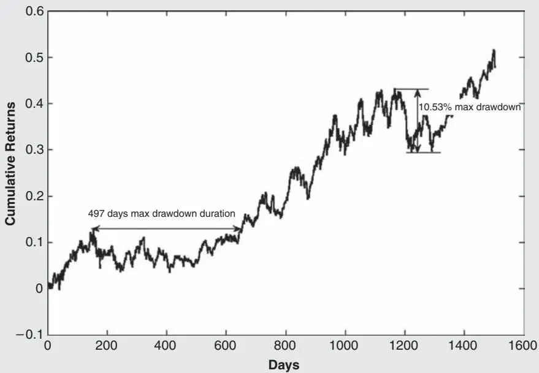

传统投资管理流程与量化投资流程的一个关键区别在于，量化投资策略可以进行回测（Backtesting），以检验其在过去的表现。即使你找到了一个描述详尽、历史绩效数据齐全的策略，你仍然需要自己进行回测。这项工作有多重目的。首先，复现研究过程可以确保你完全理解了策略，并精确地将其复现为可执行的交易系统（Trading System）。正如任何医学或科学研究一样，复现他人的结果也能确保原始研究没有犯下困扰这一过程的常见错误。但回测的意义不止于尽职调查，亲手进行回测还可以让你尝试原始策略的各种变体，从而对策略进行精炼和改进。

在本章中，我将介绍可用于回测的常见平台、对回测有用的各种历史数据来源、回测应提供的一组最低标准绩效指标、需要避免的常见陷阱，以及对策略的简单改进和优化。我还将展示几个完整的回测案例，以阐述所述的原理和技术。

## 常用回测平台

市面上有众多专为回测设计的商业平台，其中一些价格高达数万美元。为了与本书关注初创企业的定位保持一致，我将从我熟悉且可以经济购买、广泛使用的平台开始介绍。

### Excel

这是交易者——无论是散户还是机构——最基础也最常用的工具。如果你能编写Visual Basic宏，还可以进一步增强其功能。Excel的美妙之处在于"所见即所得"（WYSIWYG）。数据和程序都在同一个地方，没有任何隐藏。此外，一种常见的回测陷阱——"前视偏差"（Look-Ahead Bias，详见后文解释）——在Excel中不太可能发生（除非你使用宏，那就不再是所见即所得），因为你可以轻松地在电子表格中将日期与各种数据列和信号对齐。Excel的另一个优势在于，回测和实盘交易生成通常可以在同一个电子表格中完成，消除了重复编程的工作量。Excel的主要缺点是它只能用于回测相对简单的模型。但是，正如我在上一章所解释的，简单的模型往往就是最好的！

### MATLAB

MATLAB<sup>R</sup>（www.mathworks.com）是大型机构中量化分析师和交易者最常用的回测平台之一。它非常适合测试涉及大规模股票投资组合的策略。（想象一下用Excel回测一个涉及1,500只股票代码的策略——虽然可行，但相当痛苦。）MATLAB内置了大量高级统计和数学模块，因此如果交易算法涉及一些复杂但常见的数学概念，交易者无需重新发明轮子。

（一个很好的例子是主成分分析（Principal Component Analysis）——在统计套利（Statistical Arbitrage）交易的因子模型（Factor Model）中经常使用，而在其他编程语言中实现起来相当麻烦。参见[第7章](ch06.md)的示例7.4。）互联网上还有大量第三方免费软件可供下载，其中许多对量化交易非常有用（例如在示例7.2中使用的协整（Cointegration）软件包）。最后，MATLAB在获取包含金融信息的网页并将其解析为有用格式（即所谓的网络爬取（Web Scraping））方面非常有用。示例3.1展示了如何实现这一点。

尽管该平台看起来很复杂，但实际学起来非常容易（至少对于基本用法而言），使用该语言编写完整的回测程序也非常快。MATLAB的主要缺点是价格相对较高：获取许可证需要超过1,000美元。不过，市场上有几个MATLAB的克隆版本，你可以用它们编写和使用与MATLAB非常相似的代码：
 O-Matrix（www.omatrix.com）
 Octave（www.gnu.org/software/octave）
 Scilab（www.scilab.org）
这些克隆版本可能只需几百美元，或者完全免费。毫不奇怪，克隆版本越贵，与MATLAB程序的兼容性就越好。（当然，如果你打算自己编写所有程序而不使用任何第三方代码，兼容性就不是问题了。但那样你就放弃了使用该语言的主要优势之一。）MATLAB的另一个缺点是它对回测非常有用，但作为执行平台却很笨拙。因此，一旦完成了策略回测，你通常需要用另一种语言构建单独的执行系统。尽管有这些缺点，MATLAB在量化交易社区中已得到广泛使用。我将在本书的所有回测示例中包含MATLAB代码，并在附录中提供MATLAB语言本身的快速概览。

### 示例3.1：使用MATLAB从网页抓取金融数据

```matlab
MATLAB不仅对数值计算有用，对文本解析也很有用。下面是一个使用MATLAB从Yahoo! Finance获取股票历史价格信息的示例：
clear; % 确保之前定义的变量被清除。

symbol='IBM'; % 关注的股票
% 获取网页
historicalPriceFile =...
urlread(['http://finance.yahoo.com/q/hp?s=', symbol]);
% 将日期字段提取到元胞数组中
dateField=...
regexp(historicalPriceFile, ...
'<td class="yfnc_tabledata1" nowrap align="right">...
([\d\w-]+)</td>', 'tokens');
% 将数字字段提取到元胞数组中
numField=regexp(historicalPriceFile, ...
'<td class="yfnc_tabledata1" align="right">...
([\d\.]+)</td>', 'tokens');
% 转换为字符串元胞数组
dates=[dateField{:}]';
% 转换为字符串元胞数组
numField=[numField{:}]';
% 转换为双精度数组
op=str2double(numField (1:6:end)); % 开盘价
hi=str2double(numField (2:6:end)); % 最高价
lo=str2double(numField (3:6:end)); % 最低价
cl=str2double(numField (4:6:end)); % 收盘价
vol=str2double(numField (5:6:end)); % 成交量
adjCl=str2double(numField (6:6:end)); % 调整后收盘价
```
该程序文件可从 epchan.com/book/example3_1.m 下载，用户名和密码均为"sharperatio"。这个网络爬取脚本有一个局限性：它一次只能获取一个网页。由于Yahoo!将其历史数据分布在多个页面上，它并不适合获取IBM的完整价格历史。不过，它简单地展示了MATLAB的文本处理功能。

### TradeStation

TradeStation（www.tradestation.com）是许多散户交易者熟悉的券商，它提供与券商服务器相连的一体化回测和交易执行平台。这种设置的主要优势在于：
 回测所需的大部分历史数据都可以直接获取，而如果使用Excel或MATLAB，则需要从其他地方下载数据。

 一旦完成了程序回测，你可以立即使用同一程序生成订单并将其传输给券商。

这种方法的缺点是，一旦你为策略编写了软件，就会被绑定到TradeStation作为你的券商，而且TradeStation使用的专有语言不如MATLAB灵活，也不包含一些交易者使用的更高级的统计和数学函数。不过，如果你偏爱一体化系统的易用性，TradeStation可能是一个不错的选择。

由于我本人没有使用过TradeStation，我不会在书中包含TradeStation的回测示例。

### 高端回测平台

如果你确实有财力购买高端、机构级的回测平台，以下是部分列表：
 FactSet的Alpha Testing（www.factset.com/products/directions/ qim/alphatesting）
 Clarifi的ModelStation（www.clarifi.com/ModelStation-Overview.php）
 Quantitative Analytics的MarketQA（www.qaisoftware.com）
 Barra的Aegis System（www.mscibarra.com/products/analytics/ aegis）
 Logical Information Machines（www.lim.com）
 Alphacet的Discovery（www.alphacet.com）
在所有这些平台中，我只亲身使用过Logical Information Machines和Alphacet Discovery。根据我10年前的经验，Logical Information Machines在测试期货交易策略方面非常出色，但在股票策略方面较弱。Alphacet Discovery是一个新产品，集成了数据获取、回测、基于机器学习算法的优化以及自动执行功能。它在回测和交易包括期货、股票和货币在内的一系列市场方面功能非常强大。示例7.1是使用Discovery平台的回测示例。

## 查找和使用历史数据库

如果你心中有一个策略需要特定类型的历史数据，首先要做的就是在Google上搜索该类型的数据。你会惊讶地发现，网上有大量免费或低成本的历史数据库可供各种类型的数据使用。（例如，试试搜索"免费历史日内期货数据"。）表3.1列出了我多年来发现有用的许多数据库，其中大多数是免费或非常低成本的。我特意排除了来自Bloomberg、Dow Jones、FactSet、Thomson Reuters或Tick Data的昂贵数据库。虽然它们几乎提供了可以想象到的所有类型的数据供购买，但这些数据供应商主要服务于更成熟的机构，通常不在个人或初创机构的价格范围内。

虽然在网上查找数据源比寻找潜在策略更容易，但许多数据库存在一些问题和陷阱，我将在本节后面讨论。这些问题主要适用于股票和交易所交易基金（ETF）数据。以下是最重要的几个问题。

### 数据是否经过拆分和股息调整？

当一家公司进行了N比1的股票拆分（N通常为2，但也可以是0.5这样的分数。当N小于1时，称为反向拆分（Reverse Split）），除权日为T，那么T之前的所有价格都需要乘以1/N。类似地，当一家公司每股派发了$d的股息，除权日为T，那么T之前的所有价格都需要乘以（Close(T – 1) – d)/Close(T – 1)，其中Close(T – 1)是T前一个交易日的收盘价。注意，我通过乘以一个系数来调整历史价格，而不是减去$d，这样调整前后的每日收益率（Daily Return）将保持不变。这是Yahoo! Finance调整历史数据的方式，也是最常见的做法。（如果你通过减去$d来调整，调整前后的历史每日价格变化将保持不变，但每日收益率会改变。）如果历史数据未经调整，你会发现除权日开盘价相对于前一日收盘价出现下跌（除正常市场波动外），这可能触发错误的交易信号。

表3.1 回测用历史数据库
| 来源 | 优点 | 缺点 |
|------|------|------|
| 每日股票数据 |
| Finance.yahoo.com | 免费。经过拆分/股息调整。 | 存在生存偏差（Survivorship Bias）。一次只能下载一个代码。 |
| HQuotes.com | 低成本。数据与finance.yahoo.com相同。软件支持多代码下载。 | 存在生存偏差。经过拆分调整但未经过股息调整。 |
| CSIdata.com | 低成本。Yahoo!和Google历史数据的来源。软件支持多代码下载。 | 存在生存偏差。 |
| TrackData.com | 低成本。经过拆分/股息调整。软件支持多代码下载。提供基本面数据。 | 存在生存偏差。 |
| CRSP.com | 无生存偏差。每日期货数据 | 昂贵。每月仅更新一次。 |
| Quotes-plus.com | 低成本。软件支持多代码下载。 |  |
| CSIdata.com | （同上。）每日外汇数据 |  |
| Oanda.com | 免费。日内股票数据 |  |
| HQuotes.com | （同上。）日内期货数据 | 日内数据历史较短。 |
| DTN.com | 买卖价差（Bid-Ask Spread）数据历史作为NxCore产品的一部分提供。日内外汇数据 | 昂贵：需要订阅实时数据源。 |
| GainCapital.com | 免费。历史较长。 |  |
我建议获取已经过拆分和股息调整的历史数据，否则你需要单独查找一个拆分和股息的历史数据库（如earnings.com），并自行进行调整——这是一项繁琐且容易出错的工作，我将在下面的示例中进行说明。

### 示例3.2：拆分和股息调整

这里我们看看IGE，一个在历史上经历过拆分和股息的ETF。它在2005年6月9日（除权日）进行了一次2:1的拆分。让我们看看该日期前后的未调整价格（你可以从Yahoo! Finance下载IGE的历史价格到Excel电子表格中）：
| 日期 | 开盘 | 最高 | 最低 | 收盘 |
|------|------|------|------|------|
| 6/10/2005 | 73.98 | 74.08 | 73.31 | 74 |
| 6/9/2005 | 72.45 | 73.74 | 72.23 | 73.74 |
| 6/8/2005 | 144.13 | 146.44 | 143.75 | 144.48 |
| 6/7/2005 | 145 | 146.07 | 144.11 | 144.11 |
由于这次拆分，我们需要调整2005年6月9日之前的价格。这很简单：N = 2，我们只需要将这些价格乘以$\frac{1} {2}$。下表显示了调整后的价格：
| 日期 | 开盘 | 最高 | 最低 | 收盘 |
|------|------|------|------|------|
| 6/10/2005 | 73.98 | 74.08 | 73.31 | 74 |
| 6/9/2005 | 72.45 | 73.74 | 72.23 | 73.74 |
| 6/8/2005 | 72.065 | 73.22 | 71.875 | 72.24 |
| 6/7/2005 | 72.5 | 73.035 | 72.055 | 72.055 |
现在，细心的读者会注意到，这里的调整后收盘价与Yahoo! Finance表格中显示的调整后收盘价不一致。原因在于2005年6月9日之后还有股息分配，因此Yahoo!的价格已经对所有这些进行了调整。由于每次调整都是一个乘法因子，总调整因子就是所有个别因子的乘积。以下是2005年6月9日至2007年11月的股息，连同前一交易日的未调整收盘价和由此产生的个别调整因子：
| 除权日 | 股息 | 前收盘价 | 调整因子 |
|------|------|------|------|
| 9/26/2007 | 0.177 | 128.08 | 0.998618 |
| 6/29/2007 | 0.3 | 119.44 | 0.997488 |
| 12/21/2006 | 0.322 | 102.61 | 0.996862 |
| 9/27/2006 | 0.258 | 91.53 | 0.997181 |
| 6/23/2006 | 0.32 | 92.2 | 0.996529 |
| 3/27/2006 | 0.253 | 94.79 | 0.997331 |
| 12/23/2005 | 0.236 | 89.87 | 0.997374 |
| 9/26/2005 | 0.184 | 89 | 0.997933 |
| 6/21/2005 | 0.217 | 77.9 | 0.997214 |
（你可以在Excel上用我给出的公式自行验证这些调整因子是否与我这里给出的值一致。）因此，股息的总调整因子就是 $0 . 998618 \times 0 . 997488 \times \cdot \cdot \cdot \times 0 . 997214 =$ 0.976773。这个因子应应用于2005年6月9日及之后的所有未调整价格。股息和拆分的总调整因子为 $0 . 976773 \times 0 . 5 = 0 . 488386$，应应用于2005年6月9日之前的所有未调整价格。让我们看看应用这些因子后的调整价格：
| 日期 | 开盘 | 最高 | 最低 | 收盘 |
|------|------|------|------|------|
| 6/10/2005 | 72.26163 | 72.35931 | 71.6072 | 72.28117 |
| 6/9/2005 | 70.76717 | 72.02721 | 70.55228 | 72.02721 |
| 6/8/2005 | 70.39111 | 71.51929 | 70.20553 | 70.56205 |
| 6/7/2005 | 70.81601 | 71.33858 | 70.38135 | 70.38135 |
现在与Yahoo! 2007年11月1日前后的表格对比：
| 日期 | 开盘 | 最高 | 最低 | 收盘 | 成交量 | 调整收盘价 |
|------|------|------|------|------|------|------|
| 6/10/2005 | 73.98 | 74.08 | 73.31 | 74 | 179300 | 72.28 |
| 6/9/2005 | 72.45 | 73.74 | 72.23 | 73.74 | 853200 | 72.03 |
| 6/8/2005 | 144.13 | 146.44 | 143.75 | 144.48 | 109600 | 70.56 |
| 6/7/2005 | 145 | 146.07 | 144.11 | 144.11 | 58000 | 70.38 |
你可以看到，我们的计算结果与Yahoo!的调整后收盘价是一致的（四舍五入到两位小数后）。当然，当你读到这本书时，IGE可能已经分配了更多股息，甚至可能进一步拆分，因此你的Yahoo!表格看起来会与上面的不同。这是一个很好的练习：根据那些股息和拆分进行进一步调整，使结果与你当前Yahoo!表格中的调整价格一致。

### 数据是否无生存偏差？

我们在[第2章](ch02.md)已经讨论过这个问题。不幸的是，无生存偏差的数据库相当昂贵，初创企业可能难以承受。克服这个问题的一种方法是开始自己收集时点数据（Point-in-Time Data），以便将来进行回测。如果你每天将所有股票池中的价格保存到文件中，那么你将来就会拥有一个时点或无生存偏差的数据库可用。另一种减轻生存偏差影响的方法是在较近期的数据上进行回测，这样结果就不会因过多缺失股票而失真。

### 示例3.3：生存偏差如何人为夸大策略绩效的示例

这里有一个简单的"买入低价股"策略（警告：这个玩具策略对你的财务健康有害！）。假设从市值最大的1,000只股票组成的股票池中，我们在年初挑选收盘价最低的10只股票，持有（初始资金相等）一年。如果我们有一个无生存偏差的好数据库，看看我们会选到什么：
| 代码 | 2001年1月2日收盘价 | 2002年1月2日收盘价 | 最终价格 |
|------|------|------|------|
| ETYS | 0.2188 | NaN | 0.125 |
| MDM | 0.3125 | 0.49 | 0.49 |
| INTW | 0.4063 | NaN | 0.11 |
| FDHG | 0.5 | NaN | 0.33 |
| OGNC | 0.6875 | NaN | 0.2 |
| MPLX | 0.7188 | NaN | 0.8 |
| GTS | 0.75 | NaN | 0.35 |
| BUYX | 0.75 | NaN | 0.17 |
| PSIX | 0.75 | NaN | 0.2188 |
除了MDM之外，所有股票都在2001年1月2日至2002年1月2日期间退市了（毕竟，当时互联网泡沫正在严重破裂！）。NaN表示在2002年1月2日没有收盘价。"最终价格"列显示了股票在2002年1月2日或之前最后一次交易的价格。该投资组合在这一年的总回报为-42%。

现在，假设我们的数据库存在生存偏差，实际上遗漏了当年所有退市的股票。那么我们将会选到以下列表：
| 代码 | 2001年1月2日收盘价 | 2002年1月2日收盘价 |
|------|------|------|
| MDM | 0.3125 | 0.49 |
| ENGA | 0.8438 | 0.44 |
| NEOF | 0.875 | 27.9 |
| ENP | 0.875 | 0.05 |
| MVL | 0.9583 | 2.5 |
| URBN | 1.0156 | 3.0688 |
| FNV | 1.0625 | 0.81 |
| APT | 1.125 | 0.88 |
| FLIR | 1.2813 | 9.475 |
| RAZF | 1.3438 | 0.25 |
注意，由于我们只选择那些至少"存活"到2002年1月2日的股票，它们在该日都有收盘价。该投资组合的总回报为388%！

在这个示例中，-42%是交易者按照该策略实际会获得的回报，而388%是一个虚假的回报，是由我们数据库中的生存偏差造成的。

### 你的策略是否使用最高价和最低价数据？

几乎所有的每日股票数据中，最高价和最低价都比开盘价和收盘价噪声大得多。这意味着即使你在某日记录的最高价下方挂了限价买单，也可能无法成交，限价卖单也是如此。（这可能是因为在最高价处只成交了一笔很小的订单，或者成交发生在你的订单未路由到的市场上。有时，最高价或最低价仅仅是因为一个未被过滤的错误报价。）因此，依赖最高价和最低价数据的回测不如依赖开盘价和收盘价的回测可靠。

实际上，即使是开盘市场价单（MOO）或收盘市场价单（MOC），也可能不会按你数据中显示的历史开盘价和收盘价成交。这是因为显示的历史价格可能来自主交易所（例如纽约证券交易所（NYSE）），也可能是包含所有地区交易所的综合价格。根据你的订单路由到哪里，成交价可能与你数据集中显示的历史开盘价或收盘价不同。不过，开盘价和收盘价的差异对回测绩效的影响通常小于最高价和最低价中的误差，因为后者几乎总是会夸大你的回测收益。

从数据库获取数据后，通常建议进行快速的错误检查。最简单的方法是根据数据计算每日收益率（Daily Return）。如果你有开盘价、最高价、最低价和收盘价，你还可以计算各种组合的每日收益率，例如从前一交易日最高价到今日收盘价的收益率。然后，你可以仔细检查那些收益率偏离平均值例如4个标准差（Standard Deviation）的日期。通常，极端收益率应该伴随着新闻公告，或者发生在市场指数也经历了极端收益率的日子里。如果没有，那么你的数据就值得怀疑。

## 绩效衡量

量化交易者使用多种多样的绩效衡量指标。使用哪组数字有时是个人偏好问题，但考虑到便于在不同策略和交易者之间进行比较，我认为夏普比率（Sharpe Ratio）和最大回撤（Maximum Drawdown）是最重要的两个指标。注意我没有包括年化平均收益率——这是投资者最常引用的衡量指标——因为如果你使用这个指标，你必须告诉人们关于计算收益率所用分母的许多事情。例如，在多空策略（Long-Short Strategy）中，你是在分母中只使用了一侧资金还是两侧资金？收益率是杠杆化的（分母基于账户权益）还是非杠杆化的（分母基于投资组合市值）？如果权益或市值每天都在变化，你是使用移动平均值作为分母，还是只使用每天或每月末的数值？通过引用夏普比率和最大回撤作为标准绩效指标，可以避免大多数（但非全部）与比较收益率相关的问题。

我在[第2章](ch02.md)介绍了夏普比率、最大回撤和最大回撤持续时间的概念。在这里，我将只说明计算夏普比率时需要注意的一些微妙之处，并给出Excel和MATLAB的计算示例。

有一个微妙之处经常让即使经验丰富的投资组合经理在计算夏普比率时也感到困惑：对于美元中性（Dollar Neutral）投资组合，我们应该从回报中减去无风险利率（Risk-Free Rate）吗？答案是否定的。美元中性投资组合是自我融资的，意味着你卖空所得现金用于购买多头证券，因此融资成本（由于借贷利率差）很小，在许多回测目的中可以忽略不计。同时，你必须维持的保证金余额所赚取的贷方利息接近无风险利率$r_{F}$。假设策略回报（投资组合回报减去贷方利息的贡献）为$R$，无风险利率为$r_{F}$。那么计算夏普比率所用的超额回报（Excess Return）为$R + r_{F} - r_{F} = R$。因此，本质上你可以在整个计算中忽略无风险利率，只关注你的股票头寸所产生的回报。

类似地，如果你有一个只做多的日内交易策略（Day Trading），不持仓过夜，你同样不需要从策略回报中减去无风险利率来获得超额回报，因为在这种情况下你也没有融资成本。一般来说，只有在你的策略产生融资成本时，才需要从策略回报中减去无风险利率来计算夏普比率。

为了进一步方便策略之间的比较，大多数交易者将夏普比率年化。大多数人都知道如何年化平均收益率。例如，如果你使用的是月度收益率，那么年化平均收益率就是月度平均收益率的12倍。

然而，年化收益率的标准差（Standard Deviation）稍微复杂一些。在假设月度收益率序列不相关（Sharpe, 1994）的基础上，年度收益率标准差是月度标准差的$\sqrt{12}$倍。因此，总的来说，年化夏普比率将是月度夏普比率的$\sqrt{12}$倍。

一般来说，如果你基于某个交易周期$T$（无论$T$是一个月、一天还是一小时）计算收益率的均值和标准差，并且你想年化这些量，你首先需要找出一年中有多少个这样的交易周期（记为$N_{T}$）。那么
年化夏普比率 $= \sqrt{N_{T}} \times$ 基于$T$的夏普比率
例如，如果你的策略只在NYSE交易时段（9:30-16:00 ET）持仓，平均小时收益率为$R$，小时收益率标准差为s，那么年化夏普比率为 ${\sqrt{1638}} \times R / s$。这是因为N = (252个交易日) × (每个交易日6.5小时) = 1,638。（一个常见错误是将$N_{T}$计算为$252 \times 24 = 6 , 048$。）

### 示例3.4：多头策略与市场中性策略的夏普比率计算

让我们计算IGE的一个简单多头策略的夏普比率：从2001年11月26日收盘买入并持有一股，到2007年11月14日收盘卖出。假设此期间的平均无风险利率为每年4%。你可以从Yahoo! Finance下载每日价格，指定所需的日期范围，并将其存储为Excel文件（不是默认的逗号分隔文件），命名为IGE.xls。接下来的步骤可以在Excel或MATLAB中完成：

### 使用Excel

1. 文件下载后应已包含A-G列。

2. 按日期升序对所有列排序（使用"数据-排序"功能，选择"扩展选定区域"单选按钮，选择"升序"以及"数据包含标题行"单选按钮）。

3. 在单元格H3中输入" (G3-G2)/G2"。这是每日收益率。

4. 双击单元格H3右下角的小黑点，将用IGE的每日收益率填充整个H列。

5. 为了清晰起见，你可以在标题单元格H1中输入"Dailyret"。

6. 在单元格I3中输入" H3-0.04/252"，这是超额每日收益率，假设每年4%的无风险利率和一年252个交易日。

7. 双击单元格I3右下角的小黑点，将用超额每日收益率填充整个I列。

8. 为了清晰起见，在标题单元格I1中输入"Excess Dailyret"。

```txt
9. 在单元格I1506（下一列的最后一行）中输入"=SQRT(252)*AVERAGE(I3:I1505)/STDEV(I3:I1505)"。
```
10. 单元格I1505中显示的数字应为"0.789317538"，这就是该买入持有策略（Buy and Hold）的夏普比率。

完成的电子表格可在我的网站 epchan.com/book/example34.xls 下载。

### 使用MATLAB

```matlab
% 确保之前定义的变量被清除。
clear;
% 将名为"IGE.xls"的电子表格读入MATLAB。
[num, txt]=xlsread('IGE');
% 第一列（从第二行开始）
% 包含格式为mm/dd/yyyy的交易日。
tday=txt(2:end, 1);
% 将格式转换为yyyyMMdd。
tday=datestr(datenum(tday, 'mm/dd/yyyy'), 'yyyymmdd');
% 将日期字符串先转换为元胞数组，
% 然后转换为数值格式。
tday=str2double(cellstr(tday));
% 最后一列包含调整后收盘价。
cls=num(:, end);
% 将tday按升序排列。
[tday sortIndex]=sort(tday, 'ascend');
% 将cls按日期升序排列。
cls=cls(sortIndex);
% 每日收益率
dailyret=(cls(2:end)-cls(1:end-1))./cls(1:end-1);
% 假设无风险利率为每年4%
% 一年252个交易日的超额每日收益率
excessRet=dailyret - 0.04/252;
% 输出应为0.7893
sharpeRatio=sqrt(252)*mean(excessRet)/std(excessRet)
```
这段MATLAB代码也可从我的网站下载（epchan.com/book/example34.m）。

现在让我们计算多空市场中性策略（Market-Neutral Strategy）的夏普比率。实际上，这是上述买入持有策略的一个非常简单的变体：在我们买入IGE的同时，假设我们卖空了等金额的标准普尔存托凭证（SPY）作为对冲（Hedge），并在2007年11月同时平仓。你也可以从Yahoo! Finance下载SPY并将其存储在文件SPY.xls中。你可以按照与上面非常类似的步骤在Excel和MATLAB中操作，我将留作读者练习来执行具体步骤：

### 使用Excel

1. 与上面一样，按日期升序对SPY.xls中的列排序。

2. 复制SPY.xls中的G列（调整收盘价），粘贴到上述IGE.xls的J列。

3. 检查J列是否与A-I列具有相同的行数。如果不是，你有一组不同的日期——确保你从Yahoo!下载了匹配的日期范围。

4. 执行与上面相同的步骤，在K列中计算每日收益率。

5. 为了清晰起见，在K列标题中输入"dailyretSPY"。

6. 在L列中，计算对冲策略的净收益率，即H列与K列之差除以2。（除以2是因为我们现在有两倍的资金。）
7. 在单元格L1506中，计算该对冲策略的夏普比率。你应该得到"0.783681"。

### 使用MATLAB

```matlab
% 假设这是上述MATLAB代码的延续。

% 在此插入你自己的代码来从
% SPY.xls获取数据，方法同上。

% 将包含SPY每日收益率的数组
% 命名为"dailyretSPY"。

% 净每日收益率（除以2是因为我们现在有两倍的资金。）
netRet=(dailyret - dailyretSPY)/2;
```
```txt
% 输出应为0.7837。
sharpeRatio=sqrt(252)*mean(excessRet)/std(excessRet)
```

### 示例3.5：最大回撤和最大回撤持续时间的计算

我们将继续上面的多空市场中性示例，以说明最大回撤和最大回撤持续时间的计算。此计算的第一步是计算每天收盘时的"高水位线"（High Watermark），即截至该时间策略的最大累计收益。（使用累计收益率曲线来计算高水位线和回撤，等同于使用权益曲线（Equity Curve），因为权益不过是初始投资乘以1加上累计收益率。）从高水位线出发，我们可以计算回撤、最大回撤和最大回撤持续时间。

### 使用Excel

1. 在单元格M3中输入$" = \mathsf{L} 3 " .$
2. 在单元格M4中输入 $\overset{\scriptscriptstyle 4 \cdot} {\mathop{=}} ( 1 + \mathsf{M} 3 ) ^{*} ( 1 + \mathsf{L} 4 )  – 1^{\prime}$ 。这是策略截至该日的累计复合收益率。用策略的累计复合收益率填充整个M列，并删除该列的最后一个单元格。将此列命名为Cumret。

3. 在单元格 $\mathsf{N} 3 , \mathsf{t y p e \} ^{\ast} {=} \mathsf{M} 3^{\prime \prime} .$
4. 在单元格N4中输入" MAX(N3, M4)"。这是截至该日的高水位线。用策略的滚动高水位线填充整个N列，并删除该列的最后一个单元格。将此列命名为High watermark。

5. 在单元格O3中输入" (1 N3)/(1 M3)-1"。这是该日收盘时的回撤。用策略的回撤填充整个O列。

6. 在单元格O1506中输入" MAX(O3:O1505)"。这是策略的最大回撤。其值应约为0.1053，即最大回撤为10.53%。

7. 在单元格P3中输入" IF(O30, 0, P21)"。这是当前回撤的持续时间。用策略的回撤持续时间填充整个P列，并删除该列的最后一个单元格。

8. 在单元格P1506中输入" MAX(P3:P1505)"。这是策略的最大回撤持续时间。其值应为497，即最大回撤持续时间为497个交易日。

### 使用MATLAB

```matlab
% 假设这是上述MATLAB代码的延续。

% 累计复合收益率
cumret=cumprod(1+netRet)-1;
plot(cumret);
[maxDrawdown maxDrawdownDuration]=...
calculateMaxDD(cumret);
% 最大回撤。输出应为0.1053
maxDrawdown
% 最大回撤持续时间。输出应为497。
maxDrawdownDuration
```
注意上面的代码片段调用了一个函数"calculateMaxDrawdown"，我在下面展示该函数。

```matlab
function [maxDD maxDDD]=calculateMaxDD(cumret)
% [maxDD maxDDD]=calculateMaxDD(cumret)
% 基于累计复合收益率计算最大回撤和最大回撤
% 持续时间。

% 将高水位线初始化为零。
highwatermark=zeros(size(cumret));
% 将回撤初始化为零。
drawdown=zeros(size(cumret));
% 将回撤持续时间初始化为零。
drawdownduration=zeros(size(cumret));
for t=2:length(cumret)
    highwatermark(t)=...
max(highwatermark(t-1), cumret(t));
    % 每日回撤
    drawdown(t)=(1+highwatermark(t))/(1+cumret(t))-1;
    if (drawdown(t)==0)
    drawdownduration(t)=0;
    else
    drawdownduration(t)=drawdownduration(t-1)+1;
    end
end
maxDD=max(drawdown); % 最大回撤
% 最大回撤持续时间
maxDDD=max(drawdownduration);
```
包含此函数的文件可从 epchan.com/book/calculateMaxDD.m 获取。你可以看到最大回撤和最大回撤持续时间发生在这张累计收益率图中的什么位置。


图3.1 示例3.4的最大回撤和最大回撤持续时间

## 需要避免的常见回测陷阱

回测是根据当时可用的历史信息创建历史交易，然后找出这些交易后续表现的过程。在我们的情况下，交易是通过计算机算法进行的，这个过程看起来很简单，但它有无数种可能出错的方式。通常，错误的回测会产生比实际交易中获得的更好的历史绩效。我们已经看到了回测中使用的数据的生存偏差如何导致绩效虚高。然而，还有其他与回测程序编写方式相关的常见陷阱，或者更根本地说，与你构建交易策略的方式相关的陷阱。我将在这里描述两个最常见的陷阱，以及避免它们的技巧。

### 前视偏差

这个错误指的是你使用了在交易执行时刻之后才可获得的信息的情况。例如，如果你的交易入场规则是："当股票价格低于当日最低价1%时买入"，你就引入了前视偏差，因为你在当天收盘之前不可能知道当日的最低价是什么。另一个例子：假设一个模型涉及两个价格序列的线性回归拟合。如果你使用从整个数据集获得的回归系数来确定每日交易信号，你就再次引入了前视偏差。

我们如何避免前视偏差？在每一个可能的机会都使用滞后的历史数据来计算信号。滞后一个数据序列意味着你只基于前一个交易周期收盘时的数据来计算所有量，如移动平均（Moving Average）、最高价和最低价，甚至成交量。（当然，如果你的策略只在周期收盘时入场，就不需要滞后数据。）
使用Excel或其他WYSIWYG程序比使用MATLAB更容易避免前视偏差。这是因为在Excel中很容易对齐所有不同的数据列，并确保每个单元格中的公式都基于当前行之上的行来计算。借助Excel的单元格高亮功能，当使用当天的数据生成信号时，在视觉上是显而易见的。（双击带有公式的单元格会高亮该公式所使用的数据单元格。）使用MATLAB时，你需要更加小心，记住对用于信号生成的某些序列运行滞后函数。

即使在创建无前视偏差的回测程序时采取了所有谨慎和小心的措施，有时我们仍可能让一些前视偏差溜进来。一些前视偏差在本质上相当微妙，不容易避免，特别是如果你使用MATLAB的话。

最好使用以下方法对你的MATLAB回测程序进行最终检查：使用所有历史数据运行程序；生成并将结果头寸文件保存为文件A（头寸文件是包含程序每天生成的所有推荐头寸的文件）。现在截断你的历史数据，移除最近的部分（比如N天）。所以如果原始数据中的最后一天是T，那么截断数据中的最后一天应该是T-N。N可以是10天到100天。现在使用截断数据再次运行回测程序，并将结果头寸保存到新文件B中。截断头寸文件A中最近的N行，使A和B具有相同数量的行（天），并且文件A和B中的最后一天都应该是T-N。最后，检查A和B在头寸上是否完全相同。如果不是，你的回测程序中存在前视偏差，你必须找到并修正它，因为头寸的差异意味着你在确定文件A中的头寸时无意中使用了截断部分的历史数据（即T-N日之后的部分）。我将在示例3.6的末尾说明这个有些复杂的过程。

### 数据窥探偏差

在[第2章](ch02.md)中，我提到了数据窥探偏差（Data-Snooping Bias）——回测绩效相对于策略未来绩效被夸大的危险，因为我们基于历史数据中的瞬态噪声过度优化了模型参数。数据窥探偏差在历史数据预测统计模型的领域中普遍存在，但在金融领域尤其严重，因为我们拥有的独立数据量有限。高频数据（High-Frequency Data）虽然供应充足，但只对高频模型有用。虽然我们拥有可以追溯到二十世纪初的股票市场数据，但只有过去10年内的数据才真正适合构建预测模型。此外，正如[第2章](ch02.md)所讨论的，状态转换（Regime Shift）可能使即使只有几年历史的数据也因过时而无法用于回测。你拥有的独立数据越少，你的交易模型中应该使用的可调参数就越少。

作为经验法则，我不会使用超过五个参数，包括入场和出场阈值（Threshold）、持有期，或计算移动平均时的回溯期（Lookback Period）。此外，并非所有的数据窥探偏差都源于参数优化。在创建交易模型时做出的众多选择都可能受到在同一数据集上反复回测的影响——例如选择在开盘还是收盘入场、是否持仓过夜、交易大盘股还是中盘股等决策。通常，这些定性决策是为了优化回测绩效而做出的，但它们在未来可能并非最优。只要我们在构建数据驱动的模型，就几乎不可能完全消除数据窥探偏差。然而，有方法可以减轻这种偏差。

样本量（Sample Size）防止数据窥探偏差最基本的保障是确保你拥有足够的回测数据来与你想优化的自由参数数量相匹配。作为经验法则，让我们假设优化参数所需的数据点数量等于模型自由参数数量的252倍。（这种比例假设不是基于对大量统计文献的调研，而是纯粹基于经验。）例如，假设你有一个包含三个参数的每日交易模型。那么你应该至少拥有三年的每日价格回测数据。但是，如果你有一个每分钟更新头寸的三参数交易模型，那么你应该至少有252/390年，大约七个月的一分钟回测数据。（注意，如果你有一个每日交易模型，那么即使你有七个月的逐分钟数据点，实际上你只有约721/47个数据点，远远不够测试一个三参数模型。）
样本外测试（Out-of-Sample Testing）将你的历史数据分为两部分。将第二部分（较近期的数据）保留用于样本外测试。在构建模型时，在第一部分（称为训练集（Training Set））上优化参数和其他定性决策，但在第二部分（称为测试集（Test Set））上测试所得模型。（两部分的大小应大致相等，但如果训练数据不足，我们至少应有训练数据三分之一的测试数据。训练集的最小大小由上一节的经验法则决定。）理想情况下，回测期第一部分的最优参数和决策集合也是第二部分的最优集合，但事情很少如此完美。第二部分数据上的表现至少应该是合理的。否则，模型就内置了数据窥探偏差，解决方法之一是简化模型并消除一些参数。

一种更严格（尽管计算量更大）的样本外测试方法是使用参数的滚动优化（Moving Optimization）。在这种情况下，参数本身不断适应变化的历史数据，从而消除了参数方面的数据窥探偏差。（参见关于无参数交易模型的专栏。）

### 无参数交易模型 \*

我曾经工作过的一位投资组合经理喜欢自豪地宣称他的交易模型"没有自由参数"。按照我们行业的保密传统，他不会进一步透露他的技术。

最近，我开始理解无参数交易模型的含义。它并不意味着模型不包含例如用于计算趋势的回溯期或入场/出场阈值。我认为那是不可能的。它只是意味着所有这些参数都在滚动回溯窗口中动态优化。这样，如果你问"模型有固定的利润上限吗？"，交易者可以诚实地回答："没有，利润上限不是输入参数。它由模型本身决定。"
无参数交易模型的优势在于它最大限度地降低了模型过度拟合多个输入参数的危险（即所谓的"数据窥探偏差"）。因此，回测绩效应该更接近实际的未来绩效。

（注意，参数优化并不一定意味着挑选一组给出最佳回测绩效的最佳参数。通常，基于不同参数集合的某种平均值来做交易决策会更好。）
现在，要优化所有这些参数以在你的下一个订单之前及时完成，在计算上是相当具有挑战性的，但在回测中做这件事往往更加困难，因为需要对每个历史柱线执行多维优化。因此，我个人很少交易无参数模型，直到我研究了示例7.1中描述的状态转换模型。该模型几乎是无参数的（我因为时间不足而省略了几个参数的优化，而不是因为任何技术困难）。我是如何在这种情况下在几分钟内完成回测参数优化的？我使用了一个高端回测平台（Alphacet Discovery）。

\*本节改编自我的博客文章"Parameterless Trading Models"，你可以在 epchan.blogspot.com/2008/05/parameterless-trading-models.html 找到。

最终的样本外测试对许多交易者来说都很熟悉，它被称为模拟交易（Paper Trading）。在实际未见过的数据上运行模型是测试它最可靠的方式（仅次于实际交易）。模拟交易不仅让你进行真正诚实的样本外测试；它还常常让你发现程序中的前视错误，并让你意识到各种操作问题。我将在[第5章](ch05.md)讨论模拟交易。

如果你正在测试的策略来自已发表的来源，你只是进行回测以验证结果是否正确，那么从发表时间到你测试策略的时间之间的整个时间段就是一个真正的样本外期间。只要你没有在样本外期间优化已发表模型的参数，这个期间就和模拟交易该策略一样好。

## 示例3.6：GLD和GDX的配对交易

本示例将说明如何将数据分为训练集和测试集。我们将回测一个配对交易策略，在训练集上优化其参数，并观察在测试集上的效果。

GLD和GDX是配对交易的良好候选对象，因为GLD反映黄金的现货价格（Spot Price），而GDX是一篮子黄金矿业股票。它们的价格应该同步变动，这在直觉上是合理的。我曾在博客上广泛讨论过这对ETF的协整分析（例如，参见 epchan.blogspot.com/2006/11/reader-suggested-possible-trading.html）。不过，我将把训练集上的协整分析推迟到[第7章](ch06.md)，该分析证明做多GLD和做空GDX形成的价差（Spread）是均值回归（Mean Reverting）的。相反，我们将在训练集上进行回归分析以确定GLD和GDX之间的对冲比率（Hedge Ratio），然后定义配对交易策略的入场和出场阈值。我们将看到在训练集上优化这些阈值如何改变测试集上的表现。（该程序可在 epchan.com/book/example36.m 获取。数据文件为GDX.xls和GLD.xls。该程序使用了一个lag1函数将时间序列滞后一个时间周期，该函数也包含在 epchan.com/book 中。它还使用了一个用于线性回归的函数"ols"，这是从spatialeconometrics.com下载的免费软件包的一部分。）

### 使用MATLAB

```matlab
% 确保之前定义的变量被清除。
clear;
% 将名为"GLD.xls"的电子表格读入MATLAB。
[num, txt]=xlsread('GLD');
% 第一列（从第二行开始）是
% 格式为mm/dd/yyyy的交易日。
tday1=txt(2:end, 1);
% 将格式转换为yyyyMMdd。
tday1=...
datestr(datenum(tday1, 'mm/dd/yyyy'), 'yyyymmdd');
% 将日期字符串先转换为元胞数组，
% 然后转换为数值格式。
tday1=str2double(cellstr(tday1));
% 最后一列包含调整后收盘价。
adjcls1=num(:, end);
% 将名为"GDX.xls"的电子表格读入MATLAB。
[num, txt]=xlsread('GDX');
% 第一列（从第二行开始）是
% 格式为mm/dd/yyyy的交易日。
tday2=txt(2:end, 1);
% 将格式转换为yyyyMMdd。
tday2=...
datestr(datenum(tday2, 'mm/dd/yyyy'), 'yyyymmdd');
% 将日期字符串先转换为元胞数组，
% 然后转换为数值格式。
tday2=str2double(cellstr(tday2));
```
```matlab
% 最后一列包含调整后收盘价。
adjcls2=num(:, end);
% 找到两个数据集的交集，
% 并按升序排列
[tday, idx1, idx2]=intersect(tday1, tday2);
cl1=adjcls1(idx1);
cl2=adjcls2(idx2);
trainset=1:252; % 定义训练集的索引
% 定义测试集的索引
testset=trainset(end)+1:length(tday);
% 在训练集上确定对冲比率
% 使用回归函数
results=ols(cl1(trainset), cl2(trainset));
hedgeRatio=results.beta;
% 价差 = GLD - hedgeRatio*GDX
spread=cl1-hedgeRatio*cl2;
plot(spread(trainset));
figure;
plot(spread(testset));
figure;
% 训练集上价差的均值
spreadMean=mean(spread(trainset));
% 训练集上价差的标准差
spreadStd=std(spread(trainset));
% 价差的z分数（Z-Score）
zscore=(spread - spreadMean)./spreadStd;
% 当价差值跌破2个标准差时买入价差。
longs=zscore<=-2;
% 当价差值升破2个标准差时卖空价差。
shorts=zscore>=2;
% 当价差值回到均值1个标准差内时平仓。
exits=abs(zscore)<=1;
% 初始化头寸数组
positions=NaN(length(tday), 2);
```
```matlab
% 多头入场
positions(shorts, :) = ...
repmat([-11], [length(find(shorts)) 1]);
% 空头入场
positions(longs, :) = repmat([1 -1],
    [length(find(longs)) 1]);
% 平仓
positions(exits, :) = zeros(length(find(exits)), 2);
% 确保持有头寸持续，
% 除非有出场信号
positions=
    fillMissingData(positions);
cl=[cl1 cl2]; % 合并两个价格序列
dailyret=(cl - lag1(cl))./lag1(cl);
pnl=sum(lag1(positions).*dailyret, 2);
% 训练集上的夏普比率应约为2.3
sharpeTrainset = ...
sqrt(252)*mean(pnl(trainset(2:end))). /std(pnl(trainset(2:end)))
% 测试集上的夏普比率应约为1.5
sharpeTestset=sqrt(252)*mean(pnl(testset)).
/std(pnl(testset))
plot(cumsum(pnl(testset)));
% 保存头寸文件用于检查前视偏差。
save example3_6_positions positions;
```
在文件lag1.m中：
```matlab
function y = lag1(x)
% y = lag(x)
if (isnumeric(x))
    % 将第一个条目填充为NaN
    y = [NaN(1, size(x, 2)); x(1: end-1, :)]; elseif (ischar(x))
    % 将第一个条目填充为"
    y = [repmat(", [1 size(x, 2)]); x(1: end-1, :)]; else
    error('Can only be numeric or char array');
end
```
这个配对交易策略在训练集和测试集上都有出色的夏普比率。因此，该策略可以被认为没有数据窥探偏差。不过，还有改进空间。让我们看看如果我们将入场阈值改为1个标准差、出场阈值改为0.5个标准差会发生什么。在这种情况下，训练集上的夏普比率提高到2.9，测试集上的夏普比率提高到2.1。所以，显然这组阈值更好。

然而，通常在训练集上优化参数可能会降低测试集上的表现。在这种情况下，你应该选择一组在训练集和测试集上都能产生良好（但可能不是最佳）表现的参数。

我没有将交易成本（我将在下一节讨论）纳入此分析。你可以尝试将其作为练习添加。由于该策略交易频率不高，交易成本对最终的夏普比率影响不大。

要了解该策略为何有效，只需查看图7.4中的价差，我将在[第7章](ch06.md)讨论平稳性（Stationarity）和协整时讨论它。你可以看到价差表现出高度均值回归的特征。因此，在这里反复低买高卖效果很好。

不过，在宣称这是一个成功之前，我们还应该进行最后一项检查：我们需要检查回测程序中是否存在任何前视偏差。在上述MATLAB代码的"cl2 adjcls2(idx2);"行之后添加以下代码片段：
```matlab
% 要截断的最近交易日数量
cutoff=60;
% 移除最后cutoff天的数据。
tday(end-cutoff+1:end, :)=[];
cl1(end-cutoff+1:end, :)=[];
cl2(end-cutoff+1:end, :)=[];
```
在上述MATLAB程序的最末尾添加以下代码片段，替换"save example36 positions positions"这一行。

```matlab
% 前视偏差检查的第二步
oldoutput=load('example3_6_positions');
oldoutput.position(end-cutoff+1:end, :) = [];
if (any(positions~=oldoutput.positions))
    fprintf(1, '程序存在前视偏差！\n');
end
```
将此新程序保存到文件"example361.m"中并运行。你会发现"程序存在前视偏差"这句话没有被打印出来——这表明我们的算法通过了测试。

敏感性分析（Sensitivity Analysis）一旦你优化了参数以及模型的各种特征，并验证了其在测试集上的表现仍然合理，就对这些参数或模型特征做一些小的定性改变，观察在训练集和测试集上的表现如何变化。如果下降如此剧烈，以至于除了最优参数集之外的任何参数集都不可接受，那么该模型很可能存在数据窥探偏差。

有些模型变体特别值得尝试：各种简化模型的方法。你真的需要五个不同的条件来决定是否进行那笔交易吗？如果你逐一消除这些条件——在什么点上训练集的表现会恶化到不可接受的水平？更重要的是：当你消除这些条件时，测试集的表现是否有相应的下降？一般来说，只要测试集上的表现没有显著下降，就应该尽可能多地消除条件、约束和参数，即使它可能会降低训练集上的表现。（但你不应该为了提高测试集上的表现而添加条件和参数，或调整参数值：如果你这样做了，你就实际上将测试集用作了训练集，可能会重新引入数据窥探偏差。）
当触发交易的参数和条件集合缩减到最小，并且在确认这些参数和条件的小幅变化不会显著改变样本外表现之后，应该考虑在不同的参数值和条件集合之间分配交易资金。这种参数平均化将进一步确保模型的实际交易表现不会偏离回测结果太多。

## 交易成本

不纳入交易成本的回测绩效是不切实际的。我在[第2章](ch02.md)讨论了各种类型的交易成本（佣金（Commission）、流动性成本（Liquidity Cost）、机会成本（Opportunity Cost）、市场冲击（Market Impact）和滑点（Slippage）），并给出了如何将交易成本纳入策略回测的示例。发现一个在加入交易成本之前夏普比率很高的策略在加入成本后变得非常无利可图，不应该让你感到惊讶。我将在示例3.7中说明这一点。

## 示例3.7：一个简单的均值回归模型——有和没有交易成本的情况

这里有一个简单的均值回归（Mean-Reverting）模型，由MIT的Amir Khandani和Andrew Lo提出（可在 web.mit.edu/alo/www/Papers/august07.pdf 获取）。该策略非常简单：买入前一日表现最差的股票，卖空前一日表现最好的股票。尽管极其简单，该策略自1995年以来表现优异，忽略交易成本（2006年的夏普比率为4.47）。我们的目标是找出如果假设标准的每笔交易5个基点（Basis Point）的交易成本，其在2006年的表现会如何。（一笔交易定义为买入或卖空，不是往返交易。）这个示例策略不仅让我们说明交易成本的影响，还展示了MATLAB在回测交易多种证券的模型方面的强大功能——换句话说，一个典型的统计套利模型。在Excel中回测涉及大量股票代码、跨越多年的模型通常过于繁琐。但即使假设有MATLAB可用，仍然存在如何获取数百个股票代码的历史数据的问题，特别是无生存偏差的数据。在这里，我们将暂且搁置生存偏差的问题，因为这类数据价格昂贵，只需记住我们获得的任何绩效估计都是策略实际表现的上限。

每当要回测一个选股策略时，第一个问题总是：哪个股票池？典型的起点是S&P 500股票池，这是可用的最流动的股票集合。S&P 500的当前股票列表可从标准普尔网站（www.standardandpoors.com）下载。由于该股票池的成分不断变化，你下载的列表将与我的不同。为了方便比较，你可以找到我的列表保存在 epchan.com/book/SP50020071121.xls。下载所有这些股票历史数据最简单的方法是购买一份HQuote Pro软件（本章前面提到过，可从HQuote.com获取。）这是由于我们回测中使用了S&P 500这个大盘股股票池。如果你阅读原作者的论文，你会发现大部分回报来自小盘股和微盘股。

```matlab
该软件可以方便地让你剪切粘贴任何你想要数据的股票代码列表。在软件中对你的列表运行更新以获取从2000年1月1日到现在的数据，然后将这些数据导出到一个名为"Export.txt"的单个文本文件中，只选择Date、Open、High、Low、Close和Volume列，不包含标题。现在，使用以下MATLAB程序（epchan.com/book/retrieveHQuoteHistoricalPrice.m）将这些数据解析为对我们计算有用的形式，并将其保存到本地目录的二进制文件"SPX_20071123.mat"中：
clear;
inputFile='Export.txt';
outputFile='SPX_20071123';
[mysym, mytday, myop, myhi, mylo, mycl, myvol]=...
textread(inputFile, '%s %u %f %f %f %f %u', ...
'delimiter', ',' );
% 由于单个文件包含多个股票代码，
% 我们需要找到唯一的股票代码集合。
stocks=unique(mysym);
% 由于单个文件包含多个股票代码的
% 重复日期集合，我们需要找到唯一的日期集合。
tday=unique(mytday);
op=NaN(length(tday), length(stocks));
hi=NaN(length(tday), length(stocks));
lo=NaN(length(tday), length(stocks));
cl=NaN(length(tday), length(stocks));
vol=NaN(length(tday), length(stocks));
for s=1:length(stocks)
    stk=stocks{s};
    % 找到具有当前股票代码的数据的
    % 位置（索引）。
idxA=strmatch(stk, mysym, 'exact');
    % 找到具有当前日期集合的数据的
    % 位置（索引）。
    [foo, idxA, idxB]=intersect(mytday(idxA), tday);
    % 从下载的数据中提取当前股票代码的价格集合
```
```matlab
    op(idxtB, s)=myop(idxA(idxtA));
    hi(idxtB, s)=myhi(idxA(idxtA));
    lo(idxtB, s)=mylo(idxA(idxtA));
    cl(idxtB, s)=mycl(idxA(idxtA));
    vol(idxtB, s)=myvol(idxA(idxtA));
end
save(outputFile, 'tday', 'stocks', 'op', 'hi', ...
    'lo', 'cl', 'vol');
```
接下来，我们可以使用这个历史数据集来回测不考虑交易成本的均值回归策略：
```matlab
clear;
startDate=20060101;
endDate=20061231;
load('SPX_20071123', 'tday', 'stocks', 'cl');
% 每日收益率
dailyret=(cl-lag1(cl))./lag1(cl);
% 等权市场指数收益率
marketDailyret=smartmean(dailyret, 2);
% 股票权重与偏离市场指数的
% 负距离成正比。
weights=...
-(dailyret-repmat(marketDailyret,[1 size(dailyret,2)]))./
repmat(smartsum(isfinite(cl), 2), ...
[1 size(dailyret, 2)]);
% 排除没有有效价格或
% 每日收益率的股票。
weights(~isfinite(cl) | ~isfinite(lag1(cl)))=0;
dailypnl=smartsum(lag1(weights).*dailyret, 2);
% 移除我们关注日期范围之外的盈亏
dailypnl(tday < startDate | tday > endDate) = [];
% 夏普比率应约为0.25
sharpe=...
sqrt(252)*smartmean(dailypnl, 1)/smartstd(dailypnl, 1)
```
该文件保存为 epchan.com/book/example3_7.m。注意2006年的夏普比率仅为0.25，而不是原作者声称的4.47。这种大幅降低的表现的原因是...（原文截断）
在这个MATLAB程序中，我使用了三个新函数："smartsum"、"smartmean"和"smartstd"。它们与通常的"sum"、"mean"和"std"函数非常相似，只是它们跳过数据中的所有NaN条目。这些函数在回测中非常有用，因为股票的价格序列经常有起始和终止。这些文件都可在 epchan.com/book 获取。

```matlab
function y = smartsum(x, dim)
%y = smartsum(x, dim)
%沿维度dim求和，忽略NaN。

hasData=isfinite(x);
x(~hasData)=0;
y=sum(x, dim);
y(all(~hasData, dim))=NaN;
```
```matlab
"smartmean.m"
function y = smartmean(x, dim)
% y = smartmean(x, dim)
% 沿维度dim的均值，忽略NaN。

hasData=isfinite(x);
x(~hasData)=0;
y=sum(x, dim)./sum(hasData, dim);
y(all(~hasData, dim))=NaN; % 如果所有条目都是NaN，则将y设为NaN。
```
```matlab
"smartstd.m"
function y = smartstd(x, dim)
%y = smartstd(x, dim)
% 沿维度dim的标准差，忽略NaN和Inf
hasData=isfinite(x);
x(~hasData)=0;
y=std(x);
y(all(~hasData, dim))=NaN;
```
现在，继续我们的回测，让我们看看如果每笔交易扣除5个基点的交易成本会发生什么。

```matlab
% 扣除交易成本后的每日盈亏
onewaytcost=0.0005; % 假设5个基点
```
```matlab
% 移除我们关注日期范围之外的权重
weights(tday < startDate | tday > endDate, :) = [];
% 交易成本仅在
% 权重变化时产生
dailypnlminustcost=...
dailypnl - smartsum(abs(weights-lag1(weights)), 2).*
onewaytcost;
% 夏普比率应约为-3.19
sharpeminustcost=...
sqrt(252)*smartmean(dailypnlminustcost, 1)/...
smartstd(dailypnlminustcost, 1)
```
该策略现在非常无利可图！

## 策略优化

如果一个策略在初次尝试时没有提供出色的回测绩效，有一些常见的改进方法。如何在不引入数据窥探偏差的前提下精炼策略并保持简单、少参数，这更像是一门艺术而非科学。指导原则与参数优化相同：你对策略所做的任何改进训练集绩效的改变，也必须提高测试集的绩效。

通常，有一些在交易者圈子里相当知名且仍然有一定利润的简单策略，尽管它们的回报似乎在递减。一个例子是股票的配对交易（Pair Trading）。回报递减的原因是有太多交易者利用了这种套利机会，逐渐侵蚀了利润空间。然而，通常可以在基本策略中引入一些微小变体来提高回报。

这些微小变体通常远不如基本策略知名，因此也远未被交易者充分利用。有时它们涉及从股票池中排除某些股票或股票群组。例如，交易者通常倾向于从技术交易程序中排除医药股，因为新闻对其价格有巨大影响，或者排除有未决并购交易的股票。其他交易者改变交易的入场和出场时机或频率。另一种变体涉及股票池的选择：我们在示例3.7中看到，一个应用于小盘股时夏普比率很好的策略，应用于大盘股时变得非常无利可图。

在向策略引入这些优化时，最好使优化有基本面经济学或经过充分研究的市场现象作为基础，而不是基于试错的任意规则。否则，数据窥探偏差就会出现。

## 示例3.8：现有策略的小幅变体

让我们优化上面示3.7中描述的均值回归策略。回顾一下，该策略在2006年的夏普比率为平庸的0.25，扣除交易成本后为非常无利可图的-3.19。我们这里将做的唯一改变是在市场开盘时更新头寸而不是收盘时。在MATLAB代码中，只需将所有地方的"cl"替换为"op"。

看哪，扣除成本前的夏普比率提高到4.43，扣除成本后提高到盈利的0.78！我将留给读者作为练习，在S&P 400中盘股和S&P 600小盘股股票池上测试该策略以进一步提高夏普比率。

## 总结

回测是对策略绩效进行现实的历史模拟。我们希望策略的未来表现能类似于其过去的表现，正如你的投资经理永远不厌其烦地告诉你，这一点绝不是有保证的！

创建现实的历史回测和减少策略未来表现与其回测表现之间的偏差涉及许多具体细节。本章讨论的问题包括：
 数据：拆分/股息调整、每日最高/最低价中的噪声和生存偏差。

 绩效衡量：年化夏普比率和最大回撤。

 前视偏差：使用过去交易决策中无法获得的未来信息。

 数据窥探偏差：使用过多参数拟合历史数据，以及使用足够大的样本、样本外测试和敏感性分析来避免它。

 交易成本：交易成本对绩效的影响。

 策略优化：对策略进行小幅变体以优化绩效的常见方法。

在学习了本章并完成了一些示例和练习之后，你应该已经获得了一些关于如何获取历史数据以及使用Excel或MATLAB回测策略的实践经验。

当开始测试一个策略时，由于时间和资源限制，可能无法避免所有这些陷阱。在这种情况下，跳过一些预防措施是可以接受的，以快速了解该策略是否有潜力并值得进一步研究。有时，即使是最彻底和最谨慎的回测也无法揭示那些在几个月的模拟或实际交易后才会明显的问题。一旦模型上线，你总是可以重新审视这些问题。

当你回测了一个具有合理绩效的策略后，你现在就准备好迈出下一步，建立你的交易业务了。

[第四章](ch04.md)
