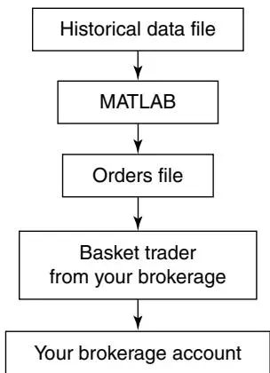
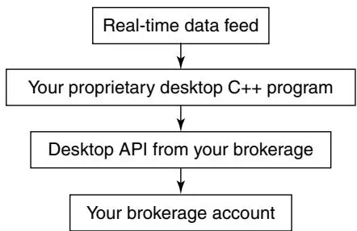

在本章中，我们将暂时放下交易的技术层面，转而关注其业务层面。假设你的目标是保持独立交易者身份而非为资管机构工作，交易业务的结构选择就很重要。你必须做出的主要选择是开设零售经纪商账户还是加入自营交易公司（Proprietary Trading Firm）。下一步是确定经纪商或交易公司的哪些功能对你重要。最后，你必须决定需要什么样的物理交易基础设施来执行你的量化策略。

## 业务结构：零售还是自营？

作为交易者，你可以选择完全独立或半独立。要完全独立，你可以简单地开设一个零售经纪商账户，存入一些现金，然后开始交易。没有人会质疑你的策略，也没有人会指导你的交易。此外，你的杠杆受美国证券交易委员会（SEC）T条例（Regulation T）限制——如果你持有隔夜头寸，杠杆大约是你权益的两倍。自然，所有的利润和亏损都将归你所有。

然而，你可以选择加入所谓的"自营交易公司"，如 Bright Trading、ECHOtrade 或 Genesis Securities，成为其会员。要成为此类公司的会员，你必须通过全美证券交易商协会（NASD）系列7考试，获得经纪商注册代表资格。你仍然需要投入自己的资金来开立账户，但你将获得远高于零售账户的杠杆（或"购买力"）。根据你投入的资金量，你可能保留全部利润或其中的一定比例。但在责任方面，你的损失仅限于初始投资。（实际上，如果你成立S型公司或有限责任公司（LLC）并通过该实体在零售经纪商开设账户，责任也是有限的。）通常，你还可以从公司获得培训，可能需要额外付费。你还将受到自营交易公司对其会员施加的各种规则和法规的约束，以及SEC或NASD施加的规则。

当我说到自营交易公司施加的规则和法规时，我把它们描述得像是坏事。但实际上，其中一些规则（如禁止交易仙股（Penny Stocks）或禁止隔夜持有空头头寸）实际上是保护你自身的风险管理措施。通常，当行情好的时候，交易者会抱怨这些限制了他们灵活性和盈利性的约束。他们甚至可能决定开设自己的零售交易账户，自行交易。然而，当他们遭受（几乎不可避免的）大幅回撤时，他们会希望有人在那里约束他们的风险偏好，并后悔这种不受约束的自由。（我们内心的少年毕竟从未离开。）

选择零售还是自营交易公司，通常取决于你的资金需求、策略风格和技能水平。例如，如果你运行一个低风险、市场中性的策略，但需要远高于T条例允许的杠杆才能产生良好回报，自营账户可能更适合你。然而，如果你从事不需要太多资金的高频期货交易，零售账户可能会帮你节省大量成本和麻烦。同样，一个经验丰富、有良好风险管理实践和情绪稳定性的交易者可能不需要自营公司提供的指导，但经验较少的交易者可能受益于这些约束。

还有一个考量适用于那些发现了一些独特、高盈利策略的人。在这种情况下，你可能更倾向于开设零售交易账户，因为如果你通过自营账户交易，你的自营交易公司会发现你的高盈利策略，并可能用大量自有资金"搭便车"（Piggyback）你的策略。随着时间推移，你的策略将承受更多的市场冲击交易成本。

表4.1总结了每种选择的优缺点。

最后一点：有些人可能认为加入自营交易公司有税收优势，因为任何交易亏损都可以从当前收入中扣除，而非作为资本亏损扣除。实际上，即使你有零售经纪商账户，你也可以选择申请交易者税务身份（Trader Tax Status），这样你的交易亏损可以抵消其他收入，而不仅仅是其他资本收益。关于交易业务的税收考量详情，你可以访问 www.greencompany.com 等网站。

表4.1 零售交易与自营交易对比

| 问题 | 零售交易 | 自营交易 |
|------|----------|----------|
| 开户法律要求 | 无。 | 需通过NASD系列7考试并满足其他NASD限制。 |
| 初始资金要求 | 较高。 | 较低。 |
| 可用杠杆或购买力 | 由SEC T条例决定。一般隔夜持仓2倍杠杆，日内持仓4倍。 | 由公司决定。日内或对冲持仓可达20倍或更高。 |
| 亏损责任 | 无限，除非通过S型公司或LLC开户。 | 仅限于初始投资。 |
| 佣金和费用 | 低佣金（可能低于每股0.5美分）和最低数据月费。 | 佣金较高且月费可观。 |
| 经纪商破产风险 | 无风险。账户由SIPC（证券投资者保护公司）承保。 | 有风险。账户无保险。 |
| 培训、指导、辅导 | 无。 | 可能提供此类服务，有时需付费。 |
| 交易秘密泄露风险 | 风险很小或无，特别是零售经纪商无自营交易部门时。 | 有风险。管理层容易"搭便车"盈利策略。 |
| 交易风格限制 | 无限制，只要SEC允许。 | 可能有限制，如禁止隔夜持有空头头寸。 |
| 风险管理 | 主要自我管理。 | 更全面，由管理层施加。 |

## 选择经纪商或自营交易公司

许多交易者只用一个标准来选择经纪商或自营交易公司：佣金率。这显然是一个重要的标准，因为如果交易策略回报率低，高佣金可能使其变得不盈利。然而，还有其他重要的考量。

佣金实际上只占你总交易成本的一部分，有时甚至是一小部分。经纪商的执行速度以及其对所谓"暗池"（Dark Pool）流动性的获取也会影响你的交易成本。暗池流动性由在交易所外撮合的机构订单构成，或者来自经纪商内部客户订单的交叉撮合。这些订单不会显示为买卖报价。提供暗池流动性的一些"另类交易系统"（Alternative Trading System）包括 Liquidnet 和 ITG 的 Posit。你的经纪商可能使用其中一个或多个提供商，也可能只使用其内部交叉网络，或者完全不使用另类交易系统。

有时，大型经纪商凭借其先进的执行系统和对更深暗池流动性的高速访问，提供的更优执行价格将超过其较高佣金带来的成本。除非你实际上同时在多个经纪商交易并比较实际执行成本，否则这种成本收益分析不容易进行。

例如，我通过 Goldman Sachs 的 REDIPlus 交易平台交易，其 Sigma X 执行引擎将订单路由到其内部交叉网络以及外部流动性提供者。我发现它通常能将我的执行价格提高到比 Interactive Brokers 高出数美分——完全足以抵消其更高的佣金。

另一个考量是你可交易的产品范围。许多零售经纪商或自营交易公司不允许你交易期货或外汇。这将严重限制你交易业务的增长。

在这两个相当通用的标准之后，对于量化交易者，下一个重要标准是：交易平台是否提供应用程序编程接口（API），以便你的交易软件可以接收实时数据、生成订单并将订单自动发送到你的账户执行？我将在[第5章](ch05.md)更多讨论API。这里唯一需要注意的是，没有API，高频量化交易是不可能的。

与API可用性密切相关的是模拟交易账户（Paper Trading Account）的可用性。如果你的经纪商不提供模拟交易账户，就很难在不承担真实亏损的情况下测试API。在我所知提供模拟交易账户的经纪商中，有 Interactive Brokers、Genesis Securities、PFG Futures（用于期货交易）和 Oanda（用于外汇交易）。

除了模拟交易账户，一些经纪商提供"模拟器"账户（例如 Interactive Brokers 的演示账户），其中历史报价被显示为实时报价，自动交易程序可以在一天中的任何时间针对这些报价进行交易以调试程序。

最后，你考虑的自营交易公司的声誉和财务实力也很重要。这对零售经纪商的选择没有影响，因为如表4.1所示，零售账户由SIPC承保，而自营账户没有。因此，自营交易公司拥有强大的资产负债表和良好的风险管理实践以防止公司因会员交易者的糟糕交易而崩溃就很重要。（WorldCom和Refco的崩溃就是很好的例子。）你还应该确保公司是在交易所注册的经纪交易商，以便定期接受交易所和SEC的审计。（截至本文写作时，非经纪交易商的自营交易公司可能最终都会被SEC关闭，从2008年3月的Tuco Trading开始。）此外，即使公司经营良好，它是否有良好的声誉允许你在选择时轻松赎回你的资本？当然，外部人士很难评估自营交易公司是否具有这些良好特质，但你可以在在线论坛 www.elitetrader.com 上根据公司现有或前会员的意见了解其声誉。

如果你不确定是开设零售经纪商账户还是自营账户，或者不确定使用哪家零售经纪商或自营公司，实际上你可以两者都做，或开设多个账户。与在自营交易公司找到全职工作不同，仅仅作为会员加入（特别是远程访问会员）通常不会迫使你签署竞业禁止协议（Noncompete Agreement）。你可以自由成为多家自营公司的会员，或同时拥有自营和零售交易账户，只要这一事实被充分披露为"外部商业活动"并向相关自营交易公司和NASD获得事先许可。拥有多个账户，你应该更容易决定哪种成本结构对你更有利，哪个账户有更好的基础设施和工具用于你的自动交易系统。实际上，有时每个账户都有各自的优缺点，你可能希望保持所有账户开放以交易不同策略的灵活性！

## 物理基础设施

既然你已经设置了交易业务的法律和行政结构，是时候考虑物理基础设施了。这适用于零售和自营交易者：许多自营交易公司允许其会员在家中远程交易。如果你是一个只需要账户经理最少指导的自营交易者，并且有信心自己搭建物理交易基础设施，就没有理由不进行远程交易。

在你业务的启动阶段，物理基础设施可以轻便简单。你可能已经拥有家庭办公室中所需的所有组件：一台好的个人电脑（实际上任何带有双核处理器的新电脑都可以）、高速（DSL或有线）互联网连接，以及不太为人所知的不间断电源（UPS），以防止你的电脑在交易过程中因电力波动而意外关机。初始总投资最多不应超过几千美元，如果你还没有订阅有线电视，每月成本不应超过50美元左右。

一些交易者想知道在办公室放一台调到CNBC或CNN的电视是否是个好主意。虽然这肯定没有坏处，但许多专业量化交易者发现只要他们同时订阅了另一个专业实时新闻源（如 Thomson Reuters、Dow Jones 或 Bloomberg），就没有必要。虽然 Bloomberg 每月可能花费近2,000美元，但 Thomson Reuters 和 Dow Jones 提供的各种套餐可能只需100到200美元（尽管有些需要年度合同）。Bloomberg 还有一个免费的网络广播流 www.bloomberg.com/tvradio/radio，播报突发商业新闻和评论。此外，你可以在办公室安装电视的替代方案是订阅 CNBC Plus，它将向你的计算机提供实时流媒体视频。当然，过多的实时信息不一定带来更盈利的交易。例如，Legg Mason 的 Michael Mauboussin 引用了一项研究，发现赛马 handicapper 在获得更多信息时预测马匹排名的成功率反而降低了。（参见 Economist, 2007a 或 Oldfield, 2007。）

随着交易业务的发展，你可能会逐步升级基础设施。也许你会购买更快的电脑。在本文写作时，四核电脑被认为相当高端。当然，当你读到本文时，八核或更高配置的个人电脑可能已经广泛可用。根据《纽约时报》的一篇文章（Markoff, 2007），配备八核芯片的PC最早将在2010年上市。

你肯定想购买多个显示器连接到同一台计算机上，以便拥有扩展的屏幕空间来监控所有不同的交易应用程序和投资组合。也许你还想将互联网连接升级到T1专线。如[第2章](ch02.md)所述，你的订单传输到经纪商的任何延迟都会导致滑点，这在利润损失方面是相当真实的。在快速波动的市场中，每一毫秒都很重要，升级互联网连接速度很可能很快就会回本。（T1专线的费用从700到1,500美元不等，而有线/DSL连接通常低于50美元。T1专线的传输速度为1.5Mbps，其中bps表示"每秒比特数"，大约是有线/DSL连接的两倍。）

一旦你最终测试了交易策略并发现它在实践中运行良好，就是时候扩大业务规模并考虑"业务连续性计划"（Business Continuity Planning），使你的交易策略能够抵御常见的家庭灾难，如互联网中断、停电、洪水等。你可以将交易程序安装在托管公司的远程服务器上；事实上，你甚至可以将包含交易程序的计算机"托管"（Collocate）到托管公司。（程序托管或服务器托管每月费用从几百到一千多美元不等。）你可以通过常见的远程PC应用程序（如 GotoMyPC，每月约15美元）远程监控、维护或更新运行在这些服务器上的交易程序，而远程服务器将直接向你的经纪商发送订单。这种设置的优势不仅在于你的交易几乎不会有停机时间，而且托管公司的互联网连接可能比你在家或办公室的连接更快。事实上，对于一些超高频交易应用，将服务器尽可能靠近你交易执行的交易所所在的互联网骨干网是有利的。只需Google搜索"server hosting"或"collocation servers"，你就会发现许多提供此类服务的托管公司。

## 总结

本章重点介绍了你需要采取的决策和步骤，以衔接交易业务的研究阶段和执行阶段。我涵盖了零售交易与自营交易的优缺点，以及选择经纪商或自营交易公司时需要考虑的问题。

简而言之，零售经纪商给你完全的自由和更好的资本保护但杠杆较小，而自营交易公司给你较少的自由和较少的资本保护但杠杆大得多。找到合适的零售经纪商相对容易。我花不到一个月研究并确定了一家，至今没有找到换的理由。找到合适的自营交易公司则要复杂得多，因为需要签合同并通过考试（系列7）。我花了几个月才在一个自营公司开好账户。

当然，你可以选择同时拥有零售和自营账户，每个账户根据你策略的具体需求定制。这样，你还可以轻松比较它们的执行速度和流动性深度。

无论你选择在零售经纪商交易还是加入自营交易公司，你都需要确保其交易账户和系统具有以下功能：

- 相对较低的佣金。
- 可交易种类丰富的金融工具。
- 接入深层流动性池。
- 最重要的是，用于实时数据检索和订单传输的API。

我还描述了为运行交易业务所需逐步建设的物理基础设施。文中提到的交易者运行环境的一些组件包括：

- 双核或四核电脑。
- 高速互联网连接（有线、DSL或T1）。
- 不间断电源。
- 实时数据和新闻源以及金融电视新闻频道订阅。
- 服务器托管或托管。

构建物理交易基础设施实际上相当容易，因为在开始阶段你可能已经拥有家庭办公室中的所有组件。我发现只需几千美元的物理基础设施初始投资和每月几百美元的运营成本，就可以轻松交易百万美元级别的投资组合。但如果你想提高交易容量或改善回报，就需要额外的增量投资。

一旦你考虑并完成了这些步骤，你就处于构建自动交易环境来执行你的策略的位置了，这将在下一章中介绍。# 执行系统

在这一点上，你应该已经回测了一个好策略（也许类似示例3.6中的配对交易策略），选好了经纪商（如 Interactive Brokers），并搭建了良好的运行环境（最初只是一台电脑、高速互联网连接和实时新闻源）。你几乎已经准备好执行你的交易策略了——在你实现了一个自动交易系统（ATS）来生成订单并将其发送到经纪商执行之后。本章是关于构建这样一个自动交易系统，以及最小化交易成本和与回测预期表现偏差的方法。

## 自动交易系统能为你做什么

自动交易系统（Automated Trading System）将从你的经纪商或其他数据提供商获取最新市场数据，运行交易算法生成订单，并将这些订单提交给你的经纪商执行。有时，所有这些步骤都是完全自动化并作为一个桌面应用程序安装在你的计算机上的。其他时候，这个过程只有一部分是自动化的，你需要执行一些手动步骤来完成整个流程。

完全自动化系统的优势在于最大限度地减少人为错误和延迟。对于某些高频系统，完全自动化系统是不可或缺的，因为任何人为干预都会导致足够的延迟严重影响表现。然而，完全自动化系统的构建也很复杂且成本高，通常需要具有Java、C#或C等高性能编程语言知识的专业程序员来连接你的经纪商应用程序编程接口（API）。

对于低频量化交易策略，有一个半自动化（Semiautomated）的替代方案：可以使用Excel或MATLAB等程序生成订单，然后使用经纪商提供的内置工具（如篮子交易器（Basket Trader）或价差交易器（Spread Trader））提交这些订单。如果你的经纪商提供到Excel的动态数据交换（DDE）链接（见下文），你还可以编写一个附加到Excel电子表格的宏（Macro），让你只需运行宏就可以向经纪商提交订单。这样就不需要用复杂的编程语言构建应用程序。但这确实意味着你需要执行相当多的手动步骤才能提交订单。

无论你构建的是半自动化还是完全自动化交易系统，通常都需要经纪商或数据提供商无法直接提供的价格以外的输入数据。例如，收益预估或股息数据通常不作为实时数据流的一部分提供。这些非价格数据通常可以从许多网站免费获取，但通常嵌入在HTML格式中，不能直接使用。因此，自动系统还必须能够获取这些网页、解析它们并将其重新格式化为你的交易策略可以利用的表格格式。此类网页获取和解析程序可以在MATLAB中轻松实现（参见[第3章](ch03.md)示例3.1），也可以用其他脚本语言如Perl实现。

我将在以下章节中讨论这两种系统的一些细节。如果你希望有人帮助自动化执行你的交易策略，我也会讨论如何雇用编程顾问。

## 构建半自动化交易系统

在半自动化交易系统（如图5.1所示）中，用户通常使用熟悉且易于使用的软件（如Excel或MATLAB）生成订单列表。通常，生成此订单列表的程序与回测程序相同：毕竟，你正在实现的就是你已经回测过的同一量化策略。当然，你必须记得更新输入数据文件以反映最新数据。这通常通过一个可以直接访问网站获取适当数据的MATLAB程序完成，或者通过一个单独的程序（如前面提到的HQuote）完成，该程序可以批量下载大量股票代码的历史价格数据。在后一种情况下，MATLAB仅用于将这些数据整理成适合生成今日订单的交易策略程序的格式。

当最新数据是前一个交易日的收盘价时，数据更新步骤很容易，但当需要最新的日内价格时肯定更困难。当所需数据是最新价格时，你的数据提供商或经纪商必须提供DDE链接来自动更新Excel输入文件。大多数为严肃交易者服务的经纪商都提供此类DDE链接。Interactive Brokers、Genesis Securities 和 Goldman Sachs 的 REDIPlus 就是一些例子。许多自营交易公司使用这些经纪商之一进行执行；因此，你也可以获得这些经纪商完整的实时数据和订单录入技术。



图5.1 半自动化交易系统

DDE链接只是一个要插入Excel电子表格的表达式，它将自动将适当的数据加载到单元格中。不同经纪商的表达式不同，但它们通常看起来像这样：

=accountid|LAST!IBM

其中 LAST 表示请求最新价格，IBM 是相关的股票代码。

要生成订单，你可以运行Excel宏（附加到电子表格的Visual Basic程序）或MATLAB程序，该程序扫描电子表格上的信息和价格，运行交易算法，并将订单写入另一个文本文件，其中每一行包含三元组（股票代码、方向、数量）。例如，

```txt
("IBM", "BUY", "100")
```

可能是输出订单文件中的一行。有时，你的经纪商要求提交订单的其他信息，例如订单是当日有效（Day Only）还是撤前有效（Good Till Cancel）。所有这些辅助信息都写入订单文件的每一行。

包含订单列表的文本文件生成后，你可以将此订单文件上传到你的经纪商的篮子交易器或价差交易器进行提交。

篮子交易器是一种允许你上传多个股票代码的多个订单并一键提交给经纪商的应用程序。价差交易器是一种可以指定多对股票或其他证券的代码以及提交这些配对订单条件的应用程序。价差交易器可以监控实时价格并在整个交易日内检查这些条件是否满足。

如果你经纪商的DDE链接允许你提交订单，你也可以运行Excel宏来扫描订单文件并一键将所有订单提交到你的账户。

我使用的两家经纪商 Interactive Brokers 和 REDIPlus 都有篮子交易器和价差交易器，以及用于数据更新和订单提交的DDE链接作为其执行平台的一部分。（Interactive Brokers 的价差交易器只能用于期货日历价差。股票价差可以通过其所谓的"Generic Combo"逐对指定，不过订单录入条件的持续监控对期货和股票都适用。）

以下是我使用 Interactive Brokers 篮子交易器的做法。每天在市场开盘前，我运行一个MATLAB程序获取市场数据、运行交易算法，并将订单列表写入一个可能超过1,000行（对应超过1,000个代码）的订单文件。然后我在交易屏幕上打开篮子交易器，使用篮子交易器将订单文件上传到我的账户，并一键将它们全部提交到我的账户。其中一些订单可能在开盘时执行；其他的可能稍后执行或根本不执行。在市场收盘前，我按一个按钮取消所有未执行的订单。最后，如果我想平掉所有现有头寸，我只需在篮子交易器中按另一个按钮生成相应的平仓订单。

我使用 REDIPlus 的价差交易器来进行配对交易策略（如示例3.6），因为我可以让价差交易器在一天中的所有时间下单，而不仅仅是在收盘前。同样，在市场开盘前，我使用MATLAB获取市场数据、运行配对交易算法，并为我投资组合中的所有配对写出限价。（注意限价是对价差的限制，不是对个股的。如果是对个股的限制，普通限价单就可以完成，价差交易器就多余了。）然后我转到价差交易器（其中已经包含我之前指定的所有配对），根据MATLAB的输出手动调整限价。（实际上，这一步也可以自动化——所有价差订单信息可以由MATLAB写入Excel文件并上传到价差交易器。）按下另一个按钮将启动自动监控价格和在交易日内下单。

我还使用 REDIPlus 的DDE链接为另一个篮子交易策略提交订单。我使用MATLAB在每个Excel单元格中生成适当的DDE链接公式，以便它可以自动更新该行特定代码的适当数据。市场开盘后，我运行附加到该电子表格的宏，该宏扫描每个代码并将其（连同电子表格中包含的其他订单信息）提交到我在 REDIPlus 的账户。

通常，如果你每天只需要运行此步骤几次以生成一波或几波订单，半自动化交易系统就足够了。即使你的经纪商的API提供了用于Excel Visual Basic宏的订单提交功能，如果你需要频繁运行此程序以获取最新数据并生成一波又一波订单，其速度通常太慢。在这种情况下，必须构建完全自动化交易系统。

## 构建完全自动化交易系统

完全自动化交易系统（如图5.2所示）可以一遍又一遍地循环运行交易算法，在整个交易日内不断扫描最新价格并生成新的订单波次。通过API向你的经纪商账户提交订单是自动的，因此你不需要将交易加载到篮子交易器或价差交易器中，甚至不需要手动在Excel电子表格上运行宏。你所要做的就是在早上按一个"开始"按钮，然后在一天结束时按一个"关闭"按钮，你的程序将为你完成所有交易。



图5.2 完全自动化交易系统

实现完全自动化系统要求你的经纪商提供用于数据检索和订单提交的API。你的经纪商通常为一些流行的编程语言（如Visual Basic、Java、C#或C）提供API，因此你的完全自动化系统也必须用这些语言之一编写。不幸的是，据我所知没有哪家经纪商为MATLAB提供API。因此，MATLAB不能用于构建自动交易系统的订单传输部分。

理论上，完全自动化系统可以由一个Excel电子表格和附加的宏构建：你所要做的就是在宏中创建一个循环，使其在一天中持续使用DDE链接更新单元格并在适当时提交订单。不幸的是，通过DDE链接的数据更新很慢，而且通常你的经纪商限制了你可以同时更新的代码数量。（除非你在前一个交易月产生了大量佣金，Interactive Brokers 默认只允许你更新100个代码。）同样，通过DDE链接的订单提交也很慢。因此，对于需要在日内对实时市场数据变化做出反应的交易策略，使用电子表格的这种设置不可行。

有一些经纪商如 TradeStation 提供完整的回测和订单提交平台。如果你在这样的平台上回测过，那么配置它让程序向你的账户提交真实订单就很简单。这免去了你自己编写软件的需要，无论是用于回测还是自动执行。然而，正如我在[第3章](ch03.md)中提到的，此类专有系统的缺点是它们通常不如MATLAB或Java等通用编程语言灵活。例如，如果你想基于主成分分析（PCA）追求一个数学上相当复杂的策略（如示例7.4中的策略），在TradeStation中回测会相当困难。更先进的集成交易平台如 Alphacet 的 Discovery 确实提供了更多种类的算法可供回测和实现，但它们可能对典型的独立交易者来说负担不起。

## 雇用编程顾问

构建ATS通常比回测策略需要更专业的编程技能。这对于执行速度至关重要的高频策略尤其如此。与其自己实现执行系统，你可能发现雇用编程顾问会减少很多麻烦。

雇用编程顾问不一定很贵。对于经验丰富的程序员，小时费可能在50到100美元之间。有时你可以事先协商整个项目的固定费用，我发现大多数独立交易者的项目可以在1,000到5,000美元内完成。如果你在提供API的经纪商之一有账户，经纪商通常可以向你推荐一些有其API经验的程序员。（例如，Interactive Brokers 有一个专门的网页允许编程顾问提供服务。）你也可以在 elitetrader.com 上搜索（或发布请求）寻找此类程序员。作为最后的手段，你可以在 craigslist.org 上找到成百上千的自由职业程序员在做广告。然而，我发现 craigslist 上自由职业程序员的质量参差不齐——特别是他们通常缺乏金融市场和交易技术的深入知识，而这对于成功实现自动交易系统可能至关重要。

有一个问题可能会在你考虑雇用程序员时困扰你：如何保持你的交易策略机密？当然，你可以让他们签署保密协议（NDA，可在许多法律文书网站免费下载），但一旦程序实现，几乎不可能发现程序员是否实际上在他们的个人账户中运行你的策略。有几种方法可以解决这一顾虑。

首先，正如我之前提到的，你可能认为是自己独特创造的大多数策略，实际上对有经验的交易者来说已经相当知名。所以，无论你喜不喜欢，其他人已经在交易非常相似的策略并影响你的回报。增加一两个交易者，除非该交易者为机构资管者工作，不太可能造成更大的影响。

其次，如果你交易的策略容量很大（如大多数期货交易策略），那么你的违规编程顾问带来的额外市场冲击将微乎其微。

最后，你可以选择对你的信息和实施进行 compartmentalize——即雇用不同的程序员来构建自动交易策略的不同部分。通常，一个程序员可以构建一个可用于不同策略的自动交易基础设施程序，另一个程序员可以实现实际策略，该策略读入输入参数。所以在这种情况下，第一个程序员不知道你的策略，第二个程序员没有执行策略的基础设施。此外，两个程序员都不知道你策略的实际参数值。

## 最小化交易成本

我们在[第3章](ch03.md)看到了交易成本如何影响策略的实际回报。除了将你的经纪商或自营交易公司换成收费更低的之外，你还可以在执行方法上做几件事来最小化交易成本。

为了减少佣金，你可以避免交易低价股。通常，机构交易者不交易任何价格低于5美元的股票。低价股不仅增加了你的总佣金成本（因为你需要为固定金额的资金买卖更多股），而且从百分比来看，它们的买卖价差也更宽，从而增加了你的总流动性成本。

为了最小化市场冲击成本，你应该根据股票的流动性来限制订单的规模（股数）。流动性的一个常用衡量指标是日均成交量（Average Daily Volume）（回望期由你决定）。根据经验法则，每笔订单不应超过日均成交量的1%。作为独立交易者，你可能认为不容易达到这个1%的阈值，当涉及标普500中的大盘股时你是对的。然而，你可能会惊讶于一些小盘股的低流动性。

例如，在本文写作时，IRN是标普600小盘指数中的一只股票。其三个月平均成交量约为51,000股，今天收盘价为4.45美元。因此该平均成交量的1%仅为510股，价值仅2,269美元！

减少市场冲击的另一种方法是根据股票的市值（Market Capitalization）来调整订单规模。调整规模的方法不是一门精确的科学，但大多数从业者不推荐线性缩放，因为公司的市值跨越了数个数量级，从数千万到数千亿。线性缩放（即将股票的资金量与其市值线性成比例）将导致投资组合中大多数小盘和微盘股的实际权重为零，这将失去分散化的任何好处。如果我们使用线性缩放，最大大盘股的权重将是最小小盘股的约10,000倍。为了获得分散化的好处，在满足上述流动性（成交量）约束的前提下，我们不应允许该比率超过10左右。如果股票的资金权重与其市值的四次方根成比例，就能达到这个效果。

还有另一种减少市场冲击的方法。许多希望执行大单的机构交易者会将其拆分为许多小单并在一段时间内执行。这种方法当然可以减少市场冲击；然而，它产生了另一种交易成本，即滑点。如[第2章](ch02.md)所述，滑点是触发交易信号的价格与整个订单的平均执行价格之间的差异。由于订单在一段时间内执行，滑点可能相当大。由于以这种方式减少市场冲击可能增加滑点，它实际上不适合订单规模通常不够大、不需要这种补救措施的零售交易者。

然而，有时滑点不在你的控制范围内：也许你的经纪商的执行速度确实太慢了，由于软件问题（其软件处理你的订单太慢）、风险控制问题（你的订单在路由到交易所之前必须经过你的账户购买力检查并通过各种风险控制标准）或通道问题（经纪商访问交易所的速度）。或者你的经纪商无法获取足够深的"暗池"流动性。正如我在[第4章](ch04.md)指出的，这些执行成本和问题应该影响你对经纪商的选择。

在构建自动交易系统后，如果你的经纪商提供模拟交易账户，在其中进行测试是个好主意。模拟交易（Paper Trading）有许多好处；其中最主要的是，这实际上是查看你的ATS软件是否有缺陷而不损失大量真金白银的唯一方式。

通常，当你开始模拟交易的那一刻，你就会意识到你的策略中存在明显的前视偏差（Look-Ahead Bias）——可能根本没有方法在下单之前获取某些关键数据！如果发生这种情况，那就"回到绘图板"吧。

你应该能够运行你的ATS、执行模拟交易，然后将模拟交易和盈亏（P&L）与你的回测程序使用最新数据生成的理论结果进行比较。如果差异不是由交易成本（包括模拟交易的预期执行延迟）引起的，那么你的软件可能有缺陷。（我在[第4章](ch04.md)提到了一些提供模拟交易账户的经纪商名称。）

模拟交易的另一个好处是它让你更好地直观理解你的策略，包括其P&L的波动性、典型资金使用量、每日交易次数以及各种操作困难（包括数据问题）。虽然你理论上可以在回测中检查策略的大部分特征，但通常只有在日常持续面对它们时才能获得直觉。回测也不会揭示操作困难，比如每天在市场开盘前你能多快下载所有需要的数据，以及如何在实际执行中优化你的操作流程。

（不要低估在市场开盘前准备订单所需的时间。我每天早上下载和解析所有历史数据大约需要20分钟，再花大约15分钟将所有订单传输到我的账户。如果你的交易策略依赖于开盘前不能超过35分钟的数据或新闻，那么你需要要么找出不同的执行环境，要么修改你的策略。在进行模拟交易之前，很难弄清楚所有这些时间安排问题。）

如果你能够运行模拟交易系统一个月或更长时间，你甚至可能发现数据窥探偏差（Data-Snooping Bias），因为模拟交易是一个真正的样本外测试（Out-of-Sample Test）。然而，随着时间推移，交易者通常对模拟交易系统的关注越来越少，因为总有更紧迫的问题（例如正在运行的实际交易程序）。这种疏忽导致模拟交易系统因疏于管理和操作错误而表现不佳。因此，数据窥探偏差通常只有在你实际上已经开始用少量资金交易该系统时才能被发现。

## 实际表现为何与预期偏差？

最后，经过大量艰苦的测试和准备工作，你输入了第一个订单并成交了！无论盈亏，你明白需要一段时间才能知道其表现是否符合你的预期。但如果一个月、两个月，最终一个季度过去了，策略仍然只带来微薄甚至负的回报呢？这种令人失望的经历对新晋量化交易者来说很常见。这时你应该回顾可能造成这种预期偏差的原因清单。从最简单的诊断开始：

- 你的ATS软件有缺陷吗？
- 你的ATS生成的交易与回测程序生成的匹配吗？
- 执行成本是否远高于你的预期？
- 你是否在交易流动性差的股票导致了大量市场冲击？

如果执行成本远高于你的预期，值得重新阅读关于如何最小化交易成本的部分。

在排除了这些简单的诊断之后，人们面临两个最令人担忧的偏差原因：数据窥探偏差和体制转换（Regime Shift）。

要查看数据窥探偏差是否导致你的实盘交易表现不佳，尝试尽可能多地删除策略中的规则和参数。如果经过此操作后回测表现完全崩溃，很可能你确实存在这种偏差，是时候寻找新策略了。如果回测表现仍然合理，你的实盘交易表现不佳可能只是运气不好。

体制转换是指金融市场结构或宏观经济环境发生剧烈变化，以至于以前盈利的交易策略现在可能不再盈利的情况。

近年来有两个与市场（或监管）结构相关的值得注意的体制转换可能影响某些策略。

第一个是股票价格的十进制化（Decimalization）。在2001年初之前，美国股票价格以十六分之一和一美分的十八分之一为单位报价。自2001年4月9日起，所有美国股票都以十进制报价。这个看似无害的变化对市场结构产生了巨大影响，对统计套利策略的盈利能力尤其不利。

其原因可能值得单独写一本书。简而言之，十进制化减少了价格发现过程中的摩擦（Friction），而统计套利者主要充当做市商（Market Maker），其利润来源于此过程中的摩擦和低效率。（这是 Andrew Sterge 博士在2008年1月哥伦比亚大学金融工程研讨会上题为"Where Have All the Stat Arb Profits Gone?"的演讲中给出的解释。其他业内人士在私下交流中也向我表达了相同观点。）因此，我们可以预期2001年之前统计套利策略的回测表现远优于其当今表现。

另一个体制转换与做空股票的策略相关。

2007年之前，美国证券交易委员会（SEC）规定，除非在"正向跳动"（Plus Tick）或"零正向跳动"（Zero-Plus Tick）上，否则不能做空股票。因此，如果你的回测数据包含那些早期日子，可能一个非常盈利的空头头寸实际上因缺乏正向跳动而无法建仓，或者只能以大滑点建仓。SEC于2007年6月取消了这一正向跳动规则。因此，做空股票策略的回测结果可能显示2007年之前的人为夸大表现，相对于当时可实现的实际表现。

实际上，除了这种监管体制转换之外，实现做空股票策略的回测表现还有另一个问题。即使没有正向跳动规则，许多股票，特别是小盘股或低流动性股票，是"难以借入"（Hard to Borrow）的。要能够做空一只股票，你的经纪商必须能够从其他人（通常是大型共同基金或其他经纪商客户）那里借入该股票并借给你卖出。如果没有人能够或愿意借出他们的股票，该股票就被认为是难以借入的，你就无法做空它。因此，一个非常盈利的历史空头头寸可能实际上因借入股票的困难而无法实现。

这里描述的两个体制转换是明显的且广为人知的。然而，可能还有其他更微妙的体制转换适用于你的股票类别，很少有人知道，但对你的策略表现的盈利能力的破坏力同样不容小觑。我将在[第7章](ch06.md)的专题中讨论如何建立一个自动检测体制转换的模型。

## 总结

自动交易系统是一种根据你的交易策略自动生成并传输订单到你的经纪商账户的软件。拥有此软件的优势在于：

- 它确保忠实执行你回测过的策略。
- 它消除了手动操作，使你可以同时运行多个策略。
- 最重要的是，它允许快速传输订单，这对高频交易策略至关重要。

关于半自动化交易系统与完全自动化交易系统的区别：

- 在半自动化交易系统中，交易者仍然需要手动将包含订单详情的文本文件上传到篮子交易器或价差交易器，并在适当时间手动按下按钮传输订单。然而，订单文本文件可以由MATLAB等程序自动生成。

- 在完全自动化交易系统中，程序能够在整个交易日甚至多天内自动上传数据和传输订单。

在创建ATS之后，你可以关注执行中的各种重要问题：最小化交易成本和模拟交易。最小化交易成本主要是不允许你的订单规模相对于其平均交易量和市值过大。模拟交易使你可以：

- 发现交易策略和执行程序中的软件缺陷。
- 发现前视偏差甚至数据窥探偏差。
- 发现操作困难并规划操作时间表。
- 更现实地估算交易成本。
- 获得关于P&L波动、资金使用、投资组合规模和交易频率的重要直觉。

最后，当你的实盘交易表现不及回测时该怎么办？你可以从解决常见问题开始：消除策略或执行软件中的缺陷；减少交易成本；通过消除参数来简化策略。但从根本上说，你的策略可能仍然遭受了数据窥探偏差或体制转换的影响。

如果你相信（而且你只能相信，因为你永远无法证明）你的实盘交易表现不佳是由于运气不好，而非回测中的数据窥探偏差或体制转换，当坚持与保本这两个相互竞争的需求似乎指向相反的行动时，你应该如何继续？这个关键问题将在下一章中讨论，该章讨论了在面对亏损时系统性保护资本同时仍能在形势逆转时恢复的方法。
