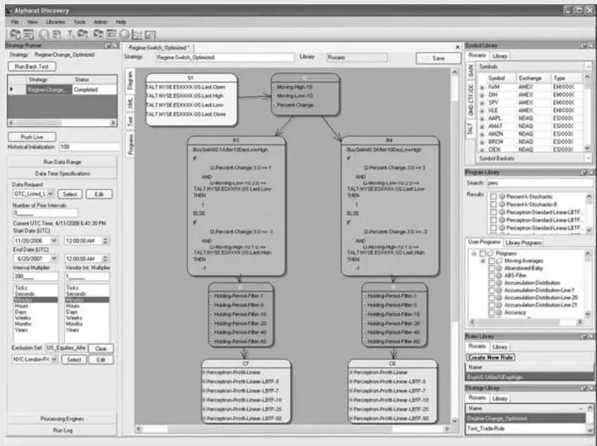
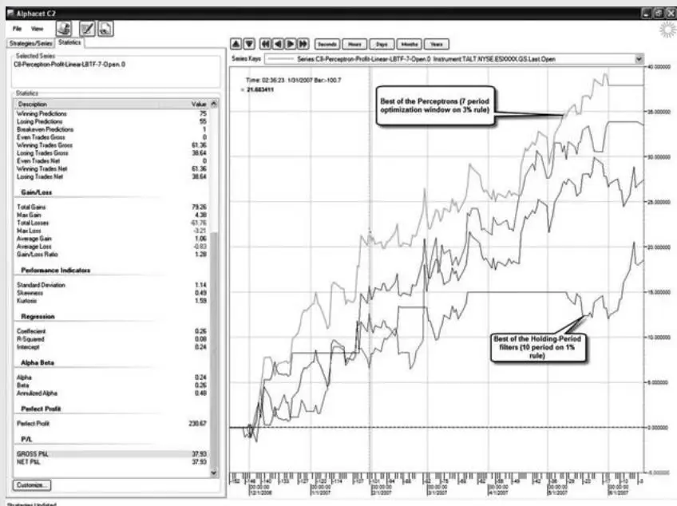
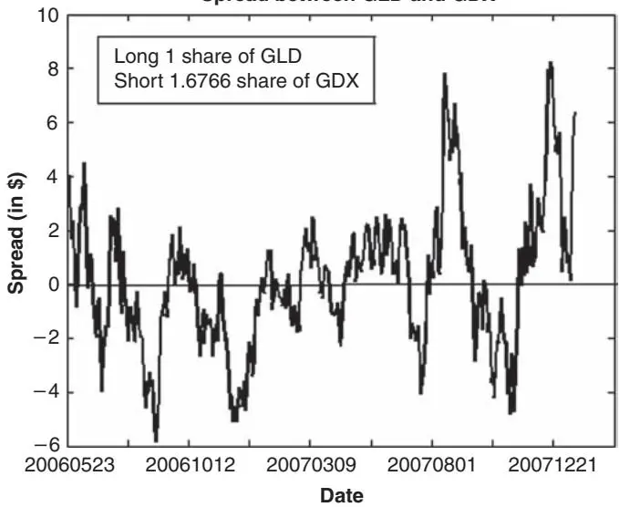
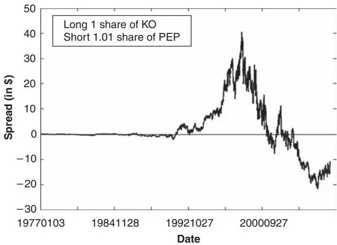
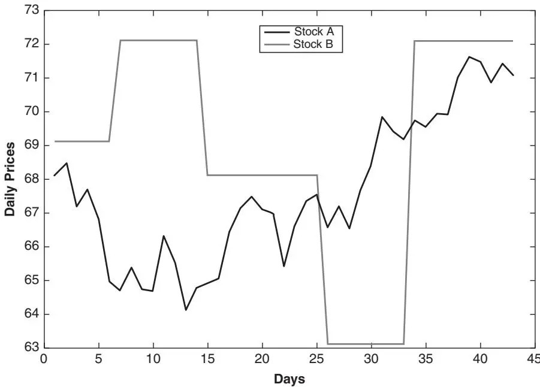

本书前六章涵盖了研究、开发和执行你自己的量化策略所需的大部分基础知识。本章将更详细地解释量化交易中的重要主题。这些主题构成了统计套利交易（Statistical Arbitrage）的基础，大多数量化交易者即使不是精通所有这些话题，也至少对其中一些非常熟悉。它们对于培养我们的交易直觉也非常有帮助。

我将描述两类基本的交易策略：均值回复（Mean-Reverting）策略与动量（Momentum）策略。均值回复和趋势行为的时期是一些交易者所说的"体制"（Regimes）的例子，而不同体制之间的转换是本文讨论的一个话题。均值回复策略的数学依据来源于时间序列的平稳性（Stationarity）和协整（Cointegration）概念，我接下来将予以介绍。然后，我将描述一个许多对冲基金用来管理大型投资组合的理论，这个理论曾给他们的业绩带来了很大波动：即因子模型（Factor Models）。交易者经常讨论的其他策略类别包括季节性交易和高频交易。所有交易策略都需要一种退出仓位的方式；我将描述不同的逻辑方法。最后，我将思考如何最好地提高策略的收益：是通过更高的杠杆，还是交易更高贝塔（Beta）的股票？

## 均值回复策略与动量策略

只有当证券价格是均值回复的或趋势性的，交易策略才能盈利。否则，价格是随机游走（Random Walking）的，交易将是徒劳的。如果你相信价格是均值回复的，并且目前相对于某个参考价格较低，你应该现在买入并计划以后在更高价位卖出。然而，如果你相信价格是趋势性的并且目前较低，你应该（卖空）现在卖出并计划以后在更低价格买入。如果你认为价格偏高，则情况相反。

学术研究表明，股票价格平均而言非常接近随机游走。然而，这并不意味着在某些特殊条件下，它们不能表现出一定程度的均值回复或趋势行为。此外，在任何给定时间，股票价格可能同时具有均值回复和趋势性，这取决于你所关注的时间范围。构建交易策略本质上是确定在特定条件和特定时间范围下，价格将是均值回复的还是趋势性的，以及在任何给定时间的初始参考价格应该是什么。（当价格呈趋势性时，也可以说它们具有"动量"，因此相应的交易策略通常被称为动量策略。）

有些人喜欢将价格可以同时具有均值回复性和趋势性这一现象描述为股票价格的"分形"（Fractal）性质。技术分析师或图表分析师喜欢使用所谓的艾略特波浪理论（Elliott Wave Theory）来分析此类现象。还有一些人喜欢使用机器学习或人工智能（特别是隐马尔可夫模型、卡尔曼滤波器、神经网络等技术）来发现价格是处于均值回复还是趋势性的"体制"中。就我个人而言，我发现这种关于均值回复或动量的一般理论并不特别有用。（不过请参阅关于体制转换的章节，该节描述了一种对某只特定股票预测体制转换的看似成功的方法。）相反，我认为通常可以安全地假设，除非公司的预期收益发生了变化，否则股票价格将是均值回复的。事实上，金融研究人员（Khandani and Lo, 2007）构建了一个非常简单的短期均值回复模型，该模型在许多年中都能盈利（在扣除交易成本之前）。当然，均值回复是否足够强且足够一致，以至于我们在考虑交易成本后仍能盈利交易，这是另一回事，这需要交易者你自己去找到那些均值回复强且一致的特殊情况。

尽管均值回复相当普遍，但回测一个盈利的均值回复策略可能相当危险。

许多历史金融数据库中的价格报价包含错误。任何此类错误都倾向于人为地夸大均值回复策略的表现。原因很容易理解：均值回复策略会在一个远低于某个移动平均线的虚假报价上买入，并在下一个与移动平均线一致的正确报价上卖出，从而获利。在完全信任均值回复策略的回测表现之前，必须确保数据已彻底清除此类虚假报价。

生存者偏差（Survivorship Bias）也会不成比例地影响均值回复策略的回测，正如我在[第3章](ch03.md)中讨论的那样。经历过极端价格波动的股票很可能被收购（价格涨得很高）或破产（价格跌至零）。均值回复策略会做空前者、买入后者，在两种情况下都会亏损。然而，如果你的历史数据库存在生存者偏差，这些股票可能根本不会出现在数据库中，从而人为地夸大了你的回测表现。你可以查阅表3.1来了解哪些数据库存在生存者偏差。

动量可以由信息的缓慢扩散产生——随着越来越多的人意识到某些新闻，更多人决定买入或卖出某只股票，从而推动价格朝同一方向移动。我之前暗示过，当预期收益发生变化时，股票价格可能表现出动量。当一家公司公布其季度收益时，投资者可能逐渐意识到这一公告，或者他们通过逐步执行大额订单来应对这一变化（以最小化市场影响）。而这确实导致了一种被称为盈余公告后漂移（Post Earnings Announcement Drift，简称PEAD）的动量策略。（关于这一策略的一篇特别有用且附有大量参考文献的文章，请参阅 quantlogic.blogspot.com/2006/03/pocket-phdpost-earning-announcment.html。）本质上，该策略建议你在股票收益超过预期时买入，在低于预期时卖空。更广泛地说，许多新闻公告都有可能改变市场对未来收益的预期，从而有可能触发一个趋势期。至于什么样的新闻会触发这种趋势，以及趋势期将持续多久，这需要你自己去发现。

除了信息的缓慢扩散，动量还可能由大型投资者因流动性需求或私人投资决策而逐步执行大额订单所引起。这一原因可能比任何其他原因都更能解释短期动量现象。然而，随着大型券商采用日益复杂的执行算法，越来越难以确定观察到的动量背后是否有一个大订单。

动量还可能由投资者的羊群行为（Herd Behavior）产生：投资者将他人（可能是随机和无意义的）买入或卖出决策解读为自己交易决策的唯一依据。正如耶鲁大学经济学家Robert Schiller在《纽约时报》（Schiller, 2008）中所说，没有人拥有做出完全知情的金融决策所需的全部信息。人们不得不依赖他人的判断。然而，没有可靠的方法来辨别他人判断的质量。更成问题的是，人们在不同的时间做出金融决策，并非在市政厅集会并一劳永逸地达成共识。第一个以高价买房的人是在"告知"其他人房屋是好的投资，这导致另一个人做出相同的决定，以此类推。因此，第一个买家可能错误的决定作为"信息"传播给了一群人。

不幸的是，由这两种原因（私人流动性需求和羊群行为）产生的动量体制具有高度不可预测的时间范围。你怎么知道一个机构需要执行多大的订单？你如何预测"羊群"何时大到足以形成踩踏？那个臭名昭著的临界点在哪里？如果我们没有可靠的方法来估计这些时间范围，我们就无法基于这些现象进行盈利的动量交易。在后面关于体制转换的章节中，我将考察一些预测这些临界或"转折"点的尝试。

均值回复策略和动量策略之间还有一个值得思考的最后对比。来自使用相同策略的交易者的竞争加剧会产生什么影响？对于均值回复策略，其影响通常是逐步消除任何套利机会，从而收益逐渐递减至零。当套利机会的数量减少到几乎为零时，均值回复策略就会面临一个风险：越来越多的交易信号实际上是由股票估值的基本面变化引起的，因此不会出现均值回复。对于动量策略，竞争的影响通常是趋势持续的时间范围缩短。随着新闻传播速度加快，以及更多交易者更早利用这一趋势，均衡价格将更快达到。在均衡价格之后进入的任何交易都将无利可图。

## 体制转换*

体制的概念对金融市场最为基本。"牛市"和"熊市"不正是体制吗？预测体制转换（也通常被称为转折点）的愿望同样与金融市场本身一样古老。

如果我们预测从牛市向熊市转换的尝试哪怕稍微成功一点，我们就可以将讨论集中在这唯一一种转换上，然后收工。但事情哪有那么容易。预测这种转换的困难促使研究人员更广泛地研究金融市场中其他类型的体制转换，希望找到一些可能更适合现有统计工具的方法。

我已经描述了两种由于市场和监管结构变化而产生的体制转换（或"转变"，因为这两个例子都没有转回原来的体制）：2003年股票价格的十进制化和2007年取消卖空加一规则（Shortsale Plus-Tick Rule）。（详见[第5章](ch05.md)。）这些体制转变是由政府预先宣布的，因此不需要预测转变，尽管很少有人能预测监管变化的确切后果。

一些其他最常研究的金融或经济体制包括：通胀与衰退体制、高波动与低波动体制、以及均值回复与趋势体制。其中，波动率体制转换似乎最适合经典的计量经济学工具，如广义自回归条件异方差（GARCH）模型（见Klaassen, 2002）。这并不奇怪，因为金融经济学家在波动率建模方面有着悠久的成功历史，这与对底层股票价格本身的建模不同。虽然这种波动率体制转换的预测对期权交易者可能很有价值，但不幸的是，对股票交易者并无帮助。

学术界对股票价格体制转换建模的尝试通常遵循以下思路：

1. 假设两种（或更多）体制以不同的价格概率分布为特征。在最简单的情况下，两种体制的价格对数可以用正态分布表示，只是它们具有不同的均值和/或标准差。

2. 假设体制之间存在某种转移概率（Transition Probability）。

3. 通过将模型拟合到历史价格，使用标准统计方法（如最大似然估计）来确定指定体制概率分布和转移概率的确切参数。

4. 基于上述拟合模型，确定下一个时间步的预期体制，更重要的是，确定预期的股票价格。

这种方法通常被称为马尔可夫体制转换（Markov Regime Switching）或隐马尔可夫模型（Hidden Markov Models），通常基于贝叶斯概率框架。有兴趣进一步阅读这些方法的读者可以查阅Nielsen和Olesen (2000)、van Norden和Schaller (1993)或Kaufmann和Scheicher (1996)。

尽管理论框架优雅，但这种马尔可夫体制转换模型在实际交易中通常毫无用处。这种弱点的原因在于它们假设体制之间的转移概率在任何时候都是恒定的。在实践中，这意味着在任何时候（如Nielsen和Olesen论文所说明的），股票从正常的平静体制转变为波动体制的概率总是很小。但这对于想知道转移概率何时——以及在什么精确条件下——会突然达到峰值的交易者来说毫无用处。这个问题由转折点模型来解决。

转折点模型采用数据挖掘方法（Chai, 2007）：输入所有可能预测转折点或体制转换的变量。诸如当前波动率、上一期收益率、以及宏观经济数据的变化（如消费者信心、油价变化、债券价格变化等）都可以作为输入。事实上，在经济学家Robert Schiller (2007)关于房地产市场转折点的一篇非常应景的文章中，他提出关于即将到来的繁荣或萧条的媒体讨论的升级实际上可能是即将到来的转折点的良好预测指标。

在示例7.1中，我演示了如何使用数据挖掘方法，仅以基于股票价格序列的简单技术指标作为输入，以多个持有期的股票收益率作为输出来检测转折点。

## 示例7.1：使用机器学习工具从股市体制转换中获利

正如我在正文中讨论的，我相信体制转换最容易通过数据挖掘方法来发现：检查大量指标，看看哪个可能预测转换。这通常是一项非常繁重的任务，即使使用MATLAB也是如此。但幸运的是，最近的一个机器学习程序使这一发现过程可以在几小时内完成。

我将在这里使用一个名为Alphacet Discovery的工具，这是Alphacet公司最近推出的集成回测和执行平台（www.alphacet.com。全面披露：Alphacet是我公司的客户。）该平台不仅集成了快速策略原型设计、回测、分析和实时部署所需的所有历史和实时数据；它还包含不断扩展的机器学习程序，如神经网络和遗传算法，这些程序非常适合我们正在寻找的那类关系的数据挖掘。

我将选择一只著名的券商股——GS——作为金融板块的代表。我的目标是找出我是否能检测到该板块从牛市到熊市再回来的转折点。我的初步假设是，利率的重大变化、政府宏观经济数据的发布或收益公告可能是触发转折点的因素。在撰写本文时，Alphacet尚未完成将宏观经济或公司新闻数据整合到其数据库中，因此我将使用GS的大幅百分比变化作为此类新闻发布的代理指标。此外，我相信每当GS在价格大幅下跌或上涨之前达到N日最高或最低点时，这是前一个体制即将结束的良好信号。因此我将把这个条件也作为额外的输入。

我们面临的搜索问题是：多大的百分比变化足以触发体制转换？在N日最高/最低条件中，N应该取多少？新的体制通常持续多久？（换句话说，最优持有期是多少？）以传统的手动方式回答这些问题非常耗时，因为需要对自变量使用不同的阈值、对因变量使用不同的收益率范围来运行多次模拟。让我们看看Alphacet Discovery能否帮助我们自动化这一过程。

模型的自变量只是GS的日收益率。因变量是GS在各种持有期内的未来收益。Discovery可以轻松找到最优规则或最优规则组合，从而获得最佳的回测表现。在我们的案例中，每个百分比变化阈值都可以封装为一个规则。我输入了两个买入阈值和两个卖出阈值：1%、3%、1%和3%。同样，每个持有期也可以封装为一个规则，我输入了六个这样的时期：1天、5天、10天、20天、40天和60天。

为这次搜索准备价格、百分比变化和10日最高/最低时间序列非常容易：在Discovery中，大多数操作都可以通过鼠标拖放完成。（为简单起见，我在此策略中将N固定为10，但这个参数也可以优化。）我只需将GS价格序列拖到策略编辑器中，并使用可用控件指定1天频率。（价格序列大约从2006年12月开始。）参见图7.1中的方框S1。然后我将几个预封装的"规则"（计算1天百分比变化和序列的简单10日移动最高价和最低价）拖到策略编辑器中（图7.1中的方框I2）。我通过从Symbol Group方框到Program Group方框的箭头将原始价格序列输入到Program Group方框中。


图7.1 策略编辑器——以方框形式显示数据和规则

现在我可以通过使用下拉菜单和在新Rule方框编辑器中的文本框中输入来创建入场规则。图7.2显示了基于1%变化的买卖规则Rule方框R3的内容。我为3%创建了类似的Rule方框。请注意，默认情况下，后续的入场信号将覆盖先前信号建立的仓位。

```txt
R3
BuySellAt0.1After10DayLowHigh
IF
    12-Percent-Change.3.0 >= 1
    AND
    12-Moving-Low-10.2.0 >= TALT.NYSE.ESXXXX.GS.Last.Low
THEN
    1
ELSE
IF
    12-Percent-Change.3.0 >= -1
    AND
    12-Moving-High-10.1.0 <= TALT.NYSE.ESXXXX.GS.Last.High
THEN
    -1
```
图7.2 Rule方框内部

我们可以使用名为"Holding Period"的预封装程序并设置不同参数来指定持有期。（事实上，如果你了解编程语言Lisp，可以轻松创建此类程序。）这些都被封装在方框I5中（2%规则单独在I6中）。我们通过绘制箭头将方框R3的输出传到I5，同样将R4传到I9。

最后，我们对I7和I9的输出运行感知器学习算法（Perceptron Learning Algorithm）（感知器是一种神经网络）。该算法将基于历史训练数据的滑动窗口，找出不同规则和不同持有期（以及其他参数）的最佳权重，目标是最大化该窗口内的总利润。基于这些优化后的权重，感知器将在每个期末触发买入和卖出决策。（你可以选择的其他算法示例包括遗传算法和K近邻聚类技术。）

有趣的是，感知器不会强制我们恰好持有N天的仓位，尽管这是组件规则在滑动窗口中构建的目的。每天，策略将根据使用滑动窗口中最新数据的最新参数优化以及不同规则的线性加权决策结果，来决定是买入、卖出还是什么都不做。

现在我们准备查看该策略的表现结果。我们可以调用Discovery的图表应用程序来查看。在图7.3中，我展示了来自感知器优化的三条最佳权益曲线。最佳曲线属于使用50天滑动窗口进行优化的模型。（滑动窗口的长度本身也可以作为优化对象，但我们将跳过这一步。）在图表应用程序的侧边栏中，我们可以看到该策略在六个月回测期间的总累计收益率为37.93%，共进行了89次往返交易。（相比之下，GS的买入持有策略收益率为15.77%，最大回撤为14%。）我们还展示了各种持有期程序中的最佳权益曲线，以量化优化带来的改进（在R3的1%规则中I5的持有期为10天），该曲线在期间内的总累计收益率为18.55%。

虽然回测期很短，但这个收益率看起来非常令人印象深刻。会不会有什么问题？特别是，对于那些似乎潜入每个基于机器学习或人工智能的策略的数据窥探偏差（Data-Snooping Bias），我们该如何看待？Alphacet的基本理念是防止此类偏差的发生。


图7.3 图表应用程序——显示权益曲线和侧边栏中的表现统计

理论上，虽然在我们这个特定示例中不是这样，但对所有规则和所有参数的优化可以在向后看的滑动窗口中完成，这样我们在回测中完全没有使用未见过的未来数据。当然，数据窥探偏差仍然可能悄然渗入，因为我们可能会在表现不佳时放弃整类模型，并尝试一类又一类新模型直到改善。但这是我们在进行回测业务时无法避免的。

还应注意，搜索引擎在本例中允许优化的参数实际上相当有限：它们只是不同的持有期。这进一步降低了数据窥探偏差的危险。

由于回测效果良好，我可以立即按下一个按钮，让该策略在实时数据上运行，并在模拟或真实交易账户中生成订单。

如你所见，只要能够高效地对大量参数进行严格在向后看的滑动窗口中的优化，创建一个体制转换模型并不难。（参见我在[第3章](ch03.md)中关于"无参数交易模型"的边栏。）如果我们能够用宏观经济或公司特定的新闻来确认价格走势，表现甚至可能更好。我相信同样的技术可以有利可图地应用于许多交易所交易基金（ETF）、期货甚至外汇交易。

我要感谢Alphacet Inc.的首席技术官Rosario Ingargiola在使用Alphacet Discovery开发此处展示的策略时所提供的帮助。

## 平稳性与协整

如果一个时间序列永远不会越来越远离其初始值，那么它就是"平稳的"（Stationary）。用技术术语来说，平稳时间序列是"零阶整数"，即I(0)。（见Alexander, 2001。）很明显，如果证券的价格序列是平稳的，它将是均值回复策略的绝佳候选。不幸的是，大多数股票价格序列都不是平稳的——它们表现出几何随机游走，使其越来越远离其起始值（即首次公开募股价值）。然而，你通常可以找到一对股票，如果你做多一只做空另一只，这对股票的市值是平稳的。如果是这种情况，那么这两个单独的时间序列就被称为协整（Cointegrated）。之所以这样描述，是因为它们的线性组合是零阶整数的。通常，形成协整对的两只股票来自同一行业。交易者早就熟悉这种所谓的配对交易策略（Pair Trading）。他们在这对股票价差较低时买入这对投资组合，在价差较高时卖出/做空这对——换句话说，这是一个经典的均值回复策略。

一个协整价格序列对的例子是黄金ETF GLD与黄金矿业ETF GDX，我在示例3.6中讨论过。如果我们构建一个投资组合，做多1份GLD并做空1.6766份GDX，该投资组合的价格就形成了一个平稳时间序列（见图7.4）。GLD和GDX的确切份额可以通过两个组成时间序列的回归拟合来确定（见示例7.2）。

GLD与GDX之间的价差

图7.4 由GLD和GDX价差构成的平稳时间序列

## 示例7.2：如何构建一个良好的协整（且均值回复）股票对

正如我在正文中解释的，如果你做多一只证券并做空同一行业中的另一只证券，且比例适当，有时这种组合（或"价差"）会变成一个平稳序列。平稳序列是均值回复策略的绝佳候选。本例教你如何使用可在www.spatial-econometrics.com下载的免费MATLAB包来确定两个价格序列是否协整，如果是，如何找到最优的"对冲比率"（Hedge Ratio）（即相对于一份第一只证券的第二只证券的份数）。

用于检验协整的主要方法称为协整增广迪基-富勒检验（Cointegrating Augmented Dickey-Fuller Test），因此函数名为cadf。该方法的详细描述可在同一网站上找到的手册中查阅。

以下程序可在线获取，地址为epchan.com/book/example72.m：

```matlab
% make sure previously defined variables are erased.
clear;
% read a spreadsheet named "GLD.xls" into MATLAB.
[num, txt]=xlsread('GLD');

% the first column (starting from the second row) is
% the trading days in format mm/dd/yyyy.
tday1=txt(2:end, 1);
% convert the format into yyyyMMdd.
tday1=..
datestr(datenum(tday1, 'mm/dd/yyyy'), 'yyyMMdd');

% convert the date strings first into cell arrays and
% then into numeric format.
tday1=str2double(cellstr(tday1));
% the last column contains the adjusted close prices.
adjcls1=num(:, end);
% read a spreadsheet named "GDX.xls" into MATLAB.
[num2, txt2]=xlsread('GDX');
% the first column (starting from the second row) is
% the trading days in format mm/dd/yyyy.
tday2=txt2(2:end, 1);
% convert the format into yyyyMMdd.
tday2=..
datestr(datenum(tday2, 'mm/dd/yyyy'), 'yyyMMdd');
```

```matlab
% convert the date strings first into cell arrays and
% then into numeric format.
tday2=str2double(cellstr(tday2));
adjcls2=num2(:, end);

% find all the days when either GLD or GDX has data.
tday=union(tday1, tday2);
[foo idx idx1]=intersect(tday, tday1);

% combining the two price series
adjcls=NaN(length(tday), 2);
adjcls(idx, 1)=adjcls1(idx1);

[foo idx idx2]=intersect(tday, tday2);

adjcls(idx, 2)=adjcls2(idx2);

% days where any one price is missing
baddata=find(any(~isfinite(adjcls), 2));
tday(baddata)=[];
adjcls(baddata, :)=[];
vnames=strvcat('GLD', 'GDX');

% run cointegration check using
% augmented Dickey-Fuller test
res=cadf(adjcls(:, 1), adjcls(:, 2), 0, 1);
prt(res, vnames);

% Output from cadf function:

% Augmented DF test for co-integration variables:
GLD,GDX

% CADF t-statistic    # of lags    AR(1) estimate
% -3.356985331    -0.060892
%
% 1% Crit Value    5% Crit Value    10% Crit Value
% -3.819    -3.343    -3.042

% The t-statistic of -3.36 which is in between the
% 1% Crit Value of -3.819
% and the 5% Crit Value of -3.343 means that
% there is a better than 95%
% probability that these 2 time series are
% cointegrated.
```

```matlab
results=ols(adjcls(:, 1), adjcls(:, 2));
hedgeRatio=results.beta
z=results.resid;
% A hedgeRatio of 1.6766 was found.
% I.e. GLD=1.6766*GDX + z, where z can be
% interpreted as the
% spread GLD-1.6766*GDX and should be stationary.
% This should produce a chart similar to Figure 7.4. plot(z);
```

如果你认为同一行业中的任何两只股票都会协整，这里有一个反例：KO（可口可乐）与PEP（百事可乐）。使用与示例7.1相同的协整检验告诉我们，它们协整的概率低于90%。（你应该自己尝试一下，然后与我的程序epchan.com/book/example73.m进行比较。）如果你使用线性回归找到KO和PEP之间的最佳拟合，时间序列的图表将类似于图7.5。


图7.5 由KO和PEP价差构成的非平稳时间序列

如果一个价格序列（一只股票、一对股票或一般的投资组合的价格序列）是平稳的，那么只要平稳性持续到未来（这绝非保证），均值回复策略就保证是盈利的。然而，反过来并不成立。你不一定需要平稳的价格序列才能拥有成功的均值回复策略。即使是非平稳的价格序列也可以有许多短期反转机会供你利用，正如许多交易者已经发现的那样。

许多配对交易者不熟悉平稳性和协整的概念。但他们大多数人熟悉相关性（Correlation），表面上似乎与协整含义相同。实际上，它们相当不同。两个价格序列之间的相关性实际上指的是它们在某个时间范围内（具体来说，假设为一天）的收益率之间的相关性。如果两只股票正相关，它们的价格在大多数日子朝同一方向移动的可能性很大。然而，具有正相关性并不能说明两只股票的长期行为。特别是，即使它们在大多数日子朝同一方向移动，也不能保证股票价格在长期内不会越来越远。然而，如果两只股票是协整的并且在未来保持协整，它们的价格（适当加权后）不太可能发散。但它们的每日（或每周，或任何其他时间范围）收益率可能相当不相关。

作为两个人工构造的协整但不相关的股票A和B的例子，参见图7.6。股票B显然没有与股票A以任何相关的方式运动：有些日子它们朝同一方向移动，有些日子则相反。大多数日子，股票B根本不移动。但请注意，A和B之间的股票价格价差总是在一段时间后回到大约1美元左右。

我们能找到这种现象的真实案例吗？嗯，KO与PEP就是一个。在程序example73.m中，我已证明它们不协整。然而，如果你检验它们日收益率的相关性，你会发现它们的相关系数0.4849在统计上是显著的。相关性检验在example73.m程序末尾给出，并在此示例7.3中展示。


图7.6 协整不等于相关性——股票A和B是协整的但不相关

## 示例7.3：检验KO与PEP之间的协整与相关性

KO和PEP的协整检验与示例7.2中GDX和GLD的相同，因此此处不再重复。（可从epchan.com/book/example73.m获取。）协整结果显示增广迪基-富勒检验的t统计量为2.14，大于10%的临界值3.038，意味着这两个时间序列协整的概率低于90%。

然而，以下代码片段检验了两个时间序列之间的相关性：

```matlab
% A test for correlation.
dailyReturns=(adjcls-lag1(adjcls))./lag1(adjcls);
[R,P]=corrcoef(dailyReturns(2:end,:));
```

```matlab
%
%
% P =
%
%    10
%    01
% The P value of 0 indicates that the two time series
% are significantly correlated.
```

平稳性不仅限于股票之间的价差：它也可以在某些汇率中找到。例如，加拿大元/澳大利亚元（CAD/AUD）交叉汇率是相当平稳的，两者都是商品货币。许多期货对以及固定收益工具也可以被发现是协整的。（协整期货对的最简单例子是日历价差：做多和做空同一标的商品但不同到期月份的期货合约。类似地，对于固定收益工具，可以做多和做空同一发行人的不同期限的债券。）

## 因子模型

金融评论员经常这样说："当前市场青睐价值股"，"市场关注收益增长"，或者"投资者关注通胀数据"。我们如何量化这些以及其他常见的收益驱动因素？

量化金融中有一个著名的框架叫做因子模型（Factor Models）（也称为套利定价理论[APT]），它试图捕捉不同的收益驱动因素，如收益增长率、利率或公司的市值。这些驱动因素被称为因子（Factors）。从数学上讲，我们可以将N只股票的超额收益（收益率减去无风险利率）R写为

$$
R = X b + u
$$

其中X是因子暴露（Factor Exposure）（也称为因子载荷[Factor Loading]）的N×N矩阵，b是因子收益（Factor Return）的N维向量，u是特异性收益（Specific Return）的N维向量。（这些量中的每一个都是时间相关的，但为简单起见我省略了这种显式依赖性。）

因子暴露、因子收益和特异性收益这些术语在量化金融中常用，理解它们的含义非常值得。因子收益是股票收益的共同驱动因素，因此独立于特定股票。因子暴露是对这些共同驱动因素的敏感度。股票收益中不能由这些共同因子收益解释的任何部分被视为特异性收益（即特定于某只股票，在APT框架内本质上被视为随机噪声）。每只股票的特异性收益被假定与另一只股票的不相关。

让我们用一个简单的因子模型来说明这些，即法玛-弗伦奇三因子模型（Fama-French Three-Factor Model）（Fama and French, 1992）。该模型假设一只股票的超额收益线性地仅取决于三个因子暴露：其贝塔（即对市场指数的敏感度）、其市值和其账面市值比（Book-to-Price Ratio）。这些因子暴露对于每只股票和每个时期显然是不同的。（因子暴露通常被标准化，使得在一个股票宇宙中因子暴露的平均值为零，标准差为1。）

既然我们知道如何计算因子暴露，那么因子收益和特异性收益呢？我们不能直接计算因子收益和特异性收益——我们必须通过对股票超额收益相对于因子暴露的多元线性回归来推断它们的值。注意，在这个线性回归中，每只股票代表一个数据点，我们必须要么为每个时期运行单独的线性回归，要么如果我们想要多个时期的平均值，将所有这些时期的值汇总到一个训练集中并对所有数据运行一次回归。

如果你对法玛-弗伦奇三因子模型在多个时期进行这种线性回归拟合，你会发现市值因子收益通常为负（意味着小盘股通常跑赢大盘股），账面市值比因子收益通常为正（意味着价值股通常跑赢成长股）。而且由于大多数股票与市场指数正相关，贝塔因子收益也是正的。

法玛-弗伦奇模型并不垄断因子的选择。事实上，你可以根据创造力和理性构建任意多的因子。例如，你可以选择股本收益率（Return on Equity）作为一个因子暴露，或者股票收益率与优惠利率的相关性作为另一个因子暴露。你可以选择任意数量的其他经济、基本面或技术因子。你选择的因子暴露是否合理将决定因子模型是否能充分解释股票的超额收益。如果因子暴露（以及整个模型）选择不当，线性回归拟合将产生显著大小的特异性收益，拟合的$R^{2}$统计量将很小。根据专家（Grinold and Kahn, 1999），一个良好的因子模型（使用1,000只股票的月度收益和50个因子）的$R^{2}$统计量通常在30%到40%之间。

这些因子模型可能看起来只具有事后解释性——即给定历史收益和因子暴露，我们可以计算那些历史时期的因子收益。但这些历史因子收益对我们的交易有什么好处呢？事实证明，因子收益通常比个股收益更稳定。换句话说，它们具有动量。因此你可以假设它们的值从当前时期（从回归拟合中已知）到下一个时期保持不变。如果是这种情况，那么当然你也可以预测超额收益，只要因子暴露选择得当，因此时变的特异性收益不显著。

让我澄清一个可能引起混淆的要点。尽管我指出因子模型只有在我们假设因子收益具有动量时才能作为预测模型（因此用于交易）而有用，但这并不意味着因子模型不能捕捉股票收益的均值回复。事实上，你可以构建一个捕捉均值回复的因子暴露，比如前一期收益率的负值。如果股票收益确实是均值回复的，那么相应的因子收益将是正的。

如果你有兴趣基于基本面因子构建交易模型，以下是一些可以获取历史因子数据的供应商：

Capital IQ: www.capitaliq.com

Compustat: www.compustat.com

MSCI Barra: www.mscibarra.com

Northfield Information Services: www.northinfo.com

Quantitative Services Group: www.qsg.com

## 示例7.4：主成分分析——因子模型的一个例子

我上面描述的因子暴露示例通常是经济性的（如利率）、基本面的（如账面市值比）或技术性的（如前一期的收益率）。为一个大型股票投资组合获取这些因子暴露的历史值以便回测因子模型，通常相当昂贵，对独立交易者来说不太实用。（对于那些财务上有准备购买此类数据的人，请参见正文中的列表。）然而，有一种因子模型仅依赖历史收益来构建。这种方法就是所谓的主成分分析（Principal Component Analysis，简称PCA）。

如果我们使用PCA来构建因子暴露和因子收益，我们必须假设因子暴露在估计期间是恒定的（时间无关的）。（这排除了代表均值回复或动量的因子，因为这些因子暴露依赖于前期的收益率。）更重要的是，我们假设因子收益是不相关的；也就是说，它们的协方差矩阵$\langle b b^{T} \rangle$是对角矩阵。如果我们使用协方差矩阵$\langle R R^{T} \rangle$的特征向量作为上述APT方程$R = X b + u$中矩阵X的列，通过基本线性代数我们将发现$\langle b b^{T} \rangle$确实是对角矩阵；而且，$\langle R R^{T} \rangle$的特征值正是因子收益b的方差。但当然，如果因子数量与股票数量相同，使用因子分析就没有意义了——通常，我们只需选取具有前几个最大特征值的特征向量来构成矩阵X。选取的特征向量数量是一个你可以调整以优化交易模型的参数。

在下面的MATLAB程序（epchan.com/book/example74.m）中，我演示了一个将PCA应用于标普600小盘股的可能交易策略。这是一个基于因子收益具有动量的假设的策略：它们从当前时期到下一时期保持不变。因此，我们可以买入基于这些因子预期收益最高的股票，做空预期收益最低的股票。你会发现该策略的平均收益为负，表明这个假设可能相当不准确，或者特异性收益太大以至于该策略无法奏效。

```matlab
clear;
% use lookback days as estimation (training) period
% for determining factor exposures.
lookback=252; numFactors=5; % Use only 5 factors
% for trading strategy, long stocks with topN expected 1-day returns.
topN=50;
% test on SP600 smallcap stocks. (This MATLAB binary
% input file contains tday, stocks, op, hi, lo, cl
% arrays.)
load('IJR_20080114');
mycls=fillMissingData(cl);

positionsTable=zeros(size(cl));

% note the rows of dailyret are the observations at
% different time periods
dailyret=(mycls-lag1(mycls))/lag1(mycls);
for t=lookback+1:length(tday)

    % here the columns of R are the different
    % observations.
    R=dailyret(t-lookback+1:t,:)';
    % avoid any stocks with missing returns
hasData=find(all(isfinite(R), 2));
    R=R(hasData,:);

    avgR=smartmean(R, 2);
    % subtract mean from returns
    R=R-repmat(avgR, [1 size(R, 2)]);
    % compute covariance matrix, with observations in
    % rows.
    covR=smartcov(R');
    % X is the factor exposures matrix, B the
```

```matlab
% variances of factor returns. Use the
% eigenvectors of covR as column vectors
% for X.
[X, B]=eig(covR);
% Retain only numFactors
X(:, 1:size(X, 2)-numFactors)=[];
% b are the factor returns for time period t-1
% to t.
results=ols(R(:, end), X);    b=results.beta;

% Rexp is the expected return for next period
% assuming factor returns remain constant.
Rexp=avgR+X*b;
[foo idxSort]=sort(Rexp, 'ascend');

% short topN stocks with lowest expected returns
positionsTable(t, hasData(idxSort(1:topN)))=-1;
% buy topN stocks with highest expected returns
positionsTable(t, ..
hasData(idxSort(end-topN+1:end)))=1;
end

% compute daily returns of trading strategy
ret=..
smartsum(backshift(1, positionsTable).*dailyret, 2);
% compute annualized average return of
% trading strategy
avgret=smartmean(ret)*252;% A very poor return!
% avgret =
%
%    -1.8099

This program made use of a function smartcov, which computes a covariance matrix based on the daily return vectors of many stocks. In contrast to the MATLAB built-in function cov, it ignores days with no returns (i.e., those with NaN values.)

function y = smartcov(x)
% Covariance n of finite elements.
% Rows of observations, columns of variables
% Normalizes by N, not N-1

y=NaN(size(x, 2), size(x, 2));
xc=NaN(size(x));

goodstk=find(~all(isnan(x), 1));
```

```matlab
xc(:, goodstk)=..
x(:, goodstk)-repmat(smartmean(x(:, goodstk),1), .. [size(x, 1) 1]); % Remove mean
for m=1:length(goodstk)
    for n=m:length(goodstk)
    y(goodstk(m), goodstk(n))=..
    smartmean(xc(:, goodstk(m)).*...
    xc(:, goodstk(n)));
    y(goodstk(n), goodstk(m))=..
    y(goodstk(m), goodstk(n));
    end
end
```

因子模型在实际交易中的表现如何？自然，这主要取决于我们研究的是哪个因子模型。但可以做出一个一般性观察：以基本面和宏观经济因子为主导的因子模型有一个主要缺点——它们依赖于投资者持续使用相同的指标来评估公司。这不过是说因子收益必须具有动量，因子模型才能奏效。

例如，尽管价值（账面市值比）因子收益通常为正，但在某些时期，投资者更青睐成长股，比如1990年代末的互联网泡沫期间，以及2007年8月和12月。正如《经济学人》所指出的，成长股在2007年重新受到青睐的一个原因是，它们相对于价值股的价格溢价已大幅收窄（Economist, 2007b）。另一个原因是，随着美国经济放缓，投资者越来越倾向于选择那些仍然能够产生不断增长收益的公司，而不是那些受到经济衰退打击的公司。

因此，当投资者的估值方法发生变化时，即使只是短暂的，因子模型经历大幅回撤并不罕见。但这个问题几乎是任何持有股票过夜的交易模型的通病。

## 你的退出策略是什么？

虽然入场信号对每种交易策略都非常具体，但退出信号的生成方式通常没有太多变化。它们基于以下之一：

固定持有期

目标价格或利润上限

最新的入场信号

止损价格

固定持有期是任何交易策略的默认退出策略，无论是动量模型、反转模型还是某种季节性交易策略，后者可以是基于动量或反转的。（稍后详述。）我之前说过，动量产生的途径之一是信息的缓慢扩散。在这种情况下，过程具有有限的生命周期。这个有限生命周期的平均值决定了最优持有期，通常可以在回测中发现。

关于确定动量模型的最优持有期，有一点需要注意：正如我之前所说，由于信息扩散速度加快以及越来越多的交易者发现这个交易机会，最优持有期通常会缩短。因此，在回测期中以一周持有期表现良好的动量模型，现在可能只有一天的持有期有效。更糟的是，整个策略在未来一年内可能变得无利可图。此外，使用交易策略的回测来确定持有期可能充满数据窥探偏差，因为历史交易的数量可能有限。不幸的是，对于由新闻或事件触发交易的动量策略，没有其他替代方案。然而，对于均值回复策略，有一种更稳健的统计方法来确定最优持有期，它不依赖于有限的实际交易次数。

时间序列的均值回复可以用一个称为奥恩斯坦-乌伦贝克公式（Ornstein-Uhlenbeck Formula）的方程来建模（Unlenbeck, 1930）。假设我们将一对股票的均值回复价差（做多市值减去做空市值）表示为$z(t)$。那么我们可以写成

$$
d z (t) = - \theta (z (t) - \mu) d t + d W
$$

其中$\mu$是价格随时间的平均值，$d W$仅仅是某种随机高斯噪声。给定每日价差值的时间序列，我们可以通过对价差的日变化$dz$相对于价差本身进行线性回归拟合来轻松找到$\theta$（和$\mu$）。数学家告诉我们，$z(t)$的平均值呈指数衰减趋向其均值$\mu$，这个指数衰减的半衰期等于$ln(2)/\theta$，即价差回归到其初始偏离均值一半所需的时间。这个半衰期可以用来确定均值回复仓位的最优持有期。由于我们可以利用整个时间序列来找到$\theta$的最佳估计，而不仅仅是在触发交易的日子里，半衰期的估计比直接从交易模型获得的要稳健得多。在示例7.5中，我使用我们最喜欢的GLD和GDX之间的价差来演示这种估计均值回复半衰期的方法。

## 示例7.5：均值回复时间序列的半衰期计算

我们可以使用示例7.2中GLD和GDX之间的均值回复价差来说明其均值回复半衰期的计算。MATLAB代码可在epchan.com/book/example75.m获取。（程序的第一部分与example72.m相同。）

```matlab
% === Insert example7_2.m in the beginning here ===
prevz=backshift(1, z); % z at a previous time-step dz=z-prevz;
dz(1)=[];
prevz(1)=[];
% assumes dz=theta*(z-mean(z))dt+w,
% where w is error term
results=ols(dz, prevz-mean(prevz));theta=results.beta;
halflife=-log(2)/theta
```

```txt
% halflife =
%
% 10.0037
The program finds that the half-life for mean reversion of the GLD-GDX is about 10 days, which is approximately how long you should expect to hold this spread before it becomes profitable.
```

如果你相信你的证券是均值回复的，那么你还有一个现成的目标价格——该证券历史价格的平均值，即奥恩斯坦-乌伦贝克公式中的µ。这个目标价格可以与半衰期一起用作退出信号（当任一条件满足时退出）。

目标价格也可以在动量模型中使用，如果你有公司的基本面估值模型。但由于基本面估值充其量是一门不精确的科学，目标价格在动量模型中不像在均值回复模型中那样容易证明其合理性。如果基于基本面估值使用目标价格就能轻松获利，那么所有投资者需要做的就是每天查看股票分析师的报告来做投资决策。

假设你正在运行一个交易模型，并根据其信号进入了某个仓位。一段时间后，你再次运行该模型。如果你发现最新信号的符号与你原始仓位相反（例如，最新信号是"买入"而你有一个现有的空头仓位），那么你有两个选择。要么你简单地使用最新信号退出现有仓位变为平仓，要么你可以退出现有仓位然后进入相反方向的仓位。无论哪种方式，你都是用一个更新的、更近期的入场信号作为现有仓位的退出信号。当交易模型的运行间隔短于最优持有期时，这是一种常见的生成退出信号的方式。

请注意，这种基于运行入场模型来退出仓位的策略也告诉我们是否推荐止损策略。在动量模型中，当最新的入场信号与现有仓位相反时，意味着动量方向已经改变，因此你的仓位已经产生了损失（或者更准确地说，回撤）。现在退出这个仓位几乎等同于止损。然而，与其施加一个任意的止损价从而引入一个额外的可调参数（这会招致数据窥探偏差），基于最新入场信号退出显然更符合动量模型的逻辑。

考虑一个类似的情况：当我们运行反转模型时。如果现有仓位已经产生了损失，再次运行反转模型只会生成相同符号的新信号。因此，用于入场信号的反转模型永远不会推荐止损。（相反，当反转已经进行到触及相反的入场阈值时，它可以推荐目标价格或利润上限。）事实上，对于均值反转模型推荐的仓位，基于持有期或利润上限退出比基于止损退出要合理得多，因为在这种情况下止损通常意味着你在最糟糕的时间退出。（唯一的例外是你认为由于最近的新闻突然进入了动量体制。）

## 季节性交易策略

这种类型的交易策略也称为日历效应（Calendar Effect）。一般来说，这些策略建议你在每年的固定日期买入或卖出某些证券，并在另一个固定日期平仓。这些策略已应用于股票和商品期货市场。然而，根据我个人的经验，近年来股票市场中的许多季节性效应已经减弱甚至消失，也许是因为这种交易机会的广泛认知，而商品期货中的一些季节性交易仍然有利可图。

股票市场最著名的季节性交易被称为一月效应（January Effect）。实际上有许多版本的这种交易。一个版本指出，在前一个日历年度表现最差的小盘股在一月份的收益率将高于表现最好的小盘股（Singal, 2006）。其原理是投资者喜欢在十二月卖出他们的亏损股票以利用税收亏损，这给他们的价格带来了额外的下行压力。当这种压力在一月份消失时，价格会有所恢复。该策略在2006-07年没有奏效，但在2008年1月表现极佳，那对均值反转策略来说是一个壮观的月份。（那个月发生了法国兴业银行的重大交易丑闻，间接可能导致美联储在开盘前紧急降息75个基点。这场动荡摧毁了许多动量策略，但均值回复策略从最初严重的下跌和随后美联储的戏剧性救助中获益匪浅。）回测该一月效应策略的代码在示例7.6中给出。

## 示例7.6：回测一月效应

```matlab
Here is the MATLAB code to compute the returns of a strategy applied to S&P 600 small-cap stocks based on the January effect. (The source codes can be found at epchan.com/book/example7_6.m, and the input data is also available there.)
clear;
load('IJR_20080131');
onewaytcost=0.0005; % 5bp one way transaction cost
years=..
year(cellstr(datestr(datenum(cellstr(.. num2str(tday)), 'yyyymmdd'))));
months=..
month(cellstr(datestr(datenum(cellstr(.. num2str(tday)), 'yyyymmdd'))));
nextdayyear=fwdshift(1, years);
nextdaymonth=fwdshift(1, months);
lastdayofDec=find(months==12 & nextdaymonth==1);
lastdayofJan=find(months==1 & nextdaymonth==2);
% lastdayofDec starts in 2004,
% so remove 2004 from lastdayofJan
lastdayofJan(1)=[];% Ensure each lastdayofJan date after each
% lastdayofDec date
```

```matlab
assert(all(tday(lastdayofJan) > tday(lastdayofDec)));
eoy=find(years~=nextdayyear); % End Of Year indices

eoy(end)=[]; % last index is not End of Year

% Ensure eoy dates match lastdayofDec dates
assert(all(tday(eoy)==tday(lastdayofDec)));
annret=..
(cl(eoy(2:end),:)-cl(eoy(1:end-1),:))./..
cl(eoy(1:end-1),:); % annual returns
janret=..
(cl(lastdayofJan(2:end),:)-
cl(lastdayofDec(2:end),:))./cl(lastdayofDec(2:end),:);
% January returns

for y=1:size(annret, 1)
    % pick those stocks with valid annual returns
    hasData=..
    find(isfinite(annret(y,:)));
    % sort stocks based on prior year's returns
    [foo sortidx]=sort(annret(y, hasData), 'ascend');
    % buy stocks with lowest decile of returns,
    % and vice versa for highest decile
    topN=round(length(hasData)/10);
    % portfolio returns
    portRet=..
    (smartmean(janret(y, hasData(sortidx(1:topN))))-..
    smartmean(janret(y, hasData(..
    sortidx(end-topN+1:end))))/2-2*onewaytcost;
    fprintf(1,'Last holding date %i: Portfolio
    return=%7.4f\n', tday(lastdayofDec(y+1)), portRet);
end

% These should be the output
% Last holding date 20051230: Portfolio return=-0.0244
% Last holding date 20061229: Portfolio return=-0.0068
% Last holding date 20071231: Portfolio return=0.0881

This program uses a number of utility programs. The first one is the assert function, which is very useful for ensuring the program is working as expected.

function assert(pred, str)
% ASSERT Raise an error if the predicate is not true.
% assert(pred, string)

if nargin<2, str = ''; end
```

```matlab
if ~pred
    s = sprintf('assertion violated: %s', str);
    error(s);
end

The second one is the fwdshift function, which works in the opposite way to the lag1 function: It shifts the time series one step forward.

function y=fwdshift(day,x)
assert(day>=0);

y=[x(day+1:end,:,:); ..
NaN*ones(day,size(x,2), size(x, 3))];
```

另一种股票季节性策略是最近提出的（Heston and Sadka, 2007；可在lcb1.uoregon.edu/rcg/seminars/seasonal072604.pdf获取）。该策略非常简单：每个月，买入一年前同一月份表现最好的若干只股票，并做空一年前同一月份表现最差的相同数量的股票。2002年之前的平均年化收益率超过13%（扣除交易成本之前）。然而，我发现自那以后这种效应已经消失，你可以在示例7.7中自行验证。（参见我博客文章epchan.blogspot.com/2007/11/seasonal-trades-in-stocks.html的读者评论。）

## 示例7.7：回测年度季节性趋势策略

以下是我前面引用的年度季节性趋势策略的MATLAB代码。（源代码可从epchan.com/book/example77.m下载。数据也可在该站点获取。）注意数据包含生存者偏差，因为它是基于2007年11月23日的标普500指数。

```javascript
clear;
load('SPX_20071123', 'tday', 'stocks', 'cl');
```

```matlab
% find the indices of the days that are at month ends.
monthEnds=find(isLastTradingDayOfMonth(tday));
monthlyRet=..
(cl(monthEnds,:)-lag1(cl(monthEnds,:))./../lag1(cl(monthEnds,:));

mycl=fillMissingData(cl);

% sort stocks by monthly returns in ascending order
[monthlyRetSorted sortIndex]=sort(monthlyRet, 2);
% these are the sorted monthly returns of the
previous year
prevYearMonthlyRetSorted=backshift(12,
monthlyRetSorted);% the sort index of the
previous year
prevYearSortIndex=backshift(12, sortIndex);
positions=zeros(size(monthlyRet));

for m=13:size(monthlyRet, 1)
    hasReturns=. . .
    isfinite(prevYearMonthlyRetSorted(m,:)) & ..
    isfinite(cl(monthEnds(m-1),:));
    mySortIndex=prevYearSortIndex(m, hasReturns);

    % take top decile of stocks as longs,
    % bottom decile as shorts
    topN=floor(length(mySortIndex)/10);
    positions(m-1, mySortIndex(1:topN))=-1;
    positions(m-1, ..
    mySortIndex(end-topN+1:end))=1;
end

ret=smartsum(lag1(positions).*monthlyRet, 2);

avgannret=12*smartmean(ret);
sharpe=sqrt(12)*smartmean(ret)/smartstd(ret);

fprintf(1, ..
    'Avg ann return=%7.4f Sharpe ratio=%7.4f\n', ..
    avgannret, sharpe);
% Output should be
% Avg ann return=-0.9167 Sharpe ratio=-0.1055

This program contains a few utility functions. The first one is LastTradingDayOfMonth, which returns a logical array of 1s and 0s, indicating whether a month in a trading-date array is the last trading day of a month.
```

```matlab
function isLastTradingDayOfMonth=..
    isLastTradingDayOfMonth(tday)
% isLastTradingDayOfMonth=
% isLastTradingDayOfMonth(tday) returns a logical
% array. True if tday(t) is last trading day of month.

tdayStr=datestr(datenum(num2str(tday), 'yyyymmdd'));
todayMonth=month(tdayStr);

tmrMonth=fwdshift(1, todayMonth); % tomorrow's month

isLastTradingDayOfMonth=false(size(tday));

isLastTradingDayOfMonth(todayMonth~=tmrMonth & ..
    isfinite(todayMonth) & isfinite(tmrMonth))=true;

Another is the backshift function, which is like the lag1 function except that one can shift any arbitrary number of periods instead of just 1.

function y=backshift(day,x)
% y=backshift(day,x)
assert(day>=0);
y=[NaN(day,size(x,2), size(x, 3));x(1:end-day,:,:)];
You can try the most recent five years instead of the entire data period, and you will find that the average returns are even worse.
```

与股票季节性策略相比，商品期货季节性策略依然蓬勃发展。这也许是因为某些商品的季节性需求是由"真实的"经济需求而非投机驱动的。

最直观的商品季节性交易之一是汽油期货交易：只需在4月中旬附近买入5月份到期的汽油期货合约，并在4月底前卖出。截至2008年4月撰写本文时，该交易在过去11年中一直盈利。（详见边栏。）似乎总可以依赖北美即将到来的夏季驾驶季节来推高春季的汽油期货价格。

## 汽油期货的季节性交易

每当夏季驾驶季节来临，汽油期货价格季节性上涨不应令我们意外。交易者唯一的问题是：买入哪个月的合约，持有多少时间？在查阅了文献之后，我发现目前最好的交易是在4月13日收盘时买入1手RB（纽约商品交易所[NYMEX]交易的无铅汽油期货）（如果是假日则顺延至下一交易日），并在4月25日收盘时卖出（如果是假日则提前至上一交易日）。历史上，自1995年以来，每年都会实现盈利。以下是该仓位经历的年度盈亏（P&L）和最大回撤（从第1天入场点开始衡量）（2007-08年的数据来自实际交易）：

| 年份 | 盈亏（$） | 最大回撤（$） |
|------|-----------|---------------|
| 1995 | 1,037 | 0 |
| 1996 | 1,638 | -2,226 |
| 1997 | 227 | -664 |
| 1998 | 118 | 0 |
| 1999 | 197 | -588 |
| 2000 | 735 | -315 |
| 2001 | 1,562 | 0 |
| 2002 | 315 | 0 |
| 2003 | 1,449 | -38 |
| 2004 | 361 | -907 |
| 2005 | 6,985 | -25 |
| 2006 | 890 | 0 |
| 2007* | 2,286 | -9,816 |
| 2008* | 4,741 | 0 |

\*实际交易结果，表示为$2 \times QU$
对于希望降低风险的人，你可以在NYMEX买入迷你汽油期货QU，其交易规模为RB的一半，但流动性较差。

（这项研究受到了Paul Kavanaugh在PFGBest.com上发表的月度季节性交易的启发。你可以在Fielden (2005)或Toepke (2004)中阅读有关此内容和其他季节性期货模式的信息。）

除了汽油需求，天然气需求也随着夏季临近而上升，因为电力发电商需要提供更多电力用于空调。因此，另一个截至撰写本文时已连续13年盈利的商品季节性交易是天然气交易：在2月底附近买入6月份到期的天然气期货合约，并在4月中旬前卖出。（同样，详见边栏。）

夏季也是天然气需求上升的时候，原因是电力发电商需要提供更多电力用于空调。这暗示了一种天然气的季节性交易：在2月25日收盘时做多NYMEX天然气期货（代码：NG）的6月合约（如果是假日则顺延至下一交易日），并在4月15日平仓（如果是假日则提前至上一交易日）。截至撰写本文时，该交易已连续14年盈利。以下是该交易的年度盈亏和最大回撤，包括回测和实际交易：

| 年份 | 盈亏（$） | 最大回撤（$） |
|------|-----------|---------------|
| 1995 | 1,970 | 0 |
| 1996 | 3,090 | -630 |
| 1997 | 450 | -430 |
| 1998 | 2,150 | -1,420 |
| 1999 | 4,340 | -370 |
| 2000 | 4,360 | 0 |
| 2001 | 2,730 | -1,650 |
| 2002 | 9,860 | 0 |
| 2003 | 2,000 | -5,550 |
| 2004 | 5,430 | 0 |
| 2005 | 2,380 | -230 |
| 2006 | 2,250 | -1,750 |
| 2007 | 800 | -7,470 |
| 2008* | 10,137 | -1,604 |

\*实际交易结果，表示为4 QG。

天然气期货以其剧烈波动而闻名，我们已经看到对冲基金（如Amaranth Advisors，亏损60亿美元）和主要银行（如蒙特利尔银行，亏损4.5亿美元）遭受了巨额交易损失。因此，如果你想尝试这种交易应该谨慎——也许可以使用规模为完整NG合约一半的迷你QG期货来降低资金。

\*本文最初发表于我的订阅区域epchan.com/subscription，并已用最新数据更新。你可以使用"sharperatio"作为用户名和密码访问该区域。

尽管商品期货季节性交易具有持续的盈利能力，但它们确实有一个缺点：它们通常每年只发生一次；因此，很难判断回测表现是否是数据窥探偏差的结果。与往常一样，缓解这个问题的一种方法是尝试略微不同的入场和出场日期，看看盈利能力是否依然成立。此外，应该只考虑那些季节性具有经济意义的交易。汽油和天然气交易充分满足这些标准。

## 高频交易策略

一般来说，如果你的交易策略的目标是高夏普比率（Sharpe Ratio）（正如我在[第6章](ch06.md)中所说，这应该是你的目标），那么你应该进行高频交易，而不是隔夜持有股票。

什么是高频交易策略，为什么它们具有更高的夏普比率？许多高频交易专家不会认为任何持有仓位超过几秒钟的策略是高频的，但在这里我将采取更通俗的方法，将任何不隔夜持有仓位的策略都包括在内。许多早期的高频策略应用于外汇市场，后来应用于期货市场，因为它们具有充足的流动性。然而，在过去六七年中，随着股票市场流动性的增加、股票历史逐笔数据库的可用性以及计算能力的爆发式增长，这类策略在股票交易中也变得普遍。

这些策略具有高夏普比率的原因很简单：根据"大数定律"（Law of Large Numbers），你下的赌注越多，经历的收益率偏离均值的百分比就越小。通过高频交易，人们一天内可以潜在地下数百甚至数千个赌注。因此，只要策略合理并产生正的平均收益，你可以预期每日与该收益的偏离将是最小的。凭借这种高夏普比率，人们可以将杠杆提高到远高于长期策略所能达到的水平，而这种高杠杆反过来又将策略的股本回报率提升到通常非常高的水平。

当然，大数定律并不能解释为什么某个特定的高频策略首先具有正的平均收益。事实上，不可能一般性地解释为什么高频策略通常是盈利的，因为有多少基金经理就有多少此类策略。其中一些是均值回复的，而另一些是趋势跟踪的。一些是市场中性的配对交易者，而另一些是只做多的方向性交易者。但总的来说，这些策略旨在利用市场中的微小低效率或为临时流动性需求提供服务以获取少量费用。与押注宏观经济趋势或公司基本面不同——在交易存续期间市场环境可能发生剧变——这些低效率和流动性需求日复一日地持续存在，使得每日持续盈利成为可能。此外，高频策略通常以适度的规模交易证券。由于没有大仓位需要平仓，高频投资组合的风险管理相当容易："去杠杆"可以在面临损失时非常快速地完成，当然在真正困难的时候可以完全停止交易并持有全部现金。随着这些策略变得更受欢迎，最糟糕的情况是由于收益逐渐递减而缓慢消亡。不太可能出现突然的巨大损失，也不太可能出现跨多个账户的传染性损失。

尽管成功的高频策略有如此多的优点，但当平均持有期缩短到几分钟甚至几秒时，回测这些策略并不容易。交易成本在测试这些策略时至关重要。如果不考虑交易成本，即使最简单的策略在高频下也可能看起来有效。因此，仅仅拥有带有最新价格的高频数据是不够的——需要带有买入价、卖出价和最新报价的数据，以确定以买入价还是卖出价执行更有利可图。有时，我们甚至可能需要历史订单簿信息用于回测。通常，除非拥有极其精密的模拟器，对这类策略的唯一真正测试就是在实时环境中运行。

回测只是高频交易中的一小部分。高速执行可能占实际利润或亏损的很大一部分。专业的高频交易公司一直用C语言而不是其他更友好的语言编写他们的策略，并将服务器放在交易所或主要互联网骨干网旁边以减少微秒级延迟。因此，即使夏普比率具有吸引力且收益惊人，对于独立交易者来说，真正的高频交易在开始时绝非易事。但没有理由不随着专业知识和资源的积累逐步朝这个目标努力。

## 高杠杆投资组合与高贝塔投资组合，哪个更好？

在[第6章](ch06.md)中，我讨论了基于凯利公式（Kelly Formula）应用于投资组合的最优杠杆。在本章前面关于因子模型的章节中，我讨论了法玛-弗伦奇三因子模型，该模型表明投资组合（或股票）的收益与其贝塔成正比（如果我们固定其股票的市值和账面价值）。换句话说，你可以通过增加杠杆或增加贝塔（通过选择高贝塔股票）来提高投资组合的收益。两种方式似乎都很合理。事实上，很明显，给定一个低贝塔投资组合和一个高贝塔投资组合，很容易在低贝塔投资组合上施加更高的杠杆，使其贝塔与高贝塔投资组合匹配。并且假设两个投资组合中的股票具有相同的平均市值和账面价值，根据法玛-弗伦奇模型，两者的平均收益也将相同（忽略特异性收益，只要增加投资组合中的股票数量，特异性收益的重要性就会降低）。那么我们应该对持有哪个投资组合无所谓吗？

答案是否定的。回顾[第6章](ch06.md)，投资组合的长期复合增长率（如果我们使用凯利杠杆）与夏普比率的平方成正比，而不是与平均收益成正比。因此，如果两个假想的投资组合具有相同的平均收益，我们会偏好风险或标准差较小的那个。实证研究发现，由低贝塔股票组成的投资组合通常具有较低的风险，因此具有较高的夏普比率。

例如，在一篇题为"风险平价投资组合"（Risk Parity Portfolios）（未公开发表）的论文中，PanAgora资产管理公司的Edward Qian博士认为，典型的60-40股债资产配置不是最优的，因为它过度配置了风险资产（此处为股票）。相反，为了在保持与60-40投资组合相同风险水平的同时实现更高的夏普比率，Qian博士建议23-77的配置，同时将整个投资组合杠杆化1.8倍。

不知何故，市场长期低估了高贝塔股票。因此，在高贝塔股票投资组合和低贝塔股票投资组合之间做出选择时，我们应该偏好低贝塔的那个，然后可以通过杠杆化来实现最大复合增长率。

然而，有一个通常的警告。所有这些都是基于收益率分布的高斯假设。（参见[第6章](ch06.md)中关于这一问题的讨论。）由于实际收益率分布具有肥尾（Fat Tails），对于通常为低贝塔的股票使用过多杠杆应该相当谨慎。

## 总结

本书主要讨论了投资行业中称为统计套利的特定类型的量化交易。尽管名称花哨，统计套利实际上在概念上和数学上都远比交易衍生品（如期权）或固定收益工具简单得多。我已经描述了统计套利者的标准武器库中的大部分内容：均值回复和动量、体制转换、平稳性和协整、套利定价理论或因子模型、季节性交易模型，以及最后的高频交易。

一些需要注意的重要要点可以总结如下：

均值回复体制比趋势体制更为普遍。

回测均值回复策略涉及一些棘手的数据问题：异常报价和生存者偏差是其中之一。

趋势体制通常由新信息的扩散、大型机构订单的执行或"羊群"行为触发。

交易者之间的竞争倾向于减少均值回复交易机会的数量。

交易者之间的竞争倾向于缩短动量交易的最优持有期。

体制转换有时可以使用具有大量输入特征的数据挖掘方法来检测。

平稳的价格序列是均值回复交易的理想选择。

两个或多个非平稳的价格序列如果"协整"，可以组合形成一个平稳的价格序列。

协整和相关性是不同的概念：协整涉及两个或多个股票价格的长期行为，而相关性涉及它们收益率的短期行为。

因子模型或套利定价理论通常用于建模基本面因子如何线性地影响股票收益。

最著名的因子模型之一是法玛-弗伦奇三因子模型，该模型假设股票收益与其贝塔和账面市值比成正比，与市值成反比。

因子模型通常具有相对较长的持有期和由于体制转换导致的较长回撤。

均值回复策略和动量策略应该创建不同的退出信号。

均值回复策略的最优持有期估计可以非常稳健，这要归功于奥恩斯坦-乌伦贝克公式。

动量策略的最优持有期估计可能容易出错，因为信号数量较少。

止损适用于动量策略但不适用于反转策略。

股票的季节性交易策略（即日历效应）近年来已变得无利可图。

商品期货的季节性交易策略仍然盈利。

高频交易策略依赖"大数定律"来实现高夏普比率。

高频交易策略通常因其高夏普比率而产生最高的长期复合增长率。

高频交易策略非常难以回测，并且其执行非常依赖技术。

持有高度杠杆化的低贝塔股票投资组合应比持有未杠杆化的高贝塔股票投资组合产生更高的长期复合增长率。

大多数统计套利交易策略都是这些效应或模型的某种组合：它们是否盈利更多是一个在哪里和何时应用它们的问题，而不是它们在理论上是否正确的问题。
