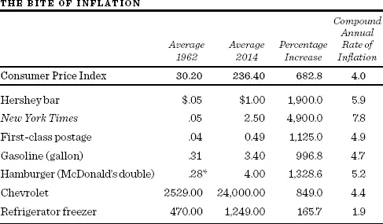

# 坚实基础与空中楼阁


愤世嫉俗者是什么样的人？他只知道万物的价格，却不懂它们的价值。\
Oscar Wilde, *Lady Windermere's Fan*


在本书中，我将带你沿着华尔街进行一次随机漫步（Random Walk），为你引导性地介绍复杂的金融世界，并就投资机会与策略提供实用建议。许多人认为，个人投资者在今天的华尔街专业人士面前几乎没有机会。他们指出，专业人士运用复杂的衍生金融工具（Derivative Instruments）和高频交易（High-Frequency Trading）来进行投资操作。他们读到的是会计欺诈、巨额收购以及资金雄厚的对冲基金活动的新闻报道。这种复杂性似乎表明，在当今市场中，个人投资者已无立足之地。但事实远非如此。你可以做得和专家一样好——甚至可能更好。正是那些在2009年3月股市暴跌时保持冷静的坚定投资者，最终看到自己的持仓价值恢复并继续产生可观的回报。而许多专业人士在2008年因为买入自己并不理解的衍生证券而损失惨重，2000年代初同样因为过度持有定价过高的科技股而遭受重创。

本书是为个人投资者编写的简洁指南。内容涵盖从保险到所得税的方方面面。它告诉你如何购买人寿保险，如何避免被银行和经纪人坑骗。它甚至会告诉你如何对待黄金和钻石。但从根本上说，这是一本关于普通股（Common Stock）的书——普通股不仅在过去提供了丰厚的长期回报，而且在未来似乎也前景可观。第四部分描述的生命周期投资指南（Life-Cycle Investment Guide）为各年龄段的个人提供了具体的投资组合建议，以实现其财务目标，包括退休投资方面的指导。

## 什么是随机漫步？

随机漫步是指未来的步伐或方向无法根据过去的历史来预测。当这一术语被应用于股票市场时，意味着股票价格的短期变化是不可预测的。投资咨询服务、盈利预测和复杂的图表形态都是无用的。在华尔街，"随机漫步"这个词被视为粗话。它是由学术界创造的一个贬义词，用来侮辱那些专业的预言家们。推到极端，它的意思是：一只蒙着眼睛的猴子朝股票列表投掷飞镖，也能选中一个与专家选的一样好的投资组合。

身着条纹西装的金融分析师们可不喜欢被比作光屁股的猿猴。他们反驳说，学者们整天沉浸在方程式和希腊字母中（更不用说那些枯燥的散文），即使在瓷器店里也分不清牛和熊。市场专业人士用两种技术中的一种来抵御学术界的攻势，即基本面分析（Fundamental Analysis）和技术分析（Technical Analysis），我们将在第二部分加以考察。学者们则用随机漫步理论的三个版本（"弱式"、"半强式"和"强式"）来混淆视听，并创造了自己的一套理论，叫做新投资技术（New Investment Technology）。后者包括一个叫做贝塔（Beta）的概念，以及"聪明贝塔"（Smart Beta），我打算对此稍加鞭挞。到了2000年代初，甚至一些学者也开始与专业人士一起认为，股市至少在某种程度上是可以预测的。尽管如此，正如你所看到的，一场激烈的战斗正在进行，而且赌注极高——对学者来说是终身教职，对专业人士来说是巨额奖金。这就是为什么我认为你会喜欢这次华尔街随机漫步。它具备大戏的所有要素——包括财富的创造与毁灭，以及围绕其原因的经典论战。

但在开始之前，也许我应该先自我介绍一下，并说明我作为向导的资格。在写作本书时，我借鉴了自身背景的三个层面；每一层面都为理解股票市场提供了不同的视角。

首先，我在投资分析和投资组合管理（Portfolio Management）领域拥有丰富的职业经验。我的职业生涯起步于华尔街一家顶尖投资公司的市场专业人士。后来，我担任了一家跨国保险公司的投资委员会主席，并在一家全球最大的投资公司担任了多年的董事。这些视角对我来说不可或缺。人生中有些事情是处女永远无法完全体会或理解的。股市或许也是如此。

其次，我目前担任经济学家以及多个投资委员会主席的职务。专注于证券市场和投资行为研究，我获得了关于投资机会的学术研究和新发现的详细知识。

最后，同样重要的是，我是一个终身投资者，也是市场的成功参与者。至于有多成功，我就不说了，因为学术界有个不成文的规矩：教授不应该赚钱。教授可以继承大笔财富，可以嫁入豪门，可以大把花钱，但绝不能自己赚大钱——那太不学术了。总之，教师应该是"奉献者"，至少政客和行政管理者常常这样说——尤其是在试图为低廉的学术薪酬辩护的时候。学者应该是知识的追求者，而非经济回报的追求者。因此，我将从后一种意义上，向你讲述我在华尔街的胜利。

本书包含大量的事实和数据。别为此担心。它专门为金融外行编写，提供经过检验的实用投资建议。你不需要任何预备知识就能读懂它。你只需要兴趣和让投资为你工作的意愿。

## 今天的投资生活方式

此时，解释一下"投资"的含义，以及我如何将投资活动与"投机"加以区分，大概是个好主意。我认为投资是一种以合理可预测的收入（股息、利息或租金）和/或长期增值为目的来购买资产的方式。投资回报的时间跨度和回报的可预测性，通常是区分投资与投机的标准。投机者（Speculator）买入股票，期望在接下来几天或几周内获得短期收益。投资者（Investor）买入股票，期望在未来数年甚至数十年中产生稳定的现金流回报和资本增值。

让我明确告诉你：这不是一本为投机者写的书——我不会承诺一夜暴富。我不会向你承诺股市奇迹。事实上，本书的副标题很可能是"慢慢致富之道"。记住，仅仅保持不亏损，你的投资回报率就必须等于通货膨胀率。

美国和大多数发达国家的通货膨胀率在2000年代初降至2%以下，一些分析师认为相对的价格稳定将无限期延续下去。他们提出，通货膨胀是例外而非规律，历史上技术快速进步和和平时期的经济阶段都伴随着稳定的甚至下降的价格水平。在未来的几十年里，很可能出现轻微甚至没有通胀的情况，但我认为投资者不应排除通胀在未来某个时点再次加速的可能性。尽管1990年代和2000年代初生产率增长加速，但最近已有所放缓，而历史告诉我们，进步的步伐从来就不均匀。此外，在一些以服务为导向的活动中，生产率的提高更加困难。在整个21世纪，演奏弦乐四重奏仍然需要四位音乐家，做阑尾切除术仍然需要一位外科医生；如果音乐家和外科医生的薪资随时间上涨，音乐会门票和手术费用也会随之上升。因此，价格上涨的压力不容忽视。

即使通胀率维持在2%到3%——远低于1970年代和1980年代初的水平——对我们购买力的影响仍然是毁灭性的。下页的表格显示了1962年至2014年间接近4%的平均通胀率造成了什么后果。我的晨报价格上涨了4,900%。我下午吃的赫尔希巧克力棒贵了二十倍，而且实际上比1962年我读研究生时更小了。如果通胀以同样的速度持续下去，到2020年今天的晨报价格将超过四美元。显然，即使面对温和的通货膨胀，我们也必须采取维持实际购买力的投资策略；否则，我们的生活水平将不断下降。

投资需要付出努力，这一点毫无疑问。浪漫小说中满是因疏忽或缺乏理财知识而导致大家族财富丧失的故事。谁会忘记契诃夫伟大戏剧中樱桃园被砍伐的声音？是自由企业，而非马克思主义体制，导致了拉涅夫斯基家族的覆灭：他们没有努力保住自己的财富。即使你把所有资金都交给投资顾问或共同基金（Mutual Fund），你仍然需要知道哪个顾问或哪只基金最适合管理你的资金。掌握了本书中的信息，你会发现做出投资决策会更容易一些。

\*1963年数据。

来源：1962年价格来自《福布斯》（Forbes），1977年11月1日刊；2014年价格来自各类政府和私人来源。

最重要的是，投资本身是有趣的。将自己的智识与庞大的投资群体较量，并发现自己的资产因此增长，这本身就是一种乐趣。审视投资回报，看到它们以超过薪资增长的速度累积，令人兴奋。了解产品和服务的新理念、金融投资形式的创新，同样令人振奋。一个成功的投资者通常是一个全面发展的个体，将天生的好奇心和智识兴趣付诸实践。

## 投资理论

所有的投资回报——无论是来自普通股还是稀有的钻石——在不同程度上都取决于未来的事件。这正是投资的魅力所在：它是一场以预测未来能力为成败关键的赌局。传统上，投资界的专业人士使用两种资产估值方法之一：坚实基础理论（Firm-Foundation Theory）或空中楼阁理论（Castle-in-the-Air Theory）。数百亿美元的得失都与这些理论有关。更具戏剧性的是，它们似乎是互相排斥的。理解这两种方法对于做出明智的投资决策至关重要，也是避免严重失误的先决条件。在二十世纪末，一种诞生于学术界、被称为新投资技术的第三种理论开始在"华尔街"流行起来。在本书后续部分，我将描述这一理论及其在投资分析中的应用。

### 坚实基础理论

坚实基础理论认为，每一种投资工具，无论是普通股还是一块不动产，都有一个被称为"内在价值"（Intrinsic Value）的坚实锚点，这一价值可以通过对当前状况和未来前景的仔细分析来确定。当市场价格跌至这一坚实内在价值基础之下（或涨至之上）时，就出现了买入（卖出）机会，因为这种波动最终会被修正——至少理论上如此。投资由此变成了一件枯燥但直截了当的事：将某物的实际价格与其坚实的价值基础进行比较。

很难将坚实基础理论的创始功劳归于某一个人。S. Eliot Guild 常被认为是这一理论的创始人，但该方法的经典发展，尤其是其中的精微之处，是由 John B. Williams 完成的。

在《投资价值理论》（*The Theory of Investment Value*）一书中，Williams 提出了一个确定股票内在价值的实际公式。Williams 的方法基于股息收入。他以一种巧妙的方式引入了"贴现"（Discounting）的概念来增加分析的复杂性。贴现基本上是从反方向来看待收入。你不是看明年能有多少钱（比如，将1美元存入年利率5%的储蓄凭证），而是看未来预期收入，然后看它在当前值多少钱（因此，明年的1美元今天只值约95美分，这些钱以5%的利率投资，届时大约能产生1美元）。

Williams 对此是认真的。他进一步论证，股票的内在价值等于其所有未来股息的现值（或贴现值）。他建议投资者对延迟收到的金钱进行"贴现"。由于很少有人理解这个概念，术语流行开来，"贴现"如今在投资界广为使用。耶鲁大学 Irving Fisher 教授——一位杰出的经济学家和投资者——的推崇进一步推广了这一概念。

坚实基础理论的逻辑相当严谨，可以用普通股来说明。该理论强调，股票的价值应当基于公司未来能够以股息形式分配的盈利流。顺理成章的是，当前股息越高、增长速度越快，股票的价值就越大；因此，增长率的差异是股票估值的一个主要因素。现在，那个滑溜溜的小因子——未来预期——悄然登场了。证券分析师不仅要估计长期增长率，还要判断这种非凡的增长能维持多久。当市场对未来增长能持续多久过度乐观时，华尔街流行的说法是：股票不仅在贴现未来，甚至可能在贴现来世。关键在于，坚实基础理论依赖于对未来增长的程度和持续时间的一些棘手预测。因此，内在价值的基础可能不如宣称的那样可靠。

坚实基础理论并非经济学家的专属。得益于一本极具影响力的书——Benjamin Graham 和 David Dodd 的《证券分析》（*Security Analysis*）——整整一代华尔街证券分析师被纳入了这一阵营。这些实践中的分析师学到的是，稳健的投资管理无非是买入价格暂时低于内在价值的证券，卖出价格暂时过高的证券。就这么简单。当然，书中也提供了确定内在价值的指导，任何称职的分析师都能用简单的算术计算出来。Graham 和 Dodd 方法最成功的门徒，大概要数那位精明的中西部人 Warren Buffett，他常被称为"奥马哈的先知"。Buffett 据称按照坚实基础理论的方法，创造了传奇的投资业绩。

### 空中楼阁理论

空中楼阁理论（Castle-in-the-Air Theory）专注于心理价值。著名经济学家兼成功投资者 John Maynard Keynes 在1936年最清晰地阐述了这一理论。他认为，专业投资者与其致力于估算内在价值，不如分析投资者群体未来可能如何行为，以及在乐观时期他们倾向于将希望筑成空中楼阁。成功的投资者试图先发制人，估计哪些投资状况最容易被公众的"空中楼阁"所影响，然后在人群之前买入。

Keynes 认为，坚实基础理论太费功夫，且价值可疑。Keynes 言行一致。当伦敦金融界人士在拥挤的办公室里辛苦劳作许多疲惫的小时时，他每天早上在床上悠闲地操作半小时的市场。这种悠闲的投资方式为他赚取了数百万英镑，并使他所在的剑桥大学国王学院（King's College, Cambridge）捐赠基金的市值增长了十倍。

在 Keynes 获得声望的大萧条年代，大多数人关注的是他刺激经济的思想。当时很难有人建造空中楼阁，更难想象别人会建造。然而，在其著作《就业、利息和货币通论》（*The General Theory of Employment, Interest and Money*）中，Keynes 用一整章的篇幅讨论了股票市场和投资者预期的重要性。

关于股票，Keynes 指出，没有人确切知道什么会影响未来的盈利前景和股息支付。因此，他说大多数人"关心的主要是，不是对一项投资在整个生命期内可能收益的优越长期预测，而是在公众之前预见估值惯例基础的变化。"换言之，Keynes 将心理学原理而非财务评估应用于股市研究。他写道："如果你认为一项投资的预期收益合理估值为30，但你同时相信三个月后市场会将其定价为20，那么以25买入是不明智的。"

Keynes 用他的英国同胞容易理解的类比来描述股市操作：这类似于参加一场报纸选美比赛，参赛者必须从一百张照片中选出六张最漂亮的面孔，奖品归属与整体群体选择最一致的人。

聪明的参赛者认识到，个人的审美标准在决定比赛胜负时无关紧要。更好的策略是选择其他参赛者可能青睐的面孔。这种逻辑往往会像滚雪球一样层层递进。毕竟，其他参赛者至少也会带着同样敏锐的感知参与比赛。因此，最优策略不是选择自认为最漂亮的面孔，也不是选择其他参赛者可能青睐的面孔，而是预测大众意见对大众意见的看法，甚至沿着这个序列走得更远。关于英国选美的讨论就到此为止。

报纸选美的类比代表了空中楼阁理论在价格决定方面的终极形态。一项投资对买家来说值一定价格，是因为她期望以后能以更高的价格卖给别人。换言之，这项投资凭借自身的靴带把自己拉了起来。新买家又预期未来买家会赋予更高的价值。

在这个世界里，每分钟都有一个傻瓜诞生——他存在的意义就是以更高的价格购买你的投资。只要别人愿意出更高的价，任何价格都可以。这里没有理性，只有大众心理。聪明的投资者所要做的就是先发制人——在最开始就入场。这个理论如果不太客气地叫，就是"博傻"理论（Greater Fool Theory）。只要事后能找到某个冤大头以五倍的价格接手，你以三倍的价格买入也不成问题。

空中楼阁理论在金融界和学术界都有众多拥护者。诺贝尔奖得主 Robert Shiller 在其著作《非理性繁荣》（*Irrational Exuberance*）中论证，1990年代末互联网和高科技股票的狂热只能用大众心理学来解释。在大学里，强调群体心理学的所谓股市行为理论（Behavioral Finance），在2000年代初获得了发达国家顶尖经济学院和商学院的青睐。心理学家 Daniel Kahneman 因其对"行为金融学"领域的开创性贡献而获得2002年诺贝尔经济学奖。此前，Oskar Morgenstern 也是一位重要的倡导者。Morgenstern 认为，寻找股票的内在价值如同追逐鬼火。在交换经济中，任何资产的价值都取决于实际或预期的交易。他相信每个投资者都应该在办公桌上贴上这条拉丁格言：

*Res tantum valet quantum vendi potest.*\
（一物仅值他人愿付之价。）

## 如何进行这次随机漫步

介绍到此结束，现在请随我穿过投资丛林进行一次随机漫步，最终漫步华尔街。我的首要任务是让你了解历史定价模式及其与两种投资定价理论的关系。Santayana 曾告诫我们，如果不从过去吸取教训，就注定要重蹈覆辙。因此，我将描述一些令人瞩目的疯狂投机潮——既有久远的，也有近期的。一些读者可能会对十七世纪荷兰人疯狂抢购郁金香球茎和十八世纪英国南海泡沫嗤之以鼻。但没有人能忽视1960年代初的新股发行狂潮，或1970年代的"漂亮五十"（Nifty Fifty）风潮。日本土地和股票价格令人难以置信的暴涨及其在1990年代初同样惊人的崩盘，1999年和2000年初的"互联网狂热"，以及2007年终结的美国房地产泡沫，都不断警示着我们：无论是个人投资者还是投资专业人士，都无法免疫于过去的错误。
