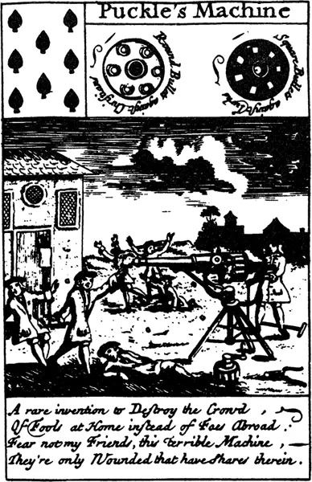
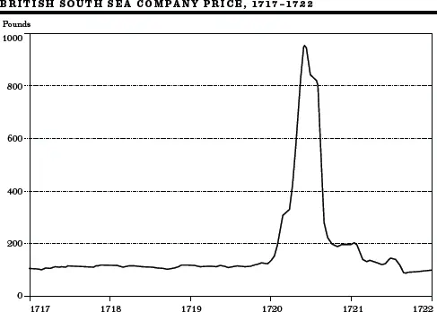
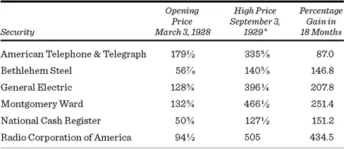
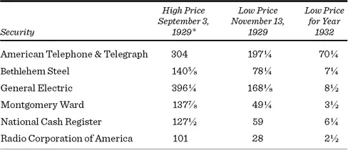

# 群众的疯狂


十月。这是投机股票特别危险的月份之一。其他月份还有：七月、一月、九月、四月、十一月、五月、三月、六月、十二月、八月和二月。\
Mark Twain, *Pudd'nhead Wilson*


贪婪失控是历史上每一次壮观繁荣的基本特征。在狂热中，市场参与者忽视了坚实的价值基础，转而追求那个可疑但刺激的假设——他们可以通过建造空中楼阁而暴富。这种思维方式笼罩了整个国家。

投机心理学堪称一出荒诞派戏剧。本章将呈现其中几出。这些表演中建造的空中楼阁，有的基于荷兰郁金香球茎，有的基于英国"泡沫"，还有的基于老牌美国蓝筹股。在每种情况下，有些人在某些时候赚了钱，但只有极少数人能全身而退。

历史在这一点上确实给出了教训：虽然空中楼阁理论可以很好地解释这类投机狂潮，但猜透善变人群的反应是一场极其危险的游戏。"在群体中累积的是愚蠢而非智慧，" Gustave Le Bon 在其1895年关于群体心理学的经典著作中如此指出。看来读过这本书的人并不多。依赖纯粹心理支撑而飞涨的市场，无一例外地屈服于金融引力法则。不可持续的价格可能持续多年，但最终会自行反转。这些反转来势如地震般突然；而且狂欢越盛大，随之而来的宿醉就越严重。少数鲁莽的空中楼阁建造者能够敏捷地预见到这些反转，并在一切轰然倒塌时及时脱身。

## 郁金香狂热

郁金香球茎狂热是历史上最壮观的暴富狂潮之一。当你意识到它发生在十七世纪初保守的荷兰时，其疯狂程度就更加触目惊心。引发这场投机狂热的事件始于1593年，当时一位从维也纳新任命的植物学教授将一批源自土耳其的奇异植物带到了莱顿（Leyden）。荷兰人对花园中的这些新成员着迷不已——但对教授的要价并不感兴趣（他本指望卖掉球茎大赚一笔）。一天夜里，小偷闯入教授家中偷走了球茎，后来以更低的价格出售却获得了更高的利润。

在接下来的十年左右，郁金香成为荷兰花园中流行但昂贵的花卉。许多花朵感染了一种名为"花叶病"（Mosaic）的非致命性病毒。正是这种花叶病触发了对郁金香球茎的疯狂投机。病毒使郁金香花瓣上形成对比鲜明的条纹或"火焰"。荷兰人高度重视这些被感染的球茎，称之为"奇花"（Bizarres）。很快，大众品味决定：一株球茎越奇特，拥有它的代价就越高。

慢慢地，郁金香狂热（Tulipmania）蔓延开来。起初，球茎商人只是试图预测来年最流行的花色，就像服装制造商在判断公众对布料、颜色和裙摆长度的品味一样。然后他们会大量囤货以期价格上涨。郁金香球茎价格开始疯狂上涨。球茎越贵，人们越觉得它们是精明的投资。Charles Mackay 在其《非同寻常的大众幻想与群体性疯狂》（*Extraordinary Popular Delusions and the Madness of Crowds*）一书中记录了这些事件，他指出全国正常的产业都荒废了，取而代之的是对郁金香球茎的投机："贵族、市民、农民、工匠、水手、仆人、女仆，甚至烟囱清扫工和旧衣商都涉足郁金香。"每个人都幻想对郁金香的热情将永远持续下去。

那些声称价格不可能再涨的人，眼睁睁看着朋友和亲属赚取巨额利润而懊恼不已。加入他们的诱惑实在难以抗拒。在郁金香狂潮的最后几年——大约从1634年持续到1637年初——人们开始用个人财物如土地、珠宝和家具来交换能使他们更加富有的球茎。球茎价格达到了天文数字。

金融市场的一大天才之处在于，当真正需要一种增强投机机会的手段时，市场一定会提供它。让郁金香投机者以最少资金获得最大投机效果的工具是"看涨期权"（Call Options），类似于今天股市中流行的期权。

看涨期权赋予持有者在指定期间内以固定价格（通常接近当时的市场价格）买入郁金香球茎的权利。持有者需支付一笔称为期权费（Option Premium）的费用，这可能是当时市场价格的15%到20%。例如，一个当前价值100荷兰盾的郁金香球茎期权，买方只需支付约20荷兰盾。如果价格涨到200荷兰盾，期权持有者将行使权利；他以100荷兰盾买入，同时以200荷兰盾的当时市价卖出。这样他就获得了80荷兰盾的利润（100荷兰盾的增值减去20荷兰盾的期权费）。于是他的资金翻了四倍，而直接购买则只能使资金翻倍。期权提供了一种杠杆化投资的方式，可以增加潜在回报，同时也增加了风险。这类工具确保了市场的广泛参与。今天也是如此。

那个时代的历史充满了悲喜剧式的故事。其中一个故事涉及一位返航的水手，他给一位富商带来了新货到港的消息。商人以一顿美味的红鲱鱼早餐作为报答。水手看到商人柜台上有一个他以为是洋葱的东西，无疑觉得它出现在丝绸和天鹅绒中间很不协调，于是把它当作鲱鱼的佐料吃了。他万万没想到，那个"洋葱"足够整条船的船员吃上一年。那是一株名贵的"永远的奥古斯都"（Semper Augustus）郁金香球茎。水手为自己的佐料付出了沉重的代价——不再感激的主人以重罪指控将他关了几个月的监狱。

历史学家经常重新解读过去，一些重新审视各种金融泡沫证据的金融历史学家认为，定价中可能确实存在相当程度的理性。其中一位修正主义历史学家 Peter Garber 认为，十七世纪荷兰的郁金香球茎定价远比通常认为的更为理性。

Garber 提出了一些好的论点，我并非暗示在球茎价格结构中完全没有理性。例如，Semper Augustus 是一种特别稀有而美丽的球茎，正如 Garber 所揭示的，即使在郁金香狂热之前就备受推崇。此外，Garber 的研究表明，稀有的个别球茎即使在球茎价格全面崩溃之后仍然价格高昂，尽管只是其巅峰价格的一小部分。但 Garber 无法为以下现象找到理性解释：1637年1月郁金香球茎价格二十倍的上涨，随后在2月出现了更大幅度的下跌。显然，正如所有投机狂潮中发生的那样，价格最终涨得太高，一些人决定谨慎行事并出售他们的球茎。很快其他人纷纷效仿。就像滚下山坡的雪球一样，球茎价格的下跌以越来越快的速度蔓延，转眼间恐慌蔓延。

政府大臣们正式声明郁金香球茎没有理由下跌——但无人理会。经销商纷纷破产，拒绝履行购买郁金香球茎的承诺。一项政府计划试图以面值10%的价格结算所有合同，但球茎价格甚至跌到了这一水平以下。价格继续下跌。一路走低，直到大多数球茎变得几乎一文不值——售价不过相当于一个普通洋葱的价格。

## 南海泡沫

假设你的经纪人打电话向你推荐投资一家没有销售收入或利润的公司——只是前景很好。"什么业务？"你问。"抱歉，"你的经纪人解释说，"没人能知道具体业务是什么，但我可以向你保证巨额财富。"你可能会说，这是骗局。没错，但在300年前的英国，这是当时最热门的新股之一。而且，正如你所料，投资者损失惨重。这个故事说明了欺诈如何使贪婪的人更加急切地掏出他们的钱。

在南海泡沫（South Sea Bubble）时期，英国人正处于挥霍金钱的最佳状态。长期的繁荣积累了丰厚的储蓄，却缺乏投资渠道。在那个年代，拥有股票被视为一种特权。例如，直到1693年，仅有499人从东印度公司（East India Company）的股票中获益。他们通过多种方式获得回报，其中最重要的是股息免税。此外，他们中包括女性，因为股票是英国女性能够合法拥有的少数几种财产形式之一。南海公司（South Sea Company）顺理成章地填补了对投资工具的需求，它成立于1711年，旨在恢复人们对政府履行债务能力的信心。该公司承接了政府近1000万英镑的借据。作为回报，它获得了南太平洋地区所有贸易的垄断权。公众相信在这种贸易中将获得巨额财富，因而对该股票格外青睐。

从一开始，南海公司就是在牺牲他人利益的基础上获利。那些将被公司承接的政府证券持有者只需将手中的证券换成南海公司的证券。而那些提前知道该计划的人悄悄买下了低至55英镑的政府证券，然后在公司成立时以面值100英镑换成等值的南海公司股票。公司没有一位董事拥有丝毫南美贸易的经验。但这并没有阻止他们迅速装备非洲奴隶船（奴隶买卖是南美贸易中最赚钱的业务之一）。但即使这项冒险也未能盈利，因为船上的死亡率太高。

然而，董事们深谙公众形象的艺术。他们在伦敦租下一栋气派的大楼，董事会会议室配备了三十把黑色西班牙软垫椅，山毛榉框架和镀金铆钉使它们看起来很漂亮，但坐起来并不舒服。与此同时，一批急需运往韦拉克鲁斯（Vera Cruz）的公司羊毛被送到了卡塔赫纳（Cartagena），因缺乏买家而腐烂在码头上。尽管如此，公司的股票在接下来的几年里保持了稳健，甚至温和上涨，尽管"红利"股票股息的稀释效应以及与西班牙的战争导致贸易机会暂时中断。优秀历史著作《南海泡沫》（*The South Sea Bubble*）的作者 John Carswell 写到南海公司证券的主要推销者之一、董事 John Blunt 时说："他继续过着右手拿着祈祷书、左手拿着招股说明书的生活，从不让右手知道左手在做什么。"

在海峡对岸，另一位名叫 John Law 的流亡英国人成立了另一家公司。Law 的毕生目标是用纸币取代金属货币，通过国家纸币创造更多流动性。（比特币推广者们追随的正是一个悠久的传统。）为了推进他的目标，Law 收购了一家名为密西西比公司（Mississippi Company）的废弃企业，并着手建立了一个有史以来最大的企业集团之一。

密西西比公司吸引了来自整个欧洲大陆的投机者及其资金。"百万富翁"（Millionaire）这个词就诞生于此时，这并不奇怪：密西西比公司的股价在短短两年内从100英镑飙升至2,000英镑，尽管这种上涨毫无逻辑依据。密西西比公司在法国膨胀的总市值一度超过了该国所有金银总值的八十倍。

与此同时，在海峡的英国一侧，一些英国大宅中开始出现沙文主义情绪。为什么所有的钱都要流向法国的密西西比公司？英国拿什么来抗衡？答案就是南海公司，其前景正开始好转，特别是有消息称与西班牙将实现和平，通往南美贸易的道路终于打通了。据说墨西哥人正在等待机会清空他们的金矿，以换取英国大量的棉花和毛纺织品。这正是自由企业最美好的时刻。

1720年，贪婪的董事们决定利用自己的声誉，提出承揽全部国债——总额达3100万英镑。这确实是大胆之举，公众为之狂热。当相关法案提交议会时，股票立即从130英镑涨到了300英镑。

各种对法案通过表示兴趣的朋友和赞助者获得了免费股票赠予，他们可以在股价上涨后将股票"卖回"给公司，个人获取利润。受惠者中包括乔治一世的情妇及其"侄女们"，她们每个人都与国王有着惊人的相似之处。

1720年4月12日，即法案成为法律的五天后，南海公司以每股300英镑的价格发行新股。这次发行可以分期购买——首付60英镑，余款分八期轻松支付。连国王也无法抗拒；他认购了总计100,000英镑的股票。争先恐后涌入购买的其他投资者之间甚至爆发了冲突。为了平息公众的胃口，南海董事们宣布了又一次新发行——这次价格是400英镑。但公众如饥似渴。一个月内股价涨到了550英镑。6月15日，又一次发行。这次付款条件更加优惠——首付10%，一年内无需再付。股价冲到了800英镑。上议院一半的议员和下议院过半数的议员都签了名。最终，价格涨到了1,000英镑。投机狂潮达到了顶峰。

即使是南海公司也无法满足所有想脱手钱财的傻瓜们的需求。投资者开始寻找其他能从底层进入的新项目。正如今天的投机者在寻找下一个谷歌一样，1700年代初的英国人也在寻找下一个南海公司。发起人通过组织并向市场推出大量新股来满足对投资的贪婪渴望。

随着日子一天天过去，新的融资提案从巧妙到荒谬不等——从从西班牙进口大量公驴（尽管英国供应充足），到将海水变淡。这些推销越来越多地涉及欺诈元素，例如用锯末制造木板。当时有近百种不同的项目，一个比一个铺张、一个比一个具有欺骗性，但每个都承诺巨额回报。它们很快被称为"泡沫"（Bubbles），这个名字再恰当不过。就像肥皂泡一样，它们迅速破裂——通常在一周左右。

公众似乎什么都愿意买。在此期间寻求融资的新公司，其设立目的五花八门：建造抵御海盗的船只；鼓励英国马匹繁殖；进行人类毛发贸易；为私生子建医院；从铅中提取银；从黄瓜中提取阳光；甚至制造永动机。

然而，最大的奖杯无疑属于那位不知名的人物，他创立了一家"从事伟大事业但无人知晓其内容的公司"。招股说明书承诺前所未有的回报。上午九点认购簿一开启，各阶层人群蜂拥而至，几乎要把门挤破。五个小时内，一千名投资者就交出了购买公司股票的钱。发起人自己倒不贪心，立刻关门歇业前往欧洲大陆。从此再无音讯。

并非所有泡沫公司的投资者都相信他们所认购方案的可行性。人们对此"太理性"了。但他们确实相信"博傻"理论——价格会上涨，会找到买家，他们会赚到钱。因此，大多数投资者认为自己的行为极其理性，期望能在"二级市场"——即新股发行后的交易市场——以溢价出售自己的股票。

诸神欲使其灭亡，必先使其疯狂。末日将至的征兆出现在一副南海扑克牌的发行中。每张牌上都有一家泡沫公司的漫画，下面配有恰当的诗句。其中一家叫 Puckle 机器公司，据称生产能同时发射圆形和方形炮弹的机器。Puckle 声称他的机器将彻底改变战争艺术。下一页的黑桃八描述如下：

*一种罕见的发明，用来消灭人群，*

*消灭国内的傻瓜而非远方的敌人：*

*别怕，朋友们，这台可怕的机器，*

*受伤的只是持有它股票的人。*

许多单个泡沫被刺破了，但并未打击投机热情。然而在八月，灾难降临了——南海公司遭受了不可挽回的打击。董事和高管们意识到市场价格与公司的实际前景毫无关系，于是在夏天抛售了手中的股票。

消息泄露后，股价下跌。很快股价崩溃，恐慌蔓延。下图显示了南海公司股票惊人的涨跌过程。政府官员们试图恢复信心但徒劳无功，公众信用的全面崩溃险些发生。同样，密西西比公司股票的价格也跌至微不足道的水平，因为公众意识到过多的纸币并不能创造真正的财富，只会造成通货膨胀。南海泡沫中最大的输家之一是 Isaac Newton，他感叹道："我能计算天体的运动，却无法计算人类的疯狂。"空中楼阁就此告终。

为了保护公众免受进一步的侵害，议会通过了《泡沫法案》（Bubble Act），禁止公司发行股票证书。在一个多世纪的时间里——直到该法案于1825年被废除——英国市场上流通的股票证书相对较少。

来源：Larry Neal, *The Rise of Financial Capitalism* (Cambridge University Press, 1990).

## 华尔街崩盘

郁金香和泡沫，说到底，都是古老的往事。同样的事情在更现代的时期会发生吗？让我们转向更近期的事件。美国，这片充满机遇的土地，在1920年代迎来了自己的轮次。鉴于我们对自由和增长的强调，我们创造了文明史上最壮观的繁荣之一和最响亮的崩盘之一。

投机狂潮的条件再有利不过了。全国正经历着无与伦比的繁荣。人们不可能不对美国商业抱有信心，正如 Calvin Coolidge 所说："美国的事务就是商业。"商人被比作宗教传教士，几乎被神化了。这种类比甚至被反向运用。纽约广告公司 Batten, Barton, Durstine & Osborn 的 Bruce Barton 在《无人知晓的人》（*The Man Nobody Knows*）中写道，耶稣是"第一位商人"，他的寓言是"有史以来最强大的广告"。

1928年，股票市场投机成为全民消遣。从1928年3月初到1929年9月初，市场涨幅等于整个1923年到1928年初的总和。主要工业公司的股价有时一天就上涨10到15个点。价格涨幅如下表所示。

\*经股票拆分调整，并计入1928年3月3日后收到的配股权价值。

并非"所有人"都在投机。借钱买股票（保证金购买，Buying on Margin）确实从1921年的10亿美元增加到1929年的近90亿美元。然而，1929年只有约一百万人持有保证金股票。尽管如此，投机精神至少与之前的狂潮一样普遍，其强度更是无与伦比。更重要的是，股市投机是文化的核心。John Brooks 在《戈尔康达往事》（*Once in Golconda*）中记录了一位刚到纽约的英国记者的评论："你可以谈论禁酒令、海明威、空调、音乐或马，但最终你必须谈论股市，而到了那时谈话才变得认真起来。"

不幸的是，有数百名笑容可掬的操纵者乐于帮助公众建造空中楼阁。股票交易所的操纵达到了无耻的新纪录。最好的例子莫过于投资池（Investment Pool）的操作。其中一个项目在四天内将 RCA 股票的价格推高了61个点。

投资池一方面需要密切合作，另一方面则对公众完全蔑视。通常这类操作始于一群交易者联合起来操纵某只特定股票。他们指定一位池经理（池经理被认为是一种艺术家），并承诺不通过私人操作互相背叛。

池经理在数周内通过不起眼的买入积累了大量股票。如果可能，他还获得以当前市场价格购买大宗股票的期权。接下来，他试图将股票的交易所专家经纪人（Specialist）争取为盟友。

池成员之所以如鱼得水，是因为专家经纪人站在了他们一边。股票交易所专家经纪人充当"经纪人的经纪人"。如果一只股票以每股50美元交易，你给经纪人下了45美元买入的指令，经纪人通常会把这个指令交给专家经纪人。当且仅当股票跌到45美元时，专家经纪人才会执行这笔交易。所有低于市价的买入指令和高于市价的卖出指令都保存在专家经纪人所谓的"私密账本"中。现在你明白为什么专家经纪人对池经理如此有价值了。这个账本提供了现有买卖指令在市价上下分布的信息。了解公众玩家手中的底牌总是有帮助的。现在，真正的好戏要开始了。

通常在此时，池经理会让池内成员之间互相交易。例如，Haskell 以40的价格卖给 Sidney 200股，Sidney 以40⅛的价格卖回。然后以40¼和40½的价格重复买卖400股。接着以40⅝的价格卖出一笔1000股的大单，再以40¾的价格卖出另一笔。这些交易通过全国各地的股票自动报价机（Ticker）记录下来，给人一种活跃的假象，传递给挤满全国各券商营业部的成千上万看盘者。这种由所谓的"对敲交易"（Wash Sales）制造的活跃假象，让人觉得有什么大事即将发生。

现在，受池经理控制的内幕消息发布者和市场评论员会透露令人兴奋的发展动向。池经理还试图确保来自公司管理层的消息越来越有利。如果一切顺利——在1928-29年的投机氛围中几乎不可能失败——交易量的活跃和经过管理的消息相结合就会吸引公众入场。

一旦公众入场，自由混战就开始了，是时候巧妙地"拔掉塞子"了。当公众在买入时，池在卖出。池经理开始向市场投放股票，先是缓慢地，然后在公众来不及回过神来之前越来越大块地抛出。在这场过山车式的狂欢结束后，池成员净赚了巨额利润，而公众则被留下了那些突然贬值的股票。

但人们不必联合起来欺骗公众。许多个人，特别是公司高管和董事，自己干得也很好。以当时美国第二大银行大通银行（Chase）的负责人 Albert Wiggin 为例。1929年7月，Wiggin 先生对股票攀升到的高度感到不安，不再愿意做多市场。（据传他曾在一个推高自己银行股价的投资池中赚了几百万。）他认为自己银行的股票前景尤其暗淡，于是卖空了超过42,000股大通股票。卖空（Short Selling）是一种在股票下跌时赚钱的方式。它涉及卖出你目前并不持有的股票，期望以后以更低的价格买回来。这是先卖后买、低买高卖的倒序操作。

Wiggin 的时机把握得恰到好处。卖空操作之后，大通股票的价格立即开始下跌，当崩盘在秋季来临时，股票暴跌。当他在11月平仓时，他从这笔操作中净赚了数百万美元的利润。利益冲突显然并没有困扰 Wiggin 先生。公平地说，应该指出他在这一时期确实保留了大通股票的净多头持仓。尽管如此，今天的规则不会允许内幕人士通过交易自己的股票来获取短线利润。

1929年9月3日，市场指数达到了一个在此后四分之一个世纪里都未被超越的峰值。"无尽的繁荣之链"即将断裂；商业活动在几个月前就已转向下行。价格在接下来的一天小幅波动，到了第二天，即9月5日，市场遭遇了剧烈下跌，被称为"巴布森崩盘"（Babson Break）。

这一名称是为了纪念来自马萨诸塞州韦尔斯利的财务顾问 Roger Babson，他身材瘦弱、蓄着山羊胡子、面容古怪。在那天的一个金融午宴上，他说："我重复去年和前年同一时间说过的话，崩盘迟早会来。"华尔街专业人士对这位"韦尔斯利先知"的新宣言报以惯常的嘲讽。

正如 Babson 所暗示的，他预测崩盘已有数年，却尚未被证明正确。然而，下午两点，当 Babson 的话被引用在"宽幅"报价带上（道琼斯金融新闻带，是每个券商营业部的基本设施），市场急转直下。在交易的最后一个疯狂小时内，美国电话电报公司（AT&T）下跌了6点，西屋电气下跌了7点，美国钢铁下跌了9点。这是一个预言性的插曲。在巴布森崩盘之后，崩盘的可能性——在一个月前还完全不可想象——突然成为人们讨论的常见话题。

信心动摇了。九月坏日子多于好日子。市场多次急剧下跌。银行家和政府官员向全国保证没有理由担忧。耶鲁大学 Irving Fisher 教授——内在价值理论的创始人之一——提出了他即将不朽的观点：股票已达到一个看起来像是"永久性高平台"的水平。

到了10月21日星期一，一场经典的股市崩盘已不可避免。股票价格的下跌导致保证金客户被追加更多保证金。无力或不愿满足追缴要求的客户被迫抛售持仓。这进一步压低了价格，导致更多的追保通知，最终形成自我维持的抛售浪潮。

10月21日的交易量飙升至600多万股。股票自动报价机远远落后于实际交易，令全国各地数以万计在券商营业部看盘的人们惊恐不已。收盘后将近一小时四十分钟，最后一笔交易才在股票自动报价机上记录完毕。

不屈不挠的 Fisher 将这次下跌斥为"试图在保证金交易中投机的疯狂边缘群体被清洗出局"。他继续说道，繁荣期间的股价尚未赶上其实际价值，还会上涨。除此之外，这位教授认为市场尚未反映出禁酒令带来的积极影响——禁酒令使美国工人"更有生产力和更可靠"。

10月24日，后来被称为"黑色星期四"（Black Thursday），市场交易量达到近1300万股。有时每笔交易价格下跌5美元和10美元。许多股票在几个小时内下跌了40到50个点。第二天，Herbert Hoover 发表了他著名的诊断："国家的基础商业……建立在健全和繁荣的基础之上。"

1929年10月29日星期二是纽约证券交易所历史上最具灾难性的日子之一。只有1987年10月19日和20日的恐慌程度可以与之相比。1929年那天的交易量超过1640万股。（由于上市股票数量的增加，1929年1600万股的交易日相当于2014年数十亿股的交易日。）价格几乎垂直下跌，并持续下滑，如下表所示，该表显示了1929年秋季及随后三年中的跌幅程度。除了"安全的"AT&T仅损失了四分之三的价值外，大多数蓝筹股到1932年触底时已下跌了95%或更多。

\*经股票拆分调整，并计入1929年9月3日后收到的配股权价值。

也许对这场灾难最好的总结来自娱乐业周刊《综艺》（*Variety*），它的头条是"华尔街下了个蛋"。投机繁荣已死，数十亿美元的股票市值——以及数百万人的梦想——被一扫而空。股市崩盘之后是历史上最具毁灭性的经济大萧条。

同样，也有修正主义历史学家认为，1920年代末股市的疯狂是有章可循的。例如，Harold Bierman Jr. 在其著作《1929年的重大神话》（*The Great Myths of 1929*）中提出，如果没有完美的预见力，1929年的股票并未明显高估。毕竟，非常聪明的人如 Irving Fisher 和 John Maynard Keynes 都认为股票价格合理。Bierman 进一步论证，支撑股市的极端乐观情绪如果不是因为不当的货币政策，甚至可能是合理的。在他看来，崩盘本身是由美联储委员会提高利率惩罚投机者所引发的。Bierman 的论点中至少有一定的道理，今天的经济学家也常常将1930年代大萧条的严重程度归咎于美联储允许货币供应急剧下降。尽管如此，历史告诉我们，股价的急剧上涨很少随后逐渐回归相对的价格稳定。即使繁荣延续到1930年代，股价也无法维持1920年代末的涨势。

此外，封闭式投资基金（Closed-End Investment Company）股票的异常行为（我将在[第15章](ch15.md)介绍）为1920年代大范围的股市非理性提供了决定性证据。这些封闭式基金的"基本面"价值由其持有的证券市值组成。自1930年以来的大多数时期，这些基金以低于资产净值10%至20%的折价交易。然而，从1929年1月到8月，典型的封闭式基金以50%的溢价交易。此外，一些最知名基金的溢价达到了天文数字。高盛贸易公司（Goldman, Sachs Trading Corporation）以其净资产值两倍的价格交易。三洲公司（Tri-Continental Corporation）以其资产价值的256%交易。这意味着你可以去经纪人那里以当时的市场价格买入AT&T，或者通过基金以市场价值2½倍的价格买入。正是非理性的投机热情将这些基金的价格推到了远高于其个别证券持仓可购买价值的水平。

## 后记

为什么记忆如此短暂？为什么这些投机狂潮似乎与历史教训如此脱节？我没有恰当的答案，但我确信 Bernard Baruch 是对的——研究这些事件可以帮助投资者为生存做好准备。根据我的个人经验，市场中一贯的输家是那些无法抗拒被卷入某种郁金香狂热的人。在市场中赚钱并不难。难的是避免那种诱人的诱惑——将你的钱扔进短暂的、暴富式的投机狂欢中。这是一个显而易见的教训，却常常被忽视。

[\*](#footnote-233-1-backlink)Golconda（戈尔康达）如今已成废墟，曾是印度的一座城市。据传说，每个经过它的人都会变得富有。
