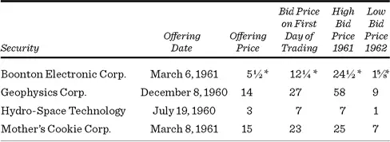
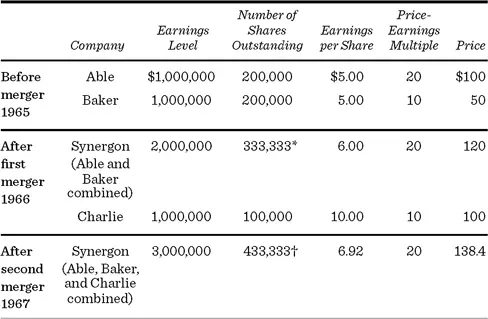
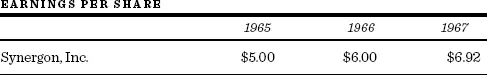
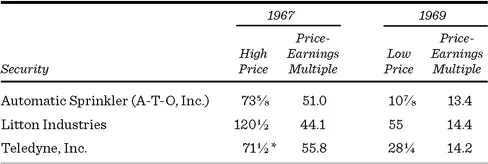
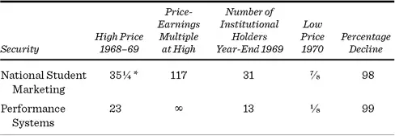
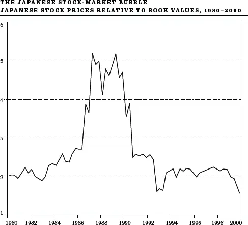

# 20世纪60年代至90年代的投机泡沫


万物皆有寓意，只要你能找到。\
Lewis Carroll, *Alice's Adventures in Wonderland*


群众的疯狂可以真正壮观到令人叹为观止。我刚才列举的例子，加上许许多多其他例子，已经说服越来越多的人将资金交给专业的投资组合经理——那些管理大型养老和退休基金、共同基金和投资咨询机构的人。虽然群众可能是疯狂的，但机构总该是理性的吧。好吧，那就让我们来看看机构的理性。

## 机构的理性

到了1990年代，机构投资者占纽约证券交易所交易量的90%以上。人们本以为专业人士冷静、精明的推理能力能够确保过去那种过度的疯狂不再出现。然而，从1960年代到1990年代，专业投资者参与了好几波明显的投机浪潮。在每种情况下，专业机构积极竞价购买股票，并非因为它们认为这些股票根据坚实基础原则被低估了，而是因为它们预期某些更傻的傻瓜会以更高的膨胀价格接手这些股票。由于这些投机活动与当今市场相关，我认为你会发现这次机构之旅特别有用。

## 疯狂的六十年代

### 新的"新时代"：成长股与新股发行狂热

我们的旅程从我入行的1959年开始——那时我刚到华尔街。"成长"是那个年代的魔法词汇，具有几乎神秘的意义。IBM 和 Texas Instruments 等成长型公司以超过80倍的市盈率（Price-Earnings Multiple）交易。（一年后，它们的市盈率降到了20到30倍。）

质疑这种估值的合理性几乎被视为异端。尽管这些价格无法用坚实基础原则来解释，但投资者相信买家仍会急切地以更高的价格买入。Keynes 一定会在他经济学家们死后去的那个地方静静微笑。

我清楚地记得公司的一位高级合伙人摇着头说，他认识的人中凡是记得1929-32年崩盘的，都不会买入并持有高价成长股。但年轻的一派占了上风。《新闻周刊》（*Newsweek*）引用一位经纪人的话说，投机者认为他们买的任何东西"都会在一夜之间翻倍。可怕的是，这确实发生了。"

好戏还在后头。急于满足投资者对"疯狂六十年代"太空时代股票无止境渴求的发起人，在1959-62年间创造的新股数量超过了历史上任何时期。新股发行狂潮的强度堪比南海泡沫，同样令人遗憾的是，其中揭露的欺诈行为也是如此。

它被称为"电子狂潮"（Tronics Boom），因为这些股票的名称中通常都包含某种"electronics"（电子）一词的变体，即使这些公司与电子行业毫无关系。这些新股的买家并不真正关心公司生产什么——只要听起来有电子感，带有某种深奥的暗示就行。例如，American Music Guild 的业务完全由上门销售唱片和唱机组成，却在"上市"前更名为 Space-Tone。股票以2美元的价格出售给公众，几周内就涨到了14美元。

Dreyfus and Company 的 Jack Dreyfus 对这场狂热做了如下评论：

取一家制造了40年鞋带的小公司，以六倍市盈率的体面价格出售。把名字从 Shoelaces, Inc. 改为 Electronics and Silicon Furth-Burners。在当今市场上，"电子"和"硅"两个词值15倍市盈率。然而，真正的魔力来自"furth-burners"这个词，没人理解它。一个没人理解的词让你有理由将整个估值翻倍。因此，鞋带业务是六倍市盈率，电子和硅是十五倍，合计二十一倍。再乘以二的"furth-burners"系数，新公司就有了四十二倍市盈率。

让下面的数字自己讲述故事。连 Mother's Cookie 都能指望获得可观的涨幅。想想如果它改名为 Mothertron's Cookitronics 能取得多大的荣耀。十年后，这些公司的股票几乎一文不值。今天，没有一家还存在。

\*每单位1股加1份认股权证。

证券交易委员会（SEC）这段时间在干什么？新股发行者不是需要向 SEC 注册他们的发行吗？他们（和他们的承销商）不能因为虚假和误导性陈述而受到惩罚吗？可以，SEC 确实在场，但根据法律，它只能静静地站在一旁。只要一家公司准备了（并向投资者分发了）一份充分的招股说明书，SEC 就无法拯救那些自我毁灭的买家。例如，许多那个时期的招股说明书在封面上用醒目字体印着如下类型的警告：

警告：本公司无资产或盈利，在可预见的未来将无法支付股息。股票风险极高。

但正如香烟包装上的警告无法阻止许多人吸烟一样，关于这项投资可能危及你财富的警告也无法阻止投机者掏钱。SEC 可以警告傻瓜，但无法阻止他们交出钱财。新股的买家们如此确信股价会上涨，以至于承销商的问题不是如何卖出股票，而是如何在狂热的购买者之间分配股票。

欺诈和市场操纵则是不同的事情。在这些方面，SEC 可以采取、也确实采取了强有力的行动。事实上，许多名声不佳的小型券商——它们对大多数新股及其价格操纵负有责任——因各种违规行为而被暂停营业。

电子狂潮在1962年回归了现实。昨天的热门新股变成了今天的死鸟。很少有专业人士愿意承认自己鲁莽投机的事实。更少有人指出，事后看来什么时候价格过高或过低总是很容易的。更少有人说，似乎没人知道一只股票在任何特定时间的合理价格是多少。

### 协同效应创造能量：企业集团热潮

金融市场的天才之处在于，只要有一种产品被需求，它就会被生产出来。所有投资者都想要的产品是预期的每股收益增长。如果在公司名称中找不到增长，可以肯定有人会找到其他方式来制造它。到了1960年代中期，富有创意的企业家们提出，增长可以通过协同效应（Synergism）来创造。

协同效应是2加2等于5的品质。因此，两家盈利能力和各为200万美元的独立公司，如果合并业务，可能产生500万美元的合计盈利。这种神奇的、万无一失的新创造被称为企业集团（Conglomerate）。

尽管当时的反垄断法阻止大公司收购同行业企业，但在司法部不干预的情况下收购其他行业的公司是可能的。这些合并以协同效应的名义进行。表面上，企业集团将实现比独立实体单独运营更高的销售额和利润。

事实上，1960年代企业集团浪潮的主要推动力在于收购过程本身可以产生每股收益的增长。实际上，企业集团的管理者倾向于拥有金融专业知识，而非提高被收购公司盈利能力所需的运营技能。通过一些简单的障眼法，他们可以把几家毫无基本潜力的公司组合在一起，制造出稳步增长的每股收益。以下例子展示了这种把戏是如何操作的。

假设我们有两家公司——Able Circuit Smasher Company，一家电子公司，和 Baker Candy Company，一家巧克力棒制造商。每家都有200,000股流通股。时间是1965年，两家公司每年的盈利都是100万美元，即每股5美元。假设两家公司的业务都没有增长，无论是否发生合并，盈利都将继续保持在当前水平。

然而，两家公司以不同的价格交易。因为 Able Circuit Smasher Company 在电子行业，市场给予其20倍的市盈率，乘以每股5美元的收益，得出市场价格100美元。Baker Candy Company 在一个不那么光鲜的行业，其收益只按10倍计算，因此每股5美元的收益对应的市场价格仅为50美元。

Able Circuit 的管理层想成为企业集团。它提出以三股换两股的方式吸收 Baker。Baker 的股东每三股 Baker 股票（总市值150美元）将获得两股 Able 股票（市值200美元）。显然，Baker 的股东会欣然接受。

于是一家初具雏形的企业集团诞生了，新名为 Synergon, Inc.，现在拥有333,333股流通股和200万美元的总收益，即每股6美元。到1966年合并完成时，我们发现收益增长了20%，从5美元增至6美元，这一增长似乎证明了 Able 以前20倍市盈率的合理性。因此，Synergon（原 Able）的股价从100美元涨到了120美元，所有人皆大欢喜地满载而归。此外，被收购的 Baker 股东在出售合并公司的股票之前无需为利润缴纳任何税款。第62页表格的前三行说明了这笔交易。

一年后，Synergon 发现了 Charlie Company，每股收益10美元，总收益100万美元，有100,000股流通股。Charlie Company 处于相对有风险的军用硬件行业，因此其股票只获得10倍的市盈率，售价100美元。Synergon 提议以一对一的换股方式吸收 Charlie Company。Charlie 的股东非常乐意用他们100美元的股票换取企业集团120美元的股票。到1967年底，合并后的公司拥有300万美元的盈利、433,333股流通股和每股6.92美元的收益。

\*Able 原有的200,000股加上额外印制的133,333股，用于按合并条款与 Baker 的200,000股进行交换。

†Synergon 的333,333股加上额外印制的100,000股，用于与 Charlie 的股票进行交换。

这里我们有一个企业集团真正制造增长的案例。三家公司的业务都没有任何增长；然而，仅仅因为它们的合并，我们的企业集团将显示出以下收益增长：

Synergon 成为了一只成长股，其非凡的业绩记录似乎为它赢得了高——甚至可能不断提高的——市盈率倍数。

使这场游戏奏效的诀窍在于，电子公司能够用其高市盈率的股票去交换另一家市盈率较低公司的股票。糖果公司的盈利只能按10倍的市盈率出售。但当这些盈利与电子公司的盈利合并后，总盈利（包括卖巧克力棒的盈利）就可以按20倍的市盈率出售。Synergon 进行的收购越多，每股收益增长得就越快，股票看起来就越能证明其高市盈率的合理性。

整个事情就像一封连锁信——只要收购的增长以指数速度继续，就没有人会受伤。虽然这一过程不可能长久持续，但对那些一开始就参与的人来说，其可能性令人难以置信。华尔街专业人士竟然会相信企业集团的骗局，似乎令人难以置信，但他们确实在数年时间里接受了它。或者，也许作为空中楼阁理论的信奉者，他们只是相信别人会上当。

Automatic Sprinkler Corporation（后来叫 A-T-O, Inc.，再后来在其谦逊的首席执行官 Figgie 先生的建议下，改名 Figgie International）是这种制造增长游戏实际运作的真实案例。1963年至1968年间，该公司的销售额增长了1,400%以上，这一惊人的记录完全归功于收购。1967年中，四笔合并在二十五天内完成。这些新收购的公司都以相对较低的市盈率交易，有助于实现每股收益的急剧增长。市场对此"增长"的回应是，将市盈率在1967年推高到50倍以上，公司股价从1963年的约8美元涨到1967年的73⅝美元。

Automatic Sprinkler 的总裁 Figgie 先生完成了帮助华尔街建造空中楼阁所需的公关工作。他在谈话中自动地穿插着关于自由形态公司的活力及其与变革和技术互动的咒语般的词句。他小心翼翼地指出，他每看二十到三十笔交易才会买下一笔。华尔街爱听他的每一个字。

Figgie 先生并不是唯一一个欺骗华尔街的人。其他企业集团的管理者在让投资界眼花缭乱的过程中几乎发明了一种新语言。他们谈论市场矩阵、核心技术支点、模块化构建块和增长核心理论。华尔街没有人真正知道这些词是什么意思，但所有人都获得了身处技术主流之中的美妙温暖感。

企业集团管理者还找到了描述所收购业务的新方式。造船业务变成了"海洋系统"。锌矿开采变成了"太空矿物部"。钢铁加工厂变成了"材料技术部"。灯具或锁具公司变成了"安保服务部"的一部分。如果某个"不够绅士的"证券分析师（来自纽约城市学院而非哈佛商学院）有胆量问你，如何从一家铸造厂或肉类加工厂获得15%到20%的增长，他会被告知效率专家已经发现了数百万美元的冗余成本；市场研究发现了几个新鲜的、尚未开发的市场；利润率可以在两年内轻松翻三倍。企业集团股票的市盈率非但没有因合并活动而下降，反而在一段时间内上升了。下表显示了1967年部分企业集团的价格和市盈率。

\*经后续拆股调整。

1968年1月19日，企业集团之父 Litton Industries 宣布该年第二季度的收益将大大低于预期，企业集团的音乐骤然放慢。该公司近十年来保持着每年20%的增长。市场已经如此彻底地相信了炼金术，以至于这一公告引发了不信任和震惊。在随后的抛售潮中，企业集团股票下跌了大约40%，之后才出现微弱的反弹。

更糟的还在后面。7月，联邦贸易委员会（Federal Trade Commission）宣布将对企业集团合并运动进行深入调查。股票再次暴跌。SEC 和会计行业终于采取行动，开始尝试澄清并购的报告技术。卖单如潮水般涌入。不久之后，SEC 和负责反垄断的美国助理司法部长表示了对加速合并运动的强烈关切。

这一投机阶段的后果暴露了两个令人不安的因素。首先，企业集团并不能总是控制其庞大的帝国。事实上，投资者对企业集团的新数学不再迷信；2加2当然不等于5，有些投资者甚至怀疑它是否等于4。其次，政府和会计行业对合并速度和可能存在的滥用行为表示担忧。这两个担忧减少——在许多情况下消除了——原本因预期收购过程本身带来收益增长而支付的溢价倍数。这一结果本身就使得炼金术游戏几乎不可能进行，因为收购公司的市盈率必须高于被收购公司，这个策略才能奏效。

这一事件的一个有趣脚注是，在2000年代的头二十年里，去集团化（Deconglomeration）成为一种潮流。将公司子公司分拆为独立公司的做法通常会获得股价上涨的回报。两个独立公司的合并市值通常高于原企业集团。

### 业绩登场：概念股泡沫

随着企业集团在身边分崩离析，投资基金的经理们找到了另一个魔法词汇——"业绩"（Performance）。显然，如果投资组合中的股票价值增长速度快于竞争对手投资组合中的股票，共同基金就更容易销售。

一些基金确实表现优异——至少在短期内如此。Fred Carr 大肆宣传的企业基金（Enterprise Fund）在1967年取得了117%的总回报（包括股息和资本增值），1968年又取得了44%的回报。同期标准普尔500指数（S&P 500）的对应数字分别为25%和11%。这一业绩为基金带来了大量新资金。公众发现投资于骑师而非马匹成为一种时尚。

这些骑师是如何做到的？他们将投资组合集中在有好故事可讲的成长型股票上，一旦出现更好的故事苗头，就会迅速转换。一段时间内，这种策略效果很好，引来了许多模仿者。这些追随者很快获得了"快枪手基金"（Go-Go Funds）的称号，基金经理们常被称为"年轻枪手"（Youthful Gunslingers）。公众的投资资金涌入了风险最高的业绩型基金。

于是业绩投资在1960年代末席卷了华尔街。由于短期业绩尤其重要（投资服务开始按月发布共同基金的业绩记录），最好买入具有激动人心的概念和引人入胜、可信的故事的股票——市场现在就能认识到，而非遥远的未来。因此，所谓的概念股（Concept Stock）应运而生。

但即使故事并不完全可信，只要投资经理相信大众意见会认为大众意见会相信这个故事，这就足够了。作家 Martin Mayer 引用一位基金经理的话说："既然我们较早听到故事，我们可以推算足够多的人会在接下来几天听到它，给股票一个推动，即使故事不被证实。"许多华尔街人视此为激进的新投资策略，但 John Maynard Keynes 在1936年就已洞察一切。

Cortes W. Randell 登场了。他的概念是面向青年市场的青年公司。他成为 National Student Marketing（NSM）的创始人、总裁和主要股东。首先，他推销了一个形象——富裕和成功的形象。他拥有一架个人的白色里尔喷气式飞机（Learjet），取名 Snoopy，在纽约华尔道夫大厦（Waldorf Towers）有一套公寓，在弗吉尼亚有一座带仿古地牢的城堡，还有一艘能睡十二人的游艇。他办公室门口倚着一套昂贵的高尔夫球杆，为他的形象锦上添花。显然这些球杆唯一的用武之地是晚上清洁工在地毯上推纸团时。Randell 大部分时间在拜访机构基金经理或从他的里尔飞机上用天线电话联系他们，他以南海泡沫推销者的传统推销着 NSM 的概念。他的真正才能是传教士般的布道。华尔街从 Randell 购买的概念是，一家公司可以专门服务于年轻人的需求。NSM 通过合并路线建立了早期增长，正如1960年代普通企业集团所做的那样。不同之处在于，每家组成公司都与大学年龄段的青年市场有关，从海报和唱片到运动衫和暑期工作目录。对一个年轻的枪手来说，还有什么比一个面向青年的概念股更有吸引力的呢——一家全方位服务的公司来开发青年亚文化？光鲜的新闻稿和 Randell 对公司收益的预测变得越来越乐观。

下表清楚地表明，机构投资者在建造空中楼阁方面至少和普通公众一样在行。

\*经后续拆股调整。

我最喜欢的案例涉及 Minnie Pearl。Minnie Pearl 是一家快餐特许经营公司，服务态度好得不得了。为了取悦金融界，Minnie Pearl 的炸鸡改名为 Performance Systems。毕竟，对于追求业绩的投资者来说，还有什么比这更好的名字？在华尔街，玫瑰换个名字就不那么香了。表中"市盈率"栏下的 ∞ 符号表示市盈率为无穷大。Performance Systems 在1968年达到最高价时完全没有盈利来支撑其股价。如表所示，两家公司都下了个蛋——而且是臭蛋。

这些股票表现如此糟糕的总体原因是什么？一个总括的答案是它们的市盈率被膨胀到了不合理的程度。如果市盈率从100倍降到更正常的20倍，你的投资就损失了80%。此外，当时大多数概念股公司都遇到了严重的经营困难。原因各异：扩张过快、债务过多、管理层失控等等。这些公司由主要是推销员而非精明的运营经理来管理。欺诈行为也很常见。例如，NSM 的 Cortes Randell 因会计欺诈认罪，服刑八个月。

## 漂亮五十

1970年代，华尔街的专业人士发誓要回归"健全的原则"。概念不再流行，蓝筹股（Blue-Chip）成为主流。它们绝不会像1960年代的投机宠儿那样轰然崩塌。还有什么比买入这些股票然后在高尔夫球场上悠闲度日更稳妥的呢？

这些顶级成长股总共只有四五十只左右。它们的名字耳熟能详——IBM、Xerox、Avon Products、Kodak、McDonald's、Polaroid 和 Disney——它们被称为"漂亮五十"（Nifty Fifty）。它们是"大市值"股票，意味着机构可以买入相当规模的持仓而不影响市场。而且因为大多数专业人士认识到，精确把握买入时机即使不是不可能也是极其困难的，这些股票似乎非常有道理。即使你暂时买贵了又怎样？这些股票已被证明是成长型的，价格迟早会被证明合理。此外，这些股票就像家族传家宝——你永远不会卖。因此它们也被称为"一次性决策"（One Decision）股票。你只需做一次买入决策，投资组合管理的问题就全部解决了。

这些股票还从另一个方面为机构投资者提供了安全感。它们是体面的。你的同事永远不会质疑你投资 IBM 的审慎性。确实，如果 IBM 下跌你可能会亏钱，但这不被视为不审慎的标志（不像在 Performance Systems 或 National Student Marketing 上亏钱那样）。像追逐机械兔子的灵缇犬一样，大型养老基金、保险公司和银行信托基金大量买入漂亮五十的一次性决策成长股。难以置信的是，机构开始投机蓝筹股。下表说明了一切。机构经理们泰然自若地忽视了一个事实：没有任何大型公司能增长得足够快，以证明80倍或90倍的市盈率是合理的。他们再次证明了一条格言：包装精美的愚蠢听起来可以像智慧。

### 漂亮五十的终结

| 证券 | 1972年市盈率 | 1980年市盈率 |
|------|------------|------------|
| Sony | 92 | 17 |
| Polaroid | 90 | 16 |
| McDonald's | 83 | 9 |
| Int. Flavors | 81 | 12 |
| Walt Disney | 76 | 11 |
| Hewlett-Packard | 65 | 18 |

漂亮五十的狂潮像所有其他投机狂热一样结束了。那些曾经崇拜漂亮五十的基金经理们认定这些股票定价过高，做出了第二个决策——卖出。在随后的灾难中，这些顶级成长股彻底失宠。

## 喧嚣的八十年代

### 新股回归

1983年上半年的高科技新股热潮几乎完美复刻了1960年代的场景，只是名称稍有变化，增加了生物技术和微电子学等新领域。1983年的狂潮让1960年代的推销者看起来像小打小闹。1983年新发行的总价值超过了此前整整十年新发行的累计总额。对投资者来说，首次公开募股（IPO, Initial Public Offering）是当时最热门的游戏。

以一家"计划"批量生产个人机器人的公司 Androbot，以及新泽西三家名为 Stuff Your Face, Inc. 的连锁餐厅为例。热情甚至延伸到了"优质"新股如 Fine Art Acquisitions Ltd.。这不是什么推销折扣服装或制造计算机硬件的庸俗企业。这是一家真正的美学企业。招股说明书告诉我们，Fine Art Acquisitions 从事优质版画和装饰艺术雕塑复制品的收购和分销业务。公司的一项主要资产是一组 Brooke Shields 的裸体照片，拍摄于她从婴儿车时期到进入普林斯顿大学之间的某个阶段。这些照片最初由——这绝对是真的——一个名叫 Garry Gross 的男人拥有。Fine Arts 并不认为这些照片有什么问题，但 Brooke 的母亲不这么认为。结局对 Brooke 来说是圆满的：照片被归还给 Gross，Fine Arts 从未出售。但对 Fine Arts 以及大多数在狂潮中登场的新股来说，结局就不那么美好了。Fine Arts 变成了 Dyansen Corporation，在华丽的特朗普大厦（Trump Tower）设有画廊，最终在1993年对——你准备好了吗？——克莱斯勒信贷公司（Chrysler Credit Corporation）的一笔贷款违约。

也许 Muhammad Ali Arcades International 的发行刺破了泡沫。考虑到当时涌现的其他垃圾，这次发行本身并不特别引人注目。但它独特之处在于，它表明一分钱仍然可以买到很多东西。该公司提议以仅1美分的价格发行包含一股股票和两份认股权证的组合单位。当然，这是内部人士近期为自己股票所付价格的333倍，这本身也不稀奇，但当人们发现拳王本人也抵制住了购买以其名字命名的公司股票的诱惑时，投资者开始审视自己的处境。大多数人对所看到的并不满意。结果是小公司股票普遍大幅下跌，特别是首次公开募股的市场价格。在一年内，许多投资者损失了高达90%的资金。

Muhammad Ali Arcades International 的招股说明书封面上印着拳王站在被击倒的对手身上的照片。在其青涩年华，Ali 常宣称自己能"像蝴蝶一样漂浮，像蜜蜂一样蛰人"。事实证明，Ali Arcades 的发行（以及计划于1983年7月进行的 Androbot 发行）从未成功上市。但许多其他公司确实上市了，特别是那些处于技术前沿的公司。正如一次又一次发生的那样，被蛰的总是投资者。

### 概念再次征服：生物技术泡沫

正如电子学之于1960年代，生物技术之于1980年代。生物技术革命被比作计算机革命，对基因拼接前景的乐观情绪反映在了生物技术公司的股价中。

该行业最具实力的公司 Genentech 于1980年上市。在交易的前二十分钟内，股价几乎翻了三倍。其他生物技术公司的新股被饥渴的投资者抢购一空，他们看到了在起步阶段进入一个价值数十亿美元新行业的机会。干扰素（Interferon）——一种抗癌药物——推动了生物技术狂热的第一波浪潮。分析师预测其销售额将在1982年超过10亿美元。（实际上，1989年的销售额仅约2亿美元，但空中楼阁的梦想是无法阻挡的。）分析师持续预测生物技术公司的收益将在两年后爆发，又持续失望。但技术革命是真实的，即使弱小的公司也在技术潜力的庇护下受益。

生物技术股票的估值水平达到了投资者前所未见的高度。1960年代，投机性成长股可能以50倍市盈率交易。1980年代，一些生物技术股票以50倍市销率（Price-to-Sales Ratio）交易。作为估值技术的研究者，我饶有兴趣地阅读了证券分析师如何为这些价格提供合理化解释。由于生物技术公司通常没有当前盈利（实际上预计几年内都不会有正盈利），而且销售额很少，必须发明新的估值方法。我最喜欢的是华尔街一家顶级证券公司推荐的"产品资产估值法"。基本上，这种方法涉及估计每家生物技术公司"产品管线"（Pipeline）中所有产品的价值。即使计划产品仅涉及一位基因工程师的图纸，也会估计潜在销售额和利润率。"产品管线"的总价值将为分析师提供该公司股票合理价格的大致概念。

也许美国食品药品监督管理局（FDA）的批准会被延迟。（干扰素被延迟了好几年。）市场能否承受预计的高额药品价格？当几乎每种产品都由多家公司同时开发时，专利保护是否可能，或者专利冲突是否不可避免？成功药品的大部分潜在利润是否会被生物技术公司的营销合作伙伴——通常是大型制药公司之一——所攫取？在1980年代中期，这些潜在问题似乎都不真实。事实上，一位分析师认为生物技术股票比标准制药公司的风险更低，因为"没有需要因收入下降而被抵消的旧产品"。我们绕了一大圈又回到了原点——拥有正的销售额和利润实际上被认为是一种缺陷，因为那些利润将来可能会下降。但在1980年代末，大多数生物技术股票损失了四分之三的市值。即使是真正的技术革命也不能保证投资者受益。

### ZZZZ Best 史上最大泡沫

ZZZZ Best 的传奇是一个令人难以置信的美国英雄故事，迷住了投资者。在这个年轻企业家迅速发迹的世界里，Barry Minkow 是1980年代真正的传奇。Minkow 的职业生涯始于九岁。家里请不起保姆，Barry 经常去他母亲经营的地毯清洁店工作。他在那里开始通过电话揽活。到十岁时，他已经在实际清洗地毯了。通过晚上和夏天工作，他在接下来的四年里攒了6,000美元，十五岁时买了一些蒸汽清洁设备，在家里的车库开始了自己地毯清洁的生意。公司名叫 ZZZZ Best（读作"zeee best"）。还在上高中、年纪太小不能开车的 Minkow 雇了一队人去取送和清洗地毯，而他则坐在课堂上为每周的工资发放焦虑不安。在 Minkow 拼命工作的推动下，生意蒸蒸日上。他为自己雇用了父母为公司工作而自豪。到十八岁时，Minkow 已是百万富翁。

Minkow 对工作的无限渴求延伸到了自我推销。他开着一辆红色法拉利，住在一座带有大游泳池的豪华住宅中，池底画着一个大大的黑色 Z。他写了一本名为《在美国成功》（*Making It in America*）的书，在其中声称青少年工作不够努力。他以华尔街少年天才的身份出现在奥普拉（*Oprah*）节目上，并录制了以"我的行为是清白的，你的呢？"为口号的反毒品广告。此时，ZZZZ Best 已拥有1,300名员工，遍布加州以及亚利桑那州和内华达州的门店。

对于一家普通的地毯清洁公司来说，一百多倍的市盈率是不是太贵了？当然不，当这家公司由一位极其成功的商人经营时——他还能展示自己的强硬。Minkow 对员工最爱说的一句话是"不听我的就走人"。他曾经夸口说，如果自己的母亲不守规矩，他也会炒她鱿鱼。当 Minkow 告诉华尔街他的公司比 IBM 管理得更好，并注定要成为"地毯清洁行业的通用汽车"时，投资者听得入迷了。正如一位证券分析师告诉我的："这个不可能失败。"

1987年，Minkow 的泡沫以令人震惊的突然性破裂了。原来 ZZZZ Best 清洗的不只是地毯——它还在为黑帮洗钱。ZZZZ Best 被指控充当有组织犯罪分子的幌子，后者用"脏钱"为公司购买设备，然后用从 ZZZZ Best 合法地毯清洁业务收入中截取的"干净"现金替换他们的投资。公司的惊人增长是用虚假合同、假信用卡收费等手段制造的。这场运作是一场巨大的庞氏骗局（Ponzi Scheme），资金从一组投资者那里回收来偿付另一组。Minkow 还被指控从公司金库中截取数百万供个人使用。Minkow 和所有 ZZZZ Best 的投资者都深陷困境。

故事的下一章（[第十一章](ch11.md)之后）发生在1989年，当时二十三岁的 Minkow 被判定五十七项欺诈罪名成立，被判处二十五年监禁，并被要求偿还据称从公司盗取的2600万美元。美国地区法官在驳回宽大处理的请求时告诉 Minkow："你是危险的，因为你有这种口才天赋，有这种沟通能力。"法官补充说："你没有良心。"

但故事并未就此结束。Minkow 在洛姆波克联邦监狱（Lompoc Federal Prison）度过了五十四个月，在那里他成为一名重生基督徒，从 Jerry Falwell 创立的自由大学（Liberty University）获得了函授学士和硕士学位。1994年12月出狱后，他成为加州 Community Bible Church 的高级牧师，以其福音派风格让会众全神贯注。他写了好几本书，包括《Clean and Down, But Not Out》。他还被聘为 FBI 的特别顾问，专门教授如何识别欺诈。2006年，Minkow 的检察官 James Asperger 写道："Barry 取得了非凡的转变——无论是个人生活还是揭露欺诈方面都超过了他曾经实施的。"2010年，电影《Minkow》上映，被宣传为"一个关于救赎和激励的有力故事"。不幸的是，电影故事纯属虚构。2011年，Minkow 因参与证券欺诈被判五年监禁；2014年，他因挪用圣地亚哥 Community Bible Church 的300万美元认罪——他曾是该教会的牧师。Minkow 从未真正悔改。

## 这一切意味着什么？

市场历史的教训是清晰的。投资者评估证券的风格和潮流可以——而且经常确实——在证券定价中扮演关键角色。股市有时完全符合空中楼阁理论。正因如此，投资游戏可能极其危险。

另一个迫切需要注意的教训是，投资者应该对购买当今热门的"新股"保持高度警惕。大多数首次公开募股的表现不及整体股市。而如果你在新股开始交易后——通常是以更高的价格——买入，你亏钱的可能性就更大了。投资者最好对新股保持健康的怀疑态度。

过去投资者确实用 IPO 建造了许多空中楼阁。记住，IPO 股票的主要卖方是公司管理层自己。他们试图在公司繁荣的顶峰或投资者对某种当前时尚的热情最高时出售股票。在这种情况下，即使在高增长行业，追逐潮流的冲动也只会给投资者带来无利可图的繁荣。

### 日本对土地和股票的狂热

到目前为止，我只讨论了美国的投机泡沫。值得注意的是，我们并非特例。事实上，二十世纪末最大规模的繁荣与崩溃之一涉及日本的房地产和股票市场。从1955年到1990年，日本房地产的价值增长了超过75倍。到1990年，日本全部财产的总估值接近20万亿美元——相当于全球财富的20%以上，约为全球股票市场总值的两倍。按土地面积计算，美国是日本的二十五倍，但1990年日本的财产估值却是美国全部财产的五倍。理论上，日本人可以通过出售东京都会区来买下美国的所有不动产。仅以估值价出售皇居及其庭园，就能筹集到足够的现金买下整个加利福尼亚。

股市则以无风日氦气球般的速度上涨。股票价格从1955年到1990年上涨了一百倍。在1989年12月的峰值时期，日本股票的总市值约为4万亿美元，几乎是美国所有股票价值的1.5倍，接近全球股票市场市值的45%。坚实基础投资者对这些数字目瞪口呆。他们沮丧地读到，日本股票的市盈率超过60倍，几乎是账面价值（Book Value）的5倍，是股息的200多倍。相比之下，美国股票的市盈率约为15倍，伦敦股票的市盈率为12倍。日本股票的高估值在逐公司比较中更加显著。日本电信巨头 NTT Corporation 在繁荣期间被私有化后的市值，超过了 AT&T、IBM、Exxon、General Electric 和 General Motors 的总和。

股市的支持者对所有可能提出的逻辑异议都有回应。市盈率高得离谱了吗？"不，"兜町（Kabuto-cho，日本的华尔街）的销售人员说，"日本的盈利相对于美国的盈利被低估了，因为折旧费用被高估了，而且盈利不包括部分拥有的关联公司的收益。"经过这些调整后的市盈率会低得多。收益率远低于0.5%，是不是低得离谱？答案是这仅仅反映了当时日本的低利率环境。股价是资产价值的五倍是否危险？完全不是。账面价值没有反映日本公司所拥有土地的大幅增值。而日本土地的高价值被解释为日本人口密度大以及各种限制可居住土地使用的法规和税法。

事实上，这些"解释"没有一个站得住脚。即使在调整盈利后，市盈率仍然远高于其他国家，相对于日本自身的历史也极度膨胀。此外，日本的盈利能力一直在下降，日元走强势必使日本出口更加困难。虽然日本土地稀缺，但其制造商，如汽车制造商，却在海外以有吸引力的价格找到了建厂的充足土地。而且租金收入的增长速度远低于土地价值，表明房地产的回报率在下降。最后，支撑市场的低利率在1989年已经开始上升。

令那些断言金融引力法则不适用于日本的投机者们大为沮丧的是，Isaac Newton 于1990年降临了日本。有趣的是，正是政府自己推下了那个苹果。日本银行（Bank of Japan，相当于日本的美联储）在支撑土地和股票价格上涨的借贷狂热和流动性繁荣中，看到了全面通胀的可怕幽灵。于是央行限制信贷并推动利率上升。目的是遏制房地产价格的进一步上涨，并使股市平稳下行。

股市并没有平稳下行；相反，它崩溃了。跌幅几乎与美国股市从1929年底到1932年中的崩盘一样极端。日本日经（Nikkei）股票市场指数在1980年代最后一个交易日达到近40,000的高点。到1992年8月中旬，该指数已降至14,309，跌幅约63%。相比之下，道琼斯工业平均指数（Dow Jones Industrial Average）从1929年12月到1932年夏季的低点下跌了66%（尽管从1929年9月水平算起跌幅超过80%）。下图非常直观地表明，1980年代中后期的股价上涨代表了估值关系的变化。1990年以后的股价下跌仅仅反映了回归到1980年代初典型的市净率（Price-to-Book Ratio）关系。

1990年代初，房地产泡沫的空气也急剧消散。各种土地价格和房地产价值指标表明，下跌幅度大致与股市一样严重。泡沫的破灭粉碎了日本与众不同、资产价格永远上涨的神话。金融引力法则没有地理边界。

来源：摩根士丹利研究（Morgan Stanley Research）及作者估算。
