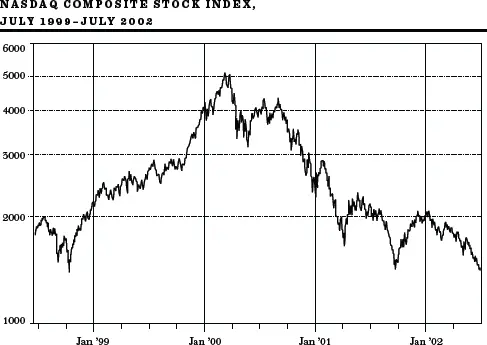
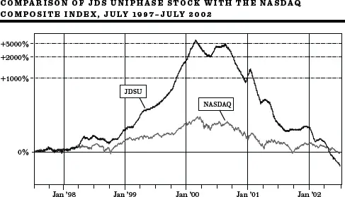
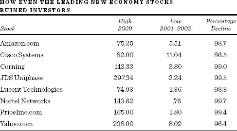
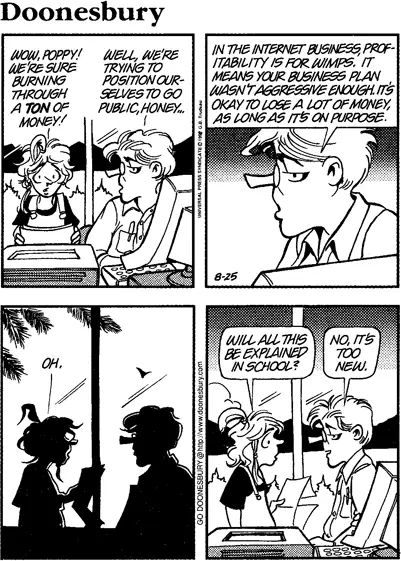
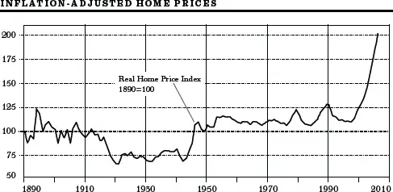
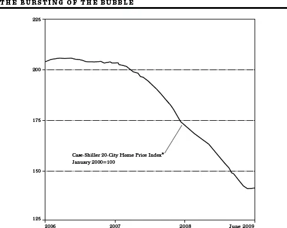

21世纪初的爆炸性泡沫

假如你能冷静自若，当周围的人都已失去理智……\

你便拥有了这个世界，以及其中的一切……\
Rudyard Kipling，《如果》


尽管二十世纪末几十年间的泡沫在财务上造成了毁灭性的后果，但它们与二十一世纪头十年的泡沫相比仍然相形见绌。当互联网泡沫（Internet Bubble）在21世纪初破裂时，超过8万亿美元的市值化为乌有。这相当于德国、法国、英国、意大利、西班牙、荷兰和俄罗斯一年的经济总产出凭空消失。当美国房地产泡沫破裂时，整个世界经济几乎崩溃，随之而来的是一场持续的世界性衰退。将这两次泡沫中的任何一次与郁金香狂热相提并论，对郁金香花而言无疑是不公平的。

## 互联网泡沫

大多数泡沫都与某种新技术有关（如电子产业和生物技术的繁荣），或与某种新的商业机会有关（如新贸易机会的开辟催生了南海泡沫）。互联网则兼而有之：它代表了一种新技术，同时提供了有望彻底改变我们获取信息和购买商品及服务方式的全新商业机会。互联网的前景催生了有史以来股市财富最大规模的创造和最大规模的毁灭。

Robert Shiller在其著作《非理性繁荣》（*Irrational Exuberance*）中用"正反馈循环"来描述泡沫。当任何一组股票——在此指的是与互联网热潮相关的股票——开始上涨时，泡沫便由此开始。上涨的趋势促使更多人买入这些股票，从而引发更多电视和印刷媒体的报道，进而吸引更多人买入，为早期互联网股票持有者创造巨额利润。成功的投资者在鸡尾酒会上向你讲述致富是多么轻而易举，这推动股价进一步上涨，吸引越来越多的投资者加入。但整个机制本质上就是一种庞氏骗局（Ponzi Scheme），需要找到越来越多轻信的投资者从早期投资者手中接盘。最终，更大的傻瓜总会被用尽。

即便是享有极高声誉的华尔街公司也加入了这场热气球般的狂欢。2000年年中，老牌投资公司高盛（Goldman Sachs）声称，互联网公司的现金消耗主要是一个"投资者情绪"问题，而非该行业或其所谓"赛道"的"长期风险"。几个月后，数百家互联网公司破产，无意中证明了高盛报告是正确的——现金消耗率确实不是长期风险，而是短期风险。

在那一刻之前，任何嘲笑"新经济"（New Economy）前景的人都被视为无可救药的卢德分子。如第81页的图表所示，纳斯达克指数（NASDAQ Index）——一个基本代表高科技新经济公司的指数——从1998年底到2000年3月翻了两倍多。该指数中有盈利的股票，其市盈率（Price-Earnings Ratio）飙升至超过100倍。

### 大规模的高科技泡沫

在泡沫的巅峰期，质疑者几乎绝迹。2000年初的投资者调查显示，对未来股票回报率的预期从每年15%到25%甚至更高不等。对于Cisco和JDS Uniphase这类被广泛视为"互联网骨干"的公司，每年15%的回报率被认为十拿九稳。但Cisco当时的市盈率是三位数，市值接近6000亿美元。即使Cisco每年以15%的速度增长盈利，十年后其市盈率仍将远高于平均水平。如果Cisco在未来25年内每年回报15%，而同期国民经济继续以5%的速度增长，Cisco的规模将超过整个经济体。显然，股市估值与对未来增长的任何合理预期之间存在完全脱节。即使是蓝筹股Cisco，在泡沫破裂且预期增长从未实现时，也失去了超过90%的市值。至于JDS Uniphase，下面的图表将其股价与纳斯达克指数从1997年年中到2002年年中的走势进行了对比。相比之下，整个指数的泡沫几乎难以察觉。

在电子产业繁荣时期的"命名游戏"中，各种公司纷纷在名称后加上"tronics"后缀以增加吸引力；互联网狂热时期也出现了同样的情况。数十家公司，甚至那些与网络几乎毫无关系的公司，都将名称改为包含面向网络的标识，如dot.com、dotnet或Internet。来自普渡大学的三位研究者——M. Cooper、D. Dimitrov和P. R. Rau——研究了63家在1998年和1999年将名称改为包含网络方向的公司。他们衡量了公司股价从更名前五天（更名消息开始泄露时）到更名公告发布后五天的变化，证实了一个显著的效果：更名公司在那十天内的股价涨幅比同类公司高出125%。即使公司的核心业务与网络毫无关系，这种价格上涨也会发生。在此后的市场下跌中，这些公司的股票变得一文不值。如下表所示，即使是最领先的互联网公司，投资者也遭受了惨重的损失。

PalmPilot——个人数字助理（Personal Digital Assistant, PDA）的制造商——是一个疯狂远超非理性繁荣的例子。Palm当时归一家名为3Com的公司所有，3Com决定将其分拆给股东。由于PDA被吹捧为数字革命不可或缺的工具，人们认为PalmPilot将是一只格外令人兴奋的股票。3Com完全没料到市场会做出如此强烈的反应。

2000年初，3Com通过首次公开募股（Initial Public Offering, IPO）出售了5%的Palm股份，并宣布打算将所有剩余股份分拆给3Com的股东。Palm的股价飙升如此之快，以至于其市值变成了3Com的两倍。结果发现，3Com所持有的95%的Palm股份市值比3Com自身的总市值高出近250亿美元。就好像3Com所有其他资产的价值是负250亿美元。如果你想买PalmPilot，你完全可以买入3Com，然后以每股负61美元的价格拥有3Com其余的业务。在对财富的盲目追逐中，市场创造的异常现象甚至比后来揭露的欺诈性会计手法还要离奇。

### 又一波新股狂潮

2000年第一季度，916家风险投资公司向1009家初创互联网公司投资了157亿美元。许多公司是在追赶热潮：上一季度竟有159家IPO成功完成，令人瞠目结舌。股市就像打了类固醇一样。与南海泡沫时期一样，许多获得融资的公司荒谬至极。几乎所有公司最终都成了互联网灾难。来看看以下互联网创业公司的例子。

• Digiscents推出了一款可以插入电脑的外设，能让网站和电脑游戏散发气味。该公司花费了数百万风险投资来开发这样一款产品。

• Flooz提供了一种替代货币——Flooz——可以电子邮件发送给朋友和家人。它不完全是钱，因为只有少数地方可以使用，但确实是一份独特的礼物。为了快速启动业务，Flooz.com援引了一条古老的商学院格言："任何白痴都能把一张一美元钞票卖到八十美分。"Flooz.com向美国运通白金卡持卡人推出特别优惠，允许他们以800美元购买价值1000美元的Flooz货币。就在宣布破产前不久，Flooz自己也被"flooz"了——菲律宾和俄罗斯的犯罪团伙使用被盗信用卡号码购买了价值30万美元的Flooz货币。

• 再看看Pets.com，如果真有一家公司是名副其实的"狗"的话。该公司有一个袜子布偶吉祥物，主演了电视广告，甚至在梅西百货感恩节游行中亮相。不幸的是，其吉祥物的人气并不能弥补这样一个事实：单独配送低利润的25磅装狗粮很难盈利。

仅凭许多互联网公司的名字就足以令人难以置信：Bunions.com、Crayfish、Zap.com、Gadzooks、Fogdog、FatBrain、Jungle.com、Scoot.com、mylackey.com，还有Moreover.com。此外还有ezboard.com，它生产名为"卫生纸"的互联网页面，帮助你"获取网络社区的情报"。这些不是商业模式，而是商业失败的模式。

Philip J. Kaplan成为了互联网泡沫时期愚蠢融资行为的精彩记录者。在泡沫破裂后的一个阵亡将士纪念日周末，他决定消磨时间，于是建立了一个名为F\*\*kedcompany.com的网站，提供关于倒闭互联网公司的最新八卦，以及关于这些公司何时破产的赌注池。（该网站可以通过输入上面被审查的字符来访问。）该网站吸引了四百万访客。Kaplan随后出版了一本以该网站命名的书，嘲笑了100个最荒唐的互联网商业创意。以下是Kaplan对SwapIt.com覆灭的描述：

让我理清一下思路：

1）我把CD寄给他们。

2）他们给我无用的"SwapIt Bucks"。

3）他们倒闭了。

4）我什么也没得到。

太棒了，算我一个！

SwapIt.com是一个极其愚蠢的想法。其前提是人们可以通过将物品实体邮寄到SwapIt.com来相互交换二手CD和视频游戏。然后用户会获得"SwapIt Bucks"，用这些代金券可以购买其他人也寄给该公司的二手物品……

eBay的全部成功建立在一个事实上：他们没有库存。通过处理所有的库存和履约，SwapIt就像是拥有所有的麻烦却没有半点好处。

### TheGlobe.com

我对IPO热潮最深刻的记忆可以追溯到1998年11月的一个清晨，当时我正在参加一档电视节目。当我在"候场室"里穿着西装打着领带等待时，我注意到自己坐在两个穿着牛仔裤的年轻人旁边显得格格不入——他们虽然才二十出头，看起来却像十几岁的少年。我完全没有意识到他们是互联网热潮中的首批超级明星，也是节目的主角。Stephan Paternot和Todd Krizelman在康奈尔大学Todd的宿舍里创建了TheGlobe.com。该公司是一个在线留言板系统，希望通过销售横幅广告产生大量收入。在过去，公司需要有实际的收入和利润才能进行IPO。TheGlobe.com两者皆无。尽管如此，其承销商瑞士信贷第一波士顿（Credit Suisse First Boston）仍以每股9美元的价格将其推向市场。股价立即飙升至97美元，创下了当时首日涨幅的历史纪录，使公司市值接近10亿美元，让两位创始人成为千万富翁。那天我们了解到，投资者会将资金投入五年前连正常尽职调查（Due Diligence）都通不过的企业。

TheGlobe.com的首次公开募股是互联网泡沫进入病态阶段的催化剂。利润与股价之间的联系被切断了，一波又一波亏损企业争相进行IPO。至于Paternot，1999年CNN的一段镜头拍到他在纽约一家时尚夜总会里，穿着闪亮的黑色塑料裤，站在桌子上跳舞，身边是他那位模特女友。Paternot在镜头前说道："有了妞，有了钱。现在我准备过一种令人作呕的、轻浮的生活了。"Paternot和Krizelman因此被称为"互联网过度的全球代言人"。TheGlobe.com在2001年关闭了网站。尽管Paternot可能不再过着"令人作呕"的生活，但2010年他担任了独立电影《堕落与肮脏的影像》（*Down and Dirty Pictures*）的执行制片人。

2000年初派对仍在热烈进行时，Kleiner Perkins这家顶级风险投资公司的领军人物John Doerr将互联网相关股票的上涨称为"这个星球上最伟大的合法财富创造"。2002年，他却忘了写道这也是这个星球上最伟大的合法财富毁灭。

来源：Doonesbury © 1998 G. B. Trudeau。经UNIVERSAL UCLICK许可转载。保留所有权利。

### 证券分析师的"高见"

华尔街高调的证券分析师们为互联网泡沫提供了大量的热空气。摩根士丹利的Mary Meeker、美林证券的Henry Blodgett和所罗门美邦的Jack Grubman成了家喻户晓的人物，并被赋予了超级明星的地位。Meeker被《巴伦周刊》（*Barron's*）称为"网络女王"。Blodgett被称为"亨利国王"，而Grubman则获得了"电信大师"的绰号。像体育英雄一样，他们每个人都拿着数百万美元的高薪。然而，他们的收入并非基于分析的质量，而是基于他们通过含蓄地承诺持续提供有利的研究覆盖来为公司招揽利润丰厚的投资银行业务的能力。

传统上，华尔街公司的研究部门——本应为投资者利益服务——与利润丰厚的投资银行部门——为企业客户服务——之间应该有一道"中国墙"（Chinese Wall）相隔。但在泡沫期间，这堵墙更像是瑞士奶酪般漏洞百出。

分析师们是这场繁荣最公开的啦啦队长。Blodgett直言不讳地表示，传统估值指标在"产业大爆炸阶段"不再适用。Meeker在1999年《纽约客》（*New Yorker*）的一篇讨好性人物专访中暗示，"这是理性地鲁莽的时候。"他们对个股的公开评论推动股价飙升。为什么不呢？选股被描述为强力棒球击球：预期翻四倍的股票被称为"四倍股"（Four Bagger）。更令人兴奋的股票可能是"十倍股"（Ten Bagger）。

证券分析师总是能找到看涨的理由。他们很少说出"卖出"这个四字禁语，因为他们不想危及当前或未来的投行业务关系，也不想得罪企业的首席财务官。传统上，每有一个"卖出"评级，就会有十个"买入"评级。但在泡沫期间，这个比例几乎是一百比一。随着股价飙升，美国人确信投资是轻而易举的。他们收看CNBC对自己最喜爱的投资大师的采访，如饥似渴地接受分析师兜售的那些废话。当泡沫破裂时，这些明星分析师面临死亡威胁和诉讼；他们的公司也面临美国证券交易委员会（SEC）和纽约州总检察长Eliot Spitzer的调查和罚款。Blodgett被《纽约邮报》重新封为互联网泡沫的"小丑王子"。Grubman因持续鼓吹WorldCom股票而在国会委员会上遭到嘲讽，并因更改股票评级以帮助获得投行业务而被调查。Blodgett和Grubman都离开了各自的公司。《财富》杂志用一张Mary Meeker的封面照片做了总结，配文写道："我们还能再信任华尔街吗？"

### 新的估值指标

为了给互联网相关公司的超高股价提供合理依据，证券分析师开始使用各种"新指标"来评估股票。毕竟，新经济股票是一种全新的品种——当然不应该用市盈率倍数这种老掉牙的传统标准来衡量，这种标准过去一直用于评估传统旧经济公司。

不知何故，在这个全新的互联网世界里，销售额、收入和利润都无关紧要。为了评估互联网公司，分析师转而关注"眼球"（Eyeballs）——查看网页或"访问"网站的人数。尤其重要的是"参与购物者"（Engaged Shoppers）的数量——即在网站上停留至少三分钟的人。Mary Meeker对Drugstore.com赞不绝口，因为浏览该网站的"眼球"中有48%是"参与购物者"。没人在意这些参与购物者是否真的掏出了真金白银。销售额太老土了。Drugstore.com在2000年泡沫巅峰期达到了67.50美元。一年后，当"眼球"开始关注利润时，它已经成了"仙股"（Penny Stock）。

"心智份额"（Mind Share）是另一个流行的非财务指标，让我确信投资者已经集体丧失了理智。例如，在线房屋销售网站Homestore.com在2000年10月被摩根士丹利高度推荐，原因是互联网用户在房地产网站上花费的72%的时间都花在了Homestore.com列出的房产上。但"心智份额"并没有让互联网用户下定决心购买这些房产，也没有阻止Homestore.com在2001年从高点暴跌99%。

电信公司有专门的估值指标。证券分析师们钻进隧道去数地下铺设了多少英里的光纤电缆，而不是关注其中真正在用的微小比例。每家电信公司都大肆借款，铺设的光纤足以环绕地球1500圈。作为时代的一个缩影，电信和互联网服务提供商PSI Net（现已破产）将其名字印在了巴尔的摩乌鸦队的橄榄球场上。随着电信股票价格继续飙升，远超任何正常的估值标准，证券分析师做了他们常做的事——直接降低了标准。

电信公司从华尔街筹集资金如此容易，导致了大规模的产能过剩——过多的长途光纤电缆、过多的计算机和过多的电信公司。2002年，强大的WorldCom宣布破产。而像朗讯（Lucent）和北电网络（Nortel）这样的大型设备公司，因参与了高风险的卖方融资交易而遭受了惊人的损失。泡沫期间投入电信投资的万亿美元中的大部分都化为乌有。2001年互联网上流传的一个笑话是这样的：

*本周提示*

*如果你一年前买入价值1000美元的北电网络股票，现在值49美元。*

*如果你一年前买入价值1000美元的百威啤酒（是啤酒，不是股票），喝掉所有啤酒，再把空罐子拿去换押金，你会有79美元。*

*我的建议是……开始大量喝酒。*

到2002年秋天，投入北电网络股票的1000美元只值3美元了。

### 媒体的推波助澜

泡沫得到了媒体的推波助澜，媒体将我们变成了一个交易者的国度。和股市一样，新闻业也受供求规律支配。由于投资者想要更多关于互联网投资机会的信息，杂志的供应量随之增加以满足需求。而由于读者对悲观的怀疑论分析不感兴趣，他们纷纷涌向那些承诺轻松致富的出版物。投资杂志刊登诸如"互联网股票在未来数月可能翻倍"之类的文章。正如Jane Bryant Quinn所言，这是"投资色情片"——"不是硬核的，而是软核的，但无论如何都是色情片。"

一系列致力于互联网的商业和技术杂志纷纷涌现，以满足公众对更多信息的无尽渴求。《连线》（*Wired*）自封为数字革命的先锋。《行业标准》（*Industry Standard*）的IPO追踪器是硅谷最广泛被关注的指数。《商业2.0》（*Business 2.0*）自豪地宣称自己是"新经济的预言者"。出版物的激增是投机泡沫的典型标志。历史学家Edward Chancellor指出，19世纪40年代，十四家周刊和两家日报为报道新兴铁路行业而创刊。在1847年金融危机中，许多铁路出版物消亡了。当《行业标准》在2001年倒闭时，《纽约时报》发表社论称"这很可能被视为热潮消亡之日。"

互联网本身也成为了媒体。个人投资者不再需要查阅《华尔街日报》或致电经纪人获取股票报价。所有需要的信息都可以在网上实时获取。网络提供股票摘要、分析师评级、历史股价图表、下季度盈利和长期增长预测，以及关于几乎任何股票的即时新闻。互联网使投资过程民主化，并在泡沫的延续中发挥了重要的推动作用。

在线经纪商也是推动互联网热潮的关键因素。交易成本很低——至少从收取的少量佣金来看确实如此。（实际上，交易成本比大多数在线经纪商宣传的要高得多，因为很大一部分成本隐藏在做市商的"买入价"（Bid，客户可以卖出的价格）和"卖出价"（Ask，客户可以买入的价格）之间的价差中。）折扣经纪公司大做广告，让人觉得战胜市场轻而易举。在一则广告中，一位客户得意地说她不仅要战胜市场，还要"把它那瘦小的身体扼倒在地，让它跪地求饶"。在另一则流行的电视广告中，来自收发室的网络极客Stuart鼓励他那位老派的老板进行首次在线股票购买，并用"让我们点燃这根蜡烛吧"来劝说。当老板抗议说自己对股票一无所知时，Stuart说："让我们研究一下。"在键盘上按了一下之后，老板自以为聪明了许多，买下了人生中第一手股票。

CNBC和彭博（Bloomberg）等有线电视网络成了文化现象。世界各地的健身俱乐部、机场、酒吧和餐厅都在收看CNBC。股市被当作体育赛事来报道——有赛前节目（市场开盘前的预期）、交易时段的实况解说，以及回顾当天行情并为投资者准备第二天行情的赛后节目。CNBC暗示收听节目能让你"领先一步"。大多数嘉宾都看涨。CNBC前评论员Maria（"金钱甜心"）Bartiromo尤其喜欢安排采访那些能够自信地断言某只50美元的互联网股票很快会涨到500美元的分析师。没有人需要提醒CNBC的主持人，就像咬了婴儿的家庭狗很可能很快会被送走一样，悲观的怀疑论者是不受欢迎的。

市场比性更火爆。即使是Howard Stern也会中断关于色情明星和身体部位的惯常话题，转而思考股市，然后鼓吹某些特定的互联网股票。

换手率创下了历史新高。典型股票的平均持有期不再是几年或几个月，而是几天甚至几个小时。共同基金的赎回率（Redemption Ratio，即赎回基金资产的百分比）飙升，个股价格的波动性爆发式增长。每个交易日最活跃的十只股票过去涨跌幅通常在5%左右。到了2000年初，最大的价格变动达到了50%甚至更多。当时有1000万互联网"日内交易者"（Day Trader），其中许多人辞掉了工作，走上这条轻松致富的捷径。对他们来说，"长期"意味着上午晚些时候。这是疯狂。那些会花数小时研究购买一台50美元厨房电器利弊的人，却会因为聊天室的一条小道消息而冒险投入数万美元。研究投资者行为的金融教授Terrance Odean和同事们发现，即使在泡沫期间，大多数互联网交易者实际上也是亏钱的，他们系统性地买卖错误的股票，而且交易越频繁，表现越差。日内交易者的平均存活时间约为六个月。

### 欺诈悄然潜入并扼杀了市场

投机狂潮，如互联网泡沫，暴露了我们体制中最糟糕的方面。不要搞错：正是这种非同寻常的新经济狂热，催生了一系列动摇资本主义制度根基的商业丑闻。

许多企业的管理不是为了创造长期价值，而是为了投机者的即时满足。当华尔街存在利益冲突的卖方分析师寻找高短期预期盈利来证明过高的股票价格合理时，许多企业管理者欣然配合。如果激进的盈利目标难以达到，就可以使用"创造性会计"（Creative Accounting），不仅超越华尔街的预期，甚至超越"耳语数字"（Whisper Numbers）。一个引人注目的例子是安然（Enron）的崛起和随后的破产——它一度是美国第七大公司。安然的崩盘——超过650亿美元市值被抹去——只有在股市新经济部分巨大泡沫的背景下才能理解。安然被视为完美的新经济股票，不仅能主导能源市场，还能主导宽带通信、广泛的电子商务和商业。

安然深受华尔街分析师的青睐。即使在2001年秋天开始走向崩溃之后，覆盖安然的十七位证券分析师中仍有十六位给出"买入"或"强烈买入"评级。《财富》杂志将老式的公用事业和能源公司比作"一群老头子和他们的妻子伴随着Guy Lombardo的音乐蹒跚起舞"。安然则被比作年轻的Elvis Presley"冲破天窗"，穿着紧身金色亮片套装。作者省略了Elvis暴食而亡的部分。安然为跳出固有思维定式树立了标准——是典型的应用杀手、范式转移型公司。不幸的是，它也为含糊其辞和欺骗设立了新标准。

安然管理层实施的骗局之一是建立了大量复杂的合伙企业，掩盖了公司的真实财务状况并导致了安然盈利的虚增。以下是一个相对简单的例子。安然与百视达（Blockbuster）成立了一家合资企业，用于在线租赁电影。几个月后这笔交易失败了。但在合资企业成立后，安然秘密与一家加拿大银行建立了一家合伙企业，该银行本质上借给安然1.15亿美元，换取百视达合资企业的未来利润。当然，百视达的交易从未赚到一分钱，但安然将1.15亿美元贷款计为"利润"。华尔街分析师拍手叫好，称安然董事长Ken Lay为"年度策划大师"。

其他合伙企业——如Cheruco（以《星球大战》中的Wookie角色Chewbacca命名）、Raptor和Jedi——产生了类似的效果，因为原力显然与安然同在。而且原力是慷慨的。在法律追究到他之前，安然首席财务官Andrew Fastow通过运营"独立"合伙企业赚取了3000万美元的费用。这些合伙企业被排除在安然的财务报表之外，其效果是虚增利润、掩盖亏损和负债。会计师事务所安达信（Arthur Andersen）认证了这些账目"如实反映了"安然的财务状况。华尔街则乐于从这些创造性合伙企业中收取丰厚的费用。

欺骗似乎是安然的生存方式。《华尔街日报》报道称，安然高管Ken Lay和Jeff Skilling亲自参与设立了一个假交易室，以打动华尔街证券分析师——员工们将这一事件称为"骗局"。最好的设备被采购到位，员工被分配角色来安排虚构的交易，甚至连电话线都被涂成黑色，使整个操作看起来格外精明。整个事件就是一场精心设计的骗局。2006年，Lay和Skilling被判犯有串谋和欺诈罪。心灰意冷的Ken Lay于同年晚些时候去世。

一位在安然破产中失去工作和退休金的员工在网上开设了一家商店，销售印有"I got lay'd by enron"字样的T恤。

但安然只是针对毫无防备的投资者的众多会计欺诈案件之一。多家电信公司通过以虚高价格互换光纤容量来虚增收入。泰科（Tyco）创建了"饼干罐"（Cookie Jar）准备金，并加速合并前支出，以便从收购中"弹簧加载"（Springload）盈利。WorldCom承认其将本应计入费用的日常开支错误归类为不从利润中扣除的资本投资，从而虚增了70亿美元的利润和现金流。在太多情况下，首席执行官（CEO）的行为更像首席侵占官，而一些首席财务官（CFO）则可以更恰当地被称为企业欺诈官。当分析师们将安然和WorldCom等股票捧上天时，一些企业高管正在将EBITDA的含义从"息税折旧摊销前利润"（Earnings Before Interest, Taxes, Depreciation, and Amortization）偷换为"我忽悠了笨审计师之前的利润"（Earnings Before I Tricked the Dumb Auditor）。

我们是否应该预见到这些危险？

撇开欺诈不谈，我们本应更加警醒。我们本应知道，对变革性技术的投资往往被证明对投资者来说是不值得的。在19世纪50年代，铁路被广泛预期将大幅提高通信和商业的效率。它确实做到了，但这并不能证明铁路股票的价格合理——它们在1857年8月崩盘之前被炒到了巨大的投机高度。一个世纪后，航空业和电视制造业改变了我们的国家，但大多数早期投资者血本无归。投资的关键不在于一个行业会对社会产生多大影响，甚至不在于它能增长多少，而在于它创造和维持利润的能力。历史告诉我们，最终所有过度狂热的市场都会屈服于地心引力。根据我个人的经验，市场中持续的输家是那些无法抗拒被卷入某种郁金香狂热的人。在市场中赚钱其实并不难。正如我们稍后将看到的，一个简单地买入并持有由广泛的股票组合构成的投资组合的投资者，可以获得相当丰厚的长期回报。真正难以避免的是那种诱人的诱惑——在短暂的、快速致富的投机狂欢中把钱挥霍掉。

这个道德故事中有许多反面角色：唯利是图的承销商，他们明知不该却把所有垃圾推向市场；充当投行部门啦啦队的研究分析师，他们热衷于推荐可以被佣金饥渴的经纪人推动的互联网股票；使用"创造性会计"虚增利润的企业高管。但最终让泡沫不断膨胀的，是个人投资者传染性的贪婪和他们对快速致富计划的免疫力低下。

然而旋律依然在回荡。我有一个朋友，通过持有由债券、房地产基金和包含广泛蓝筹股的股票基金组成的多元化投资组合，将一笔不多的投资积累成了一笔小财富。但他不安分。在鸡尾酒会上，他不断遇到炫耀这只互联网股票翻了三倍、那只电信芯片制造商翻了两番的人。他也想参与其中。这时出现了一只名为Boo.com的股票，这是一家互联网零售商，计划以不打折的方式销售"城市时尚服装——酷到还没有酷起来"。换句话说，Boo.com打算以全价销售人们还不穿的衣服。但我的朋友看到了《时代》杂志的封面，标题是"向你的购物中心告别：在线购物更快、更便宜、更好"。大名鼎鼎的摩根大通（JP Morgan）已向该公司投资了数百万美元，《财富》杂志称其为"1999年最酷的公司之一"。

我的朋友上钩了。"Boo.com的故事会让所有盯盘的人垂涎三尺，幻想着空中楼阁。任何延迟购买都是自取灭亡。"于是我的朋友必须在更大的傻瓜到来之前冲进去。

该公司在两年内烧掉了1.35亿美元后宣布破产。联合创始人在回应关于公司支出过于奢侈的指控时解释说："我只坐了三次协和飞机，而且都是特价。"当然，我的朋友恰好在泡沫巅峰期买入，当公司宣布破产时，他损失了全部投资。避免这种可怕错误的能力，可能是保护资本并使其增长的最重要因素。这个教训如此显而易见，却又如此容易被忽视。

## 21世纪初的美国房地产泡沫与崩盘

尽管互联网泡沫可能是美国股市最大的泡沫，但新千年头几年膨胀的单户住宅价格泡沫无疑是美国有史以来最大的房地产泡沫。此外，房价的上涨和随后的崩溃对普通美国人的影响远大于股市的任何波动。单户住宅是大多数普通投资者投资组合中最大的资产，因此房价下跌对家庭财富和幸福感产生直接的影响。房地产泡沫的破裂几乎摧毁了美国（以及国际）金融体系，并引发了一场尖锐而痛苦的全球衰退。为了理解这个泡沫是如何被融资的以及为何造成了如此深远的附带损害，我们需要理解银行和金融体系的根本性变化。

我喜欢讲一个关于一位中年妇女的故事。她突发严重心脏病。当她躺在急诊室里时，经历了一次濒死体验，在那里与上帝面对面。"这是结束了吗？"她问。"我快死了吗？"上帝向她保证她会活下来，并且还有三十年的寿命。果然，她活了下来，做了支架手术疏通了堵塞的动脉，感觉比以前更好了。然后她心想："既然我还有三十年可活，不如好好享受。"既然已经在医院里了，她决定进行一次可以被称为"全面整形手术"的手术。现在她看起来和感觉都好极了。她迈着轻快的步伐蹦蹦跳跳地走出医院，却被一辆疾驰的救护车撞倒，当场死亡。她来到了天堂的珍珠门，再次见到了上帝。"发生了什么？"她问道。"我以为我还有三十年可活。" "非常抱歉，夫人，"上帝回答说。"我没认出你来。"

### 新的银行体系

如果一位金融家在21世纪初从三十年的沉睡中醒来，金融体系也会显得面目全非。在旧体系下——可以称为"发放并持有"（Originate and Hold）体系——银行发放抵押贷款（以及对企业和消费者的贷款），并将这些贷款作为资产持有直至偿还。在这种环境下，银行家对发放的贷款非常谨慎。毕竟，如果一笔抵押贷款违约，就会有人来质问发放该笔贷款的信贷员当时的信用判断。在这种环境中，既需要可观的首付也需要充分的文件来验证借款人的信用。

这一体系在21世纪初发生了根本性变化，转变为可以称为"发放并分销"（Originate and Distribute）的银行模式。抵押贷款仍由银行（以及大型专业抵押贷款公司）发放。但贷款在发放机构手中只持有几天，直到可以卖给投资银行。投资银行随后将这些抵押贷款打包，发行抵押贷款支持证券（Mortgage-Backed Securities, MBS）——由基础抵押贷款"证券化"的衍生债券。这些担保证券依赖于基础抵押贷款的利息和本金偿付来支付新发行的抵押贷款支持债券的利息。

事情变得更加复杂的是，不是只发行一种针对抵押贷款包的债券。抵押贷款支持证券被切成不同的"层级"（Tranches），每个层级对基础抵押贷款的偿付拥有不同的优先级，并获得不同的债券评级。这被称为"金融工程"（Financial Engineering）。即使基础抵押贷款质量低劣，债券评级机构也很乐意给那些对基础抵押贷款利息和本金偿付拥有第一优先权的债券层级授予AAA评级。这个体系更应该被称为"金融炼金术"（Financial Alchemy），而这种炼金术不仅被用于抵押贷款，还被用于各种基础工具，如信用卡贷款和汽车贷款。这些衍生证券继而被销往世界各地。

事情变得更加模糊。在衍生抵押贷款支持债券之上又出售了二阶衍生品。信用违约互换（Credit-Default Swaps）作为抵押贷款支持债券的保险单被发行。简而言之，互换市场允许双方——称为交易对手（Counterparties）——对抵押债券或任何其他发行人的债券的表现进行对赌。例如，假设我持有通用电气发行的债券，并开始担心通用电气的信用。我可以从美国国际集团（AIG）——最大的信用违约互换发行方——购买并持有一份保单，如果通用电气违约，它会赔付我。这个市场的问题在于，像AIG这样的保险发行方没有足够的准备金来在问题发生时支付索赔。而且任何国家的任何人都可以购买保险，甚至不需要拥有基础债券。最终，市场上交易的信用违约互换增长到基础债券价值的十倍之多，这是由全球机构的需求推动的。衍生品市场增长到基础市场的巨大倍数，这一变化是新金融体系的一个关键特征。它使世界金融体系风险更大，关联性更强。

### 宽松的贷款标准

为了完善这幅危险的图景，金融家们创建了结构性投资工具（Structured Investment Vehicles, SIVs），将衍生证券放在银行监管者看不到的地方，从而不计入账面。抵押贷款支持证券SIV会借入购买衍生品所需的资金，而在投资银行资产负债表上只显示对SIV权益的一小笔投资。过去，银行监管机构可能会指出其中蕴含的巨大杠杆和风险，但在新金融体系中这些被忽视了。

这一新体系导致银行和抵押贷款公司的贷款标准越来越松。如果贷方承担的唯一风险是在贷款卖给投资银行前几天抵押贷款出现坏账的风险，那么贷方就不需要那么仔细地审查借款人的信用。因此，发放抵押贷款的标准急剧下降。当我办理第一笔住房抵押贷款时，贷方坚持要求至少30%的首付。但在新体系下，无需任何首付就可以贷款，寄希望于房价永远上涨。此外，所谓的NINJA贷款很常见——即贷给没有收入（No Income）、没有工作（No Job）、没有资产（No Assets）的人的贷款。越来越多的贷方甚至不费心要求提供还款能力的文件。这些被称为NO-DOC贷款（No Documentation Loans，无文件贷款）。住房贷款资金唾手可得，房价迅速上涨。

政府本身在推高房地产泡沫方面发挥了积极作用。在国会的压力下要求更容易获得抵押贷款，联邦住房管理局（Federal Housing Administration）被指示为低收入借款人的抵押贷款提供担保。事实上，截至2010年初，金融系统中几乎三分之二的不良抵押贷款是由政府机构购买的或政府法规要求的。政府不仅未能作为金融机构的监管者发挥作用，还通过自身的政策助长了泡沫。任何准确的房地产泡沫史都不能忽视这样一个事实：不仅"掠夺性贷款者"（Predatory Lenders），政府本身也是导致许多抵押贷款发放给没有能力偿还的人的原因。

### 房地产泡沫

政府政策和改变的贷款实践的结合导致了房屋需求的大幅增加。在宽松信贷的推动下，房价开始迅速上涨。最初的房价上涨鼓励了更多的买家。买房或公寓似乎没有风险，因为房价似乎一直在上涨。一些买家购房的目的不是为了居住，而是为了迅速转手（Flipping）给未来买家以更高价格出售。这种模式与前面描述的泡沫有着诡异的相似性。

第102页的图表展示了泡沫的规模。数据来自Case-Shiller通胀调整房价指数。调整的原理是：如果房价上涨5%，而总体物价也上涨5%，那么通胀调整后的房价实际上没有上涨。但如果房价上涨10%，那么通胀调整后的价格涨幅将被记录为5%。

图表显示，从19世纪末到20世纪末的一百年间，通胀调整后的房价保持稳定。房价确实在上涨，但涨幅仅与总体物价水平相当。在1930年代大萧条期间价格有所下跌，但世纪末时回到了与世纪初相同的水平。而在21世纪初，房价指数翻了一番。这个指数是二十个城市的综合价格指数。在一些城市，价格涨幅远超全国平均水平。

来源：Case-Shiller。

我们知道所有泡沫最终都会破裂。下一张图描绘了破坏的程度。下跌是广泛的、毁灭性的。许多购房者发现他们的抵押贷款金额远远超过了房屋的价值。越来越多的人违约，将房屋钥匙退还给贷方。在一种黑色幽默中，银行家们将这种做法称为"叮当邮件"（Jingle Mail）。平均而言，房价下跌了三分之一，不仅抹去了数百万美国人的房地产权益，还使许多最大的金融机构破产。

数据：标准普尔。

\*经季节性调整

对经济的影响是毁灭性的。随着房屋权益崩塌，消费者开始收缩开支，进入了消费休克状态。那些原本可能通过房屋权益贷款进行二次抵押的消费者再也无法以这种方式为消费融资了。

房价下跌摧毁了抵押贷款支持证券的价值，也摧毁了那些"吃自己的饭"——即用借来的钱持有大量这类有毒资产——的杠杆金融机构。大规模破产接踵而至，我们一些最大的金融机构不得不由政府救助。贷款机构彻底转向，信贷对小企业和消费者全面关闭。随之而来的美国经济衰退是痛苦而持久的，其严重程度仅次于1930年代的大萧条。

## 泡沫与经济活动

我们对历史泡沫的回顾清楚地表明，泡沫破裂后无一例外地伴随着真实经济活动的严重中断。资产价格泡沫的影响不仅限于投机者。当泡沫与信贷繁荣以及消费者和金融机构广泛增加的杠杆相关联时，泡沫尤为危险。

21世纪初美国的经历提供了一个戏剧性的例证。住房需求的增加推高了房价，进而鼓励了更多的抵押贷款发放，这导致了进一步的价格上涨，形成了一个持续的正反馈循环。增加杠杆的循环涉及放松信贷标准甚至进一步增加杠杆。在这一过程的终点，个人和机构都变得危险地脆弱。

当泡沫破裂时，反馈循环开始反向运行。价格下跌，人们不仅发现自己的财富缩水了，而且在许多情况下他们的抵押贷款债务超过了房屋价值。贷款随后变成坏账，消费者减少支出。过度杠杆化的金融机构开始去杠杆化（Deleveraging）。由此带来的信贷紧缩进一步削弱了经济活动，负反馈循环的结果就是一场严重的衰退。信贷繁荣泡沫对真实经济活动构成最大威胁。

这是否意味着市场是无效的？

本章对互联网和房地产泡沫的回顾似乎与股市和房地产市场是理性的和有效的观点不一致。然而，教训并不是市场偶尔会不理性，因此我们应该放弃金融资产定价的坚实基础理论（Firm-Foundation Theory）。相反，明确的结论是，在每种情况下，市场最终都自我修正了。市场最终会修正任何非理性——尽管是以其自身缓慢而无情的方式。异常现象会出现，市场会变得非理性地乐观，且常常吸引粗心的投资者。但最终，真实价值会被市场所认识到，这是投资者必须铭记的主要教训。

我也信服《证券分析》（*Security Analysis*）作者Benjamin Graham的智慧，他写道：归根结底，股市不是投票机制，而是称重机制。估值指标并没有改变。最终，任何股票只能值它能为投资者赚取的现金流的现值。归根结底，真实价值终将胜出。重要的投资问题在于你如何估算真实价值。[第5章](ch05.md)将更多地讨论这个问题，届时我们将更仔细地考察专业人士如何试图确定一只股票的真实价值。

即使犯了错误，市场也可能非常高效。有些错误确实很大，比如21世纪初互联网股票的估值似乎不仅折现了未来，还折现了来世。但怎么会不是这样呢？股票估值取决于对未来多年公司盈利能力的预测。这些预测几乎总是不准确的。此外，投资风险从未被清晰感知，因此对未来进行折现的适当贴现率也从未确定。因此，市场价格在某种程度上一定是错误的。但在任何特定时刻，对于价格是过高还是过低，没有人能明确判断。我接下来将要展示的证据表明，专业投资者无法调整其投资组合，使其只持有"被低估"的股票并避免"被高估"的股票。华尔街最优秀、最聪明的人也无法持续区分正确估值和错误估值，这说明战胜市场是多么困难。没有证据表明有人能通过对市场集体智慧进行持续正确的押注而获得超额收益。市场并不总是甚至不通常是正确的，但没有任何个人或机构持续地比市场知道得更多。

21世纪初房价前所未有的泡沫和崩盘也未能给有效市场假说（Efficient Market Hypothesis）致命一击。如果人们有机会不花一分钱就买房，那么愿意支付溢价可能是最理性的行为。如果房屋继续升值，买家会获利。如果泡沫破裂，房价下跌，买家只需一走了之，将损失留给贷方（也许最终是政府）。是的，激励机制是扭曲的。事后看来，监管松懈，一些政府政策考虑不周。但在任何意义上，这一令人遗憾的事件以及随之而来的严重衰退都不是由于对有效市场假说的盲目信仰造成的。
