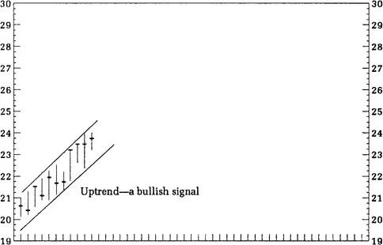
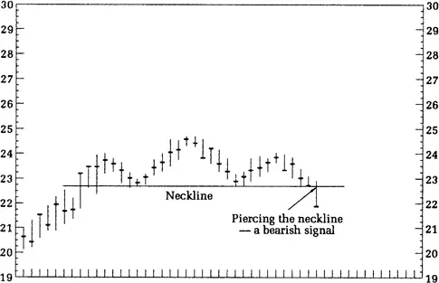
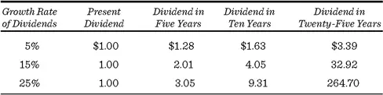
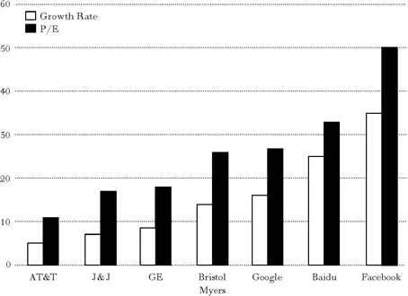

## 技术分析与基本面分析


一幅图抵得过万语千言。\
中国古谚



上天赋予人最伟大的天赋，就是估量事物真实价值的能力。\
La Rochefoucauld，《反思录；或道德箴言集》


在典型的交易日中，纽约证券交易所、纳斯达克市场和全国各地的各种电子交叉网络上交易着总市值达数千亿美元的股票。包括期货、期权和互换市场在内，每天都有数万亿美元的交易发生。专业投资分析师和投资顾问参与着这场被称为"城里最大的游戏"的角逐。

如果赌注很高，回报也同样丰厚。当华尔街行情好的时候，哈佛商学院的新入职者通常能拿到年薪20万美元。薪资最高的是那些高调的资金管理者——管理大型共同基金和养老基金的人，以及管理万亿美元对冲基金和私募股权资产的人。"Adam Smith"在写了《金钱游戏》（*The Money Game*）之后，自夸他将从这本畅销书中赚到25万美元。他的华尔街朋友们反驳道："你赚的钱也就跟一个二流机构销售员差不多。"虽然不是最古老的行业，但高金融业的薪酬确实是最丰厚的之一。

本书第二部分集中讨论专业投资组合经理使用的方法。它展示了学术界如何分析他们的投资结果，并得出结论：他们不值你支付的费用。然后介绍了有效市场假说（Efficient Market Hypothesis, EMH）及其实际含义：股票投资者不可能比简单地买入并持有一只包含市场中所有股票的指数基金做得更好。

## 技术分析与基本面分析

准确预测股价走势并据此判断买卖股票的最佳时机，一直是投资者最执着的追求之一。这种对"金蛋"的追寻催生了各种方法，从科学的到神秘的都有。今天还有人通过测量太阳黑子、观察月相或测量圣安德烈亚斯断层的振动来预测未来股价。但大多数人选择两种方法之一：技术分析或基本面分析。

投资专业人士使用的这两种替代技术与我在第一部分介绍的两种股市理论有关。技术分析是那些信奉空中楼阁（Castle-in-the-Air）股市观的人用来预测买卖股票合适时机的方法。基本面分析则是将坚实基础理论（Firm-Foundation Theory）的原理应用于个股选择的技术。

技术分析本质上是制作和解读股票图表。因此，其从业者——一小群但异常专注的信徒——被称为图表分析师（Chartists）或技术分析师（Technicians）。他们研究过去——包括普通股价格的变动和交易量——以寻找未来变化方向的线索。许多图表分析师认为市场只有10%是理性的，90%是心理的。他们通常信奉空中楼阁学派，将投资游戏视为预测其他玩家行为的过程。当然，图表只能告诉你其他玩家过去做了什么。然而，图表分析师的希望是，仔细研究其他玩家的行为可以揭示人群未来可能做什么。

基本面分析师则采取相反的立场，认为市场90%是理性的，只有10%是心理的。基本面分析者不太关心过去价格变动的具体模式，而是试图确定股票的合理价值。这里的价值与公司的资产、预期的盈利和股息增长率、利率以及风险相关。通过研究这些因素，基本面分析者得出证券内在价值或坚实基础价值的估计。如果这一估计高于市场价格，那么就建议投资者买入。基本面分析者相信，市场最终会反映证券的真实价值。也许90%的华尔街证券分析师认为自己是基本面分析者。许多人会争辩说图表分析师缺乏尊严和专业性。

图表能告诉你什么？

技术分析的第一条原则是，关于公司盈利、股息和未来表现的所有信息都会自动反映在公司过去的市场价格中。显示这些价格和交易量的图表已经包含了证券分析师希望知道的所有基本面信息，无论是好的还是坏的。第二条原则是价格倾向于按趋势运动：上涨的股票倾向于继续上涨，而静止的股票倾向于保持静止。

一个真正的图表分析师甚至不关心公司从事什么业务或行业，只要他能研究其股票图表即可。"倒碗形"或"三角旗形"的图表对微软和对可口可乐意味着同样的事情。关于盈利和股息的基本面信息最多被认为是无用的——最糟糕的情况则是积极的干扰。它对股票定价来说要么无关紧要，即使重要，也已经在几天、几周甚至几个月前反映在市场中了。许多图表分析师甚至不看报纸或查看金融服务网站。

图表分析的先驱之一John Magee在马萨诸塞州斯普林菲尔德的一间小办公室里工作，他甚至把窗户都封死了，以防止任何外界因素干扰他的分析。Magee曾说过："当我走进这间办公室时，我把世界其余的一切都关在外面，完全专注于我的图表。无论是暴风雪还是六月的月夜，这间屋子对我来说完全一样。在这里，我不可能因为阳光明媚就说'买入'，或因为下雨就说'卖出'，从而对自己和客户造成损害。"

下面的图形展示了制作图表是多么简单。只需画一条垂直线，其底部是股票当天的最低价，顶部是最高价。在垂直线上画一条横线表示当天的收盘价。这个过程可以在每个交易日重复，可以用于个股或股票指数。

图表分析师通常会在图表底部用另一条垂直线表示当天的股票交易量。渐渐地，所讨论股票的图表上的高点和低点上下波动，形成各种模式。对图表分析师来说，这些模式与外科医生的X光片具有同样的意义。

图表分析师首先寻找的是一条趋势线。前面的图形显示了一个正在形成中的趋势。它是某只股票在若干天内价格变动的记录——而价格显然在上涨。图表分析师画出两条连接高点和低点的线，形成一个"通道"来勾勒上升趋势。因为假定市场动量倾向于自我延续，所以股票预计将继续上涨。正如Magee在图表分析的圣经《股市趋势技术分析》（*Technical Analysis of Stock Trends*）中所写："价格按趋势运动，趋势倾向于持续，直到某些事情改变了供求平衡。"

然而，假设在大约24美元时，股票终于遇到了麻烦，无法再进一步上涨。这被称为阻力位（Resistance Level）。股票可能会稍有波动，然后掉头向下。一种模式——图表分析师声称它揭示了市场见顶的明确信号——是头肩形态（Head-and-Shoulders Formation）（如下图所示）。

股票先上涨然后略微下跌，形成一个圆润的左肩。它再次上涨，达到略高一点的位置，然后再次回落，形成头部。最后形成右肩，图表分析师屏息等待卖出信号，当股票"击穿颈线"时，信号响亮而清晰地出现。图表分析师带着德古拉伯爵审视猎物般的喜悦，开始抛售，预期漫长的下跌趋势将如过去一样紧随其后。当然，有时市场会让图表分析师大吃一惊。例如，股票可能在发出看跌信号后立即向上冲刺到30美元，如下图所示。这被称为熊市陷阱（Bear Trap），或者对图表分析师来说，是检验规则的例外。

由此可以看出，图表分析师是交易者，而非长期投资者。图表分析师在预兆看好时买入，在不祥之兆出现时卖出。他们与股票调情，就像有些人与异性调情一样，他们的战绩是成功的进出交易，而非有回报的长期承诺。实际上，精神科医生Don D. Jackson——与Albert Haas Jr.合著了《多头、空头与弗洛伊德博士》（*Bulls, Bears and Dr. Freud*）——暗示这样的人可能在进行一个带有明显性暗示的游戏。

当图表分析师选择一只股票时，通常会有一段观察和调情的时期，然后才会真正投入，因为对图表分析师来说——正如在浪漫和性征服中一样——时机至关重要。随着股票突破底部形态并不断攀升，兴奋感不断高涨。最终，如果一切顺利，就到了收获的时刻——获利了结，以及随之而来的释放和余韵。图表分析师的词汇表中包含"双重底"（Double Bottoms）、"突破"（Breakthrough）、"跌破低点"（Violating the Lows）、"企稳"（Firmed Up）、"大行情"（Big Play）、"上升顶点"（Ascending Peaks）和"买入高潮"（Buying Climax）等术语。而所有这一切都发生在那个伟大的性象征——公牛——的旗帜之下。

### 图表分析方法的理论依据

为什么图表分析应该有效？许多图表分析师坦率地承认他们不知道图表分析为什么有效——历史只是有重复自己的习惯。

在我看来，以下三种对技术分析的解释似乎最为合理。首先，有人认为群体本能和大众心理使趋势自我延续。当投资者看到一只投机热门股的价格越来越高时，他们想跳上这趟顺风车，加入上涨行列。确实，价格上涨本身有助于推动热情，形成自我实现的预言（Self-Fulfilling Prophecy）。每一次价格上涨只会刺激投资者的胃口，使他们期待进一步上涨。

其次，关于公司的基本面信息可能存在不平等获取的情况。当出现某些利好消息时，比如发现了一个丰富的矿藏，据称内部人士是第一批知道的人，他们采取行动买入股票，推动股价上涨。内部人士随后告诉他们的朋友，朋友接着行动。然后专业人士获得消息，大型机构将大量股份纳入其投资组合。最后，像你我这样的普通人才得到信息并买入，推动价格进一步上涨。这一过程应该导致股价在利好消息时逐渐上涨，在利空消息时逐渐下跌。

第三，投资者最初往往对新信息反应不足。有一些证据表明，当盈利公告超出（低于）华尔街预期时（正面或负面的"盈利意外"），股价会做出正面（负面）反应，但最初的调整并不完全。因此，股市往往只会逐步对盈利信息进行调整，导致持续的价格动量。

图表分析师还认为，人们有一个讨厌的习惯，即记住自己买入股票的价格，或者他们希望买入的价格。例如，假设一只股票长期以大约每股50美元的价格交易，在此期间许多投资者买入。然后假设价格跌至40美元。

图表分析师声称，当股价回升到买入价时，公众会急于卖出股票以收回成本。因此，股票最初50美元的售价就成了一个"阻力区"（Resistance Area）。每次触及阻力区且股价掉头向下时，阻力位就更难突破，因为更多的投资者开始认为市场或个股不可能再涨了。

类似的论证也适用于"支撑位"（Support Level）的概念。图表分析师说，许多投资者在市场围绕相对低价位波动时未能买入，当价格上涨时他们会觉得自己错过了机会。这些投资者大概会在价格跌回原来低位时迅速买入。在图表理论中，一个在连续下跌中保持住的支撑区会变得越来越强。所以如果一只股票跌至支撑区然后开始上涨，交易者就会冲进去，认为股票正在"起飞"。当一只股票最终突破阻力区时，又一个看涨信号出现了。在图表分析师的词汇中，原来的阻力区变成了支撑区，股票应该能顺利地进一步上涨。

图表分析为什么可能失败？

有许多逻辑上的理由反对图表分析。首先，注意图表分析师只在价格趋势确立后才买入，只在趋势被打破后才卖出。由于市场的剧烈反转可能突然发生，图表分析师常常错过时机。当上升趋势被发出信号时，它可能已经发生了。其次，这种技术最终必然是自我挫败的。随着使用它的人越来越多，任何技术的价值都会贬值。如果每个人都试图同时根据某个信号行动，任何买入或卖出信号都不可能有价值。

此外，交易者倾向于预判技术信号。如果他们看到价格即将突破阻力区，他们倾向于在突破之前而非之后买入。这表明其他人会尝试更早地预判信号。当然，他们预判得越早，就越不确定信号会发生，交易是否会盈利。

也许反对技术方法最有力的论据来自利润最大化行为的逻辑推演。假设Universal Polymers的股价在20美元左右，首席研究化学家Sam发现了一种有望使公司利润翻倍的新生产技术。Sam确信，当他的发现公布后，Universal的股价将达到40美元。因为任何低于40美元的买入都能迅速获利，他很可能会大量买入，直到股价达到40美元——这个过程可能只需几分钟。

即使Sam没有足够的资金自己推动价格上涨，他的朋友和职业交易者肯定有资金如此迅速地推动价格，以至于没有任何图表分析师能在整个行情结束前介入。市场很可能是一个最高效的机制。如果有些人知道价格明天会涨到40美元，它今天就会涨到40美元。

### 从图表分析师到技术分析师

虽然图表分析师在华尔街的声誉不高，但他们丰富多彩的方法吸引了广泛的追随者。分发股票图表的公司、提供图表软件的计算机程序员以及CNBC和Bloomberg等金融新闻网络都享受了销售繁荣，图表分析师自己也在经纪公司找到了极好的就业机会。

在计算机出现之前，辛苦地绘制市场走势图是由手工完成的。图表分析师通常被视为古怪的人，戴着绿色遮阳帽，躲在办公室后面的一个小隔间里。现在图表分析师有了连接各种数据网络的计算机服务，配备了大型显示终端，手指轻触就能生成各种可以想象的图表。图表分析师（现在被称为技术分析师）可以像孩子玩新电动火车一样兴奋，生成一只股票过去表现的完整图表，包括交易量指标、200天移动平均线（过去200天价格的平均值，每天重新计算）、股票相对于市场和所在行业的强度，以及字面上数百种其他平均值、比率、振荡器和指标。此外，个人可以通过Yahoo!等网站访问不同时间段的各种图表。

### 基本面分析的技术

Fred Schwed Jr.在他那本迷人而风趣的揭露金融界内幕的著作《客户的游艇在哪里？》（*Where Are the Customers' Yachts?*）中，讲述了德克萨斯一位经纪人在本可以以730美元买入的时候以760美元的价格向客户卖出了一些股票。当愤怒的客户得知发生了什么后，他向经纪人愤怒地投诉。这位德克萨斯人打断了他。"先生，"他高声说道，"您不了解本公司的政策。本公司为客户选择投资，不是基于价格，而是基于价值。"

在某种意义上，这个故事说明了技术分析师和基本面分析师之间的区别。技术分析师只对股票的价格记录感兴趣，而基本面分析师主要关心的是股票真正值多少钱。基本面分析师努力相对不受人群乐观和悲观情绪的影响，并在股票的当前价格和真实价值之间做出明确区分。

在估计股票的坚实基础价值时，基本面分析师最重要的工作是估计公司未来的盈利和股息流。一股的价值被看作投资者预期收到的所有现金流的现值或折现值。分析师必须估计公司的销售水平、运营成本、税率、折旧，以及其资本需求的来源和成本。

基本上，证券分析师必须是一个没有神灵启示的先知。作为蹩脚的替代品，分析师转而研究公司的历史记录、审查公司的损益表、资产负债表和投资计划，并亲自访问和评估公司的管理团队。然后分析师必须将重要的事实从不重要的事实中分离出来。正如Benjamin Graham在《聪明的投资者》（*The Intelligent Investor*）中所言："有时他让我们想起《彭赞斯海盗》中那位博学的陆军准将，满口'关于直角三角形斜边平方的许多令人愉快的事实'。"

由于公司的总体前景受到其所在行业经济地位的强烈影响，证券分析师的起点是研究行业前景。事实上，证券分析师通常专攻特定的行业板块。基本面分析师希望通过对行业状况的深入研究，获得尚未反映在市场价格中的因素的有价值见解。

基本面分析师使用四个基本决定因素来帮助估计任何股票的合理价值。

**决定因素一：预期增长率**。大多数人没有认识到复利增长（Compound Growth）对财务决策的影响。Albert Einstein曾经将复利描述为"有史以来最伟大的数学发现"。人们常说1626年以24美元将曼哈顿岛卖给白人的美洲原住民被欺骗了。事实上，他可能是一个极其精明的推销员。如果他将24美元以6%的年利率存放，半年复利一次，现在价值将超过1000亿美元，他的后代可以用它买回大部分如今已经改良过的土地。这就是复利增长的魔力！

复利是使10加10等于21而非20的过程。假设你今年投资100美元，明年也投资100美元到一项年回报率为10%的投资中。到第二年底你赚了多少钱？如果你回答21%，那么你值得获得一颗金星和走到教室最前面的荣幸。

代数很简单。你的100美元在第一年底增长到110美元。第二年，你对期初的110美元也赚取10%的利息，所以第二年底你有121美元。因此，两年期间的总回报率为21%。这个结果之所以成立，是因为你从原始投资中赚取的利息也产生了利息。到第三年，你有133.10美元。复利确实威力巨大。

一个有用的规则——"72法则"（Rule of 72）——提供了计算资金翻倍所需时间的捷径。用72除以你获得的利率，就能得到资金翻倍所需的年数。例如，如果利率是15%，资金翻倍只需不到五年（72除以15等于4.8年）。各种增长率对未来股息规模的影响如下表所示。

陷阱（生活中怎么可能只有一个陷阱，如果没有二十二个的话？）在于股息增长不会永远持续，原因很简单：公司和大多数生物一样有生命周期。看看一百年前美国的领先企业。Eastern Buggy Whip Company、La Crosse and Minnesota Steam Packet Company、Savannah and St. Paul Steamboat Line和Hazard Powder Company这些名字在那个时代的《财富》500强榜单中名列前茅。如今它们都已消亡。

即使自然生命周期没有击垮一家公司，还有另一个事实：以相同百分比增长越来越困难。一家盈利100万美元的公司只需增加10万美元就能实现10%的增长率，而一家以1000万美元盈利为基础的公司需要增加100万美元的盈利才能达到同样的业绩。

依赖非常高的长期增长率的荒谬性可以通过美国人口预测来很好地说明。如果全国和加利福尼亚州的人口继续以最近的速度增长，到2045年，美国120%的人口将生活在加利福尼亚州！

尽管预测可能很危险，但股价必须反映增长前景的差异，才能对市场估值做出合理的解释。此外，增长阶段的可能持续时间非常重要。如果一家公司预期在十年内保持20%的快速增长率，而另一家成长型公司预期只能维持同样的增长率五年，那么在其他条件相同的情况下，前者对投资者来说比后者更有价值。关键在于增长率是概括性的而非绝对真理。这引出了我们评估证券的第一条基本规则：

**规则一**：理性投资者应该愿意为每股支付更高的价格，前提是股息和盈利的增长率越高。

在此基础上增加一条重要的推论：

**规则一推论**：理性投资者应该愿意为每股支付更高的价格，前提是预期的高增长率持续时间越长。

这条规则是否符合实际做法？让我们首先用市盈率（Price-Earnings, P/E）倍数而非市场价格来重新表述问题。这提供了一个比较不同价格和盈利股票的好标尺。一只售价100美元、每股盈利10美元的股票与一只售价40美元、每股盈利4美元的股票具有相同的市盈率倍数（10倍）。真正告诉你股票在市场上如何被定价的是市盈率倍数，而非价格。

我们重新表述的问题现在是：对于预期高增长率的股票，实际市盈率倍数是否更高？我和John Cragg的一项研究有力地表明答案是肯定的。

收集计算市盈率倍数所需的价格和盈利数据很容易。为了获得预期长期增长率，我们调查了十八家领先的投資公司。从每家公司我们获得了对大量样本股票预期的五年增长率估计。

我不打算用实际统计研究的细节来让你厌烦。2014年一项涉及若干代表性证券的类似研究结果如下图所示。显然，正如规则一所断言的，高市盈率比率与高预期增长率相关联。

除了展示市场如何对不同增长率进行估值外，这张图也可以用作实用的投资指南。假设你正在考虑购买一只预期增长率为8.5%的股票，并且你知道平均而言，增长率为8.5%的股票像通用电气一样以18倍市盈率交易。如果你正在考虑的股票以20倍市盈率出售，你可能会放弃买入的想法，转而选择一只更符合当前市场标准的合理定价的股票。另一方面，如果你的股票以低于该增长率在市场上的平均倍数出售，那么该证券可以说物有所值。

**决定因素二：预期股息派发**。每次派发的股息金额——与其增长率相对照——很容易理解为决定股票价格的重要因素。在其他条件相同的情况下，股息派发越高，股票价值越大。这里的陷阱在于"其他条件相同"这句话。高派息率的股票如果增长前景不佳，可能是糟糕的投资。相反，许多处于最具活力增长阶段的公司往往不派发股息。许多公司倾向于回购股份而非增加股息。对于预期增长率相同的两家公司，将更多现金回馈股东的那家公司更值得投资。

**规则二**：理性投资者应该为每股支付更高的价格，在其他条件相同的情况下，公司盈利中以现金股息支付或用于回购股票的比例越高。

**决定因素三：风险程度**。无论你那位过于热心的经纪人怎么说，风险在股市中都扮演着重要角色。总有风险——正是这一点让市场如此迷人。风险也影响股票的估值。有些人认为风险是股票唯一需要考察的方面。

一只股票越受人尊敬——即风险越低——其质量就越高。例如，所谓蓝筹股（Blue-Chip Stocks）的股票被认为值得质量溢价。（为什么优质股票要获得一个源自扑克桌的称呼，只有华尔街知道。）大多数投资者偏好风险较低的股票，因此这些股票可以比高风险的低质量同类股票获得更高的市盈率倍数。

虽然人们普遍认同更高风险的补偿必须是更大的未来回报（因此当前价格更低），但衡量风险几乎是不可能的。这并没有吓倒经济学家。学术经济学家和实践者都投入了大量精力进行风险衡量。

根据一个著名的理论，一家公司股价（或其全年总回报，包括股息）相对于整个市场的波动越大，风险就越大。例如，像强生（Johnson & Johnson）这样不怎么波动的公司获得了"寡妇和孤儿"的良好信用认证。这是因为它的盈利在经济衰退期间相对稳定，且股息安全。因此，当市场下跌20%时，强生通常只跌约10%。因此，该股票被定性为风险低于平均水平的股票。另一方面，Salesforce.com的过往记录波动性很大，当市场下跌20%时，它通常下跌30%或更多。投资这样一家公司的股票就是在赌博，尤其当投资者可能被迫在不利的市场条件下卖出时。

然而，当业务向好且市场持续上行时，Salesforce.com预计将超过强生。但如果你像大多数投资者一样，你更重视稳定回报而非投机性希望，重视投资组合无忧无虑而非辗转难眠，重视有限损失敞口而非过山车般的下行风险。这就引出了证券估值的第三条基本规则：

**规则三**：理性（且厌恶风险的）投资者应该为每股支付更高的价格，在其他条件相同的情况下，公司股票的风险越低。

我应该提醒读者，"相对波动性"衡量可能无法完全捕捉公司的相关风险。[第9章](ch09.md)将对这一股票估值中的重要风险要素进行深入讨论。

**决定因素四：市场利率水平**。股市并非自成一体。投资者应该考虑他们能在别处获得多少利润。利率如果足够高，可以为股市提供一个稳定的、有利可图的替代选择。想想1980年代初这样的时期，当时优质公司债券的收益率飙升至接近15%。股票的预期回报率难以匹敌这些债券收益率；资金流入债券，而股价急剧下跌。最终，股价跌至足够低的水平，吸引了足够多的投资者来止住跌势。1987年也出现了类似的情况，利率大幅上升，先于10月19日的股市大崩盘。换句话说，要从高收益债券中吸引投资者，股票必须提供极为廉价的价格。[[\*](#footnote-233-2)]

另一方面，当利率非常低时，固定收益证券对股市几乎不构成竞争，股价往往相对较高。这为基本面分析的最后一条基本规则提供了依据：

**规则四**：理性投资者应该为每股支付更高的价格，在其他条件相同的情况下，利率越低。

三条重要告诫

四条估值规则意味着证券的坚实基础价值（及其市盈率倍数）将随着公司增长率越大和持续时间越长、公司股息派发越高、公司股票风险越低以及利率总体水平越低而越高。

原则上，这些规则对于为股票价格提供理性依据和给投资者某种价值标准是非常有用的。但在我们考虑使用这些规则之前，必须牢记三条重要的告诫。

**告诫一：对未来的预期无法在当下得到证实**。预测未来的盈利和股息是一个极其危险的职业。保持客观非常困难；极端的乐观和极端的悲观不断争夺主导地位。2008年，经济正遭受严重衰退和全球信贷危机。投资者那年能做到的最好的事情就是预测大多数公司的适度增长率。在1990年代末和2000年代初的互联网泡沫期间，投资者说服自己，高增长和无限繁荣的新时代是板上钉钉的事。

需要记住的是，无论你用什么公式来预测未来，它总是部分建立在不确定的前提之上。尽管许多华尔街人声称能看穿未来，但他们和我们一样容易犯错。正如Samuel Goldwyn常说的："预测是很难做出的——尤其是关于未来的预测。"

**告诫二：精确数字无法从不确定数据中计算出来**。道理很简单：你不能通过使用不确定的因素来获得精确的数字。然而，为了达到预期的目的，投资者和证券分析师一直在这样做。

拿一家你听说过很多好评的公司。你研究了公司的前景，得出结论它可以在长期内保持高增长率。多长？嗯，为什么不十年？

然后你根据当前的股息派发、预期的未来增长率和利率的一般水平来计算股票应该"值多少"，也许还会考虑股票的风险因素。令你懊恼的是，股票的合理价值恰好略低于当前市场价格。

你现在有两个选择。你可以认为股票定价过高而拒绝购买，或者你可以说："也许这只股票能保持高增长率十一年而非十年。毕竟，十年本来就只是一个猜测，为什么不十一年呢？"于是你回到计算机前，果然，你现在得出的股票价值高于当前市场价格。有了这个"精确"的知识，你做出了"明智"的购买。

这个游戏之所以奏效，是因为你预测高增长的时间越长，未来股息流就越丰厚。因此，一股的现值完全取决于计算者的意愿。如果十一年不够，十二年或十三年大概就够了。总会有某个增长率和增长期限的组合能得出任何特定的价格。从这个意义上说，计算一股的内在价值在本质上就是不可能的。我相信，普通股价值即使在原则上也存在根本的不确定性。全能的上帝也不知道一只普通股的合适市盈率倍数。

**告诫三：对这只鹅是增长的东西，对那只鹅未必也是增长**。困难在于市场对特定基本面所赋予的价值。市场确实重视增长，较高的增长率和较大的倍数总是相辅相成的。但关键问题是：为了更高的增长，你应该多付多少钱？

没有一致的答案。在某些时期，如1960年代初和1970年代，当增长被认为特别理想时，市场愿意为呈现高增长率的股票支付极高的价格。而在其他时期，如1980年代末和1990年代初，高增长股票相对于普通股票的倍数只获得了适度的溢价。到2000年初，构成纳斯达克100指数的成长股以三位数的市盈率倍数交易。成长可以像郁金香球茎一样时髦，成长股投资者对此有了痛苦的教训。

从实际角度来看，市场估值的快速变化表明，将任何一年的估值关系作为市场规范的指标是非常危险的。然而，通过将成长股的当前估值与历史先例进行比较，投资者至少应该能够识别出那些投资者被郁金香虫感染的时期。

基本面分析为什么可能失败？

尽管这种分析看似合理且具有科学外观，但它有三个潜在缺陷。首先，信息和分析可能是错误的。其次，证券分析师对"价值"的估计可能是错误的。第三，市场可能不会修正其"错误"，股价可能不会趋近于价值估计。

研究每家公司并咨询行业专家的证券分析师会获得大量的基本面信息。一些批评者建议，整体来看，这些信息将毫无价值。投资者从有效新闻（假设市场尚未认识到）中获得的收益会在坏信息中损失掉。此外，分析师在收集信息方面浪费了大量精力，投资者在根据信息行动时支付了交易费用。证券分析师也可能无法将正确的事实转化为对未来盈利的准确估计。对有效信息的错误分析可能导致盈利和股息增长率的估计严重偏离实际。

第二个问题是，即使信息正确且其对未来增长的含义得到了正确评估，分析师仍可能做出错误的价值估计。将具体的增长估计转化为一个内在价值的单一估计几乎是不可能的。事实上，试图获得基本面价值的衡量可能是在追逐鬼火（Will-o'-the-Wisp）。证券分析师获得的所有信息可能已经被市场准确反映了。证券价格与其"价值"之间的任何差异可能源于错误的价值估计。

最后一个问题即使拥有正确的信息和价值估计，你买入的股票仍可能下跌。例如，假设Biodegradable Bottling Company以30倍市盈率交易，分析师估计它可以维持25%的长期增长率。如果平均而言，预期增长率为25%的股票以40倍市盈率交易，基本面分析师可能会认为Biodegradable是一只"便宜"的股票并推荐购买。

但假设几个月后，增长率为25%的股票在市场上仅以20倍市盈率交易。即使分析师的增长率估计是正确的，他的客户也可能不会获利，因为市场重新评估了成长股的价值。市场可能通过向下重新评估所有股票而非提高Biodegradable Bottling的价格来修正其"错误"。

这种估值变化并不罕见——这些是过去经历过的市场情绪的常规波动。不仅股票的平均倍数可以迅速变化，成长股的溢价也可以迅速变化。因此，显然不应该想当然地认为基本面分析一定会成功。

综合运用基本面分析和技术分析

许多分析师使用技术组合来判断个股是否值得购买。以下三条规则可以概括其中最合理的流程之一。坚持不懈、耐心的读者会认识到这些规则是基于我在上文提出的股票定价原理。

**规则一：只买入预期在未来五年或更长时间内拥有高于平均盈利增长的公司**。异常的长期盈利增长率是大多数股票投资成功的最重要因素。Google和过去几乎所有其他真正出色的普通股都是成长型股票。尽管这项工作可能很困难，但选择盈利增长的股票是这场游戏的核心。持续增长不仅增加公司的盈利和股息，还可能增加市场愿意为这些盈利支付的倍数。因此，购买一只盈利开始快速增长的股票的投资者有可能获得双重收益——盈利和倍数都可能增长。

**规则二：永远不要为一只股票支付超过其坚实基础价值的价格**。虽然我已经论证过——我希望是有说服力的——你永远无法判断一只股票的确切内在价值，但许多分析师认为你可以大致判断一只股票何时定价合理。通常，整个市场的盈利倍数是一个有用的基准。以与该倍数持平或不高于该倍数太多的价格出售的成长股通常代表良好的价值。

以非常合理的盈利倍数买入成长型股票有重要的优势。如果你的增长估计被证明是正确的，你可能会获得我在规则一中提到的双重红利：价格会因为盈利增长而上涨，同时倍数也可能因为确立的增长率而扩大。因此是双重红利。例如，假设你买入一只每股盈利1美元、售价7.50美元的股票。如果盈利增长到每股2美元，且市盈率倍数从7.5倍提高到15倍（因为认识到该公司现在可以被视为成长股），你的投资不只是翻倍——而是翻了四倍。这是因为你的7.50美元的股票将价值30美元（15倍的倍数乘以2美元的盈利）。

现在考虑硬币的另一面。当市场已经认识到增长并将市盈率倍数推高至远高于普通股票的大幅溢价时，买入"成长股"存在特殊风险。问题在于，过高的倍数可能已经完全反映了预期的增长，如果增长没有实现，盈利实际上下降了（甚至增长慢于预期），你将会遭受非常不愉快的损失。低倍数股票盈利增长时可能带来的双重好处，在高倍数股票盈利下降时可能变成双重损失。

因此，建议的策略是买入尚未被市场认识到的成长股，其盈利倍数相对于市场没有大幅溢价。当然，预测增长非常困难。但即使增长没有实现且盈利下降，如果倍数本来就很低，损失可能只是单倍的；而如果事情确实如你所预期的那样发展，收益可能是双倍的。这是增加胜算的额外方式。

Magellan基金的非常成功但现已退休的管理者Peter Lynch在基金早期岁月中利用这一技术获得了巨大优势。Lynch计算每只潜在股票的市盈率-增长率比（即PEG比率），只为投资组合买入那些相对于其市盈率具有高增长率的股票。这不仅仅是低市盈率策略，因为一只增长率为50%、市盈率为25的股票（PEG比率为0.5）被认为远优于增长率为20%、市盈率为20的股票（PEG比率为1）。如果一个人的增长预测是正确的——Lynch有一段时间确实做到了——这一策略可以产生极好的回报。

我们可以用重述前两条规则来总结迄今的讨论：*寻找市盈率倍数较低的增长情况。如果增长实现，通常会有双重红利——盈利和倍数都上升，产生巨大收益。警惕高倍数股票，其未来增长已被折现。如果增长没有实现，损失是双重的——盈利和倍数都会下降。*

**规则三：寻找那些预期增长的故事能够激发投资者空中楼阁想象的股票**。我强调了心理因素在股价决定中的重要性。个人和机构投资者不是计算合理市盈率倍数并打印买卖决策的计算机。他们是感性的人——在股市决策中被贪婪、赌博本能、希望和恐惧所驱动。这就是为什么成功的投资既需要智力上的敏锐也需要心理上的敏锐。

能在投资者心中产生"良好感觉"的股票即使增长率只是平均水平，也可以长期以溢价倍数交易。那些没有如此幸运的股票即使增长率高于平均水平，也可能长期以低倍数交易。当然，如果一个增长率似乎已经确立，该股票几乎肯定会吸引某种追随者。市场并非不理性。但股票就像人——刺激一个的东西可能让另一个无动于衷，如果故事从未流行起来，倍数改善可能更小、更慢。

所以规则三是要问自己，关于你股票的故事是否可能引起人群的兴趣。它是否是一个能产生有感染力的梦想的故事？它是否是一个投资者可以在其上建造空中楼阁的故事——但这些空中楼阁确实建立在坚实的基础之上？

你不必是技术分析师才能遵循规则三。你可能只是用你的直觉或投机感觉来判断你股票的"故事"是否可能引起人群的兴趣——尤其是机构投资者的注意。然而，技术分析师在确信投资理念确实流行之前会寻找一些切实的证据。这种切实证据当然是上升趋势的开始或可以"可靠地"预测上升趋势将发展起来的技术信号。

虽然我概述的规则看起来是合理的，但重要的问题是它们是否真的有效。毕竟，许多其他人都在玩这个游戏，没有任何人能够持续获胜是显而易见的。

在接下来的两章中，我将考察实际记录。[第6章](ch06.md)将考虑技术分析是否有效的问题。[第7章](ch07.md)考察基本面分析师的业绩记录。它们应该共同帮助我们评估对专业投资人士的建议应该有多少信心。

[\*](#footnote-233-2-backlink)这个观点也可以用另一种方式来说明：由于较高的利率使我们现在能赚更多的钱，任何递延收入都应该被"更大程度地折现"。因此，当当前利率相对较高时，未来股息流的现值会更低。不过，利率与股价之间的关系比这种讨论可能暗示的更为复杂。假设投资者预期通货膨胀率将从5%上升到10%。这种预期可能推动利率上升约5个百分点，以补偿投资者持有购买力将因更大通胀而受损的固定美元债券。在其他条件相同的情况下，这应该使股价下跌。但随着预期通胀上升，投资者可能合理地预测公司盈利和股息也会以更快的速度增长，从而导致股价上涨。关于通货膨胀、利率和股价的更全面讨论见[第13章](ch13.md)。
