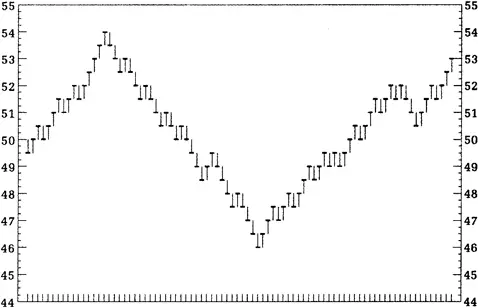
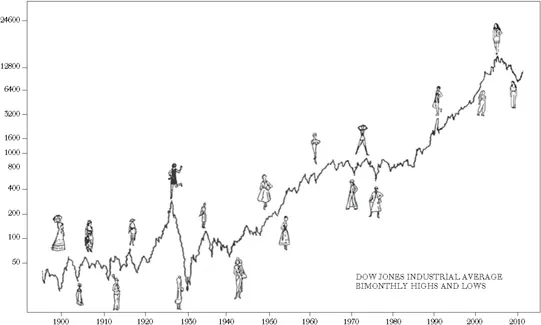

## 技术分析与随机漫步理论

事物很少如其所见。\

脱脂乳冒充奶油。\
Gilbert and Sullivan，《皮纳福号军舰》


不是盈利，不是股息，不是风险，也不是高利率的阴云，能阻止技术分析师完成他们指定的任务：研究股票的价格运动。这种对数字的执着追求产生了华尔街最多彩的理论和民间语言："留住赢家，卖出输家"、"换入强势股"、"卖出这只股票，它表现不好"、"不要与趋势作对"。这些都是技术分析师的流行处方。他们将策略建立在空中楼阁的梦想之上，期望他们的工具告诉他们哪座城堡正在建造以及如何从底层介入。问题是：这些方法有效吗？

鞋底的破洞和预测的含糊

大学教授有时会被学生问到："如果你这么聪明，为什么你不是富人？"这个问题通常让教授们恼火，他们认为自己放弃了世俗财富来从事像教学这样显然对社会有益的职业。同样的问题更适合向技术分析师提出。既然技术分析的全部意义就是赚钱，人们会期望那些宣扬它的人应该成功地实践它。

仔细观察就会发现，技术分析师的鞋子常常有破洞，衬衫领口磨损。我个人从未认识过一位成功的技术分析师，但见过几位不成功的。奇怪的是，破产的技术分析师从不道歉。如果你犯了社交错误问他为什么破产，他会天真地告诉你，他犯了一个极其人性化的错误——不相信自己的图表。让我非常尴尬的是，有一次在餐桌上，当一位图表分析师说了类似的话时，我差点呛到。从那以后我定了个规矩，再也不和图表分析师一起吃饭了。这对消化不好。

虽然技术分析师可能按照自己的建议发不了财，但他们的话语宝库确实很珍贵。看看一家技术服务机构提供的这条建议：

市场在一段重新积累后的上涨是看涨信号。然而，枢轴特征尚未明显出现，道琼斯指数在40点处存在阻力位，因此说牛市的下一波上升还为时过早。如果在未来几周内，对低点的测试保持住且市场突破其旗形，将进一步上涨。如果低点被突破，则中期下跌趋势将继续。鉴于当前形势，交易者很可能袖手旁观等待趋势更清晰的界定，市场将在窄幅交易区间内运行。

如果你问我这是什么意思，我无法告诉你，但我认为这位技术分析师大概想表达的是："如果市场既不上涨也不下跌，它将保持不变。"就连天气预报员也比这做得好。

显然，我有偏见。这不仅是个人偏见，也是职业偏见。技术分析在学术界备受诟病。我们喜欢挑它的毛病。我们有两个主要理由：（1）在支付交易成本和税金后，这种方法并不比买入持有策略更好；（2）它很容易被攻击。虽然这可能看起来有点不公平，但请记住，我们是在试图帮你省钱。

虽然计算机或许一度提升了技术分析师的地位，而且图表服务在互联网上广泛可用，但技术最终证明是技术分析师的毁灭者。就在他（或她）制作图表展示市场走向的同时，学者们忙着制作图表展示技术分析师过去在哪里。由于在计算机上测试所有技术交易规则非常容易，学术界乐此不疲地检验它们是否真的有效。

股市中存在动量吗？

技术分析师相信，了解一只股票过去的行为有助于预测其未来可能的行为。换句话说，在任何特定日期之前的价格变化序列对于预测当天的价格变化很重要。这可以被称为"壁纸原理"（Wallpaper Principle）。技术分析师试图预测未来的股价，就像我们可能预测镜子后面的壁纸图案与镜子上方的图案相同一样。其基本前提是空间和时间中存在可重复的模式。

图表分析师相信市场中存在动量（Momentum）。据说，一直上涨的股票将继续上涨，开始下跌的股票将继续下跌。因此，投资者应该买入开始上涨的股票，并继续持有其强势股票。如果股票开始下跌，建议投资者卖出。

这些技术规则已经通过使用主要交易所可追溯到二十世纪初的股价数据进行了详尽测试。结果表明，过去的股价运动不能被可靠地用来预测未来的运动。股市的记忆即使有也很少。虽然市场确实时不时地表现出一些动量，但这种动量并不可靠，且股票价格的持续性不足以使趋势跟踪策略持续盈利。尽管股市中确实存在一些短期动量——[第11章](ch11.md)将更充分地描述——但任何支付交易成本和税金的投资者都无法从中受益。

经济学家们还检验了技术分析师关于连续数天（或数周、数月）经常出现同方向价格变化序列的论点。股票被比作全一旦获得一些动量，就可以预期会进行长距离推进的全卫。结果表明事实并非如此。有时你会连续几天看到正向价格变化（价格上涨）；但有时当你抛一枚硬币时，你也会连续多次得到"正面"，而你得到连续正向（或负向）价格变化的频率并不比你期望从随机序列中得到连续正面或反面的频率更高。股市中经常被称为"持续模式"的出现频率并不比任何赌徒运气中的连续好运更高。这就是经济学家所说的股价行为非常像随机漫步（Random Walk）的意思。

随机漫步究竟是什么？

对许多人来说，这似乎是胡说八道。即使是金融版面最随意的读者也能轻易发现市场中的模式。例如，看看第138页的股票图表。

图表似乎展示了明显的模式。在初始上涨之后，股票掉头下跌，然后持续走低。后来，下跌被遏制，股票又经历了一次持续的上涨。一个人看着这样的股票图表不可能不注意到这些陈述的自明性。经济学家怎么会如此短视，连肉眼都看得如此清楚的东西都看不到呢？

这种对股市重复模式的信念的持续存在源于统计错觉。为了说明这一点，让我描述一个我让学生参与的实验。学生们被要求制作一张股票图表，展示一只最初售价50美元的假设股票的走势。在每个后续交易日，收盘价由抛硬币决定。如果抛出正面，学生假设股票比前一个收盘价上涨0.5点。如果抛出反面，价格假设下跌0.5点。下面的图表就是这些实验之一得出的假设股票图表。

由随机抛硬币得出的图表看起来非常像正常的股票价格图表，甚至似乎展示了周期。当然，我们在抛硬币中似乎观察到的明显"周期"并不像真正的周期那样有规律地出现，但股市中的涨跌也是如此。

正是这种缺乏规律性才是关键。股票图表中的"周期"并不比普通赌徒运气中的连续好运或厄运更真实。而股票似乎处于上升趋势——看起来与早期某个时期的上涨一模一样——这一事实并不能提供关于当前上升趋势的可靠性和持续时间的有用信息。是的，历史确实在股市中倾向于以令人无限惊讶的方式重复自己，让任何试图从过去价格模式的知识中获利的企图落空。

在我让学生抛硬币得出的其他模拟股票图表中，出现了头肩形态、三重顶和三重底，以及其他更晦涩的图表形态。一张图表显示了一个漂亮的倒头肩形态向上突破（非常看涨的形态）。我把它给了一位图表分析师朋友看，他几乎从椅子上跳了起来。"这是哪家公司？"他惊呼道。"我们必须立刻买入。这个形态是经典的。毫无疑问这只股票下周会涨15点。"当我告诉他这张图是通过抛硬币得出的时，他的反应可不太友善。图表分析师没有幽默感。当《商业周刊》（*BusinessWeek*）雇用了一位擅长砍杀式评论的技术分析师来评论本书第一版时，我得到了应有的报应。

我的学生使用了完全随机的过程来制作他们的股票图表。在每次抛掷中，只要使用的硬币是公平的，就有50%的概率是正面，意味着股票价格上涨，以及50%的概率是反面，意味着价格下跌。即使他们连续抛出十次正面，下次抛出正面的概率仍然是50%。数学家将由随机过程产生的一系列数字（如我们模拟股票图表上的那些数字）称为随机漫步（Random Walk）。图表上的下一步运动完全无法根据之前发生的事情来预测。

股市并不完全符合数学家关于当前价格运动与过去运动完全独立的理想。股票价格确实存在一些动量。当好消息出现时，投资者往往只是部分地调整他们对股票合理价格的估计。缓慢的调整可以使股票价格在一段时间内稳定上涨，赋予一定程度的动量。股价未能完全符合随机漫步定义这一事实，促使金融经济学家Andrew Lo和A. Craig MacKinlay出版了一本名为《非随机漫步华尔街》（*A Non-Random Walk Down Wall Street*）的著作。除了短期动量的证据外，大多数股价平均指数也存在与盈利和股息长期增长一致的长期上升趋势。

但不要指望短期动量能给你某种万无一失的策略来战胜市场。一方面，股价并不总是对新闻反应不足——有时它们反应过度，价格反转可能以令人恐惧的突然性发生。我们将在[第11章](ch11.md)看到，按照动量策略管理的投资基金起步成绩不佳。即使在存在动量（且市场未能表现得像随机漫步）的时期，存在的系统性关系往往很小，对投资者没有用处。利用这些依赖关系所涉及的交易费用和税金远大于可能获得的任何利润。因此，随机漫步假说"弱式"（Weak Form）的准确表述如下：

股票价格运动的历史不包含任何有用的信息，能够使投资者在管理投资组合时持续超越买入持有策略。

如果随机漫步假说的弱式成立，那么正如我的同事Richard Quandt所说，"技术分析类似于占星术，同样具有科学性。"

我并不是说技术策略从来不赚钱。它们确实经常能产生利润。要点在于简单的买入持有策略（即买入一只或一组股票并长期持有）通常赚得一样多甚至更多。

当科学家想要测试某种新药的功效时，他们通常进行一项实验，给两组患者施用药物——一组含有该药物，另一组是无效的安慰剂（Placebo，即糖丸）。比较两组的施用结果，只有接受药物的那组表现优于接受安慰剂的那组，药物才被认为是有效的。显然，如果两组在相同时间内都好转了，药物不应该获得功劳，即使患者确实康复了。

在股市实验中，技术策略所比较的安慰剂就是买入持有策略。技术方案确实经常为其使用者创造利润，但买入持有策略也能做到。事实上，正如我们稍后将看到的，使用包含广泛股市指数中所有股票的投资组合的简单买入持有策略，在过去八十年中为投资者提供了约10%的年均回报率。只有当技术方案产生比市场更好的回报时，才能被判定为有效。迄今为止，没有一个技术方案通过了这一检验。

一些更复杂的技术系统

技术分析的信徒可能有些道理地认为我不公平。我刚才描述的简单测试并不能公正评价技术分析的"丰富性"。对技术分析师来说不幸的是，即使更复杂的交易规则也接受了科学检验。让我们详细考察几个流行的系统。

滤波系统

在流行的"滤波器"（Filter）系统中，一只从低点上涨了5%（或你选择的任何其他百分比）的股票被认为处于上升趋势中。一只从高点下跌5%的股票被认为处于下跌趋势中。你应该买入任何从低点上涨5%的股票并持有，直到价格从随后的高点下跌5%时卖出，此时甚至可以做空。空头头寸维持到价格从随后的低点至少上涨5%。

这个方案在经纪人中非常流行。实际上，滤波器方法正是经纪人推崇的流行"止损"（Stop-Loss）订单的基础，客户被建议在其股票跌破买入价5%时卖出，以"限制潜在损失"。其论据是一只下跌5%的股票据推测将进入下跌趋势。

对各种滤波规则的详尽测试已经完成。筛选买入和卖出候选的百分比跌幅或涨幅从1%到50%不等。测试涵盖了不同的时间段，涉及个股以及股票指数。结果非常一致。当考虑到滤波规则下产生的更高交易费用时，这些技术无法持续超越简单买入个股（或股票指数）并在测试期间一直持有的策略。个人投资者最好避免使用任何滤波规则，我还要补充一句，也最好避开推荐滤波规则的任何经纪人。

道氏理论

道氏理论（Dow Theory）是一场阻力位与支撑位之间的巨大拉锯战。当市场见顶并下行时，之前的高点定义了一个阻力区，因为错过在顶部卖出的人如果再有机会会急于卖出。如果市场再次上涨并接近之前的高点，它被称为在"测试"阻力区。现在到了关键时刻。如果市场突破阻力区，它很可能会继续上涨一段时间，之前的阻力区变成支撑区。另一方面，如果市场"未能突破阻力区"，而是跌穿了之前有支撑的低点，就给出了看跌信号，建议投资者卖出。

道氏理论的基本原则意味着一种策略：当市场高于上一个高点时买入，当跌破之前的低谷时卖出。这个理论有各种变化，但基本思想是图表分析信条的一部分。

不幸的是，道氏机制产生的信号对于预测未来的价格运动没有意义。市场在卖出信号后的表现与在买入信号后的表现没有区别。相对于简单地买入并持有市场指数中代表性股票清单，道氏理论的追随者实际上略逊一筹，因为该策略涉及投资者在策略规定时进行买卖的额外经纪成本。

相对强弱系统

在相对强弱系统（Relative-Strength System）中，投资者买入并持有那些表现良好的股票，即跑赢大盘指数的股票。相反，相对于市场表现不佳的股票应该避免，甚至可能被做空。虽然确实有一些时期相对强弱策略会跑赢买入持有策略，但没有证据表明它能持续做到。如前所述，股市中确实存在一些动量的证据。然而，对相对强弱规则在二十五年期间的计算机测试表明，在计入交易费用和税金后，这些规则对投资者没有用处。

价量系统

价量系统（Price-Volume System）表明，当一只股票（或整个市场）在大量或递增的成交量下上涨时，存在未满足的买盘盈余，股票将继续上涨。相反，当一只股票在大量成交量下下跌时，表明卖压存在，给出卖出信号。

同样，遵循这一系统的投资者可能会对结果感到失望。该策略产生的买卖信号不包含对预测未来价格运动有用的信息。然而，与所有技术策略一样，投资者不得不进行大量的进出交易，因此其交易费用和税金远高于买入持有策略所必需的。在计入这些费用后，投资者的表现不如简单买入并持有一组多元化股票。

解读图表模式

也许一些更复杂的图表模式——如前一章所描述的那些——能够揭示未来股价走势。例如，头肩形态的向下突破是否是一个可靠的看跌预兆？正如图表分析的圣经之一《技术分析》（*Technical Analysis*）所言："你不可能让一辆以每小时七十英里速度行驶的重型汽车瞬间停下，并在同一个瞬间掉头朝相反方向行驶。"在股票反转之前，它的价格运动被认为会形成若干广泛反转模式之一，同时聪明的交易者慢慢地向"公众""派发"他们的股票。当然，我们知道有些股票反转方向相当迅速（这被称为"不幸的V形"），但也许有些图表形态可以像罗马占卜师一样准确地预言未来。唉，计算机甚至测试了更玄奥的图表技术，技术分析师的工具再次背叛了他。

在一项精心设计的研究中，计算机被编程为对纽约证券交易所548只交易股票在五年期间绘制图表。它被指示扫描所有图表并识别三十二种最广泛使用的图表模式中的任何一种。计算机被要求留意头肩形态、三重顶和三重底、通道、楔形、菱形等等。由于机器是一个非常彻底（虽然相当枯燥）的工作者，我们可以确信它没有遗漏任何重要的图表模式。

当机器发现某种看跌图表模式——如头肩形态——之后出现了向下突破颈线的走势（一个极其看跌的信号），它记录了一个卖出信号。另一方面，如果三重底之后出现了向上突破（一个极其有利的预兆），就记录了一个买入信号。然后计算机跟踪发出买卖信号的股票的表现，并将其与大盘的表现进行比较。

同样，技术信号与后续表现之间似乎没有任何关系。如果你只买入那些发出买入信号的股票，并在发出卖出信号时卖出，在计入交易费用后你的表现不会比买入持有策略更好。

随机性难以接受

人的本性喜欢秩序；人们很难接受随机性的概念。无论概率定律告诉我们什么，我们都会在随机事件中寻找模式——不仅在股市中，甚至在解读体育现象时也是如此。

在描述一位篮球运动员的出色表现时，记者和观众经常使用诸如"LeBron James手感火热"或"Kobe Bryant是连续投篮高手"这样的表达。打篮球、执教篮球或关注篮球的人几乎普遍认为，如果一名球员上一次或上几次投篮成功，他下一次投篮就更有可能命中。然而，一组心理学家的研究表明，"手感火热"（Hot Hand）现象只是一个神话。

心理学家对费城76人队在一个半赛季中的每一次投篮进行了详细研究。他们没有发现连续投篮结果之间存在正相关。事实上，他们发现一名球员投中后紧接着投失的概率实际上比连续投中两次的概率略高。此外，研究人员还研究了超过两次投篮的序列。他们再次发现，长连续投中（即连续投中多次）的次数并不比从随机数据集中预期的更多（例如抛硬币，每次事件独立于其前一次）。尽管前两三次投篮的事件影响了球员对下一次投篮是否会命中的感知，但确凿的证据表明这种影响并不存在。研究人员随后通过检查波士顿凯尔特人队的罚球记录以及对康奈尔大学男女篮球队员进行的控制投篮实验来证实了他们的研究。

这些发现并不意味着篮球是一项靠运气而非技能的比赛。显然有些球员比其他人更擅长投篮和罚球。但要点在于，投篮命中的概率独立于之前投篮的结果。心理学家推测，对手感火热的持续信念可能源于记忆偏差。如果长序列的投中或投失比交替序列更容易被记住，观察者可能会高估连续投篮之间的相关性。当事件有时确实成群出现和连续出现时，人们拒绝相信它们是随机的，尽管这种群集和连续在随机数据中确实经常出现，比如抛硬币。

一大堆其他技术理论帮你亏钱

在学术界清除了大部分标准技术交易规则之后，它将庄严的注意力转向了一些更异想天开的方案。没有图表分析师的世界将安静和乏味得多，以下技术充分证明了这一点。

裙摆指标

不满足于价格运动，一些技术分析师将研究范围扩大到包括其他运动。其中最迷人的一种方案被作者Ira Cobleigh称为"牛市与裸膝"（Bull Markets and Bare Knees）理论。查看任何一年女性裙子的裙摆高度，你就能对股价方向有所了解。下图显示了一个大致趋势：牛市与裸膝相关联，低迷市场则与"看女人大腿的家伙们"的熊市相关联。

例如，在十九世纪末和二十世纪初，股市相当沉闷，裙摆也是如此。但随后裙摆升高，迎来了1920年代的大牛市，紧接着是长裙和1930年代的大崩盘。（实际上，图表有些作弊：裙摆在1927年就下降了，早于牛市最活跃的阶段。）

二战后的情况就不那么理想了。市场在1946年夏天急剧下跌，远早于1947年以较长裙子为特色的"新风貌"（New Look）的推出。同样，1968年底开始的股市急剧下跌先于中裙的出现，中裙在1969年尤其是1970年成为时尚。

这一理论在1987年的大崩盘期间表现如何？你可能认为裙摆指标失灵了。毕竟，1987年春天，当设计师开始发布秋季系列时，非常短的裙子被宣布为当季时尚。但到了十月初，当第一阵秋风开始吹遍全国时，一件奇怪的事情发生了：大多数女性决定迷你裙不适合自己。当女性回到长裙，设计师迅速跟进。剩下的就是股市历史了。那21世纪头十年的严重熊市呢？不幸的是，你猜对了，裤子成了时尚。女性商业领袖和政治家总是穿着裤装出现。现在我们知道了那个时期惩罚性熊市的真正罪魁祸首。

尽管确实有一些证据支持这一理论，但不要太乐观地期望裙摆指标能让你在市场择时上占得先机。女性不再被裙摆的暴政所禁锢。正如《Vogue》所说，你现在可以像男人或女人一样穿衣，所有裙摆长度都可以接受。恐怕这一股市理论无疑已经过时了。

超级碗指标

2009年股市为什么上涨？对于使用超级碗指标（Super Bowl Indicator）的技术分析师来说，这个问题很容易回答。超级碗指标根据哪支球队赢得超级碗来预测股市表现。由国家橄榄球联盟（National Football League, NFL）原始成员赢得超级碗——如2009年的匹兹堡钢人队——预示着股市牛市，而由美国橄榄球联盟（American Football League, AFL）原始成员赢得则对股市投资者是坏消息。2002年，爱国者队（AFL球队）击败了公羊队（NFL球队），市场正确地以大幅下跌做出了回应。虽然该指标有时会失败，但它正确的次数远多于错误的次数。当然，这毫无道理。超级碗指标的结果不过是说明了一个事实：有时可以把两个完全不相关的事件联系起来。事实上，Mark Hulbert报道说，股市研究员David Leinweber发现与标准普尔500指数相关性最高的指标是孟加拉国的黄油产量。

零股理论

零股理论（Odd-Lot Theory）认为，除了总是正确的投资者之外，没有人能比一个总是错误的投资者对成功的投资策略做出更多贡献。按照普遍的迷信说法，"零股交易者"（Odd-Lotter）就是那种人。因此，成功可以通过在零股交易者卖出时买入、在他们买入时卖出来确保。

零股交易者是那些以少于100股（称为整手，Round Lots）为单位交易股票的人。股市中许多业余投资者买不起以每股50美元出售的一整手（100股）股票的5000美元投资。他们更可能买入，比如说，十股，以更适度的500美元投资。

通过考察零股买入量（这些业余投资者在特定日期买入的股数）与零股卖出量（他们卖出的股数）的比率，以及查看零股交易者买卖的具体股票，据说可以赚钱。这些无知的业余投资者，据推测完全凭情感而非专业洞察行事，是市场中被领去宰杀的羔羊。按照传说，他们总是错的。

结果证明，零股交易者并不是那么蠢的笨蛋。有点傻？也许吧。有迹象表明零股交易者的表现可能略逊于股票平均指数。然而，现有证据表明，了解零股交易者的行动对制定投资策略没有用处。

道琼斯"狗股"

这个有趣的策略利用了一种普遍的逆向投资信念：不受青睐的股票最终倾向于反转方向。该策略要求每年买入道琼斯30种工业平均指数中股息收益率最高的十只股票。其思路是这十只股票是最不受欢迎的，因此它们通常具有低市盈率倍数和低市净率（Price-to-Book-Value Ratio）。该理论归功于一位名为Michael O'Higgins的资金经理，他在《击败道琼斯》（*Beating the Dow》一书中推广了这一技术。James O'Shaughnessy将该理论追溯到1920年代进行检验；他发现道琼斯"狗股"在没有额外风险的情况下每年跑赢整体指数超过2个百分点。

华尔街分析师中的犬类部队竖起了耳朵，基于这一原则营销了数十亿美元的共同基金。然后，正如可能预期的那样，成功反噬了"狗股"。道琼斯"狗股"持续跑输整体市场。正如"狗股"明星O'Higgins所言，"这个策略变得太流行了"，最终自我毁灭。道琼斯"狗股"不再灵验。

一月效应

许多研究人员发现，一月是股市回报非常异常的一个月。股市回报在每年一月的头两周往往特别高。这一效应在较小公司中似乎尤为明显。即使在调整风险后，小型公司似乎也为投资者提供了异常丰厚的回报——超额回报主要产生于每年的头几天。这种效应在几个外国股市中也有记录。这导致了一本标题耸动的书《不可思议的一月效应》（*The Incredible January Effect*）的出版。投资者，尤其是股票经纪人——脑海中浮现出丰厚佣金的景象——设计了利用这一被认为非常可靠的"异常"的策略。

然而不幸的是，交易小型公司股票的交易费用明显高于大型公司（因为更高的买卖价差和更低的流动性），似乎没有任何普通投资者能利用这种异常。此外，这种效应在每年并不可靠。换句话说，一月的"零钱"捡起来代价太高，有些年份它根本就是海市蜃楼。

更多系统

继续回顾技术方案很快就会产生迅速递减的收益。可能很少有人认真相信太阳黑子理论能为他们赚到钱。但你相信通过跟踪纽约证券交易所上涨与下跌股票的比率就能找到可靠的股市顶部领先指标吗？仔细的计算机研究表明不行。你认为空头兴趣（Short Interest，即股票被卖空的股数）增加是看涨信号（因为最终做空者将回购股票以平仓）吗？详尽的测试表明，无论对整个股市还是对个别证券都没有关系。你认为一些金融电视网络所倡导的移动平均系统（例如，如果股价或其50天平均价格高于其过去200天的平均价格就买入，低于就卖出）能给你带来非凡的股市利润吗？如果你需要支付交易费用——买卖都要付——就不行！你认为应该"五月卖出然后离场"直到十月吗？事实上，股市在五月到十月之间上涨的次数多于下跌的次数。

技术派市场大师

技术分析师可能做不出准确的预测，但早期的大师们确实色彩斑斓。例如，在1980年代，最有影响力的市场大师是Robert Prechter。Prechter在耶鲁大学本科期间对社会心理学与股市之间的平行关系产生了兴趣。大学毕业后，Prechter花了四年时间在一个摇滚乐队打鼓，之后加入美林证券担任初级技术分析师。在那里Prechter偶然发现了一位不知名的会计师R. N. Elliott的工作，后者设计了一种深奥的理论，谦虚地命名为Elliott波浪理论（Elliott Wave Theory）。Elliott的前提是存在可预测的投资者心理波浪，它们以自然的起伏引导市场。通过观察它们，Elliott相信，人们可以预测市场的主要转变。Prechter对这一发现如此兴奋，以至于1979年辞去了美林证券的工作，在不太可能的地点——佐治亚州盖恩斯维尔——撰写投资通讯。

Prechter最初的预测异常准确。1980年代初，他预测了一个主要牛市，道琼斯指数有望升至3600点。Prechter通过在预测的"中途停顿"2700点时让追随者保持满仓，成为当天的黄金骑士。

1987年10月之后光泽褪去了。值得肯定的是，Prechter确实在1987年10月5日说过市场有"50%的风险下跌10%"。但他建议机构投资者坚持持有，等待道琼斯指数的最终目标3686点。崩盘后，道琼斯指数接近2000点时，Prechter转为长期看跌，建议持有国库券。他预测"大牛市可能已经结束"，到1990年代初道琼斯工业平均指数将暴跌至400点以下。Prechter错过了整个1990年代的牛市。这对一位黄金大师来说是致命伤。Prechter仍然是一个坚定的空头，在21世纪初市场崩盘期间确实赢得了一些新的追随者。这只能证明，如果一个人持续预测市场下跌（或上涨），他总会在某个时候说对。

Prechter的继任者是Elaine Garzarelli，当时是投资公司雷曼兄弟（Lehman Brothers）的执行副总裁。Garzarelli不是一个只用单一指标的女性。她投身于金融数据的海洋，使用十三种不同的指标来预测市场走向。Garzarelli总是喜欢研究关键细节。小时候，她会从当地肉店拿动物器官来解剖。

Garzarelli是1987年崩盘中的Roger Babson。她在8月转为看跌，到9月1日建议客户退出股市。到10月11日，她确信崩盘即将发生。两天后，在一个几乎令人恐惧地具有先见之明的预测中，她告诉《今日美国》（*USA Today*），道琼斯指数将下跌超过500点。一周之内，她的预测成真了。

但崩盘是Garzarelli最后的辉煌。就在媒体将她加冕为"黑色星期一大师"、从《Cosmopolitan》到《Fortune》的杂志上都出现了赞颂文章时，她却被自己的先见之明——或恶名——所淹没。崩盘后，她说她不会碰市场，预测道琼斯指数将再跌200到400点。因此，Garzarelli错过了市场的反弹。此外，那些把钱交给她的人失望极了。在解释自己缺乏一致性时，她给出了技术分析师由来已久的解释："我没有相信自己的图表。"

也许1990年代中期最丰富多彩的投资大师是朴实的、祖母级的（年龄中位数七十岁）Beards-town Ladies。被宣传者称为"我们这个时代最伟大的投资头脑"，这些名人祖母们烹饪利润和炒作，卖出超过一百万册书，频繁出现在全国电视节目和周刊杂志上。她们将投资成功的心得（"心脏地带"的美德——努力工作和去教堂）与美味的烹饪食谱（比如股市松饼——保证上涨）混合在一起。在她们1995年的畅销书《Beards-town Ladies常识投资指南》（*The Beardstown Ladies Common-Sense Investment Guide*）中，她们声称过去十年的投资回报率为每年23.9%，远超标准普尔500指数14.9%的年回报率。多么精彩的故事：中西部的普通老太太凭借常识就能击败华尔街报酬过高的投资专业人士，甚至让指数基金都相形见绌。

不幸的是，这些女士也被发现篡改了账目。显然，Beards-town投资俱乐部的成员将俱乐部会费计入了股市利润。普华永道（Price Waterhouse）会计师事务所被请来，计算出这些女士十年间的实际投资回报率为每年9.1%——几乎比整体市场低6个百分点。通过崇拜投资偶像来致富的故事到此为止。

这个故事的寓意显而易见。当大量技术分析师预测市场时，总会有一些人对上一次甚至上几次转折判断正确，但没有人会持续准确。套用《圣经》的警告："回头看市场大师预测的人将死于悔恨。"

为什么技术分析师仍然被雇用？

在科学审视下，图表分析必须与炼金术共享一个基座，这似乎非常清楚。对所有形式技术分析的研究结论具有惊人的一致性。没有一种方法持续超越买入持有策略的安慰剂。技术方法不能被用来制定有用的投资策略。这是随机漫步理论的基本结论。

我的一位前同事相信资本主义制度会淘汰所有无用的赘生物，比如蓬勃发展的技术分析师。"这些华尔街现代占卜师的日子已经不多了，"他会说。"经纪人很快就会发现他们可以轻松地不需要技术分析师的服务。"图表分析师的持久性表明，资本主义制度可能像我们大多数人一样做园艺。我们喜欢看到最好的植物生长，但随着夏天的推移，杂草往往占了上风。

关键在于，技术分析师在经纪人的绿化中经常扮演重要角色。图表分析师推荐交易——几乎每个技术系统都涉及一定程度的进出交易。交易产生佣金，佣金是许多经纪公司的生命线。技术分析师不能帮助为客户制造游艇，但他们确实有助于产生为经纪人制造游艇的交易。

评估反击

正如你可能想象的，随机漫步理论对图表分析的否定在技术分析师中并不那么受欢迎。该理论的学术倡导者在华尔街某些地方受到的欢迎程度，大概和Bernie Madoff从牢房向商业改进局（Better Business Bureau）发表演讲时一样。技术分析师认为该理论"纯粹是学术废话"。那么，让我们暂停一下，评估一下备受围困的技术分析师的反击。

对随机漫步理论弱点最常见的抱怨可能基于对数学的不信任以及对理论含义的误解。"市场不是随机的，"抱怨者说，"没有任何数学家能说服我是。"即使是像"Adam Smith"这样精明的华尔街评论者也表现出这种误解，他写道："我怀疑即使随机漫步者宣布了完美的数学随机性证明，我仍会继续相信长期来看未来盈利影响当前价值，短期来看主导因素是人群的情绪。"

当然，盈利和股息影响市场价格，人群的情绪也是如此。我们在本书前面的章节中有充分的证据。但是，即使市场在某些时期被非理性的人群行为所主导，股市仍然可能近似于随机漫步。随机漫步最初的说明性类比涉及一个在空地上踉跄行走的醉汉。他不理性，但他也不可预测。

此外，关于一家公司的新基本面信息（重大矿藏发现、总裁去世等）也是不可预测的。它会在时间上随机出现。事实上，新闻事件的连续出现必须是随机的。如果一条新闻不是随机的，即它依赖于更早的一条新闻，那么它就不是新闻。随机漫步假说的弱式只是说股价不能基于过去的股价来预测。

技术分析师还会引用典据，学术界肯定没有测试过每一种已设计的技术方案。然而，无论多么精明，没有经济学家或数学家能够最终证明技术方法永远行不通。所能说的只是，股市定价模式中包含的少量信息尚未被证明足以克服根据该信息行动所涉及的交易费用和税金。

每年都有许多人光顾拉斯维加斯和大西洋城的赌场，检查轮盘赌最近数百个数字以寻找某种重复模式。通常他们会找到一个。于是他们一直待到输光一切，因为他们没有重新检验该模式。[[\*](#footnote-233-3)] 技术分析师也是一样。

如果你在任何特定时期考察过去的股价，你几乎总能找到某种在给定时期有效的系统。如果尝试足够多不同的选股标准，最终会找到一个能选出那个时期最好股票的标准。真正的问题当然是该方案在不同的时期是否有效。技术分析的大多数倡导者通常没有做的是用该方案开发时期之外的市场数据来检验其方案。

即使技术分析师听从了我的建议，在许多不同的时期测试了其方案，并发现它是可靠的股价预测者，我仍然认为技术分析最终必然是无价值的。假设技术分析师发现了一个可靠的年末反弹，即每年圣诞节到元旦之间股价都会上涨。问题是，一旦这种规律性被市场参与者知道，人们就会采取行动阻止它在未来发生。[[†](#footnote-233-4)]

任何成功的技术方案最终必然是自我挫败的。一旦我意识到元旦后的价格会比圣诞节前高，我就会在圣诞节之前开始买入。如果人们知道一只股票明天会上涨，你可以肯定它今天就会上涨。股市中任何可以被发现并据以获利的规律性必然会自我毁灭。这是我确信没有人能成功使用技术方法在股市中获得超额回报的根本原因。

### 对投资者的启示

过去股价的历史不能以任何有意义的方式用来预测未来。技术策略通常很有趣，经常给人安慰，但没有真正的价值。这是有效市场假说的弱式。技术理论只造福了准备和营销技术服务的人，或雇佣技术分析师的经纪公司——希望他们的分析可能有助于鼓励投资者进行更多的进出交易，从而为经纪公司产生佣金业务。

使用技术分析来择市尤其危险。由于股市存在长期上升趋势，持有大量现金可能非常危险。一位频繁持有大量现金仓位以避免市场下跌期的投资者很可能错过市场强劲反弹的一些时期。密歇根大学教授H. Negat Seybun发现，在三十年期间，95%的重大市场涨幅集中在大约7500个交易日中的90天里。如果你恰好错过了那90天——仅略超过总数的1%——该时期慷慨的长期股市回报就会被抹去。研究更长时期的Laszlo Birinyi在其《大师交易者》（*Master Trader*）一书中计算出，一位买入持有投资者在1900年投入道琼斯工业平均指数的1美元，到2013年初将增长到290美元。但如果该投资者错过了每年最好的五天，那1美元投资在2013年的价值将不到一美分。关键在于，择市者冒着错过那些不频繁但贡献了大部分收益的大涨的风险。

这一分析的含义很简单。如果过去的价格对于预测未来价格几乎不包含有用信息，那么按照任何技术交易规则来择时买卖就没有意义。简单的买入持有策略至少和任何技术方法一样好。而且，买卖行为——即使有利可图——往往产生资本利得（Capital Gains），这是需要纳税的。通过遵循任何技术策略，你很可能实现短期资本利得，并缴纳比买入持有策略更多（且更早缴纳）的税金。因此，简单地买入并持有符合你目标的多元化投资组合，将使你节省投资费用、经纪费用和税金。

[\*](#footnote-233-3-backlink)Edward O. Thorp确实找到了一种在二十一点（Blackjack）中赢钱的方法。Thorp将所有内容写在了《击败庄家》（*Beat the Dealer*）一书中。此后，赌场改用多副牌来使算牌更加困难，作为最后手段，他们将算牌者逐出赌桌。

[†](#footnote-233-4-backlink)如果这种规律性只有一个人知道，他只需实践这一技术直到收集了大量的弹珠。他肯定没有动力通过让他人获得来分享一个真正有用的方案。
