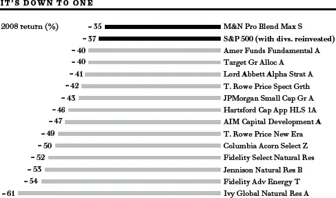
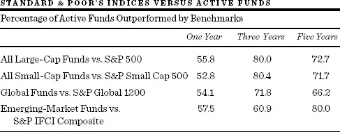
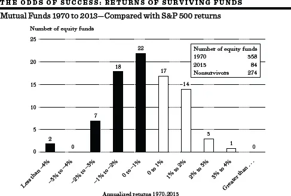

基本面分析有多好？\
有效市场假说


我怎么会如此轻信专家？\
John F. Kennedy，猪湾事件惨败之后


最初，他是一名统计师。他穿着白色硬领衬衫和磨旧的蓝色西装。他静静地戴上绿色遮光罩，坐在桌前，一丝不苟地记录着他所跟踪公司的历史财务信息。结果是：手抽筋了。但随后一种蜕变悄然发生。他从桌前站起来，买了蓝色纽扣衬衫和灰色法兰绒西装，扔掉了遮光罩，开始实地考察那些此前他只从财务统计数据中了解的公司。他的头衔现在变成了证券分析师（Security Analyst）。

随着时间的推移，他的薪水和福利吸引了女性同事的注意，她们也穿起了西装。几乎每一个有头有脸的人物现在都坐头等舱，谈的都是钱、钱、钱。新一代人很时髦；西装过时了，Gucci鞋和Armani裤流行起来。他们才华横溢、知识渊博，投资组合经理依赖他们的推荐，华尔街公司越来越多地利用他们来培养投行业务客户。他们现在是股票研究明星（Equity Research Stars）。然而，有些人不怀好意地低声说，他们是投资银行的妓女。

## 华尔街与学术界的观点

无论这些人持有何种头衔，贬义的也好，其他的也罢，他们大多数都是基本面分析者。因此，对技术分析（Technical Analysis）有效性的质疑不会让大多数专业人士感到惊讶。从根本上说，华尔街专业人士都是基本面分析者。真正重要的问题是：基本面分析（Fundamental Analysis）到底有没有用？

关于基本面分析的有效性，存在两种截然对立的观点。华尔街人士认为基本面分析正在变得越来越强大。个人投资者在专业投资组合经理和一整支基本面分析师团队面前几乎没有胜算。

学术界的许多人对这种自大嗤之以鼻。一些学者甚至提出，一只蒙着眼睛的猴子向股票列表投掷飞镖，选出的股票能和专业投资组合经理一样成功。他们认为基金经理及其分析师在选股方面不会比一个普通业余爱好者做得更好。本章将讲述学术界与市场专业人士之间持续战争中的主要战役，解释"有效市场假说"（Efficient Market Hypothesis）的含义，并告诉你为什么它与你的钱包息息相关。

### 证券分析师真的有未卜先知的能力吗？

预测未来收益是证券分析师存在的理由。正如《机构投资者》（Institutional Investor）所言："收益是游戏的名字，而且永远都是。"

为了预测未来方向，分析师通常从观察过去的走势开始。一位分析师告诉我："过去收益增长的可靠记录是未来收益增长最可靠的指标。"如果管理层真的很有能力，就没有理由认为他们会失去点金术。如果同一个精明的管理团队继续掌舵，未来收益增长的轨迹应该会延续过去的样子，这就是他们的论点。虽然这听起来与技术分析师使用的论点惊人地相似，但基本面分析者引以为豪的是，它基于具体的、经过验证的公司业绩。

这种思维在学术界行不通。过去的收益增长计算对未来增长的预测毫无帮助。如果你知道所有公司在1980-1990年期间的增长率，这对你预测它们在1990-2000年期间能达到什么增长毫无帮助。而知道1990年代的快速增长者，也没有帮助分析师找到二十一世纪头十年的快速增长者。这一惊人的结果最早由英国研究人员在一篇名为《杂乱无章的增长》（Higgledy Piggledy Growth）的论文中报告。普林斯顿和哈佛的学者将英国研究应用于美国公司——结果令人惊讶，同样的结论在美国也成立！

"IBM，"人们立刻喊道，"别忘了IBM。"我确实记得IBM：数十年稳定高速增长的公司。它曾一度是明显的例外。但在1980年代中期之后，即使强大的IBM也没能继续保持其可靠的增长模式。我还记得Polaroid、Kodak、Nortel Networks、Xerox，以及数十家其他公司，它们一直保持着稳定的高增长率，直到屋顶塌了下来。我希望你记住的不是当前的例外，而是规律：华尔街的许多人拒绝接受一个事实——从过去的记录中无法辨别出可靠的模式来帮助分析师预测未来的增长。即使在1990年代的繁荣时期，也只有八分之一的大公司设法实现了持续的年度增长。而没有一家能将增长延续到新千年的最初几年。分析师无法预测持续的长期增长，因为这种增长根本不存在。

然而，一个好的分析师会争辩说，预测远不止查看过去的记录那么简单。有些人甚至承认过去记录并不是完美的衡量标准。与其研究实际预测过程中的每一个因素，John Cragg和我决定集中研究最终结果：预测本身。

披着学术超然的外衣，我们写信给十九家最受尊敬的从事基本面分析的华尔街公司。我们请求这些公司提供它们对大量标普500公司未来一年和五年收益的估计。这些在不同时间做出的估计随后与实际结果进行比较，以评估分析师预测短期和长期收益变化的能力。结果令人惊讶。

直白地说，证券分析师的精心估计（基于行业研究、工厂考察等）并不比简单外推过去趋势的方法好多少，而我们已经看到后者毫无帮助。事实上，与实际收益增长率相比，证券分析师的五年估计实际上比几种朴素预测模型的预测还要差。

我们用来评估证券分析师对其公司诊断效果的方法，与之前评估技术分析师的方法完全相同。我们将跟随专家得到的结果与某些完全不需要专业知识的朴素机制得到的结果进行了比较。有时这些朴素预测者效果非常好。例如，如果你想预测明天的天气，预测它和今天完全一样，你会做得相当好。虽然这个系统错过了每一个转折点，但大多数时候它是相当可靠的。你认为有多少天气预报员做得更好呢？

当面对五年增长预测的糟糕记录时，证券分析师们诚实地——尽管有些不好意思——承认五年确实太远了，无法做出可靠的预测。他们觉得应该用预测一年后收益变化的能力来评判他们。信不信由你，结果证明他们的一年预测甚至比五年预测还要差。

分析师们奋力反击。他们抱怨说，在广泛的跨行业范围内评判他们的表现是不公平的，因为高科技公司和各种"周期性"公司的收益是出了名的难以预测。"拿公用事业公司来试试我们，"一位分析师自信地断言。所以我们试了，结果他们并不喜欢。即使是"稳定"的公用事业公司的预测也远远偏离了目标。这导致了我们研究的第二个主要发现：没有哪个行业是容易预测的。

而且，没有哪个分析师被证明持续优于其他人。当然，在每年的某些时候，有些分析师确实远超平均水平，但他们的表现模式并不一致。某一年表现优于平均水平的分析师，在下一年做出优越预测的可能性并不比其他人更大。

这些发现已被其他几位研究人员证实。例如，哈佛的Michael Sandretto和MIT的Sudhir Milkrishnamurthi完成了一项对1000家最受关注公司一年预测的大规模研究。他们得出的惊人结论是，每年的误差率非常一致，分析师在五年期间的平均年度误差为31.3%。金融预测似乎是一门让占星术都显得体面的科学。

在所有这些指责背后，有一个极其严肃的信息：证券分析师在履行其预测公司收益前景的基本职能时面临巨大困难。投资者在投资选择中盲目相信这些预测，将会遭遇一些残酷的失望。

### 水晶球为何蒙尘

得知训练有素、薪酬丰厚的专业人士在其职业中可能并不十分擅长，总是令人不安的。不幸的是，这并不罕见。类似的研究结果存在于大多数专业群体中。医学界有一个经典的例子。在扁桃体切除术非常流行的时期，美国儿童健康协会对纽约市公立学校的一组1000名11岁儿童进行了调查，发现其中611人已经切除了扁桃体。剩下的389人随后由一组医生检查，其中174人被选中进行扁桃体切除术，并宣布其余的人没有扁桃体问题。剩下的215名儿童由另一组医生重新检查，其中99人被建议进行扁桃体切除术。当116名"健康"儿童接受第三次检查时，有相同比例的人被告知需要切除扁桃体。经过三次检查，只剩下65名儿童没有被建议进行扁桃体切除术。这些剩余的儿童没有再被进一步检查，因为检查的医生已经用完了。

大量研究显示了类似的结果。放射科医生在他们阅读的X光片中，大约有30%未能识别出肺部疾病的存在，尽管疾病在X光片上清晰可见。另一项实验证明，精神病院的专业人员无法区分精神正常者和精神失常者。关键在于，我们不应该想当然地认为任何判断都是可靠的和准确的，无论评判者多么专业。考虑到如此多类型的判断可靠性都很低，证券分析师面临特别困难的预测工作也不例外，似乎并不令人惊讶。

我相信，有五个因素有助于解释为什么证券分析师在预测未来方面如此困难。它们是：（1）随机事件的影响，（2）通过"创造性"会计程序产生可疑的报告收益，（3）分析师自身的错误，（4）最优秀的分析师流失到销售部门或投资组合管理，以及（5）在大型投行运营的公司中证券分析师面临的利益冲突。每个因素都值得讨论。

1. 随机事件的影响

影响公司收益基本前景的许多最重要变化本质上是随机的，即不可预测的。以我之前提到的公用事业行业为例。它大概是最稳定和最可靠的公司群体之一。但事实上，许多重要的不可预测事件使得即使这个行业的收益也极难预测。州公用事业委员会意外的不利裁决常常使公用事业公司无法将需求的快速增长转化为更高的利润。在1970年代和2000年代初期，由于分析师未能预测国际油价急剧上涨导致的燃料成本增加，预测严重偏离目标。

其他行业的预测问题更为困难。正如我们在[第4章](ch04.md)看到的，2000年初对各种高科技和电信公司的增长预测严重错误。美国政府的预算、合同、法律和监管决定可能对个别公司的命运产生巨大影响。管理层关键成员的伤残、重大新产品的发现、重大石油泄漏、恐怖袭击、新竞争者的进入、价格战以及洪水和飓风等自然灾害也是如此。生物科技行业是出了名的难以预测。潜在的重磅新药往往因未能改善死亡率或出现意外的毒性副作用而未能通过三期临床试验。2013年，Celsion公司宣布其有前景的肝癌药物试验未能达到主要终点。股价迅速下跌了90%。不可预测事件影响收益的故事不胜枚举。

2. 通过"创造性"会计程序产生可疑的报告收益

一家公司的损益表可以比作比基尼——它展示的东西很有趣，但它隐藏的东西才是关键。安然公司（Enron）是我遇到过的最巧妙的腐败公司之一，在这方面首当其冲。唉，安然远非个例。在1990年代末的大牛市中，公司越来越多地使用激进的虚构手法来报告飞涨的销售额和收益，以推动其股价上涨。

在热门音乐剧《制作人》（The Producers）中，Leo Bloom决定他可以从一部失败的作品中赚到比成功作品更多的钱。他说："这完全是创造性会计的问题。"Bloom的客户Max Bialystock立刻看到了潜力。Max从富有的寡妇那里骗取了大把的钱来资助一部百老汇音乐剧《希特勒的春天》（Springtime for Hitler）。他希望这是一部彻底的失败之作，这样就没有人会追问钱的去向。

实际上，Bloom的手法与公司用来夸大收益、欺骗投资者和证券分析师的伎俩相比根本不算什么。在[第3章](ch03.md)中，我描述了Barry Minkow在1980年代末建立的地毯清洁帝国ZZZZ Best，是如何建立在虚假信用卡账单和虚构合同的拼凑之上的。但会计滥用在1990年代和二十一世纪初似乎变得更加频繁。倒闭的互联网公司、高科技领军企业，甚至老牌蓝筹股，都试图夸大收益，误导投资界。

以下只是少数几个例子，展示公司如何像拉太妃糖一样拉伸会计规则，以误导分析师和公众对其真实运营状况的了解。

- 2001年9月，安然和Qwest需要显示它们的收入和利润仍在快速增长。它们想出了一个好办法，让报表看起来业务进展顺利。它们以夸大的5亿美元价值交换了光纤网络容量，每家公司将这笔交易记录为销售。这虚增了利润，掩盖了两家公司不断恶化的状况。Qwest已经拥有过剩的产能，而且市场上光纤大量过剩，这笔交易的估值没有正当理由。

- Motorola、Lucent和Nortel都通过向客户提供大量贷款来推高销售额和收益。这些应收账款中有许多后来变成了坏账，不得不被核销。

- Xerox通过允许其在欧洲、拉丁美洲和加拿大的海外部门将多年期长期复印机租赁合同的全部现金收入作为一次性收入入账，从而在短期内推高了利润。

- "电锯Al"Dunlap是Sunbeam公司的CEO，他在冬季季度需要一次提振来满足华尔街对稳定增长收益的需求。他想出了一个巧妙的主意：说服零售商在隆冬时节购买后院烤架。"电锯"通过说零售商不必实际支付烤架费用直到以后，而且所有购买都可以存放在Sunbeam仓库里来让这笔交易更有吸引力。最终，Dunlap用尽了花招后逃离了，留下一个支离破碎的Sunbeam，最终破产。

- Diamond Foods（Pop Secret微波爆米花等零食的制造商）通过将支付给供应商的款项推迟到未来年度来低报成本。这使公司能够超出分析师预期，并将股价推高至每股90美元。这也让高管们拿到了大笔奖金。当SEC发现欺诈后，起诉了CEO和CFO，并迫使Diamond在2012年重述收益。股价随后跌至每股12美元。

- Groupon是提供餐厅、零售商品和服务优惠的在线优惠券服务公司，于2011年11月进行首次公开募股（IPO），股价迅速较发行价上涨约35%。但仅仅几个月后，该公司宣布其关键会计控制存在"重大缺陷"，导致其高估了收入和收益。到2014年中，股价已经较IPO后下跌了80%。

- 还有养老金花招。许多公司估计其养老金计划资金过剩，因此取消了公司对计划的缴款，从而提高了利润。这些收益往往隐藏在脚注中。当2000年代初期市场急剧下跌时，公司发现它们的资金实际上是不足的，投资者以为是可持续的利润原来是暂时的。

分析师在解读当前和预测未来收益时面临的一个主要问题是，公司倾向于报告所谓的"备考收益"（Pro Forma Earnings），而不是按照公认会计原则（GAAP）计算的实际收益。在备考收益中，公司决定忽略某些被认为不寻常的成本；事实上，没有规则或准则。备考收益通常被称为"所有坏事发生之前的收益"，赋予公司排除任何其认为"特殊"、"非常规"和"非经常性"费用的权力。根据哪些费用被认为被不当忽略，公司可能报告大幅虚增的收益。难怪证券分析师在估计未来收益可能是什么方面有非凡的困难。

3. 分析师自身的错误

坦率地说，许多证券分析师并不是特别敏锐或具有批判性，他们经常犯下严重的错误。我在年轻时作为华尔街实习生就发现了这一点。在试图学习专业人士的技术时，我尝试复制Louie的一些分析工作，Louie是一名金属专家。Louie计算出铜价每上涨10美分，一家特定铜生产商的收益将增加每股1美元。由于他预期铜价上涨1美元，他推理说这只股票"是一个异常有吸引力的购买候选"。

在重新计算时，我发现Louie小数点放错了位置。铜价上涨10美分只会使收益增加10美分，而不是1美元。当我向Louie指出这一点时（假设他会立即发布更正），他只是耸耸肩，宣称："嗯，如果我们保留报告原样，推荐听起来更有说服力。"注意细节不是Louie的强项。

Louie缺乏对细节的关注反映了他对他所覆盖行业的理解不足。但他并非个例。一位整形外科医生Lloyd Kriezer博士在为《巴伦周刊》（Barron's）撰写的一篇文章中，审查了一些生物技术分析师撰写的报告。Kriezer特别关注分析师对那些创建用于治疗慢性伤口和烧伤的人造皮肤的生物技术公司的覆盖——这是他具有相当专业知识的领域。他发现证券分析师对股票的诊断严重偏离。首先，他将各家公司预期的市场份额假设加在一起。五家竞争人造皮肤市场的生物技术公司的预期份额总和远远超过100%。此外，分析师对潜在市场绝对规模的预测与实际烧伤受害者的数据几乎没有关系，尽管这些数据很容易获得。此外，在审查各种分析师报告后，Kriezer博士总结道："他们显然不了解这个行业。"人们会想起传奇棒球经理Casey Stengel的话："这里就没有人会打这个比赛吗？"

许多分析师效仿Louie。他们通常太懒，不愿自己做收益预测，更喜欢复制其他分析师的预测，或者不加咀嚼地吞下公司管理层发布的"指引"。这样如果出了问题，就很容易知道该怪谁了。而且当你的专业同事都同意你时，犯错要容易得多。正如凯恩斯所说："世俗的智慧教导我们，对于声誉来说，循规蹈矩地失败比特立独行地成功更好。"

证券分析师继续犯下毁灭性的预测错误。凤凰城大学的母公司Apollo集团在2012年初是华尔街的宠儿。分析师们对这家营利性教育行业领头羊的巨大收益潜力赞不绝口，并预测投资者将获得丰厚回报。关于高学生贷款违约率、低毕业率和掠夺性招生做法的报道被忽略了。但这些问题被一份广泛传播的国会报告证实。负面宣传和随之而来的新政府法规导致入学人数大幅下降，Apollo股价更是暴跌了80%。

我并不是说大多数华尔街分析师只是鹦鹉学舌般地重复管理层的话。但我确实想说，平均而言，分析师就是这样——一个收入丰厚且通常非常聪明的人，做着一项极其困难的工作，却以相当平庸的方式完成。分析师经常被误导，有时很草率，也许自视过高，有时和其他人一样容易受到压力。简言之，他们确实是非常普通的人。

4. 最优秀的分析师流失到销售部门、\
投资组合管理或对冲基金

我反对这个职业的第四个论点是自相矛盾的：许多最优秀的证券分析师并不是靠分析证券获得报酬的。他们往往是非常强大的机构销售人员，或者被提升到声望很高、报酬丰厚的投资组合经理位置。

以研究实力闻名的投资公司经常派一名证券分析师陪同普通销售人员去拜访金融机构。机构投资者喜欢直接从消息来源处听新的投资想法，所以普通销售人员通常坐到一边，让分析师发言。最有口才的分析师发现他们的时间都花在机构客户身上，而不是财务报告上。

在2000年代，许多分析师被诱惑离开研究部门，到对冲基金担任报酬丰厚的投资组合管理职位。已故的Barton Biggs离开摩根士丹利，创建了自己的对冲基金。他在《对冲化》（Hedgehogging）一书中写到了他的经历。在对冲基金经理的实战岗位上"管理资金"，比仅仅在参谋岗位上提供建议的证券分析师更令人兴奋、更有声望、报酬也更高。难怪许多最受尊敬的证券分析师不会在他们的岗位上待太久。

5. 研究部门与投资银行部门之间的\
利益冲突

分析师的目标是让收银机尽可能多地响起，而主要券商的收银机最满的地方是投资银行部门。情况并非一直如此。在1970年代，固定佣金制消亡和折扣经纪公司出现之前，零售经纪业务承担了费用，分析师觉得他们确实在为客户——零售和机构投资者——工作。但随着佣金竞争，这个利润中心的重要性下降了，剩下的金矿只有交易利润和为新老公司承销新股（费用可达数亿美元），以及就借款安排、重组、收购等向公司提供咨询。于是"让收银机响起"就意味着帮助券商获取和培育银行客户。利益冲突就是这样产生的。分析师的薪酬和奖金部分取决于他们在协助承销部门方面的作用。当存在这种业务关系时，分析师就成了投资银行部门的工具。

证券分析师与其投资银行运营之间紧密关系的一个迹象，一直是卖出推荐的传统稀缺性。买入与卖出推荐的比例总是存在某种偏差，因为分析师不想得罪他们覆盖的公司。但随着投资银行收入成为主要券商利润的重要来源，研究分析师越来越被付酬去看好而非准确。在一个著名的事件中，一位有勇气建议出售特朗普泰姬陵（Trump's Taj Mahal）债券的分析师——因为这些债券不太可能支付利息——在"唐纳德"本人威胁法律报复后立即被其公司解雇。（后来，这些债券确实违约了。）难怪大多数分析师都从他们的措辞中清除了可能冒犯当前或潜在投资银行客户的负面评论。在互联网泡沫期间，买入与卖出推荐的比例攀升至100比1，特别是那些拥有大型投资银行业务的公司。

当然，当分析师说"买入"时，他的意思可能是"持有"，当他说"持有"时，这可能是"尽快把这个垃圾抛掉"的委婉说法。但投资者不应该需要解构语义学课程才能理解这些推荐，而令人遗憾的是，大多数个人投资者在互联网泡沫期间完全相信了分析师的话。

有令人信服的证据表明，分析师的推荐受到了券商非常有利可图的投资银行关系的影响。多项研究评估了分析师选股的准确性。加州大学的Brad Barber研究了华尔街分析师"强烈买入"推荐的表现，发现其表现"灾难性"地差。事实上，分析师的强烈买入推荐每月跑输整个市场3个百分点，而他们的卖出推荐每月跑赢市场3.8个百分点。更糟的是，达特茅斯和康奈尔大学的研究人员发现，没有投资银行关系的华尔街公司的股票推荐，比那些与被覆盖公司有盈利投资银行关系的券商的推荐表现要好得多。Investors.com的一项研究发现，当投资者跟随受雇于管理或联合管理所推荐股票IPO的华尔街公司的分析师的建议时，亏损超过50%。研究分析师基本上是被付酬来吹捧公司承销客户的股票。分析师舔着喂他们的手。

2002年，纽约州总检察长找到了确凿的证据。当Henry Blodgett和其他Merrill Lynch分析师在官方推荐一些互联网和新经济股票时，同一批分析师在电子邮件中轻蔑地称这些股票为"垃圾"、"狗"或其他更难听的称呼。Merrill没有承认有罪，但它以1亿美元与纽约州和其他州达成了和解。它还承诺进行某些改革，例如不直接将分析师的薪酬与投资银行收入挂钩，澄清其股票推荐，并更好地披露潜在的利益冲突。其他公司如Goldman Sachs迅速接受了Merrill的提议。

今天的情况有所改善。明确的"卖出"推荐变得更加常见，尽管"买入"偏向仍然存在。但萨班斯-奥克斯利法案（Sarbanes-Oxley Act）——在互联网泡沫丑闻之后出台的——使分析师的工作更加困难，因为它限制了公司财务官员与华尔街分析师交谈的程度。SEC制定了"公平披露"（Fair Disclosure）政策，要求任何相关的公司信息必须立即公开，从而向整个市场披露。虽然这种政策有助于使股票市场更加高效，但许多不满的证券分析师称这种局面为"无披露"。证券分析师不再能早期获得特权信息。因此，没有理由相信证券分析师的推荐会在未来得到改善。

利益冲突和分析师缺乏独立质疑精神并没有在萨班斯-奥克斯利法案之后消失。2010年，在英国石油公司（British Petroleum）Deepwater Horizon钻井平台爆炸和漏油事件宣布后，BP股价下跌了10个点，从每股60美元跌到50美元。然而，华尔街分析师群体几乎一致认为股价反应过度，BP是"强烈买入"的机会。正如一位分析师所说，下跌"与公司可能的成本（估计为4.5亿美元）不成比例，即使假设可以索赔"。在覆盖这只股票的34位分析师中，27位给予"买入"评级，其他7位给予"持有"评级。没有一个"卖出"推荐。甚至连活跃的电视主持人Jim Cramer也告诉观众，他的慈善信托基金正在购买BP股票。股价最终跌至20多美元，市值损失近1000亿美元。（到2013年2月，BP已经支付和计提了422亿美元，且成本仍在上升。英国报纸《每日电讯报》（The Telegraph）在同一月份估计，最终总成本可能高达900亿美元。）

这种普遍性错误表明，利益冲突并未消除。BP是主要的证券发行人，能为华尔街带来大量的承销费用。分析师仍然受到这样一种恐惧的影响：对一家公司发表非常负面的评论可能导致未来承销业务的丧失。

最后，专业基金经理根据对经济状况的预测在现金、债券和股票之间转移资金以做出正确决定的能力，已经被证明极其糟糕。共同基金现金头寸的峰值通常与市场底部重合。相反，当市场处于高点时，现金头寸总是处于低位。

证券分析师能选出赢家吗？\
### 共同基金的表现

写到这里，我几乎能听到背景中的合唱。大概是这样的：分析师的真正考验在于他们推荐股票的表现。也许"邋遢的Louie"——那位金属分析师——确实用一个错位的小数点搞砸了他的收益预测，但如果他推荐的股票为客户赚了钱，他缺乏对细节的关注肯定是可以原谅的。"分析投资表现，"合唱队在说，"而不是收益预测。"

幸运的是，有一类专业人士的记录是公开的——共同基金。对我的论点更有利的是，基金中的人是业内最好的分析师和投资组合经理之一。正如一位投资经理最近所说："要很多年才能让整体能力水平提升到足以盖过当今激进投资管理者的惊人优势。"

这样的说法对学术界的崇高思想来说实在太诱人了。鉴于有大量可用数据、有时间进行此类研究，以及在这些事项上证明学术优越性的压倒性渴望，学术界将注意力集中在共同基金表现上是很自然的。

再一次，多项研究的证据惊人地一致。投资者通过平均水平的共同基金取得的表现，并不比通过购买和持有一个非管理的广泛股票指数所能取得的更好。换句话说，在很长一段时间内，共同基金的投资组合并没有跑赢随机选择的股票组合。虽然基金可能在某些短时期内有非常好的记录，但优异表现并不一致，而且无法预测基金在未来任何给定时期的表现。

下表显示了截至2013年12月31日的二十年期间普通股票共同基金的回报。作为比较，标准普尔500指数（S&P 500 Index）被用来代表广泛的市场。在不同时期以及养老基金经理和共同基金经理身上都发现了类似的结果。简单地购买和持有广泛市场指数中的股票，是一个专业投资组合经理很难打败的策略。

**共同基金与市场指数**

| 列1 | 列2 |
|------|------|

                                        *截至2013年12月31日20年*
  标普500指数                            9.22%
  平均股票基金                           8.36%
**指数优势（百分点）                     0.86%**

| 列1 | 列2 |
|------|------|

来源：Lipper和Vanguard。

除了积累的科学证据外，一些不太正式的测试也验证了这一发现。例如，1990年代初，《华尔街日报》（Wall Street Journal）开始举办飞镖比赛，每月将四位专家的选择与四支飞镖的选择进行对决。《日报》好心地让我在第一次比赛中投掷飞镖。到2000年代初，专家似乎略微领先于飞镖。然而，如果专家的表现是从他们的选择及其相关的宣传在《日报》上公布之日起（而不是前一天）衡量的，飞镖实际上略微领先。这是否意味着手腕比大脑更强大？也许不是，但我认为《福布斯》（Forbes）杂志提出的问题非常合理，当时一位记者总结道："似乎是运气和懒惰的结合打败了聪明才智。"

怎么会这样呢？每年都能看到共同基金的业绩排名。这些排名总是显示许多基金跑赢平均水平——有些幅度还相当大。问题在于表现没有一致性。正如过去的收益增长不能预测未来的收益，过去的基金业绩也不能预测未来的结果。基金管理也受到随机事件的影响：它们可能变得臃肿、懒散或分崩离析。一个在某段时期表现很好的投资策略，下一段时期可能很容易变糟。人们不禁要得出结论：决定业绩排名的一个非常重要的因素是我们的老朋友——运气。

这个结论并非最近才有。在过去四十年间——一个市场和公众持股比例发生巨大变化的时期——它一直成立。昨天的明星基金反复被证明是今天的灾难。在1960年代末，那些年轻的"冲锋型"基金（Go-Go Funds）表现出色，基金经理被当作体育名人来报道。但当1969年至1976年的下一个熊市来袭时，就是先享受后付账了。1968年的顶级基金随后表现完全灾难性。

例如，Mates基金在1968年排名第一。到1974年底，该基金已经损失了其1968年价值的93%，Fred Mates最终放弃了。他离开投资界，在纽约市开了一家单身酒吧，恰当地取名为"Mates"。事实上，1960年代末的大多数顶级基金到1970年代中期已经停业了。

1960年代末的这个例子出现在本书的第一版中。类似的结果继续成立。下表展示了1970-80年期间排名前20的基金在1980年代的表现。再一次，没有一致性。1970年代的许多顶级基金在1980年代排名接近底部。然而，有一个引人注目的例外。由Peter Lynch管理的麦哲伦基金（Magellan Fund）在1970年代和1980年代都是表现优异的。但Lynch在1990年以46岁的"高龄"退休了，我们永远不知道他是否会继续跑赢市场。

**1970年代前20名股票基金在1980年代的表现**

| 列1 | 列2 |
|------|------|

                                *平均年化回报*
                                *1970年代*                *1980年代*
  1970年代前20名基金             +19.0%                    +11.1%
**所有股票基金平均               +10.4%                    +11.7%**

| 列1 | 列2 |
|------|------|

如果你认为画面在1990年代有所改变，下表显示了1980年代前20名共同基金表现者在1990年代的表现恶化情况。结果令人沮丧地相似。金融杂志和报纸将继续赞美那些最近产生了高于平均水平回报的特定共同基金经理。只要存在平均水平，就会有一些经理超越平均水平。但一个时期的良好表现并不能预测下一个时期的良好表现。

**1980年代前20名股票基金在1990年代的表现**

| 列1 | 列2 |
|------|------|

                              *平均年化回报*
                              *1980年代*                *1990年代*
  1980年代前20名基金           +18.0%                    +13.7%
**标普500股票指数               +14.1%                    +14.9%**

| 列1 | 列2 |
|------|------|

同样，1990年代表现最好的普通股票基金在2000-09年——我称之为"零零年代"（The Naughties）——的表现不如市场。我们发现，1990年代最热门的20只基金的回报率远高于市场回报。这些就是被CNBC崇拜地采访、被投资杂志专题报道的"天才"基金经理。事实上，这些基金只是将投资组合全部押注于新经济股票。它们乘着互联网泡沫上升，但当泡沫破裂时，它们也一起崩溃了。平均而言，在2000年代的第一个十年，这些基金的表现远不如整体市场。投资者了解到，一年赚100%，下一年亏50%，正好让他们回到了起点。

**1990年代前20名股票基金在零零年代的表现**

| 列1 | 列2 |
|------|------|

                              平均年化回报
                              1990-99                 2000-09
  1990年代前20名基金           +18.0%                  --2.2%
**标普500股票指数               +14.9%                  --0.9%**

| 列1 | 列2 |
|------|------|

此外，零零年代表现最好的共同基金在2010年代往往表现远低于平均水平。诚然，有一些基金连续二十年录得高于平均水平的回报。但它们数量稀少，其数量并不比根据概率定律所预期的更多。

也许应该说明一下概率定律。让我们进行一场抛硬币比赛。那些能持续抛出正面的人将被宣布为获胜者。比赛开始，1000名参赛者抛硬币。正如概率所预期的那样，500人抛出正面，这些获胜者被允许进入第二阶段再次抛硬币。如预期的那样，250人抛出正面。在概率定律的作用下，第三轮将有125名获胜者，第四轮63人，第五轮32人，第六轮16人，第七轮8人。

到这个时候，人群开始聚集来见证这些专家抛硬币者的惊人能力。获胜者被奉承所淹没。他们被誉为抛硬币艺术的天才，传记被写成，人们急切地寻求他们的建议。毕竟，有1000名参赛者，只有8人能持续抛出正面。比赛继续进行，一些参赛者最终连续抛出九次甚至十次正面。[\*](#footnote-233-5)这个类比的重点不是表明投资基金经理能够或应该通过抛硬币来做决策，而是概率定律确实在起作用，它们可以解释一些惊人的成功故事。

平均水平的本质是总有一些投资者会超越它。在金钱游戏中有大量参与者，概率将会——而且确实——解释一些非凡的表现。偶尔选股成功获得的大量宣传，让我想起一个声称开发了治愈鸡癌症方法的医生的故事。他自豪地宣布，在测试的病例中，有33%出现了显著改善。在另外三分之一的病例中，他承认情况似乎没有变化。然后他相当不好意思地补充道："恐怕第三只鸡跑掉了。"

《华尔街日报》在2009年做了一个有趣的报道，展示了非凡投资表现可能多么短暂。该报指出，有14只共同基金在截至2007年的连续九年中跑赢了标普500指数。但只有1只在2008年继续了这一壮举，如下表所示。简单地指望任何基金或任何投资经理持续跑赢市场是不可能的——即使过去的记录暗示了某些不寻常的投资技能。

来源：《华尔街日报》，2009年1月5日。

支持指数投资（Index Investing）的证据随着时间的推移而增长。标准普尔每年发布报告，将所有主动管理基金（Actively Managed Funds）与各种标准普尔500股票指数进行比较。2014年的报告如下所示。当观察五年期时，超过三分之二的主动管理者被其基准指数（Benchmark Index）跑赢。而且每年的报告都大致相同。每次我修订这本书时，结果都是相似的。指数表现并不平庸——它超过了典型主动管理者取得的结果。而且这一结果适用于大盘股和小盘股，国内和国际股票。此外，如果观察十年或二十年的结果，同样的结论也成立。它对债券市场和股票市场同样适用。指数投资是明智的投资。

来源：S&P SPIVA报告——2014年3月。

我并不是说不可能跑赢市场。但这是极不可能的。一个有趣的证明方法是检查1970年（当我开始写这本书时）存在的*所有*股票共同基金的记录，并跟踪它们到2013年的表现。这就是第181页图表中展示的实验。

1970年，有358只股票共同基金存在。（如今有数千只。）我们只能衡量其中84只原始基金的长期记录，因为其中274只已经不存在了。因此，图表中的数据存在"幸存者偏差"（Survivorship Bias）。你可以确信，幸存下来的基金是那些记录最好的。共同基金行业有一个丑陋的秘密：如果你有一个表现不佳的基金，这对基金管理公司来说并不光彩。因此，表现不佳的基金倾向于被合并到记录更好的基金中，从而抹去它们令人尴尬的记录。图表中衡量的幸存基金是表现较好的那些。但即使数据中存在这种幸存者偏差，观察一下有多少原始基金实际上拥有优越的记录。你可以用一只手的手指数出原始358只基金中真正跑赢市场指数2个百分点或更多的基金数量。

来源：Lipper。

关键是你极不可能跑赢市场。这就像大海捞针一样稀有。一个更可能最优的策略是直接买下整个干草堆：即购买指数基金——一个简单购买并持有广泛股票市场指数中所有股票的基金。幸运的是，越来越多的投资者正在这样做。在2014年，个人和机构投资的资金中约有三分之一投资于指数基金。而且这个比例每年都在增长。

虽然前面的讨论集中在共同基金上，但不应该认为基金只是所有投资管理者中最差的。事实上，共同基金的表现记录比许多其他专业投资者要好一些。人寿保险公司、财产和意外伤害保险公司、养老基金、基金会、州和地方信托基金、银行管理的个人信托以及投资顾问管理的个人自由裁量账户的记录都已经被研究过。这些专业投资者之间或这些群体与整个市场之间，在普通股投资组合的表现上没有显著差异。例外非常罕见。目前还没有收集到科学证据表明，专业管理的投资组合作为一个整体的表现优于广泛的指数。

有效市场假说的半强式和强式形式

学术界已经做出了判断。基本面分析在帮助投资者获取超额收益方面并不比技术分析更好。然而，鉴于学术界吹毛求疵的倾向，他们很快就开始争论基本面信息的精确定义。有些人说它是目前已知的东西；另一些人说它延伸到来世。正是在这一点上，原本的强式有效市场假说（Strong Form EMH）分成了两个。"半强式"（Semi-Strong）形式认为，没有公开信息能帮助分析师选择被低估的证券。这里的论点是，市场价格结构已经考虑了资产负债表、利润表、股息等可能包含的任何公开信息；对这些数据的专业分析将毫无用处。"强式"（Strong）形式则认为，关于一家公司的任何已知甚至可知的信息都不会使基本面分析师受益。根据该理论的强式形式，即使是"内幕"信息也无法帮助投资者。

有效市场假说的强式形式显然是一种夸大。它不承认从内幕信息中获利的可能性。Nathan Rothschild在他的信鸽将Wellington在滑铁卢胜利的最早消息带到他面前时——在其他交易商意识到之前——在市场上赚了数百万。但今天，信息高速公路传递新闻的速度比信鸽快得多。而且公平披露条例（Regulation FD）要求公司迅速公开宣布任何可能影响其股票价格的重大新闻。此外，利用非公开信息进行交易获利的内幕人士正在违反法律。诺贝尔奖获得者Paul Samuelson将这种情况总结如下：

如果聪明的人不断地四处寻找好价值，卖出那些他们认为将被高估的股票，买入那些他们预期目前被低估的股票，那么这些聪明投资者的行为的结果将是，现有股票价格已经折现了对其未来前景的预期。因此，对于那些自己不寻找低估和高估情况的被动投资者来说，将呈现一种股票价格模式，使一只股票与其他股票一样好或坏。对那个被动投资者来说，仅凭运气就会和任何其他方法一样好。

这就是有效市场假说的陈述。有效市场假说的"狭义"（弱式）形式认为，技术分析——研究过去的股票价格——无法帮助投资者。价格从一个时期到另一个时期的波动非常像随机游走（Random Walk）。"广义"（半强式和强式）形式则认为基本面分析也没有帮助。关于公司收益和股息预期增长的一切信息，以及基本面分析师可能研究的所有可能的有利和不利发展，都已反映在公司股票的价格中。因此，购买一个持有广泛指数中所有股票的基金，将产生一个可以预期与任何专业证券分析师管理的组合一样好的投资组合。

有效市场假说并没有像一些批评者所宣称的那样，声称股价是无目的和反复无常地移动，并且对基本面信息的变化不敏感。恰恰相反，价格随机移动的原因恰好相反。市场是如此高效——价格在信息出现时移动得如此之快——以至于没有人能足够快地买入或卖出以获利。而真正的新闻是随机发展的，即不可预测的。它无法通过研究过去的技术或基本面信息来预测。

即使是传奇的Benjamin Graham，被誉为基本面证券分析之父，也不情愿地得出结论：基本面证券分析已不再能被指望产生超额投资回报。1976年去世前不久，他在接受《金融分析师杂志》（Financial Analysts Journal）采访时说："我不再倡导复杂的技术分析来寻找优质价值机会。在《证券分析》（Security Analysis）首次出版的大约40年前，这是一项有回报的活动；但情况已经改变了。……（今天）我怀疑如此广泛的努力是否能产生足够优质的选择来证明其成本合理。……我站在'有效市场'学派一边。"而Peter Lynch在从麦哲伦基金退休后不久，以及传奇人物Warren Buffett都承认，大多数投资者投资指数基金会比投资主动管理的股票共同基金更好。

关于高频交易（HFT）的说明

2014年出版的一本畅销书《闪电男孩》（Flash Boys）将聚光灯对准了高频交易（High-Frequency Trading），引发了对该技术的强烈批评风暴。据称，高频交易让一小部分交易者获得了对公众甚至对共同基金和养老基金等机构投资者的不公平优势。

高频交易涉及将高速计算机放置在股票市场服务器附近，使一些参与者能够比眨眼还快地买卖股票。从某种意义上说，它只是回应投资者日益增长的速度需求的下一个发展。从1792年在华尔街的按钮树下向交易员大喊订单到在办公楼里喊单，技术已经极大地提高了交易效率，降低了交易成本，增加了所有投资者的流动性。它还有助于确保市场重大新闻尽可能快地反映在股价中。

很容易对这种交易活动制造恐慌，但大部分股票交易量都是通过这些高速网络进行的。无论你是买入100股还是100,000股，你都直接或间接地参与其中。我们现在都是高频交易者了。

高频交易的另一个主要优势是，它确保了我推荐给个人投资者的交易所交易广泛指数基金定价适当。ETF价格与基础股票之间的任何差异都可以迅速通过套利消除。因此，高频交易实际上不仅没有损害个人投资者，反而通过确保ETF定价公平而使他们受益。

但这并不意味着高频交易完全无害。正如批评者所指出的，目前处于最佳位置的交易者可以在其他投资者的交易订单执行之前看到这些订单。他们可以在这些订单之前执行一笔买入，将价格推高一点，从而赚取差价。这种被称为"抢先交易"（Front-Running）的剥头皮行为是一种内幕交易形式。如果有人能够在实际购买股票之前知道我想买入10,000股，那就是内幕信息，利用这种信息进行交易应该是非法的。SEC需要解决这些做法并找到监管解决方案。但高频交易的批评者错误地断言该做法损害了个人投资者。改善流动性、以更好的价格执行交易、加快交易流程的技术进步一直对大小投资者都有利。高频交易使市场更加高效，并强化了指数基金投资的优势。

[\*](#footnote-233-5-backlink)如果我们让失败者继续玩下去（就像共同基金经理在表现不佳的年份之后仍然做的那样），我们会发现还有更多参赛者在十次中抛出了八次或九次正面，因此被认为是抛硬币专家。
