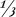
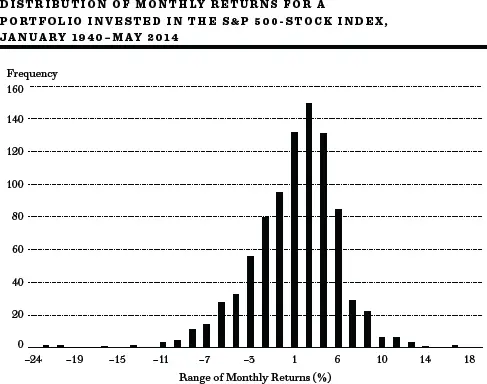
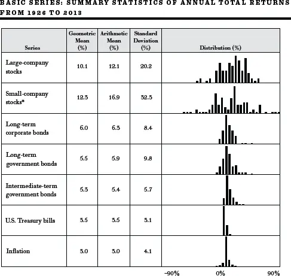
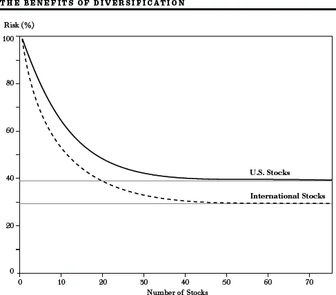
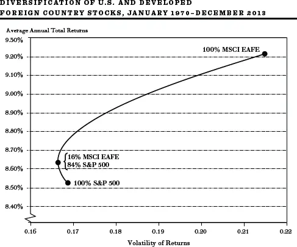
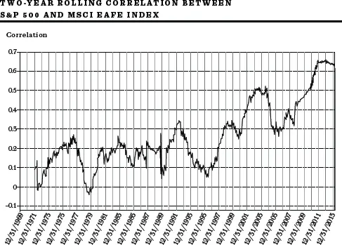
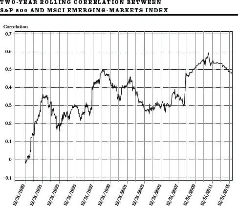
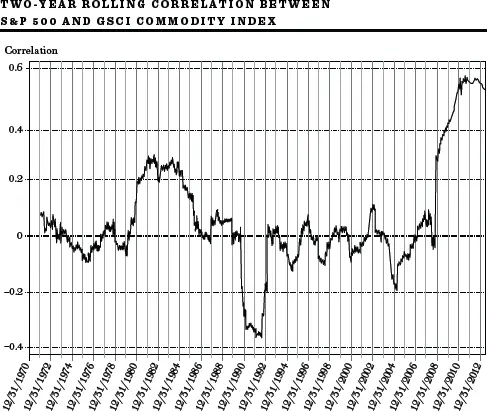
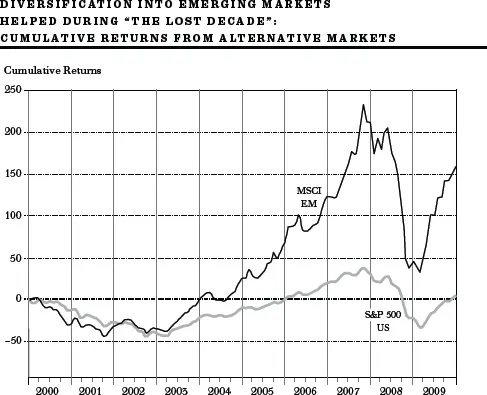
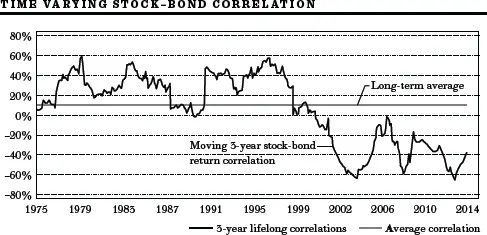

新步行鞋：\
现代投资组合理论


......实践者们相信自己完全不受任何知识分子的影响，但通常是某些已故经济学家的奴隶。掌权的疯子们听到空中的声音，正从几年前某个学术文人那里提炼他们的疯狂。\
J. M. Keynes，《就业、利息和货币通论》


在本书中，我一直试图解释专业人士使用的理论——简化为坚实基础理论（Firm Foundation Theory）和空中楼阁理论（Castle-in-the-Air Theory）——来预测股票估值。正如我们所看到的，许多学者通过攻击这些理论并声称不能依靠它们来获得超额利润而赢得了声誉。

随着研究生院不断培养出聪明的年轻金融经济学家，攻击者变得如此之多，以至于显然需要一种新策略；于是，学术界忙于建立自己的股市估值理论。这就是本书这一部分的全部内容：在学院高塔内创造的"新投资技术"的高深世界。其中一个洞见——现代投资组合理论（Modern Portfolio Theory，MPT）——如此基础，现在在华尔街被广泛遵循。其他理论仍然争议很大，继续为学生提供论文素材，为其导师带来丰厚的讲座费用。

本章讲述现代投资组合理论，其洞见将使你在可能获得更高回报的同时降低风险。在[第9章](ch09.md)中，我转向那些认为投资者可以通过承担某种特定风险来提高回报的学者。然后，在[第10章](ch10.md)和[第11章](ch11.md)中，我涵盖了部分学者和从业者的论点，他们认为心理而非理性在统治市场，随机游走并不存在。他们认为市场是无效的，市场价格是可以预测的，而且可以遵循多种投资策略来"跑赢市场"。其中包括华尔街流行的多种"聪明贝塔"（Smart Beta）策略。最后我将证明，尽管有种种批评者，传统指数基金仍然是市场中最盈利漫步的无可争议的冠军。

## 风险的作用

有效市场假说解释了随机游走为何可能存在。它认为股市如此擅长消化新信息，以至于没有人能够以优越的方式预测其未来走向。由于专业人士的行为，个股价格迅速反映所有可获得的消息。因此，选出优质股票或预测市场整体方向的概率是均等的。你的猜测和猴子、你的股票经纪人、甚至我的猜测一样可靠。

嗯。"我闻到了不对劲的味道，"正如Samuel Butler很久以前写的。市场上有人在赚钱；有些股票确实跑赢了其他股票。常识证明，有些人能够而且确实跑赢了市场。这不全是运气。许多学者同意这一点；但他们认为，跑赢市场的方法不是展现超凡的预见力，而是承担更大的风险。风险，而且只有风险，决定了回报高于或低于平均水平的程度。

### 定义风险：回报的离散度

风险是最难以捉摸的概念。投资者——更不用说经济学家——很难就精确定义达成一致。《美国传统词典》（American Heritage Dictionary）将风险定义为"遭受伤害或损失的可能性"。如果我能买到一年期国库券（Treasury Bills），收益率2%，并持有至到期，我实际上可以确定获得2%的货币回报，税前。损失的可能性如此之小，可以被视为不存在。如果我持有一年本地电力公司的普通股，预期获得5%的股息回报，损失的可能性就更大。公司的股息可能被削减，更重要的是，年末的市场价格可能低得多，导致我遭受净亏损。因此，投资风险（Investment Risk）是指预期证券回报无法实现的可能性，特别是你持有的证券价格下跌的机会。

一旦学者们接受了投资者的风险与在实现预期证券回报方面感到失望的可能性相关的观点，一个自然的衡量标准就浮现了——未来回报的可能离散程度。因此，金融风险通常被定义为回报的方差（Variance）或标准差（Standard Deviation）。为充分说明，我们用下图来解释我们的意思。一个回报不太可能偏离其平均（或预期）回报的证券被认为风险很小或无风险。一个年度回报可能相当波动（某些年份出现急剧损失）的证券则被认为是有风险的。

示例：预期回报与衡量奖励和风险的方差

**这个简单的例子将说明预期回报和方差的概念，以及如何衡量它们。假设你买了一只股票，在不同经济条件下预期获得以下总体回报（包括股息和价格变化）：**

| 列1 | 列2 |
|------|------|

  *经济状况*                                *发生概率*                    *预期回报*
  "正常"经济条件                            1/3概率                      10%
  无通胀的快速增长                           1/3概率                      30%
**伴随通胀的衰退（滞胀）                     1/3概率                      --10%**

| 列1 | 列2 |
|------|------|

如果平均而言，过去的年份中有三分之一是"正常"的，三分之一是无通胀的快速增长，剩下三分之一是"滞胀"，那么将这些历史事件的相对频率作为未来经济状况可能性的最佳估计（概率）是合理的。我们可以说投资者的预期回报是10%。三分之一的时间投资者获得30%，另外三分之一获得10%，其余时间遭受10%的损失。这意味着平均而言，她的年回报将是10%。

*预期回报 = (0.30) +
(0.10) +
(--0.10) = 0.10.*

然而年度回报将相当可变，从30%的收益到10%的损失不等。"方差"是衡量回报离散度的指标。它定义为每个可能回报与其平均（或预期）值之差的平方的平均值，我们刚才看到该值为10%。

*方差 = (0.30--0.10)^2^ +
(0.10--0.10)^2^ +
(--0.10--0.10)^2^ =
(0.20)^2^ +
(0.00)^2^ +
(--0.20)^2^ = 0.0267.*

方差的平方根称为标准差。在本例中，标准差等于0.1634。

方差和标准差等离散度衡量指标未能让所有人满意。批评者说："风险当然与方差本身无关。"如果离散来自意外之喜——即结果好于预期——任何头脑清醒的投资者都不会称之为风险。

当然，只有下行失望的可能性才构成风险。然而，作为实际问题，只要回报的分布是对称的——即异常收益的概率与令人失望的回报和损失的概率大致相同——离散度或方差衡量就足以作为风险指标。离散度或方差越大，失望的可能性就越大。

虽然个股的历史回报模式通常不是对称的，但充分分散的股票组合的回报至少大致是对称的。下图显示了投资于标普500股票指数的投资组合在过去七十年中的月度证券回报分布。它是通过将回报范围划分为等距区间（约1¼%）来构建的，然后记录回报落入每个区间的频率（月份数）。平均而言，该组合每月回报接近1%，即每年约11%。但在市场急剧下跌时期，该组合也大幅下挫，单月损失超过20%。

来源：Global Financial Data。

对于像这样相对对称的分布，一个有用的经验法则是三分之二的月度回报倾向于落在平均回报的一个标准差范围内，95%的回报落在两个标准差范围内。回想一下，该分布的平均回报接近每月1%。标准差（我们衡量组合风险的指标）约为每月4½%。因此，在三分之二的月份中，该组合的回报在+5½%和--3½%之间，95%的回报在10%和--8%之间。显然，标准差越高（回报越分散），你就越有可能（风险越大）在某些时期在市场中遭受重大损失。这就是为什么像标准差这样的变异性衡量指标经常被使用并被证明是风险的合理指标。

### 风险的实证记录：一项长期研究

金融领域有据可查的命题之一是，平均而言，承担更大风险的投资者获得了更高的回报率。最彻底的研究由Ibbotson Associates完成。其数据涵盖1926年至2013年，结果如下表所示。Ibbotson Associates的做法是选取几种不同的投资工具——股票、债券和国库券——衡量每种工具每年的百分比增减。然后在基线上竖立一个矩形或条形，表示回报落在0到5%之间的年数；另一个矩形表示回报落在5到10%之间的年数；以此类推，包括正负回报。结果是一系列条形图，显示回报的离散度，由此可以计算标准差。

1926年至2013年数据。

\*1933年小盘股总回报为142.9%。

一眼就能看出，长期内普通股平均提供了相对丰厚的总回报率。这些回报，包括股息和资本利得，大幅超过了长期债券、国库券和以消费者价格年增长率衡量的通胀率的回报。因此，股票往往提供正的"实际"回报率，即剔除通胀影响后的回报。然而数据显示，普通股回报波动性很大，如标准差和相邻列所示的年度回报范围所示。股票回报从超过50%的收益（1933年）到几乎相同幅度的损失（1931年）。显然，股票为投资者提供的额外回报是以承担相当更大的风险为代价的。注意，小盘股（Small-Company Stocks）自1926年以来提供了更高的回报率，但其回报的离散度（标准差）甚至比一般股票更大。再一次，我们看到更高回报与更高风险相关联。

曾有多个五年或更长时间段普通股产生了负回报率。1930-32年对股市投资者来说极其糟糕。1970年代初也产生了负回报。1987年10月广义股市平均指数下跌三分之一，是自1930年代以来短期内股市价格最剧烈的变化。而股市投资者非常清楚2000年代头十年股票的糟糕表现。尽管如此，长期来看，承担更多风险的投资者获得了更高回报作为补偿。然而，投资者有办法降低风险。这引出了现代投资组合理论的主题，它彻底改变了专业人士的投资思维。

降低风险：\
### 现代投资组合理论（MPT）

投资组合理论的前提是所有投资者都像我的妻子一样——他们厌恶风险（Risk-Averse）。他们想要高回报和有保障的结果。该理论告诉投资者如何在投资组合中组合股票，以在寻求的回报基础上实现尽可能低的风险。它还为那个历史悠久的投资格言提供了严格的数学证明：分散化（Diversification）是希望降低风险的个人的明智策略。

该理论由Harry Markowitz于1950年代发明，他因此贡献于1990年获得诺贝尔经济学奖。他的著作《投资组合选择》（Portfolio Selection）源于他在芝加哥大学的博士论文。他的经历包括在加州大学洛杉矶分校教学、在兰德公司设计计算机语言，甚至经营过对冲基金，担任套利管理公司总裁。Markowitz发现的是，风险（波动性）股票的投资组合可以以某种方式组合，使得整个组合的风险可能低于其中个别股票。

现代投资组合理论（也称MPT）的数学是深奥而令人生畏的；它填满了期刊，顺便也让很多学者有事可做。这本身就是不小的成就。幸运的是，没有必要让你穿越二次规划（Quadratic Programming）的迷宫来理解该理论的核心。一个简单的例子就能说清楚。

**假设我们有一个只有两个企业的岛屿经济。第一个是有海滩、网球场和高尔夫球场的大型度假胜地。第二个是雨伞制造商。天气影响两者的命运。晴朗季节，度假胜地生意兴隆，雨伞销量暴跌。雨季时，度假胜地经营惨淡，而雨伞制造商则销量和利润大增。下表显示了两个企业在不同季节的一些假设回报：**

| 列1 | 列2 |
|------|------|

                 *雨伞制造商*               *度假胜地老板*
  雨季            50%                       --25%
**晴季            --25%                     50%**

| 列1 | 列2 |
|------|------|

假设平均而言，一半季节晴朗，一半季节多雨（即晴季或多雨季的概率均为½）。买入雨伞制造商股票的投资者会发现，一半时间获得50%回报，另一半时间损失25%投资。平均而言，他将获得12½%的回报。这就是我们所说的投资者预期回报。同样，投资度假胜地也会产生相同结果。投资这两家企业中的任何一个都相当有风险，因为结果波动很大，可能连续出现多个晴季或多雨季。

然而，假设一个拥有两美元的投资者不是只买一种证券，而是将资金分散，一半投入雨伞制造商，一半投入度假胜地业务。在晴季，在度假胜地的一美元投资将产生50美分回报，而在雨伞制造商的一美元投资将损失25美分。投资者的总回报将是25美分（50美分减25美分），占其两美元总投资的12½%。

注意在多雨季节，情况完全相同——只是名字变了。投资雨伞制造商产生50%回报，而投资度假胜地损失25%。同样，分散化的投资者在其总投资上获得12½%的回报。

这个简单的例子指出了分散化的基本优势。无论天气如何变化，从而无论岛屿经济如何变化，通过将投资分散到两家公司，投资者每年都能确保获得12½%的回报。使这个策略奏效的关键是，尽管两家公司都有风险（年度回报波动），但天气条件对它们的影响不同。（用统计术语说，两家公司具有负协方差。）[[\*](#footnote-233-6)]只要经济中个别公司的命运存在某种程度的不同步，分散化就能降低风险。在本例中，两家公司的命运之间存在完美的负相关关系（一家表现好时另一家表现差），分散化可以完全消除风险。

当然，总有美中不足之处。这种情况就是大多数公司的命运往往同步移动。当经济衰退、人们失业时，他们可能既不度夏季度假，也不买雨伞。因此，在实践中不应期望获得刚才展示的那种完美的风险完全消除。不过，由于公司命运并不总是完全同步移动，投资于分散化的股票组合可能比投资于一两种单一证券风险更小。

将这个例子的启示应用到实际投资组合构建中很容易。假设你考虑将福特汽车公司与其主要轮胎供应商组合进股票组合。分散化能给你带来很大的风险降低吗？可能不会。如果福特销量下滑，福特将从轮胎制造商那里购买更少的新轮胎。一般来说，如果两家公司的回报之间存在高协方差（高相关性），分散化不会有太大帮助。

另一方面，如果福特与一家位于萧条地区的政府承包商组合，分散化可能会显著降低风险。如果消费者支出下降（或油价飙升），福特的销售和利润可能下降，全国失业率上升。如果政府在高失业率时期习惯性地向萧条地区发放合同（以缓解那里的失业困境），那么福特和承包商的回报可能不同步。两只股票可能协方差很小，或者更好——负协方差。

这个例子可能有点牵强，大多数投资者会意识到，当市场大跌时，几乎所有股票都会下跌。但至少在某些时期，某些股票和某些资产类别确实与市场逆向移动；即它们具有负协方差，或者（这是同一件事）彼此负相关。

**相关系数与分散化降低风险的能力**

| 列1 | 列2 |
|------|------|

  *相关系数*                   *分散化对风险的影响*
  +1.0                        不可能降低风险。
  +0.5                        可以适度降低风险。
  0                           可以显著降低风险。
  --0.5                       大部分风险可以消除。
**--1.0                       所有风险都可以消除。**

| 列1 | 列2 |
|------|------|

现在真正的关键来了；实现分散化风险降低效益并不需要负相关。Markowitz对投资者钱包的重大贡献在于他证明了任何低于完全正相关的东西都有可能降低风险。他的研究得出了上表的结果。如表所示，它展示了相关系数在决定添加一种证券或资产类别能否降低风险方面的关键作用。

### 实践中的分散化

用莎士比亚的话说，好事会不会太多？换句话说，是否存在一个点使得分散化不再是保护回报的魔杖？大量研究证明答案是肯定的。如下图所示，美国仇外者——那些害怕看国界之外的人——的黄金数字是至少五十只等额且充分分散的美国股票（显然，五十只石油股票或五十只电力公用事业股票不会产生同等程度的风险降低）。拥有这样的组合，总风险可降低60%以上。而好消息到此为止，因为进一步增加持股数量不会带来太多额外的风险降低。

那些视野更广的投资者——认识到自Markowitz首次阐述其理论以来世界已发生巨大变化的投资者——可以获得更大的保护，因为外国经济的走势并不总是与美国经济同步，尤其是新兴市场（Emerging Markets）。例如，石油和原材料价格上涨对欧洲、日本甚至至少部分自给自足的美国有负面影响。另一方面，石油价格上涨对印度尼西亚和中东产油国有非常积极的影响。同样，矿物和其他原材料价格上涨对澳大利亚和巴西等自然资源丰富的国家有积极影响。

事实证明，约五十也是面向全球投资者的黄金数字。然而，这些投资者的资金获得更多保护，如上图所示。这里的股票不仅来自美国股市，也来自国际市场。正如预期的那样，国际分散化组合往往比纯粹来自美国股票的组合风险更小。

国际分散化的好处已有充分记录。第203页的图表显示了1970年至2013年四十多年间实现的收益。在此期间，外国股票（以摩根士丹利EAFE[欧洲、澳大利亚和远东]指数衡量发达国家的外国股票）的平均年回报略高于标普500指数中的美国股票。然而，美国股票更安全，因为其逐年回报波动较小。在此期间，两个指数回报之间的相关系数约为0.5——正相关但仅中等偏高。该图显示了如果投资者持有不同比例的美国和EAFE（发达外国国家）股票，可以实现的不同回报和风险（波动性）组合。在图的右侧，我们看到仅持有EAFE股票的组合会实现更高的回报和更高的风险水平（更大的波动性）。在图的左侧，显示了完全持有美国股票的国内组合的回报和风险水平。实心深色线表示不同国内和外国股票配置比例所产生的不同回报和波动性组合。

注意，当组合从100%国内配置逐渐增加外国股票配置时，回报往往增加，因为EAFE股票在此期间产生的回报略高于国内股票。然而，重要的是，添加一些风险较高的证券实际上降低了组合的风险水平——至少在一段时间内。但最终，随着组合中风险较高的EAFE股票比例越来越大，整体风险随整体回报一同上升。

来源：DATASTREAM。

这种分析的矛盾结果是，通过添加少量风险较高的外国证券降低了整体组合风险。当日系汽车制造商在美国市场份额增加时，其良好回报平衡了国内制造商的糟糕回报。另一方面，当美元变得更有竞争力、日本和欧洲仍处于衰退而美国经济繁荣时，美国制造商的良好回报抵消了外国制造商的糟糕回报。正是这些对冲性运动降低了组合的整体波动性。

事实证明，风险最低的组合持有17%外国证券和83%美国证券。此外，向国内组合添加17%的EAFE股票也倾向于增加组合回报。国际分散化提供了我们世界证券市场上最接近免费午餐（Free Lunch）的东西。当通过添加国际股票能以更低风险实现更高回报时，没有投资者应该忽视这一点。

一些投资组合经理认为，分散化没有继续提供与以前相同程度的好处。全球化导致美国与外国市场之间以及股票与商品之间的相关系数上升。以下三张图表显示了相关系数在2000年代第一个十年如何上升。这些图表显示了每24个月期间计算的美国股票（以标普500股票指数衡量）与发达外国股票EAFE指数之间、美国股票与新兴市场股票广泛（MSCI）指数之间、以及美国股票与高盛（GSCI）一篮子商品（如石油、金属等）指数之间的相关系数。特别令投资者不安的是，当市场下跌时相关性很高。在2007-09年全球信贷危机期间，所有市场同步下跌。显然无处可藏。难怪一些投资者开始认为分散化似乎不再是一种有效的降低风险策略。

但请注意，尽管市场间的相关性已经上升，但它们仍远非完全相关，广泛的分散化仍然倾向于降低组合的波动性。即使在不同股票市场往往同步波动的时期，分散化仍然提供了实质性的好处。考虑二十一世纪的第一个十年，这被广泛称为美国股票投资者的"失落十年"（Lost Decade）。发达国家——美国、欧洲和日本——的市场在该十年结束时处于或低于十年开始时的水平。将投资组合限制在发达经济体股票的投资者未能获得满意的回报。但在同一十年，包含新兴市场股票（通过低成本、广泛分散的新兴市场股票指数基金很容易获得）的投资者享受了相当令人满意的股票投资表现。

下图显示，投资标普500指数在2000年代第一个十年没有赚到任何钱。但投资广泛的新兴市场指数产生了相当令人满意的回报。广泛的国际分散化对美国投资者将有巨大好处，即使在"失落十年"期间。

来源：Vanguard, Datastream, Morningstar。

此外，安全债券证明了其作为风险降低工具的价值。第208页的图表显示了美国国债和美国大盘股在2008-09年金融危机期间相关系数如何下降。即使在2008年可怕的股市中，投资于巴克莱资本（Barclay's Capital）广泛债券指数的广泛分散债券组合也获得了5.2%的回报。在金融危机期间有处可藏。债券（以及第四部分将介绍的类债券证券）证明了其作为有效分散化工具的价值。

来源：Vanguard。

总之，分散化的永恒教训在今天与过去一样强大。在第四部分，我将依靠这一投资组合理论的讨论，为不同年龄段和不同风险承受能力的个人制定适当的资产配置。

[\*](#footnote-233-6-backlink)统计学家使用"协方差"（Covariance）一词来衡量我所说的两只证券回报之间的平行程度。如果让*R*代表度假胜地的实际回报，*R* ^--^ 代表预期或平均回报，而*U*代表雨伞制造商的实际回报，*U* ^--^ *是*平均回报，我们将*U*和*R*之间的协方差（或COV~*UR*~）定义如下：

COV~*UR*~ = 降雨概率 × (*U*，若降雨 -- *U* ^--^) × (*R*，若降雨 -- *R*
^--^) + 晴天概率 × (*U*，若晴天 -- *U* ^--^) × (*R*，若晴天 -- *R* ^--^)。

根据前面的回报表和假设概率，我们可以填入相关数字：

COV~*UR*~ = ½(0.50 -- 0.125) (--0.25 -- 0.125) + ½(--0.25 -- 0.125)
(0.50 -- 0.125) = --0.141。

当两只证券的回报同步变动（一只上涨时另一只总是上涨）时，协方差将是一个大的正数。如果回报完全不同步，如本例所示，则称这两只证券具有负协方差。
