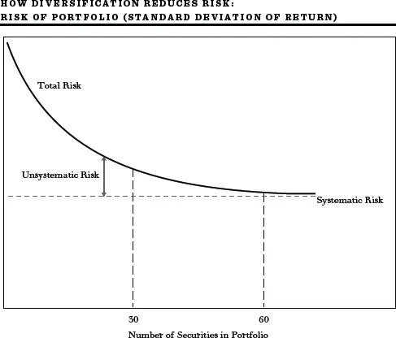
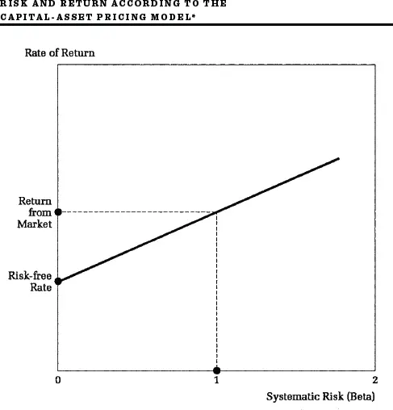
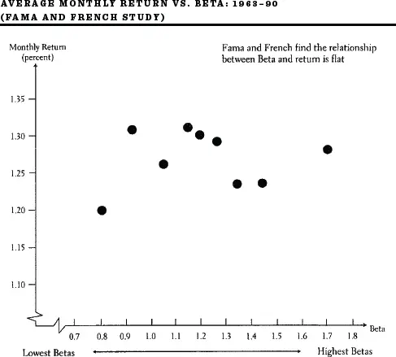
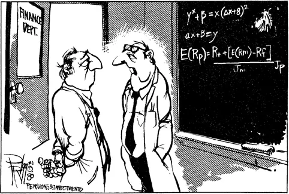

## 增加风险以获取回报

只对一半时间正确的理论\

不如抛硬币经济实惠。\
George J. Stigler，《价格理论》


正如每位读者现在应该知道的，风险有其回报。因此，无论在学术界还是在华尔街，长期以来一直存在利用风险来获取更高回报的竞争。这就是本章要讲的内容：创建衡量风险的分析工具，并利用这些知识获取更大回报。

我们从对现代投资组合理论的细化开始。正如我在上一章提到的，分散化无法消除所有风险——就像在我虚构的岛屿经济中那样——因为所有股票往往同步涨跌。因此，实践中的分散化降低了一些但并非全部风险。三位学者——前斯坦福大学教授William Sharpe和已故金融专家John Lintner与Fischer Black——将他们的智力精力集中在确定证券风险的哪一部分可以通过分散化消除、哪一部分不能上。其结果被称为资本资产定价模型（Capital Asset Pricing Model，CAPM）。Sharpe因其对该工作的贡献与Markowitz同时于1990年获得诺贝尔奖。

资本资产定价模型背后的基本逻辑是，承担可以分散化的风险不会获得溢价。因此，要获得更高的长期平均回报率，你需要提高投资组合中无法分散化的风险水平。根据这一理论，精明的投资者可以通过调整投资组合中一个称为贝塔（Beta）的风险衡量指标来跑赢整个市场。

### 贝塔与系统性风险

贝塔？一个希腊字母怎么进入了这个讨论？它肯定不是来自股票经纪人。你能想象任何股票经纪人说："我们可以合理地将任何证券（或投资组合）的总风险描述为证券回报的总变异性（方差或标准差）"吗？但我们这些教书的人经常说这种话。我们接着说，总风险或变异性的某一部分可以称为证券的*系统性风险*（Systematic Risk），它源于股价整体的基本波动性以及所有股票至少在某种程度上随大盘走势的倾向。股票回报中剩余的变异性称为*非系统性风险*（Unsystematic Risk），源于特定公司特有的因素——例如罢工、新产品的发现等等。

系统性风险，也称为市场风险（Market Risk），捕捉了个股（或投资组合）对整体市场波动的反应。某些股票和投资组合对市场运动非常敏感。另一些则更为稳定。这种相对波动性或对市场运动的敏感度可以根据过去的记录来估计，它被通俗地称为——你猜对了——希腊字母贝塔。

你现在将了解到关于贝塔你想知道但不敢问的一切。基本上，贝塔是系统性风险的数字描述。尽管涉及数学运算，贝塔衡量背后的基本思想是用精确的数字来量化基金经理多年来一直有的主观感受。贝塔计算本质上是对个股（或投资组合）运动与整体市场运动之间的比较。

计算从给一个广泛的市场指数赋予贝塔值1开始。如果一只股票的贝塔为2，则平均而言它的波动幅度是市场的两倍。如果市场上涨10%，该股票往往上涨20%。如果一只股票的贝塔为0.5，当市场上涨或下跌10%时，它往往上涨或下跌5%。专业人士称高贝塔股票为激进型投资（Aggressive Investments），低贝塔股票为防御型投资（Defensive Investments）。

现在，需要认识到的重要一点是，系统性风险无法通过分散化消除。正是因为所有股票或多或少同步波动（其变异性的大部分是系统性的），即使分散化的股票组合也是有风险的。事实上，如果你通过购买总股票市场指数（Total Stock Market Index）的一份来完美分散——其贝塔按定义为1——你仍然会有相当波动（有风险）的回报，因为整个市场波动幅度很大。

非系统性风险是源于个别公司特有因素的股价（因此也是股票回报）变异性。获得大额新合同、发现矿产资源、劳资困难、会计欺诈、发现公司财务人员挪用公款——所有这些都可能使股价独立于市场波动。与这种变异性相关的风险恰恰是分散化可以降低的那种。投资组合理论的核心在于，由于股票并非总是同步波动，任何一只证券回报的波动往往会被其他证券回报的互补波动所抵消。

第212页的图表，类似于第201页的图表，说明了分散化与总风险之间的重要关系。假设我们随机选择证券构建投资组合，这些证券平均而言与市场波动性相同（投资组合中证券的平均贝塔将等于1）。图表显示，随着我们添加更多证券，投资组合的总风险下降，特别是在开始阶段。

当为投资组合选择30只证券时，大量非系统性风险被消除，额外的分散化带来的进一步风险降低很小。到投资组合中有60只充分分散的证券时，非系统性风险已基本消除，我们的投资组合（贝塔为1）将倾向于基本上与市场同步波动。当然，我们也可以用平均贝塔为1½的股票进行同样的实验。我们再次发现分散化迅速降低了非系统性风险，但剩余的系统性风险会更大。一个包含60只或更多股票、平均贝塔为1½的投资组合将倾向于比市场波动性高50%。

现在关键的一步来了。金融理论家和从业者都同意，投资者应该因承担更多风险而获得更高的预期回报作为补偿。因此，股票价格必须调整以在感知到更大风险的地方提供更高回报，以确保所有证券都被人持有。显然，厌恶风险的投资者不会在没有额外回报预期的情况下购买有额外风险的证券。但并非个股的所有风险都与承担风险的溢价有关。总风险中的非系统性部分很容易通过充分分散化消除。因此，没有理由认为投资者会因承担非系统性风险而获得额外补偿。投资者将因承担风险而获得报酬的唯一部分是系统性风险——分散化无法帮助的那种风险。因此，资本资产定价模型认为，任何股票（或投资组合）的回报（因此也是风险溢价）将与贝塔相关，即无法分散化的系统性风险。

资本资产定价模型（CAPM）

风险与回报相关的命题并不新鲜。金融专家多年来一直同意，投资者确实需要因承担更多风险而获得补偿。新投资技术的不同之处在于对风险的定义和衡量。在资本资产定价模型出现之前，人们认为每只证券的回报与其固有的总风险相关。人们认为证券的回报随其产生回报的变异性或标准差而变化。新理论认为，每只个股的总风险是无关紧要的。只有系统性成分才对额外回报有意义。

**虽然这一命题的数学证明令人望而生畏，但其背后的逻辑相当简单。考虑两组证券——第一组和第二组——每组有60只证券。假设每只证券的系统性风险（贝塔）为1；即两组中的每只证券都倾向于与大盘同步涨跌。现在假设，由于第一组个股特有的因素，它们的总风险都远高于第二组每只证券的总风险。想象一下，例如，除了大盘因素外，第一组的证券还特别容易受到气候变化、汇率变动和自然灾害的影响。因此，第一组每只证券的特定风险将非常高。而第二组每只证券的特定风险假设非常低，因此每只的总风险也会非常低。示意图如下：**

| 列1 | 列2 |
|------|------|

  *第一组（60只证券）*                            *第二组（60只证券）*
  每只证券的系统性风险（贝塔）= 1                 每只证券的系统性风险（贝塔）= 1
  每只证券的特定风险高                             每只证券的特定风险低
**每只证券的总风险高                               每只证券的总风险低**

| 列1 | 列2 |
|------|------|

现在，根据在资本资产定价模型出现之前普遍接受的旧理论，由第一组证券构成的投资组合应该有更高的回报，因为第一组的每只证券的总风险高于第二组的每只证券，而我们知道风险有其回报。学者们用他们的智力魔杖改变了这种思维方式。根据资本资产定价模型，两个投资组合的回报应该相等。为什么？

首先，记住第212页的前面那张图表。（健忘的人可以再看一遍。）在那里我们看到，当投资组合中的证券数量接近60时，投资组合的总风险降低到其系统性水平。认真的读者现在会注意到，在示意图中，每个投资组合中的证券数量是60。所有非系统性风险基本被消除了：一场意外的天气灾害被有利的汇率所平衡，等等。剩下的只是投资组合中每只股票的系统性风险，由其贝塔给出。但在这两组中，每只股票的贝塔都是1。因此，第一组证券的投资组合和第二组证券的投资组合在风险（标准差）方面的表现将完全相同，即使第一组的股票显示出比第二组的股票更高的总风险。

旧观点和新观点现在正面交锋。在旧的估值体系下，第一组证券因其更大风险而被认为提供更高回报。资本资产定价模型认为，如果第一组证券在分散化的投资组合中，持有它们并没有更大的风险。事实上，如果第一组证券确实提供更高回报，那么所有理性投资者都会偏好它们而非第二组证券，并试图重新安排持仓以获取第一组的更高回报。但正是通过这个过程，他们会竞相抬高第一组证券的价格，压低第二组证券的价格，直到达到均衡（投资者不再想从一种证券切换到另一种）时，每个组的投资组合的回报相同，与其风险的系统性成分（贝塔）相关，而不是与其总风险（包括非系统性或特定部分）相关。由于股票可以组合在投资组合中以消除特定风险，只有不可分散的或系统性风险才会要求风险溢价。投资者不会因承担可以分散化的风险而获得报酬。这就是资本资产定价模型背后的基本逻辑。

简言之，资本资产定价模型（从此以后称为CAPM，因为我们经济学家喜欢用字母缩写）的证明可以表述如下：如果投资者确实因承担非系统性风险而获得额外回报（风险溢价），那么由具有大量非系统性风险的股票构成的分散化投资组合，将比同等风险的低非系统性风险股票投资组合给出更高的回报。投资者会抢购这些更高的回报，竞相抬高具有大量非系统性风险的股票价格，并卖出具有相同贝塔但较低非系统性风险的股票。这个过程将持续到具有相同贝塔的股票的预期回报被均等化，且承担非系统性风险无法获得任何风险溢价。任何其他结果都将与有效市场的存在不一致。

理论的关键关系如下图所示。随着个股（或投资组合）的系统性风险（贝塔）增加，投资者可以预期的回报也随之增加。如果投资者的投资组合贝塔为零——比如她的所有资金都投资于政府担保的银行储蓄存单（存单的回报不会随股市波动，因此贝塔为零）——投资者将获得某种适度的回报率，通常称为无风险利率（Risk-Free Rate of Interest）。然而，随着个人承担更多风险，回报应该增加。如果投资者持有的投资组合贝塔为1（例如持有一份广泛股票市场指数基金），她的回报将等于普通股的一般回报。这个回报在长期内超过了无风险利率，但投资是有风险的。在某些时期，回报远低于无风险利率，并涉及承受重大损失。这正是风险的含义。

该图显示，仅通过调整投资组合的贝塔就可以实现多种不同的预期回报。例如，假设投资者将一半资金投入储蓄存单，一半投入代表广泛股票市场的指数基金。在这种情况下，她将获得介于无风险回报和市场回报之间的回报，她的投资组合平均贝塔为0.5。[[\*](#footnote-233-7)]CAPM然后断言，要获得更高的长期平均回报率，你只需增加投资组合的贝塔。投资者可以通过购买高贝塔股票或以保证金购买平均波动性的投资组合（见第217页图表和第218页表格）来获得贝塔大于1的投资组合。

\*记得高中代数的人会回忆起任何直线都可以写成方程。图中直线的方程为：

回报率 = 无风险利率 + 贝塔 × (市场回报 - 无风险利率)。

或者，该方程可以写成风险溢价的表达式，即股票投资组合或任何个股的回报率超过无风险利率的部分：

回报率 - 无风险利率 = 贝塔 × (市场回报 - 无风险利率)。

该方程表示你在任何股票或投资组合上获得的风险溢价与你承担的贝塔值成正比。一些读者可能想知道贝塔与在我们讨论投资组合理论时至关重要的协方差概念之间有什么关系。任何证券的贝塔本质上与基于过去经验衡量的该证券与市场指数之间的协方差是同一回事。

**投资组合构建示例[\*](#fn-1)**

| 列1 | 列2 |
|------|------|

  *期望贝塔*              *投资组合构成*           *投资组合预期回报*

  0                       1美元投资于无风险资产    10%

  ½                       0.50美元投资于无风险    ½ (0.10) + ½ (0.15) =
                          资产，                  0.125，
                          0.50美元投资于          即12½%[†](#fn-2)
                          市场组合

  1                       1美元投资于市场组合     15%

  1½                      1.50美元投资于          1½ (0.15) -- ½ (0.10) =
                          市场组合，              0.175，即17½%
                          以假定10%的利率借入
**0.50美元**

| 列1 | 列2 |
|------|------|

[\*](#fn_1) 假设预期市场回报为15%，无风险利率为10%。

[†](#fn_2) 我们也可以直接使用前图中的公式计算预期回报：

回报率 = 0.10 + ½ (0.15 -- 0.10) = 0.125，即12½%。

就像股票有其时尚潮流一样，贝塔在1970年代初也非常流行。《机构投资者》（Institutional Investor）——这本著名杂志的大部分篇幅用来记录专业货币管理者的成就——通过将贝塔字母放在一座神庙顶上的封面故事为这一运动盖上了印章，其头条文章是"贝塔狂热！衡量风险的新方法。"该杂志指出，那些数学水平不超过长除法的金融人士现在正"以统计理论博士般的放肆随意使用贝塔"。甚至SEC在其《机构投资者研究报告》（Institutional Investors Study Report）中也认可了贝塔作为风险衡量指标。

在华尔街，早期的贝塔爱好者夸口说他们只需购买一些高贝塔股票就能获得更高的长期回报率。那些认为自己能够择时的人认为他们有更好的主意。他们会在认为市场将上涨时买入高贝塔股票，在担心市场可能下跌时切换到低贝塔股票。为了适应这种新投资理念的热情，贝塔衡量服务在经纪公司中激增，一家投资公司提供自己的贝塔估计值是其进步性的象征。今天，你可以从Merrill Lynch等经纪公司和Value Line、Morningstar等投资咨询服务获得贝塔估计值。华尔街的贝塔鼓吹者过度推销他们的产品，其放肆程度甚至会令那些热衷于传播贝塔福音的最热情的学术文人感到震惊。

### 让我们看看记录

在莎士比亚的《亨利四世·第一部分》中，Glendower向Hotspur夸口说："我能从无底深渊中召唤精灵。""哦，我也能，或者任何人都能，"Hotspur不以为然地说。"但当你召唤它们时，它们会来吗？"任何人都可以理论化证券市场如何运作。CAPM只是又一个理论。真正重要的问题是：它有效吗？

当然，许多机构投资者已经接受了贝塔概念。贝塔毕竟是一种学术产物。还有什么比这更稳重的？它被简单地创建为一个描述股票风险的数字，本质上几乎毫无生气。隐蔽的技术分析者喜爱它。即使你不相信贝塔，你也必须说它的语言，因为在我们国家的校园里，我的同事们一直在培养一长串能说其术语的博士和MBA。他们现在使用贝塔作为评估投资组合经理表现的方法。如果实际回报大于投资组合贝塔预测的回报，该经理就被认为产生了正阿尔法（Alpha）。市场上大量资金寻找能够提供最大阿尔法的经理。

但贝塔是衡量风险的有用指标吗？高贝塔投资组合真的会像资本资产定价模型所暗示的那样提供比低贝塔更高的长期回报吗？贝塔单独就能概括证券的全部系统性风险吗，还是我们也需要考虑其他因素？简言之，贝塔真的值得一个阿尔法吗？这些是从业者和学者当前激烈辩论的话题。

在1992年发表的一项研究中，Eugene Fama和Kenneth French根据1963-90年期间的贝塔衡量将所有交易股票分成十分位（Deciles）。十分位1包含所有股票中贝塔最低的10%；十分位10包含贝塔最高的10%。如下图所示的显著结果是，这些十分位投资组合的回报与其贝塔衡量之间基本没有关系。我在共同基金中发现了类似的回报与贝塔关系。股票或投资组合的回报与其贝塔风险衡量之间没有关系。

由于他们的全面研究涵盖了近三十年的时期，Fama和French得出结论，贝塔与回报之间的关系基本上是平坦的。贝塔——资本资产定价模型的关键分析工具——不是一个捕捉风险与回报关系的有用单一衡量指标。因此，到1990年代中期，不仅从业者，甚至许多学者也准备将贝塔扔进废品堆。早先记录贝塔崛起的金融媒体，现在刊登标题如"贝塔之死"、"再见，贝塔"和"贝塔被击败"的专题文章。那个时代的一个典型代表是《机构投资者》引用的一封信，署名为"深度量化者"（Deep Quant）。[[†](#footnote-233-8)]这封信开头写道："金融管理界正在爆出一个大新闻。资本资产定价模型已死。"该杂志接着引用了一位"叛变量化者"的话："高等数学对投资者来说将如同泰坦尼克号之于帆船。"于是，构成新投资技术的整套工具——甚至包括现代投资组合理论——都笼罩在一片怀疑的阴影之下。

对证据的评估

我自己的猜测是，"叛变量化者"是错的。CAPM中严重缺陷的发现不会导致金融分析放弃数学工具并回归传统证券分析。金融界目前还没有准备为贝塔撰写讣告。我认为有很多理由避免草率下结论。

首先，重要的是要记住，稳定的回报是更可取的，即比非常波动的回报风险更小。显然，如果钻探石油只能获得与无风险政府证券相同的回报，那么只有那些纯粹为了赌博而赌博的人才会去钻探石油。如果投资者真的完全不担心波动性，数万亿美元的衍生证券市场就不会像现在这样繁荣。因此，贝塔作为相对波动性的衡量指标确实捕捉到了我们认为风险的某些方面。而且过去的组合贝塔在预测未来相对波动性方面做得相当好。

© Milt Priggee / Pensions & Investments. www.miltpriggee.com. 经许可转载。

其次，正如加州大学洛杉矶分校的Richard Roll教授所论证的，我们必须记住，精确衡量贝塔是非常困难的（实际上可能不可能）。标普500指数不是"市场"。总股票市场（Total Stock Market）在美国还包含数千只额外的股票，在国外还有数千只。此外，总市场包括债券、房地产、商品和各种资产，包括我们每个人都拥有的最重要的资产之一——通过教育、工作和生活经验积累的人力资本（Human Capital）。根据你如何衡量"市场"，你可以得到非常不同的贝塔值。你对资本资产定价模型和贝塔作为风险衡量指标的结论在很大程度上取决于你如何衡量贝塔。明尼苏达大学的两位经济学家Ravi Jagannathan和Zhenyu Wang发现，当市场指数（我们据此衡量贝塔）被重新定义以包含人力资本，并且当贝塔被允许随经济的周期性波动而变化时，对CAPM和贝塔作为回报预测指标的支持是相当强的。

最后，投资者应该意识到，即使贝塔与回报之间的长期关系是平坦的，贝塔仍然可以是一个有用的投资管理工具。如果低贝塔股票确实能可靠地获得至少与高贝塔股票一样大的回报率（一个非常大的"如果"），那么贝塔作为投资工具甚至比资本资产定价模型成立时更有价值。投资者应该大量买入低贝塔股票，获得与整个市场一样有吸引力的回报，但风险要小得多。而那些确实希望通过承担更大风险来寻求更高回报的投资者，应该以保证金买入并持有低贝塔股票，从而增加他们的风险和回报。我们将在[第11章](ch11.md)看到，一些"聪明贝塔"策略正是为了执行这种精确策略而设计的。然而，清楚的是，按照通常衡量方式的贝塔不能替代头脑，也不能被依赖为长期未来回报的简单预测指标。

量化者寻找更好的风险衡量指标：\
套利定价理论

如果贝塔作为有效的定量风险衡量指标受到了损害，有什么可以取代它？风险衡量领域的先驱之一是Stephen Ross。Ross开发了一种资本市场定价理论，称为套利定价理论（Arbitrage Pricing Theory，APT）。要理解APT的逻辑，必须记住CAPM背后的正确洞见：投资者应该因承担风险而获得补偿的唯一风险是无法分散化的风险。只有系统性风险才会要求风险溢价。但特定股票和投资组合中的系统性风险元素可能太复杂，无法被贝塔——股票或多或少超过市场的运动倾向——所捕捉。这是因为任何特定股票指数都是对整体市场的不完美代表。因此，贝塔可能无法捕捉到许多重要的系统性风险元素。

让我们看看其中几个系统性风险元素。国民收入的变化无疑会以系统性的方式影响个股的回报。这在我们[第8章](ch08.md)关于简单岛屿经济的说明中已经表明。此外，国民收入的变化反映了个人收入的变化，证券回报与工资收入之间的系统性关系可以预期对个人行为有重大影响。例如，福特工厂的工人会发现持有福特普通股特别有风险，因为工作裁员和福特股票的糟糕回报可能同时发生。国民收入的变化也可能反映其他财产收入形式的变化，因此也可能对机构投资组合经理相关。

利率的变化也会系统性地影响个股回报，是重要的不可分散风险因素。在股票倾向于在利率上升时受损的范围内，股票是有风险的投资，那些特别容易受到总体利率水平上升影响的股票尤其有风险。因此，某些股票和固定收益投资倾向于同步波动，这些股票对于降低债券投资组合的风险没有帮助。由于固定收益证券是许多机构投资者投资组合的主要部分，这一系统性风险因素对市场中一些最大的投资者尤为重要。

通胀率的变化同样倾向于对普通股回报产生系统性影响。这至少有两个原因。首先，通胀率上升倾向于推高利率，从而倾向于压低某些股票的价格，正如刚才讨论的。其次，通胀上升可能挤压某些行业公司的利润空间——例如公用事业公司，它们常常发现费率上调滞后于成本上升。另一方面，通胀可能有利于自然资源行业普通股的价格。因此，股票回报与经济变量之间再次存在重要的系统性关系，这些可能无法被简单的贝塔风险衡量指标充分捕捉。

对几个系统性风险变量对证券回报影响的统计检验显示出一些有希望的结果。除了传统的贝塔风险衡量指标外，使用若干系统性风险变量——如对国民收入、利率和通胀率变化的敏感度——可以获得比CAPM更好的对不同证券间回报差异的解释。当然，APT风险衡量指标也面临着CAPM贝塔衡量指标所面临的一些相同问题。

### 法玛-弗伦奇三因子模型

Eugene Fama和Kenneth French提出了一个因子模型（Factor Model），类似于套利定价理论，用来解释风险。除了贝塔外，还使用两个因子来描述风险。这些因子源自他们的实证工作，表明回报与公司的规模（以市值衡量）及其市场价格与账面价值的关系相关。法玛-弗伦奇认为小公司相对风险更大。一个解释可能是它们在衰退期间更难维持自身，因此相对于GDP波动可能有更大的系统性风险。法玛-弗伦奇还认为，市场价格相对于账面价值较低的股票可能处于某种程度的"财务困境"（Financial Distress）中。这些观点存在激烈争议，并非所有人都同意法玛-弗伦奇因子衡量的是风险。但考虑到2009年初，当时主要银行的股票以相对于其账面价值非常低的价格出售，很难说投资者不认为它们有破产危险。即使是那些认为低市净率股票提供更高回报是因为投资者非理性的人，也发现法玛-弗伦奇风险因子是有用的。

**法玛-弗伦奇风险因子**

| 列1 | 列2 |
|------|------|

  • 贝塔：   来自资本资产定价模型
  • 规模：   以总权益市值衡量
**• 价值：   以市净率衡量**

| 列1 | 列2 |
|------|------|

一些分析师会在法玛-弗伦奇三因子风险模型中添加更多变量。可以添加动量因子（Momentum Factor）来捕捉上涨或下跌股票继续朝同一方向运动的倾向。此外，可以添加流动性因子（Liquidity Factor）来反映投资者需要获得回报溢价才愿意持有非流动性证券的事实。另一个被建议的因子是公司的"质量"（Quality），以其盈利和销售增长的稳定性以及低负债水平等指标来衡量。因子模型现在被广泛用于衡量投资表现和设计"聪明贝塔"投资组合，这将在[第11章](ch11.md)讨论。

### 总结

[第8章](ch08.md)和[第9章](ch09.md)是关于资本市场现代理论的学术练习。股市似乎是一个高效的机制，能相当迅速地消化新信息。无论是分析股票过去价格运动的技术分析，还是分析个别公司和经济前景的更基本信息的基本面分析，似乎都不能带来持续的好处。似乎获得更高长期投资回报的唯一方法是接受更大的风险。

不幸的是，完美的风险衡量指标并不存在。贝塔——来自资本资产定价模型的风险衡量指标——表面上看起来不错。它是一个简单、易于理解的市场敏感度衡量指标。但贝塔也有其缺点。在二十世纪的很长时期内，贝塔与回报率之间的实际关系与理论预测的关系不一致。此外，个股的贝塔随时间不稳定，而且对它们所衡量的市场代理指标非常敏感。

我在这里论证的是，没有单一指标能够充分捕捉个股和投资组合上系统性风险影响的多样性。回报可能对整体市场波动、利率和通胀率变化、国民收入变化敏感，当然还对其他经济因素如汇率敏感。此外，有证据表明市净率较低和规模较小的股票回报更高。那个神秘的完美风险衡量指标仍然超出我们的掌握。

令那些必须发表否则就灭亡的助理教授们大为宽慰的是，学术界在风险衡量方面仍有很多争论，还需要做更多的实证检验。毫无疑问，风险分析技术还将有许多改进，风险衡量的定量分析远未消亡。我自己的猜测是，未来的风险衡量指标将更加复杂——而不是更少。尽管如此，我们必须小心不要接受贝塔或任何其他指标作为评估风险和以任何确定性预测未来回报的简便方法。你应该了解新投资技术中最优秀的现代技术——它们可以是有用的辅助工具。但永远不会有一个英俊的精灵出现来解决我们所有的投资问题。即使他出现了，我们可能也会把它搞砸——正如Capital Guardian Trust的Robert Kirby最喜欢的故事中的那位老太太：

她坐在退休之家门廊的摇椅上，这时一个小精灵出现了，说："我决定满足你三个愿望。"

老太太回答说："走开，你这个小不点，我这辈子见过够多的聪明人了。"

精灵回答说："听着，我不是在开玩笑。这是真的。试试看。"

她耸耸肩说："好吧，把我的摇椅变成纯金的。"

在一阵烟雾中，他做到了，她的兴趣明显提高了。她说："把我变成一个美丽的年轻少女。"

又是一阵烟雾，他做到了。最后，她说："好吧，第三个愿望是把我的猫变成一个英俊的年轻王子。"

转眼间，年轻的王子站在那里，然后转向她问道："现在你不后悔给我做手术了吧？"

[\*](#footnote-233-7-backlink)一般来说，投资组合的贝塔就是其组成部分贝塔的加权平均值。

[†](#footnote-233-8-backlink)"量化者"（Quant）是华尔街对定量倾向的金融分析师的昵称，他们主要关注新投资技术。

行为\
