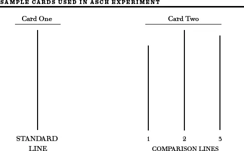
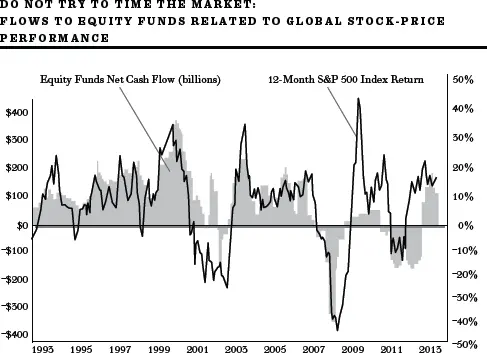

## 行为金融学


行为金融学并非标准金融学的一个分支，它是用一种对人性的更好理解来取代前者。\
Meir Statman


到目前为止，我所描述的股票市场理论和技术都基于一个前提，即投资者是完全理性的。他们以最大化自身财富为目标做出决策，唯一受到的约束是其承受风险的容忍度。然而，一派在二十一世纪初声名鹊起的新经济学派宣称，事实并非如此。行为主义者（Behavioralists）认为，许多（甚至可能是大多数）股市投资者远非完全理性。毕竟，想想你的朋友和熟人、你的同事和上司、你的父母，以及（恕我直言）你的配偶（孩子当然另当别论）。这些人中有谁是完全理性的吗？如果你的答案是"没有"，或者哪怕只是"有时没有"，你将会在这趟探索行为金融学那条远非理性的幽径之旅中找到乐趣。

有效市场理论（Efficient-market Theory）、现代投资组合理论（Modern Portfolio Theory）以及各种风险与收益之间的资产定价关系，都建立在股市投资者是理性的这一前提之上。整体而言，他们对股票的合理价值做出理性的估计，他们的买卖行为确保了股票价格能够公正地反映其未来前景。

现在，"整体"这个短语作为经济学家的退路应该已经显而易见了。这意味着他们可以承认某些个体市场参与者可能并非理性。但他们很快就巧妙地辩解说，非理性投资者的交易是随机的，因此会相互抵消，不会影响价格。即使投资者以类似的方式表现出非理性，有效市场理论的信奉者也坚称，理性的聪明交易者会纠正因非理性交易者存在而产生的任何错误定价。

心理学家们完全不买这些经济学胡话的账。其中两位——Daniel Kahneman 和 Amos Tversky——猛烈抨击了经济学家关于投资者行为的观点，并在此过程中被誉为开创了一门全新的经济学科——行为金融学（Behavioral Finance）。

两人的论点其实非常简单：人们并不像经济模型假设的那样理性。尽管这一观点对普通大众和非经济学家来说显而易见，但它在学术界被广泛接受却花了二十多年的时间。Tversky 于1996年去世，就在行为金融学日益获得认可之际。六年后，Kahneman 凭借这些工作获得了诺贝尔经济学奖。这一奖项尤其引人注目之处在于它并非颁给一位经济学家。听到这个消息后，Kahneman 评论道："这个奖项……非常明确地是颁给我们的合作研究，但遗憾的是，诺贝尔奖不设死后追授。"

虽然 Kahneman 和 Tversky 提出的见解影响了所有涉及决策过程的社会科学，但它们对全国各地的经济学院和商学院产生了尤为深远的影响。想象一下——一整个全新的领域，可以在其中发表论文、收取高额费用发表演讲、撰写研究生论文。

虽然这对教授和学生来说可能是件大好事，但那些想投资股票的普通大众呢？行为金融学如何帮助他们？更确切地说，这对你有什么好处？实际上，好处相当不少。

行为主义者认为市场价格极不精确。此外，人们会以系统性的方式偏离理性，投资者的非理性交易往往具有相关性。行为金融学进一步断言，这种非理性行为是可以量化或分类的。基本上，有四种因素会导致非理性的市场行为：过度自信（Overconfidence）、偏见判断（Biased Judgments）、羊群心理（Herd Mentality）和损失厌恶（Loss Aversion）。

当然，有效市场理论的信奉者会说：没错——但我们这些信奉者总有一个"但是"——这些因素造成的扭曲会被套利者（Arbitrageurs）的行为所抵消。"套利者"这个花哨的词汇指的是那些从市场价格偏离其合理价值中获利的人。

严格意义上讲，"套利"（Arbitrage）一词是指从同一商品在两个市场的不同价格中获利。假设在纽约你可以用1.50美元买卖英镑，而在伦敦你可以用2.00美元的汇率将美元换成英镑。那么套利者就可以在纽约用1.50美元买入一英镑，同时在伦敦以2.00美元的价格卖出，赚取50美分的利润。同样，如果同一只普通股在纽约和伦敦以不同价格交易，那么在低价市场买入、在高价市场卖出就是合理的。"套利"这个术语通常也被延伸用于两种非常相似的股票以不同估值进行交易的情况，或者如果两家公司之间的合并计划获批，一只股票预期会以更高价格兑换成另一只股票的情况。在最宽泛的意义上，"套利"被用来描述买入看起来"被低估"的股票、卖出已经"涨得过高"的股票。通过这样做，辛勤工作的套利者可以平抑股票价格的非理性波动，创造出一个定价有效的市场。

另一方面，行为主义者认为套利存在重大障碍。我们不能指望套利来使价格回归合理估值。市场价格可以预期会显著偏离在有效市场中应有的水平。

本章的其余部分将探讨行为金融学的核心论点，解释为什么市场并非有效，以及为什么不存在所谓的"随机漫步"。我还将解释理解这些研究如何帮助个人投资者避免一些投资者容易犯的系统性错误。

### 个人投资者的非理性行为

正如第一部分充分说明的那样，投资者总是有不理性的时候。然而，行为金融学认为这种行为是持续性的，而非偶发性的。

过度自信

认知心理学研究人员已经证实，人们在面对不确定性做出判断时，会以系统性的方式偏离理性。其中最普遍的偏差之一就是对自己的信念和能力过度自信，以及对未来的评估过于乐观。

有一类实验可以说明这种综合征：让一大群参与者评估自己作为汽车驾驶员的能力与小组平均水平或所有驾驶者的平均水平之间的差异。驾驶汽车显然是一项风险活动，其中技能起着重要作用。对这个问题的回答很容易揭示人们是否对自己的技能有与他人相比的现实认识。以大学生为例，80%到90%的受访者总是说自己比班上其他人驾驶技术更好、更安全。就像在沃比冈湖（Lake Wobegon）一样，（几乎）所有学生都认为自己高于平均水平。

在另一项涉及学生的实验中，受访者被要求预测自己和室友的未来。他们通常对自己的未来非常乐观，想象中会包含成功的事业、幸福的婚姻和健康的身体。然而，当被问及对室友未来的预测时，他们的回答就现实得多。他们认为室友更有可能成为酗酒者、患上疾病、离婚，并经历各种其他不利的结果。

这类实验已在多种不同情境中被重复多次。例如，在商业管理畅销书《追求卓越》（*In Search of Excellence*）中，Peters 和 Waterman 报告说，一个随机抽样的成年男性群体被要求评估自己与他人相处的能力。100%的受访者认为自己处于人群的前半部分。25%的人认为自己处于人群的前1%。即使在判断运动能力这样一个似乎更难自欺欺人的领域，至少60%的男性受访者也认为自己处于前四分之一。即使是最笨拙的人也对运动能力存在错觉。只有6%的男性受访者认为自己的运动能力低于平均水平。

Daniel Kahneman 认为，这种过度自信的倾向在投资者中尤为强烈。与其他大多数群体相比，投资者更倾向于夸大自己的技能、否认运气的作用。他们高估自己的知识，低估所涉及的风险，并夸大自己控制事件的能力。

Kahneman 的测试通过要求实验对象给出置信区间来检验投资者的概率判断校准程度。他会提出类似下面的问题：

*你对道琼斯指数一个月后的最佳估计值是多少？* 接下来选一个较高值，使你有99%的把握（但不是绝对确定）道琼斯指数一个月后会低于该值。现在选一个较低值，使你有99%的把握（但不超过此数）道琼斯指数一个月后会高于该值。

如果指示被正确执行，道琼斯指数高于（低于）你的高（低）估值的概率应该只有1%。换句话说，投资者应该有98%的把握认为道琼斯指数将在给定范围内。类似的实验也针对利率、通胀率、个股价格等的估计进行过。

事实上，很少有投资者能够设定准确的置信区间。正确的区间应该使实际结果只有2%的概率落在预测范围之外。但实际上，意外情况发生的概率接近20%。这就是心理学家所说的过度自信。如果一个投资者告诉你他有99%的把握，他最好假设自己其实只有80%的把握。这种精确性意味着人们倾向于在预测上下注过大。而且男性通常比女性表现出更多的过度自信，尤其是在金钱事务方面。

我们应该从这些研究中得出什么结论呢？显然，人们对预测设定了过于精确的置信区间。他们夸大了自己的技能，对未来往往持有过于乐观的看法。这些偏差在股市中以各种方式体现出来。

首先，许多个人投资者错误地坚信自己能够战胜市场。结果，他们的投机超过了应有的程度，交易过于频繁。两位行为经济学家 Terrance Odean 和 Brad Barber 在一段相当长的时间内考察了某大型折扣经纪商的个人账户。他们发现，个人投资者交易越频繁，表现越差。而男性投资者的交易频率远高于女性，结果也相应更差。

这种对金融技能的错觉很可能源于另一个心理学发现——后见之明偏差（Hindsight Bias）。这种错误因选择性记忆成功经历而得以维持。你会记住你成功的投资。而在事后看来，很容易说服自己"我早就知道 Google 在首次公开募股后会涨五倍"。人们倾向于将任何好的结果归功于自己的能力，而将坏的结果理性化为由异常的外部事件造成。历史事实对我们的触动远不如几个成功案例来得大。后见之明助长了过度自信，并强化了世界比实际更加可预测的错觉。那些兜售毫无价值的金融建议的人甚至可能相信自己的建议是好的。*Forbes* 杂志的长期出版人 Steve Forbes 喜欢引用他祖父传给他的一条建议："卖建议远比听建议赚钱。"

许多行为主义者认为，对公司未来增长能力的过度自信导致了所谓的成长股（Growth Stocks）普遍被高估。如果令人兴奋的新计算机技术、医疗设备或零售渠道引起了公众的关注，投资者通常会外推成功，对相关公司预测高增长率，并以远超合理程度的信心持有这些信念。高增长预期导致成长股获得更高的估值。但美好的预期往往不能实现。利润可能下降，股票的市盈率倍数也可能随之下降，从而导致糟糕的投资结果。对令人兴奋的公司增长前景的过度乐观，可能是"成长股"表现不及"价值股"（Value Stocks）的一种解释。

有偏见的判断

我每天都遇到深信自己能够"控制"投资结果的投资者。这种情况在技术分析师中尤其普遍，他们自信可以通过观察过去的价格来定义未来。

Larry Swedroe 在其著作《理性投资非理性时代》（*Rational Investing in Irrational Times*）中提供了一个精彩的例子，说明连胜（Hot Streaks）发生的频率远超人们的想象。

每年，一位统计学教授在开学时会让每位学生写下一百次虚拟抛硬币的连续结果。但有一位学生被选中实际抛掷一枚真硬币并记录结果。然后教授离开教室，十五分钟后回来，桌上放着三十份提交的结果。教授告诉全班，她只需猜一次就能从三十份中识别出那份真正抛硬币的结果。凭借惊人的执着，她令人惊叹地猜对了。她是如何完成这个看似神奇的举动的？她知道连续出现最长的正面（H）或反面（T）序列的结果很可能就是真实抛掷的结果。原因是，当被问到以下哪个序列更可能出现时——HHHHHTTTTT 或 HTHTHTHTHT——尽管统计学表明两个序列出现的概率相等，大多数人会选后者那个"更随机"的结果。因此，人们倾向于写出看起来更像 HHTTHTHTTT 而不是 HHHTTTHHHH 的虚构序列。

除了股市长期的正向趋势外，超高的股票收益率连续期并不会持续——它们之后通常伴随着较低的回报。存在均值回归（Reversion to the Mean）的现象。同样，金融引力定律也反向运作。至少就整个股市而言，下跌的东西最终会回升。然而，每个时代的传统智慧通常认为异常好的市场会变得更好，异常差的市场会变得更糟。

心理学家早已发现一种倾向，即人们会被"自己对实际上无法控制的情况有所控制"的错觉所愚弄。在一项研究中，受试者坐在一个电脑屏幕前，屏幕被一条水平线分为两半，一个球在两半之间随机波动。人们获得一个可以按动的装置来使球向上移动，但他们被警告随机的扰动也会影响球，因此他们并没有完全的控制权。然后受试者被要求玩一个游戏，目标是让球尽可能长时间地保持在屏幕上半部分。在一组实验中，装置甚至没有连接，因此玩家对球的运动完全没有控制权。然而，当受试者在玩了一段时间后接受询问时，他们确信自己对球的运动有相当大的控制权。（唯一没有这种错觉的受试者是那些被临床诊断为严重抑郁症的患者。）

在另一项实验中，进行了一次办公室彩票活动，使用两套相同的棒球卡。一套放在一个容器中，将随机抽出一张。另一套分发给参与者。一半参与者可以选择要哪张卡，而另一半则直接得到一张卡。参与者被告知，赢家将是持有与从容器中随机抽出的卡片相匹配的那张卡的人。然后他们被告知，虽然所有卡片都已分发，但一位新参与者想购买一张卡。参与者面临一个选择——以协商价格卖出他们的卡片，或者持有卡片并希望中奖。显然，每张卡片中奖的概率是相同的。然而，参与者愿意出售卡片的价格对于那些自己选卡的人来说，系统性地高于那些直接被分配卡片的人。正是这类见解促成了让州彩票购买者自己选号码的决定，尽管中奖完全由运气决定。

正是这种控制错觉导致投资者看到并不存在的趋势，或者相信自己能够识别出可以预测未来价格的股价模式。事实上，尽管人们付出了巨大努力试图从股价数据中提取某种形式的可预测性，但股价从一期到下一期的发展非常接近随机漫步（Random Walk），即未来的价格变化与过去的变化基本上没有关系。

判断偏差还因人们错误地将"相似性"或"代表性"作为合理概率思维的替代品的倾向而变得更加复杂（准备好接受一些额外的术语）。Kahneman 和 Tversky 的一个著名实验最好地说明了这种"启发式"（Heuristic）。实验对象被展示一段关于 Linda 的描述：

Linda 31岁，单身，直言不讳且非常聪明。她主修哲学。作为学生，她深切关注歧视和社会公正问题，也参加了反核示威活动。

然后实验对象被要求对关于 Linda 的八个不同陈述进行相对可能性排序。其中两个陈述是"Linda 是一名银行出纳员"和"Linda 是一名银行出纳员且活跃于女权主义运动"。超过85%的受试者认为 Linda 既是银行出纳员又是女权主义者的概率高于她只是银行出纳员的概率。但这个答案违反了概率论的一个基本公理（合取规则）：某人同时属于A类和B类的概率小于或等于她仅属于A类的概率。显然，很少有受访者学过多少概率论知识。

对 Linda 的描述使她看起来像一个女权主义者，所以"银行出纳员兼女权主义者"似乎比单纯"银行出纳员"更符合她的描述，因此更具"代表性"。这个实验已在天真的和复杂的受试者（包括有概率背景但未学习其所有细微之处的人）身上被重复了很多次。

Kahneman 和 Tversky 提出了"代表性启发式"（Representative Heuristic）一词来描述这一发现。它的应用导致了判断中的许多其他偏差——例如，对基准概率（Base-rate Probabilities）的利用不足。概率论的一条基本规则（贝叶斯法则，Bayes' Law）告诉我们，评估某人属于某个特定群体的可能性应该将"代表性"与基准率（落入各群体的人口百分比）结合起来。用日常英语来说，这意味着如果我们看到一个看起来像罪犯的人（似乎符合我们对犯罪类型的印象），我们评估他是罪犯的概率还需要关于基准率的知识——即犯罪者在人群中的比例。但一次又一次的实验表明，受试者在做预测时对基准率知识的利用不足。尽管这一切可能显得晦涩难懂，但代表性启发式很可能解释了许多投资错误，比如追逐热门基金或从近期证据中进行过度外推。

羊群效应

一般来说，研究表明群体往往比个体做出更好的决策。如果分享更多信息，并且考虑不同的观点，群体的知情讨论会改善决策过程。

群体行为的智慧在整体经济中或许最能通过自由市场价格体系来体现。消费者和生产者各种各样的个体决策引导经济生产出人们想要购买的商品和服务。在供需力量的作用下，价格体系引导经济通过 Adam Smith 的"看不见的手"生产出正确数量的产品。正如共产主义经济体所沮丧地发现的，一个全能的中央计划者在决定生产什么商品和如何分配资源方面，完全无法实现任何接近市场效率的效果。

同样，数以百万计的个人投资者和机构投资者通过其集体的买卖决策，创造出一幅看起来一只股票与另一只股票同样值得买入的股市全景图。虽然对未来收益的市场预测经常出错，但作为一个整体，它们似乎比任何个别投资者的预测更为正确。大多数主动型投资组合经理在将其收益率与低成本、宽基股票指数基金的投资结果进行比较时，必定感到羞愧。

正如本书的所有读者所认识到的，市场整体并非总是做出正确的定价决策。有时，群体行为会出现疯狂，从十七世纪的郁金香球茎到二十一世纪的互联网股票，我们已经看到了这一点。正是这种偶尔出现的病态群体行为引起了行为金融学的关注。

群体行为研究中一个被广泛认可的现象是"群体思维"（Group Think）的存在。个体群体有时会相互强化，使他们相信某种错误的观点实际上才是正确的。当然，2000年初关于互联网盈利潜力的极度乐观的群体预测以及新经济股票的错误定价，就是羊群行为病理学的典型例子。

社会心理学家 Solomon Asch 是最早研究群体行为如何导致错误决策的人之一。在1950年代，Asch 进行了一项著名的实验室实验，其中一组参与者被要求回答一个任何孩子都能正确回答的简单问题。受试者被展示两张带有垂直线的卡片，如下图所示。左边的卡片显示一条垂直线。受试者被问到右边卡片上的哪条线与第一张卡片上的线长度相同。七名受试者参与了这一系列问题。

但 Asch 给实验添加了一个巧妙的转折。在某些实验中，他招募了七名参与者中的六名，在第七名参与者有机会发表意见之前故意给出错误答案。结果令人震惊。第七名参与者经常给出错误的答案。Asch 推测，社会压力导致参与者选择了错误的线，即使他们知道自己的答案是不正确的。

来源：Solomon E. Asch, *Social Psychology* (Oxford, 1987)。经 Oxford University Press 许可，http://www.oup.com。

2005年，神经科学家 Gregory Berns 使用 MRI 扫描仪来检查大脑的运作，以确定人们是在明知答案错误的情况下屈服于群体，还是他们的感知确实发生了改变。如果屈服于群体是社会压力的结果，研究推测，应该看到前脑参与监控冲突的区域发生变化。但如果从众源于感知的实际变化，则预期视觉和空间感知所在的后脑区域会发生变化。事实上，研究发现，当人们随大流给出错误答案时，大脑负责空间意识的区域活动增加。换句话说，似乎是别人所说的话实际上改变了受试者认为自己所看到的东西。似乎他人的错误确实会影响一个人对外部世界的感知。

在另一项研究中，社会心理学家让一个人站在街角，要求他抬头看空旷的天空六十秒。心理学家随后观察到，街上只有极少数行人停下来查看这个人在看什么，大多数人直接走过去了。然后心理学家让五个人站在街角看天空；这一次，停下来观看空旷天空的人数增加了四倍。当心理学家让十五个人站在街角看天空时，几乎一半的路人停下来了。增加抬头望天的人数进一步增加了驻足观看的行人数量。

显然，1999年到2000年初的互联网泡沫提供了一个经典案例，说明错误的投资判断如何导致人们陷入群体疯狂。个人投资者对新经济相关股票可能带来巨额收益的前景感到兴奋，被一种不理智的羊群心理所感染。来自高尔夫球俱乐部的朋友、工作中的同事以及牌友之间的口口相传传递了一个强大的信息：互联网的增长正在创造巨大财富。于是投资者开始购买普通股，唯一的原因就是价格在上涨，其他人在赚钱，即使这些价格上涨无法由盈利增长和股息增长等基本面理由来证明。正如经济史学家 Charles Kindleberger 所说："没有什么比看到一个朋友发财更让人不安的了。"而正如畅销书《非理性繁荣》（*Irrational Exuberance*）的作者 Robert Shiller 所指出的，这个过程在"正反馈循环"中自我强化。最初的股价上涨鼓励更多人买入，这反过来产生更大的利润，吸引越来越多的参与者。这一现象是我在[第4章](ch04.md)中描述互联网泡沫时提到的庞氏骗局（Ponzi Scheme）的又一个例子。最终，你会找不到更傻的人来接盘。

这种羊群行为不仅限于缺乏经验的个人投资者。共同基金经理也倾向于采取同样的策略，追逐同样的股票。事实上，行为金融学领域的三位领军人物 Harrison Hong、Jeffrey Kubik 和 Jeremy Stein 的一项研究发现，如果同一城市的其他经理持有类似的投资组合，共同基金经理更可能持有类似的股票。这些结果与传染模型一致，即投资者通过口口相传迅速且不可逆地传播关于股票的信息。这种羊群行为给个人投资者带来了毁灭性的影响。尽管股市的长期回报一直相当可观，但普通投资者的回报却明显偏低。这是因为投资者往往在狂热导致市场达到顶峰时才买入股票型基金。在截至2000年3月的十二个月中，流入股票型基金的新增现金流超过了之前的任何时期。但当市场在2002年和2008年秋季跌至谷底时，个人投资者却大量赎回了他们的股票投资。Dalbar Associates 的一项研究表明，由于这种择时惩罚，普通投资者的收益率可能比市场平均收益率低5个百分点。

此外，投资者倾向于将资金投入近期表现良好的共同基金。例如，2000年第一季度大量流入股票型基金的资金全部涌入了高科技"成长型"基金。而所谓的"价值型"基金则经历了大量资金流出。在随后的两年中，成长型基金价值大幅下跌，而价值型基金实际上产生了正收益。这种选择惩罚加剧了前述的择时惩罚。行为金融学最重要的教训之一是，个人投资者必须避免被羊群行为所裹挟。

损失厌恶

Kahneman 和 Tversky 最重要的贡献叫做前景理论（Prospect Theory），它描述了个人在面对存在收益和损失前景的风险情境时的行为。一般来说，像 Harry Markowitz 这样的金融经济学家构建的模型认为，个人的决策基于这些选择对其最终财富的可能影响。前景理论挑战了这一假设。人们的动机实际上来自他们对收益和损失所赋予的价值。损失被认为远比同等收益更令人厌恶。此外，用于呈现可能收益和损失的语言会影响最终做出的决策。用心理学术语来说，这被称为"选择框架"（Framing）。

例如，你被告知将抛掷一枚公平的硬币，如果是正面，你将获得100美元；如果是反面，你必须支付100美元。你会接受这样的赌局吗？大多数人会说不，即使从重复试验来看这是一个公平的赌局。一半时间你会获得100美元，另一半时间你会损失100美元。用数学术语来说，这个赌局的"期望值"（Expected Value）为零，计算如下：

*正面概率 × 正面收益 + 反面概率 × 反面收益 = 期望值。期望值 = ½(×$100) + ½(--$100) = 0.*

Kahneman 和 Tversky 然后用许多不同的受试者做了这个实验，改变正向收益的金额来测试需要多少才能诱导人们接受这个赌局。他们发现正向收益必须达到约250美元。请注意，这种赌局的预期收益期望值是75美元，所以这是一个非常有利的赌注。

*期望值 = ½($250) + ½(--$100) = $75*。

Kahneman 和 Tversky 得出结论，损失的令人厌恶程度是同等收益令人愉悦程度的2.5倍。换句话说，损失一美元的痛苦是获得一美元快乐的2.5倍。人们表现出极端的损失厌恶（Loss Aversion），即使对于大多数拥有大量资产的人来说，100美元的财富变化几乎不会被注意到。我们稍后将看到损失厌恶如何导致许多投资者犯下代价高昂的错误。

然而有趣的是，当个人面临确定的损失时，心理学家发现他们极有可能选择赌一把。考虑以下两个选项：

1\. 确定损失750美元。

2\. 有75%的概率损失1000美元，25%的概率不损失任何东西。

请注意，两个选项的期望值是相同的——即损失750美元。但近90%的受试者选择了选项（2），即赌一把。面对确定的损失时，人们似乎表现出风险寻求行为。

Kahneman 和 Tversky 还发现了一个相关且重要的"框架"效应。以不同方式向决策者呈现选择会导致截然不同的结果。他们提出了以下问题：

假设美国正在准备应对一场不同寻常的亚洲疾病的爆发，预计将导致600人死亡。已经提出了两个抗击疾病的替代方案。假设以下是对方案后果的准确科学估计：

如果采用方案A，将有200人获救。

如果采用方案B，有三分之一的概率600人获救，三分之二的概率无人获救。

首先请注意，两个方案中获救人数的期望值相同，都是200人。但根据前景理论，人们在考虑两个方案的可能收益时是风险厌恶的，而且如预期的那样，约三分之二的受访者选择了方案A作为更可取的方案。

但假设我们以不同方式来呈现这个问题：

如果采用方案A\*，将有400人死亡。

如果采用方案B\*，有三分之一的概率无人死亡，三分之二的概率600人死亡。

请注意，选项A与A\*以及B与B\*实际上是相同的。但在第二个问题中，呈现方式侧重于人们死亡的风险。当问题以这种方式呈现时，超过75%的受试者选择了方案B\*。这说明了"框架"效应以及在损失领域中的风险寻求偏好。当医生面临癌症治疗方案的选择时，如果问题以生存概率而非死亡概率来表述，往往会做出不同的选择。

骄傲与悔恨

行为主义者还强调骄傲和悔恨这两种情绪在影响投资者行为方面的重要性。投资者发现很难承认——甚至对自己承认——他们在股市决策中犯了错误。如果这种承认必须向朋友或配偶做出，悔恨感可能会更加强烈。另一方面，投资者通常非常自豪地向世界宣告他们成功的投资获得了巨大收益。

许多投资者可能会觉得，如果他们坚持持有亏损的头寸，最终会挽回损失，从而避免悔恨感。这些骄傲和悔恨的情绪可能是投资者倾向于持有亏损头寸、卖出盈利头寸的原因之一。Barber 和 Odean 对某大型折扣经纪公司10,000名客户的交易记录研究发现了显著的"处置效应"（Disposition Effect）。投资者明显倾向于卖出盈利的股票，而持有亏损的投资。卖出上涨的股票使投资者能够实现利润并增强自尊。而如果卖出亏损的股票，他们将感受到悔恨和损失的痛苦影响。

根据理性投资理论，这种不愿承受损失的做法显然不是最优的，从常识来看也是愚蠢的。卖出盈利的股票（在税收优惠退休账户之外）需要缴纳资本利得税。卖出已实现亏损的股票可以减少其他已实现收益的税收或获得税收抵扣（在一定限额内）。即使投资者相信他的亏损股票未来会恢复，更好的做法也是卖出这只股票，然后购买同一行业中具有类似前景和风险特征的股票。类似的不愿承受损失的倾向在住宅房地产市场中也很明显。当房价上涨时，销售量增加，房屋往往以挂牌价或更高价格快速售出。然而在房价下跌期间，销售量下降，个人将房屋挂牌在市场上长期待售，挂牌价远高于市场价格。极端的损失厌恶有助于解释卖方不愿亏本出售其房产的原因。

### 行为金融学与储蓄

行为金融学理论还有助于解释为什么许多人拒绝参加工作单位的401(k)储蓄计划，即使公司对他们的缴费进行匹配。如果一个已经习惯了特定水平税后收入的员工被要求增加一美元的退休计划缴款，他会将由此产生的扣款（即使因为退休计划缴款在一定慷慨的额度内可以从应税收入中扣除而不到一美元）视为当前消费能力的损失。个人对这些损失的重视程度远大于收益。当这种损失厌恶与自我控制的困难、拖延的惰性以及不做改变的轻松（现状偏差，Status Quo Bias）相结合时，正如心理学家教导我们的，人们倾向于储蓄过少就完全可以理解了。

为了克服人们不愿储蓄的倾向，已经提出了两个建议。第一个是通过改变选择的框架来克服惯性和现状偏差。我们知道，如果要求员工主动报名参加401(k)储蓄计划，许多人会拒绝加入。但如果问题以不同方式呈现，即必须主动"退出"储蓄计划，参与率将大大提高。那些以自动注册（Automatic Enrollment）功能来设计401(k)储蓄计划的企业（必须有意识地决定填写"退出"声明），其参与率远高于员工必须主动"加入"计划的方案。

经济学家 Richard Thaler 和 Shlomo Benartzi 设计了另一个巧妙的激励机制。有些员工即使在有自动注册功能的计划中也会拒绝储蓄，因为他们仅靠当前的工资几乎入不敷出。Thaler-Benartzi "明天多存一点"（Save More Tomorrow）计划的精髓是让员工预先承诺将任何加薪的一部分拨入退休储蓄。如果员工加入该计划，他们的退休储蓄缴款将从加薪后的第一张工资单开始增加。这一功能缓解了因税后收入减少而感知到的损失厌恶。缴款率在每次预定加薪时继续增加，直到达到法律允许的最大可税前扣除金额。这样，惯性和现状偏差就起到了让员工留在计划中的作用。员工可以在任何时候选择退出该计划。

Thaler 和 Benartzi 于1998年首先在一家中型制造公司实施了他们的计划。该公司当时正苦于退休储蓄计划参与率低。"明天多存一点"计划证明非常受欢迎。该公司超过四分之三的员工同意加入。此外，超过80%的员工在此后的历次加薪中一直坚持该计划。即使是那些退出的人也没有将缴款率降低到原来的水平；他们只是停止了未来的增缴。因此，即使是这些员工，也比加入计划之前存下了明显更多的钱。

套利的局限性

到目前为止，我们已经探讨了影响投资者从而影响证券价格的认知偏差。个人投资者的行为往往是不理性的，或者至少与经济学家理想的最优决策完全不一致。在也许是最极端的情况下，人们似乎会陷入群体疯狂，将某些类别的股票推高到不合理的高度。由于非理性投资者的错误不会相互抵消，反而常常相互加强，股票怎么可能被有效定价呢？有效市场的信奉者机械地声称，"套利"将使市场有效，即使许多个人投资者是非理性的。人们期望套利者——如专业的华尔街交易员和对冲基金经理——采取对冲头寸——例如卖空被高估的股票、买入被低估的股票——使得非理性投资者造成的任何错误定价都能迅速得到纠正。理性的交易者预计将抵消行为交易者的影响。因此，一些行为主义者反对有效市场的第二个主要支柱是，这种套利受到严重限制。行为主义者相信，存在重要的套利限制，阻碍了失衡价格的纠正。

假设非理性投资者导致一家石油公司的证券相对于其基本面价值和同类石油公司被高估。套利者只需卖空被高估的证券，同时买入一家类似的替代石油公司的证券。这样，套利者就实现了对冲，因为影响石油行业的有利或不利事件将同时影响两家公司。油价上涨使被做空的证券上升，也会使套利者的多头头寸上升。

但这种套利极其危险。假设"被高估"的证券报告了一些异常的好消息，比如一次未被预期的重大石油发现。或者假设"合理估值"的证券遭遇了一些不可预见的挫折，比如一座深水油井爆炸，导致其价格下跌。套利者可能在交易的两边都亏损。被卖空的证券可能上升，而持有多头的证券可能下跌。纠正感知到的错误定价所需的套利是极其危险的。

试图"纠正"感知到的错误定价的交易者还面临投资者可能对"被高估"证券的前景变得更加狂热的风险。假设一位套利者在1999年确信互联网股票被严重高估。这位交易者可能会卖空互联网热门股票，希望以后以更低的价格买回。但随着对新经济的热情持续增长，这些股票的价格进一步上涨——其中许多翻了一番又一番。直到事后我们才知道泡沫在2000年破灭了。与此同时，许多交易者损失惨重。市场保持非理性的时间可以比套利者保持偿付能力的时间更长。当套利者受到信贷限制时尤其如此。长期资本管理公司（Long Term Capital Management）——一家由诺贝尔奖得主设计策略的对冲基金——在对冲头寸的价格对其不利且没有足够资金维持运营时，发现自己陷入了无法维持的境地。

卖空被高估证券、买入被低估证券的游戏中的天然参与者是对冲基金，它们拥有数万亿美元可投资。人们可能认为这些基金会认识到互联网股票价格的不可持续性，并通过卖空来利用这种错误定价。Markus Brunnermeier 和 Stefan Nagel 的一项研究考察了对冲基金在1998至2000年期间的行为，以观察这些基金是否抑制了投机热门股的上涨。

研究结果令人惊讶。对冲基金等精明的投机者在泡沫时期并非一股纠正力量。它们实际上通过骑乘泡沫而非攻击泡沫来帮助吹大泡沫。对冲基金在整个1998年初至2000年的期间都是互联网股票的净买家。它们的策略反映了它们的信念：非理性投资者的传染性热情和羊群行为会使错误定价愈演愈烈。它们在玩之前提到的 Keynes 著名的选美比赛游戏。一只售价30美元的股票可能只"值"15美元，但如果未来某个时候某个更傻的人愿意为这只股票支付60美元，它就是一个好的买入标的。

对冲基金似乎还在2005年和2006年的石油市场中扮演了不稳定的角色。从2004年到2006年，每桶原油价格翻了一倍多。虽然世界经济的增长等经济力量为油价上涨提供了一些基本面原因，但投机活动，尤其是对冲基金的投机活动，似乎助长了这种上涨。而少数在石油期货市场做空的对冲基金遭受了巨大损失。很明显，纠正感知到的资产泡沫的套利交易本身就具有风险。

而且有时卖空是不可能的，或者至少受到严重限制。通常在卖空时，被卖空的证券需要被借来以交付给买方。例如，如果我卖空100股 IBM，我必须借入这些证券才能交付给买方。（我还需要支付在我持有空头头寸期间股票宣布的任何股息。）在某些情况下，可能无法找到可借入的股票，因此从技术上讲甚至无法执行卖空操作。在一些最明显的定价效率低下的案例中，卖空的技术限制阻碍了套利者纠正错误定价。

如果很难找到与被高估证券相似的替代品，套利也难以建立。要使套利有效，必须有一只类似的合理定价的证券可以买入以对冲空头头寸，并且预期如果发生影响整个市场或该证券所属行业的有利事件，该证券会上涨。

行为主义者用来证明市场价格可能无效的最佳案例之一是两只完全相同但交易价格不同的股票。Royal Dutch Petroleum（荷兰皇家石油）和 Shell Transport（壳牌运输）被视为连体双胞胎公司。这两家公司于1907年达成联盟协议，税后利润按60%归 Royal Dutch、40%归 Shell 分配。在有效市场中，Royal Dutch 的市场价值应始终是 Shell 市场价值的1.5倍。事实上，Royal Dutch 经常以比 Shell 高出20%的溢价交易。在有效市场中，相同的现金流应以等同的估值出售。

这个例子的问题在于，这两只证券在不同的国家市场交易，有不同的规则，且可能存在不同的未来限制。但即使 Royal Dutch 和 Shell 在所有方面都被视为等同，两者之间的套利也固有地具有风险。如果 Royal Dutch 以高于 Shell 10%的溢价出售，适当的套利策略是卖空被高估的 Royal Dutch 股票，同时买入便宜的 Shell 股票。然而，这种套利是有风险的。被高估的证券可能变得更加高估，导致卖空者亏损。今天的便宜货明天可能变成更便宜的货。显然，不能完全依赖套利来消除市场价格偏离基本面价值的任何偏差。卖空限制无疑在2000年代末住房泡沫的蔓延中发挥了作用。当在特定地区几乎不可能做空住房时，只有乐观者的意见被计入。当乐观者能够轻松通过抵押贷款加杠杆时，就很容易理解为什么住房泡沫不太可能被套利所抑制。

行为金融学给投资者的教训是什么？

像我这样的夜猫子经常看深夜电视节目。David Letterman 节目中比较有趣的一个环节是"愚蠢的宠物把戏"，宠物主人让他们的动物表演各种滑稽的把戏。不幸的是，投资者的行为常常非常像电视节目中的主人和宠物——而且这一点也不好笑。他们过度自信，被羊群践踏，抱着控制的错觉，拒绝承认投资错误。相比之下，宠物们看起来反而显得聪明。

我们刚刚看到了人类行为的各个方面如何影响投资。在投资中，我们常常是自己最大的敌人。正如 Pogo 所说："我们遇到了敌人，那就是我们自己。"了解我们多么容易受到自身心理的影响，可以帮助我们避免那些可能搞砸我们财务安全的愚蠢投资者错觉。关于扑克游戏有一句古老的格言：如果你坐到桌前却搞不清谁是冤大头，那就起身离开，因为那个人就是你。这些关于投资者心理的见解可以让你避免成为冤大头。

Charles Ellis，一位长期的股市观察者，以及精彩投资书籍《赢得输家的游戏》（*Winning the Loser's Game*）的作者指出，在业余网球比赛中，大多数得分不是靠你的巧妙击球，而是靠对手的失误。投资也是如此。Ellis 认为大多数投资者通过执行错误的股市策略来打败自己，而不是接受本书推荐的被动买入持有指数投资法。按大多数投资者的行为方式，股市变成了一个输家的游戏。

在2000年初，当你买的科技股持续上涨时，要让自己相信自己是投资天才是多么容易。当时要让自己相信追逐上一期表现最好的共同基金是成功的可靠策略是多么容易。对于少数在泡沫期间辞职从事日内交易的人来说，上午10点买入一只股票、发现到中午就上涨了10%，是多么令人兴奋。所有这些策略最终都以灾难告终。频繁交易者始终比稳定的买入持有投资者获得更低的回报。

应对我们行为缺陷有害影响的第一步是认识到它们。向市场的智慧低头。就像那个只想着把球打回去而没有花哨动作的业余网球选手通常是赢家一样，那个只是买入并持有包含市场上所有交易股票的多元化投资组合的投资者也是如此。不要做自己最大的敌人：避免愚蠢的投资者把戏。以下是行为金融学最重要的见解。

1. 避免羊群行为

行为金融经济学家理解导致投资者随大流的反馈机制。当互联网股票持续上涨时，很难不被狂热所裹挟——特别是当你的所有朋友都在炫耀他们惊人的股市收益时。大量文献记录了朋友对投资决策影响的普遍性。Robert Shiller 和 John Pound 调查了131名个人投资者，询问是什么引起了他们对最近购买的股票的注意。典型的回答是某个熟人，如朋友或亲戚，推荐了该股票。Hong、Kubik 和 Stein 提供了关于朋友在影响投资者决策方面重要性的更系统证据。他们发现，与邻居交往或参加教会活动的社交型家庭（Social Households）比非社交型家庭更有可能投资于市场，即使控制了财富、种族、教育和风险容忍度等变量。

任何已成为广泛话题的投资都可能对你的财富特别危险。1980年代初的黄金、1980年代末的日本房地产和股票如此，1990年代末和2000年代初的互联网相关股票以及2000年代第一个十年中的加利福尼亚、内华达和佛罗里达的公寓也是如此。

一期中最热门的股票或基金总是下一期中表现最差的。正如羊群行为在狂热时期诱导投资者承担越来越大的风险一样，同样的行为也常常导致许多投资者在悲观情绪弥漫时同时放弃。媒体往往通过夸大市场下跌的严重性、为吸引观众和听众而过度渲染事件来鼓励这种自我毁灭的行为。即使没有过度的媒体关注，大幅度的市场波动也会鼓励基于情绪而非逻辑的买卖决策。

由于择时错误，典型的共同基金投资者从股市获得的回报远低于简单买入持有市场指数基金所能获得的回报。这是因为投资者倾向于在市场顶部或接近顶部时（当所有人都热情高涨时）将资金投入共同基金，而在市场底部（当悲观情绪占主导时）撤出资金。第255页的图表说明了这一点。在图表中，我们可以看到共同基金的净新增现金流在2000年初市场达到高点时达到顶峰。在2002年秋季的市场低谷，投资者撤出了资金。2008年末和2009年初，恰逢金融危机中的市场底部，资金流出达到了前所未有的规模。你可以从图表中看到这种择时惩罚的效果。

还有选择惩罚。在2000年初的市场高峰期，资金流入了"成长型"共同基金——通常是那些与高科技和互联网相关的基金——而从"价值型"基金流出，后者持有相对于账面价值和收益以低价交易的老经济股票。在随后的三年中，"价值型"基金为投资者提供了丰厚的正收益，而"成长型"基金则大幅下跌。在2002年第三季度，纳斯达克指数从峰值下跌80%之后，大量资金从成长型基金中赎回。追逐今天的热门投资通常导致明天的投资冻结。

2. 避免过度交易

行为金融专家发现，投资者往往对自己的判断过度自信，并且交易频率总是超过他们财务健康所能承受的程度。许多投资者从一只股票换到另一只股票，或从一只共同基金换到另一只，就好像在金罗美牌游戏中选牌和弃牌。投资者从这种行为中除了承担交易成本和支付更多税款外一无所获。短期收益按普通所得税税率征税。买入持有投资者将任何收益的纳税推迟，并且如果股票一直持有到作为遗产分配时，可能完全避免纳税。记住传奇投资者 Warren Buffett 的建议：接近懒惰的迟钝仍然是最好的投资风格。股市的正确持有期限是永远。

过度交易的成本相当大。Barber 和 Odean 利用1991至1996年间约66,000个家庭的交易行为数据，发现样本中普通家庭的年化收益率为16.4%，而市场回报率为17.9%。相比之下，交易最频繁的家庭的投资组合年化收益率仅为11.4%。换句话说，交易最频繁的家庭的投资组合明显跑输了更被动的基准。此外，男性往往更加过度自信，交易频率远高于女性。Odean 对投资者的建议：如果你正在考虑进行一笔股票交易（且你已婚），问问你的妻子是否应该这样做。

3. 如果确实要交易：卖出亏损股，而不是盈利股

我们已经看到，人们对承受损失的痛苦远大于对实现收益的喜悦。因此，矛盾的是，投资者为避免损失可能比为实现同等收益承担更大的风险。此外，投资者很可能避免卖出下跌的股票或共同基金，以避免实现亏损和不得不承认自己犯了错误。另一方面，投资者通常愿意卖出盈利的股票，因为这使他们能够享受正确决策带来的成功感。

有时，持有在市场崩溃中下跌的股票是明智的，特别是如果你有理由相信公司仍然经营良好。此外，如果你卖出后股票又涨了，你会遭受双重悔恨。但持有像安然（Enron）和世通（WorldCom）这样的亏损股毫无意义，因为错误地认为只要不卖出就没有亏损。"账面亏损"与已实现的亏损一样真实。不卖出的决定与在当前价格买入该股票的决定完全相同。此外，如果你在应税账户中持有该股票，卖出可以让你实现税收亏损，政府将通过降低你的税额来帮助减轻打击。卖出你的盈利股票会增加你的税负。

4. 其他愚蠢的投资者把戏

**对新发行保持警惕。** 你以为你能通过参与刚上市公司的首次公开募股（IPO）而在最低点入场赚大钱吗？特别是在2000年崩盘的大互联网泡沫期间，IPO似乎是一条通往财富的可靠路径。一些成功的IPO以首次公开发行价的两倍、三倍、（在一个案例中）甚至七倍的价格开始交易。难怪一些投资者开始相信参与IPO是在股市赚钱的最简单方式。

我的建议是，你不应该在IPO的初始发行价买入，也永远不应该在IPO刚开始以通常高于发行价的价格交易时买入。从历史来看，IPO一直是一笔糟糕的交易。研究人员在衡量所有IPO发行后五年的表现时发现，IPO每年跑输整个股市约4个百分点。糟糕的表现大约在发行后六个月开始。六个月通常被设定为"锁定期"（Lock-up Period），在此期间内部人士禁止向公众出售股票。一旦这一限制解除，股票价格往往大幅下跌。

个人投资者的投资结果更差。你永远不会被允许在初始发行价买入真正好的IPO。热门IPO被大型机构投资者或承销公司最优质的大客户抢购一空。如果你的经纪人打电话告诉你有IPO股票可供你购买，你可以打赌这只新股是一只垃圾股。只有当证券公司无法将股票卖给大型机构和最优质的个人客户时，你才会被提供以初始发行价买入的机会。因此，系统性地看，你将只会买入最差的新股。我不知道有什么策略比这更能让你亏钱了，也许除了赛马或拉斯维加斯的赌桌之外。

**对热门消息保持冷静。** 我们都听过这样的故事。你的Gene叔叔知道扎伊尔有一个稳赚不赔的钻石矿。请记住，矿通常就是一个地洞，前面站着一个骗子。你表亲的嫂子 Gertrude 被私下告知一家未被发现的小型生物技术公司。"这是一只尖叫着的便宜货。它只卖一股一美元，而且他们准备宣布治愈癌症的方法。想想吧，花2000美元你就能买2000股。"消息从四面八方涌来——朋友、亲戚、电话、甚至互联网。不要上当。远离任何热门消息。它们极有可能成为你一生中最糟糕的投资。记住：永远不要从气喘吁吁的人那里买东西。

**不要相信万无一失的方案。** 业余人士和专业人士都会告诉你，存在选出最佳基金经理和在价格下跌时避开市场的方案。可悲的事实是，这做不到。当然，有些投资组合策略在事后看来产生了高于平均水平的回报，但它们都随着时间的推移而失效。甚至有些市场择时策略在数年甚至数十年内都是成功的。但从长远来看，我同意二十世纪初传奇投资者 Bernard Baruch 的说法："择时只有骗子才能做到。"而二十世纪末的传奇 Jack Bogle 则说过："我不知道有谁成功且持续地做到了这一点。"

投资者还应永远记住那句古老的格言："如果某件事好得令人难以置信，那它就是好得令人难以置信。"如果听从这句格言，投资者本可以避免成为有史以来最大庞氏骗局的受害者：2008年曝光的 Bernard L. Madoff 欺诈案，据称损失了500亿美元。Madoff 案中真正的骗局在于，人们相信了 Madoff 能够持续为他的基金投资者每年赚取10%到12%回报的神话。

这场骗局的"天才"之处在于 Madoff 提供的看似适度且安全的回报。如果他提供50%的回报，人们可能还会对这种天方夜谭式的承诺表示怀疑。但每年持续10%到12%的回报似乎完全在可能的范围之内。然而事实上，在股市（或任何其他市场）中年复一年地获得这样的回报是完全不可能的，这样的声明应该是一个明显的破绽。美国股市长期来看年均回报可能超过9%，但伴随着巨大的波动性，包括投资者资本损失高达40%的年份。Madoff 唯一能够报告这种业绩的方式就是伪造账目。而且不要指望监管机构能保护你免受此类欺诈方案的侵害。美国证券交易委员会（SEC）曾被警告 Madoff 的业绩不可能实现，但该机构未能采取行动。你唯一的保护就是认识到任何看似好得令人难以置信的事情毫无疑问都不是真的。

行为金融学是否教授了战胜市场的方法？

一些行为主义者认为，投资者的系统性错误可以为冷静理性的投资者提供战胜市场的机会。他们认为，非理性交易创造了可预测的股市模式，精明的投资者可以加以利用。这些想法比上述教训更具争议性，我们将在下一章中探讨其中的一些。
