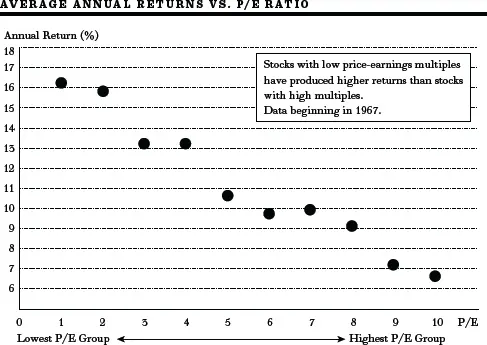
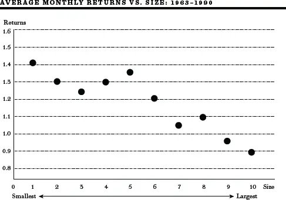
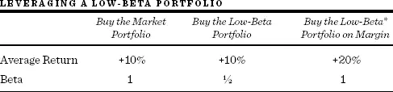
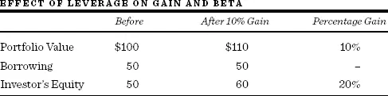
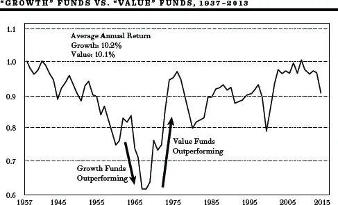
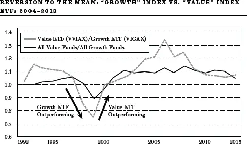
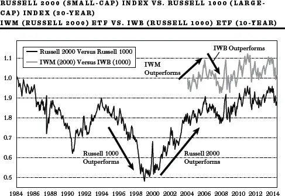
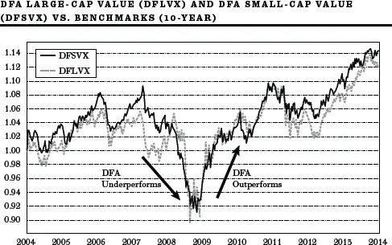
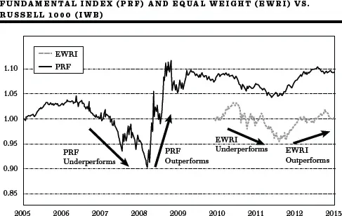
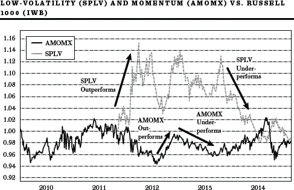

"智能贝塔"真的聪明吗？


伦敦的神谕协会将于周二休会，原因系不可预见之情况。\
《金融时报》上的一则广告


投资组合管理领域出现了一种新的热门投资策略，叫做"智能贝塔"（Smart Beta）。它隐含地承诺能够改善投资组合的业绩，已经吸引了数千亿美元的资产，而且正在飞速增长。投资者了解"智能贝塔"策略的优缺点及其可能在投资计划中扮演的角色非常重要。

本章将解释什么是"智能贝塔"，哪些类型的基金追求这一策略，以及为什么这么多人对它感到兴奋。它将说明"智能贝塔"为何未能通过安全性检验，以及它为何并不像自己声称的那样聪明。本章的结论是"智能贝塔"对个人投资者来说并非明智之举，并论证了经过时间考验的可靠方法——投资于低成本、宽基、市值加权指数基金（Capitalization-weighted Index Funds）——仍然是构建投资组合的最佳方式。

什么是"智能贝塔"？

"智能贝塔"投资策略没有一个被普遍接受的定义。使用这一术语的大多数人所想的是，通过使用各种相对被动的投资策略，有可能获得超过市场水平的超额收益，而这些策略所承担的风险并不比投资于一只低成本全市场股票指数基金更高。

我在前面的章节中已经论证过，每个投资组合的核心都应该由低成本、税收高效、宽基的指数基金构成。事实上，从1973年本书第一版——甚至在指数基金还没有出现之前——我就呼吁创建这样的基金，因为这样的基金会比昂贵的、税收效率低的主动管理基金更好地服务于投资者。通过持有一个包含市场中所有股票的投资组合，按其相对规模或市值（流通股数乘以股价）的比例配置，投资者将被保证获得市场回报。这样的基金将使交易成本最小化且税收高效。如果一家公司价值翻倍（因此其在指数中的权重增加），投资者的投资组合将自动反映这一变化，无需进行任何交易。此外，前面章节引用的大量证据清楚地表明，指数基金通常比试图战胜市场的主动管理基金为投资者提供更高的净回报。

如果投资者按照我的建议购买一只低成本的全美市场指数基金，她将获得市场回报率，同时承担美国股市特有的波动风险。记住，市场的波动性由贝塔（Beta）来衡量，而在[第9章](ch09.md)讨论的资本资产定价模型（Capital-Asset Pricing Model, CAPM）中，市场的贝塔定义为1。现在，"智能贝塔"投资经理们想让我们相信的是，纯指数投资——即每家公司按其总市值大小在投资组合中获得权重——并非最优策略。他们声称，不必像大多数主动投资组合经理那样选股就能战胜市场。相反，你可以管理一个相对被动的（低换手率的）投资组合，以更可靠的方式取得良好结果，而不承担任何额外风险。而且你可以以远低于主动管理者的费用来做到这一点。诀窍在于将投资组合向某个方向倾斜（或调味），例如"价值"与"成长"、小公司与大公司、相对强势股与弱势股、低波动性股票与高波动性股票。

其他被建议的倾斜或调味方式包括"质量"（涵盖稳定销售和盈利增长、低杠杆等特征）、盈利能力、高股息和流动性。就像好的烹饪融合多种食物风味一样，一些"智能贝塔"投资组合将两种或多种调味方式混合在一起。有的投资组合融合了"价值"和"小盘"，还有的混合了上述几种调味方式。此外，所有这些都可以在不增加"智能贝塔"投资组合预期波动性（贝塔水平）的情况下实现。[\*](#footnote-233-9)

### 四种美味的调味方式：各自的利弊

1\. 价值制胜

**积极面。** 1934年，David L. Dodd 和 Benjamin Graham 发表了投资者宣言，吸引了大批追随者，其中包括传奇人物 Warren Buffett。他们认为"价值"长期来看会胜出。要找到"价值"，投资者应寻找市盈率（P/E）较低、价格相对于账面价值（Book Value）较低的股票。"价值"基于当前现实而非对未来增长的预期。由此产生的理论与行为主义者的观点一致，即投资者倾向于过度自信于预测高盈利增长的能力，因此为"成长"股支付过高的价格。

我对这种方法在智识上有相当大的认同。我的选股基本原则之一是寻找具有尚未被市场发现的良好增长前景的公司，且其交易倍数相对较低。这种方法通常被称为 GARP，即"合理价格的成长"（Growth at a Reasonable Price）。我一再警告投资者热门高倍数股票的危险。特别是因为盈利增长如此难以预测，持有低倍数股票要好得多。如果增长确实实现了，盈利和盈利倍数都可能上升，给投资者带来双重收益。买入一只盈利增长未能实现的高倍数股票，投资者将面临双重打击。盈利和倍数都可能下降。

有证据表明，一个由盈利倍数相对较低（以及较低的市净率、市盈率和/或市销率）的股票组成的投资组合，即使经过资本资产定价模型衡量的风险调整后，仍能产生高于平均水平的回报率。例如，接下来的图表显示了按市盈率排名的十个等分股票组的回报。第1组的市盈率最低，第2组次低，以此类推。该图显示，随着一组股票的市盈率增加，回报率降低。

来源：纽约大学 Stern 商学院。

另一个可预测的回报模式是股票价格与账面价值之比（即公司账簿上记录的资产价值）与其后续回报之间的关系。以较低价格与账面价值比率交易的股票往往产生更高的未来回报。这一模式在美国和许多外国股市中都似乎成立，正如 Fama 和 French 所展示的那样，他们的工作在[第9章](ch09.md)中有所描述。

**消极面。** 永远不要忘记，低市盈率和低市净率（P/BV）可能反映了市场已经定价的风险因素。处于某种程度财务困境的公司可能以相对于盈利和账面价值较低的价格出售。例如，花旗集团和美国银行等大型金融中心银行在2009年以远低于其报告账面价值的价格交易，因为当时这些机构很可能被政府接管、股东权益被清零。

**投资组合示例。** 可以购买将广泛股市投资组合分为两个组成部分——"价值"和"成长"——的投资组合。"价值"组成部分持有那些市盈率和市净率最低的股票。由先锋集团（Vanguard Group）管理的代表性"价值"ETF以股票代码 VVIAX 交易。VVIAX 旨在追踪 CRSP 美国大盘价值指数的表现，这是一个广泛分散的指数，主要由美国大公司的"价值"股票组成。它试图通过将全部或绝大部分资产投资于构成指数的股票来复制目标指数，每只股票的持有比例大致等于其在指数中的权重。先锋集团的 VIGAX ETF 追踪 CRSP 大盘指数中"成长"组成部分的表现。"价值"和"成长" ETF 也适用于小盘宽基指数。

2\. 小盘更优

**积极面。** 研究人员在股票回报中发现的另一个模式是，小公司股票在很长一段时间内往往比大公司股票产生更高的回报。根据 Ibbotson Associates 的数据，自1926年以来，美国小公司股票的回报率比大公司股票高约2个百分点。接下来的图表展示了 Fama 和 French 的研究工作，他们将股票按规模分为十分位数组。他们发现，第1十分位组——总市值最小的10%的股票——产生了最高的回报率，而第10十分位组——市值最大的股票——产生了最低的回报率。此外，小公司往往比具有相同贝塔水平的大公司表现更好。

小公司投资组合的回报率往往高于大公司投资组合。

来源：Fama and French, "The Cross-Section of Expected Stock Returns," *Journal of Finance* (June 1992)。

**消极面。** 然而，我们需要记住，小公司可能比大公司风险更大，理应给投资者更高的回报率。因此，即使"小盘效应"在未来持续存在，这一发现也不会违反市场效率。小公司股票在风险调整后跑赢大公司股票的结论取决于如何衡量风险。在那些发现小公司"超额"回报的研究中，通常使用的风险度量指标贝塔可能是一种不完整的风险度量。我们无法区分异常回报究竟是效率低下的真正结果，还是我们风险度量不足的结果。小公司的较高回报可能只是投资者承担更大风险所应获得的必要补偿。此外，某些研究中发现的小盘效应可能仅仅源于所谓的幸存者偏差（Survivorship Bias）。今天的公司名单只包含幸存下来的小公司——不包括后来破产的小公司。

最后，小盘效应的可靠性及其持续存在的可能性都值得相当大的质疑。买入小公司投资组合并不是一种确保投资者获得异常高回报的万无一失的技术。

**投资组合示例。** 可以找到偏向小公司股票（即小盘股）投资组合的可投资工具。例如，以股票代码 IWB 交易的 ETF 追踪由1000家美国最大公司组成的 Russell 1000 指数。ETF IWN 追踪小盘 Russell 2000 指数，包含按规模（总市值）排在其后的2000家公司。

3\. 动量与均值回归

**积极面。** 最早关于股票价格行为的实证研究可以追溯到1900年代初，研究发现随机数列与股票价格时间序列具有相同的外观。但即使最早的研究支持随机性的普遍发现，更新近的研究表明随机游走模型并不严格成立。股票价格的发展中似乎存在某些模式。在较短的持有期内，有一些证据表明股市中存在动量（Momentum）。股票价格上涨后进一步上涨的可能性略大于价格下跌的可能性。对于较长的持有期，均值回归（Reversion to the Mean）似乎存在。当价格在数月或数年期间大幅上涨后，这种上涨往往伴随着急剧的反转。

关于动量存在性的两种可能解释：第一种基于行为因素；第二种基于对新信息的迟钝反应。行为金融领域的领军人物 Robert Shiller 在2000年强调了一种心理反馈机制，它将一定程度的动量注入股票价格，特别是在极端狂热时期。个人看到股价上涨并被吸引进入市场，这是一种"跟风效应"（Bandwagon Effect）。第二种解释基于这样的论点：当消息——尤其是公司盈利超过或低于预期的消息——出现时，投资者不会立即调整他们的预期。一些研究人员发现，正向盈利意外之后会出现异常高的回报，因为市场价格似乎只对盈利信息做出渐进式的反应。

虽然有一些证据支持股市中短期动量的存在，但其他研究记录了在较长持有期内的负自相关——即回报反转。长期持有期回报中相当大的一部分可以用与过去回报的负相关来预测。

一些研究将这种可预测性归因于股市价格倾向于"过度反应"。他们认为，投资者容易受到乐观和悲观情绪波动的影响，导致价格系统性地偏离其基本面价值，随后表现出均值回归。他们认为，对过去事件的这种过度反应与行为因素一致，即投资者系统性地高估了自己预测未来股价或未来公司盈利的能力。这些发现为依赖"逆向"策略（Contrarian Strategy）的投资技术提供了一定的支持，即买入那些长期不受欢迎的股票或股票群组。

**消极面。** 然而，短期动量和长期均值回归的发现在不同研究中并不一致，在某些时期比其他时期弱得多。此外，利用个股表现出回报反转的倾向来获利可能并不容易。我自己的一项研究模拟了一种策略：在十三年期间买入那些在前三至五年中回报特别差的股票。研究发现，前三至五年回报非常低的股票在下一期回报较高，而前三至五年回报非常高的股票在下一期回报较低。因此，存在非常强的*统计*证据表明存在回报反转。然而，两组在下一期的回报相似。因此，逆向策略并没有产生高于平均水平的回报。存在统计上很强的回报反转模式，但并不意味着市场中存在能让投资者获得超额回报的低效率。

**投资组合示例。** 有些投资基金和 ETF 将投资组合向相对于整个市场表现出相对强势的股票倾斜。由投资公司 AQR 管理的基金 AMOMX 投资于在美国主要交易所或场外市场交易的大盘和中盘公司，这些公司被判定具有正向动量。正向动量通常被认为相对于过去十二个月（不包括最近一个月，以允许任何短期回报反转）的表现较强。

4\. 低波动性可以产生高回报

**积极面。** 为了理解各种低波动性"智能贝塔"策略的原理，我们需要回顾[第9章](ch09.md)介绍的资本资产定价模型（CAPM）。根据 CAPM，风险和回报与贝塔相关，贝塔是衡量任何股票或投资组合相对波动性（或不可分散风险）的指标。根据该理论，任何股票或投资组合的贝塔（风险）越高，回报应该越高。然而，正如[第9章](ch09.md)所示，该理论的实证支持较弱。高贝塔投资组合并不比低贝塔投资组合产生更高的回报。无论在美国还是在国际上，贝塔与回报之间的关系都相对平坦。

投资者可以利用这一事实来设计各种"做空贝塔"（Betting Against Beta）投资组合策略。例如，假设非常低贝塔的投资组合的贝塔为1/2（它们的波动性是宽基市场投资组合的一半），但产生与市场相同的回报，而市场的贝塔按定义为1。假设市场回报为10%。通过保证金买入（Margin Buying）低贝塔投资组合（每美元市值只支付50美分），投资者可以将低贝塔投资组合的贝塔和回报翻倍，如下图所示。

\* 为了简化说明，我们假设保证金贷款不支付利息。

很容易看出保证金借贷如何同时增加投资组合的回报和波动性。对于每购买100美元价值的投资组合，投资者只支付50美元，借入另外50美元。100美元的投资组合增长10%，达到110美元。但投资者的所有权增加了20%，如下所示。

当然，增强的收益是以两倍的波动性为代价的。如果投资组合价值下跌10%，降至90美元，投资者的权益将减少到40美元，即20%的下降。因此，低波动性投资组合（贝塔为1/2）的底层股票波动性实际上翻了一倍。

**消极面。** 低波动性策略还有其他变体。例如，投资者可以买入（做多）波动性最低的10%的股票，同时卖空波动性最高的10%的股票。无论投资者采用哪种策略，最终得到的投资组合都与买入并持有市场投资组合（本书所推荐的策略）截然不同，且分散化程度更低。低波动性投资组合往往集中在公用事业股和大型制药公司。相对不分散化的投资组合是所有"智能贝塔"策略的一个特征。

**投资组合示例。** 低波动性 ETF 持有相对于基准波动性最低的股票投资组合。例如，由 PowerShares 管理的 SPLV ETF 持有标普500指数中波动性最低的100只股票。它不调整由此产生的行业偏差，因此近三分之一的投资组合持有公用事业股。投资者可以通过保证金买入 SPLV 来复制将投资组合杠杆提升至贝塔为1的策略。

混合调味方式和策略

Dimensional Fund Advisors 基金。Dimensional Fund Advisors（DFA）提供通过投资顾问销售的共同基金。这些基金基于[第9章](ch09.md)讨论的 Fama-French 价值和规模标准，通过量化选股来构建。DFA 基金包含市净率最低的股票以及市值（规模）最低的股票。DFA 大盘价值基金（DFLVX）是一个偏向价值的大盘股投资组合。DFSVX 是一个偏向价值的小盘股投资组合，旨在同时捕获"规模"和"价值"效应。Fama-French 的研究表明，这些效应不仅存在于美国，也存在于国际市场。因此，DFA 提供国际基金和国内基金。DFA 表示他们也可能在条件允许时将其他调味方式融入投资组合，如"质量"。

RAFI "基本面指数"。™ Research Affiliates 公司设计了国内和国际投资组合，基于其认为远优于标准市值加权指数的"商标指数"。RAFI ETF PRF 对 Russell 1000 指数中的股票不是按总市值加权，而是按其"经济足迹"加权。RAFI 基本面指数^TM^按销售额、盈利和账面价值等基本面价值指标来加权每只股票，而非按总市值。

事实上，RAFI 的方法将投资组合向与其他"智能贝塔"投资组合相同的价值和规模因子倾斜。考虑两家盈利相等的公司，但A公司以25倍盈利交易，而B公司以12.5倍盈利交易。在市值加权下，A公司的权重是B公司的两倍。在基本面指数法下，两者获得相同的权重。因此，价值股（低市盈率）和小市值股相对于它们在标准市值加权指数中的权重被超配了。

等权重指数。顾名思义，这些投资组合给予指数中所有股票相同的权重。由 Guggenheim Investments 管理的 ETF EWRI 对 Russell 1000 大盘指数中的每只股票赋予相同的权重。与 RAFI 投资组合一样，这种做法为 ETF 引入了规模和价值倾斜。

### "智能贝塔"基金未能通过风险检验

对"智能贝塔"的评估

所有"智能贝塔"策略都代表主动管理而非指数投资。市值加权投资组合就是市场本身。如果你相信证券的某个子集将给你带来超额回报，你就是在指望一些"愚蠢"的投资者持有产生较差回报的投资组合。一些"智能贝塔"的倡导者相当明确地暗示了这些"愚蠢"投资者可能是谁。他们声称传统市值指数基金的投资者是"愚蠢贝塔"投资者，因为他们持有宽基指数就会持有一些被高估的成长股。*但这个论点一定是错误的*。宽基指数基金的持有者按定义将获得市场的平均回报。如果"智能贝塔"基金产生高于平均的回报，它不可能是以传统指数基金投资者为代价——它必须是以所有不持有市场投资组合的主动管理者为代价。

• 就"智能贝塔"基金确实产生超额回报而言，很可能是因为它们承担了更大的风险。通过向某个方向倾斜——例如小盘——投资者将不如持有宽基市场投资组合那样分散，面临更大的风险。DFA 等管理者坦率地承认，这些基金可能产生的较高回报只是对所承担额外风险的补偿。在其历史中，RAFI 基本面指数^TM^投资组合的全部超额市场回报都是在2009年实现的，当时投资组合中银行股的比例是基准指数中权重的两倍多，近15%的投资组合投资于两只股票——花旗集团和美国银行。这个"赌注"奏效了，但确实有风险，因为当时还不确定银行是否能避免国有化和银行股东权益的"清零"。"智能贝塔"投资组合可能没有高贝塔值，但确实承担了相当大的风险。

• 当用多因子风险模型（如 Fama-French 三因子模型或其扩展）评估"智能贝塔"投资组合时，典型发现是没有表现出超额风险调整后业绩。"智能贝塔"投资组合不产生阿尔法（Alpha）。

• "智能贝塔"基金需要定期再平衡。例如，为了使等权重基金保持其等权重配置，涨幅超过平均水平的股票必须被削减。在上涨市场中，交易涉及交易成本和短期资本利得税。"智能贝塔"基金和 ETF 的管理费用也远高于传统市值加权指数基金。

• 所有"智能贝塔"投资组合都经历过长期的业绩不佳。有相当多的证据表明存在"均值回归"，超额业绩期之后往往伴随着令人失望的结果。

• 旨在捕获动量和低贝塔效应的共同基金（和 ETF）并未展现出卓越的业绩。实际资金的结果往往不同于学术研究中模拟的回报。

• "智能贝塔"策略未来的表现在很大程度上取决于实施策略时的市场估值水平。"价值"策略在互联网泡沫之后表现极其出色，因为当时高科技"成长"股相对于"价值"股的定价极其昂贵。同样，当小公司股票相对于大盘股定价便宜时，它们的表现特别好。特别是随着这些策略日益流行，这些技术青睐的股票将变得更加昂贵，结果可能令人失望。没有任何策略能独立于估值关系而始终有效。

• 最后，许多"智能贝塔" ETF 的买卖成本高于其传统市值加权同行。像标普500指数这样的纯简单 ETF 的交易价格与其净资产值基本相同，因为任何差异都倾向于被迅速套利消除。许多"智能贝塔" ETF 跟踪非标准指数，对冲这些指数要困难得多。因此，它们的价格更可能偏离公允价值，通常以相对于其底层持仓价值的显著溢价或折价交易。此外，DFA 提供的成功"智能贝塔"基金只能通过投资顾问购买，增加了一层额外的费用。

因子倾斜在实践中表现如何？

共同基金和交易所交易基金允许投资者实施上述各种"智能贝塔"策略。在这里，我们将审视一些模仿四大主要策略（投资组合调味方式或倾斜）的基金和 ETF 的实际记录，以及一些采用混合调味方式的基金。有关所列每只基金或 ETF 的信息可以在本书附录中的《随机漫步者通讯录》中找到。

价值和规模倾斜

**共同基金和 ETF 投资组合。** 支持"智能贝塔"投资组合的最有力学术证据是"价值"股跑赢"成长"股的趋势，以及"小盘"投资组合跑赢"大盘"投资组合的趋势。学术文献在这方面是明确支持的。

但我们必须记住，已发表研究的结果——即使是跨越数十年的研究——可能仍然具有时间依赖性，我们必须追问学术研究的回报模式是否真的能用真金白银来实现。接下来的图表展示了按"成长"或"价值"目标分类的共同基金产生的平均实际回报。"价值"基金是指购买低市盈率和低市净率股票的基金。我们可以看到，回顾到1930年代的一段时期，投资者似乎无法真正从专门投资"价值"股的共同基金中获得更高的回报率。事实上，该图表表明 Fama 和 French 从1960年代初研究的那段时期（展示了强烈的"价值"效应）可能是一个独特的时期，在此期间"价值"股相当持续地产生了更高的回报率。

下一页上方的图表是根据主动管理基金的记录编制的。对于更近的时期，我们可以用"智能贝塔"指数 ETF 来重复分析，这些 ETF 现在已经存在。下方的图表显示了在2004至2013年十年间可用的指数 ETF 投资组合中重复出现的完全相同的模式。期望"价值" ETF 在十年中跑赢市场的投资者会感到失望。无论是以"价值"为目标的共同基金还是 ETF，都没有产生高于平均水平的回报。

该图表显示"价值"共同基金的回报除以"成长"共同基金的回报。高于（低于）1的数字表明"价值"正在跑赢（跑输）"成长"。

来源：Bogle Research Institute。

该图表显示"价值"共同基金（价值 ETF）的回报除以"成长"共同基金（成长 ETF）的回报。高于（低于）1的数字表明"价值"正在跑赢（跑输）"成长"。

来源：Bogle Research Institute。

关于"小盘"效应可以说一个类似的故事。小公司投资的长期趋势是产生比大公司投资更高的回报率。小盘和大盘投资组合的相对回报存在相当大的波动性。例如，下面的图表显示了 Russell 2000 小盘指数和 Russell 1000 大盘指数（包含市场上1000家最大公司）的三十年历史。请注意，三十年来两个指数的回报几乎相同，没有任何证据表明其中任何一个指数持续跑赢另一个。在2004至2014年的十年期间——当 Russell 1000（代码 IWB）和 Russell 2000（代码 IMB）指数已有可投资 ETF 时——数据也显示出相当大的均值回归，尽管在此期间小公司产生的年化回报几乎比大公司高1个百分点。

Russell 2000 平均年化回报（自1984年4月2日起）：8.31%

Russell 1000 平均年化回报（自1984年4月2日起）：8.78%

IWM 2000 平均年化回报（自2004年4月1日起）：8.07%

IWB 1000 平均年化回报（自2004年4月1日起）：7.97%

该图表显示 Russell 2000 指数（ETF）的回报除以 Russell 1000 指数（ETF）的回报。高于（低于）1的数字表明 Russell 2000 正在跑赢（跑输）Russell 1000。

来源：Morningstar。

混合混合策略

我们将混合策略称为那些间接偏离市值加权以试图从在学术文献中占有重要地位的"价值"和"规模"因子倾斜中获益的策略。两种主要策略是等权重策略和 Research Affiliates 基本面指数^TM^。两者都给投资组合一个（小的）"规模"和"价值"倾斜。

**Dimensional Fund Advisors（DFA）投资组合。** DFA 基金的表现比许多其他可供投资者选择的"智能贝塔"产品稍好。它们通常成本较低，费率仅略高于宽基市值加权 ETF 的费用。但它们只能通过投资顾问购买。提供 DFA 基金的投资顾问是"纯收费"（Fee-only）的——也就是说，他们不因将投资者投入特定基金而收取额外佣金。因此，与其他顾问不同，这些顾问往往是无利益冲突的。尽管如此，他们收取的咨询费可能高达1%或更多，因此许多 DFA 基金曾经提供的超额回报需要减去这些咨询费。不需要顾问手把手服务的自助投资者可以通过购买标准指数基金来避免这一大层额外成本。

在第278页，我们展示了两只 DFA 基金在截至2014年4月的十年期间的表现。请注意，DFA 小盘价值基金（代码 DFSVX）和大盘价值基金（代码 DFLVX）都跑赢了各自基准超过1个百分点。然而，我们还需要再次强调，DFA 非常明确地表示任何超额回报都代表对投资组合附加风险的适当补偿。还要注意，DFA 基金与所有"智能贝塔"基金一样，都经历过业绩不佳的时期。

DFLVX 基准：IWD        DFSVX 基准：IWN

DFA 大盘价值年化回报（自2004年4月1日起）：8.92%

Russell 1000 价值年化回报（自2004年4月1日起）：7.65%

DFA 小盘价值年化回报（自2004年4月1日起）：9.12%

Russell 2000 价值年化回报（自2004年4月1日起）：7.49%

该图表显示"智能贝塔"策略的回报除以基准指数的回报。高于（低于）1的数字表明"智能贝塔"基金正在跑赢（跑输）基准指数。

来源：Morningstar。

Research Affiliates 基本面指数^TM^（RAFI）

就商业成功而言，RAFI "智能贝塔"基金是所有新基金产品中最令人印象深刻的之一。Research Affiliates 的创始人 Robert Arnott 能够让听众为之着迷，他论证说市值加权意味着此类投资组合的持有者将始终持有过多的被高估的成长股。他通过将每只股票的权重调整为其经济足迹（如盈利、资产等）来避免这一问题。当然，这种加权方式使 RAFI 投资组合向价值和小盘方向倾斜。截至2014年初，Research Affiliates 管理着16.6亿美元的资产。

RAFI ETF（代码 PRF）在其截至2014年初的七年历史中确实跑赢了其基准 Russell 1000 指数约1个百分点。Research Affiliates 声称超额回报来自于规避基准中那些被高估的股票——这些股票的市值相对于"基本面"估值指标偏高。然而，对 RAFI 业绩的分析表明，超额业绩来自于承担更高风险。

下图显示了 RAFI 投资组合（PRF）相对于其基准投资组合 Russell 1000 指数（ETF IWB）的季度超额回报。图表显示，通常存在较小的季度差异，这些差异更可能代表 RAFI 的不佳表现而非超额业绩。然而，2009年有一个显著的例外，当时 PRF 产生了非凡的超额回报，这完全解释了 RAFI 七年的超额回报。

基本面指数平均年化回报（自2005年12月19日起）：8.77%

Russell 1000 平均年化回报（自2005年12月19日起）：7.71%

等权重平均年化回报（自2010年12月3日起）：16.44%

Russell 1000 平均年化回报（自2010年12月3日起）：16.23%

该图表显示"智能贝塔"策略的回报除以基准指数的回报。高于（低于）1的数字表明"智能贝塔"基金正在跑赢（跑输）基准指数。

来源：Morningstar。

RAFI 投资组合在2009年金融危机后大幅超配了大型银行股，因为这些股票的交易价格相对于其账面（资产）"价值"存在异常大的折扣。如上所述，RAFI 基本面指数^TM^投资组合当时将约15%的投资组合投资于两只股票（花旗集团和美国银行）。事实证明，这种超配有助于产生出色的回报。但当时并不清楚这些陷入困境的银行能否避免国有化。无论如何，该策略涉及相当大的风险。很难不得出这样的结论：RAFI 在产生超额回报方面取得的任何成功都源于承担了更大的风险，而非成长股的错误定价。

对 RAFI 业绩的统计分析也支持风险解释。如果对 PRF 的回报进行统计分析，用 Fama-French 三因子风险模型来解释（其中"价值"和"规模"被视为风险因素），RAFI 的超额业绩（其"阿尔法"）估计为零。业绩图表也显示了 ETF 历史上长期的不佳表现。

等权重投资组合策略

正如 RAFI ETF 所展示的，等权重投资组合也提供了有些相似的回报。我们可以用 Guggenheim 等权重1000 ETF（代码 EWRI）与其基准 Russell 1000 市值加权 ETF（代码 IWB）的比较来说明这些投资组合的表现。第279页的图表展示了较短的三年历史。我们再次看到超配和欠配交替出现的时期，等权重策略产生了略高的平均年化回报。当然，两个投资组合具有不同的特征。等权重投资组合给予最小公司远更大的权重，因此具有与市值加权投资组合截然不同的分散化和风险特征。正如前面提到的，它们的税收效率也较低。

其他因子倾斜

其他"智能贝塔"投资组合试图利用低波动性策略提供有吸引力回报的倾向，以及股票回报随时间表现出动量的倾向。现在有各种各样的 ETF 在交易，让投资者有机会将真金白银投入这些策略，因此我们也可以分析它们的表现。但在这里，结果并不那么好。

低贝塔（低波动性）策略

有几只 ETF 被营销为试图为投资者提供利用低波动性股票有吸引力回报的实用工具。这些 ETF 在具体策略和应与之比较的基准方面略有不同。SPDR Russell 1000 Low Volatility ETF（代码 LGLV）自2013年初才开始交易。但 PowerShares S&P 500 Low Volatility ETF（代码 SPLV）和 iShares MSCI USA Minimum Volatility ETF（代码 USMV）自2011年起就已上市。截至2014年第一季度，这三只 ETF 中没有任何一只的回报超过了其市值加权基准。

动量策略

AQR Momentum Fund Class L ETF（代码 AMOMX）有更长的历史，自2009年起就已上市。在其截至2014年上半年的整个存续期间，该 ETF 未能在 Russell 1000 市值加权 ETF 或 Russell 1000 成长 ETF 中产生超额回报。虽然低贝塔和动量 ETF 的时间跨度太短，无法得出确定性的结论，但公平地说，到目前为止，当投资组合以真金白银运行时，这两种策略都没有展现出优越性。实际资金的投资组合通常不会展现出学术模拟中所显示的那种有效性。

低波动性平均年化回报（自2011年5月5日起）：14.59%

Russell 1000 平均年化回报（自2011年5月5日起）：15.29%

动量平均年化回报（自2009年7月9日起）：19.54%

Russell 1000 平均年化回报（自2009年7月9日起）：19.99%

该图表显示"智能贝塔"策略的回报除以基准指数的回报。高于（低于）1的数字表明"智能贝塔"基金正在跑赢（跑输）基准指数。

来源：Morningstar。

### 对投资者的启示

"智能贝塔"策略依赖于一种主动管理。它们不试图选择个股，而是将投资组合向历史上似乎能产生高于市场回报的各种特征倾斜。有利的是，"智能贝塔"投资组合以低于传统主动管理者收取的费率提供这些因子倾斜。

总体而言，"智能贝塔"基金和 ETF 的记录参差不齐。许多"智能贝塔" ETF 未能产生可靠的超额回报，尽管少数基金在存续期内"战胜了市场"。然而，这些基金的税收效率低于不需要再平衡的市值加权基金。

就某些"智能贝塔"策略确实产生了高于市场的回报而言，这些超额回报应被解释为承担额外风险的回报。在偏离市场投资组合的过程中，投资者承担了一组不同的风险。"智能贝塔"投资组合并不代表为投资者提供的更精密的捕鼠器。投资者应警惕自己落入更危险的捕鼠器中。

"智能贝塔"投资组合已成为大量营销炒作的对象。它们更多地证明了精明的营销而非精明的投资。"智能贝塔"策略未来的表现在很大程度上取决于实施策略时的市场估值水平。如上所述，"价值"策略在互联网泡沫之后表现极其出色，因为当时科技"成长"股相对于大多数"价值"股的定价极其昂贵。同样，当小盘股相对于大盘股定价便宜时，它们的表现特别好。投资者应该意识到，如果随着"智能贝塔"基金日益流行，"价值"和"小盘"变得定价昂贵，结果很可能会令人失望。没有哪种策略能独立于估值关系而始终有效。

没有理由调整本书前几版长期以来的建议：每个投资组合的核心都应该由低成本、税收高效、宽基的指数基金构成。如果你确实想尝试某个风险因子在未来产生超额回报，最审慎的做法是以市值加权宽基指数基金为核心。如果你确实想在投资组合中增加一个额外的风险因子，比如适度增加对小公司股票的配置，最有效和最高效的方式是购买一只低成本、市值加权的基金，追踪小盘股指数。

对有效市场信仰者的启示

从2008年3月到2009年3月，股市下跌了近50%。2008年3月的股市是否反映了所有可用信息？有没有人能合理地论证股票是被有效定价的？对于许多观察者来说，2008至2009年的崩盘以及随后的世界金融危机敲响了有效市场假说（Efficient Market Hypothesis, EMH）的丧钟。

2009年，George Soros 写道："有效市场假说确实因2008年的崩盘而名誉扫地。"EMH 被指责为金融危机的罪魁祸首，被无数金融评论员宣判死亡。例如，备受尊敬的市场策略师 Jeremy Grantham 认为 EMH "或多或少直接导致了金融危机"。法国兴业银行全球策略师 James Montier 在《金融时报》上撰文宣称，声称市场有效的理论是"彻头彻尾的垃圾"，应该被扔进历史的垃圾箱。

一些"智能贝塔"投资组合的支持者认为市场是无效的，并将他们的投资组合构建方法视为保护投资者免受泡沫定价股票侵害的一种方式。此外，他们认为可以通过依赖学术发现来构建更聪明的投资组合，因为股市中存在许多统计显著的可预测模式。然而，我们已经看到这些模式并非在每个时期都可靠，而且一些基于个股基本面估值指标的模式可能仅仅反映了更好的风险度量代理变量。此外，许多这样的模式在未来可能会自我毁灭，许多已经如此。事实上，这就是为什么应该谨慎对待、不要过度强调这些异常和可预测模式，或过度依赖"智能贝塔"投资组合来提升投资业绩的逻辑原因。

"智能贝塔"投资组合不能保护你免受市场泡沫的影响。我知道一些 EMH 的批评者和"智能贝塔"投资组合的管理者认为互联网泡沫在膨胀过程中很容易识别。Robert Shiller 于2000年初市场巅峰之际出版了他的书《非理性繁荣》。确实如此，但同一个模型在2000年初识别出泡沫的同时，也在1992年识别出一个被严重"高估"的股市，当时低股息收益率和高市盈率暗示美国长期股票回报将接近零。事实上，从1992年到2013年，股市年回报率超过9%，接近其历史平均水平。1996年12月，前美联储主席 Alan Greenspan 发表了他著名的"非理性繁荣"演讲，而同样的模型预测股票的长期回报将为*负数*。从主席演讲之日到2013年12月，宽基股市指数回报约为每年7.5%，即使经历了两次剧烈的熊市。只有事后回想，我们才知道股票价格"过高"是在1999年和2000年初。没有人能帮你择时，使你在市场达到暂时顶部时避免持仓。

在一次学术研讨会上，Robert Shiller——一位同情股票价格部分可预测且对市场效率持怀疑态度的经济学家——与 Richard Roll——一位也是管理数十亿美元投资基金的商人的学术金融经济学家——之间的一段对话颇具启发性。在 Shiller 强调股票定价中效率低下重要性之后，Roll 回应如下：

我个人尝试过将资金——我的客户的资金和我自己的资金——投入学者们构想出的每一种异常现象和预测工具中……我试图利用所谓的年末异常现象以及学术研究所记录的各种策略。但我至今没有在这些所谓的市场低效中赚到一分钱……一个真正的市场低效应该是一个可利用的机会。如果投资者无法系统性地、一次又一次地利用某些东西，那就很难说信息没有被恰当地纳入股票价格。

这种缺乏非凡利润机会的现象经常被金融学教授们流行的一个笑话来解释。一位信奉 EMH 的教授和一位研究生走在街上。学生看到地上有一张100美元的钞票，弯腰去捡。教授说："别费心去捡了。如果它真的是一张100美元的钞票，它就不会在那里了。"也许这个故事的更好版本是记住，如果真有100美元的钞票散落在地上，它们不会在那里待太久。

只要存在股市，投资者的集体判断就会犯错。毫无疑问，一些市场参与者的理性程度明显不足。但即使价格制定总是由理性的利润最大化投资者决定，价格也永远不会是"正确的"。假设股票价格被理性地确定为所有未来现金流的折现现值。未来现金流只能被估计，永远无法确知。未来销售和盈利的预测总会有误差。此外，股权风险溢价不太可能随时间保持稳定。因此，价格很可能始终是"错误的"。EMH 意味着的是，我们永远无法确定在任何给定时间价格是过高还是过低。一些投资组合经理可能正确地判断出某些价格过高、其他价格过低。但在其他时候，这种判断可能是错误的。而且无论如何，正确判断带来的利润不会代表显而易见的、未被利用的非凡回报。

定价不规则和可预测的股票回报模式可能随时间出现，甚至在短期内持续存在。Andrew Lo[\*](#footnote-233-10) 认为，没有任何工程师会设计一个测试来确定某个特定发动机是否完全高效。但工程师们会试图衡量该发动机相对于无摩擦理想状态的效率。同样，要求我们的金融市场完全高效才能接受 EMH 的基本原则是不现实的。事实上，正如 Sanford Grossman 和 Joseph Stiglitz 所论证的，我们金融市场的完美效率是一个无法实现的理想。那些确保信息迅速反映在市场价格中的交易者至少必须能够弥补他们的成本。但合理的问题是，我们的金融市场是否相对高效，我相信有非常有力的证据表明我们的市场非常接近 EMH 的理想。信息确实迅速反映在证券价格中。EMH 的基本核心概念——如果存在明显的赚取超额风险调整后回报的机会，人们就会蜂拥而至利用它们，直到机会消失——与 EMH 批评者提出的任何观点一样合理和常识化。如果真有100美元的钞票散落在地上，它们不会在那里待太久。

市值加权指数投资仍居首位

总之，市值加权指数投资不太可能在指数投资至高无上的地位争夺战中被取代。即使市场是无效的，偏离市场整体赋予的权重也将是一个零和游戏。市场中的所有股票必须由某人持有。如果某些投资者持有的投资组合表现优于市场，那么必然有其他投资者持有的投资组合表现更差。然而，由于成本更高，主动管理或"聪明"指数投资必须是一个负和游戏。平均而言，这些高成本投资组合必然跑输可以以接近零成本购买的市值加权指数基金。

有大量证据表明，专业投资经理无法跑赢简单买入持有宽基股市投资组合的指数基金。三分之二的专业管理基金定期被具有等效风险的宽基市值加权指数基金所超越，而在一个时期似乎产生超额回报的基金不太可能在下一个时期继续如此。专业人士的记录表明，股市中不存在足够的可预测性来产生可利用的套利机会。

每个投资组合的核心都应该由低成本、税收高效、宽基的指数基金构成。如果你确实想尝试某个风险因子在未来产生超额回报，最审慎的做法是以市值加权宽基指数基金为核心。

[\*](#footnote-233-9-backlink)"智能贝塔"策略与[第9章](ch09.md)讨论的多因子模型相关。如果假设资本资产定价模型中的贝塔是一个不完整的风险度量，上述列出的倾斜或调味方式可以被视为额外的风险因子。例如，通过将投资组合向小公司倾斜，投资者是在赌小公司可获得的风险溢价能够增强回报。在这里，"智能贝塔"当然被解释为通过承担额外风险来增强回报的技术。

[†](#footnote-233-10-backlink)Lo 还认为，可预测的股市模式的存在不是一个全有或全无的条件，而是一个随时间变化的条件，取决于现有套利限制、市场缺陷和心理偏差的特征。这些因素可能导致股票回报似乎可预测、偏离有效市场假说（EMH）的时期出现。
