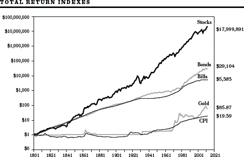
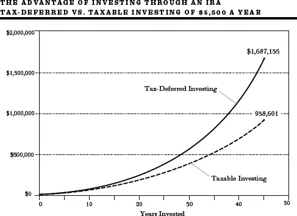
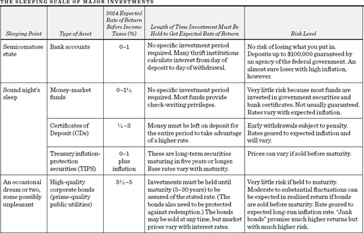
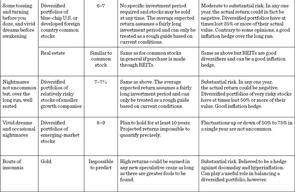
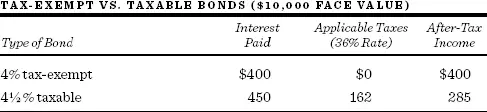

随机漫步者及其他投资者的\
健身手册


投资于金钱，你所追求的利息回报，取决于你是想吃得好还是睡得香。\
J. Kenfield Morley，《我所信仰的某些事物》


第四部分是为你在华尔街的随机漫步提供操作指南。在本章中，我将提供适用于所有投资者的一般性投资建议，即使他们并不相信证券市场高度有效。在[第13章](ch13.md)中，我将解释近期股票和债券回报中出现的波动，并展示你如何预估未来的发展趋势。我还将说明你如何至少粗略地衡量不同投资方案可能带来的长期回报。在[第14章](ch14.md)中，我将提供一份生命周期投资指南，说明你所处的人生阶段在决定最有可能帮助你实现财务目标的投资组合时所扮演的重要角色。

在最后一章中，我将为那些至少部分相信有效市场理论（Efficient Market Theory）的股票投资者，或那些确信即使真正的专业知识确实存在、自己也不太可能找到它的投资者，概述具体的投资策略。但如果你是理性的，你会在做出详细而周密的准备之后再进行你的随机漫步。即使股价是随机波动的，你也不应如此。请将以下建议视为一套热身运动，它将帮助你做出明智的财务决策，并提高你的税后投资回报。

### 练习一：准备必要的装备

一个广为流传的信念是，通往舒适退休和丰厚投资组合的秘诀在于知道应该购买哪些非凡的个股或共同基金。不幸的是，这些秘诀甚至不值印在纸上的成本。一个残酷的事实是，资产增长最重要的驱动力是你存了多少钱，而储蓄需要自律。没有定期的储蓄计划，无论你的投资基金获得5%、10%还是15%的回报都无关紧要。要实现财务安全，你能做的最重要的一件事就是开始一个定期储蓄计划，并尽早开始。通往舒适退休的唯一可靠途径是逐步而稳步地积累一笔积蓄。然而，很少有人遵循这条基本准则，普通美国家庭的储蓄少得令人担忧。

立即开始储蓄是至关重要的。每推迟一年投资，你最终的退休目标就更难实现。要相信时间的力量，而不是择时投资（Market Timing）。正如一家银行橱窗上的标语所言：积少成多，你可以在这里安全地建立强大的储备，但前提是你必须开始。

慢慢致富（但确定无疑）的秘密在于复利（Compound Interest）的奇迹。Albert Einstein将复利描述为"有史以来最伟大的数学发现"。这听起来可能很复杂，但它实际上只是指你不仅能在原始投资上获得回报，还能在你再投资的累积利息上获得回报。

Jeremy Siegel，优秀投资书籍《股市长线投资》（*Stocks for the Long Run*）的作者，计算了从1800年到2014年各种金融资产的回报。他的工作展示了复利令人难以置信的力量。1802年投入股市的1美元，到2013年底将增长到近1800万美元。这一数字远远超过了以消费者价格指数（Consumer Price Index, CPI）衡量的通货膨胀率。下图还显示了美国国债和黄金所取得的更为温和得多的回报。

来源：Siegel，《股市长线投资》第五版

如果你想要一种快速致富的投资策略，这本书不适合你。我把那留给兜售灵丹妙药的骗子们。你只会迅速变穷。要致富，你必须慢慢来，而且你必须现在就开始。

如果你年轻时没有储蓄，到了五十多岁发现自己没有积蓄、没有退休计划，还背着沉重的信用卡债务，该怎么办？规划一个舒适的退休生活将变得更加困难。但制定计划永远不晚。除了缩小生活方式、从现在开始执行严格的储蓄计划外，没有其他方法可以弥补失去的时光。你可能也没有其他选择，只能继续留在劳动力市场，将退休推迟几年。幸运的是，利用下面将描述的税收优惠退休计划，追赶上会更容易一些。

所以让时间站在你这一边。尽早开始储蓄，定期储蓄。
过朴素的生活，不要动用已经存下来的钱。如果你需要更多的自律，记住：比死更糟糕的唯一事情，就是活得比你为退休存下的钱更久。而且如果预测是可信的，当今婴儿潮一代（Baby Boomers）中约有100万人将活到至少100岁。

练习二：不要两手空空\
——用现金储备和保险为自己保驾护航

记住墨菲定律（Murphy's Law）：可能出错的事情终将出错。别忘了O'Toole的评注：墨菲是个乐观主义者。坏事确实会降临到好人头上。人生充满风险，每个人的一生中都会遇到意外的财务需求。锅炉偏偏在你的家庭承受巨额医疗费用的时候爆炸。工作上的裁员恰好发生在你儿子撞毁了家庭用车之后。这就是为什么每个家庭都需要现金储备和足够的保险来应对生活中的灾难。

现金储备

我知道许多经纪人会告诉你，不要因为持有现金而错过投资机会。"现金是垃圾"是经纪界的老生常谈。但每个人都需要在安全且流动性强的投资中保留一些储备，以支付意外的医疗账单，或在失业期间提供缓冲。假设你已经通过工作中的医疗和伤残保险获得了保障，这笔储备金可以设定为覆盖三个月的生活费用。你的年龄越大，现金储备基金就应该越大；但如果你从事的是需求旺盛的职业，并且/或者拥有大量可投资资产，储备金可以更少。此外，任何未来的大型支出（例如你女儿的大学学费）都应该用短期投资（如银行定期存单）来筹集，其到期日应与资金需求日期相匹配。

保险

大多数人都需要保险。那些有家庭责任的人如果不去购买保险，简直就是失职。我们每次开车上路或穿越繁忙的街道时，都面临着死亡的风险。飓风或火灾可能摧毁我们的家园和财产。人们需要保护自己免受不可预测事件的伤害。

对个人而言，房屋保险和汽车保险是必须的。健康保险和伤残保险也是如此。寿险（Life Insurance）——保护家庭免受家庭经济支柱死亡的影响——也是必不可少的。如果你是单身且没有需要抚养的人，你不需要寿险。但如果你有家庭，有年幼的孩子依靠你的收入生活，你就需要寿险，而且需要很多。

市面上有两大类寿险产品：一类是高保费保单，将保险与投资账户结合在一起；另一类是低保费的定期寿险（Term Insurance），仅提供身故保障，不积累现金价值。

高保费保单确实有一些优势，而且经常被吹嘘其节税效益。投入储蓄计划部分的保费所产生的收益是免税累积的，这对那些已经最大化了税收递延退休储蓄计划的人来说可能有利。此外，那些不会定期储蓄的人可能会发现，定期的保费账单提供了必要的自律，确保他们在去世时有一定金额可供家人使用，并且在计划的投资部分积累现金价值。但这类保单最大的受益者是出售它们并收取高额销售佣金的保险代理人。早期的保费主要用于支付销售佣金和其他管理费用，而不是用于积累现金价值。因此，并非你所有的钱都在为你工作。因此，对大多数人来说，我赞成自助的方式。购买定期寿险以获取保障，然后自己将差额投资于税收递延的退休计划。下面的建议将提供一个远优于"终身寿险"（Whole Life）或"变额寿险"（Variable Life）保单的投资计划。

我的建议是购买可续保定期寿险；你可以不断续保，无需体检。所谓递减定期寿险（Decreasing Term Insurance），即可续保金额逐期递减的保险，可能最适合许多家庭，因为随着时间的推移（孩子长大、家庭资源增加），保障需求通常会减少。然而，你应该明白，当你达到六十岁、七十岁或更高年龄时，定期寿险的保费会急剧上升。如果你在那个阶段仍然需要保险，你会发现定期寿险已经贵得令人望而却步。但那个阶段的主要风险不是过早死亡；而是你可能活得太久，以至于耗尽资产。通过购买定期寿险并将节省下来的钱自己投资，你可以更有效地增加这些资产。

货比三家，争取最好的交易。不同保险公司的费率差异很大。使用报价服务或互联网来确保你获得最好的交易。例如，你可以访问 www.term4sale.com，查看多种不同价格的替代保单。你不需要保险代理人。从代理人处获得的保单会更贵，因为它们需要额外的保费来支付代理人的销售佣金。自己动手办理，你可以获得好得多的交易。

不要购买任何A.M. Best评级低于A的保险公司的保险。较低的保费无法弥补你因保险公司陷入财务困难而无法理赔所承担的风险。不要把你的生命押在一家资本不足的保险公司身上。

你可以通过拨打908-439-2200获取A.M. Best对保险公司的评级。保险公司为评级付费给Best。A.M. Best的网站在 http://www.ambest.com/。Weiss Research提供了一种更为客观和严格的评级，它是一家由消费者支持的公司，联系方式是800-291-8545。Weiss的网站在 http://www.weissinc.com/。

递延变额年金（Deferred Variable Annuities）

我会避免购买变额年金产品，尤其是保险销售人员提供的高成本产品。递延变额年金本质上是一种具有保险功能的投资产品（通常是共同基金）。该保险功能规定，如果你去世时投资基金的价值已经低于你投入的金额，保险公司将全额退还你的投资。这些保单非常昂贵，因为你通常要支付高额的销售佣金和保险功能的保费。除非你的共同基金随着股市下跌而大幅缩水，并且你在购买变额年金后很快就去世了，否则这项保险的价值可能很小。记住实现财务安全的首要原则：保持简单。避免任何复杂的金融产品，以及那些试图向你推销它们的饥渴代理人。你应该考虑变额年金的唯一原因是你超级富有，并且已经最大化了所有其他税收递延的储蓄选择。即便如此，你也应该直接从低成本提供商（如Vanguard Group）购买这样的年金。

练习三：保持竞争力——让你的现金储备\
收益率跟上通货膨胀

正如我已经指出的，一些流动资产对于即将到来的支出（如大学学费、可能的紧急情况，甚至心理上的安全感）是必要的。因此，你面临一个真正的困境。你知道，如果你把钱存在储蓄银行，获得比如说2%的利息，而在通货膨胀率超过2%的年份里，你将失去实际购买力。事实上，情况更糟，因为你获得的利息需要缴纳所得税。此外，2010年代中期的短期利率异常低。那么一个小储户该怎么办呢？有几种短期投资可能有助于提供最好的回报率，尽管到2014年底并不存在非常好的替代品。

货币市场共同基金（Money Funds）

货币市场共同基金通常为投资者提供了停放现金储备的最佳工具。它们兼具安全性和开具大额支票的能力（通常至少250美元），支票在清算之前利息收益继续累积。在2000年代的第一个十年里，这些基金的利率通常在1%到5%之间。然而，2014年的利率非常低，货币基金收益率接近于零。并非所有货币市场基金都一样；有些基金的费用比率（运营和管理基金的成本）明显高于其他基金。一般来说，较低的费用意味着较高的回报。本书末尾的随机漫步者通讯录和参考指南中列出了一些费用相对较低的基金。

银行定期存单（CDs）

任何已知未来支出的储备金都应该投资于一种安全的工具，其到期日与资金需求日期相匹配。假设你已经为孩子未来一年、两年和三年后需要支付的学费留出了资金。在这种情况下，一个合适的投资方案是购买三张到期日分别为一年、两年和三年的银行定期存单。银行定期存单比货币基金更安全，通常提供更高的收益率，对于能够将流动资金锁定至少六个月的投资者来说，是一个极好的工具。

银行定期存单确实有一些缺点。它们不容易转换为现金，通常会因提前支取而被罚款。此外，定期存单的收益需要缴纳州和地方所得税。下面将讨论的美国国债（短期政府借据）则免征州和地方税。

银行定期存单的利率差异很大。利用互联网寻找最有吸引力的收益率。访问www.bankrate.com，搜索全美最高的利率。该网站列出的所有银行和信用合作社的存款都由联邦存款保险公司（Federal Deposit Insurance Corporation, FDIC）承保。每个列表都提供了地址和电话号码，你可以致电确认存款是否受保，并了解当前提供的回报率。

互联网银行

投资者还可以利用在线金融机构，它们通过不设分行和出纳员、全部业务在线处理来降低成本。由于运营成本低，它们可以提供明显高于普通储蓄账户和货币市场基金的利率。而且，与货币市场基金不同，那些是联邦存款保险公司成员的互联网银行可以保证你的资金安全。要寻找互联网银行，可以到Google搜索引擎输入"Internet bank"。当你在www.bankrate.com上搜索利率最高的银行时，也会看到许多互联网银行出现。互联网银行通常提供市场上最高的定期存单利率。

美国国债（Treasury Bills）

通称为T-bills，这是你能找到的最安全的金融工具，被广泛视为现金等价物。T-bills由美国政府发行和担保，以拍卖方式发售，到期日有四周、三个月、六个月或一年。最低面值1000美元，以1000美元为单位递增。T-bills相对于货币市场基金和银行定期存单的优势在于其收入免征州和地方税。此外，T-bills的收益率通常高于货币市场基金。有关直接购买T-bills的信息，请访问www.treasurydirect.gov。

免税货币市场基金（Tax-Exempt Money-Market Funds）

如果你发现自己足够幸运，处于联邦最高税级，你会发现免税货币市场基金是你的储备基金的最佳工具。这些基金投资于州和地方政府实体发行的短期证券组合，如果基金将其投资限制在所在州发行的证券内，所产生的收入将免征联邦和州税。它们还提供250美元以上的免费支票服务。这些基金的收益率低于应税基金。然而，处于最高所得税级的人会发现，这些基金的收益比普通货币市场基金的税后收益率更具吸引力。大多数共同基金公司也提供特定州的免税基金。如果你居住在一个州所得税很高的州，这些基金在税后基础上会非常有吸引力。你应该致电随机漫步者通讯录中列出的一家共同基金公司，了解他们是否有仅投资于你缴税所在州证券的货币基金。

练习四：学会如何\
躲避税务稽查员

互联网上流传的一个笑话是这样的：

一对七十八岁的夫妇去看性治疗师。医生问："我能为你们做什么？"男人说："你能看着我们做爱吗？"医生看起来很困惑，但还是同意了。当这对夫妇结束后，医生说："你们做爱的方式没有任何问题"，并收了他们50美元。这对夫妇要求另约时间，连续几周每周回来一次。他们会做爱，付钱给医生，然后离开。最后，医生问："你们到底想弄清楚什么？"老人说："我们不是想弄清楚什么。她有丈夫，我们不能去她家。我有丈夫，我们不能去我家。假日酒店收费93美元，希尔顿酒店收费108美元。我们在这里做只花50美元，而且我还能从医疗保险（Medicare）那里报销43美元。"

讲这个故事，我并不是要暗示你去试图欺骗政府。但我的确想建议你利用每一个机会使你的储蓄可以税前扣除，并让你的储蓄和投资免税增长。对大多数人来说，没有理由为你为退休而进行的投资收益缴纳税款。几乎所有投资者，除非他们一开始就超级富有，都可以以确保不会被山姆大叔（Uncam Sam，指美国政府）攫取任何部分的方式积累可观的净资产。本章将向你展示如何合法地"赖掉"税务稽查员。

个人退休账户（Individual Retirement Accounts）

让我们从最简单的退休计划形式开始——一个直截了当的个人退休账户（IRA）。2014年，你可以每年投入5500美元，投资于某种投资工具（如共同基金），对于中等收入的人，可以从应税收入中全额扣除这5500美元。（收入相对较高的人不能享受初始税收扣除，但他们仍然可以享受下面描述的所有其他税收优惠。）如果你处于28%的税级，这笔缴款实际上只花费你3960美元，因为税收扣除为你节省了1540美元的税款。你可以把它看作政府对你的储蓄账户的补贴。现在假设你的投资每年赚取7%的回报，并且你连续四十五年每年向该账户存入5500美元。存入IRA的资金所产生的收益完全不需要缴税。通过IRA储蓄的投资者最终价值超过160万美元，而没有IRA优惠的同等缴款（所有收益每年按28%纳税）总共只有约90万美元。即使在你从IRA中取款时按28%缴税（而且退休后你可能处于更低的税级），你最终拥有的钱也要多得多。下图显示了通过税收优惠计划投资的显著优势。

该图比较了两个假设账户的最终价值，一个税收递延，一个应税。两个账户中，投资者每年缴款5500美元，持续四十五年，费用后年回报率为7%。

来源：改编自John J. Brennan，《直言投资》（*Straight Talk on Investing*）。

对于那些在人生早期未能储蓄、现在必须迎头赶上的人，限额更高，如下表所示。

**IRA年度缴款限额**

| 纳税年度 | 50岁以下 | 50岁及以上 |
|----------|----------|------------|
| 2015 | $5,500 | $6,500 |
| 之后 | 根据通货膨胀指数化调整 | |

罗斯IRA（Roth IRAs）

投资者还可以选择另一种形式的个人退休账户，称为罗斯IRA。传统IRA以即时税收扣除的形式提供"今天的果酱"（前提是你的收入足够低以获得资格）。一旦进入账户，资金及其收益只有在退休取出时才被征税。罗斯IRA提供的是"明天的果酱"——你不能获得预先的税收扣除，但你的取款（包括投资收益）完全免税。此外，你可以进行罗斯转换。如果你的收入低于某些门槛，你可以将你的普通IRA转入罗斯IRA。你需要为转换的所有资金缴税，但此后既不需要为未来的投资收入缴税，退休取款也不需要缴税。而且，罗斯IRA没有终身最低分配要求，缴款可以在七十一岁半之后继续。因此，可以为后代免税积累大量资产。

哪种IRA最适合你以及是否应该转换的决定可能是很棘手的。幸运的是，金融服务行业提供免费软件，让你分析转换是否对你有意义。许多共同基金公司和经纪人都有使用起来相当方便的罗斯分析器。如果你接近退休，退休后可能处于更低的税级，你可能不应该转换，尤其是如果转换会将你推入更高的税级。另一方面，如果你远离退休，目前处于较低的税级，使用罗斯IRA你很可能会获得更好的结果。如果你的收入太高，不允许你在普通IRA上获得税收扣除，但又足够低以符合罗斯IRA的资格，那么毫无疑问罗斯IRA适合你，因为你的缴款无论如何都是税后的。

养老金计划（Pension Plans）

你的雇主提供各种各样的养老金计划。此外，个体经营者可以为自己设立计划。

401(k)和403(b)养老金计划。检查你的雇主是否有养老金利润分享计划，如大多数企业雇主提供的401(k)，或大多数教育机构提供的403(b)。这些是储蓄和投资的完美工具，因为钱在你看到之前就从你的工资中扣除了。此外，许多雇主会匹配员工缴款的一部分，这样每一块钱的储蓄都会成倍增长。截至2014年，每年最高可以向这些计划缴款17500美元，且缴款不计入应税收入。对于五十岁以上的人（其中一些人可能需要迎头赶上），2014年的缴款限额为每年22500美元。

个体经营者计划。对于个体经营者，国会设立了SEP IRA。所有个体经营者——从会计师到雅芳小姐，从理发师到房地产经纪人，从医生到室内设计师——都被允许建立这样的计划，他们可以将收入的25%投入其中，每年最高52000美元。如果你在正式工作之外兼职，你可以为你兼职赚取的收入设立SEP IRA。投入SEP IRA的钱可以从应税收入中扣除，收益在取出之前不被征税。该计划是自导式的，这意味着投资选择权在你手中。我在随机漫步者通讯录中列出的任何一家共同基金公司都可以为你办理所有必要的手续。

数百万纳税人目前正错过真正的好机会之一。我的建议是：尽可能多地通过这些税收优惠手段进行储蓄。如果必要的话，用你其他的储蓄来支付当前的生活费用，这样你就可以缴足最高限额。

为大学储蓄：529计划一样简单

"529"大学储蓄账户允许父母和祖父母向孩子赠送礼物，这些钱以后可以用于大学教育。以批准它们的税法条款命名，这些赠款可以投资于股票和债券，只要取款用于符合条件的高等教育目的，就不会对投资收益征收联邦税。而且，截至2014年，该计划允许个人捐赠者向529计划最多投入70000美元，不产生赠与税，也不减少遗产税抵免额。对夫妇而言，金额加倍至14万美元。如果你有孩子或孙辈计划上大学，并且你能负担得起向529计划缴款，建立这样一个计划是不假思索的事。

有需要避免的陷阱吗？当然有。大多数推销这些计划的销售人员都会获得丰厚的佣金，这会侵蚀投资回报。做一个有知识的消费者，联系Vanguard等公司，获取无佣金、低费用的替代方案。虽然躲避税务人员总是令人愉快的，但一些高费用的529计划最终可能会让你吃亏。还要注意，529计划由各个州批准，有些州允许你在州所得税申报表中至少对你的部分缴款进行税收扣除。因此，如果你居住在这样的州，你会想从那个州获取计划。如果你的州不允许税收扣除，选择一个低费用的州（如犹他州）的计划。而且，如果你不将529计划的收益用于符合条件的教育费用（包括职业生涯中期的技能更新或退休后的教育），取款不仅要缴纳所得税，还要缴纳10%的罚款。

请记住，大学在确定基于需求的助学金时可能会考虑529资产。因此，如果父母认为孩子上大学时将有资格获得助学金，他们把资产放在自己的名下可能更好，或者最好是放在孩子祖父母的名下。当然，如果你无论如何都不会有资格获得基于需求的助学金，那一定要建立一个低费用的529计划。[\*](#footnote-233-11)

练习五：确保合脚——\
了解你的投资目标

确定明确的目标是投资过程中太多人跳过的部分，其结果是灾难性的。你必须从一开始就决定你愿意承担多大程度的风险，以及哪些类型的投资最适合你的税级。证券市场就像一家大型餐厅，有各种各样的菜单选择，适合不同的口味和需求。正如没有一种食物适合所有人，也没有一种投资适合所有投资者。

我们都希望一夜之间让资本翻倍，但我们中有多少人能承受一半资本同样迅速地消失？J. P. Morgan曾有一个朋友，他非常担心自己的股票持仓，以至于晚上无法入睡。朋友问："我该怎么处理我的股票？"Morgan回答说："卖到你能睡着的程度。"他不是在开玩笑。每个投资者都必须决定他或她愿意在吃得好和睡得好之间做出怎样的权衡。这个决定取决于你自己。高投资回报只能以承担重大风险为代价。这是本书的基本教训之一。那么你的睡眠临界点是什么？找到这个问题的答案是你必须采取的最重要的投资步骤之一。

为了帮助你提高投资意识，我准备了一个关于投资风险（见第308-309页）和预期回报率的睡眠等级表，截至二十一世纪初。在令人昏昏欲睡的一端是各种短期投资，如银行账户和货币市场基金。如果这是你的睡眠临界点，你会对练习三中关于这类投资的信息感兴趣。

美国通货膨胀保护证券（Treasury Inflation-Protection Securities, TIPS）在安全等级中排在下一位。这些债券承诺一个较低的保证利率，每年根据消费者价格指数的增长率进行加码。因为它们是长期债券，其价格会随着实际利率（名义利率减去通货膨胀率）的变化而波动。但如果持有至到期，它们保证能维持实际购买力。在练习七中，我将讨论将一小部分投资组合配置于这些债券的优势。

公司债券（Corporate Bonds）风险稍高，如果你选择这种投资形式，一些梦境会开始侵入你的睡眠模式。如果你在此之前出售，你的回报将取决于出售时的利率水平。如果利率上升，你的债券将下跌到使其收益率与提供更高票面利率的新债券相竞争的水平。你的资本损失可能足以吃掉一整年的利息——甚至更多。另一方面，如果利率下降，你的债券价格将上升。如果你在到期前出售，你的实际年回报可能会有很大差异，这就是为什么债券比短期工具风险更大——短期工具几乎不存在本金波动的风险。通常，债券的到期期限越长，风险越大，相应的收益率也越高。[†](#footnote-233-12)你将在练习七中找到一些关于如何购买债券的有用信息。

没有人能确切地说普通股的回报会是多少。但正如Oskar Morgenstern曾经观察到的，股票市场就像一个赌场，其赔率经过操纵有利于参与者。虽然股价确实会暴跌，正如它们在2000年代初期和2007年那样灾难性地暴跌，但整个二十世纪的总回报约为每年9%，包括股息和资本利得。以2014年的价格计算，我相信国内普通股投资组合将获得6%至7%的回报，接近二十世纪的年回报率但略低。发达外国市场的主要公司也可能产生类似的回报。未来的实际年回报可能会——而且很可能——显著偏离这个目标——在下跌的年份，你可能损失25%甚至更多。在糟糕的年份里，你能忍受失眠之夜吗？

如果是带有四声道音响的全彩梦境呢？你可能想选择一个由风险稍高（波动更大）的股票组成的投资组合，比如激进型小公司共同基金中的股票。这些是较年轻的、采用新技术的公司股票，它们有更大的增长潜力。这类公司可能波动更大，这些股票在市场不好的年份很容易损失一半的价值。但你在二十一世纪的平均未来年回报率可能达到7%至7.5%。小盘股投资组合的表现往往略高于市场平均水平。如果你在熊市中睡得很好，并且有坚持到底的耐力，一个激进的普通股投资组合可能正适合你。来自许多新兴市场（如中国、印度和巴西）的股票投资组合可能带来更高的回报和更大的市场波动，这些国家在二十一世纪有着巨大的增长潜力。

商业地产对许多个人来说一直是一个遥不可及的投资。然而，房地产的回报一直相当丰厚，与普通股相似。我将在练习六中论证，负担得起自住房的个人最好还是买房。我还将展示如今个人投资商业地产要容易得多。我相信房地产投资信托基金（Real Estate Investment Trusts, REITs）值得在充分多元化的投资组合中占有一席之地。

我意识到我的表格忽略了黄金，也没有包括艺术品、风险投资、对冲基金、大宗商品和其他更另类的投资可能性。其中许多表现非常好，可以在平衡以纸面资产为主的多元化投资组合中发挥有用的作用。由于它们的重大风险和极端的波动性，无法预测它们的回报率；练习八将对此进行更详细的讨论。

很有可能，你的睡眠临界点在很大程度上会受到损失对你的财务生存能力影响的程度。这就是为什么在投资文献中，典型的"健康状况不佳的寡妇"通常被视为无法承担太多风险。寡妇既没有预期寿命，也没有在其投资组合之外赚取弥补损失所需收入的能力。任何资本和收入的损失都会立即影响她的生活水平。在光谱的另一端是"进取的年轻女商人"。她既有预期寿命，也有在面对任何财务损失时维持生活水平的赚钱能力。你在"生命周期"中的阶段如此重要，以至于我专门用了一章（[第14章](ch14.md)）来讨论这一决定你应承担多少风险的因素。

此外，你的心理构成也会影响你应承担的风险程度。一位投资顾问建议你想想你曾经是（或仍然是）什么样的大富翁（Monopoly）玩家。你是一个冒险者吗？你是否在海滨大道和公园 Place 上建造了酒店？确实，其他玩家很少落在你的地产上，但当他们落下时，你可以一举赢得整局游戏。或者你是否更喜欢来自圣詹姆斯 Place、田纳西大道和纽约大道的橙色垄断组所带来的稳定但适中的收入？这些问题的答案可能会让你对自己在投资方面的心理构成有所了解。了解自己至关重要。也许最重要的问题是：在股市大幅下跌期间你感觉如何？如果你感到身体不适，甚至卖掉了所有股票而不是坚持一个多元化的投资计划，那么大量持有普通股并不适合你。

第二个关键步骤是审查你的投资回报中有多少交给了山姆大叔，以及你需要多少当前收入。查看去年的所得税申报表（1040）和你申报的应税收入。对于那些处于高边际税级（Marginal Tax Bracket，对最后一美元收入征收的税率）的人来说，市政（免税）债券具有实质性的税收优势。如果你处于高税级，且不太需要当前收入，你会倾向于选择免税债券和低股息率但承诺长期资本利得的股票（在实现利得之前不需要缴税——如果是遗赠的一部分，可能永远不需要缴税）。另一方面，如果你处于低税级且需要较高的当前收入，你应该倾向于应税债券和高股息率的普通股，这样你就不用为了满足收入需求而定期出售股份来支付交易费用。

本练习的两个步骤——找到你的风险水平，以及确定你的税级和收入需求——看起来很显然。但令人难以置信的是，有那么多人因为将所购证券的类型与他们的风险承受能力以及收入和税务需求错配而犯了错误。投资者经常表现出的优先事项混乱，与最近一家伦敦报纸报道的一位年轻女性的故事中所表现出的混乱并无二致：

公园中的尴尬

伦敦，10月30日\
秘密恋人在午夜拥抱时发生了这一切。

挤在一辆小型双座跑车里，这个近乎赤裸的男人突然因椎间盘滑脱而动弹不得——据一位在医学期刊上发表文章的医生所述。

被困在他身下的绝望女友试图用脚踩喇叭按钮来求助。一位医生、救护人员、消防员和一群好奇的路人迅速围住了这对恋人的车。

肯特郡的Brian Richards博士说："这位女士发现自己被困在200磅重的、痛苦不堪、动弹不得的男人身下。"

"为了解救这对夫妇，消防员不得不切开车架，"他补充道。


惊慌失措的女孩被扶出车外，穿上外套后哭泣道："我该怎么向我丈夫解释他的车发生了什么事？"
路透社


投资者也经常被类似的优先事项混乱所困扰。你不能一方面寻求本金安全，另一方面又将投资投入风险最大的普通股。你不能一方面从高边际税率中保护你的收入，另一方面又锁定从高收益应税公司债券中获得的6%的回报，无论这些债券多么有吸引力。然而，投资顾问的历史记录中充满了投资者的证券持有与其投资目标不一致的故事。

练习六：从你自己的家开始漫步\
——租房导致投资肌肉松弛

还记得Scarlett O'Hara吗？她在内战结束时身无分文，但她仍然拥有她心爱的种植园Tara。好地段的好房子无论货币发生什么变化都能保值。只要世界人口继续增长，房地产需求将是最可靠的通货膨胀对冲手段之一。

虽然计算很复杂，但住宅房地产的长期回报似乎一直相当丰厚。我们在2007年和2008年确实经历了独栋住宅价格的泡沫。然而，到2010年代的第二个十年，房价已经回到"正常"水平，因此再次安全地进入市场。但房地产市场的效率不如股票市场。成百上千的知识投资者研究每一支普通股的价值。只有少数潜在买家评估特定房地产的价值。因此，单个房产并不总是被适当定价。最后，在通货膨胀加速的时期，房地产回报似乎高于股票回报，但在通货紧缩时期表现较差。总而言之，房地产已被证明是一项好的投资，提供了丰厚的回报和优异的通胀对冲特性。

对大多数人来说，最自然的房地产投资是独栋住宅或公寓。你总得住在某个地方，买房比租房有几个税收优势。因为国会希望鼓励房屋所有权及其所代表的价值，它给了房主两个重要的税收减免：（1）虽然房租不能从所得税中扣除，但与房屋所有权相关的两大支出——抵押贷款利息和财产税——是可以扣除的；（2）房屋价值的已实现收益在相当大的数额内是免税的。此外，拥有房屋是迫使自己储蓄的好方法，而且房屋能带来巨大的情感满足。我的建议是：如果你负担得起，拥有自己的住房。

你还可以考虑通过房地产投资信托基金（REITs，发音为"reets"）拥有商业地产。从公寓楼到办公楼和购物中心的物业被打包成REIT投资组合，由专业的房地产运营商管理。REIT本身就像任何其他普通股一样，在主要证券交易所活跃交易。这为个人将商业地产加入其投资组合提供了绝佳的机会。

如果你想让你的投资组合向更稳固的方向转移，我强烈建议你将部分资产投资于REITs。它们应该在你的投资计划中发挥作用有很多原因。首先，房地产的持有产生了与普通股相当的回报率和良好的股息收益。同样重要的是，房地产是实现[第8章](ch08.md)所述多元化优势的极佳工具。房地产回报往往与其他资产仅表现出适度的相关性，从而降低投资计划的总体风险。此外，房地产一直是可靠的通胀对冲工具。

不幸的是，从数百只优秀的REITs中筛选是一项艰巨的任务。而且，单一的权益型REIT不太可能提供跨物业类型和地区的必要多元化。个人投资者可能会因为购买了错误的REIT而遭遇严重挫折。然而现在，投资者有一个迅速壮大的房地产共同基金群体，它们非常乐意为他们完成这项工作。这些基金从可用的产品中筛选并组合成一个多元化的REIT投资组合，确保涵盖广泛的物业类型和地区。此外，投资者可以随时赎回他们的基金份额。还有低费用的REIT指数基金（列在通讯录中），我相信这些基金将继续为投资者带来最好的净回报。

练习七：如何在债券国度中漫步

让我们面对现实，从第二次世界大战到1980年代初，债券是一个糟糕的投资场所。通货膨胀猛烈地侵蚀了债券的实际价值。例如，在1970年代初以18.75美元购买美国储蓄债券并于五年后以25美元赎回的储蓄者，沮丧地发现他们实际上损失了实际购买力。问题在于，虽然五年前投入这种债券的18.75美元可能可以给汽车加两次油，但到期获得的25美元几乎只够加一次油。事实上，投资者的实际回报是负的，因为通货膨胀侵蚀购买力的速度超过了利息复利的速度。难怪许多投资者将债券视为一个不可提及的四个字母的单词。

债券在1980年代初之前是一项糟糕的投资，因为它们所提供的利率没有提供足够的通胀保护。但债券价格进行了调整，在接下来的三十年里给投资者带来了优异的回报。此外，债券在1980年至2014年间被证明是优秀的分散化工具，与普通股的相关性很低或为负。在我看来，有四种债券购买可能值得你特别考虑：

1. 零息债券（Zero-Coupon Bonds）——允许你在预定的时间长度内锁定收益率
2. 无佣金债券共同基金（No-Load Bond Mutual Funds）——允许你购买债券投资组合的份额
3. 免税债券和债券基金——适用于那些幸运地处于高税级的人
4. 美国通货膨胀保护证券（TIPS）

但它们对投资的吸引力因市场条件而有很大差异。在2010年代中期极低的利率下，投资者必须以相当谨慎的态度进入债券市场。

零息债券可用于对未来负债进行融资

这些证券被称为零息债券或简称零息券，因为持有者不会收到定期利息支付，不像普通付息债券。相反，这些证券以低于面值的折扣价购买（例如，面值的75美分），并在随后的几年里逐步上升到面值。如果持有至到期，持有者将获得债券的全部票面金额。这些证券的到期日从几个月到二十多年不等。它们是为特定未来日期的必要支出留出资金的极佳工具。

零息债券的主要吸引力在于购买者不面临再投资风险（Reinvestment Risk）。零息国债向投资者保证，其资金将以到期收益率（Yield to Maturity）持续再投资。

零息债券的主要缺点是，美国国税局（Internal Revenue Service）要求应税投资者每年将购买价格与面值之间差额的按比例份额申报为收入。然而，对于在税收递延退休计划中持有零息债券的投资者，则不需要这样做。

有两点需要提醒。高佣金经纪人在购买小面额零息债券时会向小投资者收取相当大的佣金。此外，你应该知道，只有在持有债券至到期时，才能保证按面值赎回。在此期间，随着利率变化，价格可能高度波动。

无佣金债券基金可以是个人投资者的合适工具

开放式债券（共同）基金具有零息债券的一些长期优势，但买卖起来要容易和便宜得多。我在通讯录中列出的那些基金都投资于长期证券。虽然不能保证你能以恒定利率再投资利息，但这些基金确实提供了长期的收入稳定性，特别适合那些计划靠利息收入生活的投资者。

由于债券市场往往至少与股票市场一样有效，我推荐低费用的债券指数基金。债券指数基金只是购买并持有各种债券，通常优于主动管理的债券基金。你绝不应该购买有佣金的基金（Load Fund）。如果可以免费获得，何必付费呢。

通讯录列出了几种类型的基金：专门投资公司债券的基金、购买GNMA抵押贷款支持债券组合的基金、投资免税债券的基金（我将在下一节讨论），以及一些适合愿意接受额外风险以换取更高预期回报的投资者的高风险高收益基金。

免税债券适用于高税级投资者

如果你处于非常高的税级，应税货币基金、零息债券和应税债券基金可能只适合你的退休计划内部。否则，你需要州和地方政府以及各种政府机构（如港务局或收费公路）发行的免税债券。这些债券的利息在你的联邦税表中不算作应税收入，而你居住的州发行的债券通常免征该州的所得税。

2014年，优质长期公司债券的收益率约为4.5%，同等质量的免税债券收益率约为4%。假设你的税级（你最后一美元收入被征税的税率）约为36%，包括联邦和州税在内。下表显示，免税证券的税后收入高出115美元，对于你这个税级的人来说，这显然是更好的投资。即使你处于较低的税级，免税债券仍然可能是划算的，这取决于你购买时市场上可用的确切收益率。

如果你直接购买债券（而不是通过共同基金间接购买），我建议你购买新发行的证券，而不是已发行在外的证券。新发行的收益率通常比已发行的老券稍微甜一些，而且你可以避免支付新发行的交易费用。我认为你应该通过坚持购买至少获得穆迪（Moody's）和标准普尔（Standard & Poor's）评级服务机构A级评级的债券来将风险控制在合理范围内。还要考虑所谓的AMT债券。这些债券受替代最低（所得）税（Alternative Minimum Tax）约束，因此对那些已经将大量收入从税收中保护起来的人没有吸引力。但如果你不受替代最低税约束，你可以通过持有AMT债券获得一些额外的收益率。

债券有一个令人讨厌的"正面我赢，反面你输"的特性。如果利率上升，你的债券价格会下降。但如果利率下降，发行人通常可以将债券从你手中"赎回"（提前偿还债务），然后以较低的利率发行新债券。为了保护自己，确保你的长期债券有十年的赎回保护条款，防止发行人以较低的利率进行再融资。

有关一些好的免税债券基金，请参阅通讯录中的名单。但如果你有大量资金投资于免税债券，我看不出你有什么理由要通过基金来购买免税债券并支付相关的管理费。如果你将购买限制在高质量债券（包括债券保险担保的债券）范围内，你几乎不需要多元化，而且你会赚到更多利息。但如果你只有几千美元可投资，基金会提供便利的流动性和多元化。还有一些基金将其购买限制在单一州的债券上，这样你就可以同时避免州和联邦所得税。封闭式免税债券基金将在[第15章](ch15.md)中介绍。

热门TIPS：通胀指数化债券

我们知道，未预期到的通货膨胀对债券持有者是毁灭性的。通货膨胀倾向于推高利率，利率上升时债券价格下跌。还有更多坏消息：通货膨胀还会降低债券利息和本金支付的实际价值。现在，一种铅防护罩以美国通货膨胀保护证券（TIPS）的形式面向投资者提供。如果持有至到期，这些证券对通货膨胀的侵蚀是免疫的，并保证投资者的投资组合将保持其购买力。2014年，长期TIPS支付约1%的基本利率。但与传统的国债不同，利息支付基于随消费者价格指数（CPI）上升的本金金额。如果明年物价水平上涨3%，债券1000美元的面值将增加到1030美元，半年利息支付也会相应增加。当TIPS到期时，投资者获得等于当时通胀调整后面值的本金支付。因此，TIPS提供了有保证的实际回报率，以及以保持实际购买力的金额偿还本金的承诺。

目前没有其他金融工具能为投资者提供如此可靠的通胀对冲。TIPS也是极好的投资组合分散化工具。当通货膨胀加速时，TIPS将提供更高的名义回报，而股票和债券价格则可能下跌。因此，TIPS与其他资产的相关性很低，是独特的有效分散化工具。它们为紧张的投资者提供了有效的保险政策。

然而，TIPS确实有一个令人讨厌的税收特性，限制了它们的用途。TIPS收益的税收同时针对票息支付和反映通货膨胀的本金增加。问题在于，财政部在到期之前不会支付本金的增加部分。如果通货膨胀率足够高，少量的票息支付可能不足以缴税，而且随着通货膨胀率的上升，这种失衡会加剧。因此，TIPS对于应税投资者来说远非理想，最好仅在税收优惠的退休计划中使用。此外，2014年TIPS的利率明显低于其历史平均水平。

你应该成为一个债券市场瘾君子吗？

债券市场能免于投资风险与回报相关这一格言吗？完全不能！在大多数时期，所谓的垃圾债券（Junk Bonds，信用质量较低、收益率较高的债券）给投资者带来的净回报率比"投资级"（Investment Grade，信用评级高）债券高出2个百分点。2014年，投资级债券收益率约为4.5%，而"垃圾"债券的收益率通常为5%至6%。因此，即使有1%的低等级债券在利息和本金支付上违约并造成全部损失，一个由低质量债券组成的多元化投资组合仍然能产生与高质量债券投资组合相当的净回报。因此，许多投资顾问推荐将充分多元化的高收益债券组合作为明智的投资。

然而，还有另一种学派的观点建议投资者对垃圾债券"说不"。大多数垃圾债券是作为大规模企业并购、收购和杠杆（主要由债务融资）收购浪潮的结果而发行的。垃圾债券的反对者指出，低信用等级的债券最有可能在经济形势好的时候才获得全额偿还。但如果经济不景气，就要小心了。

那么一个深思熟虑的投资者该怎么办呢？答案部分取决于当你承担重大投资风险时，你晚上睡得好不好。高收益或垃圾债券投资组合不适合失眠症患者。即使进行了多元化，这些投资仍然存在重大风险。而且，它们不适合完全依赖利息支付作为主要收入来源的投资者。它们当然也不适合那些没有充分分散化持有量的投资者。然而，至少从历史上看，垃圾债券的总收益率溢价足以补偿实际的违约经验。

外国债券（Foreign Bonds）

有许多外国国家的债券收益率高于美国。在一些新兴市场尤其如此。传统智慧通常不建议购买新兴市场的债券，理由是其高风险和低质量。但许多新兴经济体的债务占GDP比率更低，政府财政状况比发达国家更好。新兴经济体的增长速度也更快。因此，一个由较高收益率外国债券（包括新兴市场债券）组成的多元化投资组合，在极低利率时期可以成为固定收益投资组合中有用的一部分。

练习七A：在金融抑制时代\
用债券替代品替代部分债券投资组合

极低的利率给债券投资者带来了严峻的挑战。世界上所有发达国家都背负着过多的债务。与美国一样，各国政府在人口老龄化面前，极难控制福利支出项目。

美国和其他政府更容易走的路是人为压低利率，因为债务的实际负担会减轻，债务在债券持有者的背上进行重组。我们以前看过这部电影。第二次世界大战结束时，美国故意将利率维持在极低水平，以帮助偿还战争期间积累的债务。通过这样做，美国将其债务占GDP比率从1946年的122%降至1980年的33%。但这是以牺牲债券持有者为代价实现的。这就是"金融抑制"（Financial Repression）一词的含义。

处理这个问题的一种技术是，将正常情况下应该是债券投资组合的一部分用股票股息替代策略。具有相对稳定股息增长的股票投资组合的收益率远高于同一家公司的债券，并允许未来增长的可能性。此类投资组合中公司的一个例子是AT&T。AT&T十五年期债券收益率约为4.25%，其普通股的股息收益率为5.25%，而且股息一直在随时间增长。靠股息和利息生活的退休人员将从AT&T股票中获得比其债券更好的回报。而且，股息增长型股票的投资组合可能与同一家公司相同等值的债券投资组合一样不那么波动。在下面的具体建议中，我建议在投资组合中旨在降低风险和增加稳定性的部分进行这种部分的股票替代债券。在金融抑制时期，关于债券的标准建议需要进行微调。

练习八：轻步走过黄金、收藏品\
和其他投资的原野

在本书的早期版本中，我对黄金是否应纳入充分多元化的投资组合持有不同的立场。在1980年代初，黄金价格上涨到每盎司800美元以上时，我对黄金持相当负面的看法。二十年后，在新千年开始时，黄金售价在200多美元，我变得更加积极。今天，黄金售价约为每盎司1300美元，我发现很难对其热情。但黄金在你的投资组合中可能扮演一个适度的角色。黄金的回报与纸面资产的回报的相关性很低。因此，即使是适度的持有（比如投资组合的5%）也可以帮助投资者降低整个投资组合的波动性。如果通货膨胀重新抬头，黄金可能会产生可接受的回报。现在，通过购买专注于黄金的共同基金或ETF（交易所交易基金），可以轻松获得少量的黄金持有。

黄金价格的剧烈波动让我想起了一个中国商人的故事，他靠买卖沙丁鱼过着优裕的生活。他的生意非常成功，于是雇了一个聪明的大学毕业生来协助他。有一天，当这个年轻人请他的姻亲吃饭时，他决定带几罐沙丁鱼回家当开胃菜。打开第一罐时，他非常懊恼地发现罐子里装满了沙子。他又打开了第二罐，发现同样装满了沙子。第二天当他把这个经历告诉中国商人时，这位精明的商人只是微笑着说："哦，那些罐子是用来交易的，不是用来吃的。"

从某种意义上说，这个故事与黄金交易中发生的情况非常相似。几乎所有的黄金交易都是为了囤积或投机，以便将来以更高的价格出售金条。几乎没有什么黄金是实际被使用的。在这种市场中，没有人能知道价格会走向何方。审慎的建议是——至多——黄金作为获得更广泛分散化的工具只能扮演有限的角色。

钻石呢？它们经常被描述为每个人最好的朋友。它们对个人投资者构成了巨大的风险和劣势。必须记住，购买钻石涉及大量的佣金成本。个人判断质量也极其困难，我可以向你保证，你接到的想卖钻石的电话会远远多于想买钻石的电话。

另一个目前流行的策略是投资收藏品。成千上万的销售人员在推销从雷诺阿的画到地毯、蒂芙尼灯到稀有邮票、装饰艺术到晕机袋的各种东西。eBay使买卖收藏品更加高效。我认为购买你喜爱的东西没有什么不好——天知道人们的品味确实奇怪——但我的建议是，你购买这些东西是因为你喜爱它们，而不是因为你期望它们升值。不要忘记赝品和伪造品很常见。收藏品投资组合通常还需要支付高昂的保险费和无休止的维护费用——因此你是在支付款项而不是收到股息或利息。要通过收藏赚钱，你需要极高的原创性和品味。在我看来，大多数认为自己在通过收藏获利的人实际上是在收集麻烦。

© George Price / The New Yorker Collection /
[www.cartoonbank.com](http://www.cartoonbank.com)。保留所有权利。

另一个目前流行的工具是商品期货合约。你不仅可以购买黄金，还可以购买从谷物到金属以及外汇等各种商品的交割合约。这是一个快节奏的市场，专业人士可以从中获益匪浅，但不知道自己在做什么的个人很容易被重创。我对非专业投资者的建议是：不要逆势而为。

我还会远离对冲基金、私募股权和风险投资基金。这些基金对于那些收取高额管理费和20%利润分成的基金经理来说是很好的赚钱工具，但个人投资者不太可能受益。这些基金的平均表现令人非常失望。确实，最好的基金表现相当好，但除非你是已经建立了明显优势地位的机构投资者，否则你投资于最好的基金的机会在现实中是零。忽略这些另类投资——它们不适合你。

练习九：记住投资成本\
不是随机的；有些成本比其他更低

如今，许多经纪人会以低于标准佣金费率的大幅折扣执行你的股票订单。折扣经纪人通常提供简单的基本服务。如果你想要人手把手地帮你，如果你想要一般性的投资组合建议和投资建议，折扣经纪人可能不适合你。但如果你确切地知道你想买什么，折扣经纪人可以以比标准全服务公司低得多的佣金费率为你买入，特别是如果你愿意在线交易的话。在线交易股票既容易又便宜。但让我警告你，尝试每天进出股票交易的投资者中很少有人能获利。不要让低佣金费率引诱你成为不成功的日内交易者大军中的一员。

既然谈到佣金成本，你应该了解华尔街的一项创新，称为"全包账户"（Wrap Account）。只需支付一笔费用，你的经纪人就会为你安排一位专业的资金管理人，后者为你选择一个包含股票、债券，也许还有房地产的投资组合。经纪佣金和咨询费"包裹"在总费用中。全包账户的费用极高。年费可达每年3%，如果管理人使用共同基金或REITs，可能还有额外的执行费用和基金费用。以这种费用水平，你几乎不可能跑赢市场。我在这里的建议是：避免接受全包服务。

还要记住，在购买共同基金或ETF时，成本很重要。那些向投资者收取最低费用的基金往往能产生最好的净回报。基金行业实际上是你为不付费而获得的行业。当然，最典型的低成本基金是指数基金，它们往往也具有很高的税收效率。

投资中有很多你无法控制的因素。你对股票和债券市场的涨跌无能为力。但你可以控制你的投资成本。你可以组织你的投资以最小化税收。控制你能控制的事情应该在制定明智的投资策略中发挥核心作用。

练习十：避免陷阱和绊脚石——\
分散你的投资步伐

在这些热身练习中，我们讨论了多种投资工具。我们华尔街之旅最重要的部分将带我们到Broad街的拐角处——思考关于普通股的明智投资策略。这部分旅程的指南包含在最后三章中，因为我相信普通股应该构成大多数投资组合的基石。然而，在我们最后的热身练习中，我们回顾现代投资组合理论的重要教训——分散化的优势。

《圣经》中的箴言说："谋士多，人便安居。"投资也是如此。
分散化降低了风险，使你更有可能实现那种满足你投资目标的良好平均长期回报。因此，在每个投资类别中，你应该持有各种个别证券，虽然普通股应该是你投资组合的主要部分，但不应该是唯一的投资工具。只要想想那些泪眼婆娑的安然（Enron）前员工，他们的退休计划中只持有安然股票。当安然倒闭时，他们不仅失去了工作，还失去了所有的退休储蓄。无论投资目标是什么，明智的投资者都会进行分散化。

还要回忆[第10章](ch10.md)"行为金融学对投资者有什么启示？"一节中涵盖的陷阱和绊脚石。在投资方面，我们往往是我们自己最大的敌人。理解我们有多容易受到自身心理的影响，可以帮助我们避免那些可能使我们在华尔街之旅中绊倒的常见陷阱。

最终检查

既然你已经完成了热身练习，让我们花一点时间做最终检查。经济学家得出的估值理论和专业人士记录的业绩得出了一个单一的结论：通往财富没有确定而容易的道路。高回报只能通过承担更高的风险（也许还有接受较低程度的流动性）来实现。

你能容忍的风险程度部分取决于你的睡眠临界点。下一章将讨论股票和债券投资的风险与回报，帮助你确定你应该对不同金融工具有何回报预期。但你能承担的风险也受到你的年龄以及你的非投资收入来源和可靠性的显著影响。[第14章](ch14.md)——"生命周期投资指南"——将更清楚地告诉你如何决定将你的资本分配到普通股、债券、房地产和短期投资中的比例。最后一章将介绍具体的股票市场策略，使业余投资者能够取得与最老练的专业人士一样好甚至更好的成绩。

[\*](#footnote-233-11-backlink)关于529计划的综合信息可以在 www.savingforcollege.com 上找到。

[†](#footnote-233-12-backlink)这并不总是如此。在某些时期，短期证券的收益率实际上高于长期债券。问题在于，投资者不能指望不断以如此高的利率对其短期资金进行再投资，后来短期利率大幅下降。因此，投资者可以合理地预期，持续投资于短期证券不会产生与投资于长期债券一样高的回报。换句话说，持有长期债券存在风险补偿，即使短期利率暂时高于长期利率也是如此。
