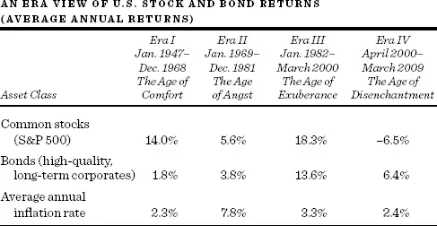
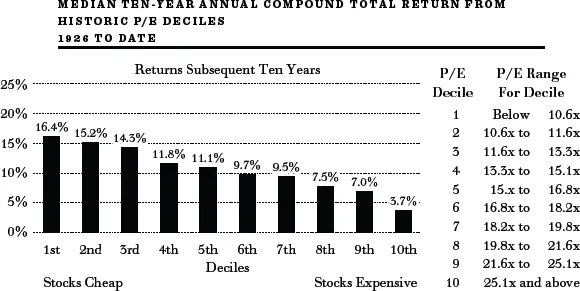

金融竞赛的赔率：\
理解与预测股票债券回报入门

任何对过去正确认知的人，\

都不会对现在持悲观或消沉的看法。\
Thomas B. Macaulay，《英国史》


本章将教你如何成为一名金融赌盘分析师。阅读本章仍然无法让你预测市场在未来一个月或下一年的走势——没有人能做到——但你将能够更好地构建一个获胜投资组合的赔率。虽然股票和债券的价格水平（净资产最重要的两个决定因素）无疑会超出你的控制范围而波动，但我的一般方法论将帮助你务实地预测长期回报，并将你的投资计划调整为适应你的财务需求。

什么决定了股票和债券的回报？

普通股的超长期回报由两个关键因素驱动：购买时的股息收益率（Dividend Yield）和未来盈利及股息的增长率（Growth Rate）。原则上，对于永远持有股票的买家来说，一股普通股的价值等于其未来股息流的"现值"或"折现值"。回想一下，这种"折现"反映了这样一个事实：明天收到的一美元不如今天手中的一美元值钱。股票购买者购买的是一家企业的权益份额，并希望收到不断增长的股息流。即使一家公司今天支付很少的股息，并将大部分（甚至全部）收益留存在企业中再投资，投资者也隐含地假设这种再投资将导致未来股息流更快增长，或者反过来，产生更多的收益，供公司用于回购股票。

这一股息流的折现值（或通过股票回购返还给股东的资金）可以被证明产生了一个非常简单的公式，用于计算单个股票或整个市场的长期总回报：

*长期股票回报 = 初始股息收益率 + 增长率。*

例如，从1926年到2013年，普通股提供了约10%的平均年回报率。1926年1月1日整个市场的股息收益率约为5%。盈利和股息的长期增长率也约为5%。因此，将初始股息收益率加上增长率，就非常接近实际的回报率。

在较短的时期内，比如一年甚至几年，第三个因素在决定回报方面至关重要。这个因素是估值关系的变化——具体来说，是市盈率倍数（Price-Earnings Multiple）或市价股息率倍数（Price-Dividend Multiple）的变化。（市价股息率倍数的增减往往与更常用的市盈率倍数同方向变动。）

市价股息率倍数和市盈率倍数每年差异很大。例如，在极度乐观时期，如2000年3月初，股票的市盈率倍数远高于30。市价股息率倍数超过80。在极度悲观时期，如1982年，股票仅以8倍盈利和17倍股息的价格出售。这些倍数也受到利率的影响。当利率较低时，股票（与债券竞争投资者的储蓄）往往以低股息收益率和高市盈率倍数出售。当利率较高时，股票收益率上升以更具竞争力，股票往往以低市盈率倍数出售。1968年至1982年间，普通股回报远低于平均水平，回报率仅约为每年5.5%。该时期开始时股票的股息收益率为3%，盈利和股息增长为每年6%，略高于长期平均水平。如果市盈率倍数（和股息收益率）保持不变，股票本应产生9%的年回报率，6%的股息增长转化为每年6%的资本增值。但股息收益率的大幅上升（市盈率倍数的大幅下降）使年均回报率降低了约3.5个百分点。

股票市场投资者最糟糕的时期之一是2000年代的第一个十年。千禧时代变成了幻灭时代。2000年4月初，在互联网泡沫的巅峰时期，标准普尔500指数的股息收益率已降至1.2%。（市盈率倍数高于30。）在此期间，股息增长实际上非常强劲，平均每年5.8%。如果没有估值关系的变化，股票本应产生7%的回报率（1.2%的股息收益率加上5.8%的增长率）。但市盈率倍数急剧下降，股息收益率在整个十年中上升。估值关系的变化使回报率减少了13.5个百分点。因此，股票没有回报7%——而是平均每年亏损6.5%，导致许多分析师将这些年称为"失落的十年"。

许多分析师质疑股息在今天是否还像过去那样重要。他们认为，公司越来越倾向于通过股票回购而非增加股息的方式将不断增长的收益分配给股东。这种行为有两个原因——一个有利于股东，另一个有利于管理层。股东利益是由税法创造的。已实现长期资本利得的税率通常只是股息最高所得税税率的一小部分。回购股票的公司往往会减少流通股数，从而提高每股收益和股价。因此，股票回购倾向于产生资本利得。即使股息和资本利得以相同的税率征税，资本利得税可以递延到股票出售时缴纳，如果股票随后被遗赠，甚至可以完全避免。因此，为股东利益行事的管理层将倾向于进行回购而非增加股息。

股票回购的另一面则更加自私。管理层薪酬中有很大一部分来自股票期权，股票期权只有在收益和股价上涨时才变得有价值。股票回购是实现这一目标的简便方式。更大的增值通过提高其股票期权的价值来造福管理层，而更大的股息则流入了当前股东的口袋。从1940年代到1970年代，收益和股息以大致相同的速度增长。然而，在二十世纪最后几十年里，收益增长快于股息。从非常长远的角度来看，收益和股息可能以大致相似的速度增长，为了便于阅读，我选择在下文中以收益增长来进行分析。

债券的长期回报比股票更容易计算。长期来看，债券投资者获得的收益率近似等于其购买时的债券到期收益率（Yield to Maturity）。对于零息债券（一种不进行定期利息支付、仅在到期时返还固定金额的债券），假设没有违约且持有至到期，其购买时的收益率就是投资者将获得的收益率。对于付息债券（一种确实进行定期利息支付的债券），在其存续期内所获得的收益率可能略有差异，这取决于票息利息是否以及以什么利率进行再投资。尽管如此，债券的初始收益率为持有该债券至到期的投资者提供了一个相当可用的收益率估计。

当债券未被持有至到期时，估算债券回报就变得模糊了。利率（债券收益率）的变化成为决定债券持有期内所获净回报的主要因素。当利率上升时，债券价格下跌，使现有债券与当前以更高利率发行的债券相竞争。当利率下降时，债券价格上涨。需要记住的原则是，不持有至到期的债券投资者将因利率上升而遭受损失，因利率下降而获益。

通货膨胀是任何金融回报预测中的暗马。在债券市场中，通货膨胀率的上升是明确的坏消息。要理解这一点，假设没有通货膨胀，债券以5%的收益率出售，给投资者提供5%的实际（即扣除通胀后）回报。现在假设通货膨胀率从零上升到每年5%。如果投资者仍然要求5%的实际回报率，那么债券利率必须上升到10%。只有这样，投资者才能获得5%的通胀后回报。但这意味着债券价格将下跌，那些此前购买了5%长期债券的投资者将遭受重大资本损失。除了[第12章](ch12.md)中推荐的通胀保护债券的持有者之外，通货膨胀是债券投资者的致命敌人。

原则上，普通股应该是通胀对冲工具，股票不应该因通胀率的上升而受损。至少在理论上，如果通货膨胀率上升1个百分点，所有价格都应该上升1个百分点，包括工厂、设备和存货的价值。因此，盈利和股息的增长率应该随通货膨胀率上升而提高。因此，即使所有要求的回报率都会随通货膨胀率上升，也不需要股息收益率（或市盈率）发生变化。这是因为预期增长率应该随预期通货膨胀率的上升而上升。这在实践中是否发生，我们将在下文中考察。

金融市场回报的\
四个历史时代

在我们试图预测未来的股票和债券回报之前，让我们考察股票和债券市场的四个历史时期，看看我们是否能理解投资者在上述回报决定因素方面的表现如何。这四个时代与1947年至2009年股票市场回报的四次大波动相吻合。下表列出了这四个时代以及股票和债券投资者所获得的平均年回报：

第一时代，我称之为舒适时代（Age of Comfort），涵盖了二战后的增长年代。股票持有者在通胀之后获得了极好的回报，而债券持有者获得的微薄回报远低于平均通货膨胀率。我将第二时代称为焦虑时代（Age of Angst）。婴儿潮期间出生的数百万青少年的广泛反叛、越南战争造成的经济和政治不稳定，以及各种通胀性石油和食品冲击，共同为投资者创造了一个不友好的气候。没有人能幸免；股票和债券表现都不佳。在我们的第三个时代，即亢奋时代（Age of Exuberance），婴儿潮一代成熟了，和平主宰了一切，非通胀性的繁荣到来。这对股票和债券持有者来说是一个黄金时代。他们从未获得过如此丰厚的回报。第四时代是幻灭时代（Age of Disenchantment），新千年的伟大承诺并未在普通股回报中得到体现。

确定了这些大致的时间段后，现在让我们看看回报的决定因素在那些时代是如何发展的，特别是可能导致估值关系和利率变化的原因。回想一下，股票回报由（1）购买股票时的初始股息收益率，（2）盈利增长率，以及（3）市盈率（或市价股息率）估值的变化决定。债券回报由（1）购买债券时的初始到期收益率，以及（2）利率（收益率）的变化——对于不持有至到期的债券投资者而言，因此也是债券价格的变化——决定。

### 第一时代：舒适时代

消费者以一场消费狂潮庆祝了第二次世界大战的结束。他们在战争期间没有汽车、冰箱和无数其他商品，于是毫不吝啬地花掉了他们的流动存款，创造了一次带有轻微通货膨胀的小型繁荣。然而，1930年代的大萧条让人难以忘怀。经济学家（那些"忧郁的科学家"）在需求开始放缓时感到忧虑，确信深度衰退或萧条就在眼前。Harry Truman总统对两者之间差异有一个广泛使用的定义："衰退就是你失业了。萧条就是我失业了。"股票市场的投资者注意到了经济学家的悲观情绪，显然也感到忧虑。1947年初的股息收益率异常高达5%，而徘徊在12左右的市盈率倍数远低于其长期平均水平。

事实证明，经济并没有像许多人担心的那样陷入萧条。虽然有一些温和的衰退期，但经济在整个1950年代和1960年代以相当合理的速度增长。Kennedy总统在1960年代初提出了一项大规模减税，该法案在他去世后的1964年获得通过。随着减税的刺激和越南战争政府支出的增加，经济蓬勃发展，就业水平很高。通货膨胀在整个时期内基本上不是问题，直到最后。投资者的信心逐渐增强；到1968年，市盈率倍数超过了18，标准普尔500指数的收益率降至3%。这为普通股投资者创造了真正舒适的条件：他们的初始股息很高；盈利和股息以6.5%至7%的合理稳健速度增长；估值变得更加丰厚，进一步增加了资本利得。下表显示了1947年至1968年期间股票和债券回报的不同组成部分。

**股票和债券回报的发展（1947年1月--1968年12月）**

| 类别 | 组成部分 | 数值 |
|------|---------|------|
| **股票** | 初始股息收益率 | 5.0 |
| | 盈利增长 | 6.6 |
| | 估值变化（市盈率上升） | 2.4 |
| | **平均年回报率** | **14.0** |
| **债券** | 初始收益率 | 2.7 |
| | 利率上升的影响 | --0.9 |
| | **平均年回报率** | **1.8** |

不幸的是，债券投资者的表现远没有那么好。首先，1947年的初始债券收益率很低。因此，即使对于持有至到期的投资者来说，债券回报注定也很低。在第二次世界大战期间，美国将长期政府债券利率固定在不超过2.5%的水平。这项政策是为了让政府能够以低息借款廉价地为战争融资而实施的，并在战后一直持续到1951年，当时利率被允许适度上升。因此，债券投资者在该时期遭受了双重打击。不仅该时期开始时利率被人为压低，而且当利率被允许上升时，债券持有者还遭受了资本损失。结果，债券持有者在整个时期内的名义回报率低于2%，实际回报（扣除通胀后）为负。

### 第二时代：焦虑时代

从1960年代末到1980年代初，加速的通货膨胀意外出现，成为影响证券市场的主要因素。1960年代中期，通货膨胀基本上察觉不到——仅略高于1%的水平。但当我们在1960年代末加深介入越南战争后，我们经历了经典的、老式的"需求拉动型"通货膨胀——过多的货币追逐过少的商品——通胀率飙升至约4%或4.5%。

然后经济遭受了1973-74年的石油和食品冲击。这是墨菲定律发挥作用的经典案例——能出错的事情都会出错。石油输出国组织（OPEC）人为制造了石油短缺，而大自然则通过北美的谷物歉收和苏联及撒哈拉以南非洲的灾难性歉收造成了食品的真实短缺。当连秘鲁的凤尾鱼收成也神秘消失时（凤尾鱼是蛋白质的主要来源），似乎O'Toole的评注应验了。（记住，正是O'Toole提出"墨菲是个乐观主义者"。）通胀率再次上升至6.5%。然后，在1978年和1979年，一系列政策失误——导致某些领域出现相当大的超额需求——以及石油价格再次上涨125%，再次推高了通胀率，也推高了工资成本。到1980年代初，通胀率超过10%，人们非常担心经济已经失控。

最终，美联储在其时任主席Paul Volcker的领导下采取了果断行动。美联储启动了极其紧缩的货币政策，旨在抑制经济并消灭通胀病毒。通货膨胀确实开始及时消退，但经济也几乎死亡。我们遭受了自1930年代以来最严重的经济下滑，失业率飙升。到1981年底，美国经济不仅遭受了两位数的通货膨胀，还遭受了两位数的失业率。

下表显示了经济中的通货膨胀和不稳定在金融市场造成的后果。虽然股票持有者和债券持有者的名义回报微薄，但在扣除7.8%的通货膨胀率后，实际回报实际上是负数。另一方面，黄金、收藏品和房地产等硬资产提供了丰厚的两位数回报。

股票和债券回报的发展\
**（1969年1月--1981年12月）**

| 列1 | 列2 |
|------|------|

  **股票**                初始股息收益率\         3.1\
                          盈利增长\               8.0\
                          估值变化（市盈率上升）   --5.5

                          **平均年回报率**         5.6

  **债券**                初始收益率\             5.9\
                          利率上升的影响           --2.1

****平均年回报率**         3.8**

| 列1 | 列2 |
|------|------|

由于通货膨胀是未预期到的，收益率中没有纳入对此的考虑，债券投资者遭受了灾难性的结果。例如，1968年，三十年期长期债券提供的到期收益率约为6%。这为当时约3%的通货膨胀率提供了保护，并预期通胀后实际回报率为3%。不幸的是，1969年至1981年期间的实际通胀率几乎为8%，消灭了任何正的实际回报率。这是这个沉闷故事中的好消息部分。坏消息是存在资本损失。在1970年代末通货膨胀率达到两位数时，谁会愿意购买收益率为6%的债券？没有人！如果你不得不出售债券，你只能亏本出售，以便新买家能获得与更高通胀率相称的收益率。债券的风险溢价上升以考虑其增加的波动性，收益率进一步上升。更糟糕的是，税收制度给了债券投资者最无情的打击。尽管债券投资者经常实际上获得负的税前回报率，但他们的债券票息却按普通所得税税率征税。

债券未能保护投资者免受未预期通胀的影响并不令人惊讶。普通股的失败则不同。因为股票代表对实物资产的索取权，而这些资产的价值理应随物价水平上升，按照这一逻辑，股票价格也应该上涨。这就像一个小男孩第一次去艺术博物馆的故事。当被告知一幅著名的抽象画应该是一匹马时，男孩明智地问道："嗯，如果它应该是一匹马，那为什么它不是一匹马呢？"如果普通股应该是通胀对冲工具，那为什么它们没有起到这个作用？

许多涉及盈利和股息增长放缓的不同解释被提出来，但仔细分析后都站不住脚。一个常见的解释是，通货膨胀导致企业利润急剧萎缩，特别是在将报告数字按通货膨胀调整后。通货膨胀被描绘成一种金融中子弹，保留了企业结构的完整性，但摧毁了利润的命脉。许多人将资本主义引擎视为失控运转，因此在华尔街漫步——无论是随机的还是其他的——都可能极其危险。

然而，事实是没有证据表明利润一直在"沿着被无情通货膨胀涂了油脂的杆子下滑"，正如1980年代初金融界一些人所相信的那样。如前面的表格所示，利润增长在1969年至1981年期间加速，上升至8%的水平，轻松超过通货膨胀。甚至股息也保住了自己，以接近通货膨胀的速度上升。

影迷应该回忆《卡萨布兰卡》（*Casablanca*）中那精彩的最后一幕。Humphrey Bogart站在一名德国空军少校的尸体旁，手中拿着一把还在冒烟的手枪。Claude Rains，一名法国殖民地警察上尉，将目光从Bogart转向冒烟的手枪，再到死去的少校，最后看向他的助手，说："Strasser少校被枪杀了。把那些惯常的嫌疑人抓起来。"我们同样抓了那些惯常的嫌疑人，但我们还需要聚焦是谁"枪杀"了股票市场。

1970年代股票回报不佳的主要原因是，投资者对股息和收益的评价——他们愿意为一美元股息和收益支付的美元数量——急剧下降。股票未能为投资者提供通胀保护，并不是因为盈利和股息没有随通货膨胀增长，而是因为市盈率倍数在该时期几乎崩溃了。

标准普尔指数的市盈率倍数在1969年至1981年期间缩减了近三分之二。正是倍数的这种下降导致了1970年代投资者如此差的回报，并阻止了股票价格反映大多数公司在盈利和股息增长方面取得的实际根本性进步。一些金融经济学家得出结论，市场在1970年代和1980年代初完全是非理性的——倍数下降得太多了。

当然，股票投资者在1980年代初可能变得非理性地悲观，就像他们在1960年代中期可能非理性地乐观一样，这是完全可能的。但尽管我不相信市场总是完全理性的，如果被迫在股票市场和经济学界之间做出选择，我会每次都把钱押在股票市场上。我怀疑股票投资者在导致市价股息率和市盈率倍数急剧下降时并不是非理性的——他们只是害怕了。在1960年代中期，通货膨胀温和到几乎察觉不到，投资者确信经济学家已经找到了治愈严重衰退的方法——即使是温和的衰退也可以被"微调"消除。在1960年代，没有人会想象到经济可能经历两位数的失业率或两位数的通货膨胀，更不用说两者同时出现。显然，我们了解到经济状况远不如先前想象的那样稳定。因此，权益证券（我敢说权益不安全）被认为风险更大，应获得更高的风险补偿。[\*](#footnote-233-13)

市场通过价格相对于盈利和股息的下降来提供更高的风险溢价；这产生了与新的、风险更大的环境相一致的更大未来回报。然而，矛盾的是，那些在1960年代末和整个1970年代产生非常差回报的相同调整，在1980年代初创造了一些非常有吸引力的价格水平，正如我在本书早期版本中所论证的那样。然而，这一经验清楚地表明，如果要解释一个十年的回报产生，估值关系的变化起着关键作用。盈利增长率确实补偿了1969年至1981年间的通货膨胀，但市价股息率和市盈率倍数的下降——我认为这反映了感知风险的增加——才是扼杀股票市场的真正原因。

### 第三时代：亢奋时代

现在让我们转向第三个时代——1982年至2000年初的金融资产回报黄金时代。在该时期开始时，债券和股票都已完全调整——甚至可能过度调整——以适应变化的经济环境。股票和债券的定价不仅提供了对可能通货膨胀率的充分保护，还提供了异常丰厚的实际回报率。

事实上，在1981年底，债券市场声名狼藉。《华尔街日报》（*The Wall Street Journal*）在其1981年的年度喜剧特刊中写道："债券是一种设计用来下跌的固定利率工具。"当时，优质公司债券的收益率约为13%。基本通货膨胀率（以单位劳动力成本的增长衡量）当时约为8%。因此，公司债券提供了约5%的预期实际回报率，这一利率按过去的历史标准来看异常丰厚。（公司债券的长期实际回报率仅为2%。）可以肯定的是，债券价格变得波动，因此合理地认为债券应该比以前提供稍大的风险溢价。但恐慌性的机构投资者可能过度折价了债券投资的风险。就像打上一场战争的将军一样，投资者不愿碰债券，因为过去十五年的经验是如此灾难性。因此，初始条件使债券投资者可以在未来几年期待非常丰厚的回报。

股票呢？如上所述，可以通过将股票平均的股息收益率加上预期的每股盈利增长来计算股票的预期长期回报率。我在1981年进行的计算表明，普通股的预期总回报率超过13%——这一利率远高于核心通货膨胀率，按历史标准来看非常丰厚。

普通股还以异常低的市盈率倍数（基于周期性低迷的收益）、低于平均水平的市价股息率倍数以及仅为所代表资产重置价值一小部分的价格出售。难怪我们在1980年代看到了如此多的企业收购。每当资产可以在股票市场上以低于直接收购成本的价格购买时，公司就有购买其他公司股票以及回购自身股票的倾向。因此，我认为在1980年代初，我们面临的是这样一种市场状况：纸面资产已经调整了通货膨胀以及与之相关的更大不确定性，甚至可能过度调整。下表显示了1982年至2000年期间回报的发展情况。

股票和债券回报的发展\
**（1982年4月--2000年3月）**

| 列1 | 列2 |
|------|------|

  **股票**                初始股息收益率\         5.8\
                          盈利增长\               6.8\
                          估值变化（市盈率上升）   5.7

                          **平均年回报率**         18.3

  **债券**                初始收益率\             13.0\
                          利率上升的影响           0.6

****平均年回报率**         13.6**

| 列1 | 列2 |
|------|------|

这确实是一个投资者亢奋的时代，股票和债券都产生了异常丰厚的回报率。虽然在此期间盈利和股息的名义增长并不比1970年代不满意时期的更大，但两个因素共同促成了惊人的股票市场回报。首先，近6%的初始股息收益率异常丰厚。其次，市场情绪从绝望转向狂热。市场的市盈率倍数几乎翻了四倍，从8上升到30，股息收益率降至略高于1%。正是估值的变化将股票回报从异常好提升到了绝对非凡。

同样，债券市场13%的初始收益率保证了长期持有者将获得两位数的回报。正如我所说的，长期持有者看到的收益率就是他们获得的。此外，利率下降进一步增加了回报。而且，由于通货膨胀率降至3%的水平，实际回报（扣除通胀后的回报）远高于其长期平均水平。1982年至2000年初提供了一个一生一次的机会来投资金融资产。与此同时，黄金和石油等硬资产产生了负回报率。

### 第四时代：幻灭时代

亢奋时代之后是有记录以来股票市场最糟糕的十年之一。该时期被广泛认为是"失落的十年"或"零零年代"。这是大多数股票市场投资者宁愿忘记的十年。互联网泡沫之后是毁灭性的熊市。十年后期，另一个泡沫和崩盘震撼了全球股票市场，因为房地产价格暴跌摧毁了依赖于房价上涨的复杂抵押贷款支持证券的价值。投资者再次被提醒世界是一个充满风险的地方。估值关系相应地发生了变化。

**市盈率下降，股息收益率上升。然而，将投资组合与债券进行多元化的投资者能够减轻痛苦，因为债券在该十年中产生了正回报。下表显示了幻灭时代回报的发展情况。**

| 列1 | 列2 |
|------|------|

  **股票**                初始股息收益率\         1.2\
                          盈利增长\               5.8\
                          估值变化（市盈率上升）   --13.5

                          **平均年回报率**         --6.5

  **债券**                初始收益率\             7.0\
                          利率上升的影响           --0.6

****平均年回报率**         6.4**

| 列1 | 列2 |
|------|------|

### 2009年至2014年的市场

到2009年市场触底时，标准普尔500指数的市盈率倍数已降至不到15倍周期性低迷收益。股息收益率上升至近3%。这些估值关系的变化为接下来五年正的股票市场回报创造了条件。随着盈利以两位数的速度增长，加上股息收益率下降和市盈率倍数上升的助力，价格上涨得更多。债券也表现得相当不错。2009年美国国债收益率在3%至4%之间。2014年中期，十年期美国国债收益率约为2.5%。因此，债券随着收益率的下降提供了一些资本增值。

### 预测未来回报

那么未来会怎样？你如何判断未来几年金融资产的回报？尽管我仍然坚信没有人能预测证券市场的短期走势，但我确实相信可以估计投资者从金融资产中可获得的长期回报率的可能范围。而预期股票市场投资者在2009年至2014年期间获得的丰厚回报在未来几年也能持续，这是不现实的。

那么，合理的长期回报预期是什么？我过去使用的方法现在仍然适用。我将展示截至2014年底的长期回报预测。读者可以使用进行预测时的适当数据进行类似的计算。

首先看债券市场，截至2014年底，我们可以很好地了解长期持有者将获得的回报。持有优质公司债券的投资者如果将债券持有至到期，将获得约4.5%的收益率。持有十年期国债至到期的投资者将获得略高于2%的收益率。假设通货膨胀率不超过每年2%，政府和公司债券都将为投资者提供正但相当微薄的回报率。然而，这些收益率远低于自1960年代末以来的水平。此外，如果通货膨胀加速和利率上升，债券价格将下跌，债券回报将更低。很难想象债券投资者能从2014年可用的收益率中获得良好服务。

截至2014年底，我们可以为普通股预测什么回报？我们可以对股票回报的至少前两个决定因素做出合理估计。我们知道2014年标准普尔500指数的股息收益率约为1.9%。假设盈利在长期内能以约5%的速度增长——这一速度与通货膨胀受抑制时期的历史利率一致，也与2014年底华尔街证券公司的估计类似。将初始收益率和增长率加在一起，我们得到标准普尔500指数的预计总回报率略低于每年7%——高于债券收益率，但略低于1926年以来接近10%的长期平均水平。

当然，短期内股票回报的主要决定因素将是市场对股票估值方式的变化，即市场市盈率倍数的变化。投资者应该问自己，2014年底的市场估值水平是否真的能维持。2014年底的市盈率倍数处于高十几倍的水平，高于其长期历史平均值。而1.9%的股息收益率远低于其4.5%的历史平均值。

可以肯定的是，2014年的利率和通货膨胀都相对较低。当利率（和通胀）较低时，较高的市盈率倍数和较低的股息收益率是合理的。尽管如此，我们不能简单地假设利率会一直这么低，通货膨胀会一直温和。意外经常发生。

股票市场中有一个可预测的模式，也预示着长期来看最多只有适度的股票市场回报。根据所涉及的预测期限的不同，未来市场回报高达40%的波动性可以根据整体市场的初始市盈率倍数来预测。

一种有趣的展示结果的方式如第347页的图表所示。该图表是通过自1926年以来每季度测量美国股票大市场的市盈率，然后计算市场在截至2014年的后续十年总回报而产生的。然后根据初始市盈率倍数的水平将观察结果分为十分位数。总的来说，该图表显示，当市场投资组合的初始市盈率相对较低时，投资者从股票市场获得了更高的总回报率，而在较高市盈率倍数时购买股票则获得了相对较低的未来回报率。

来源：The Leuthold Group。

在测量市场市盈率时，这些计算不使用实际每股收益，而是使用周期性调整后的收益。因此，测量的市盈率通常被称为CAPE——周期性调整市盈率（Cyclically Adjusted P/E）。CAPE可在Robert Shiller的网站上获取，其收益按过去十年的平均收益计算。（也可以通过平均过去五年的收益进行类似计算。）2014年的Shiller CAPE平均略高于25。CAPE在预测十年后的回报方面做得相当好，并证实了此处提出的未来数年适度单位数回报的预期。但如果你的投资期限不到十年，没有人能够以任何准确程度预测你将获得的回报。

作为华尔街的一名随机漫步者，我怀疑是否有人能预测短期股价走势的进程，也许这对我们来说更好。我想起了我最喜欢的一个情节，来自精彩的老广播连续剧《我爱悬疑》（*I Love a Mystery*）。这个悬疑故事是关于一个贪婪的股票市场投资者，他希望有朝一日能被允许提前二十四小时看到载有股价变动的报纸。通过某种神秘的力量，他的愿望实现了，当天傍晚他收到了第二天的晚报。他整夜狂热地工作，规划早上的买入和下午的卖出，这将保证他在市场上大赚一笔。然后，在他的兴奋还未消退之前，他浏览了报纸的其余部分——结果发现了自己的讣告。第二天早上，他的仆人发现他已经死了。

因为幸运的是，我无法获得未来的报纸，所以我无法告诉读者股票和债券价格在未来的任何特定时期会如何表现。尽管如此，我确信，这里提出的债券和股票回报的适度长期估计，是在为二十一世纪未来几十年的投资规划时所能做出的最合理的估计。关键不是用后视镜将过去的两位数回报投射到未来。我们可能会在低回报的环境中待上一段时间。

[\*](#footnote-233-13-backlink)经济学家经常将这一命题用风险溢价（Risk Premium）的术语来表述——即你可以期望从一项投资中获得的、超过完全可预测的短期投资回报之上的额外回报。按照这一观点，1960年代的风险溢价非常小，可能只有1或2个百分点。在1980年代初，投资者持有股票和债券所要求的风险溢价扩大到可能4至6个百分点的范围，正如我将在下文所展示的。
