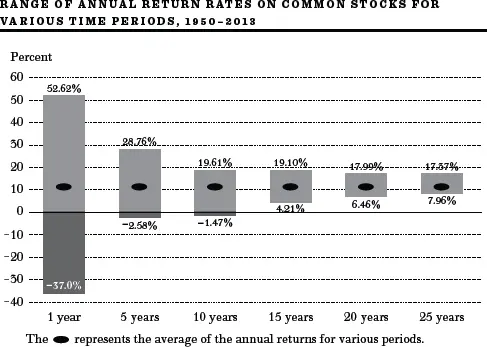
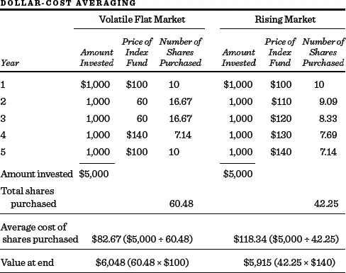
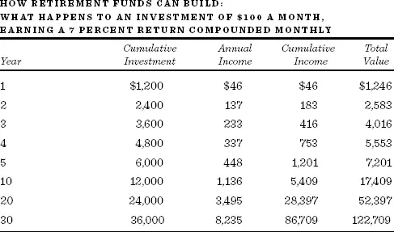
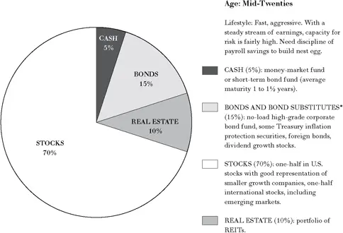
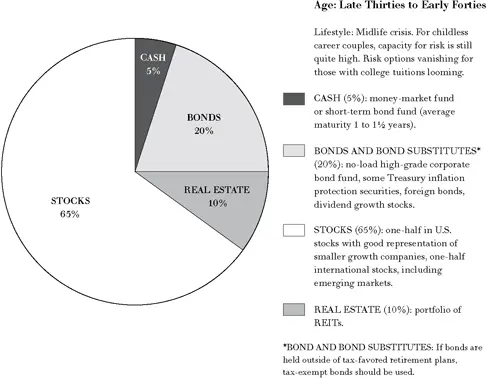
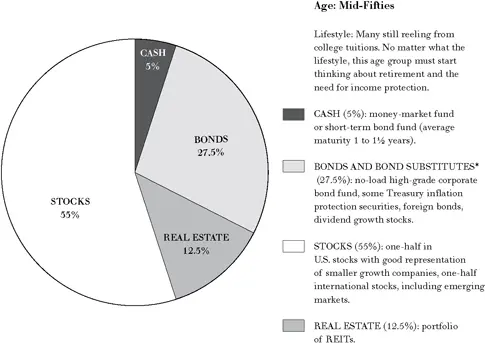
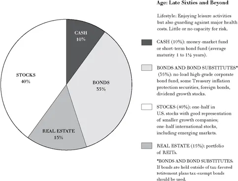

# 生命周期投资指南


人的一生中有两个时刻不该投机：一个是他负担不起的时候，另一个是他负担得起的时候。\
Mark Twain，《环游赤道》


投资策略需要与个人的生命周期相匹配。一个三十四岁的人和一个六十八岁的人为退休而储蓄，应当使用不同的金融工具来实现各自的目标。三十四岁的人——刚刚步入薪资收入的黄金期——可以用工资来弥补增加风险所带来的损失。而六十八岁的人——很可能要依靠投资收入来补充或替代薪资收入——则无法承受亏损的风险。即便是同一种金融工具，对于不同的人而言也可能意味着不同的东西，这取决于各自的风险承受能力。虽然三十四岁和六十八岁的人都可能投资于定期存单（Certificate of Deposit），但年轻人这样做可能是因为对风险的态度性回避，而老年人这样做则是因为承受风险的能力下降了。在第一种情况下，一个人在承担多大风险方面拥有更多选择；在第二种情况下则不然。

你一生中可能做出的最重要的投资决策，涉及在人生不同阶段对资产类别（股票、债券、房地产、货币市场证券等）进行平衡配置。根据Roger Ibbotson毕生对不同投资组合回报的测量，投资者总回报中超过90%是由所选资产类别及其总体配置比例决定的。投资成功中不到10%的因素取决于个人所选择的具体股票或共同基金。在本章中，我将向你展示，无论你对风险的厌恶程度如何——无论你在"吃得好"与"睡得好"之间处于什么位置——你的年龄、就业收入以及具体的生活责任，都会在很大程度上帮助你确定投资组合中各类资产的配比。

## 资产配置五原则

在我们能够确定资产配置（Asset Allocation）决策的合理依据之前，必须牢记某些原则。我们在前面的章节中已经隐含地涉及了其中一些，但在这里明确地加以阐述将非常有益。关键原则如下：

1. 历史表明，风险与回报是相关的。

2. 投资普通股和债券的风险取决于投资的持有期限。投资者持有资产的时间越长，资产回报的可能波动就越小。

3. 定期定额投资法（Dollar-Cost Averaging）虽然存在争议，但可以作为降低股票和债券投资风险的有效手段。

4. 再平衡（Rebalancing）可以降低风险，在某些情况下还能提高投资回报。

5. 你必须区分自己对风险的态度和承受风险的能力。你能承担得起的风险取决于你的整体财务状况，包括投资收入之外的收入类型和来源。

### 1. 风险与回报是相关的

尽管你可能已经厌倦了听到"只有承担更大的风险才能获得更高的投资回报"这句话，但没有哪条教训在投资管理中比这更重要。这条金融学的基本法则得到了数百年历史数据的支持。下面的表格总结了前面介绍过的Ibbotson数据，清楚地说明了这一点。

**1926--2013年基本资产类别的年总回报**

| 证券 | 平均年回报率 | 风险指数（回报的年度波动率） |
|------|------------|--------------------------|
| 小公司普通股 | 12.3% | 32.3% |
| 大公司普通股 | 10.1 | 20.2 |
| 长期政府债券 | 6.0 | 8.4 |
| 美国国库券 | 3.5 | 3.1 |

数据来源：Ibbotson Associates。

普通股长期以来显然提供了非常丰厚的回报率。据估计，如果George Washington从他的第一笔总统薪水中仅拿出一美元投资于普通股，到2014年，他的继承人将不止一次成为百万富翁。Roger Ibbotson估计，自1790年以来，股票的复合年回报率超过8%。（如上表所示，自1926年以来的回报更加丰厚，大公司普通股的年回报率约为10%。）但这一回报是以投资者承担巨大风险为代价的。大约每十年中有三年的总回报是负的。因此，当你追求更高回报时，永远不要忘记这句话："天下没有免费的午餐。"更高的风险是获得更丰厚回报的代价。

### 2. 股票和债券投资中的实际风险取决于持有时间

你的"耐力"——持有投资的时间长短——在你从任何投资决策中承担的实际风险中扮演着关键角色。因此，你所处的生命周期阶段是决定资产配置的关键因素。让我们来看看为什么持有期限的长短在决定你的风险承受能力时如此重要。

我们在前面的表格中看到，长期政府债券在八十三年期间的年均回报率为6%。然而，风险指数表明，在任何单一年份中，这一回报率都可能远远偏离年度平均水平。实际上，在许多年份中它确实是负的。在二十一世纪头十年的早期，你可以购买利率为5¼%的二十年期美国国债，如果你持有恰好二十年，你将正好获得5¼%的回报。问题在于，如果你发现一年后必须卖出，你的回报率可能是20%、0%，或者如果利率急剧上升导致现有债券价格大幅下跌以适应新的更高利率，你甚至可能遭受重大损失。我想你能明白，你的年龄以及你能够坚持投资计划的可能性，决定了任何特定投资方案所涉及的风险程度。

那么投资普通股呢？投资股票的风险是否也会随持有时间的延长而降低？答案是肯定的，但需要加以限定。通过采取长期持有的策略并在顺境和逆境中坚持到底（即前面章节讨论的买入持有策略），普通股投资中相当一部分（但并非全部）风险是可以消除的。

第353页的图胜过千言万语，所以我可以简要说明。请注意，如果你在1950年至2013年期间持有一个多元化的股票投资组合（如标准普尔500指数），你平均将获得约10%的相当丰厚的回报。但结果的波动范围对于晚上难以入睡的投资者来说实在太宽了。某一年，典型股票投资组合的回报率超过52%，而另一年则是-37%。显然，在任何单一年份中获得适当回报率是无法保证的。一年期美国国债或一年期政府担保的定期存单才是为那些明年就需要用钱的人准备的投资品。

但请注意，如果你将普通股投资持有二十五年，情况会大不相同。虽然回报存在一定的波动性，取决于具体所处的二十五年时间段，但这种波动并不大。平均而言，涵盖本图中所有二十五年期的投资产生了略高于10%的回报率。即使你恰好在1950年以来最糟糕的二十五年期间投资，这一长期预期回报率也仅下降了不到3个百分点。正是这一根本事实使得从生命周期的角度看待投资如此重要。*你能持有投资的时间越长，普通股在你的投资组合中所占的比重就应该越大。*一般来说，只有在你能将股票持有相对较长时间的情况下，你才能有把握获得普通股所提供的丰厚回报。[\*](#footnote-233-14)

在二十年或三十年的投资期限内，股票通常是明显的赢家，如下表所示。这些数据进一步支持了年轻人应该将更大比例的资产配置于股票而非债券的建议。

**股票跑赢债券的概率（自1802年以来股票回报超过债券回报的时期百分比）**

| 投资期限 | 股票跑赢债券的时期百分比 |
|---------|----------------------|
| 1年 | 60.2 |
| 2年 | 64.7 |
| 5年 | 69.5 |
| 10年 | 79.7 |
| 20年 | 91.3 |
| 30年 | 99.4 |

我并不是说股票在长期持有中没有风险。当然，你持有股票的时间越长，投资组合最终价值的波动性确实越大。而且我们知道，投资者曾经历过普通股在数十年间总体回报接近于零的时期。但对于那些持有期限可以达到二十五年甚至更长的投资者，尤其是那些进行股息再投资、甚至通过定期定额投资法不断增加持仓的投资者，普通股很可能提供比安全债券甚至更安全的政府担保储蓄账户更高的回报。

最后，投资者随年龄增长而趋于保守的最重要原因，可能是他们未来的有偿工作年限越来越短。因此，如果股市出现一段负回报时期，他们不能指望薪资收入来维持生活。股市的下跌可能直接影响个人的生活水平，而债券更稳定的——即使更小的——回报则代表着更为审慎的投资立场。因此，股票在他们的资产中所占比例应该更小。

### 3. 定期定额投资法可以降低股票和债券投资的风险

如果你像大多数人一样，将通过每年储蓄的逐步积累来建立投资组合，那么你将受益于定期定额投资法（Dollar-Cost Averaging）。这一方法虽然存在争议，但它确实能帮助你避免在错误时机将所有资金投入股市或债市的风险。

不要被这个听起来花哨的名字吓到。定期定额投资法只是指定期——比如每月或每季度——以固定金额投资于某种指数共同基金的份额。在普通股上进行等额的定期投资，可以降低（但不能完全避免）权益投资的风险，确保不会在价格暂时虚高时买入整个股票投资组合。

第356页的表格假设每年投资$1,000。在第一种情景中，市场在投资计划开始后立即下跌；然后大幅上涨，最后再次下跌，在第五年回到了起点。在第二种情景中，市场持续上涨，最终上涨了40%。虽然两种情况中都恰好投资了$5,000，但在波动市场中的投资者最终获得了$6,048——获得了$1,048的不错回报——尽管股市最终回到了起点。而在市场每年都上涨、最终比起点高出40%的情景中，投资者的最终资产仅为$5,915。

Warren Buffett对这一投资原则给出了清晰的论述。在他发表的一篇文章中，他说：

一个简短的测验：如果你打算一辈子吃汉堡却不是牛肉生产商，你希望牛肉价格更高还是更低？同样，如果你不时要买车却不是汽车制造商，你希望车价更高还是更低？这些问题的答案不言自明。

但现在是期末考试了：如果你预计在未来五年内是一个净储蓄者，你希望在此期间股市更高还是更低？许多投资者在这个问题上犯了错。尽管他们在未来许多年都将是股票的净买入者，但当股价上涨时他们兴高采烈，当股价下跌时他们垂头丧气。实际上，他们因为即将购买的"汉堡"涨价了而欢呼雀跃。这种反应毫无道理。只有那些在不久的将来打算卖出股票的人才应该为看到股价上涨而高兴。潜在的买家应该更喜欢价格下跌。

定期定额投资法并非消除普通股投资风险的万灵药。它无法在2008年那样的年份保护你的401(k)计划免遭毁灭性的价值下跌，因为没有任何计划能保护你免受残酷熊市的打击。而且你必须有足够的现金和信心来继续进行定期投资，即使在最黑暗的时刻。无论金融新闻多么可怕，无论多么难以看到任何乐观迹象，你都绝不能中断计划的自动执行。因为如果你这样做了，你就失去了在市场大幅下跌后以低价买入部分份额的好处。定期定额投资法会给你这样的优惠：你的每股平均买入价格将低于你实际买入的平均价格。为什么？因为你低价时买得多，高价时买得少。

一些投资顾问并不推崇定期定额投资法，因为如果市场确实直线上涨，这种策略并不是最优的。（你本来可以一开始就将全部$5,000投入市场。）但它确实为应对未来的糟糕股市提供了一份合理的保险。而且如果你不幸在2000年3月或2007年10月等市场高点时期将所有资金投入股市，它确实能将不可避免的遗憾降到最低。为了进一步说明定期定额投资法的好处，让我们从假设转入一个真实的例子。下表显示了1978年1月1日初始投资$500，此后每月投资$100于Vanguard 500指数共同基金份额的结果（不考虑税收）。投入计划的总资金不到$44,000，最终价值超过$480,000。

**Vanguard 500指数基金定期定额投资示例**

| 截至12月31日的年度 | 累计投资总成本 | 所获份额总价值 |
|-------------------|---------------|---------------|
| 1978 | $1,600 | $1,669 |
| 1979 | 2,800 | 3,274 |
| 1980 | 4,000 | 5,755 |
| 1981 | 5,200 | 6,630 |
| 1982 | 6,400 | 9,487 |
| 1983 | 7,600 | 12,783 |
| 1984 | 8,800 | 14,864 |
| 1985 | 10,000 | 20,905 |
| 1986 | 11,200 | 25,935 |
| 1987 | 12,400 | 28,222 |
| 1988 | 13,600 | 34,080 |
| 1989 | 14,800 | 46,127 |
| 1990 | 16,000 | 45,804 |
| 1991 | 17,200 | 61,010 |
| 1992 | 18,400 | 66,818 |
| 1993 | 19,600 | 74,688 |
| 1994 | 20,800 | 76,780 |
| 1995 | 22,000 | 106,945 |
| 1996 | 23,200 | 132,769 |
| 1997 | 24,400 | 178,219 |
| 1998 | 25,600 | 230,621 |
| 1999 | 26,800 | 280,567 |
| 2000 | 28,000 | 256,274 |
| 2001 | 29,200 | 226,624 |
| 2002 | 30,400 | 177,505 |
| 2003 | 31,600 | 229,526 |
| 2004 | 32,800 | 255,481 |
| 2005 | 34,000 | 268,935 |
| 2006 | 35,200 | 312,320 |
| 2007 | 36,400 | 330,353 |
| 2008 | 37,600 | 208,942 |
| 2009 | 38,800 | 265,758 |
| 2010 | 40,000 | 306,758 |
| 2011 | 41,200 | 313,984 |
| 2012 | 42,400 | 364,935 |
| 2013 | 43,600 | 483,747 |

当然，没有人能保证下一个四十五年会提供与过去相同的回报。但该表确实说明了坚持执行定期定额投资计划可能带来的巨大潜在收益。但请记住，由于普通股价格存在长期上涨趋势，如果你需要一次性投资大笔资金（如遗产），这种方法并不一定适合。

如果可能的话，保留一小部分储备金（放在货币基金中），以便利用市场下跌的机会，在市场大幅下跌时多买一些份额。我绝不是建议你去预测市场。不过，在市场暴跌之后通常是一个不错的买入时机。正如希望和贪婪有时会自我强化形成投机泡沫一样，悲观和绝望也会相互作用引发市场恐慌。最严重的市场恐慌与最病态的投机泡沫一样毫无根据。对于整个股市（而非个股）来说，牛顿定律始终以反向运作：跌下去的总会涨回来。

### 4. 再平衡可以降低投资风险并可能提高回报

一种非常简单的投资技术——再平衡（Rebalancing）——可以降低投资风险，在某些情况下甚至能提高投资回报。这种方法就是将你配置在不同资产类别（如股票和债券）上的资产比例恢复到适合你的年龄以及你对风险的态度和承受能力的水平。假设你决定你的投资组合应该由60%的股票和40%的债券组成，并在投资计划开始时按此比例在这两类资产之间分配资金。但一年后你发现股票大幅上涨而债券价格下跌，投资组合变成了70%的股票和30%的债券。70-30的配比看起来比最适合你风险承受能力的配置风险更大。再平衡技术要求卖出部分股票（或股票型共同基金），买入债券，将配置恢复到60-40。

下表显示了截至2013年12月的二十年间再平衡策略的结果。每年（不超过一次）将资产配置恢复到60-40的初始配比。投资标的为低成本指数基金。表格显示，再平衡策略显著降低了投资组合市值的波动性。此外，再平衡还提高了投资组合的年均回报率。未经再平衡的投资组合在此期间的回报率为8.14%。再平衡使年回报率提高到8.41%，且波动性更低。

**再平衡的重要性，1996年1月--2013年12月**

在此期间，每年再平衡的投资组合提供了更低的波动性和更高的回报

| 投资组合 | 平均年回报 | 风险[\*](#fn14_1)（波动性） |
|---------|----------|---------------------------|
| 60% Russell 3000/40% Barclays综合债券：每年再平衡[†](#fn14_2) | 8.41 | 11.55 |
| 60% Russell 3000/40% Barclays综合债券：从不再平衡[†](#fn14_2) | 8.14 | 13.26 |

[\*](#fn14-1)回报率的标准差。

[†](#fn14-2)股票以Russell 3000全市场基金代表。债券以Barclays综合债券市场基金代表。（不考虑税收。）

什么样的魔法让在每年年底执行再平衡策略的投资者提高了回报率？回想一下这段时间股市发生了什么。到1999年底，股市经历了史无前例的泡沫，股票价值飙升。执行再平衡的投资者并不知道市场顶部即将到来，但她确实看到投资组合中股票部分已经远超她60%的目标。因此，她卖出足够的股票（买入足够的债券）以恢复原始配比。然后，在2002年底，大约处于股市熊市的底部（而债券市场经历了强劲的正回报后），她发现股票份额远低于60%，债券份额远高于40%，于是她再平衡买入了股票。同样，在2008年底，当股票暴跌、债券上涨时，她卖出了债券买入了股票。我们都希望能有一个小精灵可靠地告诉我们"低买高卖"。系统性的再平衡是我们所能找到的最接近的替代品。

### 5. 区分你对风险的态度和承受风险的能力

正如我在本章开头提到的，适合你的投资类型在很大程度上取决于你非投资来源的收入。你在投资之外的赚钱能力，即你承受风险的能力，通常与你的年龄相关。以下三个例子将帮助你理解这一概念。

Mildred G.是一位六十四岁的新近丧偶女士。她因日益严重的关节炎被迫放弃了注册护士的工作。她在伊利诺伊州Homewood的普通住房仍有抵押贷款。虽然贷款利率相对较低，但月供相当可观。除了每月的社保支票外，Mildred的全部生活来源就是她作为受益人的一份$250,000保险单的收益，以及她已故丈夫积累的$50,000小型成长股投资组合。

显然，Mildred的财务状况严重制约了她承受风险的能力。她既没有足够的预期寿命，也没有体力在投资组合之外赚取收入。此外，她还有大量的固定抵押贷款支出。她没有能力弥补投资组合的损失。她需要一个能产生可观收入的安全投资组合。债券和高股息股票，如房地产投资信托（REIT）指数基金，是适合她的投资类型。小型成长型公司的高风险股票（通常是不派息的）——无论其价格多么诱人——都不适合出现在Mildred的投资组合中。

Tiffany B.是一位雄心勃勃的二十六岁单身女性，最近完成了斯坦福大学商学院的MBA课程，进入了美国银行的培训项目。她刚从祖母的遗产中继承了$50,000。她的目标是建立一个可观的投资组合，以便将来购房以及作为退休储备金。

对于Tiffany，可以放心推荐一个激进的投资组合。她有足够的预期寿命和赚钱能力来维持生活水平，即使面临任何财务损失。虽然她的个性将决定她愿意承担的确切风险水平，但显然Tiffany的投资组合应该处于风险-回报谱系的远端。Mildred的小型成长股投资组合对Tiffany来说远比对一位无法工作的六十四岁寡妇更合适。

在本书第九版中，我举了Carl P.的例子，他是密歇根州庞蒂亚克通用汽车工厂的一名四十三岁工头，年收入超过$70,000。他的妻子Joan通过销售雅芳产品每年收入$12,500。P家有四个孩子，年龄从六岁到十五岁。Carl和Joan希望所有孩子都能上大学。他们意识到私立大学可能超出他们的承受能力，但希望在优秀的密歇根州立大学体系内接受教育是可行的。幸运的是，Carl一直通过通用汽车的工资储蓄计划定期储蓄，但他选择了该计划下购买通用汽车股票的选项。他积累了价值$219,000的通用汽车股票。他没有其他资产，但在一套普通住房中有相当可观的权益，只剩下少量抵押贷款待还。

我曾建议Carl和Joan的投资组合存在严重问题。他们的收入和投资都与通用汽车绑定在一起。任何导致通用汽车普通股大幅下跌的不利发展都可能毁掉投资组合的价值和Carl的生计。事实证明确实如此。通用汽车于2009年申请破产。Carl失去了工作和投资组合。这并非个例。请记住许多安然（Enron）员工的惨痛教训，当公司倒闭时，他们不仅失去了工作，还失去了在安然股票中的所有积蓄。绝不要在投资组合中承担与你主要收入来源相同的风险。

## 量身定制生命周期投资计划的三条准则

铺垫已毕，接下来的内容将呈现一份生命周期投资指南。我们将在这里讨论一些对大多数人在不同人生阶段都有用的通用规则。下一节我将把它们总结为一份投资指南。当然，没有哪份指南能适用于每一个个案。任何行动方案都需要根据个人情况进行一些调整。本节回顾三条宽泛的准则，将帮助你根据自身具体情况量身定制投资计划。

### 1. 特定需求需要特定资产来匹配

永远记住：特定需求必须由专门用于该需求的特定资产来满足。考虑一对二十多岁的年轻夫妇正在努力建立退休储备金。后面的投资指南中的建议当然适合实现这些长期目标。但如果这对夫妇预计明年需要$30,000的首付来购房，这笔$30,000的特定需求资金应该投资于安全的证券，在需要用钱时到期，比如一年期定期存单。同样，如果三、四、五和六年后需要支付大学学费，资金可以投资于相应期限的零息债券或不同的定期存单。

### 2. 认识你的风险承受能力

迄今为止，对一般准则的最大个人调整涉及你自身对风险的态度。正因如此，成功的金融规划更像是一门艺术而非科学。通用准则对于确定个人资金应如何在不同资产类别之间分配极有帮助。但任何推荐的资产配置是否适合你，关键在于你晚上能否安睡。风险承受能力是任何金融规划的重要方面，只有你自己才能评估自己对风险的态度。你可以从以下事实中获得一些安慰：投资普通股和长期债券所涉及的风险会随着你积累和持有投资的时间延长而降低。但你必须有足够的心理素质来承受投资组合价值的大幅短期波动。2008年市场下跌近50%时你感觉如何？如果你恐慌了、甚至因为大部分资产投资于普通股而身体不适，那么显然你应该削减投资组合中的股票比例。因此，主观因素在你能接受的资产配置中也起着重要作用，你可以根据自身对风险的厌恶程度合理地偏离本书的建议。

### 3. 坚持定期储蓄，无论金额多小

在介绍资产配置指南之前还有一个最后的预备问题。如果你目前没有任何资产可以配置，该怎么办？许多资金有限的人认为积累大量退休储备金是不可能的。积累可观的退休储蓄似乎遥不可及。不要绝望。事实上，一个坚持执行的每周定期储蓄计划——比如通过工资储蓄计划或401(k)退休计划——最终能够产生可观的金额。你每周能存下$23吗？或者$11.50？如果你能做到，只要你还有多年的工作年限，最终积累一大笔退休基金是完全可以实现的。

下表显示了每月定期储蓄$100的结果。假设投资利率为7%。表格的最后一列显示了在不同时间段内累积的总价值。[†](#footnote-233-15)很明显，即使开始时没有任何储备金，定期储蓄适度的金额也能完全实现积累可观资金的目标。如果你能在开始时投入几千美元，最终金额将显著增加。

如果你每月只能存$50——大约每周$11.50——请将表格中的数字减半；如果你每月能存$200，则将数字加倍。选择免佣金共同基金来积累你的退休储备金，因为小额直接投资的成本可能高得令人望而却步。此外，共同基金允许利息、股息和资本利得的自动再投资，正如表格中所假设的那样。最后，一定要检查你的雇主是否有配套储蓄计划。显然，如果通过公司赞助的退休计划储蓄，你能够获得公司配套缴款和税收减免，你的储备金增长将快得多。

## 生命周期投资指南

第368-69页的图表总结了生命周期投资指南。在《塔木德》（Talmud）中，Rabbi Isaac曾说一个人应该始终将财富分为三等份：三分之一用于土地，三分之一用于商品（生意），三分之一留作手头现金（流动形式）。这样的资产配置并非不合理，但我们可以改进这一古老的建议，因为我们拥有更精细的工具，并且对不同资产配置适合不同人群的考量因素有了更深入的理解。建议背后的基本理念已在上文详述。对于二十多岁的人，推荐非常激进的投资组合。在这个年龄，你有充裕的时间来度过投资周期的高峰和低谷，而且你一生的就业收入就在前方。投资组合不仅重仓普通股，还包括相当比例的国际股票，包括风险更高的新兴市场股票。正如[第8章](ch08.md)所述，国际分散化的一个重要优势是降低风险。此外，国际分散化使投资者即使在全球市场日益紧密相关的情况下，也能获得世界上其他增长领域的投资机会。

随着投资者年龄增长，他们应该开始减少风险较高的投资，增加债券和债券替代品（如股息增长股票）的配置比例。同时增加对派发丰厚股息的房地产投资信托（REIT）的配置。到五十五岁时，投资者应该开始考虑向退休过渡，将投资组合转向收入产出。债券和债券替代品的比例增加，股票组合变得更加保守、注重收入而减少增长导向。退休后，推荐大量配置各类债券和债券替代品的投资组合。过去常用的经验法则是投资组合中债券的比例应等于一个人的年龄。然而，即使在六十多岁后期，我仍建议将40%的资产配置于普通股，15%配置于房地产权益（REIT），以获得一定的收入增长来应对通胀。事实上，由于自1980年代我首次提出这些资产配置以来预期寿命显著增加，我已经相应提高了股票的比例。

对于大多数人，我建议从广泛的全市场指数基金开始构建投资组合，而不是个股。我这样做有两个原因。首先，大多数人没有足够的资金来建立适当分散化的投资组合。其次，我认识到大多数年轻人不会有大量资产，他们将通过月度投资逐步积累投资组合。这使得共同基金几乎成为必需品。随着资产增长，美国股票市场基金应辅以包含快速增长的新兴市场股票在内的国际全市场股票（指数）基金。你不必使用我建议的指数基金，但一定要确保你购买的共同基金确实是"免佣金"且低成本的。你还会看到我在建议中明确包含了房地产。我之前说过每个人都应该努力拥有自己的住房。我相信每个人都应该持有大量的房地产资产，你权益资产的一部分应该投资于[第12章](ch12.md)描述的房地产投资信托（REIT）指数共同基金。关于债券持仓，该指南建议持有应税债券。但如果你处于最高税率等级，且居住在纽约等高税收州，你的债券又持有在退休计划之外，我建议你使用免税货币基金和专门针对你所在州的债券基金，这样可以同时免除联邦和州的税收。

### 生命周期基金

你是否想避免随着年龄增长调整投资组合以及每年根据各类资产配置比例的市场波动进行再平衡的麻烦？二十一世纪初开发了一种新型产品，专门面向那些想要建立计划后就不再操心的投资者。它叫做"生命周期基金"（Life-Cycle Fund），它会自动进行再平衡，并随着你的年龄增长转向更安全的资产配置。生命周期基金对于IRA、401(k)和其他退休计划非常有用。

你通过选择预期退休日期来挑选适合的生命周期基金。例如，假设你2015年四十岁，计划在七十岁退休，那么你应该购买一只"目标到期日2045"的生命周期基金。后续缴款可以继续投入同一只基金。该基金将每年进行再平衡，股票配比将随时间变得更加保守。Vanguard、Fidelity、American Century和T. Rowe Price等主要共同基金公司都提供生命周期基金。关于不同到期日和资产配置的详细信息可以在各公司网站上找到。当债券收益率极低时，我倾向于选择更激进的生命周期基金——即初始配置中股票比例更大的基金。对于那些寻求最简便的退休资金管理方式的人来说，生命周期基金的自动执行功能是一个用户友好的特点。但在注册之前，请查看费用表。低费用意味着你口袋里有更多钱来享受更舒适的退休生活。

## 退休后的投资管理

每天有一万多名婴儿潮一代（Baby Boomers）达到六十五岁，这一趋势将持续到2030年。根据美国人口普查局的数据，超过一百万的婴儿潮一代将活到一百岁以上。典型的六十五岁人群的平均预期寿命约为二十年。而且一半的退休人员将活得超过平均预期寿命。然而，大多数婴儿潮一代没有遵循本书的建议，未能为退休进行充分储蓄。我们一直是一个消费而非储蓄的国家。考虑到联邦预算的长期状况，我们不能指望政府来拯救我们。

### 退休准备不足

根据美联储理事会进行的一项消费者财务调查，典型的美国家庭银行存款很少，信用卡债务却相当多。只有一半的美国人拥有任何形式的退休账户，而在财富最底层四分之一的美国人中，只有11%拥有储蓄/退休计划。虽然较年长的美国人（五十五到六十四岁之间）平均拥有$308,000的退休储蓄，但这个金额不足以替代退休后超过15%的家庭收入。情况不容乐观。对于许多美国人来说，黄金岁月可能会极其艰难。希望避免贫困生活的临近退休的婴儿潮一代只有两个现实的选择。他们可以开始认真储蓄。或者，他们可以击败概率早早离世。正如Henny Youngman常说的："如果我四点前就死了，我就有了我永远需要的所有钱。"

对于发现自己处于我所描述的情况的读者，我没有简单的答案。你别无选择，只能在退休期间继续工作，控制开支并尽可能多储蓄。但即使对你来说也有光明的一面。多亏了互联网，许多兼职工作可以在家完成。而且退休后工作对心理和健康都有益处。那些做一些工作的人有更好的自我价值感和归属感，而且也更健康。事实上，我建议每个人都应该尽可能推迟退休，并推迟领取社保金直到法定退休年龄，以最大化年度福利。只有那些健康状况极差、预期寿命很短的人，我才会建议在最早可以开始领取的年龄就开始领取福利。

## 投资退休储备金

如果你有足够的远见为退休储蓄，什么样的投资策略能帮助确保你的钱和你活得一样长呢？有两种基本选择。首先，你可以将全部或部分退休储备金年金化（Annuitize）。其次，退休者可以继续持有投资组合，并设定一个提款率，在确保舒适退休的同时尽量降低"人还在钱没了"的风险。如何在这两种选择之间做出决定？

### 年金

Sturgeon定律由科幻作家Theodore Sturgeon提出，它指出"你听到或读到的95%的东西都是垃圾。"这在投资世界中当然是对的，但我真诚地相信你在这里读到的内容属于另外5%。至于关于年金的建议，我怀疑错误信息的比例更接近99%。你友好的年金推销员会告诉你年金是解决退休投资问题的唯一合理方案。但许多金融顾问可能会说，"别买年金：你会赔光所有钱。"投资者该如何理解如此截然相反的建议？

让我们首先搞清楚年金是什么，并描述它的两种基本类型。年金通常被称为"长寿保险"。年金是与保险公司签订的合同，投资者支付一笔钱以保证获得一系列定期付款，这些付款将持续到年金持有人（Annuitant）去世为止。例如，2014年中期，一份$1,000,000的固定终身年金保费可以为一位六十五岁男性购买约$68,000的年均收入流。如果一对六十五岁的夫妇退休并选择联合和遗属选项（Joint and Survivor Option，即只要夫妻中任何一人在世就继续付款），一百万美元将提供每年约$59,000的固定付款。

当然，任何通胀都会使这些付款的购买力随时间推移而下降。因此，许多人更喜欢购买"变额年金"（Variable Annuities）。变额年金提供付款随时间增加的可能性，具体取决于年金持有人选择的投资资产类型（通常是共同基金）。如果年金持有人选择了普通股，如果股市表现良好，付款将随时间增加，但如果股市下跌，付款也会减少。年金还可以购买有保证付款期限的品种。二十年的保证期限意味着即使你在购买年金后立即去世，你的继承人也将收到二十年的付款。当然，年金持有人将为此保证付出代价，接受每年付款金额的大幅削减。对于七十岁的男性，削减幅度可能超过20%。因此，如果你真的因为过早去世且一无所留的可能性而感到困扰，最好减少退休储备金中用于购买年金的比例。

变额年金提供了解决通胀风险的一种方法。另一种选择是带有明确通胀调整因子的年金。例如，Vanguard集团提供一种年金，明确按消费者价格指数（Consumer Price Index）进行调整，每年最高可达10%。这样的保证自然会大幅降低初始付款金额。一对选择联合和遗属选项的六十五岁夫妇会发现，$1,000,000只能提供约$42,000的初始年付款。

年金相比自己投资退休储备金有一个重大优势。年金保证你不会"人还在钱没了"。如果你身体很好，活到了九十多岁，是保险公司承担了它支付给你的金额远超你原始本金加投资收益的风险。风险厌恶型投资者当然应该考虑在退休时将部分甚至全部积累的储蓄投入年金合同。

那么年金的缺点是什么呢？有四个可能的缺点。年金化与遗赠动机不一致，它给年金持有人一条不灵活的消费路径，它可能涉及高昂的交易成本，而且在税务上可能效率低下。

**1. 留下遗赠的愿望。**假设一位退休者已经积累了大量的储备金，可以靠投资的股息和利息舒适地生活。虽然年金化可以提供更多的年收入，但当年金持有人去世时将没有剩余的钱留给遗赠。许多人有强烈的愿望能够为子女、亲属或慈善机构留下一些资金。完全年金化与此类遗赠动机不一致。

**2. 消费的灵活性。**假设一对夫妇六十五岁时健康退休，购买了一份只要夫妻中任何一方在世就每年支付固定金额的年金。这种"联合寿险"（Joint Life）年金是夫妇构建退休生活的常见方式。但在与保险公司签订合同后不久，夫妻双方都得知自己患上了无法治愈的疾病，极有可能大幅缩短各自的寿命。这对夫妇可能合理地想要去实现他们一直梦想的环球旅行。如果情况发生变化，年金化无法提供任何改变消费路径的灵活性。

**3. 年金可能成本高昂。**许多年金，特别是由保险代理人销售的年金，可能成本非常高。购买者不仅要支付保险公司的费用和开支，还要支付销售代理人的佣金。因此，一些年金可能是非常糟糕的投资。

**4. 年金在税务上可能效率低下。**虽然固定年金在税收递延方面相对于债券有一些优势，但变额年金将本可享受优惠税率的资本利得转化为适用更高税率的普通收入。此外，退休账户资产的部分年金化并不能抵消你必须领取的最低法定分配额（Required Minimum Distributions，RMDs）。如果你将50%的IRA年金化，你仍然需要对另一半进行最低法定分配。如果你的支出至少达到这个总金额，这就不是问题；但如果你没有，则存在税务效率低下的问题。

那么聪明的投资者应该怎么做？以下是我的规则：部分年金化通常是合理的。这是确保你不会"人还在钱没了"的唯一无风险方式。像Vanguard这样的信誉良好的公司提供低成本、无销售佣金的年金。为了在年金方面做出明智的决策，你应该在网上进行比较购物，例如访问http://www.valic.com。你会发现不同提供商的利率差异很大。

### 自主投资法

许多退休者宁愿至少保留对部分退休储备金的控制权。让我们假设资产按照第369页底部饼图所示进行投资，即略多于一半投资于权益资产，其余投资于产生收入的投资。既然你已经准备好为退休生活费用动用储备金，如果你想确保你的钱和你活得一样长，你能花多少？我在之前的版本中建议你使用"4%方案"。[‡](#footnote-233-16)

根据"4%方案"，你每年的支出不应超过储备金总价值的4%。按这个比率，即使你活到一百岁，你用完钱的概率也很小。而且你很可能还能给继承人留下与你退休储备金总额具有相同购买力的钱。根据4%规则，你需要$450,000的储蓄来产生每月$1,500或每年$18,000的退休收入。

为什么只有4%？多元化股票和债券投资组合在未来几年很可能产生超过4%的回报。但将提取率限制在较低水平有两个原因。首先，你需要让你的月度付款随时间以通胀率增长。其次，你需要确保能够度过股市在某些时期不可避免遭受的数年熊市。

让我们首先看看4%这个数字的来源。我们在第346页提到，股票的长期年回报率可能约为7%。包含债券替代品的多元化债券投资组合可能产生约4%的回报。因此我们可以预计，一个半股半债的平衡投资组合每年应产生约5½%的回报。现在假设长期通胀率为1½%。这意味着投资基金的本金必须每年增长1½%以保持购买力。因此，在典型年份中，投资者将花费基金的4%，而储备金将增长1½%。下一年的支出也可以增长1½%，这样退休者仍然能够购买相同的一篮子商品。通过花费低于投资组合总回报的金额，退休者可以保持投资基金及其年收入的购买力。一般规则是：首先估计投资基金的回报率，然后减去通胀率来确定可持续的支出水平。如果通胀率可能为每年2%，那么3½%的支出率将更为合适。

将支出率设定在基金估计回报率以下还有第二个原因。股票和债券的实际回报年际差异很大。股票回报可能平均为7%，但有些年份回报更高，而有些年份可能为负。假设你在六十五岁退休，随后遭遇了像2008和2009年那样严重的熊市，当时股票下跌了约50%。如果你每年提取7%，你的储蓄可能在不到十年内就耗尽了。但如果你只提取3½%或4%，即使你活到一百岁也不太可能用完钱。保守的支出率最大化了你永远不会用完钱的机会。所以如果你还没有退休，认真考虑尽可能多储蓄，以便日后即使采用保守的提取率也能舒适生活。

关于退休规则还需要补充三点脚注。首先，为了平滑随时间的提款，不要仅仅在每年年初按照投资组合价值的3½%或4%来支出。由于市场波动，你的年度支出将极不均匀且不可靠。我的建议是从退休基金的3½%或4%开始支出，然后让提取金额每年增长1½%或2%。这将平滑你在退休期间的收入水平。

其次，你会发现债券的利息收入和股票的股息很可能低于你希望从基金中提取的3½%或4%。因此你需要决定首先动用哪些资产。你应该从相对于目标资产配比超配的部分中卖出。假设股市大幅反弹，原本50-50的投资组合变得不平衡，变成了60%的股票和40%的债券。虽然你可能很高兴股票表现良好，但你应该关注投资组合变得风险更大了。从投资组合的股票部分取出你需要的额外资金，同时调整资产配置并产生所需收入。即使你不需要从投资组合中提取生活收入，我仍然建议每年对投资组合进行再平衡，使投资组合的风险水平与你的风险承受能力保持一致。

第三，制定一个动用资产的策略，以便尽可能推迟缴纳所得税。当你开始从IRA和401(k)中领取联邦规定的最低法定分配额时，你需要优先使用这些资金，然后才能动用其他账户。在应税账户中，你已经在为投资产生的股息、利息和已实现资本利得缴税。因此，你当然应该接下来花这些钱（或者如果你还没有达到七十岁半的强制提款年龄，甚至可以最先花这些钱）。然后花额外的税收递延资产。如果你的遗赠对象是你的继承人，最后花Roth IRA资产。这些账户没有强制提款要求，你可以免税将资产传给继承人。

没有人能保证我所建议的规则能让你避免"人还在钱没了"。而且根据你的健康状况和其他收入与资产，你很可能需要朝某个方向修改我的规则。如果你发现自己八十岁时每年提取4%且投资组合还在增长，那么要么你深信医学科学终于发现了不老泉，要么你应该考虑松松钱袋子了。

[\*](#footnote-233-14-backlink)严格来说，更长的持有期限能降低风险这一发现依赖于[第11章](ch11.md)描述的均值回归（Reversion-to-the-Mean）现象。感兴趣的读者可以参阅Paul Samuelson的文章"The Judgment of Economic Science on Rational Portfolio Management"，发表于*Journal of Portfolio Management*（1989年秋季刊）。

[†](#footnote-233-15-backlink)我假设储蓄可以存入IRA或其他税收优惠的储蓄工具中，因此忽略了利息收入的所得税。

[‡](#footnote-233-16-backlink)在本书第九版中，我建议了4½%规则，因为当时的债券收益率远高于2014年。事实上，考虑到利率如此之低，3½%规则将给退休者更大的保障，确保他们不会"人还在钱没了"。
