# 华尔街的三大步

年收入二十英镑，\
年支出十九先令六便士，结果是幸福。\

年收入二十英镑，年支出二十英镑又六便士，结果是悲惨。\
Charles Dickens，《大卫·科波菲尔》


本章提供购买股票的规则，以及你可以用来执行[第14章](ch14.md)提出的资产配置指南的具体工具建议。到现在为止，你已经就税务、住房、保险以及如何充分利用现金储备做出了明智的决策。你审视了自己的目标、所处的生命周期阶段以及对风险的态度，并决定了将多少资产投入股市。现在是时候在三一教堂快速祈祷一下，然后大胆向前迈步，同时非常小心地避开两边的墓地。我的规则可以帮助你避免代价高昂的错误和不必要的销售费用，还能在不过度冒险的情况下稍微提高你的收益。我无法提供什么惊天动地的建议，但我确实知道，你的资产收益率哪怕只提高1%或2%，往往就是悲惨与幸福之间的差别。

你如何开始购买股票呢？基本上有三种方式。我称它们为"无脑一步"、"自选一步"和"替身一步"。

在第一种情况下，你只需购买各种广泛的指数基金或指数ETF（Exchange-Traded Fund），这些基金旨在跟踪构成你投资组合的不同类别股票。这种方法还有一个优点，就是绝对简单。即使你边走路边嚼口香糖都有困难，你也能掌握它。市场实际上在推着你走。对于大多数投资者，特别是那些偏好轻松、低风险投资解决方案的人，我建议向市场智慧低头，使用国内和国际指数基金构建完整的投资组合。然而，对于所有投资者，我建议投资组合的核心——特别是退休部分——应投资于指数基金或ETF。

在第二种体系下，你沿着华尔街慢跑，挑选你自己的股票，也许还会超配某些行业或国家。这需要做功课，但也可能很有趣。我不建议大多数投资者采用这种方法。然而，如果你更喜欢这种投资方式，我提供了一系列规则来帮助你稍微提高成功概率。

第三种方式是你坐在路缘上，选择一位专业的投资经理替你走华尔街。资金有限的投资者实现这一点的唯一途径是购买主动管理型共同基金（Managed Mutual Funds）。我并不偏好主动管理型基金，但在本章后面，如果你坚持选择这一方案，我至少会提出一些可能帮助你选择较好基金的建议。

本书早期版本描述了一种我称为"马尔基尔步"（Malkiel Step）的策略：以低于基金所持股票价值的折价购买封闭式投资公司（Closed-End Fund）的份额。当本书第一版出版时，美国股票的折价高达40%。如今折价已大大缩小，因为这些基金的定价更加高效。但有吸引力的折价仍然可能出现，特别是在国际基金和市政债券基金上，精明的投资者有时可以利用这一机会。马尔基尔步将在本章后面描述。

## 无脑一步：投资指数基金

标准普尔500指数（Standard & Poor's 500-Stock Index）是一个综合指数，代表了美国所有上市公司普通股价值的大约四分之三，长期来看击败了大多数专家。购买该指数中所有公司的股票组合将是拥有股票的一种简便方式。早在1973年（本书第一版），我就提出小投资者迫切需要一种采用这种方法的工具：

我们需要的是一只免佣金、最低管理费的共同基金，它只购买构成广泛股票市场平均指数的数百只股票，而不试图在证券之间切换以捕捉赢家。每当任何共同基金的表现低于平均水平时，基金发言人总会迅速指出："你不能买指数。"现在公众可以了。

本书出版后不久，"指数基金"的理念流行起来。资本主义的一大优点是，当某种产品有需求时，通常会有人找到生产它的意愿。1976年，一只允许公众参与的共同基金诞生了。Vanguard 500指数信托基金按照与标准普尔500指数中各股票权重相同的比例购买了这500只股票。每位投资者按比例分享基金投资组合的股息以及资本利得和损失。如今，多家共同基金公司都提供标准普尔500指数基金，费用比率约为资产的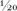，远低于大多数主动管理型共同基金或银行信托部门的费用。你现在可以方便且低成本地购买市场。你还可以购买由State Street Global Advisors、BlackRock和Vanguard提供的交易所交易标准普尔500指数基金。

这一策略背后的逻辑就是有效市场假说（Efficient Market Hypothesis）的逻辑。但即使市场不是有效的，指数化投资仍然是一种非常有用的投资策略。由于市场中的所有股票必须由某人持有，因此市场中所有投资者平均而言将获得市场回报。指数基金以最小的费用实现了市场回报。平均主动管理型基金的费用比率约为每年1%。因此，即使市场不是有效的，平均主动管理型基金也必然跑不赢整体市场，其差距恰好等于从总回报中扣除的费用金额。

标准普尔500指数相对于共同基金和主要机构投资者的优异长期表现，已经通过本书前面章节描述的大量研究得到证实。是的，有例外。但你可以用手指头数出击败指数基金的共同基金数量，而且没有一家是显著领先的。

### 指数基金方案：总结

现在让我们总结一下使用指数基金作为主要投资工具的优势。指数基金的回报率定期超过主动管理者。这种超额表现有两个根本原因：管理费和交易成本。公共指数基金和交易所交易基金的费率仅为甚至更低。主动管理的公共共同基金每年收取平均1个百分点的管理费用。此外，指数基金仅在必要时交易，而主动型基金的换手率通常接近100%。按照非常保守的交易成本估计，这种换手率无疑是对表现的额外拖累。即使股票市场并非完全有效，主动管理作为一个整体也无法实现超过市场的总回报。因此，主动管理者平均而言必然跑输指数，其差距恰好等于这些费用和交易成本的劣势。不幸的是，主动管理者作为一个群体不可能像广播名人Garrison Keillor笔下虚构的家乡Wobegon湖那样——"所有孩子都高于平均水平"。

指数基金在税务上也较为友好。指数基金允许投资者推迟实现资本利得，如果份额后来被遗赠，甚至可以完全避免。只要股票价格的长期上涨趋势持续，在证券之间切换就会涉及实现应税的资本利得。税收是一个极其重要的财务考量，因为过早实现资本利得将大幅降低净回报。指数基金不在证券之间切换，因此倾向于避免资本利得税。

指数基金也相对可预测。当你购买一只主动管理型基金时，你永远无法确定它相对于同类基金的表现如何。当你购买指数基金时，你可以合理地确信它将跟踪其指数，并且很可能会轻松击败平均水平的管理者。此外，指数基金始终是全额投资的。你不应该相信主动管理者的说法，声称她的基金能在正确的时机转为持有现金。我们已经看到择时交易（Market Timing）行不通。最后，指数基金更容易评估。现在市场上有5,000多只股票共同基金，没有可靠的方法来预测哪些基金未来可能跑赢。而指数基金让你确切知道你买到了什么，投资过程变得极其简单。

"一跃跳过高楼固然不错，但你能跑赢标准普尔500指数吗？"\
© 2002 Thomas Cheney：经许可转载。

尽管有所有相反的证据，假设一位投资者仍然相信卓越的投资管理确实存在。两个问题依然存在：首先，这种能力显然非常稀少；其次，在能力得到验证之前，似乎没有有效的方法来发现它。正如我在[第7章](ch07.md)指出的，一个时期表现最好的基金在下一个时期并非最佳。1990年代的顶尖基金在二十一世纪头十年的回报惨不忍睹。Paul Samuelson用以下寓言总结了这一困境。假设证据表明二十个酒徒中有一个可以学会成为适度的社交饮酒者。有经验的临床医生会回答："即使是真的，也要当它是假的，因为你永远无法找出那二十分之一，而且在尝试的过程中，二十个人中会有五个被毁掉。"Samuelson的结论是，投资者应该放弃在这大海捞针般的巨大干草堆中寻找微小针尖的努力。

机构投资者之间的股票交易就像等长运动：消耗了大量精力，但在投资管理者之间一切相互抵消，而管理者产生的交易成本则拖累了回报。就像赛狗场上的灰狗一样，专业的基金经理似乎注定要输给机械兔子。难怪许多机构投资者，包括Intel、Exxon、Ford、American Telephone and Telegraph、哈佛大学、大学退休权益基金（College Retirement Equity Fund）和纽约州教师协会，已经将大量资产投入指数基金。到2014年，大约三分之一的投资基金已被"指数化"。

你呢？当你购买指数基金时，你放弃了在高尔夫俱乐部吹嘘通过挑选股市赢家获得惊人收益的机会。广泛的分散化排除了相对于整个市场的巨额亏损。但同样，按照定义，也排除了非凡的收益。因此，许多华尔街批评者将指数基金投资称为"保证平庸"（Guaranteed Mediocrity）。但经验明确表明，指数基金购买者很可能获得超过典型基金经理的回报，后者的高额咨询费和大量的投资组合换手往往降低了投资收益。许多人会发现，每轮比赛都保证以平手参与股市游戏这一保证非常有吸引力。当然，这种策略并不排除风险：如果市场下跌，你的投资组合保证会跟着跌。

指数投资方法对小投资者还有其他吸引力。它使你只需少量投资就能获得非常广泛的分散化。它还能降低经纪费用。指数基金通过汇集众多投资者的资金，以更大的规模交易，并支付最低的交易费用。指数基金完成了收取所有持股股息的全部工作，并每季度给你寄一张支票，涵盖你所有的收益（顺便说一句，如果你愿意，这些收益可以再投资于基金）。简言之，指数基金是一种明智、实用的方法，可以以绝对不费力和最小的成本获得市场回报率。

### 更广泛的指数化定义

指数化策略是我自1973年第一版以来就推荐的——甚至在指数基金诞生之前。这显然是一颗时机已到的明星。迄今为止最受欢迎的指数是标准普尔500指数，它很好地代表了美国市场的主要大公司。但现在，虽然我仍然推荐指数化或所谓的被动投资（Passive Investing），但对过于狭窄的指数化定义存在合理的批评。许多人错误地将指数化等同于简单购买标准普尔500指数的策略。这不再是唯一的选择。标准普尔500指数遗漏了数千家在经济中最具活力的小公司。因此我相信，如果投资者只购买一只美国指数基金，最好的、应效仿的广泛美国指数是Russell 3000、Wilshire 5000全市场指数（Total Market Index）、CRSP指数或MSCI美国广义市场指数（Broad Market Index）——而非标准普尔500。

八十年的市场历史证实，总体而言，小公司的股票往往跑赢大公司的股票。例如，从1926年到2014年，小公司股票投资组合的年回报率约为12%，而大公司股票（如标准普尔500中的股票）的回报率约为10%。虽然小公司股票比主要蓝筹股风险更大，但重点是，一个充分分散化的小公司投资组合很可能产生更高的回报。因此，我倾向于投资一个包含更广泛的美国公司代表性——包括大量可能处于增长周期早期阶段的小型活力公司——的指数。

请记住，标准普尔500指数代表了所有美国流通普通股市值的75%到80%。剩余的20%到25%的总市值由数千家公司在许多情况下是新兴成长型公司组成，它们提供更高的投资回报（同时也带来更高的风险）。Wilshire 5000指数包含所有美国上市的普通股。Russell 3000和MSCI指数包含除市场上最小（且流动性差得多的）股票之外的所有股票。现在有许多共同基金基于这些更广泛的指数。这些指数基金通常以"全市场股票组合"（Total Stock Market Portfolio）的名称出现。虽然过去的业绩永远不能保证未来的结果，但证据清楚地表明，全市场指数基金提供了高于平均股票共同基金管理者的回报。

而且，与慈善不同，指数化不需要从本土开始（和结束）。正如我在[第8章](ch08.md)中所论证的，投资者可以通过国际分散化、在投资组合中加入房地产等资产类别，以及将部分投资组合配置于债券和类债券证券（包括通胀保值国债，Treasury Inflation-Protection Securities）来降低风险。这是现代投资组合理论（Modern Portfolio Theory）的基本要义。因此，投资者不应该只购买美国股票市场指数基金而不持有其他证券。但这不是反对指数化的理由，因为目前存在追踪各种国际指数的指数基金，如摩根士丹利资本国际（MSCI）的欧洲、澳大利亚和远东（EAFE）证券指数，以及MSCI新兴市场指数。此外，还有持有房地产投资信托（REITs）的指数基金。最后，全市场债券指数基金可以追踪Barclays综合债券市场指数。而且，所有这些指数基金也往往跑赢投资于类似证券的主动管理型基金。

投资者犯的最大错误之一是未能获得足够的国际分散化。美国仅占全球经济的大约三分之一。诚然，美国全市场股票基金确实提供了一定的全球分散化，因为许多美国跨国公司如General Electric和Coca-Cola有大量海外业务。但世界上的新兴市场（如中国、印度和巴西）的增长速度一直远快于发达经济体。例如，中国仍被视为新兴市场。但它现在是世界第二大经济体，国际货币基金组织（International Monetary Fund）预计它将继续作为全球增长最快的大经济体，并在二十一世纪第二个十年在规模上超越美国。因此，在下面的建议中，你会注意到我建议每个投资组合的相当一部分应投资于新兴市场。

新兴市场很可能在整个二十一世纪保持高增长率。新兴市场的人口通常比发达国家年轻。人口较年轻的经济体往往增长更快。此外，到2014年底，它们的估值比美国更具吸引力。我们已经指出，周期调整市盈率（Cyclically Adjusted P/E Ratio，CAPE）在预测发达市场的长期股票回报方面具有可预测性。下表显示同样的关系在新兴市场也成立。2014年末新兴市场的CAPE低于15。当股票能在这些估值水平买入时，未来的长期回报往往相当丰厚。

**新兴市场的CAPE与未来回报（2005--2014年）**

| CAPE | 未来5年年化股票回报 |
|------|---------------------|
| 10--15 | 13% |
| 15--20 | 11% |
| 20--25 | 7% |
| 25--30 | 1% |
| 30--40 | --3% |

指数化在新兴市场也是一种极其有效的策略。下图表明，绝大多数主动管理的新兴市场股票基金被MSCI新兴市场指数击败。即使新兴市场不如发达市场有效，进入和交易的成本也很高。主动管理型基金的费用比率远高于发达市场。此外，新兴市场的流动性更低，交易成本更高。因此，在扣除所有费用后，指数化被证明是一种出色的投资策略。

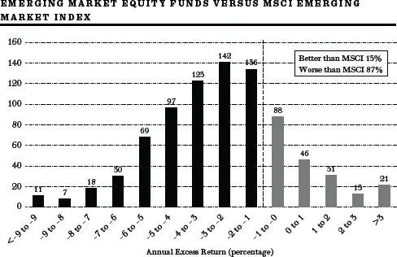

截至2013年12月31日的十年（扣费后净额，包含存活偏差）。

数据来源：Morningstar。

### 具体的指数基金投资组合

第389页的表格列出了投资者可以用来构建投资组合的具体指数基金选择。该表显示了为五十五岁左右人群——我称之为"老龄婴儿潮一代"（Aging Boomers）——推荐的配置比例。不在五十五岁左右的人可以使用完全相同的选择，只需将权重调整为适合其特定年龄组的数值。还要记住，你可能需要根据个人的风险承受能力和态度对百分比进行一定调整。那些愿意接受稍多风险以追求更高回报的人可以增加权益资产的比例。那些需要稳定收入用于生活开支的人可以增加房地产权益和股息增长股票的持仓，因为它们提供稍多的当前收入。

**老龄婴儿潮一代的具体指数基金投资组合**

| 配置类别 | 比例 | 具体基金 |
|---------|------|---------|
| **现金**[\*](#fn15-1) | 5% | Fidelity Money Market Fund (FXLXX) 或 Vanguard Prime Money Market Fund (VMMXX) |
| **债券和债券替代品**[†](#fn15-2) | 27½% | 7½% 美国Vanguard中期债券基金 (VICSX) 或 iShares公司债券ETF (LQD) |
| | | 7½% Vanguard新兴市场政府债券基金 (VGAVX) |
| | | 12½% Wisdom Tree股息增长基金 (DGRW) 或 Vanguard股息增长基金 (VDIGX) |
| **房地产权益** | 12½% | Vanguard REIT指数基金 (VGSIX) 或 Fidelity Spartan REIT指数基金 (FRXIX) |
| **股票** | 55% | 27% 美国股票：Schwab全市场指数基金 (SWTSX) 或 Vanguard全市场指数基金 (VTSMX) |
| | | 14% 发达国际市场：Schwab国际指数基金 (SWISX) 或 Vanguard国际指数基金 (VTMGX) |
| | | 14% 新兴国际市场：Vanguard新兴市场指数基金 (VEIEX) 或 Fidelity Spartan新兴市场指数基金 (FFMAX) |

[\*](#fn15_1)可以用短期债券基金替代所列的货币市场基金之一。

[†](#fn15_2)虽然不符合指数基金投资组合的范畴，但投资者可以考虑将部分美国债券投资组合配置于通胀保值国债。股息增长和公司债券基金也是例外，因为它们不是标准指数基金。

还要记住，我在此假设你将大部分甚至全部证券持有在税收优惠的退休计划中。所有债券当然应该持有在这样的账户中。如果债券持有在退休账户之外，你可能更倾向于免税债券而非应税证券。此外，如果你的普通股将持有在应税账户中，你可以考虑税务管理型指数基金（Tax-Managed Index Funds）。最后请注意，我为你提供了来自不同共同基金公司的指数基金选择。由于我与Vanguard集团的长期关系，我还想推荐一些非Vanguard的基金。所有列出的基金都有适度的费用比率且免佣金。有关这些基金的更多信息，包括电话号码和网站，可以在本章后面的《随机漫步者通讯录》中找到。ETF可以替代共同基金使用。

### ETF与税收

被动投资组合管理（即简单地买入并持有指数基金）的一大优势，如上所述，是这种策略最大限度地降低了交易成本和税收。税收是一个极其重要的财务考量，正如斯坦福大学两位经济学家Joel Dickson和John Shoven所证明的那样。他们利用六十二只有长期记录的共同基金样本发现，税前1962年投资的$1到1992年将增长到$21.89。然而，在支付了收入股息和资本利得分配的税款后，高收入投资者投入共同基金的那$1仅增长到$9.87。

在相当程度上，指数共同基金有助于解决税务问题。由于它们不在证券之间切换，它们倾向于避免资本利得税。然而，即使是指数基金也会实现一些资本利得，持有者需要为此纳税。这些收益通常是被动产生的，要么是因为指数中某家公司被收购，要么是因为共同基金被迫出售证券——当共同基金的份额持有人决定赎回份额，而基金必须出售证券以筹集现金时就会发生这种情况。因此，即使是常规指数基金也不是最小化税务负担的完美解决方案。

交易所交易指数基金（ETF），如"蜘蛛"（Spiders，一只标准普尔500基金）和"毒蛇"（Vipers，一只全市场股票基金），比常规指数基金更具税务效率，因为它们能够进行"实物赎回"（In-Kind Redemption）。实物赎回通过交付低成本股票来满足赎回请求。这对基金来说不是应税交易，因此无需实现必须分配给基金其他持有人的收益。此外，赎回的ETF份额持有人按其原始购买成本缴税——而非按基金交付的那篮子股票的成本。ETF还恰好拥有极低的费用，有时甚至低于同类共同基金。不仅有各种各样的美国股票ETF，国际股票ETF也是如此。ETF是将大笔资金分配到指数基金的绝佳工具。

然而，ETF需要支付交易成本，包括经纪佣金[\*](#footnote-233-17)和买卖价差（Bid-Asked Spread）。免佣金的指数共同基金将更适合那些打算随着时间推移逐步积累指数份额的小额投资者。我建议你抵制在一天中任何时刻买卖ETF以及用保证金购买此类基金的诱惑。我同意Vanguard集团创始人John Bogle的说法："投资者交易ETF时是在割自己的喉咙。"如果你受到这种诱惑，就学学Little Miss Muffet，远远地避开蜘蛛及其同类吧。

在第392页的表格中，我列出了可以用来构建投资组合的ETF。请注意，对于希望让股票购买尽可能简单的投资者，有全市场指数基金和ETF可以一站式提供完全的国际分散化。

**交易所交易基金（ETF）**

| 类别 | 基金名称 | 代码 | 费用比率 |
|------|---------|------|---------|
| **美国全市场股票** | Vanguard Total Stock Market | VTI | 0.05% |
| | iShares Russell 3000 | IWV | 0.20% |
| **发达市场（EAFE）** | Vanguard Europe Pacific | VEA | 0.09% |
| | iShares MSCI EAFE | EFA | 0.35% |
| **新兴市场** | Vanguard Emerging Markets | VWO | 0.15% |
| | iShares MSCI Emerging Markets | EEM | 0.67% |
| **全球除美国** | Vanguard FTSE All World (EX U.S.) | VEU | 0.15% |
| | SPDR MSCI ACWI (EX U.S.) | CWI | 0.34% |
| **全球含美国** | Vanguard Total World | VT | 0.18% |
| | iShares MSCI ACWI | ACWI | 0.34% |
| **美国债券市场[\*](#fn15_3)** | Vanguard Intermediate-Term Corporate Bond | VCIT | 0.12% |
| | iShares Investment Grade Corporate Bond | LQD | 0.15% |

[\*](#fn15-3)应税投资者应考虑第405页列出的封闭式市政债券基金。

如果你想找到一种简单、久经考验的方法来获得卓越的投资成果，你可以到此为止了。我列出的指数共同基金或ETF将提供广泛的分散化、税务效率和低成本。即使你想购买个股，也要做机构投资者越来越多在做的事情：按照建议的方式将投资组合的核心指数化，然后用额外资金进行主动押注。有了强大的指数基金核心，你可以比全部投资组合都由主动管理的情况下以更低的风险进行这些押注。而且即使你犯了一些错误，也不会是致命的。

## 自选一步：可能有用的选股规则

指数化是我最强烈推荐给个人和机构的策略。不过我确实认识到，将整个投资组合指数化可能被许多人视为非常乏味的策略。那些有投机天性的人无疑更愿意用自己的步伐（和才智）来挑选赢家，至少用他们投资资金的一部分。对于那些坚持自己玩这个游戏的人，自选一步可能很有吸引力。

自幼就染上了赌博冲动，我完全理解为什么许多投资者有强迫性地想自己挑选大赢家，而对一个只承诺相当于市场整体回报的系统毫无兴趣。问题在于，自己动手需要做大量功课，而且持续的赢家非常稀少。然而，对于那些把投资当游戏的人来说，本节展示了合理的策略如何可能产生可观的回报，至少在玩选股游戏时将风险降到最低。

然而，在实施我的策略之前，你需要了解投资信息的来源。大多数信息来源可以在公共图书馆获取。你应该热衷阅读日报的财经版面，特别是*New York Times*和*Wall Street Journal*。像*Barron's*这样的周刊也应该列入你的"必读"清单。*Bloomberg Businessweek*、*Fortune*和*Forbes*等商业杂志对于接触投资理念也很有价值。主要的投资咨询服务机构也不错。例如，你应该设法获取Standard & Poor's的*Outlook*和Value Line的*Investment Survey*。前者是包含推荐买入股票的周刊；后者提供所有主要证券的历史记录、当前评论和风险（贝塔，Beta）评级。最后，大量的信息，包括证券分析师的推荐，都可以在互联网上获取。

在四十多年前的*A Random Walk Down Wall Street*第一版中，我提出了成功选股的四条规则。我发现它们在今天依然适用。以下是这些规则的精简形式，其中一些在前面的章节中已经提到：

**规则1：将股票购买限定在那些看起来能够至少维持五年高于平均盈利增长的公司。**尽管这项工作可能很困难，但挑选盈利增长的股票正是游戏的核心。持续增长不仅增加公司的盈利和股息，还可能增加市场愿意为这些盈利支付的倍数。因此，购买一家盈利开始快速增长的股票，有可能获得双重好处——盈利和倍数都可能增长。

**规则2：永远不要为一只股票支付超过其合理价值基础所能证明的价格。**虽然我确信你永远无法准确判断一只股票的内在价值（Intrinsic Value），但我确实认为你可以大致判断一只股票是否定价合理。市盈率（Price-Earnings Multiple）是一个好的起点：购买以与该比率持平或不高于该比率太多的价格出售的股票。寻找那些市场尚未通过大幅溢价推高其市盈率的成长机会。如果成长确实发生，你通常会获得双重奖励——盈利和市盈率都可能上升。要警惕那些市盈率极高、多年增长已反映在其价格中的股票。如果盈利不增反降，你可能遭受双重打击——市盈率将随盈利一同下降。遵循这条规则本可以避免投资者在2000年初以天文数字般的市盈率购买顶级高科技成长股所遭受的巨大损失。

请注意，虽然相似，但这并不是简单地再次认可"买入低市盈率股票"的策略。根据我的规则，购买市盈率略高于市场平均水平的股票是完全没问题的——只要该公司的增长前景远高于平均水平。你可以称之为调整后的低市盈率策略。有人称之为GARP（Growth At A Reasonable Price，合理价格增长）策略。购买相对于其增长前景而言市盈率较低的股票。如果你在挑选确实享有高于平均水平增长的公司方面能有相当的准确性，你将获得高于平均水平的回报。

**规则3：购买那些拥有预期增长故事的股票，投资者可以据此空中楼阁。**我在[第2章](ch02.md)中强调了心理因素在股价决定中的重要性。个人和机构投资者不是计算合理市盈率然后输出买卖决策的计算机。他们是感性的人——受贪婪、赌博本能、希望和恐惧驱动做出股市决策。这就是为什么成功的投资既需要智力敏锐也需要心理敏锐。当然，市场也并非完全主观；如果一个正的增长率似乎已经确立，该股票几乎肯定会发展出某种追随者。但股票就像人——有些比其他的更有吸引力，如果一只股票的故事从未流行，其市盈率的提升可能较小。成功的关键是在其他投资者到达之前几个月就到达那里。所以问问你自己，关于你所持股票的故事是否可能引起大众的兴趣。这个故事能产生有感染力的梦想吗？这是一个投资者可以在其上构建空中楼阁的故事——但却是真正建立在坚实基础之上的空中楼阁？

**规则4：尽可能少交易。**我同意华尔街的格言"骑赢卖输"（Ride the Winners and Sell the Losers），但不是因为我相信技术分析（Technical Analysis）。频繁切换除了补贴你的经纪商和增加你实现收益时的税负之外毫无用处。我不是说"永远不要卖出有盈利的股票"。导致你买入该股票的情况可能发生变化，特别是当市场处于"郁金香狂热"时期时，你许多成功的成长股可能在投资组合中超配了，就像1999-2000年互联网泡沫时期那样。但很难识别合适的卖出时机，而且可能涉及沉重的税务成本。我自己的理念是尽可能减少交易。不过，我对亏损者毫不留情。除少数例外，我在每个日历年年底前卖出所有亏损的股票。选择这个时间是因为亏损在税务上是可扣除的（在一定金额内），或者可以抵消你已经实现的收益。因此，确认亏损可以降低你的税单。如果我预期的增长开始实现，并且我确信我的股票最终会好转，我可能会持有亏损的仓位。但我不建议在亏损情况下过于耐心，特别是当立即行动能产生即时税务收益时。

有效市场理论（Efficient-Market Theory）警告说，即使遵循这些合理的规则也不太可能带来卓越的表现。非专业投资者面临许多不利因素。盈利报告并不总是可信的。而且一旦一个故事出现在常规媒体上，市场很可能已经反映了这些信息。挑选个股就像培育纯种豪猪。你不断研究、研究、做出决定，然后非常小心地推进。归根结底，尽管我希望投资者遵循我的好建议取得了成功记录，但我非常清楚选股游戏中的赢家可能主要得益于幸运女神。

尽管存在种种危险，挑选个股仍然是一项迷人的游戏。我相信，我的规则确实能在保护你免受高市盈率股票过度风险的同时，将概率向你倾斜。但如果你选择这条路，请记住大量的其他投资者——包括专业人士——也在试图玩同样的游戏。任何人持续跑赢市场的概率都非常低。然而，对我们许多人来说，试图比市场更聪明是一个太有趣而无法放弃的游戏。即使你确信自己不会比平均水平更好，我确信你们中大多数有投机天性的人仍然想继续玩选股游戏，至少用你投资的一部分资金。我的规则允许你以显著限制风险敞口的方式来这样做。

如果你确实想自己选股，我强烈建议采用混合策略：将投资组合的核心指数化，用你能承受更大风险的资金尝试选股游戏。如果你退休资金的大部分已广泛指数化，你的股票与债券和房地产进行了分散化，你就可以放心地尝试一些个股，知道你的基本储备金是相当安全的。

即使你所有的投资都使用指数基金，你也可以选择调整投资组合各组成部分的权重以试图提高回报。我在自己指数化投资组合中做的一项调整是超配中国，相对于其在世界指数基准中的权重。我这样做是因为我认为中国的权重相对于其经济重要性被定得过低。中国股市的某些特殊性导致中国在新兴市场指数基金和全球总指数中都被低配。

大多数指数采用"自由流通量"加权（Float Weighted）。如果一家公司的部分股票不能自由交易，它们在该公司的指数权重中就不被计入。自由流通量加权意味着中国被低配有两个原因。首先，在上海和深圳当地中国股市交易的股票都不被计入，因为这些股票仅对中国公民开放（只有极少数例外）。只有在香港或纽约上市的中国公司的可自由交易股票才被计入指数。中国被低配的第二个原因是，中国政府拥有许多公司股份的巨大比例，而这些股份不计入自由流通量。结果，中国在世界指数中只获得了约2%的权重，而按购买力平价调整后，中国的GDP约占世界GDP的13%且增长迅速。

因此我相信，投资者需要在投资组合中配置比一般世界或新兴市场指数基金更多的中国资产。然而，我忠于我的指数化信仰，认为最好的方式是购买一个包含广泛中国公司的指数基金。在纽约证券交易所交易的有三只：YAO（代表所有可供国际投资者投资的中国公司的指数基金）、HAO（包含更多创业公司和政府持股较少公司的中小盘指数基金）和TAO（一只中国房地产基金）。

## 替身一步：聘请专业的华尔街漫步者

在你的投资漫步中有一种更简单的赌博方式：不试图挑选个股赢家，而是挑选最好的教练（投资管理者）。这些"教练"以主动管理型共同基金（Actively Managed Mutual Fund）经理的形式出现，有成千上万可供你选择。

在本书的早期版本中，我提供了几位享有长期成功投资组合管理记录的投资经理的名字，以及解释他们投资风格的简要传记。这些经理是极少数表现出长期跑赢市场能力的人之一。我在当前版本中放弃了这一做法，有两个原因。

首先，除了Warren Buffett之外，这些经理现在都已从主动投资组合管理中退休，而Buffett本人在2014年也已远超退休年龄。其次，我越来越确信，共同基金经理的过往记录对于预测未来成功基本上毫无价值。少数持续卓越表现的例子出现的频率并不高于偶然预期的频率。

假设你偏好投资主动管理型的股票共同基金，真的有可能选择一只顶尖表现的基金吗？一种被许多金融规划师和编辑推崇的方法是选择近期业绩记录最好的基金。报纸和杂志的财经版面充斥着基金广告，声称某只基金在业绩上排名第一。这种方法至少有两个问题。首先，许多基金广告相当具有误导性。排名第一通常是在自选的特定时间段内，与特定（通常是小型的）一组普通股基金进行比较。例如，一只基金自夸："现排名业绩第一。经历了繁荣、萧条和11次总统大选仍然表现卓越的基金。"暗示这只基金在四十四年期间一直名列前茅。但事实的真相——在一个星号脚注中被揭露——是这只基金仅在一个特定的三个月期间排名第一，且仅与资产价值在$250万至$500万之间的特定类别基金相比较。

对过往业绩记录持怀疑态度的更重要原因是，正如我之前提到的，一个时期的表现与下一个时期的投资结果之间没有一致的长期关系。我对共同基金业绩的持续性进行了四十多年的研究，结论是投资者通过购买近期记录最佳的基金来保证自己获得高于平均水平的回报，这根本是不可能的。虽然有少数例子（如Buffett的Berkshire Hathaway）表现出相当一致的长期优异表现，但总体结果是不存在可靠的长期持续性。你不能通过购买可能在某个过去时期跑赢市场的共同基金来确保卓越表现。再次强调，过去不能预测未来。

我测试了一种策略，即在每年年初投资者根据过去十二个月的记录对所有股票型基金进行排名。在不同的策略中，我假设投资者买入前十名、前二十名等基金。通过购买过去表现最好的共同基金来持续跑赢市场是不可能的。

我还测试了购买主要金融杂志排名"最佳"基金的策略。这些在基金业绩实验室中的测试，以及本书第二部分报告的学术研究，清楚地表明你不能指望一个优秀记录在未来持续保持。事实上，往往是一个时期的热门基金变成了下一个时期的差生。

## 晨星共同基金信息服务

如果近期表现不是选择共同基金的可靠指标，那什么才是？我常说，共同基金行业发生的两件最好的事情是Jack Bogle在1970年代中期创立了低成本、消费者友好的Vanguard共同基金集团，以及Don Phillips在1990年代初发起了极其有用的晨星服务（Morningstar Service），该服务发布共同基金信息。

基本上，晨星是投资者能找到的最全面的共同基金信息来源之一。对于每只共同基金，它都发布一份充满相关数据的报告。其报告展示了过去的回报、风险评级、投资组合构成和基金的投资风格（例如，基金投资于成熟的大公司还是较小的成长型公司；偏好低市盈率的"价值"股票；购买外国还是国内股票，抑或两者兼有等）。报告说明基金是否有任何销售费用（佣金费率），并展示基金的年费用比率和未实现增值占基金资产净值的百分比。如果你购买主动管理型基金，你应该寻找免佣金、低换手率、低费用、未实现增值较少的基金，以最小化未来的税务负担。对于债券基金，晨星提供回报、有效到期日、持有债券质量以及佣金和费用的信息。

晨星服务还使用五星评级系统。它评估过去的业绩，同时考虑广泛市场回报以及获得这些回报所涉及的成本和风险。顶级基金获得五星——比米其林授予世界顶级餐厅的星级多两颗。这些星级在分类过去业绩方面很有用。然而，与米其林星级实际上保证食客获得指定品质的餐食不同，晨星评级并不保证投资者持续获得卓越表现。过去，五星基金的表现并不优于三星甚至一星基金。明智的投资者在做出适当投资决策时会超越星级来看待问题。

有什么方法可以选择一只可能成为高于平均水平表现的主动管理型基金吗？多年来我对共同基金回报进行了许多研究，试图解释为什么一些基金比其他基金表现更好。如前所述，过去的表现对未来回报的预测没有帮助。预测未来表现最有用的两个变量是费用比率和换手率。高费用和高换手率会压低回报——特别是当基金持有在应税账户中时的税后回报。表现最佳的主动管理型基金有适度的费用比率和低换手率。投资服务提供者收取的费用越低，投资者可获得的就越多。正如Vanguard集团的创始人Jack Bogle所说，在共同基金行业，"你得到的是你没有为之付费的东西。"我建议投资者永远不要购买费用比率超过50个基点（½%）且换手率超过50%的主动管理型基金。费用比率和换手率统计数据可以在基金网站和晨星等投资来源中找到。

## 马尔基尔步

正如本书前几版的读者所知，我喜欢在一家名为封闭式基金（Closed-End Fund）（正式名称为封闭式投资公司）的特殊投资基金的份额以有吸引力的折价出售时买入。封闭式基金与开放式共同基金（即前一节讨论的类型）不同，它们在首次发行后既不发行也不赎回份额。要买入或卖出份额，你必须通过经纪商。

份额的价格取决于其他投资者愿意支付的价格；然而，与开放式基金或ETF的份额不同，这个价格不一定与资产净值（Net Asset Value）相关。因此，封闭式基金可能以溢价（高于资产净值）或折价（低于资产净值）出售。在1970年代大部分时间和1980年代初，这些基金以远低于资产净值的大幅折价出售。封闭式基金聘请专业管理者，其费用不高于普通共同基金。因此对于那些相信专业投资管理的人来说，这是一种以折价购买的途径，我也是这样告诉我的读者的。

买入这些大幅折价的封闭式基金的好处在于，即使折价保持在高位，投资者仍然能从购买中获得非凡的回报。如果你能以25%的折价买入，你每投资$3就能获得$4的资产价值来赚取股息。因此，即使基金仅获得与市场相同的回报，正如随机漫步理论所预期的，你也能跑赢平均水平。

这就像拥有一个支付5%利息的$100储蓄账户。你存入$100，每年赚$5利息。只是这个储蓄账户可以打75折购买——换句话说，只需$75。你仍然获得$5利息（$100的5%），但由于你只花了$75购买这个账户，你的回报率是6.67%（5÷75）。请注意，这种收益率的提高完全不依赖于折价的缩小。即使你在兑现时只拿回$75，你在持有该账户期间仍然获得了额外回报的大额奖金。封闭式基金的折价提供了类似的红利。你获得了$1资产的股息份额，尽管你只付了75美分。

这一策略的效果甚至超出了预期。美国封闭式基金的折价已经显著缩小。虽然我在书中对封闭式基金的宣传可能帮助缩小了折价，但我认为缩小的根本原因是我们的资本市场相当有效。市场可能不时错误定价资产，造成暂时的无效率。但如果真的存在某个可以被市场发现并可靠利用的定价无效率领域，那么价值导向的投资者就会利用这些机会，从而消除它们。定价不规范确实可能存在甚至持续一段时间，但金融的引力法则最终会生效，真正价值终将显现。

在本版付印时，由于折价大多已经消失，大多数美国国内封闭式基金不再是特别有吸引力的投资机会。[†](#footnote-233-18)但一些国际基金、投资新兴市场的基金以及投资市政债券的基金仍然存在折价。以折价出售的多元化新兴市场封闭式基金投资组合是一种可行的——而且可能是更优的——替代新兴市场指数基金的选择。当折价达到10%或以上时，就是打开钱包投资封闭式基金的时候了。第404页的表格列出了几只封闭式新兴市场基金及其截至2014年中的折价。在你准备投资时检查折价是否大于10%。折价每周都在变化。

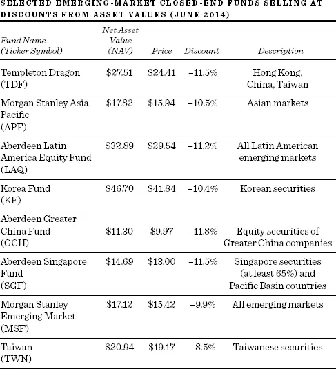

还有持有免税市政债券的封闭式基金。这些基金在投资者担心市政证券信用可靠性时往往以折价出售。对波多黎各债务和底特律破产的担忧导致所有州和地方政府证券价格下跌、收益率上升。这些担忧也导致封闭式市政债券基金价格下跌、折价扩大。2014年，许多此类基金以10%或更高的折价出售，为投资者提供了6%到7%的收益率。2014年常规长期市政债券基金的收益率在3½%到4%之间。

封闭式基金通过适度使用杠杆来提高收益率。它们以极低的短期利率借款来购买收益率更高的长期债券。这使它们的收益率高于不使用杠杆的债券共同基金。这不是免费午餐。杠杆增加了潜在的波动性，因此也增加了封闭式基金的风险。

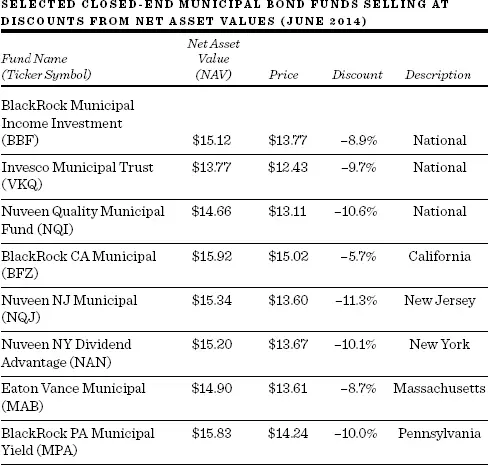

### 一个悖论

虽然一些新兴市场封闭式基金在2014年看起来很有吸引力，但持有美国股票的国内基金不再以早期那种超低价水平出售了。这说明了一个关于投资建议的重要悖论，以及真正价值最终会在市场中胜出的格言。关于特定证券投资建议的有用性存在一个根本性的悖论。如果建议传达到足够多的人并且他们据此行动，关于该建议的知识就会摧毁它的有用性。如果每个人都知道一个"好买卖"并且都冲进去买，这个"好买卖"的价格将上升到不再是一个好买卖为止。

这是有效市场理论所依据的主要逻辑支柱。如果信息传播畅通无阻，价格将迅速反应以反映所有已知信息。这促使我在1981年版中预测有利的折价不会一直存在。我写道："如果看到1980年代初水平的折价无限期延续下去，我会非常惊讶。"出于同样的原因，我对任何简单的流行投资技术会持续成功持怀疑态度。

我曾讲过一个金融教授和他的学生的故事，他们在街上发现了一张$100钞票。"如果那真是一张$100钞票，"教授推理道，"早就有人捡走了。"幸运的是，学生们不仅对华尔街专业人士持怀疑态度，对博学的教授也持怀疑态度，于是他们捡起了那张钱。

显然，金融教授的立场有相当大的逻辑性。在聪明人寻找价值的市场中，人们不太可能永远留下$100钞票等着人来捡。但历史告诉我们，未被利用的机会确实不时存在，投机性过度定价的时期也是如此。我们知道荷兰人为郁金香球茎支付了天文数字的价格，英国人为最不可能的泡沫挥霍无度，以及现代机构基金经理说服自己某些互联网股票如此与众不同以至于任何价格都是合理的。当投资者被悲观情绪压倒时，像封闭式基金这样的真正基本面投资机会也被忽视了。但最终，过度的估值被纠正了，投资者确实抢购了便宜的封闭式基金。也许金融教授的建议应该是："你最好快点捡起那张$100钞票，因为如果它真的在那里，别人肯定会捡走。"正是在这个意义上，我认为自己是一个随机漫步者。我确信真正价值终将显现，但偶尔出现异常现象并不让我惊讶。有时周围可能有一些$100钞票，我当然会中断我的随机漫步，弯腰捡起来。

## 投资顾问

如果你仔细遵循本书的建议，你实际上不需要投资顾问。除非你有各种税务复杂性或法律问题，你应该能够自行完成所需的分散化和再平衡。你甚至可能发现完全掌控自己的投资计划是件有趣的事。

投资顾问的问题在于他们往往相当昂贵，而且经常存在利益冲突。许多投资顾问每年收取你1%甚至更多的费用来管理你的投资事务。经纪商通常收费更高，每年收取你2%或3%的费用。我怀疑我们可能在一个低回报的个位数投资环境中持续一段时间，如此高的费用将严重损害你的净投资回报。

许多投资顾问还经常存在利益冲突。有些会把你放入某些给顾问额外回扣的基金。换句话说，顾问实际上收取的是向你分销基金的报酬。这些基金可能不符合你的利益（它们往往携带非常高的费用比率）。如果你觉得必须找一个投资顾问，请确保该顾问是"纯收费"（Fee Only）顾问。这些顾问不会因分销投资产品而获得报酬，因此更可能做出完全符合你利益而非他们自身利益的决定。

如果你觉得选择一套适当分散化的投资产品并按照本书建议随时间进行再平衡太费事，有一个低成本的替代方案。我在一开始就警告你，我所建议的服务中我是首席投资官（Chief Investment Officer），因此我想清楚地说明我自己的利益冲突。这家公司叫Wealthfront。它是最大且增长最快的自动化投资服务。一切都在线上完成。Wealthfront的特色是精选广泛分散化的交易所交易指数基金，选择标准是极低的成本。整体投资费率仅为每年¼%，且包含所有经纪费用。Wealthfront自动对投资组合进行再平衡，甚至提供税损收割（Tax Loss Harvesting）计划。如果你投资组合中分散化投资的某个ETF下跌了，Wealthfront会以亏损卖出并替换为一个类似但不相同的投资工具。因此，Wealthfront不会在年底给你带来可能相当大的税单（正如许多主动管理型基金所做的那样），而是实际上可以为你提供一些资本损失，用于抵消资本利得或资本利得分配，并且在一定限额内可以从你的税单中扣除。详情可通过www.wealthfront.com联系Wealthfront。

## 关于我们漫步之旅的最后思考

我们现在走到了漫步的终点。让我们回顾一下我们走过的地方。显然，持续跑赢平均水平的能力极其稀有。无论是对股票坚实价值基础的基本面分析（Fundamental Analysis），还是对市场空中楼阁倾向的技术分析，都无法可靠地产生卓越的结果。即使是专业人士在将他们的结果与飞镖选股法的结果相比时，也必须羞愧地低下头。

因此，个人的合理投资政策必须分两步制定。首先，理解可获得的风险-回报权衡，并根据你的性格和需求量身定制证券选择至关重要。第四部分为这一漫步环节提供了精心的指南，包括从税务管理到储备基金管理的各种热身练习，以及投资组合配置的生命周期指南。本章涵盖了我们在华尔街漫步的主要部分——购买普通股的三个重要步骤。我首先建议了与市场合理有效相一致的合理策略。指数化策略是我最强烈推荐的。至少每个投资组合的核心都应该指数化。然而我认识到，告诉大多数投资者没有希望跑赢平均水平就像告诉六岁孩子没有圣诞老人一样。这会让生活失去色彩。

对于那些不可救药地迷上了投机冲动、坚持挑选个股试图跑赢市场的投资者，我提供了四条规则。概率真的对你不利，但你可能恰好走运大赢。我也非常怀疑你能找到具有寻找市场上罕见$100钞票天赋的投资管理者。永远不要忘记，过去的记录远非未来表现的可靠指南。

投资有点像做爱。最终，它确实是一门需要某种天赋和一种叫做运气的神秘力量的艺术。事实上，对于极少数跑赢平均水平的人来说，运气可能承担99%的责任。正如La Rochefoucauld所写："虽然人们为自己的伟大行为自吹自擂，但它们与其说是伟大策划的结果，不如说是机遇的产物。"

投资游戏在另一个重要方面也像做爱。它太有趣了，无法放弃。如果你有识别好价值股票的天赋，以及识别能引起他人兴趣的故事的艺术，看到市场证明你是对的是一种很棒的感觉。即使你没那么幸运，我的规则也能帮助你限制风险，避免参与游戏时常伴随的许多痛苦。如果你知道你会赢或者至少不会输太多，而且你至少将投资组合的核心指数化，你将能够更满意地参与这个游戏。至少，我希望这本书让这个游戏变得更加愉快。

## 最终寄语

撰写本书十一个版本对我最有价值的一个方面，是我收到了许多感恩投资者的来信。他们告诉我，遵循四十多年来始终如一的简单建议让他们受益匪浅。那些永恒的课程包括广泛的分散化、年度再平衡、使用指数基金以及坚持到底。

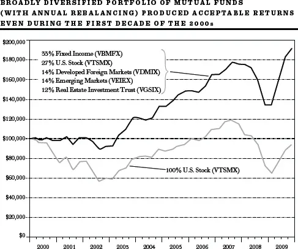

数据来源：Vanguard和Morningstar。

新千年的第一个十年是投资者最具挑战性的时期之一。即使是一只广泛分散化、仅投资美国股票的全市场股票基金也亏损了。但即使在这个可怕的十年里，遵循我所倡导的永恒课程也会产生令人满意的结果。上图显示，在"零零年代"的"失落十年"中，投资VTSMX（Vanguard全市场股票基金）并未产生正回报。但假设一位投资者按照我在第369页为"老龄婴儿潮一代"建议的大致保守百分比进行了分散化投资。这个分散化（每年再平衡的）投资组合即使在投资者经历过的最糟糕的十年之一中也产生了相当令人满意的回报。而且如果投资者还使用定期定额投资法持续增加小额投资，结果甚至更好。如果你遵循本书倡导的简单规则和永恒课程，即使在最艰难的时期，你也很可能表现良好。

[\*](#footnote-233-17-backlink)一些折扣经纪商提供ETF的免佣金交易。

[†](#footnote-233-18-backlink)事实上，当你按面值加约5%承销佣金购买一只新的封闭式基金时，你不仅承受了相当于高额佣金的费用，还面临着基金未来可能折价出售的风险。永远不要以首次发行价购买封闭式基金。这几乎无一例外地会是一个糟糕的交易。不过，值得检查一下未来在市场不稳定时折价是否会扩大。

## 随机漫步者通讯录——共同基金与ETF参考指南

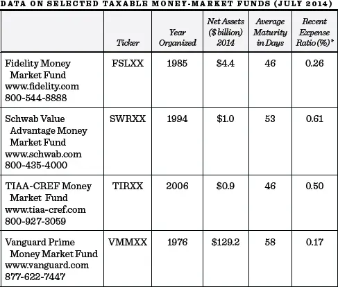

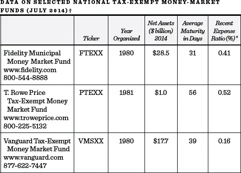

\*在利率极低的时期，费用比率已不适用。投资顾问自愿放弃了超出合同费用限制的费用，以维持基金的正净收益率。

† 同一基金发起人提供州免税基金。

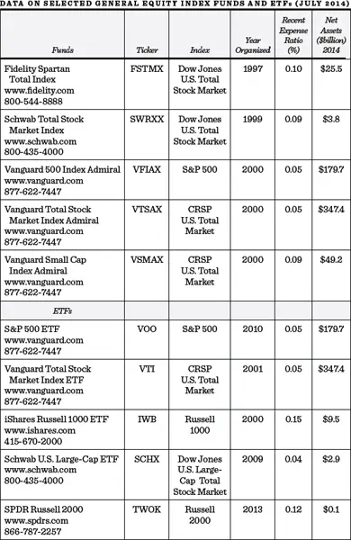

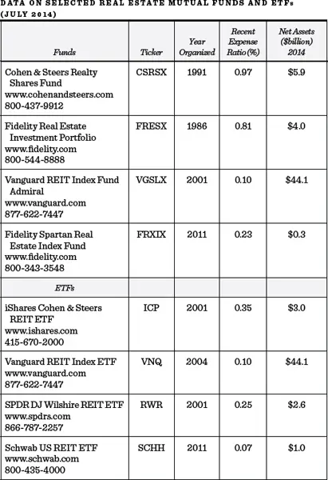

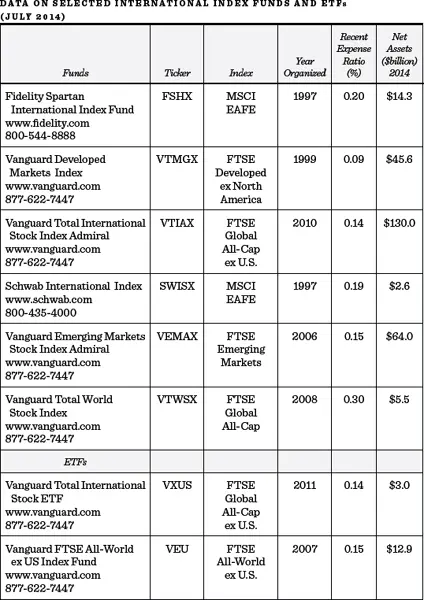

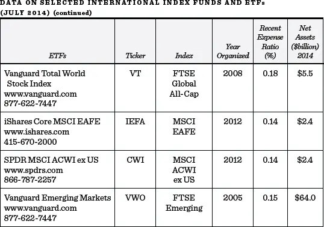

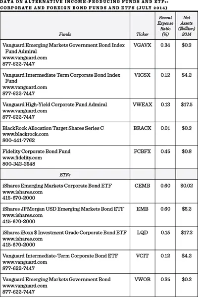

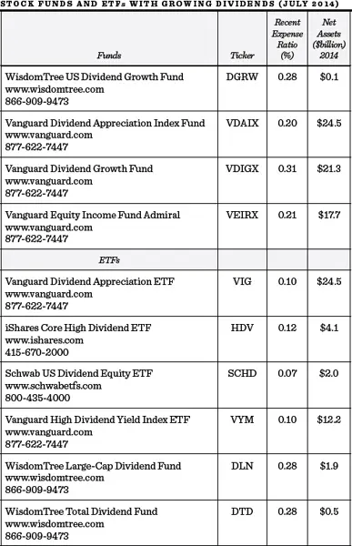

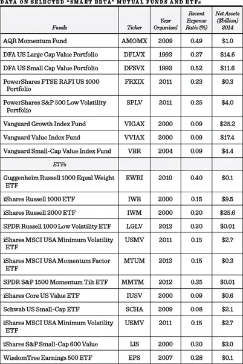

## 致谢
