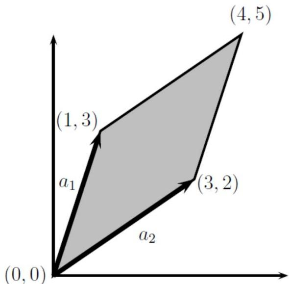
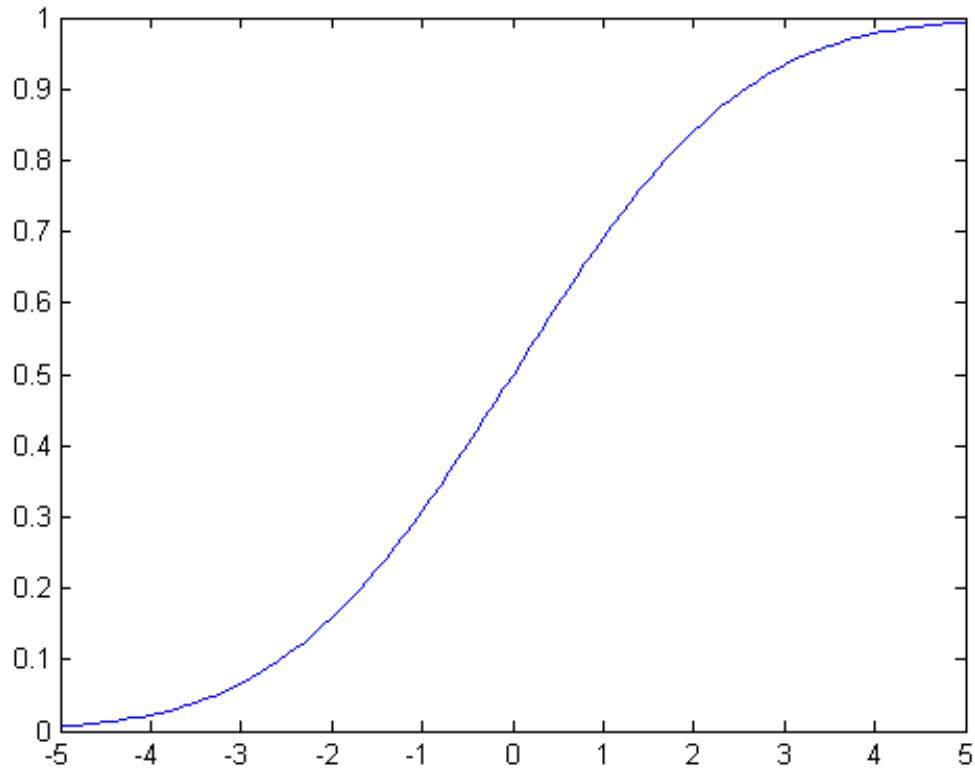
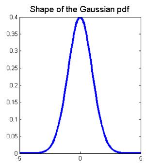
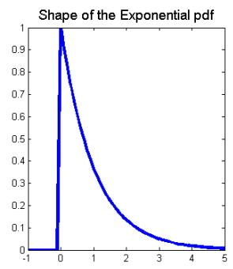
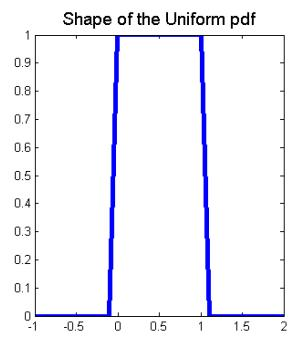
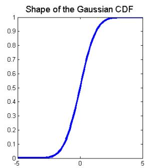
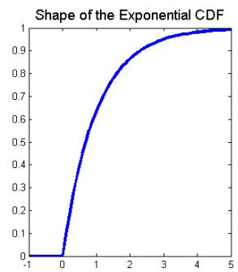
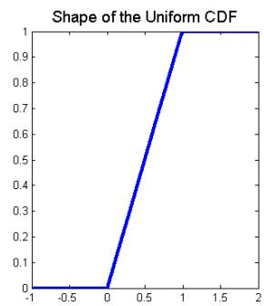

# 附件

## CS229 机器学习课程复习材料-线性代数

这部分是斯坦福大学 CS 229 机器学习课程的基础材料，原始文件下载原文作者：Zico Kolter，修改：Chuong Do， Tengyu Ma翻译：黄海广

## 1. 基础概念和符号

线性代数提供了一种紧凑地表示和操作线性方程组的方法。 例如，以下方程组：

$$
\begin{array}{r} 4 x_{1} - 5 x_{2} = - 13 \\ - 2 x_{1} + 3 x_{2} = 9 \end{array}
$$

这是两个方程和两个变量，正如你从高中代数中所知，你可以找到 $x_{1}$ 和 $x_{2}$ 的唯一解（除非方程以某种方式退化，例如，如果第二个方程只是第一个的倍数，但在上面的情况下，实际上只有一个唯一解）。 在矩阵表示法中，我们可以更紧凑地表达：

$$
\begin{array}{c} {A x = b} \\ {\mathrm{with} A = \left[ \begin{array}{l l} 4 & - 5 \\ - 2 & 3 \end{array} \right], b = \left[ \begin{array}{l} - 13 \\ 9 \end{array} \right]} \end{array}
$$

我们可以看到，这种形式的线性方程有许多优点（比如明显地节省空间）。

## 1.1 基本符号

我们使用以下符号：

$A \in \mathbb{R} ^{m \times n}$ ，表示 A 为由实数组成具有m行和n列的矩阵。

$x \in \mathbb{R} ^{n}$ ，表示具有n个元素的向量。 通常，向量x将表示列向量: 即，具有n行和1列的矩阵。 如果我们想要明确地表示行向量: 具有 1 行和n列的矩阵 - 我们通常写 $x^{T}$ （这里 $x^{T} x$ 的转置）。

$x_{i}$ 表示向量x的第i个元素

$$
x = \left[ \begin{array}{c} x_{1} \\ x_{2} \\ \vdots \\ x_{n} \end{array} \right]
$$

• 我们使用符号 $a_{i j}$ （或 $A_{i j} , A_{i , j}$ 等）来表示第 i 行和第j列中的 A 的元素：

$$
A = \left[ \begin{array}{c c c c} a_{11} & a_{12} & \dots & a_{1 n} \\ a_{21} & a_{22} & \dots & a_{2 n} \\ \vdots & \vdots & \ddots & \vdots \\ a_{m 1} & a_{m 2} & \dots & a_{m n} \end{array} \right]
$$

• 我们用 $a^{j}$ 或者 $A_{: , j}$ 表示矩阵A的第j列：

$$
A = \left[ \begin{array}{c c c c} | & | & & | \\ a^{1} & a^{2} & \dots & a^{n} \\ | & | & & | \end{array} \right]
$$

• 我们用 $a_{i} ^{T}$ 或者 $A_{i , :}$ 表示矩阵A的第i行：

$$
A = \left[ \begin{array}{c} - a_{1} ^{T} - \\ - a_{2} ^{T} - \\ \vdots \\ - a_{m} ^{T} - \end{array} \right]
$$

在许多情况下，将矩阵视为列向量或行向量的集合非常重要且方便。 通常，在向量而不是标量上操作在数学上（和概念上）更清晰。只要明确定义了符号，用于矩阵的列或行的表示方式并没有通用约定。

## 2. 矩阵乘法

两个矩阵相乘，其中 $A \in \mathbb{R} ^{m \times n} \mathsf{a n d} B \in \mathbb{R} ^{n \times p}$ ，则：

$$
C = A B \in \mathbb{R} ^{m \times p}
$$

其中：

$$
C_{i j} = \sum_{k = 1} ^{n} A_{i k} B_{k j}
$$

请注意，为了使矩阵乘积存在，A中的列数必须等于B中的行数。有很多方法可以查看矩阵乘法，我们将从检查一些特殊情况开始。

## 2.1 向量-向量乘法

给定两个向量 $x , y \in \mathbb{R} ^{n} , x^{T} )$ 通常称为向量内积或者点积，结果是个实数。

$$
x^{T} y \in \mathbb{R} = [ x_{1} \quad x_{2} \quad \dots \quad x_{n} ] \left[ \begin{array}{c} y_{1} \\ y_{2} \\ \vdots \\ y_{n} \end{array} \right] = \sum_{i = 1} ^{n} x_{i}   y_{i}
$$

注意： $x^{T} y = y^{T} x$ 始终成立。

给定向量 $x \in \mathbb{R} ^{m}$ $y \in \mathbb{R} ^{n}$ (他们的维度是否相同都没关系)， $x y^{T} \in$ ℝm×n叫做向量外积 , 当 $( x y^{T} ) _{i j} = x_{i} y_{j}$ 的时候，它是一个矩阵。

$$
x y^{T} \in \mathbb{R} ^{m \times n} = \left[ \begin{array}{c} x_{1} \\ x_{2} \\ \vdots \\ x_{m} \end{array} \right] [ y_{1} y_{2} \dots y_{n} ] = \left[ \begin{array}{c c c c} x_{1} y_{1} & x_{1} y_{2} & \dots & x_{1} y_{n} \\ x_{2} y_{1} & x_{2} y_{2} & \dots & x_{2} y_{n} \\ \vdots & \vdots & \ddots & \vdots \\ x_{m} y_{1} & x_{m} y_{2} & \dots & x_{m} y_{n} \end{array} \right]
$$

举一个外积如何使用的一个例子：让 $\mathsf{L} \in R^{n}$ 表示一个n维向量，其元素都等于 1，此外，考虑矩阵 $A \in R^{m \times n}$ ，其列全部等于某个向量 $x \in R^{m}$ 。 我们可以使用外积紧凑地表示矩阵A:

$$
A = \left[ \begin{array}{c c c c} | & | & & | \\ x & x & \dots & x \\ | & | & & | \end{array} \right] = \left[ \begin{array}{c c c c} x_{1} & x_{1} & \dots & x_{1} \\ x_{2} & x_{2} & \dots & x_{2} \\ \vdots & \vdots & \ddots & \vdots \\ x_{m} & x_{m} & \dots & x_{m} \end{array} \right] = \left[ \begin{array}{c} x_{1} \\ x_{2} \\ \vdots \\ x_{m} \end{array} \right] [ 1 \quad 1 \quad \dots \quad 1 ] = x {\bf 1} ^{T}
$$

## 2.2 矩阵-向量乘法

给定矩阵 $A \in \mathbb{R} ^{m \times n}$ ，向量 $x \in \mathbb{R} ^{n}$ , 它们的积是一个向量 $y = A x \in R^{m}$ 。有几种方法可以查看矩阵向量乘法，我们将依次查看它们中的每一种。

如果我们按行写A，那么我们可以表示Ax为：

$$
y = A x = \left[ \begin{array}{c c c} - & a_{1} ^{T} & - \\ - & a_{2} ^{T} & - \\ & \vdots & \\ - & a_{m} ^{T} & - \end{array} \right] x = \left[ \begin{array}{c} a_{1} ^{T} x \\ a_{2} ^{T} x \\ \vdots \\ a_{m} ^{T} x \end{array} \right]
$$

换句话说，第i个y_i是A的第i行和x的内积，即： $y_{i} = y_{i} = a_{i} ^{T} x .$

同样的， 可以把 A 写成列的方式，则公式如下：,

$$
y = A x = \left[ \begin{array}{c c c c} | & | & & | \\ a^{1} & a^{2} & \dots & a^{n} \\ | & | & & | \end{array} \right] \left[ \begin{array}{c} x_{1} \\ x_{2} \\ \vdots \\ x_{n} \end{array} \right] = \left[ \begin{array}{c} a_{1} \end{array} \right] x_{1} + \left[ \begin{array}{c} a_{2} \end{array} \right] x_{2} + \dots + \left[ \begin{array}{c} a_{n} \end{array} \right] x_{n}
$$

换句话说，y是A的列的线性组合，其中线性组合的系数由x的元素给出。

到目前为止，我们一直在右侧乘以列向量，但也可以在左侧乘以行向量。 这是写的，$y^{T} = x^{T} A$ 表示 $A \in \mathbb{R} ^{m \times n}$ ， $x \in \mathbb{R} ^{m}$ $y \in \mathbb{R} ^{n}$ 。 和以前一样，我们可以用两种可行的方式表达 $y^{T}$ ，这取决于我们是否根据行或列表达A.

第一种情况，我们把A用列表示：

$$
y^{T} = x^{T} A = x^{T} \left[ \begin{array}{c c c c} | & | & & | \\ a^{1} & a^{2} & \dots & a^{n} \\ | & | & & | \end{array} \right] = [ x^{T} a^{1} x^{T} a^{2} \ldots x^{T} a^{n} ]
$$

这表明 $y^{T}$ 的第i个元素等于x和A的第n列的内积。

最后，根据行表示A，我们得到了向量-矩阵乘积的最终表示:

$$
y^{T} = x^{T} A = [ x_{1} \quad x_{2} \quad \dots \quad x_{n} ] \left[ \begin{array}{c} - a_{1} ^{T} - \\ - a_{2} ^{T} - \\ \vdots \\ - a_{m} ^{T} - \end{array} \right] = x_{1} [ - a_{1} ^{T} - ] + x_{2} [ - a_{2} ^{T} - ] + \dots + x_{n} [ - a_{n} ^{T} - ]
$$

所以我们看到 $y^{T}$ 是A的行的线性组合，其中线性组合的系数由x的元素给出。

## 2.3 矩阵-矩阵乘法

有了这些知识，我们现在可以看看四种不同的（形式不同，但结果是相同的）矩阵-矩阵乘法：也就是本节开头所定义的 $C = A B$ 的乘法。

首先，我们可以将矩阵 - 矩阵乘法视为一组向量-向量乘积。 从定义中可以得出：最明显的观点是C的(i,j)元素等于A的第i行和B的的第j列的内积。如下面的公式所示：

$$
C = A B = \left[ \begin{array}{c c c} - & a_{1} ^{T} & - \\ - & a_{2} ^{T} & - \\ & & \vdots \\ - & a_{m} ^{T} & - \end{array} \right] \left[ \begin{array}{c c c c} | & | & & | \\ b_{1} & b_{2} & \dots & b_{p} \\ | & | & & | \end{array} \right] = \left[ \begin{array}{c c c c} a_{1} ^{T} b_{1} & a_{1} ^{T} b_{2} & \dots & a_{1} ^{T} b_{p} \\ a_{2} ^{T} b_{1} & a_{2} ^{T} b_{2} & \dots & a_{2} ^{T} b_{p} \\ \vdots & \vdots & \ddots & \vdots \\ a_{m} ^{T} b_{1} & a_{m} ^{T} b_{2} & \dots & a_{m} ^{T} b_{p} \end{array} \right]
$$

这里的 $A \in \mathbb{R} ^{m \times n}$ $B \in \mathbb{R} ^{n \times p}$ $a_{i} \in \mathbb{R} ^{n}$ $b^{j} \in \mathbb{R} ^{n \times p}$ ，这里的 $A \in \mathbb{R} ^{m \times n}$ $B \in \mathbb{R} ^{n \times p}$ $a_{i} \in \mathbb{R} ^{n} , b^{j} \in \mathbb{R} ^{n \times p}$ ，所以它们可以计算内积。我们用通常用行表示A而用列表示B。或者，我们可以用列表示A，用行表示B，这时C=AB是求外积的和。公式如下：

$$
C = A B = \left[ \begin{array}{c c c c} | & | & & | \\ a_{1} & a_{2} & \dots & a_{n} \\ | & | & & | \end{array} \right] \left[ \begin{array}{c c c} - & b_{1} ^{T} & - \\ - & b_{2} ^{T} & - \\ & & \vdots \\ - & b_{n} ^{T} & - \end{array} \right] = \sum_{i = 1} ^{n} a_{i} b_{i} ^{T}
$$

换句话说，C=AB等于所有的A的第i列和B第i行的外积的和。因此，在这种情况下， $a_{i} \in$ ℝm和 $b_{i} \in \mathbb{R} ^{p}$ ， 外积 $\{a^{i} b_{i} ^{T}$ 的维度是 $m \times p$ ，与C的维度一致。

其次，我们还可以将矩阵 - 矩阵乘法视为一组矩阵向量积。如果我们把A用列表示，我们可以将C的列视为A和B的列的矩阵向量积。公式如下：

$$
C = A B = A \left[ \begin{array}{c c c c} | & | & & | \\ b_{1} & b_{2} & \dots & b_{p} \\ | & | & & | \end{array} \right] = \left[ \begin{array}{c c c c} | & | & & | \\ A b_{1} & A b_{2} & \dots & A b_{p} \\ | & | & & | \end{array} \right]
$$

这里C的第j列由矩阵向量乘积给出，右边的向量为 $c_{j} = A b_{j}$ 。 这些矩阵向量乘积可以使用前一小节中给出的两个观点来解释。 最后，我们有类似的观点，我们用行表示A，C的行作为A和B行之间的矩阵向量积。公式如下：

$$
C = A B = \left[ \begin{array}{c c c} - & a_{1} ^{T} & - \\ - & a_{2} ^{T} & - \\ & \vdots & \\ - & a_{m} ^{T} & - \end{array} \right] B = \left[ \begin{array}{c c c} - & a_{1} ^{T} B & - \\ - & a_{2} ^{T} B & - \\ & & \vdots \\ - & a_{m} ^{T} B & - \end{array} \right]
$$

这里第i行的C由左边的向量的矩阵向量乘积给出： $c_{i} ^{T} = a_{i} ^{T} B$

将矩阵乘法剖析到如此大的程度似乎有点过分，特别是当所有这些观点都紧跟在我们在本节开头给出的初始定义（在一行数学中）之后。

这些不同方法的直接优势在于它们允许您在向量的级别/单位而不是标量上进行操作。为了完全理解线性代数而不会迷失在复杂的索引操作中，关键是要用尽可能多的概念进行操作。

实际上所有的线性代数都处理某种矩阵乘法，花一些时间对这里提出的观点进行直观的理解是非常必要的。

除此之外，了解一些更高级别的矩阵乘法的基本属性是很有必要的：

• 矩阵乘法结合律: $( A B ) C = A ( B C )$

• 矩阵乘法分配律: $A ( B + C ) = A B + A C$

矩阵乘法通常不是可交换的; 也就是说，通常 $A B \neq B A$ 。 （例如，假设A $\in \mathbb{R} ^{m \times n}$ $B \in \mathbb{R} ^{n \times p}$ ，如果m和n不相等，矩阵乘积BA甚至不存在！）

如果您不熟悉这些属性，请花点时间自己验证它们。 例如，为了检查矩阵乘法的相关性，假设 $A \in \mathbb{R} ^{m \times n}$ ， $B \in \mathbb{R} ^{n \times p} , \ C \in \mathbb{R} ^{p \times q}$ 。 注意 $A B \in \mathbb{R} ^{m \times p}$ ，所以 $( A B ) C \in \mathbb{R} ^{m \times q}$ 。 类似地， $B C \in \mathbb{R} ^{n \times q}$ ，所以 $A ( B C ) \in \mathbb{R} ^{m \times q}$ 。 因此，所得矩阵的维度一致。 为了表明矩阵乘法是相关的，足以检查(AB)C的第(i,j)个元素是否等于A(BC)的第(i,j)个元素。 我们可以使用矩阵乘法的定义直接验证这一点：

$$
\begin{array}{r l} ((A B) C) _{i j} & = \sum_{k = 1} ^{p} (A B) _{i k} C_{k j} = \sum_{k = 1} ^{p} \left(\sum_{l = 1} ^{n} A_{i l} B_{l k}\right) C_{k j} \\ & = \sum_{k = 1} ^{p} \left(\sum_{l = 1} ^{n} A_{i l} B_{l k} C_{k j}\right) = \sum_{l = 1} ^{n} \left(\sum_{k = 1} ^{p} A_{i l} B_{l k} C_{k j}\right) \\ & = \sum_{l = 1} ^{n} A_{i l} \left(\sum_{k = 1} ^{p} B_{l k} C_{k j}\right) = \sum_{l = 1} ^{n} A_{i l} (B C) _{l j} = (A (B C)) _{i j} \end{array}
$$

## 3 运算和属性

在本节中，我们介绍矩阵和向量的几种运算和属性。希望能够为您复习大量此类内容，这些笔记可以作为这些主题的参考。

## 3.1 单位矩阵和对角矩阵

单位矩阵 $J \in \mathbb{R} ^{n \times n}$ ，它是一个方阵，对角线的元素是1，其余元素都是 $0 {:}$

$$
I_{i j} = \left\{\begin{array}{l l} 1 & i = j \\ 0 & i \neq j \end{array} \right.
$$

对于所有 $\ b {A} \in \mathbb{R} ^{m \times n}$ ，有：

$$
A I = A = I A
$$

注意，在某种意义上，单位矩阵的表示法是不明确的，因为它没有指定I的维数。通常，I的维数是从上下文推断出来的，以便使矩阵乘法成为可能。 例如，在上面的等式中， $A I =$ A 中的 I 是n × n矩阵，而 $A = I A$ 中的I是 $m \times m$ 矩阵。

对角矩阵是一种这样的矩阵：对角线之外的元素全为 0。对角阵通常表示为： $D =$ $d i a g ( d_{1} , d_{2} , \dots , d_{n} )$ ，其中：

$$
D_{i j} = \left\{\begin{array}{l l} d_{i} & i = j \\ 0 & i \neq j \end{array} \right.
$$

很明显：单位矩阵 $I = d i a g ( 1 , 1 , \ldots , 1 )$ 。

## 3.2 转置

矩阵的转置是指翻转矩阵的行和列。

给定一个矩阵：

$A \in \mathbb{R} ^{m \times n}$ , 它的转置为 $n \times m$ 的矩阵 $A^{T} \in \mathbb{R} ^{n \times m}$ ，其中的元素为：

$$
(A^{T}) _{i j} = A_{j i}
$$

事实上，我们在描述行向量时已经使用了转置，因为列向量的转置自然是行向量。转置的以下属性很容易验证：

$( A^{T} ) ^{T} = A$

$( A B ) ^{T} = B^{T} A^{T}$

$$
(A + B) ^{T} = A^{T} + B^{T}
$$

## 3.3 对称矩阵

如果 $A = A^{T}$ ，则矩阵 $A \in \mathbb{R} ^{n \times n}$ 是对称矩阵。 如果 $A = - A^{T}$ ，它是反对称的。 很容易证明，对于任何矩阵 $\dot{\boldsymbol{\cdot}} \boldsymbol{A} \in \mathbb{R} ^{n \times n}$ ，矩阵 $A + A^{T}$ 是对称的，矩阵 $A - A^{T}$ 是反对称的。 由此得出，任何方矩阵 $A \in \mathbb{R} ^{n \times n}$ 可以表示为对称矩阵和反对称矩阵的和，所以：

$$
A = \frac{1}{2} (A + A^{T}) + \frac{1}{2} (A - A^{T})
$$

上面公式的右边的第一个矩阵是对称矩阵，而第二个矩阵是反对称矩阵。 事实证明，对称矩阵在实践中用到很多，它们有很多很好的属性，我们很快就会看到它们。 通常将大小为n的所有对称矩阵的集合表示为Sn，因此A $\in \mathbb{S} ^{n}$ 意味着A是对称的 $n \times n$ 矩阵;

## 3.4 矩阵的迹

方矩阵 $A \in \mathbb{R} ^{n \times n}$ 的迹，表示为tr(A)（或者只是trA，如果括号显然是隐含的），是矩阵中对角元素的总和：

$$
\operatorname{tr} A = \sum_{i = 1} ^{n} A_{i i}
$$

如CS229 讲义中所述，迹具有以下属性（如下所示）：

• 对于矩阵 $\ b {A} \in \mathbb{R} ^{n \times n}$ ，则： $\mathrm{t r} A = \mathrm{t r} A^{T}$

• 对于矩阵 $A , B \in \mathbb{R} ^{n \times n}$ ，则： $\operatorname{t r} ( A + B ) = \operatorname{t r} A + \operatorname{t r} B$

• 对于矩阵 $A \in \mathbb{R} ^{n \times n}$ ，t ∈ ℝ，则： $\operatorname{t r} ( t A ) = t \operatorname{t r} A .$

• 对于矩阵 A, B，AB 为方阵, 则： $\mathrm{t r} A B = \mathrm{t r} B A$

• 对于矩阵 A, B, C, ABC为方阵, 则： $\mathrm{t r} A B C = \mathrm{t r} B C A = \mathrm{t r} C A B$ , 同理，更多矩阵的积也是有这个性质。

作为如何证明这些属性的示例，我们将考虑上面给出的第四个属性。 假设 $A \in \mathbb{R} ^{m \times n}$ 和$B \in \mathbb{R} ^{n \times m}$ （因此 $\cdot \boldsymbol{A} \boldsymbol{B} \in \mathbb{R} ^{m \times m}$ 是方阵）。 观察到 $B A \in \mathbb{R} ^{n \times n}$ 也是一个方阵，因此对它们进行迹的运算是有意义的。 要证明 $\mathrm{t r} A B = \mathrm{t r} B A$ ，请注意：

$$
{\begin{array}{r l} {\operatorname{tr} A B} & {= \sum_{i = 1} ^{m} (A B) _{i i} = \sum_{i = 1} ^{m} \left(\sum_{j = 1} ^{n} A_{i j} B_{j i}\right)} \\ & {= \sum_{i = 1} ^{m} \sum_{j = 1} ^{n} A_{i j} B_{j i} = \sum_{j = 1} ^{n} \sum_{i = 1} ^{m} B_{j i} A_{i j}} \\ & {= \sum_{j = 1} ^{n} \left(\sum_{i = 1} ^{m} B_{j i} A_{i j}\right) = \sum_{j = 1} ^{n} (B A) _{j j} = \operatorname{tr} B A} \end{array}}
$$

这里，第一个和最后两个等式使用迹运算符和矩阵乘法的定义，重点在第四个等式，使用标量乘法的可交换性来反转每个乘积中的项的顺序，以及标量加法的可交换性和相关性，以便重新排列求和的顺序。

## 3.5 范数

向量的范数∥ x ∥是非正式度量的向量的”长度” 。 例如，我们有常用的欧几里德或 $\ell_{2}$ 范数，

$$
\parallel x \parallel_{2} = \sqrt{\sum_{i = 1} ^{n} x_{i} ^{2}}
$$

注意： $\parallel x \parallel_{2} ^{2} = x^{T} x$

更正式地，范数是满足4个属性的函数 $( f \colon \mathbb{R} ^{n} \to \mathbb{R} )$

对于所有的 $x \in \mathbb{R} ^{n} , \ f ( x ) \geq 0 ($ 非负).

当且仅当j=0 时，J(θ) = 0 (明确性).

对于所有 $x \in \mathbb{R} ^{n} , t \in$ ℝ，则 $f ( t x ) = | t | f ( x )$ (正齐次性).

对于所有 $x , y \in \mathbb{R} ^{n} , \ f ( x + y ) \leq f ( x ) + f ( y )$ (三角不等式)

其他范数的例子是 $\ell_{1}$ 范数:

$$
\parallel x \parallel_{1} = \sum_{i = 1} ^{n} | x_{i} |
$$

和 $\ell_{\infty}$ 范数：

$$
\parallel x \parallel_{\infty} = \max_{i} | x_{i} |
$$

事实上，到目前为止所提出的所有三个范数都是 $\ell_{p}$ 范数族的例子，它们由实数 $\lceil p \geq 1$ 参数化，并定义为：

$$
\parallel x \parallel_{p} = \left(\sum_{i = 1} ^{n} | x_{i} | ^{p}\right) ^{1 / p}
$$

也可以为矩阵定义范数，例如 Frobenius范数:

$$
\parallel A \parallel_{F} = \sqrt{\sum_{i = 1} ^{m} \sum_{j = 1} ^{n} A_{i j} ^{2}} = \sqrt{\operatorname{tr} (A^{T} A)}
$$

许多其他更多的范数，但它们超出了这个复习材料的范围。

## 3.6 线性相关性和秩

一组向量 $x_{1} , x_{2} , \cdots x_{n} \in$ ℝ，如果没有向量可以表示为其余向量的线性组合，则称称该向量是线性无相关的。 相反，如果属于该组的一个向量可以表示为其余向量的线性组合，则称该向量是线性相关的。 也就是说，如果：

$$
x_{n} = \sum_{i = 1} ^{n - 1} \alpha_{i} x_{i}
$$

对于某些标量值 $\alpha_{1} , \cdots \alpha_{n} - 1 \in$ ℝ，要么向量 $x_{1} , x_{2} , \cdots x_{n}$ 是线性相关的; 否则，向量是线性无关的。 例如，向量：

$$
x_{1} = \left[ \begin{array}{c} 1 \\ 2 \\ 3 \end{array} \right] x_{2} = \left[ \begin{array}{c} 4 \\ 1 \\ 5 \end{array} \right] x_{3} = \left[ \begin{array}{c} 2 \\ - 3 \\ - 1 \end{array} \right]
$$

是线性相关的，因为： $x_{3} = - 2 x_{1} + x_{2}$ 。

矩阵 $A \in \mathbb{R} ^{m \times n}$ 的列秩是构成线性无关集合的A的最大列子集的大小。 由于术语的多样性，这通常简称为A的线性无关列的数量。同样，行秩是构成线性无关集合的A的最大行数。对于任何矩阵 $\ b {A} \in \mathbb{R} ^{m \times n}$ ，事实证明A的列秩等于A的行秩（尽管我们不会证明这一点），因此两个量统称为A的秩，用 rank(A)表示。 以下是秩的一些基本属性：

对于 $A \in \mathbb{R} ^{m \times n}$ $\operatorname{r a n k} ( A ) \leq m i n ( m , n )$ ，如果\$ $\backslash \mathrm{t e x t} \left( \mathrm{A} \right) \ = \ \backslash \mathrm{t e x t} \left\{\mathrm{m i n} \right\} \quad ( \mathrm{m , ~ \mathrm{n}} ) \ : \mathfrak{P}$ ，

则： A 被称作满秩。

• 对于 $A \in \mathbb{R} ^{m \times n}$ $\operatorname{r a n k} ( A ) = \operatorname{r a n k} ( A^{T} )$

• 对于 A ∈ ℝm×n,B ∈ ℝn×p ,rank(AB) ≤ min(rank(A), rank(B))

• 对于 $A , B \in \mathbb{R} ^{m \times n}$ $\operatorname{r a n k} ( A + B ) \leq \operatorname{r a n k} ( A ) + \operatorname{r a n k} ( B )$

## 3.7 方阵的逆

方阵 $A \in \mathbb{R} ^{n \times n}$ 的倒数表示为 ${| A^{- 1}}$ ，并且是这样的独特矩阵:

$$
A^{- 1} A = I = A A^{- 1}
$$

请注意，并非所有矩阵都具有逆。 例如，非方形矩阵根据定义没有逆。 然而，对于一些方形矩阵A，可能仍然存在 $A^{- 1}$ 可能不存在的情况。 特别是，如果 $A^{- 1}$ 存在，我们说A是可逆的或非奇异的，否则就是不可逆或奇异的。为了使方阵 A 具有逆 $A^{- 1}$ ，则A必须是满秩。我们很快就会发现，除了满秩之外，还有许多其它的充分必要条件。 以下是逆的属性; 假设$A , B \in \mathbb{R} ^{n \times n}$ ，而且是非奇异的：

$( A^{- 1} ) ^{- 1} = A$

$( A B ) ^{- 1} = B^{- 1} A^{- 1}$

$( A^{- 1} ) ^{T} = ( A^{T} ) ^{- 1}$ 因此，该矩阵通常表示为 $\boldsymbol{{\cal A}} ^{- T}$ 。 作为如何使用逆的示例，考虑线性方程组， $A x = b$ ，其中 $A \in \mathbb{R} ^{n \times n}$ $x , b \in$ ℝ， 如果A是非奇异的（即可逆的），那么$x = A^{- 1} b$ （如果 $A \in \mathbb{R} ^{m \times n}$ 不是方阵，这公式还有用吗？）

## 3.8 正交阵

如果 $x^{T} y = 0$ ，则两个向量 $x , y \in \mathbb{R} ^{n}$ 是正交的。如果∥ $x \parallel_{2} = 1$ ，则向量 $x \in \mathbb{R} ^{n}$ 被归一化。如果一个方阵 $U \in \mathbb{R} ^{n \times n}$ 的所有列彼此正交并被归一化（这些列然后被称为正交），则方阵U是正交阵（注意在讨论向量时的意义不一样）。

它可以从正交性和正态性的定义中得出:

$$
U^{T} U = I = U U^{T}
$$

换句话说，正交矩阵的逆是其转置。 注意，如果U不是方阵 :即， $U \in \mathbb{R} ^{m \times n} , n < m$ 但其列仍然是正交的，则 $U^{T} U = I$ ，但是 $U U^{T} \neq I$ 。我们通常只使用术语"正交"来描述先前的情况 ，其中U是方阵。 正交矩阵的另一个好的特性是在具有正交矩阵的向量上操作不会改变其欧几里德范数，即:

$$
\parallel U x \parallel_{2} = \parallel x \parallel_{2}
$$

对于任何 $x \in$ ℝ , $U \in \mathbb{R} ^{n}$ 是正交的。

## 3.9 矩阵的值域和零空间

一组向量 $\{x_{1} , \ldots x_{n} \}$ 是可以表示为 $\{x_{1} , \ldots x_{n} \}$ 的线性组合的所有向量的集合。 即：

$$
\mathrm{span} (\{x_{1}, \ldots x_{n} \}) = \left\{v \colon v = \sum_{i = 1} ^{n} \alpha_{i} x_{i}, \quad \alpha_{i} \in \mathbb{R} \right\}
$$

可以证明， 如果 $\{x_{1} , \ldots x_{n} \}$ 是一组n个线性无关的向量， 其中每个 $x_{i} \in$ ℝn ， 则$\mathsf{s p a n} ( \{x_{1} , \hdots x_{n} \} ) = \mathbb{R} ^{n}$ 。 换句话说，任何向量 $v \in \mathbb{R} ^{n}$ 都可以写成 $x_{1}$ 到 $x_{n}$ 的线性组合。

向量y $\in \mathbb{R} ^{m}$ 投影到 $\{x_{1} , \ldots x_{n} \}$ （这里我们假设 $x_{i} \in \mathbb{R} ^{m} ,$ ）得到向量 $v \in \operatorname{s p a n} ( \{x_{1} , \dots , x_{n} \} )$ 由欧几里德范数∥ $v - y \parallel_{2}$ 可以得知，这样v尽可能接近y。

我们将投影表示为 $\operatorname* {P r o j} ( y ; \{x_{1} , \ldots x_{n} \} )$ ，并且可以将其正式定义为:

$$
\operatorname{Proj} (y; \{x_{1}, \dots x_{n} \}) = \operatorname{argmin} _{v \in \mathrm{span} (\{x_{1}, \dots , x_{n} \})} \| y - v \| _{2}
$$

矩阵 $\ b {\cdot} \ b {A} \in \mathbb{R} ^{m \times n}$ 的值域（有时也称为列空间），表示为ℛ(A)，是A的n列的跨度。换句话说，

$$
\mathcal{R} (A) = \{v \in \mathbb{R} ^{m} \colon v = A x, x \in \mathbb{R} ^{n} \}
$$

做一些技术性的假设（即A是满秩且 $n < m )$ ），向量 $\boldsymbol{y} \in \mathbb{R} ^{m}$ 到A的范围的投影由下式给出:

$$
\operatorname{Proj} (y; A) = \operatorname{argmin} _{v \in \mathcal{R} (A)} \| v - y \| _{2} = A (A^{T} A) ^{- 1} A^{T} y
$$

这个最后的方程应该看起来非常熟悉，因为它几乎与我们在课程中（我们将很快再次得出）得到的公式：用于参数的最小二乘估计一样。 看一下投影的定义，显而易见，这实际上是我们在最小二乘问题中最小化的目标（除了范数的平方这里有点不一样，这不会影响找到最优解），所以这些问题自然是非常相关的。

当A只包含一列时， $a \in \mathbb{R} ^{m}$ ，这给出了向量投影到一条线上的特殊情况：

$$
\operatorname{Proj} (y; a) = \frac{a a^{T}}{a^{T} a} y
$$

一个矩阵 $\ b {A} \in \mathbb{R} ^{m \times n}$ 的零空间 J(θ) 是所有乘以A时等于0 向量的集合，即：

$$
\mathcal{N} (A) = \{x \in \mathbb{R} ^{n}: A x = 0 \}
$$

注意， ${\mathcal{R}} ( A )$ 中的向量的大小为m，而 ${\mathcal{N}} ( A )$ 中的向量的大小为n，因此ℛ $( A^{T} )$ 和 ${\mathcal{N}} ( A )$ 中的向量的大小均为ℝn。 事实上，还有很多例子。 证明：

$$
\{w \colon w = u + v, u \in \mathcal{R} (A^{T}), v \in \mathcal{N} (A) \} = \mathbb{R} ^{n} \text{and} \mathcal{R} (A^{T}) \cap \mathcal{N} (A) = \{\mathbf{0} \}
$$

换句话说， ${\mathcal{R}} ( A^{T} )$ 和 ${\mathcal{N}} ( A )$ 是不相交的子集，它们一起跨越ℝn的整个空间。 这种类型的集合称为正交补，我们用 ${\mathcal{R}} ( A^{T} ) = {\mathcal{N}} ( A ) ^{\perp}$ 表示。

## 3.10 行列式

一个方阵 $A \in \mathbb{R} ^{n \times n}$ 的行列式是函数 $\begin{array} {r} {\operatorname* {d e t} \colon \mathbb{R} ^{n \times n}  \mathbb{R} ^{n}} \end{array}$ ，并且表示为|A|。 或者det A（有点像迹运算符，我们通常省略括号）。 从代数的角度来说，我们可以写出一个关于A行列式的显式公式。 因此，我们首先提供行列式的几何解释，然后探讨它的一些特定的代数性质。

给定一个矩阵：

$$
\left[ \begin{array}{c c c} - & a_{1} ^{T} & - \\ - & a_{2} ^{T} & - \\ & \vdots & \\ - & a_{n} ^{T} & - \end{array} \right]
$$

考虑通过采用A行向量 $\boldsymbol{a} _{1} , \dots \boldsymbol{a} _{n} \in \mathbb{R} ^{n}$ 的所有可能线性组合形成的点 $S \subset \mathbb{R} ^{n}$ 的集合，其中线性组合的系数都在 0 和 1 之间; 也就是说，集合S是 $\mathsf{s p a n} ( \{a_{1} , \ldots a_{n} \} )$ 受到系数 $a_{1} , \ldots a_{n}$ 的限制的线性组合， $\alpha_{1} , \cdots , \alpha_{n}$ 满足 $0 \leq \alpha_{i} \leq 1 , i = 1 , \ldots , n$ 。从形式上看，

$$
S = \left\{v \in \mathbb{R} ^{n}: v = \sum_{i = 1} ^{n} \alpha_{i} a_{i} \text{where} 0 \leq \alpha_{i} \leq 1, i = 1, \dots , n \right\}
$$

事实证明，A的行列式的绝对值是对集合S的”体积”的度量。

比方说：一个2×2的矩阵(4)：

$$
A = \left[ \begin{array}{c c} 1 & 3 \\ 3 & 2 \end{array} \right]
$$

它的矩阵的行是：

$$
a_{1} = \left[ \begin{array}{c} 1 \\ 3 \end{array} \right] a_{2} = \left[ \begin{array}{c} 3 \\ 2 \end{array} \right]
$$

对应于这些行对应的集合S如图1 所示。对于二维矩阵，S通常具有平行四边形的形状。在我们的例子中，行列式的值是 $| A | = - 7$ （可以使用本节后面显示的公式计算），因此平行四边形的面积为7。（请自己验证！）

在三维中，集合S对应于一个称为平行六面体的对象（一个有倾斜边的三维框，这样每个面都有一个平行四边形）。行定义S的3×3矩阵 A的行列式的绝对值给出了平行六面体的三维体积。在更高的维度中，集合S是一个称为n维平行切的对象。

图1：给出的2×2矩阵A的行列式的图示。 这里， $a_{1}$ 和 $\mid a_{2}$ 是对应于A行的向量，并且集合S对应于阴影区域（即，平行四边形）。 这个行列式的绝对值， $| \mathsf{d e t} A | = 7$ ，即平行四边形的面积。

在代数上，行列式满足以下三个属性（所有其他属性都遵循这些属性，包括通用公式）：1. 恒等式的行列式为1, |I| = 1（几何上，单位超立方体的体积为1）。

2. 给定一个矩阵 $A \in \mathbb{R} ^{n \times n}$ , 如果我们将A中的一行乘上一个标量 $t \in$ ℝ，那么新矩阵的行列式是t|A|

$$
\left| \left[ \begin{array}{c c c} - & t a_{1} ^{T} & - \\ - & a_{2} ^{T} & - \\ & \vdots & \\ & a_{m} ^{T} & - \end{array} \right] \right| = t | A |
$$

几何上，将集合S的一个边乘以系数t，体积也会增加一个系数t。

1. 如果我们交换任意两行在 $\cdot a_{i} ^{T}$ 和 $a_{j} ^{T}$ ，那么新矩阵的行列式是−|A|，例如：

$$
\left| \left[ \begin{array}{c c c} - & a_{2} ^{T} & - \\ - & a_{1} ^{T} & - \\ & \vdots & \\ - & a_{m} ^{T} & - \end{array} \right] \right| = - | A |
$$

你一定很奇怪，满足上述三个属性的函数的存在并不多。事实上，这样的函数确实存在，而且是唯一的（我们在这里不再证明了）。

从上述三个属性中得出的几个属性包括：

• 对于 $A \in \mathbb{R} ^{n \times n} , | A | = | A^{T} |$

对于 $A , B \in \mathbb{R} ^{n \times n} , | A B | = | A | | B |$

• 对于 $A \in \mathbb{R} ^{n \times n}$ , 有且只有当A是奇异的（比如不可逆） ，则： $| A | = 0$

• 对于 $A \in \mathbb{R} ^{n \times n}$ 同时，A为非奇异的，则： $| A^{- 1} | = 1 / | A |$

在给出行列式的一般定义之前，我们定义，对于 $A \in \mathbb{R} ^{n \times n}$ $A_{\backslash i , \backslash j} \in$ ℝ $( n {-} 1 ) {\times} ( n {-} 1 )$ 是由于删除第i行和第n列而产生的矩阵。 行列式的一般（递归）公式是：

$$
\begin{array}{r l} {| A |} & {= \sum_{i = 1} ^{n} (- 1) ^{i + j} a_{i j} \big | A_{\setminus i, \setminus j} \big | \quad (\text{for any} j \in 1, \ldots , n)} \\ & {= \sum_{j = 1} ^{n} (- 1) ^{i + j} a_{i j} \big | A_{\setminus i, \setminus j} \big | \quad (\text{for any} i \in 1, \ldots , n)} \end{array}
$$

对于 $A \in \mathbb{R} ^{1 \times 1}$ ，初始情况为 $| {\cal A} | = a_{11}$ 。如果我们把这个公式完全展开为 $A \in \mathbb{R} ^{n \times n}$ ，就等于n!（n阶乘）不同的项。因此，对于大于 $3 \times 3$ 的矩阵，我们几乎没有明确地写出完整的行列式方程。然而， $3 \times 3$ 大小的矩阵的行列式方程是相当常见的，建议好好地了解它们：

$$
\begin{array}{r l r} & & {| [ a_{11} ] | = a_{11}} \\ & & {\left| \left[ \begin{array}{l l} a_{11} & a_{12} \\ a_{21} & a_{22} \end{array} \right] \right| = a_{11} a_{22} - a_{12} a_{21}} \\ & & \left| \left[ \begin{array}{l l l} a_{11} & a_{12} & a_{13} \\ a_{21} & a_{22} & a_{23} \\ a_{31} & a_{32} & a_{33} \end{array} \right] \right| = \quad \begin{array}{c} a_{11} a_{22} a_{33} + a_{12} a_{23} a_{31} + a_{13} a_{21} a_{32} \\ - a_{11} a_{23} a_{32} - a_{12} a_{21} a_{33} - a_{13} a_{22} a_{31} \end{array}
$$

矩阵 $A \in$ ℝm×n的经典伴随矩阵（通常称为伴随矩阵）表示为adj(A)，并定义为：

$$
\operatorname{adj} (A) \in \mathbb{R} ^{n \times n}, \quad (\operatorname{adj} (A)) _{i j} = (- 1) ^{i + j} \left| A_{\backslash j, \backslash i} \right|
$$

（注意索引 $A_{\setminus j , \setminus i}$ 中的变化）。可以看出，对于任何非奇异 $A \in \mathbb{R} ^{n \times n}$

$$
A^{- 1} = \frac{1}{| A |} \operatorname{adj} (A)
$$

虽然这是一个很好的“显式”的逆矩阵公式，但我们应该注意，从数字上讲，有很多更有效的方法来计算逆矩阵。

## 3.11 二次型和半正定矩阵

给定方矩阵 $\ b {A} \in \mathbb{R} ^{n \times n}$ 和向量 $x \in \mathbb{R} ^{n}$ ，标量值 $x^{T} A x$ 被称为二次型。 写得清楚些，我们可以看到：

$$
x^{T} A x = \sum_{i = 1} ^{n} x_{i} (A x) _{i} = \sum_{i = 1} ^{n} x_{i} \left(\sum_{j = 1} ^{n} A_{i j} x_{j}\right) = \sum_{i = 1} ^{n} \sum_{j = 1} ^{n} A_{i j} x_{i} x_{j}
$$

注意：

$$
x^{T} A x = (x^{T} A x) ^{T} = x^{T} A^{T} x = x^{T} \left(\frac{1}{2} A + \frac{1}{2} A^{T}\right) x
$$

第一个等号的是因为是标量的转置与自身相等，而第二个等号是因为是我们平均两个本身相等的量。 由此，我们可以得出结论，只有A的对称部分有助于形成二次型。 出于这个原因，我们经常隐含地假设以二次型出现的矩阵是对称阵。 我们给出以下定义：

对于所有非零向量x $\in \mathbb{R} ^{n}$ $x^{T} A x > 0$ ，对称阵 $A \in \mathbb{S} ^{n}$ 为正定（positive$\mathtt{d e f i n i t e} , \mathtt{P D} )$ 。这通常表示为A ≻ 0（或A > 0），并且通常将所有正定矩阵的集合表示为 $\mathbb{S} _{+} ^{n}$ +。

• 对于所有向量 $x^{T} A x \geq 0$ ，对称矩阵 $A \in \mathbb{S} ^{n}$ 是半正定(positive semidefinite ,PSD)。这写为（或 $A \succcurlyeq 0 / \mathcal{V} A \geq 0 \rangle$ ，并且所有半正定矩阵的集合通常表示为Sn。

同样，对称矩阵 $A \in \mathbb{S} ^{n}$ 是负定（negative definite,ND），如果对于所有非零x ∈ℝn，则 $x^{T} A x < 0$ 表示为 $A < 0 \ \mathrm{ ( } \nexists \mathinner{\hat{\chi}} A < 0 \ )$ C

• 类似地，对称矩阵 $A \in \mathbb{S} ^{n}$ 是半负定(negative semidefinite,NSD），如果对于所有$x \in \mathbb{R} ^{n}$ ，则 $x^{T} A x \leq 0$ 表示为 $A \preccurlyeq 0 \ ( \sharp \hat{\chi} _{A} \leq 0 )$

• 最后，对称矩阵 $A \in \mathbb{S} ^{n}$ 是不定的，如果它既不是正半定也不是负半定，即，如果存在$x_{1} , x_{2} \in \mathbb{R} ^{n}$ ，那么 $x_{1} ^{T} A x_{1} > 0$ 且 $x_{2} ^{T} A x_{2} < 0$ C

很明显，如果A是正定的，那么−A是负定的，反之亦然。同样，如果A是半正定的，那么−A是是半负定的，反之亦然。如果果A是不定的，那么−A是也是不定的。

正定矩阵和负定矩阵的一个重要性质是它们总是满秩，因此是可逆的。为了了解这是为什么，假设某个矩阵 $4 \in \mathbb{S} ^{n}$ 不是满秩。然后，假设A的第j列可以表示为其他n−1列的线性组合：

$$
a_{j} = \sum_{i \neq j} x_{i} a_{i}
$$

对于某些 $x_{1} , \cdots x_{j - 1} , x_{j + 1} , \cdots , x_{n} \in$ ℝ。设 $x_{j} = - 1$ ，则：

$$
A x = \sum_{i \neq j} x_{i} a_{i} = 0
$$

但这意味着对于某些非零向量 y， $x^{T} A x = 0$ ，因此A必须既不是正定也不是负定。如果A是正定或负定，则必须是满秩。 最后，有一种类型的正定矩阵经常出现，因此值得特别提及。 给定矩阵 $A \in \mathbb{R} ^{m \times n}$ （不一定是对称或偶数平方），矩阵 $G = A^{T} A$ （有时称为 Gram 矩阵）总是半正定的。 此外，如果 $m \geq n$ （同时为了方便起见，我们假设A是满秩），则 $G =$ $A^{T} A$ 是正定的。

## 3.12 特征值和特征向量

给定一个方阵 $A \in \mathbb{R} ^{n \times n}$ ，我们认为在以下条件下， $\lambda \in \mathbb{C}$ 是A的特征值， $x \in \mathbb{C} ^{n}$ 是相应的特征向量：

$$
A x = \lambda x, x \neq 0
$$

直观地说，这个定义意味着将A乘以向量x会得到一个新的向量，该向量指向与x相同的方向，但按系数λ缩放。值得注意的是，对于任何特征向量 $x \in \mathbb{C} ^{n}$ 和标量 $t \in \mathbb{C} , A ( c x ) = c A x =$ $c \lambda x = \lambda ( c x )$ ，cx也是一个特征向量。因此，当我们讨论与λ相关的特征向量时，我们通常假设特征向量被标准化为长度为1（这仍然会造成一些歧义，因为x和−x都是特征向量，但我们必须接受这一点）。

我们可以重写上面的等式来说明 $( \lambda , x )$ 是A的特征值和特征向量的组合：

$$
(\lambda I - A) x = 0, x \neq 0
$$

但是 $( \lambda I - A ) x = 0$ 只有当 $( \lambda I - A )$ 有一个非空零空间时，同时 $( \lambda I - A )$ 是奇异的，方程才具有非零解，即：

$$
| (\lambda I - A) | = 0
$$

现在，我们可以使用行列式的先前定义将表达式 $| ( \lambda I - A )$ |扩展为λ中的（非常大的）多项式，其中，λ的度为n。它通常被称为矩阵A的特征多项式。

然后我们找到这个特征多项式的n（可能是复数）根，并用 $\lambda_{1} , \cdots , \lambda_{n}$ 表示。这些都是矩阵A的特征值，但我们注意到它们可能不明显。为了找到特征值 $\lambda_{i}$ 对应的特征向量，我们只需解线性方程 $( \lambda I - A ) x = 0$ ，因为 $( \lambda I - A )$ 是奇异的，所以保证有一个非零解（但也可能有多个或无穷多个解）。

应该注意的是，这不是实际用于数值计算特征值和特征向量的方法（记住行列式的完全展开式有n!项），这是一个数学上的争议。

以下是特征值和特征向量的属性（所有假设在 $A \in \mathbb{R} ^{n \times n}$ 具有特征值 $\lambda_{1} , \cdots , \lambda_{n}$ 的前提下）：A的迹等于其特征值之和

$$
\operatorname{tr} A = \sum_{i = 1} ^{n} \lambda_{i}
$$

• A的行列式等于其特征值的乘积

$$
| A | = \prod_{i = 1} ^{n} \lambda_{i}
$$

• A的秩等于A的非零特征值的个数

假设A非奇异，其特征值为λ和特征向量为x。那么 $1 / \lambda$ 是具有相关特征向量x的 $A^{- 1}$ 的特征值，即 $A^{- 1} x = ( 1 / \lambda ) x$ 。（要证明这一点，取特征向量方程， $A x = \lambda x$ ，两边都左乘 $A^{- 1}$ ）

• 对角阵的特征值 $d = d i a g ( d_{1} , \mathbf{\alpha} \cdots , d_{n} )$ 实际上就是对角元素 $d_{1} , \cdots , d_{n}$

## 3.13 对称矩阵的特征值和特征向量

通常情况下，一般的方阵的特征值和特征向量的结构可以很细微地表示出来。 值得庆幸的是，在机器学习的大多数场景下，处理对称实矩阵就足够了，其处理的对称实矩阵的特征值和特征向量具有显着的特性。

在本节中，我们假设A是实对称矩阵, 具有以下属性：

1. A的所有特征值都是实数。 我们用用 $\lambda_{1} , \cdots , \lambda_{n}$ 表示。

2. 存在一组特征向量 $u_{1} , \cdots u_{n}$ ，对于所有i， $u_{i}$ 是具有特征值 $\lambda_{i}$ 和A的特征向量。 $u_{1}$ $\cdots u_{n}$ 是单位向量并且彼此正交。

设U是包含 $u_{i}$ 作为列的正交矩阵：

$$
U = \left[ \begin{array}{c c c c} | & | & & | \\ u_{1} & u_{2} & \dots & u_{n} \\ | & | & & | \end{array} \right]
$$

设 $\boldsymbol{\varLambda} = d i a g ( \lambda_{1} , \cdots , \lambda_{n} )$ 是包含 $\lambda_{1} , \cdots , \lambda_{n}$ 作为对角线上的元素的对角矩阵。 使用2.3 节的方程（2）中的矩阵 - 矩阵向量乘法的方法，我们可以验证：

$$
A U = \left[ \begin{array}{c c c c} | & | & & | \\ A u_{1} & A u_{2} & \dots & A u_{n} \\ | & | & & | \end{array} \right] = \left[ \begin{array}{c c c c} | & | & | & | \\ \lambda_{1} u_{1} & \lambda_{2} u_{2} & \dots & \lambda_{n} u_{n} \\ | & | & | & | \end{array} \right] = U \mathrm{diag} (\lambda_{1}, \ldots , \lambda_{n}) = U \Lambda
$$

考虑到正交矩阵U满足 $U U^{T} = I$ ，利用上面的方程，我们得到：

$$
A = A U U^{T} = U \Lambda U^{T}
$$

这种A的新的表示形式为 $U \Lambda U^{T}$ ，通常称为矩阵A的对角化。术语对角化是这样来的：通过这种表示，我们通常可以有效地将对称矩阵A视为对角矩阵 , 这更容易理解。关于由特征向量U定义的基础， 我们将通过几个例子详细说明。

背景知识：代表另一个基的向量。

任何正交矩阵 $U = \left[ {\begin{array} {c c c c} {\vert} & {\vert} & {} & {\vert} \\ {u_{1}} & {u_{2}} & {\cdots} & {u_{n}} \\ {\vert} & {\vert} & {} & {\vert} \end{array}} \right]$ 定义了一个新的属于ℝn的基（坐标系），意义如下：对于任何向量 $x \in \mathbb{R} ^{n}$ 都可以表示为 $u_{1} , \cdots u_{n}$ 的线性组合，其系数为 $x_{1} , \cdots x_{n}$ ：

$$
x = \hat{x} _{1} u_{1} + \dots + \dots \hat{x} _{n} u_{n} = U \hat{x}
$$

在第二个等式中，我们使用矩阵和向量相乘的方法。 实际上，这种x̂是唯一存在的:

$$
x = U \hat{x} \Leftrightarrow U^{T} x = \hat{x}
$$

换句话说，向量 $\hat{x} = U^{T} x \overline{{\Theta}}$ 以作为向量x的另一种表示，与U定义的基有关。

“对角化”矩阵向量乘法。通过上面的设置，我们将看到左乘矩阵A可以被视为左乘以对角矩阵关于特征向量的基。 假设x是一个向量，x̂表示x的基。设 $z = A x$ 为矩阵向量积。现在让我们计算关于U的基z：然后，再利用 $U U^{T} = U^{T} = I$ 和方程 $A = A U U^{T} = U A U^{T}$ ，我们得到：

$$
\hat{z} = U^{T} z = U^{T} A x = U^{T} U \Lambda U^{T} x = \Lambda \hat{x} = \left[ \begin{array}{c} \lambda_{1} \hat{x} _{1} \\ \lambda_{2} \hat{x} _{2} \\ \vdots \\ \lambda_{n} \hat{x} _{n} \end{array} \right]
$$

我们可以看到，原始空间中的左乘矩阵A等于左乘对角矩阵Λ相对于新的基，即仅将每个坐标缩放相应的特征值。 在新的基上，矩阵多次相乘也变得简单多了。例如，假设 $q =$ $A A A x$ 。根据A的元素导出 $q$ 的分析形式，使用原始的基可能是一场噩梦，但使用新的基就容易多了：

$$
\widehat{q} = U^{T} q = U^{T} A A A x = U^{T} U \Lambda U^{T} U \Lambda U^{T} U \Lambda U^{T} x = \Lambda^{3} \widehat{x} = \left[ \begin{array}{c} \lambda_{1} ^{3} \widehat{x} _{1} \\ \lambda_{2} ^{3} \widehat{x} _{2} \\ \vdots \\ \lambda_{n} ^{3} \widehat{x} _{n} \end{array} \right]
$$

“对角化”二次型。作为直接的推论，二次型 $x^{T} A x$ 也可以在新的基上简化。

$$
x^{T} A x = x^{T} U \Lambda U^{T} x = \hat{x} \Lambda \hat{x} = \sum_{i = 1} ^{n} \lambda_{i} \hat{x} _{i} ^{2}
$$

(回想一下，在旧的表示法中， $\textstyle x^{T} A x = \sum_{i = 1 , j = 1} ^{n}$ xi xj $A_{i j}$ 涉及一个n2项的和，而不是上面等式中的n项。)利用这个观点，我们还可以证明矩阵A的正定性完全取决于其特征值的符号：1. 如果所有的 $\lambda_{i} > 0$ ，则矩阵A正定的，因为对于任意的x̂ $\begin{array} {r} {\neq 0 , x^{T} A x = \sum_{i = 1} ^{n} \lambda_{i} \hat{x} _{i} ^{2} > 0} \end{array}$

2. 如果所有的 $\lambda_{i} \geq 0$ ，则矩阵A是为正半定，因为对于任意的x̂, $\begin{array} {r} {x^{T} A x = \sum_{i = 1} ^{n} \lambda_{i} \hat{x} _{i} ^{2} \ge 0} \end{array}$ 3. 同样，如果所有 $\cdot \lambda_{i} < 0 \ntrianglerighteq{\lrcorner} \lambda_{i} \leq 0$ ，则矩阵A分别为负定或半负定。

4. 最后，如果A同时具有正特征值和负特征值，比如 $\lambda_{i} > 0$ 和 $| \lambda_{j} < 0$ ，那么它是不定的。这是因为如果我们让x̂满足 $\hat{x} _{i} = 1$ 和 $\hat{x} _{k} = 0$ ，同时所有的 $k \neq i$ ，那么 $x^{T} A x =$ $\textstyle \sum_{i = 1} ^{n} \lambda_{i} {\hat{x}} _{i} ^{2} > 0$ ,我们让x̂满足 $\hat{x} _{j} = 1$ 和 $\hat{x} _{k} = 0$ ，同时所有的 $k \neq i$ ，那么 $x^{T} A x =$ $\textstyle \sum_{i = 1} ^{n} \lambda_{i} {\hat{x}} _{i} ^{2} < 0$

特征值和特征向量经常出现的应用是最大化矩阵的某些函数。特别是对于矩阵 $A \in \mathbb{S} ^{n}$ 考虑以下最大化问题：

$$
\max_{x \in \mathbb{R} ^{n}} x^{T} A x = \sum_{i = 1} ^{n} \lambda_{i} \hat{x} _{i} ^{2} \quad \text{subject to} \| x \| _{2} ^{2} = 1
$$

也就是说，我们要找到（范数 1）的向量，它使二次型最大化。假设特征值的阶数为 $\lambda_{1} \geq$ $\lambda_{2} \geq \cdots \lambda_{n}$ ，此优化问题的最优值为 $\lambda_{1}$ ，且与 $\lambda_{1}$ 对应的任何特征向量 $u_{1}$ 都是最大值之一。（如果 $\lambda_{1} > \lambda_{2}$ ，那么有一个与特征值 $\lambda_{1}$ 对应的唯一特征向量，它是上面那个优化问题的唯一最大值。） 我们可以通过使用对角化技术来证明这一点：注意，通过公式∥ $\mathit{U x} \parallel_{2} {=} \parallel \mathit{x} \parallel_{2}$ 推出∥$x \parallel_{2} {=} \parallel \hat{x} \parallel_{2}$ ，并利用公式：

$\begin{array} {r} {x^{T} A x = x^{T} U A U^{T} x = \hat{x} A \hat{x} = \sum_{i = 1} ^{n} \lambda_{i} \hat{x} _{i} ^{2}} \end{array}$ ，我们可以将上面那个优化问题改写为：

$$
\max_{\hat{x} \in \mathbb{R} ^{n}} \hat{x} ^{T} \Lambda \hat{x} = \sum_{i = 1} ^{n} \lambda_{i} \hat{x} _{i} ^{2} \quad \text{subject to} \| \hat{x} \| _{2} ^{2} = 1
$$

然后，我们得到目标的上界为 $\lambda_{1}$ ：

$$
\hat{x} ^{T} \Lambda \hat{x} = \sum_{i = 1} ^{n} \lambda_{i} \hat{x} _{i} ^{2} \leq \sum_{i = 1} ^{n} \lambda_{1} \hat{x} _{i} ^{2} = \lambda_{1}
$$

此外，设置x̂ $= {\left[ \begin{array} {l} {1} \\ {0} \\ {\vdots} \\ {0} \end{array} \right]}$ 可让上述等式成立，这与设置 $x = u_{1}$ 相对应。

## 4.矩阵微积分

虽然前面章节中的主题通常包含在线性代数的标准课程中，但似乎很少涉及（我们将广泛使用）的一个主题是微积分扩展到向量设置展。尽管我们使用的所有实际微积分都是相对微不足道的，但是符号通常会使事情看起来比实际困难得多。 在本节中，我们将介绍矩阵

微积分的一些基本定义，并提供一些示例。

## 4.1 梯度

假设 $f \colon{\mathbb{R}} ^{m \times n} \to$ ℝ是将维度为 $I m \times n$ 的矩阵 $\mathbf{k} \in \mathbb{R} ^{m \times n}$ 作为输入并返回实数值的函数。然后f的梯度（相对于 $A \in \mathbb{R} ^{m \times n} )$ ）是偏导数矩阵，定义如下：

$$
\nabla_{A} f (A) \in \mathbb{R} ^{m \times n} = \left[ \begin{array}{c c c c} \frac{\partial f (A)}{\partial A_{11}} & \frac{\partial f (A)}{\partial A_{12}} & \dots & \frac{\partial f (A)}{\partial A_{1 n}} \\ \frac{\partial f (A)}{\partial A_{21}} & \frac{\partial f (A)}{\partial A_{22}} & \dots & \frac{\partial f (A)}{\partial A_{2 n}} \\ \vdots & \vdots & \ddots & \vdots \\ \frac{\partial f (A)}{\partial A_{m 1}} & \frac{\partial f (A)}{\partial A_{m 2}} & \dots & \frac{\partial f (A)}{\partial A_{m n}} \end{array} \right]
$$

即， $m \times n$ 矩阵:

$$
(\nabla_{A} f (A)) _{i j} = \frac{\partial f (A)}{\partial A_{i j}}
$$

请注意， $ {\nabla_{A}} f ( A )$ 的维度始终与A的维度相同。特殊情况，如果A只是向量 $x \in \mathbb{R} ^{n}$ ，则

$$
\nabla_{x} f (x) = \left[ \begin{array}{c} \frac{\partial f (x)}{\partial x_{1}} \\ \frac{\partial f (x)}{\partial x_{2}} \\ \vdots \\ \frac{\partial f (x)}{\partial x_{n}} \end{array} \right]
$$

重要的是要记住，只有当函数是实值时，即如果函数返回标量值，才定义函数的梯度。例如， $A \in \mathbb{R} ^{m \times n}$ 相对于x，我们不能取Ax的梯度，因为这个量是向量值。 它直接从偏导数的等价性质得出：

$$
\nabla_{x} (f (x) + g (x)) = \nabla_{x} f (x) + \nabla_{x} g (x)
$$

• 对于t ∈ ℝ ， $\nabla_{x} ( t f ( x ) ) = t \nabla_{x} f ( x )$

原则上，梯度是偏导数对多变量函数的自然延伸。然而，在实践中，由于符号的原因，使用梯度有时是很困难的。例如，假设 $\ b {A} \in \mathbb{R} ^{m \times n}$ 是一个固定系数矩阵，假设 $b \in \mathbb{R} ^{m}$ 是一个固定系数向量。设f:ℝn → ℝ为 $f ( z ) = z^{T} z$ 定义的函数，因此 $\ D_{z} f ( z ) = 2 z$ 。但现在考虑表达式，

$$
\nabla f (A x)
$$

该表达式应该如何解释？ 至少有两种可能性：1.在第一个解释中，回想起 ${\nabla} _{z} f ( z ) = 2 z$ 在这里，我们将 $\nabla f ( A x )$ 解释为评估点Ax处的梯度，因此:

$$
\nabla f (A x) = 2 (A x) = 2 A x \in \mathbb{R} ^{m}
$$

2.在第二种解释中，我们将数量 $f ( A x )$ 视为输入变量x的函数。 更正式地说，设 $g ( x ) =$ $f ( A x )$ 。 然后在这个解释中:

$$
\nabla f (A x) = \nabla_{x} g (x) \in \mathbb{R} ^{n}
$$

在这里，我们可以看到这两种解释确实不同。 一种解释产生n维向量作为结果，而另一种解释产生n维向量作为结果！ 我们怎么解决这个问题？

这里，关键是要明确我们要区分的变量。 在第一种情况下，我们将函数f与其参数z进行区分，然后替换参数Ax。 在第二种情况下，我们将复合函数 $\dot{\boldsymbol{g}} ( \boldsymbol{x} ) = f ( \boldsymbol{A} \boldsymbol{x} )$ 直接与x进行微分。

我们将第一种情况表示为 $\nabla z f ( A x )$ ，第二种情况表示为 $\nabla x f ( A x )$

保持符号清晰是非常重要的，以后完成课程作业时候你就会发现。

## 4.2 黑塞矩阵

假设f:ℝn → ℝ是一个函数，它接受ℝn中的向量并返回实数。那么关于x的黑塞矩阵（也有翻译作海森矩阵），写做： $\nabla_{x} ^{2} f ( x )$ ，或者简单地说，H是 $n \times n$ 矩阵的偏导数：

$$
\nabla_{x} ^{2} f (x) \in \mathbb{R} ^{n \times n} = \left[ \begin{array}{c c c c} \frac{\partial^{2} f (x)}{\partial x_{1} ^{2}} & \frac{\partial^{2} f (x)}{\partial x_{1} \partial x_{2}} & \dots & \frac{\partial^{2} f (x)}{\partial x_{1} \partial x_{n}} \\ \frac{\partial^{2} f (x)}{\partial x_{2} \partial x_{1}} & \frac{\partial^{2} f (x)}{\partial x_{2} ^{2}} & \dots & \frac{\partial^{2} f (x)}{\partial x_{2} \partial x_{n}} \\ \vdots & \vdots & \ddots & \vdots \\ \frac{\partial^{2} f (x)}{\partial x_{n} \partial x_{1}} & \frac{\partial^{2} f (x)}{\partial x_{n} \partial x_{2}} & \dots & \frac{\partial^{2} f (x)}{\partial x_{n} ^{2}} \end{array} \right]
$$

换句话说， $\nabla_{x} ^{2} f ( x ) \in \mathbb{R} ^{n \times n}$ ，其：

$$
(\nabla_{x} ^{2} f (x)) _{i j} = \frac{\partial^{2} f (x)}{\partial x_{i} \partial x_{j}}
$$

注意：黑塞矩阵通常是对称阵：

$$
\frac{\partial^{2} f (x)}{\partial x_{i} \partial x_{j}} = \frac{\partial^{2} f (x)}{\partial x_{j} \partial x_{i}}
$$

与梯度相似，只有当 $f ( x )$ 为实值时才定义黑塞矩阵。

很自然地认为梯度与向量函数的一阶导数的相似，而黑塞矩阵与二阶导数的相似（我们使用的符号也暗示了这种关系）。这种直觉通常是正确的，但需要记住以下几个注意事项。首先，对于一个变量f:ℝ → ℝ的实值函数，它的基本定义：二阶导数是一阶导数的导数，即：

$$
{\frac{\partial^{2} f (x)}{\partial x^{2}}} = {\frac{\partial}{\partial x}} {\frac{\partial}{\partial x}} f (x)
$$

然而，对于向量的函数，函数的梯度是一个向量，我们不能取向量的梯度，即:

$$
\nabla_{x} \nabla_{x} f (x) = \nabla_{x} \left[ \begin{array}{c} \frac{\partial f (x)}{\partial x_{1}} \\ \frac{\partial f (x)}{\partial x_{2}} \\ \vdots \\ \frac{\partial f (x)}{\partial x_{n}} \end{array} \right]
$$

上面这个表达式没有意义。 因此，黑塞矩阵不是梯度的梯度。 然而，下面这种情况却这几乎是正确的：如果我们看一下梯度 ${{\left( {\nabla_{x}} f ( x ) \right)}  _{i}} = {\partial f ( x )} / {\partial x_{i}}$ 的第i个元素，并取关于x的梯度我们得到：

$$
\nabla_{x} \frac{\partial f (x)}{\partial x_{i}} = \left[ \begin{array}{c} \frac{\partial^{2} f (x)}{\partial x_{i} \partial x_{1}} \\ \frac{\partial^{2} f (x)}{\partial x_{2} \partial x_{2}} \\ \vdots \\ \frac{\partial f (x)}{\partial x_{i} \partial x_{n}} \end{array} \right]
$$

这是黑塞矩阵第i行（列）,所以：

$$
\nabla_{x} ^{2} f (x) = [ \nabla_{x} (\nabla_{x} f (x)) _{1} \quad \nabla_{x} (\nabla_{x} f (x)) _{2} \quad \dots \quad \nabla_{x} (\nabla_{x} f (x)) _{n} ]
$$

简单地说：我们可以说由于： $\begin{array} {r} {V_{x} ^{2} f ( x ) = V_{x} ( \Gamma_{x} f ( x ) ) ^{T}} \end{array}$ ，只要我们理解，这实际上是取 ${\cal{V}} _{x} f ( x )$ 的每个元素的梯度，而不是整个向量的梯度。

最后，请注意，虽然我们可以对矩阵 $A \in \mathbb{R} ^{n}$ 取梯度，但对于这门课，我们只考虑对向量$x \in \mathbb{R} ^{n}$ 取黑塞矩阵。 这会方便很多（事实上，我们所做的任何计算都不要求我们找到关于矩阵的黑森方程），因为关于矩阵的黑塞方程就必须对矩阵所有元素求偏导数 $\partial^{2} f ( A ) /$ $\left( \partial A_{i j} \partial A_{k \ell} \right)$ ，将其表示为矩阵相当麻烦。

## 4.3 二次函数和线性函数的梯度和黑塞矩阵

现在让我们尝试确定几个简单函数的梯度和黑塞矩阵。 应该注意的是，这里给出的所有梯度都是CS229 讲义中给出的梯度的特殊情况。

对于 $x \in \mathbb{R} ^{n}$ , 设 $f ( x ) = b^{T} x$ 的某些已知向量b $\in \mathbb{R} ^{n}$ ，则：

$$
f (x) = \sum_{i = 1} ^{n} b_{i} x_{i}
$$

所以：

$$
{\frac{\partial f (x)}{\partial x_{k}}} = {\frac{\partial}{\partial x_{k}}} \sum_{i = 1} ^{n} b_{i} x_{i} = b_{k}
$$

由此我们可以很容易地看出 $\nabla_{x} b^{T} x = b$ 。这应该与单变量微积分中的类似情况进行比较，其 $\mathbb{H} \partial / ( \partial x ) a x = a$ 。 现在考虑 $A \in \mathbb{S} ^{n}$ 的二次函数 $\mathbf{\dot{\theta}} ( x ) = x^{T} A x$ 。 记住这一点：

$$
f (x) = \sum_{i = 1} ^{n} \sum_{j = 1} ^{n} A_{i j} x_{i} x_{j}
$$

为了取偏导数，我们将分别考虑包括 $x_{k}$ 和x_{k}^{2}因子的项：

$$
\begin{array}{r l} \frac{\partial f (x)}{\partial x_{k}} & = \frac{\partial}{\partial x_{k}} \sum_{i = 1} ^{n} \sum_{j = 1} ^{n} A_{i j} x_{i} x_{j} \\ & = \frac{\partial}{\partial x_{k}} \Bigg [ \sum_{i \neq k} \sum_{j \neq k} A_{i j} x_{i} x_{j} + \sum_{i \neq k} A_{i k} x_{i} x_{k} + \sum_{j \neq k} A_{k j} x_{k} x_{j} + A_{k k} x_{k} ^{2} \Bigg ] \\ & = \sum_{i \neq k} A_{i k} x_{i} + \sum_{j \neq k} A_{k j} x_{j} + 2 A_{k k} x_{k} \\ & = \sum_{i = 1} ^{n} A_{i k} x_{i} + \sum_{j = 1} ^{n} A_{k j} x_{j} = 2 \sum_{i = 1} ^{n} A_{k i} x_{i} \end{array}
$$

最后一个等式，是因为A是对称的（我们可以安全地假设，因为它以二次形式出现）。注意， $\nabla_{x} f ( x )$ 的第k个元素是A和x的第k行的内积。 因此， $\begin{array} {r} {V_{x} x^{T} A x = 2 A x} \end{array}$ 。 同样，这应该提醒你单变量微积分中的类似事实，即 $\partial / ( \partial x ) a x^{2} = 2 a x$ C

最后，让我们来看看二次函数 $\mathbf{\dot{\theta}} ( x ) = x^{T} A x$ 黑塞矩阵（显然，线性函数 $b^{T} x$ 的黑塞矩阵为零）。在这种情况下:

$$
\frac{\partial^{2} f (x)}{\partial x_{k} \partial x_{\ell}} = \frac{\partial}{\partial x_{k}} \bigg [ \frac{\partial f (x)}{\partial x_{\ell}} \bigg ] = \frac{\partial}{\partial x_{k}} \Bigg [ 2 \sum_{i = 1} ^{n} A_{\ell i} x_{i} \Bigg ] = 2 A_{\ell k} = 2 A_{k \ell}
$$

因此，应该很清楚 $\nabla_{x} ^{2} x^{T} A x = 2 A$ ，这应该是完全可以理解的（同样类似于 $\partial^{2} / ( \partial x^{2} ) a x^{2} =$ $2 a$ 的单变量事实）。

简要概括起来：

$\nabla_{x} b^{T} x = b$

$\begin{array} {r} {\nabla_{x} x^{T} A x = 2 A x} \end{array}$ (如果A是对称阵)

$\nabla_{x} ^{2} x^{T} A x = 2 A$ (如果A是对称阵)

## 4.4 最小二乘法

让我们应用上一节中得到的方程来推导最小二乘方程。假设我们得到矩阵 $A \in \mathbb{R} ^{m \times n}$ （为了简单起见，我们假设A是满秩）和向量 $\boldsymbol{b} \in \mathbb{R} ^{m}$ ，从而使b ${\notin{\mathcal{R}} ( A )}$ 。在这种情况下，我们将无法找到向量 $x \in \mathbb{R} ^{n}$ ，由于 $A x = b$ ，因此我们想要找到一个向量 x，使得Ax尽可能接近 b，用欧几里德范数的平方∥ $A x - b$ ∥22来衡量。

使用公式∥ $x \parallel^{2} = x^{T} x$ ，我们可以得到：

$$
\begin{array}{r l} \| A x - b \| _{2} ^{2} & = (A x - b) ^{T} (A x - b) \\ & = x^{T} A^{T} A x - 2 b^{T} A x + b^{T} b \end{array}
$$

根据x的梯度，并利用上一节中推导的性质：

$$
\begin{array}{r l} \nabla_{x} (x^{T} A^{T} A x - 2 b^{T} A x + b^{T} b) & = \nabla_{x} x^{T} A^{T} A x - \nabla_{x} 2 b^{T} A x + \nabla_{x} b^{T} b \\ & = 2 A^{T} A x - 2 A^{T} b \end{array}
$$

将最后一个表达式设置为零，然后解出x，得到了正规方程：

$$
x = (A^{T} A) ^{- 1} A^{T} b
$$

这和我们在课堂上得到的相同。

## 4.5 行列式的梯度

现在让我们考虑一种情况，我们找到一个函数相对于矩阵的梯度，也就是说，对于 ${\textrm{\textrm{\textrm{A}}}} \in$ ℝm×n，我们要找到 $\nabla_{A} | A |$ 。回想一下我们对行列式的讨论：

$$
| A | = \sum_{i = 1} ^{n} (- 1) ^{i + j} A_{i j} \left| A_{\backslash i, \backslash j} \right| \quad (\text{for any} j \in 1, \dots , n)
$$

所以：

$$
\frac{\partial}{\partial A_{k \ell}} | A | = \frac{\partial}{\partial A_{k \ell}} \sum_{i = 1} ^{n} (- 1) ^{i + j} A_{i j} \big | A_{\backslash i, \backslash j} \big | = (- 1) ^{k + \ell} \big | A_{\backslash k, \backslash \ell} \big | = (\mathrm{adj} (A)) _{\ell k}
$$

从这里可以知道，它直接从伴随矩阵的性质得出：

$$
\nabla_{A} | A | = (\mathrm{adj} (A)) ^{T} = | A | A^{- T}
$$

现在我们来考虑函数 $\cdot f \colon \mathbb{S} _{+ +} ^{n} \to \mathbb{R} , f ( A ) = \log | A |$ 。注意，我们必须将A的域限制为正定矩阵，因为这确保了 $| {\cal A} | > 0$ ，因此|A|的对数是实数。在这种情况下，我们可以使用链式法则（没什么奇怪的，只是单变量演算中的普通链式法则）来看看：

$$
\frac{\partial \log | A |}{\partial A_{i j}} = \frac{\partial \log | A |}{\partial | A |} \frac{\partial | A |}{\partial A_{i j}} = \frac{1}{| A |} \frac{\partial | A |}{\partial A_{i j}}
$$

从这一点可以明显看出：

$$
\nabla_{A} \mathrm{log} | A | = \frac{1}{| A |} \nabla_{A} | A | = A^{- 1}
$$

我们可以在最后一个表达式中删除转置，因为A是对称的。注意与单值情况的相似性，其中 $\partial / ( \partial x ) \mathrm{l o g} x = 1 / x$

## 4.6 特征值优化

最后，我们使用矩阵演算以直接导致特征值/特征向量分析的方式求解优化问题。 考虑以下等式约束优化问题：

$$
\max_{x \in \mathbb{R} ^{n}} x^{T} A x \quad \text{subject to} \| x \| _{2} ^{2} = 1
$$

对于对称矩阵 $A \in \mathbb{S} ^{n}$ 。求解等式约束优化问题的标准方法是采用拉格朗日形式，一种包含等式约束的目标函数，在这种情况下，拉格朗日函数可由以下公式给出：

$$
\mathcal{L} (x, \lambda) = x^{T} A x - \lambda x^{T} x
$$

其中，λ被称为与等式约束关联的拉格朗日乘子。可以确定，要使x∗成为问题的最佳点，拉格朗日的梯度必须在x∗处为零（这不是唯一的条件，但它是必需的）。也就是说，

$$
\nabla_{x} \mathcal{L} (x, \lambda) = \nabla_{x} (x^{T} A x - \lambda x^{T} x) = 2 A^{T} x - 2 \lambda x = 0
$$

请注意，这只是线性方程 $A x = \lambda x$ 。这表明假设 $x^{T} x = 1$ ，可能最大化（或最小化） $x^{T} A x$ 的唯一点是A的特征向量。

## CS229 机器学习课程复习材料-概率论

这部分是斯坦福大学 CS229 机器学习课程的基础材料，原始文件下载

原文作者：Arian Maleki ， Tom Do

翻译：石振宇

审核和修改制作：黄海广

概率论是对不确定性的研究。通过这门课，我们将依靠概率论中的概念来推导机器学习算法。这篇笔记试图涵盖适用于 CS229 的概率论基础。概率论的数学理论非常复杂，并且涉及到“分析”的一个分支：测度论。在这篇笔记中，我们提供了概率的一些基本处理方法，但是不会涉及到这些更复杂的细节。

## 1. 概率的基本要素

为了定义集合上的概率，我们需要一些基本元素：

• 样本空间Ω：随机实验的所有结果的集合。在这里，每个结果 $w \in \varOmega$ 可以被认为是实验结束时现实世界状态的完整描述。

• 事件集（事件空间）ℱ：元素 ${A \in{\mathcal{F}}}$ 的集合（称为事件）是 Ω 的子集（即每个 $A \subseteq$ Ω 是一个实验可能结果的集合）。

备注：ℱ需要满足以下三个条件：

(1) $\varnothing \in{\mathcal{F}}$

(2) $A \in{\mathcal{F}} \Rightarrow \Omega \setminus A \in{\mathcal{F}}$

(3) $A_{1} , A_{2} , \cdots A_{i} \in{\mathcal{F}} \Rightarrow \cup_{i} A_{i} \in{\mathcal{F}}$

概率度量P：函数P是一个ℱ → ℝ的映射，满足以下性质：

– 对于每个 $A \in{\mathcal{F}} , P ( A ) \geq 0 .$

– J(θ) = 1

如果 $A_{1} , A_{2} , \cdots$ 是互不相交的事件 (即当i ≠ j时， $A_{i} \cap A_{j} = \varnothing ~ )$ , 那么：

$$
P \left(\cup_{i} A_{i}\right) = \sum_{i} P \left(A_{i}\right)
$$

以上三条性质被称为概率公理。

举例：

考虑投掷六面骰子的事件。样本空间为 ${\mathfrak{M}} = \{1 , \ 2 , \ 3 , \ 4 , \ 5 , \ 6 \}$ 。最简单的事件空间是平凡事件空间 ${\mathcal F} = \{\emptyset , {\mathcal{D}} \}$ .另一个事件空间是Ω的所有子集的集合。对于第一个事件空间，满足上述要求的唯一概率度量由 $P ( \emptyset ) = 0 , \ p ( \varOmega ) = 1$ 给出。对于第二个事件空间，一个有效的概率度量是将事件空间中每个事件的概率分配为 $i / 6$ ，这里i 是这个事件集合中元素的数量；例如 $\vert P ( \{1 , 2 , 3 , 4 \} ) = 4 / 6 , P ( \{1 , 2 , 3 \} ) = 3 / 6$ o

性质：

如果 $A \subseteq B$ ，则： $P ( A ) \leq P ( B )$

$P ( A \cap B ) \leq m i n ( P ( A ) , P ( B ) )$

• (布尔不等式)： $P ( A \cup B ) \leq P ( A ) + P ( B )$

$P ( \varOmega | A ) = 1 - P ( A )$

• (全概率定律)：如果 $A_{1} , ~ \cdots , ~ A_{k}$ 是一些互不相交的事件并且它们的并集是Ω，那么它们的概率之和是 1

## 1.1 条件概率和独立性

假设B是一个概率非0 的事件，我们定义在给定B的条件下A 的条件概率为：

$$
P (A | B) \triangleq \frac{P (A \cap B)}{P (B)}
$$

换句话说， $P ( A | B )$ 是度量已经观测到B事件发生的情况下A事件发生的概率，两个事件被称为独立事件当且仅当 $P ( A \cap B ) = P ( A ) P ( B )$ （或等价地， $P ( A | B ) = P ( A ) )$ )。因此，独立性相当于是说观察到事件B对于事件A的概率没有任何影响。

## 2. 随机变量

考虑一个实验，我们翻转10 枚硬币，我们想知道正面硬币的数量。这里，样本空间Ω的元素是长度为 10 的序列。例如，我们可能有 $w_{0} = \{H , H , T , H , T , H , H , T , T , T \} \in$ Ω。然而，在实践中，我们通常不关心获得任何特定正反序列的概率。相反，我们通常关心结果的实值函数，比如我们 10 次投掷中出现的正面数，或者最长的背面长度。在某些技术条件下，这些函数被称为随机变量。

更正式地说，随机变量X是一个的Ω → ℝ函数。通常，我们将使用大写字母 $X ( \omega )$ 或更简单的X(其中隐含对随机结果ω的依赖)来表示随机变量。我们将使用小写字母x来表示随机变量的值。

举例： 在我们上面的实验中，假设J(θ)是在投掷序列 $\omega$ 中出现的正面的数量。假设投掷的硬币只有 10 枚，那么 $X ( \omega )$ 只能取有限数量的值，因此它被称为离散随机变量。这里，与随机变量X相关联的集合取某个特定值k的概率为：

$$
P (X = k) := P (\{\omega : X (\omega) = k \})
$$

举例： 假设 $X ( \omega )$ 是一个随机变量，表示放射性粒子衰变所需的时间。在这种情况下，$X ( \omega )$ 具有无限多的可能值，因此它被称为连续随机变量。我们将X在两个实常数a和b之间取值的概率(其中 $a < b )$ 表示为：

$$
P (a \leq X \leq b) := P (\{\omega : a \leq X (\omega) \leq b \})
$$

## 2.1 累积分布函数

为了指定处理随机变量时使用的概率度量，通常可以方便地指定替代函数(CDF、PDF和PMF)，在本节和接下来的两节中，我们将依次描述这些类型的函数。

累积分布函数(CDF)是函数 $F_{X} \colon \mathbb{R} \to [ 0 , 1 ]$ ，它将概率度量指定为：

$$
F_{X} (x) \triangleq P (X \leq x)
$$

通过使用这个函数，我们可以计算任意事件发生的概率。图 1 显示了一个样本 CDF 函数。

性质：
- $0 \leq F_{X}(x) \leq 1$
- $\lim_{x \to -\infty} F_{X}(x) = 0$
- $\lim_{x \to \infty} F_{X}(x) = 1$
- $x \leq y \Rightarrow F_{X}(x) \leq F_{X}(y)$

## 2.2 概率质量函数

当随机变量X取有限种可能值(即，X是离散随机变量)时，表示与随机变量相关联的概率度量的更简单的方法是直接指定随机变量可以假设的每个值的概率。特别地，概率质量函数(PMF)是函数 $p_{X} \colon \varOmega \to$ ℝ，这样：

$$
p_{X} (x) \triangleq P (X = x)
$$

在离散随机变量的情况下，我们使用符号 $V a l ( X )$ 表示随机变量X可能假设的一组可能值。例如，如果J(θ)是一个随机变量，表示十次投掷硬币中的正面数，那么 $V a l ( X ) = \{0 , \ 1 , \ 2$ . . . 10}。

性质：

$0 \leq p_{X} ( x ) \leq 1$

$\begin{array} {r} {\sum_{x \in V \mathrm{a l} ( X )} p_{X} \left( x \right) = 1} \end{array}$

$\begin{array} {r} {\sum_{x \in A} p_{X} \left( x \right) = P ( X \in A )} \end{array}$

## 2.3 概率密度函数

对于一些连续随机变量，累积分布函数 $F_{X} ( x )$ 处可微。在这些情况下，我们将概率密度函数(PDF)定义为累积分布函数的导数，即：

$$
f_{X} (x) \triangleq \frac{d F_{X} (x)}{d x}
$$

请注意，连续随机变量的概率密度函数可能并不总是存在的(即，如果它不是处处可微)。根据微分的性质，对于很小的Δx，

$$
P (x \leq X \leq x + \varDelta x) \approx f_{X} (x) \varDelta x
$$

CDF 和 PDF(当它们存在时！)都可用于计算不同事件的概率。但是应该强调的是，任意给定点的概率密度函数(PDF)的值不是该事件的概率，即\$f \_ $\mathsf{X} ( \mathsf{x} ) \setminus \mathsf{n o t} = \mathsf{P} ( \mathsf{X} = \mathsf{x} ) \dot{\mathsf{S}}$ 。例如， $f_{X} ( x )$ 可以取大于1的值(但是 $f_{X} ( x )$ 在ℝ的任何子集上的积分最多为 1)。

性质：

$$
\begin{array}{c} {f_{X} (x) \geq 0} \\ {\int_{- \infty} ^{\infty} f_{X} (x) = 1} \\ {\int_{x \in A} f_{X} (x) d x = P (X \in A)} \end{array}
$$

## 2.4 期望

假设X是一个离散随机变量，其PMF为 $p_{X} ( x )$ ，g:ℝ → ℝ是一个任意函数。在这种情况下， $g ( X )$ 可以被视为随机变量，我们将 $g ( X )$ 的期望值定义为：

$$
E [ g (X) ] \triangleq \sum_{x \in V a l (X)} g (x) p_{X} (x)
$$

如果X是一个连续的随机变量，其 PDF 为 $f_{X} ( x )$ ，那么 $g ( X )$ 的期望值被定义为：

$$
E [ g (X) ] \triangleq \int_{- \infty} ^{\infty} g (x) f_{X} (x) d x
$$

直觉上， $g ( X )$ 的期望值可以被认为是 $g ( x )$ 对于不同的y值可以取的值的加权平均值 ，其中权重由 $p_{X} ( x )$ 或 $f_{X} ( x )$ 给出。作为上述情况的特例，请注意，随机变量本身的期望值，是通过令 $g ( x ) = x$ 得到的，这也被称为随机变量的平均值。

性质：

• 对于任意常数 $a \in \mathbb{R} , E [ a ] = a$

• 对于任意常数 $a \in$ ℝ， $E [ a f ( X ) ] = a E [ f ( X ) ]$

(线性期望)： $E [ f ( X ) + g ( X ) ] = E [ f ( X ) ] + E [ g ( X ) ]$

• 对于一个离散随机变量X， $E [ 1 \{X = k \} ] = P ( X = k )$

## 2.5 方差

随机变量X的方差是随机变量X的分布围绕其平均值集中程度的度量。形式上，随机变量X的方差定义为：

$$
\operatorname{Var} [ X ] \triangleq E \bigl [ (X - E (X)) ^{2} \bigr ]
$$

使用上一节中的性质，我们可以导出方差的替代表达式:

$$
{\begin{array}{r l} {E [ (X - E [ X ]) ^{2} ]} & {= E [ X^{2} - 2 E [ X ] X + E [ X ] ^{2} ]} \\ & {= E [ X^{2} ] - 2 E [ X ] E [ X ] + E [ X ] ^{2}} \\ & {= E [ X^{2} ] - E [ X ] ^{2}} \end{array}}
$$

其中第二个等式来自期望的线性，以及 $E [ X ]$ 相对于外层期望实际上是常数的事实。

性质：

• 对于任意常数 $a \in$ ℝ， $V a l [ a ] = 0$

对于任意常数 $a \in$ ℝ， ${V a r} [ a f ( X ) ] = a^{2} V a r [ f ( X ) ]$

举例：

计算均匀随机变量X的平均值和方差，任意 $x \in \left[ 0 , \ 1 \right]$ ，其 PDF 为 $p_{X} ( x ) = 1$ ，其他地方为 0。

$$
E [ X ] = \int_{- \infty} ^{\infty} x f_{X} (x) d x = \int_{0} ^{1} x d x = \frac{1}{2}
$$

$$
E [ X^{2} ] = \int_{- \infty} ^{\infty} x^{2} f_{X} (x) d x = \int_{0} ^{1} x^{2} d x = \frac{1}{3}
$$

$$
V a r [ X ] = E [ X^{2} ] - E [ X ] ^{2} = \frac{1}{3} - \frac{1}{4} = \frac{1}{12}
$$

举例：

假设对于一些子集 $A \subseteq{\mathcal{Q}}$ ，有 $g ( x ) = 1 \{x \in A \}$ ，计算 $E [ g ( X ) ] \Rrightarrow$

离散情况：

$$
E [ g (X) ] = \sum_{x \in V a l (X)} 1 \{x \in A \} P_{X} (x) d x = \sum_{x \in A} P_{X} (x) d x = P (x \in A)
$$

连续情况：

$$
E [ g (X) ] = \int_{- \infty} ^{\infty} 1 \{x \in A \} f_{X} (x) d x = \int_{x \in A} f_{X} (x) d x = P (x \in A)
$$

## 2.6 一些常见的随机变量

## 离散随机变量

• 伯努利分布：硬币掷出正面的概率为p（其中： $0 \leq p \leq 1 )$ ，如果正面发生，则为1，否则为0。

$$
p (x) = \left\{\begin{array}{l l} p & \text{if} p = 1 \\ 1 - p & \text{if} p = 0 \end{array} \right.
$$

二项式分布：掷出正面概率为p（其中： $0 \leq p \leq 1 )$ 的硬币n次独立投掷中正面的数量。

$$
p (x) = \binom{n} {x} p^{x} (1 - p) ^{n - x}
$$

• 几何分布：掷出正面概率为p（其中： $p > 0 )$ ）的硬币第一次掷出正面所需要的次数。

• 泊松分布：用于模拟罕见事件频率的非负整数的概率分布（其中： $\lambda > 0 )$

$$
p (x) = e^{- \lambda} \frac{\lambda^{x}}{x !}
$$

## 连续随机变量

• 均匀分布：在a和b之间每个点概率密度相等的分布（其中： $a < b )$ ）。

$$
f (x) = \left\{\begin{array}{l l} \frac{1}{b - a} & \text{if} a \leq x \leq b \\ 0 & \text{otherwise} \end{array} \right.
$$

• 指数分布：在非负实数上有衰减的概率密度（其中： $\lambda > 0 )$

$$
f (x) = \left\{\begin{array}{l l} \lambda e^{- \lambda x} & \text{if} x \geq 0 \\ 0 & \text{otherwise} \end{array} \right.
$$

• 正态分布：又被称为高斯分布。

$$
f (x) = \frac{1}{\sqrt{2 \pi} \sigma} e^{- \frac{1}{2 \sigma^{2}} (x - \mu) ^{2}}
$$

一些随机变量的概率密度函数和累积分布函数的形状如图 2所示。

下表总结了这些分布的一些特性：

<table><tr><td>分布</td><td>概率密度函数(PDF)或者概率质量函数(PMF)</td><td>均值</td><td>方差</td></tr><tr><td>Bernoulli(p)(伯努利分布)</td><td> $\begin{cases} p & \text{if} x = 1 \\ 1 - p & \text{if} x = 0 \end{cases}$ </td><td>p</td><td>p(1-p)</td></tr><tr><td>Binomial(n,p)(二项式分布)</td><td> $\binom{n}{k} p^k (1-p)^{n-k}$  其中: 0≤k≤n</td><td>np</td><td>npq</td></tr><tr><td>Geometric(p)(几何分布)</td><td>p(1-p) $^{k-1}$  其中: k=1,2,...</td><td> $\frac{1}{p}$ </td><td> $\frac{1-p}{p^2}$ </td></tr><tr><td>Poisson(λ)(泊松分布)</td><td>e-λλx/x! 其中: k=1,2,...</td><td>λ</td><td>λ</td></tr><tr><td>Uniform(a,b)(均匀分布)</td><td> $\frac{1}{b-a}$  存在x∈(a,b)</td><td> $\frac{a+b}{2}$ </td><td> $\frac{(b-a)^2}{12}$ </td></tr><tr><td>Gaussian(μ,σ2)(高斯分布)</td><td> $\frac{1}{\sqrt{2\pi}\sigma} e^{-\frac{1}{2\sigma^2}(x-\mu)^2}$ </td><td>μ</td><td>σ2</td></tr><tr><td>Exponential(λ)(指数分布)</td><td>λe-λx x≥0,λ&gt;0</td><td> $\frac{1}{\lambda}$ </td><td> $\frac{1}{\lambda^2}$ </td></tr></table>

## 3. 两个随机变量

到目前为止，我们已经考虑了单个随机变量。然而，在许多情况下，在随机实验中，我们可能有不止一个感兴趣的量。例如，在一个我们掷硬币十次的实验中，我们可能既关心J(θ) =出现的正面数量，也关心J(θ) =连续最长出现正面的长度。在本节中，我们考虑两个随机变量的设置。

## 3.1 联合分布和边缘分布

假设我们有两个随机变量，一个方法是分别考虑它们。如果我们这样做，我们只需要$F_{X} ( x )$ 和 $F_{Y} ( y )$ 。但是如果我们想知道在随机实验的结果中，X和Y同时假设的值，我们需要一个更复杂的结构，称为X和Y的联合累积分布函数，定义如下:

$$
F_{X Y} (x, y) = P (X \leq x, Y \leq y)
$$

可以证明，通过了解联合累积分布函数，可以计算出任何涉及到X和Y的事件的概率。联合 $\mathsf{C D F : \ F} _{X Y} ( x , y )$ 和每个变量的联合分布函数 $F_{X} ( x )$ 和 $F_{Y} ( y )$ 分别由下式关联:

$$
F_{X} (x) = \lim_{y \to \infty} F_{X Y} (x, y) d y
$$

$$
F_{Y} (y) = \lim_{y \to \infty} F_{X Y} (x, y) d x
$$

这里我们称 $F_{X} ( x )$ 和 $F_{Y} ( y )$ 为 $F_{X Y} ( x , y )$ 的边缘累积概率分布函数。

性质：

$0 \leq F_{X Y} ( x , y ) \leq 1$

$\begin{array} {r} {\operatorname* {l i m} _{x , y \to \infty} F_{X Y} ( x , y ) = 1} \end{array}$

$\begin{array} {r} {\operatorname* {l i m} _{x , y  - \infty} F_{X Y} ( x , y ) = 0} \end{array}$

$\begin{array} {r} {F_{X} ( x ) = \operatorname* {l i m} _{y \to \infty} F_{X Y} ( x , y )} \end{array}$

## 3.2 联合概率和边缘概率质量函数

如果X和Y是离散随机变量，那么联合概率质量函数 $p_{X Y} .$ :ℝ × ℝ → [0,1]由下式定义：

$$
p_{X Y} (x, y) = P (X = x, Y = y)
$$

这里, 对于任意x，y， $0 \leq P_{X Y} ( x , y ) \leq 1$ , 并且 $\begin{array} {r} {\sum_{x \in V a l ( X )} \sum_{y \in V a l ( Y )} P_{X Y} \left( x , y \right) = 1} \end{array}$ 两个变量上的联合 PMF分别与每个变量的概率质量函数有什么关系？事实上：

$$
p_{X} (x) = \sum_{y} p_{X Y} (x, y)
$$

对于 $p_{Y} ( y )$ 类似。在这种情况下，我们称 ${\dot{p}} _{X} ( x )$ 为X的边际概率质量函数。在统计学中，

将一个变量相加形成另一个变量的边缘分布的过程通常称为“边缘化”。

## 3.3 联合概率和边缘概率密度函数

假设X和Y是两个连续的随机变量，具有联合分布函数 $F_{X Y}$ 。在 $F_{X Y} ( x , y )$ 在x和y中处处可微的情况下，我们可以定义联合概率密度函数：

$$
f_{X Y} (x, y) = \frac{\partial^{2} F_{X Y} (x , y)}{\partial x \partial y}
$$

如同在一维情况下， $\mathsf{S f \_} \{\mathsf{X Y} \} ( \mathsf{x , y} ) \backslash \mathsf{n o t} = \mathsf{P} ( \mathsf{X} = \mathsf{x , Y} = \mathsf{y} ) \backslash$ \$，而是：

$$
\iint_{x \in A} f_{X Y} (x, y) d x d y = P ((X, Y) \in A)
$$

请注意，概率密度函数 $f_{X Y} ( x , y )$ 的值总是非负的，但它们可能大于 1。尽管如此，可以肯定的是 $\int_{- \infty} ^{\infty} \int_{- \infty} ^{\infty} f_{X Y} \left( x , y \right) = 1$

与离散情况相似，我们定义:

$$
f_{X} (x) = \int_{- \infty} ^{\infty} f_{X Y} (x, y) d y
$$

作为X的边际概率密度函数(或边际密度)，对于 $f_{Y} ( y )$ 也类似。

## 3.4 条件概率分布

条件分布试图回答这样一个问题，当我们知道X必须取某个值x时，Y上的概率分布是什么？在离散情况下，给定X的条件概率质量函数是简单的：

$$
p_{Y | X} (y | x) = \frac{p_{X Y} (x , y)}{p_{X} (x)}
$$

假设分母不等于 0。

在连续的情况下，在技术上要复杂一点，因为连续随机变量的概率等于零。忽略这一技术点，我们通过类比离散情况，简单地定义给定 $X = x$ 的条件概率密度为：

$$
f_{Y | X} (y | x) = \frac{f_{X Y} (x , y)}{f_{X} (x)}
$$

假设分母不等于 0。

## 3.5 贝叶斯定理

当试图推导一个变量给定另一个变量的条件概率表达式时，经常出现的一个有用公式是

贝叶斯定理。

对于离散随机变量X和Y：

$$
P_{Y | X} (y | x) = \frac{P_{X Y} (x , y)}{P_{X} (x)} = \frac{P_{X | Y} (x | y) P_{Y} (y)}{\sum_{y^{\prime} \in V a l (Y)} P_{X | Y} (x | y^{\prime}) P_{Y} (y^{\prime})}
$$

对于连续随机变量X和Y：

$$
f_{Y | X} (y | x) = \frac{f_{X Y} (x , y)}{f_{X} (x)} = \frac{f_{X | Y} (x | y) f_{Y} (y)}{\int_{- \infty} ^{\infty} f_{X | Y} (x | y^{\prime}) f_{Y} (y^{\prime}) d y^{\prime}}
$$

## 3.6 独立性

如果对于x和y的所有值， $F_{X Y} ( x , y ) = F_{X} ( x ) F_{Y} ( y )$ ，则两个随机变量X和Y是独立的。等价地，

对于离散随机变量, 对于任意 $x \in V a l ( X )$ , $y \in V a l ( Y )$ $p_{X Y} ( x , y ) = p_{X} ( x ) p_{Y} ( y )$ 。

• 对于离散随机变量, $p_{Y} | X ( y | x ) = p_{Y} ( y )$ 当对于任意 $y \in V a l ( Y )$ 且 $p_{X} ( x ) \neq 0$

• 对于连续随机变量, $f_{X Y} ( x , y ) = f_{X} ( x ) f_{Y} ( y )$ 对于任意 $x , y \in$ ℝ。

• 对于连续随机变量, $f_{Y | X} ( y | x ) = f_{Y} ( y )$ ，当 $f_{X} ( x ) \neq 0$ 对于任意y ∈ ℝ。

非正式地说，如果“知道”一个变量的值永远不会对另一个变量的条件概率分布有任何影响，那么两个随机变量X和Y是独立的，也就是说，你只要知道f(x)和f(y)就知道关于这对变量(X,Y)的所有信息。以下引理将这一观察形式化:

## 引理 3.1

如果X和Y是独立的，那么对于任何A $B \subseteq$ ℝ，我们有：

$$
P (X \in A, Y \in B) = P (X \in A) P (Y \in B)
$$

利用上述引理，我们可以证明如果X与Y无关，那么X的任何函数都与Y的任何函数无关。

## 3.7 期望和协方差

假设我们有两个离散的随机变量X，Y并且 $g \colon \mathbf{R} ^{2}  \mathbf{R}$ 是这两个随机变量的函数。那么 $g$ 的期望值以如下方式定义：

$$
E [ g (X, Y) ] \triangleq \sum_{x \in V a l (X)} \sum_{y \in V a l (Y)} g (x, y) p_{X Y} (x, y)
$$

对于连续随机变量X，Y，类似的表达式是：

$$
E [ g (X, Y) ] = \int_{- \infty} ^{\infty} \int_{- \infty} ^{\infty} g (x, y) f_{X Y} (x, y) d x d y
$$

我们可以用期望的概念来研究两个随机变量之间的关系。特别地，两个随机变量的协方差定义为：

$$
C o v [ X, Y ] \triangleq E [ (X - E [ X ]) (Y - E [ Y ]) ]
$$

使用类似于方差的推导，我们可以将它重写为：

$$
\begin{array}{r l} {C o v [ X, Y ]} & {= E [ (X - E [ X ]) (Y - E [ Y ]) ]} \\ & {= E [ X Y - X E [ Y ] - Y E [ X ] + E [ X ] E [ Y ] ]} \\ & {= E [ X Y ] - E [ X ] E [ Y ] - E [ Y ] E [ X ] + E [ X ] E [ Y ] ]} \\ & {= E [ X Y ] - E [ X ] E [ Y ]} \end{array}
$$

在这里，说明两种协方差形式相等的关键步骤是第三个等号，在这里我们使用了这样一个事实，即E[X]和E[Y]实际上是常数，可以被提出来。当 $Cov [ X , \ Y ] = 0$ ，我们说X和Y不相关。

性质：

(期望线性) $E [ f ( X , Y ) + g ( X , Y ) ] = E [ f ( X , Y ) ] + E [ g ( X , Y ) ]$

$V a r [ X + Y ] = V a r [ X ] + V a r [ Y ] + 2 C o v [ X , Y ]$

如果X和Y相互独立, 那么 $C o v [ X , Y ] = 0$

如果X和Y相互独立, 那么 $E [ f ( X ) g ( Y ) ] = E [ f ( X ) ] E [ g ( Y ) ]$

## 4. 多个随机变量

上一节介绍的概念和想法可以推广到两个以上的随机变量。特别是，假设我们有n个连续随机变量， $X_{1} ( \omega ) , X_{2} ( \omega ) , \cdots X_{n} ( \omega )$ 。在本节中，为了表示简单，我们只关注连续的情况，对离散随机变量的推广工作类似。

## 4.1 基本性质

我们可以定义 $X_{1} , X_{2} , \cdots , X_{n}$ 的联合累积分布函数、联合概率密度函数，以及给定 $X_{2} , \cdots , X_{n}$ 时 $X_{1}$ 的边缘概率密度函数为：

$$
F_{X_{1}, X_{2}, \ldots , X_{n}} (x_{1}, x_{2}, \ldots x_{n}) = P (X_{1} \leq x_{1}, X_{2} \leq x_{2}, \ldots , X_{n} \leq x_{n})
$$

$$
f_{X_{1}, X_{2}, \ldots , X_{n}} (x_{1}, x_{2}, \ldots x_{n}) = \frac{\partial^{n} F_{X_{1} , X_{2} , \ldots , X_{n}} (x_{1} , x_{2} , \ldots x_{n})}{\partial x_{1} \ldots \partial x_{n}}
$$

$$
f_{X_{1}} (X_{1}) = \int_{- \infty} ^{\infty} \dots \int_{- \infty} ^{\infty} f_{X_{1}, X_{2}, \ldots , X_{n}} (x_{1}, x_{2}, \ldots x_{n}) d x_{2} \ldots d x_{n}
$$

$$
f_{X_{1} | X_{2}, \ldots , X_{n}} (x_{1} | x_{2}, \ldots x_{n}) = \frac{f_{X_{1} , X_{2} , \ldots , X_{n}} (x_{1} , x_{2} , \ldots x_{n})}{f_{X_{2} , \ldots , X_{n}} (x_{1} , x_{2} , \ldots x_{n})}
$$

为了计算事件 $A \subseteq \mathbb{R} ^{n}$ 的概率，我们有：

$$
P \big ((x_{1}, x_{2}, \ldots x_{n}) \in A \big) = \int_{(x_{1}, x_{2}, \ldots , x_{n}) \in A} f_{X_{1}, X_{2}, \ldots , X_{n}} (x_{1}, x_{2}, \ldots x_{n}) d x_{1} d x_{2} \ldots d x_{n}
$$

链式法则：

从多个随机变量的条件概率的定义中，可以看出：

$$
\begin{array}{r l} {f (x_{1}, x_{2}, \ldots , x_{n})} & {= f (x_{n} | x_{1}, x_{2} \ldots , x_{n - 1}) f (x_{1}, x_{2} \ldots , x_{n - 1})} \\ & {= f (x_{n} | x_{1}, x_{2} \ldots , x_{n - 1}) f (x_{n - 1} | x_{1}, x_{2} \ldots , x_{n - 2}) f (x_{1}, x_{2} \ldots , x_{n - 2})} \\ & {= \dots = f (x_{1}) \prod_{i = 2} ^{n} f (x_{i} | x_{1}, \ldots , x_{i - 1})} \end{array}
$$

独立性:对于多个事件， $A_{1} , \cdots , A_{k} ,$ 我们说 $A_{1} , \cdots , A_{k}$ 是相互独立的,当对于任何子集 ${\mathcal{S}} \subseteq$ {1 $2 , \cdots , k \}$ ，我们有：

$$
P \left(\underset{i \in S} {\cap} A_{i}\right) = \prod_{i \in S} P \left(A_{i}\right)
$$

同样，我们说随机变量 $X_{1} , X_{2} , \cdots , X_{n}$ 是独立的，如果：

$$
f (x_{1}, \dots , x_{n}) = f (x_{1}) f (x_{2}) \dots f (x_{n})
$$

这里，相互独立性的定义只是两个随机变量独立性到多个随机变量的自然推广。

独立随机变量经常出现在机器学习算法中，其中我们假设属于训练集的训练样本代表来自某个未知概率分布的独立样本。为了明确独立性的重要性，考虑一个“坏的”训练集，我们首先从某个未知分布中抽取一个训练样本 $( x^{( 1 )} , y^{( 1 )} )$ ，然后将完全相同的训练样本的 $m - 1$ 个副本添加到训练集中。在这种情况下，我们有：

$$
P \left(\left(x^{(1)}, y^{(1)}\right), \dots . \left(x^{(m)}, y^{(m)}\right)\right) \neq \prod_{i = 1} ^{m} P \left(x^{(i)}, y^{(i)}\right)
$$

尽管训练集的大小为m，但这些例子并不独立！虽然这里描述的过程显然不是为机器学习算法建立训练集的明智方法，但是事实证明，在实践中，样本的不独立性确实经常出现，并且它具有减小训练集的“有效大小”的效果。

## 4.2 随机向量

假设我们有n个随机变量。当把所有这些随机变量放在一起工作时，我们经常会发现把它们放在一个向量中是很方便的...我们称结果向量为随机向量(更正式地说，随机向量是从Ω到ℝn的映射)。应该清楚的是，随机向量只是处理n个随机变量的一种替代符号，因此联合概率密度函数和综合密度函数的概念也将适用于随机向量。

期望:

考虑 $g \colon{\mathbb{R}} ^{n} $ ℝ中的任意函数。这个函数的期望值被定义为

$$
\begin{array}{r l} {E [ g (X) ]} & {= \int_{\mathbb{R} ^{n}} g (x_{1}, x_{2}, \ldots , x_{n}) f_{X_{1}, X_{2}, \ldots , X_{n}} (x_{1}, x_{2}, \ldots x_{n}) d x_{1} d x_{2} \ldots d x_{n} E [ g (X) ]} \\ & {= \int_{\mathbb{R} ^{n}} g (x_{1}, x_{2}, \ldots , x_{n}) f_{X_{1}, X_{2}, \ldots , X_{n}} (x_{1}, x_{2}, \ldots x_{n}) d x_{1} d x_{2} \ldots d x_{n}} \end{array}
$$

其中， $\int_{\mathbb{R} ^{n}}$ 是从−∞到∞的n个连续积分。如果 $g$ 是从ℝn到ℝm的函数，那么 $g$ 的期望值是输出向量的元素期望值，即，如果 $_ g$ 是：

$$
g (x) = \left[ \begin{array}{c} g_{1} (x) \\ g_{2} (x) \\ \vdots \\ g_{m} (x) \end{array} \right]
$$

那么，

$$
E [ g (X) ] = \left[ \begin{array}{c} E [ g_{1} (X) ] \\ E [ g_{2} (X) ] \\ \vdots \\ E [ g_{m} (X) ] \end{array} \right]
$$

协方差矩阵：对于给定的随机向量X: $\varOmega \to \mathbb{R} ^{n}$ ，其协方差矩阵Σ是 $n \times n$ 平方矩阵，其输入由 $\boldsymbol{\Sigma_{i j}} = C o v \bigl [ X_{i} , X_{j} \bigr ]$ ]给出。从协方差的定义来看，我们有：

$$
\begin{array}{r l} & {\Sigma = \left[ \begin{array}{c c c} C o v [ X_{1}, X_{1} ] & \dots & C o v [ X_{1}, X_{n} ] \\ \vdots & \ddots & \vdots \\ C o v [ X_{n}, X_{1} ] & \dots & C o v [ X_{n}, X_{n} ] \end{array} \right]} \\ & {= \left[ \begin{array}{c c c} E [ X_{1} ^{2} ] - E [ X_{1} ] E [ X_{1} ] & \dots & E [ X_{1} X_{n} ] - E [ X_{1} ] E [ X_{n} ] \\ \vdots & \ddots & \vdots \\ E [ X_{n} X_{1} ] - E [ X_{n} ] E [ X_{1} ] & \dots & E [ X_{n} ^{2} ] - E [ X_{n} ] E [ X_{n} ] \end{array} \right]} \\ & {= \left[ \begin{array}{c c c} E [ X_{1} ^{2} ] & \dots & E [ X_{1} X_{n} ] \\ \vdots & \ddots & \vdots \\ E [ X_{n} X_{1} ] & \dots & E [ X_{n} ^{2} ] \end{array} \right] - \left[ \begin{array}{c c c} E [ X_{1} ] E [ X_{1} ] & \dots & E [ X_{1} ] E [ X_{n} ] \\ \vdots & \ddots & \vdots \\ E [ X_{n} ] E [ X_{1} ] & \dots & E [ X_{n} ] E [ X_{n} ] \end{array} \right]} \\ & {\qquad = E [ X X^{T} ] - E [ X ] E [ X ] ^{T} = \ldots = E [ (X - E [ X ]) (X - E [ X ]) ^{T} ]} \end{array}
$$

其中矩阵期望以明显的方式定义。 协方差矩阵有许多有用的属性:

$\Sigma \succcurlyeq 0$ ；也就是说，Σ是正半定的。

$\boldsymbol{\Sigma} = \boldsymbol{\Sigma} ^{T}$ ；也就是说，Σ是对称的。

## 4.3 多元高斯分布

随机向量上概率分布的一个特别重要的例子叫做多元高斯或多元正态分布。随机向量X $\in \mathbb{R} ^{n}$ 被认为具有多元正态(或高斯)分布，当其具有均值 $\ b {\mathcal{\mu}} \in \mathbb{R} ^{n}$ 和协方差矩阵 $\boldsymbol{\itSigma} \in \mathbb{S} _{+ +} ^{n}$ (其中$\mathbb{S} _{+} ^{n}$ 指对称正定 $n \times n$ 矩阵的空间)

$$
f_{X_{1}, X_{2}, \ldots , X_{n}} (x_{1}, x_{2}, \ldots , x_{n}; \mu , \Sigma) = \frac{1}{(2 \pi) ^{n / 2} | \Sigma | ^{1 / 2}} \exp \left(- \frac{1}{2} (x - \mu) ^{T} \Sigma^{- 1} (x - \mu)\right)
$$

我们把它写成X $\sim \mathcal{N} ( \mu , \Sigma )$ 。请注意，在 $n = 1$ 的情况下，它降维成普通正态分布，其中均值参数为 $\textstyle | \mu_{1}$ ，方差为 $| \Sigma_{11}$ 。

一般来说，高斯随机变量在机器学习和统计中非常有用，主要有两个原因：

首先，在统计算法中对“噪声”建模时，它们非常常见。通常，噪声可以被认为是影响测量过程的大量小的独立随机扰动的累积；根据中 $\therefore L^{\prime}$ 极限定理，独立随机变量的总和将趋向于“看起来像高斯”。

其次，高斯随机变量便于许多分析操作，因为实际中出现的许多涉及高斯分布的积分都有简单的封闭形式解。我们将在本课程稍后遇到这种情况。

## 5. 其他资源

一本关于CS229所需概率水平的好教科书是谢尔顿·罗斯的《概率第一课》( A First Courseon Probability by Sheldon Ross)。

## 机器学习的数学基础（国内教材）

## 高等数学

1.导数定义：

导数和微分的概念

$$
f^{\prime} (x_{0}) = \lim_{\Delta x \to 0} \frac{f (x_{0} + \Delta x) - f (x_{0})}{\Delta x}\tag{1}
$$

或者： $f^{\prime} ( x_{0} ) = \operatorname* {l i m} _{x \to x_{0}} {\frac{f ( x ) - f ( x_{0} )} {x - x_{0}}}$

（2）

## 2.左右导数导数的几何意义和物理意义

函数f(x)在 $x_{0}$ 处的左、右导数分别定义为：

左导数： $f^{\prime} _{-} ( x_{0} ) = \operatorname* {l i m} _{A x  0^{-}} \frac{f ( x_{0} + A x ) - f ( x_{0} )} {A x} = \operatorname* {l i m} _{x  x_{0} ^{-}} \frac{f ( x ) - f ( x_{0} )} {x - x_{0}} , ( x = x_{0} + A x )$

右导数： $\begin{array} {r} {f_{+} ^{\prime} ( x_{0} ) = \displaystyle \operatorname* {l i m} _{A x  0^{+}} \frac{f ( x_{0} + A x ) - f ( x_{0} )} {A x} = \displaystyle \operatorname* {l i m} _{x  x_{0} ^{+}} \frac{f ( x ) - f ( x_{0} )} {x - x_{0}}} \end{array}$

## 3.函数的可导性与连续性之间的关系

Th1: 函数f(x)在 $x_{0}$ 处可微⇔ f(x)在 $x_{0}$ 处可导。

Th2:若函数在点 $x_{0}$ 处可导，则 $y = f ( x )$ 在点 $x_{0}$ 处连续，反之则不成立。即函数连续不一定可导。

$\mathrm{T h} 3 {:} f^{\prime} ( x_{0} )$ 存在⇔ $f^{\prime} {} _{-} ( x_{0} ) = f^{\prime} {} _{+} ( x_{0} )$

## 4.平面曲线的切线和法线

切线方程 : $y - y_{0} = f^{\prime} ( x_{0} ) ( x - x_{0} )$

法线方程： $\begin{array} {r} {y - y_{0} = - \frac{1} {f \prime ( x_{0} )} ( x - x_{0} ) , f^{\prime} ( x_{0} ) \neq 0} \end{array}$

## 5.四则运算法则

设函数u = u(x)，v = v(x)在点x可导，则：

$$
(u \pm v) ^{\prime} = u^{\prime} \pm v^{\prime} \tag{1}
$$

$$
(2) (u v) ^{\prime} = u v^{\prime} + v u^{\prime}
$$

$$
d (u v) = u d v + v d u
$$

$$
(3) (\frac{u}{v}) ^{\prime} = \frac{v u^{\prime} - u v^{\prime}}{v^{2}} (v \neq 0)
$$

$$
d (\frac{u}{v}) = \frac{v d u - u d v}{v^{2}}
$$

## 6.基本导数与微分表

(1) y = c（常数） 则： $y^{\prime} = 0 \qquad d y = 0$

(2) y = xα(α为实数) 则： $y^{\prime} = \alpha x^{\alpha - 1} \qquad d y = \alpha x^{\alpha - 1} d x$

$$
y = a^{x} \quad \text{则:} \quad y^{\prime} = a^{x} \ln a \quad d y = a^{x} \ln a d x \quad \text{特例:} (\mathrm{e} ^{x}) ^{\prime} = \mathrm{e} ^{x} \quad d (\mathrm{e} ^{x}) = \mathrm{e} ^{x} d x
$$

(4) $y = \log_{a} x$ 则：

$$
y^{\prime} = \frac{1}{x \ln a} d y = \frac{1}{x \ln a} d x \quad \text{特例}: y = \ln x (\ln x) ^{\prime} = \frac{1}{x} d (\ln x) = \frac{1}{x} d x
$$

(5) y = sinx 则：y′ = cosx d(sinx) = cosxdx

(6) y = cosx 则：y′ = −sinx d(cosx) = −sinxdx

(7) y = tanx 则： $\begin{array} {r} {y^{\prime} = \frac{1} {\cos^{2} x} = \sec^{2} x \qquad d ( \tan x ) = \sec^{2} x d x} \end{array}$

(8) y = cotx 则： $\begin{array} {r} {y^{\prime} = - \frac{1} {\sin^{2} x} = - \csc^{2} x \qquad d ( \cot x ) = - \csc^{2} x d x} \end{array}$

(9) $y = {\sec{\mathcal{X}}} \iiint \colon y^{\prime} = {\mathsf{s e c x t a n}} x d ( {\mathsf{s e c x}} ) = {\mathsf{s e c x t a n}} x d x$

(10) y = cscx 则：y′ = −cscxcotx d(cscx) = −cscxcotxdx

(11) y = arcsinx 则： $\begin{array} {r l r} {y^{\prime} = {\frac{1} {\sqrt{1 - x^{2}}}}} & {{}} & {d ( \arcsin x ) = {\frac{1} {\sqrt{1 - x^{2}}}} d x} \end{array}$

$$
y^{\prime} = - \frac{1}{\sqrt{1 - x^{2}}}
$$

$$
d (\arccos x) = - \frac{1}{\sqrt{1 - x^{2}}} d x
$$

$$
y^{\prime} = \frac{1}{1 + x^{2}}
$$

$$
d (\arctan x) = \frac{1}{1 + x^{2}} d x
$$

(14) y = arccotx 则： $\begin{array} {r} {y^{\prime} = - \frac{1} {1 + x^{2}}} \end{array}$ d(arccotx) = − 1/(1+x2) dx

(15) y = shx 则： $y^{\prime} = ch x \qquad d ( sh x ) = ch x d x$

(16) y = chx 则： $y^{\prime} = sh x \qquad d ( ch x ) = sh x d x$

## 7.复合函数，反函数，隐函数以及参数方程所确定的函数的微分法

(1) 反函数的运算法则: 设 $y = f ( x )$ 在点x的某邻域内单调连续，在点x处可导且 $f^{\prime} ( x ) \neq$ 0，则其反函数在点x所对应的y处可导，并且有 $\begin{array} {r} {{\frac{\cdot d y} {d x}} = {\frac{1} {\frac{d x} {d y}}}} \end{array}$

(2) 复合函数的运算法则:若 $\mu = \varphi ( x )$ 在点x可导,而 $y = f ( \mu )$ 在对应点 $\mu \left( \mu = \varphi ( x ) \right)$ 可导,则复合函数 $y = f ( \varphi ( x ) )$ 在点x可导,且 $y^{\prime} = f^{\prime} ( \mu ) \cdot \varphi^{\prime} ( x )$

(3) 隐函数导数 $: \frac{d y} {d x}$ 的求法一般有三种方法：

1)方程两边对x求导，要记住y是x的函数，则y的函数是x的复合函数.例如 $y^{\frac{1} {2}}, y^{2}, \ln y, e^{y}$ 等均是x的复合函数. 对x求导应按复合函数连锁法则做。

2)公式法.由 $\begin{array} {r} {F ( x , y ) = 0 \not \in \mathbb{H} \ \frac{d y} {d x} = - \frac{F \prime_{x} ( x , y )} {F \prime_{y} ( x , y )}} \end{array}$ ,其中， $F^{\prime} {} _{x} ( x , y ) , \quad F^{\prime} {} _{y} ( x , y )$ 分别表示 $\boldsymbol{\cdot} \boldsymbol{F} ( \boldsymbol{x} , \boldsymbol{y} )$ 对x和y的偏导数。

3)利用微分形式不变性

## 8.常用高阶导数公式

$$
(1) \left(a^{x}\right) ^{(n)} = a^{x} \ln^{n} a \quad (a > 0) \quad \left(\mathrm{e} ^{x}\right) ^{(n)} = \mathrm{e} ^{x}
$$

（2） $( \mathrm{s i n} k x ) ^{( n )} = k^{n} \mathrm{s i n} ( k x + n \cdot \textstyle{\frac{\pi} {2}} )$

$$
(3) (\cos k x) ^{(n)} = k^{n} \cos (k x + n \cdot \frac{\pi}{2})
$$

（4） $( x^{m} ) ^{( n )} = m ( m - 1 ) \cdots ( m - n + 1 ) x^{m - n}$

（5） $\left( \ln x \right) ^{( n )} = \left( - 1 \right) ^{( n - 1 )} {\frac{( n - 1 ) !} {x^{n}}}$

（6）莱布尼兹公式：若 $u ( x ) , v ( x )$ 均n阶可导，则： $\textstyle ( u v ) ^{( n )} = \sum_{i = 0} ^{n} c_{n} ^{i} u^{( i )} v^{( n - i )}$ ，其中$u^{( 0 )} = u , \ v^{( 0 )} = v$

## 9.微分中值定理，泰勒公式

Th1:(费马定理)

若函数f(x)满足条件：

(1)函数 $f ( x ) \not \equiv x_{0}$ 的某邻域内有定义，并且在此邻域内恒有 $f ( x ) \leq f ( x_{0} ) {\stackrel{\mathrm{p f}} {\cdot}} f ( x ) \geq f ( x_{0} )$

(2) J(θ)在 $x_{0}$ 处可导,则有 $f^{\prime} ( x_{0} ) = 0$

Th2:(罗尔定理)

设函数f(x)满足条件：

(1)在闭区间[a, b]上连续； (2)在(a, b)内可导； $( 3 ) f ( {\mathsf{a}} ) = f ( b )$

则在(a, b)内∃一个ξ，使 f′(ξ) = 0

Th3: (拉格朗日中值定理)

设函数f(x)满足条件：

(1)在[a, b]上连续；(2)在(a, b)内可导；

则在(a, b)内存在一个ξ，使 ${\frac{f ( b ) - f ( a )} {b - a}} = f^{\prime} ( \xi )$

Th4: (柯西中值定理)

设函数f(x)，g(x)满足条件：

(1) 在[a, b]上连续；(2) 在(a, b)内可导且f′(x)，g′(x)均存在，且 $g^{\prime} ( x ) \neq 0$

则在(a, b)内存在一个ξ，使 $\begin{array} {r} {\frac{f ( b ) - f ( a )} {g ( b ) - g ( a )} = \frac{f \prime ( \xi )} {g \prime ( \xi )}} \end{array}$

10.洛必达法则

法则 $\texttt{I} ( \frac{\mathbf{0}} {\mathbf{0}} )$ 型不定式极限)

设函数 $f ( x ) , g ( x )$ 满足条件： $\operatorname * {l i m} _{x  x_{0}} f ( x ) = 0 , \operatorname * {l i m} _{x  x_{0}} g ( x ) = 0 ; \ f ( x ) , g ( x )$ 在 $x_{0}$ 的邻域内可导

(在 $x_{0}$ 处可除外)且 $g^{\prime} ( x ) \neq 0$

$\operatorname* {l i m} _{x \to x_{0}} {\frac{f \prime ( x )} {g \prime ( x )}} ,$ 存在(或∞)。

则： $\begin{array} {r} {\operatorname* {l i m} _{x \to x_{0}} \frac{f ( x )} {g ( x )} = \operatorname* {l i m} _{x \to x_{0}} \frac{f \prime ( x )} {g \prime ( x )}} \end{array}$

法则 $\textbf{I} ( \frac{\mathbf{0}} {\mathbf{0}} )$ 型不定式极限)

设函数 $f ( x ) , g ( x )$ 满足条件： $\operatorname* {l i m} _{x \to \infty} f ( x ) = 0 , \operatorname* {l i m} _{x \to \infty} g ( x ) = 0$ ;存在一个X $> 0$ ,当 $| x | > X$ 时, $f ( x ) , g ( x ) {\overline{{\mathbb{H}}}} ^{*}$ 导,且 $g^{\prime} ( x ) \neq 0 ; \operatorname* {l i m} _{x  x_{0}} {\frac{f \prime ( x )} {g \prime ( x )}} .$ 存在(或∞)。

则： $\begin{array} {r} {\operatorname* {l i m} _{x \to x_{0}} \frac{f ( x )} {g ( x )} = \operatorname* {l i m} _{x \to x_{0}} \frac{f \prime ( x )} {g \prime ( x )} .} \end{array}$

法则 $\mathbb{I} \left( \frac{\infty} {\infty} \right)$ 型不定式极限)

设函数 $f ( x ) , g ( x )$ 满足条件： $\operatorname* {l i m} _{x \to x_{0}} f ( x ) = \infty , \operatorname* {l i m} _{x \to x_{0}} g ( x ) = \infty ; f ( x ) , g ( x ) \# {x \#} x_{0}$ 的邻域内可导 $( \overbrace{\langle \mathrm{E}} x_{0}$ 处可除外)且 $g^{\prime} ( x ) \neq 0 ; \operatorname* {l i m} _{x  x_{0}} {\frac{f \prime ( x )} {g \prime ( x )}} .$ 存在(或∞)。

则： $\begin{array} {r} {\operatorname* {l i m} _{x \to x_{0}} \frac{f ( x )} {g ( x )} = \operatorname* {l i m} _{x \to x_{0}} \frac{f \prime ( x )} {g \prime ( x )} .} \end{array}$

同理法则 $\mathrm{I I^{\prime}} ( \frac{\infty} {\infty}$ 型不定式极限)仿法则I’可写出

## 11.泰勒公式

设函数f(x)在点 $x_{0}$ 处的某邻域内具有n+1阶导数，则对该邻域内异于 $x_{0}$ 的任意点x，在 $x_{0}$ 与x之间至少存在一个ξ，使得：

$$
f (x) = f (x_{0}) + f^{\prime} (x_{0}) (x - x_{0}) + \frac{1}{2 !} f^{\prime \prime} (x_{0}) (x - x_{0}) ^{2} + \dots + \frac{f^{(n)} (x_{0})}{n !} (x - x_{0}) ^{n} + R_{n} (x)
$$

其中 $\begin{array} {r} {R_{n} ( x ) = \frac{f^{( n + 1 )} ( \xi )} {( n + 1 ) !} ( x - x_{0} ) ^{n + 1}} \end{array}$ 称为f(x)在点 $x_{0}$ 处的n阶泰勒余项。

令 $x_{0} = 0$ ，则n阶泰勒公式：

$$
f (x) = f (0) + f^{\prime} (0) x + \frac{1}{2 !} f^{\prime \prime} (0) x^{2} + \dots + \frac{f^{(n)} (0)}{n !} x^{n} + R_{n} (x) \dots \dots
$$

(1) 其中 $\begin{array} {r} {R_{n} ( x ) = \frac{f^{( n + 1 )} ( \xi )} {( n + 1 ) !} x^{n + 1}} \end{array}$ ，ξ在 $0$ 与 $x$ 之间。(1)式称为麦克劳林公式

常用五种函数在 $x_{0} = 0$ 处的泰勒公式 ：

$$
1) \mathrm{e} ^{x} = 1 + x + \frac{1}{2 !} x^{2} + \dots + \frac{1}{n !} x^{n} + \frac{x^{n + 1}}{(n + 1) !} e^{\xi}
$$

$$
\text{或} = 1 + x + \frac{1}{2 !} x^{2} + \dots + \frac{1}{n !} x^{n} + o (x^{n})
$$

$$
2) \sin x = x - \frac{1}{3 !} x^{3} + \dots + \frac{x^{n}}{n !} \sin \frac{n \pi}{2} + \frac{x^{n + 1}}{(n + 1) !} \sin \left(\xi + \frac{n + 1}{2} \pi\right)
$$

$$
\text{或} = x - \frac{1}{3 !} x^{3} + \dots + \frac{x^{n}}{n !} \sin \frac{n \pi}{2} + o (x^{n})
$$

$$
3) \cos x = 1 - \frac{1}{2 !} x^{2} + \dots + \frac{x^{n}}{n !} \cos \frac{n \pi}{2} + \frac{x^{n + 1}}{(n + 1) !} \cos (\xi + \frac{n + 1}{2} \pi)
$$

$$
\text{或} = 1 - \frac{1}{2 !} x^{2} + \dots + \frac{x^{n}}{n !} \cos \frac{n \pi}{2} + o (x^{n})
$$

$$
4) \ln (1 + x) = x - \frac{1}{2} x^{2} + \frac{1}{3} x^{3} - \dots + (- 1) ^{n - 1} \frac{x^{n}}{n} + \frac{(- 1) ^{n} x^{n + 1}}{(n + 1) (1 + \xi) ^{n + 1}}
$$

$$
\text{或} = x - \frac{1}{2} x^{2} + \frac{1}{3} x^{3} - \dots + (- 1) ^{n - 1} \frac{x^{n}}{n} + o (x^{n})
$$

$$
5) (1 + x) ^{m} = 1 + m x + \frac{m (m - 1)}{2 !} x^{2} + \dots + \frac{m (m - 1) \cdots (m - n + 1)}{n !} x^{n}
$$

$$
+ \frac{m (m - 1) \cdots (m - n + 1)}{(n + 1) !} x^{n + 1} (1 + \xi) ^{m - n - 1}
$$

$$
\text{或} (1 + x) ^{m} = 1 + m x + \frac{m (m - 1)}{2 !} x^{2} + \dots + \frac{m (m - 1) \cdots (m - n + 1)}{n !} x^{n} + o (x^{n})
$$

## 12.函数单调性的判断

Th1: 设函数f(x)在(a, b)区间内可导，如果对 $\forall x \in ( a , b )$ ，都有 $f^{\prime} ( x ) > 0$ （或 $f^{\prime} ( x ) <$

0），则函数f(x)在(a, b)内是单调增加的（或单调减少）。

Th2: （取极值的必要条件）设函数 $f ( x )$ 在 $x_{0}$ 处可导，且在 $x_{0}$ 处取极值，则 $f^{\prime} ( x_{0} ) = 0$

Th3: （取极值的第一充分条件）设函数 $f ( x )$ 在 $x_{0}$ 的某一邻域内可微，且 $f^{\prime} ( x_{0} ) = 0$ （或$f ( x )$ 在 $x_{0}$ 处连续，但 $f^{\prime} ( x_{0} )$ 不存在.）。

(1)若当x经过 $x_{0}$ 时， $f^{\prime} ( x )$ 由“+”变“-”，则 $f ( x_{0} )$ 为极大值；

(2)若当x经过 $x_{0}$ 时， $f^{\prime} ( x )$ 由“-”变“+”，则 $f ( x_{0} )$ 为极小值；

(3)若 $f^{\prime} ( x )$ 经过 ${x = x_{0}}$ 的两侧不变号，则 $f ( x_{0} )$ 不是极值。

Th4: (取极值的第二充分条件)设J(θ)在点 $x_{0}$ 处有 $f^{\prime \prime} ( x ) \neq 0$ ，且 $f^{\prime} ( x_{0} ) = 0$ ，则：当 $f^{\prime} ( x_{0} ) < 0$ 0时， $f ( x_{0} )$ 为极大值； 当 $f^{\prime} ( x_{0} ) > 0 |$ 时， $f ( x_{0} )$ 为极小值. 注：如果$f^{\prime} {} ^{\prime} ( x_{0} ) 0$ ，此方法失效。

## 13.渐近线的求法

## (1)水平渐近线

若 $\operatorname* {l i m} _{x \to + \infty} f ( x ) = b$ ，或 $\operatorname* {l i m} _{x \to - \infty} f ( x ) = b$ ，则y = b 称为函数 $y = f ( x )$ 的水平渐近线。

(2)铅直渐近线

若 $\operatorname* {l i m} _{x \to x_{0} ^{-}} f ( x ) = \infty$ ，或 $\operatorname* {l i m} _{x \to x_{0} ^{+}} f ( x ) = \infty$ ，则 $\boldsymbol{x} = \boldsymbol{x} _{0}$ 称为y = f(x)的铅直渐近线。

(3)斜渐近线若 ${\mathrm{ \xi }} {a} = \operatorname* {l i m} _{x \to \infty} \frac{f ( x )} {x} , \quad{b} = \operatorname* {l i m} _{x \to \infty} \left[ f ( x ) - a x \right]$ ，则 $y = a x + b$ 称为 $y = f ( x )$ 的斜渐近线。

## 14.函数凹凸性的判断

Th1: (凹凸性的判别定理）若在 $\mathrm{ I } \perp f^{\prime \prime} ( x ) < 0 \ \left( \bar{\perp} \bar{\chi} f^{\prime \prime} ( x ) > 0 \right)$ ， 则J(θ)在 I 上是凸的（或凹的）。

Th2: (拐点的判别定理 1)若在 $x_{0} {\mathrm{‰ ~}} f^{\prime \prime} ( x ) = 0$ ，（或 $f^{\prime \prime} ( x )$ 不存在），当x变动经过 $x_{0}$ 时，$f^{\prime \prime} ( x )$ 变号，则 $( x_{0} , f ( x_{0} ) )$ 为拐点。

Th3: (拐点的判别定理 2)设J(θ)在 $x_{0}$ 点的某邻域内有三阶导数，且 $\lbrack f^{\prime \prime} ( x ) = 0 , \ f^{\prime \prime \prime} ( x ) \neq$ 0，则 $( x_{0} , f ( x_{0} ) )$ 为拐点。

## 15.弧微分

$$
d S = \sqrt{1 + y^{\prime 2}} d x
$$

## 16.曲率

曲线y = f(x)在点(x, y)处的曲率 $\begin{array} {r} {k = \frac{| y \prime \prime |} {( 1 + {y \prime} ^{2} ) ^{3 / 2}} .} \end{array}$ 对于参数方程：

$$
\left\{\begin{array}{r l} & {x = \varphi (t)} \\ & {y = \psi (t), k = \frac{| \varphi^{\prime} (t) \psi^{\prime \prime} (t) - \varphi^{\prime \prime} (t) \psi^{\prime} (t) |}{[ \varphi^{\prime 2} (t) + \psi^{\prime 2} (t) ] ^{3 / 2}}} \end{array} \right.
$$

## 17.曲率半径

曲线在点M处的曲率k(k ≠ 0)与曲线在点M处的曲率半径 $\rho$ 有如下关系： $\textstyle \rho = {\frac{1} {k}}$

## 线性代数

## 行列式

## 1.行列式按行（列）展开定理

(1) 设 $\mathsf{\Pi} _{\mathsf{r}} ^{\mathsf{\Pi}} A = \left( a_{i j} \right) _{n \times n}$ ，则： $a_{i 1} A_{j 1} + a_{i 2} A_{j 2} + \cdots + a_{i n} A_{j n} = \left\{\begin{array} {l l} {{}} & {{| A | , i = j}} \\ {{}} & {{0 , i \ne j}} \end{array} \right.$

$$
i a_{1 i} A_{1 j} + a_{2 i} A_{2 j} + \dots + a_{n i} A_{n j} = \left\{\begin{array}{l l} & | A |, i = j \\ & 0, i \neq j \end{array} \right.
$$

即 $A A^{*} = A^{*} A = | A | E$ ,其中： $A^{*} = \left( {\begin{array} {c c c c} {A_{11}} & {A_{12}} & {\ldots} & {A_{1 n}} \\ {A_{21}} & {A_{22}} & {\ldots} & {A_{2 n}} \\ {\ldots} & {\ldots} & {\ldots} & {\ldots} \\ {A_{n 1}} & {A_{n 2}} & {\ldots} & {A_{n n}} \end{array}} \right) = ( A_{j i} ) = ( A_{i j} ) ^{T}$

$$
D_{n} = \left| \begin{array}{c c c c} 1 & 1 & ... & 1 \\ x_{1} & x_{2} & ... & x_{n} \\ ... & ... & ... & ... \\ x_{1} ^{n - 1} & x_{2} ^{n - 1} & ... & x_{n} ^{n - 1} \end{array} \right| = = \prod_{1 \leq j <   i \leq n} (x_{i} - x_{j})
$$

(2) 设A,B为n阶方阵，则 $| A B | = | A | | B | = | B | | A | = | B A |$ ，但 $| A \pm B | = | A | \pm | B |$ 不一定成立。

(3) $| k A | = k^{n} | A | , A$ 为n阶方阵。

(4) 设A为n阶方阵， $| A^{T} | = | A | ; | A^{- 1} | = | A | ^{- 1}$ （若A可逆）， $| A^{*} | = | A | ^{n - 1}$

$$
n \geq 2
$$

(5) ${\left| \begin{array} {l l l} & {~ A} & {~ O} \\ & {~ O} & {B} \end{array} \right|} = {\left| \begin{array} {l l l} & {~ A} & {C} \\ & {~ O} & {B} \end{array} \right|} = {\left| \begin{array} {l l l} & {~ A} & {O} \\ & {~ C} & {B} \end{array} \right|} = | A | | B |$ ，A,B为方阵，但$\begin{array} {l} {{O}} \\ {{B_{n \times n}}} \end{array} \begin{array} {l} {{A_{m \times m}}} \\ {{O}} \end{array} \Big | = ( - 1 ) ^{m n} \cdot | {\cal{A}} | | {\cal{B}} |$

(6) 范德蒙行列式 $ \begin{array} {r} {\mathbf{\Sigma} _{D_{n}} = \left| \begin{array} {l l l l} {1} & {1} & {\cdots} & {1} \\ {x_{1}} & {x_{2}} & {\cdots} & {x_{n}} \\ {\cdots} & {\cdots} & {\cdots} & {\cdots} \\ {x_{1} ^{n - 1}} & {x_{2} ^{n - 1}} & {\cdots} & {x_{n} ^{n - 1}} \end{array} \right| = = \prod_{1 \leq j < i \leq n} \mathbf{\Sigma} ( x_{i} - x_{j} )} \end{array}$

设A是n阶方阵， $\lambda_{i} ( i = 1 , 2 \cdots , n )$ 是A的n个特征值，则 $\begin{array} {r} {| A | = \prod_{i = 1} ^{n} \lambda_{i}} \end{array}$

## 矩阵

矩阵： $m \times n$ 个数 $a_{i j}$ 排成m行n列的表格 $\left[ \begin{array} {c c c c} {a_{11}} & {a_{12}} & {\cdots} & {a_{1 n}} \\ {a_{21}} & {a_{22}} & {\cdots} & {a_{2 n}} \\ {\cdots \cdots \cdots \cdots \cdots \cdots} & {\cdots} \\ {a_{m 1}} & {a_{m 2}} & {\cdots} & {a_{m n}} \end{array} \right]$ 称为矩阵，简记为A，或者 $\left( {{a} _{i j}} \right) _{m \times n}$ 。若 $m = n$ ，则称A是n阶矩阵或n阶方阵。

## 矩阵的线性运算

## 1.矩阵的加法

设 $A = ( a_{i j} ) , B = ( b_{i j} )$ 是两个 $m \times n$ 矩阵，则 $m \times n$ 矩阵 $C = ( c_{i j} ) = a_{i j} + b_{i j}$ 称为矩阵A与B 的和，记为 $A + B = C$ C

## 2.矩阵的数乘

设 $A = ( a_{i j} )$ 是 $m \times n$ 矩阵，k是一个常数，则 $m \times n$ 矩阵 $( k a_{i j} )$ 称为数k与矩阵A的数乘，记为kA。

## 3.矩阵的乘法

设 $A = ( a_{i j} )$ 是m × n矩阵， $B = ( b_{i j} )$ 是n × s矩阵，那么m × s矩阵 $C = ( c_{i j} )$ ，其中 $c_{i j} =$ $\begin{array} {r} {a_{i 1} b_{1 j} + a_{i 2} b_{2 j} + \cdots + a_{i n} b_{n j} = \sum_{k = 1} ^{n} a_{i k} b_{k j}} \end{array}$ 称为AB的乘积，记为 $C = A B$

## 4. $A^{T}, A^{- 1}$ 、A∗三者之间的关系

(1) $( A^{T} ) ^{T} = A , ( A B ) ^{T} = B^{T} A^{T} , ( k A ) ^{T} = k A^{T} , ( A \pm B ) ^{T} = A^{T} \pm B^{T}$

$$
(A^{- 1}) ^{- 1} = A, (A B) ^{- 1} = B^{- 1} A^{- 1}, (k A) ^{- 1} = \frac{1}{k} A^{- 1},
$$

但 $( A \pm B ) ^{- 1} = A^{- 1} \pm B^{- 1}$ 不一定成立。

$$
(3) (A^{*}) ^{*} = | A | ^{n - 2} A (n \geq 3), (A B) ^{*} = B^{*} A^{*}, (k A) ^{*} = k^{n - 1} A^{*} (n \geq 2)
$$

但 $( A \pm B ) ^{*} = A^{*} \pm B^{*}$ 不一定成立。

(4) $( A^{- 1} ) ^{T} = ( A^{T} ) ^{- 1} , ( A^{- 1} ) ^{*} = ( A A^{*} ) ^{- 1} , ( A^{*} ) ^{T} = ( A^{T} ) ^{*}$

## 5.有关A∗的结论

(1) $A A^{*} = A^{*} A = | A | E$

(2) $| A^{*} | = | A | ^{n - 1} ( n \geq 2 ) , ( k A ) ^{*} = k^{n - 1} A^{*} , ( A^{*} ) ^{*} = | A | ^{n - 2} A ( n \geq 3 )$

(3) 若A可逆，则 $\begin{array} {r} {A^{*} = | A | A^{- 1} , ( A^{*} ) ^{*} = \frac{1} {| A |} A} \end{array}$

(4) 若A为n阶方阵，则：

$$
r (A^{*}) = \left\{\begin{array}{r l} & n, r (A) = n \\ & 1, r (A) = n - 1 \\ & 0, r (A) <   n - 1 \end{array} \right.
$$

## 6.有关 $A^{- 1}$ 的结论

A可逆 $\Leftrightarrow A B = E ; \Leftrightarrow | A | \neq 0 ; \Leftrightarrow r ( A ) = n ;$

⇔ A可以表示为初等矩阵的乘积；⇔ A无零特征值； $\Leftrightarrow \operatorname{A x} = 0$ 只有零解。

## 7.有关矩阵秩的结论

(1) 秩J(θ)=行秩=列秩；

(2) $r ( A_{m \times n} ) \leq \operatorname* {m i n} ( m , n ) ;$

(3) $A \neq 0 \Rightarrow r ( A ) \geq 1$ ；

(4) $r ( A \pm B ) \leq r ( A ) + r ( B ) ;$

(5) 初等变换不改变矩阵的秩

(6) $r ( A ) + r ( B ) - n \leq r ( A B ) \leq \operatorname* {m i n} ( r ( A ) , r ( B ) )$ ),特别若 $A B = O$

则： $r ( A ) + r ( B ) \leq n$

(7) 若A−1存在⇒ r(AB) = r(B); 若B−1存在 $\Rightarrow r ( A B ) = r ( A )$

若 $r ( A_{m \times n} ) = n \Rightarrow r ( A B ) = r ( B )$ ; 若 $r ( A_{m \times s} ) = n \Rightarrow r ( A B ) = r ( A )$

(8) $r ( A_{m \times s} ) = n \Leftrightarrow A x = 0 , 5$ 有零解

## 8.分块求逆公式

$$
\left( \begin{array}{c c} A & O \\ O & B \end{array} \right) ^{- 1} = \left( \begin{array}{c c} A^{- 1} & O \\ O & B^{- 1} \end{array} \right);
$$

$$
\left( \begin{array}{c c} A & C \\ O & B \end{array} \right) ^{- 1} = \Big ( \begin{array}{c c} & A^{- 1} \quad - A^{- 1} C B^{- 1} \\ & O \quad B^{- 1} \end{array} \Big);
$$

$$
\left( \begin{array}{c c} A & O \\ C & B \end{array} \right) ^{- 1} = \Big ( \begin{array}{c c} & A^{- 1} \\ & - B^{- 1} C A^{- 1} \end{array} \begin{array}{c c} O \\ B^{- 1} \end{array} \Big);
$$

$$
\left( \begin{array}{c c} O & A \\ B & O \end{array} \right) ^{- 1} = \left( \begin{array}{c c} O & B^{- 1} \\ A^{- 1} & O \end{array} \right)
$$

这里A，B均为可逆方阵。

## 向量

## 1.有关向量组的线性表示

(1) $\alpha_{1} , \alpha_{2} , \cdots , \alpha_{s}$ 线性相关⇔至少有一个向量可以用其余向量线性表示。

(2) $\alpha_{1} , \alpha_{2} , \cdots , \alpha_{s}$ 线性无关， $\alpha_{1} , \alpha_{2} , \cdots , \alpha_{s}$ ，β线性相关⇔ β可以由 $\vert \alpha_{1} , \alpha_{2} , \cdots , \alpha_{s}$ 唯一线性表示。

(3) $\beta$ 可以 $\ddagger{d} \alpha_{1} , \alpha_{2} , \cdots , \alpha_{s}$ 线性表示 $\Leftrightarrow r ( \alpha_{1} , \alpha_{2} , \cdots , \alpha_{s} ) = r ( \alpha_{1} , \alpha_{2} , \cdots , \alpha_{s} , \beta )$ 。

## 2.有关向量组的线性相关性

(1)部分相关，整体相关；整体无关，部分无关.

(2) ① n个n维向量 $\alpha_{1} , \alpha_{2} \cdots \alpha_{n}$ 线性无关 $\Leftrightarrow | [ \alpha_{1} \alpha_{2} \cdots \alpha_{n} ] | \neq 0$ ， n个n维向量 $\alpha_{1} , \alpha_{2} \cdots \alpha_{n}$ 线性相关 $\Leftrightarrow | [ \alpha_{1} , \alpha_{2} , \cdots , \alpha_{n} ] | = 0$ 。

② $n + 1$ 个n维向量线性相关。

③ 若 $\alpha_{1} , \alpha_{2} \cdots \alpha_{S}$ 线性无关，则添加分量后仍线性无关；或一组向量线性相关，去掉某些分量后仍线性相关。

## 3.有关向量组的线性表示

(1) $\alpha_{1} , \alpha_{2} , \cdots , \alpha_{s}$ 线性相关⇔至少有一个向量可以用其余向量线性表示。

(2) $\alpha_{1} , \alpha_{2} , \cdots , \alpha_{s}$ 线性无关， $\alpha_{1} , \alpha_{2} , \cdots , \alpha_{s}$ ，β线性相关⇔ β 可以由 $\alpha_{1} , \alpha_{2} , \cdots , \alpha_{s}$ 唯一线性表示。

(3) β可以由 $\alpha_{1} , \alpha_{2} , \cdots , \alpha_{s}$ 线性表示 $\Leftrightarrow r ( \alpha_{1} , \alpha_{2} , \cdots , \alpha_{s} ) = r ( \alpha_{1} , \alpha_{2} , \cdots , \alpha_{s} , \beta )$

## 4.向量组的秩与矩阵的秩之间的关系

设 $r ( A_{m \times n} ) = r$ ，则A的秩r与A的行列向量组的线性相关性关系为：

(1) 若 $r ( A_{m \times n} ) = r = m$ ，则A的行向量组线性无关。

(2) 若 $r ( A_{m \times n} ) = r < m$ ，则A的行向量组线性相关。

(3) 若 $r ( A_{m \times n} ) = r = n$ ，则A的列向量组线性无关。

(4) 若 $r ( A_{m \times n} ) = r < n$ ，则A的列向量组线性相关。

## 5.n维向量空间的基变换公式及过渡矩阵

若 $\alpha_{1} , \alpha_{2} , \cdots , \alpha_{n}$ 与 $\beta_{1} , \beta_{2} , \cdots , \beta_{n}$ 是向量空间V的两组基，则基变换公式为：

$$
(\beta_{1}, \beta_{2}, \dots , \beta_{n}) = (\alpha_{1}, \alpha_{2}, \dots , \alpha_{n}) \left[ \begin{array}{c c c c} & c_{11} & c_{12} & \dots & c_{1 n} \\ & c_{21} & c_{22} & \dots & c_{2 n} \\ & \dots & \dots & \dots & \dots \\ & c_{n 1} & c_{n 2} & \dots & c_{n n} \end{array} \right] = (\alpha_{1}, \alpha_{2}, \dots , \alpha_{n}) C
$$

其中C是可逆矩阵，称为由基 $\alpha_{1} , \alpha_{2} , \cdots , \alpha_{n}$ 到基 $\beta_{1} , \beta_{2} , \cdots , \beta_{n}$ 的过渡矩阵。

## 6.坐标变换公式

若向量γ在基 $\alpha_{1} , \alpha_{2} , \cdots , \alpha_{n} \overset{\left.} {\right.}$ 基 $\beta_{1} , \beta_{2} , \cdots , \beta_{n}$ 的坐标分别是 $X = ( x_{1} , x_{2} , \cdots , x_{n} ) ^{T}$

$Y = ( y_{1} , y_{2} , \cdots , y_{n} ) ^{T}$ 即： $\gamma = x_{1} \alpha_{1} + x_{2} \alpha_{2} + \dots + x_{n} \alpha_{n} = y_{1} \beta_{1} + y_{2} \beta_{2} + \dots + y_{n} \beta_{n}$ ，则向量坐标变换公式为 $X = C Y$ 或 $Y = C^{- 1} X$ ，其中C是从基 $\alpha_{1} , \alpha_{2} , \cdots , \alpha_{n}$ 到基 $\beta_{1} , \beta_{2} , \cdots , \beta_{n}$ 的过渡矩阵。

## 7.向量的内积

$$
(\alpha , \beta) = a_{1} b_{1} + a_{2} b_{2} + \dots + a_{n} b_{n} = \alpha^{T} \beta = \beta^{T} \alpha
$$

## 8.Schmidt 正交化

若 $\alpha_{1} , \alpha_{2} , \cdots , \alpha_{s}$ 线性无关，则可构造 $\beta_{1} , \beta_{2} , \cdots , \beta_{s}$ 使其两两正交，且 $\beta_{i}$ 仅是 $\alpha_{1} , \alpha_{2} , \cdots , \alpha_{i}$ 的线性组合 $( i = 1 , 2 , \cdots , n )$ ，再把 $\mathscr{B} _{i}$ 单位化， $\begin{array} {r} {\operatorname{i d} \gamma_{i} = \frac{\beta_{i}} {| \beta_{i} |}} \end{array}$ ，则 $\gamma_{1} , \gamma_{2} , \cdots , \gamma_{i}$ 是规范正交向量组。其中$\begin{array} {r} {\beta_{1} = \alpha_{1} , \beta_{2} = \alpha_{2} - \frac{( \alpha_{2} , \beta_{1} )} {( \beta_{1} , \beta_{1} )} \beta_{1} , \beta_{3} = \alpha_{3} - \frac{( \alpha_{3} , \beta_{1} )} {( \beta_{1} , \beta_{1} )} \beta_{1} - \frac{( \alpha_{3} , \beta_{2} )} {( \beta_{2} , \beta_{2} )} \beta_{2}} \end{array}$

$$
\beta_{s} = \alpha_{s} - \frac{(\alpha_{s} , \beta_{1})}{(\beta_{1} , \beta_{1})} \beta_{1} - \frac{(\alpha_{s} , \beta_{2})}{(\beta_{2} , \beta_{2})} \beta_{2} - \dots - \frac{(\alpha_{s} , \beta_{s - 1})}{(\beta_{s - 1} , \beta_{s - 1})} \beta_{s - 1}
$$

## 9.正交基及规范正交基

向量空间一组基中的向量如果两两正交，就称为正交基；若正交基中每个向量都是单位向量，就称其为规范正交基。

## 线性方程组

## 1．克莱姆法则

线性方程组 $\left\{\begin{array} {r l} & {a_{11} x_{1} + a_{12} x_{2} + \cdots + a_{1 n} x_{n} = b_{1}} \\ & {a_{21} x_{1} + a_{22} x_{2} + \cdots + a_{2 n} x_{n} = b_{2}} \\ & {\qquad \cdots \cdots \cdots \cdots \cdots \cdots \cdots \cdots \cdots} \\ & {a_{n 1} x_{1} + a_{n 2} x_{2} + \cdots + a_{n n} x_{n} = b_{n}} \end{array} \right.$ ，如果系数行列式 $D = \left| {\cal{A}} \right| \neq 0$ ，则方程

组有唯一解， $\begin{array} {r} {x_{1} = \frac{D_{1}} {D} , x_{2} = \frac{D_{2}} {D} , \cdots , x_{n} = \frac{D_{n}} {D}} \end{array}$ ，其中 $D_{j}$ 是把D中第j列元素换成方程组右端的常数列所得的行列式。

2. n阶矩阵A可逆⇔ Ax = 0只有零解。 $\Leftrightarrow \forall b , A x = b$ 总有唯一解，一般地， $r ( A_{m \times n} ) =$ $n \Leftrightarrow A x = 0$ 只有零解。

## 3.非奇次线性方程组有解的充分必要条件，线性方程组解的性质和解的结构

(1) 设A为 $m \times n$ 矩阵，若 $\mathbf{\partial} \cdot ( A_{m \times n} ) = m$ ，则对 $A x = b$ 而言必有 $r ( A ) = r ( A : b ) = m$ ，从而 $A x = b$ 有解。

(2) 设 $x_{1} , x_{2} , \cdots x_{s} {\not \ J} \exists A x = b$ 的解，则 $k_{1} x_{1} + k_{2} x_{2} + \dots + k_{s} x_{s} {\overset{\underset{\mathrm{s p}} {}} {\mathop{\Rightarrow}}} k_{1} + k_{2} + \dots + k_{s} = 1$ 时仍为$A x = b$ 的解；但当 $k_{1} + k_{2} + \cdots + k_{s} = 0$ 时，则为 $A x = 0$ 的解。特别 $\frac{x_{1} + x_{2}} {2} \ + \mathtt{J} A x = b$ 的解；$2 x_{3} - ( x_{1} + x_{2} )$ 为Ax = 0的解。

(3) 非齐次线性方程组 $A x = b$ 无解 $\Leftrightarrow r ( A ) + 1 = r ( {\overline{{A}}} ) \Leftrightarrow b$ 不能由A的列向量 $\alpha_{1} , \alpha_{2} , \cdots , \alpha_{n}$ 线性表示。

4.奇次线性方程组的基础解系和通解，解空间，非奇次线性方程组的通解(1) 齐次方程组Ax = 0恒有解(必有零解)。当有非零解时，由于解向量的任意线性组合仍是该齐次方程组的解向量，因此Ax = 0的全体解向量构成一个向量空间，称为该方程组的解空间，解空间的维数是 $\cdot n - r ( A )$ ，解空间的一组基称为齐次方程组的基础解系。

(2) $\eta_{1} , \eta_{2} , \cdots , \eta_{t}$ 是Ax = 0的基础解系，即：

1) $\eta_{1} , \eta_{2} , \cdots , \eta_{t}$ 是Ax = 0的解；

2) $\eta_{1} , \eta_{2} , \cdots , \eta_{t}$ 线性无关；

3) Ax = 0的任一解都可以由 $\mathfrak{i} \eta_{1} , \eta_{2} , \cdots , \eta_{t}$ 线性表出. $k_{1} \eta_{1} + k_{2} \eta_{2} + \cdots + k_{t} \eta_{t}$ 是 $A x = 0$ 的通解，其中 $k_{1} , k_{2} , \cdots , k_{t}$ 是任意常数。

## 矩阵的特征值和特征向量

## 1.矩阵的特征值和特征向量的概念及性质

(1) 设λ是A的一个特征值，则 $k A , a A + b E , A^{2} , A^{m} , f ( A ) , A^{T} , A^{- 1}$ ,A∗有一个特征值分别为$\begin{array} {r} {k \lambda , a \lambda + b , \lambda^{2} , \lambda^{m} , f ( \lambda ) , \lambda , \lambda^{- 1} , \frac{| A |} {\lambda^{\prime}}} \end{array}$ ,且对应特征向量相同 $( A^{T}$ 例外）。

(2) 若 $\lambda_{1} , \lambda_{2} , \cdots , \lambda_{n}$ 为A的n个特征值，则 $\begin{array} {r} {\sum_{i = 1} ^{n} \lambda_{i} = \sum_{i = 1} ^{n} a_{i i} , \prod_{i = 1} ^{n} \lambda_{i} = | A |} \end{array}$ ,从而 $| A | \neq 0 \Leftrightarrow A$ 没有特征值。

(3) 设 $\lambda_{1} , \lambda_{2} , \cdots , \lambda_{s}$ 为A的n个特征值，对应特征向量为 $\alpha_{1} , \alpha_{2} , \cdots , \alpha_{s}$

若: $\alpha = k_{1} \alpha_{1} + k_{2} \alpha_{2} + \dots + k_{s} \alpha_{s}$

则: $A^{n} \alpha = k_{1} A^{n} \alpha_{1} + k_{2} A^{n} \alpha_{2} + \cdots + k_{s} A^{n} \alpha_{s} = k_{1} \lambda_{1} ^{n} \alpha_{1} + k_{2} \lambda_{2} ^{n} \alpha_{2} + \cdots k_{s} \lambda_{s} ^{n} \alpha_{s}$ C

## 2.相似变换、相似矩阵的概念及性质

(1) 若A ∼ B，则

1) $A^{T} \sim B^{T} , A^{- 1} \sim B^{- 1} , A^{*} \sim B^{*}$

2) $\begin{array} {r} {| A | = | B | , \sum_{i = 1} ^{n} A_{i i} = \sum_{i = 1} ^{n} b_{i i} , r ( A ) = r ( B )} \end{array}$

3) $| \lambda E - A | = | \lambda E - B |$ ，对∀λ成立

## 3.矩阵可相似对角化的充分必要条件

(1) 设A为n阶方阵，则A可对角化⇔对每个 $\cdot k_{i}$ 重根特征值 $\lambda_{i}$ ，有 $n - r ( \lambda_{i} E - A ) = k_{i}$

(2) 设A可对角化，则由 $P^{- 1} A P = A ,$ 有 $\ l {A} = {P} {A} {P} ^{- 1}$ ，从而 $\dot{A} ^{n} = P A^{n} P^{- 1}$

(3) 重要结论

1) 若 $A \sim B , C \sim D$ ，则[ $\begin{array} {r l} {A} & {{} O} \\ {O} & {{} C} \end{array} \bigg [ \sim \bigg [ \begin{array} {l l l} {\quad B} &  {} O \big ] . \end{array}$

2) 若A ∼ B，则 $f ( A ) \sim f ( B ) , \vert f ( A ) \vert \sim \vert f ( B ) \vert$ ，其中f(x)为关于n阶方阵x的多项式。

3) 若A为可对角化矩阵，则其非零特征值的个数(重根重复计算)＝秩(A)

## 4.实对称矩阵的特征值、特征向量及相似对角阵

(1)相似矩阵：设A,B为两个n阶方阵，如果存在一个可逆矩阵P，使得 $B = P^{- 1} A P$ 成立，则称矩阵A与B相似，记为A ∼ B。

(2)相似矩阵的性质：如果A ∼ B则有：

1) $A^{T} \sim B^{T}$

2) $A^{- 1} \sim B^{- 1}$ （若A，B均可逆）

3) $A^{k} \sim B^{k}$ （k为正整数）

4) $| \lambda E - A | = | \lambda E - B |$ ，从而A,B 有相同的特征值

5) $\left| A \right| = \left| B \right|$ ，从而A,B同时可逆或者不可逆

6) 秩(A) =秩(B), |λE − A| = |λE − B|，A, B不一定相似

## 二次型

1.n个变量 $\pmb{x} _{1} , \pmb{x} _{2} , \cdots , \pmb{x} _{n}$ 的二次齐次函数

$\begin{array} {r} {f ( x_{1} , x_{2} , \cdots , x_{n} ) = \sum_{i = 1} ^{n} \sum_{j = 1} ^{n} a_{i j} x_{i} y_{j}} \end{array}$ ，其中 $a_{i j} = a_{j i} ( i , j = 1 , 2 , \cdots , n )$ ，称为n元二次型，简称二次型. 若令 $\begin{array} {r} {\mathbf{\Sigma} \cdot \mathbf{\Sigma} = \left[ \begin{array} {l} {x_{1}} \\ {x_{1}} \\ {\vdots} \\ {x_{n}} \end{array} \right] , A = \left[ \begin{array} {l l l l} & {a_{11}} & {a_{12}} & {\cdots} & {a_{1 n}} \\ & {a_{21}} & {a_{22}} & {\cdots} & {a_{2 n}} \\ & {\hphantom{a_{11}} \cdots \cdots \cdots \cdots \cdots} & {\hphantom{a_{12}}} \\ & {a_{n 1}} & {a_{n 2}} & {\cdots} & {a_{n n}} \end{array} \right] ,} \end{array}$ ,这二次型f可改写成矩阵向量形式 $f = x^{T} A x$ 。其中A称为二次型矩阵，因为 $a_{i j} = a_{j i} ( i , j = 1 , 2 , \cdots , n )$ ，所以二次型矩阵均为对称矩阵，且二次型与对称矩阵一一对应，并把矩阵A的秩称为二次型的秩。

## 2.惯性定理，二次型的标准形和规范形

## (1) 惯性定理

对于任一二次型，不论选取怎样的合同变换使它化为仅含平方项的标准型，其正负惯性指数与所选变换无关，这就是所谓的惯性定理。

## (2) 标准形

二次型 $f = ( x_{1} , x_{2} , \cdots , x_{n} ) = x^{T} A x$ 经过合同变换x = Cy化为 $f = x^{T} A x = y^{T} C^{T} A C y$ $\begin{array} {r} {y = \sum_{i = 1} ^{r} d_{i} y_{i} ^{2}} \end{array}$ 称为 $f ( r \leq n )$ 的标准形。在一般的数域内，二次型的标准形不是唯一的，与所作的合同变换有关，但系数不为零的平方项的个数由r(A的秩)唯一确定。

## (3) 规范形

任一实二次型f都可经过合同变换化为规范形 $f = z_{1} ^{2} + z_{2} ^{2} + \dots + z_{p} ^{2} - z_{p + 1} ^{2} - \dots - z_{r} ^{2}$ ，其中r为f的秩，p为正惯性指数，r−p为负惯性指数，且规范型唯一。

## 3.用正交变换和配方法化二次型为标准形，二次型及其矩阵的正定性

设A正定 $\Rightarrow k A ( k > 0 ) , A^{T} , A^{- 1} , A^{*}$ 正定； $| A | > 0 , A$ 可逆； $a_{i i} > 0$ ，且 $| A_{i i} | > 0$

A，B正定⇒ A + B正定，但AB，BA不一定正定

A正定 $\Leftrightarrow f ( x ) = x^{T} A x > 0 , \forall x \neq 0$

⇔ A的各阶顺序主子式全大于零

⇔ A的所有特征值大于零

⇔ A的正惯性指数为n

⇔存在可逆阵P使 $A = P^{T} P$

⇔存在正交矩阵Q，使 $Q^{T} A Q = Q^{- 1} A Q = \left( \begin{array} {c c c c} {{\lambda_{1}}} & {{}} & {{}} & {{}} \\ {{}} & {{}} & {{\ddots}} & {{}} \\ {{}} & {{}} & {{}} & {{\lambda_{n}}} \end{array} \right) ,$

其中 $\lambda_{i} > 0 , i = 1 , 2 , \cdots , n$ .正定 $\Rightarrow k A ( k > 0 ) , A^{T} , A^{- 1} , A^{*}$ 正定； $| A | > 0 , A$ 可逆； $a_{i i} > 0$ ，且$| A_{i i} | > 0$ 0

## 概率论和数理统计

## 随机事件和概率

1.事件的关系与运算

(1) 子事件：A ⊂ B，若A发生，则B发生。

(2) 相等事件：A = B，即A ⊂ B，且B ⊂ A 。

(3) 和事件：A⋃B（或A+B），A与B中至少有一个发生。

(4) 差事件：A − B，A发生但B不发生。

(5) 积事件：A⋂B（或AB），A与B同时发生。

(6) 互斥事件（互不相容）：A⋂B=⌀。

(7) 互逆事件（对立事件）： $A \cap B = \varnothing , A \cup B = \varnothing , A = {\overline{{B}}} , B = {\overline{{A}}}$ 。

2.运算律

(1) 交换律： $A \cup B = B \cup A , A \cap B = B \cap A$

(2) 结合律： $( A \mathsf{U} B ) \mathsf{U} C = A \mathsf{U} ( B \mathsf{U} C ) ; \quad ( A \cap B ) \cap C = A \cap ( B \cap C )$

(3) 分配律： $( A \cup B ) \cap C = ( A \cap C ) \cup ( B \cap C )$

## 3.德.摩根律

$$
\overline{{A \cup B}} = \overline{{A}} \cap \overline{{B}} \qquad \overline{{A \cap B}} = \overline{{A}} \cup \overline{{B}}
$$

4.完全事件组

$A_{1} A_{2} \cdots A_{n}$ 两两互斥，且和事件为必然事件，即 $A_{i} \cap A_{j} = \varnothing , i \ne j , \bigcup_{i = 1} ^{n} = \varOmega$

## 5.概率的基本概念

(1) 概率：事件发生的可能性大小的度量，其严格定义如下：

概率 $P ( g )$ 为定义在事件集合上的满足下面 3 个条件的函数：

1)对任何事件A， $P ( A ) \geq 0$

2)对必然事件Ω，P(Ω) = 13)对 $A_{1} A_{2} \cdots A_{n} , \cdots$ ,若 $A_{i} A_{j} = \emptyset ( i \neq j )$ ，则： $\textstyle P ( \bigcup_{i = 1} ^{\infty} A_{i} ) = \sum_{i = 1} ^{\infty} P ( A )$

(2) 概率的基本性质

1) $P ( \overline{{A}} ) = 1 - P ( A )$

2) $P ( A - B ) = P ( A ) - P ( A B ) ;$

3) $P ( A \cup B ) = P ( A ) + P ( B ) - P ( A B )$ 特别，当B ⊂ A时， $P ( A - B ) = P ( A ) - P ( B )$ 且

$$
P (B) \leq P (A); \quad P (A \cup B \cup C) = P (A) + P (B) + P (C) - P (A B) - P (B C) - P (A C) + P (A B C)
$$

4) 若 $A_{1} , A_{2} , \cdots , A_{n}$ 两两互斥，则 $\begin{array} {r} {P ( \bigcup_{i = 1} ^{n} A_{i} ) = \sum_{i = 1} ^{n} ( P ( A_{i} )} \end{array}$

(3) 古典型概率: 实验的所有结果只有有限个， 且每个结果发生的可能性相同，其概率计算公式： $\begin{array} {r} {P ( A ) = \frac{\sharp \langle | \Psi A \rangle_{\mathbb{X}} \sharp [ \Psi ] \sharp \mathbb{X} \sharp / 4 \sharp \langle | \Psi^{*} \rangle \ell} {\sharp \mathbb{X} \sharp \langle | \Psi^{*} \rangle \ell}} \end{array}$

(4) 几何型概率: 样本空间Ω为欧氏空间中的一个区域， 且每个样本点的出现具有等可能性，其概率计算公式： $\begin{array} {r} {P ( A ) = \frac{A \sharp \sharp \sharp} {\varOmega \sharp \sharp \sharp} \frac{\sharp} {\sharp} ( \sharp \sharp \sharp , \overrightarrow{\sharp} \sharp , \cdot \sharp \sharp \sharp )} {\varpi \sharp \sharp \wedge \sharp}  \\ {\varpi \sharp \sharp \sharp \sharp \underline{{\sharp}} ( \sharp \sharp , \overrightarrow{\sharp} \sharp , \cdot \sharp \sharp \sharp )} \end{array}$

## 6.概率的基本公式

(1) 条件概率: $\begin{array} {r} {P ( B | A ) = \frac{P ( A B )} {P ( A )}} \end{array}$ ,表示A发生的条件下，B发生的概率

(2) 全概率公式： $\begin{array} {r} {P ( A ) = \sum_{i = 1} ^{n} P ( A | B_{i} ) P ( B_{i} ) , B_{i} B_{j} = \infty , i \neq j , \underset{i = 1} {\overset{n} {\cup}} B_{i} = \varOmega .} \end{array}$

(3) Bayes 公式：

$$
P (B_{j} | A) = \frac{P (A | B_{j}) P (B_{j})}{\sum_{i = 1} ^{n} P (A | B_{i}) P (B_{i})}, j = 1, 2, \dots , n
$$

注：上述公式中事件 $B_{i}$ 的个数可为可列个.

(4)乘法公式： $P ( A_{1} A_{2} ) = P ( A_{1} ) P ( A_{2} | A_{1} ) = P ( A_{2} ) P ( A_{1} | A_{2} ) P ( A_{1} A_{2} \cdots A_{n} ) =$

$$
P (A_{1}) P (A_{2} | A_{1}) P (A_{3} | A_{1} A_{2}) \dots P (A_{n} | A_{1} A_{2} \dots A_{n - 1})
$$

## 7.事件的独立性

(1) A 与 B 相互独 ${\dot{\ " {\mathcal{V}}}} \Leftrightarrow P ( A B ) = P ( A ) P ( B )$

(2) A，B，C 两两独立 $\Leftrightarrow P ( A B ) = P ( A ) P ( B ) ; P ( B C ) = P ( B ) P ( C ) ; P ( A C ) = P ( A ) P ( C ) ;$ ;

(3) A，B，C 相互独立 $\Leftrightarrow P ( A B ) = P ( A ) P ( B ) ; \ P ( B C ) = P ( B ) P ( C ) ; \ P ( A C ) = P ( A ) P ( C ) ;$ $P ( A B C ) = P ( A ) P ( B ) P ( C )$

## 8.独立重复试验

将某试验独立重复n次，若每次实验中事件 A发生的概率为 p，则n 次试验中 A 发生k次的概率为： $P ( X = k ) = C_{n} ^{k} p^{k} ( 1 - p ) ^{n - k}$

## 9.重要公式与结论

(1) $P ( \overline{{A}} ) = 1 - P ( A )$

(2) $P ( A \cup B ) = P ( A ) + P ( B ) - P ( A B )$

$$
P (A \cup B \cup C) = P (A) + P (B) + P (C) - P (A B) - P (B C) - P (A C) + P (A B C)
$$

(3) $P ( A - B ) = P ( A ) - P ( A B )$

(4) P(AB) = P(A) − P(AB̄),P(A) = P(AB) + P(AB̄), P(A⋃B) = P(A) + P(B) = P(AB) + P(AB̄) + P(ĀB)

(5) 条件概率P(⬝|B)满足概率的所有性质，

$$
P (\overline{{A}} _{1} | B) = 1 - P (A_{1} | B) \quad P (A_{1} \cup A_{2} | B) = P (A_{1} | B) + P (A_{2} | B) - P (A_{1} A_{2} | B)
$$

$$
P (A_{1} A_{2} | B) = P (A_{1} | B) P (A_{2} | A_{1} B)
$$

(6) 若 $A_{1} , A_{2} , \cdots , A_{n}$ 相互独立，则 $\begin{array} {r} {P ( \cap_{i = 1} ^{n} A_{i} ) = \prod_{i = 1} ^{n} P ( A_{i} ) , P ( \cup_{i = 1} ^{n} A_{i} ) = \prod_{i = 1} ^{n} ( 1 - P ( A_{i} ) )} \end{array}$

(7) 互斥、互逆与独立性之间的关系： A 与 $\mathrm{B} \ \stackrel{\_} {\mathrm{H}} \dot{\mathrm{I}} \stackrel{\cdot \mathrm{\Delta}} {\mathrm{H}} \Rightarrow \mathrm{A}$ 与B互斥，但反之不成立，A与B互斥（或互逆）且均非零概率事件⇒A 与 B不独立.

(8) 若 $A_{1} , A_{2} , \cdots , A_{m} , B_{1} , B_{2} , \cdots , B_{n}$ 相互独立，则 $f ( A_{1} , A_{2} , \cdots , A_{m} ) .$ 与 $g ( B_{1} , B_{2} , \cdots , B_{n} )$ 也相互独立，其中 $f ( \cdot ) , g ( \cdot )$ 分别表示对相应事件做任意事件运算后所得的事件，另外，概率为 1（或0）的事件与任何事件相互独立.

## 随机变量及其概率分布

## 1.随机变量及概率分布

取值带有随机性的变量，严格地说是定义在样本空间上，取值于实数的函数称为随机变量，概率分布通常指分布函数或分布律

## 2.分布函数的概念与性质

定义： $F ( x ) = P ( X \leq x ) , - \infty < x < + \infty$ 性质： $( 1 ) 0 \leq F ( x ) \leq 1$ (2)J(θ)单调不减(3)右连续 $F ( x + 0 ) = F ( x )$ (4) $F ( - \infty ) = 0 , F ( + \infty ) = 1$

## 3.离散型随机变量的概率分布

$$
P (X = x_{i}) = p_{i}, i = 1, 2, \dots , n, \dots \quad p_{i} \geq 0, \sum_{i = 1} ^{\infty} p_{i} = 1
$$

## 4.连续型随机变量的概率密度

概率密度J(θ);非负可积，且: $\begin{array} {r} {( 1 ) f ( x ) \geq 0 , ( 2 ) \int_{- \infty} ^{+ \infty} f ( x ) d x = 1} \end{array}$ (3)x为f(x)的连续点，则:$f ( x ) = F^{\prime} ( x )$ 分布函数 $\textstyle F ( x ) = \int_{- \infty} ^{x} f ( t ) d t$

## 5.常见分布

(1) 0-1 分布: $P ( X = k ) = p^{k} ( 1 - p ) ^{1 - k} , k = 0 , 1$

(2) 二项分布:B(n, p)： $P ( X = k ) = C_{n} ^{k} p^{k} ( 1 - p ) ^{n - k} , k = 0 , 1 , \cdots , n$

(3) Poisson 分布:J(θ)： $\begin{array} {r} {P ( X = k ) = \frac{\lambda^{k}} {k !} e^{- \lambda} , \lambda > 0 , k = 0 , 1 , 2 \cdots} \end{array}$

(4) 均匀分布U(a, b)： $f ( x ) = \left\{\begin{array} {r l} {} & {{} \frac{1} {b - a} , a < x < b} \\ {} & {{} 0 ,} \end{array} \right.$

(5) 正态分布: $\begin{array} {r l} {\cdot N ( \mu , \sigma^{2} ) \colon \varphi ( x ) = \frac{1} {\sqrt{2 \pi} \sigma} e^{- \frac{( x - \mu ) ^{2}} {2 \sigma^{2}}} , \sigma > 0 , - \infty < x < + \infty} \end{array}$

(6)指数分布: $E ( \lambda ) {:} f ( x ) = \left\{\begin{array} {l l} {\begin{array} {r l} & {\lambda e^{- \lambda x} , x > 0 , \lambda > 0} \\ & {0 ,} \end{array}} \end{array} \right.$

(7)几何分布: $: G ( p ) : P ( X = k ) = ( 1 - p ) ^{k - 1} p , 0 < p < 1 , k = 1 , 2 , \cdots .$

(8)超几何分布: $\begin{array} {r} {H ( N , M , n ) \colon P ( X = k ) = \frac{C_{M} ^{k} C_{N - M} ^{n - k}} {C_{N} ^{n}} , k = 0 , 1 , \cdots , \operatorname* {m i n} ( n , M )} \end{array}$

## 6.随机变量函数的概率分布

(1)离散型： $P ( X = x_{1} ) = p_{i} , Y = g ( X )$

则: $\begin{array} {r} {P ( Y = y_{j} ) = \sum_{g ( x_{i} ) = y_{i}} P ( X = x_{i} )} \end{array}$

(2)连续型： $\tilde{X^{'}} f_{X} ( x ) , Y = g ( x )$

则: $\begin{array} {r} {\mathbf{\cdot} F_{y} ( y ) = P ( Y \leq y ) = P ( g ( X ) \leq y ) = \int_{g ( x ) \leq y} f_{x} ( x ) d x , \quad \ f_{Y} ( y ) = F_{Y} ^{\prime} ( y )} \end{array}$

## 7.重要公式与结论

$$
X \sim N (0, 1) \Rightarrow \varphi (0) = \frac{1}{\sqrt{2 \pi}}, \Phi (0) = \frac{1}{2}, \Phi (- a) = P (X \leq - a) = 1 - \Phi (a) \tag{1}
$$

$$
(2) X \sim N (\mu , \sigma^{2}) \Rightarrow \frac{X - \mu}{\sigma} \sim N (0, 1), P (X \leq a) = \Phi (\frac{a - \mu}{\sigma})
$$

(3) $X {\sim} E ( \lambda ) \Rightarrow P ( X > s + t | X > s ) = P ( X > t )$

(4) $X {\sim} G ( p ) \Rightarrow P ( X = m + k | X > m ) = P ( X = k )$

(5) 离散型随机变量的分布函数为阶梯间断函数；连续型随机变量的分布函数为连续函数，但不一定为处处可导函数。

(6) 存在既非离散也非连续型随机变量。

## 多维随机变量及其分布

## 1.二维随机变量及其联合分布

由两个随机变量构成的随机向量(x, y)， 联合分布为 $F ( x , y ) = P ( X \leq x , Y \leq y )$

## 2.二维离散型随机变量的分布

(1) 联合概率分布律 $P \{X = x_{i} , Y = y_{j} \} = p_{i j} ; i , j = 1 , 2 , \cdot$

(2) 边缘分布律 $\begin{array} {r} {p_{i \cdot} = \sum_{j = 1} ^{\infty} p_{i j} , i = 1 , 2 , \cdots \ p_{\cdot j} = \sum_{i} ^{\infty} p_{i j} , j = 1 , 2 ,} \end{array}$

(3) 条件分布律 $\begin{array} {r} {P \{X = x_{i} | Y = y_{j} \} = \frac{p_{i j}} {p_{\cdot j}} \qquad P \{Y = y_{j} | X = x_{i} \} = \frac{p_{i j}} {p_{i}}} \end{array}$

## 3. 二维连续性随机变量的密度

(1) 联合概率密度f(x, y):

1) $f ( x , y ) \geq 0$ 2) $\textstyle \int_{- \infty} ^{+ \infty} \int_{- \infty} ^{+ \infty} f ( x , y ) d x d y = 1$

(2) 分布函数： $\begin{array} {r} {F ( x , y ) = \int_{- \infty} ^{x} \int_{- \infty} ^{y} f ( u , v ) d u d v} \end{array}$

(3) 边缘概率密度： $\begin{array} {r} {f_{X} ( x ) = \int_{- \infty} ^{+ \infty} f ( x , y ) d y} \end{array}$

$$
f_{Y} (y) = \int_{- \infty} ^{+ \infty} f (x, y) d x
$$

(4) 条件概率密度： $f_{X | Y} ( x | y ) = {\frac{f ( x , y )} {f_{Y} ( y )}}$

$$
f_{Y | X} (y | x) = \frac{f (x , y)}{f_{X} (x)}
$$

## 4.常见二维随机变量的联合分布

(1) 二维均匀分布： $( x , y ) \sim U ( D ) , f ( x , y ) = \left\{\begin{array} {l l} {{}} & {{\frac{1} {S ( D )} , ( x , y ) \in D}} \\ {{}} & {{0 , \ \sharp / \underline{{{\ i \Pi}}}}} \end{array} \right.$

(2) 二维正态分布： $( X , Y ) {\sim} N ( \mu_{1} , \mu_{2} , \sigma_{1} ^{2} , \sigma_{2} ^{2} , \rho )$

$$
f (x, y) = \frac{1}{2 \pi \sigma_{1} \sigma_{2} \sqrt{1 - \rho^{2}}}. \exp \left\{\frac{- 1}{2 (1 - \rho^{2})} [ \frac{(x - \mu_{1}) ^{2}}{\sigma_{1} ^{2}} - 2 \rho \frac{(x - \mu_{1}) (y - \mu_{2})}{\sigma_{1} \sigma_{2}} + \frac{(y - \mu_{2}) ^{2}}{\sigma_{2} ^{2}} ] \right\}
$$

## 5.随机变量的独立性和相关性

X和Y的相互独立: $: \Leftrightarrow F ( x , y ) = F_{X} ( x ) F_{Y} ( y )$

$$
\Leftrightarrow p_{i j} = p_{i.} \cdot p_{. j} (\text{离散型}) \quad \Leftrightarrow f (x, y) = f_{X} (x) f_{Y} (y) (\text{连续型})
$$

X和Y的相关性：

相关系数 $\dot{\rho} _{X Y} = 0 \mathbb{H}$ ，称X和Y不相关， 否则称X和Y相关

## 6.两个随机变量简单函数的概率分布

离散型： $P ( X = x_{i} , Y = y_{i} ) = p_{i j} , Z = g ( X , Y )$ 则：

$$
P (Z = z_{k}) = P \{g (X, Y) = z_{k} \} = \sum_{g (x_{i}, y_{i}) = z_{k}} P \bigl (X = x_{i}, Y = y_{j} \bigr)
$$

连续型： $( X , Y ) \sim f ( x , y ) , Z = g ( X , Y )$ 则：

$$
F_{z} (z) = P \{g (X, Y) \leq z \} = \iint_{g (x, y) \leq z} f (x, y) d x d y, f_{z} (z) = F_{z} ^{\prime} (z)
$$

## 7.重要公式与结论

(1) 边缘密度公式： $\begin{array} {r} {f_{X} ( x ) = \int_{- \infty} ^{+ \infty} f ( x , y ) d y , \ f_{Y} ( y ) = \int_{- \infty} ^{+ \infty} f ( x , y ) d x} \end{array}$

(2) $\begin{array} {r} {P \{( X , Y ) \in D \} = \iint_{D} f ( x , y ) d x d y} \end{array}$

(3) 若(x, y)服从二维正态分布 $N ( \mu_{1} , \mu_{2} , \sigma_{1} ^{2} , \sigma_{2} ^{2} , \rho )$ 则有：

1) $X {\sim} N ( \mu_{1} , \sigma_{1} ^{2} ) , Y {\sim} N ( \mu_{2} , \sigma_{2} ^{2} )$

2) X与Y相互独立⇔ ρ = 0，即X与Y不相关。

$$
3) C_{1} X + C_{2} Y \sim N (C_{1} \mu_{1} + C_{2} \mu_{2}, C_{1} ^{2} \sigma_{1} ^{2} + C_{2} ^{2} \sigma_{2} ^{2} + 2 C_{1} C_{2} \sigma_{1} \sigma_{2} \rho)
$$

4) X关于Y=y的条件分布为： $\begin{array} {r} {N ( \mu_{1} + \rho \frac{\sigma_{1}} {\sigma_{2}} ( y - \mu_{2} ) , \sigma_{1} ^{2} ( 1 - \rho^{2} ) )} \end{array}$

5) Y关于X = x的条件分布为： $\begin{array} {r} {N ( \mu_{2} + \rho \frac{\sigma_{2}} {\sigma_{1}} ( x - \mu_{1} ) , \sigma_{2} ^{2} ( 1 - \rho^{2} ) )} \end{array}$

(4) 若X与Y独立，且分别服从 $N ( \mu_{1} , \sigma_{1} ^{2} ) , N ( \mu_{1} , \sigma_{2} ^{2} )$ , 则：

$$
(X, Y) \sim N (\mu_{1}, \mu_{2}, \sigma_{1} ^{2}, \sigma_{2} ^{2}, 0), C_{1} X + C_{2} Y \tilde{} N (C_{1} \mu_{1} + C_{2} \mu_{2}, C_{1} ^{2} \sigma_{1} ^{2} + C_{2} ^{2} \sigma_{2} ^{2}).
$$

(5) 若X与Y相互独立，f(x)和g(y)为连续函数， 则J(θ)和J(θ)也相互独立。

## 随机变量的数字特征

## 1.数学期望

离散型： $\begin{array} {r} {P \{X = x_{i} \} = p_{i} , E ( X ) = \sum_{i} x_{i} p_{i}} \end{array}$ ；

连续型： $\begin{array} {r} {X {\sim} f ( x ) , E ( X ) = \int_{- \infty} ^{+ \infty} x f ( x ) d x} \end{array}$

性质：

(1) $E ( C ) = C , E [ E ( X ) ] = E ( X )$

(2) $E ( C_{1} X + C_{2} Y ) = C_{1} E ( X ) + C_{2} E ( Y )$

(3) 若 X 和 Y 独立，则 $E ( X Y ) = E ( X ) E ( Y ) ( 4 ) [ E ( X Y ) ] ^{2} \leq E ( X^{2} ) E ( Y^{2} )$

2.方差： $D ( X ) = E [ X - E ( X ) ] ^{2} = E ( X^{2} ) - [ E ( X ) ] ^{2}$

3.标准差： $\sqrt{D ( X )}$

4.离散型： $\begin{array} {r} {D ( X ) = \sum_{i} [ x_{i} - E ( X ) ] ^{2} p_{i}} \end{array}$

5.连续型： $\begin{array} {r} {D ( X ) = \int_{- \infty} ^{+ \infty} [ x - E ( X ) ] ^{2} f ( x ) d x} \end{array}$

性质：

(1) $D ( C ) = 0 , D [ E ( X ) ] = 0 , D [ D ( X ) ] = 0$

(2) X与Y相互独立，则 $D ( X \pm Y ) = D ( X ) + D ( Y )$

(3) $D ( C_{1} X + C_{2} ) = C_{1} ^{2} D ( X )$

(4) 一般有 $D ( X \pm Y ) = D ( X ) + D ( Y ) \pm 2 C o v ( X , Y ) = D ( X ) + D ( Y ) \pm 2 \rho{\sqrt{D ( X )}} {\sqrt{D ( Y )}}$

(5) $D ( X ) < E ( X - C ) ^{2} , C \neq E ( X )$

(6) $D ( X ) = 0 \Leftrightarrow P \{X = C \} = 1$

## 6.随机变量函数的数学期望

(1) 对于函数 $Y = g ( x )$

X为离散型： $\begin{array} {r} {P \{X = x_{i} \} = p_{i} , E ( Y ) = \sum_{i} g ( x_{i} ) p_{i}} \end{array}$

X为连续型： $\begin{array} {r} {X {\sim} f ( x ) , E ( Y ) = \int_{- \infty} ^{+ \infty} g ( x ) f ( x ) d x} \end{array}$

$$
Z = g (X, Y); (X, Y) \sim P \{X = x_{i}, Y = y_{j} \} = p_{i j}; E (Z) = \sum_{i} \sum_{j} g (x_{i}, y_{j}) p_{i j} \tag{2}
$$

$$
(X, Y) \sim f (x, y); E (Z) = \int_{- \infty} ^{+ \infty} \int_{- \infty} ^{+ \infty} g (x, y) f (x, y) d x d y
$$

7.协方差 $C o v ( X , Y ) = E [ ( X - E ( X ) ( Y - E ( Y ) ) ]$

8.相关系数 $\begin{array} {r} {\rho_{X Y} = \frac{C o v ( X , Y )} {\sqrt{D ( X )} \sqrt{D ( Y )}} ,} \end{array}$ ,k阶原点矩 $E ( X^{k} )$ ; k阶中心矩 $E \{[ X - E ( X ) ] ^{k} \}$ 性质：

(1) $C o v ( \boldsymbol{X} , \boldsymbol{Y} ) = C o v ( \boldsymbol{Y} , \boldsymbol{X} )$

(2) $C o v ( a X , b Y ) = a b C o v ( Y , X )$

(3) $C o v ( X_{1} + X_{2} , Y ) = C o v ( X_{1} , Y ) + C o v ( X_{2} , Y )$

(4) $| \rho ( X , Y ) | \leq 1$

(5) $\rho ( X , Y ) = 1 \Leftrightarrow P ( Y = a X + b ) = 1$ ，其中 $a > 0$

$\rho ( X , Y ) = - 1 \Leftrightarrow P ( Y = a X + b ) = 1$ ，其中 $a < 0$

## 9.重要公式与结论

(1) $D ( X ) = E ( X^{2} ) - E^{2} ( X )$

(2) $C o v ( X , Y ) = E ( X Y ) - E ( X ) E ( Y )$

(3) $| \rho ( X , Y ) | \leq 1$ ,且 $\rho ( X , Y ) = 1 \Leftrightarrow P ( Y = a X + b ) = 1$ ，其中 $a > 0$

$\rho ( X , Y ) = - 1 \Leftrightarrow P ( Y = a X + b ) = 1$ ，其中 $a < 0$

(4) 下面5个条件互为充要条件：

$$
\rho (X, Y) = 0 \Leftrightarrow C o v (X, Y) = 0 \Leftrightarrow E (X, Y) = E (X) E (Y) \Leftrightarrow D (X + Y) = D (X) + D (Y) \Leftrightarrow
$$

$$
D (X - Y) = D (X) + D (Y)
$$

注：X与Y独立为上述 5个条件中任何一个成立的充分条件，但非必要条件。

## 数理统计的基本概念

## 1.基本概念

总体：研究对象的全体，它是一个随机变量，用X表示。

个体：组成总体的每个基本元素。

简单随机样本：来自总体X的n个相互独立且与总体同分布的随机变量 $X_{1} , X_{2} \cdots , X_{n}$ ，称为容量为n的简单随机样本，简称样本。

统计量：设 $X_{1} , X_{2} \cdots , X_{n}$ ,是来自总体X的一个样本， $g ( X_{1} , X_{2} \cdots , X_{n} ) )$ ）是样本的连续函数，且 $g ( \cdot )$ 中不含任何未知参数，则称 $g ( X_{1} , X_{2} \cdots , X_{n} )$ 为统计量

样本均值： $\textstyle{\overline{{X}}} = {\frac{1} {n}} \sum_{i = 1} ^{n} X_{i}$

样本方差： $\begin{array} {r} {S^{2} = \frac{1} {n - 1} \sum_{i = 1} ^{n} ( X_{i} - \overline{{X}} ) ^{2}} \end{array}$

样本矩：样本k阶原点矩： $\begin{array} {r} {A_{k} = \frac{1} {n} \sum_{i = 1} ^{n} X_{i} ^{k} , k = 1 , 2 , \cdots} \end{array}$

样本k阶中心矩： $\begin{array} {r} {B_{k} = \frac{1} {n} \sum_{i = 1} ^{n} ( X_{i} - \overline{{X}} ) ^{k} , k = 1 , 2 , \cdots} \end{array}$

## 2.分布

χ2分布： $\chi^{2} = X_{1} ^{2} + X_{2} ^{2} + \cdots + X_{n} ^{2} {\sim} \chi^{2} ( n )$ ，其中 $X_{1} , X_{2} \cdots , X_{n} ,$ ,相互独立，且同服从 $N ( 0 , 1 )$

t分布： $\begin{array} {r} {T = \frac{X} {\sqrt{Y / n}} {\sim} t ( n )} \end{array}$ ，其中 $X {\sim} N ( 0 , 1 ) , Y {\sim} \chi^{2} ( n )$ ,且X，Y 相互独立。

F 分布： $\begin{array} {r} {F = \frac{X / n_{1}} {Y / n_{2}} {\sim} F ( n_{1} , n_{2} )} \end{array}$ ，其中 $X {\sim} \chi^{2} ( n_{1} ) , Y {\sim} \chi^{2} ( n_{2} )$ ,且X，Y相互独立。

分位数：若 $P ( X \leq x_{\alpha} ) = \alpha{\mathrm{}}$ ,则称 $x_{\alpha}$ 为X的α分位数

## 3.正态总体的常用样本分布

(1) 设 $X_{1} , X_{2} \cdots , X_{n}$ 为来自正态总体 $N ( \mu , \sigma^{2} )$ 的样本，

$\begin{array} {r} {\overline{{X}} = \frac{1} {n} \sum_{i = 1} ^{n} X_{i} , S^{2} = \frac{1} {n - 1} \sum_{i = 1} ^{n} ( X_{i} - \overline{{X}} ) ^{2}} \end{array}$ ,则：

1) $\overline{{X}} \sim N \left( \mu , \frac{\sigma^{2}} {n} \right)$ 或者 $\frac{\overline{{X}} - \mu} {\frac{\sigma} {\sqrt{n}}} {\sim} N ( 0 , 1 )$

$$
2) \frac{(n - 1) S^{2}}{\sigma^{2}} = \frac{1}{\sigma^{2}} \sum_{i = 1} ^{n} (X_{i} - \overline{{{X}}}) ^{2} \sim \chi^{2} (n - 1)
$$

$$
3) \frac{1}{\sigma^{2}} \sum_{i = 1} ^{n} (X_{i} - \mu) ^{2} \sim \chi^{2} (n)
$$

$$
4) \frac{\overline{{X}} - \mu}{S / \sqrt{n}} \sim t (n - 1)
$$

## 4.重要公式与结论

(1) 对于 $\chi^{2} {\sim} \chi^{2} ( n )$ ，有 $E ( \chi^{2} ( n ) ) = n , D ( \chi^{2} ( n ) ) = 2 n ;$

(2) 对于 ${\mathrm{\Delta}} T {\sim} t ( n )$ ，有 $\begin{array} {r} {E ( T ) = 0 , D ( T ) = \frac{n} {n - 2} ( n > 2 )} \end{array}$

(3) 对 $\vec{\mathbb{F}} \tilde{F} F} ( m , n )$ ，有 $\begin{array} {r} {\frac{1} {F} \sim F ( n , m ) , F_{a / 2} ( m , n ) = \frac{1} {F_{1 - a / 2} ( n , m )} ;} \end{array}$

(4) 对于任意总体X，有 $\begin{array} {r} {E ( \overline{{X}} ) = E ( X ) , E ( S^{2} ) = D ( X ) , D ( \overline{{X}} ) = \frac{D ( X )} {n}} \end{array}$