# 第 2 周

## 4、 多变量线性回归 (Linear Regression with Multiple Variables)

## 4.1 多维特征

## 参考视频: 4 - 1 - Multiple Features (8 min).mkv

目前为止，我们探讨了单变量/特征的回归模型，现在我们对房价模型增加更多的特征，例如房间数楼层等，构成一个含有多个变量的模型，模型中的特征为 $( x_{1} , x_{1} , \ldots , x_{n} )$ 。

<table><tr><td>Size (feet2)</td><td>Number of bedrooms</td><td>Number of floors</td><td>Age of home (years)</td><td>Price ($1000)</td></tr><tr><td>2104</td><td>5</td><td>1</td><td>45</td><td>460</td></tr><tr><td>1416</td><td>3</td><td>2</td><td>40</td><td>232</td></tr><tr><td>1534</td><td>3</td><td>2</td><td>30</td><td>315</td></tr><tr><td>852</td><td>2</td><td>1</td><td>36</td><td>178</td></tr><tr><td>...</td><td>...</td><td>...</td><td>...</td><td>...</td></tr></table>

增添更多特征后，我们引入一系列新的注释：

x 代表特征的数量

$x^{( i )}$ 代表第 m个训练实例，是特征矩阵中的第m行，是一个向量（vector）。

比方说，上图的

$$
x^{(2)} = \left[ \begin{array}{c} 1416 \\ 3 \\ 2 \\ 40 \end{array} \right],
$$

$x_{j} ^{( i )} ,$ 代表特征矩阵中第 i 行的第 j 个特征，也就是第 m个训练实例的第 j 个特征。如上图的 $x_{2} ^{( 2 )} = 3 , x_{3} ^{( 2 )} = 2$

支持多变量的假设 ℎ 表示为： $h_{\theta} ( x ) = \theta_{0} + \theta_{1} x_{1} + \theta_{2} x_{2} + \ldots + \theta_{n} x_{n}$

这个公式中有n+1个参数和n个变量，为了使得公式能够简化一些，引入 $\mathbf{\nabla} _{\mathbf{x} _{0}} = 1$ ，则公式转化为： $h_{\theta} ( x ) = \theta_{0} x_{0} + \theta_{1} x_{1} + \theta_{2} x_{2} + \ldots + \theta_{n} x_{n}$

此时模型中的参数是一个n+1维的向量，任何一个训练实例也都是n+1维的向量，特征矩阵A的维度是 $m * ( n + 1 )$ 。 因此公式可以简化为： $h_{\theta} ( x ) = \theta^{T} X$ ，其中上标T代表矩阵

转置。

## 4.2 多变量梯度下降

## 参考视频: 4 - 2 - Gradient Descent for Multiple Variables (5 min).mkv

与单变量线性回归类似，在多变量线性回归中，我们也构建一个代价函数，则这个代价函数是所有建模误差的平方和，即： $\begin{array} {r} {J ( \theta_{0} , \theta_{1} . . . \theta_{n} ) = \frac{1} {2 m} \sum_{i = 1} ^{m} \left( h_{\theta} \left( x^{( i )} \right) - y^{( i )} \right) ^{2}} \end{array}$

其中： $h_{\theta} ( x ) = \theta^{T} X = \theta_{0} + \theta_{1} x_{1} + \theta_{2} x_{2} + \ldots + \theta_{n} x_{n}$

我们的目标和单变量线性回归问题中一样，是要找出使得代价函数最小的一系列参数。多变量线性回归的批量梯度下降算法为：

<div class="mineru-algorithm" style="white-space: pre-wrap; font-family:monospace;">
Repeat {$\theta_{\mathrm{j}}:=\theta_{\mathrm{j}}-\alpha\frac{\partial}{\partial\theta_{\mathrm{j}}}\mathrm{J}(\theta_{0},\theta_{1},..., \theta_{\mathrm{n}})$} 即： Repeat {$\theta_{\mathrm{j}}:=\theta_{\mathrm{j}}-\alpha\frac{\partial}{\partial\theta_{\mathrm{j}}}\frac{1}{2\mathrm{m}}\sum_{\mathrm{i}=1}^{\mathrm{m}}(\mathrm{h}_{\theta}(\mathrm{x}^{(\mathrm{i})}-\mathrm{y}^{(\mathrm{i})})^{2}$ 求导数后得到： Repeat {$\theta_{\mathrm{j}}:=\theta_{\mathrm{j}}-\alpha\frac{1}{\mathrm{m}}\sum_{\mathrm{i}=1}^{\mathrm{m}}((\mathrm{h}_{\theta}(\mathrm{x}^{(\mathrm{i})}-\mathrm{y}^{(\mathrm{i})})\cdot \mathrm{x}_{\mathrm{j}}^{(\mathrm{i})})$ （simultaneously update $\theta_{\mathrm{j}}$ for $\mathrm{j=0,1,...,n}$ ）} 当 $n&gt;=1$ 时， $\theta_0:=\theta_0-a\frac{1}{m}\sum_{i=1}^{m}(h_\theta(x^{(i)})-y^{(i)})x_0^{(i)}$ $\theta_1:=\theta_1-a\frac{1}{m}\sum_{i=1}^{m}(h_\theta(x^{(i)})-y^{(i)})x_1^{(i)}$ $\theta_2:=\theta_2-a\frac{1}{m}\sum_{i=1}^{m}(h_\theta(x^{(i)})-y^{(i)})x_2^{(i)}$
</div>

我们开始随机选择一系列的参数值，计算所有的预测结果后，再给所有的参数一个新的

值，如此循环直到收敛。

代码示例：

计算代价函数 $\begin{array} {r} {\boldsymbol J ( \theta ) = \frac{1} {2 m} \sum_{i = 1} ^{m} \boldsymbol{\left( h_{\theta} \left( x^{( i )} \right) - y^{( i )} \right) ^{2}}} \end{array}$ 其中： $h_{\theta} ( x ) = \theta^{T} X = \theta_{0} x_{0} + \theta_{1} x_{1} +$ $\theta_{2} x_{2} + . . . + \theta_{n} x_{n}$

Python 代码：

```python
def computeCost(X, y, theta):
    inner = np.power(((X * theta.T) - y), 2)
    return np.sum(inner) / (2 * len(X))
```

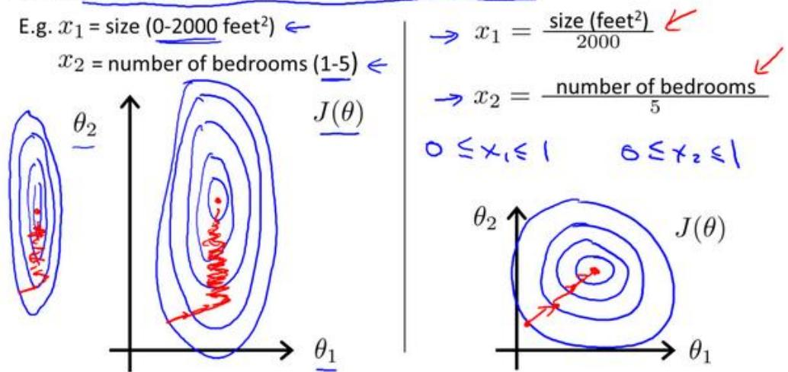

## 4.3 梯度下降法实践 1-特征缩放

## 参考视频: 4 - 3 - Gradient Descent in Practice I - Feature Scaling (9 min).mkv

在我们面对多维特征问题的时候，我们要保证这些特征都具有相近的尺度，这将帮助梯度下降算法更快地收敛。

以房价问题为例，假设我们使用两个特征，房屋的尺寸和房间的数量，尺寸的值为 0-2000 平方英尺，而房间数量的值则是 0-5，以两个参数分别为横纵坐标，绘制代价函数的等高线图能，看出图像会显得很扁，梯度下降算法需要非常多次的迭代才能收敛。

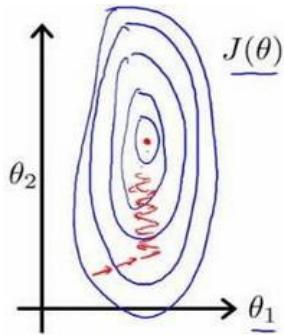

解决的方法是尝试将所有特征的尺度都尽量缩放到-1 到1之间。如图：

Feature Scaling

Idea: Make sure features are on a similar scale.

最简单的方法是令： $\begin{array} {r} {x_{n} = \frac{x_{n} - \mu_{n}} {s_{n}}} \end{array}$ ，其中 $\mu_{n}$ 是平均值， $s_{n}$ 是标准差。

## 4.4 梯度下降法实践 2-学习率

## 参考视频: 4 - 4 - Gradient Descent in Practice II - Learning Rate (9 min).mkv

梯度下降算法收敛所需要的迭代次数根据模型的不同而不同，我们不能提前预知，我们可以绘制迭代次数和代价函数的图表来观测算法在何时趋于收敛。

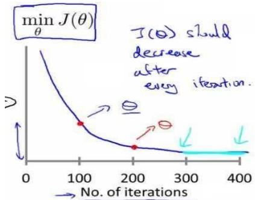

也有一些自动测试是否收敛的方法，例如将代价函数的变化值与某个阀值（例如 0.001）进行比较，但通常看上面这样的图表更好。

梯度下降算法的每次迭代受到学习率的影响，如果学习率α过小，则达到收敛所需的迭代次数会非常高；如果学习率α过大，每次迭代可能不会减小代价函数，可能会越过局部最小值导致无法收敛。

通常可以考虑尝试些学习率：

α = 0.010.030.10.31310

## 4.5 特征和多项式回归

## 参考视频: 4 - 5 - Features and Polynomial Regression (8 min).mkv

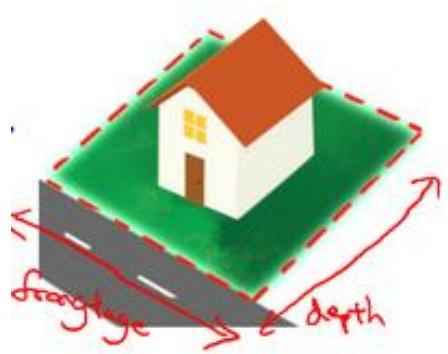

$$
h_{\theta} (x) = \theta_{0} + \theta_{1} \times f r o n t a g e + \theta_{2} \times d e p t h
$$

$x_{1} = f r o n t a g e$ （临街宽度）， $x_{2} = d e p t h$ （纵向深度）， $x = f r o n t a g e * d e p t h = a r e a$ （面积），则： $h_{\theta} ( x ) = \theta_{0} + \theta_{1} x$

线性回归并不适用于所有数据，有时我们需要曲线来适应我们的数据，比如一个二次方模型： $h_{\theta} ( x ) = \theta_{0} + \theta_{1} x_{1} + \theta_{2} x_{2} ^{2}$

或者三次方模型： $h_{\theta} ( x ) = \theta_{0} + \theta_{1} x_{1} + \theta_{2} x_{2} ^{2} + \theta_{3} x_{3} ^{3}$

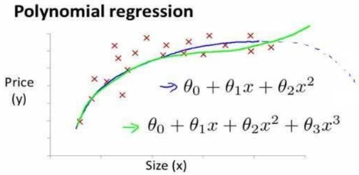

通常我们需要先观察数据然后再决定准备尝试怎样的模型。 另外，我们可以令：$x_{2} = x_{2} ^{2} , x_{3} = x_{3} ^{3}$ ，从而将模型转化为线性回归模型。

根据函数图形特性，我们还可以使：

$$
h_{\theta} (x) = \theta_{0} + \theta_{1} (s i z e) + \theta_{2} (s i z e) ^{2}
$$

或者:

$$
h_{\theta} (x) = \theta_{0} + \theta_{1} (s i z e) + \theta_{2} \sqrt{s i z e}
$$

注：如果我们采用多项式回归模型，在运行梯度下降算法前，特征缩放非常有必要。

## 4.6 正规方程

## 参考视频: 4 - 6 - Normal Equation (16 min).mkv

到目前为止，我们都在使用梯度下降算法，但是对于某些线性回归问题，正规方程方法是更好的解决方案。如：

$$
\begin{array}{l}{\mathrm{Intuition:If1D(\theta\in\mathbb{R})}}\\{\rightarrow J (\theta) = a \theta^{2} + b \theta + c}\end{array}
$$

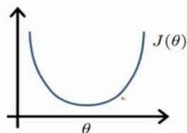

正规方程是通过求解下面的方程来找出使得代价函数最小的参数的： $\begin{array} {r} {\frac{\partial} {\partial \theta_{j}} J ( \theta_{j} ) = 0} \end{array}$ C假设我们的训练集特征矩阵为 X（包含了 $x_{0} = 1 )$ ）并且我们的训练集结果为向量 y，则利用正规方程解出向量 $\theta = ( X^{T} X ) ^{- 1} X^{T} y$ 0

上标T 代表矩阵转置，上标-1 代表矩阵的逆。设矩阵 $A = X^{T} X$ ，则： $( X^{T} X ) ^{- 1} = A^{- 1}$ 以下表示数据为例：

Examples: m = 4.

<table><tr><td rowspan="2"> $x_0$ ↓</td><td>Size (feet2)</td><td>Number of bedrooms</td><td>Number of floors</td><td>Age of home (years)</td><td>Price ($1000)</td></tr><tr><td> $x_1$ </td><td> $x_2$ </td><td> $x_3$ </td><td> $x_4$ </td><td>y</td></tr><tr><td>1</td><td>2104</td><td>5</td><td>1</td><td>45</td><td>460</td></tr><tr><td>1</td><td>1416</td><td>3</td><td>2</td><td>40</td><td>232</td></tr><tr><td>1</td><td>1534</td><td>3</td><td>2</td><td>30</td><td>315</td></tr><tr><td>1</td><td>852</td><td>2</td><td>1</td><td>36</td><td>178</td></tr></table>

$$
X = \left[ \begin{array}{c c c c c} 1 & 2104 & 5 & 1 & 45 \\ 1 & 1416 & 3 & 2 & 40 \\ 1 & 1534 & 3 & 2 & 30 \\ 1 & 852 & 2 & 1 & 36 \end{array} \right]
$$

即：

<table><tr><td>X(0)</td><td>X(1)</td><td>X(2)</td><td>X(3)</td><td>X(4)</td><td>y</td></tr><tr><td>1</td><td>2104</td><td>5</td><td>1</td><td>45</td><td>460</td></tr><tr><td>1</td><td>1416</td><td>3</td><td>2</td><td>40</td><td>232</td></tr><tr><td>1</td><td>1534</td><td>3</td><td>2</td><td>30</td><td>315</td></tr><tr><td>1</td><td>852</td><td>2</td><td>1</td><td>36</td><td>178</td></tr></table>

运用正规方程方法求解参数：

$$
\left(\left[ \begin{array}{c c c c} 1 & 1 & 1 & 1 \\ 2104 & 1416 & 1534 & 852 \\ 5 & 3 & 3 & 2 \\ 1 & 2 & 2 & 1 \\ 45 & 40 & 30 & 36 \end{array} \right] \times \left[ \begin{array}{c c c c c} 1 & 2104 & 5 & 1 & 45 \\ 1 & 1416 & 3 & 2 & 40 \\ 1 & 1534 & 3 & 2 & 30 \\ 1 & 852 & 2 & 1 & 36 \end{array} \right]\right) ^{- 1} \times \left[ \begin{array}{c c c c} 1 & 1 & 1 & 1 \\ 2104 & 1416 & 1534 & 852 \\ 5 & 3 & 3 & 2 \\ 1 & 2 & 2 & 1 \\ 45 & 40 & 30 & 3. 6 \end{array} \right] \times \left[ \begin{array}{c} 460 \\ 232 \\ 315 \\ 178 \end{array} \right]
$$

在 Octave 中，正规方程写作：

```csv
pinv(X'*X)*X'*y
```

注：对于那些不可逆的矩阵（通常是因为特征之间不独立，如同时包含英尺为单位的尺寸和米为单位的尺寸两个特征，也有可能是特征数量大于训练集的数量），正规方程方法是不能用的。

梯度下降与正规方程的比较：

<table><tr><td>梯度下降</td><td>正规方程</td></tr><tr><td>需要选择学习率 $\alpha$ </td><td>不需要</td></tr><tr><td>需要多次迭代</td><td>一次运算得出</td></tr><tr><td>当特征数量 $n$ 大时也能较好适用</td><td>需要计算 $(X^T X)^{-1}$  如果特征数量 $n$ 较大则运算代价大,因为矩阵逆的计算时间复杂度为 $O(n^3)$ ,通常来说当 $n$ 小于 10000 时还是可以接受的</td></tr><tr><td>适用于各种类型的模型</td><td>只适用于线性模型,不适合逻辑回归模型等其他模型</td></tr></table>

总结一下，只要特征变量的数目并不大，标准方程是一个很好的计算参数θ的替代方法。具体地说，只要特征变量数量小于一万，我通常使用标准方程法，而不使用梯度下降法。

随着我们要讲的学习算法越来越复杂，例如，当我们讲到分类算法，像逻辑回归算法，我们会看到，实际上对于那些算法，并不能使用标准方程法。对于那些更复杂的学习算法，我们将不得不仍然使用梯度下降法。因此，梯度下降法是一个非常有用的算法，可以用在有大量特征变量的线性回归问题。或者我们以后在课程中，会讲到的一些其他的算法，因为标准方程法不适合或者不能用在它们上。但对于这个特定的线性回归模型，标准方程法是一个比梯度下降法更快的替代算法。所以，根据具体的问题，以及你的特征变量的数量，这两种算法都是值得学习的。

正规方程的python 实现：

```python
import numpy as np
def normalEqn(X, y):
    theta = np.linalg.inv(X.T@X)@X.T@y #X.T@X 等价于 X.T.dot(X)
    return theta
```

## 4.7 正规方程及不可逆性（选修）

## 参考视频: 4 - 7 - Normal Equation Noninvertibility (Optional) (6 min).mkv

在这段视频中谈谈正规方程 ( normal equation)，以及它们的不可逆性。 由于这是一种较为深入的概念，并且总有人问我有关这方面的问题，因此，我想在这里来讨论它，由于概念较为深入，所以对这段可选材料大家放轻松吧，也许你可能会深入地探索下去，并且会觉得理解以后会非常有用。但即使你没有理解正规方程和线性回归的关系，也没有关系。

我们要讲的问题如下： $\theta = ( X^{T} X ) ^{- 1} X^{T} y$

备注：本节最后我把推导过程写下。

有些同学曾经问过我，当计算 $ \theta = \mathrm{\bf i n v} ( {\bf X} ^{\prime} {\bf X} ) \mathrm{~ \sf ~ X} ^{\prime} {\bf y}$ ，那对于矩阵 X′X 的结果是不可逆的情况咋办呢?

如果你懂一点线性代数的知识，你或许会知道，有些矩阵可逆，而有些矩阵不可逆。我们称那些不可逆矩阵为奇异或退化矩阵。

问题的重点在于 X′X 的不可逆的问题很少发生，在Octave里，如果你用它来实现 θ 的计算，你将会得到一个正常的解。在 Octave 里，有两个函数可以求解矩阵的逆，一个被称为pinv()，另一个是 inv()，这两者之间的差异是些许计算过程上的，一个是所谓的伪逆，另一个被称为逆。使用pinv() 函数可以展现数学上的过程，这将计算出 θ 的值，即便矩阵 X′X 是不可逆的。

在pinv() 和 inv() 之间，又有哪些具体区别呢 ?

其中inv() 引入了先进的数值计算的概念。例如，在预测住房价格时，如果 $x_{1}$ 是以英尺为尺寸规格计算的房子， $x_{2}$ 是以平方米为尺寸规格计算的房子，同时，你也知道1 米等于3.28 英尺 ( 四舍五入到两位小数 )，这样，你的这两个特征值将始终满足约束： $x_{1} = x_{2}$ ∗(3.28)<sup>2</sup>。

实际上，你可以用这样的一个线性方程，来展示那两个相关联的特征值，矩阵 X′X 将是不可逆的。

第二个原因是，在你想用大量的特征值，尝试实践你的学习算法的时候，可能会导致矩阵 X′X 的结果是不可逆的。 具体地说，在 m 小于或等于 n 的时候，例如，有 m 等于 10 个的训练样本也有 n 等于100的特征数量。要找到适合的(n+1) 维参数矢量 θ，这将会变成一个101 维的矢量，尝试从 10 个训练样本中找到满足 101 个参数的值，这工作可能会让你花上一阵子时间，但这并不总是一个好主意。因为，正如我们所看到你只有 10 个样本，以适应这100 或101个参数，数据还是有些少。

稍后我们将看到，如何使用小数据样本以得到这100 或101个参数，通常，我们会使用一种叫做正则化的线性代数方法，通过删除某些特征或者是使用某些技术，来解决当 m 比 n 小的时候的问题。即使你有一个相对较小的训练集，也可使用很多的特征来找到很多合适的参数。 总之当你发现的矩阵 X′X 的结果是奇异矩阵，或者找到的其它矩阵是不可逆的，我会建议你这么做。

首先，看特征值里是否有一些多余的特征，像这些 $x_{1}$ 和 $x_{2}$ 是线性相关的，互为线性函数。同时，当有一些多余的特征时，可以删除这两个重复特征里的其中一个，无须两个特征同时保留，将解决不可逆性的问题。因此，首先应该通过观察所有特征检查是否有多余的特征，如果有多余的就删除掉，直到他们不再是多余的为止，如果特征数量实在太多，我会删除些用较少的特征来反映尽可能多内容，否则我会考虑使用正规化方法。如果矩阵 X′X 是不可逆的，（通常来说，不会出现这种情况），如果在Octave里，可以用伪逆函数pinv() 来实现。这种使用不同的线性代数库的方法被称为伪逆。即使 X′X 的结果是不可逆的，但算法执行的流程是正确的。总之，出现不可逆矩阵的情况极少发生，所以在大多数实现线性回归中，出现不可逆的问题不应该过多的关注 $X^{T} X$ 是不可逆的。

增加内容：

θ = (X<sup>T</sup>X)<sup>−1</sup>X<sup>T</sup>y 的推导过程：

$$
J (\theta) = \frac{1}{2 m} \sum_{i = 1} ^{m} \bigl (h_{\theta} \bigl (x^{(i)} \bigr) - y^{(i)} \bigr) ^{2} \mathrm{其中}: h_{\theta} (x) = \theta^{T} X = \theta_{0} x_{0} + \theta_{1} x_{1} + \theta_{2} x_{2} +... + \theta_{n} x_{n}
$$

将向量表达形式转为矩阵表达形式，则有 $\begin{array} {r} {J ( \theta ) = \frac{1} {2} ( X \theta - y ) ^{2}} \end{array}$ ，其中 X 为 m 行 n 列的矩阵（m 为样本个数，n 为特征个数）， $\theta$ 为 n 行 1 列的矩阵，y 为 m 行 1 列的矩阵，对J(θ)进行如下变换:

$$
\begin{array}{c} {J (\theta) = \frac{1}{2} (X \theta - y) ^{T} (X \theta - y)} \\ {= \frac{1}{2} (\theta^{T} X^{T} - y^{T}) (X \theta - y)} \\ {= \frac{1}{2} (\theta^{T} X^{T} X \theta - \theta^{T} X^{T} y - y^{T} X \theta - y^{T} y)} \end{array}
$$

接下来对J(θ)偏导，需要用到以下几个矩阵的求导法则:

$$
\frac{d A B}{d B} = A^{T}
$$

$$
\frac{d X^{T} A X}{d X} = 2 A X
$$

所以有:

$$
\begin{array}{c} \frac{\partial J (\theta)}{\partial \theta} = \frac{1}{2} (2 X^{T} X \theta - X^{T} y - (y^{T} X) ^{T} - 0) \\ = \frac{1}{2} (2 X^{T} X \theta - X^{T} y - X^{T} y - 0) \\ = X^{T} X \theta - X^{T} y \end{array}
$$

S7 $\begin{array} {r} {\frac{\partial J ( \theta )} {\partial \theta} = 0 ,} \end{array}$

则有 $\theta = ( X^{T} X ) ^{- 1} X^{T} y$

## 5、 Octave 教程(Octave Tutorial)

## 5.1 基本操作

## 参考视频: 5 - 1 - Basic Operations (14 min).mkv

在这段视频中，我将教你一种编程语言：Octave语言。你能够用它来非常迅速地实现这门课中我们已经学过的，或者将要学的机器学习算法。

过去我一直尝试用不同的编程语言来教授机器学习，包括 C++、Java、Python、Numpy和 Octave。我发现当使用像 Octave这样的高级语言时，学生能够更快更好地学习并掌握这些算法。事实上，在硅谷，我经常看到进行大规模的机器学习项目的人，通常使用的程序语言就是Octave。(编者注：这是当时的情况，现在主要是用 Python)

Octave 是一种很好的原始语言(prototyping language)，使用 Octave 你能快速地实现你的算法，剩下的事情，你只需要进行大规模的资源配置，你只用再花时间用C++或Java这些语言把算法重新实现就行了。开发项目的时间是很宝贵的，机器学习的时间也是很宝贵的。所以，如果你能让你的学习算法在 Octave 上快速的实现，基本的想法实现以后，再用 C++或者Java去改写，这样你就能节省出大量的时间。

据我所见，人们使用最多的用于机器学习的原始语言是 Octave、MATLAB、Python、NumPy和R。

Octave 很好，因为它是开源的。当然 MATLAB 也很好，但它不是每个人都买得起的。(貌似国内学生喜欢用收费的 matlab，matlab 功能要比 Octave 强大的多，网上有各种 D 版可以下载)。这次机器学习课的作业也是用 matlab的。如果你能够使用matlab，你也可以在这门课里面使用。

如果你会Python、NumPy或者R 语言，我也见过有人用 R 的，据我所知，这些人不得不中途放弃了，因为这些语言在开发上比较慢，而且，因为这些语言如：Python、NumPy的语法相较于Octave来说，还是更麻烦一点。正因为这样，所以我强烈建议不要用 NumPy 或者R来完整这门课的作业，我建议在这门课中用Octave来写程序。

本视频将快速地介绍一系列的命令，目标是迅速地展示，通过这一系列Octave的命令，让你知道Octave能用来做什么。

启动 Octave：

现在打开 Octave，这是 Octave 命令行。

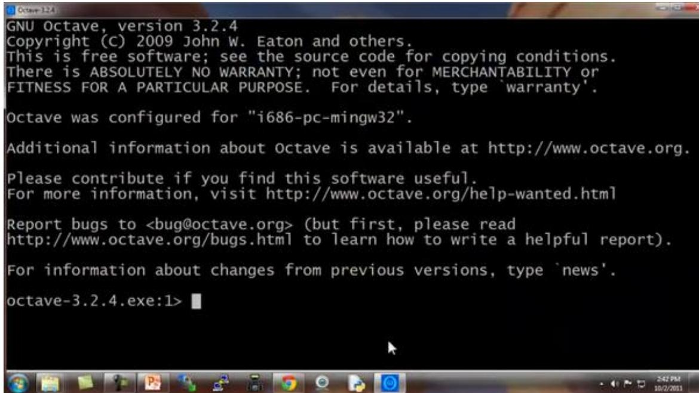

现在让我示范最基本的Octave代码：

输入5 + 6，然后得到 11。

输入3 –2、5×8、1/2、2^6 等等，得到相应答案。

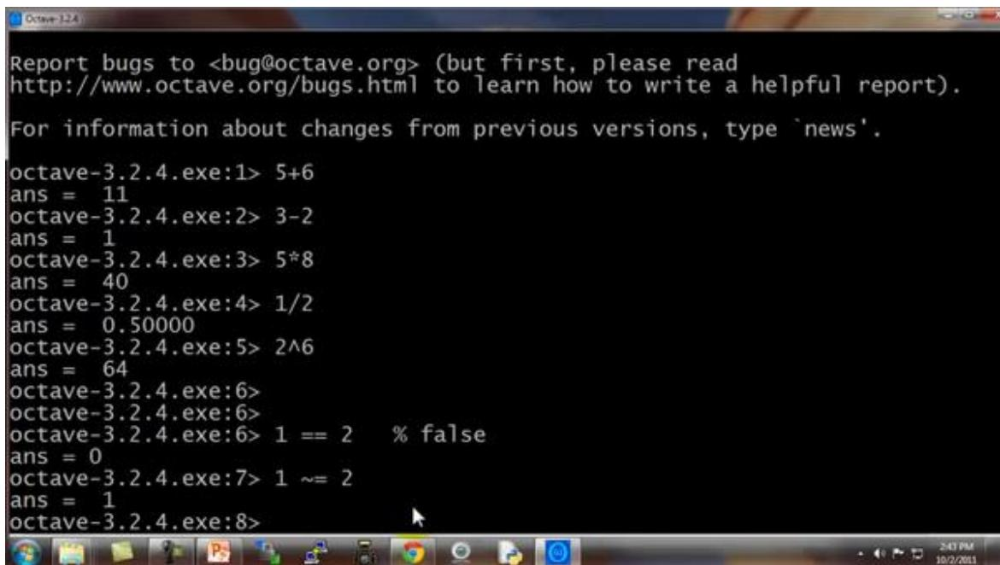  
这些都是基本的数学运算。

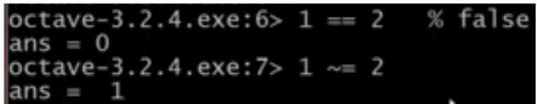

你也可以做逻辑运算，例如 1==2，计算结果为 false(假)，这里的百分号命令表示注释，1==2 计算结果为假，这里用 0表示。

请注意，不等于符号的写法是这个波浪线加上等于符号 ( \~= )，而不是等于感叹号加等号( != )，这是和其他一些编程语言中不太一样的地方。

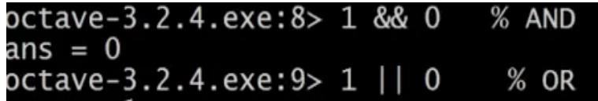

让我们看看逻辑运算 1 && 0，使用双&符号表示逻辑与，1 && 0 判断为假，1和 0的或运算 1 || 0，其计算结果为真。

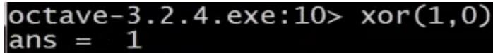

还有异或运算如 XOR ( 1, 0 )，其返回值为 1

从左向右写着 Octave 324.x 版本，是默认的 Octave 提示，它显示了当前 Octave 的版本，以及相关的其它信息。

如果你不想看到那个提示，这里有一个隐藏的命令：

输入命令

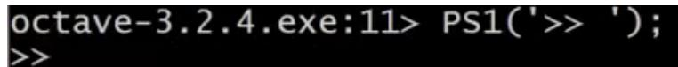

现在命令提示已经变得简化了。

接下来，我们将谈到 Octave的变量。

现在写一个变量，对变量 a 赋值为3，并按下回车键，显示变量 a 等于 3。

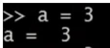

如果你想分配一个变量，但不希望在屏幕上显示结果，你可以在命令后加一个分号，可以抑制打印输出，敲入回车后，不打印任何东西。

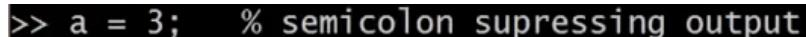

其中这句命令不打印任何东西。

现在举一个字符串的例子：变量 b 等于"hi"。

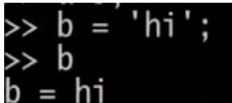

c 等于3 大于等于1，所以，现在 c 变量的值是真。

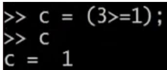

如果你想打印出变量，或显示一个变量，你可以像下面这么做：

设置 a 等于圆周率 π，如果我要打印该值，那么只需键入a 像这样就打印出来了。

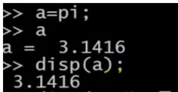  
对于更复杂的屏幕输出，也可以用 DISP 命令显示：

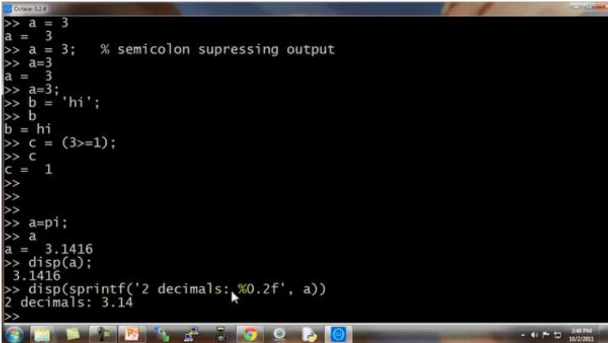

这是一种，旧风格的C语言语法，对于之前就学过C语言的同学来说，你可以使用这种基本的语法来将结果打印到屏幕。

例如 ^{T}命令的六个小数：0.6%f ,a，这应该打印 a 的 6 位小数形式。

也有一些控制输出长短格式的快捷命令：

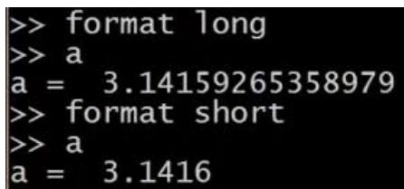

下面，让我们来看看向量和矩阵：

比方说建立一个矩阵 A：

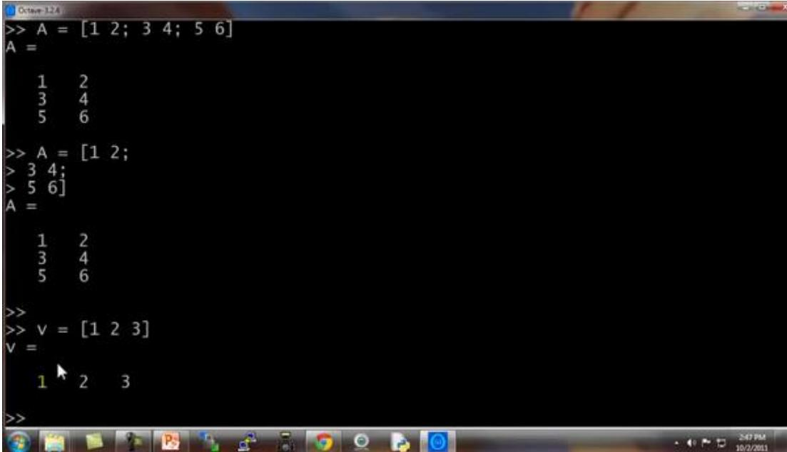

对 A 矩阵进行赋值，考虑到这是一个三行两列的矩阵，你同样可以用向量。

建立向量 V 并赋值 1 2 3，V 是一个行向量，或者说是一个3 ( 列 )×1 ( 行 )的向量，或者说，一行三列的矩阵。

如果我想，分配一个列向量，我可以写“1;2;3”，现在便有了一个3 行 1 列的向量，同时这是一个列向量。

下面是一些更为有用的符号，如：

V=1：0.1：2

这个该如何理解呢：这个集合 v 是一组值，从数值1开始，增量或说是步长为0.1，直到增加到 2，按照这样的方法对向量 v 操作，可以得到一个行向量，这是一个 1 行 11 列的矩阵，其矩阵的元素是 1 1.1 1.2 1.3，依此类推，直到数值2。

我也可以建立一个集合 v 并用命令“1:6”进行赋值，这样 v 就被赋值了1至6的六个整数。

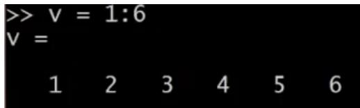  
这里还有一些其他的方法来生成矩阵

例如“ones(2, 3)”，也可以用来生成矩阵：

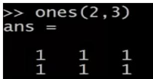  
元素都为2，两行三列的矩阵，就可以使用这个命令：

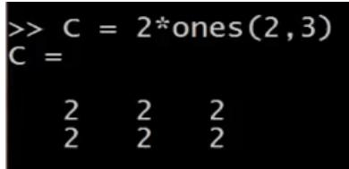

## 2222

你可以把这个方法当成一个生成矩阵的快速方法。

w 为一个一行三列的零矩阵，一行三列的 w 矩阵里的元素全部是零：

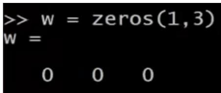

还有很多的方式来生成矩阵。

如果我对 W 进行赋值，用 Rand命令建立一个一行三列的矩阵，因为使用了Rand命令，则其一行三列的元素均为随机值，如“rand(3,3)”命令，这就生成了一个3×3 的矩阵，并且其所有元素均为随机。

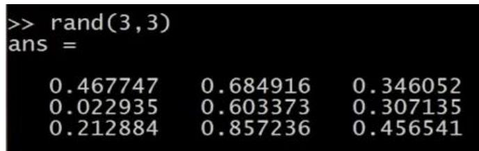

0.4677470.6849160.3460520.0229350.6033730.3071350.2128840.8572360.456541

数值介于0 和1之间，所以，正是因为这一点，我们可以得到数值均匀介于0和 1之间的元素。

如果，你知道什么是高斯随机变量，或者，你知道什么是正态分布的随机变量，你可以设置集合 w，使其等于一个一行三列的 w 矩阵，并且，来自三个值，一个平均值为 0的高斯分布，方差或者等于 1的标准偏差。

>> w = randn(1,3)

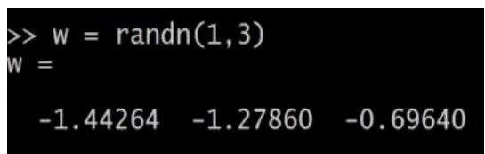

-1.44264 -1.27860 -0.69640

还可以设置地更复杂：

并用hist命令绘制直方图。

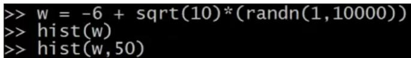

绘制单位矩阵：

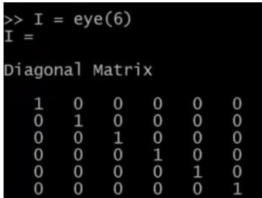  
如果对命令不清楚，建议用 help命令：

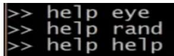

以上讲解的内容都是 Octave 的基本操作。希望你能通过上面的讲解，自己练习一些矩阵、乘、加等操作，将这些操作在Octave中熟练运用。

在接下来的视频中，将会涉及更多复杂的命令，并使用它们在 Octave 中对数据进行更多的操作。

## 5.2 移动数据

## 参考视频: 5 - 2 - Moving Data Around (16 min).mkv

在这段关于 Octave 的辅导课视频中，我将开始介绍如何在 Octave 中移动数据。

如果你有一个机器学习问题，你怎样把数据加载到 Octave 中？

怎样把数据存入一个矩阵？

如何对矩阵进行相乘？

如何保存计算结果？

如何移动这些数据并用数据进行操作？

进入我的 Octave 窗口，

我键入 A，得到我们之前构建的矩阵 A，也就是用这个命令生成的：

A = [12; 34; 56]

这是一个3 行2列的矩阵，Octave 中的 size() 命令返回矩阵的尺寸。

所以 size(A) 命令返回 32

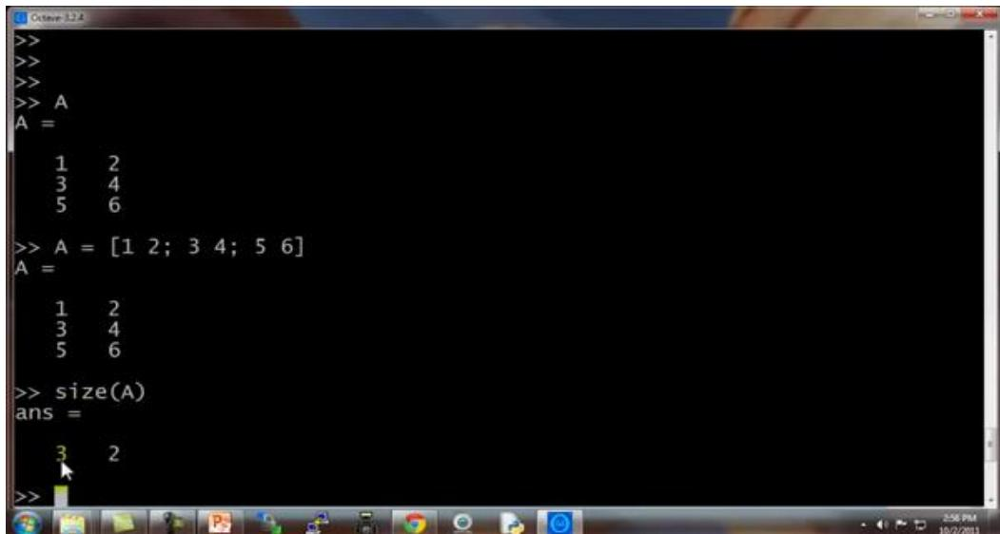  
实际上，size() 命令返回的是一个 1×2 的矩阵，我们可以用 sz 来存放。

因此 sz 就是一个 1×2的矩阵，第一个元素是3，第二个元素是2。

所以如果键入 size(sz) 看看 sz 的尺寸，返回的是12，表示是一个1×2 的矩阵，1和 2 分别表示矩阵 A 的维度 。

你也可以键入 ${\mathsf{s i z e}} ( {\mathsf{A}} , \quad 1 )$ ，将返回3，这个命令会返回 A 矩阵的第一个元素，A 矩阵

的第一个维度的尺寸，也就是 A 矩阵的行数。

同样，命令 size(A, 2)，将返回2，也就是 A 矩阵的列数。

如果你有一个向量 v，假如 v = [1 2 3 4]，然后键入 length(v)，这个命令将返回最大维度的大小，返回4。

你也可以键入 length(A)，由于矩阵 A 是一个 3×2 的矩阵，因此最大的维度应该是 3，因此该命令会返回3。

但通常我们还是对向量使用 length 命令，而不是对矩阵使用 length 命令，比如length([1;2;3;4;5])，返回 5。

如何在系统中加载数据和寻找数据：

当我们打开 Octave 时，我们通常已经在一个默认路径中，这个路径是 Octave 的安装位置，pwd 命令可以显示出 Octave 当前所处路径。

cd 命令，意思是改变路径，我可以把路径改为 C:\Users\ang\Desktop，这样当前目录就变为了桌面。

如果键入 ls，ls 来自于一个 Unix 或者 Linux 命令，ls命令将列出我桌面上的所有路径。

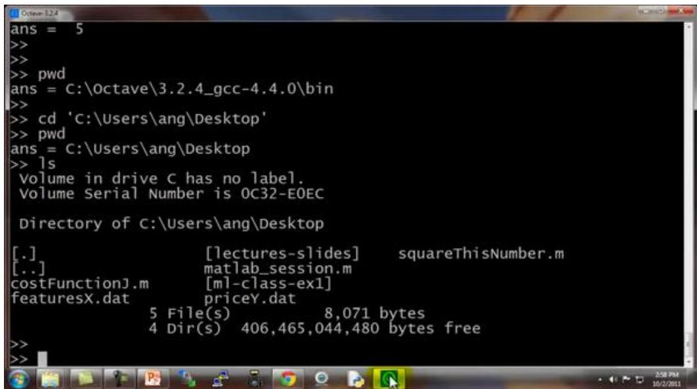

事实上，我的桌面上有两个文件：featuresX.dat 和 priceY.dat，是两个我想解决的机器学习问题。

featuresX 文件如这个窗口所示，是一个含有两列数据的文件，其实就是我的房屋价格数据，数据集中有47行，第一个房子样本，面积是2104平方英尺，有3 个卧室，第二套房子面积为1600，有3 个卧室等等。

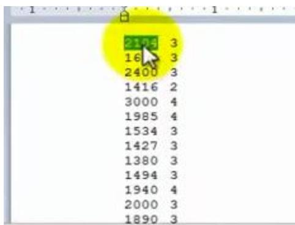

priceY这个文件就是训练集中的价格数据，所以 featuresX 和priceY 就是两个存放数据的文档，那么应该怎样把数据读入 Octave 呢？我们只需要键入featuresX.dat，这样我将加载了 featuresX 文件。同样地我可以加载 priceY.dat。其实有好多种办法可以完成，如果你把命令写成字符串的形式 load('featureX.dat')，也是可以的，这跟刚才的命令效果是相同的，只不过是把文件名写成了一个字符串的形式，现在文件名被存在一个字符串中。Octave中使用引号来表示字符串。

另外 who 命令，能显示出在我的 Octave工作空间中的所有变量  
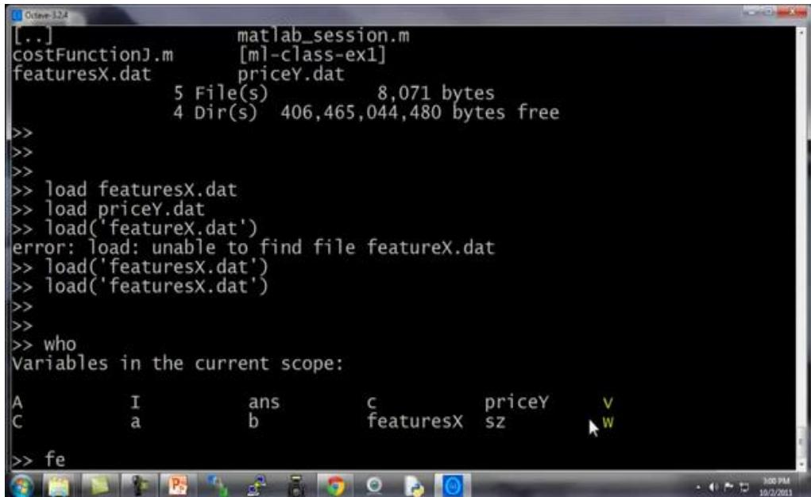  
所以我可以键入 featuresX 回车，来显示 featuresX

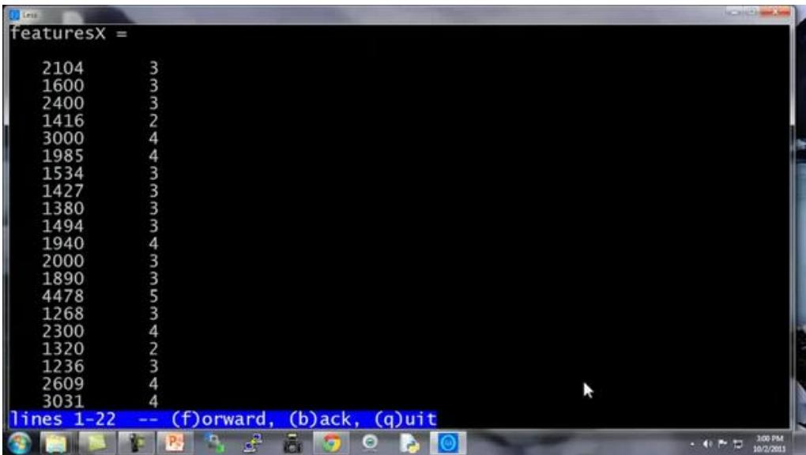  
这些就是存在里面的数据。

还可以键入 size(featuresX)，得出的结果是 472，代表这是一个 47×2 的矩阵。

类似地，输入 size(priceY)，结果是 47 1，表示这是一个47维的向量，是一个列矩阵，存放的是训练集中的所有价格 y 的值。

who 函数能让你看到当前工作空间中的所有变量，同样还有另一个 whos 命令，能更详细地进行查看。

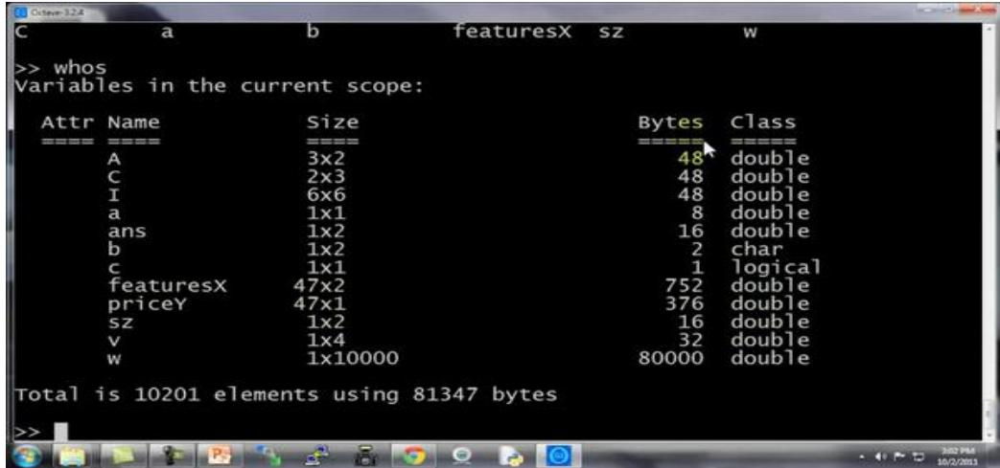  
同样也列出我所有的变量，不仅如此，还列出了变量的维度。

double 意思是双精度浮点型，这也就是说，这些数都是实数，是浮点数。

如果你想删除某个变量，你可以使用 clear 命令，我们键入 clear featuresX，然后再输入 whos 命令，你会发现 featuresX 消失了。

另外，我们怎么储存数据呢？

我们设变量 V= priceY(1:10)

这表示的是将向量 y 的前10 个元素存入 V 中。

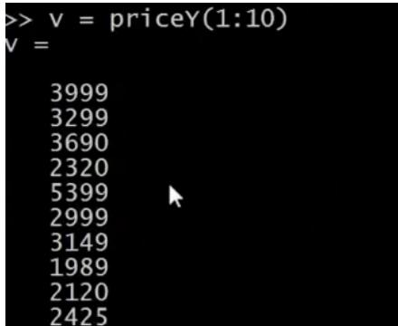

假如我们想把它存入硬盘，那么用 save hello.mat v 命令，这个命令会将变量 V 存成一个叫 hello.mat 的文件，让我们回车，现在我的桌面上就出现了一个新文件，名为hello.mat。

由于我的电脑里同时安装了 MATLAB，所以这个图标上面有 MATLAB 的标识，因为操作系统把文件识别为 MATLAB 文件。如果在你的电脑上图标显示的不一样的话，也没有关系。

现在我们清除所有变量，直接键入clear，这样将删除工作空间中的所有变量，所以现在工作空间中啥都没了。

但如果我载入 hello.mat 文件，我又重新读取了变量 V，因为我之前把变量 V 存入了hello.mat 文件中，所以我们刚才用 save 命令做了什么。这个命令把数据按照二进制形式储存，或者说是更压缩的二进制形式，因此，如果 V 是很大的数据，那么压缩幅度也更大，占用空间也更小。如果你想把数据存成一个人能看懂的形式，那么可以键入：

save hello.txt v -ascii

这样就会把数据存成一个文本文档，或者将数据的 ascii 码存成文本文档。

我键入了这个命令以后，我的桌面上就有了 hello.txt 文件。如果打开它，我们可以发现这个文本文档存放着我们的数据。

这就是读取和储存数据的方法。

接下来我们再来讲讲操作数据的方法：

假如 A 还是那个矩阵:

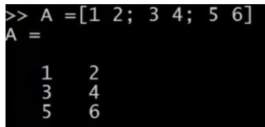

跟刚才一样还是那个 3×2 的矩阵，现在我们加上索引值，比如键入 A(3,2)

这将索引到 A 矩阵的 (3,2) 元素。这就是我们通常书写矩阵的形式，写成 A(3,2)，3 和2 分别表示矩阵的第三行和第二列对应的元素，因此也就对应 6。

我也可以键入A(2,:) 来返回第二行的所有元素，冒号表示该行或该列的所有元素。类似地，如果我键入 A(:,2)，这将返回 A 矩阵第二列的所有元素，这将得到 2 4 6。这表示返回 A 矩阵的第二列的所有元素。

你也可以在运算中使用这些较为复杂的索引。

我再给你展示几个例子，可能你也不会经常使用，但我还是输入给你看 A([1 3],:)，这个命令意思是取 A 矩阵第一个索引值为1或3 的元素，也就是说我取的是A 矩阵的第一行和第三行的每一列，冒号表示的是取这两行的每一列元素，即：

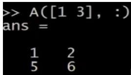

可能这些比较复杂一点的索引操作你会经常用到。

我们还能做什么呢？依然是 A 矩阵，A(:,2) 命令返回第二列。

你也可以为它赋值，我可以取 A 矩阵的第二列，然后将它赋值为10 11 12，我实际上是取出了 A 的第二列，然后把一个列向量[10;11;12]赋给了它，因此现在 A 矩阵的第一列还是 1 3 5，第二列就被替换为 10 11 12。

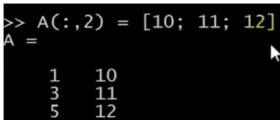

接下来一个操作，让我们把 A 设为 A = [A, [100; 101;102]]，这样做的结果是在原矩阵的右边附加了一个新的列矩阵，就是把 A 矩阵设置为原来的 A 矩阵再在右边附上一个新添加的列矩阵。

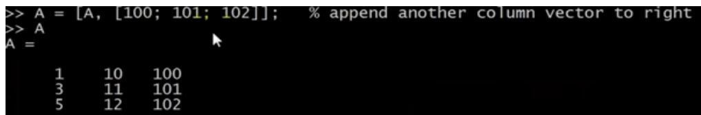

最后，还有一个小技巧，如果你就输入 A(:)，这是一个很特别的语法结构，意思是把 A 中的所有元素放入一个单独的列向量，这样我们就得到了一个 9×1 的向量，这些元素都是 A 中的元素排列起来的。

再来几个例子：

我还是把 A 重新设为 [1 2; 3 4; 5 6]，我再设一个 B 为[11 12; 13 14; 15 16]，我可以新建一个矩阵 $C , \textsf{C} = \lfloor \textsf{A} \textsf{B} \rfloor$ ，这个意思就是把这两个矩阵直接连在一起，矩阵 A 在左边，矩阵 B 在右边，这样组成了 C 矩阵，就是直接把 A 和 B 合起来。

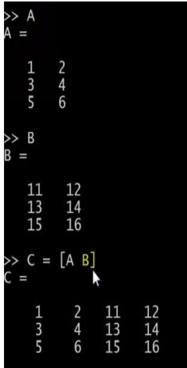

我还可以设 C = [A; B]，这里的分号表示把分号后面的东西放到下面。所以，[A;B]的作用依然还是把两个矩阵放在一起，只不过现在是上下排列，所以现在 A 在上面 B 在下面，C 就是一个 6×2 矩阵。

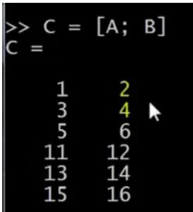

简单地说，分号的意思就是换到下一行，所以 C 就包括上面的 A，然后换行到下面，然后在下面放上一个 B。

另外顺便说一下，这个[A B]命令跟 [A, B] 是一样的，这两种写法的结果是相同的。

通过以上这些操作，希望你现在掌握了怎样构建矩阵，也希望我展示的这些命令能让你很快地学会怎样把矩阵放到一起，怎样取出矩阵，并且把它们放到一起，组成更大的矩阵。

通过几句简单的代码，Octave 能够很方便地很快速地帮助我们组合复杂的矩阵以及对数据进行移动。这就是移动数据这一节课。

我认为对你来讲，最好的学习方法是，下课后复习一下我键入的这些代码好好地看一看，从课程的网上把代码的副本下载下来，重新好好看看这些副本，然后自己在Octave 中把这些命令重新输一遍，慢慢开始学会使用这些命令。

当然，没有必要把这些命令都记住，你也不可能记得住。你要做的就是，了解一下你可以用哪些命令，做哪些事。这样在你今后需要编写学习算法时，如果你要找到某个Octave中的命令，你可能回想起你之前在这里学到过，然后你就可以查找课程中提供的程序副本，这样就能很轻松地找到你想使用的命令了。

## 5.3 计算数据

## 参考视频: 5 - 3 - Computing on Data (13 min).mkv

现在，你已经学会了在 Octave 中如何加载或存储数据，如何把数据存入矩阵等等。在这段视频中，我将介绍如何对数据进行运算，稍后我们将使用这些运算操作来实现我们的学习算法。

这是我的 Octave窗口，我现在快速地初始化一些变量。比如设置 A 为一个 3×2的矩阵，设置 B 为一个3 ×2 矩阵，设置 C 为2 × 2矩阵。

我想算两个矩阵的乘积，比如说 A×C，我只需键入 A×C，这是一个 3×2 矩阵乘以 2×2矩阵，得到这样一个 3×2矩阵。

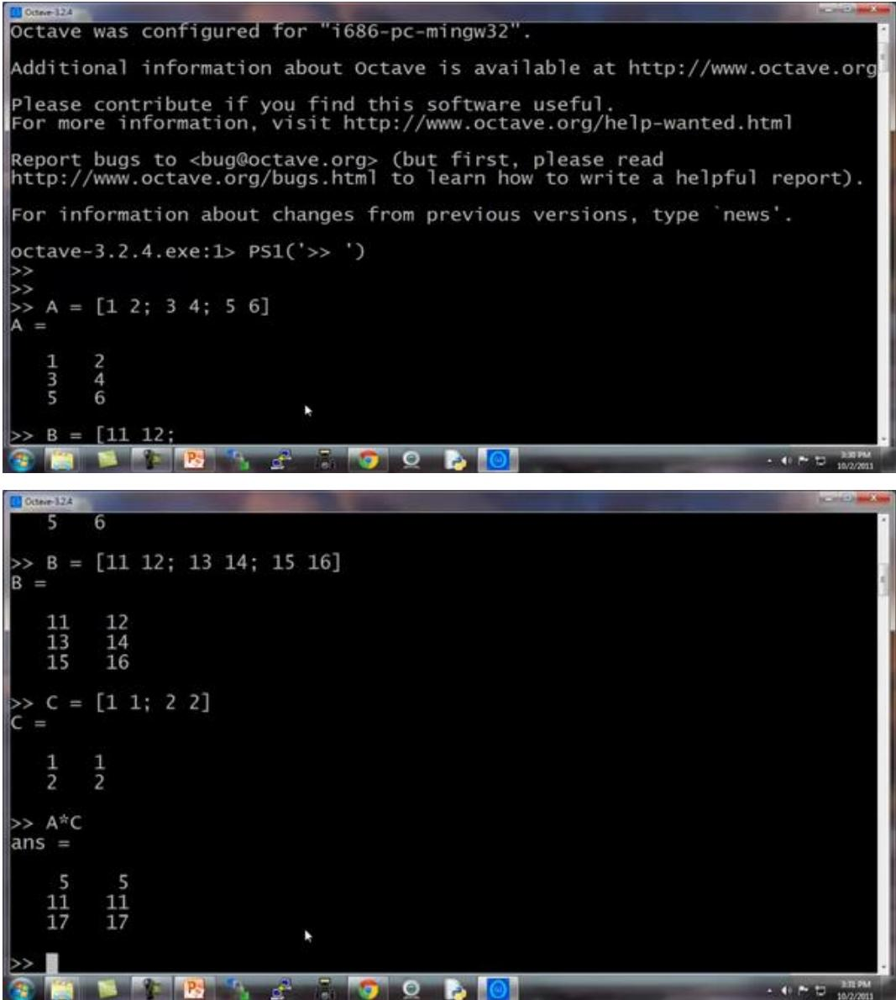

你也可以对每一个元素，做运算方法是做点乘运算 A.*B，这么做 Octave 将矩阵 A 中的每一个元素与矩阵 B 中的对应元素相乘:A.*B

这里第一个元素 1乘以11得到11，第二个元素2 乘以12得到24，这就是两个矩阵的元素位运算。通常来说，在 Octave中点号一般用来表示元素位运算。

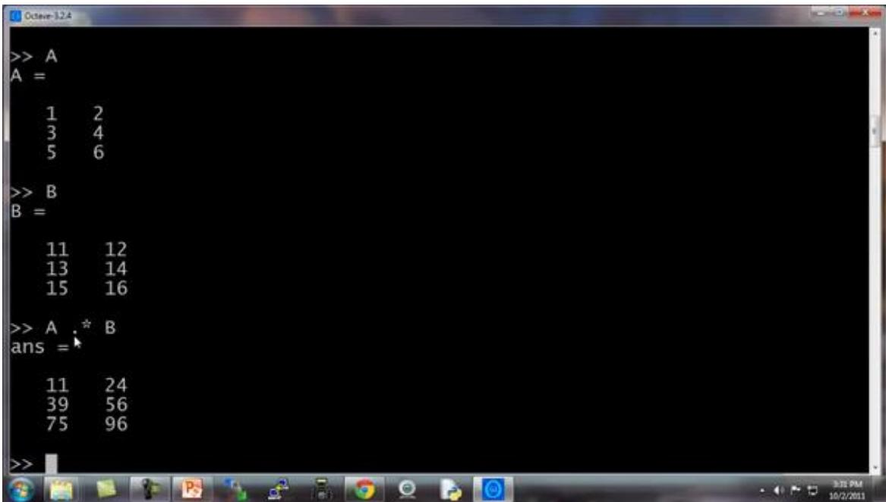  
这里是一个矩阵 A，这里我输入A.^2，这将对矩阵 A 中每一个元素平方。

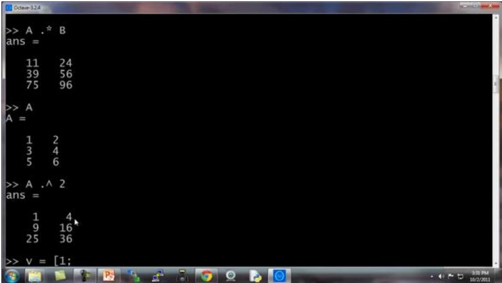

我们设 V 为 [1; 2; 3] 是列向量，你也可以输入1./V，得到每一个元素的倒数，所以这样一来，就会分别算出 1/1 1/2 1/3。

矩阵也可以这样操作，1./A 得到 A 中每一个元素的倒数。

同样地，这里的点号还是表示对每一个元素进行操作。

我们还可以进行求对数运算，也就是对每个元素进行求对数运算。

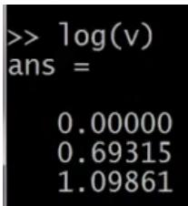

还有自然数 e 的幂次运算，就是以 e 为底，以这些元素为幂的运算。

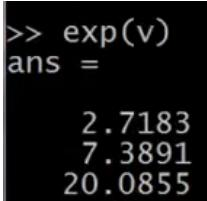

我还可以用 abs来对 v 的每一个元素求绝对值，当然这里 v 都是正数。我们换成另一个这样对每个元素求绝对值，得到的结果就是这些非负的元素。还有 –v，给出 v 中每个元素的相反数，这等价于 -1 乘以 v，一般就直接用 −v 就好了，其实就等于 −1∗v。

还有一个技巧，比如说我们想对 v 中的每个元素都加 1，那么我们可以这么做，首先构造一个3行1 列的1 向量，然后把这个1 向量跟原来的向量相加，因此 v 向量从[1 2 3] 增至[2 3 4]。我用了一个，length(v)命令，因此这样一来，ones(length(v) ,1) 就相当于ones(3,1)，然后我做的是 v +ones(3,1)，也就是将 v 的各元素都加上这些 1，这样就将 v 的每个元素增加了 1。

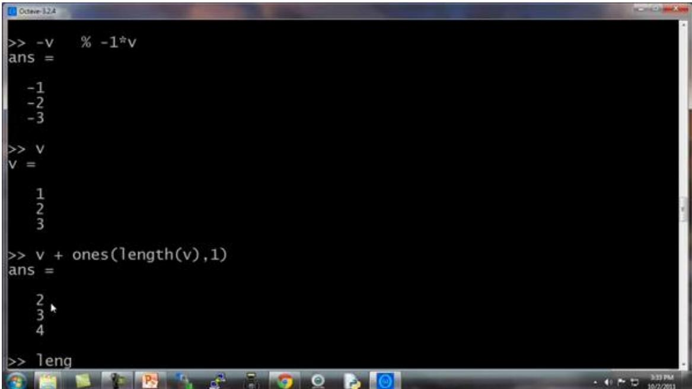  
另一种更简单的方法是直接用 v+1，v + 1 也就等于把 v 中的每一个元素都加上 1。

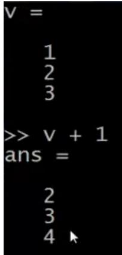  
现在，让我们来谈谈更多的操作。

矩阵 A 如果你想要求它的转置，那么方法是用 A’，将得出 A 的转置矩阵。当然，如果我写(A’)’，也就是 A 转置两次，那么我又重新得到矩阵 A。

还有一些有用的函数，比如： $\mathsf{a} = \left[ \mathsf{1} \ 15 \ 2 \ \mathsf{0} . 5 \right]$ ，这是一个1行4列矩阵， $\mathsf{v a l} \mathsf{= m a x} ( \mathsf{a} )$ 这将返回 a 矩阵中的最大值15。

我还可以写 $[ \mathsf{v a l} , \mathsf{i n d} ] = \mathsf{m a x} ( \mathsf{a} )$ ，这将返回 a 矩阵中的最大值存入 val，以及该值对应的索引，元素15 对应的索引值为2,存入 ind，所以 ind = 2。

特别注意一下，如果你用命令 max(A)，A 是一个矩阵的话，这样做就是对每一列求最大值。

我们还是用这个例子，这个 a 矩阵 $\mathsf{a} = \left[ \mathsf{1} \ \mathsf{15} \ \mathsf{2} \ \mathsf{0} . \mathsf{5} \right]$ ，如果输入a<3，这将进行逐元素的运算，所以元素小于3 的返回1，否则返回0。

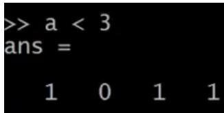

因此，返回[1 1 0 1]。也就是说，对 a 矩阵的每一个元素与3 进行比较，然后根据每一个元素与3的大小关系，返回 1和0 表示真与假。

如果我写 find(a<3)，这将告诉我 a 中的哪些元素是小于3 的。

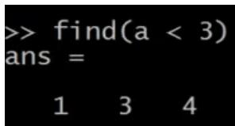

设 $\textsf{A} = \textsf{m a g i c} ( 3 )$ ，magic 函数将返回一个矩阵，称为魔方阵或幻方 (magic squares)，它们具有以下这样的数学性质：它们所有的行和列和对角线加起来都等于相同的值。

当然据我所知，这在机器学习里基本用不上，但我可以用这个方法很方便地生成一个3行3列的矩阵，而这个魔方矩阵这神奇的方形屏幕。每一行、每一列、每一个对角线三个数

字加起来都是等于同一个数。

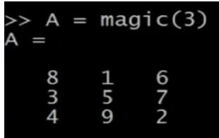

在其他有用的机器学习应用中，这个矩阵其实没多大作用。

如果我输入 $[ \mathsf{r} , \mathsf{c} ] = \mathsf{f i n d} \left( \mathsf{A} > = 7 \right)$ ，这将找出所有 A 矩阵中大于等于7 的元素，因此，r 和 c 分别表示行和列，这就表示，第一行第一列的元素大于等于 7，第三行第二列的元素大于等于7，第二行第三列的元素大于等于7。

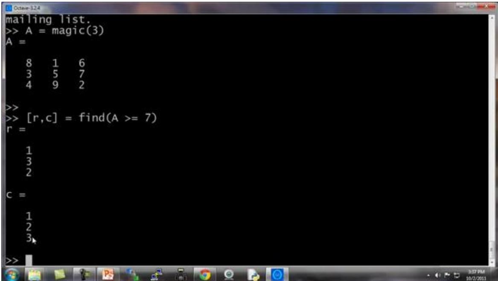

顺便说一句，其实我从来都不去刻意记住这个 find 函数，到底是怎么用的，我只需要会用help函数就可以了，每当我在使用这个函数，忘记怎么用的时候，我就可以用 help函数，键入 help find 来找到帮助文档。

最后再讲两个内容，一个是求和函数，这是 a 矩阵：

键入 sum(a)，就把 a 中所有元素加起来了。

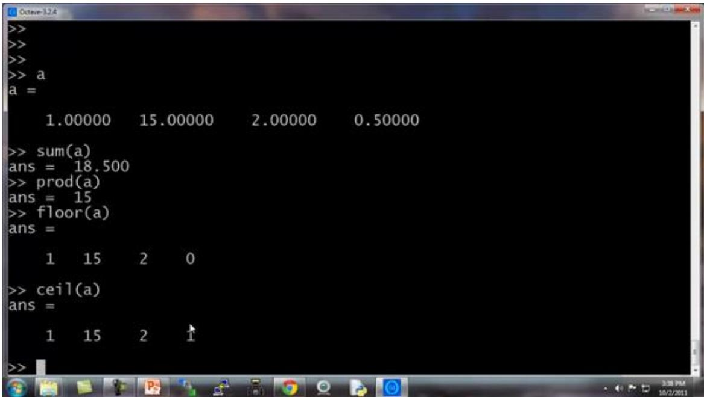

如果我想把它们都乘起来，键入 prod(a)，prod 意思是product(乘积)，它将返回这四个元素的乘积。

floor(a) 是向下四舍五入，因此对于 a 中的元素0.5将被下舍入变成0。

还有 ceil(a)，表示向上四舍五入，所以0.5 将上舍入变为最接近的整数，也就是1。

键入 type(3)，这通常得到一个 3×3 的矩阵，如果键入 max(rand(3),rand(3))，这样做的结果是返回两个3×3 的随机矩阵，并且逐元素比较取最大值。

假如我输入max(A,[],1)，这样做会得到每一列的最大值。

所以第一列的最大值就是 8，第二列是 9，第三列的最大值是 7，这里的 1 表示取 A 矩阵第一个维度的最大值。

相对地，如果我键入max(A,[],2)，这将得到每一行的最大值，所以，第一行的最大值是等于8，第二行最大值是7，第三行是9。

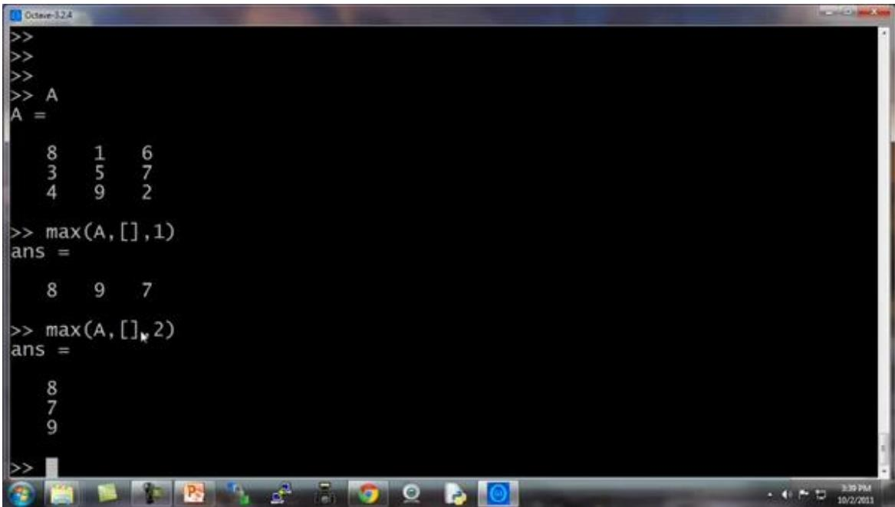

所以你可以用这个方法来求得每一行或每一列的最值，另外，你要知道，默认情况下max(A)返回的是每一列的最大值，如果你想要找出整个矩阵 A 的最大值，你可以输入max(max(A))，或者你可以将 A 矩阵转成一个向量，然后键入 max(A(:))，这样做就是把 A 当做一个向量，并返回 A 向量中的最大值。

最后，让我们把 A 设为一个 9 行 9 列的魔方阵，魔方阵具有的特性是每行每列和对角线的求和都是相等的。

这是一个9×9 的魔方阵，我们来求一个 sum(A,1)，这样就得到每一列的总和，这也验证了一个9×9 的魔方阵确实每一列加起来都相等，都为369。

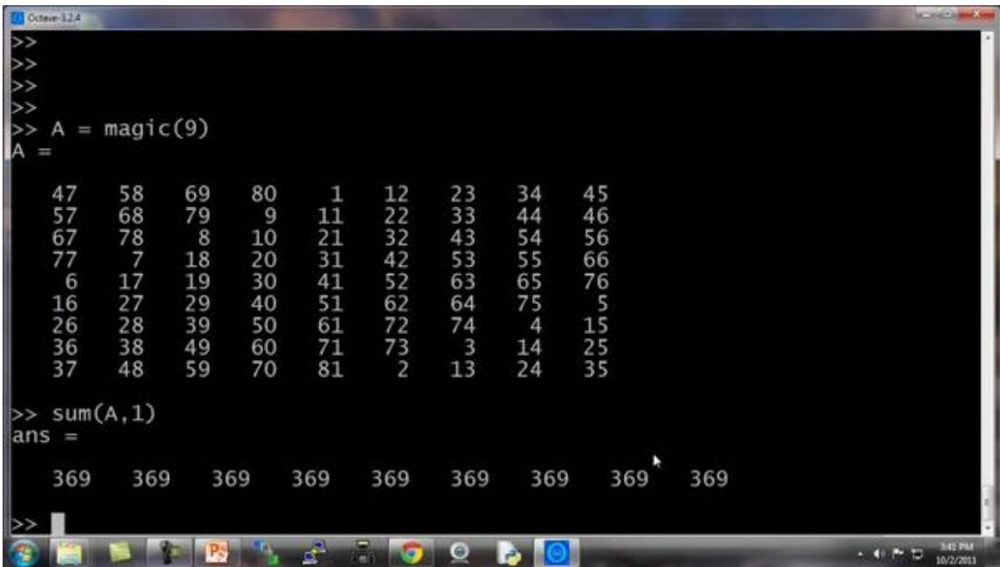

现在我们来求每一行的和，键入sum(A,2)，这样就得到了 A 中每一行的和加起来还是369。

现在我们来算 A 的对角线元素的和。我们现在构造一个 9×9 的单位矩阵，键入 eye(9),然后我们要用 A 逐点乘以这个单位矩阵，除了对角线元素外，其他元素都会得到 0。

$$
\text{键入} \operatorname{sum} (\operatorname{sum} (A. ^{*} \text{eye} (9))
$$

这实际上是求得了，这个矩阵对角线元素的和确实是 369。

你也可以求另一条对角线的和也是是 369。

flipup/flipud 表示向上/向下翻转。

同样地，如果你想求这个矩阵的逆矩阵，键入 pinv(A)，通常称为伪逆矩阵，你就把它看成是矩阵 A 求逆，因此这就是 A 矩阵的逆矩阵。

设 $\mathsf{t e m p} = \mathsf{p i n v} ( \mathsf{A} )$ ，然后再用 temp 乘以 A，这实际上得到的就是单位矩阵，对角线为1，其他元素为0。

如何对矩阵中的数字进行各种操作，在运行完某个学习算法之后，通常一件最有用的事情是看看你的结果，或者说让你的结果可视化，在接下来的视频中，我会非常迅速地告诉你，如何很快地画图，如何只用一两行代码，你就可以快速地可视化你的数据，这样你就能更好地理解你使用的学习算法。

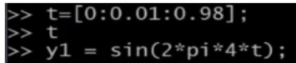

## 5.4 绘图数据

## 参考视频: 5 - 4 - Plotting Data (10 min).mkv

当开发学习算法时，往往几个简单的图，可以让你更好地理解算法的内容，并且可以完整地检查下算法是否正常运行，是否达到了算法的目的。

例如在之前的视频中，我谈到了绘制成本函数J(θ)，可以帮助确认梯度下降算法是否收敛。通常情况下，绘制数据或学习算法所有输出，也会启发你如何改进你的学习算法。幸运的是，Octave有非常简单的工具用来生成大量不同的图。当我用学习算法时，我发现绘制数据、绘制学习算法等，往往是我获得想法来改进算法的重要部分。在这段视频中，我想告诉你一些Octave的工具来绘制和可视化你的数据。

我们先来快速生成一些数据用来绘图。

如果我想绘制正弦函数，这是很容易的，我只需要输入plot(t,y1)，并回车，就出现了这个图：

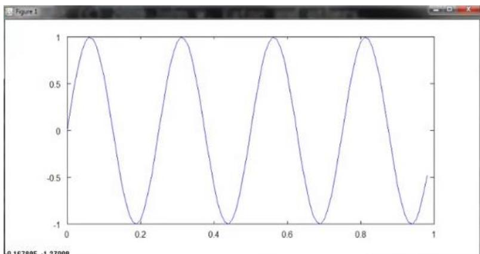  
横轴是 t 变量，纵轴是 y1，也就是我们刚刚所输出的正弦函数。

让我们设置 y2

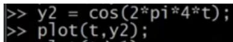

Octave 将会消除之前的正弦图，并且用这个余弦图来代替它，这里纵轴 y2 从 -1 到 1，

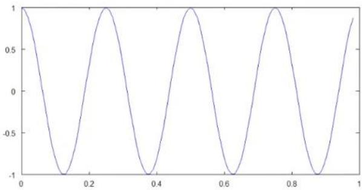  
如果我要同时表示正弦和余弦曲线。

我要做的就是，输入： $\mathsf{p l o t} ( \mathsf{t} , \mathsf{y} 1 )$ ，得到正弦函数，我使用函数hold on，hold on函数的功能是将新的图像绘制在旧的之上。

我现在绘制 y2，输入： $\mathsf{p l o t} ( \mathsf{t} , \mathsf{~ \mathsf{y}} 2 )$

我要以不同的颜色绘制余弦函数，所以我在这里输入带引号的 r 绘制余弦函数，r 表示所使用的颜色： $\mathsf{p l o t} ( \mathsf{t} , \mathsf{y} 2 , ^{\prime} \mathsf{r} ^{\prime} )$ ，再加上命令 $\times 1002 ( \cdot \mathsf{t i m e} ^{\prime} )$ ，来标记 X轴即水平轴，输入 $y \mathrm{1 a b e l ( ' v a l u e " )}$ ，来标记垂直轴的值。

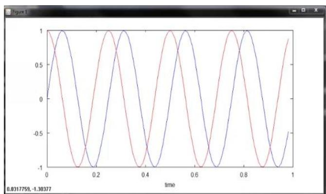

同时我也可以来标记我的两条函数曲线，用这个命令 $\mathsf{l e g e n d ( ' s i n ' , ' c o s ' )}$ 将这个图例放在右上方，表示这两条曲线表示的内容。最后输入 $\mathsf{t i t l e ( \ " {m y p l o t} " )}$ ，在图像的顶部显示这幅图的标题。

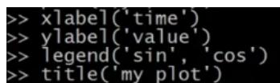

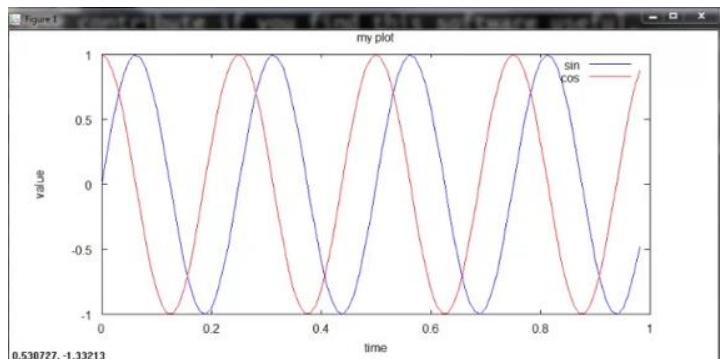

如果你想保存这幅图像，你输入 print –dpng 'myplot.png'，png 是一个图像文件格式，如果你这样做了，它可以让你保存为一个文件。

Octave 也可以保存为很多其他的格式，你可以键入 help plot。

最后如果你想，删掉这个图像，用命令 close会让这个图像关掉。

Octave也可以让你为图像标号

你键入 figure(1); plot(t, y1);将显示第一张图，绘制了变量 t y1。

键入 figure(2); plot(t, y2); 将显示第一张图，绘制了变量 t y2。

subplot 命令，我们要使用 subplot(1,2,1)，它将图像分为一个 1\*2 的格子，也就是前两个参数，然后它使用第一个格子，也就是最后一个参数1 的意思。

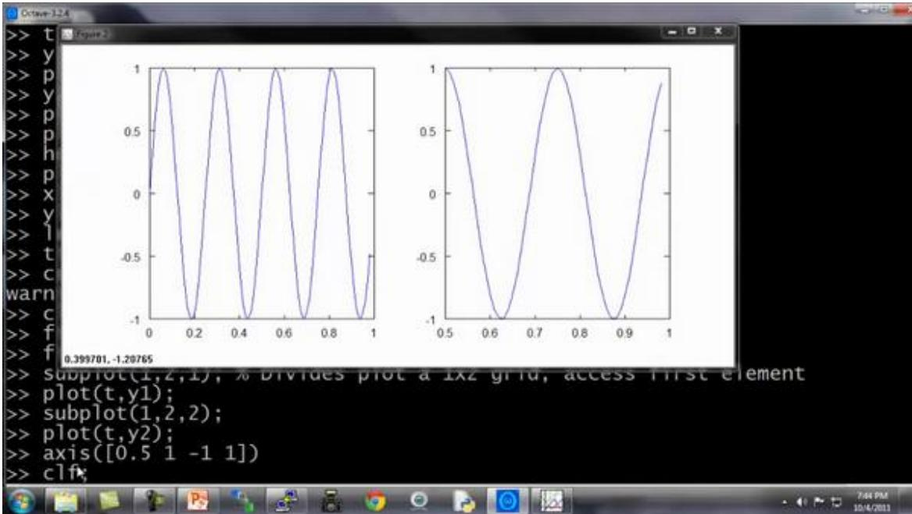

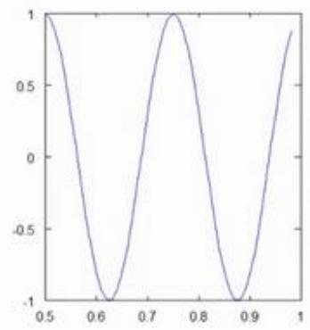

我现在使用第一个格子，如果键入plot(t,y1)，现在这个图显示在第一个格子。如果我键入 subplot(1,2,2)，那么我就要使用第二个格子，键入 plot(t,y2)；现在 y2 显示在右边，也就是第二个格子。

最后一个命令，你可以改变轴的刻度，比如改成[0.51 -11]，输入命令：axis([0.51-11])也就是设置了右边图的y轴和y轴的范围。具体而言，它将右图中的横轴的范围调整至0.5到1，竖轴的范围为-1到1。

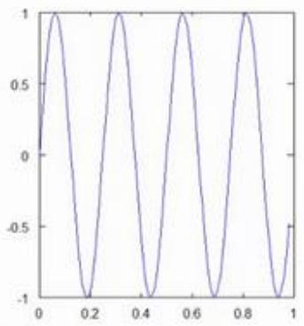


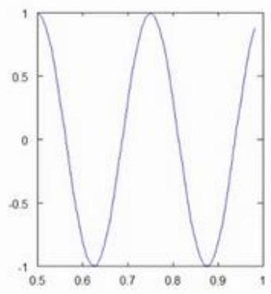

你不需要记住所有这些命令，如果你需要改变坐标轴，或者需要知道 axis 命令，你可以用 Octave 中用 help 命令了解细节。

最后，还有几个命令。

Clf（清除一幅图像）。

让我们设置A等于一个5×5 的magic方阵：

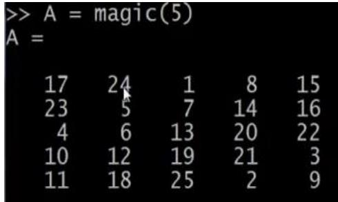

我有时用一个巧妙的方法来可视化矩阵，也就是imagesc(A)命令，它将会绘制一个5\*5的矩阵，一个5\*5 的彩色格图，不同的颜色对应A矩阵中的不同值。

我还可以使用函数 colorbar，让我用一个更复杂的命令 imagesc(A)，colorbar，colormap gray。这实际上是在同一时间运行三个命令：运行 imagesc，然后运行，colorbar，然后运行 colormap gray。

它生成了一个颜色图像，一个灰度分布图，并在右边也加入一个颜色条。所以这个颜色条显示不同深浅的颜色所对应的值。

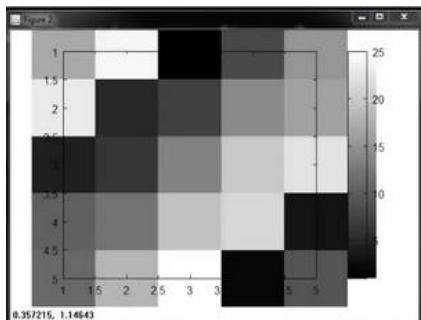  
你可以看到在不同的方格，它对应于一个不同的灰度。

输入 imagesc(magic(15))，colorbar，colormap gray  
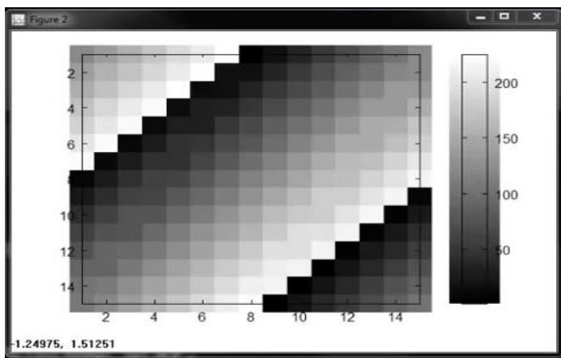

这将会是一幅 ${15^{*} 15}$ 的 magic 方阵值的图。

最后，总结一下这段视频。你看到我所做的是使用逗号连接函数调用。如果我键入 a = 1, b = 2, c = 3 然后按 Enter 键，其实这是将这三个命令同时执行，或者是将三个命令一个接一个执行，它将输出所有这三个结果。

这很像 a = 1; b = 2; c = 3; 如果我用分号来代替逗号，则没有输出出任何东西。

这里我们称之为逗号连接的命令或函数调用。用逗号连接是另一种 Octave 中更便捷的方式，将多条命令例如 imagesc colorbar colormap，将这多条命令写在同一行中。

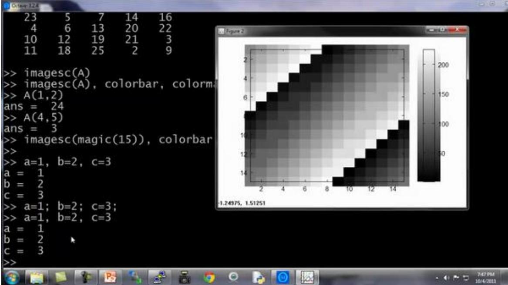

现在你知道如何绘制 Octave中不同的图像，在下面的视频中，我将告诉你怎样在 Octave中，写控制语句，比如if while for语句，并且定义和使用函数。

## 5.5 控制语句：for，while，if 语句

## 参考视频: 5 - 5 - Control Statements\_ for, while, if statements (13 min).mkv

在这段视频中，我想告诉你怎样为你的 Octave 程序写控制语句。诸如："for" "while""if" 这些语句，并且如何定义和使用方程。

我先告诉你如何使用 “for” 循环。

首先，我要将 v 值设为一个10行 1列的零向量。

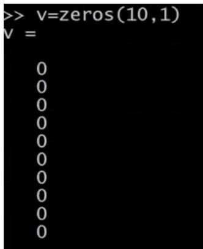

接着我要写一个 “for” 循环，让 i 等于 1 到 10，写出来就是 i = 1:10。我要设 v(i) 的值等于 2 的 i 次方，循环最后写上“end”。

向量 v 的值就是这样一个集合 2 的一次方、2 的二次方，依此类推。这就是我的 i 等于 1 到 10 的语句结构，让 i 遍历 1 到 10的值。

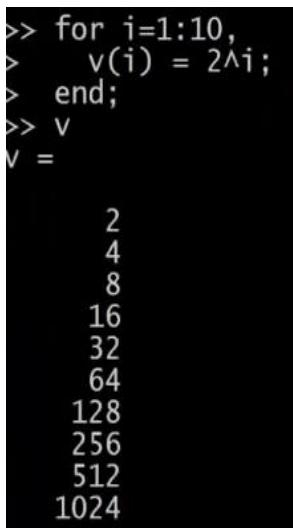

另外，你还可以通过设置你的 indices (索引) 等于 1 一直到 10，来做到这一点。这时indices 就是一个从 1 到 10 的序列。

你也可以写 i = indices，这实际上和我直接把 i 写到 1 到 10 是一样。你可以写

disp(i)，也能得到一样的结果。所以这就是一个 “for” 循环。

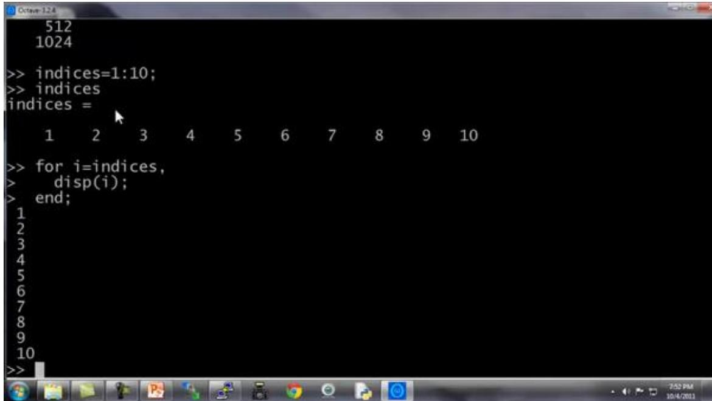

如果你对 “break” 和 “continue” 语句比较熟悉，Octave 里也有 “break” 和 “continue”语句，你也可以在 Octave环境里使用那些循环语句。

但是首先让我告诉你一个 while 循环是如何工作的：

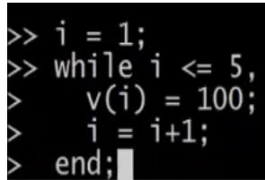

这是什么意思呢：我让 i 取值从 1 开始，然后我要让 v(i) 等于 100，再让 i 递增 1，直到 i 大于 5停止。

现在来看一下结果，我现在已经取出了向量的前五个元素，把他们用100 覆盖掉，这就是一个while循环的句法结构。

现在我们来分析另外一个例子：

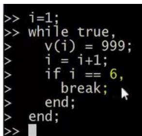

这里我将向你展示如何使用 break语句。比方说 v(i) = 999，然后让 i = i+1，当 i 等于 6 的时候 break (停止循环)，结束 (end)。

当然这也是我们第一次使用一个 if 语句，所以我希望你们可以理解这个逻辑，让 i 等于1 然后开始下面的增量循环，while语句重复设置 v(i) 等于999，不断让 i 增加，然后当 i 达到 6，做一个中止循环的命令，尽管有 while 循环，语句也就此中止。所以最后的结果是取出向量 v 的前5 个元素，并且把它们设置为999。

所以，这就是 if 语句和 while 语句的句法结构。并且要注意要有 end，上面的例子里第一个 end 结束的是 if 语句，第二个 end 结束的是 while 语句。

现在让我告诉你使用 if-else 语句：

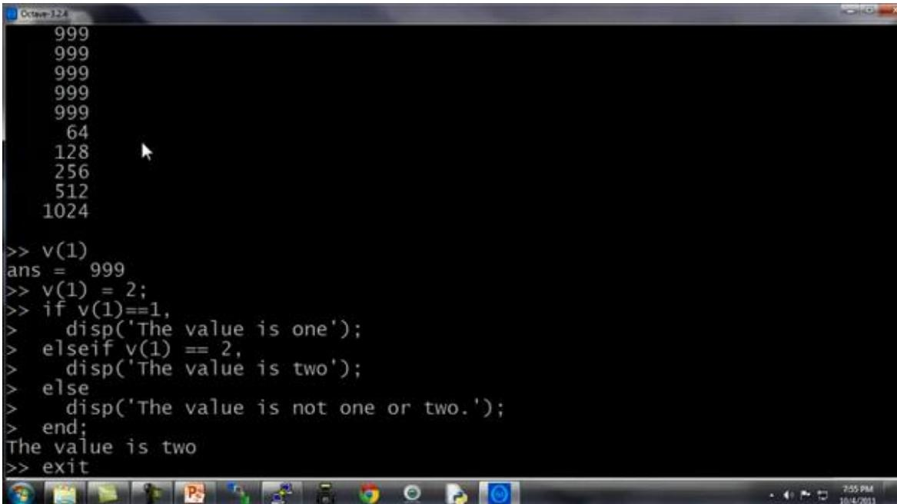

最后，提醒一件事：如果你需要退出 Octave，你可以键入exit 命令然后回车就会退出Octave，或者命令 quit 也可以。

最后，让我们来说说函数 (functions)，如何定义和调用函数。

我在桌面上存了一个预先定义的文件名为 “squarethisnumber.m”，这就是在 Octave 环境下定义的函数。

让我们打开这个文件。请注意，我使用的是微软的写字板程序来打开这个文件，我只是想建议你，如果你也使用微软的 Windows 系统，那么可以使用写字板程序，而不是记事本来打开这些文件。如果你有别的什么文本编辑器也可以，记事本有时会把代码的间距弄得很乱。如果你只有记事本程序，那也能用。我建议你用写字板或者其他可以编辑函数的文本编辑器。

现在我们来说如何在 Octave 里定义函数：

这个文件只有三行：

## function y = squareThisNumber(x)

第一行写着 function y = squareThisNumber(x)，这就告诉 Octave，我想返回一个 y 值。我想返回一个值，并且返回的这个值将被存放于变量 y 里。另外，它告诉了Octave这个函数有一个参数，就是参数 x，还有定义的函数体，也就是 y 等于 x 的平方。

还有一种更高级的功能，这只是对那些知道“search path(搜索路径)”这个术语的人使用的。所以如果你想要修改 Octave的搜索路径，你可以把下面这部分作为一个进阶知识，或者选学材料，仅适用于那些熟悉编程语言中搜索路径概念的同学。

你可以使用 addpath 命令添加路径，添加路径“C:\Users\ang\desktop”将该目录添加到Octave的搜索路径，这样即使你跑到其他路径底下，Octave依然知道会在 Users\ang\desktop目录下寻找函数。这样，即使我现在在不同的目录下，它仍然知道在哪里可以找到“SquareThisNumber” 这个函数。

但是，如果你不熟悉搜索路径的概念，不用担心，只要确保在执行函数之前，先用 cd命令设置到你函数所在的目录下，实际上也是一样的效果。

Octave还有一个其他许多编程语言都没有的概念，那就是它可以允许你定义一个函数，使得返回值是多个值或多个参数。这里就是一个例子，定义一个函数叫：

“SquareAndCubeThisNumber(x)” (x 的平方以及 x 的立方)

这说的就是函数返回值是两个： y1 和 y2，接下来就是 y1 是被平方后的结果，y2 是被立方后的结果，这就是说，函数会真的返回2 个值。

有些同学可能会根据你使用的编程语言，比如你们可能熟悉的 C 或 C++，通常情况下，认为作为函数返回值只能是一个值，但Octave 的语法结构就不一样，可以返回多个值。

如果我键入 [a,b] = SquareAndCubeThisNumber(5)，然后，a 就等于 25，b 就等于5的立方125。

所以说如果你需要定义一个函数并且返回多个值，这一点常常会带来很多方便。

最后，我来给大家演示一下一个更复杂一点的函数的例子。

比方说，我有一个数据集，像这样，数据点为[1,1], [2,2],[3,3]，我想做的事是定义一个Octave 函数来计算代价函数 J(θ)，就是计算不同 θ 值所对应的代价函数值 J。

首先让我们把数据放到 Octave 里，我把我的矩阵设置为 X = [11; 12; 13];

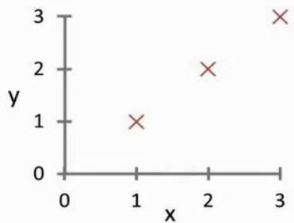  
Goal: Define a function to compute the cost function J(θ)

请仔细看一下这个函数的定义，确保你明白了定义中的每一步。

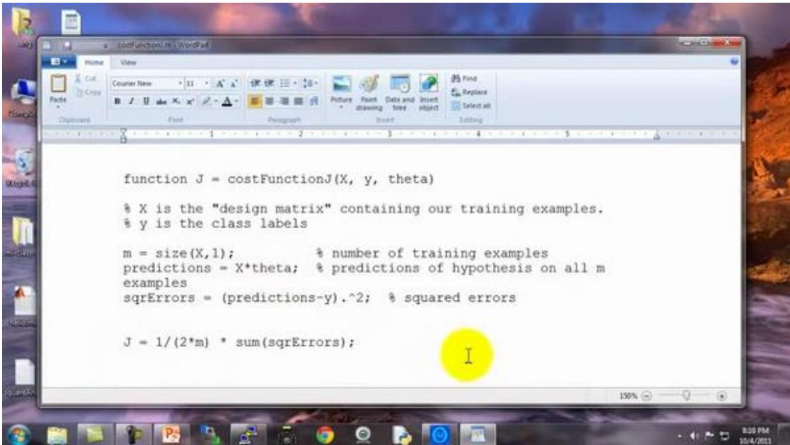

现在当我在 Octave 里运行时，我键入 J = costFunctionJ (X, y, theta)，它就计算出 J 等于0，这是因为如果我的数据集 X 为 [1;2;3]，y 也为 $\left[ 1 ; 2 ; 3 \right]$ 然后设置 $\theta_{0}$ 等于0， $\theta_{1}$ 等于1，这给了我恰好 45度的斜线，这条线是可以完美拟合我的数据集的。

而相反地，如果我设置 theta 等于[0;0]，那么这个假设就是0 是所有的预测值，和刚才一样，设置 $\theta_{0} \ = 0 , \ \theta_{1}$ 也等于 0，然后我计算的代价函数，结果是2.333。实际上，他就等于 1的平方，也就是第一个样本的平方误差，加上 2 的平方，加上 3 的平方，然后除以 2m，也就是训练样本数的两倍，这就是 2.33。

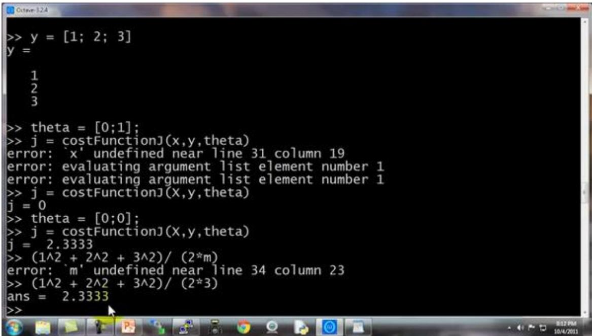

因此这也反过来验证了我们这里的函数，计算出了正确的代价函数。这些就是我们用简单的训练样本尝试的几次试验，这也可以作为我们对定义的代价函数J进行了完整性检查。确实是可以计算出正确的代价函数的。至少基于这里的 X 和 y 是成立的。也就是我们这几个简单的训练集，至少是成立的。

现在你知道如何在 Octave 环境下写出正确的控制语句，比如 for 循环、while 循环和if语句，以及如何定义和使用函数。

在接下来的Octave 教程视频里，我会讲解一下向量化，这是一种可以使你的 Octave程序运行非常快的思想。

## 5.6 向量化

## 参考视频: 5 - 6 - Vectorization (14 min).mkv

在这段视频中，我将介绍有关向量化的内容，无论你是用 Octave，还是别的语言，比如MATLAB 或者你正在用 Python、NumPy 或 Java C C++，所有这些语言都具有各种线性代数库，这些库文件都是内置的，容易阅读和获取，他们通常写得很好，已经经过高度优化，通常是数值计算方面的博士或者专业人士开发的。

而当你实现机器学习算法时，如果你能好好利用这些线性代数库，或者数值线性代数库，并联合调用它们，而不是自己去做那些函数库可以做的事情。如果是这样的话，那么通常你会发现：首先，这样更有效，也就是说运行速度更快，并且更好地利用你的计算机里可能有的一些并行硬件系统等等；其次，这也意味着你可以用更少的代码来实现你需要的功能。因此，实现的方式更简单，代码出现问题的有可能性也就越小。

举个具体的例子：与其自己写代码做矩阵乘法。如果你只在 Octave 中输入 A 乘以 B 就是一个非常有效的两个矩阵相乘的程序。有很多例子可以说明，如果你用合适的向量化方法来实现，你就会有一个简单得多，也有效得多的代码。

让我们来看一些例子：这是一个常见的线性回归假设函数： $\begin{array} {r} {h_{\theta} ( x ) = \sum_{j = 0} ^{n} \theta_{j} x_{j}} \end{array}$

如果你想要计算 $\operatorname{\lrcorner} h_{\theta} ( x )$ ，注意到右边是求和，那么你可以自己计算 j = 0 到 j = n 的和。但换另一种方式来想想，把 $h_{\theta} ( x )$ 看作 $\theta^{T} x$ ，那么你就可以写成两个向量的内积，其中 θ 就是 $\cdot \theta_{0} \setminus \theta_{1} \setminus \theta_{2}$ ，如果你有两个特征量，如果 n = 2，并且如果你把 x 看作 $x_{0} \setminus x_{1} \setminus x_{2}$ ，这两种思考角度，会给你两种不同的实现方式。

$$
\Theta = \left[ \begin{array}{l} \Theta_{0} \\ \Theta_{1} \\ \Theta_{2} \end{array} \right] \quad X = \left[ \begin{array}{l} X_{0} \\ X_{1} \\ X_{2} \end{array} \right]
$$

比如说，这是未向量化的代码实现方式：

```txt
Unvectorized implementation
prediction = 0.0;
for j = 1:n+1,
    prediction = prediction +
    theta(j) * x(j)
end;
```

计算 $\operatorname{\lrcorner} h_{\theta} ( x )$ 是未向量化的，我们可能首先要初始化变量 prediction 的值为 0.0，而这个变量 prediction 的最终结果就是 $h_{\theta} ( x )$ ，然后我要用一个 for 循环，j 取值 0 到 n+1，变量 prediction 每次就通过自身加上 theta(j) 乘以 x(j) 更新值，这个就是算法的代码实现。

顺便我要提醒一下，这里的向量我用的下标是 0，所以我有 $\dot{\theta} _{0} \mathrm{ , } \theta_{1} \mathrm{ , } \theta_{2}$ ，但因为 MATLAB的下标从 1 开始，在 MATLAB 中 $\theta_{0}$ ，我们可能会用 theta(1) 来表示，这第二个元素最后就会变成，theta(2) 而第三个元素，最终可能就用 theta(3)表示，因为 MATLAB 中的下标从1 开始，这就是为什么这里我的 for 循环，j 取值从 1 直到 n+1，而不是从 0 到 n。这是一个未向量化的代码实现方式，我们用一个 for 循环对 n 个元素进行加和。

作为比较，接下来是向量化的代码实现：

<div class="mineru-algorithm" style="white-space: pre-wrap; font-family:monospace;">
$\text{vectorized implementation}$ $\rightarrow$ prediction = theta' * x;
</div>

你把 x 和 θ 看做向量，而你只需要令变量 prediction 等于 theta' 乘以 x，你就可以这样计算。与其写所有这些 for 循环的代码，你只需要一行代码，这行代码就是利用 Octave的高度优化的数值，线性代数算法来计算两个向量 θ 以及 x 的内积，这样向量化的实现更简单，它运行起来也将更加高效。这就是 Octave 所做的而向量化的方法，在其他编程语言中同样可以实现。

让我们来看一个 C++ 的例子：

$$
\begin{array}{l l}\text{Vectorization example.}\\h_{\theta} (x) = \sum_{j = 0} ^{n} \theta_{j} x_{j}\\= \theta^{T} x\\\hline \text{Unvectorized implementation}\\\rightarrow \text{double prediction} = 0. 0;\\\rightarrow \text{for (int   j   =   0;   j   < =   n;   j++)}\\\quad \text{prediction +=   theta[j]   *   x[j];}\\\hline\end{array}\quad\begin{array}{l l}\text{Vectorized implementation}\\\text{double prediction}\\= \text{theta.transpose() *   x};\\\uparrow\end{array}
$$

与此相反，使用较好的C++数值线性代数库，你可以写出像右边这样的代码，因此取决于你的数值线性代数库的内容。你只需要在C++中将两个向量相乘，根据你所使用的数值和线性代数库的使用细节的不同，你最终使用的代码表达方式可能会有些许不同，但是通过一个库来做内积，你可以得到一段更简单、更有效的代码。

现在，让我们来看一个更为复杂的例子，这是线性回归算法梯度下降的更新规则：

$$
\left\{\begin{array}{l} \theta_{0} := \theta_{0} - \alpha \frac{1}{m} \sum_{i = 1} ^{m} (h_{\theta} (x^{(i)}) - y^{(i)}) x_{0} ^{(i)} \\ \theta_{1} := \theta_{1} - \alpha \frac{1}{m} \sum_{i = 1} ^{m} (h_{\theta} (x^{(i)}) - y^{(i)}) x_{1} ^{(i)} \\ \theta_{2} := \theta_{2} - \alpha \frac{1}{m} \sum_{i = 1} ^{m} (h_{\theta} (x^{(i)}) - y^{(i)}) x_{2} ^{(i)} \\ (n = 2) \end{array} \right.
$$

我们用这条规则对 j 等于 0、1、2 等等的所有值，更新对象 $\mathbf{\nabla} . \theta_{j}$ ，我只是用 $\theta_{0}$ 、 $\theta_{1}$ 、 $\theta_{2}$ 来写方程，假设我们有两个特征量，所以 n 等于2，这些都是我们需要对 $\small \theta_{0} , \theta_{1} , \theta_{2}$ 进行更新，这些都应该是同步更新，我们用一个向量化的代码实现，这里是和之前相同的三个方程，只不过写得小一点而已。

你可以想象实现这三个方程的方式之一，就是用一个 for 循环，就是让 j 等于 0、等于1、等于2，来更新 $\theta_{j}$ 。但让我们用向量化的方式来实现，看看我们是否能够有一个更简单的方法。基本上用三行代码或者一个for 循环，一次实现这三个方程。让我们来看看怎样能用这三步，并将它们压缩成一行向量化的代码来实现。做法如下：

我打算把 θ 看做一个向量，然后我用 θ - αδ 乘以某个别的向量 δ 来更新 θ。

这里的 δ 等于

$$
\frac{1}{m} \sum_{i = 1} ^{m} (h_{\theta} (x^{(i)}) - y^{(i)}) x^{(i)}
$$

让我解释一下是怎么回事：我要把 θ 看作一个向量，有一个 n+1 维向量，α 是一个实数，δ 在这里是一个向量。

$$
\begin{array}{c} \text{Vectorized implementation:} \\ \theta := \theta - \frac{\alpha \delta}{r} \end{array}
$$

所以这个减法运算是一个向量减法，因为 α 乘以 δ是一个向量，所以 θ 就是 $\theta \ \cdot \ \alpha \delta$ 得到的向量。

那么什么是向量 δ 呢 ?

$$
\delta = \left[ \begin{array}{l} \delta_{0} \\ \delta_{1} \\ \delta_{2} \end{array} \right]
$$

$X^{( i )}$ 是一个向量

$$
X^{(i)} = \left[ \begin{array}{l} X_{0} ^{(i)} \\ X_{1} ^{(i)} \\ X_{2} ^{(i)} \end{array} \right]
$$

你就会得到这些不同的式子，然后作加和。

$$
\begin{array}{l} \delta = \frac{1}{m} \sum_{i = 1} ^{m} (h_{\theta} (x^{(i)}) - y^{(i)}) x^{(i)} \\ \frac{1}{m} \sum (h_{\theta} (x) - y^{(i)}) x^{(i)} \end{array}
$$

实际上，在以前的一个小测验，如果你要解这个方程，我们说过为了向量化这段代码，我们会令 $u ~ = ~ 2 v ~ + 5 w$ 因此，我们说向量 u 等于 2乘以向量 v 加上5乘以向量 $w_{\cdot}$ 。用这个例子说明，如何对不同的向量进行相加，这里的求和是同样的道理。

$$
\begin{array}{l} u (j) = 2 v (j) + 5 w (j) \quad (\text{for all} j) \\ u = 2 v + 5 w \end{array}
$$

这就是为什么我们能够向量化地实现线性回归。

所以，我希望步骤是有逻辑的。请务必看视频，并且保证你确实能理解它。如果你实在不能理解它们数学上等价的原因，你就直接实现这个算法，也是能得到正确答案的。所以即使你没有完全理解为何是等价的，如果只是实现这种算法，你仍然能实现线性回归算法。如果你能弄清楚为什么这两个步骤是等价的，那我希望你可以对向量化有一个更好的理解，如果你在实现线性回归的时候，使用一个或两个以上的特征量。

有时我们使用几十或几百个特征量来计算线性归回，当你使用向量化地实现线性回归，通常运行速度就会比你以前用你的for循环快的多，也就是自己写代码更新 $\theta_{0} , \ \theta_{1} , \ \theta_{2}$ 0

因此使用向量化实现方式，你应该是能够得到一个高效得多的线性回归算法。而当你向量化我们将在之后的课程里面学到的算法，这会是一个很好的技巧，无论是对于Octave 或者一些其他的语言，如C++、Java 来让你的代码运行得更高效。

## 5.7 工作和提交的编程练习

## 参考视频: 5 - 7 - Working on and Submitting Programming Exercises (4 min).mkv

在这段视频中，我想很快地介绍一下这门课程做作业的流程，以及如何使用作业提交系统。这个提交系统可以即时检验你的机器学习程序答案是否正确。

在'ml-class-ex1'目录中，我们提供了大量的文件，其中有一些需要由你自己来编辑，因此第一个文件应该符合编程练习中 pdf 文件的要求，其中一个我们要求你编写的文件是warmUpExercise.m这个文件，这个文件只是为了确保你熟悉提交系统。

你需要做的就是提交一个5×5 的矩阵，就是A = eye(5)这将修改该函数以产生 5×5的单位矩阵，现在 warmUpExercise()这个方程就实现了返回 5x5 的单位矩阵，将它保存一下，所以我已经完成了作业的第一部分。

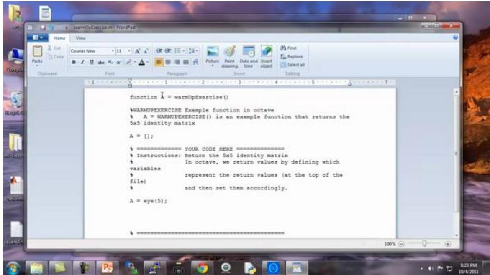  
现在回到我的 Octave 窗口，现在来到我的目录 C:\Users\ang\Desktop\ml-class-ex1 如果我想确保我已经实现了程序像这样输入 warmUpExercise()好了它返回了我们用刚才写的代码创建的一个 5x5的单位矩阵。

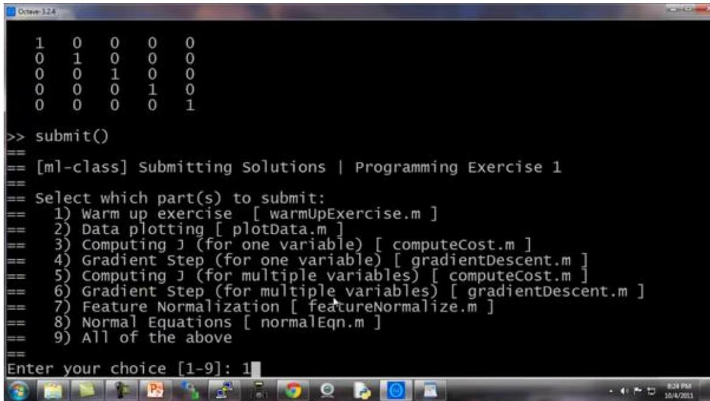

我现在可以按如下步骤提交代码，我要在这里目录下键入 submit()。我要提交第一部分所以我选择输入'1'。这时它问我的电子邮件地址，我们打开课程网站，输入用户名密码。

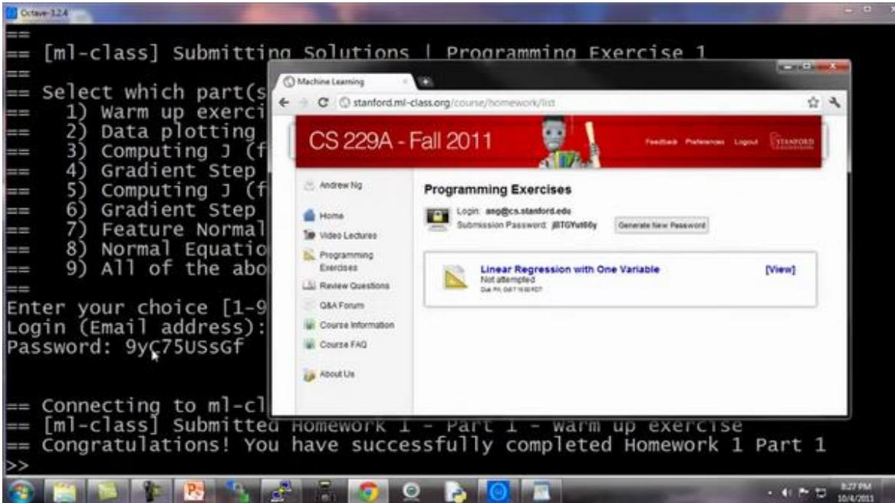

按下回车键，它连接到服务器，并将其提交，然后它就会立刻告诉你：恭喜您！已成功完成作业1 第1 部分。这就确认了你已经做对了第一部分练习，如果你提交的答案不正确，那么它会给你一条消息，说明你没有完全答对，您还可以继续使用此提交密码，也可以生成新密码。你的密码是否会显示出来取决于你使用的操作系统。 这就是提交作业的方法，你完成家庭作业的时候，我希望你都能答对。

