# 第 9 周

## 15、 异常检测(Anomaly Detection)

## 15.1 问题的动机

## 参考文档: 15 - 1 - Problem Motivation (8 min).mkv

在接下来的一系列视频中，我将向大家介绍异常检测(Anomaly detection)问题。这是机器学习算法的一个常见应用。这种算法的一个有趣之处在于：它虽然主要用于非监督学习问题，但从某些角度看，它又类似于一些监督学习问题。

什么是异常检测呢？为了解释这个概念，让我举一个例子吧：

假想你是一个飞机引擎制造商，当你生产的飞机引擎从生产线上流出时，你需要进行QA(质量控制测试)，而作为这个测试的一部分，你测量了飞机引擎的一些特征变量，比如引擎运转时产生的热量，或者引擎的振动等等。

Anomaly detection example
Aircraft engine features:
→  $x_{1}$  = heat generated
→  $x_{2}$  = vibration intensity
Dataset:  $\{x^{(1)}, x^{(2)}, \ldots, x^{(m)}\}$

这样一来，你就有了一个数据集，从 $x^{(1)}$ 到 $x^{(m)}$，如果你生产了$m$个引擎的话，你将这些数据绘制成图表，看起来就是这个样子：

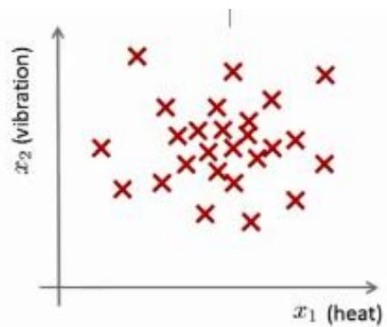

这里的每个点、每个叉，都是你的无标签数据。这样，异常检测问题可以定义如下：我们假设后来有一天，你有一个新的飞机引擎从生产线上流出，而你的新飞机引擎有特征变量$x_{t e s t}$ 。所谓的异常检测问题就是：我们希望知道这个新的飞机引擎是否有某种异常，或者说，我们希望判断这个引擎是否需要进一步测试。因为，如果它看起来像一个正常的引擎，那么我们可以直接将它运送到客户那里，而不需要进一步的测试。

给定数据集 ${x^{( 1 )} , x^{( 2 )} , . . , x^{( m )}}$ ，我们假使数据集是正常的，我们希望知道新的数据 $x_{t e s t}$ 是不是异常的，即这个测试数据不属于该组数据的几率如何。我们所构建的模型应该能根据该测试数据的位置告诉我们其属于一组数据的可能性 $p ( x )$

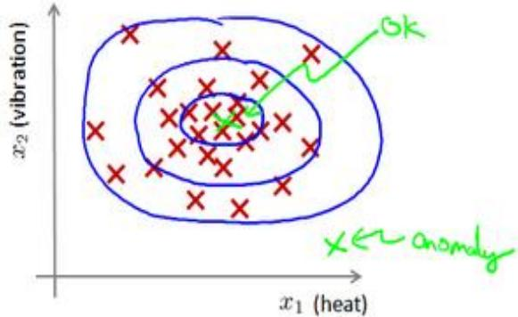

上图中，在蓝 $\mathcal{\underline{{E}}}$ 圈内的数据属于该组数据的可能性较高，而越是偏远的数据，其属于该组数据的可能性就越低。

这种方法称为密度估计，表达如下：

$$
\textit{i f} \quad p (x) \left\{\begin{array}{l l} <   \varepsilon & \textit{a n o m a l y} \\ > = \varepsilon & \textit{n o r m a l} \end{array} \right.
$$

欺诈检测： $\boldsymbol{x} ^{( i )} = \mathcal{H} \boldsymbol{\mathcal{F}}$ 的第i个活动特征

模型 $p ( x )$ 为我们其属于一组数据的可能性，通过 $p ( x ) < \varepsilon$ 检测非正常用户。

异常检测主要用来识别欺骗。例如在线采集而来的有关用户的数据，一个特征向量中可能会包含如：用户多久登录一次，访问过的页面，在论坛发布的帖子数量，甚至是打字速度等。尝试根据这些特征构建一个模型，可以用这个模型来识别那些不符合该模式的用户。

再一个例子是检测一个数据中心，特征可能包含：内存使用情况，被访问的磁盘数量，CPU的负载，网络的通信量等。根据这些特征可以构建一个模型，用来判断某些计算机是不是有可能出错了。

## 15.2 高斯分布

## 参考视频: 15 - 2 - Gaussian Distribution (10 min).mkv

在这个视频中，我将介绍高斯分布，也称为正态分布。回顾高斯分布的基本知识。

通常如果我们认为变量 $x$ 符合高斯分布 $x \sim N ( \mu , \sigma^{2} )$ 则其概率密度函数为：$\begin{array} {r} {p ( x , \mu , \sigma^{2} ) = \frac{1} {\sqrt{2 \pi} \sigma} \exp \left( - \frac{( x - \mu ) ^{2}} {2 \sigma^{2}} \right)} \end{array}$ 我们可以利用已有的数据来预测总体中的 $\mid \mu \mid$ 和 $1 \sigma^{2}$ 的计算方法如下： $\begin{array} {r} {\mu = \frac{1} {m} \sum_{i = 1} ^{m} x^{( i )}} \end{array}$

$$
\sigma^{2} = \frac{1}{m} \sum_{i = 1} ^{m} (x^{(i)} - \mu) ^{2}
$$

高斯分布样例：

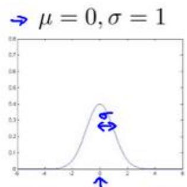

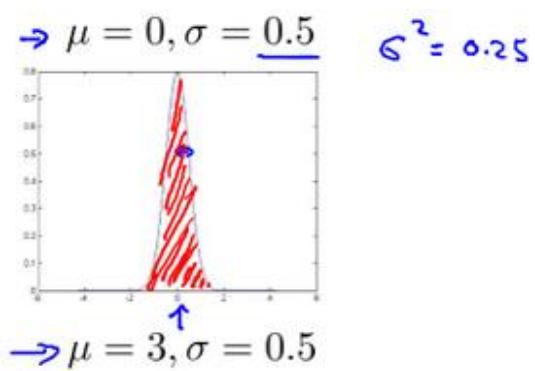

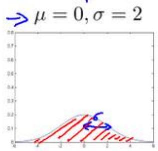

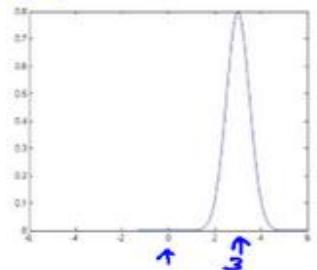

注：机器学习中对于方差我们通常只除以$m$而非统计学中的$(m-1)$。这里顺便提一下，在实际使用中，到底是选择使用 $1 / m$ 还是 $1 / ( m - 1 )$ 其实区别很小，只要你有一个还算大的训练集，在机器学习领域大部分人更习惯使用 $1 / m$ 这个版本的公式。这两个版本的公式在理论特性和数学特性上稍有不同，但是在实际使用中，他们的区别甚小，几乎可以忽略不计。

## 15.3 算法

## 参考视频: 15 - 3 - Algorithm (12 min).mkv

在本节视频中，我将应用高斯分布开发异常检测算法。

异常检测算法：

对于给定的数据集 $x^{( 1 )} , x^{( 2 )} , \ldots , x^{( m )}$ ，我们要针对每一个特征计算 $\mu$ 和 $\sigma^{2}$ 的估计值。

$$
\mu_{j} = \frac{1}{m} \sum_{i = 1} ^{m} x_{j} ^{(i)}
$$

$$
\sigma_{j} ^{2} = \frac{1}{m} \sum_{i = 1} ^{m} (x_{j} ^{(i)} - \mu_{j}) ^{2}
$$

一旦我们获得了平均值和方差的估计值，给定新的一个训练实例，根据模型计算 $p ( x )$

$$
p (x) = \prod_{j = 1} ^{n} p (x_{j}; \mu_{j}, \sigma_{j} ^{2}) = \prod_{j = 1} ^{1} \frac{1}{\sqrt{2 \pi} \sigma_{j}} e x p (- \frac{(x_{j} - \mu_{j}) ^{2}}{2 \sigma_{j} ^{2}})
$$

当 $p ( x ) < \varepsilon$ 时，为异常。

下图是一个由两个特征的训练集，以及特征的分布情况：

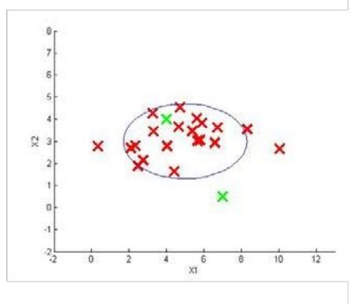

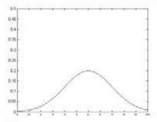

$$
\mu_{1} = 5, \sigma_{1} = 2
$$

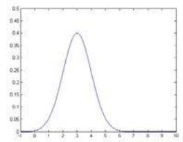

$$
\mu_{2} = 3, \sigma_{2} = 1
$$

下面的三维图表表示的是密度估计函数，y轴为根据两个特征的值所估计 $p ( x )$ 值：

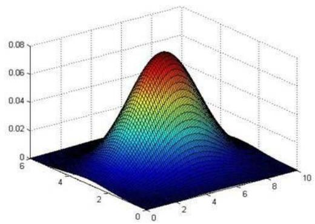

我们选择一个$\varepsilon$，将 $p ( x ) = \varepsilon$ 作为我们的判定边界，当 $| p ( x ) > \varepsilon |$ 时预测数据为正常数据，否则为异常。

在这段视频中，我们介绍了如何拟合 $p ( x )$ ，也就是 $x$的概率值，以开发出一种异常检测算法。同时，在这节课中，我们也给出了通过给出的数据集拟合参数，进行参数估计，得到参数 $\mu$ 和 $\sigma{\mathrm{:}}$ ，然后检测新的样本，确定新样本是否是异常。

在接下来的课程中，我们将深入研究这一算法，同时更深入地介绍，怎样让算法工作地更加有效。

## 15.4 开发和评价一个异常检测系统

## 参考视频: 15 - 4 - Developing and Evaluating an Anomaly Detection System (13 min). mkv

异常检测算法是一个非监督学习算法，意味着我们无法根据结果变量 $y$ 的值来告诉我们数据是否真的是异常的。我们需要另一种方法来帮助检验算法是否有效。当我们开发一个异常检测系统时，我们从带标记（异常或正常）的数据着手，我们从其中选择一部分正常数据用于构建训练集，然后用剩下的正常数据和异常数据混合的数据构成交叉检验集和测试集。

例如：我们有 10000 台正常引擎的数据，有 20 台异常引擎的数据。 我们这样分配数据：

6000 台正常引擎的数据作为训练集

2000 台正常引擎和 10台异常引擎的数据作为交叉检验集

2000 台正常引擎和 10台异常引擎的数据作为测试集

具体的评价方法如下：

1. 根据测试集数据，我们估计特征的平均值和方差并构建J(θ)函数

2. 对交叉检验集，我们尝试使用不同的y值作为阀值，并预测数据是否异常，根据 F1值或者查准率与查全率的比例来选择 $\varepsilon$

3. 选出 $\varepsilon$ 后，针对测试集进行预测，计算异常检验系统的$F_1$值，或者查准率与查全率之比。

## 15.5 异常检测与监督学习对比

## 参考视频: 15 - 5 - Anomaly Detection vs. Supervised Learning (8 min).mkv

之前我们构建的异常检测系统也使用了带标记的数据，与监督学习有些相似，下面的对比有助于选择采用监督学习还是异常检测：

两者比较：

<table><tr><td>异常检测</td><td>监督学习</td></tr><tr><td>非常少量的正向类(异常数据 y=1),大量的负向类(y=0)</td><td>同时有大量的正向类和负向类</td></tr><tr><td>许多不同种类的异常,非常难。根据非常少量的正向类数据来训练算法。</td><td>有足够多的正向类实例,足够用于训练算法,未来遇到的正向类实例可能与训练集中的非常近似。</td></tr><tr><td>未来遇到的异常可能与已掌握的异常、非常的不同。</td><td></td></tr><tr><td>例如:欺诈行为检测生产(例如飞机引擎)检测数据中心的计算机运行状况</td><td>例如:邮件过滤器天气预报肿瘤分类</td></tr></table>

希望这节课能让你明白一个学习问题的什么样的特征，能让你把这个问题当作是一个异常检测，或者是一个监督学习的问题。另外，对于很多技术公司可能会遇到的一些问题，通常来说，正样本的数量很少，甚至有时候是0，也就是说，出现了太多没见过的不同的异常类型，那么对于这些问题，通常应该使用的算法就是异常检测算法。

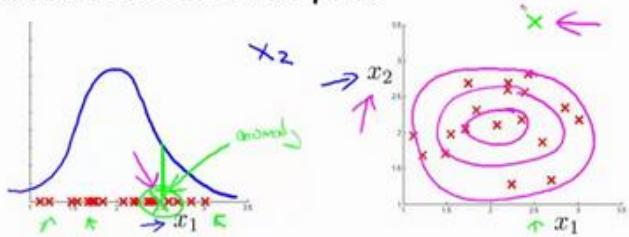

## 15.6 选择特征

## 参考视频: 15 - 6 - Choosing What Features to Use (12 min).mkv

对于异常检测算法，我们使用的特征是至关重要的，下面谈谈如何选择特征：

异常检测假设特征符合高斯分布，如果数据的分布不是高斯分布，异常检测算法也能够工作，但是最好还是将数据转换成高斯分布，例如使用对数函数： $x = l o g ( x + c )$ ，其中 $c$为非负常数； 或者 $x = x^{c}$ ，$c$为 0-1 之间的一个分数，等方法。

(编者注：在 python 中，通常用 np.log1p()函数， $l o g 1 p \rrangle$ 就是 $l o g ( x + 1 )$ ，可以避免出现负数结果，反向函数就是np.expm1())

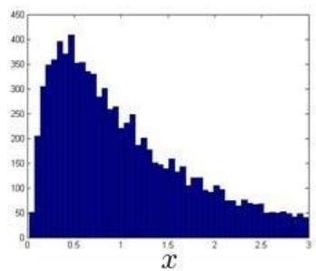  
误差分析：

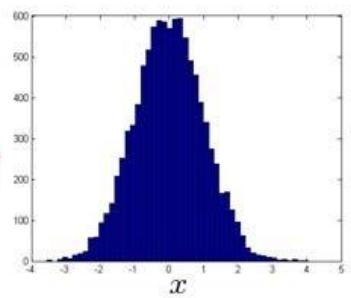

一个常见的问题是一些异常的数据可能也会有较高的 $| p ( x )$ 值，因而被算法认为是正常的。这种情况下误差分析能够帮助我们，我们可以分析那些被算法错误预测为正常的数据，观察能否找出一些问题。我们可能能从问题中发现我们需要增加一些新的特征，增加这些新特征后获得的新算法能够帮助我们更好地进行异常检测。

异常检测误差分析：

Want $p ( x )$ large for normal examples x p(x) small for anomalous examples x.

Most common problem:

p(x) is comparable (say, both large) for normal and anomalous examples

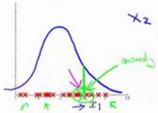

我们通常可以通过将一些相关的特征进行组合，来获得一些新的更好的特征（异常数据的该特征值异常地大或小），例如，在检测数据中心的计算机状况的例子中，我们可以用 CPU负载与网络通信量的比例作为一个新的特征，如果该值异常地大，便有可能意味着该服务器是陷入了一些问题中。

在这段视频中，我们介绍了如何选择特征，以及对特征进行一些小小的转换，让数据更像正态分布，然后再把数据输入异常检测算法。同时也介绍了建立特征时，进行的误差分析方法，来捕捉各种异常的可能。希望你通过这些方法，能够了解如何选择好的特征变量，从而帮助你的异常检测算法，捕捉到各种不同的异常情况。

## 15.7 多元高斯分布（选修）

## 参考视频: 15 - 7 - Multivariate Gaussian Distribution (Optional) (14 min).mkv

假使我们有两个相关的特征，而且这两个特征的值域范围比较宽，这种情况下，一般的高斯分布模型可能不能很好地识别异常数据。其原因在于，一般的高斯分布模型尝试的是去同时抓住两个特征的偏差，因此创造出一个比较大的判定边界。

下图中是两个相关特征，洋红色的线（根据 ε的不同其范围可大可小）是一般的高斯分布模型获得的判定边界，很明显绿色的 X 所代表的数据点很可能是异常值，但是其J(θ)值却仍然在正常范围内。多元高斯分布将创建像图中蓝色曲线所示的判定边界。

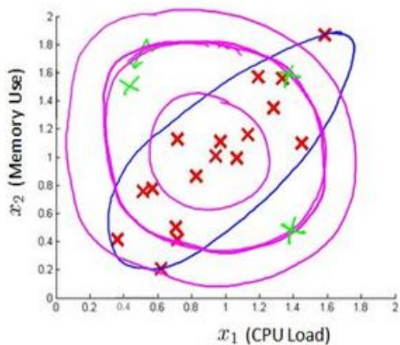

在一般的高斯分布模型中，我们计算 J(θ) 的方法是： 通过分别计算每个特征对应的几率然后将其累乘起来，在多元高斯分布模型中，我们将构建特征的协方差矩阵，用所有的特征一起来计算 J(θ)。

我们首先计算所有特征的平均值，然后再计算协方差矩阵：

$$
p (x) = \prod_{j = 1} ^{n} p (x_{j}; \mu , \sigma_{j} ^{2}) = \prod_{j = 1} ^{n} \frac{1}{\sqrt{2 \pi} \sigma_{j}} e x p (- \frac{(x_{j} - \mu_{j}) ^{2}}{2 \sigma_{j} ^{2}})
$$

$$
\mu = \frac{1}{m} \sum_{i = 1} ^{m} x^{(i)}
$$

$$
\Sigma = \frac{1}{m} \sum_{i = 1} ^{m} (x^{(i)} - \mu) (x^{(i)} - \mu) ^{T} = \frac{1}{m} (X - \mu) ^{T} (X - \mu)
$$

注:其中 $^{\mathrm{I}} \mu$ 是一个向量，其每一个单元都是原特征矩阵中一行数据的均值。最后我们计算多元高斯分布的J(θ): $\begin{array} {r} {p ( x ) = \frac{1} {( 2 \pi ) ^{\frac{n} {2}} | {\cal{L}} | ^{\frac{1} {2}}} e x p \left( - \frac{1} {2} ( x - \mu ) ^{T} {\cal{L}} ^{- 1} ( x - \mu ) \right)} \end{array}$

其中：

$|\Sigma|$是定矩阵，在 Octave 中用 ${\mathsf{d e t}} ( {\mathsf{s i g m a}} )$ 计算

$\Sigma^{-1}$ 是逆矩阵，下面我们来看看协方差矩阵是如何影响模型的：

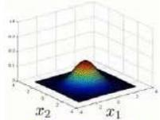

$$
\mu = \left[ \begin{array}{c} 0 \\ 0 \end{array} \right] \Sigma = \left[ \begin{array}{c c} 0. 6 & 0 \\ 0 & 1 \end{array} \right]
$$

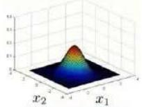

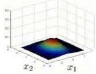

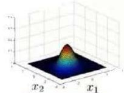

$$
\mu = \left[ \begin{array}{c} 0 \\ 0 \end{array} \right] \Sigma = \left[ \begin{array}{c c} 1 & - 0. 8 \\ - 0. 8 & 1 \end{array} \right]
$$

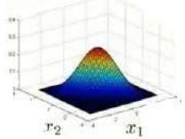

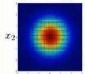  
i1

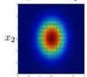  
x1

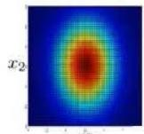

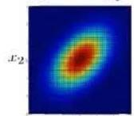  
r.

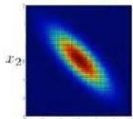  
x1  
上图是5个不同的模型，从左往右依次分析：  
1. 是一个一般的高斯分布模型  
2. 通过协方差矩阵，令特征 1拥有较小的偏差，同时保持特征2的偏差  
3. 通过协方差矩阵，令特征 2拥有较大的偏差，同时保持特征1的偏差

4. 通过协方差矩阵，在不改变两个特征的原有偏差的基础上，增加两者之间的正相关性

5. 通过协方差矩阵，在不改变两个特征的原有偏差的基础上，增加两者之间的负相关性

多元高斯分布模型与原高斯分布模型的关系：

可以证明的是，原本的高斯分布模型是多元高斯分布模型的一个子集，即像上图中的第1、2、3，3个例子所示，如果协方差矩阵只在对角线的单位上有非零的值时，即为原本的高斯分布模型了。

原高斯分布模型和多元高斯分布模型的比较：

<table><tr><td>原高斯分布模型</td><td>多元高斯分布模型</td></tr><tr><td>不能捕捉特征之间的相关性但可以通过将特征进行组合的方法来解决</td><td>自动捕捉特征之间的相关性</td></tr><tr><td>计算代价低,能适应大规模的特征</td><td>计算代价较高训练集较小时也同样适用</td></tr><tr><td></td><td>必须要有  $m > n$ ,不然的话协方差矩阵不可逆的,通常需要  $m > 10n$  另外特征冗余也会导致协方差矩阵不可逆</td></tr></table>

原高斯分布模型被广泛使用着，如果特征之间在某种程度上存在相互关联的情况，我们可以通过构造新新特征的方法来捕捉这些相关性。

如果训练集不是太大，并且没有太多的特征，我们可以使用多元高斯分布模型。

## 15.8 使用多元高斯分布进行异常检测（选修）

## 参考视频: 15 - 8 - Anomaly Detection using the Multivariate Gaussian Distribution (Optional) (14 min).mkv

在我们谈到的最后一个视频，关于多元高斯分布，看到的一些建立的各种分布模型，当你改变参数， $\mu$ 和 $\Sigma$。在这段视频中，让我们用这些想法，并应用它们制定一个不同的异常检测算法。

要回顾一下多元高斯分布和多元正态分布：

$$
\begin{array}{l} \text{Multivariate Gaussian (Normal) distribution} \\ \text{Parameters} \mu , \Sigma \\ p (x; \mu , \Sigma) = \frac{1}{(2 \pi) ^{\frac{n}{2}} | \Sigma | ^{\frac{1}{2}}} \exp \left(- \frac{1}{2} (x - \mu) ^{T} \Sigma^{- 1} (x - \mu)\right) \\ \text{3D surface plots} x_{1} x_{2} \end{array}
$$

分布有两个参数， $\mu$ 和 $\Sigma$。其中$\mu$这一个$n$维向量和 $\Sigma$ 的协方差矩阵，是一种 $\scriptstyle{\mathfrak{n}} \times n$ 的矩阵。而这里的公式$p(x)$的概率，如按 $\mu$ 和参数化 $\Sigma$，和你的变量 $x$ 和 $\Sigma$，你可以得到一个范围的不同分布一样，你知道的，这些都是三个样本，那些我们在以前的视频看过了。

因此，让我们谈谈参数拟合或参数估计问题：

我有一组样本 $\cdot x^{( 1 )} , x^{( 2 )} , \ldots , x^{( m )}$ 是一个n维向量，我想我的样本来自一个多元高斯分布。我如何尝试估计我的参数 $\mu$ 和 $\Sigma$ 以及标准公式？

估计他们是你设置 $\mu$ 是你的训练样本的平均值。

$$
\mu = \frac{1}{m} \sum_{i = 1} ^{m} x^{(i)}
$$

并设置$\Sigma$：

$$
\Sigma = \frac{1}{m} \sum_{i = 1} ^{m} (x^{(i)} - \mu) (x^{(i)} - \mu) ^{T}
$$

这其实只是当我们使用 PCA算法时候，有 $\Sigma$ 时写出来。所以你只需插入上述两个公式，这会给你你估计的参数 $\mu$ 和你估计的参数 $\Sigma$。所以，这里给出的数据集是你如何估计 $\mu$ 和$\Sigma$。让我们以这种方法而只需将其插入到异常检测算法。那么，我们如何把所有这一切共同开发一个异常检测算法？

## Anomaly detection with the multivariate Gaussian

1. Fit model $p ( x )$ by setting

$$
\left\{\begin{array}{l} \mu = \frac{1}{m} \sum_{i = 1} ^{m} x^{(i)} \\ \Sigma = \frac{1}{m} \sum_{i = 1} ^{m} (x^{(i)} - \mu) (x^{(i)} - \mu) ^{T} \end{array} \right.
$$

2. Given a new example x, compute

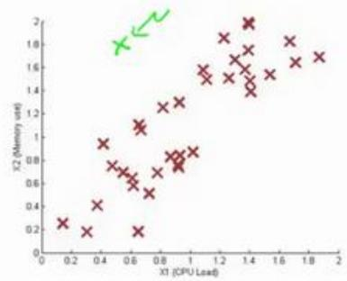

$$
p (x) = \frac{1}{(2 \pi) ^{\frac{n}{2}} | \Sigma | ^{\frac{1}{2}}} \exp \left(- \frac{1}{2} (x - \mu) ^{T} \Sigma^{- 1} (x - \mu)\right)
$$

Flag an anomaly if $p ( x ) < \varepsilon$

首先，我们把我们的训练集，和我们的拟合模型，我们计算 $\cdot p ( x )$ ，要知道，设定$\mu$和描述的一样$\Sigma$。

## Anomaly detection with the multivariate Gaussian

1. Fit model $p ( x )$ by setting

$$
\left\{\begin{array}{l} \mu = \frac{1}{m} \sum_{i = 1} ^{m} x^{(i)} \\ \Sigma = \frac{1}{m} \sum_{i = 1} ^{m} (x^{(i)} - \mu) (x^{(i)} - \mu) ^{T} \end{array} \right.
$$

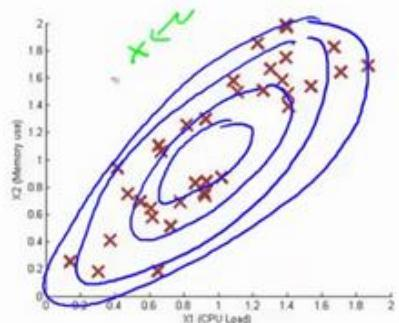

2. Given a new example x, compute

$$
p (x) = \frac{1}{(2 \pi) ^{\frac{n}{2}} | \Sigma | ^{\frac{1}{2}}} \exp \left(- \frac{1}{2} (x - \mu) ^{T} \Sigma^{- 1} (x - \mu)\right)
$$

Flag an anomaly if $p ( x ) < \varepsilon$

如图，该分布在中央最多，越到外面的圈的范围越小。

并在该点是出路这里的概率非常低。

原始模型与多元高斯模型的关系如图：

其中：协方差矩阵$\Sigma$为：

p()

## Relationship to original model

Original model: $\underline{{\{p ( x ) = p ( x_{1} ; \mu_{1} \widehat{( \sigma_{1} ^{2} )} \times p ( \dot{x} _{2} ; \mu_{2} , \sigma_{2} ^{2} ) \times \cdots \times p ( x_{n} ; \mu_{n} , \sigma_{n} ^{2} )}} $

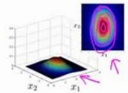

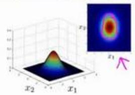

Corresponds to multivariate Gaussian

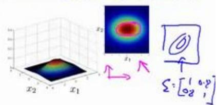

$$
\rightarrow p (x; \mu , \Sigma) = \frac{1}{(2 \pi) ^{\frac{n}{2}} | \Sigma | ^{\frac{1}{2}}} \exp \left(- \frac{1}{2} (x - \mu) ^{T} \Sigma^{- 1} (x - \mu)\right)
$$

where

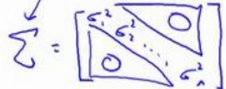

原始模型和多元高斯分布比较如图：

→ Original model

$$
p (x_{1}; \mu_{1}, \sigma_{1} ^{2}) \times \dots \times p (x_{n}; \mu_{n}, \sigma_{n} ^{2})
$$

Manually create features to capture anomalies where $x_{1} , x_{2}$ take unusual combinations of values. $ \sqrt{x_{3}} = \frac{x_{1}} {x_{2}} = \frac{( \rho u_{1} \rho o l )} {m o n o r e}$

Computationally cheaper

(alternatively, scales better to large n) n=10,000, n=100,000

OK even if m (training set size) is small

## vs. Multivariate Gaussian

$$
p (x; \mu , \Sigma) = \frac{1}{(2 \pi) ^{\frac{3}{2}} | \Sigma | ^{\frac{1}{2}}} \exp \left(- \frac{1}{2} (x - \mu) ^{7} \Sigma^{- 1} (x - \mu)\right)
$$

Automatically captures correlations between features

$$
\sum \in \mathbb{R} ^{n \times n}
$$

$$
\sum_{i = 1} ^{n - 1}
$$

Computationally more expensive

$$
\rightarrow \sum n \frac{n^{2}}{2}
$$

$$
\left| \begin{array}{l} \Rightarrow x_{1} = x_{2} \\ x_{3} = x_{4} \\ \uparrow + x_{5} \end{array} \right|
$$

Must have $\overbrace{m > n}$ or else Σ is non-invertible. $\boxed{m} \geq \boxed{0 n}$

## 16、 推荐系统(Recommender Systems)

## 16.1 问题形式化

## 参考视频: 16 - 1 - Problem Formulation (8 min).mkv

在接下来的视频中，我想讲一下推荐系统。我想讲推荐系统有两个原因：

第一、仅仅因为它是机器学习中的一个重要的应用。在过去几年，我偶尔访问硅谷不同的技术公司，我常和工作在这儿致力于机器学习应用的人们聊天，我常问他们，最重要的机器学习的应用是什么，或者，你最想改进的机器学习应用有哪些。我最常听到的答案是推荐系统。现在，在硅谷有很多团体试图建立很好的推荐系统。因此，如果你考虑网站像亚马逊，或网飞公司或易趣，或 iTunes Genius，有很多的网站或系统试图推荐新产品给用户。如，亚马逊推荐新书给你，网飞公司试图推荐新电影给你，等等。这些推荐系统，根据浏览你过去买过什么书，或过去评价过什么电影来判断。这些系统会带来很大一部分收入，比如为亚马逊和像网飞这样的公司。因此，对推荐系统性能的改善，将对这些企业的有实质性和直接的影响。

推荐系统是个有趣的问题，在学术机器学习中因此，我们可以去参加一个学术机器学习会议，推荐系统问题实际上受到很少的关注，或者，至少在学术界它占了很小的份额。但是，如果你看正在发生的事情，许多有能力构建这些系统的科技企业，他们似乎在很多企业中占据很高的优先级。这是我为什么在这节课讨论它的原因之一。

我想讨论推荐系统地第二个原因是：这个班视频的最后几集我想讨论机器学习中的一些大思想，并和大家分享。这节课我们也看到了，对机器学习来说，特征是很重要的，你所选择的特征，将对你学习算法的性能有很大的影响。因此，在机器学习中有一种大思想，它针对一些问题，可能并不是所有的问题，而是一些问题，有算法可以为你自动学习一套好的特征。因此，不要试图手动设计，而手写代码这是目前为止我们常干的。有一些设置，你可以有一个算法，仅仅学习其使用的特征，推荐系统就是类型设置的一个例子。还有很多其它的，但是通过推荐系统，我们将领略一小部分特征学习的思想，至少，你将能够了解到这方面的一个例子，我认为，机器学习中的大思想也是这样。因此，让我们开始讨论推荐系统问题形式化。

我们从一个例子开始定义推荐系统的问题。

假使我们是一个电影供应商，我们有 5 部电影和 4 个用户，我们要求用户为电影打分。

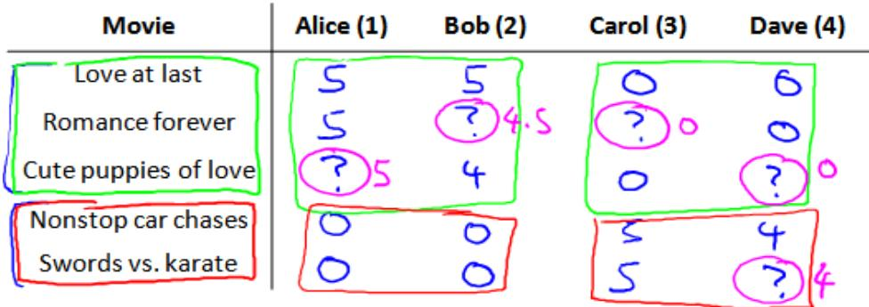

前三部电影是爱情片，后两部则是动作片，我们可以看出 Alice和 Bob似乎更倾向与爱情片，而 Carol 和 Dave 似乎更倾向与动作片。并且没有一个用户给所有的电影都打过分。我们希望构建一个算法来预测他们每个人可能会给他们没看过的电影打多少分，并以此作为推荐的依据。

下面引入一些标记：

$n_{u}$ 代表用户的数量

$n_{m}$ 代表电影的数量

$r ( i , j )$ 如果用户 $j$给电影 $i$ 评过分则 $r ( i , j ) = 1$

$y^{( i , j )}$ 代表用户 $j$ 给电影 $i$ 的评分

$m_{j}$ 代表用户 $j$ 评过分的电影的总数

## 16.2 基于内容的推荐系统

## 参考视频: 16 - 2 - Content Based Recommendations (15 min).mkv

在一个基于内容的推荐系统算法中，我们假设对于我们希望推荐的东西有一些数据，这些数据是有关这些东西的特征。

在我们的例子中，我们可以假设每部电影都有两个特征， $\mathfrak{U} \mathfrak{A} \mathfrak{x} _{1} .$ 代表电影的浪漫程度， $x_{2}$ 代表电影的动作程度。

<table><tr><td>Movie</td><td>Alice (1)</td><td>Bob (2)</td><td>Carol (3)</td><td>Dave (4)</td><td> $x_{1}$ (romance)</td><td> $x_{2}$ (action)</td></tr><tr><td>Love at last</td><td>5</td><td>5</td><td>0</td><td>0</td><td>0.9</td><td>0</td></tr><tr><td>Romance forever</td><td>5</td><td>?</td><td>?</td><td>0</td><td>1.0</td><td>0.01</td></tr><tr><td>Cute puppies of love</td><td>?</td><td>4</td><td>0</td><td>?</td><td>0.99</td><td>0</td></tr><tr><td>Nonstop car chases</td><td>0</td><td>0</td><td>5</td><td>4</td><td>0.1</td><td>1.0</td></tr><tr><td>Swords vs. karate</td><td>0</td><td>0</td><td>5</td><td>?</td><td>0</td><td>0.9</td></tr></table>

则每部电影都有一个特征向量， $\mathfrak{U} \mathbb{I} \boldsymbol{x} ^{( 1 )}$ 是第一部电影的特征向量为[0.90]。

下面我们要基于这些特征来构建一个推荐系统算法。 假设我们采用线性回归模型，我们可以针对每一个用户都训练一个线性回归模型，如 $\theta^{( 1 )}$ 是第一个用户的模型的参数。 于是，我们有：

$\theta^{( j )}$ 用户 $j$ 的参数向量

$x^{( i )}$ 电影 $i$ 的特征向量

对于用户 $j$ 和电影 $i$，我们预测评分为： $( \theta^{( j )} ) ^{T} x^{( i )}$

代价函数

针对用户 $j$，该线性回归模型的代价为预测误差的平方和，加上正则化项：

$$
\min_{\theta (j)} \frac{1}{2} \sum_{i: r (i, j) = 1} \left((\theta^{(j)}) ^{T} x^{(i)} - y^{(i, j)}\right) ^{2} + \frac{\lambda}{2} \left(\theta_{k} ^{(j)}\right) ^{2}
$$

其中 $i \colon r ( i , j )$ 表示我们只计算那些用户 $j$ 评过分的电影。在一般的线性回归模型中，误差项和正则项应该都是乘以 $1 / 2 m$ ，在这里我们将$m$去掉。并且我们不对方差项 ${\bf \delta} _{\theta_{0}}$ 进行正则化处理。

上面的代价函数只是针对一个用户的，为了学习所有用户，我们将所有用户的代价函数求和：

$$
\min_{\theta^{(1)}, \dots , \theta^{(n_{u})}} \frac{1}{2} \sum_{j = 1} ^{n_{u}} \sum_{i: r (i, j) = 1} \left((\theta^{(j)}) ^{T} x^{(i)} - y^{(i, j)}\right) ^{2} + \frac{\lambda}{2} \sum_{j = 1} ^{n_{u}} \sum_{k = 1} ^{n} (\theta_{k} ^{(j)}) ^{2}
$$

如果我们要用梯度下降法来求解最优解，我们计算代价函数的偏导数后得到梯度下降的更新公式为：

$$
\theta_{k} ^{(j)} := \theta_{k} ^{(j)} - \alpha \sum_{i: r (i, j) = 1} ((\theta^{(j)}) ^{T} x^{(i)} - y^{(i, j)}) x_{k} ^{(i)} \quad (\text{for} k = 0)
$$

$$
\theta_{k} ^{(j)} := \theta_{k} ^{(j)} - \alpha \left(\sum_{i: r (i, j) = 1} (\big (\theta^{(j)}) ^{T} x^{(i)} - y^{(i, j)} \big) x_{k} ^{(i)} + \lambda \theta_{k} ^{(j)}\right) \quad (\text{for} k \neq 0)
$$

## 16.3 协同过滤

## 参考视频: 16 - 3 - Collaborative Filtering (10 min).mkv

在之前的基于内容的推荐系统中，对于每一部电影，我们都掌握了可用的特征，使用这些特征训练出了每一个用户的参数。相反地，如果我们拥有用户的参数，我们可以学习得出电影的特征。

$$
\underset{x^{(1)}, \ldots , x^{(n_{m})}} {\min} \frac{1}{2} \sum_{i = 1} ^{n_{m}} \sum_{j r (i, j) = 1} ((\theta^{(j)}) ^{T} x^{(i)} - y^{(i, j)}) ^{2} + \frac{\lambda}{2} \sum_{i = 1} ^{n_{m}} \sum_{k = 1} ^{n} (x_{k} ^{(i)}) ^{2}
$$

但是如果我们既没有用户的参数，也没有电影的特征，这两种方法都不可行了。协同过滤算法可以同时学习这两者。

我们的优化目标便改为同时针对$x$和$\theta$进行。

$$
\begin{array}{l} J (x^{(1)}, \ldots x^{(n_{m})}, \theta^{(1)}, \ldots , \theta^{(n_{u})}) \\ = \frac{1}{2} \sum_{(i: j): r (i, j) = 1} ((\theta^{(j)}) ^{T} x^{(i)} - y^{(i, j)}) ^{2} + \frac{\lambda}{2} \sum_{i = 1} ^{n_{m}} \sum_{k = 1} ^{n} (x_{k} ^{(j)}) ^{2} \\ + \frac{\lambda}{2} \sum_{j = 1} ^{n_{u}} \sum_{k = 1} ^{n} (\theta_{k} ^{(j)}) ^{2} \end{array}
$$

对代价函数求偏导数的结果如下：

$$
x_{k} ^{(i)} := x_{k} ^{(i)} - \alpha \left(\sum_{j: r (i, j) = 1} ((\theta^{(j)}) ^{T} x^{(i)} - y^{(i, j)} \theta_{k} ^{j} + \lambda x_{k} ^{(i)}\right)
$$

$$
\theta_{k} ^{(i)} := \theta_{k} ^{(i)} - \alpha \left(\sum_{i: r (i, j) = 1} ((\theta^{(j)}) ^{T} x^{(i)} - y^{(i, j)} x_{k} ^{(i)} + \lambda \theta_{k} ^{(j)}\right)
$$

$$
\min_{x^{(1)}, \ldots , x^{(n_{m})}} \frac{1}{2} \sum_{i = 1} ^{n_{m}} \sum_{j r (i, j) = 1} ((\theta^{(j)}) ^{T} x^{(i)} - y^{(i, j)}) ^{2} + \frac{\lambda}{2} \sum_{i = 1} ^{n_{m}} \sum_{k = 1} ^{n} (x_{k} ^{(i)}) ^{2}
$$

注：在协同过滤从算法中，我们通常不使用方差项，如果需要的话，算法会自动学得。协同过滤算法使用步骤如下：

1. 初始 $\boldsymbol{x} ^{( 1 )} , \boldsymbol{x} ^{( 1 )} , \ldots \boldsymbol{x} ^{( n m )} , \boldsymbol{\theta} ^{( 1 )} , \boldsymbol{\theta} ^{( 2 )} , \ldots , \boldsymbol{\theta} ^{( n_{u} )}$ 为一些随机小值

2. 使用梯度下降算法最小化代价函数

3. 在训练完算法后，我们预测 $( \theta^{( j )} ) ^{T} x^{( i )}$ 为用户 $j$ 给电影 $i$ 的评分

通过这个学习过程获得的特征矩阵包含了有关电影的重要数据，这些数据不总是人能读

懂的，但是我们可以用这些数据作为给用户推荐电影的依据。

例如，如果一位用户正在观看电影 $x^{( i )}$ ，我们可以寻找另一部电影 $x^{( j )}$ ，依据两部电影的特征向量之间的距离 $\| \boldsymbol{x} ^{( i )} - \boldsymbol{x} ^{( j )} \|$ ∥∥的大小。

## 16.4 协同过滤算法

## 参考视频: 16 - 4 - Collaborative Filtering Algorithm (9 min).mkv

协同过滤优化目标：

给定 $\boldsymbol{x} ^{( 1 )} , \ldots , \boldsymbol{x} ^{( n_{m} )}$ ，估计 $\cdot \theta^{( 1 )} , \dots , \theta^{( n_{u} )}$

$$
\min_{\theta^{(1)}, \dots , \theta^{(n_{u})}} \frac{1}{2} \sum_{j = 1} ^{n_{u}} \sum_{i: r (i, j) = 1} ((\theta^{(j)}) ^{T} x^{(i)} - y^{(i, j)}) ^{2} + \frac{\lambda}{2} \sum_{j = 1} ^{n_{u}} \sum_{k = 1} ^{n} (\theta_{k} ^{(j)}) ^{2}
$$

给定 $\theta^{( 1 )} , \ldots , \theta^{( n_{u} )}$ ，估计 $\mathbf{\boldsymbol{x}} ^{( 1 )} , \dots , \mathbf{\boldsymbol{x}} ^{( n_{m} )}$

同时最小化 $\boldsymbol{x} ^{( 1 )} , \ldots , \boldsymbol{x} ^{( n_{m} )}$ 和 $\lvert \theta^{( 1 )} , \ldots , \theta^{( n_{u} )}$

$$
\begin{array}{c} J (x^{(1)}, \ldots , x^{(n_{m})}, \theta^{(1)}, \ldots , \theta^{(n_{u})}) \\ = \frac{1}{2} \sum_{(i, j): r (i, j) = 1} ((\theta^{(j)}) ^{T} x^{(i)} - y^{(i, j)}) ^{2} + \frac{\lambda}{2} \sum_{i = 1} ^{n_{m}} \sum_{k = 1} ^{n} (x_{k} ^{(i)}) ^{2} + \frac{\lambda}{2} \sum_{j = 1} ^{n_{u}} \sum_{k = 1} ^{n} (\theta_{k} ^{(j)}) ^{2} \end{array}
$$

$$
\min_{x^{(1)}, \dots , x^{(n_{m})}, \theta^{(1)}, \dots , \theta^{(n_{u})}} J (x^{(1)}, \dots , x^{(n_{m})}, \theta^{(1)}, \dots , \theta^{(n_{u})})
$$

## 16.5 向量化：低秩矩阵分解

## 参考视频: 16 - 5 - Vectorization\_ Low Rank Matrix Factorization (8 min).mkv

在上几节视频中，我们谈到了协同过滤算法，本节视频中我将会讲到有关该算法的向量化实现，以及说说有关该算法你可以做的其他事情。

举例子：

1.当给出一件产品时，你能否找到与之相关的其它产品。

2.一位用户最近看上一件产品，有没有其它相关的产品，你可以推荐给他。

我将要做的是：实现一种选择的方法，写出协同过滤算法的预测情况。

我们有关于五部电影的数据集，我将要做的是，将这些用户的电影评分，进行分组并存到一个矩阵中。

我们有五部电影，以及四位用户，那么这个矩阵 $Y$ 就是一个 5 行 4 列的矩阵，它将这些电影的用户评分数据都存在矩阵里：

<table><tr><td>Movie</td><td>Alice (1)</td><td>Bob (2)</td><td>Carol (3)</td><td>Dave (4)</td></tr><tr><td>Love at last</td><td>5</td><td>5</td><td>0</td><td>0</td></tr><tr><td>Romance forever</td><td>5</td><td>?</td><td>?</td><td>0</td></tr><tr><td>Cute puppies of love</td><td>?</td><td>4</td><td>0</td><td>?</td></tr><tr><td>Nonstop car chases</td><td>0</td><td>0</td><td>5</td><td>4</td></tr><tr><td>Swords vs. karate</td><td>0</td><td>0</td><td>5</td><td>?</td></tr></table>

$$
Y = \left[ \begin{array}{c c c c} 5 & 5 & 0 & 0 \\ 5 & ? & ? & 0 \\ ? & 4 & 0 & ? \\ 0 & 0 & 5 & 4 \\ 0 & 0 & 5 & 0 \end{array} \right]
$$

推出评分：

$$
\left[ \begin{array}{c c c c} (\theta^{(1)}) ^{T} (x^{(1)}) & (\theta^{(2)}) ^{T} (x^{(1)}) & \ldots & (\theta^{(n_{u})}) ^{T} (x^{(1)}) \\ (\theta^{(1)}) ^{T} (x^{(2)}) & (\theta^{(2)}) ^{T} (x^{(2)}) & \ldots & (\theta^{(n_{u})}) ^{T} (x^{(2)}) \\ \vdots & \vdots & \vdots & \vdots \\ (\theta^{(1)}) ^{T} (x^{(n_{m})}) & (\theta^{(2)}) ^{T} (x^{(n_{m})}) & \ldots & (\theta^{(n_{u})}) ^{T} (x^{(n_{m})}) \end{array} \right]
$$

找到相关影片：

For each product i, we learn a feature vector $\underline{{x^{( i )}}} \in \mathbb{R} ^{n}$

$$
\rightarrow x_{1} = \text{romance}, x_{2} = \text{action}, x_{3} = \text{comedy}, x_{4} = \dots
$$

$$
\text{How to   find} \overline{{\text{movies} j}} \text{related to} \overline{{\text{movie} i}}?   s_{\text{small}} \| x^{(i)} - x^{(j)} \| \rightarrow \text{movie} j \text{and} i \text{cre "similar"}
$$

## 5 most similar movies to movie i:

Find the 5 movies j with the smallest $\| \boldsymbol{x} ^{( i )} - \boldsymbol{x} ^{( j )} \|$

现在既然你已经对特征参数向量进行了学习，那么我们就会有一个很方便的方法来度量两部电影之间的相似性。例如说：电影 $i$ 有一个特征向量 $\cdot x^{( i )}$ ，你是否能找到一部不同的电影 $j$，保证两部电影的特征向量之间的距离 $\cdot_{x^{( i )}}$ 和 $| x^{( j )}$ 很小，那就能很有力地表明电影$i$和电影 $j$ 在某种程度上有相似，至少在某种意义上，某些人喜欢电影 $i$，或许更有可能也对电影$j$ 感兴趣。总结一下，当用户在看某部电影 $i$ 的时候，如果你想找 5 部与电影非常相似的电影，为了能给用户推荐5 部新电影，你需要做的是找出电影 $j ,$ ，在这些不同的电影中与我们要找的电影 $i$ 的距离最小，这样你就能给你的用户推荐几部不同的电影了。

通过这个方法，希望你能知道，如何进行一个向量化的计算来对所有的用户和所有的电影进行评分计算。同时希望你也能掌握，通过学习特征参数，来找到相关电影和产品的方法。

## 16.6 推行工作上的细节：均值归一化

## 参考视频: 16 - 6 - Implementational Detail\_ Mean Normalization (9 min).mkv

让我们来看下面的用户评分数据：

$$
\begin{array}{c c c c c c} \text{Movie} & \text{Alice (1)} & \text{Bob (2)} & \text{Carol (3)} & \text{Dave (4)} & \text{Eve (5)} \\ \hline \text{Love at last} & 5 & 5 & 0 & 0 & ? \\ \text{Romance forever} & 5 & ? & ? & 0 & ? \\ \text{Cute puppies of love} & ? & 4 & 0 & ? & ? \\ \text{Nonstop car chases} & 0 & 0 & 5 & 4 & ? \\ \text{Swords vs. karate} & 0 & 0 & 5 & ? & ? \end{array} Y = \left[ \begin{array}{c c c c c} 5 & 5 & 0 & 0 & ? \\ 5 & ? & ? & 0 & ? \\ ? & 4 & 0 & ? & ? \\ 0 & 0 & 5 & 4 & ? \\ 0 & 0 & 5 & 0 & ? \end{array} \right]
$$

如果我们新增一个用户 Eve，并且 Eve 没有为任何电影评分，那么我们以什么为依据为Eve推荐电影呢？

我们首先需要对结果 $Y$矩阵进行均值归一化处理，将每一个用户对某一部电影的评分减去所有用户对该电影评分的平均值：

$$
Y = \left[\begin{array}{c c c c c}5&5&0&0&?\\5&?&?&0&?\\?&4&0&?&?\\0&0&5&4&?\\0&0&5&0&?\end{array}\right] \quad \mu = \left[\begin{array}{c}2. 5\\2. 5\\2\\2. 25\\1. 25\end{array}\right]\rightarrow Y = \left[\begin{array}{c c c c c}2. 5&2. 5&- 2. 5&- 2. 5&?\\2. 5&?&?&- 2. 5&?\\?&2&- 2&?&?\\- 2. 25&- 2. 25&2. 75&1. 75&?\\- 1. 25&- 1. 25&3. 75&- 1. 25&?\end{array}\right]
$$

然后我们利用这个新的 $Y$ 矩阵来训练算法。 如果我们要用新训练出的算法来预测评分，则需要将平均值重新加回去，预测 $( \theta^{( j )} ) ^{T} x^{( i )} + \mu_{i}$ ，对于Eve，我们的新模型会认为她给每部电影的评分都是该电影的平均分。

