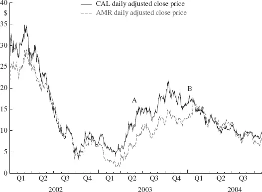

# [第1章](ch01.md) 蒙特卡洛还是破产

*We must always be ready to learn from repeatable occurrences however odd they may look at first sight.*

—Box on Quality and Design, G.E.P. Box

## 1.1 起源

1985年，一小群在努齐奥·塔塔利亚（Nunzio Tartaglia）指导下接受过量化训练的研究人员（1）开发了一个以配对组合方式买卖股票的程序。摩根士丹利（Morgan Stanley）的「黑箱」诞生了，并迅速赢得了声誉和大量利润。统计套利（Statistical Arbitrage）——这一在当时尚未被命名的术语——开启了长达十五年、走向传奇地位的上升之路。

「黑箱」的细节被严密守护，但很快传言揭示了其基本原理，「配对交易（Pairs Trading）」这一名称也出现在金融词典中。配对交易的前提简单得令人叹为观止：找到一对具有相似历史价格走势的股票。当这两只股票的价格出现偏离时，押注它们随后会回归收敛。简单得令人眩目，简单得优美。而且利润丰厚。

**图1.1 CAL 与 AMR 的每日收盘价（2002-2004）**

塔塔利亚的灵感从何而来？如同许多发明的故事一样，需求是驱动力。管理层要求他找到一种对冲大宗交易（Block Trading）中常规产生的风险的方法，塔塔利亚的数学训练催生了这样一个想法：卖空（Short）一只与大宗交易柜台管理的股票具有相似交易行为的股票。这个想法一经提出，配对交易更广泛的应用也随之创新。很快，一个新的利润中心就在贡献收入了。

图1.1展示了两只航空股的每日收盘价——大陆航空（CAL）和美国航空（AMR）。注意两条价格轨迹之间的价差（Spread）如何时而扩大、时而收窄。配对交易策略简直在对你大喊：当价差「变宽」时（A点），买入低价股、卖空高价股；当价差收窄时（B点），平仓了结头寸。

1985年，计算机还不是家庭中的常见设备，每日股票价格数据只是专业人士的工具。配对交易的认真执行所需的纯粹计算能力，需要数万美元的硬件。配对交易在概念上如此优美简单，在实践中也已运行多年，但它诞生于一个只有投资机构才有能力研究和部署它的时代。

那个时代的许多故事在业界流传，将这一业务和从业者神话化。其中两个具有实质意义且至今仍有影响力的故事是：美国证券交易委员会（SEC）使用算法检测异常价格模式，以及专家做市商（Specialist）对逆向交易者的态度演变——从最初的怀疑到最终的接纳。

SEC对摩根士丹利黑箱周围的光环同样充满好奇。在了解到模型如何预测某些股票价格走势之后，他们很快意识到，这项技术可以在神经网络技术被应用于这一角色之前，就用来标记某些异常且可能非法的价格波动。

1980年代末，纽约证券交易所（NYSE）拥有超过50名独立的专家做市商。他们大多是资本有限的家族企业，当摩根士丹利开始系统性地下达「逢低买入」和「逢高卖出」的订单时，他们高度警惕。最大的担忧是这家大机构正在试图利用小做市商获利。随着交易模式的逐渐揭示，怀疑逐渐演变为舒适的默契。最终，这种默契变成了完全的接纳——当专家做市商看到摩根士丹利在吸纳一只弱势股票时，他们会「确信」该股价即将上涨而跟风买入。

早年是极其丰厚的。成功很快催生了独立从业者，包括D.E. Shaw和Double Alpha，均由塔塔利亚的前门徒创立。在此后的岁月里，其他团队也建立了配对交易业务，其创始人要么可追溯至摩根士丹利的原始团队，要么可追溯至Shaw这样的第二代机构。随着这一实践被更广泛地了解，学术界的兴趣也被激发；包括NBER在内的机构发表的论文使这一通用准则广为人知，加上低成本个人计算机性能的快速提升，潜在的从业者基础呈爆炸式增长。很快，实际的从业者基础也大幅扩张。

## 1.2 何去何从？——隐喻

二十年后，从配对交易幼苗成长起来的成熟统计套利面临着灾难性的环境变迁。回报大幅下降。管理者们面临重重困难，正在调整策略以应对。新世纪的金融市场环境所带来的生存挑战，或许可类比于数千年前上一次冰河时代降临时地球动物所面临的境遇。快速且适应性强的物种存活了下来，行动迟缓、形态固化的物种则被冻死或饿死。

统计套利的冰河时代始于2000年，并在2004年进入全面「冰冻期」。观察者宣布这一投资学科的死亡，投资者撤回了资金，从业者关门歇业。溃败是全面的。失败的阴霾笼罩着对这一业务的讨论。

我认为，宣告统计套利已到终点的判断为时过早。尽管市场结构的变化对传统统计套利模型造成了问题——这些将在后续章节中记录和考察——但新的机会正在显现。新的股票价格行为模式至少在两个高频时间尺度上出现。驱动力可以在电子交易实体的相互作用中被识别——它们预示着美国股票交易的未来。

这些新机会的出现——尽管目前仅有粗略的描述——暗示了显著的经济可利用性，它们或许足以使统计套利免于灭绝的命运。经典均值回归玩法中的「克罗马农人」将被「智人」所取代……结果如何尚待观察，但轮廓将在[第11章](ch11.md)中勾勒。

我曾考虑将本书命名为《统计套利的崛起、衰落与再崛起？》（The Rise and Fall and Rise? of Statistical Arbitrage），以反映其历史和正在浮现的可能性。这一模式在本章前文以及全书结构中显而易见——本书几乎是以一部注释史的形式写成的。对于那些因「统计套利的前景如何？」这一问题而来的读者，第1至[第7章](ch07.md)的历史背景和理论发展或许显得不合时宜、不值得关注。这或许类似于建议应用数学专业的学生去研究哥白尼的天体运动体系，认为其在当下仍然实用。我认为历史研究具有价值——对数学家而言也是如此，尽管这个类比被引申得过远了。了解统计套利中什么曾经有效、它是如何有效以及为什么有效，为理解市场结构变化为何对该策略类别产生负面影响提供了必要的基础。了解哪些变化产生了影响、这些影响如何被实现，有助于洞察在当前正在形成的环境中可以期待什么。

在过去的语境中解读现在，这绝非什么新概念。它是科学研究的坚实基础。大多数人都熟悉政治哲学家的告诫：那些不研究历史的人注定要重蹈覆辙。（2）但这并非我们的参照点。虽然毫无疑问某些套利者犯过个别错误，但我们不能判定从业者集体「犯了一个错误」并应当永远防范。我们的参照点是更具说服力的科学观点——「站在巨人的肩膀上」。不带价值判断，科学理论无论对错，无论贡献多么微小，都将永远接受审视。新机会的承诺可以在如下语境中被理解和评估：市场变化如何使曾经有利可图的东西变得毫无价值。

让我们明确一点。尽管提到了历史上的科学天才，但本书所述的工作并不声称拥有历史地位。这一研究领域也不能理所当然地与物理、化学和数学放在同一货架上。它更应与经济学和社会学并列，因为其最根本的力量是人。我们可以将一个涌现过程标记为「回归」（价格的），描述时间模式，建立数学方程简洁地表达这些模式，并根据这些输出采取行动——交易。但理论、模型和分析所描述的是一个涌现过程，而非因果机制本身。无论我们多么令人印象深刻地描述常规参与者的行为流程——从分析师（撰写报告）到基金顾问（阅读报告、建议投资组合调整）到基金经理（做出投资组合决策）到交易员（执行决策）——建模必然与基本过程存在距离。在这个复杂的交互宇宙中，模型所能捕捉的只是结果，而这正是该业务的起源所在，如今更致命地，也是衰落的腐烂根源。令人惊讶的是，这腐烂的根源正在孕育着即将描述的崛起（？）的种子。

与必然带有个人解读、随新发现或对先前神圣文献真实性的质疑而变化的历史研究或政治哲学研究不同，统计套利的研究受益于一个不可更改、明确无误且完整的数据历史，任何学者都可以访问。证券价格的历史如同第谷·布拉赫（Tycho Brahe）的天文观测一样是固定的。虽然布拉赫的表格受到他那个时代物理条件的限制（3），也受到当前对自然物理现实的相对论理解中固有不确定性的影响，但证券价格的历史——作为人类活动的产物——是精确已知的。

在强调我们数据质量的同时，请记住布拉赫测量的是宇宙尺度上的物理现实效应，科学理论可以从中归纳和演绎。我们的数据——金融交易记录——可能没有错误，但它们是对人类之间达成的交易的度量。在这一点上，可以诉诸什么不变的物理现实呢？我们可以建立价格变化的模型，但随着我们这样做，科学性也在弱化。数据永远不会改变，但它也不会重复。在这种条件下，如何用科学方式验证一个理论？

这些问题在这里无法回答。我们无法提供金融哲学或金融社会学。但我们可以努力在数据分析、假设提出、模型构建和检验中追求科学严谨。这种严谨性是我们所能声称的任何信念的基础——关于利用金融集市中各组成部分的涌现性质来进行理解和连贯行动的信念。

本书对统计套利是什么进行了批判性分析——为机会的存在及其量化提供正式的理论基础，并阐释美国经济结构在金融市场中的巨大变迁，特别关注其对套利可能性的深远影响。

> （1）在《The Best of Wilmott》中，保罗·威尔莫特（Paul Wilmott）指出，摩根士丹利的配对交易项目是由杰里·班伯格（Gerry Bamberger）于1982/1983年发起的，班伯格于1985年离开摩根士丹利前往Princeton Newport Partners，并于1987年退休。我们无法确认班伯格在摩根士丹利的项目是否与塔塔利亚的不同；其他人声称这是团队合作，并抱怨将任一组别负责人加冕为「发明者」是不公平的。

> 有趣的是，威尔莫特声称配对交易早在1980年就在他自己的公司被发现了。

> （2）「进步绝非取决于变化，而是取决于记忆力。当变化是绝对的时，就没有了可以改进的存在，也没有了为可能的改进设定的方向；当经验未被保留时——如野蛮人那样——婴儿期就是永恒的。那些不能记住过去的人注定要重蹈覆辙。在生命的早期阶段，心灵是浮躁的、容易分心的，由于缺乏连贯性和持久性而错失进步。这是儿童和蛮族的状态，本能没有从经验中学到任何东西。」——《理性生活》（The Life of Reason），乔治·桑塔亚纳（George Santayana）

> （3）第一位皇家天文学家约翰·弗拉姆斯蒂德（John Flamsteed，1646-1719）从格林威治新建立的皇家天文台系统地测绘了可观测天穹，编纂了30,000条独立观测记录，每条记录都在长达40年的专注夜间工作中被记录和确认。「完成的星表使第谷·布拉赫在丹麦乌拉尼堡（Uraniborg）编纂的天图目录条目增加了两倍，并将天体普查的精度提高了几个数量级。」——《经度》（Longitude），达娃·索贝尔（Dava Sobel）
