# [第2章](ch02.md) 统计套利

许多发生的事情可以方便地视为随机波动，但有时在波动之中隐藏着重要的信号，这些信号可能会警告我们注意问题，或提醒我们关注机会。

——Box on Quality and Discovery, G.E.P. Box

## 2.1 引言

配对交易（Pairs Trading）方案从 Tartaglia 团队开展的研究开始，在多个方向上得到了深入发展。随着所用分析技术变得更加复杂、所部署的模型更加技术化，这门学科的称谓也随之演变。"统计套利（Statistical Arbitrage）"一词最早出现在 20 世纪 90 年代初。

统计套利（Statistical Arbitrage）的方法从早期简单的配对交易方案，到复杂的、动态的、非线性模型，涵盖了神经网络（Neural Networks）、小波分析（Wavelets）、分形（Fractals）等各种技术——几乎所有来自统计学、物理学和数学的模式匹配技术都曾被尝试、检验，并在许多情况下被放弃。

后来的发展结合了交易经验、进一步的实证观察、实验分析以及来自工程学和物理学的理论洞见（涵盖从高能粒子物理到流体动力学等广泛领域，运用了从概率论到微分方程和差分方程的数学技术）。当如此多的智力资源投入到研究中时，"配对交易"这个标签似乎已经不够用了。太普通了。甚至有些土气。于是"统计套利"应运而生——有趣的是，尽管这项工作大多缺乏统计学家参与或统计学内容。

## 2.2 噪声模型（Noise Models）

配对交易最初制定的规则是对价差（Spread）视觉特征的简单数学描述。以图 2.1 中 CAL–AMR 价差为例，其波动范围从 −$2 到 $6，一条简单而有效的规则是：当价差达到 $4 时建立头寸，当价差回到 $0 时平仓。

**图 2.1 每日收盘价差，CAL–AMR

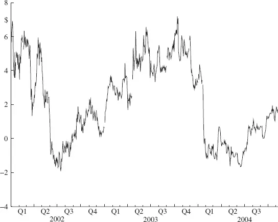

我们特意使用"规则（Rules）"而非"模型（Model）"一词，因为这里并没有试图构建一个过程来解释所观察到的行为，而仅仅是对显著模式的描述。这并非否定规则的有效性，而是对早期工作的准确定性。正如记录所示，这些规则在数年间带来了极其丰厚的利润。

将 $4–$0 规则应用于 CAL–AMR 价差，在 2002 和 2003 日历年中只产生了一笔交易。如果这看起来像是几乎不费力气就能赚钱，那么这正是 Tartaglia 在 1985 年发现的惊人状况——只不过放大到了数千只股票对上。

备选方案、改进和推广随着人们观察价差并思考那条诱人的简单规则而跃然纸上。两种典型的改进是：

- 进行反向交易（Reverse Bet）。

- 在分阶段入场点进行重复交易。

### 2.2.1 反向交易

为什么要在 2002 年下半年袖手旁观，看着价差从窄点向已确定的入场点 $4 攀升？为什么不赌这个方向？在商品交易者"海龟交易（Turtle Trade）"的一个变体中，规则 1 很快被规则 2 替代，后者将退出条件"当价差为 $0 时平仓"替换为反向操作"反转多空头寸"。这样，始终持有头寸，等待价差从低位上升或从高位回落。

随着交易机会的扩大，交易次数增多，利润增加，而无需额外的工作。

### 2.2.2 多次交易

在 2002 年第一季度，CAL–AMR 价差在 $6 的范围内波动，从最高 $7 到最低 $1。按照规则 1（和规则 2）建立的头寸经历了显著的盯市（Mark to Market）盈亏，但并未捕捉到任何波动。由于价差在数天和数周内上下波动，围绕着最终导致其收缩至零并触发平仓（规则 1）或反向操作（规则 2）的趋势线来回游走，何不尝试捕捉其中的部分波动？

规则 3 旨在通过在规则 1 所确定的入场点之外增加第二个入场点，从价差中获取更多利润。对于 CAL–AMR，规则是：当价差上升到 $6 时，对价差随后的收缩进行第二次交易。在 2002 和 2003 年，加倍的价差收缩交易将使利润增加 150%！（2002 年的利润增幅相对于规则 2 较小，因为规则 2 从反向交易中获益，而规则 3 中反向交易未变。2003 年没有反向交易，头寸延续到了 2004 年。）

这一个例子就令人震撼地展示了 1985 年 Tartaglia 团队面前的巨大机会，那个时代价差的波动范围通常比本章示例中的更大。

### 2.2.3 规则校准（Rule Calibration）

一旦将分析扩展到单个配对之外，或者考察单个配对的更长历史，校准问题就会出现。图 2.2 显示了另一对价格历史，仅涵盖 2000 年。图 2.3 显示了相应的价差。^(1)

**图 2.2 每日收盘价，CAL 和 AMR（2000）

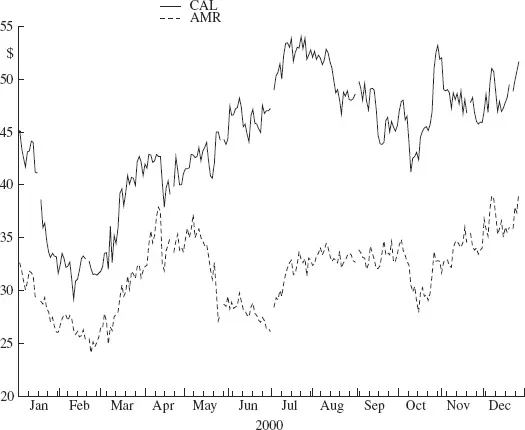

**图 2.3 每日收盘价差，CAL–AMR

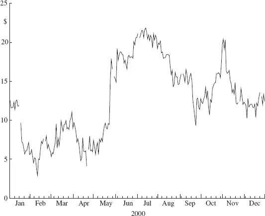

哇！我们应该早点展示这个例子。价差在 $20 的范围内波动，是图 2.1 中 CAL–AMR 示例的三倍机会。但正是在这丰富的机会中，隐藏着规则 1–3 面临的第一个难题：此前推导的校准在这里完全失效。将其应用于规则 3 将在 1 月价差超过 $4 和 $6 时产生两笔交易。随着价差在 7 月攀升至 $20 以上，将很快承受巨大压力。到年底，亏损仍会挂在账上。显然，我们必须为规则 1–3 中的任何一条确定不同的校准。同样显然的是，这些规则的基本形式仍然有效。

现在考虑将校准问题应用于数百或数千个潜在价差的情况。目视图表需要大量的眼球。需要一种数值方法，一种自动校准规则的方式。于是统计学登场了。交易规则是通过目测价差波动范围来制定的。这可以轻松地自动计算：图 2.1 中价差的最大值和最小值分别为 −$2 和 $7。假设留出 20% 的余量，自动校准将给出规则 1 的入场和退出值分别为 $5 和 $0。这与我们目测选择的不完全一致，但在操作上会产生类似（虽然更丰富）的交易。关键是，该过程可以由计算机对任意数量的价差轻松重复。

对于第二个例子（图 2.2），价差范围是 $3 到 $22。20% 余量校准给出的交易入场和退出值分别为 $18 和 $7。使用这一自动校准应用规则 1，在 2000 年产生了一笔盈利交易。这一理想结果与将示例一的校准（根据图 2.1 目测的入场 $4 和 $6、退出 $0）机械套用到图 2.2 价差所导致的令人作呕的盯市亏损形成鲜明对比。

#### 校准周期（Calibration Epochs）

在上述目测校准的讨论中，我们没有明确说明所考虑的时间跨度——在第一个例子中是两年，第二个例子中是一年。当然，两个例子都是为了鲜明地展示配对交易机会的美妙简洁性和明显可用性而选定的。然而，这些例子并不脱离现实。那么：多少时间是合适的？

图 2.1 和图 2.2 中的股票是相同的：CAL 和 AMR。"多少时间合适？"这个问题现在看来不仅对每个候选配对的一次性决策至关重要，而且持续地至关重要。想象一下，将 CAL–AMR 价差 2000 年的校准应用于 2002–2003 年交易的后果。在这种情况下，后果看起来还算温和：没有交易。但这是一个负面后果，因为错过了宝贵的交易机会。在其他情况下，使用过时价格历史校准的规则可能会导致代价惨重的交易。

使用多少价格历史来校准交易规则这个问题至关重要。与迄今描述的分析——一次性、静态分析，将规则应用于与推导规则相同的价格历史——不同，实际交易始终是将过去应用于未知的未来。在图 2.4 中，CAL–AMR 的四年价差（2000–2003）历史与上下限一并显示，分别以最大值 −20% 和最小值 +20% 的范围计算，回溯窗口为三个月。虽然这些界限有时远不如之前考察的目测界限理想，但它们确实保留了良好的交易识别特性。此外，与之前的样本内（In Sample）计算不同，当前的估计是样本外（Out of Sample）预测。在任何一天，计算中使用的唯一价格信息都是公开可得的历史数据。因此，计算出的界限在实际操作中是可行的。

**图 2.4 每日收盘价差，CAL–AMR（带上交易规则界限）

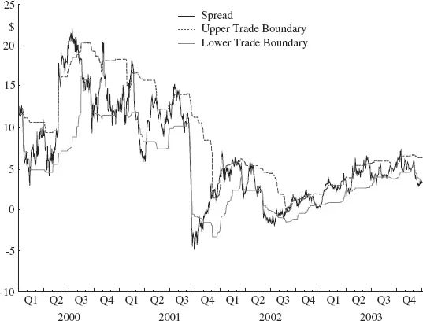

应用规则 2，共有 19 笔交易（忽略 2000 年第一季度，因为界限是基于不充分的数据计算的），包括 4 笔亏损交易和 15 笔盈利交易。盈利和亏损交易都表现出在交易结束前获利之前承受显著盯市亏损的阶段。最后一点观察：注意 2000–2003 年间价差波动率（Volatility）已大幅下降；后续章节将对此展开详细讨论。

### 2.2.4 价差交易规则的边际（Spread Margins）

针对确定价差波动范围的操作界限以指导交易决策这一已证实的问题，我们选择了 20% 的边际。在三个月窗口中，上边界"卖空价差"为最大价差 −20% 范围，下边界"买入价差"为最小价差 +20% 范围。这一操作程序具有易于解读的巨大优点。边际的含义一目了然：过去三个月计算出的价差范围的五分之一。

不太令人满意的是对极值 *max 和 *min 的使用。极值具有很大的变异性。因此，预测极值具有很大的不确定性：想想离群值（Outliers）以及你在统计学教科书中读到的关于仔细分析离群值的所有内容。极值建模是一个复杂而迷人的研究领域，应用范围从预测洪水的河流峰值流量，到预测发电需求和停电可能性的电力需求等。

由于极值的广泛变异性，可行的交易规则需要可观的余量（20%）。假设仅有最大的 10% 的价差位移就足以产生足够的交易机会来维持基于历史分析的业务。依赖这一余量进行实际交易将是不明智的，因为将信息预测到未来存在固有的不确定性。未来的极值必然与过去的极值不同。如果价差经历一个"平静期"，业务将会萧条，因为即使可能存在大量有利可图的机会，识别出的也会很少。保守起见使用较大的余量更为稳妥。当然，价差可能经历一个波动期；其后果是盯市收入波动更大，但不会减少业务量或总利润。

在极值之间可以获得更大的稳定性。预测价差的中心位置比预测极值要有把握得多。因此，大多数实施方案将"做空"和"做多"界限修改为从中心而非从极值计算偏移。布林带（Bollinger Bands），即均值加减一个标准差，就是一个经典例子。尽管如此，有理由质疑这种关注点转移在多大程度上提高了稳定性：标准差是从所有数据（包括极值）计算的，而且由于观测值被平方，极值实际上获得了更大的权重！合理的做法是采用稳健（Robust）方法，这相当于在计算均值和标准差等汇总统计量之前，排除（在更复杂的应用中降低权重）样本中最极端的值。

外推价差分布的百分位点，例如第 20 和第 80 百分位，同样具有稳健性，但很少见到。在本文描述的简单交易规则中，这在操作上没有实际意义。在模型更加复杂且分布的不对称性具有金钱影响的地方，其重要性更为显著。

更大（假定的）稳定性以牺牲一定的可解释性为代价。分布的标准差与范围之间没有唯一的关系。当给出标准差时，许多人假设（或没有意识到他们在假设）底层是正态分布（Normal Distribution），并将均值加减一个标准差等同于三分之二的概率，均值加减两个标准差等同于 95% 的概率。金融数据通常是非正态的，表现出不对称性，以及距均值若干标准差处显著更多的观测值，即所谓的"厚尾（Heavy Tails）"。这些尾部仅相对于正态分布来说是厚的，而非按金融数据的典型标准。因此，使用正态分布的尾部概率是风险计算错误——通常意味着低估——的常见原因。大多数此类错误可以通过使用经验分布（Empirical Distribution）——即数据本身——而非假定的数学形式来轻松避免。此外，检查正态曲线对一组数据的拟合程度，以及判断感兴趣区间（无论是尾部还是中心）的概率计算精度，是相当简单的。[第5章](ch05.md)在讨论价格序列的均值回归（Reversion）时展示了这些要点。

既然使用样本矩（均值和标准差）存在如此多潜在的代价高昂的错误，为什么人们如此轻易地放弃了极值范围？这种诡辩带来了什么好处？除了上述许多人（几乎是无意识的）行为之外，还有许多其他人的有意识行为，其驱动力是模型的数学可处理性。极值（及其函数）在分析上很难处理，而标准差通常容易得多。对于通常假定的正态分布，均值和标准差是定义特征，因此是必不可少的。

虽然这些技术细节对于理解和分析很重要，但在 20 世纪 80 年代末和 90 年代初，其实际应用价值微乎其微：均值回归在如此大规模和如此广泛的股票范围内如此明显，除非刻意操作不当，否则不可能不获得良好回报！这种丰富的环境已经多年不存在了。随着某些行业波动率下降——公用事业部门就是一个极好的例子（Gatev 等）——原始标准差规则变得不充分，因为交易的预期回报率降至交易成本以下。实施最低回报率下限解决了这个问题，并在后来的岁月中提供了宝贵的风险管理工具。

## 2.3 爆米花过程（Popcorn Process）

迄今为止展示的交易规则做出了一个强有力的声明：价差将系统性地从显著高于均值到显著低于均值波动，如此往复。这种时间发展模式的原型是正弦波（Sine Wave）。在配对交易的早期，这种原型为价差分析提供了理论模型，但观察到许多交易机会被遗漏了。另一种原型——我们将称之为"爆米花过程"——如图 2.5 所示，提供了新的洞见。它更紧密地关注均值回归：在偏离均值后的回归。在该模型中，价差波动的约束被移除了——即使是比数学原型更不规则的波动也是如此。一次向上运动（移动到一个"远端"峰顶）之后，在回到局部均值之后，可能紧接着另一次向远端峰顶的偏离。同样，一次下降到远端谷底可能紧随前一次远端谷底的偏离，而中间没有向远端峰顶的移动。这里使用限定词"远端"来区分与均值的实质性偏离和围绕均值的微小波动。两个谷底按定义被一个峰顶分隔，但只有当峰顶与均值足够远、使得回归均值的运动在经济上有利可图时，它才具有交易意义。重要的一点是，分隔两个谷底的峰顶可以接近均值，而非被迫或假定在均值之上很远。

**图 2.5 过程原型：（a）正弦型，（b）爆米花型

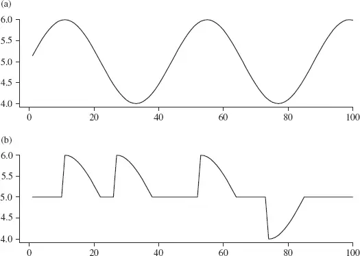

用数学表达爆米花过程比编写正弦函数更复杂，但也不会复杂太多。如果正弦函数写作：

$$ <!-- validate-skip -->
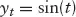
$$

那么爆米花函数可以类似地写作：

$$ <!-- validate-skip -->
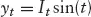
$$

其中 *It* 是一个指示函数（Indicator Function），取值 1 或 −1，分别表示峰顶或谷底运动。这里的数学并不重要；从过程的描述和图形描绘中获得的洞见是：利用爆米花过程，海龟交易（Turtle Trade）并非高效的方式。在图 2.5（b）中，海龟交易规则只识别出一笔利润为 $2 的交易。爆米花过程建议的规则是：当价差回归均值时发出退出信号，而非假设它会继续越过均值到达入场方向的对侧极值。这一新规则识别出四笔交易，总利润为 $4。该规则的另一个新颖特征是包含没有资金投入的时期。

新规则的所有必要计算已经描述过：局部均值和价差范围。改变的是交易规则。

规则 4：当价差从均值上升（下降）足够远（比如说 *k 个标准差）时，卖出（买入）价差；当价差回归均值时平仓。

许多统计套利者构建的更复杂模型——无论是针对配对价差还是更复杂的股票价格历史函数——都基于对爆米花过程或均值回归的理解，而非正弦型或海龟交易过程。[第3章](ch03.md)描述了一些模型和建模考量。随机共振（Stochastic Resonance）这一有趣现象（也在[第3章](ch03.md)描述）为规则 4 的退出条件提供了一个有价值的改进。

## 2.4 配对识别

机会是巨大的。我们有一套操作性交易规则和自动校准程序。现在，我们可以交易哪些配对？

早期，股票按广泛的行业分类分组，每组中的每一对都是候选对象。风险管理还很初级，Barra 模型应用于构建的投资组合，并通过远离配对组合的交易来抵消识别出的因子暴露（例如使用股票或标准普尔（S&P）期货来中和 β 暴露）。

随着对回报波动性控制的更高要求，以及经验显示出结构性弱点所在，改进方案被引入。当对冲基金（Hedge Funds）开始推销配对交易和统计套利策略时，个别管理者的偏好变得有影响力。

最大化相关性（Correlation）是应用于配对选择的早期过滤器：计算每个候选配对的相关性（例如使用两年的每日数据），仅保留相关性高于某个最小值的配对。基于过去相关性预测未来相关性这一假设，该过滤排除了表现出微弱或没有关系的股票对。其逻辑是：不相关的股票在行为上没有关联，因此作为一对是不可预测的。

### 2.4.1 细化配对选择

当两只成分股票的价格持续地分离又重新靠拢时，对配对价差的均值回归（Reversion）交易效果最好。这种行为模式——股票 A 上涨时股票 B 下跌，反之亦然——产生非常低（甚至负的）相关性。那么从利润或回报的角度来看，早期的相关性过滤器（搜索高度相关）是不是完全错误的？不：短期内，排除低相关性配对可能会放弃利润，但长期风险状况大大改善。通常表现出相反或不相关价格运动的股票，比倾向于同步运动的股票更有可能对基本市场发展做出不同反应。在某些时候，不相关的股票很可能造成代价高昂的配对交易。

这一洞见激发了一种微妙不同的相关性过滤方法。将风险时刻（或事件）定义为股票价格轨迹改变方向形成峰顶或谷底的时刻，为了风险最小化，选择显示相似事件历史的配对是可取的——峰顶和谷底在时间上接近，且两只股票在这些事件之间的运动幅度相似。这样的配对在市场受到干扰（政治、产业发展等）后不太可能做出分歧反应（可能在紧随其后的短暂时期除外）。为了利润最大化，期望在事件之间两只股票沿着不同的价格轨迹发展，表现出尽可能多的负相关性——先分离，再靠拢。关于理想的和不理想的配对相关性的正式处理，请参见[第5章](ch05.md)。

### 2.4.2 事件分析

转折点（Turning Point）算法的工作原理如下：

1. 价格序列中的一个局部极大值是一个转折点，条件是此后价格序列的下跌幅度产生的负回报的绝对值大于局部年化回报波动率的指定比例。

2. 类似地，一个局部价格极小值是一个转折点，条件是此后价格上涨幅度产生的回报大于局部年化回报波动率的指定比例。

3. 看图 2.6 中的价格轨迹（通用汽车，每日调整后价格）。给定在 *a 处识别出一个转折点，下一个转折点在哪里？点 *a 明显是一个局部极小值；因此，下一个转折点必须是局部价格极大值。从 *a 向前推进，观察 *a 到 *t 之间的价格序列。在区间 *[a, t] 中识别局部最大价格，记为 *p。从 *p 处价格到 *t 处价格的下跌是否大于 *t 处（回溯）局部波动率的 *k%？

**图 2.6 调整后收盘价轨迹（通用汽车），标出 30% 转折点

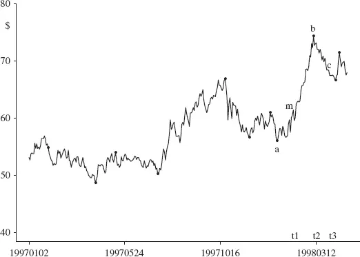

4. 当 *p = *m 且 *t = *t1 时，答案是否定的。直到 *b 被识别为局部极大值 *（t > *t2*）且 *t = *t3 时，答案才是肯定的。

5. 在本例中，设定窗口为 20 天以定义局部波动率，年化因子为 16，转折点判定比例为 30%。

图 2.7 再次显示通用汽车价格序列，这次使用较宽松的判定标准识别转折点：价格从峰顶下跌局部波动率的 25% 即将该峰顶判定为转折点。与默认的 30% 标准相比，多识别出 4 个局部极值（忽略序列端点）。即便如此，1997 年中的两个局部峰顶和谷底仍未被算法识别。它们在几天内提供了约 −4% 的回报——折算成年化回报率极为可观。

**图 2.7 调整后收盘价轨迹（通用汽车），标出 25% 转折点

图 2.8 再次显示通用汽车价格序列，使用更宽松的转折点标准：价格从峰顶下跌局部波动率的 20% 即将该峰顶判定为转折点。与默认的 30% 标准相比，多识别出 8 个局部极值（忽略序列端点），即 25% 标准多识别的 4 个加上另外 4 个。

**图 2.8 调整后收盘价轨迹（通用汽车），标出 20% 转折点

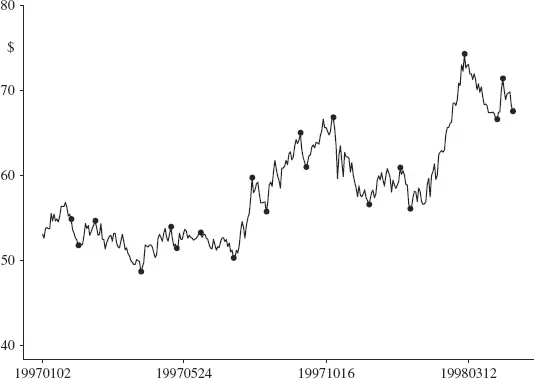

在其他例子中，改变窗口长度时，并未观察到较宽松标准严格地捕捉到较严格标准所识别的全部转折点。这些例子和观察提醒我们，此处的分析严格是统计性的。事件反映了市场情绪，但市场情绪可能受到与该股票无关的新闻或无法识别的原因驱动。找出这些原因是分析师的工作。

表 2.1 给出了克莱斯勒（Chrysler，被戴姆勒收购前）和通用汽车（General Motors）配对的替代事件序列的汇总比较。事件间回报（Interevent Return）的相关性增加令人瞩目，不同替代事件序列之间的微小差异同样如此。后者是一个有用的性质——事件间相关性对事件识别算法的精确校准具有稳健性（不敏感）。因此，不必过度担心在相关性分析中使用哪组事件作为筛选良好风险控制候选配对的工具。

**表 2.1 克莱斯勒–通用汽车事件回报汇总

|
标准 |
事件数 |
回报相关性

|
每日 |
332 |
0.53

|
30% 波动 |
22 |
0.75

|
25% 波动 |
26 |
0.73

|
20% 波动 |
33 |
0.77

交易量序列中的事件提供的信息有时是价格序列中（通过转折点分析）无法识别的。成交量模式不直接影响价差，但成交量激增是股票可能受到异常交易活动影响的有用警告，因此价格走势可能不如基于平均近期历史价格序列估计的统计模型所描述的那样。在历史分析中，异常活动的标记在评估模拟结果等方面极为重要。在历史数据中识别成交量峰值与前面记录的价格历史中峰顶识别的演示几乎没有区别。然而，在实盘交易中，前瞻性监控交易量增加模式——一个重要的风险管理工具——则有所不同。需要在峰顶可识别之前的积累阶段标记成交量增加，因为事后识别通常对减轻对投资组合的影响来说已经太晚了。

### 2.4.3 二十一世纪的相关性搜索

目前有几家供应商提供管理配对交易各方面问题的软件工具，从识别可交易的配对候选到执行通道和投资组合管理。本文描述的类型的相关性搜索在 20 世纪 80 年代是手动编程和执行的。现在已不再需要了。以瑞信第一波士顿（Credit Suisse First Boston）为例，它提供了一个工具，允许用户将布林带类型的配对交易模型最优拟合到任何指定的股票对。该程序搜索一系列固定宽度窗口，模拟均值加减标准差模型的交易；模拟"利润"是比较模型（数据窗口长度、布林带宽度）的指标，利润最大的模型被识别出来。使用此类工具可以快速将模型拟合到许多配对。仅依赖如此浅层数据分析的危险应该显而易见。高盛（Goldman Sachs）、Reynders Gray 和雷曼兄弟（Lehman Brothers）等也提供具有类似功能的工具。

目前，尚未发现有商业工具可以方便地识别事件或转折点并计算事件间相关性。

## 2.5 组合配置与风险控制

随着模型的开发，越来越多的关注被引向投资组合风险控制。均值-方差（Mean-Variance）方法长期以来受到青睐，利润滚滚而来，风险被认为"可控"。1998 年夏天，这种思维的愚蠢被残酷地证明了——但这已经跑在故事前面了（见[第8章](ch08.md)）。

一些建模者将风险暴露计算和回报预测直接纳入投资组合构建过程（见 2.4 节及[第3章](ch03.md)对去因子模型（Defactor Model）的描述）；其他人（特别是那些模型由一组没有显式预测函数的规则组成的人）先构建投资组合，然后计算该组合对某些已定义市场因子的暴露，并通过对冲这些暴露（独立于构成组合的交易）来控制风险。

目标是选择一个使已用资本回报最大化的股票组合。给定完美预见，最优组合由对回报最高的股票进行最大可能的投资组成，直到可用资本耗尽。当然，我们没有完美预见。取而代之的是，我们使用最好的预测。目标仍然是最大化实际回报，但在预测的猜测世界中，我们必须将注意力集中在预期回报上。

预测与预见不同，它不保证结果。基于预测行事存在风险。一个预期将"回归其局部均值"的配对价差可能会继续上升，超过止损限额强制平仓的点。这一新要素——风险——使目标变得复杂，现在目标变为双重的：最大化预期回报，同时将实现该回报的风险维持在某个容忍度以下。

到目前为止还不错。从预见转到预测，我们用不确定性换取了确定性；从有保障的优化转向对最佳猜测的约束优化。然而，在实践中，事情并不像这句话看起来那么简单。第一个障碍是精确地定义风险的概念——或者至少是其实际实现。风险的产生是因为无法保证特定预测在现实中会得到证实。事实上，如果预测被证明 100% 准确，那将是一个非凡的事件。只有一种结果产生完全的预测准确性。但有无穷多种可能的结果，这意味着预测正确的概率为无穷比一。因此，一个显著的事实是，预测几乎肯定会出错。

"追求最佳"变成了"追求最佳猜测——但要牢记可能发生的灾难，并尽力防范这些不良结果。"

正如我们必须猜测最好的（预测），我们也必须猜测灾难。通常，我们做这件事的方式与寻找最佳猜测略有不同：我们不寻找特定的灾难场景，而是考察可能降临到我们头上的灾难范围——从小到大。这一观点被封装在预测方差（Forecast Variance）中。（情景分析（Scenario Analysis）常被用来了解"不太可能的"极端情况，尽管有常规的、日常的、"风险可控的"投资组合构建。"极端"和"常规"风险的区分是刻意模糊的。）

因此，目标变为：在预期回报的预期波动范围内，最大化预期回报。方差约束将可接受的投资组合集合从所有投资组合缩小到预期回报的预期波动低于某个阈值的投资组合。

至关重要的是不要忽视这样一个事实：所有这些量——预测回报及其方差——都是不确定的。预测方差引导我们了解结果可能合理偏离最佳猜测的程度。但预测方差本身也是一个猜测。它不是一个已知量。记住仅在两段前陈述的：预测方差描述的是平均行为；在任何特定情况下，任何事情都可能发生。

尽管有所有这些告诫，事实是我们确实在使用一个构建时认为具有一定预测效用的预测。即平均而言——但在任何特定情况或情况组合中并非如此——预测将比随机猜测更好地猜测未来事件。结果围绕预测的波动范围被预测方差合理地量化——同样，是平均而言。

最终，我们有条件使风险的概念和量化具有操作性。我们将投资组合的风险定义为该投资组合的预期方差。然后，我们对风险的厌恶被取为该方差的常数倍。因此，目标变为：在回报的预期方差限制下，最大化预期回报。

让我们用数学形式表达这些结果。首先，术语定义：

|
*n |
投资股票池中的股票数量 |

|
*fi* |
股票 *i 的预期预测回报；f = *(f1*, . . . *,fn*)′ |

|
**Σ |
回报的预期方差，V[*f] |

|
*ip* |
拟投资于股票 *i 的金额；p = (*p1, . . ., *pn*)′ |

|
*k |
风险容忍因子 |

现在目标表示为：

$$ <!-- validate-skip -->
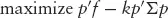
$$

### 2.5.1 市场因子暴露

统计套利基金经理通常不希望组合只持有做多头寸：这样的组合对市场有暴露。（配对交易方案按定义不会有偏向，但更一般的统计套利模型很容易产生预测，除非加以约束，否则会导致具有做多或做空偏向的组合。）如果市场崩溃，组合价值也会随之崩溃。无论组合的具体构成如何，这一点都成立。鉴于对市场中性（Market Neutral）策略的需求，目标是在允许整体市场运动后捕捉个股价格的变动。这就引出了如何定义"市场"的问题。传统上，标普 500 指数（S&P 500）被视为（市场的代理）。对组合中的每只股票进行统计检验以量化其对标普指数的暴露。然后利用这些量化结果来确定组合对市场的暴露。通过改变组合中股票的比例来实现市场中性。

定义： <!-- validate-skip -->

$l_i$ 股票 $i$ 对市场的暴露；$\mathbf{l} = (l_1, . . ., l_n)^\prime$

那么组合 *p 的市场暴露为：

$$
market exposure = *p′*l
$$

出于市场中性的愿望，目标函数修改为：

$$ <!-- validate-skip -->
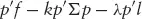
$$

其中 λ 是拉格朗日乘数（Lagrange Multiplier）（仅与优化相关）。

中性的愿望从整体市场扩展到包括市场板块。我们希望避免对例如石油行业的整体暴露。其实现方式与市场中性相同：定义股票对"石油行业"的暴露。注意，这比简单地为石油行业定义一个指数并定义石油行业股票对该指数的暴露更为一般。每只股票——无论是否属于石油行业——都可能对石油行业市场因子有暴露。给定这组暴露，目标函数以与市场因子类似的方式扩展。

定义： <!-- validate-skip -->

$l_{1,i}$ 股票 $i$ 对石油行业的暴露；$\mathbf{l}_1 = (l_{1,1}, . . ., l_{1,n})^\prime$

目标函数扩展为：

$$ <!-- validate-skip -->
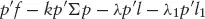
$$

其中 λ1 是另一个拉格朗日乘数。

显然，其他市场因子也可以纳入目标函数以确保组合对这些因子的零暴露。对于 *q 个市场因子，目标函数为：

$$ <!-- validate-skip -->
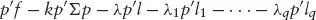
$$

确定使目标函数最大化的投资组合是拉格朗日乘数法的直接应用。

### 2.5.2 市场冲击（Market Impact）

我们预测 IBM 股票在未来一周的年化回报为 10%。该预测比我们做过的任何预测都更确定。我们想买入价值 1000 万美元的股票。通常，如此规模的需求不会在当前卖价成交；最可能的情况是，随着需求被满足，卖价会上升。这就是市场冲击。大多数交易都会产生市场冲击，无论规模大小，因为在做出预测（使用最新可用价格）和实际下单并随后成交之间，市场并非静止的。没有实际交易历史，无法衡量市场冲击。即使有交易历史，也只能做出猜测：我们再一次在预测一个不确定的事件。（关于对统计套利具有关键影响的最新进展，见[第10章](ch10.md)。）

市场冲击的重要性很大。对期望交易的可能实现成交价的良好估计，使得交易系统能够从组合优化中过滤掉潜在无利可图的交易。

立即出现一个问题：市场冲击不是已经包含在预测函数的构建中了吗？表面上看是的。存在一个隐含假设：股票可以按当前价格即时交易。好吧，但为什么完成实际交易的时间延迟会导致成本？我们不应该期望某些价格与期望交易方向一致，某些相反，经过多天大量交易后一切都会平均掉吗？同样，表面上是的。模型构建过程中没有考虑我们对市场的参与。我们的买单增加了需求，推高价格；卖单则相反。因此，我们自己的交易在市场上引入了一种对抗我们的力量。所以我们的预测实际上只有在我们不采取行动、不参与市场的情况下才有效。

有人可能会问，既然目标是构建一个可利用的预测模型，为什么不将预测会被交易这一信息纳入模型构建？短期——可能也是长期——的回答是：这太难了。（等价地，必要的数据不可用；关于目前什么是可能的，甚至对少数精选人士来说是常规的，请见[第10章](ch10.md)。）务实的权宜之计是构建一个在我们保持被动观察者身份时期望有效的预测，然后对我们主动参与可能产生的影响进行调整。

市场冲击是我们决定交易什么的函数。将当前组合记为 *c，目标函数通用地扩展为：

$$ <!-- validate-skip -->
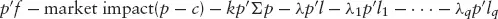
$$

确定"市场冲击"的函数形式对大多数参与者来说是一个未解决的研究问题，因为数据不足（通常仅限于自己的委托和成交记录）以及在某些情况下缺乏动力。同样，更多最新进展请见[第10章](ch10.md)。

### 2.5.3 使用事件相关性的风险控制

在前一节中，我们探讨了事件相关性作为识别本质共享共同风险因子的股票集合的基础的概念：股票反复在同一时间、同一方向表现出方向性价格变化，并在这些变化之间以相似的幅度运动。在一组内，股票对新闻或所谓的"事件贝塔（Event Betas）"具有相似的弹性。

构建一个在美元匹配上多空对等的投资组合——由具有相似事件贝塔特征的股票组构建的美元匹配组合——自动纳入了大量风险控制。每组定义了一组反复对有意义的经济事件表现出基本相同价格反应的股票。这里的关键特征是运动的重复性。借用伊恩·弗莱明^(2) 的话：一次是偶然，两次是巧合，第三次就是共同的风险暴露。如此构建的投资组合经历构成股票对市场冲击做出差异性运动而产生大幅亏损的概率很低。2001 年美国遭受恐怖袭击后，大盘股的事件贝塔中性投资组合尽管面临剧烈的市场下跌和个股波动率飙升，仅表现出普通的波动性。

## 2.6 动态性与校准

均值回归利用模型应用于局部数据。例如，估计的股票间波动率使用加权方案计算，折旧较旧的数据（见[第3章](ch03.md)）。在本章前面考察的交易规则中，我们选择了 60 天固定长度窗口，并将价差交易界限计算为价差范围的函数：（a）直接计算，（b）使用价差分布的经验标准差。这些每日更新的估计调整了当前交易的入场和退出点。同样，每日更新的流动性估计修改了交易规模和组合集中度。因此，即使模型不变，也在持续适应局部市场条件。

偶尔模型会被重新校准（或者管理者"爆仓"）。回忆 CAL–AMR 价差，它从 2000 年的 $20 剧变到 2002 年的 $6。

可以运用进化操作（EVOP）技术来帮助发现模型所利用的均值回归现象本质中的持续变化。股票价格价差在多个频率上表现出均值回归（Mandelbrot，分形分析），建模者选择的校准针对其中一个频率，该选择由包括参数值微小变化的响应稳健性、建模者偏好、研究结果和运气等因素决定。应用 EVOP 时，将交易模型与多个其他频率（模型校准）同时监控，以提供不同频率上响应性质变化的信息。总是存在噪声——在实际和模拟交易表现方面，没有一个频率能在月复一月的基础上主导相邻频率。理解这种噪声的正常范围至关重要，以便不将交易模型相对于空间中相邻竞争模型的明显（近期）表现不佳误判为需要模型更改。还存在演化。经过数年，通过比较模型表现揭示的均值回归响应趋势从局部变异（噪声）中脱颖而出。当识别出此类趋势时，应该加以适应——修订交易模型校准。对采用一阶动态线性模型（见[第3章](ch03.md)）的经典配对交易策略的分析——应用于大盘股，持有期约两周——显示了一个迷人而富有启示性的发展。2000 年 3 月，发现了一个始于 1996 年的向更低频率转变的趋势。1996 年首次出现端倪时，变化的规模在经验局部变异范围内，因此这一端倪直到后来才能被识别。1997 年的变化是边际性的。1998 年，国际信用违约和长期资本管理公司（Long-Term Capital Management, LTCM）的崩溃完全打乱了所有表现模式，使得推断困难且危险。虽然端倪可以被检测到，但观测被认为不可靠。到 2000 年初，这一连续第四年存在且现在累积足够强大以压过预期噪声变异的端倪被视为信号。"交易"模型的结构参数五年来首次被重新校准，预计此举将在未来几年将回报提高两到三个百分点。2000–2002 年的模拟显著超过了这一预期，因为市场发展导致高频策略相对于低频策略的表现下降。相关问题的详细讨论请见[第9章](ch09.md)。

### 2.6.1 进化操作：单参数示例

进化操作（Evolutionary Operation）的单参数说明见图 2.9 的四个面板。面板（a）展示了一个典型的响应曲线：对于模型系数的一组可能值，（模拟的）策略回报呈现稳步增长，然后趋于平台期，接着迅速跌落悬崖。人们希望找到使回报最大化的参数值——这在分析历史数据且响应关系不变时是很简单的。

**图 2.9 进化操作：检测持续的系统响应变化

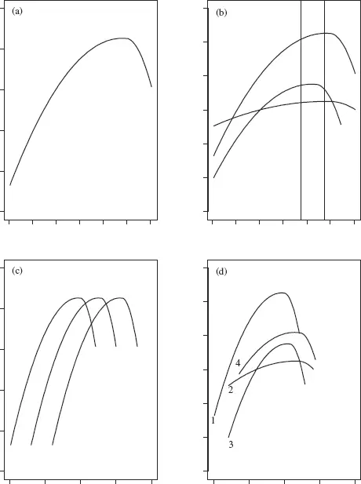

面板（b）展示了实际观察到的情况。每年的响应都不同。相似——这就是策略往往有效的原因——但不同。在选择策略运行的参数值时，理解响应曲线的形式和自然变异量并将其与对所研究现象——此处为均值回归——的理解联系起来至关重要。从面板（a）中选择使回报最大化的参数值是有风险的，因为在某些年份，响应曲线的偏移足以使模型表现跌落悬崖。风险管理也在模型校准阶段发挥作用：远离悬崖，接受普遍良好的年份和低灾难风险，而非偶尔杰出的年份和偶尔的灾难。应该预期灾难来自不可控因素：承认"可控"因素导致灾难的大概率不是一个健全的风险管理策略。

面板（c）展示了响应中的典型演化：一般形式随时间在空间中平滑移动（且形式本身可能随时间平滑变化）。在实践中，当这种演化发生时，它与正常系统变异同时发生，正如刚才在面板（b）中看到的那样。因此，经验是面板（b）和（c）运动的组合，如面板（d）所示。

随着响应曲线随时间变化，参数空间的一个范围始终产生良好的策略表现。每年都是不同的，随着时间推移，目标参数范围逐渐移动。原始范围继续提供合理的表现，但在几年内变得不那么有吸引力。进化操作——持续监控远离当前认为的最佳校准的系统表现——使人能够识别瞬态和持久的系统响应变化。瞬态变化提供了更新正常系统响应变异观点的信息；持久的系统响应变化可以被适应，从而提高长期系统表现。

正如刚才所例示的，进化操作监控看起来简单得迷人——确实，概念和机械应用是直接的。不出所料，现实更加复杂。变化的时间尺度和时点可能与这里明确使用的年度焦点不同。当然，模型通常由一组参数定义，而非仅仅一个。

在这个监控背景下，年份有些人为和武断。变化可以在一个日历年内突然发生（2001 年 9 月 11 日），也可以在一年或多年内缓慢发生。监控策略的各个方面以在不同频率上揭示诊断信息是另一个关键任务。

统计套利模型有几个关键定义参数。监控方案很复杂，因为存在交互效应：一个参数变化的影响取决于其他参数的设置。必须设计持续评估替代模型校准表现的方案，以揭示这些交互效应的变化以及策略表现对单个参数的直接响应的变化。

涉及多个分析步骤的更复杂模型正式可能包含数百甚至数千个估计参数。从概念上看，监控问题表面上是相同的：寻找随时间变化的证据，而非瞬态噪声。实践比只有少数参数的模型更为复杂，因为这些高参数数量模型通常缺乏对单个参数的可管理可解释性。回答"参数 θ 的变化 X 意味着什么？"是不可能的。实际上，对于此类模型，甚至提出这个问题都很困难。参数组可能具有集体可解释性，在这种情况下可以逐个组件建立理解，有时采用层次结构。

作为本节的结束，值得重申一个重要观点：支撑监控活动——从机制到解释再到行动——的是对所利用现象的理解——它为什么存在、是什么驱动了机会、以及利用如何在模型的背景下发挥作用。

> ^(1)AMR 的价格序列针对 2000 年 3 月 16 日 Sabre（该公司的预订业务）分拆进行了调整。如果不进行适当调整，收盘价序列将从 $60 骤降至 $30——一个不现实的剧烈价差变化！我们选择向前调整历史价格，即对分拆前的价格进行修改，保留较新的价格。在 2000 年 1 月交易 AMR 时，当然会按实际分拆前约 $60 的水平操作。如何进行价格调整——向前或向后——是一个偏好问题，但必须一致地进行。从调整后价格历史计算的回报序列是唯一的，出于这个和其他原因，大多数分析是基于回报而非价格进行的。本书使用价格进行演示，因为所阐明的要点用价格表达更为直观。公司事件（包括分红和拆股）的价格调整对于正确计算交易收益至关重要。

> ^(2)由 Auric Goldfinger 在伊恩·弗莱明的《金手指》中对詹姆斯·邦德所说。统计套利
