# [第3章](ch03.md) 结构模型

*Private information is practically the source of every large modern fortune.

—*An Ideal Husband, Oscar Wilde

## 3.1 引言

[第2章](ch02.md)的讨论主要围绕基于移动数据窗口计算的价差范围估计的交易规则展开。图3.1展示了CAL–AMR价差使用60天窗口计算的均值加减一个标准差的交易边界。（与[图2.4]对比，图2.4中的边界是基于60天窗口内的最大−20%范围和最小+20%范围计算的，请回顾第2.2节的讨论。）这些交易规则隐含的假设是，价差在不久的将来会回归到局部均值。图3.2再次展示了CAL–AMR价差，这次附带了隐含的预测函数（Forecast Function）。

**图3.1 日收盘价差，CAL–AMR，附标准差交易边界

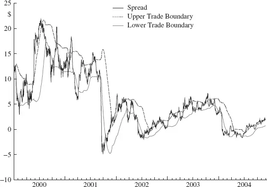

**图3.2 日收盘价差，CAL–AMR，附移动平均预测函数

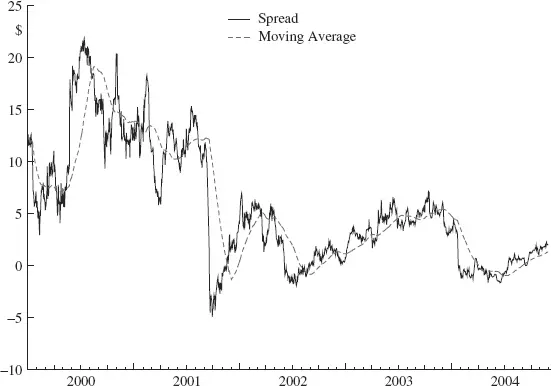

从形式上看，每个未来时期的点预测（Point Forecast）或期望值，就是当前估计的均值。当然，实际上并不真的相信价差每个时期都会等于均值，甚至在不久的将来也不会。（显然，交易规则预期价差会在均值上下系统性波动。）只是说，基于移动平均（Moving Average）模型的最佳猜测是，在不久的将来，价差可能表现出以均值为中心的值。"不久"到底有多近，像许多其他问题一样，仍然是不确定的。

均值加减标准差的交易规则并非通过正式的统计建模方法编制。相反，简单的目测和一点思考就产生了这些假设，以交易规则的形式表达出来，结果令人满意地奏效了。尽管如此，这些规则构成了一个模型，具有上述的预测函数解释。

[第2章](ch02.md)提到的CSFB工具比我们的目测更进一步，系统性地搜索多种替代模型规格——窗口长度和用于交易入场边界的标准差倍数。这种模型拟合或选择程序隐含地使用了效用最大化准则（Utility Maximization Criterion），即模拟交易利润最大化，而不是统计估计程序如最大似然法（Maximum Likelihood）或最小二乘法（Least Squares）。这是一种精巧的方法，可惜被单纯关注样本内计算所破坏。实际上，对于识别在实践中可能表现尚可的模型这一目的而言，效用函数的设定是错误的。真正令人感兴趣的是在样本外最大化利润，同时考虑回撤（Draw-down）限制，模仿实际使用经验交易规则的过程，但这些考虑开始将该工具推向策略模拟器的方向，而模拟器不太可能免费提供。

## 3.2 正式预测函数

思考正式预测函数的价值在于，它给出一组特定的值与实际结果进行比较，从而判断模型预测的有效性。交易中的按市值计价（Mark to Market）亏损将表明潜在问题的存在；预测与结果差异的模式提供了关于问题可能性质的信息。与简单的止损规则（如固定百分比亏损）相比，这种信息允许对亏损情况做出更丰富的应对。

在本章中，我们将考虑几种结构上最简单的经典时间序列数据模型。还将描述一两个非时间序列模型架构，以说明对股票价格数据更复杂的建模方式。

## 3.3 指数加权移动平均

移动平均（MA）模型在[第2章](ch02.md)已经熟悉。一种更灵活的序列局部平滑方法是指数加权移动平均（Exponentially Weighted Moving Average，EWMA）。与MA的固定窗口数据等权重不同，EWMA方案对整个数据历史施加指数递减的权重。因此，近期数据对当前估计和预测的影响最大，而远古的重大事件仍保持一定影响。投影预测函数（向前*k = 1,2,3, . . . *, n步）的形式与MA一样是一条直线。但数值不同。EWMA的递归计算公式为：

$$ <!-- validate-skip -->
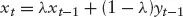
$$

其中 *yt* 是时间 *t* 的观测值，*xt* 是EWMA估计值，λ是*折扣因子（Discount Factor）*。折扣因子的大小 0 ≤ λ ≤ 1 决定了旧观测值以多快的速度变得与当前估计无关（等价地，有多少数据历史贡献于当前估计）。

EWMA预测计算的递归形式立即显示出相对于MA方案的简化。只需保留当前预测 *xt* 即可与下一个观测值结合来更新预测。虽然计算机不关心内存中需要保留一条还是二十条还是五十条信息，但人确实在意。实际上，移动平均也可以用递归方式表达，只需要保留两条信息，所以高效的内存占用被EWMA不公平地"劫持"了。更具说服力的是下面展示的优势；一旦熟悉了指数平滑预测，你就会想把移动平均例程归入"过时"文件夹。

图3.3展示了CAL–AMR价差的EWMA(0.04)和MA(60)预测函数。EWMA折扣因子0.04是专门选择的（通过目测——虽然可以使用正式的接近准则如最小均方误差，但在这种情况下不需要那种程度的形式主义），使其与60天移动平均紧密匹配。只有当原始序列（价差）发生剧烈变化时，两个预测函数才会出现显著差异。表3.1给出了与一系列移动平均产生相似局部均值估计的EWMA折扣因子（适用于"行为良好"的数据序列）。

**图3.3 CAL–AMR价差的EWMA和MA预测函数

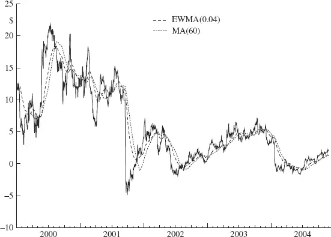

**表3.1 EWMA–MA等价关系

|
MA(*k*) |
EWMA(λ) |

|
10 |
0.20 |

|
30 |
0.09 |

|
60 |
0.04 |

EWMA灵活性的效用在两种均值回归（Mean Reversion）策略失效的情况下尤为明显：价差的阶跃变化（Step Change）和趋势（Trend）。图3.4说明了价差突然收窄随后围绕新的、更低的均值波动的情况。均值和标准差带（使用20天窗口）表明，9月7日建立的多头头寸在价差下跌时遭受了11美元的按市值计价亏损，最终在10月11日以该亏损幅度平仓（假设爆米花过程模型）。使用EWMA代替MA几乎没有差别。灵活性的优势在引入预测监控和干预时才显现出来。

**图3.4 价差的水平变化与MA-EWMA预测函数

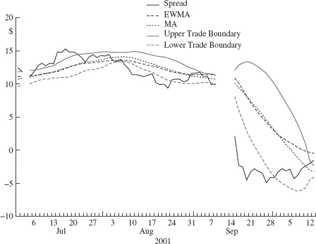

当大预测误差出现时（价差异常下跌的那天），监控系统被触发，提醒建模者可能存在模型假设的违反，从而使预测失效。进一步调查后，建模者可能发现价差行为的根本原因，这可能导致决定终止交易。（2001年9月17日无需搜索，但决定持有还是退出头寸对管理者的业绩至关重要。）图3.5展示了一个预测函数，其中价差的历史发展被丢弃，代之以一个新观测值。预测不确定性通常很大，由宽阔的边界表示。

**图3.5 干预预测函数

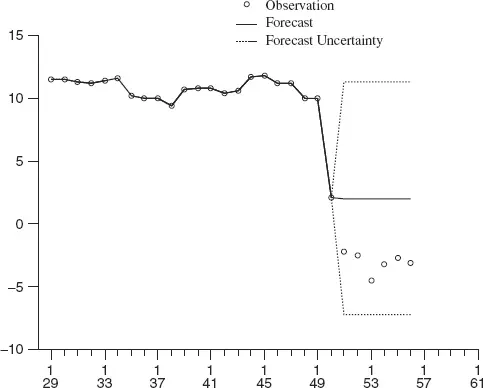

如果没有发现信息，合理的做法是密切关注价差在未来几天的走势（当然仍在寻找基本面消息）。如果价差开始回到变动前的范围，则无需采取行动。如果价差继续在新建立的水平附近波动，则可以通过将该知识引入模型来改善模型预测。使用EWMA，调整非常简单。只需在一个时期内提高折扣因子，给予近期价差值更大的权重，预测就会迅速以新建立的水平为中心，如图3.6所示。对未平仓头寸和新头寸的评估会比不调整时更快改善。未平仓头寸更早退出——在9月21日，虽然仍有亏损，但资金被释放且头寸风险被消除。有利可图的新头寸被迅速识别出来，如果不做调整，在常规模型追赶过程中这些机会将被错过：9月27日至10月2日和10月8日至10月10日，合计收益3.64美元。

**图3.6 干预后的预测

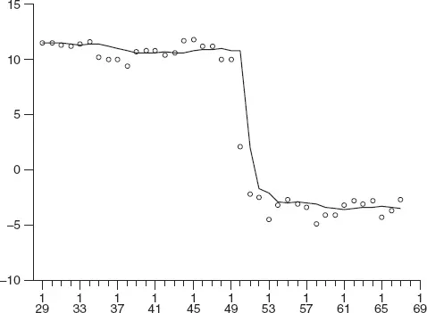

预测监控和模型调整在MA模型中也是可行的，但调整的实际操作远不如在EWMA中一次性使用干预折扣因子那么简便。试试看就知道了！

干预折扣因子的值从何而来？工程文献中有许多精巧而迷人的控制方案，但就我们的目的而言，可以使用简单的校准程序。从一组价差历史中，分离出价差发生阶跃变化的点。试验一系列干预折扣因子，直到所有案例的预测模式都"足够好"。（再次说明，"足够好"这样的主观术语留给您自行解释。）

多大的价差表明可能存在水平转移（Level Shift）？再次查看数据：距离均值三个标准差的情况多久出现一次？以这种校准会产生多少误报监控警报？四个标准差呢？会错过多少水平转移？对价差交易有何后果？依赖正态分布的标准差移动概率是没有用的——距离均值3个标准差出现的概率为0.2%——因为价差通常不服从正态分布。要看到这一点，将你最喜欢的配对的每日价差数据绘制成直方图，叠加最佳拟合的正态密度曲线（匹配样本均值和方差）。检查密度尾部和中心的拟合质量。

图3.7展示了一种常见情况。CAL–AMR价差六个月样本（2001年12月至2002年5月）的每日收益率以直方图显示；拟合到样本均值和标准差的正态密度曲线叠加其上。评论留给您。

**图3.7 CAL–AMR价差收益率，2001年12月至2002年5月，附正态密度

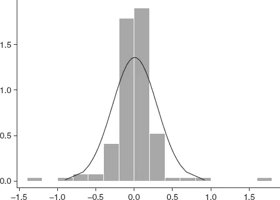

与盲目假设正态性相比，经验实验是建立理解的更可靠方法，也是构建有代表性的正式模型的良好起点（如果这是你的目标）。[第5章](ch05.md)揭示了关于时间序列数据基础分布和均值回归的一些常见误解。

Pole等人（1994）对预测监控、干预和自适应方案（包括基于似然比的检验，而非本文建议的简单标准差规则）以及证据积累策略进行了更详细的讨论。该书详细介绍了称为动态线性模型（Dynamic Linear Model，DLM）的一类模型，其中包含MA和EWMA模型作为特例，以及在某些统计套利者的产品中占据重要地位的自回归模型。DLM的结构提供了比本书讨论的任何内容都丰富得多的分析。

在[第9章](ch09.md)第2节中，讲述了一个几乎在"尖叫着需要干预"的案例：2003年10月因纽约州总检察长调查Janus基金公司的共同基金择时交易活动而引发的大规模赎回，导致44亿美元的强制清算。对2001年9月恐怖袭击事件的预期市场反应，是仔细审视的必要性和精心设计的*选择性干预*价值的绝佳范例。

并非所有水平变化都像前例那样剧烈。通常，新水平是在数天的渐进迁移后达到的，而非一次性的大幅跳跃。图3.8所示的英国石油（BP）–荷兰皇家壳牌（RD）价差就表现出若干此类迁移。图中展示了两个EWMA预测函数。第一个是标准EWMA，折扣因子0.09（与25天的移动平均相似，但在显著变化时MA的调整滞后于EWMA，如前所述），对2003年第一季度价差水平4美元的变化适应相当缓慢。第二个是当检测到水平转移正在进行时切换到高折扣因子的EWMA。适应速度的提升在2003年2月价差的下行转移、4月和6月的两次后续上行转移以及7月底的另一次下行转移中显而易见。

**图3.8 趋势检测与水平调整

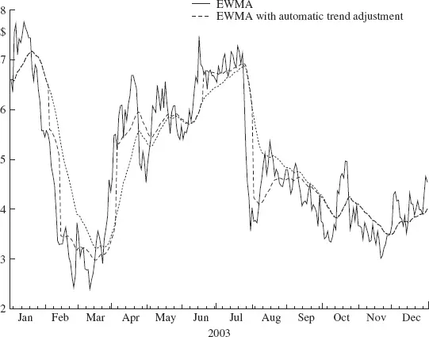

在本演示中，切换规则相当粗糙：当价差连续数天超过基本EWMA一个标准差的范围时，使用高折扣因子以加快调整。（局部标准差使用EWMA平滑计算。）

在离开BP–RD价差之前，再看一眼。整个一年中，价差围绕5美元的均值表现出漂亮的类正弦波动。你怎么看？

## 3.4 经典时间序列模型

市面上有许多描述时间序列建模和预测模型的著作。参考文献中列出了一些，它们是深入了解模型形式、统计估计和预测程序以及数据分析和建模实践指导的首要参考。在本节中，我们将对统计套利者成功使用的几种模型类型进行启发式描述。讨论将基于价差和均值回归描述以及典型的基础过程（正弦波和爆米花过程）的背景展开。

### 3.4.1 自回归与协整

在任何领域，最常用的时间序列模型结构可能是自回归模型（Autoregressive Model）。序列的未来值被投射为该序列最近表现值的加权平均。已见过的例子包括移动平均和指数加权移动平均。

*p*阶自回归模型将时间 *t* 的序列结果与紧随其后的 *p* 个结果的线性组合联系起来：

$$ <!-- validate-skip -->
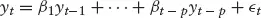
$$

系数 *β* 或模型参数，通过从一组序列观测值中估计确定。最后一项 *εt* 是所谓的"误差项"（Error Term），方便地汇集了无法轻易归入模型结构部分的所有变异性。当应用标准估计方法并讨论参数估计或预测的性质时，通常假设该项服从正态分布。

自回归模型常以ARIMA模型的形式出现，即自回归积分移动平均（Autoregressive Integrated Moving Average）。经典且无与伦比的参考文献是Box和Jenkins（1976）。在此背景下，移动平均模型——令人困惑的是——与之前遇到的移动平均有些不同。这里它实际上是一种简写方式，用几个虚拟项的平均值的数学等价来表示序列过去值的非常长的移动平均。这既拗口又费脑，所以我们不在此深入。

那么"积分"部分呢？那只是在研究自回归结构之前对序列进行的差分运算。例如，价格的日差分，*zt = pt* − pt−1*（用明显的符号表示），可能表现出自回归结构。那么原始价格序列的模型就称为积分自回归。EWMA预测函数虽然最初是以逻辑的、数据分析的方式开发的，用于平滑可变观测值（如我们之前介绍的），但实际上可以推导为积分模型的最优预测。

这自然引出协整（Cointegration）。经常观察到几个序列以暗示某种关系的方式共同运动；常见的情形包括：(a) 一个序列驱动另一个；(b) 几个序列由共同的基础过程驱动。ARIMA模型的多元形式可以表示非常复杂的此类结构，包括同期和滞后反馈关系。

价差建模者熟悉的一种结构（但可能不以其技术名称闻名）是协整。当两个（或更多）序列各自是非平稳的（Nonstationary），但它们的差（即我们语境中的价差）是平稳的（可以理解为"在很大程度上可以用自回归近似"），这些序列就被称为协整的。差分（可能不仅是第一阶差分，但我们不在此深入）可以用自回归很好地建模。

一类相关的自回归模型为具有长期序列相关依赖的序列提供了简约的结构形式。长期相关可以通过非常高阶的自回归直接捕获，但由于参数数量巨大，估计问题随之而来。自回归分数积分移动平均（Autoregressive Fractionally Integrated Moving Average，ARFIMA）模型克服了参数数量问题，本质上是对分数差分后的序列拟合ARMA模型。

### 3.4.2 动态线性模型

前面讨论的所有模型都依赖于数据序列在相当程度上的平稳性（Stationarity）才能有效。模型参数在长期数据历史上估计，并假定不变。在金融实践中，数据中的关系很少在任何时间段内近似不变。参数更新程序是通用的，将模型重新拟合到移动窗口数据，这是一个常用且有效的工具。[第2章](ch02.md)使用的局部均值和波动率计算就是该程序的例证。一种灵活的模型结构直接体现了数据定义特征（如局部均值）的时间变化，即动态线性模型（Dynamic Linear Model，DLM）。在DLM中，模型参数的时间变化通过演化方程（Evolution Equation）的规范显式包含。考虑一阶自回归：

$$ <!-- validate-skip -->
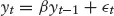
$$

其中序列的实现由两部分组成：由参数 *β* 定义的对紧邻过去的固定部分的系统性传播，以及随机添加项 *εt*。现在考虑该模型的灵活推广，其中系统性元素的逐期传播幅度可以变化。参数 *β* 现在是时间索引的，其变化被严格形式化，允许渐变但不允许剧变。动态模型由两个方程指定，一个定义观测序列，一个定义系统性演化：

$$ <!-- validate-skip -->
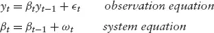
$$

在系统方程中，项 *ωt* 是一个随机项，通过其方差的大小控制回归系数 *βt* 的变化速度。当 *ωt* 恒等于零时，动态模型退化为熟悉的静态模型。当 *ωt* 的方差"很大"时，数据序列历史被立即折价，使得 *βt = yt/yt−1*。你可能开始看到在第3.3节为EWMA模型示范的动态线性模型中的干预是如何实现的。

DLM包含ARIMA、EWMA和回归模型作为特例，使其成为一个丰富、灵活的工作类别。监控和干预策略可以针对每个模型组件分别和组合地定义。参见Pole等人的著作获取示例。

### 3.4.3 波动率建模

波动率建模（Volatility Modeling）在量化金融中有深厚的传承。在统计套利中的应用不如在衍生品定价中直接——大部分理论发展和已发表的应用都见于后者——但它仍然很有帮助。以本书讨论背景中提供大量内容的简单价差建模为例：收益率流的方差决定了潜在交易的丰富程度（策略候选原材料的基本可行性），交易存续期间按市值计价盈亏的波动性（策略的风险特征、止损规则），以及通过随机共振（Stochastic Resonance）实现的收益拉伸（见第3.7节）。

广义自回归条件异方差（Generalized Autoregressive Conditional Heteroscedastic，GARCH）模型和随机波动率（Stochastic Volatility）模型在波动率建模中占据重要地位。衍生品文献充斥着基本GARCH模型的各种变体，缩写从AGARCH到EGARCH到GJR GARCH、IGARCH、SGARCH和TGARCH不一而足。GARCH模型是带有非线性误差方差结构规范的线性回归模型。在其他模型中，误差方差被假定为常数或模型某方面或时间的已知函数（参见Pole等人关于方差法则的讨论），而在GARCH模型中，误差方差被指定为基本回归函数中误差项的线性函数。再次考虑一阶自回归，现在添加一阶GARCH分量：

$$ <!-- validate-skip -->
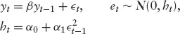
$$

符号 *et* ~ *N(0, *ht*) 表示（误差）项 *et* 假设服从均值为0、方差为 *ht* 的正态随机分布。（"TGARCH"模型使用Student t分布替代正态分布，以对"大"偏差做出更平滑的响应。）在这个模型中，预测与相应结果之间的差异直接反馈到后续的预测方差中。大的预测误差"迫使"模型预期即将到来的大幅波动。这反过来意味着在更新参数估计时，下一个观测值将被赋予较小的权重。因此，当GARCH误差结构的模型拟合到表现出波动率聚集（Volatility Clustering，即高于正常水平的波动率爆发）的数据时，在估计模型结构部分时，给予更可变观测值的权重相对于较不可变观测值的权重被降低了。

与假设方差变化具有已知函数形式的加权估计程序（例如在产品销售数据中经常出现的"水平的1.5次方"，这是复合泊松过程的结果）相比，GARCH模型同时估计变化模式和模型的结构部分。变化模式不是预先指定的，但识别规则是：大的预测-结果差异表示大的波动率。

模型可能包含更大的滞后结构——更多的 *ε*t−*k 项，类似于均值结构的高阶自回归模型。此类模型的解释很困难，同样不出所料，成功的应用主要限于低滞后结构。

关于GARCH模型有大量的文献，始于Engle 1982年的论文，在宏观经济学和金融学中有广泛应用。

### 3.4.4 模式发现技术

利用股票价格行为的持续模式，已通过模式发现程序（Pattern Finding Procedures）直接推进，包括神经网络（Neural Networks）和小波分析（Wavelets）。小波分析是一种局部化的傅里叶分析，将时间序列分解为一组局部正交基函数，其权重适合于所讨论的原始序列。神经网络是一组加权变换函数；没有显式的时间结构，但这种结构隐含在输入（序列的过去观测值）到输出（预测）的变换中。

神经网络是发现数据模式的出色工具。当模式重复出现时，网络预测可以非常出色。但一个主要缺点是缺乏可解释性（Interpretability）。虽然可以理清小型网络（最多单隐藏层，每层仅少量节点，行为良好的传递函数）中的变换，从而获得理论理解，但这并非通常情况。那又怎样呢？如果神经网络成功识别了股票价格数据中的预测足迹，即使对输入-输出变换的智力把握不如竞争对手基于自回归（应用于，比如说，因子残差，见第3.6节）构建的模型那么严密，又有什么关系呢？也许完全没关系，我们将这个有争议的问题留给您考虑。

神经网络的一大优势是其灵活性，这也是它们一开始就是如此出色的模式识别器的原因。当结构变化发生时，神经网络可以非常快速地识别变化正在进行，随后刻画新的稳定模式。伴随的危险——始终是这种灵活性的伙伴——是识别出的模式可能是短暂的，其存在转瞬即逝，难以形成可用的利用机会。借用奥威尔的说法：描述可以，预测不行。

### 3.4.5 分形分析

我们向感兴趣的读者推荐发明者Benoit B. Mandelbrot（2004），他讲述得最好。

## 3.5 哪种收益率？

你想预测哪种收益率？如果你心中有一个特定的语境，答案似乎很显然：预测今天的收益率并围绕它交易。一般来说，在理论、数据分析和交易目标的语境之外，答案并不明显。让我们假设后者简单地就是最大化策略收益率（受制于一些在此不具体说明的风险控制）。没有理论指导的话，我们可能简单地探索一些传统的时间尺度，研究日、周或月收益率的模式。再多一点思考可能建议研究收益率随持续时间如何变化：检查1、2、3、...、k天的收益率可能揭示特定类型序列的自然时间周期，无论是个股原始价格还是其函数如因子（见第3.6节）；人们也可能希望检查未来 *m* 天的最大收益率。

模式匹配模型比本书讨论的模型更复杂、技术要求更高，引导人们考虑股票收益率序列的更一般的多元函数。

## 3.6 因子模型

到目前为止的建模讨论集中在配对股票之间的价差上，这是统计套利作为配对交易（Pairs Trading）诞生的领域。现在我们将讨论应用于作为集合分析的个股价格序列的一些建模思想。

共同风险因子（Common Risk Factors）的概念——从Barra型模型中熟悉——是所谓股票收益率因子模型的核心：基本思想是股票的收益率可以分解为由市场中一个或多个基础因子决定的部分（与其他股票共有）和股票特有的部分，即所谓的特异收益率（Idiosyncratic Return）：

**股票收益率 = 市场因子收益率 + 特异收益率**

早期使用这种分解构建的模型简单地将市场因子识别为行业（标准普尔行业板块）和一个总体市场因子。一些建模者使用指数作为因子的代理，构建多元回归模型、自回归模型或其他模型来分析日、周或月收益率；他们还从(a)指数预测模型、(b)构建的回归等模型中形成预测，并相应地构建投资组合。

后来的尝试使用了一种更通用的模型，称为统计因子模型（Statistical Factor Model）。在因子模型中，因子从历史股票收益率数据中估计，股票的收益率可能依赖于或被几个这样的因子驱动。

### 3.6.1 因子分析

对多元数据集的因子分析（Factor Analysis）旨在估计一个统计模型，其中数据通过回归到一组 *m* 个因子上被"解释"，每个因子本身是观测值的线性组合（加权平均）。

因子分析与主成分分析（Principal Component Analysis，PCA）有很多共同之处，由于后者更为人所熟知，适合进行比较。因子分析是基于模型的程序，而PCA则不是。PCA审视一组数据，找到数据在观测空间中表现出最大变异的方向。因子分析则试图估计一组观测值线性组合（即所谓的因子）的权重，以最小化观测值与模型拟合值之间的差异。

如果PCA和因子分析之间的区别看起来模糊，很好。确实如此。我们不再多说。

假设股票池有 *p* 个元素（股票）。我们可以以标普500指数的成分股（截至某个固定日期）作为参考示例。选择因子数量 *m*。给定选定股票池的历史日收益率，因子分析程序将产生 *m* 个因子，由各自的*因子载荷（Factor Loadings）*定义。这些载荷是应用于每只股票的权重。因此，因子1的载荷为 *l* 1,1, . . .. *l* 1,500。其余 *m − 1* 个因子同样有各自的载荷。

将载荷乘以（不可观测的）因子得到收益率的值。因此，给定载荷矩阵 *L*（其列是刚描述的载荷向量），可以计算因子的估计值，即*因子得分（Factor Scores）*。

因此，经过因子分析，除了原始的 *p* 个股票收益率时间序列外，还有 *m* 个因子估计的时间序列。可以类比行业指数的构建来理解；一些统计因子可能看起来像行业指数，甚至可以这样看待。但请记住重要的结构区别：统计因子仅是股票价格历史的函数，不考虑公司基本面信息。

如果将股票收益率对因子进行回归，会得到一组回归系数。每只股票对应每个因子有一个系数。这些系数是股票对因子的*暴露（Exposures）*。根据因子的构建，没有其他 *m* 个观测值的线性组合能够在所选估计准则（最常见的是最大似然法）下给出更好的回归。然而，存在无限多个*等价*集。方差最大旋转（Varimax Rotation）和主因子法（Principal Factors）——与主成分分析相关——等策略用于从这个无限集中选择一个唯一成员。

注意因子载荷和股票对因子暴露之间存在对偶性（Duality）。这种对偶性是因子定义和构建的结果，使得载荷矩阵的行就是股票对因子的暴露。也就是说，在 *p × m* 载荷矩阵 *L* 中，元素 *l*i,*j* 既是第 *j* 个因子在第 *i* 只股票上的载荷，也是第 *i* 只股票对第 *j* 个因子的暴露。

因子模型的解释是什么？是这样的：*p* 只股票的池子被认为是一个更小的基础实体集合——因子——的极度混淆的视图。粗略地说，人们可能假设股票池实际上由一个称为"市场"的因子驱动。不那么粗略地说，人们可能假设除了市场之外，还有十几个"行业"因子。因子分析因此可以被视为一个统计程序，用于从整个股票池呈现的嘈杂图像中理清结构——因子——，并展示我们观察到的股票池是如何由"真实"的因子结构构建的。

### 3.6.2 去因子化收益率

另一个基于因子分析的成功模型反转了常规思路：在构建预测模型*之前*从股票收益率中去除市场和行业运动。其原理是：在市场因子不可预测但对个股相对位置的情绪在数天内保持稳定的情况下，这种过滤后的收益率应表现出更具可预测性的结构。让我们更详细地看看这个有趣的想法。

拟合回归模型（股票对估计因子的回归）的残差被称为去因子化收益率（Defactored Returns）。关注的重点就是这些去因子化收益率。为什么？概念是股票的收益率可以被视为由一组基础因子（市场、行业或其他任何可考虑的解释）的收益率加上某些个股特有的量组成。对于股票 *i*，这可以代数表达为：

$$ <!-- validate-skip -->
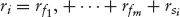
$$

对于市场和行业中性的投资组合，标准拟合模型残差中保留的是个股特有的成分。此外，个股特有的成分在短期内可能比其他成分更具可预测性。例如，无论今天整体市场情绪如何，一组相关股票的相对位置（价值）可能与昨天相似。在这种情况下，基于"去市场化"收益率预测构建的投资组合仍然可能产生正收益。

一个简化的示例可能有助于传达这个概念的本质。假设一个市场仅由两只大致等比例（市值、价值、价格）的股票组成。在 *t* 日，收益率可以表示为：

$$ <!-- validate-skip -->
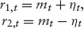
$$

在这种情况下，因子模型仅包含一个成分，历史数据分析将揭示市场本质上是两只成分股的平均值。（更一般地，不同股票对因子有不同的暴露——*mt* 会以加权形式出现在方程中——但权重与因子定义密切相关，如前所述。）在这种情况下，个股特有的收益率对每只股票幅度相同，但符号不同。现在，如果这个量 *η*t 可以比随机猜测更好地预测，那么无论市场收益率的模式如何，做多股票1并做空股票2（当 *η* 为负时反之）的投资组合平均而言将产生正收益。

在更现实的情况下，只要进行了大量交易且去因子化收益率模型（可以是EWMA、自回归等）具有一定的预测能力，交易策略就应该盈利。使交易取决于预测收益率的大小并优化选定投资组合的风险应能改善收益/风险表现。

因子分析的代数细节和去因子化收益率模型的构建简要概述见第3.10节。

#### 去因子化收益率的操作性构建

因子载荷/暴露必须定期更新，以维持对预测（以及交易）性能的合理预期。由于统计因子直接反映股票价格历史中（假定的）结构，发现该结构是动态的也就不足为奇了。从过时的数据估计因子关系很可能产生预测性能不佳的结果。因子更新频率的选择，与之前提到的类似动态模型元素一样，是研究者技艺的问题。季度或半年修订周期是常用的。

去因子化收益率必须使用最近的*过去*载荷估计集计算，*而不是*同时期的载荷集，以确保去因子化收益率序列始终是在样本外去因子化的。虽然这对模拟结果不利，但对策略实施至关重要。对此公认事项口惠而实不至很容易，但在复杂的模型或估计程序中忘记它也很容易。

可以考虑DLM的推广——动态模型，使模型参数每天根据结构方程修订，但在20世纪80年代末，额外的计算复杂性没有被证明是合理的。如今不存在这种计算顾虑，动态因子模型已出现在统计文献中，并应用于股票价格预测。对于这些复杂模型，极易且诱人地允许很大的灵活性，不知不觉地走上了一条模型几乎只是在跟随数据的道路。不止一位管理者最终沦为这种诱惑的牺牲品，优化到毁灭。

### 3.6.3 预测模型

在完成构建每只股票去因子化收益率时间序列的所有必要工作后，建模者仍面临构建这些收益率预测模型的任务。这并不意味着回到起点，因为那意味着去因子化的理由是无效的。尽管如此，如前所述，人们面临着预测模型构建的任务。例如，可以考虑自回归模型。注意，协整模型在这里可能价值不大，因为共同因子在去因子化过程中被假定已移除。

可以考虑许多扩展。例如，因子估计在粒度远大于一天的时间尺度上可能更稳定。

可以考虑为因子序列构建预测模型并预测这些序列的自然替代方案。然而，这不会取代去因子化收益率的预测：在前一节的简单示例中，因子预测等价于预测 *mt*（或其累积版本）。去因子化成分仍然存在。

在这个收益率预测的考虑中产生的一个未回答的问题是：*k*日累积股票收益率与 *k* 日因子估计之间是什么关系？从前面的讨论，另一个相关的考虑是：如果如假设的那样，市场因子比去因子化成分更不稳定，那么预测将不那么有用（在交易这些预测会产生更波动的结果的意义上）。这些考虑表明，因子预测是收益率利用的次要任务（在有效去因子化模型的语境下）。然而，因子预测模型——无论是否为去因子化结构收益率模型——在监控市场结构变化和识别此类变化的性质和程度方面是有用的。

## 3.7 随机共振

有了对价差或股票价格时间动态的基于模型的理解，还有另一个关键环节，分析可以在此展示利用可能性。考虑一个可以被描述为爆米花过程（Popcorn Process）的价差：偶尔价差偏离其（时间上的局部）"正常"值，随后在相当明确定义的轨迹上回到该常态。正常水平并非恒定。当不受某种运动诱发力量（如大宗交易）的影响时，价差围绕局部平均值漫游，时高时低。这种运动在很大程度上是随机的——至少在当前语境下可以满意地被视为随机的。知道一旦价差"回归"到其均值，此后将围绕该均值表现出基本随机的变化，这意味着均值回归退出规则可以从基本的"当预测为零时退出"修改为"在零预测的另一侧略过交易入场点退出"。这里的"略过"是通过分析价差在起飞（上行或下行）前围绕均值漫游的近期波动范围来校准的。波动率预测模型，如GARCH、随机波动率或其他模型，可能对此任务有用。

"静止噪声"现象——刚举例说明的围绕局部均值的随机漫游——被称为随机共振（Stochastic Resonance）。

在阅读上述描述时，你可能有一种似曾相识的感觉。对零预测活动期间围绕均值变化的建模描述，与价差整体变化的总体描述完全相同。根据Benoit Mandelbrot的说法，这种自相似性（Self-similarity）贯穿自然界，他发明了称为分形（Fractals）的数学分支来研究和分析此类模式。Mandelbrot（2004）认为，分形分析为理解金融工具价格运动提供了比当前数学金融文献中任何模型都更好的模型。目前尚不清楚是否有使用分形分析构建的成功交易策略；Mandelbrot本人认为他的工具还不够成熟，不足以用于预测金融序列。

## 3.8 实务要点

股票价格运动的预测极其不准确。请牢记这一信息，特别是如果你已完成标准的统计回归分析入门课程。传统说法宣称，如果R平方（R-square）低于70%，回归模型就不太有用（某些统计学家会说毫无用处）。如果你没有上过这门课且不知道R平方是什么，没关系：继续读。传统说法没有错，只是不适用于我们在此关注的情况。现在，观察到你的周收益率回归产生的拟合R平方为10%或更低，振作起来！

成功利用不太准确的预测的关键是，方向预测正确的时间略多于50%（假设上涨和下跌预测同样准确）。^(1) 如果一个模型做出正确方向预测的概率为(50 + ε)%，那么每笔交易的净收益为(50 + ε) − (50 − ε)% = 2ε%。如果能进行足够数量的交易，这个净收益就可以实现。后一条注意事项至关重要，因为平均值作为业绩指标只有在总体上才是可靠的。

保证2ε%的交易是策略的净结果本身不足以保证盈利：这些交易必须覆盖交易成本。请记住，净收益必须覆盖的不是平均交易成本，而是所有交易的总成本除以净盈利交易的较小百分比。例如，如果我的模型51%的时间获胜，那么净收益为51 − 49 = 2%的交易。因此，平均每100笔交易中有51笔赢家和49笔输家。每100笔交易净赚2笔。这是统计上保证的。但我参与的费用是所有100笔交易的费用，而不仅是净赚的2笔。因此，我2%的保证净赢家必须覆盖全部100%交易的成本。

统计预测模型能做的远不止简单地预测方向。它们还能预测幅度。例如，考虑周收益率的一阶自回归模型：下周收益率的大小被显式预测（作为上周收益率的分数）。如果估计的统计模型有任何有效性，那么这些幅度可以用来改善交易选择：忽略小于交易成本的预测。做预期收益低于交易成本的交易没有意义，对吧？

那么，我们讨论的所有那些预测不准确性呢？

如果预测平均而言还可以但个别时很差，我们怎么能依赖个别预测来筛选出预期收益低于交易成本的交易呢？我们不会丢弃那些结果极为有利可图的交易吗？不会接受那些收益低于成本的交易吗？

确实会。再次说明，频率论点在这里是相关的。平均而言，被丢弃为成本后无利可图的交易集合，其预期收益低于交易成本。同样，平均而言，保留的交易集合，其预期收益高于交易成本。因此，统计上保证的净盈利交易的预期收益高于交易成本。^(2)

## 3.9 加倍：更深层次的视角

在对技术模型进行深入讨论之后——即使在本章有限的描述层面上——很容易被诱惑而忘记模型是错误的。有些是有用的，这就是我们使用它们的语境。在应用模型时，一项具有信号紧迫性和重要性的活动是误差分析（Error Analysis）。模型在哪里以及如何失败，揭示了可以改善的弱点和可能发现的改进。

在[第2章](ch02.md)中，我们引入了"规则3"，一种在价差变得足够大时加倍下注的方案。这个想法源于在已制定的模型（规则1或2）的语境下观察到的价差模式——这是误差分析，尽管规则的提出基于目测数据而非正式统计建模，带有准非正式性。

对于更复杂的模型，目测分析不可行。那么必须显式关注模型交易的结果，无论是实际中（有资金风险）还是合成地（使用模拟）。除了比较预测收益与结果的标准做法外，还可以检查交易结果从建仓到平仓的轨迹。在价差加倍的例子中，原始交易累积收益的典型轨迹是J曲线（J Curve）：初始亏损随后恢复，然后（加倍阶段）积累利润。任何模型的交易分析，无论复杂程度如何，都可以揭示此类演化模式，从而为策略增强（如加倍）提供原材料。

注意，在本分析中，揭示机会的是交易的动态，而非建仓和平仓条件的识别。动态——交易的和其他的——是本书反复出现的主题。虽然最终结果才是进入银行和投资者报告的内容，但结果产生的动态对于识别问题和机会至关重要。从向投资者解释月度收益率变异性的角度来看，当交易跨越日历月末边界时，它们也很重要。

图3.9展示了典型的三类交易累积收益轨迹：(a) 从交易开始到平仓的收益；(b) 从开始到交易取消的亏损；(c) J曲线——初始亏损后恢复和盈利。对每类交易集合的分析可以揭示策略改进的可能性。想象一下，如果发现了交易信号之前的价格和成交量历史的明显特征，能将潜在交易分为这三类，你会怎么做。^(3) 想象一下。

**图3.9 典型的交易累积收益轨迹

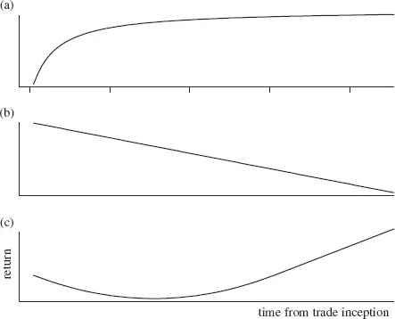

## 3.10 因子分析入门

以下材料基于Sir Maurice Kendall、Alan Stuart和Keith Ord所著《高级统计理论》（The Advanced Theory of Statistics）第3卷第43章中对因子分析的描述（现称为*Kendall's Advanced Theory of Statistics [KS]*）。符号在KS的基础上做了修改，使矩阵用大写字母表示。因此，KS中的 *γ* 在此为Γ。这使全书用法一致。

假设有 *p* 只股票，其收益率由 *m < p* 个不可观测因子的值线性决定：

$$ <!-- validate-skip -->
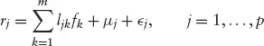
$$

其中ε是误差项（观测误差、模型残差结构）。系数 *l* 称为*因子载荷*。变量均值 *μ*j* 通常在分析前被减去。在我们的情况下，假设收益率均值为零，因此 *μ*j* = 0。用矩阵形式表示：

$$ <!-- validate-skip -->
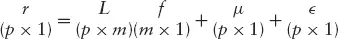
$$

其中 *L* 是系数 {*lij*} 的 *p × m* 矩阵。（注意该表达式针对一组观测值；即某一天 *p* 只股票的收益率集合。）现在假设：

1. *f* 是独立的标准正态变量，均值为零，方差为1

2. 每个 *ε*j* 独立于所有其他 *ε* 和所有 *f*，且具有方差（或*特殊方差*）
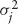

由此可得：

$$ <!-- validate-skip -->
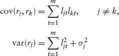
$$

这些关系可以用向量/矩阵形式简洁地表示为：

$$ <!-- validate-skip -->
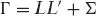
$$

其中 Σ 是 *p × p* 对角矩阵 diag(
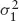
, . . .
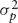
)。

从数据中，我们观察到Γ的经验值。目标是确定因子数量 *m*，并估计 *L* 和 Σ 中的常数。*m* 的确定高度主观；类似于选择主成分分析中的成分数。事实上，PCA经常被用来获得 *m* 的初始估计，然后可以通过似然比检验和 *m* 因子模型的残差分析来精炼。在下文中，假设 *m* 是固定的。

在某些情况下，关注的是样本中特定日期的隐含*因子得分。即，给定日期 *t* 的收益率 *r,t* = *(r1,t*, . . . , *rp,t*)′，*m* 个因子的隐含值 *f,t* = *(f1,t*, . . . , fm,t*)′ 是什么？如果 *L* 和 Σ 已知，*f,t* 的广义最小二乘（Generalized Least Squares）估计通过最小化以下目标函数获得：

$$ <!-- validate-skip -->
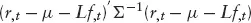
$$

注意，均值收益率向量 *μ* 假设为零。（回忆 *μ*j* 是股票 *j* 的平均收益率；*μ* 不是日期 *t* 的平均股票收益率。）最小化的解为：

$$ <!-- validate-skip -->
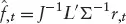
$$

其中
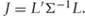
在实践中，*L* 和 Σ 是未知的；用MLE估计值替代。

S.J. Press在《Applied Multivariate Analysis》第10.3节中给出了因子得分的替代估计量。（此处为保持一致使用我们的符号。）本质上，他假设误差协方差为零，模型重述为：

$$ <!-- validate-skip -->
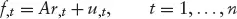
$$

其中时间 *t* 的因子得分是该时间股票收益率的线性组合。随后诉诸大样本近似得到估计量：

$$ <!-- validate-skip -->
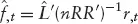
$$

### 3.10.1 去因子化收益率的预测模型

在第3.6节描述的模型中，关注的是去因子化收益率。对于日期 *t*，去因子化股票收益率集定义为观测收益率集与加权因子得分（权重当然是因子载荷）之差：

$$ <!-- validate-skip -->
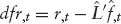
$$

这个去因子化收益率向量，对样本中每一天计算，提供了构建预测模型的原始时间序列。例如，在自回归模型中，股票 *j* 在日期 *t* 的回归条目为：

$$ <!-- validate-skip -->
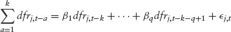
$$

该方程表明，到日期 *t* 的 *k* 日累积去因子化收益率回归到累积期前紧邻的 *q* 个日去因子化收益率上。注意回归系数在各股票间是共同的。

日期 *t* 末的 *k* 日前瞻累积去因子化收益率的预测构建为：

$$ <!-- validate-skip -->
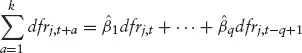
$$

其他预测模型也可以使用："各花各的钱，各担各的风险。"

> ^(1) 实际情况更复杂，而且对基金经理有利。收益和损失的对称性使得一个小偏差就能驱动成功策略的观点得以简单呈现；人们可以轻松承受会让医生做噩梦的相对赔率。一系列交易的实际结果由收益之和减去损失之和决定。一次大赢可以支付许多小亏。这一事实的意义在于引导管理者构建止损规则（从不符合预测预期的交易中尽早退出），在不限制收益的情况下遏制损失。在可以做到这一点的情况下，一个看似教科书级别相对赔率有利于获胜预测的模型，可以在规定的风险容忍度内实现盈利交易。技术上，此类规则通过采用预测模型仅为多个要素之一的程序来改变结果集的特征，从而修改模型的效用函数。

> 警告：小心被随机性故事的兜售者愚弄。一个通常产生小亏偶尔大赢的策略，当作为精心编织的灾难之网（似乎不可避免地跟随常规有利于获胜的赔率操作后出现）之后的慰藉提出时，听起来很诱人。在描绘了这些灾难之后，以低风险（小亏损）和高收益潜力为特征的替代方案被提供为安慰。这是对稻草人说服技巧的巧妙运用。或者，如Huff所说的统计操纵（Statisticulation）。

> 一位文字大师编织了一个令人印象深刻的故事，讲述不可逃避的厄运，运用无可挑剔的概率计算。然后，砰！蝙蝠侠用一个偶尔大赢（由容易承受的小亏损换取）的故事拯救了"我能做什么？"的一天。模式完全逆转。这不可能——可能吗？——但立即驱散了厄运。相反的模式必然产生相反的情感。喜悦！

> 现在说说那些小亏损。大量的小亏损。把那些小亏损加总，发现在蝙蝠侠惊喜出现之前的漫长时间里被无耻省略的（哦，我是说不经意间隐藏在细节中的）大额累积亏损。那么我们真正得到了什么？在不可避免的灾难取代之前有几段快乐时光，取而代之的是延长的、引发溃疡的消极、沮丧、绝望，以及（如果你能等待的话）*可能的正名！这仍然是一个不确定的游戏。只是规则不同。

> 随机性有很多种。

> ^(2) 回忆脚注1，关于通过施加交易配给（止损）规则来改善预测模型的结果。此类程序增加了根据预测模型进行的交易的平均收益，因此人们可能从机会集中多挤出一点，意识到收益偏差可以将一些原始亏损交易（那些平均收益低于交易成本的交易）转化为盈利交易。微妙而精妙。另见第3.7节关于随机共振的讨论。

> ^(3) 这类研究在地震学中受到了相当多的关注，预测地震仍然是几个国家的研究重点，最近因2004年12月印度洋海啸超过20万人的死亡人数而备受瞩目。统计套利
