# [第4章](ch04.md) 回归定律

*Now here, you see it takes all the running you can do, to keep in the same place.

—Through the Looking Glass, Lewis Carroll

## 4.1 引言

本章开始一系列四次理论探讨，研究统计套利（Statistical Arbitrage）所利用的价格运动的理论基础。第一个结果在本章提出，是一个简单的概率定理，它揭示了一个基本定律，保证了在有效市场中价格回归（Reversion）的存在性。在[第5章](ch05.md)中，我们将澄清关于重尾分布（Heavy-tailed Distribution）下价格回归可能性的常见混淆。总之，任何分布源都支持回归。在澄清之后，我们在[第6章](ch06.md)讨论股票间波动率的定义与度量，这种波动是回归主要发挥作用的变量。最后，在本理论系列的[第7章](ch07.md)，我们给出一个理论推导，说明交易一对股票时可以预期多少回归。

这四章共同论证并量化了在理想（非*理想化）市场条件下统计套利的机会。这些内容并非理解本书其余部分所必需，但掌握它将有助于读者理解那些已在公共领域实际上消除统计套利学科的市场演变所产生的影响。

## 4.2 模型与结果

我们提出一个预测金融工具价格的模型，保证 75% 的预测准确率。所选的设定是对一对股票每日价差范围的预测，但稍加思考就会发现其适用性要广泛得多。具体来说，我们关注的是预测明天的价差是大于还是小于今天的价差。

模型非常简单。如果今天的价差大于预期平均价差，则预测明天的价差将小于今天的价差。反之，如果今天的价差小于预期平均价差，则预测明天的价差将大于今天的价差。

### 4.2.1 75% 法则

上述模型形式化为概率模型如下。定义一列同分布、独立的*连续随机变量 {*Pt*, t = 1, 2, . . .}，支撑集（Support）为非负实数线，中位数（Median）为 *m。则：

$$ <!-- validate-skip -->
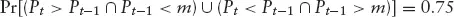
$$

在启发性价差问题的语言中，随机量 *Pt* 是第 *t* 天的价差（一个非负值），各天被视为独立的。概率陈述中包含的两个复合事件直接对应于上述非正式预测模型中指定的操作。但关于每个事件的细节需要说明一点。至关重要的是要注意，每个事件是一个合取（*and），而非条件（*given that），后者可能最初被认为是表示非正式模型*if–then（如果–则）性质的合适方式。非正式模型是对将要采取的操作的描述；我们感兴趣的概率是这些操作（预测）正确的概率。因此，着眼于预期表现，我们想知道在*同时*前一天的价差未超过中位数值的情况下，某一天的价差超过前一天价差的频率。同样，我们想知道在*同时*前一天的价差超过中位数的情况下，某一天的价差不超过前一天价差的频率。

这些区分可能看起来晦涩难懂，但正确理解对于正确评估策略的预期结果至关重要。假设在十天中有八天价差恰好等于中位数，则该方案只在 20% 的时间进行预测。这种理解直接来源于合取/析取的区别。如果理解错误，方案的预期收益与实际收益之间的比例将达到五比一。

操作上，一旦今天的价差确认（收盘），就可以对明天价差的结果下注。在观察到价差大于中位数的那些天，对明天的押注是明天显示的价差将小于今天观察到的价差。在这种方案中获胜押注的比例是条件*given that概率：

$$ <!-- validate-skip -->
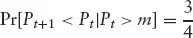
$$

同样，反向押注在四分之三的情况下会获胜。这是否意味着我们"赢了 1.5 倍"？那真的就成了统计套利了！遗漏的考量是条件事件发生的相对频率。根据中位数的定义，*Pt* < *m 发生一半时间。因此，我们将有一半时间押注价差相对于今天下降，这些押注中四分之三将获胜。另一半时间我们将押注价差相对于今天上升，这些押注中同样有四分之三获胜。因此，在所有押注中，四分之三将获胜。（在前面的说明中，条件事件仅在 20% 的时间发生，结果为
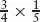
 或
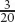
。）

在继续证明该结果之前，注意连续性的假设至关重要（因此在模型陈述中加以强调）。可以简单证明该结果对离散变量不成立（见本节最后部分）。

### 4.2.2 75% 法则的证明

该结果的证明使用几何论证来促进对问题结构的可视化。额外的好处是人们可以看到定理中作出的某些结构性假设可以被放宽。这些放宽将在基本结果证明之后讨论。

考虑序列中两个连续项 *P*t−1 和 *P*t 的联合分布。假设独立性，该联合分布的等高线（Contour）关于线 *P*t = *P*t−1 对称，*无论底层分布的具体形式如何。特别地，*不需要假设分布具有对称密度函数。

考虑图 4.1。联合分布的定义域（ℜ^(2) 的正象限，包括零边界）在中位数点处沿两个维度被划分。根据中位数的定义，如此构造的四个象限各代表联合分布的 25%。

**图 4.1 *Pt* 和 *P*t−1 的联合分布定义域

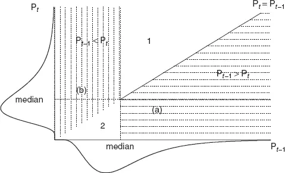

左下和右上象限被对称轴从联合中位数径向平分。现在，密度等高线的对称性——源于独立、相同的边际分布——意味着每个象限的两部分覆盖相同的总概率。因此，每个半象限占总联合概率的 12.5%。

证明的其余部分包括在图上识别对应于前述概率陈述中并集的区域。这显然是阴影区域 (a) 和 (b) 的并集，即联合分布中除去未阴影区域 (1) 和 (2) 的定义域。如上段所示，后一区域各占总联合概率的 12.5%。因此，区域 (a) 和 (b) 的并集恰好代表四分之三的联合概率。

此时值得指出，我们没有分解左上或右下象限。幸运的是，没有必要这样做，因为一般情况没有特定结果。

### 4.2.3 75% 法则的解析证明

给出几何论证的目的是便于理解下一节将提出的定理推广。在进入该节之前，我们用解析方法建立结果。令 *X = *P*t，*Y = *P*t−1 以简化符号。两个事件：

$$ <!-- validate-skip -->
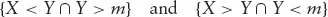
$$

是互斥的（从 *Y > *m 和 *Y < *m 不能同时发生这一事实很容易看出：在图上，区域 (a) 和 (b) 不重叠），因此析取的概率就是各个概率之和。考虑析取的第一部分：

$$ <!-- validate-skip -->
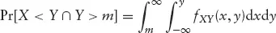
$$

其中 *fXY*(*x, *y) 表示 *X 和 *Y 的联合密度函数。根据独立性假设，联合密度就是各个边际密度的乘积，在本例中边际密度相同（同样基于假设）。用 *f(.) 通用地表示边际密度，用 *F(.) 表示其对应的分布函数，继续如下：

$$ <!-- validate-skip -->
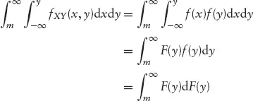
$$

最后一步只是认识到随机量的密度函数是相应分布函数的解析导数。其余步骤是显然的：

$$ <!-- validate-skip -->
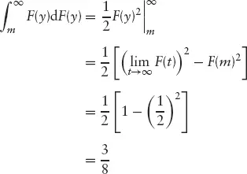
$$

对于析取的第二部分，经过初始代数简化后，结果从类似的论证得出。首先注意事件 *Y < *m* 可以表示为两个互斥事件的并集：

$$ <!-- validate-skip -->
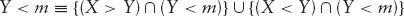
$$

根据定义（回忆 *m 是分布的中位数），事件 *Y < m 的概率为二分之一。因此，利用互斥事件概率可加的事实，我们可以写出：

$$ <!-- validate-skip -->
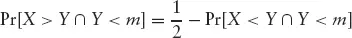
$$

现在，类似于第一部分的过程：

$$ <!-- validate-skip -->
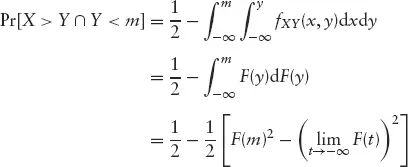
$$

$$ <!-- validate-skip -->
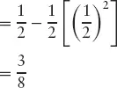
$$

将两部分的概率相加即得结果。

### 4.2.4 离散反例

考虑一个仅取两个不同值 *a 和 *b 的随机变量，概率分别为 *p 和 1 − *p。只要
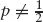
，随机变量超过中位数的概率也不等于二分之一！尽管有这一小怪异，检查构成定理陈述的两个事件的概率：

$$ <!-- validate-skip -->
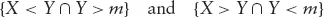
$$

在离散示例中，这些事件具体为：

$$ <!-- validate-skip -->
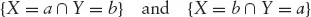
$$

它们的概率均为 *p(1 − *p)，因此定理中的概率为 2*p(1 − *p)。该概率能取的最大值为
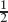
 当 *p =

（求导、令其为零、求解）。

### 4.2.5 推广

金融时间序列因顽强地拒绝揭示底层数学结构而臭名昭著（尽管 Mandelbrot, 2004 可能对此说法有异议）。此类数据的特征常出现在统计建模中，包括：非正态分布（收益率常表现为尖峰厚尾，Leptokurtosis）；非常数方差（市场动态常产生高波动率和低波动率的爆发，建模者尝试了从 GARCH 及其变体到 Mandelbrot 分形等多种方法，见[第3章](ch03.md)）；以及序列依赖（Serial Dependence）。定理的条件可以放宽以适应所有这些行为。

该结果可直接推广到任意连续随机变量：不需要支撑集限制在非负实数线上的约束。在几何论证中，密度轴不需要显式缩放（零原点便于说明）。在解析论证中，回想我们没有限制密度的支撑区域。

注意，如果底层分布具有对称密度函数（意味着支撑集是整个实数线或有限区间），则关键点是密度的期望值（均值），*如果它存在的话。柯西分布（Cauchy Distribution）有时适合建模每日价格变动，它没有定义的期望值，但它有中位数，且所述结果成立。

75% 法则对非常数方差的扩展见第 4.3 节。

独立性假设可直接放宽：从几何论证来看，只需要联合分布的等高线对称即可。因此，定理中的独立性条件可以替换为零相关性（Zero Correlation）。解析处理及示例见第 4.4 节。

最后，对非常数方差情况的论证推广，使得价差分布可以每天都不同，只要满足某些频率条件即可。详见第 4.5 节。

## 4.3 非均匀方差

假设价差每天独立地从给定分布族中的一个分布生成。分布族是固定的，但某天用于生成价格的具体成员是不确定的。族成员仅通过方差区分。实现的方差序列的性质现在决定了关于价格序列可以得出什么结论。

如果方差逐日表现出独立的"随机"值会怎样？那么价差看起来就像不是从原始族的某个成员中抽取，而是从族的所有成员的平均中抽取，该平均是对可能方差的相对频率进行的。换句话说，第 *t* 天的价差不再从给定 σ 的 *F 生成，而是从积分分布生成：

$$ <!-- validate-skip -->
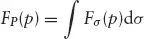
$$

例如，假设方差条件分布族是正态族（在此上下文中具有恒定均值），方差随机出现，仿佛从逆 Gamma 分布（Inverse Gamma Distribution）生成；那么价差看起来就像由 Student *t 分布生成的。结果的关键在于随机性；它（在概率上）保证每日转换看起来*仿佛*底层价差模型是 Student *t 分布。（这一点在第 4.5 节中扩展，其中类似的论证证明了逐日任意不同生成分布的情况。边际分布与时间序列值的关系的扩展讨论见[第5章](ch05.md)。）

因此我们可以声明，在非均匀方差序列的情况下，75% 法则仍然成立。

注意，价差的分布（给定方差条件下）和（无条件）分布的形式不必像前面示例中使用的数学上方便的形式。任何规则（在连续性方面"行为良好"）分布都会产生 75% 的结果。密度或分布函数不需要用封闭形式的数学表达式表示。

### 4.3.1 波动率爆发

自回归条件异方差（ARCH）模型（Engle, 1982）的引入是为了捕捉宏观经济数据中方差的聚集性。在过去几年中，ARCH 和 GARCH 模型在计量经济学和金融文献中被大量使用，后者是因为常被提及的波动率爆发现象。大多数此类爆发是从正常水平上升的波动率增加，通常与公司的坏消息相关。历史上，低波动率爆发较少出现。然而，自 2003 年初以来，美国交易所股票的波动率一直在下降。价差波动率在 2003 年和 2004 年达到了前所未有的低点；这一发展对统计套利的影响在[第9章](ch09.md)探讨。

当波动率表现出爆发时，方差不是每天独立生成的，而是表现出序列相关性。75% 法则仍然成立，理由是：在爆发期内，定理适用，如同情况是（近似）恒定方差。因此，只有转换日可能改变结果。这样的日子相对较少，因此结果将在非常接近的近似下成立。事实上，可以证明该结果严格成立：转换无关紧要——见第 4.5 节关于一般非常数方差情况的论证。[第5章](ch05.md)提供了相关模式的分析。

### 4.3.2 数值示例

图 4.2(a) 显示了从正态-逆 Gamma 方案生成的 1,000 个值的样本直方图：

$$ <!-- validate-skip -->
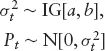
$$

首先，从逆 Gamma 分布（参数为 *a 和 *b——*a 和 *b 的具体规格不重要：任何非负值都可以）独立抽取一个
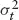
。然后，使用这个

 值，从均值为 0、方差为

 的正态分布生成 *P*t 的一个值。叠加在直方图上的是 Student *t 分布的密度函数，它是这里价差的理论边际分布。图 4.2(b) 显示了作为时间序列的样本。

**图 4.2 来自正态-逆 Gamma 模型的随机样本

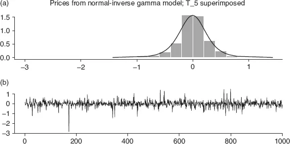

向中位数方向移动的一日移动比例为 75.37%，令人满意地符合法则。

## 4.4 一阶序列相关

该结果可以推广到相关变量的情况。考虑的最简单情况是对称密度函数的分布，因为此时等高线是圆形（不相关）或椭圆形（相关）。在后一种情况下，可以看到，通过沿等高线的长短轴将 ℜ^(2) 划分为象限，然后如前所述从联合中位数点径向平分这些象限，再次得到等概率区域。（回忆一下，对于对称密度，所有象限都以这种方式在概率上被平分，而不仅仅是旋转坐标中对应于左下和右上的象限。）剩余的任务是用随机量的正确陈述（类似于原始结果陈述的方式）来识别半象限。通过示例可以容易地看出结果。假设 *P*t 和 *P*t−1 具有协方差 *c。定义一个新变量为相关变量的线性组合，*Zt* = *a(Pt − r* Pt −1)。系数 *r 设为：

$$ <!-- validate-skip -->
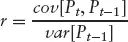
$$

（这只是 *P*t 和 *P*t−1 之间的相关系数），目的是使 *P*t−1 和 *Zt* 不相关；比例因子 *a 选择为使 *Zt* 的方差等于 *Pt* 的方差：

$$ <!-- validate-skip -->
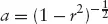
$$

现在定理适用于 *P*t−1 和 *Zt*，前提是 Zt* 与 *P*t−1 具有相同的分布，因此我们有：

$$ <!-- validate-skip -->
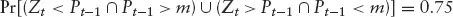
$$

将 *Zt* 代入，将表达式转换为涉及原始变量的形式：

$$ <!-- validate-skip -->
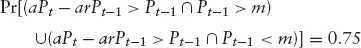
$$

项的重新排列给出所需表达式：

$$ <!-- validate-skip -->
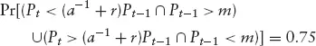
$$

显然，零相关（即 *r = 0 且 *a = 1）的情况是我们开始时的特例，是这个更一般结果的特殊情况。

边界
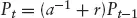
 以相关系数的大小决定的比例划分 ℜ^(2) 的象限。在不相关的情况下，象限如前所述被平分。图 4.3 显示了
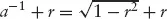
 与 *r 的关系。最大值
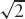
 出现在
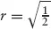
（通过通常的求导、令其为零、求解的解析过程容易证明）。

**图 4.3 *r 与
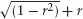
 的关系

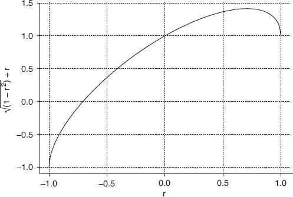

重要的是不要忽视此处论证中引入的额外约束。定理适用于相关变量，前提是具有所述边际分布的变量的线性组合保持该分布形式。这对正态变量、双变量 Student *t 变量和许多其他变量成立。但一般情况下不成立。

在 *Pt* 和 *P*t−1 完全相关（*r → 1, *a → ∞）的极限情况下，结果失效。失败是由奇异性引起的，因为原始的两个自由度（两个不同的天或观测值）塌缩为一个自由度（两天约束为具有相同价格，因此定理的回归陈述是不可能的）。

### 4.4.1 解析证明

向中位数方向移动的频率由以下概率给出：

$$ <!-- validate-skip -->
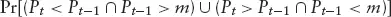
$$

考虑析取的第一部分：

$$ <!-- validate-skip -->
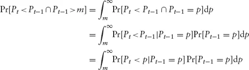
$$

此处符号使用为了强调逻辑。对于连续量，写 Pr[*P*t−1 = *p] 是不正确的，因为量取任何特定值的概率为零。正确的表达式是在 *p 处求值的密度函数：

$$ <!-- validate-skip -->
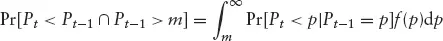
$$

注意，当 *Pt* 和 *P*t−1 独立时（第 4.2 节考虑的情况），条件累积概率（第一项）简化为无条件值 Pr[*P*t < *p]。

为了简化结果推导中剩余部分的符号，令 *X 表示 *Pt*，*Y 表示 *P*t−1。则感兴趣的概率为：

$$ <!-- validate-skip -->
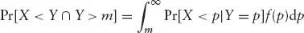
$$

将条件累积概率
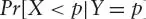
 展开为条件密度的积分，得到
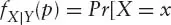

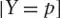
：

$$ <!-- validate-skip -->
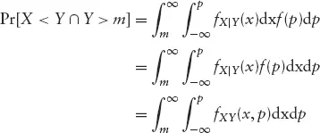
$$

其中 *fXY*(. . .) 表示 *X 和 *Y 的联合密度函数。现在，使用：

$$ <!-- validate-skip -->
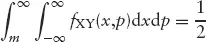
$$

（因为内层积分简化为 *X 的边际密度，根据中位数的定义，外层积分恰好是二分之一），并且注意：

$$ <!-- validate-skip -->
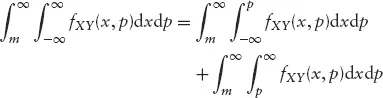
$$

立即可得：

$$ <!-- validate-skip -->
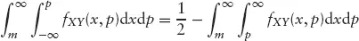
$$

这看起来像是无关的旁支，但实际上它将证明推进到了完成前的两步。此时，我们利用联合密度的对称性（这源于相同边际分布的假设）。形式上，对称性的表达式为：

$$ <!-- validate-skip -->
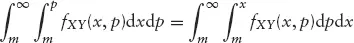
$$

现在，反转积分顺序（小心注意积分限）得到代数等价性：

$$ <!-- validate-skip -->
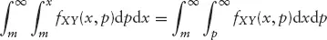
$$

因此：

$$ <!-- validate-skip -->
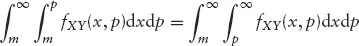
$$

倒数第二步，注意后两个积分的和为四分之一（再次根据中位数的定义）：

$$ <!-- validate-skip -->
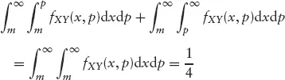
$$

因此：

$$ <!-- validate-skip -->
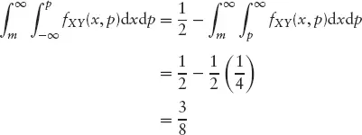
$$

析取第二部分的论证类似。

### 4.4.2 示例

#### 示例 1

从一阶自回归模型（First-order Autoregressive Model）生成了 1,000 个项，序列相关参数 *r = 0.71（见图 4.3 和第 4.4 节最后关于此选择的说明），随机项服从正态分布。图 4.4(b) 显示时间图；图 4.4(a) 显示样本边际分布。

**图 4.4 来自自相关模型的随机样本

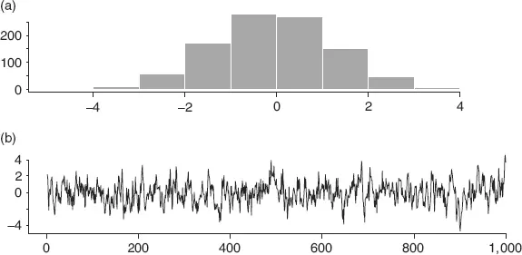

该序列表现出的回归性移动比例为 62%。

增加一点现实性，我们逐日估计中位数，将序列视为逐日观测。使用窗口长度为 10 的局部中位数调整序列的分析如图 4.5 所示。调整后的序列表现出稍高的回归性移动比例，为 65%。

**图 4.5 来自自相关模型的随机样本，局部中位数调整：(a) 直方图 (b) 时间序列

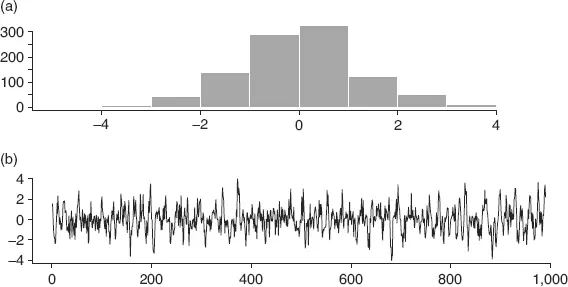

## 4.5 非恒定分布

假设价差在 100 天内从正态分布生成，随后在 50 天内从均匀分布生成。在每个时期内，基本定理都适用；因此，除一个例外，在 150 天内 75% 法则成立。假设在第 151 天，价格范围再次从正态分布生成。我们能说什么？

我们可以毫不含糊地说，在整个序列中，75% 法则平均成立。证明的关键在于两个转换日：（1）从正态到均匀，以及（2）从均匀到正态。回忆图 4.2。区域 1 在概率上有界，0 < Pr[(1)] <

，对于来自任意两个连续、独立分布的随机量（这里指的是概率 Pr[(1)] = Pr[(*Pt*, *P*t−1) ε (1)]）。这源于第 4.2 节所述中位数的定义。将此概率记为 *p。现在，区域 1 在象限中的补集的概率为

 − *p（"区域概率"的含义与之前相同）。转换是关键，因为只有当分布改变时，基本结果才受到质疑。实际上，不难证明该结果不成立。对于每个 *p >

 的转换（从正态到均匀就是一个例子），定理结果不是 75%，而是 100(1 − 2p)% < 75%。然而，对于每个这样的转换，反向转换表现出互补概率

 − *p，对应于区域 1。

类似的分析适用于区域 2。无论区域 2 的概率是否与区域 1 的概率相同——如果其中一个分布是非对称的，则不同——这一点都成立。

因此，如果转换成对出现，表现出的概率是平均值，因此 75% 的结果重新浮现。（如果两个密度都是对称的，则"成对"条件就足够了。然而，如果至少一个密度是非对称的，使得 Pr[(1)] ≠ Pr[(2)]，则转换对必须出现得足够频繁，以在统计上保证区域 1-2 中的对数与 1-1 或 2-2 相比很少。）

**图 4.6 来自混合正态、对数正态和 Student *t 分布的随机样本

可以进一步推理论证三种替代分布的情况，关键注意事项是三种不同的两两转换在两个方向上出现的频率相等。通过数学归纳法完成对任意数量替代分布的证明。

## 4.6 结果的适用性

经过几页的理论发展，最好暂停一下，问问"这对基于模型的股票交易有什么意义？"一个主要的起始假设是平稳性（Stationarity）——一个方便地未被触及、事实上未被提及的概念，到目前为止。我们要求价差是"独立、同分布的"（后来放宽条件允许序列相关）；隐含在时间序列上下文中的是平稳性。

现在股票价格序列不是平稳的。价差呢？它们通常也不是平稳的。然而，通过动态调整局部位置和方差的估计，可以对平稳性进行合理的近似。这里与协整（Cointegration）的概念有联系（见[第3章](ch03.md)）。在单个价格序列中可能难以发现结构，但序列之间的差异（价差）更容易产生可预测的关系。将协整的基本概念扩展到局部定义的序列（我们可能使用"局部协整"，Locally Cointegrated 的术语），识别了这种联系。

正是在这种有见识的、动态近似的精神下，理论结果具有指导性的有效性。

## 4.7 应用于美国债券期货

本章提出的定理，虽然由类似公司股票价格之间价差的讨论所启发（配对交易的经典配对），但具有更广泛的适用性。只要"价格"序列的条件得到合理满足，该定理就适用于任何金融工具。当然，困难在于满足条件——许多序列没有（如果不更多地关注随时间的结构发展——例如趋势发展）。债券价格确实很好地符合该定理。

对美国 30 年期国债期货进行了研究，使用简单的预测模型预测每日高低价范围的变化。考察了最近期合约（Front Future Contract），因为它最具流动性。（由于担心合约到期可能引起的扭曲，研究在最近期合约到期前 15 个工作日进行合约展期（Roll-over）后重复。分析中未观察到扭曲，因此报告了普通序列的结果。）图 4.7 显示了研究中使用的 1990–1994 年数据的样本分布——分布中存在明显的偏斜。时间图见图 4.8。

**图 4.7 美国 30 年期债券最近期合约高低价范围的边际分布

**图 4.8 美国 30 年期债券最近期合约每日高低价范围

在预测模型中，每天使用前 20 个工作日的数据估计中位数值。操作上，这种局部中位数计算是可取的，以最小化演变变化的影响。其中一个好处是减少了序列相关性：原始序列（相当于使用恒定中位数）在许多滞后处表现出 [0.15, 0.2] 范围内的自相关（Autocorrelation）；局部中位数调整后的序列没有显著的自相关。

预测练习的结果见表 4.1：它们与定理相当一致。

**表 4.1 美国 30 年期债券的实证研究

债券期货价格证实的结果在经济上是可利用的。在交易规则的实施性质上需要一些复杂性，特别是在管理交易成本方面，但有许多可能性。

## 4.8 总结

定理陈述的含义有点挑衅性：75% 的预测准确率仅在定理条件满足时才有保证。在实践中，证据表明许多股票价格和价差在短期内近似满足条件。此外，当变化发生时，变化率通常足够慢，以至于适当校准的动态模型（本章检查的示例中局部均值的表征）表现出类似于理论预测的回归结果。

美国 30 年期国债的实证证据表明，该市场也接近满足条件。当然，在 1990–1994 年的五年中，经验模型的准确率与 75% 没有显著差异。只要稍加巧思，许多看似违反定理条件的情况都可以被近似得相当接近。

## 附录 4.1：展望未来数天

假设没有持续的方向性运动（趋势），正如我们在理论发展中所做的，并在应用中通过局部位置调整来近似，如果可以考虑一天以上，显然有更大的回归机会。当然，关键在于*k* 天期间的*每一天都可以单独查看；如果只能查看 *k* 天的移动，则情况与一天的情况基本相同。当每天都可以考虑时，有多个（独立）获胜（回归）的机会，因此获胜概率增加。

图 4.9 显示了在接下来的 *k* 天内从当前位置向中位数方向移动的概率，*k* = 1, . . . , 20。根据定理，一天内发生此类移动的概率为 0.75。其他概率按二项分布（Binomial Distribution）计算，如下所述。该图还包括假设获胜概率为 0.25、0.35 和 0.5 的图形：在实践中，由于定理假设的违反，在最佳条件下观察到的值也会低于 0.75。

**图 4.9 在接下来的 *n* 天内至少发生 1 次"获胜移动"的概率

根据假设，价格每天独立。定理指出，从当前位置发生回归性移动的概率对*任何一天都是 0.75。因此，从第 *t* 天的价格发生回归性移动到第 *t + *1 天的概率为 0.75，到第 *t + *2 天的概率也为 0.75，无论第 *t + 1 天发生什么（这是独立性假设），依此类推。因此，接下来 *k* 天中从今天价格显示回归的天数是一个二项量，参数为 *k*（试验次数）和 0.75（每次试验成功的概率）。图中显示的概率为：

$$ <!-- validate-skip -->

$$

当独立性约束放宽时，二项结果不再有效，其偏差是序列时间结构的函数。当该结构是简单的趋势时，展望的时间越远，二项概率就越不准确。通过适当关注预测函数的结构形式可以恢复准确性：添加估计的趋势成分。
