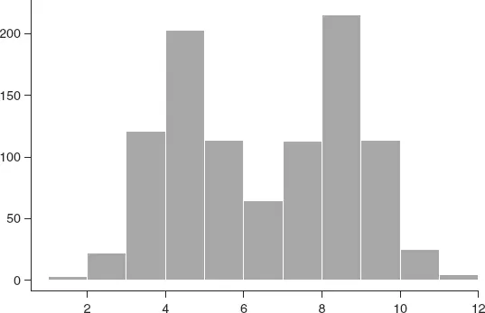
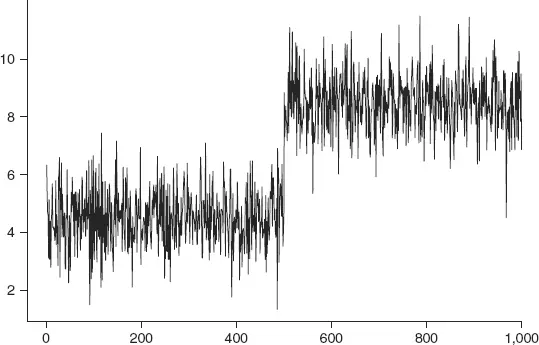
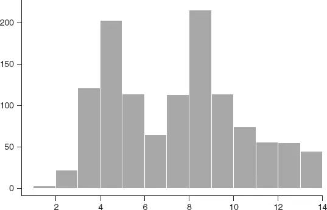
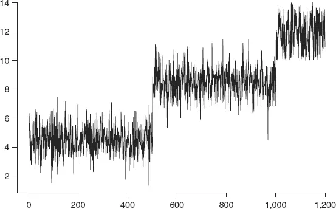
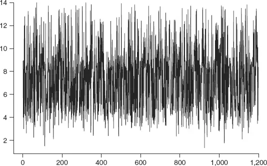
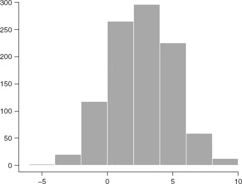
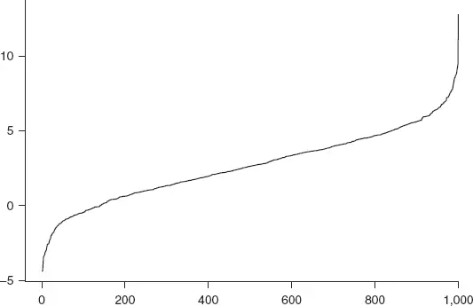

# [第5章](ch05.md) 高斯不是回归之神

*与其精确地犯错，不如粗略地正确。*

—J.M. 凯恩斯

## 5.1 引言

我们先来看两段引文：

名义利率的分布表明利率不存在均值回归（Mean Reversion），其结构也不符合正态分布（Normal Distribution）。

相比之下，实际利率（Real Interest Rates）似乎呈正态分布。该分布表明利率具有均值回归的特征。

这两段引文均来自一家大型、成功的华尔街公司若干年前的研究报告，其中包含逻辑上的谬误。文中没有明确定义"均值回归"的含义，因此读者可能会将通过收益率边际分布（Marginal Distribution）描述的回归视为隐式定义。但如果是这样，作者所讨论的就不是普遍理解的均值回归概念。

第一个论断是错误的，因为无论边际分布呈现何种形状，时间序列都可以具有均值回归特性。[第4章](ch04.md)中的75%定理（75 Percent Theorem）已经明确证明了这一点。请注意这里的限定词：*可以*。仅仅观察时间序列的边际分布，并不足以对该序列是否具有均值回归特性做出正确判断。这就是为什么第二个论断同样是错误的。一个时间序列完全可能远离均值回归——嗯，几乎是——同时又表现出正态的边际分布，正如本章最后一节所展示的那样。

均值回归从定义上涉及时间动态：边际分布中数据、样本出现的顺序才是关键因素。

## 5.2 单峰与双峰

本章开头提到的那份报告展示了一张自1953年以来十年期国债收益率的直方图（Histogram），出现在一个名为"双峰分布"的章节中。报告声称，呈现如此明显非正态边际分布的时间序列不可能具有回归性。尽管标题的意象如此，实际上直方图中存在多个峰值。然而，要证明一个具有极显著双峰分布（Bimodal Distribution）的回归时间序列，仅需展示一个例子即可。图5.1展示了一个混合随机样本：500个来自均值为4.5的正态分布的值，以及500个来自均值为8.5的正态分布的值（两者标准差均为1）。这两个位置的选取参考了债券收益率分布的主要峰值；它们对演示本身并不关键。

图5.2展示了这1,000个点的一种可能的时间序列。从第1天起，这个序列表现出多大程度的回归？非常显著。分别考虑每个区段。取任一区段中远离该区段均值（第一段为4.5，第二段为8.5）的任意一个点。需要经过多少个点，时间序列才会表现出更接近该区段均值的值？通常只需一两个。该序列从未偏离区段均值后一去不返；相反，它不断穿越均值——这几乎就是回归的定义。一个名副其实的爆米花激荡过程！

这引出了一个需要思考的问题：单一变点（Change Point）的影响——即从第一区段到第二区段的过渡，其中区段均值增大。时间序列中的一次均值偏移会破坏均值回归的特性吗？只有当该过程必须回归到全局均值（Global Mean）时才会如此——那将是对均值回归的一种异常严格的解释；在时间序列的语境中，这种解释既无益又具有误导性，在评估必然以时间序列、顺序方式出现的交易机会时同样具有误导性。假设原始数据为日度数据。那么在头两年，即组合序列的第一段中，数据无疑会被描述为均值回归。在均值上升后不久，同样的结论也会被承认，尽管序列回归的均值有所提高。此后又是两年出色的向（新）均值回归。那么，在通过最基本可描述的均值回归策略获得了极为丰厚的利润之后，有人怎能仅凭日度数据的边际分布，就宣称该序列不是均值回归的呢？

**图5.1 边际分布：一半 N[4.5,1] 与一半 N[8.5,1] 的混合分布**

**图5.2 图5.1所示样本的时间序列实现**

报告提出的第二个分布方面的疑虑是，债券数据分布具有显著的右尾（Right Tail）。这一特征对于均值回归特性而言实际上是无关紧要的。图5.3展示了1,200个点的直方图：其中1,000个来自前述示例的正态混合分布，另有200个均匀随机分布在区间[10,14]上。图5.4展示了这1,200个点的一种可能的时间序列：这个序列表现出多大程度的回归？再次非常显著。前两个区段如前所述具有均值回归特性。那么最后一个区段呢？这些点来自均匀分布（Uniform Distribution）而非正态分布的随机样本，因此按照报告的说法，该时间序列不可能是均值回归的。从图上看，你同意吗？如果你同意，我很想跟你打个赌！

**图5.3 具有厚重右尾的边际分布**

**图5.4 图5.3所示样本的时间序列实现（按底层抽样分布排序）**

有人可能会合理地指责这些例子是人为构造的。真实的时间序列不会呈现如此方便的分段。这一点不可否认。但这也不是问题所在。图5.5展示了图5.3中随机样本的另一种可能实现。它是通过从原始1,200个样本中无放回地随机选取数值，并按选取顺序绘制而得。它表现出多大程度的回归？非常多。仅凭目测你难道不同意吗？

**图5.5 图5.3所示样本随机重排后的时间序列实现**

时间序列的边际分布是单峰（Dromedary）还是双峰（Camel），对于均值回归而言真的无关紧要。重申：时间结构才是关键特征。

### 5.2.1 干涸河流

骆驼以其对干旱地区生活的非凡适应能力而著称，进化赋予的双重关键能力是：身体像海绵一样吸收水分，以及滴灌式地利用这些水分。干涸河流——即那些有明显时段没有水流的河流——在干旱地区很常见（也常常是骆驼的水源补给）。观察一条干涸河流的径流时间序列，人们很难否认该序列是回归性的。无论在雨季偏离多远，该序列总是回归到零。

干涸河流径流的典型边际分布是什么？显然它是非常不对称的。因此，完全无需借助数学形式化或严格证明，我们就有了一个证明：回归时间序列不必以对称的边际分布（如正态分布）为特征。

#### 钟声依然

长鸣。所谓Gamma分布（Gamma Distribution）通常是对干涸河流径流的良好近似（允许对零值做合理修正）。那么，一个高斯变量的平方服从卡方分布（Chi-squared Distribution），而卡方分布也是一种Gamma分布。这难道仅仅是巧合吗？

#### 但与回归无关

干涸河流径流的例子只是自明回归的一个特例。重申：*任何边际分布都可以被回归时间序列所呈现。

## 5.3 有些钟声轰鸣

一个具有正态边际分布的时间序列并不倾向于表现出均值回归。极端的偏离同样可能。图5.6展示了来自均值为2.65、标准差为2.44的正态分布的随机样本——这是所引分析中实际收益率数据的样本值。图5.7展示了该样本按大小顺序排列后作为时间序列的一种可能实现。从第1天起，这个序列表现出多大程度的回归？一点也没有。与我之前的例子一样，"不现实"或"数据点不会按[大小]顺序出现"的指责很容易提出。但这些指责无关紧要：无论图示多么风格化，所要论证的要点是——时间序列样本的正态边际分布并不能揭示该序列的时间特性，无论是回归还是其他任何特性。

**图5.6 来自 N[2.65, 2.44^(2)] 的1,000个点的随机样本**

**图5.7 图5.6所示样本的时间序列实现**

本章开头引文所在的论文——其内容在本文中受到批判性审视——未被列入参考文献列表。统计套利（Statistical Arbitrage）
